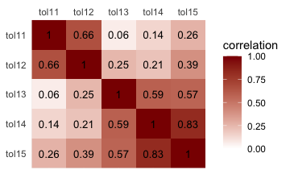
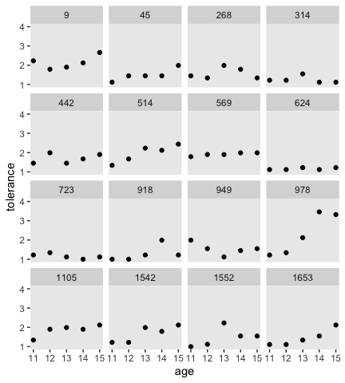
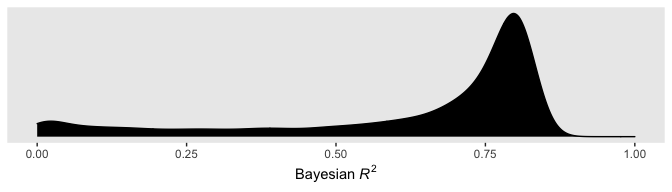
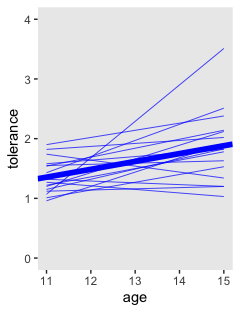
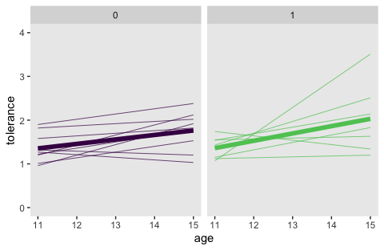
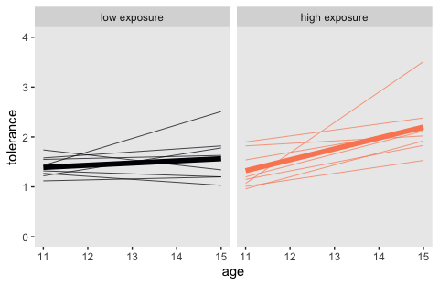

Chapter 2. Exploring Longitudinal Data on Change
================
A Solomon Kurz
2020-03-19

# Exploring Longitudinal Data on Change

> Wise researchers conduct descriptive exploratory analyses of their
> data before fitting statistical models. As when working with
> cross-sectional data, exploratory analyses of longitudinal data con
> reveal general patterns, provide insight into functional form, and
> identify individuals whose data do not conform to the general pattern.
> The exploratory analyses presented in this chapter are based on
> numerical and graphical strategies already familiar from
> cross-sectional work. Owing to the nature of longitudinal data,
> however, they are inevitably more complex in this new setting. (p. 16)

## Creating a longitudinal data set

> In longitudinal work, data-set organization is less straightforward
> because you can use two very different arrangements:
> 
> >   - *A person-level data set*, in which each person has one record
> >     and multiple variables contain the data from each measurement
> >     occasion
> 
> >   - *A person-period data set*, in which each person has multiple
> >     records—one for each measurement occasion (p. 17, *emphasis* in
> >     the original)

These are also sometimes referred to as the wide and long data formats,
respectively.

As you will see, we will use two primary functions from the
**tidyverse** to convert data from one format to another.

### The person-level data set.

Here we load the person-level data from [this UCLA web
site](https://stats.idre.ucla.edu/r/examples/alda/r-applied-longitudinal-data-analysis-ch-2/).
These are the NLY data (see [Raudenbush &
Chan, 1992](https://journals.sagepub.com/doi/10.1177/0022427892029004001))
shown in the top of Figure 2.1.

``` r
library(tidyverse)

tolerance <- read_csv("https://stats.idre.ucla.edu/wp-content/uploads/2016/02/tolerance1.txt", col_names = T)

head(tolerance, n = 16)
```

    ## # A tibble: 16 x 8
    ##       id tol11 tol12 tol13 tol14 tol15  male exposure
    ##    <dbl> <dbl> <dbl> <dbl> <dbl> <dbl> <dbl>    <dbl>
    ##  1     9  2.23  1.79  1.9   2.12  2.66     0     1.54
    ##  2    45  1.12  1.45  1.45  1.45  1.99     1     1.16
    ##  3   268  1.45  1.34  1.99  1.79  1.34     1     0.9 
    ##  4   314  1.22  1.22  1.55  1.12  1.12     0     0.81
    ##  5   442  1.45  1.99  1.45  1.67  1.9      0     1.13
    ##  6   514  1.34  1.67  2.23  2.12  2.44     1     0.9 
    ##  7   569  1.79  1.9   1.9   1.99  1.99     0     1.99
    ##  8   624  1.12  1.12  1.22  1.12  1.22     1     0.98
    ##  9   723  1.22  1.34  1.12  1     1.12     0     0.81
    ## 10   918  1     1     1.22  1.99  1.22     0     1.21
    ## 11   949  1.99  1.55  1.12  1.45  1.55     1     0.93
    ## 12   978  1.22  1.34  2.12  3.46  3.32     1     1.59
    ## 13  1105  1.34  1.9   1.99  1.9   2.12     1     1.38
    ## 14  1542  1.22  1.22  1.99  1.79  2.12     0     1.44
    ## 15  1552  1     1.12  2.23  1.55  1.55     0     1.04
    ## 16  1653  1.11  1.11  1.34  1.55  2.12     0     1.25

With person-level data, each participant has a single row. In these
data, participants are indexed by their `id` number. To see how many
participants are in these data, just `count()` the rows.

``` r
tolerance %>% 
  count()
```

    ## # A tibble: 1 x 1
    ##       n
    ##   <int>
    ## 1    16

The `nrow()` function will work, too.

``` r
tolerance %>% 
  nrow()
```

    ## [1] 16

With the base **R** `cor()` function, you can get the Pearson’s
correlation matrix shown in Table 2.1.

``` r
cor(tolerance[ , 2:6]) %>%
  round(digits = 2)
```

    ##       tol11 tol12 tol13 tol14 tol15
    ## tol11  1.00  0.66  0.06  0.14  0.26
    ## tol12  0.66  1.00  0.25  0.21  0.39
    ## tol13  0.06  0.25  1.00  0.59  0.57
    ## tol14  0.14  0.21  0.59  1.00  0.83
    ## tol15  0.26  0.39  0.57  0.83  1.00

We used `round()` to limit the number of decimal places in the output.
Leave it off and you’ll see `cor()` returns up to seven decimal places
instead.

It can be hard to see the patters within a matrix of numerals. It might
be easier in a plot.

``` r
cor(tolerance[ , 2:6]) %>%
  data.frame() %>%
  rownames_to_column("row") %>% 
  pivot_longer(-row,
               names_to = "column",
               values_to = "correlation") %>% 
  mutate(row = factor(row) %>% fct_rev(.)) %>% 
  
  ggplot(aes(x = column, y = row)) + 
  geom_raster(aes(fill = correlation)) + 
  geom_text(aes(label = round(correlation, digits = 2)),
            size = 3.5) +
  scale_fill_gradient(low = "white", high = "red4", limits = c(0, 1)) +
  scale_x_discrete(NULL, position = "top", expand = c(0, 0)) +
  scale_y_discrete(NULL, expand = c(0, 0)) +
  theme(axis.ticks = element_blank())
```

<!-- -->

If all you wanted was the lower diagonal, you could use the `lowerCor()`
function from the [**psych**
package](https://personality-project.org/r/).

``` r
psych::lowerCor(tolerance[ , 2:6])
```

    ##       tol11 tol12 tol13 tol14 tol15
    ## tol11 1.00                         
    ## tol12 0.66  1.00                   
    ## tol13 0.06  0.25  1.00             
    ## tol14 0.14  0.21  0.59  1.00       
    ## tol15 0.26  0.39  0.57  0.83  1.00

### The person-period data set.

Here are the person-period data (i.e., those shown in the bottom of
Figure
2.1).

``` r
tolerance_pp <- read_csv("https://stats.idre.ucla.edu/wp-content/uploads/2016/02/tolerance1_pp.txt",
                         col_names = T)

tolerance_pp %>%
  slice(c(1:9, 76:80))
```

    ## # A tibble: 14 x 6
    ##       id   age tolerance  male exposure  time
    ##    <dbl> <dbl>     <dbl> <dbl>    <dbl> <dbl>
    ##  1     9    11      2.23     0     1.54     0
    ##  2     9    12      1.79     0     1.54     1
    ##  3     9    13      1.9      0     1.54     2
    ##  4     9    14      2.12     0     1.54     3
    ##  5     9    15      2.66     0     1.54     4
    ##  6    45    11      1.12     1     1.16     0
    ##  7    45    12      1.45     1     1.16     1
    ##  8    45    13      1.45     1     1.16     2
    ##  9    45    14      1.45     1     1.16     3
    ## 10  1653    11      1.11     0     1.25     0
    ## 11  1653    12      1.11     0     1.25     1
    ## 12  1653    13      1.34     0     1.25     2
    ## 13  1653    14      1.55     0     1.25     3
    ## 14  1653    15      2.12     0     1.25     4

With data like these, the simple use of `count()` or `nrow()` won’t help
us discover how many participants there are in the `tolerance_pp` data.
One quick way is to `count()` the number of `distinct()` `id` values.

``` r
tolerance_pp %>% 
  distinct(id) %>% 
  count()
```

    ## # A tibble: 1 x 1
    ##       n
    ##   <int>
    ## 1    16

A fundamental skill is knowing how to convert longitudinal data in one
format to the other. If you’re using packages within the **tidyverse**,
the `pivot_longer()` function will get you from the person-level format
to the person-period format.

``` r
tolerance %>%
  # this is the main event
  pivot_longer(-c(id, male, exposure),
               names_to = "age", 
               values_to = "tolerance") %>% 
  # here we remove the `tol` prefix from the `age` values and then save the numbers as integers
  mutate(age = str_remove(age, "tol") %>% as.integer()) %>% 
  # these last two lines just make the results look more like those in the last code chunk
  arrange(id, age) %>%
  slice(c(1:9, 76:80))
```

    ## # A tibble: 14 x 5
    ##       id  male exposure   age tolerance
    ##    <dbl> <dbl>    <dbl> <int>     <dbl>
    ##  1     9     0     1.54    11      2.23
    ##  2     9     0     1.54    12      1.79
    ##  3     9     0     1.54    13      1.9 
    ##  4     9     0     1.54    14      2.12
    ##  5     9     0     1.54    15      2.66
    ##  6    45     1     1.16    11      1.12
    ##  7    45     1     1.16    12      1.45
    ##  8    45     1     1.16    13      1.45
    ##  9    45     1     1.16    14      1.45
    ## 10  1653     0     1.25    11      1.11
    ## 11  1653     0     1.25    12      1.11
    ## 12  1653     0     1.25    13      1.34
    ## 13  1653     0     1.25    14      1.55
    ## 14  1653     0     1.25    15      2.12

You can learn more about using the `pivot_longer()` function this way
[here](https://tidyr.tidyverse.org/reference/pivot_longer.html) and
[here](https://tidyr.tidyverse.org/articles/pivot.html).

As hinted at in the above hyperlinks, the opposite of the
`pivot_longer()` function is `pivot_wider()`. We can use `pivot_wider()`
to convert the person-period `tolerance_pp` data to the same format as
the person-level `tolerance` data.

``` r
tolerance_pp %>% 
  # we'll want to add that `tol` prefix back to the `age` values
  mutate(age = str_c("tol", age)) %>% 
  # this variable is just in the way. we'll drop it
  select(-time) %>%
  # here's the main action
  pivot_wider(names_from = age, values_from = tolerance)
```

    ## # A tibble: 16 x 8
    ##       id  male exposure tol11 tol12 tol13 tol14 tol15
    ##    <dbl> <dbl>    <dbl> <dbl> <dbl> <dbl> <dbl> <dbl>
    ##  1     9     0     1.54  2.23  1.79  1.9   2.12  2.66
    ##  2    45     1     1.16  1.12  1.45  1.45  1.45  1.99
    ##  3   268     1     0.9   1.45  1.34  1.99  1.79  1.34
    ##  4   314     0     0.81  1.22  1.22  1.55  1.12  1.12
    ##  5   442     0     1.13  1.45  1.99  1.45  1.67  1.9 
    ##  6   514     1     0.9   1.34  1.67  2.23  2.12  2.44
    ##  7   569     0     1.99  1.79  1.9   1.9   1.99  1.99
    ##  8   624     1     0.98  1.12  1.12  1.22  1.12  1.22
    ##  9   723     0     0.81  1.22  1.34  1.12  1     1.12
    ## 10   918     0     1.21  1     1     1.22  1.99  1.22
    ## 11   949     1     0.93  1.99  1.55  1.12  1.45  1.55
    ## 12   978     1     1.59  1.22  1.34  2.12  3.46  3.32
    ## 13  1105     1     1.38  1.34  1.9   1.99  1.9   2.12
    ## 14  1542     0     1.44  1.22  1.22  1.99  1.79  2.12
    ## 15  1552     0     1.04  1     1.12  2.23  1.55  1.55
    ## 16  1653     0     1.25  1.11  1.11  1.34  1.55  2.12

## Descriptive analysis of individual change over time

The following “descriptive analyses \[are intended to\] reveal the
nature and idiosyncrasies of each person’s temporal pattern of growth,
addressing the question: How does each person change over time” (p. 23)?

### Empirical growth plots.

*Empirical growth plots* show individual-level sequence in a variable of
interest over time. We’ll put `age` on the x-axis, `tolerance` on the
y-axis, and make our variant of Figure 2.2 with `geom_point()`. It’s the
`facet_wrap()` part of the code that splits the plot up by `id`.

``` r
tolerance_pp %>%
  ggplot(aes(x = age, y = tolerance)) +
  geom_point() +
  coord_cartesian(ylim = 1:4) +
  theme(panel.grid = element_blank()) +
  facet_wrap(~id)
```

<!-- -->

By default, **ggplot2** sets the scales of the x- and y-axes to the same
values across subpanels. If you’d like to free that constraint, play
around with the `scales` argument within
`facet_wrap()`.

### Using a trajectory to summarize each person’s empirical growth record.

If we wanted to connect the dots, we might just add a `geom_line()`
line.

``` r
tolerance_pp %>%
  ggplot(aes(x = age, y = tolerance)) +
  geom_point() +
  geom_line() +
  coord_cartesian(ylim = 1:4) +
  theme(panel.grid = element_blank()) +
  facet_wrap(~id)
```

<!-- -->

However, Singer and Willett recommend two other approaches:

  - nonparametric smoothing
  - parametric functions

#### Smoothing the empirical growth trajectory nonparametrically.

For our version of Figure 2.3, we’ll use a loess smoother. When using
the `stat_smooth()` function in **ggplot2**, you can control how smooth
or wiggly the line is with the `span` argument.

``` r
tolerance_pp %>%
  ggplot(aes(x = age, y = tolerance)) +
  geom_point() +
  stat_smooth(method = "loess", se = F, span = .9) +
  coord_cartesian(ylim = 1:4) +
  theme(panel.grid = element_blank()) +
  facet_wrap(~id)
```

<!-- -->

#### Smoothing the empirical growth trajectory using ~~OLS~~ single-level Bayesian regression.

Although “fitting person-specific regression models, one individual at a
time, is hardly the most efficient use of longitudinal data” (p. 28), we
may as well play along with the text. It’ll have pedagogical utility.
You’ll see.

For this section, we’ll take a [cue from Hadley
Wickham](https://www.youtube.com/watch?v=rz3_FDVt9eg&t=3458s) and use
`group_by()` and `nest()` to make a tibble composed of tibbles (i.e., a
nested tibble).

``` r
by_id <-
  tolerance_pp %>%
  group_by(id) %>%
  nest()
```

You can get a sense of what we did with `head()`.

``` r
by_id %>% head()
```

    ## # A tibble: 6 x 2
    ## # Groups:   id [6]
    ##      id data            
    ##   <dbl> <list>          
    ## 1     9 <tibble [5 × 5]>
    ## 2    45 <tibble [5 × 5]>
    ## 3   268 <tibble [5 × 5]>
    ## 4   314 <tibble [5 × 5]>
    ## 5   442 <tibble [5 × 5]>
    ## 6   514 <tibble [5 × 5]>

As indexed by `id`, each participant now has their own data set stored
in the `data` column. To get a better sense, we’ll use our
double-bracket subsetting skills to open up the first data set, the one
for `id == 9`. If you’re not familiar with this skill, you can learn
more from
[Chapter 9](https://bookdown.org/rdpeng/rprogdatascience/subsetting-r-objects.html)
of [Roger Peng](https://twitter.com/rdpeng?lang=en)’s great online book,
[*R Programming for Data
Science*](https://bookdown.org/rdpeng/rprogdatascience/) or [Jenny
Bryan](https://twitter.com/JennyBryan)’s fun and useful talk [*Behind
every great plot there’s a great deal of
wrangling*](https://www.youtube.com/watch?v=4MfUCX_KpdE).

``` r
by_id$data[[1]]
```

    ## # A tibble: 5 x 5
    ##     age tolerance  male exposure  time
    ##   <dbl>     <dbl> <dbl>    <dbl> <dbl>
    ## 1    11      2.23     0     1.54     0
    ## 2    12      1.79     0     1.54     1
    ## 3    13      1.9      0     1.54     2
    ## 4    14      2.12     0     1.54     3
    ## 5    15      2.66     0     1.54     4

Our `by_id` data object has many data sets stored in a higher-level data
set. The code we used is verbose, but that’s what made it
human-readable. Now we have our nested tibble, we can make a function
that will fit the simple linear model `tolerance ~ 1 + time` to each
id-level data set. *Why use `time` as the predictor?* you ask. On page
29 in the text, Singer and Willett clarified they fit their individual
models with \((\text{age} - 11)\) in order to have the model intercepts
centered at 11 years old rather than 0. If we wanted to, we could make
an \((\text{age} - 11)\) variable like so:

``` r
by_id$data[[1]] %>% 
  mutate(age_minus_11 = age - 11)
```

    ## # A tibble: 5 x 6
    ##     age tolerance  male exposure  time age_minus_11
    ##   <dbl>     <dbl> <dbl>    <dbl> <dbl>        <dbl>
    ## 1    11      2.23     0     1.54     0            0
    ## 2    12      1.79     0     1.54     1            1
    ## 3    13      1.9      0     1.54     2            2
    ## 4    14      2.12     0     1.54     3            3
    ## 5    15      2.66     0     1.54     4            4

Did you notice how our `age_minus_11` variable is the same as the `time`
variable already in the data set? Yep, that’s why we’ll be using `time`
in the model. In our data, \((\text{age} - 11)\) is encoded as `time`.

Singer and Willett used OLS to fit their exploratory models. We could do
that to with the `lm()` function and we will do a little of that in this
project. But let’s get frisky and fit the models as Bayesians, instead.
Our primary statistical package for fitting Bayesian models will be
[Paul Bürkner](https://twitter.com/paulbuerkner?lang=en)’s
[**brms**](https://github.com/paul-buerkner/brms). Let’s open it up.

``` r
library(brms)
```

Since this is our first Bayesian model, we should start slow. The
primary model-fitting function in **brms** is `brm()`. The function is
astonishingly general and includes a lot of arguments, most of which
have sensible defaults. The primary two arguments are `data` and
`formula`. I’m guessing they’re self-explanatory. I’m not going to go
into detail on the three arguments at the bottom of the code. We’ll go
over them later. For simple models like these, I would have omitted them
entirely, but given the sparsity of the data (i.e., 5 data points per
model), I wanted to make sure we gave the algorithm a good chance to
arrive at reasonable estimates.

``` r
fit2.1 <-
  brm(data = by_id$data[[1]],
      formula = tolerance ~ 1 + time,
      iter = 4000, chains = 4, cores = 4,
      file = "fits/fit02.01")
```

We just fit a single-level Bayesian regression model for our first
participant. We saved the results as an object named `fit2.1`. We can
return a useful summary of `fit2.1` with either `print()` or
`summary()`. Since it’s less typing, we’ll use `print()`.

``` r
print(fit2.1)
```

    ##  Family: gaussian 
    ##   Links: mu = identity; sigma = identity 
    ## Formula: tolerance ~ 1 + time 
    ##    Data: by_id$data[[1]] (Number of observations: 5) 
    ## Samples: 4 chains, each with iter = 4000; warmup = 2000; thin = 1;
    ##          total post-warmup samples = 8000
    ## 
    ## Population-Level Effects: 
    ##           Estimate Est.Error l-95% CI u-95% CI Rhat Bulk_ESS Tail_ESS
    ## Intercept     1.90      0.70     0.76     3.13 1.00     4380     2733
    ## time          0.12      0.29    -0.39     0.61 1.00     4465     2347
    ## 
    ## Family Specific Parameters: 
    ##       Estimate Est.Error l-95% CI u-95% CI Rhat Bulk_ESS Tail_ESS
    ## sigma     0.64      0.59     0.20     2.11 1.00     1491     1884
    ## 
    ## Samples were drawn using sampling(NUTS). For each parameter, Bulk_ESS
    ## and Tail_ESS are effective sample size measures, and Rhat is the potential
    ## scale reduction factor on split chains (at convergence, Rhat = 1).

The ‘Intercept’ and ‘time’ coefficients are the primary regression
parameters. Also notice ‘sigma’, which is our variant of the residual
standard error you might from an OLS output (e.g., from base **R**
`lm()`). Since we’re Bayesians, we don’t get \(p\)-values in the output
summaries. But we do get posterior standard deviations (i.e., the
‘Est.Error’ column) and the upper- and lower-levels of the
percentile-based 95% intervals.

You probably heard somewhere that Bayesian statistics require priors.
Since we didn’t specify any, the `brm()` function did so for us. We can
see what those were by pulling them out of our `fit2.1` object.

``` r
fit2.1$prior
```

    ##                 prior     class coef group resp dpar nlpar bound
    ## 1                             b                                 
    ## 2                             b time                            
    ## 3 student_t(3, 2, 10) Intercept                                 
    ## 4 student_t(3, 0, 10)     sigma

**brms** default priors are designed to be weakly informative. Given the
data and the model, these priors have a minimal influence on the
results. We’ll focus more on priors later in the project. For now just
recognize that even if you don’t specify your priors, you can’t escape
using some priors when using `brm()`. This is a good thing.

Okay, so that was the model for just one participant. We want to do that
for all 16. Instead of repeating that code 15 times, let’s work in bulk.
With **brms**, you can reuse a model with the `update()` function.
Here’s how to do that for our second participant.

``` r
fit2.2 <-
  update(fit2.1, 
         newdata = by_id$data[[2]],
         file = "fits/fit02.02")
```

Peek at the results.

``` r
print(fit2.2)
```

    ##  Family: gaussian 
    ##   Links: mu = identity; sigma = identity 
    ## Formula: tolerance ~ 1 + time 
    ##    Data: by_id$data[[2]] (Number of observations: 5) 
    ## Samples: 4 chains, each with iter = 4000; warmup = 2000; thin = 1;
    ##          total post-warmup samples = 8000
    ## 
    ## Population-Level Effects: 
    ##           Estimate Est.Error l-95% CI u-95% CI Rhat Bulk_ESS Tail_ESS
    ## Intercept     1.15      0.37     0.48     1.84 1.00     3944     2339
    ## time          0.17      0.15    -0.12     0.44 1.00     3916     2030
    ## 
    ## Family Specific Parameters: 
    ##       Estimate Est.Error l-95% CI u-95% CI Rhat Bulk_ESS Tail_ESS
    ## sigma     0.36      0.37     0.11     1.33 1.00     1026     1329
    ## 
    ## Samples were drawn using sampling(NUTS). For each parameter, Bulk_ESS
    ## and Tail_ESS are effective sample size measures, and Rhat is the potential
    ## scale reduction factor on split chains (at convergence, Rhat = 1).

Different participants yield different model results.

Looking ahead a bit, we’ll need to know how to get the \(R^2\) for a
single-level Gaussian model. With **brms**, you do that with the
`bayes_R2()` function.

``` r
bayes_R2(fit2.2)
```

    ##     Estimate Est.Error       Q2.5     Q97.5
    ## R2 0.6275804 0.2479761 0.01049898 0.8148675

Though the default spits out summary statistics, you can get the full
posterior distribution for the \(R^2\) by specifying `summary = F`.

``` r
bayes_R2(fit2.2, summary = F) %>% 
  str()
```

    ##  num [1:8000, 1] 0.811 0.808 0.805 0.805 0.805 ...
    ##  - attr(*, "dimnames")=List of 2
    ##   ..$ : NULL
    ##   ..$ : chr "R2"

This returns a numeric vector. If you’d like to plot the results with
**ggplot2**, you’ll need to convert it to a data frame.

``` r
bayes_R2(fit2.2, summary = F) %>% 
  data.frame() %>% 
  
  ggplot(aes(x = R2)) +
  geom_density(fill = "black") +
  scale_x_continuous(expression(Bayesian~italic(R)^2), limits = c(0, 1)) +
  scale_y_continuous(NULL, breaks = NULL) +
  theme(panel.grid = element_blank())
```

<!-- -->

You’ll note how non-Gaussian the Bayesian \(R^2\) can be. Also, with the
combination of default minimally-informative priors and only 5 data
points, there’ massive uncertainty in the shape. As such, the value of
central tendency will vary widely based on which statistic you use.

``` r
bayes_R2(fit2.2, summary = F) %>% 
  data.frame() %>% 
  summarise(mean   = mean(R2),
            median = median(R2),
            mode   = tidybayes::Mode(R2))
```

    ##        mean    median      mode
    ## 1 0.6275804 0.7514554 0.7989508

By default, `bayes_R2()` returns the mean. You can get the median with
the `robust = T` argument. To pull the mode, you’ll need to use `summary
= F` and feed the results into a mode function, like
`tidybayes::Mode()`.

I should also point out the **brms** package did not get these \(R^2\)
values by traditional method used in, say, OLS estimation. To learn more
about how the Bayesian \(R^2\) sausage is made, check out the paper by
[Gelman, Goodrich, Gabry, and
Vehtari](https://www.tandfonline.com/doi/abs/10.1080/00031305.2018.1549100?journalCode=utas20).

With a little tricky programing, we can use the `purrr::map()` function
to serially fit this model to each of our participant-level data sets.
We’ll save the results as `models`.

``` r
models <- 
  by_id %>%
  mutate(model = map(data, ~update(fit2.1, newdata = .)))
```

Let’s walk through what we did. The `map()` function takes two primary
arguments, `.x` and `.f`, respectively. We set `.x = data`, which meant
we wanted to iterate over the contents in our `data` vector. Recall that
each row of `data` itself contained an entire data set–one for each of
the 16 participants. It’s with the second argument `.f` that we
indicated what we wanted to do with our rows of `data`. We set that to
`.f = ~update(fit2.1, newdata = .)`. With the `~` syntax, we entered in
a formula, which was `update(fit2.1, newdata = .)`. Just like we did
with `fit2.2`, above, we reused the model formula and other technical
specs from `fit2.1`. Now notice the last part of the formula, `newdata =
.`. That little `.` refers to the element we specified in the `.x`
argument. What this combination means is that for each of the 16 rows of
our nested `by_id` tibble, we plugged in the `id`-specific data set into
`update(fit, newdata[[i]])` where `i` is simply meant as a row index.
The new column, `model`, contains the output of each of the 16
iterations.

``` r
print(models)
```

    ## # A tibble: 16 x 3
    ## # Groups:   id [16]
    ##       id data             model    
    ##    <dbl> <list>           <list>   
    ##  1     9 <tibble [5 × 5]> <brmsfit>
    ##  2    45 <tibble [5 × 5]> <brmsfit>
    ##  3   268 <tibble [5 × 5]> <brmsfit>
    ##  4   314 <tibble [5 × 5]> <brmsfit>
    ##  5   442 <tibble [5 × 5]> <brmsfit>
    ##  6   514 <tibble [5 × 5]> <brmsfit>
    ##  7   569 <tibble [5 × 5]> <brmsfit>
    ##  8   624 <tibble [5 × 5]> <brmsfit>
    ##  9   723 <tibble [5 × 5]> <brmsfit>
    ## 10   918 <tibble [5 × 5]> <brmsfit>
    ## 11   949 <tibble [5 × 5]> <brmsfit>
    ## 12   978 <tibble [5 × 5]> <brmsfit>
    ## 13  1105 <tibble [5 × 5]> <brmsfit>
    ## 14  1542 <tibble [5 × 5]> <brmsfit>
    ## 15  1552 <tibble [5 × 5]> <brmsfit>
    ## 16  1653 <tibble [5 × 5]> <brmsfit>

Next, we’ll want to extract the necessary summary information from our
`models` to remake our version of Table 2.2. There’s a lot of info in
that table. So let’s take it step by step. First we’ll extract the
posterior means (i.e., “Estimate”) and standard deviations (i.e., “se”)
for the initial status and rate of change of each model. We’ll also do
the same for sigma (i.e., the square of the “Residual variance”).

``` r
mean_structure <-
  models %>% 
  mutate(coefs = map(model, ~ posterior_summary(.)[1:2, 1:2] %>% 
                       data.frame() %>% 
                       rownames_to_column("coefficients"))) %>% 
  unnest(coefs) %>% 
  select(-data, -model) %>% 
  unite(temp, Estimate, Est.Error) %>% 
  pivot_wider(names_from = coefficients,
              values_from = temp) %>% 
  separate(b_Intercept, into = c("init_stat_est", "init_stat_sd"), sep = "_") %>% 
  separate(b_time, into = c("rate_chante_est", "rate_chante_sd"), sep = "_") %>% 
  mutate_if(is.character, ~ as.double(.) %>% round(digits = 2)) %>% 
  ungroup()

head(mean_structure)
```

    ## # A tibble: 6 x 5
    ##      id init_stat_est init_stat_sd rate_chante_est rate_chante_sd
    ##   <dbl>         <dbl>        <dbl>           <dbl>          <dbl>
    ## 1     9          1.89         0.86            0.12           0.33
    ## 2    45          1.15         0.43            0.18           0.22
    ## 3   268          1.54         0.74            0.02           0.32
    ## 4   314          1.29         0.59           -0.02           0.25
    ## 5   442          1.56         0.54            0.06           0.22
    ## 6   514          1.42         0.45            0.27           0.17

It’s simpler to extract the residual variance. Recall that because
**brms** gives that in the standard deviation metric (i.e., \(\sigma\)),
you need to square it to return it in a variance metric (i.e.,
\(\sigma^2\)).

``` r
residual_variance <-
  models %>% 
  mutate(residual_variance = map_dbl(model, ~ posterior_summary(.)[3, 1])^2) %>% 
  mutate_if(is.double, round, digits = 2) %>% 
  select(id, residual_variance)

head(residual_variance)
```

    ## # A tibble: 6 x 2
    ## # Groups:   id [6]
    ##      id residual_variance
    ##   <dbl>             <dbl>
    ## 1     9              0.45
    ## 2    45              0.13
    ## 3   268              0.45
    ## 4   314              0.17
    ## 5   442              0.28
    ## 6   514              0.14

We’ll extract our Bayesian \(R^2\) summaries, next. Given how nonnormal
these are, we’ll use the posterior median rather than the mean. We get
that by using the `robust = T` argument within the `bayes_R2()`
function.

``` r
r2 <-
  models %>% 
  mutate(r2 = map_dbl(model, ~ bayes_R2(., robust = T)[1])) %>% 
  mutate_if(is.double, round, digits = 2) %>% 
  select(id, r2)

head(r2)
```

    ## # A tibble: 6 x 2
    ## # Groups:   id [6]
    ##      id    r2
    ##   <dbl> <dbl>
    ## 1     9  0.33
    ## 2    45  0.75
    ## 3   268  0.2 
    ## 4   314  0.22
    ## 5   442  0.25
    ## 6   514  0.86

Here we combine all the components with a series of `left_join()`
statements and present it in a
[**knitr**](https://yihui.name/knitr/)-type table.

``` r
table <-
  models %>% 
  unnest(data) %>% 
  group_by(id) %>% 
  slice(1) %>% 
  select(id, male, exposure) %>% 
  left_join(mean_structure,    by = "id") %>% 
  left_join(residual_variance, by = "id") %>% 
  left_join(r2,                by = "id") %>% 
  select(id, init_stat_est:r2, everything()) %>% 
  ungroup()

table %>% 
  knitr::kable()
```

|   id | init\_stat\_est | init\_stat\_sd | rate\_chante\_est | rate\_chante\_sd | residual\_variance |   r2 | male | exposure |
| ---: | --------------: | -------------: | ----------------: | ---------------: | -----------------: | ---: | ---: | -------: |
|    9 |            1.89 |           0.86 |              0.12 |             0.33 |               0.45 | 0.33 |    0 |     1.54 |
|   45 |            1.15 |           0.43 |              0.18 |             0.22 |               0.13 | 0.75 |    1 |     1.16 |
|  268 |            1.54 |           0.74 |              0.02 |             0.32 |               0.45 | 0.20 |    1 |     0.90 |
|  314 |            1.29 |           0.59 |            \-0.02 |             0.25 |               0.17 | 0.22 |    0 |     0.81 |
|  442 |            1.56 |           0.54 |              0.06 |             0.22 |               0.28 | 0.25 |    0 |     1.13 |
|  514 |            1.42 |           0.45 |              0.27 |             0.17 |               0.14 | 0.86 |    1 |     0.90 |
|  569 |            1.81 |           0.08 |              0.05 |             0.03 |               0.00 | 0.86 |    0 |     1.99 |
|  624 |            1.12 |           0.14 |              0.02 |             0.06 |               0.01 | 0.36 |    1 |     0.98 |
|  723 |            1.27 |           0.28 |            \-0.06 |             0.12 |               0.05 | 0.45 |    0 |     0.81 |
|  918 |            0.98 |           0.84 |              0.15 |             0.34 |               0.65 | 0.34 |    0 |     1.21 |
|  949 |            1.72 |           0.73 |            \-0.09 |             0.30 |               0.41 | 0.31 |    1 |     0.93 |
|  978 |            1.03 |           0.92 |              0.63 |             0.39 |               0.67 | 0.86 |    1 |     1.59 |
| 1105 |            1.54 |           0.62 |              0.16 |             0.22 |               0.17 | 0.66 |    1 |     1.38 |
| 1542 |            1.18 |           0.52 |              0.24 |             0.25 |               0.22 | 0.75 |    0 |     1.44 |
| 1552 |            1.18 |           1.01 |              0.16 |             0.42 |               0.86 | 0.30 |    0 |     1.04 |
| 1653 |            0.95 |           0.50 |              0.25 |             0.20 |               0.16 | 0.83 |    0 |     1.25 |

We can make the four stem-and-leaf plots of Figure 2.4 with serial
combinations of `pull()` and `stem()`.

``` r
# fitted initial status
table %>% 
  pull(init_stat_est) %>% 
  stem(scale = 2)
```

    ## 
    ##   The decimal point is 1 digit(s) to the left of the |
    ## 
    ##    9 | 58
    ##   10 | 3
    ##   11 | 2588
    ##   12 | 79
    ##   13 | 
    ##   14 | 2
    ##   15 | 446
    ##   16 | 
    ##   17 | 2
    ##   18 | 19

``` r
# fitted rate of change
table %>% 
  pull(rate_chante_est) %>% 
  stem(scale = 2)
```

    ## 
    ##   The decimal point is 1 digit(s) to the left of the |
    ## 
    ##   -0 | 962
    ##    0 | 2256
    ##    1 | 25668
    ##    2 | 457
    ##    3 | 
    ##    4 | 
    ##    5 | 
    ##    6 | 3

``` r
# residual variance
table %>% 
  pull(residual_variance) %>% 
  stem(scale = 2)
```

    ## 
    ##   The decimal point is 1 digit(s) to the left of the |
    ## 
    ##   0 | 015
    ##   1 | 34677
    ##   2 | 28
    ##   3 | 
    ##   4 | 155
    ##   5 | 
    ##   6 | 57
    ##   7 | 
    ##   8 | 6

``` r
# r2 statistic
table %>% 
  pull(r2) %>% 
  stem(scale = 2)
```

    ## 
    ##   The decimal point is 1 digit(s) to the left of the |
    ## 
    ##   2 | 025
    ##   3 | 01346
    ##   4 | 5
    ##   5 | 
    ##   6 | 6
    ##   7 | 55
    ##   8 | 3666

To make Figure 2.5, we’ll combine information from the original data and
the Estimates (i.e., posterior means) from our Bayesian models we’ve
encoded in `mean_structure`.

``` r
by_id %>% 
  unnest(data) %>% 
  
  ggplot(aes(x = time, y = tolerance, group = id)) +
  geom_point() +
  geom_abline(data = mean_structure,
              aes(intercept = init_stat_est,
                  slope = rate_chante_est, group = id),
              color = "blue") +
  scale_x_continuous(breaks = 0:4, labels = 0:4 + 11) +
  coord_cartesian(ylim = 0:4) +
  theme(panel.grid = element_blank()) +
  facet_wrap(~id)
```

<!-- -->

## Exploring differences in change across people

“Having summarized how each individual changes over time, we now examine
similarities and differences in these changes across people” (p. 33).

### Examining the entire set of smooth trajectories.

The key to making our version of the left-hand side of Figure 2.6 is two
`stat_smooth()` lines. The first one will produce the overall smooth.
The second one, the one including the `aes(group = id)` argument, will
give the `id`-specific smooths.

``` r
tolerance_pp %>%
  ggplot(aes(x = age, y = tolerance)) +
  stat_smooth(method = "loess", se = F, span = .9, size = 2) +
  stat_smooth(aes(group = id),
              method = "loess", se = F, span = .9, size = 1/4) +
  coord_cartesian(ylim = 0:4) +
  theme(panel.grid = element_blank())
```

<!-- -->

To get the linear OLS trajectories, just switch `method = "loess"` `to
method = "lm"`.

``` r
tolerance_pp %>%
  ggplot(aes(x = age, y = tolerance)) +
  stat_smooth(method = "lm", se = F, span = .9, size = 2) +
  stat_smooth(aes(group = id),
              method = "lm", se = F, span = .9, size = 1/4) +
  coord_cartesian(ylim = 0:4) +
  theme(panel.grid = element_blank())
```

<!-- -->

But we wanted to be Bayesians. We already have the `id`-specific
trajectories. All we need now is one based on all the data.

``` r
fit2.3 <-
  update(fit2.1, 
         newdata = tolerance_pp,
         file = "fits/fit02.03")
```

Here’s the model summary.

``` r
summary(fit2.3)
```

    ##  Family: gaussian 
    ##   Links: mu = identity; sigma = identity 
    ## Formula: tolerance ~ 1 + time 
    ##    Data: tolerance_pp (Number of observations: 80) 
    ## Samples: 4 chains, each with iter = 4000; warmup = 2000; thin = 1;
    ##          total post-warmup samples = 8000
    ## 
    ## Population-Level Effects: 
    ##           Estimate Est.Error l-95% CI u-95% CI Rhat Bulk_ESS Tail_ESS
    ## Intercept     1.36      0.09     1.18     1.53 1.00     7648     5881
    ## time          0.13      0.04     0.06     0.20 1.00     7684     5904
    ## 
    ## Family Specific Parameters: 
    ##       Estimate Est.Error l-95% CI u-95% CI Rhat Bulk_ESS Tail_ESS
    ## sigma     0.47      0.04     0.40     0.55 1.00     7511     5733
    ## 
    ## Samples were drawn using sampling(NUTS). For each parameter, Bulk_ESS
    ## and Tail_ESS are effective sample size measures, and Rhat is the potential
    ## scale reduction factor on split chains (at convergence, Rhat = 1).

Before, we used `posterior_summary()` to isolate the posterior means and
\(SD\)s. We can also use the `fixef()` function for that.

``` r
fixef(fit2.3)
```

    ##            Estimate  Est.Error       Q2.5     Q97.5
    ## Intercept 1.3571507 0.08925631 1.18340152 1.5294308
    ## time      0.1310642 0.03627388 0.05871226 0.2026292

And with subsetting, we can extract just the means from each.

``` r
fixef(fit2.3)[1, 1]
```

    ## [1] 1.357151

``` r
fixef(fit2.3)[2, 1]
```

    ## [1] 0.1310642

For this plot, we’ll work more directly with the model formulas to plot
the trajectories. We can use `init_stat_est` and `rate_chante_est` from
the `mean_structure` object as stand-ins for \(\beta_{0i}\) and
\(\beta_{1i}\) from our model
equation,

\[\text{tolerance}_{ij} = \beta_{0i} + \beta_{1i} \cdot \text{time}_{ij} + \epsilon_{ij},\]

where \(i\) indexes children and \(j\) indexes time points. All we need
to do is plug in the appropriate values for `time` and we’ll have the
fitted `tolerance` values for each level of `id`. After a little
wrangling, the data will be in good shape for plotting.

``` r
tol_fitted <-
  mean_structure %>% 
  mutate(`11` = init_stat_est + rate_chante_est * 0,
         `15` = init_stat_est + rate_chante_est * 4) %>% 
  select(id, `11`, `15`) %>% 
  pivot_longer(-id, 
               names_to = "age", 
               values_to = "tolerance") %>% 
  mutate(age = as.integer(age))

head(tol_fitted)
```

    ## # A tibble: 6 x 3
    ##      id   age tolerance
    ##   <dbl> <int>     <dbl>
    ## 1     9    11      1.89
    ## 2     9    15      2.37
    ## 3    45    11      1.15
    ## 4    45    15      1.87
    ## 5   268    11      1.54
    ## 6   268    15      1.62

We’ll plot the `id`-level trajectories with those values and
`geom_line()`. To get the overall trajectory, we’ll get tricky with
`fixef(fit2.3)` and `geom_abline()`.

``` r
tol_fitted %>% 
  ggplot(aes(x = age, y = tolerance, group = id)) +
  geom_line(color = "blue", size = 1/4) +
  geom_abline(intercept = fixef(fit2.3)[1, 1] + fixef(fit2.3)[2, 1] * -11,
              slope     = fixef(fit2.3)[2, 1],
              color = "blue", size = 2) +
  coord_cartesian(ylim = 0:4) +
  theme(panel.grid = element_blank()) 
```

<!-- -->

### Using the results of model fitting to frame questions about change.

If you’re new to the multilevel model, the ideas in this section are
foundational.

> To learn about the observed *average* pattern of change, we examine
> the sample averages of the fitted intercepts and slopes; these tell us
> about the average initial status and the average annual rate of change
> in the sample as a whole. To learn about the observed *individual
> differences* in change, we examine the sample *variances* and
> *standard deviations* of the intercepts and slopes; these tell us
> about the observed variability in initial status. And to learn about
> the observed relationship between initial status and the rate of
> change, we can examine the sample *covariance* or *correlation*
> between intercepts and slopes.
> 
> Formal answers to these questions require the multilevel model for
> change of chapter 3. But we can presage this work by conducting simple
> descriptive analyses of the estimated intercepts and slopes. (p. 36,
> *emphasis* in the original)

Here are the means and standard deviations presented in Table 2.3.

``` r
mean_structure %>% 
  pivot_longer(ends_with("est")) %>% 
  group_by(name) %>% 
  summarise(mean = mean(value),
            sd   = sd(value)) %>% 
  mutate_if(is.double, round, digits = 2)
```

    ## # A tibble: 2 x 3
    ##   name             mean    sd
    ##   <chr>           <dbl> <dbl>
    ## 1 init_stat_est    1.35  0.3 
    ## 2 rate_chante_est  0.13  0.17

Here’s how to get the Pearson’s correlation coefficient.

``` r
mean_structure %>% 
  select(init_stat_est, rate_chante_est) %>% 
  cor() %>% 
  round(digits = 2)
```

    ##                 init_stat_est rate_chante_est
    ## init_stat_est            1.00           -0.45
    ## rate_chante_est         -0.45            1.00

### Exploring the relationship between change and time-invariant predictors.

“Evaluating the impact of predictors helps you uncover systematic
patterns in the individual change trajectories corresponding to
interindividual variation in personal characteristics”
(p. 37).

#### Graphically examining groups of smoothed individual growth trajectories.

If we’d like Bayesian estimates differing by `male`, we’ll need to fit
an interaction model.

``` r
fit2.4 <-
  update(fit2.1, 
         newdata = tolerance_pp,
         tolerance ~ 1 + time + male + time:male,
         file = "fits/fit02.04")
```

Check the model summary.

``` r
print(fit2.4)
```

    ##  Family: gaussian 
    ##   Links: mu = identity; sigma = identity 
    ## Formula: tolerance ~ time + male + time:male 
    ##    Data: tolerance_pp (Number of observations: 80) 
    ## Samples: 4 chains, each with iter = 4000; warmup = 2000; thin = 1;
    ##          total post-warmup samples = 8000
    ## 
    ## Population-Level Effects: 
    ##           Estimate Est.Error l-95% CI u-95% CI Rhat Bulk_ESS Tail_ESS
    ## Intercept     1.36      0.12     1.12     1.59 1.00     4540     5439
    ## time          0.10      0.05     0.00     0.20 1.00     4295     4895
    ## male          0.01      0.18    -0.36     0.36 1.00     3842     4386
    ## time:male     0.07      0.07    -0.08     0.21 1.00     3477     3769
    ## 
    ## Family Specific Parameters: 
    ##       Estimate Est.Error l-95% CI u-95% CI Rhat Bulk_ESS Tail_ESS
    ## sigma     0.47      0.04     0.40     0.55 1.00     6057     5177
    ## 
    ## Samples were drawn using sampling(NUTS). For each parameter, Bulk_ESS
    ## and Tail_ESS are effective sample size measures, and Rhat is the potential
    ## scale reduction factor on split chains (at convergence, Rhat = 1).

Here’s how to use `fixef()` and the model equation to get fitted values
for `tolerance` based on specific values for `time` and `male`.

``` r
tol_fitted_male <-
  tibble(male = rep(0:1, each = 2),
         age  = rep(c(11, 15), times = 2)) %>% 
  mutate(time = age - 11) %>% 
  mutate(tolerance = fixef(fit2.4)[1, 1] + 
           fixef(fit2.4)[2, 1] * time + 
           fixef(fit2.4)[3, 1] * male + 
           fixef(fit2.4)[4, 1] * time * male)

tol_fitted_male
```

    ## # A tibble: 4 x 4
    ##    male   age  time tolerance
    ##   <int> <dbl> <dbl>     <dbl>
    ## 1     0    11     0      1.36
    ## 2     0    15     4      1.77
    ## 3     1    11     0      1.36
    ## 4     1    15     4      2.03

Now we’re ready to make our Bayesian version of the top panels of Figure
2.7.

``` r
tol_fitted %>% 
  # we need to add `male` values to `tol_fitted`
  left_join(tolerance_pp %>% select(id, male),
            by = "id") %>% 
  
  ggplot(aes(x = age, y = tolerance, color = factor(male))) +
  geom_line(aes(group = id),
            size = 1/4) +
  geom_line(data = tol_fitted_male,
            size = 2) +
  scale_color_viridis_d(end = .75) +
  coord_cartesian(ylim = 0:4) +
  theme(legend.position = "none",
        panel.grid = element_blank()) +
  facet_wrap(~male)
```

<!-- -->

Before we can do the same thing with `exposure`, we’ll need to
dichotomize it by its median. A simple way is with a conditional
statement within the `if_else()` function.

``` r
tolerance_pp <-
  tolerance_pp %>% 
  mutate(exposure_01 = if_else(exposure > median(exposure), 1, 0))
```

Now fit the second interaction model.

``` r
fit2.5 <-
  update(fit2.4, 
         newdata = tolerance_pp,
         tolerance ~ 1 + time + exposure_01 + time:exposure_01,
         file = "fits/fit02.05")
```

Here’s the summary.

``` r
print(fit2.5)
```

    ##  Family: gaussian 
    ##   Links: mu = identity; sigma = identity 
    ## Formula: tolerance ~ time + exposure_01 + time:exposure_01 
    ##    Data: tolerance_pp (Number of observations: 80) 
    ## Samples: 4 chains, each with iter = 4000; warmup = 2000; thin = 1;
    ##          total post-warmup samples = 8000
    ## 
    ## Population-Level Effects: 
    ##                  Estimate Est.Error l-95% CI u-95% CI Rhat Bulk_ESS Tail_ESS
    ## Intercept            1.39      0.12     1.16     1.62 1.00     4050     5080
    ## time                 0.04      0.05    -0.05     0.14 1.00     3821     4751
    ## exposure_01         -0.07      0.17    -0.39     0.27 1.00     3220     4619
    ## time:exposure_01     0.18      0.07     0.04     0.31 1.00     3199     3829
    ## 
    ## Family Specific Parameters: 
    ##       Estimate Est.Error l-95% CI u-95% CI Rhat Bulk_ESS Tail_ESS
    ## sigma     0.43      0.04     0.37     0.51 1.00     6650     5519
    ## 
    ## Samples were drawn using sampling(NUTS). For each parameter, Bulk_ESS
    ## and Tail_ESS are effective sample size measures, and Rhat is the potential
    ## scale reduction factor on split chains (at convergence, Rhat = 1).

Now use `fixef()` and the model equation to get fitted values for
`tolerance` based on specific values for `time` and `exposure_01`.

``` r
tol_fitted_exposure <-
  crossing(exposure_01 = 0:1,
           age         = c(11, 15)) %>% 
  mutate(time = age - 11) %>% 
  mutate(tolerance = fixef(fit2.5)[1, 1] + 
           fixef(fit2.5)[2, 1] * time + 
           fixef(fit2.5)[3, 1] * exposure_01 + 
           fixef(fit2.5)[4, 1] * time * exposure_01,
         exposure = if_else(exposure_01 == 1, "high exposure", "low exposure") %>% 
           factor(., levels = c("low exposure", "high exposure")))

tol_fitted_exposure
```

    ## # A tibble: 4 x 5
    ##   exposure_01   age  time tolerance exposure     
    ##         <int> <dbl> <dbl>     <dbl> <fct>        
    ## 1           0    11     0      1.39 low exposure 
    ## 2           0    15     4      1.56 low exposure 
    ## 3           1    11     0      1.32 high exposure
    ## 4           1    15     4      2.20 high exposure

Did you notice in the last lines in the second `mutate()` how we made a
version of `exposure` that is a factor? That will come in handy for
labeling and ordering the subplots. Now make our Bayesian version of the
bottom panels of Figure 2.7.

``` r
tol_fitted %>% 
  # we need to add `exposure_01` values to `tol_fitted`
  left_join(tolerance_pp %>% select(id, exposure_01),
            by = "id") %>% 
  mutate(exposure = if_else(exposure_01 == 1, "high exposure", "low exposure") %>% 
           factor(., levels = c("low exposure", "high exposure"))) %>% 
  
  ggplot(aes(x = age, y = tolerance, color = exposure)) +
  geom_line(aes(group = id),
            size = 1/4) +
  geom_line(data = tol_fitted_exposure,
            size = 2) +
  scale_color_viridis_d(option = "A", end = .75) +
  coord_cartesian(ylim = 0:4) +
  theme(legend.position = "none",
        panel.grid = element_blank()) +
  facet_wrap(~exposure)
```

<!-- -->

#### The relationship between ~~OLS-Estimated~~ single-level Bayesian trajectories and substantive predictors

“To investigate whether fitted trajectories vary systematically with
predictors, we can treat the estimated intercepts and slopes as outcomes
and explore the relationship between them and predictors” (p. 39). Here
are the left panels of Figure 2.8.

``` r
p1 <-
  mean_structure %>% 
  pivot_longer(ends_with("est")) %>% 
  mutate(name = factor(name, labels = c("Fitted inital status", "Fitted rate of change"))) %>% 
  # we need to add `male` values to `tol_fitted`
  left_join(tolerance_pp %>% select(id, male),
            by = "id") %>% 
  
  ggplot(aes(x = factor(male), y = value, color = name)) +
  geom_point(alpha = 1/2) +
  scale_color_viridis_d(option = "B", begin = .2, end = .7) +
  labs(x = "male",
       y = NULL) +
  theme(legend.position = "none",
        panel.grid = element_blank()) +
  facet_wrap(~name, scale = "free_y", ncol = 1)

p1
```

<!-- -->

Here are the right panels.

``` r
p2 <-
  mean_structure %>% 
  pivot_longer(ends_with("est")) %>% 
  mutate(name = factor(name, labels = c("Fitted inital status", "Fitted rate of change"))) %>% 
  # we need to add `male` values to `tol_fitted`
  left_join(tolerance_pp %>% select(id, exposure),
            by = "id") %>% 
  
  ggplot(aes(x = exposure, y = value, color = name)) +
  geom_point(alpha = 1/2) +
  scale_color_viridis_d(option = "B", begin = .2, end = .7) +
  scale_x_continuous(breaks = 0:2,
                     limits = c(0, 2.4)) +
  labs(y = NULL) +
  theme(legend.position = "none",
        panel.grid = element_blank()) +
  facet_wrap(~name, scale = "free_y", ncol = 1)

p2
```

<!-- -->

Did you notice how we saved those last two plots as `p1` and `p2`. We
can use syntax from the [**patchwork**
package](https://github.com/thomasp85/patchwork) to combine them into
one compound plot.

``` r
library(patchwork)

p1 + p2 + scale_y_continuous(breaks = NULL)
```

<!-- -->

As interesting as these plots are, do remember that “the need for ad hoc
correlations has been effectively replaced by the widespread
availability of computer software for fitting the multilevel model for
change directly” (pp. 41–42). As you’ll see, Bürkner’s **brms** package
is one of the foremost in that
regard.

## Improving the precision and reliability of ~~OLS~~ single-level-Bayesian-estimated rates of change: Lessons for research design

> Statisticians assess the precision of a parameter estimate in terms of
> its *sampling variation*, a measure of the variability that would be
> found across infinite resamplings from the same population. The most
> common measure of sampling variability is an estimate’s *standard
> error*, the square root of its estimated sampling variance. Precision
> and standard error have an inverse relationship; the smaller the
> standard error, the more precise the estimate. (p. 41, *emphasis* in
> the original)

So here’s the deal: When Singer and Willett wrote “Statisticians
assess…” a more complete expression would have been ‘Frequentist
statisticians assess…’ Bayesian statistics are not based on asymptotic
theory. They do not presume an idealized infinite distribution of
replications. Rather, Bayesian statistics use Bayes theorem to estimate
the probability of the parameters given the data. That probability has a
distribution. Analogous to frequentist statistics, we often summarize
that distribution (i.e., the posterior distribution) in terms of central
tendency (e.g., posterior mean, posterior median, posterior mode) and
spread. *Spread?* you say. We typically express spread in one or both of
two ways. One typical expression of spread is the 95% intervals. In the
Bayesian world, these are often called credible or probability
intervals. The other typical expression of spread is the *posterior
standard deviation*. In **brms**, this of typically summarized in the
‘Est.error’ column of the output of functions like `print()` and
`posterior_summary()` and so on. The posterior standard deviation is
analogous to the frequentist standard error. Philosophically and
mechanically, they are *not* the same. But in practice, they are often
quite similar.

Later we read:

> Unlike precision which describes how well an individual slope estimate
> measures that person’s true rate of change, reliability describes how
> much the rate of change varies across people. Precision has meaning
> for the individual; reliability has meaning for the group. (p. 42)

I have to protest. True, if we were working within a Classical Test
Theory paradigm, this would be correct. But this places reliability with
the context of group-based cross-sectional design. Though this is a
popular design, it is not the whole story (i.e., see this book\!). For
introductions to more expansive and person-specific notions of
reliability, check out Cronbach’s Generalizability Theory ([Cronbach,
Gleser, Nanda, &
Rajaratnam, 1972](https://www.amazon.com/Dependability-Behavioral-Measurements-Generalizability-Profiles/dp/0471188506);
[Brennan, 2001](https://www.springer.com/us/book/9780387952826); also
[Cranford, Shrout, Iida, Rafaeli, Yip, &
Bolger, 2006](https://journals.sagepub.com/doi/pdf/10.1177/0146167206287721?casa_token=okVoJxGFt0UAAAAA:4TWd7Imln0hZc3f2VDPlMvaI5omrI_F_9lUDtkd8i6nn0h_VE-g-f_ZrwB608HWaUqT0v1eJgcD_JA);
[LoPilato, Carter, & Wang
, 2015](https://journals.sagepub.com/doi/pdf/10.1177/0149206314554215?casa_token=AYMEPAKydVQAAAAA:oqFgrMlto2rhdlZrgdLaOUvvJO9s9BJ5jek4UA6eVL7Zz5tmKqYgoX_jGvKd9ZX9_bdgV39ZcJXlmQ);
[Shrout & Lane, 2012](https://psycnet.apa.org/record/2012-05165-017)).

## Reference

[Singer, J. D., & Willett, J. B. (2003). *Applied longitudinal data
analysis: Modeling change and event occurrence*. New York, NY, US:
Oxford University
Press.](https://www.oxfordscholarship.com/view/10.1093/acprof:oso/9780195152968.001.0001/acprof-9780195152968)

## Session info

``` r
sessionInfo()
```

    ## R version 3.6.2 (2019-12-12)
    ## Platform: x86_64-apple-darwin15.6.0 (64-bit)
    ## Running under: macOS High Sierra 10.13.6
    ## 
    ## Matrix products: default
    ## BLAS:   /Library/Frameworks/R.framework/Versions/3.6/Resources/lib/libRblas.0.dylib
    ## LAPACK: /Library/Frameworks/R.framework/Versions/3.6/Resources/lib/libRlapack.dylib
    ## 
    ## locale:
    ## [1] en_US.UTF-8/en_US.UTF-8/en_US.UTF-8/C/en_US.UTF-8/en_US.UTF-8
    ## 
    ## attached base packages:
    ## [1] stats     graphics  grDevices utils     datasets  methods   base     
    ## 
    ## other attached packages:
    ##  [1] patchwork_1.0.0 brms_2.12.0     Rcpp_1.0.3      forcats_0.4.0  
    ##  [5] stringr_1.4.0   dplyr_0.8.4     purrr_0.3.3     readr_1.3.1    
    ##  [9] tidyr_1.0.2     tibble_2.1.3    ggplot2_3.2.1   tidyverse_1.3.0
    ## 
    ## loaded via a namespace (and not attached):
    ##   [1] colorspace_1.4-1          ellipsis_0.3.0           
    ##   [3] ggridges_0.5.2            rsconnect_0.8.16         
    ##   [5] markdown_1.1              base64enc_0.1-3          
    ##   [7] fs_1.3.1                  rstudioapi_0.10          
    ##   [9] farver_2.0.3              rstan_2.19.2             
    ##  [11] svUnit_0.7-12             DT_0.11                  
    ##  [13] fansi_0.4.1               mvtnorm_1.0-12           
    ##  [15] lubridate_1.7.4           xml2_1.2.2               
    ##  [17] codetools_0.2-16          bridgesampling_0.8-1     
    ##  [19] mnormt_1.5-5              knitr_1.26               
    ##  [21] shinythemes_1.1.2         bayesplot_1.7.1          
    ##  [23] jsonlite_1.6.1            broom_0.5.3              
    ##  [25] dbplyr_1.4.2              shiny_1.4.0              
    ##  [27] compiler_3.6.2            httr_1.4.1               
    ##  [29] backports_1.1.5           assertthat_0.2.1         
    ##  [31] Matrix_1.2-18             fastmap_1.0.1            
    ##  [33] lazyeval_0.2.2            cli_2.0.1                
    ##  [35] later_1.0.0               htmltools_0.4.0          
    ##  [37] prettyunits_1.1.1         tools_3.6.2              
    ##  [39] igraph_1.2.4.2            coda_0.19-3              
    ##  [41] gtable_0.3.0              glue_1.3.1               
    ##  [43] reshape2_1.4.3            cellranger_1.1.0         
    ##  [45] vctrs_0.2.2               nlme_3.1-142             
    ##  [47] crosstalk_1.0.0           psych_1.9.12.31          
    ##  [49] xfun_0.12                 ps_1.3.0                 
    ##  [51] rvest_0.3.5               mime_0.8                 
    ##  [53] miniUI_0.1.1.1            lifecycle_0.1.0          
    ##  [55] tidybayes_2.0.1.9000      gtools_3.8.1             
    ##  [57] zoo_1.8-7                 scales_1.1.0             
    ##  [59] colourpicker_1.0          hms_0.5.3                
    ##  [61] promises_1.1.0            Brobdingnag_1.2-6        
    ##  [63] parallel_3.6.2            inline_0.3.15            
    ##  [65] shinystan_2.5.0           yaml_2.2.1               
    ##  [67] curl_4.3                  gridExtra_2.3            
    ##  [69] loo_2.2.0                 StanHeaders_2.19.0       
    ##  [71] stringi_1.4.6             highr_0.8                
    ##  [73] dygraphs_1.1.1.6          pkgbuild_1.0.6           
    ##  [75] rlang_0.4.5               pkgconfig_2.0.3          
    ##  [77] matrixStats_0.55.0        evaluate_0.14            
    ##  [79] lattice_0.20-38           rstantools_2.0.0         
    ##  [81] htmlwidgets_1.5.1         labeling_0.3             
    ##  [83] tidyselect_1.0.0          processx_3.4.1           
    ##  [85] plyr_1.8.5                magrittr_1.5             
    ##  [87] R6_2.4.1                  generics_0.0.2           
    ##  [89] DBI_1.1.0                 pillar_1.4.3             
    ##  [91] haven_2.2.0               withr_2.1.2              
    ##  [93] xts_0.12-0                abind_1.4-5              
    ##  [95] modelr_0.1.5              crayon_1.3.4             
    ##  [97] arrayhelpers_1.0-20160527 utf8_1.1.4               
    ##  [99] rmarkdown_2.0             grid_3.6.2               
    ## [101] readxl_1.3.1              callr_3.4.1              
    ## [103] threejs_0.3.3             reprex_0.3.0             
    ## [105] digest_0.6.23             xtable_1.8-4             
    ## [107] httpuv_1.5.2              stats4_3.6.2             
    ## [109] munsell_0.5.0             viridisLite_0.3.0        
    ## [111] shinyjs_1.1
