Chapter 4. Doing Data Analysis with the Multilevel Model for Change
================
A Solomon Kurz
2020-03-24

# Doing Data Analysis with the Multilevel Model for Change

“We now delve deeper into the specification, estimation, and
interpretation of the multilevel model for change” (p. 75).

## 4.1 Example: Changes in adolescent alcohol use

Load the data.

``` r
library(tidyverse)
alcohol1_pp <- read_csv("data/alcohol1_pp.csv")

head(alcohol1_pp)
```

    ## # A tibble: 6 x 9
    ##      id   age   coa  male age_14 alcuse  peer  cpeer  ccoa
    ##   <dbl> <dbl> <dbl> <dbl>  <dbl>  <dbl> <dbl>  <dbl> <dbl>
    ## 1     1    14     1     0      0   1.73 1.26   0.247 0.549
    ## 2     1    15     1     0      1   2    1.26   0.247 0.549
    ## 3     1    16     1     0      2   2    1.26   0.247 0.549
    ## 4     2    14     1     1      0   0    0.894 -0.124 0.549
    ## 5     2    15     1     1      1   0    0.894 -0.124 0.549
    ## 6     2    16     1     1      2   1    0.894 -0.124 0.549

Do note we already have an \(\text{age} - 14\) variable in the data,
`age_14`.

Here’s our version of Figure 4.1, using `stat_smooth()` to get the
exploratory OLS trajectories.

``` r
alcohol1_pp %>%
  filter(id %in% c(4, 14, 23, 32, 41, 56, 65, 82)) %>%
  
  ggplot(aes(x = age, y = alcuse)) +
  stat_smooth(method = "lm", se = F) +
  geom_point() +
  coord_cartesian(xlim = 13:17,
                  ylim = -1:4) +
  theme(panel.grid = element_blank()) +
  facet_wrap(~id, ncol = 4)
```

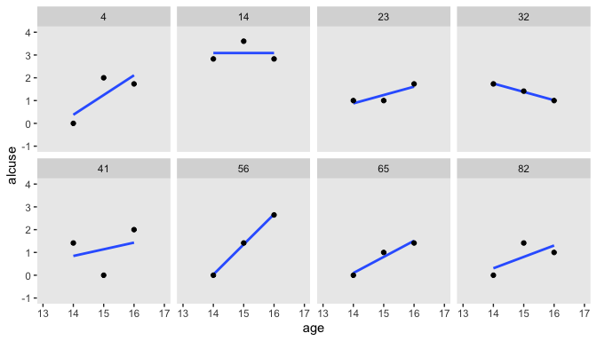<!-- -->

By this figure, Singer and Willett suggested the simple linear level-1
submodel following the form

where \(\pi_{0i}\) is the initial status of participant \(i\),
\(\pi_{1i}\) is participant \(i\)’s rate of change, and
\(\epsilon_{ij}\) is the variation in participant \(i\)’s data not
accounted for in the model.

Singer and Willett made their Figure 4.2, “with a random sample of 32 of
the adolescents” (p. 78). If we just wanted a random sample of rows, the
`sample_n()` function would do the job. But since we’re working with
long data, we’ll need some `group_by()` + `nest()` mojo. I got the trick
from [Jenny Bryan](https://twitter.com/JennyBryan)’s [*Sample from
groups, n varies by
group*](https://jennybc.github.io/purrr-tutorial/ls12_different-sized-samples.html).
Setting the seed makes the results from `sample_n()` reproducible. Here
are the top panels.

``` r
set.seed(4)

alcohol1_pp %>% 
  group_by(id) %>% 
  nest() %>% 
  sample_n(size = 32, replace = T) %>% 
  unnest(data) %>%
  mutate(coa = ifelse(coa == 0, "coa = 0", "coa = 1")) %>%

  ggplot(aes(x = age, y = alcuse, group = id)) +
  stat_smooth(method = "lm", se = F, size = 1/4) +
  coord_cartesian(xlim = 13:17,
                  ylim = -1:4) +
  theme(panel.grid = element_blank()) +
  facet_wrap(~coa)
```

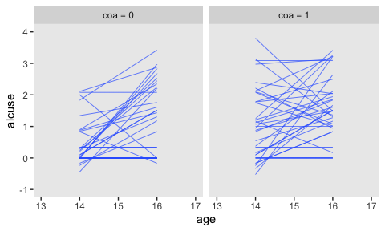<!-- -->

We have similar data wrangling needs for the bottom panels.

``` r
set.seed(4)

alcohol1_pp %>% 
  group_by(id) %>% 
  nest() %>% 
  ungroup() %>% 
  sample_n(size = 32, replace = T) %>% 
  unnest(data) %>%
  mutate(hp = ifelse(peer < mean(peer), "low peer", "high peer")) %>%
  mutate(hp = factor(hp, levels = c("low peer", "high peer"))) %>%

  ggplot(aes(x = age, y = alcuse, group = id)) +
  stat_smooth(method = "lm", se = F, size = 1/4) +
  coord_cartesian(xlim = 13:17,
                  ylim = -1:4) +
  theme(panel.grid = element_blank()) +
  facet_wrap(~hp)
```

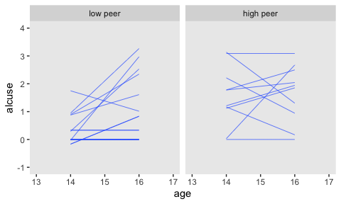<!-- -->

Based on the exploratory analyses, Singer and Willett posited the
initial level-2 submodel might take the form

where \(\gamma_{00}\) and \(\gamma_{10}\) are the level-2 intercepts,
the population averages when \(\text{coa} = 0\), \(\gamma_{10}\) and
\(\gamma_{11}\) are the level-2 slopes expressing the difference when
\(\text{coa} = 1\), and \(\zeta_{0i}\) and \(\zeta_{1i}\) are the
unexplained variation across the \(\text{id}\)-level intercepts and
slopes. Since we’ll be fitting the model with `brms::brm()`, the
\(\Sigma\) matrix will be parameterized in the \(\sigma\) metric. So we
might reexpress the model as

## 4.2 The composite specification of the multilevel model for change

With a little algebra, we can combine the level-1 and level-2 submodels
into the composite multilevel model for change, which follows the form

where the brackets in the first line partition the structural model
(i.e., the model for \(\mu\)) and the stochastic components (i.e., the
\(\sigma\) terms). We should note that this is the format that most
closely mirrors what we use in the `formula` argument in `brms::brm()`.
As long as `age` is not centered on the mean, our **brms** syntax would
be: `formula = alcuse ~ 0 + intercept + age_c + coa + age_c:coa + (1 +
age_c | id)`.

### 4.2.1 The structural component of the composite model.

> Although their interpretation is identical, the \(\gamma\)s in the
> composite model describe patterns of change in a different way. Rather
> than postulating first how *ALCUSE* is related to *TIME* and the
> individual growth parameters, and second how the individual growth
> parameters are related to *COA*, the composite specification in
> equation 4.3 postulates that *ALCUSE* depends *simultaneously* on: (1)
> the level-1 predictor, *TIME*; (2) the level-2 predictor, *COA*; and
> (3) the *cross-level* interaction, *COA* by *TIME*. From this
> perspective, the composite model’s structural portion strongly
> resembles a regular regression model with predictors, *TIME* and
> *COA*, appearing as main effects (associated with \(\gamma_{10}\) and
> \(\gamma_{01}\), respectively) and in a *cross-level* interaction
> (associated with \(\gamma_{11}\)). (p. 82, *emphasis* in the original)

### 4.2.2 The stochastic component of the composite model.

> A distinctive feature of the composite multilevel model is its
> composite residual, the three terms in the second set of brackets on
> the right of equation 4.3 that combine together the level-1 residual
> and the two level-2
> residuals:
> 
> \[\text{Composite residual: } [ \zeta_{0i} +  \zeta_{1i} \text{age_14}_{ij} + \epsilon_{ij} ].\]
> The composite residual is not a simple sum. Instead, the second
> level-2 residual, \(\zeta_{1i}\), is multiplied by the level-1
> predictor, \([\text{age_14}_{ij}]\), before joining its siblings.
> Despite its unusual construction, the interpretation of the composite
> residual is straightforward: it describes the difference between the
> observed and expected value of \([\text{alcuse}]\) for individual
> \(i\) on occasion \(j\).
> 
> The mathematical form of the composite residual reveals two important
> properties about the occasion-specific residuals not readily apparent
> in the level-1/level-2 specification: they can be both
> *autocorrelated* and *heteroscedastic* within person. (p. 84,
> *emphasis* in the original)

## 4.3 Methods of estimation, revisited

In this section, the authors introduced generalized least squares (GLS)
estimation and iterative generalized least squares (IGLS) estimation and
then distinguished between full and restricted maximum likelihood
estimation. Since our goal is to fit these models as Bayesians, we won’t
be using or discussing any of these in this project. There are, of
course, different ways to approach Bayesian estimation. E.g., though
we’re using Hamiltonian Monte Carlo, we could use other algorithms,
such as the Gibbs sampler. However, all that is outside of the scope of
this project.

I suppose the only thing to add is that whereas GLS estimates come from
mimimizing a weighted function of the residuals and maximum likelihood
estimates come from maximizing the log-likelihood function, the results
of our Bayesian analyses (i.e., the posterior distribution) come from
the consequences of Bayes theorem,

\[
p(\theta | d) = \frac{p(d | \theta) p(\theta)}{p(d)}.
\]

If you really want to dive into the details of this, I suggest
referencing a proper introductory Bayesian textbook, such as McElreath
([2015](https://xcelab.net/rm/statistical-rethinking/)), Kruschke
([2015](http://www.indiana.edu/~kruschke/DoingBayesianDataAnalysis/)),
or Gelman, Carlin, Stern, Dunson, Vehtari, and Rubin
([2013](http://www.stat.columbia.edu/~gelman/book/)). I haven’t had time
to check it out, but I’ve heard Labmert’s
([2018](https://ben-lambert.com/a-students-guide-to-bayesian-statistics/))
text is good, too. And for details specific to Stan, and thus **brms**,
you might check out the documentation resources at
<https://mc-stan.org/users/documentation/>.

## 4.4 First steps: Fitting two unconditional multilevel models for change

Singer and Willett recommended that before you fit your full theoretical
multilevel model of change–the one with all the interesting
covariates–you should fit two simpler preliminary models. The first is
the *unconditional means model*. The second is the *unconditional growth
model*.

I agree. In addition to the reasons they cover in the text, this is just
good pragmatic data analysis. Start simple and build up to the more
complicated models only after you’re confident you understand what’s
going on with the simpler ones. And if you’re new to them, you’ll
discover this is especially so with Bayesian methods.

### 4.4.1 The unconditional means model

The unconditional means model follows the formula

Let’s open **brms**.

``` r
library(brms)
```

Up till this point, we haven’t focused on priors. It would have been
reasonable to wonder if we’d been using them at all. Yes, we have. Even
if you don’t specify priors in your `brm()`, it’ll compute default
weakly-informative priors for you. You might be wondering, *What might
these default priors look like?* The `get_prior()` function let us take
a look.

``` r
get_prior(data = alcohol1_pp, 
          family = gaussian,
          alcuse ~ 1 + (1 | id))
```

    ##                 prior     class      coef group resp dpar nlpar bound
    ## 1 student_t(3, 1, 10) Intercept                                      
    ## 2 student_t(3, 0, 10)        sd                                      
    ## 3                            sd              id                      
    ## 4                            sd Intercept    id                      
    ## 5 student_t(3, 0, 10)     sigma

For this model, all three priors are based on Student’s
\(t\)-distribution. In case you’re rusty, the Normal distribution is
just a special case of Student’s \(t\)-distribution. Whereas the Normal
is defined by two parameters (\(\mu\) and \(\sigma\)), the \(t\)
distribution is defined by \(\nu\), \(\mu\), and \(\sigma\). In
frequentist circles, \(\nu\) is often called the degrees of freedom.
More generally, it’s also referred to as a normality parameter. We’ll
examine the prior more closely in a bit.

For now, let’s practice setting our priors by manually specifying them
within `brm()`. You do with the `prior` argument. There are actually
several ways to do this. To explore all the options, check out the
`set_prior` section of the [Reference
manual](https://cran.r-project.org/web/packages/brms/brms.pdf). I
typically define my individual priors with the `prior()` function. When
there are more than one priors to define, I typically bind them together
within `c(...)`.

Other than the addition of our fancy `prior` statement, the rest of the
settings within `brm()` are much like those in prior chapters. Let’s fit
the model.

``` r
fit4.1 <-
  brm(data = alcohol1_pp, 
      family = gaussian,
      alcuse ~ 1 + (1 | id),
      prior = c(prior(student_t(3, 1, 10), class = Intercept),
                prior(student_t(3, 0, 10), class = sd),
                prior(student_t(3, 0, 10), class = sigma)),
      iter = 2000, warmup = 1000, chains = 4, cores = 4,
      seed = 4,
      file = "fits/fit04.01")
```

Here are the results.

``` r
print(fit4.1)
```

    ##  Family: gaussian 
    ##   Links: mu = identity; sigma = identity 
    ## Formula: alcuse ~ 1 + (1 | id) 
    ##    Data: alcohol1_pp (Number of observations: 246) 
    ## Samples: 4 chains, each with iter = 2000; warmup = 1000; thin = 1;
    ##          total post-warmup samples = 4000
    ## 
    ## Group-Level Effects: 
    ## ~id (Number of levels: 82) 
    ##               Estimate Est.Error l-95% CI u-95% CI Rhat Bulk_ESS Tail_ESS
    ## sd(Intercept)     0.77      0.08     0.62     0.94 1.00     1662     2274
    ## 
    ## Population-Level Effects: 
    ##           Estimate Est.Error l-95% CI u-95% CI Rhat Bulk_ESS Tail_ESS
    ## Intercept     0.92      0.10     0.72     1.12 1.00     2602     2734
    ## 
    ## Family Specific Parameters: 
    ##       Estimate Est.Error l-95% CI u-95% CI Rhat Bulk_ESS Tail_ESS
    ## sigma     0.76      0.04     0.68     0.84 1.00     3219     3327
    ## 
    ## Samples were drawn using sampling(NUTS). For each parameter, Bulk_ESS
    ## and Tail_ESS are effective sample size measures, and Rhat is the potential
    ## scale reduction factor on split chains (at convergence, Rhat = 1).

Compare the results to those listed under “Model A” in Table 4.1. It’s
important to keep in mind that **brms** returns ‘sigma’ and
‘sd(Intercept)’ in the standard deviation metric rather than the
variance metric. “*But I want them in the variance metric like in the
text\!*”, you say. Okay fine. The best way to do the transformations is
after saving the results from `posterior_samples()`.

``` r
post <- posterior_samples(fit4.1)

glimpse(post[, 1:12])
```

    ## Observations: 4,000
    ## Variables: 12
    ## $ b_Intercept         <dbl> 1.0327617, 1.0176357, 0.8999551, 1.0666116, 0.9471380, 1.0461035, 0.9…
    ## $ sd_id__Intercept    <dbl> 0.9317019, 0.9259266, 0.7670859, 0.6670863, 0.7075109, 0.7324726, 0.8…
    ## $ sigma               <dbl> 0.7657679, 0.7630844, 0.8073889, 0.6964495, 0.7029354, 0.7410712, 0.7…
    ## $ `r_id[1,Intercept]` <dbl> 0.7525755, 1.1180550, 0.4892602, 0.9660265, 0.9259051, 0.8063631, 0.7…
    ## $ `r_id[2,Intercept]` <dbl> 0.07598890, -0.13078777, -0.26457278, -0.64529871, -0.72063809, -0.55…
    ## $ `r_id[3,Intercept]` <dbl> 1.3955514, 0.8532742, 0.8310599, 1.3219625, 1.2018000, 0.3310101, 1.5…
    ## $ `r_id[4,Intercept]` <dbl> 0.41462311, 0.40985772, -0.48227528, 0.57693850, 0.74470742, -0.04842…
    ## $ `r_id[5,Intercept]` <dbl> -0.94622094, -1.39462489, -0.47880633, -0.55613003, -0.61670702, -0.5…
    ## $ `r_id[6,Intercept]` <dbl> 1.125702, 1.736155, 1.708224, 1.919763, 1.945292, 1.292308, 1.628131,…
    ## $ `r_id[7,Intercept]` <dbl> 0.8668786, 0.9029424, 0.4616220, 0.5419488, 0.9775908, 0.1501572, 1.2…
    ## $ `r_id[8,Intercept]` <dbl> 0.06167846, -0.36815820, -1.12403522, -0.27823892, -0.99175538, -0.47…
    ## $ `r_id[9,Intercept]` <dbl> 0.30049368, 0.45626836, 0.09886899, 1.03263516, 0.97242471, -0.417528…

Since all we’re interested in are the variance components, we’ll
`select()` out the relevant columns from `post`, compute the squared
versions, and save the results in a mini data frame, `v`.

``` r
v <-
  post %>% 
  select(sigma, sd_id__Intercept) %>% 
  mutate(sigma_2_epsilon = sigma^2,
         sigma_2_0       = sd_id__Intercept^2)

head(v)
```

    ##       sigma sd_id__Intercept sigma_2_epsilon sigma_2_0
    ## 1 0.7657679        0.9317019       0.5864005 0.8680685
    ## 2 0.7630844        0.9259266       0.5822978 0.8573400
    ## 3 0.8073889        0.7670859       0.6518768 0.5884208
    ## 4 0.6964495        0.6670863       0.4850419 0.4450042
    ## 5 0.7029354        0.7075109       0.4941182 0.5005717
    ## 6 0.7410712        0.7324726       0.5491865 0.5365161

We can view their distributions like this.

``` r
v %>% 
  pivot_longer(everything()) %>% 
  
  ggplot(aes(x = value)) +
  geom_vline(xintercept = c(.25, .5, .75, 1), color = "white") +
  geom_density(size = 0, fill = "black") +
  scale_x_continuous(NULL, limits = c(0, 1.25),
                     breaks = seq(from = 0, to = 1.25, by = .25)) +
  scale_y_continuous(NULL, breaks = NULL) +
  theme(panel.grid = element_blank()) +
  facet_wrap(~name, scales = "free_y")
```

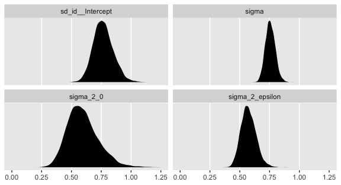<!-- -->

In case it’s hard to follow what just happened, the estimates in the
**brms**-default standard-deviation metric are the two panels on the
top. Those on the bottom are in the Singer-and-Willett style variance
metric. Like we discussed toward the end of last chapter, the variance
parameters won’t often be Gaussian. In my experience, they’re typically
skewed to the right. There’s nothing wrong with that. This is a
recurrent pattern among distributions that are constrained to be zero
and above.

If you’re interested, you can summarize them like so.

``` r
v %>% 
  pivot_longer(everything()) %>% 
  group_by(name) %>% 
  summarise(mean   = mean(value),
            median = median(value),
            sd     = sd(value),
            ll     = quantile(value, prob = .025),
            ul     = quantile(value, prob = .975)) %>% 
  # this last bit just rounds the output
  mutate_if(is.double, round, digits = 3)
```

    ## # A tibble: 4 x 6
    ##   name              mean median    sd    ll    ul
    ##   <chr>            <dbl>  <dbl> <dbl> <dbl> <dbl>
    ## 1 sd_id__Intercept 0.767  0.762 0.083 0.616 0.939
    ## 2 sigma            0.756  0.755 0.041 0.68  0.841
    ## 3 sigma_2_0        0.596  0.580 0.13  0.38  0.882
    ## 4 sigma_2_epsilon  0.574  0.570 0.062 0.463 0.707

For this model, our posterior medians are closer to the estimates in the
text (Table 4.1) than the means. However, our posterior standard
deviations are pretty close to the standard errors in the text.

One of the advantages of our Bayesian method is that when we compute
something like the intraclass correlation coefficient \(\rho\), we get
an entire distribution for the parameter rather than a measly point
estimates. This is always the case with Bayes. The algebraic
transformations of the posterior distribution are themselves
distributions. Before we compute \(\rho\), do pay close attention to the
formulia,

\[
\rho = \frac{\sigma_0^2}{\sigma_0^2 + \sigma_\epsilon^2}.
\]

Even though our **brms** output yields the variance parameters in the
standard-deviation metric, the formula for \(\rho\) demands we use
variances. That’s nothing a little squaring can’t fix. Here’s what our
\(\rho\) looks like.

``` r
v %>%
  transmute(rho = sd_id__Intercept^2 / (sd_id__Intercept^2 + sigma^2)) %>% 
  
  ggplot(aes(x = rho)) +
  geom_density(size = 0, fill = "black") +
  scale_x_continuous(expression(rho), limits = 0:1) +
  scale_y_continuous(NULL, breaks = NULL) +
  theme(panel.grid = element_blank())
```

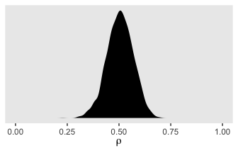<!-- -->

So even though it is indeed centered around .5, look at how wide and
uncertain the distribution is. The bulk of the posterior mass takes up
almost half of the parameter space. If you wanted the summary
statistics, you might do what we did for the variance parameters, above.

``` r
v %>%
  transmute(rho = sd_id__Intercept^2 / (sd_id__Intercept^2 + sigma^2)) %>% 
  summarise(mean   = mean(rho),
            median = median(rho),
            sd     = sd(rho),
            ll     = quantile(rho, prob = .025),
            ul     = quantile(rho, prob = .975)) %>% 
  mutate_if(is.double, round, digits = 3)
```

    ##    mean median    sd    ll    ul
    ## 1 0.505  0.505 0.063 0.376 0.625

Concerning \(\rho\), Singer and Willett pointed out

> it summarizes the size of the residual autocorrelation in the
> composite unconditional means mode…
> 
> Each person has a different composite residual on each occasion of
> measurement. But notice the difference in the subscripts of the pieces
> of the composite residual: while the level-1 residual,
> \(\epsilon_{ij}\) has two subscripts (\(i\) and \(j\)), the level-2
> residual, \(\zeta_{0i}\), has only one (\(i\)). Each person can have a
> different \(\epsilon_{ij}\) on each occasion, but has only one
> \(\zeta_{0i}\) across every occasion. The repeated presence of
> \(\zeta_{0i}\) in individual \(i\)’s composite residual links his or
> her composite residuals across occasions. The error autocorrelation
> coefficient quantifies the magnitude of this linkage; in the
> unconditional means model, the error autocorrelation coefficient *is*
> the intraclass correlation coefficient. Thus, we estimate that, for
> each person, the average correlation between any pair of composite
> residuals–between occasions 1 and 2, or 2 and 3, or 1 and 3–is \[.5\].
> (pp. 96–97, *emphasis* in the original)

Because of the differences in how they’re estimated with and presented
by `brm()`, focused right on the variance components. But before we move
on to the next section, we should back up a bit. On page 93, Singer and
Willett discussed their estimate for \(\gamma_{00}\). Here’s ours.

``` r
fixef(fit4.1)
```

    ##            Estimate Est.Error     Q2.5    Q97.5
    ## Intercept 0.9183551 0.1003442 0.722879 1.118637

They talked about how squaring that value puts it back to the natural
metric the data were originally collected in. \[Recall that as discussed
earlier in the text the `alcuse` variable was square-root transformed
because of excessive skew.\] If you want a quick and dirty look, you can
square our results, too.

``` r
fixef(fit4.1)^2 
```

    ##            Estimate  Est.Error     Q2.5    Q97.5
    ## Intercept 0.8433761 0.01006895 0.522554 1.251349

However, I do not recommend this method. Though it did okay at
transforming the posterior mean (i.e., Estimate), it’s not a great way
to get the summary statistics correct. To do that, you’ll need to work
with the posterior samples themselves. Remember how we saved them as
`post`? Let’s refresh ourselves and look at the first few columns.

``` r
post[1:6, 1:3]
```

    ##   b_Intercept sd_id__Intercept     sigma
    ## 1   1.0327617        0.9317019 0.7657679
    ## 2   1.0176357        0.9259266 0.7630844
    ## 3   0.8999551        0.7670859 0.8073889
    ## 4   1.0666116        0.6670863 0.6964495
    ## 5   0.9471380        0.7075109 0.7029354
    ## 6   1.0461035        0.7324726 0.7410712

See that `b_Intercept` column there? That contains our posterior draws
from \(\gamma_{00}\). If you want proper summary statistics from the
transformed estimate, get them after transforming that column.

``` r
post %>% 
  transmute(gamma_00_squared = b_Intercept^2) %>% 
  summarise(mean   = mean(gamma_00_squared),
            median = median(gamma_00_squared),
            sd     = sd(gamma_00_squared),
            ll     = quantile(gamma_00_squared, prob = .025),
            ul     = quantile(gamma_00_squared, prob = .975)) %>%
  mutate_if(is.double, round, digits = 3) %>% 
  pivot_longer(everything())
```

    ## # A tibble: 5 x 2
    ##   name   value
    ##   <chr>  <dbl>
    ## 1 mean   0.853
    ## 2 median 0.84 
    ## 3 sd     0.185
    ## 4 ll     0.523
    ## 5 ul     1.25

And one last bit before we move on to the next section. Remember how we
discovered what the `brm()` default priors were for our model with the
handy `get_prior()` function?. Let’s refresh ourselves on how that
worked.

``` r
get_prior(data = alcohol1_pp, 
          family = gaussian,
          alcuse ~ 1 + (1 | id))
```

    ##                 prior     class      coef group resp dpar nlpar bound
    ## 1 student_t(3, 1, 10) Intercept                                      
    ## 2 student_t(3, 0, 10)        sd                                      
    ## 3                            sd              id                      
    ## 4                            sd Intercept    id                      
    ## 5 student_t(3, 0, 10)     sigma

We inserted the data and the model and `get_prior()` returned the
default priors. Especially for new Bayesians, or even for experienced
Bayesians working with unfamiliar models, it can be handy to plot your
priors to get a sense of them.

Base **R** has an array of functions based on the \(t\) distribution
(e.g., `rt()`, `dt()`). But they’re limited in that while they allow
users to select the desired \(\nu\) values (i.e., degrees of freedom),
they fix \(\mu = 0\) and \(\sigma = 1\). Now there are tricky ways
around this. But so as to avoid overwhelming anyone new to Bayes or the
multilevel model or **R** or some exasperating combination, let’s just
make things simpler and use a different function. As it turns out, the
[**metrology**
package](https://cran.r-project.org/web/packages/metRology/index.html)
contains a `dt.scaled()` function that allows users to define all three
parameters for Student’s \(t\).

We’ll start with the default intercept prior,
\(t(\nu = 3, \mu = 1, \sigma = 10)\). Here’s the density in the range
\([-100, 100]\).

``` r
tibble(x = seq(from = -100, to = 100, length.out = 1e3)) %>%
  mutate(density = metRology::dt.scaled(x, df = 3, mean = 1, sd = 10)) %>% 
  
  ggplot(aes(x = x, y = density)) +
  geom_vline(xintercept = 1, color = "white") +
  geom_line() +
  labs(title = expression(paste("prior for ", gamma[0][0])),
       x = "parameter space") +
  theme(panel.grid = element_blank())
```

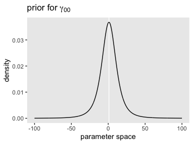<!-- -->

Though it’s centered on 1, the bulk of the mass seems to range from -40
to 40. Given the model estimate ended up about 0.9, it looks like that
was a pretty broad and minimally-informative prior. However, the prior
isn’t flat and it does help guard against wasting time and iterations
sampling from ridiculous regions of the parameter space such as -10,000
or +500,000,000. No adolescent is drinking that much (or that little–how
does one drink a negative value?).

Here’s the shape of the variance priors.

``` r
tibble(x = seq(from = 0, to = 100, length.out = 1e3)) %>%
  mutate(density = metRology::dt.scaled(x, df = 3, mean = 0, sd = 10)) %>% 
  
  ggplot(aes(x = x, y = density)) +
  geom_vline(xintercept = 0, color = "white") +
  geom_line() +
  labs(title = expression(paste("prior for both ", sigma[0], " and ", sigma[epsilon])),
       x = "parameter space") +
  theme(panel.grid = element_blank())
```

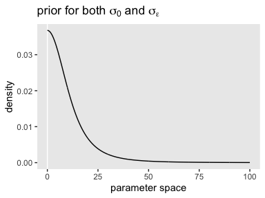<!-- -->

Recall that by **brms** default, the variance parameters have a
lower-limit of 0. So specifying a Student’s \(t\) or other Gaussian-like
prior on them ends up cutting the distribution off at 0. Given that our
estimates, and those presented in the text, were both below 1, it
appears that these priors were minimally informative. But again, they
did help prevent `brm()` from sampling from negative values or from
obscenely-large values.

*These priors look kinda silly*, you might say. *Anyone with a little
common sense can do better*. Well, sure. Probably. Maybe. But keep in
mind we’re still getting the layout of the land. And plus, this was a
pretty simple model. Selecting high-quality priors gets tricky as the
models get more complicated. In other chapters, we’ll explore other ways
to specify priors for our multilevel models. But to keep things simple
for now, let’s keep practicing inspecting and using the defaults with
`get_prior()` and so on.

### 4.4.2 The unconditional growth model

Using the composite formula, our next model, the unconditional growth
model, follows the form

With it, we now have a full composite stochastic model. Let’s query the
`brms::brm()` default priors when we apply this model to our data.

``` r
get_prior(data = alcohol1_pp, 
          family = gaussian,
          alcuse ~ 0 + Intercept + age_14 + (1 + age_14 | id))
```

    ##                  prior class      coef group resp dpar nlpar bound
    ## 1                          b                                      
    ## 2                          b    age_14                            
    ## 3                          b Intercept                            
    ## 4               lkj(1)   cor                                      
    ## 5                        cor              id                      
    ## 6  student_t(3, 0, 10)    sd                                      
    ## 7                         sd              id                      
    ## 8                         sd    age_14    id                      
    ## 9                         sd Intercept    id                      
    ## 10 student_t(3, 0, 10) sigma

Several things of note: First, notice how we continue to use the
`student_t(3, 0, 10)` for all three of our standard-deviation-metric
variance parameters. Since we’re now estimating \(\sigma_0\) and
\(\sigma_1\), which themselves have a correlation, \(\rho_{01}\), we
have a prior for the class `cor`. I’m going to put off what is meant by
the name `lkj`, but for the moment just realize that this prior is
essentially noninformative within this context.

There’s a major odd development with this output. Notice how there’s the
`prior` column is empty for the rows for our two coefficients of class
`b`. And if you’re a little confused, recall that because our predictor
`age_14` is not mean-centered, we’ve used the `0 + Intercept` syntax,
which switches the model intercept parameter to the class of `b`.
Anyway, it might seem odd that the `prior` values for those rows are
blank. From the `set_prior` section of the [reference
manual](https://cran.r-project.org/web/packages/brms/brms.pdf) for
**brms** version 2.12.0, we read: “The default prior for
population-level effects (including monotonic and category specific
effects) is an improper flat prior over the reals” (p. 179). At present,
these priors are uniform across the entire parameter space. They’re not
just weak, their entirely noninformative. That is, for those parameters,
the likelihood dominates the posterior.

Here’s how to fit the model with these priors.

``` r
fit4.2 <-
  brm(data = alcohol1_pp, 
      family = gaussian,
      alcuse ~ 0 + Intercept + age_14 + (1 + age_14 | id),
      prior = c(prior(student_t(3, 0, 10), class = sd),
                prior(student_t(3, 0, 10), class = sigma),
                prior(lkj(1), class = cor)),
      iter = 2000, warmup = 1000, chains = 4, cores = 4,
      seed = 4,
      file = "fits/fit04.02")
```

How did we do?

``` r
print(fit4.2, digits = 3)
```

    ##  Family: gaussian 
    ##   Links: mu = identity; sigma = identity 
    ## Formula: alcuse ~ 0 + Intercept + age_14 + (1 + age_14 | id) 
    ##    Data: alcohol1_pp (Number of observations: 246) 
    ## Samples: 4 chains, each with iter = 2000; warmup = 1000; thin = 1;
    ##          total post-warmup samples = 4000
    ## 
    ## Group-Level Effects: 
    ## ~id (Number of levels: 82) 
    ##                       Estimate Est.Error l-95% CI u-95% CI  Rhat Bulk_ESS Tail_ESS
    ## sd(Intercept)            0.786     0.099    0.598    0.995 1.003     1148     1952
    ## sd(age_14)               0.358     0.094    0.141    0.519 1.004      405      464
    ## cor(Intercept,age_14)   -0.106     0.266   -0.493    0.592 1.004      675      795
    ## 
    ## Population-Level Effects: 
    ##           Estimate Est.Error l-95% CI u-95% CI  Rhat Bulk_ESS Tail_ESS
    ## Intercept    0.648     0.108    0.438    0.870 1.003     1806     2103
    ## age_14       0.273     0.064    0.149    0.399 1.001     3237     2825
    ## 
    ## Family Specific Parameters: 
    ##       Estimate Est.Error l-95% CI u-95% CI  Rhat Bulk_ESS Tail_ESS
    ## sigma    0.609     0.052    0.518    0.718 1.003      521     1239
    ## 
    ## Samples were drawn using sampling(NUTS). For each parameter, Bulk_ESS
    ## and Tail_ESS are effective sample size measures, and Rhat is the potential
    ## scale reduction factor on split chains (at convergence, Rhat = 1).

If your compare our results with those in the “Model B” column in Table
4.1, you’ll see our summary results match well with those in the text.
Our \(\gamma\)s (i.e., ‘Population-Level Effects:’) are near identical.
The leftmost panel in Figure 4.3 shows the prototypical trajectory,
based on the \(\gamma\)s. A quick way to get that within our **brms**
framework is with the `conditional_effects()` function. Here’s the
default output.

``` r
conditional_effects(fit4.2)
```

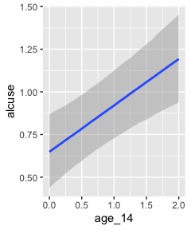<!-- -->

Staying with `conditional_effects()` allows users some flexibility for
customizing the plot(s). For example, the default behavior is to depict
the trajectory in terms of its 95% intervals and posterior median. If
you’d prefer the 80% intervals and the posterior mean, customize it like
so.

``` r
conditional_effects(fit4.2,
                    robust = F,
                    probs = c(.1, .9))
```

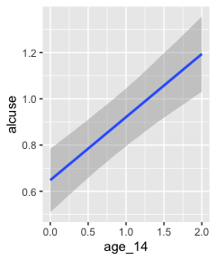<!-- -->

We’ll explore more options with `brms::conditional_effects()` with Model
C.

For now, let’s turn our focus on the stochastic elements in the model.
Here we extract the posterior samples and do the conversions to see how
they compare with Singer and Willett’s.

``` r
post <- posterior_samples(fit4.2)

v <-
  post %>% 
  transmute(sigma_2_epsilon = sigma^2,
            sigma_2_0       = sd_id__Intercept^2,
            sigma_2_1       = sd_id__age_14^2,
            sigma_01        = sd_id__Intercept * cor_id__Intercept__age_14 * sd_id__age_14)

head(v)
```

    ##   sigma_2_epsilon sigma_2_0 sigma_2_1    sigma_01
    ## 1       0.4641867 0.4946951 0.1548531 -0.08353620
    ## 2       0.3582816 0.4775434 0.1404647 -0.01830842
    ## 3       0.4210113 0.7406254 0.1261567 -0.07041419
    ## 4       0.3491970 0.5348618 0.1102675 -0.04012958
    ## 5       0.3573036 0.7199475 0.1797023 -0.11079723
    ## 6       0.3713001 0.7513729 0.1304161 -0.11221189

This time, our `v` object only contains the stochastic components in the
variance metric. Let’s plot.

``` r
v %>% 
  pivot_longer(everything()) %>% 
  
  ggplot(aes(x = value)) +
  geom_density(size = 0, fill = "black") +
  scale_y_continuous(NULL, breaks = NULL) +
  theme(panel.grid = element_blank()) +
  facet_wrap(~name, scales = "free")
```

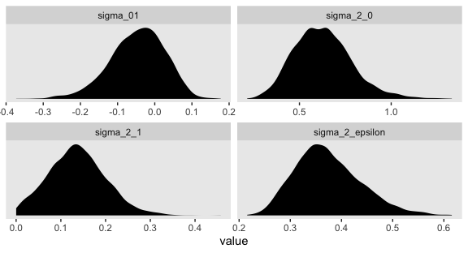<!-- -->

For each, their posterior mass is centered near the point estimates
Singer and Willet reported in the text. Here are the summary statistics.

``` r
v %>% 
  pivot_longer(everything()) %>% 
  group_by(name) %>% 
  summarise(mean   = mean(value),
            median = median(value),
            sd     = sd(value),
            ll     = quantile(value, prob = .025),
            ul     = quantile(value, prob = .975)) %>% 
  mutate_if(is.double, round, digits = 3)
```

    ## # A tibble: 4 x 6
    ##   name              mean median    sd     ll    ul
    ##   <chr>            <dbl>  <dbl> <dbl>  <dbl> <dbl>
    ## 1 sigma_01        -0.047 -0.042 0.074 -0.207 0.081
    ## 2 sigma_2_0        0.628  0.619 0.159  0.357 0.989
    ## 3 sigma_2_1        0.137  0.135 0.063  0.02  0.269
    ## 4 sigma_2_epsilon  0.374  0.367 0.064  0.268 0.516

Happily, they’re quite comparable to those in the text.

We’ve been pulling the posterior samples for all parameters with
`posterior_samples()` and subsetting to a few variables of interest,
such as the variance parameters. But it our primary interest is just the
iterations for the variance parameters, we can extract them in a more
focused way with `VarCorr()`. Here’s how we’d do so for `fit4.2`.

``` r
VarCorr(fit4.2,
        summary = F) %>% 
  str()
```

    ## List of 2
    ##  $ id        :List of 3
    ##   ..$ sd : num [1:4000, 1:2] 0.703 0.691 0.861 0.731 0.848 ...
    ##   .. ..- attr(*, "dimnames")=List of 2
    ##   .. .. ..$ iterations: NULL
    ##   .. .. ..$ parameters: chr [1:2] "Intercept" "age_14"
    ##   ..$ cor: num [1:4000, 1:2, 1:2] 1 1 1 1 1 1 1 1 1 1 ...
    ##   .. ..- attr(*, "dimnames")=List of 3
    ##   .. .. ..$ : NULL
    ##   .. .. ..$ : chr [1:2] "Intercept" "age_14"
    ##   .. .. ..$ : chr [1:2] "Intercept" "age_14"
    ##   ..$ cov: num [1:4000, 1:2, 1:2] 0.495 0.478 0.741 0.535 0.72 ...
    ##   .. ..- attr(*, "dimnames")=List of 3
    ##   .. .. ..$ : NULL
    ##   .. .. ..$ : chr [1:2] "Intercept" "age_14"
    ##   .. .. ..$ : chr [1:2] "Intercept" "age_14"
    ##  $ residual__:List of 1
    ##   ..$ sd: num [1:4000, 1] 0.681 0.599 0.649 0.591 0.598 ...
    ##   .. ..- attr(*, "dimnames")=List of 2
    ##   .. .. ..$ iterations: NULL
    ##   .. .. ..$ parameters: chr ""

That last part, the contents of the second higher-level list indexed by
`$ residual`, contains the contents for \(\sigma_\epsilon\). On page 100
in the text, Singer and Willett compared \(\sigma_\epsilon^2\) from the
first model to that from the second. We might do that like so.

``` r
cbind(VarCorr(fit4.1, summary = F)[[2]][[1]],
      VarCorr(fit4.2, summary = F)[[2]][[1]]) %>% 
  data.frame() %>% 
  mutate_all(~.^2) %>% 
  set_names(str_c("fit4.", 1:2)) %>% 
  mutate(`fit4.1 - fit4.2` = fit4.1 - fit4.2) %>% 
  pivot_longer(everything()) %>% 
  mutate(name = factor(name, levels = c("fit4.1", "fit4.2", "fit4.1 - fit4.2"))) %>% 
  
  ggplot(aes(x = value)) +
  geom_vline(xintercept = .5, color = "white") +
  geom_density(fill = "grey25", color = "transparent") +
  scale_y_continuous(NULL, breaks = NULL) +
  xlab(expression(sigma[epsilon]^2)) +
  theme(panel.grid = element_blank()) +
  facet_wrap(~name, scales = "free_y", ncol = 3)
```

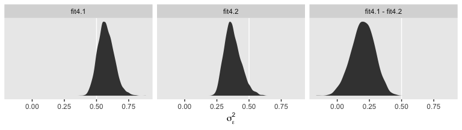<!-- -->

To compute a formal summary of the decline in \(\sigma_\epsilon^2\)
after adding time to the model, we might summarize like before.

``` r
cbind(VarCorr(fit4.1, summary = F)[[2]][[1]],
      VarCorr(fit4.2, summary = F)[[2]][[1]]) %>% 
  data.frame() %>% 
  mutate_all(~.^2) %>% 
  set_names(str_c("fit4.", 1:2)) %>% 
  mutate(proportion_decline = (fit4.1 - fit4.2) / fit4.1) %>% 
  summarise(mean   = mean(proportion_decline),
            median = median(proportion_decline),
            sd     = sd(proportion_decline),
            ll     = quantile(proportion_decline, prob = .025),
            ul     = quantile(proportion_decline, prob = .975)) %>%
  mutate_if(is.double, round, digits = 3)
```

    ##    mean median    sd    ll    ul
    ## 1 0.341  0.356 0.136 0.036 0.561

In case it wasn’t clear, when we presented `fit4.1 – fit4.2` in the
density plot, that was a simple difference score. However, we computed
`proportion_decline` above by dividing that difference score by
`fit4.1`; that’s what put the difference in a proportion metric. Anyway,
Singer and Willett’s method led them to summarize the decline as .40.
Our method was a more conservative .34-ish. And very happily, our method
allows us to describe the proportion decline with summary statistics for
the full posterior, such as with the \(SD\) and the 95% intervals.

``` r
post %>% 
  ggplot(aes(x = cor_id__Intercept__age_14)) +
  geom_vline(xintercept = 0, color = "white") +
  geom_density(fill = "grey25", color = "transparent") +
  scale_y_continuous(NULL, breaks = NULL) +
  scale_x_continuous(expression(rho[0][1]), limits = c(-1, 1)) +
  theme(panel.grid = element_blank())
```

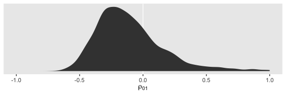<!-- -->

The estimate Singer and Willett hand-computed in the text, -.22, is near
the mean of our posterior distribution for \(\rho_{01}\). However, our
distribution provides a full expression of the uncertainty in the
parameter. As are many other values within the parameter space, zero is
indeed a credible value for \(\rho_{01}\).

On page 101, we get the generic formula for computing the residual
variance for a given occasion \(j\),

\[
\sigma_{\text{Residual}_j}^2 = \sigma_0^2 + \sigma_1^2 \text{time}_j + 2 \sigma_{01} \text{time}_j + \sigma_\epsilon^2.
\]

If we were just interested in applying it to one of our `age` values,
say 14, we might apply the formula to the posterior like this.

``` r
post %>% 
  transmute(sigma_2_residual_j = sd_id__Intercept^2 + 
              sd_id__age_14^2 * 0 + 
              2 * sd_id__Intercept * cor_id__Intercept__age_14 * sd_id__age_14 * 0 + 
              sigma^2) %>% 
  head()
```

    ##   sigma_2_residual_j
    ## 1          0.9588818
    ## 2          0.8358250
    ## 3          1.1616367
    ## 4          0.8840587
    ## 5          1.0772511
    ## 6          1.1226730

But given we’d like to do so over several values of `age`, it might be
better to wrap the equation in a custom function. Let’s call it
`make_s2rj()`.

``` r
make_s2rj <- function(x) {
  post %>% 
    transmute(sigma_2_residual_j = sd_id__Intercept^2 + sd_id__age_14^2 * x + 2 * sd_id__Intercept * cor_id__Intercept__age_14 * sd_id__age_14 * x + sigma^2) %>% 
    pull()
}
```

Now we can put our custom `make_s2rj()` function to work within the
`purrr::map()` paradigm. We’ll plot the results.

``` r
tibble(age = 14:16) %>% 
  mutate(age_c = age - 14) %>% 
  mutate(s2rj = map(age_c, make_s2rj)) %>% 
  unnest(s2rj) %>% 
  mutate(label = str_c("age = ", age)) %>% 
  
  ggplot(aes(x = s2rj)) +
  geom_density(fill = "grey25", color = "transparent") +
  # just for reference 
  geom_vline(xintercept = 1, color = "grey92", linetype = 2) +
  scale_y_continuous(NULL, breaks = NULL) +
  labs(title = "Behold the shape of longitudinal heteroscedasticity.",
       x = expression(sigma[italic(Residual[j])]^2)) +
  theme(panel.grid = element_blank()) +
  facet_wrap(~label, scales = "free_y", ncol = 1)
```

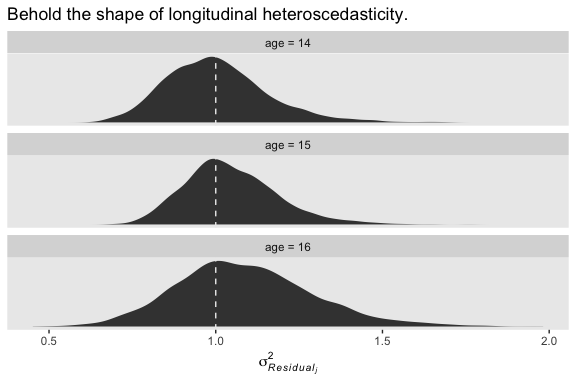<!-- -->

We see a subtle increase over time, particularly from `age = 15` to `age
= 16`. Yep, that’s heteroscedasticity. It is indeed “beyond the bland
homoscedasticity we assume of residuals in cross-sectional data”
(p. 101).

We might also be interested in computing the autocorrelation between the
composite residuals on occasions \(j\) and \(j’\), which follows the
formula

\[
\rho_{\text{Residual}_j, \text{Residual}_{j'}} = \frac{\sigma_0^2 + \sigma_{01} (\text{time}_j + \text{time}_{j'}) + \sigma_1^2 \text{time}_j \text{time}_{j'}} {\sqrt{\sigma_\text{Residual_j}^2 \sigma_\text{Residual_{j'}}^2 }}.
\]

We only want to do that by hand once. Let’s make a custom function
following the formula.

``` r
 make_rho_rj_rjp <- function(j, jp) {
  
  # define the elements in the denominator  
  s2rj_j  <- make_s2rj(j)
  s2rj_jp <- make_s2rj(jp)
  
  # compute
  post %>% 
    transmute(r = (sd_id__Intercept^2 + 
                     sd_id__Intercept * cor_id__Intercept__age_14 * sd_id__age_14 * (j + jp) + 
                     sd_id__age_14^2 * j * jp) /
                sqrt(s2rj_j * s2rj_jp)) %>% 
    pull()
}
```

If you only cared about measures of central tendency, such as the
posterior median, you could use the funciton like this.

``` r
make_rho_rj_rjp(0, 1) %>% median()
```

    ## [1] 0.5666644

``` r
make_rho_rj_rjp(1, 2) %>% median()
```

    ## [1] 0.7174044

``` r
make_rho_rj_rjp(0, 2) %>% median()
```

    ## [1] 0.5140162

Here are the full posteriors.

``` r
tibble(occasion = 1:3) %>% 
  mutate(age_c  = occasion - 1,
         j      = c(1, 2, 1) - 1,
         jp     = c(2, 3, 3) - 1) %>% 
  mutate(r = map2(j, jp, make_rho_rj_rjp)) %>% 
  unnest(r) %>% 
  mutate(label = str_c("occasions ", j + 1, " and ", jp + 1)) %>% 
  
  ggplot(aes(x = r)) +
  # just for reference
  geom_vline(xintercept = c(.5, .75), color = "white") +
  geom_density(fill = "grey25", color = "transparent") +
  scale_x_continuous(expression(rho[Residual[italic(j)]][Residual[italic(j*minute)]]), limits = c(0, 1)) +
  scale_y_continuous(NULL, breaks = NULL) +
  ggtitle("Behold the shapes of our autocorrelations.") +
  theme(panel.grid = element_blank()) +
  facet_wrap(~label, scales = "free_y", ncol = 1)
```

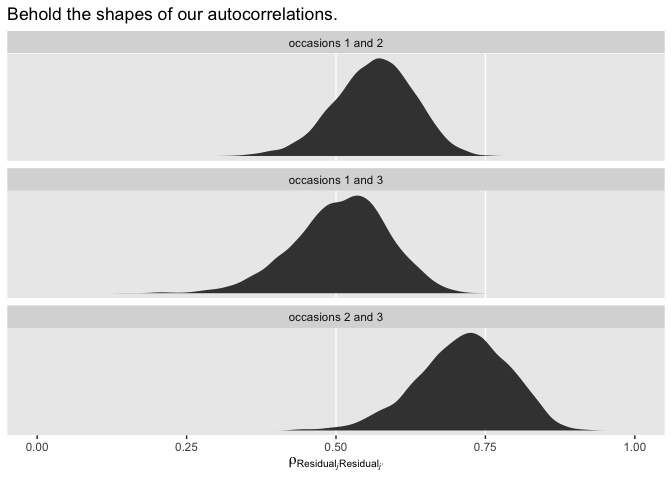<!-- -->

### 4.4.3 Quantifying the proportion of outcome variation “explained”

Because of the way the multilevel model partitions off variance into
different sources (e.g., \(sigma_0^2\), \(sigma_1^2\), and
\(sigma_\epsilon^2\) in the unconditional growth model), the
conventional \(R^2\) is not applicable for evaluating models. Several
pseudo \(R^2\) statistics are frequently used instead.

#### An overall summary of total outcome variability explained.

``` r
tibble(age_14 = 0:2) %>% 
  mutate(fitted = map_dbl(age_14, ~ post[1, "b_Intercept"] + post[1, "b_age_14"] * .)) %>% 
  full_join(alcohol1_pp %>% select(age_14, alcuse),
            by = "age_14") %>%
  summarise(r = cor(fitted, alcuse)) %>%
  mutate(r2 = r * r)
```

    ## # A tibble: 1 x 2
    ##       r     r2
    ##   <dbl>  <dbl>
    ## 1 0.208 0.0434

``` r
tibble(age_14 = 0:2) %>% 
  mutate(fitted = map_dbl(age_14, ~ post[2, "b_Intercept"] + post[2, "b_age_14"] * .)) %>% 
  full_join(alcohol1_pp %>% select(age_14, alcuse),
            by = "age_14") %>% 
  summarise(r = cor(fitted, alcuse)) %>% 
  mutate(r2 = r * r)
```

    ## # A tibble: 1 x 2
    ##       r     r2
    ##   <dbl>  <dbl>
    ## 1 0.208 0.0434

``` r
tibble(age_14 = 0:2) %>% 
  mutate(fitted = map(age_14, ~ post$b_Intercept + post$b_age_14 * .)) %>% 
  full_join(alcohol1_pp %>% select(id, age_14, alcuse),
            by = "age_14") %>% 
  mutate(row = 1:n()) %>% 
  unnest(fitted) %>% 
  # mutate(r = map2_dbl(fitted, alcuse, cor))
  # ungroup() %>% 
  group_by(row) %>% 
  summarise(r2 = cor(fitted, alcuse)) %>% 
  summarise(mean = mean(r2),
            ll = quantile(r2, prob = .025),
            ul = quantile(r2, prob = .975))
```

#### Pseudo-\(R^2\) statistics computed from the variance components.

We can also compare models by a more complex model’s proportion in
reduction in residual variance for a given variance parameter. This
provides three basic pseudo \(R^2\) statistics: \(R_\epsilon^2\),
\(R_0^2\), and \(R_1^2\). The formula for the first follows the form

\[
R_\epsilon^2 = \frac{\sigma_\epsilon^2 (\text{unconditional means model}) - \sigma_\epsilon^2 (\text{unconditional growth model})}{\sigma_\epsilon^2 (\text{unconditional means model})}.
\]

We’ve actually already computed this one, above, under the name where we
referred to it as the decline in \(\sigma_\epsilon^2\) after adding time
to the model. Here it is again.

``` r
cbind(VarCorr(fit4.1, summary = F)[[2]][[1]],
      VarCorr(fit4.2, summary = F)[[2]][[1]]) %>% 
  data.frame() %>% 
  mutate_all(~.^2) %>% 
  set_names(str_c("fit4.", 1:2)) %>% 
  mutate(r_2_epsilon = (fit4.1 - fit4.2) / fit4.1) %>% 
  summarise(mean   = mean(r_2_epsilon),
            median = median(r_2_epsilon),
            sd     = sd(r_2_epsilon),
            ll     = quantile(r_2_epsilon, prob = .025),
            ul     = quantile(r_2_epsilon, prob = .975)) %>%
  mutate_if(is.double, round, digits = 3)
```

    ##    mean median    sd    ll    ul
    ## 1 0.341  0.356 0.136 0.036 0.561

Here’s a look at the shape of the posterior.

``` r
cbind(VarCorr(fit4.1, summary = F)[[2]][[1]],
      VarCorr(fit4.2, summary = F)[[2]][[1]]) %>% 
  data.frame() %>% 
  mutate_all(~.^2) %>% 
  set_names(str_c("fit4.", 1:2)) %>% 
  mutate(r_2_epsilon = (fit4.1 - fit4.2) / fit4.1) %>%
  
  ggplot(aes(x = r_2_epsilon)) +
  geom_vline(xintercept = 0, color = "white") +
  geom_density(fill = "grey25", color = "transparent") +
  scale_y_continuous(NULL, breaks = NULL) +
  scale_x_continuous(expression(rho[0][1]), limits = c(-1, 1)) +
  theme(panel.grid = element_blank())
```

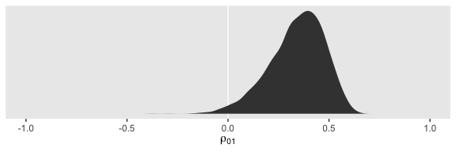<!-- -->

When we use the full posteriors of our two \(R_\epsilon^2\) parameters,
we end up with a slightly smaller statistic than the one in the text. So
our conclusion is about 35% of the intraindividual variance is accounted
for by time.

If we consider additional models with predictors for the \(\zeta\)s, we
can examine similar pseudo \(R^2\) statistics following the generic form

\[
R_\zeta^2 = \frac{\sigma_\zeta^2 (\text{unconditional growth model}) - \sigma_\zeta^2 (\text{subsequent model})}{\sigma_\zeta^2 (\text{unconditional growth model})}.
\]

If you look back up at the shape of the full posterior of
\(R_\epsilon^2\), you’ll notice part of the left tail crosses zero.
“Unlike traditional \(R^2\) statistics, which will always be positive
(or zero), some of these statistics can be negative” (p. 104)\! So
interpret the pseudo \(R^2\) statistics with a grain of salt.

## Practical data analytic strategies for model building

> A sound statistical model includes all necessary predictors and no
> unnecessary ones. But how do you separate the wheat from the chaff? We
> suggest you rely on a combination of substantive theory, research
> questions, and statistical evidence. *Never* let a computer select
> predictors mechanically. (pp. 104–105, *emphasis* in the original)

### A taxonomy of statistical models.

> We suggest that you base decisions to enter, retain, and remove
> predictors on a combination of logic, theory, and prior research,
> supplemented by judicious \[parameter evaluation\] and comparison of
> model fit. At the outset, you might examine the effect of each
> predictor individually. You might then focus on predictors of primary
> interest (while including others whose effects you want to control).
> As in regular regression, you can add predictors singly or in groups
> and you can address issues of functional form using interactions and
> transformations. As you develop the taxonomy, you will progress toward
> a “final model” whose interpretation addresses your research
> questions. We place quotes around this term to emphasize that we
> believe no statistical model is *ever* final; it is simply a
> placeholder until a better model is found. (p. 105, *emphasis* in the
> original)

### 4.5.2 Interpreting fitted models.

> You need not interpret every model you fit, especially those designed
> to guide interim decision making. When writing up findings for
> presentation and publication, we suggest that you identify a
> manageable subset of models that, taken together, tells a persuasive
> story parsimoniously. At a minimum, this includes the unconditional
> means model, the unconditional growth model, and a “final model”. You
> may also want to present intermediate models that either provide
> important building blocks or tell interesting stories in their own
> right. (p. 106)

In the dawn of the post-replication crisis era, it’s astonishing to
reread and transcribe this section and the one above. I like a lot of
what the authors had to say. Much of it seems like good pragmatic
advice. But if they were to rewrite these sections again, I wonder what
changes they’d make. Would the recommend researchers
[preregister](https://www.pnas.org/content/pnas/115/11/2600.full.pdf)
their primary hypothesis, variables of interest, and perhaps their model
building strategy? Would they be interested in a [multiverse
analysis](https://journals.sagepub.com/doi/10.1177/1745691616658637)?
Would the still recommend sharing only a subset of one’s analyses in the
era of sharing platforms like [GitHub](https://github.com) and the [Open
Science Framework](https://osf.io)? Would they weigh in on developments
in [causal
inference](https://www.wiley.com/en-us/Causal+Inference+in+Statistics%3A+A+Primer-p-9781119186847)?

#### Model C: The uncontrolled effects of COA.

The default priors for Model C are the same as for the unconditional
growth model. All we’ve done is add parameters of `class = b`. As these
default to improper flat priors, we have nothing to add to the `prior`
argument to include them. Feel free to check with `get_prior()`. For the
sake of practice, this model follows the form

Fit the model.

``` r
fit4.3 <-
  brm(data = alcohol1_pp, 
      family = gaussian,
      alcuse ~ 0 + Intercept + age_14 + coa + age_14:coa + (1 + age_14 | id),
      prior = c(prior(student_t(3, 0, 10), class = sd),
                prior(student_t(3, 0, 10), class = sigma),
                prior(lkj(1), class = cor)),
      iter = 2000, warmup = 1000, chains = 4, cores = 4,
      seed = 4,
      file = "fits/fit04.03")
```

Check the summary.

``` r
print(fit4.3, digits = 3)
```

    ##  Family: gaussian 
    ##   Links: mu = identity; sigma = identity 
    ## Formula: alcuse ~ 0 + Intercept + age_14 + coa + age_14:coa + (1 + age_14 | id) 
    ##    Data: alcohol1_pp (Number of observations: 246) 
    ## Samples: 4 chains, each with iter = 2000; warmup = 1000; thin = 1;
    ##          total post-warmup samples = 4000
    ## 
    ## Group-Level Effects: 
    ## ~id (Number of levels: 82) 
    ##                       Estimate Est.Error l-95% CI u-95% CI  Rhat Bulk_ESS Tail_ESS
    ## sd(Intercept)            0.700     0.101    0.500    0.898 1.003      823     1429
    ## sd(age_14)               0.367     0.094    0.142    0.529 1.008      337      286
    ## cor(Intercept,age_14)   -0.105     0.287   -0.513    0.679 1.008      481      370
    ## 
    ## Population-Level Effects: 
    ##            Estimate Est.Error l-95% CI u-95% CI  Rhat Bulk_ESS Tail_ESS
    ## Intercept     0.314     0.134    0.054    0.574 1.002     1998     2417
    ## age_14        0.294     0.085    0.128    0.460 1.001     2775     2957
    ## coa           0.739     0.201    0.334    1.132 1.002     2028     2141
    ## age_14:coa   -0.050     0.126   -0.303    0.197 1.001     2956     2987
    ## 
    ## Family Specific Parameters: 
    ##       Estimate Est.Error l-95% CI u-95% CI  Rhat Bulk_ESS Tail_ESS
    ## sigma    0.608     0.052    0.517    0.720 1.007      425      674
    ## 
    ## Samples were drawn using sampling(NUTS). For each parameter, Bulk_ESS
    ## and Tail_ESS are effective sample size measures, and Rhat is the potential
    ## scale reduction factor on split chains (at convergence, Rhat = 1).

Our \(\gamma\)s are quite similar to those presented in the text. Our
\(\sigma_\epsilon\) for this model is about the same as with `fit4.2`.
Let’s practice with `conditional_effects()` to plot the consequences of
this
model.

``` r
conditional_effects(fit4.3)
```

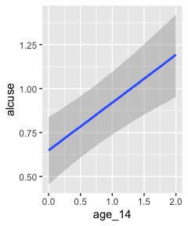<!-- -->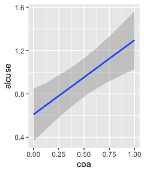<!-- -->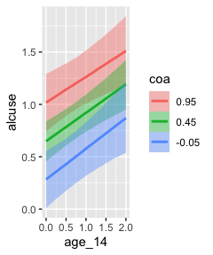<!-- -->

This time we got back three plots. The first two were of the lower-order
parameters \(\gamma_{10}\) and \(\gamma_{01}\). Note how the plot for
`coa` treated it as a continuous variable. This is because the variable
was saved as an integer in the original data set.

``` r
fit4.3$data %>% 
  glimpse()
```

    ## Observations: 246
    ## Variables: 5
    ## $ alcuse    <dbl> 1.732051, 2.000000, 2.000000, 0.000000, 0.000000, 1.000000, 1.000000, 2.000000,…
    ## $ Intercept <dbl> 1, 1, 1, 1, 1, 1, 1, 1, 1, 1, 1, 1, 1, 1, 1, 1, 1, 1, 1, 1, 1, 1, 1, 1, 1, 1, 1…
    ## $ age_14    <dbl> 0, 1, 2, 0, 1, 2, 0, 1, 2, 0, 1, 2, 0, 1, 2, 0, 1, 2, 0, 1, 2, 0, 1, 2, 0, 1, 2…
    ## $ coa       <dbl> 1, 1, 1, 1, 1, 1, 1, 1, 1, 1, 1, 1, 1, 1, 1, 1, 1, 1, 1, 1, 1, 1, 1, 1, 1, 1, 1…
    ## $ id        <dbl> 1, 1, 1, 2, 2, 2, 3, 3, 3, 4, 4, 4, 5, 5, 5, 6, 6, 6, 7, 7, 7, 8, 8, 8, 9, 9, 9…

Coding it as an integer further complicated things for the third plot
returned by `conditional_effects()`, the one for the interaction of
`age_14` and `coa`, \(\gamma_{11}\).

Since `coa` is binary, the natural way to express its interaction with
`age_14` would be with `age_14` on the x-axis and two separate
trajectories, one for each value of `coa`. That’s what Singer and
Willett very sensibly did with the middle panel of Figure 4.3. However,
the `conditional_effects()`function defaults to expressing interactions
such that the first variable in the term–in this case,`age_14`–is on the
x axis and the second variable in the term–`coa`, treated as an
integer–is depicted in three lines corresponding its mean and its mean
+/- one standard deviation. This is great for continuous variables, but
incoherent for categorical ones. The fix is to adjust the data and refit
the model.

``` r
fit4.4 <-
  update(fit4.3,
         newdata = alcohol1_pp %>% mutate(coa = factor(coa)),
         iter = 2000, warmup = 1000, chains = 4, cores = 4,
         seed = 4,
         file = "fits/fit04.04")
```

We might compare the updated model with its predecessor. To get a
focused look, we can use the `posterior_summary()` function with a
little subsetting.

``` r
posterior_summary(fit4.3)[1:4, ] %>% round(digits = 3)
```

    ##              Estimate Est.Error   Q2.5 Q97.5
    ## b_Intercept     0.314     0.134  0.054 0.574
    ## b_age_14        0.294     0.085  0.128 0.460
    ## b_coa           0.739     0.201  0.334 1.132
    ## b_age_14:coa   -0.050     0.126 -0.303 0.197

``` r
posterior_summary(fit4.4)[1:4, ] %>% round(digits = 3)
```

    ##               Estimate Est.Error   Q2.5 Q97.5
    ## b_Intercept      0.314     0.134  0.054 0.574
    ## b_age_14         0.294     0.085  0.128 0.460
    ## b_coa1           0.739     0.201  0.334 1.132
    ## b_age_14:coa1   -0.050     0.126 -0.303 0.197

The results are about the same. The payoff comes when we try again with
`conditional_effects()`.

``` r
conditional_effects(fit4.4)
```

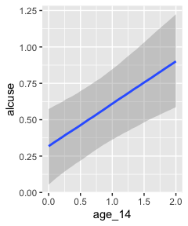<!-- -->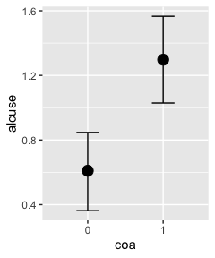<!-- -->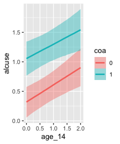<!-- -->

Much better. Now the plot for \(\gamma_{01}\) treats `coa` as binary and
our plot for the interaction between `age_14` and `coa` is much close to
the one in Figure 4.3. Since we’re already on a `conditional_effects()`
tangent, we may as well go further. When working with models like
`fit4.3` where you have multiple fixed effects, sometimes you only want
the plots for a subset of those effects. For example, if our main goal
is to do a good job tastefully reproducing the middle plot in Figure
4.3, we only need the interaction plot. In such a case, use the
`effects` argument.

``` r
conditional_effects(fit4.4, effects = "age_14:coa")
```

<!-- -->

Earlier we discussed how `conditional_effects()` lets users adjust some
of the output. But if you want an extensive overhaul, it’s better to
save the output of `conditional_effects()` as an object and manipulate
that object with the `plot()` function.

``` r
ce <- conditional_effects(fit4.4, effects = "age_14:coa")

str(ce)
```

    ## List of 1
    ##  $ age_14:coa:'data.frame':  200 obs. of  13 variables:
    ##   ..$ age_14    : num [1:200] 0 0 0.0202 0.0202 0.0404 ...
    ##   ..$ coa       : Factor w/ 2 levels "0","1": 1 2 1 2 1 2 1 2 1 2 ...
    ##   ..$ alcuse    : num [1:200] 0.922 0.922 0.922 0.922 0.922 ...
    ##   ..$ Intercept : num [1:200] 1 1 1 1 1 1 1 1 1 1 ...
    ##   ..$ intercept : num [1:200] 1 1 1 1 1 1 1 1 1 1 ...
    ##   ..$ id        : logi [1:200] NA NA NA NA NA NA ...
    ##   ..$ cond__    : Factor w/ 1 level "1": 1 1 1 1 1 1 1 1 1 1 ...
    ##   ..$ effect1__ : num [1:200] 0 0 0.0202 0.0202 0.0404 ...
    ##   ..$ effect2__ : Factor w/ 2 levels "0","1": 1 2 1 2 1 2 1 2 1 2 ...
    ##   ..$ estimate__: num [1:200] 0.318 1.055 0.324 1.059 0.33 ...
    ##   ..$ se__      : num [1:200] 0.135 0.146 0.134 0.145 0.133 ...
    ##   ..$ lower__   : num [1:200] 0.0545 0.7652 0.0612 0.7713 0.0689 ...
    ##   ..$ upper__   : num [1:200] 0.574 1.344 0.578 1.347 0.583 ...
    ##   ..- attr(*, "effects")= chr [1:2] "age_14" "coa"
    ##   ..- attr(*, "response")= chr "alcuse"
    ##   ..- attr(*, "surface")= logi FALSE
    ##   ..- attr(*, "categorical")= logi FALSE
    ##   ..- attr(*, "ordinal")= logi FALSE
    ##   ..- attr(*, "points")='data.frame':    246 obs. of  6 variables:
    ##   .. ..$ age_14   : num [1:246] 0 1 2 0 1 2 0 1 2 0 ...
    ##   .. ..$ coa      : Factor w/ 2 levels "0","1": 2 2 2 2 2 2 2 2 2 2 ...
    ##   .. ..$ resp__   : num [1:246] 1.73 2 2 0 0 ...
    ##   .. ..$ cond__   : Factor w/ 1 level "1": 1 1 1 1 1 1 1 1 1 1 ...
    ##   .. ..$ effect1__: num [1:246] 0 1 2 0 1 2 0 1 2 0 ...
    ##   .. ..$ effect2__: Factor w/ 2 levels "0","1": 2 2 2 2 2 2 2 2 2 2 ...
    ##  - attr(*, "class")= chr "brms_conditional_effects"

Our `ce` is an object of class “’brms\_conditional\_effects” which
contains a list of a single data frame. Had we omitted our `effects`
argument, above, we’d have a list of 3 instead. Anyway, these data
frames contain the necessary information to produce the plot. The
advantage of saving `me` this way is we can now insert it into the
`plot()` function. The simple output is the same as before.

``` r
plot(ce)
```

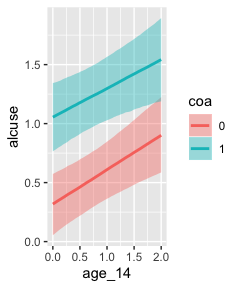<!-- -->

The `plot()` function will allow us to do other things, like add in the
original data or omit the white grid lines.

``` r
ce %>% 
  plot(points = T,
       point_args = list(size = 1/4, alpha = 1/4, width = .05, height = .05, color = "black"),
       theme = theme(panel.grid = element_blank()))
```

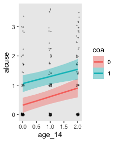<!-- -->

And for even more control, you can tack on typical **ggplot2**
functions. But when you want to do so, make sure to set the `plot =
FALSE` argument and then subset after the right parenthesis of the
`plot()` function.

``` r
plot(ce, 
     theme = theme(legend.position = "none",
                   panel.grid = element_blank()),
     plot = FALSE)[[1]] +
  annotate(geom = "text",
           x = 2.1, y = c(.95, 1.55),
           label = str_c("coa = ", 0:1),
           hjust = 0, size = 3.5) +
  scale_fill_brewer(type = "qual") +
  scale_color_brewer(type = "qual") +
  scale_x_continuous("age", limits = c(-1, 3), labels = 13:17) +
  scale_y_continuous(limits = c(0, 2), breaks = 0:2)
```

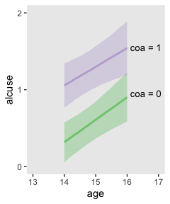<!-- -->

But anyway, let’s get back on track and talk about the variance
components. Singer and Willett contrasted \(\sigma_\epsilon^2\) from
Model B to the new one from Model C. We might use `VarCorr()` to do the
same.

``` r
VarCorr(fit4.2)[[2]]
```

    ## $sd
    ##   Estimate  Est.Error      Q2.5     Q97.5
    ##  0.6091221 0.05178938 0.5178184 0.7180072

``` r
VarCorr(fit4.3)[[2]]
```

    ## $sd
    ##   Estimate  Est.Error      Q2.5     Q97.5
    ##  0.6075042 0.05160899 0.5173927 0.7195604

We could have also extracted that information by subsetting
`posterior_summary()`.

``` r
posterior_summary(fit4.2)["sigma", ]
```

    ##   Estimate  Est.Error       Q2.5      Q97.5 
    ## 0.60912214 0.05178938 0.51781844 0.71800716

``` r
posterior_summary(fit4.3)["sigma", ]
```

    ##   Estimate  Est.Error       Q2.5      Q97.5 
    ## 0.60750423 0.05160899 0.51739275 0.71956038

Anyway, to get these in a variance metric, just square their posterior
samples and summarize.

Our next task is to formally compare `fit4.2` and `fit4.3` in terms of
declines in \(\sigma_0^2\) and \(\sigma_1^2\).

``` r
bind_cols(
  posterior_samples(fit4.2) %>% 
    transmute(fit2_sigma_2_0 = sd_id__Intercept^2,
              fit2_sigma_2_1 = sd_id__age_14^2),
  posterior_samples(fit4.3) %>% 
    transmute(fit3_sigma_2_0 = sd_id__Intercept^2,
              fit3_sigma_2_1 = sd_id__age_14^2)
) %>% 
  mutate(`decline~'in'~sigma[0]^2` = (fit2_sigma_2_0 - fit3_sigma_2_0) / fit2_sigma_2_0,
         `decline~'in'~sigma[1]^2` = (fit2_sigma_2_1 - fit3_sigma_2_1) / fit2_sigma_2_1) %>% 
  pivot_longer(contains("decline")) %>% 
  
  ggplot(aes(x = value)) +
  geom_vline(xintercept = 0, color = "white") +
  geom_density(fill = "grey25", color = "transparent") +
  scale_y_continuous(NULL, breaks = NULL) +
  scale_x_continuous(NULL, limits = c(-5, 2)) +
  theme(panel.grid = element_blank()) +
  facet_wrap(~name, labeller = label_parsed, ncol = 1)
```

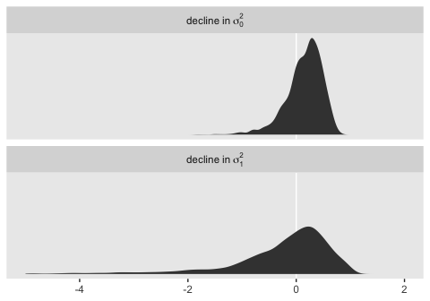<!-- -->

Here are the percents of variance declined from `fit4.2` to `fit4.3`.

``` r
bind_cols(
  posterior_samples(fit4.2) %>% 
    transmute(fit2_sigma_2_0 = sd_id__Intercept^2,
              fit2_sigma_2_1 = sd_id__age_14^2),
  posterior_samples(fit4.3) %>% 
    transmute(fit3_sigma_2_0 = sd_id__Intercept^2,
              fit3_sigma_2_1 = sd_id__age_14^2)
) %>% 
  mutate(`decline~'in'~sigma[0]^2` = (fit2_sigma_2_0 - fit3_sigma_2_0) / fit2_sigma_2_0,
         `decline~'in'~sigma[1]^2` = (fit2_sigma_2_1 - fit3_sigma_2_1) / fit2_sigma_2_1) %>% 
  pivot_longer(contains("decline")) %>% 
  group_by(name) %>% 
  summarise(mean   = mean(value),
            median = median(value),
            sd     = sd(value),
            ll     = quantile(value, prob = .025),
            ul     = quantile(value, prob = .975))
```

    ## # A tibble: 2 x 6
    ##   name                      mean  median     sd     ll    ul
    ##   <chr>                    <dbl>   <dbl>  <dbl>  <dbl> <dbl>
    ## 1 decline~'in'~sigma[0]^2  0.152  0.207   0.335 -0.659 0.650
    ## 2 decline~'in'~sigma[1]^2 -1.96  -0.0549 27.2   -6.91  0.873

In this case, we end up with massive uncertainty when working with the
full posteriors. This is particularly the case with the difference in
\(\sigma_1^2\), which is left skewed for days. Here are the results is
we only use point estimates.

``` r
bind_cols(
  posterior_samples(fit4.2) %>% 
    transmute(fit2_sigma_2_0 = sd_id__Intercept^2,
              fit2_sigma_2_1 = sd_id__age_14^2),
  posterior_samples(fit4.3) %>% 
    transmute(fit3_sigma_2_0 = sd_id__Intercept^2,
              fit3_sigma_2_1 = sd_id__age_14^2)
) %>% 
  summarise_all(median) %>% 
  transmute(`% decline in sigma_2_0` = 100 * (fit2_sigma_2_0 - fit3_sigma_2_0) / fit2_sigma_2_0,
            `% decline in sigma_2_1` = 100 * (fit2_sigma_2_1 - fit3_sigma_2_1) / fit2_sigma_2_1)
```

    ##   % decline in sigma_2_0 % decline in sigma_2_1
    ## 1               20.73695              -4.800244

“These variance components are now called *partial* or *conditional*
variances because they quantify the interindividual differences in
change that remain unexplained by the model’s predictors” (p. 108,
emphasis in the original).

#### Model D: The controlled effects of COA.

This model follows the form

Fit the model.

``` r
fit4.5 <-
  brm(data = alcohol1_pp, 
      family = gaussian,
      alcuse ~ 0 + Intercept + age_14 + coa + peer + age_14:coa + age_14:peer + (1 + age_14 | id),
      prior = c(prior(student_t(3, 0, 10), class = sd),
                prior(student_t(3, 0, 10), class = sigma),
                prior(lkj(1), class = cor)),
      iter = 2000, warmup = 1000, chains = 4, cores = 4,
      seed = 4,
      file = "fits/fit04.05")
```

``` r
print(fit4.5, digits = 3)
```

    ##  Family: gaussian 
    ##   Links: mu = identity; sigma = identity 
    ## Formula: alcuse ~ 0 + Intercept + age_14 + coa + peer + age_14:coa + age_14:peer + (1 + age_14 | id) 
    ##    Data: alcohol1_pp (Number of observations: 246) 
    ## Samples: 4 chains, each with iter = 2000; warmup = 1000; thin = 1;
    ##          total post-warmup samples = 4000
    ## 
    ## Group-Level Effects: 
    ## ~id (Number of levels: 82) 
    ##                       Estimate Est.Error l-95% CI u-95% CI  Rhat Bulk_ESS Tail_ESS
    ## sd(Intercept)            0.481     0.099    0.291    0.677 1.001      687     1661
    ## sd(age_14)               0.363     0.080    0.205    0.519 1.008      296      649
    ## cor(Intercept,age_14)    0.122     0.334   -0.415    0.866 1.004      307      457
    ## 
    ## Population-Level Effects: 
    ##             Estimate Est.Error l-95% CI u-95% CI  Rhat Bulk_ESS Tail_ESS
    ## Intercept     -0.315     0.149   -0.612   -0.009 1.001     1573     2265
    ## age_14         0.434     0.118    0.201    0.667 1.004     1421     2066
    ## coa            0.578     0.168    0.239    0.911 1.000     2305     2525
    ## peer           0.694     0.116    0.464    0.920 1.001     1550     1976
    ## age_14:coa    -0.017     0.129   -0.268    0.231 1.003     2230     2567
    ## age_14:peer   -0.151     0.089   -0.329    0.025 1.002     1551     2126
    ## 
    ## Family Specific Parameters: 
    ##       Estimate Est.Error l-95% CI u-95% CI  Rhat Bulk_ESS Tail_ESS
    ## sigma    0.607     0.048    0.519    0.703 1.002      500     1300
    ## 
    ## Samples were drawn using sampling(NUTS). For each parameter, Bulk_ESS
    ## and Tail_ESS are effective sample size measures, and Rhat is the potential
    ## scale reduction factor on split chains (at convergence, Rhat = 1).

All our \(\gamma\) estimates are similar to those presented in Table
4.1. Let’s compute the variances and the covariance, \(\sigma_{01}^2\).
Here are the plots.

``` r
 v <-
  posterior_samples(fit4.5) %>% 
  transmute(sigma_2_epsilon = sigma^2,
            sigma_2_0       = sd_id__Intercept^2,
            sigma_2_1       = sd_id__age_14^2,
            sigma_01        = sd_id__Intercept * cor_id__Intercept__age_14 * sd_id__age_14)

v %>% 
  pivot_longer(everything()) %>% 
  ggplot(aes(x = value)) +
  geom_density(size = 0, fill = "black") +
  scale_y_continuous(NULL, breaks = NULL) +
  theme(panel.grid = element_blank()) +
  facet_wrap(~name, scales = "free")
```

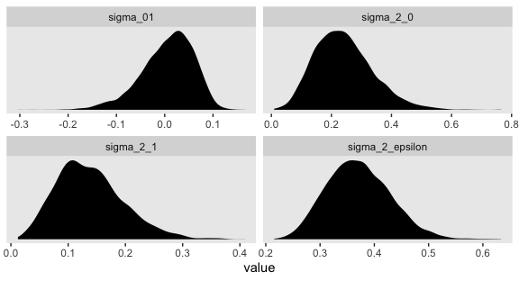<!-- -->

And now we compute the summary statistics.

``` r
v %>% 
  pivot_longer(everything()) %>% 
  group_by(name) %>% 
  summarise(mean   = mean(value),
            median = median(value),
            sd     = sd(value),
            ll     = quantile(value, prob = .025),
            ul     = quantile(value, prob = .975)) %>% 
  mutate_if(is.double, round, digits = 3)
```

    ## # A tibble: 4 x 6
    ##   name             mean median    sd     ll    ul
    ##   <chr>           <dbl>  <dbl> <dbl>  <dbl> <dbl>
    ## 1 sigma_01        0.006  0.013 0.054 -0.12  0.091
    ## 2 sigma_2_0       0.242  0.233 0.097  0.084 0.458
    ## 3 sigma_2_1       0.138  0.132 0.059  0.042 0.269
    ## 4 sigma_2_epsilon 0.371  0.368 0.058  0.269 0.494

Like the \(\gamma\)s, our variance components are all similar to those
in the text.

``` r
bind_cols(
  posterior_samples(fit4.2) %>% 
  transmute(fit4.2_sigma_2_epsilon = sigma^2,
            fit4.2_sigma_2_0 = sd_id__Intercept^2,
            fit4.2_sigma_2_1 = sd_id__age_14^2),
  posterior_samples(fit4.5) %>% 
  transmute(fit4.5_sigma_2_epsilon = sigma^2,
            fit4.5_sigma_2_0 = sd_id__Intercept^2,
            fit4.5_sigma_2_1 = sd_id__age_14^2)
) %>% 
  summarise_all(median) %>% 
  mutate(`% decline in sigma_2_epsilon` = 100 * (fit4.2_sigma_2_epsilon - fit4.5_sigma_2_epsilon) / fit4.2_sigma_2_epsilon,
         `% decline in sigma_2_0` = 100 * (fit4.2_sigma_2_0 - fit4.5_sigma_2_0) / fit4.2_sigma_2_0,
         `% decline in sigma_2_1` = 100 * (fit4.2_sigma_2_1 - fit4.5_sigma_2_1) / fit4.2_sigma_2_1) %>% 
  pivot_longer(contains("%")) %>% 
  select(name, value)
```

    ## # A tibble: 3 x 2
    ##   name                          value
    ##   <chr>                         <dbl>
    ## 1 % decline in sigma_2_epsilon -0.299
    ## 2 % decline in sigma_2_0       62.4  
    ## 3 % decline in sigma_2_1        2.47

The percentages in which our variance componence declined relative to
the unconditional growth model are of similar orders of magnitude as
those presented in the
text.

#### Model E: A tentative “final model” for the controlled effects of `coa`.

This model is just like the last, but with the simple omission of the
\(\gamma_{12}\) parameter.

``` r
fit4.6 <-
  brm(data = alcohol1_pp, 
      family = gaussian,
      alcuse ~ 0 + Intercept + age_14 + coa + peer + age_14:peer + (1 + age_14 | id),
      prior = c(prior(student_t(3, 0, 10), class = sd),
                prior(student_t(3, 0, 10), class = sigma),
                prior(lkj(1), class = cor)),
      iter = 2000, warmup = 1000, chains = 4, cores = 4,
      seed = 4,
      file = "fits/fit04.06")
```

``` r
print(fit4.6, digits = 3)
```

    ##  Family: gaussian 
    ##   Links: mu = identity; sigma = identity 
    ## Formula: alcuse ~ 0 + Intercept + age_14 + coa + peer + age_14:peer + (1 + age_14 | id) 
    ##    Data: alcohol1_pp (Number of observations: 246) 
    ## Samples: 4 chains, each with iter = 2000; warmup = 1000; thin = 1;
    ##          total post-warmup samples = 4000
    ## 
    ## Group-Level Effects: 
    ## ~id (Number of levels: 82) 
    ##                       Estimate Est.Error l-95% CI u-95% CI  Rhat Bulk_ESS Tail_ESS
    ## sd(Intercept)            0.482     0.102    0.274    0.676 1.002      574     1118
    ## sd(age_14)               0.362     0.083    0.200    0.521 1.008      303      687
    ## cor(Intercept,age_14)    0.120     0.343   -0.419    0.879 1.006      267      346
    ## 
    ## Population-Level Effects: 
    ##             Estimate Est.Error l-95% CI u-95% CI  Rhat Bulk_ESS Tail_ESS
    ## Intercept     -0.313     0.156   -0.626   -0.006 1.000     1732     2244
    ## age_14         0.423     0.109    0.206    0.640 1.001     1821     2419
    ## coa            0.572     0.151    0.279    0.879 1.003     1939     2531
    ## peer           0.695     0.116    0.464    0.917 1.002     1857     2474
    ## age_14:peer   -0.150     0.087   -0.318    0.024 1.000     1754     2224
    ## 
    ## Family Specific Parameters: 
    ##       Estimate Est.Error l-95% CI u-95% CI  Rhat Bulk_ESS Tail_ESS
    ## sigma    0.606     0.048    0.516    0.705 1.005      361     1112
    ## 
    ## Samples were drawn using sampling(NUTS). For each parameter, Bulk_ESS
    ## and Tail_ESS are effective sample size measures, and Rhat is the potential
    ## scale reduction factor on split chains (at convergence, Rhat = 1).

The \(\gamma\)s all look well behaved. Here are the variance component
summaries.

``` r
 v <-
  posterior_samples(fit4.6) %>% 
  transmute(sigma_2_epsilon = sigma^2,
            sigma_2_0       = sd_id__Intercept^2,
            sigma_2_1       = sd_id__age_14^2,
            sigma_01        = sd_id__Intercept * cor_id__Intercept__age_14 * sd_id__age_14)

v %>% 
  pivot_longer(everything()) %>% 
  group_by(name) %>% 
  summarise(mean   = mean(value),
            median = median(value),
            sd     = sd(value),
            ll     = quantile(value, prob = .025),
            ul     = quantile(value, prob = .975)) %>% 
  mutate_if(is.double, round, digits = 3)
```

    ## # A tibble: 4 x 6
    ##   name             mean median    sd     ll    ul
    ##   <chr>           <dbl>  <dbl> <dbl>  <dbl> <dbl>
    ## 1 sigma_01        0.005  0.01  0.054 -0.116 0.093
    ## 2 sigma_2_0       0.243  0.233 0.098  0.075 0.457
    ## 3 sigma_2_1       0.138  0.132 0.06   0.04  0.271
    ## 4 sigma_2_epsilon 0.37   0.365 0.059  0.267 0.497

### 4.5.3 Displaying prototypical change trajectories.

On page 111, Singer and Willett computed the various levels of the
\(\pi\)s when `coa == 0` or `coa == 1`. To follow along, we’ll want to
work directly with the posterior samples of `fit4.3`.

``` r
post <- posterior_samples(fit4.3) 

post %>% 
  select(starts_with("b_")) %>% 
  head()
```

    ##   b_Intercept  b_age_14     b_coa b_age_14:coa
    ## 1   0.2618439 0.2495084 0.8431245  -0.08459538
    ## 2   0.2911188 0.3038611 0.9213667  -0.10428155
    ## 3   0.3188864 0.2983608 0.8543070  -0.09359624
    ## 4   0.1661855 0.3694042 0.9406988  -0.20639550
    ## 5   0.3612977 0.2752802 0.6327648   0.04498002
    ## 6   0.2614384 0.2797979 0.7827562  -0.07184190

Here we apply the formulas to the posterior samples and then summarize
with posterior means.

``` r
post %>%
  select(starts_with("b_")) %>% 
  transmute(pi_0_coa0 = b_Intercept + b_coa          * 0,
            pi_1_coa0 = b_age_14    + `b_age_14:coa` * 0,
            pi_0_coa1 = b_Intercept + b_coa          * 1,
            pi_1_coa1 = b_age_14    + `b_age_14:coa` * 1) %>%
  pivot_longer(everything()) %>% 
  group_by(name) %>%
  summarise(posterior_mean = mean(value) %>% round(digits = 3))
```

    ## # A tibble: 4 x 2
    ##   name      posterior_mean
    ##   <chr>              <dbl>
    ## 1 pi_0_coa0          0.314
    ## 2 pi_0_coa1          1.05 
    ## 3 pi_1_coa0          0.294
    ## 4 pi_1_coa1          0.245

We already plotted these trajectories, with the addition of their 95%
intervals, a few sections up. If we want to work with the full composite
model to predict \(Y_{ij}\) (i.e., `alcuse`) directly, we multiply the
`b_coa`, `b_age_14`, and `b_age_14:coa` vectors by the appropriate
values of `coa` and `peer`. For example, here’s what you’d code if you
wanted the initial `alcuse` status for when `coa == 1`.

``` r
post %>%
  select(starts_with("b_")) %>% 
  mutate(y = b_Intercept + b_coa * 1 + b_age_14 * 0 + `b_age_14:coa` * 0 * 1) %>% 
  head()
```

    ##   b_Intercept  b_age_14     b_coa b_age_14:coa         y
    ## 1   0.2618439 0.2495084 0.8431245  -0.08459538 1.1049684
    ## 2   0.2911188 0.3038611 0.9213667  -0.10428155 1.2124855
    ## 3   0.3188864 0.2983608 0.8543070  -0.09359624 1.1731934
    ## 4   0.1661855 0.3694042 0.9406988  -0.20639550 1.1068843
    ## 5   0.3612977 0.2752802 0.6327648   0.04498002 0.9940625
    ## 6   0.2614384 0.2797979 0.7827562  -0.07184190 1.0441946

If you were to take the mean of that new `y` column, you’d discover it’s
the same as the mean of our `pi_0_coa1`, above.

``` r
post %>%
  select(starts_with("b_")) %>% 
  mutate(y = b_Intercept + b_coa * 1 + b_age_14 * 0 + `b_age_14:coa` * 0 * 1) %>% 
  summarise(pi_0_coa1 = mean(y))
```

    ##   pi_0_coa1
    ## 1  1.053244

Singer and Willett suggested four strategies to help researchers pick
the prototypical values of the predictors to focus on:

  - Substantively interesting values (e.g., typical ages, values
    corresponding to transition points)
  - A range of percentiles (e.g., 25<sup>th</sup>, 50<sup>th</sup>, and
    75<sup>th</sup>)
  - Just the sample mean
  - The sample mean \(\pm\) something like 1 standard deviation

They next discuss the right panel of Figure 4.3. We could continue to
work directly with the `posterior_samples()` to make our version of that
figure. But it you want to accompany the posterior mean trajectories
with their 95% intervals, and I hope you do, the `posterior_samples()`
method will get tedious. Happily, **brms** offers users and alternative
with the `fitted()` function. Since the right panel is somewhat
complicated, it’ll behove us to practice with the simpler left panel,
first.

In `fit4.2` (i.e., Model C), there is only one predictor, `age_14`. Here
we’ll specify the values along the range in the original data, ranging
from 0 to 2. However, we end up specifying a bunch of values within that
range in addition to the two endpoints. This is because the 95%
intervals typically have a bowtie shape. To depict that shape well, we
need more than a couple values. We save those values as a tibble called
`nd` (i.e., new data). We make use of them within fitted with the
`newdata = nd` argument.

Since we’re only interested in the general trajectory, the consequence
of the \(\gamma\)s, we end up coding `re_formula = NA`. In so doing, we
ask `fitted()` to ignore the group-level effects. In this example, that
means we are ignoring the `id`-level deviations from the overall
trajectories. If you’re confused by that that means, don’t worry. That
part of the model should become more clear as we go along in the text.

Since `fitted()` returns an array, we then convert the results into a
data frame for use within the tidyverse framework. For plotting, it’s
handy to bind those results together with the `nd`, the predictor values
we used to compute the fitted values with. In the final wrangling step,
we use our `age_14` values to compute the `age` values.

``` r
nd <- 
  tibble(age_14 = seq(from = 0, to = 2, length.out = 30))

f <- 
  fitted(fit4.2, 
         newdata = nd,
         re_formula = NA) %>%
  data.frame() %>%
  bind_cols(nd) %>% 
  mutate(age = age_14 + 14)

head(f)
```

    ##    Estimate Est.Error      Q2.5     Q97.5     age_14      age
    ## 1 0.6482574 0.1081590 0.4376040 0.8698159 0.00000000 14.00000
    ## 2 0.6670799 0.1063590 0.4620157 0.8842208 0.06896552 14.06897
    ## 3 0.6859024 0.1047164 0.4842801 0.8978622 0.13793103 14.13793
    ## 4 0.7047250 0.1032386 0.5068118 0.9121371 0.20689655 14.20690
    ## 5 0.7235475 0.1019329 0.5299203 0.9271172 0.27586207 14.27586
    ## 6 0.7423700 0.1008058 0.5503669 0.9437117 0.34482759 14.34483

Since we only had one predictor, `age_14`, for which we specified 30
specific values, we ended up with 30 rows in our output. By default,
`fitted()` summarized the fitted values with posterior means
(`Estimate`), standard deviations (`Est.Error`), and percentile-based
95% intervals (`Q2.5` and `Q97.5`). The other columns are the values we
bound to them. Here’s how we might use these to make our `fitted()`
version of the leftmost panel of Figure 4.3.

``` r
f %>%
  ggplot(aes(x = age)) +
  geom_ribbon(aes(ymin = Q2.5, ymax = Q97.5),
              fill = "grey75", alpha = 3/4) +
  geom_line(aes(y = Estimate)) +
  scale_y_continuous("alcuse", breaks = 0:2, limits = c(0, 2)) +
  coord_cartesian(xlim = 13:17) +
  theme(panel.grid = element_blank())
```

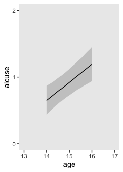<!-- -->

With `fit4.6` (i.e., Model E), we now have three predictors. We’d like
to see the full range across `age_14` for four combinations of `coa` and
`peer` values. To my mind, the easiest way to get those values right is
with a series of `expand()` functions.

``` r
nd <-
  crossing(coa  = 0:1,
           peer = c(.655, 1.381)) %>% 
  expand(nesting(coa, peer),
         age_14 = seq(from = 0, to = 2, length.out = 30))

head(nd, n = 10)
```

    ## # A tibble: 10 x 3
    ##      coa  peer age_14
    ##    <int> <dbl>  <dbl>
    ##  1     0 0.655 0     
    ##  2     0 0.655 0.0690
    ##  3     0 0.655 0.138 
    ##  4     0 0.655 0.207 
    ##  5     0 0.655 0.276 
    ##  6     0 0.655 0.345 
    ##  7     0 0.655 0.414 
    ##  8     0 0.655 0.483 
    ##  9     0 0.655 0.552 
    ## 10     0 0.655 0.621

Now we use `fitted()` much like before.

``` r
f <- 
  fitted(fit4.6, 
         newdata = nd,
         re_formula = NA) %>%
  data.frame() %>%
  bind_cols(nd) %>%
  # a little wrangling will make plotting much easier
  mutate(age  = age_14 + 14,
         coa  = ifelse(coa == 0, "coa = 0", "coa = 1"),
         peer = factor(peer))

glimpse(f)
```

    ## Observations: 120
    ## Variables: 8
    ## $ Estimate  <dbl> 0.1425897, 0.1649825, 0.1873752, 0.2097680, 0.2321607, 0.2545535, 0.2769462, 0.…
    ## $ Est.Error <dbl> 0.1134501, 0.1117202, 0.1101835, 0.1088480, 0.1077213, 0.1068100, 0.1061196, 0.…
    ## $ Q2.5      <dbl> -0.078688764, -0.053886847, -0.028335511, -0.004650132, 0.020322470, 0.04483448…
    ## $ Q97.5     <dbl> 0.3669462, 0.3856548, 0.4047552, 0.4244724, 0.4453436, 0.4642707, 0.4854083, 0.…
    ## $ coa       <chr> "coa = 0", "coa = 0", "coa = 0", "coa = 0", "coa = 0", "coa = 0", "coa = 0", "c…
    ## $ peer      <fct> 0.655, 0.655, 0.655, 0.655, 0.655, 0.655, 0.655, 0.655, 0.655, 0.655, 0.655, 0.…
    ## $ age_14    <dbl> 0.00000000, 0.06896552, 0.13793103, 0.20689655, 0.27586207, 0.34482759, 0.41379…
    ## $ age       <dbl> 14.00000, 14.06897, 14.13793, 14.20690, 14.27586, 14.34483, 14.41379, 14.48276,…

For our version of the right panel of Figure 4.3, most of the action is
in `ggplot()`, `geom_ribbon()`, `geom_line()`, and `facet_wrap()`. All
the rest is cosmetic.

``` r
f %>%
  ggplot(aes(x = age, color = peer, fill = peer)) +
  geom_ribbon(aes(ymin = Q2.5, ymax = Q97.5),
              size = 0, alpha = 1/4) +
  geom_line(aes(y = Estimate, size = peer)) +
  scale_size_manual(values = c(1/2, 1)) +
  scale_fill_manual(values = c("blue3", "red3")) +
  scale_color_manual(values = c("blue3", "red3")) +
  scale_y_continuous("alcuse", breaks = 0:2) +
  coord_cartesian(xlim = 13:17) +
  labs(subtitle = "High peer values are in red;\nlow ones are in blue.") +
  theme(legend.position = "none",
        panel.grid = element_blank()) +
  facet_wrap(~coa)
```

<!-- -->

In my opinion, it works better to split the plot into two when you
include the 95% intervals.

### Recentering predictors to improve interpretation.

> The easiest strategy for recentering a time-invariant predictor is to
> subtract its sample mean from each observed value. When we center a
> predictor on its sample mean, the level-2 fitted intercepts represent
> the average fitted values of initial status (or rate of change). We
> can also recenter a time-invariant predictor by subtracting another
> meaningful value… Recentering works best when the centering constant
> is substantively meaningful. (pp. 113–114)

As we’ll see later, centering can also make it easier to select
meaningful priors on the model intercept. If you look at our
`alcohol1_pp` data, you’ll see we already have centered versions of our
time-invariant predictors. They’re the last two columns: `cpeer` and
`ccoa`.

``` r
alcohol1_pp %>% 
  glimpse()
```

    ## Observations: 246
    ## Variables: 9
    ## $ id     <dbl> 1, 1, 1, 2, 2, 2, 3, 3, 3, 4, 4, 4, 5, 5, 5, 6, 6, 6, 7, 7, 7, 8, 8, 8, 9, 9, 9, 1…
    ## $ age    <dbl> 14, 15, 16, 14, 15, 16, 14, 15, 16, 14, 15, 16, 14, 15, 16, 14, 15, 16, 14, 15, 16…
    ## $ coa    <dbl> 1, 1, 1, 1, 1, 1, 1, 1, 1, 1, 1, 1, 1, 1, 1, 1, 1, 1, 1, 1, 1, 1, 1, 1, 1, 1, 1, 1…
    ## $ male   <dbl> 0, 0, 0, 1, 1, 1, 1, 1, 1, 1, 1, 1, 0, 0, 0, 1, 1, 1, 0, 0, 0, 1, 1, 1, 1, 1, 1, 0…
    ## $ age_14 <dbl> 0, 1, 2, 0, 1, 2, 0, 1, 2, 0, 1, 2, 0, 1, 2, 0, 1, 2, 0, 1, 2, 0, 1, 2, 0, 1, 2, 0…
    ## $ alcuse <dbl> 1.732051, 2.000000, 2.000000, 0.000000, 0.000000, 1.000000, 1.000000, 2.000000, 3.…
    ## $ peer   <dbl> 1.2649111, 1.2649111, 1.2649111, 0.8944272, 0.8944272, 0.8944272, 0.8944272, 0.894…
    ## $ cpeer  <dbl> 0.2469111, 0.2469111, 0.2469111, -0.1235728, -0.1235728, -0.1235728, -0.1235728, -…
    ## $ ccoa   <dbl> 0.549, 0.549, 0.549, 0.549, 0.549, 0.549, 0.549, 0.549, 0.549, 0.549, 0.549, 0.549…

If you wanted to center them by hand, you’d just do something like this.

``` r
alcohol1_pp %>% 
  mutate(peer_c = peer - mean(peer))
```

    ## # A tibble: 246 x 10
    ##       id   age   coa  male age_14 alcuse  peer  cpeer  ccoa peer_c
    ##    <dbl> <dbl> <dbl> <dbl>  <dbl>  <dbl> <dbl>  <dbl> <dbl>  <dbl>
    ##  1     1    14     1     0      0   1.73 1.26   0.247 0.549  0.247
    ##  2     1    15     1     0      1   2    1.26   0.247 0.549  0.247
    ##  3     1    16     1     0      2   2    1.26   0.247 0.549  0.247
    ##  4     2    14     1     1      0   0    0.894 -0.124 0.549 -0.123
    ##  5     2    15     1     1      1   0    0.894 -0.124 0.549 -0.123
    ##  6     2    16     1     1      2   1    0.894 -0.124 0.549 -0.123
    ##  7     3    14     1     1      0   1    0.894 -0.124 0.549 -0.123
    ##  8     3    15     1     1      1   2    0.894 -0.124 0.549 -0.123
    ##  9     3    16     1     1      2   3.32 0.894 -0.124 0.549 -0.123
    ## 10     4    14     1     1      0   0    1.79   0.771 0.549  0.771
    ## # … with 236 more rows

Notice how our `peer_c` values, above, deviated slightly from those in
`cpeer`? That’s because `peer_c` was based on the exact sample mean.
Those in `cpeer` are based on the sample mean as provided in the text,
1.018, which is introduces rounding error. For the sake of simplicity,
we’ll go with centered variables matching up with the text.

Here we’ll hastily fit the models with help from the `update()`
function.

``` r
fit4.7 <-
  update(fit4.6,
         newdata = alcohol1_pp,
         alcuse ~ 0 + Intercept + age_14 + coa + cpeer + age_14:cpeer + (1 + age_14 | id),
         iter = 2000, warmup = 1000, chains = 4, cores = 4,
         seed = 4,
         file = "fits/fit04.07")

fit4.8 <-
  update(fit4.6,
         newdata = alcohol1_pp,
         alcuse ~ 0 + Intercept + age_14 + ccoa + peer + age_14:peer + (1 + age_14 | id),
         iter = 2000, warmup = 1000, chains = 4, cores = 4,
         seed = 4,
         file = "fits/fit04.08")
```

Here we reproduce the \(\gamma\)s from `fit4.6` and compare the to the
updates from `fit4.7` and `fit4.8`.

``` r
fixef(fit4.6) %>% round(digits = 3)
```

    ##             Estimate Est.Error   Q2.5  Q97.5
    ## Intercept     -0.313     0.156 -0.626 -0.006
    ## age_14         0.423     0.109  0.206  0.640
    ## coa            0.572     0.151  0.279  0.879
    ## peer           0.695     0.116  0.464  0.917
    ## age_14:peer   -0.150     0.087 -0.318  0.024

``` r
fixef(fit4.7) %>% round(digits = 3)
```

    ##              Estimate Est.Error   Q2.5 Q97.5
    ## Intercept       0.393     0.107  0.177 0.602
    ## age_14          0.271     0.065  0.146 0.397
    ## coa             0.572     0.149  0.287 0.870
    ## cpeer           0.692     0.113  0.465 0.907
    ## age_14:cpeer   -0.150     0.087 -0.323 0.016

``` r
fixef(fit4.8) %>% round(digits = 3)
```

    ##             Estimate Est.Error   Q2.5 Q97.5
    ## Intercept     -0.059     0.140 -0.327 0.224
    ## age_14         0.424     0.111  0.209 0.642
    ## ccoa           0.572     0.148  0.285 0.863
    ## peer           0.697     0.113  0.478 0.921
    ## age_14:peer   -0.150     0.087 -0.321 0.023

## 4.6 Comparing models using deviance statistics

As you will see, we will also make use of deviance within our Bayesian
Stan-based paradigm. But we’ll do so a little differently than what
Singer and Willett presented.

### 4.6.1 The deviance statistic.

As it turns out, we Bayesians use the log-likelihood (LL), too. Recall
how the numerator in the right-hand side of Bayes’ Theorem was
\(p(\text{data} | \theta) p(\theta)\)? That first part,
\(p(\text{data} | \theta)\), is the likelihood. In words, the likelihood
is the *probability of the data given the parameters*. And we take the
log of the likelihood rather than the likelihood itself because it’s
easier to work with statistically.

When you’re working with **brms**, you can extract the LL with the
`log_lik()` function. Here’s an example with `fit4.1`, our unconditional
means model.

``` r
log_lik(fit4.1) %>% 
  str()
```

    ##  num [1:4000, 1:246] -0.654 -0.788 -0.795 -0.65 -0.587 ...
    ##  - attr(*, "dimnames")=List of 2
    ##   ..$ : NULL
    ##   ..$ : NULL

You may have noticed we didn’t just get a single value back. Rather, we
got an array of 4000 rows and 246 columns. The reason we got 4000 rows
is because that’s how many post-warmup iterations we drew from the
posterior. I.e., we set `brm(..., iter = 2000, warmup = 1000, chains
= 4)`. With respect to the 246 columns, that’s how many rows there are
in the `alcohol1_pp` data. So for each case in the data, we get an
entire posterior distribution of LL values.

With the multilevel model, we can define deviance for a given model as
it’s LL times -2,

\[
\text{Deviance} = -2 LL_\text{current model}
\]

``` r
ll <-
  log_lik(fit4.1) %>%
  data.frame() %>% 
  mutate(ll = rowSums(.)) %>% 
  mutate(deviance = -2 * ll) %>% 
  select(ll, deviance, everything())

dim(ll)
```

    ## [1] 4000  248

Because we used HMC, deviance is a distribution rather than a single
number. Here’s what it looks like for `fit4.1`.

``` r
ll %>% 
  ggplot(aes(x = deviance)) +
  geom_density(fill = "grey25", size = 0) +
  scale_y_continuous(NULL, breaks = NULL) +
  theme(panel.grid = element_blank())
```

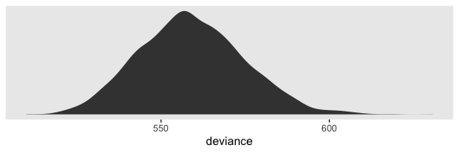<!-- -->

As do the frequentists, we Bayesian generally prefer models with smaller
deviances.

The reasons frequentists multiply the LL by -2 is because after doing
so, the difference in deviances between two models follows a \(\chi^2\)
distribution and the old \(\chi^2\) difference test is widely-used in
frequentist statistics. Bayesians often just go ahead and use the -2
multiplication, too. It’s largely out of tradition. But as we’ll see,
some contemporary Bayesians are challenging that tradition.

### 4.6.2. When and how can you compare deviance statistics?

As for the frequentists, deviance values in the Bayesian context are
only meaningful in the relative sense. You cannot directly interpret
single deviance values by their magnitudes or signs. But you can compare
two or more models by their relative deviance values. When doing so,
they must have been computed using the same data (i.e., no differences
in missingness in the predictors) and the models must be nested.

However, in contemporary Bayesian practice we don’t tend to compare
models with deviance. For details on why, check out Chapter 6 in
McElreath’s [*Statistical
Rethinking*](https://xcelab.net/rm/statistical-rethinking/). McElreath
also covered the topic in several online lectures (e.g.,
[here](https://www.youtube.com/watch?v=vSjL2Zc-gEQ&list=PLDcUM9US4XdMdZOhJWJJD4mDBMnbTWw_z&index=8)
and
[here](https://www.youtube.com/watch?v=gjrsYDJbRh0&list=PLDcUM9US4XdNM4Edgs7weiyIguLSToZRI&index=8)).

### 4.6.3 Implementing deviance-based hypothesis tests.

In this project, we are not going to practice comparing deviances using
frequentist \(\chi^2\) tests. We will, however, cover Bayesian
information
criteria.

### 4.6.4 ~~AIC and BIC~~ WAIC and LOO statistics: Comparing nonnested models using information criteria \[and cross validation\].

We do not use the AIC or the BIC within the Stan ecosystem. The AIC is
frequentist and cannot handle models with priors. The BIC is interesting
is it’s a double misnomer. It is neither Bayesian nor is it a proper
information criterion–though it does scale like one. However, it might
be useful for our purposes to walk out the AIC a bit. It’ll ground our
discussion of the WAIC and LOO. From [Spiegelhalter, Best, Carlin and
van der Linde
(2014)](https://www.jstor.org/stable/pdf/24774528.pdf?casa_token=cOkknddLwBsAAAAA:nwbGR1IDJtZHzGmhEUDJBLfELsSJUzgTR_r5j_gur7goLCihSBVdFhXeCZVxGKbj0B0Dr_4dZs52PsP4NEoFAM0M5OR7LusQSqGgGuyX147xIButrjzT),
we read:

> Suppose that we have a given set of candidate models, and we would
> like a criterion to assess which is ‘better’ in a defined sense.
> Assume that a model for observed data \(y\) postulates a density
> \(p(y | \theta)\) (which may include covariates etc.), and call
> \(D(\theta) = -2 \text{log} {p(y | \theta)}\) the deviance, here
> considered as a function of \(\theta\). Classical model choice uses
> hypothesis testing for comparing nested models, e.g. the deviance
> (likelihood ratio) test in generalized linear models. For non nested
> models, alternatives include the Akaike information criterion
> 
> \[AIC = -2 \log {p(y | \hat{\theta})} + 2k\]
> 
> where \(\hat{\theta}\) is the maximum likelihood estimate and \(k\) is
> the number of parameters in the model (dimension of \(\Theta\)).
> 
> AIC is built with the aim of favouring models that are likely to make
> good predictions. Since we generally do not have independent
> validation data, we can assess which model best predicts the
> *observed* data by using the deviance, but if parameters have been
> estimated we need some penalty for this double use of the data. AIC’s
> penalty of *2k* has been shown to be asymptotically equivalent to
> leave-one-out cross-validation. However, AIC does not work in models
> with informative prior information, such as hierarchical models, since
> the prior effectively acts to ‘restrict’ the freedom of the model
> parameters, so the appropriate ‘number of parameters’ is generally
> unclear. (pp. 485–486, *emphasis* in the original)

For the past two decades, the Deviance Information Criterion (DIC;
[Spiegelhalter, Best, Carlin and van der Linde
(2002)](https://rss.onlinelibrary.wiley.com/doi/full/10.1111/1467-9868.00353))
has been a popular information criterion among Bayesians. Let’s define
\(D\) as the posterior distribution of deviance values and \(\bar{D}\)
as its mean. If you compute deviance based on the posterior mean, you
have \(\hat{D}\). Within a multi-parameter model, this would be the
deviance based on the collection of the posterior mean of each
parameter. With these, we define the DIC as

\[\text{DIC} = \bar{D} + (\bar{D} + \hat{D}) + \bar{D} + p_D,\]

where \(p_D\) is the number of effective parameters in the model, which
is also sometimes referred to as the penalty term. As McElreath pointed
out in [*Statistical
Rethinking*](https://xcelab.net/rm/statistical-rethinking/), the \(p_D\)

> is just the expected distance between the deviance in-sample and the
> deviance out-of-sample. In the case of flat priors, DIC reduces
> directly to AIC, because the expected distance is just the number of
> parameters. But more generally, \(p_D\) will be some fraction of the
> number of parameters, because regularizing priors constrain a model’s
> flexibility. (p. 191)

As you’ll see, you can get the \(p_D\) for `brms::brm()` models.
However, the DIC is limited in that it requires a multivariate Gaussian
posterior and I’m not aware of a convenience function within **brms**
that will compute the DIC. Which is fine. The DIC has been overshadowed
in recent years by newer methods. But for a great talk on the DIC, check
out the authoritative David Spiegelhalter’s [*Retrospective read paper:
Bayesian measure of model complexity and
fit*](https://www.youtube.com/watch?v=H-59eqmHuuQ&frags=pl%2Cwn).

#### The Widely Applicable Information Criterion (WAIC).

The main information criterion within our Stan ecosystem paradigm is the
Widely Applicable Information Criterion (WAIC;
[Watanabe, 2010](http://www.jmlr.org/papers/volume11/watanabe10a/watanabe10a.pdf)).
From McElreath, again, we read:

> It does not require a multivariate Gaussian posterior, and it is often
> more accurate than DIC. There are types of models for which it is hard
> to define at all, however. We’ll discuss that issue more, after
> defining WAIC.
> 
> The distinguishing feature of WAIC is that it is *pointwise*. This
> means that uncertainty in prediction is considered case-by-case, or
> point-by-point, in the data. This is useful, because some observations
> are much harder to predict than others and may also have different
> uncertainty… You can think of WAIC as handling uncertainty where it
> actually matters: for each independent observation.
> 
> Define \(\text{Pr} (y_i)\) as the average likelihood of observation
> \(i\) in the training sample. This means we compute the likelihood of
> \(y_i\) for each set of parameters samples from the posterior
> distribution. Then we average the likelihoods for each observation
> \(i\) and finally sum over all observations. This produces the first
> part of WAIC, the log-pointwise-predictive-density,
> 
> \[\text{lppd} = \sum_{i = 1}^N \text{log Pr} (y_i)\]
> 
> You might say this out loud as:
> 
> > *The log-pointwise-predictive-density is the total across
> > observations of the logarithm of the average likelihood of each
> > observation.*
> 
> The lppd is just a pointwise analog of deviance, averaged over the
> posterior distribution. If you multiplied it by -2, it’d be similar to
> the deviance, in fact.
> 
> The second piece of WAIC is the effective number of parameters
> \(p_\text{WAIC}\). Define \(V(y_i)\) as the variance in log-likelihood
> for observation \(i\) in the training sample. This means we compute
> the log-likelihood of \(y_i\) for each sample from the posterior
> distribution. Then we take the variance of those values. This is
> \(V(y_i)\). Now \(p_\text{WAIC}\) is defined as:
> 
> \[p_\text{WAIC} = \sum_{i=1}^N V(y_i)\]
> 
> Now WAIC is defined as:
> 
> \[\text{WAIC} = -2(\text{lppd} - p_\text{WAIC})\]
> 
> And this value is yet another estimate of out-of-sample deviance.
> (pp. 191–192, emphasis in the original)

In [Chapter 6 of my
project](https://bookdown.org/content/3890/overfitting-regularization-and-information-criteria.html#waic.)
translating McElreath’s Statistical Rethinking into **brms** and
**tidyverse** code, I walk out how to hand compute the WAIC for a
`brm()` fit. I’m not going to repeat the exercise, here. But do see the
project and McElreath’s text if you’re interested. Rather, I’d like to
get down to business. In **brms**, you can get a model’s WAIC with the
`waic()` function.

``` r
waic(fit4.1)
```

    ## 
    ## Computed from 4000 by 246 log-likelihood matrix
    ## 
    ##           Estimate   SE
    ## elpd_waic   -312.2 12.0
    ## p_waic        54.8  4.7
    ## waic         624.5 24.0
    ## 
    ## 42 (17.1%) p_waic estimates greater than 0.4. We recommend trying loo instead.

We’ll come back to that warning message, later. For now, notice the main
output is a \(3 \times 2\) data frame with named rows. For the statistic
in each row, you get a point estimate and a standard error. The WAIC is
on the bottom. The effective number of parameters, the
\(p_\text{WAIC}\), is in the middle. Notice the `elpd_waic` on the top.
That’s what you get without the \(-2 \times ...\) in the formula.
Remember how that part is just to put things in a metric amenable to
\(\chi^2\) difference testing? Well, not all Bayesians like that and
within the Stan ecosystem you’ll also see the WAIC expressed instead as
the \(\text{elpd}_\text{WAIC}\).

The current recommended workflow within **brms** is to attach the WAIC
information to the model fit. You do it with the `add_criterion()`
function.

``` r
fit4.1 <- add_criterion(fit4.1, "waic")
```

And now you can access that information directly with good-old `$`
indexing.

``` r
fit4.1$criteria$waic
```

    ## 
    ## Computed from 4000 by 246 log-likelihood matrix
    ## 
    ##           Estimate   SE
    ## elpd_waic   -312.2 12.0
    ## p_waic        54.8  4.7
    ## waic         624.5 24.0
    ## 
    ## 42 (17.1%) p_waic estimates greater than 0.4. We recommend trying loo instead.

And you might notice how that value is similar to the AIC and BIC values
for Model A in Table 4.1. But it’s not identical and we shouldn’t expect
it to be. It was computed by a different formula that accounts for
priors. For our purposes, this is much better than the frequentist AIC
and BIC. We need statistics that can handle priors.

#### Leave-one-out cross-validation (LOO-CV).

We have another big option for model comparison within the Stan
ecosystem. It involves leave-one-out cross-validation (LOO-CV). It’s
often the case that we aren’t just interested in modeling the data we
have in hand. The hope is our findings would generalize to other data we
could have collected or may collect in the future. We’d like our
findings to tell us something more general about the world at large. But
unless you’re studying something highly uniform like the weights of
hydrogen atoms, chances are your data have idiosyncrasies that won’t
generalize well to other data. Sure, if we had all the information on
all the relevant variables, we could explain the discrepancies across
samples with hidden moderators and such. But we don’t have all the data
and we typically don’t even know what all the relevant variables are.

Welcome to science.

To address this problem, you might recommend we collect data from two
samples for each project. Starting with sample A, we’d fit a series of
models and settle on one or a small subset that both speak to our
scientific hypothesis and seem to fit the sample A data well. Then we’d
switch to sample B and rerun our primary model(s) from A to make sure
our findings generalize. In this paradigm, we might call the A data *in
sample* and the B data *out of sample*–or out of sample A, anyways.

The problem is we often have time and funding constraints. We only have
sample A and we may never collect sample B. So we’ll need to make the
most out of our sample A. Happily, tricky statisticians have our back.
Instead, what we might do is divide our data into \(k\) equally-sized
subsets. We’ll call those subsets *folds*. If we leave one of the folds
out, we can fit the model with the remaining data and then see how well
that model speaks to the left-out fold. After doing this for every fold,
we can get an average performance across folds.

Note how as \(k\) increases, the number of cases with a fold get
smaller. In the extreme, \(k = N\), the number of cases within the data.
At that point, \(k\)-fold cross-validation turns into leave-one-out
cross-validation (LOO-CV).

But there’s a practical difficulty with LOO-CV: it’s costly. As you may
have noticed, it takes some time to fit a Bayesian multilevel model. For
large data and/or complicated models, sometimes it takes hours or days.
Most of us just don’t have enough time or computational resources to fit
that many models. Happily, we have an approximation to pure LOO-CV.
[Vehtari, Gelman, and Gabry (2017)](https://arxiv.org/abs/1507.04544)
proposed Pareto smoothed importance-sampling leave-one-out
cross-validation (PSIS-LOO) as an efficient way to approximate true
LOO-CV. At this point, it’s probably best to let the statisticians speak
for themselves:

> To maintain comparability with the given dataset and to get easier
> interpretation of the differences in scale of effective number of
> parameters, we define a measure of predictive accuracy for the \(n\)
> data points taken one at a time:
> 
> where \(p_t (\tilde{y}_i)\) is the distribution representing the true
> data-generating process for \(\tilde{y}_i\). The
> \(p_t (\tilde{y}_i)\)’s are unknown, and we will use
> cross-validation or WAIC to approximate. In a regression, these
> distributions are also implicitly conditioned on any predictors in the
> model…
> 
> The Bayesian LOO estimate of out-of-sample predictive fit
> is
> 
> \[\text{elpd}_{\text{loo}} = \sum_{i = 1}^n \text{log } p (y_i | y - _i),\]
> 
> where
> 
> \[p (y_i | y - _i) = \int p (y_i | \theta) p (\theta | y - _i) d \theta\]
> 
> is the leave-one-out predictive density given the data without the ith
> data point. (pp. 2–3)

For the rest of the details, check out the original paper. Our goal is
to practice using the PSIS-LOO. Since this is the only version of the
LOO we’ll be using in this project, I’m just going to refer to it as the
LOO from here on. To use the LOO to evaluate a `brm()` fit, you just use
the `loo()` function. Though you don’t have to save the results as an
object, we’ll be forward thinking and do so
    here.

``` r
l_fit4.1 <- loo(fit4.1)
```

    ## Warning: Found 3 observations with a pareto_k > 0.7 in model 'fit4.1'. It is recommended to set
    ## 'reloo = TRUE' in order to calculate the ELPD without the assumption that these observations are
    ## negligible. This will refit the model 3 times to compute the ELPDs for the problematic observations
    ## directly.

``` r
print(l_fit4.1)
```

    ## 
    ## Computed from 4000 by 246 log-likelihood matrix
    ## 
    ##          Estimate   SE
    ## elpd_loo   -315.5 12.3
    ## p_loo        58.0  4.9
    ## looic       630.9 24.6
    ## ------
    ## Monte Carlo SE of elpd_loo is NA.
    ## 
    ## Pareto k diagnostic values:
    ##                          Count Pct.    Min. n_eff
    ## (-Inf, 0.5]   (good)     220   89.4%   706       
    ##  (0.5, 0.7]   (ok)        23    9.3%   380       
    ##    (0.7, 1]   (bad)        3    1.2%   99        
    ##    (1, Inf)   (very bad)   0    0.0%   <NA>      
    ## See help('pareto-k-diagnostic') for details.

Remember that warning message we got from the `waic()` a while back? We
get more information along those lines from the `loo()`. As it turns
out, a few of the cases in the data were unduly influential in the model
fit. Within the `loo()` paradigm, those are indexed by the `pareto_k`
values. As it turns out, the Pareto \(k\) [can be used as a diagnostic
tool](https://cran.r-project.org/web/packages/loo/vignettes/loo2-example.html#plotting-pareto-k-diagnostics).
Each case in the data gets its own \(k\) value and we like it when those
\(k\)s are low. We typically get worried when those \(k\)s exceed 0.7
and the `loo()` function spits out a warning message when they do.

If you didn’t know, the **brms** functions like the `waic()` and `loo()`
actually come from the [**loo**
package](https://CRAN.R-project.org/package=loo). Explicitly loading
**loo** will buy us some handy convenience functions.

``` r
library(loo)
```

We’ll be leveraging those \(k\) values with the `pareto_k_table()` and
`pareto_k_ids()` functions. Both functions take objects created by the
`loo()` or `psis()` functions. Let’s take a look at the
`pareto_k_table()` function first.

``` r
pareto_k_table(l_fit4.1) 
```

    ## Pareto k diagnostic values:
    ##                          Count Pct.    Min. n_eff
    ## (-Inf, 0.5]   (good)     220   89.4%   706       
    ##  (0.5, 0.7]   (ok)        23    9.3%   380       
    ##    (0.7, 1]   (bad)        3    1.2%   99        
    ##    (1, Inf)   (very bad)   0    0.0%   <NA>

This is the same table that popped out earlier after using the `loo()`.
Recall that this data set has 246 observations (i.e., execute
`count(alcohol1_pp)`). With `pareto_k_table()`, we see how the Pareto
\(k\) values have been categorized into bins ranging from “good” to
“very bad”. Clearly, we like nice and low \(k\)s. In this example,
most of our observations are “good” or “ok.” Three are in the “bad”
\(k\) range. We can take a closer look by placing our `loo()` object
into `plot()`.

``` r
plot(l_fit4.1)
```

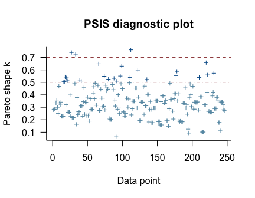<!-- -->

We got back a nice diagnostic plot for those \(k\) values, ordered by
row number. We can see that our three observations with the “bad” \(k\)
values were earlier in the data and it appears their \(k\) values are
just a smidge above the recommended threshold. If we wanted to further
verify to ourselves which observations those were, we’d use the
`pareto_k_ids()` function.

``` r
pareto_k_ids(l_fit4.1, threshold = .7)
```

    ## [1]  27  33 112

Note our use of the `threshold` argument. Play around with it to see how
it works. In case you’re curious, here are those rows.

``` r
alcohol1_pp[c(27, 33, 112), ]
```

    ## # A tibble: 3 x 9
    ##      id   age   coa  male age_14 alcuse  peer  cpeer   ccoa
    ##   <dbl> <dbl> <dbl> <dbl>  <dbl>  <dbl> <dbl>  <dbl>  <dbl>
    ## 1     9    16     1     1      2   3.46  0    -1.02   0.549
    ## 2    11    16     1     1      2   3.16  0    -1.02   0.549
    ## 3    38    14     0     0      0   0     1.26  0.247 -0.451

If you want an explicit look at those \(k\) values, execute
`l_fit4.1$diagnostics$pareto_k`. For the sake of space, I’m going to
omit the output.

``` r
l_fit4.1$diagnostics$pareto_k
```

The `pareto_k` values can be used to examine cases that are
overly-influential on the model parameters, something like a Cook’s
\(D_{i}\). See, for example [this discussion on
stackoverflow.com](https://stackoverflow.com/questions/39578834/linear-model-diagnostics-for-bayesian-models-using-rstan/39595436)
in which several members of the [Stan team](http://mc-stan.org) weighed
in. The issue is also discussed in [this
paper](https://arxiv.org/abs/1507.04544) and in [this presentation by
Aki
Vehtari](https://www.youtube.com/watch?v=FUROJM3u5HQ&feature=youtu.be&a=).

Anyway, the implication of all this is these values suggest `fit4.1`
(i.e., Model A) might not be the best model of the data. Happily, we
have other models to compare it to. That leads into the next section:

#### You can compare Bayesian models with the WAIC and LOO.

Remember how we used the `add_criterion()` function, above. That’ll work
for both WAIC and the LOO. Let’s do that for Models A through E.

``` r
fit4.1 <- add_criterion(fit4.1, c("loo", "waic"))
fit4.2 <- add_criterion(fit4.2, c("loo", "waic"))
fit4.3 <- add_criterion(fit4.3, c("loo", "waic"))
fit4.5 <- add_criterion(fit4.5, c("loo", "waic"))
```

And to refresh, we can pull the WAIC and LOO information with `$`
indexing. Here’s how to get the LOO info for `fit4.2`.

``` r
fit4.2$criteria$loo
```

    ## 
    ## Computed from 4000 by 246 log-likelihood matrix
    ## 
    ##          Estimate   SE
    ## elpd_loo   -291.5 12.9
    ## p_loo        95.9  7.7
    ## looic       583.0 25.8
    ## ------
    ## Monte Carlo SE of elpd_loo is NA.
    ## 
    ## Pareto k diagnostic values:
    ##                          Count Pct.    Min. n_eff
    ## (-Inf, 0.5]   (good)     126   51.2%   341       
    ##  (0.5, 0.7]   (ok)        92   37.4%   81        
    ##    (0.7, 1]   (bad)       25   10.2%   16        
    ##    (1, Inf)   (very bad)   3    1.2%   8         
    ## See help('pareto-k-diagnostic') for details.

Sigh. Turns out there are even more overly-influential cases in the
unconditional growth model. In the case of a real data analysis, this
might suggest we need a more robust model. One possible solution might
be switching out our Gaussian likelihood for the robust Student’s
\(t\)-distribution. For an introduction, you might check out [my blog on
the
topic](https://solomonkurz.netlify.com/post/robust-linear-regression-with-the-robust-student-s-t-distribution/).
But that’ll take us farther afield than I want to go.

The point to focus on, here, is we can use the `loo_compare()` function
to compare fits by their WAIC or LOO. Let’s practice with the WAIC.

``` r
ws <- loo_compare(fit4.1, fit4.2, fit4.3, fit4.5, criterion = "waic")

print(ws)
```

    ##        elpd_diff se_diff
    ## fit4.5   0.0       0.0  
    ## fit4.3  -4.9       3.6  
    ## fit4.2  -6.7       4.2  
    ## fit4.1 -40.9       8.0

Remember how we said that some contemporary Bayesians aren’t fans of
putting Bayesian information criteria in a \(\chi^2\) metric? Well, it
turns out [Aki Vehtari](https://twitter.com/avehtari), of the Stan team
and **loo** package fame–and also the primary author in that [PSIS-LOO
paper](https://arxiv.org/abs/1507.04544), earlier–, is one of those
Bayesians. So instead of getting difference scores in the WAIC metric,
we get them in the \(\text{elpd}_\text{WAIC}\) metric instead. But
remember, if you prefer these estimates in the traditional metric, just
multiply by -2.

``` r
cbind(waic_diff = ws[, 1] * -2,
      se        = ws[, 2] *  2)
```

    ##        waic_diff        se
    ## fit4.5  0.000000  0.000000
    ## fit4.3  9.851001  7.267540
    ## fit4.2 13.444486  8.488034
    ## fit4.1 81.723541 16.097508

The reason we multiplied the `se_diff` column (i.e., the standard errors
for the difference estimates) by 2 is because you can’t have negative
standard errors. That’d be silly.

But anyway, notice that the `brm()` fits have been rank ordered with the
smallest differences at the top. Each row in the output is the
difference of one of the fits compared to the best-fitting fit. Since
`fit4.5` apparently had the lowest WAIC value, it was ranked at the top.
And notice how its `waic_diff` is 0. That, of course, is because
\(x - x = 0\). So all the other difference scores are follow the formula
\(\text{Difference}_x = \text{WAIC}_\text{fit_x} - \text{WAIC}_\text{fit_4.5}\).

Concerning our `ws` object, we can get more information on our models’
WAICs if we include a `simplify = F` argument within
    `print()`.

``` r
print(ws, simplify = F)
```

    ##        elpd_diff se_diff elpd_waic se_elpd_waic p_waic se_p_waic waic   se_waic
    ## fit4.5    0.0       0.0  -271.4      11.2         73.9    5.7     542.7   22.4 
    ## fit4.3   -4.9       3.6  -276.3      11.5         80.9    6.3     552.6   23.0 
    ## fit4.2   -6.7       4.2  -278.1      11.8         82.4    6.5     556.2   23.5 
    ## fit4.1  -40.9       8.0  -312.2      12.0         54.8    4.7     624.5   24.0

Their WAIC values and the associated standard errors are in the final
two columns. And in the two before that, we get the \(p_\text{WAIC}\)
estimates and their standard errors. We can get similar information for
the LOO.

``` r
loo_compare(fit4.1, fit4.2, fit4.3, fit4.5, criterion = "loo") %>% 
  print(simplify = F)
```

    ##        elpd_diff se_diff elpd_loo se_elpd_loo p_loo  se_p_loo looic  se_looic
    ## fit4.5    0.0       0.0  -282.3     12.0        84.9    6.7    564.6   24.0  
    ## fit4.3   -6.2       3.8  -288.5     12.4        93.1    7.2    577.0   24.7  
    ## fit4.2   -9.2       4.6  -291.5     12.9        95.9    7.7    583.0   25.8  
    ## fit4.1  -33.2       8.3  -315.5     12.3        58.0    4.9    630.9   24.6

If you wanted a more focused comparison, say between `fit1` and `fit2`,
you’d just simplify your input.

``` r
loo_compare(fit4.1, fit4.2, criterion = "loo") %>% 
  print(simplify = F)
```

    ##        elpd_diff se_diff elpd_loo se_elpd_loo p_loo  se_p_loo looic  se_looic
    ## fit4.2    0.0       0.0  -291.5     12.9        95.9    7.7    583.0   25.8  
    ## fit4.1  -24.0       7.7  -315.5     12.3        58.0    4.9    630.9   24.6

We’ll get more practice with these methods as we go along. But for your
own edification, you might check out [the
vignettes](https://CRAN.R-project.org/package=loo) put out by the
**loo**
team.

## 4.7 Using Wald statistics to test composite hypotheses about fixed effects

I’m not going to address issues of composite null-hypothesis tests using
the Wald statistic. However, we can address some of these issues from a
different more estimation-based perspective. Consider the initial
question posed on page 123:

> Suppose, for example, you wanted to test whether the entire true
> change trajectory for a particular type of adolescent–say, a child of
> non-alcoholic parents with an average value of *PEER*–differs from a
> “null” trajectory (one with zero intercept and zero slope). This is
> tantamount to asking whether the average child of non-alcoholic
> parents drinks no alcohol at age 14 and remains abstinent over time.

Singer and Willett then expressed their joint null hypothesis as

\[H_0: \gamma_{00} = 0 \; \text{and} \; \gamma_{10} = 0.\]

This is a substantive question we can address more informatively with
`fitted()`. First let’s provide the necessary values for our predictor
variables, `coa`, `peer`, and `age_14`.

``` r
mu_peer <- mean(alcohol1_pp$peer)

nd <-
  tibble(coa    = 0,
         peer   = mu_peer,
         age_14 = seq(from = 0, to = 2, length.out = 30))

head(nd)
```

    ## # A tibble: 6 x 3
    ##     coa  peer age_14
    ##   <dbl> <dbl>  <dbl>
    ## 1     0  1.02 0     
    ## 2     0  1.02 0.0690
    ## 3     0  1.02 0.138 
    ## 4     0  1.02 0.207 
    ## 5     0  1.02 0.276 
    ## 6     0  1.02 0.345

Now we use `fitted()` to examine the model-implied trajectory for a
child of non-alcoholic parents and average `peer` values.

``` r
f <-
  fitted(fit4.6, 
         newdata = nd,
         re_formula = NA) %>%
  data.frame() %>%
  bind_cols(nd) %>%
  mutate(age = age_14 + 14) 

f %>%

  ggplot(aes(x = age)) +
  geom_ribbon(aes(ymin = Q2.5, ymax = Q97.5),
              size = 0, alpha = 1/4) +
  geom_line(aes(y = Estimate)) +
  scale_y_continuous("alcuse", breaks = 0:2, limits = c(0, 2)) +
  labs(subtitle = "Zero is credible for neither\nthe intercept nor the slope.") +
  coord_cartesian(xlim = 13:17) +
  theme(legend.position = "none",
        panel.grid = element_blank())
```

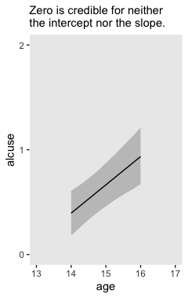<!-- -->

Recall that the result of our Bayesian analyses are the probability of
the parameters given the data (i.e., \(p(\theta | d)\)). Based on our
plot, there is much less than a .05 probability either intercept or
slope for teens of this demographic are zero. If you really wanted to
fixate on zero, you could even use `geom_hline()` to insert a horizontal
line at zero in the figure. But all that fixating on zero detracts from
what to my mind are the more important parts of the model. The intercept
at `age = 14` is about 1/3 and the endpoint when `age = 16` is almost at
\(1\). Those are our effect sizes. If you wanted to quantify those
effect sizes more precisely, just query our `fitted()` object, `f`.

``` r
f %>% 
  select(age, Estimate, Q2.5, Q97.5) %>% 
  filter(age %in% c(14, 16)) %>% 
  mutate_all(round, digits = 2)
```

    ##   age Estimate Q2.5 Q97.5
    ## 1  14     0.39 0.18  0.61
    ## 2  16     0.94 0.67  1.21

Works like a champ. But we haven’t fully covered part of Singer and
Willett’s joint hypothesis text. They proposed a joint Null that
included the \(\gamma_{10} = 0\). Though it’s clear from the plot that
the trajectory increases, we can address the issue more directly with a
difference score. For our difference, we’ll subtract the estimate at
`age = 14` from the one at `age = 15`. But to that, we’ll have to return
to `fitted()`. So far, we’ve been using the default output which returns
summaries of the posterior. To compute a proper difference score, we’ll
need to work with all the posterior draws in order to approximate the
full distribution. We do that by setting `summary = F`. And since we’re
only interested in the estimates from these two `age` values, we’ll
streamline our `nd` data.

``` r
nd <-
  tibble(coa    = 0,
         peer   = mu_peer,
         age_14 = 0:1)

f <-
  fitted(fit4.6, 
         newdata = nd,
         re_formula = NA,
         summary = F) %>%
  data.frame()

str(f)
```

    ## 'data.frame':    4000 obs. of  2 variables:
    ##  $ X1: num  0.411 0.511 0.63 0.427 0.426 ...
    ##  $ X2: num  0.679 0.751 0.83 0.66 0.726 ...

Now our `f` object has 4,000 rows and 2 columns. Each of the rows
corresponds to one of the 4,000 post-warmup posterior draws. The columns
correspond to the two rows in our `nd` data. To get a slope based on
this combination of predictor values, we simply subtract the first
column from the second.

``` r
f <-
  f %>% 
  transmute(difference = X2 - X1)

f %>% 
  ggplot(aes(x = difference)) +
  geom_density(size = 0, fill = "grey25") +
  scale_y_continuous(NULL, breaks = NULL) +
  labs(subtitle = "Based on 4,000 posterior draws, not a single one\nsuggests the slope is even close to zero. Rather, the\nposterior mass is concentrated around 0.25.",
       x = expression(paste(gamma[0][1], " (i.e., the difference between the two time points)"))) +
  coord_cartesian(xlim = 0:1) +
  theme(panel.grid = element_blank())
```

<!-- -->

Here are the posterior mean and 95% intervals.

``` r
f %>% 
  summarise(mean = mean(difference),
            ll   = quantile(difference, probs = .025),
            ul   = quantile(difference, probs = .975))
```

    ##        mean        ll        ul
    ## 1 0.2702342 0.1462111 0.3974354

On page 125, Singer and Willett further mused:

> When we examined the OLS estimated change trajectories in figure 4.2,
> we noticed that among children of non-alcoholic parents, those with
> low values of *CPEER* tended to have a lower initial status and
> steeper slopes than those with high values of *CPEER*. We might
> therefore ask whether the former group “catches up” to the latter.
> This is a question about the “vertical” separation between these two
> groups\[’\] true change trajectories at some later age, say 16.

Within their joint hypothesis testing paradigm, they pose this as
testing

\[H_0: 0\gamma_{00} + 0\gamma_{01} + 1\gamma_{02} + 0\gamma_{10} + 2\gamma_{12} = 0.\]

From our perspective, this is a differences of differences analysis.
That is, first we’ll compute the model implied `alcuse` estimates for
the four combinations of the two levels of `age` and `peer`, holding
`coa` constant at 0. Second, we’ll compute the differences between the
two `peer` levels at each `age`. Third and finally, we’ll compute a
difference of those differences.

For our first step, recall it was `fit4.7` that used the `cpeer`
variable.

``` r
# first step
nd <-
  crossing(age_14 = c(0, 2),
           cpeer  = c(-.363, .363)) %>% 
  mutate(coa = 0)

head(nd)
```

    ## # A tibble: 4 x 3
    ##   age_14  cpeer   coa
    ##    <dbl>  <dbl> <dbl>
    ## 1      0 -0.363     0
    ## 2      0  0.363     0
    ## 3      2 -0.363     0
    ## 4      2  0.363     0

``` r
f <-
  fitted(fit4.7, 
         newdata = nd,
         re_formula = NA,
         summary = F) %>% 
  data.frame()

head(f)
```

    ##           X1        X2        X3       X4
    ## 1 0.17502405 0.6605243 0.8520849 1.298802
    ## 2 0.20817809 0.6776782 0.9387258 1.235208
    ## 3 0.12742797 0.7246396 0.8466041 1.216695
    ## 4 0.09864766 0.6662694 0.8765035 1.239332
    ## 5 0.13072997 0.7271179 1.0898833 1.436752
    ## 6 0.08935016 0.5745774 0.9410148 1.032745

For our initial difference scores, we’ll subtract the estimates for the
lower level of `cpeer` from the higher ones.

``` r
# step 2
f <-
  f %>% 
  transmute(`difference at 14` = X2 - X1,
            `difference at 16` = X4 - X3)

head(f)
```

    ##   difference at 14 difference at 16
    ## 1        0.4855003       0.44671666
    ## 2        0.4695001       0.29648254
    ## 3        0.5972116       0.37009095
    ## 4        0.5676217       0.36282849
    ## 5        0.5963879       0.34686832
    ## 6        0.4852272       0.09173039

For our final difference score, we’ll subtract the first difference
score from the second.

``` r
# step 3
f <-
  f %>% 
  mutate(`difference in differences` = `difference at 16` - `difference at 14`)

head(f)
```

    ##   difference at 14 difference at 16 difference in differences
    ## 1        0.4855003       0.44671666                -0.0387836
    ## 2        0.4695001       0.29648254                -0.1730176
    ## 3        0.5972116       0.37009095                -0.2271206
    ## 4        0.5676217       0.36282849                -0.2047932
    ## 5        0.5963879       0.34686832                -0.2495196
    ## 6        0.4852272       0.09173039                -0.3934969

Here we’ll plot all three.

``` r
f %>%
  pivot_longer(everything()) %>% 
  
  ggplot(aes(x = value)) +
  geom_density(size = 0, fill = "grey25") +
  scale_y_continuous(NULL, breaks = NULL) +
  xlab("different differences") +
  theme(panel.grid = element_blank()) +
  facet_wrap(~name, scales = "free_y")
```

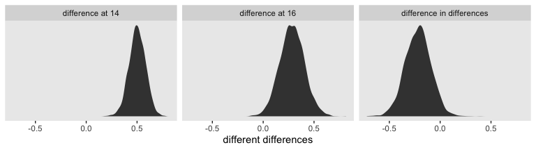<!-- -->

Singer and Willett concluded they could “reject the null hypothesis at
any conventional level of significance” (p. 126). If we must appeal to
the Null, here are the posterior means and 95% intervals for our
differences.

``` r
f %>% 
  pivot_longer(everything()) %>% 
  group_by(name) %>% 
  summarise(mean = mean(value),
            ll   = quantile(value, probs = .025),
            ul   = quantile(value, probs = .975)) %>% 
  mutate_if(is.double, round, digits = 3)
```

    ## # A tibble: 3 x 4
    ##   name                        mean     ll    ul
    ##   <chr>                      <dbl>  <dbl> <dbl>
    ## 1 difference at 14           0.502  0.338 0.658
    ## 2 difference at 16           0.284  0.049 0.526
    ## 3 difference in differences -0.218 -0.468 0.023

Our results contrast a bit from Singer and Willett’s. Though the bulk of
our posterior mass is concentrated around -0.22, zero is a credible
value within the difference of differences density. Our best bet is the
differences to begin to converge over time. However, that rate of that
convergence is subtle and somewhat imprecise relative to the effect
size. Interpret with caution.

## 4.8 Evaluating the tenability of a model’s assumptions

“Whenever you fit a statistical model, you invoke assumptions” (p. 127).
This is the case for multilevel Bayesian models, too.

### 4.8.1 Checking functional form.

We’ve already checked the functional form at level-1 with our version of
Figure 4.1. When we made our version of Figure 4.1, we relied on
`ggplot2::stat_smooth()` to compute the `id`-level OLS trajectories. To
make our variants of Figure 4.4, we’ll have to back up and compute them
externally with `lm()`. Here we’ll do so in bulk with a nested data
frame. The **broom** package will help us extract the results.

``` r
library(broom)

o <-
  alcohol1_pp %>% 
  nest(-id, -coa, -peer) %>% 
  mutate(ols = map(data, ~lm(data = ., alcuse ~ 1 + age_14))) %>% 
  mutate(tidy = map(ols, tidy)) %>% 
  unnest(tidy) %>% 
  # this is unnecessary, but will help with plotting
  mutate(term = factor(term, 
                       levels = c("(Intercept)", "age_14"),
                       labels = c("pi[0]", "pi[1]")))

head(o)
```

    ## # A tibble: 6 x 10
    ##      id   coa  peer data             ols    term  estimate std.error statistic p.value
    ##   <dbl> <dbl> <dbl> <list>           <list> <fct>    <dbl>     <dbl>     <dbl>   <dbl>
    ## 1     1     1 1.26  <tibble [3 × 6]> <lm>   pi[0]    1.78     0.0999    17.8    0.0357
    ## 2     1     1 1.26  <tibble [3 × 6]> <lm>   pi[1]    0.134    0.0774     1.73   0.333 
    ## 3     2     1 0.894 <tibble [3 × 6]> <lm>   pi[0]   -0.167    0.373     -0.447  0.732 
    ## 4     2     1 0.894 <tibble [3 × 6]> <lm>   pi[1]    0.5      0.289      1.73   0.333 
    ## 5     3     1 0.894 <tibble [3 × 6]> <lm>   pi[0]    0.947    0.118      8.03   0.0789
    ## 6     3     1 0.894 <tibble [3 × 6]> <lm>   pi[1]    1.16     0.0914    12.7    0.0501

Now plot.

``` r
o %>% 
  select(coa:peer, term:estimate) %>% 
  pivot_longer(coa:peer) %>% 
  
  ggplot(aes(x = value, y = estimate)) +
  geom_hline(yintercept = 0, color = "white") +
  geom_point(alpha = 2/3) +
  theme(panel.grid = element_blank(),
        strip.text = element_text(size = 11)) +
  facet_grid(term~name, scales = "free", labeller = label_parsed)
```

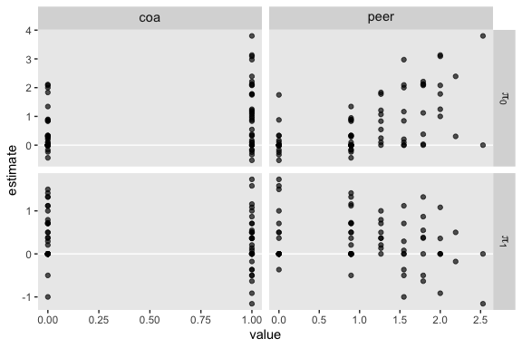<!-- -->

With a little more wrangling, we can extract the Pearson’s correlation
coefficients for each panel.

``` r
o %>% 
  select(coa:peer, term:estimate) %>% 
  pivot_longer(coa:peer) %>% 
  group_by(term, name) %>% 
  nest() %>%
  mutate(r = map_dbl(data, ~cor(.)[2, 1] %>% round(digits = 2)))
```

    ## # A tibble: 4 x 4
    ## # Groups:   term, name [4]
    ##   term  name  data                   r
    ##   <fct> <chr> <list>             <dbl>
    ## 1 pi[0] coa   <tibble [82 × 2]>  0.39 
    ## 2 pi[0] peer  <tibble [82 × 2]>  0.580
    ## 3 pi[1] coa   <tibble [82 × 2]> -0.04 
    ## 4 pi[1] peer  <tibble [82 × 2]> -0.19

### 4.8.2 Checking normality.

The basic multilevel model of change yields three variance parameters,
\(\epsilon_{ij}\), \(\zeta_0i\), and \(\zeta_1i\). Each measurement
occasion in the model receives a model-implied estimate for each. Singer
and Willett referred to those estimates as \(\hat{\epsilon}_{ij}\),
\(\hat{\zeta}_0i\), and \(\hat{\zeta}_1i\). As with frequentist
software, our Bayesian software **brms** will return these estimates.

To extract our Bayesian \(\hat{\epsilon}_{ij}\)s, we use the
`residuals()` function.

``` r
e <- residuals(fit4.6)

str(e)
```

    ##  num [1:246, 1:4] 0.2876 0.2573 -0.0409 -0.393 -0.5973 ...
    ##  - attr(*, "dimnames")=List of 2
    ##   ..$ : NULL
    ##   ..$ : chr [1:4] "Estimate" "Est.Error" "Q2.5" "Q97.5"

``` r
head(e)
```

    ##         Estimate Est.Error       Q2.5      Q97.5
    ## [1,]  0.28763647 0.3250755 -0.3914337 0.89494825
    ## [2,]  0.25734974 0.3037230 -0.3407331 0.84803822
    ## [3,] -0.04088621 0.4411031 -0.9181669 0.82197153
    ## [4,] -0.39302478 0.3443342 -1.0392050 0.31328261
    ## [5,] -0.59734674 0.3181534 -1.2262349 0.02541651
    ## [6,]  0.19833131 0.4624338 -0.6917016 1.09272430

For our `fit5`, the `residuals()` function returned a \(246 \times 4\)
numeric array. Each row corresponded to one of the rows of the original
data set. The four vectors are the familiar summaries `Estimate`,
`Est.Error`, `Q2.5`, and `Q97.5`. If we’d like to work with these in a
**ggplot2**-made plot, we’ll have to convert our `e` object to a data
frame.

After we make the conversion, we then make the top left panel of Figure
4.5.

``` r
e <- 
  e %>% 
  data.frame()

e %>% 
  ggplot(aes(sample = Estimate)) +
  geom_hline(yintercept = 0, color = "white") +
  geom_qq() +
  labs(x = "Normal score",
       y = expression(hat(epsilon)[italic(ij)])) +
  ylim(-2, 2) +
  theme(panel.grid = element_blank())
```

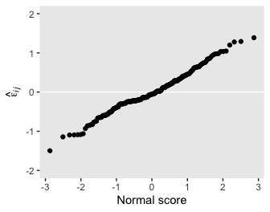<!-- -->

For the right plot on the top, we need to add an `id` index. That’s as
easy as appending the one from the original data. If you followed
closely with the text, you may have also noticed this panel is of the
standardized residuals. That just means we’ll have to hand-standardize
ours before plotting.

``` r
e %>% 
  bind_cols(alcohol1_pp %>% select(id)) %>% 
  mutate(z = (Estimate - mean(Estimate)) / sd(Estimate)) %>% 
  
  ggplot(aes(x = id, y = z)) +
  geom_hline(yintercept = 0, color = "white") +
  geom_point() +
  ylab(expression(italic(std)~hat(epsilon)[italic(ij)])) +
  ylim(-2, 2) +
  theme(panel.grid = element_blank())
```

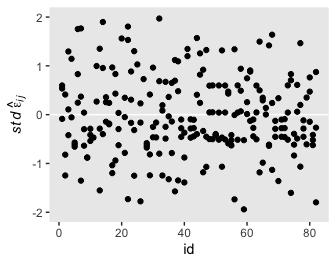<!-- -->

We’ll need to use the `ranef()` function to return the estimates for the
\(\zeta\)s.

``` r
z <- ranef(fit4.6)

str(z)
```

    ## List of 1
    ##  $ id: num [1:82, 1:4, 1:2] 0.306 -0.488 0.32 -0.36 -0.566 ...
    ##   ..- attr(*, "dimnames")=List of 3
    ##   .. ..$ : chr [1:82] "1" "2" "3" "4" ...
    ##   .. ..$ : chr [1:4] "Estimate" "Est.Error" "Q2.5" "Q97.5"
    ##   .. ..$ : chr [1:2] "Intercept" "age_14"

``` r
z[[1]][1:6, , "Intercept"]
```

    ##     Estimate Est.Error       Q2.5      Q97.5
    ## 1  0.3060223 0.3227010 -0.2960562 0.96774592
    ## 2 -0.4877992 0.3433833 -1.2087988 0.13958551
    ## 3  0.3203825 0.3285308 -0.3448843 0.95481492
    ## 4 -0.3596063 0.3580504 -1.0893187 0.29984702
    ## 5 -0.5664465 0.3299580 -1.2326926 0.06957911
    ## 6  0.8217839 0.3655567  0.1586649 1.58692704

``` r
z[[1]][1:6, , "age_14"]
```

    ##      Estimate Est.Error         Q2.5     Q97.5
    ## 1  0.06515672 0.2416886 -0.436878006 0.5218283
    ## 2 -0.08440817 0.2538519 -0.573436784 0.4333823
    ## 3  0.45812318 0.2629633 -0.009684557 1.0047397
    ## 4  0.15313668 0.2715482 -0.345840207 0.7329594
    ## 5 -0.30909870 0.2462948 -0.792318683 0.1900630
    ## 6  0.25283161 0.2686093 -0.296467669 0.7683498

For our `fit5`, the `ranef()` function returned a list of 1, indexed by
`id`. Therein lay a 3-dimensional array. The first two dimensions are
the same as what we got from `residuals()`, above. The third dimension
had two levels: `Intercept` and `age_14`. In other words, the third
dimension is the one that differentiated between \(\hat{\zeta}_0i\) and
\(\hat{\zeta}_1i\). to make this thing a little more useful, let’s
convert it to a long-formatted data frame.

``` r
z <-
  rbind(z[[1]][ , , "Intercept"],
        z[[1]][ , , "age_14"]) %>% 
  data.frame() %>% 
  mutate(ranef = rep(c("hat(zeta)[0][italic(i)]", "hat(zeta)[1][italic(i)]"), each = n() / 2))

glimpse(z)
```

    ## Observations: 164
    ## Variables: 5
    ## $ Estimate  <dbl> 0.30602233, -0.48779924, 0.32038254, -0.35960629, -0.56644649, 0.82178386, 0.21…
    ## $ Est.Error <dbl> 0.3227010, 0.3433833, 0.3285308, 0.3580504, 0.3299580, 0.3655567, 0.3385925, 0.…
    ## $ Q2.5      <dbl> -0.29605623, -1.20879884, -0.34488425, -1.08931868, -1.23269262, 0.15866490, -0…
    ## $ Q97.5     <dbl> 0.96774592, 0.13958551, 0.95481492, 0.29984702, 0.06957911, 1.58692704, 0.92773…
    ## $ ranef     <chr> "hat(zeta)[0][italic(i)]", "hat(zeta)[0][italic(i)]", "hat(zeta)[0][italic(i)]"…

Now we’re ready to plot the remaining panels on the left of Figure 4.5.

``` r
z %>% 
  ggplot(aes(sample = Estimate)) +
  geom_hline(yintercept = 0, color = "white") +
  geom_qq() +
  labs(x = "Normal score",
       y = NULL) +
  ylim(-1, 1) +
  theme(panel.grid = element_blank()) +
  facet_wrap(~ranef, labeller = label_parsed, ncol = 1)
```

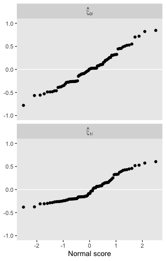<!-- -->

Here are the ones on the right.

``` r
z %>% 
  bind_cols(
    bind_rows(
      alcohol1_pp %>% distinct(id),
      alcohol1_pp %>% distinct(id)
      )
    ) %>%
  mutate(ranef = str_c("italic(std)~", ranef)) %>% 
  # note we have to group them before standardizing
  group_by(ranef) %>% 
  mutate(z = (Estimate - mean(Estimate)) / sd(Estimate)) %>% 
  
  ggplot(aes(x = id, y = z)) +
  geom_hline(yintercept = 0, color = "white") +
  geom_point() +
  scale_y_continuous(NULL, limits = c(-3, 3)) +
  theme(panel.grid = element_blank()) +
  facet_wrap(~ranef, labeller = label_parsed, ncol = 1)
```

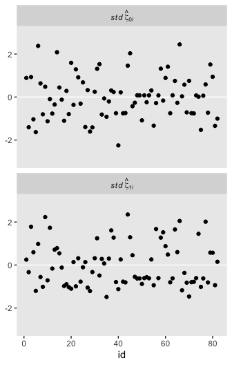<!-- -->

If you were paying close attention, you may have noticed that for all
three of our `id`-level deviation estimates, they were summarized not
only by a posterior mean but by standard deviations and 95% intervals,
too. To give a sense of what that means, here are those last two plots,
again, but this time including vertical bars defined by the 95%
intervals.

``` r
z %>% 
  bind_cols(
    bind_rows(
      alcohol1_pp %>% distinct(id),
      alcohol1_pp %>% distinct(id)
      )
    ) %>%

  ggplot(aes(x = id, y = Estimate, ymin = Q2.5, ymax = Q97.5)) +
  geom_hline(yintercept = 0, color = "white") +
  geom_pointrange(shape = 20, size = 1/3) +
  ylab(NULL) +
  theme(panel.grid = element_blank()) +
  facet_wrap(~ranef, labeller = label_parsed, ncol = 1)
```

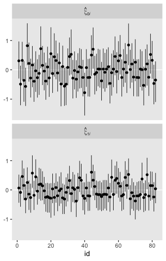<!-- -->

When you go Bayesian, even your residuals get full posterior
distributions.

### 4.8.3 Checking homoscedasticity.

Here we examine the homoscedasticity assumption by plotting the residual
estimates against our predictors. We’ll start with the upper left panel
of Figure 4.6.

``` r
e %>% 
  bind_cols(alcohol1_pp) %>% 
  
  ggplot(aes(x = age, y = Estimate)) +
  geom_hline(yintercept = 0, color = "white") +
  geom_point(alpha = 1/4) +
  ylab(expression(hat(epsilon)[italic(ij)])) +
  coord_cartesian(xlim = 13:17,
                  ylim = -2:2) +
  theme(panel.grid = element_blank())
```

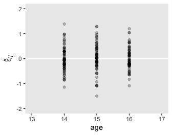<!-- -->

Here’s a quick way to get the remaining four panels.

``` r
z %>% 
  bind_cols(
    bind_rows(
      alcohol1_pp %>% distinct(id, coa, peer),
      alcohol1_pp %>% distinct(id, coa, peer)
      )
    ) %>%
  select(Estimate, ranef, coa, peer) %>% 
  pivot_longer(-c(Estimate, ranef)) %>% 
  
  ggplot(aes(x = value, y = Estimate)) +
  geom_hline(yintercept = 0, color = "white") +
  geom_point(alpha = 1/3) +
  labs(x = "covariate value",
       y = NULL) +
  ylim(-1, 1) +
  theme(panel.grid = element_blank(),
        strip.text = element_text(size = 10)) +
  facet_grid(ranef~name, labeller = label_parsed, scales = "free")
```

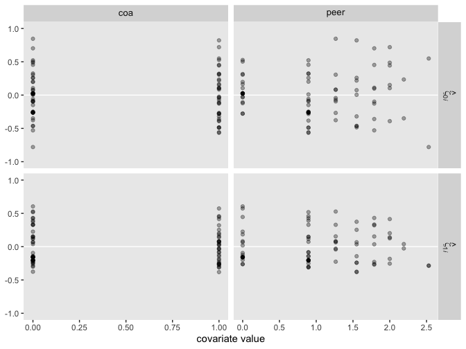<!-- -->

## 4.9 Model-based (Empirical Bayes) estimates of the individual growth parameters

In this section, the authors discussed two methods for constructing
`id`-level trajectories: a) use a weighted average of the OLS and
multilevel estimates and b) rely solely on the multilevel model by
making use of the three sources of residual variation. Our method will
be the latter.

Here are the data for `id == 23`.

``` r
alcohol1_pp %>% 
  select(id:coa, cpeer, alcuse) %>% 
  filter(id == 23)
```

    ## # A tibble: 3 x 5
    ##      id   age   coa cpeer alcuse
    ##   <dbl> <dbl> <dbl> <dbl>  <dbl>
    ## 1    23    14     1 -1.02   1   
    ## 2    23    15     1 -1.02   1   
    ## 3    23    16     1 -1.02   1.73

``` r
post_23 <-
  posterior_samples(fit4.7) %>% 
  select(starts_with("b_")) %>% 
  # make our pis
  mutate(`pi[0][",23"]` = b_Intercept + b_coa * 1 + b_cpeer * -1.018,
         `pi[1][",23"]` = b_age_14 + `b_age_14:cpeer` * -1.018)

head(post_23)
```

    ##   b_Intercept  b_age_14     b_coa   b_cpeer b_age_14:cpeer pi[0][",23"] pi[1][",23"]
    ## 1   0.4177742 0.3288345 0.5996322 0.6687331    -0.02671047   0.33663602    0.3560258
    ## 2   0.4429282 0.3220195 0.4890968 0.6466944    -0.11915811   0.27369007    0.4433224
    ## 3   0.4260338 0.3028079 0.4798662 0.8226055    -0.15641917   0.06848761    0.4620426
    ## 4   0.3824585 0.3377296 0.5130731 0.7818481    -0.14104218   0.09961022    0.4813105
    ## 5   0.4289239 0.4171968 0.3574086 0.8214710    -0.17184547  -0.04992496    0.5921355
    ## 6   0.3319638 0.3274581 0.5437074 0.6683571    -0.27100334   0.19528367    0.6033395

It doesn’t help us much now, but the reason we’ve formatted the names
for our two \(\pi\) columns so oddly is because those names will work
much nicer in the figure we’ll make, below. Just wait and see.

Anyways, more than a couple point estimates, we returned the draws from
the full posterior distribution. We might summarize them.

``` r
post_23 %>% 
  pivot_longer(starts_with("pi")) %>% 
  group_by(name) %>% 
  summarise(mean = mean(value),
            ll   = quantile(value, probs = .025),
            ul   = quantile(value, probs = .975)) %>% 
  mutate_if(is.double, round, digits = 3)
```

    ## # A tibble: 2 x 4
    ##   name              mean     ll    ul
    ##   <chr>            <dbl>  <dbl> <dbl>
    ## 1 "pi[0][\",23\"]" 0.262 -0.065 0.607
    ## 2 "pi[1][\",23\"]" 0.423  0.211 0.637

Or we could plot them.

``` r
post_23 %>% 
  pivot_longer(starts_with("pi")) %>% 
  
  ggplot(aes(x = value)) +
  geom_density(size = 0, fill = "grey25") +
  scale_y_continuous(NULL, breaks = NULL) +
  xlab("participant-specific parameter estimates") +
  theme(panel.grid = element_blank()) +
  facet_wrap(~name, labeller = label_parsed, scales = "free_y")
```

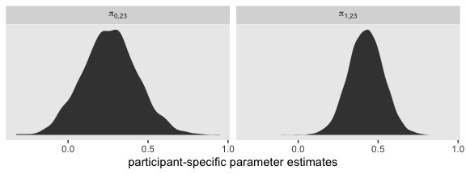<!-- -->

Yet this approach neglects the \(\zeta\)s. W’ve been extracting the
\(\zeta\)s with `ranef()`. We also get them when we use
`posterior_samples()`. Here we’ll extract both the \(\gamma\)s as well
as the \(\zeta\)s for `id == 23`.

``` r
post_23 <-
  posterior_samples(fit4.7) %>% 
  select(starts_with("b_"), contains("23"))

glimpse(post_23)
```

    ## Observations: 4,000
    ## Variables: 7
    ## $ b_Intercept          <dbl> 0.4177742, 0.4429282, 0.4260338, 0.3824585, 0.4289239, 0.3319638, 0.…
    ## $ b_age_14             <dbl> 0.3288345, 0.3220195, 0.3028079, 0.3377296, 0.4171968, 0.3274581, 0.…
    ## $ b_coa                <dbl> 0.5996322, 0.4890968, 0.4798662, 0.5130731, 0.3574086, 0.5437074, 0.…
    ## $ b_cpeer              <dbl> 0.6687331, 0.6466944, 0.8226055, 0.7818481, 0.8214710, 0.6683571, 0.…
    ## $ `b_age_14:cpeer`     <dbl> -0.02671047, -0.11915811, -0.15641917, -0.14104218, -0.17184547, -0.…
    ## $ `r_id[23,Intercept]` <dbl> 0.271850140, 0.383131729, 0.672762382, 0.921352031, 0.671065247, 0.0…
    ## $ `r_id[23,age_14]`    <dbl> -0.1491509044, -0.0431086861, -0.1270336410, -0.1731686206, 0.214594…

With the `r_id` prefix, **brms** tells you these are residual estimates
for the levels in the `id` grouping variable. Within the brackets, we
learn these particular columns are for `id == 23`, the first with
respect to the `Intercept` and second with respect to the `age_14`
parameter. Let’s put them to use.

``` r
post_23 <-
  post_23 %>% 
  mutate(`pi[0][",23"]` = b_Intercept + b_coa * 1 + b_cpeer * -1.018 + `r_id[23,Intercept]`,
         `pi[1][",23"]` = b_age_14 + `b_age_14:cpeer` * -1.018 + `r_id[23,age_14]`)

glimpse(post_23)
```

    ## Observations: 4,000
    ## Variables: 9
    ## $ b_Intercept          <dbl> 0.4177742, 0.4429282, 0.4260338, 0.3824585, 0.4289239, 0.3319638, 0.…
    ## $ b_age_14             <dbl> 0.3288345, 0.3220195, 0.3028079, 0.3377296, 0.4171968, 0.3274581, 0.…
    ## $ b_coa                <dbl> 0.5996322, 0.4890968, 0.4798662, 0.5130731, 0.3574086, 0.5437074, 0.…
    ## $ b_cpeer              <dbl> 0.6687331, 0.6466944, 0.8226055, 0.7818481, 0.8214710, 0.6683571, 0.…
    ## $ `b_age_14:cpeer`     <dbl> -0.02671047, -0.11915811, -0.15641917, -0.14104218, -0.17184547, -0.…
    ## $ `r_id[23,Intercept]` <dbl> 0.271850140, 0.383131729, 0.672762382, 0.921352031, 0.671065247, 0.0…
    ## $ `r_id[23,age_14]`    <dbl> -0.1491509044, -0.0431086861, -0.1270336410, -0.1731686206, 0.214594…
    ## $ `pi[0][",23"]`       <dbl> 0.60848616, 0.65682180, 0.74124999, 1.02096225, 0.62114029, 0.275693…
    ## $ `pi[1][",23"]`       <dbl> 0.20687489, 0.40021375, 0.33500899, 0.30814191, 0.80672987, 0.288120…

Here are our updated summaries.

``` r
post_23 %>% 
  pivot_longer(starts_with("pi")) %>% 
  group_by(name) %>% 
  summarise(mean = mean(value),
            ll   = quantile(value, probs = .025),
            ul   = quantile(value, probs = .975)) %>% 
  mutate_if(is.double, round, digits = 3)
```

    ## # A tibble: 2 x 4
    ##   name              mean     ll    ul
    ##   <chr>            <dbl>  <dbl> <dbl>
    ## 1 "pi[0][\",23\"]" 0.570 -0.105  1.27
    ## 2 "pi[1][\",23\"]" 0.509 -0.022  1.03

And here are the updated density plots.

``` r
post_23 %>% 
  pivot_longer(starts_with("pi")) %>% 
  
  ggplot(aes(x = value)) +
  geom_density(size = 0, fill = "grey25") +
  scale_y_continuous(NULL, breaks = NULL) +
  xlab("participant-specific parameter estimates") +
  theme(panel.grid = element_blank()) +
  facet_wrap(~name, labeller = label_parsed, scales = "free_y")
```

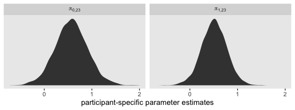<!-- -->

We’ve been focusing on the \(\pi\) parameters. Notice that when we turn
our attention to Figure 4.7, we’re now shifting focus slightly to the
consequences of those parameters. We’re not attending to trajectories.
It’s important to pick up on this distinction because it has
consequences for our programming workflow. If you wanted to keep a
parameter-centric workflow, we could continue to expand on our
`posterior_samples()` by applying the full composite formula to
explicitly add in predictions for various levels of `age_14`. And we
could do that separately or in bulk for the eight participants
highlighted in the figure.

However pedagogically useful that might be, it’d be very tedious. If we
instead take a trajectory-centric perspective, it’ll be more natural and
efficient to work with a `fitted()` based workflow. Let’s define our
`nd` data.

``` r
nd <-
  alcohol1_pp %>% 
  select(id:coa, age_14:alcuse, cpeer) %>% 
  filter(id %in% c(4, 14, 23, 32, 41, 56, 65, 82)) %>% 
  # these next two lines will make plotting easier
  mutate(id_label = ifelse(id < 10, str_c("0", id), id)) %>% 
  mutate(id_label = str_c("id = ", id_label))

glimpse(nd)
```

    ## Observations: 24
    ## Variables: 7
    ## $ id       <dbl> 4, 4, 4, 14, 14, 14, 23, 23, 23, 32, 32, 32, 41, 41, 41, 56, 56, 56, 65, 65, 65,…
    ## $ age      <dbl> 14, 15, 16, 14, 15, 16, 14, 15, 16, 14, 15, 16, 14, 15, 16, 14, 15, 16, 14, 15, …
    ## $ coa      <dbl> 1, 1, 1, 1, 1, 1, 1, 1, 1, 1, 1, 1, 0, 0, 0, 0, 0, 0, 0, 0, 0, 0, 0, 0
    ## $ age_14   <dbl> 0, 1, 2, 0, 1, 2, 0, 1, 2, 0, 1, 2, 0, 1, 2, 0, 1, 2, 0, 1, 2, 0, 1, 2
    ## $ alcuse   <dbl> 0.000000, 2.000000, 1.732051, 2.828427, 3.605551, 2.828427, 1.000000, 1.000000, …
    ## $ cpeer    <dbl> 0.7708544, 0.7708544, 0.7708544, 0.9820000, 0.9820000, 0.9820000, -1.0180000, -1…
    ## $ id_label <chr> "id = 04", "id = 04", "id = 04", "id = 14", "id = 14", "id = 14", "id = 23", "id…

We’ve isolated the relevant predictor variables for our eight focal
participants. Next we’ll pump them through `fitted()` and wrangle as
usual.

``` r
f <-
  fitted(fit4.7,
         newdata = nd) %>% 
  data.frame() %>% 
  bind_cols(nd)

glimpse(f)
```

    ## Observations: 24
    ## Variables: 11
    ## $ Estimate  <dbl> 1.1344894, 1.4480688, 1.7616482, 2.3767968, 2.7029029, 3.0290089, 0.5696337, 1.…
    ## $ Est.Error <dbl> 0.3562022, 0.2989615, 0.4499632, 0.3646575, 0.3058667, 0.4386758, 0.3439383, 0.…
    ## $ Q2.5      <dbl> 0.38839366, 0.85915855, 0.88588203, 1.70822381, 2.09593268, 2.17085481, -0.1046…
    ## $ Q97.5     <dbl> 1.801852, 2.030939, 2.670164, 3.124590, 3.316853, 3.903620, 1.266930, 1.667805,…
    ## $ id        <dbl> 4, 4, 4, 14, 14, 14, 23, 23, 23, 32, 32, 32, 41, 41, 41, 56, 56, 56, 65, 65, 65…
    ## $ age       <dbl> 14, 15, 16, 14, 15, 16, 14, 15, 16, 14, 15, 16, 14, 15, 16, 14, 15, 16, 14, 15,…
    ## $ coa       <dbl> 1, 1, 1, 1, 1, 1, 1, 1, 1, 1, 1, 1, 0, 0, 0, 0, 0, 0, 0, 0, 0, 0, 0, 0
    ## $ age_14    <dbl> 0, 1, 2, 0, 1, 2, 0, 1, 2, 0, 1, 2, 0, 1, 2, 0, 1, 2, 0, 1, 2, 0, 1, 2
    ## $ alcuse    <dbl> 0.000000, 2.000000, 1.732051, 2.828427, 3.605551, 2.828427, 1.000000, 1.000000,…
    ## $ cpeer     <dbl> 0.7708544, 0.7708544, 0.7708544, 0.9820000, 0.9820000, 0.9820000, -1.0180000, -…
    ## $ id_label  <chr> "id = 04", "id = 04", "id = 04", "id = 14", "id = 14", "id = 14", "id = 23", "i…

Notice how this time we omitted the `re_formula = NA` argument. By
default, `re_formula = NULL`, the consequence of which is the output is
based on all the parameters in the multilevel model, not just the
\(\gamma\)s. Here are what they look like.

``` r
f %>% 
  ggplot(aes(x = age, y = Estimate)) +
  geom_line(size = 1) +
  scale_y_continuous("alcuse", breaks = 0:4, limits = c(-1, 4)) +
  xlim(13, 17) +
  theme(legend.position = "none",
        panel.grid = element_blank()) +
  facet_wrap(~id_label, ncol = 4)
```

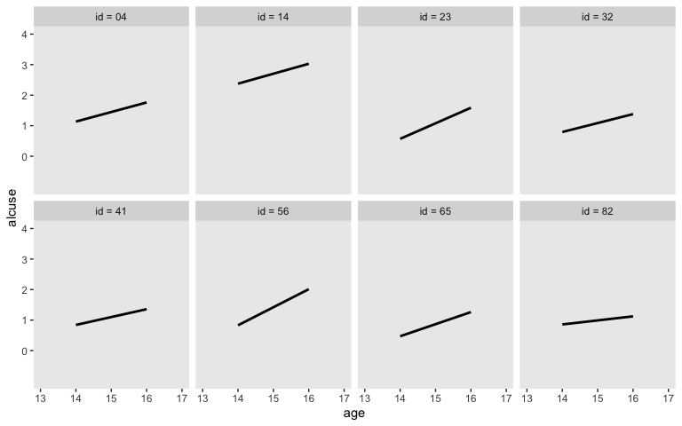<!-- -->

Now we’ve warmed up, let’s add in the data and the other lines so make
the full version of Figure 4.7. Before we do so, we’ll revisit
`fitted()`. Notice the return of the `re_formula = NA` argument. The
trajectories in our `f_gamma_only` data frame will only be sensitive to
the \(\gamma\)s.

``` r
f_gamma_only <-
  fitted(fit4.7,
         newdata = nd,
         re_formula = NA) %>% 
  data.frame() %>% 
  bind_cols(nd)

glimpse(f_gamma_only)
```

    ## Observations: 24
    ## Variables: 11
    ## $ Estimate  <dbl> 1.4986587, 1.6539408, 1.8092228, 1.6446802, 1.7683040, 1.8919278, 0.2615448, 0.…
    ## $ Est.Error <dbl> 0.1385486, 0.1360113, 0.1881993, 0.1526199, 0.1500623, 0.2123077, 0.1729135, 0.…
    ## $ Q2.5      <dbl> 1.23327430, 1.39161355, 1.44773073, 1.34457723, 1.47848970, 1.48072747, -0.0651…
    ## $ Q97.5     <dbl> 1.7802269, 1.9240787, 2.1693423, 1.9508109, 2.0659062, 2.3016916, 0.6065649, 1.…
    ## $ id        <dbl> 4, 4, 4, 14, 14, 14, 23, 23, 23, 32, 32, 32, 41, 41, 41, 56, 56, 56, 65, 65, 65…
    ## $ age       <dbl> 14, 15, 16, 14, 15, 16, 14, 15, 16, 14, 15, 16, 14, 15, 16, 14, 15, 16, 14, 15,…
    ## $ coa       <dbl> 1, 1, 1, 1, 1, 1, 1, 1, 1, 1, 1, 1, 0, 0, 0, 0, 0, 0, 0, 0, 0, 0, 0, 0
    ## $ age_14    <dbl> 0, 1, 2, 0, 1, 2, 0, 1, 2, 0, 1, 2, 0, 1, 2, 0, 1, 2, 0, 1, 2, 0, 1, 2
    ## $ alcuse    <dbl> 0.000000, 2.000000, 1.732051, 2.828427, 3.605551, 2.828427, 1.000000, 1.000000,…
    ## $ cpeer     <dbl> 0.7708544, 0.7708544, 0.7708544, 0.9820000, 0.9820000, 0.9820000, -1.0180000, -…
    ## $ id_label  <chr> "id = 04", "id = 04", "id = 04", "id = 14", "id = 14", "id = 14", "id = 23", "i…

Let’s plot\!

``` r
f %>% 
  ggplot(aes(x = age)) +
  # `id`-specific lines
  geom_line(aes(y = Estimate),
            size = 1) +
  # gamma-centric lines
  geom_line(data = f_gamma_only,
            aes(y = Estimate),
            size = 1/2) +
  # OLS lines
  stat_smooth(data = nd,
            aes(y = alcuse),
            method = "lm", se = F,
            color = "black", linetype = 2, size = 1/2) +
  # data points
  geom_point(data = nd,
             aes(y = alcuse)) +
  scale_y_continuous("alcuse", breaks = 0:4, limits = c(-1, 4)) +
  xlim(13, 17) +
  theme(legend.position = "none",
        panel.grid = element_blank()) +
  facet_wrap(~id_label, ncol = 4)
```

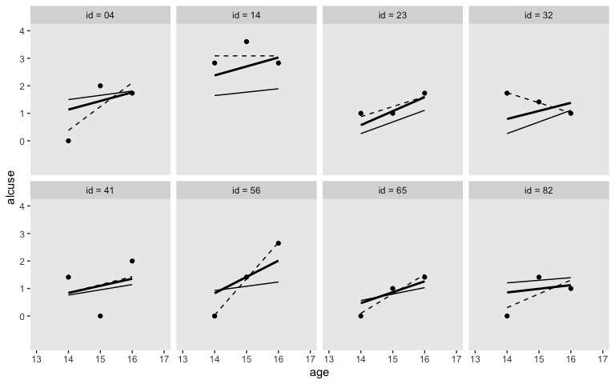<!-- -->

Though our purpose was largely to reproduce Figure 4.7, we might push
ourselves a little further. Our Bayesian estimates came with measures of
uncertainty, the posterior standard deviations and the 95% intervals.
Whenever possible, it’s good form to include some expression of our
uncertainty in our plots. Here let’s focus on the `id`-specific
trajectories.

``` r
f %>% 
  ggplot(aes(x = age, y = Estimate)) +
  # `id`-specific 95% intervals
  geom_ribbon(aes(ymin = Q2.5, ymax = Q97.5),
              fill = "grey75") +
  # `id`-specific lines
  geom_line(size = 1) +
  # data points
  geom_point(data = nd,
             aes(y = alcuse)) +
  scale_y_continuous("alcuse", breaks = 0:4, limits = c(-1, 4)) +
  xlim(13, 17) +
  theme(legend.position = "none",
        panel.grid = element_blank()) +
  facet_wrap(~id_label, ncol = 4)
```

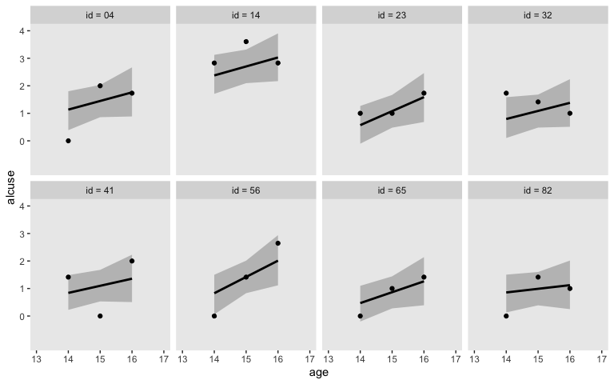<!-- -->

This also clarifies an important visualization point. If you only care
about plotting straight lines, you only need two points. However, if you
want to express shapes with curves, such as the typically-bowtie-shaped
95% intervals, you need estimates over a larger number of predictor
values. Back to `fitted()`\!

``` r
# we need an expanded version of the `nd`
nd_expanded <-
  alcohol1_pp %>% 
  select(id, coa, cpeer) %>% 
  filter(id %in% c(4, 14, 23, 32, 41, 56, 65, 82)) %>% 
  # this part is important!
  expand(nesting(id, coa, cpeer),
         age_14 = seq(from = 0, to = 2, length.out = 30)) %>% 
  mutate(id_label = ifelse(id < 10, str_c("0", id), id)) %>% 
  mutate(id_label = str_c("id = ", id_label),
         age      = age_14 + 14)

# pump our `nd_expanded` into `fitted()`
f <-
  fitted(fit4.7,
         newdata = nd_expanded) %>% 
  data.frame() %>% 
  bind_cols(nd_expanded)

glimpse(f)
```

    ## Observations: 240
    ## Variables: 10
    ## $ Estimate  <dbl> 1.134489, 1.156116, 1.177742, 1.199368, 1.220994, 1.242620, 1.264246, 1.285873,…
    ## $ Est.Error <dbl> 0.3562022, 0.3456284, 0.3357889, 0.3267502, 0.3185803, 0.3113477, 0.3051190, 0.…
    ## $ Q2.5      <dbl> 0.3883937, 0.4351870, 0.4735158, 0.5249442, 0.5708991, 0.6107689, 0.6502656, 0.…
    ## $ Q97.5     <dbl> 1.801852, 1.806147, 1.819295, 1.827235, 1.835426, 1.843173, 1.854218, 1.865515,…
    ## $ id        <dbl> 4, 4, 4, 4, 4, 4, 4, 4, 4, 4, 4, 4, 4, 4, 4, 4, 4, 4, 4, 4, 4, 4, 4, 4, 4, 4, 4…
    ## $ coa       <dbl> 1, 1, 1, 1, 1, 1, 1, 1, 1, 1, 1, 1, 1, 1, 1, 1, 1, 1, 1, 1, 1, 1, 1, 1, 1, 1, 1…
    ## $ cpeer     <dbl> 0.7708544, 0.7708544, 0.7708544, 0.7708544, 0.7708544, 0.7708544, 0.7708544, 0.…
    ## $ age_14    <dbl> 0.00000000, 0.06896552, 0.13793103, 0.20689655, 0.27586207, 0.34482759, 0.41379…
    ## $ id_label  <chr> "id = 04", "id = 04", "id = 04", "id = 04", "id = 04", "id = 04", "id = 04", "i…
    ## $ age       <dbl> 14.00000, 14.06897, 14.13793, 14.20690, 14.27586, 14.34483, 14.41379, 14.48276,…

Notice how we now have many more rows. Let’s plot.

``` r
f %>% 
  ggplot(aes(x = age, y = Estimate)) +
  # `id`-specific 95% intervals
  geom_ribbon(aes(ymin = Q2.5, ymax = Q97.5),
              fill = "grey75") +
  # `id`-specific lines
  geom_line(size = 1) +
  # data points
  geom_point(data = nd,
             aes(y = alcuse)) +
  scale_y_continuous("alcuse", breaks = 0:4, limits = c(-1, 4)) +
  xlim(13, 17) +
  theme(legend.position = "none",
        panel.grid = element_blank()) +
  facet_wrap(~id_label, ncol = 4)
```

<!-- -->

Singer and Willett pointed out that one of the ways in which the
multilevel model is more parsimonious than a series of `id`-specific
single-level models is that all `id` levels share the same
\(\sigma_\epsilon\) parameter. At this point, we should just point out
that it’s possible to relax this assumption with modern Bayesian
software, such as **brms**. For ideas on how, check out [Donald
Williams](https://twitter.com/wdonald_1985)’ work (e.g., [this
preprint](https://psyarxiv.com/gwatq)).

## Reference

[Singer, J. D., & Willett, J. B. (2003). *Applied longitudinal data
analysis: Modeling change and event occurrence*. New York, NY, US:
Oxford University
Press.](https://www.oxfordscholarship.com/view/10.1093/acprof:oso/9780195152968.001.0001/acprof-9780195152968)

## Session info

``` r
sessionInfo()
```

    ## R version 3.6.2 (2019-12-12)
    ## Platform: x86_64-apple-darwin15.6.0 (64-bit)
    ## Running under: macOS High Sierra 10.13.6
    ## 
    ## Matrix products: default
    ## BLAS:   /Library/Frameworks/R.framework/Versions/3.6/Resources/lib/libRblas.0.dylib
    ## LAPACK: /Library/Frameworks/R.framework/Versions/3.6/Resources/lib/libRlapack.dylib
    ## 
    ## locale:
    ## [1] en_US.UTF-8/en_US.UTF-8/en_US.UTF-8/C/en_US.UTF-8/en_US.UTF-8
    ## 
    ## attached base packages:
    ## [1] stats     graphics  grDevices utils     datasets  methods   base     
    ## 
    ## other attached packages:
    ##  [1] broom_0.5.3     loo_2.2.0       brms_2.12.0     Rcpp_1.0.3      forcats_0.4.0   stringr_1.4.0  
    ##  [7] dplyr_0.8.4     purrr_0.3.3     readr_1.3.1     tidyr_1.0.2     tibble_2.1.3    ggplot2_3.2.1  
    ## [13] tidyverse_1.3.0
    ## 
    ## loaded via a namespace (and not attached):
    ##   [1] colorspace_1.4-1     ggridges_0.5.2       rsconnect_0.8.16     markdown_1.1        
    ##   [5] base64enc_0.1-3      fs_1.3.1             rstudioapi_0.10      farver_2.0.3        
    ##   [9] rstan_2.19.2         DT_0.11              fansi_0.4.1          mvtnorm_1.0-12      
    ##  [13] lubridate_1.7.4      xml2_1.2.2           bridgesampling_0.8-1 robustbase_0.93-5   
    ##  [17] knitr_1.26           shinythemes_1.1.2    bayesplot_1.7.1      jsonlite_1.6.1      
    ##  [21] dbplyr_1.4.2         shiny_1.4.0          compiler_3.6.2       httr_1.4.1          
    ##  [25] backports_1.1.5      assertthat_0.2.1     Matrix_1.2-18        fastmap_1.0.1       
    ##  [29] lazyeval_0.2.2       cli_2.0.1            later_1.0.0          htmltools_0.4.0     
    ##  [33] prettyunits_1.1.1    tools_3.6.2          igraph_1.2.4.2       coda_0.19-3         
    ##  [37] gtable_0.3.0         glue_1.3.1           reshape2_1.4.3       cellranger_1.1.0    
    ##  [41] vctrs_0.2.2          nlme_3.1-142         crosstalk_1.0.0      xfun_0.12           
    ##  [45] ps_1.3.0             rvest_0.3.5          mime_0.8             miniUI_0.1.1.1      
    ##  [49] lifecycle_0.1.0      gtools_3.8.1         DEoptimR_1.0-8       MASS_7.3-51.4       
    ##  [53] zoo_1.8-7            scales_1.1.0         colourpicker_1.0     hms_0.5.3           
    ##  [57] promises_1.1.0       Brobdingnag_1.2-6    parallel_3.6.2       inline_0.3.15       
    ##  [61] RColorBrewer_1.1-2   shinystan_2.5.0      yaml_2.2.1           gridExtra_2.3       
    ##  [65] StanHeaders_2.19.0   stringi_1.4.6        dygraphs_1.1.1.6     checkmate_1.9.4     
    ##  [69] pkgbuild_1.0.6       rlang_0.4.5          pkgconfig_2.0.3      matrixStats_0.55.0  
    ##  [73] evaluate_0.14        lattice_0.20-38      rstantools_2.0.0     htmlwidgets_1.5.1   
    ##  [77] labeling_0.3         tidyselect_1.0.0     processx_3.4.1       plyr_1.8.5          
    ##  [81] magrittr_1.5         R6_2.4.1             generics_0.0.2       DBI_1.1.0           
    ##  [85] pillar_1.4.3         haven_2.2.0          withr_2.1.2          xts_0.12-0          
    ##  [89] abind_1.4-5          metRology_0.9-28-1   modelr_0.1.5         crayon_1.3.4        
    ##  [93] utf8_1.1.4           rmarkdown_2.0        grid_3.6.2           readxl_1.3.1        
    ##  [97] callr_3.4.1          threejs_0.3.3        reprex_0.3.0         digest_0.6.23       
    ## [101] xtable_1.8-4         httpuv_1.5.2         numDeriv_2016.8-1.1  stats4_3.6.2        
    ## [105] munsell_0.5.0        shinyjs_1.1
