Chapter 5. Treating Time More Flexibly
================
A Solomon Kurz
2019-06-21

Treating Time More Flexibly
===========================

> All the illustrative longitudinal data sets in previous chapters share two structural features that simplify analysis. Each is: (1) balanced--everyone is assessed on the identical number of occasions; and (2) time-structured--each set of occasions is identical across individuals. Our analyses have also been limited in that we have used only: (1) time-invariant predictors that describe immutable characteristics of individuals or their environment (except for *TIME* itself); and (2) a representation of *TIME* that forces the level-1 individual growth parameters to represent "initial status" and "rate of change."
>
> The multilevel model for change is far more flexible than these examples suggest. With little or no adjustment, you can use the same strategies to analyze more complex data sets. Not only can the waves of data be irregularly spaced, their number and spacing can vary across participants. Each individual can have his or her own data collection schedule and number of waves can vary without limit from person to person. So, too, predictors of change can be time-invariant or time-varying, and the level-1 submodel can be parameterized in a variety of interesting ways. (p. 138, *emphasis* in the original)

Variably spaced measurement occasions
-------------------------------------

> Many researchers design their studies with the goal of assessing each individual on an identical set of occasions...
>
> Yet sometimes, despite a valiant attempt to collect time-structured data, actual measurement occasions will differ. Variation often results from the realities of fieldwork and data collection...
>
> So, too, many researchers design their studies knowing full well that the measurement occasions may differ across participants. This is certainly true, for example, of those who use an *accelerated cohort* design in which an age-heterogeneous cohort of individuals is followed for a constant period of time. Because respondents initial vary in age, and age, not *wave*, is usually the appropriate metric for analyses (see the discussion of time metrics in section 1.3.2), observed measurement occasions will differ across individuals. (p. 139, *emphasis* in the original)

### The structure of variably spaced data sets.

You can find the PIAT data from the CNLSY study in the `reading_pp.csv` file.

``` r
library(tidyverse)
reading_pp <- read_csv("data/reading_pp.csv")

head(reading_pp)
```

    ## # A tibble: 6 x 5
    ##      id  wave agegrp   age  piat
    ##   <int> <int>  <dbl> <dbl> <int>
    ## 1     1     1    6.5  6       18
    ## 2     1     2    8.5  8.33    35
    ## 3     1     3   10.5 10.3     59
    ## 4     2     1    6.5  6       18
    ## 5     2     2    8.5  8.5     25
    ## 6     2     3   10.5 10.6     28

On pages 141 and 142, Singer and Willett discussed the phenomena of *occasion creep*, which is when "the temporal separations of occasions widens as the actual ages exceed design projections". Here's what that looks like:

``` r
reading_pp %>% 

  ggplot(aes(x = age, y = wave)) +
  geom_vline(xintercept = c(6.5, 8.5, 10.5), color = "white") +
  geom_jitter(alpha = .5, height = .33, width = 0) +
  scale_x_continuous(breaks = c(6.5, 8.5, 10.5)) +
  scale_y_continuous(breaks = 1:3) +
  ggtitle("This is what occasion creep looks like.",
          subtitle = "As the waves go by, the variation of the ages widens and their central tendency\ncreeps away from the ideal point.") +
  theme(panel.grid = element_blank())
```

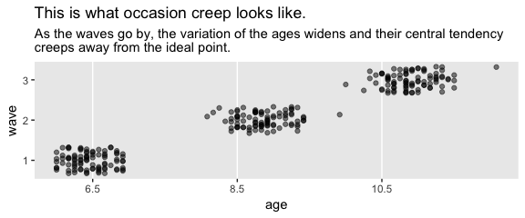

But back to the book, here's how we might make our version of Figure 5.1.

``` r
set.seed(5)

# wrangle
reading_pp %>% 
  nest(-id) %>% 
  sample_n(size = 9) %>% 
  unnest() %>% 
  # this will help format and order the facets
  mutate(id = ifelse(id < 10, str_c("0", id), id) %>% str_c("id = ", .)) %>% 
  gather(key, age, -id, -wave, -piat) %>% 
  
  # plot
  ggplot(aes(x = age, y = piat, color = key)) +
  geom_point(alpha = 2/3) +
  stat_smooth(method = "lm", se = F, size = 1/2) +
  scale_color_viridis_d(option = "B", end = .5, direction = -1) +
  coord_cartesian(xlim = 5:12,
                  ylim = 0:80) +
  xlab("measure of age") +
  theme(panel.grid = element_blank()) +
  facet_wrap(~id)
```

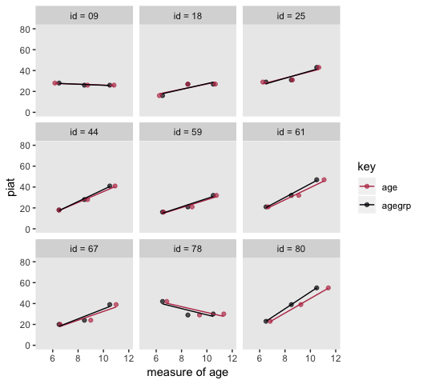

Since it wasn't clear which `id` values the authors used in the text, we just randomized. Change the seed to view different samples.

### Postulating and fitting multilevel models with variably spaced waves of data.

The composite formula for our first model is

$$
$$

It's the same for the twin model using `age` rather than `agegrp`. Notice how we've switched from Singer and Willett's *σ*<sup>2</sup> parameterization to the *σ* parameterization typical of **brms**.

``` r
reading_pp <-
  reading_pp %>% 
  mutate(agegrp_c = agegrp - 6.5,
         age_c    = age    - 6.5)
  
head(reading_pp)
```

    ## # A tibble: 6 x 7
    ##      id  wave agegrp   age  piat agegrp_c age_c
    ##   <int> <int>  <dbl> <dbl> <int>    <dbl> <dbl>
    ## 1     1     1    6.5  6       18        0 -0.5 
    ## 2     1     2    8.5  8.33    35        2  1.83
    ## 3     1     3   10.5 10.3     59        4  3.83
    ## 4     2     1    6.5  6       18        0 -0.5 
    ## 5     2     2    8.5  8.5     25        2  2   
    ## 6     2     3   10.5 10.6     28        4  4.08

In the last chapter, we began familiarizing ourselves with `brms::brm()` default priors. It's time to level up. Another approach is to use domain knowledge to set weakly-informative priors. Let's start with the PIAT. The Peabody Individual Achievement Test is a standardized individual test of scholastic achievement. It yields several subtest scores. The reading subtest is the one we're focusing on, here. As is typical for such tests, the PIAT scores are normed to yield a population mean of 100 and a standard deviation of 15.

With that information alone, even a PIAT novice should have an idea about how to specify the priors. Since our sole predictor variables are versions of age centered at 6.5, we know that the model intercept is interpreted as the expected value on the PIAT when the children are 6.5 years old. If you knew nothing else, you'd guess the mean score would be 100 with a standard deviation around 15. One way to use a weakly-informative prior on the intercept would be to multiply that *S**D* by a number like 2.

Next we need a prior for the time variables, `age_c` and `agegrp_c`. A one-unit increase in either of these is the expected increase in the PIAT with one year’s passage of age. Bringing in a little domain knowledge, IQ and achievement tests tend to be rather stable over time. However, we also expect children to get better as they age and we also don’t know exactly how these data have been adjusted for the children’s ages. It's also important to know that it's typical within the Bayesian world to place Normal priors on *β* parameters. So one approach would be to center the Normal prior on 0 and put something like twice the PIAT's standard deviation on the prior’s *σ*. If we were PIAT researchers, we could do much better. But with minimal knowledge of the test, this approach is certainly beats mindless defaults.

Next we have the variance parameters. Recall that `brms::brm()` defaults are Student’s *t*-distributions with *ν* = 3 and *μ* = 0. Let's start there. Now we just need to put values on *σ*. Since the PIAT has a standard deviation of 15 in the population, why not just use 15? If you felt insecure about this, multiply if by a factor of 2 or so. Also recall that when Student's *t*-distributions has a *ν* = 3, the tails are quite fat. Within the context of Bayesian priors, those fat tails make it easy for the likelihood to dominate the prior even when it’s a good way into the tail.

Finally we have the correlation among the group-level variance parameters, *σ*<sub>0</sub> and *σ*<sub>1</sub>. Recall that last chapter we learned the `brms::brm()` default was `lkj(1)`. To get a sense of what the LKJ does, we'll simulate from it. McElreath's **rethinking** package contains a handy `rlkjcorr()` function, which will allow us to simulate `n` draws from a `K` by `K` correlation matrix for which *η* is defined by `eta`. Let's take `n <- 1e6` draws from two LKJ prior distributions, one with *η* = 1 and the other with *η* = 4.

``` r
library(rethinking)

n <- 1e6
set.seed(5)

lkj <-
  tibble(eta = c(1, 4)) %>% 
  mutate(draws = purrr::map(eta, ~rlkjcorr(n, K = 2, eta = .)[, 2, 1])) %>% 
  unnest()

glimpse(lkj)
```

    ## Observations: 2,000,000
    ## Variables: 2
    ## $ eta   <dbl> 1, 1, 1, 1, 1, 1, 1, 1, 1, 1, 1, 1, 1, 1, 1, 1, 1, 1, 1, 1, 1, 1, 1, 1, 1, 1, 1, 1,…
    ## $ draws <dbl> 0.59957109, -0.83375155, 0.79069974, -0.05591997, -0.91300025, 0.45343010, 0.363191…

Now let's plot.

``` r
lkj %>% 
  mutate(eta = factor(eta)) %>% 
  
  ggplot(aes(x = draws, fill = eta, color = eta)) +
  geom_density(size = 0, alpha = 2/3) +
  geom_text(data = tibble(
    draws = c(.75, .35),
    y     = c(.6, 1.05),
    label = c("eta = 1", "eta = 4"),
    eta   = c(1, 4) %>% as.factor()),
    aes(y = y, label = label)) +
  scale_y_continuous(NULL, breaks = NULL) +
  scale_fill_viridis_d(option = "A", end = .5) +
  scale_color_viridis_d(option = "A", end = .5) +
  xlab(expression(rho)) +
  theme(panel.grid = element_blank(),
        legend.position = "none")
```

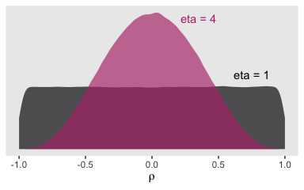

When we use `lkj(1)`, the prior is flat over the parameter space. However, setting `lkj(4)` is tantamount to a prior with a probability mass concentrated a bit towards zero. It's a prior that’s skeptical of extremely large or small correlations. Within the context of our multilevel model *ρ* parameters, this will be our weakly-regularizing prior.

Let's prepare to fit our models and load **brms**.

``` r
detach(package:rethinking, unload = T)
library(brms)
```

Fit the model.

``` r
fit1 <-
  brm(data = reading_pp, 
      family = gaussian,
      piat ~ 0 + intercept + agegrp_c + (1 + agegrp_c | id),
      prior = c(prior(normal(100, 30), class = b, coef = "intercept"),
                prior(normal(0, 30),   class = b, coef = "agegrp_c"),
                prior(student_t(3, 0, 15), class = sd),
                prior(student_t(3, 0, 15), class = sigma),
                prior(lkj(4), class = cor)),
      iter = 2000, warmup = 1000, chains = 4, cores = 4,
      seed = 5)

fit2 <-
  brm(data = reading_pp, 
      family = gaussian,
      piat ~ 0 + intercept + age_c + (1 + age_c | id),
      prior = c(prior(normal(100, 30), class = b, coef = "intercept"),
                prior(normal(0, 30),   class = b, coef = "age_c"),
                prior(student_t(3, 0, 15), class = sd),
                prior(student_t(3, 0, 15), class = sigma),
                prior(lkj(4), class = cor)),
      iter = 2000, warmup = 1000, chains = 4, cores = 4,
      seed = 5)
```

Focusing first on `fit1`, our analogue to the *AGEGRP* – 6.5 model displayed in Table 5.2, here is our model summary.

``` r
print(fit1, digits = 3)
```

    ##  Family: gaussian 
    ##   Links: mu = identity; sigma = identity 
    ## Formula: piat ~ 0 + intercept + agegrp_c + (1 + agegrp_c | id) 
    ##    Data: reading_pp (Number of observations: 267) 
    ## Samples: 4 chains, each with iter = 2000; warmup = 1000; thin = 1;
    ##          total post-warmup samples = 4000
    ## 
    ## Group-Level Effects: 
    ## ~id (Number of levels: 89) 
    ##                         Estimate Est.Error l-95% CI u-95% CI Eff.Sample  Rhat
    ## sd(Intercept)              3.450     0.811    1.792    5.012       1385 1.002
    ## sd(agegrp_c)               2.201     0.277    1.695    2.756       1207 1.004
    ## cor(Intercept,agegrp_c)    0.162     0.219   -0.243    0.616        669 1.007
    ## 
    ## Population-Level Effects: 
    ##           Estimate Est.Error l-95% CI u-95% CI Eff.Sample  Rhat
    ## intercept   21.197     0.636   19.929   22.449       5030 1.000
    ## agegrp_c     5.022     0.310    4.421    5.630       3734 1.001
    ## 
    ## Family Specific Parameters: 
    ##       Estimate Est.Error l-95% CI u-95% CI Eff.Sample  Rhat
    ## sigma    5.253     0.350    4.604    5.961       1204 1.004
    ## 
    ## Samples were drawn using sampling(NUTS). For each parameter, Eff.Sample 
    ## is a crude measure of effective sample size, and Rhat is the potential 
    ## scale reduction factor on split chains (at convergence, Rhat = 1).

Here's the `age_c` model.

``` r
print(fit2, digits = 3)
```

    ##  Family: gaussian 
    ##   Links: mu = identity; sigma = identity 
    ## Formula: piat ~ 0 + intercept + age_c + (1 + age_c | id) 
    ##    Data: reading_pp (Number of observations: 267) 
    ## Samples: 4 chains, each with iter = 2000; warmup = 1000; thin = 1;
    ##          total post-warmup samples = 4000
    ## 
    ## Group-Level Effects: 
    ## ~id (Number of levels: 89) 
    ##                      Estimate Est.Error l-95% CI u-95% CI Eff.Sample  Rhat
    ## sd(Intercept)           2.746     0.887    0.782    4.362        931 1.001
    ## sd(age_c)               1.995     0.253    1.529    2.520       1210 1.001
    ## cor(Intercept,age_c)    0.215     0.234   -0.225    0.684        569 1.006
    ## 
    ## Population-Level Effects: 
    ##           Estimate Est.Error l-95% CI u-95% CI Eff.Sample  Rhat
    ## intercept   21.100     0.592   19.937   22.274       4604 0.999
    ## age_c        4.534     0.278    3.986    5.098       2767 1.001
    ## 
    ## Family Specific Parameters: 
    ##       Estimate Est.Error l-95% CI u-95% CI Eff.Sample  Rhat
    ## sigma    5.186     0.343    4.557    5.882       1301 1.000
    ## 
    ## Samples were drawn using sampling(NUTS). For each parameter, Eff.Sample 
    ## is a crude measure of effective sample size, and Rhat is the potential 
    ## scale reduction factor on split chains (at convergence, Rhat = 1).

For a more focused look, we can use `fixef()` compare our *γ*s to each other and those in the text.

``` r
fixef(fit1) %>% round(digits = 3)
```

    ##           Estimate Est.Error   Q2.5  Q97.5
    ## intercept   21.197     0.636 19.929 22.449
    ## agegrp_c     5.022     0.310  4.421  5.630

``` r
fixef(fit2) %>% round(digits = 3)
```

    ##           Estimate Est.Error   Q2.5  Q97.5
    ## intercept   21.100     0.592 19.937 22.274
    ## age_c        4.534     0.278  3.986  5.098

Here are our *σ*<sub>*ϵ*</sub>s.

``` r
VarCorr(fit1)$residual$sd %>% round(digits = 3)
```

    ##  Estimate Est.Error  Q2.5 Q97.5
    ##     5.253      0.35 4.604 5.961

``` r
VarCorr(fit2)$residual$sd %>% round(digits = 3)
```

    ##  Estimate Est.Error  Q2.5 Q97.5
    ##     5.186     0.343 4.557 5.882

From a quick glance, you can see they are about the square of the *σ*<sub>*ϵ*</sub><sup>2</sup> estimates in the text.

Let's go ahead and compute the LOO and WAIC.

``` r
fit1 <- add_criterion(fit1, c("loo", "waic"))
fit2 <- add_criterion(fit2, c("loo", "waic"))
```

Here are their WAIC comparisons.

``` r
loo_compare(fit1, fit2, criterion = "waic") %>% 
  print(simplify = F)
```

    ##      elpd_diff se_diff elpd_waic se_elpd_waic p_waic se_p_waic waic   se_waic
    ## fit2    0.0       0.0  -866.3      15.4         78.3    7.5    1732.5   30.9 
    ## fit1   -3.6       3.7  -869.9      13.5         78.5    6.5    1739.7   27.0

By their WAIC estimates, the difference between the two isn't that large relative to it's standard error. It's a similar story by the LOO.

``` r
loo_compare(fit1, fit2, criterion = "loo") %>% 
  print(simplify = F)
```

    ##      elpd_diff se_diff elpd_loo se_elpd_loo p_loo  se_p_loo looic  se_looic
    ## fit2    0.0       0.0  -879.5     16.0        91.5    8.4   1758.9   32.0  
    ## fit1   -3.7       3.8  -883.1     14.0        91.8    7.3   1766.3   28.1

The uncertainty in our WAIC and LOO estimates provide information on their comparison that was not available for the AIC and the BIC comparisons in the text. We can also compare the WAIC and the LOO with model weights. Given the WAIC, from McElreath (2016) we learn

> A total weight of 1 is partitioned among the considered models, making it easier to compare their relative predictive accuracy. The weight for a model *i* in a set of *m* models is given by:
>
> $$w\_i = \\frac{\\text{exp}(-\\frac{1}{2} \\text{dWAIC}\_i)}{\\sum\_{j = 1}^m \\text{exp}(-\\frac{1}{2} \\text{dWAIC}\_i)}$$
>
> where dWAIC is the `dWAIC` in the `compare` table output. This example uses WAIC but the formula is the same for any other information criterion, since they are all on the deviance scale. (p. 199)

The `compare()` function McElreath referenced is from his [**rethinking** package](https://github.com/rmcelreath/rethinking), which is meant to accompany his [text](https://xcelab.net/rm/statistical-rethinking/). We don't have that within our **brms** paradigm. Our analogue to the `rethinking::compare()` function is `loo_compare()`. We don't quite have a `dWAIC` column from `loo_compare()`. Remember how last chapter we discussed how Aki Vehtari isn't a fan of converting information criteria to the *χ*<sup>2</sup> difference metric with that last −2 × ... step? That's why we have an `elpd_diff` instead of a `dWAIC`. But to get the corresponding value, you just multiply those values by -2. And yet if you look closely at the formula for *w*<sub>*i*</sub>, you'll see that each time the dWAIC term appears, it's multiplied by $-\\frac{1}{2}$. So we don't really need that `dWAIC` value anyway. As it turns out, we're good to go with our `elpd_diff`. Thus the above equation simplifies to

$$
w\_i = \\frac{\\text{exp}(\\text{elpd\_diff}\_i)}{\\sum\_{j = 1}^m \\text{exp}(\\text{elpd\_diff}\_i)}
$$
 But recall you don't have to do any of this by hand. We have the `brms::model_weights()` function.

``` r
model_weights(fit1, fit2, weights = "waic") %>% round(digits = 3)
```

    ##  fit1  fit2 
    ## 0.027 0.973

``` r
model_weights(fit1, fit2, weights = "loo") %>% round(digits = 3)
```

    ##  fit1  fit2 
    ## 0.025 0.975

Back to McElreath (2016):

> But what do these weights mean? There actually isn't a consensus about that. But here's Akaike’s interpretation, which is [common](https://www.springer.com/us/book/9780387953649).
>
> > *A model’s weight is an estimate of the probability that the model will make the best predictions on new data, conditional on the set of models considered*.
>
> Here's the heuristic explanation. First, regard WAIC as the expected deviance of a model on future data. That is to say that WAIC gives us an estimate of E(*D*<sub>test</sub>). Akaike weights convert these deviance values, which are log-likelihoods, to plain likelihoods and then standardize them all. This is just like Bayes' theorem uses a sum in the denominator to standardize the produce of the likelihood and prior. Therefore the Akaike weights are analogous to posterior probabilities of models, conditional on expected future data. (p. 199, *emphasis* in the original)

5.2 Varying numbers of measurement occasions
--------------------------------------------

As Singer and Willett pointed out,

> once you allow the spacing of waves to vary across individuals, it is a small leap to allow their *number* to vary as well. Statisticians say that such data sets are *unbalanced.* As you would expect, balance facilitates analysis: models can be parameterized more easily, random effects can be estimated more precisely, and computer algorithms will converge more rapidly.
>
> Yet a major advantage of the multilevel model for change is that it is easily fit to unbalanced data. (p. 146, *emphasis* in the original)

### Analyzing data sets in which the number of waves per person varies.

Here we load the `wages_pp.csv` data.

``` r
wages_pp <- read_csv("data/wages_pp.csv")

glimpse(wages_pp)
```

    ## Observations: 6,402
    ## Variables: 15
    ## $ id            <int> 31, 31, 31, 31, 31, 31, 31, 31, 36, 36, 36, 36, 36, 36, 36, 36, 36, 36, 53,…
    ## $ lnw           <dbl> 1.491, 1.433, 1.469, 1.749, 1.931, 1.709, 2.086, 2.129, 1.982, 1.798, 2.256…
    ## $ exper         <dbl> 0.015, 0.715, 1.734, 2.773, 3.927, 4.946, 5.965, 6.984, 0.315, 0.983, 2.040…
    ## $ ged           <int> 1, 1, 1, 1, 1, 1, 1, 1, 1, 1, 1, 1, 1, 1, 1, 1, 1, 1, 0, 0, 1, 1, 1, 1, 1, …
    ## $ postexp       <dbl> 0.015, 0.715, 1.734, 2.773, 3.927, 4.946, 5.965, 6.984, 0.315, 0.983, 2.040…
    ## $ black         <int> 0, 0, 0, 0, 0, 0, 0, 0, 0, 0, 0, 0, 0, 0, 0, 0, 0, 0, 0, 0, 0, 0, 0, 0, 0, …
    ## $ hispanic      <int> 1, 1, 1, 1, 1, 1, 1, 1, 0, 0, 0, 0, 0, 0, 0, 0, 0, 0, 1, 1, 1, 1, 1, 1, 1, …
    ## $ hgc           <int> 8, 8, 8, 8, 8, 8, 8, 8, 9, 9, 9, 9, 9, 9, 9, 9, 9, 9, 7, 7, 7, 7, 7, 7, 7, …
    ## $ hgc.9         <int> -1, -1, -1, -1, -1, -1, -1, -1, 0, 0, 0, 0, 0, 0, 0, 0, 0, 0, -2, -2, -2, -…
    ## $ uerate        <dbl> 3.215, 3.215, 3.215, 3.295, 2.895, 2.495, 2.595, 4.795, 4.895, 7.400, 7.400…
    ## $ ue.7          <dbl> -3.785, -3.785, -3.785, -3.705, -4.105, -4.505, -4.405, -2.205, -2.105, 0.4…
    ## $ ue.centert1   <dbl> 0.000, 0.000, 0.000, 0.080, -0.320, -0.720, -0.620, 1.580, 0.000, 2.505, 2.…
    ## $ ue.mean       <dbl> 3.2150, 3.2150, 3.2150, 3.2150, 3.2150, 3.2150, 3.2150, 3.2150, 5.0965, 5.0…
    ## $ ue.person.cen <dbl> 0.0000, 0.0000, 0.0000, 0.0800, -0.3200, -0.7200, -0.6200, 1.5800, -0.2015,…
    ## $ ue1           <dbl> 3.215, 3.215, 3.215, 3.215, 3.215, 3.215, 3.215, 3.215, 4.895, 4.895, 4.895…

Here's a more focused look along the lines of Table 5.3.

``` r
wages_pp %>% 
  select(id, exper, lnw, black, hgc, uerate) %>% 
  filter(id %in% c(206, 332, 1028))
```

    ## # A tibble: 20 x 6
    ##       id exper   lnw black   hgc uerate
    ##    <int> <dbl> <dbl> <int> <int>  <dbl>
    ##  1   206 1.87  2.03      0    10   9.2 
    ##  2   206 2.81  2.30      0    10  11   
    ##  3   206 4.31  2.48      0    10   6.30
    ##  4   332 0.125 1.63      0     8   7.1 
    ##  5   332 1.62  1.48      0     8   9.6 
    ##  6   332 2.41  1.80      0     8   7.2 
    ##  7   332 3.39  1.44      0     8   6.20
    ##  8   332 4.47  1.75      0     8   5.60
    ##  9   332 5.18  1.53      0     8   4.60
    ## 10   332 6.08  2.04      0     8   4.30
    ## 11   332 7.04  2.18      0     8   3.40
    ## 12   332 8.20  2.19      0     8   4.39
    ## 13   332 9.09  4.04      0     8   6.70
    ## 14  1028 0.004 0.872     1     8   9.3 
    ## 15  1028 0.035 0.903     1     8   7.4 
    ## 16  1028 0.515 1.39      1     8   7.3 
    ## 17  1028 1.48  2.32      1     8   7.4 
    ## 18  1028 2.14  1.48      1     8   6.30
    ## 19  1028 3.16  1.70      1     8   5.90
    ## 20  1028 4.10  2.34      1     8   6.9

To get a sense of the diversity in the number of occasions per `id`, use `group_by()` and `count()`.

``` r
wages_pp %>% 
  group_by(id) %>% 
  count() %>% 
   
  ggplot(aes(x = n)) +
  geom_bar() +
  scale_x_continuous(breaks = 1:13) +
  coord_flip() +
  labs(x = "# measurement occasions",
       y = "count of cases") +
  theme(panel.grid = element_blank())
```

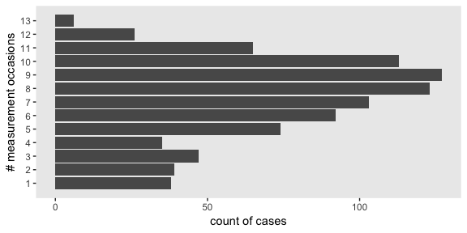

The spacing of the measurement occasions also differs a lot across cases. Recall that `exper` "identifies the specific moment--to the nearest day--in each man's labor force history associated with each observed value of" `lnw` (p. 147). Here's a sense of what that looks like.

``` r
wages_pp %>% 
  filter(id %in% c(206, 332, 1028)) %>% 
  mutate(id = factor(id)) %>% 
  
  ggplot(aes(x = exper, y = lnw, color = id)) +
  geom_point() +
  geom_line() +
  scale_color_viridis_d(option = "B", begin = .35, end = .8) +
  theme(panel.grid = element_blank())
```

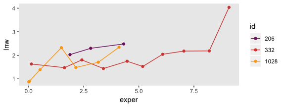

Uneven for dayz.

Here's the **brms** version of the composite formula for Model A, the unconditional growth model for `lnw`.

$$
$$

To attempt setting priors for this, we need to review what `lnw` is. From the text: "To adjust for inflation, each hourly wage is expressed in constant 1990 dollars. To address the skewness commonly found in wage data and to linearize the individual wage trajectories, we analyze the natural logarithm of wages, *LNW*" (p. 147). So it's the log of participant wages in 1990 dollars. From the official [US Social Secutiry website](https://www.ssa.gov/oact/cola/central.html), we learn the average yearly wage in 1990 was $20,172.11. Here's that natural log for that.

``` r
log(20172.11)
```

    ## [1] 9.912056

However, that's the yearly wage. In the text, this is conceptualized as rate per hour. If we presume a 40 hour week for 52 weeks, this translates to a little less than $10 per hour.

``` r
20172.11 / (40 * 52)
```

    ## [1] 9.69813

And here's what that looks like in a log metric.

``` r
log(20172.11 / (40 * 52))
```

    ## [1] 2.271933

But keep in mind that "to track wages on a common temporal scale, Murnane and colleagues decided to clock time from each respondent's first day of work" (p. 147). So the wages at one's initial point in the study were often entry-level wages. From the official website for the [US Department of Labor](https://www.dol.gov/whd/minwage/chart.htm), we learn the national US minimum wage in 1990 was $3.80 per hour. Here's what that looks like on the log scale.

``` r
log(3.80)
```

    ## [1] 1.335001

So perhaps this is a better figure to center our prior for the model intercept on. If we stay with a conventional Gaussian prior and put *μ* = 1.335, what value should we use for the standard deviation. Well, if that's the log minimum and 2.27 is the log mean, then there's less than a log value of 1 between the minimum and the mean. If we'd like to continue our practice of weakly regularizing priors a value of 1 or even 0.5 on the log scale would seem reasonable. For simplicity, we'll use `normal(1.335, 1)`.

Next we need a prior for the expected increase over a single year’s employment. A conservative default might be to center it on zero—no change from year to year. Since as we’ve established a 1 on the log scale is more than the difference between the minimum and average hourly wages in 1990 dollars, we might just use `normal(0, 0.5)` as a starting point.

So then what about our variance parameters? Given these are all entry-level workers and given how little we’d expect them to increase from year to year, a `student_t(3, 0, 1)` on the log scale would seem pretty permissive.

So then here's how we might formally specify our model priors:

$$
\\begin{align\*}
\\gamma\_{00}     & \\sim \\text{Normal}(1.335, 1) \\\\
\\gamma\_{10}     & \\sim \\text{Normal}(0, 0.5) \\\\
\\sigma\_\\epsilon & \\sim \\text{Student-t} (3, 0, 1) \\\\
\\sigma\_0        & \\sim \\text{Student-t} (3, 0, 1) \\\\
\\sigma\_1        & \\sim \\text{Student-t} (3, 0, 1) \\\\
\\rho\_{01}       & \\sim \\text{LKJ} (4)
\\end{align\*}
$$

For a point of comparison, here are the `brms::brm()` default priors.

``` r
get_prior(data = wages_pp, 
          family = gaussian,
          lnw ~ 0 + intercept + exper + (1 + exper | id))
```

    ##                  prior class      coef group resp dpar nlpar bound
    ## 1                          b                                      
    ## 2                          b     exper                            
    ## 3                          b intercept                            
    ## 4               lkj(1)   cor                                      
    ## 5                        cor              id                      
    ## 6  student_t(3, 0, 10)    sd                                      
    ## 7                         sd              id                      
    ## 8                         sd     exper    id                      
    ## 9                         sd Intercept    id                      
    ## 10 student_t(3, 0, 10) sigma

Even though our priors are still quite permissive on the scale of the data, they're much more informative than the defaults. And clearly, if we had formal backgrounds in the entry-level economy of the US in the early 1900s, we'd be able to specify much better priors. But hopefully this walk-through gives a sense of how to start thinking about model priors.

Let's fit the model.

``` r
fit3 <-
  brm(data = wages_pp, 
      family = gaussian,
      lnw ~ 0 + intercept + exper + (1 + exper | id),
      prior = c(prior(normal(1.335, 1), class = b, coef = "intercept"),
                prior(normal(0, 0.5),   class = b, coef = "exper"),
                prior(student_t(3, 0, 1), class = sd),
                prior(student_t(3, 0, 1), class = sigma),
                prior(lkj(4), class = cor)),
      iter = 2000, warmup = 1000, chains = 4, cores = 4,
      seed = 5)
```

Here are the results.

``` r
print(fit3, digits = 3)
```

    ##  Family: gaussian 
    ##   Links: mu = identity; sigma = identity 
    ## Formula: lnw ~ 0 + intercept + exper + (1 + exper | id) 
    ##    Data: wages_pp (Number of observations: 6402) 
    ## Samples: 4 chains, each with iter = 2000; warmup = 1000; thin = 1;
    ##          total post-warmup samples = 4000
    ## 
    ## Group-Level Effects: 
    ## ~id (Number of levels: 888) 
    ##                      Estimate Est.Error l-95% CI u-95% CI Eff.Sample  Rhat
    ## sd(Intercept)           0.232     0.011    0.211    0.253       1543 1.002
    ## sd(exper)               0.041     0.003    0.036    0.047        624 1.007
    ## cor(Intercept,exper)   -0.281     0.070   -0.406   -0.137        579 1.007
    ## 
    ## Population-Level Effects: 
    ##           Estimate Est.Error l-95% CI u-95% CI Eff.Sample  Rhat
    ## intercept    1.716     0.011    1.694    1.737       2612 1.000
    ## exper        0.046     0.002    0.041    0.050       2532 1.000
    ## 
    ## Family Specific Parameters: 
    ##       Estimate Est.Error l-95% CI u-95% CI Eff.Sample  Rhat
    ## sigma    0.309     0.003    0.303    0.315       3546 1.000
    ## 
    ## Samples were drawn using sampling(NUTS). For each parameter, Eff.Sample 
    ## is a crude measure of effective sample size, and Rhat is the potential 
    ## scale reduction factor on split chains (at convergence, Rhat = 1).

Since the criterion `lnw` is on the log scale, Singer and Willett pointed out our estimate for *γ*<sub>10</sub> indicates a nonlinear growth rate on the natural dollar scale. They further explicated that "if an outcome in a linear relationship, *Y*, is expressed as a natural logarithm and $\\hat{\\gamma}\_{01}$ is the regression coefficient for a predictor *X*, then $100(e^{\\hat{\\gamma}\_{01}} - 1)$ is the *percentage change* in *Y* per unit difference in *X*" (p. 148, *emphasis* in the original). Here's how to do that conversion with our **brms** output.

``` r
post <-
  posterior_samples(fit3) %>% 
  transmute(percent_change = 100 * (exp(b_exper) - 1))

head(post)
```

    ##   percent_change
    ## 1       4.448150
    ## 2       4.628596
    ## 3       4.466600
    ## 4       4.915300
    ## 5       4.634974
    ## 6       4.541443

For our plot, let’s break out [Matthew Kay](https://twitter.com/mjskay)'s handy [**tidybayes** package](mjskay.github.io/tidybayes/). With the `tidybayes::geom_halfeyeh()` function, it’s easy to put horizontal point intervals beneath out parameter densities. Here we’ll use 95% intervals.

``` r
library(tidybayes)

post %>% 
  ggplot(aes(x = percent_change, y = 0)) +
  geom_halfeyeh(.prob = .95) +
  scale_y_continuous(NULL, breaks = NULL) +
  labs(title = "Percent change",
       x = expression(100*(italic(e)^(hat(gamma)[1][0])-1))) +
  theme(panel.grid = element_blank())
```

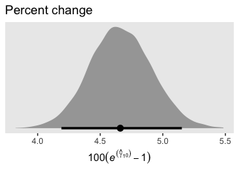

The **tidybayes** package also has a group of functions that make it easy to summarize posterior parameters with measures of central tendency (i.e., mean, median, mode) and intervals (i.e., percentile based, highest posterior density intervals). Here we’ll use `median_qi()` to get the posterior median and percentile-based 95% intervals.

``` r
post %>% 
  median_qi(percent_change)
```

    ##   percent_change   .lower   .upper .width .point .interval
    ## 1       4.660599 4.190154 5.152196   0.95 median        qi

For our next model, Model B in Table 5.4, we add two time-invariant covariates. In the data, these are listed as `black` and `hgc.9`. Before we proceed, let's rename `hgc.9` to be more consistent with tydyverse style.

``` r
wages_pp <-
  wages_pp %>% 
  rename(hgc_9 = hgc.9)

glimpse(wages_pp)
```

    ## Observations: 6,402
    ## Variables: 15
    ## $ id            <int> 31, 31, 31, 31, 31, 31, 31, 31, 36, 36, 36, 36, 36, 36, 36, 36, 36, 36, 53,…
    ## $ lnw           <dbl> 1.491, 1.433, 1.469, 1.749, 1.931, 1.709, 2.086, 2.129, 1.982, 1.798, 2.256…
    ## $ exper         <dbl> 0.015, 0.715, 1.734, 2.773, 3.927, 4.946, 5.965, 6.984, 0.315, 0.983, 2.040…
    ## $ ged           <int> 1, 1, 1, 1, 1, 1, 1, 1, 1, 1, 1, 1, 1, 1, 1, 1, 1, 1, 0, 0, 1, 1, 1, 1, 1, …
    ## $ postexp       <dbl> 0.015, 0.715, 1.734, 2.773, 3.927, 4.946, 5.965, 6.984, 0.315, 0.983, 2.040…
    ## $ black         <int> 0, 0, 0, 0, 0, 0, 0, 0, 0, 0, 0, 0, 0, 0, 0, 0, 0, 0, 0, 0, 0, 0, 0, 0, 0, …
    ## $ hispanic      <int> 1, 1, 1, 1, 1, 1, 1, 1, 0, 0, 0, 0, 0, 0, 0, 0, 0, 0, 1, 1, 1, 1, 1, 1, 1, …
    ## $ hgc           <int> 8, 8, 8, 8, 8, 8, 8, 8, 9, 9, 9, 9, 9, 9, 9, 9, 9, 9, 7, 7, 7, 7, 7, 7, 7, …
    ## $ hgc_9         <int> -1, -1, -1, -1, -1, -1, -1, -1, 0, 0, 0, 0, 0, 0, 0, 0, 0, 0, -2, -2, -2, -…
    ## $ uerate        <dbl> 3.215, 3.215, 3.215, 3.295, 2.895, 2.495, 2.595, 4.795, 4.895, 7.400, 7.400…
    ## $ ue.7          <dbl> -3.785, -3.785, -3.785, -3.705, -4.105, -4.505, -4.405, -2.205, -2.105, 0.4…
    ## $ ue.centert1   <dbl> 0.000, 0.000, 0.000, 0.080, -0.320, -0.720, -0.620, 1.580, 0.000, 2.505, 2.…
    ## $ ue.mean       <dbl> 3.2150, 3.2150, 3.2150, 3.2150, 3.2150, 3.2150, 3.2150, 3.2150, 5.0965, 5.0…
    ## $ ue.person.cen <dbl> 0.0000, 0.0000, 0.0000, 0.0800, -0.3200, -0.7200, -0.6200, 1.5800, -0.2015,…
    ## $ ue1           <dbl> 3.215, 3.215, 3.215, 3.215, 3.215, 3.215, 3.215, 3.215, 4.895, 4.895, 4.895…

There we go. Let's take a look at the distributions of our covariates.

``` r
wages_pp %>% 
  select(black, hgc_9) %>% 
  gather() %>% 
  
  ggplot(aes(x = value)) +
  geom_bar() +
  theme(panel.grid = element_blank()) +
  facet_wrap(~key, scales = "free")
```

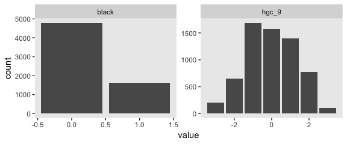

We see `black` is a dummy variable coded "Black" = 1, "Non-black" = 0; `hgc_9` is a somewhat Gaussian integer centered around zero. For context, it might also help to check its standard deviation.

``` r
sd(wages_pp$hgc_9)
```

    ## [1] 1.347135

With a mean near 0 and an *S**D* near 1, `hgc_9` is almost in a standardized metric. If we wanted to keep with our weakly-regularizing approach, `normal(0, 1)` or even `normal(0, 0.5)` would be pretty permissive for both these variables. Recall that we're predicting wage on the log scale. A *γ* value of 1 or even 0.5 would be humongous for the social sciences. Since we already have the *γ* for `exper` set to `normal(0, 0.5)`, let's just keep with that. Here's how we might describe our model in statistical terms:

$$
$$

The top portion up through the **Ω** line is the likelihood. Starting with *γ*<sub>00</sub> ∼ Normal(1.335, 1) on down, we've listed our priors. Here's how to fit the model with **brms**.

``` r
fit4 <-
  brm(data = wages_pp, 
      family = gaussian,
      lnw ~ 0 + intercept + hgc_9 + black + exper + exper:hgc_9 + exper:black + (1 + exper | id),
      prior = c(prior(normal(1.335, 1), class = b, coef = "intercept"),
                prior(normal(0, 0.5),   class = b),
                prior(student_t(3, 0, 1), class = sd),
                prior(student_t(3, 0, 1), class = sigma),
                prior(lkj(4), class = cor)),
      iter = 2000, warmup = 1000, chains = 4, cores = 4,
      seed = 5)
```

Let's take a look at the results.

``` r
print(fit4, digits = 3)
```

    ##  Family: gaussian 
    ##   Links: mu = identity; sigma = identity 
    ## Formula: lnw ~ 0 + intercept + hgc_9 + black + exper + exper:hgc_9 + exper:black + (1 + exper | id) 
    ##    Data: wages_pp (Number of observations: 6402) 
    ## Samples: 4 chains, each with iter = 2000; warmup = 1000; thin = 1;
    ##          total post-warmup samples = 4000
    ## 
    ## Group-Level Effects: 
    ## ~id (Number of levels: 888) 
    ##                      Estimate Est.Error l-95% CI u-95% CI Eff.Sample  Rhat
    ## sd(Intercept)           0.227     0.011    0.207    0.248       1448 1.003
    ## sd(exper)               0.041     0.003    0.035    0.046        517 1.002
    ## cor(Intercept,exper)   -0.298     0.070   -0.423   -0.150        566 1.004
    ## 
    ## Population-Level Effects: 
    ##             Estimate Est.Error l-95% CI u-95% CI Eff.Sample  Rhat
    ## intercept      1.717     0.013    1.693    1.742       2064 1.000
    ## hgc_9          0.035     0.008    0.019    0.050       2439 1.000
    ## black          0.015     0.023   -0.030    0.060       1996 1.000
    ## exper          0.049     0.003    0.044    0.054       2002 1.001
    ## hgc_9:exper    0.001     0.002   -0.002    0.005       2365 1.000
    ## black:exper   -0.018     0.005   -0.028   -0.007       2040 1.001
    ## 
    ## Family Specific Parameters: 
    ##       Estimate Est.Error l-95% CI u-95% CI Eff.Sample  Rhat
    ## sigma    0.309     0.003    0.303    0.315       3469 1.001
    ## 
    ## Samples were drawn using sampling(NUTS). For each parameter, Eff.Sample 
    ## is a crude measure of effective sample size, and Rhat is the potential 
    ## scale reduction factor on split chains (at convergence, Rhat = 1).

The *γ*s are on par with those in the text. When we convert the *σ* parameters to the *σ*<sup>2</sup> metric, here's what they look like.

``` r
post <- posterior_samples(fit4) 

post %>% 
  transmute(sigma_2_0 = sd_id__Intercept^2,
            sigma_2_1 = sd_id__exper^2,
            sigma_2_e = sigma^2) %>% 
  gather() %>% 
  
  ggplot(aes(x = value, y = key)) +
  geom_halfeyeh(.width = .95, scale = "width") +
  coord_cartesian(ylim = c(1.4, 3.4)) +
  theme(panel.grid = element_blank())
```

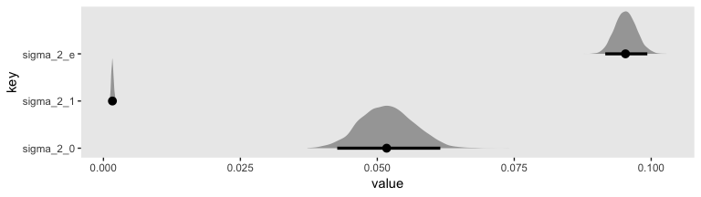

We might plot our *γ*s, too. Here we'll use `tidybayes::stat_pointintervalh()` to just focus on the points and intervals.

``` r
post %>% 
  select(b_intercept:`b_black:exper`) %>% 
  set_names(str_c(rep(0:1, each = 3), rep(0:2, times = 2))) %>% 
  gather() %>% 
  
  ggplot(aes(x = value, y = key)) +
  geom_vline(xintercept = 0, color = "white") +
  stat_pointintervalh(.width = .95, size = 1/2) +
  ylab(expression(gamma["[ _ _ ]"])) +
  theme(panel.grid = element_blank())
```

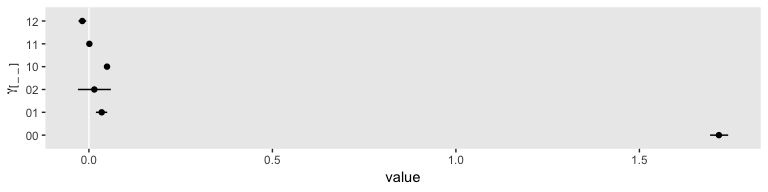

As in the text, our *γ*<sub>02</sub> and *γ*<sub>11</sub> parameters hovered around zero. For our next model, Model C in Table 5.4, we’ll drop those parameters.

``` r
fit5 <-
  brm(data = wages_pp, 
      family = gaussian,
      lnw ~ 0 + intercept + hgc_9 + exper + exper:black + (1 + exper | id),
      prior = c(prior(normal(1.335, 1), class = b, coef = "intercept"),
                prior(normal(0, 0.5),   class = b),
                prior(student_t(3, 0, 1), class = sd),
                prior(student_t(3, 0, 1), class = sigma),
                prior(lkj(4), class = cor)),
      iter = 2000, warmup = 1000, chains = 4, cores = 4,
      seed = 5)
```

Let's take a look at the results.

``` r
print(fit5, digits = 3)
```

    ##  Family: gaussian 
    ##   Links: mu = identity; sigma = identity 
    ## Formula: lnw ~ 0 + intercept + hgc_9 + exper + exper:black + (1 + exper | id) 
    ##    Data: wages_pp (Number of observations: 6402) 
    ## Samples: 4 chains, each with iter = 2000; warmup = 1000; thin = 1;
    ##          total post-warmup samples = 4000
    ## 
    ## Group-Level Effects: 
    ## ~id (Number of levels: 888) 
    ##                      Estimate Est.Error l-95% CI u-95% CI Eff.Sample  Rhat
    ## sd(Intercept)           0.227     0.011    0.206    0.248       1401 1.002
    ## sd(exper)               0.041     0.003    0.035    0.046        467 1.015
    ## cor(Intercept,exper)   -0.295     0.069   -0.419   -0.151        483 1.020
    ## 
    ## Population-Level Effects: 
    ##             Estimate Est.Error l-95% CI u-95% CI Eff.Sample  Rhat
    ## intercept      1.722     0.011    1.701    1.743       2513 1.000
    ## hgc_9          0.038     0.006    0.026    0.051       2170 1.000
    ## exper          0.049     0.003    0.044    0.054       2300 1.000
    ## exper:black   -0.016     0.004   -0.025   -0.008       2345 1.000
    ## 
    ## Family Specific Parameters: 
    ##       Estimate Est.Error l-95% CI u-95% CI Eff.Sample  Rhat
    ## sigma    0.309     0.003    0.303    0.315       2756 1.001
    ## 
    ## Samples were drawn using sampling(NUTS). For each parameter, Eff.Sample 
    ## is a crude measure of effective sample size, and Rhat is the potential 
    ## scale reduction factor on split chains (at convergence, Rhat = 1).

Perhaps unsurprisingly, the parameter estimates for `fit5` ended up quite similar to those from `fit4`. And happily they're also similar to those in the text. Let's compute the WAIC estimates.

``` r
fit3 <- add_criterion(fit3, criterion = "waic")
fit4 <- add_criterion(fit4, criterion = "waic")
fit5 <- add_criterion(fit5, criterion = "waic")
```

Compare their WAIC estimates using elpd difference scores.

``` r
loo_compare(fit3, fit4, fit5, criterion = "waic") %>% 
  print(simplify = F)
```

    ##      elpd_diff se_diff elpd_waic se_elpd_waic p_waic  se_p_waic waic    se_waic
    ## fit4     0.0       0.0 -2052.1     103.7        868.4    26.9    4104.3   207.4
    ## fit5    -0.4       1.5 -2052.5     103.7        867.4    26.9    4105.1   207.4
    ## fit3    -6.5       4.2 -2058.6     103.5        879.3    27.3    4117.2   207.1

The differences are subtle. Here are the WAIC weights.

``` r
model_weights(fit3, fit4, fit5, weights = "waic") %>% 
  round(digits = 3)
```

    ##  fit3  fit4  fit5 
    ## 0.001 0.604 0.396

When we use weights, almost all goes to `fit4` and `fit5`, with the full model, `fit4`, showing a slight edge.

Let's get ready to make our version of Figure 5.2. We'll start with `fitted()` work.

``` r
nd <-
  tibble(black = 0:1) %>% 
  expand(black,
         hgc_9 = c(0, 3)) %>% 
  expand(nesting(black, hgc_9),
         exper = seq(from = 0, to = 11, length.out = 30))

nd
```

    ## # A tibble: 120 x 3
    ##    black hgc_9 exper
    ##    <int> <dbl> <dbl>
    ##  1     0     0 0    
    ##  2     0     0 0.379
    ##  3     0     0 0.759
    ##  4     0     0 1.14 
    ##  5     0     0 1.52 
    ##  6     0     0 1.90 
    ##  7     0     0 2.28 
    ##  8     0     0 2.66 
    ##  9     0     0 3.03 
    ## 10     0     0 3.41 
    ## # … with 110 more rows

``` r
f <-
  fitted(fit5, 
         newdata = nd,
         re_formula = NA) %>% 
  data.frame() %>% 
  bind_cols(nd)

head(f)
```

    ##   Estimate   Est.Error     Q2.5    Q97.5 black hgc_9     exper
    ## 1 1.721526 0.010716508 1.701063 1.742511     0     0 0.0000000
    ## 2 1.740047 0.010253451 1.720344 1.760313     0     0 0.3793103
    ## 3 1.758568 0.009861212 1.739306 1.778049     0     0 0.7586207
    ## 4 1.777089 0.009548520 1.758281 1.796056     0     0 1.1379310
    ## 5 1.795610 0.009323384 1.777087 1.814430     0     0 1.5172414
    ## 6 1.814131 0.009192238 1.795978 1.832881     0     0 1.8965517

Here it is, our two-panel version of Figure 5.2.

``` r
f %>%
  mutate(black = factor(black,
                        labels = c("Latinos and Whites", "Blacks")),
         hgc_9 = factor(hgc_9, 
                        labels = c("9th grade dropouts", "12th grade dropouts"))) %>% 
  
  ggplot(aes(x = exper,
             color = black, fill = black)) +
  geom_ribbon(aes(ymin = Q2.5, ymax = Q97.5),
              size = 0, alpha = 1/4) +
  geom_line(aes(y = Estimate)) +
  scale_color_viridis_d(NULL, option = "C", begin = .25, end = .75) +
  scale_fill_viridis_d(NULL, option = "C", begin = .25, end = .75) +
  ylab("lnw") +
  coord_cartesian(ylim = c(1.6, 2.4)) +
  theme(panel.grid = element_blank()) +
  facet_wrap(~hgc_9)
```

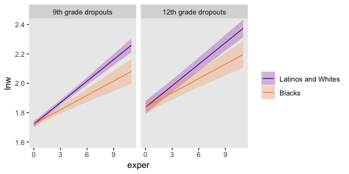

Recall how in the end of Chapter 4, we briefly discussed posterior predictive checks (PPC). The basic idea is that good models should be able to retrodict the data used to produce them. Table 5.3 in the text introduced the data set by highlighting three participants and we went ahead and looked at their data in a plot. One way to do a PPC might be to plot their original data atop their model estimates. The `fitted()` function will help us with the prepatory work.

``` r
nd <-
  wages_pp %>% 
  filter(id %in% c(206, 332, 1028))

f <-
  fitted(fit5, 
         newdata = nd) %>% 
  data.frame() %>% 
  bind_cols(nd)

head(f)
```

    ##   Estimate Est.Error     Q2.5    Q97.5  id   lnw exper ged postexp black hispanic hgc hgc_9 uerate
    ## 1 2.058572 0.1361317 1.785002 2.329090 206 2.028 1.874   0       0     0        0  10     1  9.200
    ## 2 2.119034 0.1339734 1.851847 2.386407 206 2.297 2.814   0       0     0        0  10     1 11.000
    ## 3 2.215516 0.1506142 1.931163 2.514862 206 2.482 4.314   0       0     0        0  10     1  6.295
    ## 4 1.464040 0.1380457 1.196000 1.734323 332 1.630 0.125   0       0     0        1   8    -1  7.100
    ## 5 1.647401 0.1120708 1.423670 1.869187 332 1.476 1.625   0       0     0        1   8    -1  9.600
    ## 6 1.743726 0.1013921 1.543927 1.944201 332 1.804 2.413   0       0     0        1   8    -1  7.200
    ##     ue.7 ue.centert1  ue.mean ue.person.cen ue1
    ## 1  2.200       0.000 8.831667     0.3683333 9.2
    ## 2  4.000       1.800 8.831667     2.1683333 9.2
    ## 3 -0.705      -2.905 8.831667    -2.5366667 9.2
    ## 4  0.100       0.000 5.906500     1.1935000 7.1
    ## 5  2.600       2.500 5.906500     3.6935000 7.1
    ## 6  0.200       0.100 5.906500     1.2935000 7.1

Here's the plot.

``` r
f %>% 
  mutate(id = str_c("id = ", id)) %>% 
  
  ggplot(aes(x = exper)) +
  geom_pointrange(aes(y = Estimate, ymin = Q2.5, ymax = Q97.5,
                      color = id)) +
  geom_point(aes(y = lnw)) +
  scale_color_viridis_d(option = "B", begin = .35, end = .8) +
  labs(subtitle = "The black dots are the original data. The colored points and vertical lines are the participant-specific posterior\nmeans and 95% intervals.") +
  theme(panel.grid = element_blank(),
        legend.position = "none") +
  facet_wrap(~id)
```

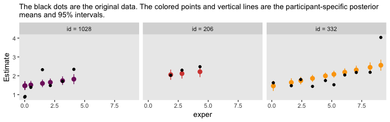

Although each participant got their own intercept and slope, the estimates all fall in straight lines. Since we're only working with time-invariant covariates, I’m afraid that's about the best we can do. Though our models can express gross trends over time, they're unable to speak to variation from occasion to occasion. Just a little later on in this chapter and we'll learn how to do better.

### Practical problems that may arise when analyzing unbalanced data sets.

With HMC, the issues with non-convergence aren't quite the same as with maximum likelihood estimation. However, the basic issue still remains:

> Estimation of variance components requires that enough people have sufficient data to allow quantification of within-person residual variation--variation in the residuals over and above the fixed effects. If too many people have too little data, you will ~~be unable to quantify~~ \[have difficulty quantifying\] this residual variability. (p. 152)

The big difference is that as Bayesians, our priors add additional information that will help us define the posterior distributions of our variance components. Thus our challenge will choosing sensible priors for our *σ*s.

#### Boundary constraints.

Unlike with the frequentist multilevel software discussed in the text, **brms** will not yield negative values on the *σ* parameters. This is because the **brms** default is to set a lower limit of zero on those parameters. For example, see what happens when we execute `fit3$model`.

``` r
fit3$model
```

    ## // generated with brms 2.8.8
    ## functions {
    ## }
    ## data {
    ##   int<lower=1> N;  // number of observations
    ##   vector[N] Y;  // response variable
    ##   int<lower=1> K;  // number of population-level effects
    ##   matrix[N, K] X;  // population-level design matrix
    ##   // data for group-level effects of ID 1
    ##   int<lower=1> N_1;
    ##   int<lower=1> M_1;
    ##   int<lower=1> J_1[N];
    ##   vector[N] Z_1_1;
    ##   vector[N] Z_1_2;
    ##   int<lower=1> NC_1;
    ##   int prior_only;  // should the likelihood be ignored?
    ## }
    ## transformed data {
    ## }
    ## parameters {
    ##   vector[K] b;  // population-level effects
    ##   real<lower=0> sigma;  // residual SD
    ##   vector<lower=0>[M_1] sd_1;  // group-level standard deviations
    ##   matrix[M_1, N_1] z_1;  // unscaled group-level effects
    ##   // cholesky factor of correlation matrix
    ##   cholesky_factor_corr[M_1] L_1;
    ## }
    ## transformed parameters {
    ##   // group-level effects
    ##   matrix[N_1, M_1] r_1 = (diag_pre_multiply(sd_1, L_1) * z_1)';
    ##   vector[N_1] r_1_1 = r_1[, 1];
    ##   vector[N_1] r_1_2 = r_1[, 2];
    ## }
    ## model {
    ##   vector[N] mu = X * b;
    ##   for (n in 1:N) {
    ##     mu[n] += r_1_1[J_1[n]] * Z_1_1[n] + r_1_2[J_1[n]] * Z_1_2[n];
    ##   }
    ##   // priors including all constants
    ##   target += normal_lpdf(b[1] | 1.335, 1);
    ##   target += normal_lpdf(b[2] | 0, 0.5);
    ##   target += student_t_lpdf(sigma | 3, 0, 1)
    ##     - 1 * student_t_lccdf(0 | 3, 0, 1);
    ##   target += student_t_lpdf(sd_1 | 3, 0, 1)
    ##     - 2 * student_t_lccdf(0 | 3, 0, 1);
    ##   target += normal_lpdf(to_vector(z_1) | 0, 1);
    ##   target += lkj_corr_cholesky_lpdf(L_1 | 4);
    ##   // likelihood including all constants
    ##   if (!prior_only) {
    ##     target += normal_lpdf(Y | mu, sigma);
    ##   }
    ## }
    ## generated quantities {
    ##   corr_matrix[M_1] Cor_1 = multiply_lower_tri_self_transpose(L_1);
    ##   vector<lower=-1,upper=1>[NC_1] cor_1;
    ##   // extract upper diagonal of correlation matrix
    ##   for (k in 1:M_1) {
    ##     for (j in 1:(k - 1)) {
    ##       cor_1[choose(k - 1, 2) + j] = Cor_1[j, k];
    ##     }
    ##   }
    ## }

That produced the **Stan** code corresponding to our `brms::brm()` code, above. Notice the second and third lines in the `parameters` block. Both contained `<lower=0>`, which indicated the lower bounds for those parameters was zero. See? **Stan** has you covered.

Let's load the `wages_small_pp.csv` data.

``` r
wages_small_pp <- read_csv("data/wages_small_pp.csv") %>% 
  rename(hgc_9 = hcg.9)

glimpse(wages_small_pp)
```

    ## Observations: 257
    ## Variables: 5
    ## $ id    <int> 206, 206, 206, 266, 304, 329, 329, 329, 336, 336, 336, 394, 394, 394, 518, 518, 541…
    ## $ lnw   <dbl> 2.028, 2.297, 2.482, 1.808, 1.842, 1.422, 1.308, 1.885, 1.892, 1.279, 2.224, 2.383,…
    ## $ exper <dbl> 1.874, 2.814, 4.314, 0.322, 0.580, 0.016, 0.716, 1.756, 1.910, 2.514, 3.706, 1.890,…
    ## $ black <int> 0, 0, 0, 0, 0, 0, 0, 0, 1, 1, 1, 1, 1, 1, 1, 1, 0, 0, 0, 1, 1, 1, 1, 1, 1, 0, 0, 0,…
    ## $ hgc_9 <int> 1, 1, 1, 0, -1, -1, -1, -1, -1, -1, -1, 1, 1, 1, -1, -1, 1, 1, 1, 1, 1, 1, 2, -1, 0…

Here's the distribution of the number of measurement occasions for our small data set.

``` r
wages_small_pp %>% 
  group_by(id) %>% 
  count() %>% 
   
  ggplot(aes(x = n)) +
  geom_bar() +
  scale_x_continuous(breaks = 1:13, limits = c(.5, 13)) +
  coord_flip() +
  labs(x = "# measurement occasions",
       y = "count of cases") +
  theme(panel.grid = element_blank())
```

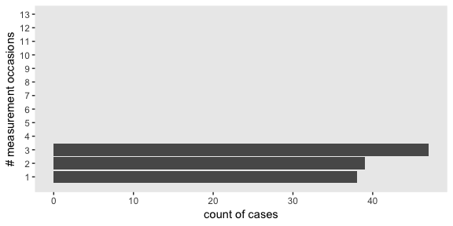

Our `brm()` code is the same as that for `fit5`, above, with just a slightly different `data` argument. If we wanted to, we could be hasty and just use `update()`, instead. But since we’re still practicing setting our priors and such, here we’ll be exhaustive.

``` r
fit6 <-
  brm(data = wages_small_pp, 
      family = gaussian,
      lnw ~ 0 + intercept + hgc_9 + exper + exper:black + (1 + exper | id),
      prior = c(prior(normal(1.335, 1), class = b, coef = "intercept"),
                prior(normal(0, 0.5),   class = b),
                prior(student_t(3, 0, 1), class = sd),
                prior(student_t(3, 0, 1), class = sigma),
                prior(lkj(4), class = cor)),
      iter = 2000, warmup = 1000, chains = 4, cores = 4,
      seed = 5)
```

``` r
print(fit6)
```

    ## Warning: There were 16 divergent transitions after warmup. Increasing adapt_delta above 0.8 may help.
    ## See http://mc-stan.org/misc/warnings.html#divergent-transitions-after-warmup

    ##  Family: gaussian 
    ##   Links: mu = identity; sigma = identity 
    ## Formula: lnw ~ 0 + intercept + hgc_9 + exper + exper:black + (1 + exper | id) 
    ##    Data: wages_small_pp (Number of observations: 257) 
    ## Samples: 4 chains, each with iter = 2000; warmup = 1000; thin = 1;
    ##          total post-warmup samples = 4000
    ## 
    ## Group-Level Effects: 
    ## ~id (Number of levels: 124) 
    ##                      Estimate Est.Error l-95% CI u-95% CI Eff.Sample Rhat
    ## sd(Intercept)            0.29      0.04     0.20     0.37       1072 1.00
    ## sd(exper)                0.04      0.03     0.00     0.10        530 1.00
    ## cor(Intercept,exper)    -0.03      0.31    -0.61     0.60       2507 1.00
    ## 
    ## Population-Level Effects: 
    ##             Estimate Est.Error l-95% CI u-95% CI Eff.Sample Rhat
    ## intercept       1.73      0.05     1.64     1.83       2365 1.00
    ## hgc_9           0.05      0.02    -0.00     0.10       2544 1.00
    ## exper           0.05      0.02     0.01     0.10       2822 1.00
    ## exper:black    -0.05      0.04    -0.13     0.02       2618 1.00
    ## 
    ## Family Specific Parameters: 
    ##       Estimate Est.Error l-95% CI u-95% CI Eff.Sample Rhat
    ## sigma     0.34      0.02     0.30     0.39       1322 1.00
    ## 
    ## Samples were drawn using sampling(NUTS). For each parameter, Eff.Sample 
    ## is a crude measure of effective sample size, and Rhat is the potential 
    ## scale reduction factor on split chains (at convergence, Rhat = 1).

Let's walk through this slow.

You may have noticed that warning message about divergent transitions. We’ll get to that in a minute. But let's first focus on the parameter estimates for `sd(exper)`. Unlike in the text, our posterior mean is not 0.000. But do remember that our posterior is parameterized in the *σ* metric. Let's do a little converting and look at it in a plot.

``` r
post <- posterior_samples(fit6)

v <-
  post %>%
  transmute(sigma_1 = sd_id__exper) %>% 
  mutate(sigma_2_1 = sigma_1^2) %>% 
  set_names("sigma[1]", "sigma[1]^2") %>% 
  gather()
```

Plot.

``` r
v %>% 
  ggplot(aes(x = value, y = key)) +
  geom_halfeyeh(.width = .95, scale = "width") +
  scale_y_discrete(labels = parse(text = c("sigma[1]", "sigma[1]^2"))) +
  theme(panel.grid = element_blank())
```

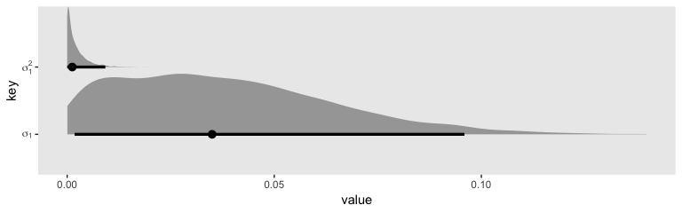

In the *σ* metric, the posterior is bunched up a little on the boundary, but much of its mass is a gently right-skewed mound concentrated in the 0—0.1 range. When we convert the posterior to the *σ*<sup>2</sup> metric, the parameter appears much more bunched up against the boundary. Because we typically summarize our posteriors with means or medians, the point estimate still moves away from zero.

``` r
v %>% 
  group_by(key) %>% 
  mean_qi() %>% 
  mutate_if(is.double, round, digits = 4)
```

    ## # A tibble: 2 x 7
    ##   key         value .lower .upper .width .point .interval
    ##   <chr>       <dbl>  <dbl>  <dbl>  <dbl> <chr>  <chr>    
    ## 1 sigma[1]   0.0383 0.0018 0.0959   0.95 mean   qi       
    ## 2 sigma[1]^2 0.0021 0      0.0092   0.95 mean   qi

``` r
v %>% 
  group_by(key) %>% 
  median_qi() %>% 
  mutate_if(is.double, round, digits = 4)
```

    ## # A tibble: 2 x 7
    ##   key          value .lower .upper .width .point .interval
    ##   <chr>        <dbl>  <dbl>  <dbl>  <dbl> <chr>  <chr>    
    ## 1 sigma[1]   0.035   0.0018 0.0959   0.95 median qi       
    ## 2 sigma[1]^2 0.00120 0      0.0092   0.95 median qi

But it really does start to shoot to zero if we attempt to summarize the central tendency with the mode, as within the maximum likelihood paradigm.

``` r
v %>% 
  group_by(key) %>% 
  mode_qi() %>% 
  mutate_if(is.double, round, digits = 4)
```

    ## # A tibble: 2 x 7
    ##   key           value .lower .upper .width .point .interval
    ##   <chr>         <dbl>  <dbl>  <dbl>  <dbl> <chr>  <chr>    
    ## 1 sigma[1]   0.0275   0.0018 0.0959   0.95 mode   qi       
    ## 2 sigma[1]^2 0.000300 0      0.0092   0.95 mode   qi

Backing up to that warning message, we were informed that “Increasing adapt\_delta above 0.8 may help.” The `adapt_delta` parameter ranges from 0 to 1. The `brm()` default is .8. In my experience, increasing to .9 or .99 is often a good place to start. For this model, .9 wasn’t quite enough. But .95 worked. Here’s how to do it.

``` r
fit6a <-
  brm(data = wages_small_pp, 
      family = gaussian,
      lnw ~ 0 + intercept + hgc_9 + exper + exper:black + (1 + exper | id),
      prior = c(prior(normal(1.335, 1), class = b, coef = "intercept"),
                prior(normal(0, 0.5),   class = b),
                prior(student_t(3, 0, 1), class = sd),
                prior(student_t(3, 0, 1), class = sigma),
                prior(lkj(4), class = cor)),
      iter = 2000, warmup = 1000, chains = 4, cores = 4,
      seed = 5,
      control = list(adapt_delta = .95))
```

Now look at the summary.

``` r
print(fit6a)
```

    ##  Family: gaussian 
    ##   Links: mu = identity; sigma = identity 
    ## Formula: lnw ~ 0 + intercept + hgc_9 + exper + exper:black + (1 + exper | id) 
    ##    Data: wages_small_pp (Number of observations: 257) 
    ## Samples: 4 chains, each with iter = 2000; warmup = 1000; thin = 1;
    ##          total post-warmup samples = 4000
    ## 
    ## Group-Level Effects: 
    ## ~id (Number of levels: 124) 
    ##                      Estimate Est.Error l-95% CI u-95% CI Eff.Sample Rhat
    ## sd(Intercept)            0.29      0.05     0.19     0.37        964 1.00
    ## sd(exper)                0.04      0.03     0.00     0.10        434 1.01
    ## cor(Intercept,exper)    -0.03      0.31    -0.59     0.58       2653 1.00
    ## 
    ## Population-Level Effects: 
    ##             Estimate Est.Error l-95% CI u-95% CI Eff.Sample Rhat
    ## intercept       1.73      0.05     1.64     1.83       1889 1.00
    ## hgc_9           0.05      0.03    -0.00     0.09       1847 1.00
    ## exper           0.05      0.02     0.00     0.10       1890 1.00
    ## exper:black    -0.05      0.04    -0.13     0.02       2082 1.00
    ## 
    ## Family Specific Parameters: 
    ##       Estimate Est.Error l-95% CI u-95% CI Eff.Sample Rhat
    ## sigma     0.34      0.02     0.30     0.39       1405 1.00
    ## 
    ## Samples were drawn using sampling(NUTS). For each parameter, Eff.Sample 
    ## is a crude measure of effective sample size, and Rhat is the potential 
    ## scale reduction factor on split chains (at convergence, Rhat = 1).

Our estimates were pretty much the same as before, but without any warning signs. It won't always be that way. So do take `adapt_delta` warnings seriously.

Now do note that for both `fit6` and `fit6a`, our effective sample sizes for *σ*<sub>0</sub> and *σ*<sub>1</sub> aren’t terribly large relative to the total number of post-warmup draws, 4000. So if it was really important that you had high-quality summary statistics for these parameters, you might need to refit the model with something like `iter = 20000, warmup = 2000`.

In Model B in Table 5.5, Singer and Willett gave the results of a model with the boundary constraints on the *σ*<sup>2</sup> parameters removed. I am not going to attempt something like that with **brms**. If you're interested, you're on your own.

But we will fit a version of their Model C where we've removed the *σ*<sub>1</sub> parameter. Notice that this results in our removal of the LKJ prior for *ρ*<sub>01</sub>, too. Without a *σ*<sub>1</sub>, there's no other parameter for our lonely *σ*<sub>0</sub> to correlate with.

``` r
fit7 <-
  brm(data = wages_small_pp, 
      family = gaussian,
      lnw ~ 0 + intercept + hgc_9 + exper + exper:black + (1 | id),
      prior = c(prior(normal(1.335, 1), class = b, coef = "intercept"),
                prior(normal(0, 0.5),   class = b),
                prior(student_t(3, 0, 1), class = sd),
                prior(student_t(3, 0, 1), class = sigma)),
      iter = 2000, warmup = 1000, chains = 4, cores = 4,
      seed = 5)
```

Here is the basic model summary.

``` r
print(fit7)
```

    ##  Family: gaussian 
    ##   Links: mu = identity; sigma = identity 
    ## Formula: lnw ~ 0 + intercept + hgc_9 + exper + exper:black + (1 | id) 
    ##    Data: wages_small_pp (Number of observations: 257) 
    ## Samples: 4 chains, each with iter = 2000; warmup = 1000; thin = 1;
    ##          total post-warmup samples = 4000
    ## 
    ## Group-Level Effects: 
    ## ~id (Number of levels: 124) 
    ##               Estimate Est.Error l-95% CI u-95% CI Eff.Sample Rhat
    ## sd(Intercept)     0.30      0.04     0.22     0.37        927 1.00
    ## 
    ## Population-Level Effects: 
    ##             Estimate Est.Error l-95% CI u-95% CI Eff.Sample Rhat
    ## intercept       1.74      0.05     1.64     1.83       2980 1.00
    ## hgc_9           0.05      0.02    -0.00     0.09       2792 1.00
    ## exper           0.05      0.02     0.01     0.10       2934 1.00
    ## exper:black    -0.06      0.03    -0.13     0.01       2885 1.00
    ## 
    ## Family Specific Parameters: 
    ##       Estimate Est.Error l-95% CI u-95% CI Eff.Sample Rhat
    ## sigma     0.34      0.02     0.30     0.39       1355 1.00
    ## 
    ## Samples were drawn using sampling(NUTS). For each parameter, Eff.Sample 
    ## is a crude measure of effective sample size, and Rhat is the potential 
    ## scale reduction factor on split chains (at convergence, Rhat = 1).

No warning messages and our effective samples for *σ*<sub>0</sub> improved a bit.

``` r
fit6a <- add_criterion(fit6a, criterion = "waic")
fit7  <- add_criterion(fit7, criterion = "waic")
```

``` r
loo_compare(fit6a, fit7, criterion = "waic") %>% 
  print(simplify = F, digits = 3)
```

    ##       elpd_diff se_diff  elpd_waic se_elpd_waic p_waic   se_p_waic waic     se_waic 
    ## fit7     0.000     0.000 -132.460    20.677       69.957   12.202   264.919   41.355
    ## fit6a   -1.588     2.097 -134.048    22.143       71.753   13.919   268.096   44.287

Yep. Those WAIC estimates are quite similar and when you compare them with formal elpd difference scores, the standard error is larger than the difference itself.

Though we’re stepping away from the text a bit, we should explore more alternatives for this boundary issue. The **Stan** team has put together a [*Prior Choice Recommendations*](https://github.com/stan-dev/stan/wiki/Prior-Choice-Recommendations) wiki. In the [*Boundary-avoiding priors for modal estimation (posterior mode, MAP, marginal posterior mode, marginal maximum likelihood, MML)*](https://github.com/stan-dev/stan/wiki/Prior-Choice-Recommendations#boundary-avoiding-priors-for-modal-estimation-posterior-mode-map-marginal-posterior-mode-marginal-maximum-likelihood-mml) section, we read:

> -   These are for parameters such as group-level scale parameters, group-level correlations, group-level covariance matrix
> -   What all these parameters have in common is that (a) they're defined on a space with a boundary, and (b) the likelihood, or marginal likelihood, can have a mode on the boundary. Most famous example is the group-level scale parameter tau for the 8-schools hierarchical model.
> -   With full Bayes the boundary shouldn't be a problem (as long as you have any proper prior).
> -   But with modal estimation, the estimate can be on the boundary, which can create problems in posterior predictions. For example, consider a varying-intercept varying-slope multilevel model which has an intercept and slope for each group. Suppose you fit marginal maximum likelihood and get a modal estimate of 1 for the group-level correlation. Then in your predictions the intercept and slope will be perfectly correlated, which in general will be unrealistic.
> -   For a one-dimensional parameter restricted to be positive (e.g., the scale parameter in a hierarchical model), we recommend Gamma(2,0) prior (that is, p(tau) proportional to tau) which will keep the mode away from 0 but still allows it to be arbitrarily close to the data if that is what the likelihood wants. For details see this paper by Chung et al.: <http://www.stat.columbia.edu/~gelman/research/published/chung_etal_Pmetrika2013.pdf>
>     -   Gamma(2,0) biases the estimate upward. When number of groups is small, try
>     -   Gamma(2,1/A), where A is a scale parameter representing how high tau can be.

We should walk those Gamma priors out, a bit. The paper by [Chung et al](http://www.stat.columbia.edu/~gelman/research/published/chung_etal_Pmetrika2013.pdf) is quite helpful. We'll first let them give us a little more background in the topic:

> Zero group-level variance estimates can cause several problems. Zero variance can go against prior knowledge of researchers and results in underestimation of uncertainty in fixed coefficient estimates. Inferences for groups are often of interest to researchers, but when the group-level variance is estimated as zero, the resulting predictions of the group-level errors will all be zero, so one fails to find unexplained differences between groups. In addition, uncertainty in predictions for new and existing groups is also understated. (p. 686)

They expounded further on page 687.

> When a variance parameter is estimated as zero, there is typically a large amount of uncertainty about this variance. One possibility is to declare in such situations that not enough information is available to estimate a multilevel model. However, the available alternatives can be unappealing since, as noted in the introduction, discarding a variance component or setting the variance to zero understates the uncertainty. In particular, standard errors for coefficients of covariates that vary between groups will be too low as we will see in Section 2.2. The other extreme is to fit a regression with indicators for groups (a fixed-effects model), but this will overcorrect for group effects (it is mathematically equivalent to a mixed-effects model with variance set to infinity), and also does not allow predictions for new groups.
>
> Degenerate variance estimates lead to complete shrinkage of predictions for new and existing groups and yield estimated prediction standard errors that understate uncertainty. This problem has been pointed out by [Li and Lahiri (2010)](https://www.sciencedirect.com/science/article/pii/S0047259X09002000) and [Morris and Tang (2011)](https://projecteuclid.org/download/pdfview_1/euclid.ss/1312204020) in small area estimation...
>
> If zero variance is not a null hypothesis of interest, a boundary estimate, and the corresponding zero likelihood ratio test statistic, should not necessarily lead us to accept the null hypothesis and to proceed as if the true variance is zero.

In their paper, they covered both penalized maximum likelihood and full Bayesian estimation. We're just going to focus on Bayes, but some of the quotes will contain ML talk. Further, we read:

> We recommend a class of log-gamma penalties (or gamma priors) that in our default setting (the log-gamma(2, *λ*) penalty with *λ* → 0) produce maximum penalized likelihood (MPL) estimates (or Bayes modal estimates) approximately one standard error away from zero when the maximum likelihood estimate is at zero. We consider these priors to be weakly informative in the sense that they supply some direction but still allow inference to be driven by the data. The penalty has little influence when the number of groups is large or when the data are informative about the variance, and the asymptotic mean squared error of the proposed estimator is the same as that of the maximum likelihood estimator. (p. 686)

In the upper left panel of Figure 3, Chung et al give an example of what they mean by *λ* → 0: *λ* = 0.1. Here's an example of what Gamma(2, 0.1) looks like across the parameter space of 0 to 100.

``` r
tibble(x = c(0, 100)) %>% 
  
  ggplot(aes(x = x)) +
  stat_function(fun = dgamma, n = 1e2, args = list(shape = 2, rate = .1)) +
  scale_y_continuous(NULL, breaks = NULL) +
  theme(panel.grid = element_blank())
```

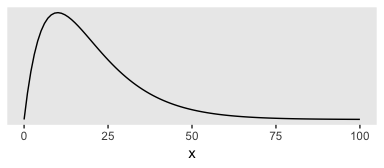

Given we're working with data on the log scale, that's a massively permissive prior. Let's zoom in and see what it means for the parameter space of possible values for our data.

``` r
tibble(x = c(0, 2)) %>% 
  
  ggplot(aes(x = x)) +
  stat_function(fun = dgamma, n = 1e2, args = list(shape = 2, rate = .1)) +
  scale_y_continuous(NULL, breaks = NULL) +
  theme(panel.grid = element_blank())
```

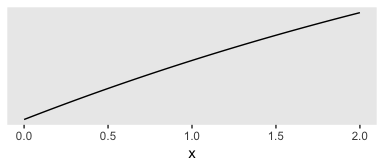

Now keep that picture in mind as we read further along in the paper:

> In addition, with *λ* → 0, the gamma density function has a positive constant derivative at zero, which allows the likelihood to dominate if it is strongly curved near zero. The positive constant derivative implies that the prior is linear at zero so that there is no dead zone near zero. The top-left panel of Figure 3 shows that the gamma(2,0.1) density increases linearly from zero with a gentle slope. The shape will be even flatter with a smaller rate parameter. (p. 691)

In case you're not familiar with the gamma distribution, the rate parameter is what we've been calling *λ*. Let's test this baby out with our model. Here's how to specify it in **brms**.

``` r
fit6b <-
  brm(data = wages_small_pp, 
      family = gaussian,
      lnw ~ 0 + intercept + hgc_9 + exper + exper:black + (1 + exper | id),
      prior = c(prior(normal(1.335, 1), class = b, coef = "intercept"),
                prior(normal(0, 0.5),   class = b),
                prior(student_t(3, 0, 1), class = sd),
                prior(gamma(2, .1), class = sd, group = "id", coef = "exper"),
                prior(student_t(3, 0, 1), class = sigma),
                prior(lkj(4), class = cor)),
      iter = 2000, warmup = 1000, chains = 4, cores = 4,
      seed = 5)
```

Notice that we didn't bother fooling around with `adapt_delta` and the model fit just fine. Here are the results.

``` r
print(fit6b, digits = 3)
```

    ##  Family: gaussian 
    ##   Links: mu = identity; sigma = identity 
    ## Formula: lnw ~ 0 + intercept + hgc_9 + exper + exper:black + (1 + exper | id) 
    ##    Data: wages_small_pp (Number of observations: 257) 
    ## Samples: 4 chains, each with iter = 2000; warmup = 1000; thin = 1;
    ##          total post-warmup samples = 4000
    ## 
    ## Group-Level Effects: 
    ## ~id (Number of levels: 124) 
    ##                      Estimate Est.Error l-95% CI u-95% CI Eff.Sample  Rhat
    ## sd(Intercept)           0.278     0.052    0.171    0.376        825 1.001
    ## sd(exper)               0.061     0.028    0.012    0.119        553 1.008
    ## cor(Intercept,exper)   -0.087     0.298   -0.613    0.524       1627 1.004
    ## 
    ## Population-Level Effects: 
    ##             Estimate Est.Error l-95% CI u-95% CI Eff.Sample  Rhat
    ## intercept      1.731     0.048    1.637    1.827       2314 1.000
    ## hgc_9          0.049     0.025   -0.002    0.097       2229 1.000
    ## exper          0.051     0.024    0.005    0.098       2281 1.001
    ## exper:black   -0.051     0.038   -0.125    0.027       2248 1.001
    ## 
    ## Family Specific Parameters: 
    ##       Estimate Est.Error l-95% CI u-95% CI Eff.Sample  Rhat
    ## sigma    0.345     0.023    0.303    0.394       1065 1.003
    ## 
    ## Samples were drawn using sampling(NUTS). For each parameter, Eff.Sample 
    ## is a crude measure of effective sample size, and Rhat is the potential 
    ## scale reduction factor on split chains (at convergence, Rhat = 1).

Our `sd(exper)` is still quite close to zero. But notice how not the lower level of the 95% interval is higher than zero. Here's what it looks like in both *σ* and *σ*<sup>2</sup> metrics.

``` r
posterior_samples(fit6b) %>%
  transmute(sigma_1 = sd_id__exper) %>% 
  mutate(sigma_2_1 = sigma_1^2) %>% 
  set_names("sigma[1]", "sigma[1]^2") %>% 
  gather() %>%
  
  ggplot(aes(x = value, y = key)) +
  geom_halfeyeh(.width = .95, scale = "width") +
  scale_y_discrete(labels = parse(text = c("sigma[1]", "sigma[1]^2"))) +
  theme(panel.grid = element_blank())
```

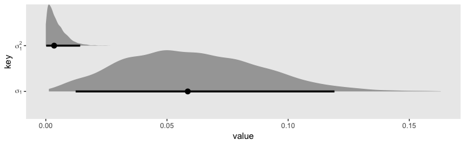

Let's zoom in on the leftmost part of the plot.

``` r
posterior_samples(fit6b) %>%
  transmute(sigma_1 = sd_id__exper) %>% 
  mutate(sigma_2_1 = sigma_1^2) %>% 
  set_names("sigma[1]", "sigma[1]^2") %>% 
  gather() %>%
  
  ggplot(aes(x = value, y = key)) +
  geom_vline(xintercept = 0, color = "white") +
  geom_halfeyeh(.width = .95, scale = "width") +
  scale_y_discrete(labels = parse(text = c("sigma[1]", "sigma[1]^2"))) +
  coord_cartesian(xlim = c(0, 0.01)) +
  theme(panel.grid = element_blank())
```

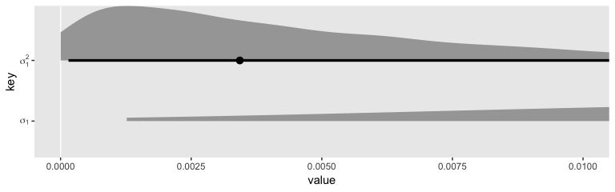

Although we are still brushing up on the boundary with *σ*<sub>1</sub><sup>2</sup>, the mode is no longer at zero. In the discussion, Chung et al pointed out "sometimes weak prior information is available about a variance parameter. When *α* = 2, the gamma density has its mode at 1/*λ*, and so one can use the gamma(*α*, *λ*) prior with 1/*λ* set to the prior estimate of *σ*<sub>*θ*</sub>" (p. 703). Let's say we only had our `wages_small_pp`, but the results of something like the `wages_pp` data were published by some earlier group of researchers. In this case, we do have good prior data; we have the point estimate from the model of the `wages_pp` data! Here's what that was in terms of the median.

``` r
posterior_samples(fit3) %>%
  median_qi(sd_id__exper)
```

    ##   sd_id__exper     .lower     .upper .width .point .interval
    ## 1   0.04127868 0.03612835 0.04653402   0.95 median        qi

And here's what that value is when set as the divisor of 1.

``` r
1 / 0.04127868
```

    ## [1] 24.22558

What does that distribution look like?

``` r
tibble(x = c(0, 1)) %>% 
  
  ggplot(aes(x = x)) +
  stat_function(fun = dgamma, n = 1e2, args = list(shape = 2, rate = 24.22558)) +
  scale_y_continuous(NULL, breaks = NULL) +
  theme(panel.grid = element_blank())
```

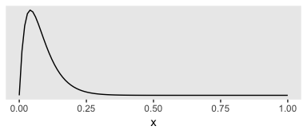

So this is much more informative than our `gamma(2, .1)` prior from before. But given the magnitude of the estimate from `fit3`, it's still fairly liberal. Let's practice using it.

``` r
fit6c <-
  brm(data = wages_small_pp, 
      family = gaussian,
      lnw ~ 0 + intercept + hgc_9 + exper + exper:black + (1 + exper | id),
      prior = c(prior(normal(1.335, 1), class = b, coef = "intercept"),
                prior(normal(0, 0.5),   class = b),
                prior(student_t(3, 0, 1), class = sd),
                prior(gamma(2, 24.22558), class = sd, group = "id", coef = "exper"),
                prior(student_t(3, 0, 1), class = sigma),
                prior(lkj(4), class = cor)),
      iter = 2000, warmup = 1000, chains = 4, cores = 4,
      seed = 5,
      # 1 divergent transitions after warmup
      control = list(adapt_delta = .9))
```

Check out the results.

``` r
print(fit6c, digits = 3)
```

    ##  Family: gaussian 
    ##   Links: mu = identity; sigma = identity 
    ## Formula: lnw ~ 0 + intercept + hgc_9 + exper + exper:black + (1 + exper | id) 
    ##    Data: wages_small_pp (Number of observations: 257) 
    ## Samples: 4 chains, each with iter = 2000; warmup = 1000; thin = 1;
    ##          total post-warmup samples = 4000
    ## 
    ## Group-Level Effects: 
    ## ~id (Number of levels: 124) 
    ##                      Estimate Est.Error l-95% CI u-95% CI Eff.Sample  Rhat
    ## sd(Intercept)           0.286     0.048    0.189    0.377        828 1.002
    ## sd(exper)               0.041     0.023    0.006    0.095        724 1.001
    ## cor(Intercept,exper)   -0.031     0.309   -0.587    0.577       4291 0.999
    ## 
    ## Population-Level Effects: 
    ##             Estimate Est.Error l-95% CI u-95% CI Eff.Sample  Rhat
    ## intercept      1.735     0.048    1.641    1.830       3936 1.000
    ## hgc_9          0.047     0.025   -0.004    0.096       4254 1.000
    ## exper          0.052     0.023    0.007    0.096       4252 1.000
    ## exper:black   -0.055     0.037   -0.127    0.018       4804 1.000
    ## 
    ## Family Specific Parameters: 
    ##       Estimate Est.Error l-95% CI u-95% CI Eff.Sample  Rhat
    ## sigma    0.344     0.023    0.302    0.392       1389 1.001
    ## 
    ## Samples were drawn using sampling(NUTS). For each parameter, Eff.Sample 
    ## is a crude measure of effective sample size, and Rhat is the potential 
    ## scale reduction factor on split chains (at convergence, Rhat = 1).

Here we compare the three ways to specify the *σ*<sub>1</sub> prior with the posterior from the original model fit with the full data set. For simplicity, we’ll just look at the results in the **brms**-like *σ* metric. Hopefully by now you’ll know how to do the conversions to get the values into the *σ*<sup>2</sup> metric.

``` r
tibble(`full data, student_t(3, 0, 1) prior`  = VarCorr(fit3,  summary = F)[[1]][[1]][, 2],
       `small data, student_t(3, 0, 1) prior` = VarCorr(fit6a, summary = F)[[1]][[1]][, 2],
       `small data, gamma(2, 0.1) prior`      = VarCorr(fit6b, summary = F)[[1]][[1]][, 2],
       `small data, gamma(2, 24.22558) prior` = VarCorr(fit6c, summary = F)[[1]][[1]][, 2]) %>% 
  gather() %>% 
  mutate(key = factor(key, levels = c("full data, student_t(3, 0, 1) prior", 
                                      "small data, student_t(3, 0, 1) prior", 
                                      "small data, gamma(2, 0.1) prior", 
                                      "small data, gamma(2, 24.22558) prior"))) %>% 
  
  ggplot(aes(x = value, y = 0, fill = key == "full data, student_t(3, 0, 1) prior")) +
  geom_vline(xintercept = 0, color = "white") +
  geom_halfeyeh(.width = .95) +
  scale_y_continuous(NULL, breaks = NULL) +
  scale_fill_manual(values = c("grey75", "darkgoldenrod2")) +
  theme(panel.grid = element_blank(),
        legend.position = "none") +
  facet_wrap(~key, ncol = 1)
```

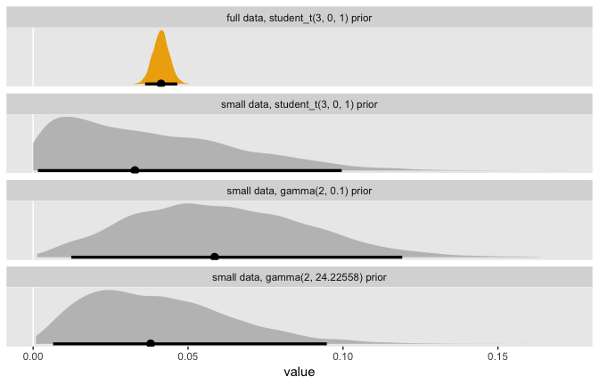

One thing to notice is that when you’re working with full Bayesian estimation with even a rather vague prior with a boundary on zero, the measure of central tendency in the posterior is away from zero. Things get more compact when you’re working in the *σ*<sup>2</sup> metric. But remember that when we’re fitting our models with **brms**, we’re in the *σ* metric, anyway. And with either of these three options, you don’t have a compelling reason to set the *σ*<sub>*θ*</sub> parameter to zero the way you would with ML. Even a rather vague prior will add enough information to the model that we can feel confident about keeping our theoretically-derived *σ*<sub>1</sub> parameter.

#### Nonconvergence \[i.e., it's time to talk chains and such\].

As discussed in section 4.3, all multilevel modeling programs implement iterative numeric algorithms for model fitting. (p. 155). This is also true for our **Stan**-propelled **brms** software. However, what's going on under the hood, here, is not what's happening with the frequentist packages discussed by Singer and Willett. We're using Hamiltonian Monte Carlo (HMC) to draw from the posterior. To my eye, [Paul Bürkner](https://twitter.com/paulbuerkner) gave [in a preprint](https://arxiv.org/pdf/1905.09501.pdf) probably the clearest and most direct introduction to why we need fancy algorithms like HMC to fit Bayesian models. First, Bürkner warmed up by contrasting Bayes with conventional frequentist inference:

> In frequentist statistics, parameter estimates are usually obtained by finding those parameter values that maximise the likelihood. In contrast, Bayesian statistics estimate the full (joint) posterior distribution of the parameters. This is not only fully consistent with probability theory, but also much more informative than a single point estimate (and an approximate measure of uncertainty commonly known as 'standard error').

Those iterative algorithms Singer and Willett discussed in this section, that's what they're doing. They are maximizing the likelihood. But with Bayes, we have the more challenging goal of describing the entire posterior distribution, which is the product of the likelihood and the prior. As such,

> Obtaining the posterior distribution analytically is only possible in certain cases of carefully chosen combinations of prior and likelihood, which may considerably limit modelling flexibilty but yield a computational advantage. However, with the increased power of today's computers, Markov-Chain Monte-Carlo (MCMC) sampling methods constitute a powerful and feasible alternative to obtaining posterior distributions for complex models in which the majority of modeling decisions is made based on theoretical and not computational grounds. Despite all the computing power, these sampling algorithms are computationally very intensive and thus fitting models using full Bayesian inference is usually much slower than in point estimation techniques. However, advantages of Bayesian inference--such as greater modeling flexibility, prior distributions, and more informative results--are often worth the increased computational cost (Gelman, Carlin, Stern, and Rubin 2014). (p. 8)

The gritty details are well beyond the scope of this project. If you’d like a more thorough walk-through on why it's analytically and computationally challenging to get the posterior, I recommend working through the first several chapters in Kruschke’s (2014) [*Doing Bayesian Data Analysis, Second Edition: A Tutorial with R, JAGS, and Stan*](http://www.indiana.edu/~kruschke/DoingBayesianDataAnalysis/).

But so anyways, our primary algorithm is HMC as implemented by **Stan**. You can find all kinds of technical details [here](https://mc-stan.org/users/documentation/). Because it’s rather difficult to describe our Bayesian multilevel models analytically, we use HMC to draw from the posterior instead. And we then summarize the marginal and joint distributions of those parameters with things like measures of central tendency (i.e., means, medians, modes) and spread (i.e., standard deviations, percentile-based intervals). And we often plot.

And somewhat like with the frequentist iterative algorithms, we need to make sure our sweet **Stan**-based HMC is working well, too. One way is with trace plots.

##### Trace plots.

We can get the trace plots for a model by placing a `brm()` fit object into the `plot()` function. Here's an example with the full model, `fit4`.

``` r
plot(fit4)
```

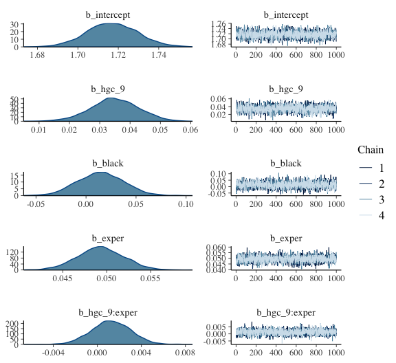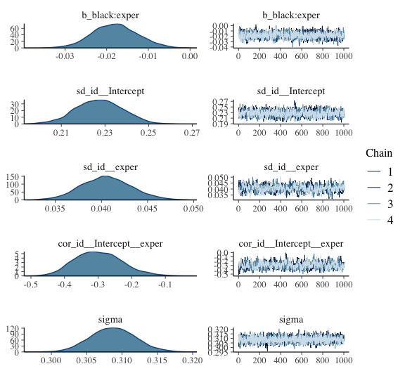

You’ll notice we get two plots for each of the major model parameters, the *γ*s, the *σ*s and the *ρ*s. The plots on the left are the density plots for each parameter. On the right, we have the actual trace plots. On the x-axis, we have an ordering of the posterior draws; on the y, we have the parameter space. Since we the default 4 HMC chains to draw from the posterior, those four chains are depicted by different colored lines. We generally like it when the lines for our chains all overlap with each other in a stable zig-zag sort of way. Trac eplots are sometimes called caterpillar plots because, when things are going well, they often resemble nice multicolored fuzzy caterpillars.

If you’d like more control over your trace plot visuals, you might check out the [**bayesplot** package](https://github.com/stan-dev/bayesplot).

``` r
library(bayesplot)
```

Our main function will be `mcmc_trace()`. Unlike with the `brms::plot()` method, `bayesplog::mcmc_trace()` takes the posterior draws themselves as input. So we'll have to use `posterior_samples()` first. By default, `posterior_samples()` does not extract information about which chain a given draw is from. So we'll have to add the `add_chain = T` argument.

``` r
post <- posterior_samples(fit4, add_chain = T)
```

We can use the `pars` argument to focus on particular parameters.

``` r
mcmc_trace(post,
           pars = "sigma")
```

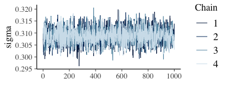

If we use the `pars = vars(...)` format, we can use function helpers from **dplyr** to select subsets of parameters. For example, here's how we might single out the *γ*s.

``` r
mcmc_trace(post,
           pars = vars(starts_with("b_")),
           facet_args = list(ncol = 2))
```

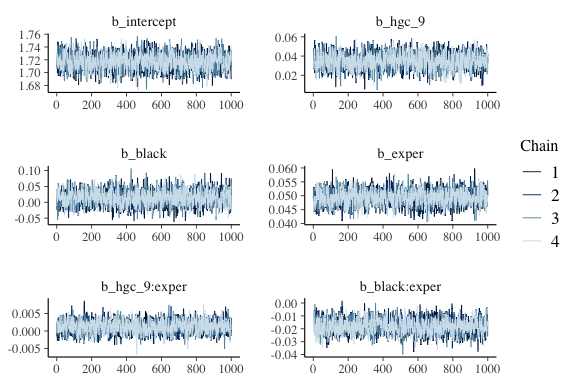

Also notice how we used the `facet_args` argument to adjust the number of columns in the output. We can also use familiar **ggplot2** functions to customize the plots further.

``` r
post %>% 
  mutate(`sigma[0]`       = sd_id__Intercept,
         `sigma[1]`       = sd_id__exper,
         `sigma[epsilon]` = sigma) %>%

mcmc_trace(pars = vars(starts_with("sigma[")),
           facet_args = list(labeller = label_parsed)) +
  scale_x_continuous(NULL, breaks = NULL) +
  scale_color_viridis_d(option = "A") +
  ggtitle("I can't wait to show these traceplots to my mom.") +
  theme_grey() +
  theme(panel.grid         = element_blank(),
        panel.grid.major.y = element_line(color = "white", size = 1/4),
        legend.position    = "bottom",
        strip.text         = element_text(size = 12))
```

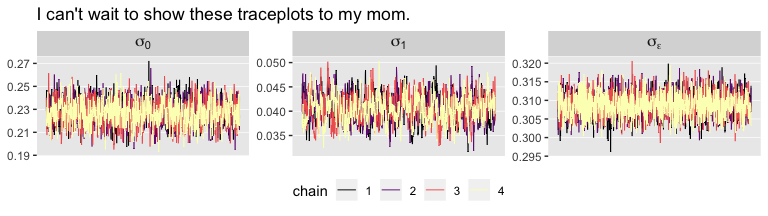

Trace plots are connected to other important concepts, like autocorrelation and effective sample size.

##### Autocorrelation.

When using Markov chain Monte Carlo methods, of which HMC is a special case, the notions of autocorrelation and effective sample size are closely connected. Both have to do with the question, How many post-warmup draws from the posterior do I need to take? If you take too few, you won’t have a good sense of the shape of the posterior. If you take more than necessary, you’re just wasting time and computer memory. Here’s how McElreath introduced the topic in his text:

> So how many samples do we need for accurate inference about the posterior distribution? It depends. First, what really matters is the *effective* number of samples, not the raw number. The effective number of samples is an estimate of the number of independent samples from the posterior distribution. Markov chains are typically *autocorrelated*, so that sequential samples are not entirely independent. Stan chains tend to be less autocorrelated than those produced by other engines \[e.g., the Gibbs sampler\], but there is always some autocorrelation. (p. 255, *emphasis* in the original)

I'm not aware of a way to query the autocorrelations from a `brm()` fit using **brms** convenience functions. However, we can get those diagnostics from the `bayesplot::mcmc_acf()` function.

``` r
mcmc_acf(post, pars = vars(starts_with("b_")), lags = 10)  +
  theme_grey() +
  theme(panel.grid = element_blank())
```

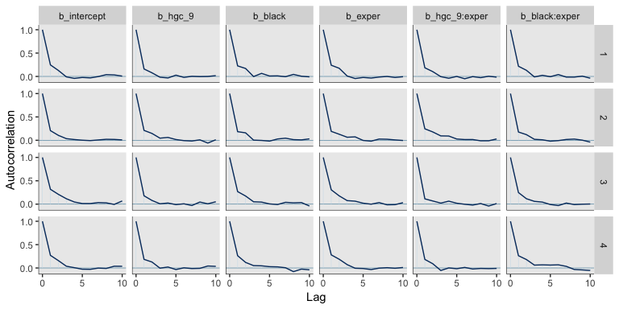

The `mcmc_acf()` gives a wealth of granular output. The columns among the plots are the specified parameters. The rows are the chains, one for each. In this particular case, the autocorrelations were quite low for all our *γ* parameters by the second or third lag. That’s really quite good and not uncommon for HMC. Do note, however, that this won’t always be the case. For example, here are the plots for our variance parameters and *ρ*<sub>01</sub>.

``` r
mcmc_acf(post, pars = vars(starts_with("sd_"), "sigma", starts_with("cor")), lags = 10)  +
  theme_grey() +
  theme(panel.grid = element_blank(),
        strip.text = element_text(size = 7))
```

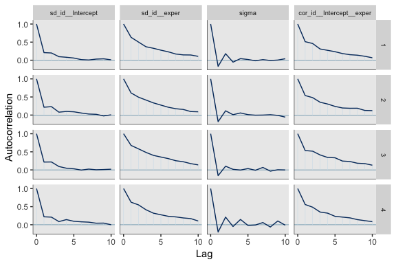

On the whole, all of them are pretty okay. But notice how the autocorrelations for *σ*<sub>1</sub> and *ρ*<sub>01</sub> remained relatively high up until the 10<sup>th</sup> lag.

The plots from `mcmc_act()` are quite handy for focused diagnostics. But if you want a more global perspective, they're too tedious. Fortunately for us, we have other diagnostic tools.

##### Effective sample size.

Above we quoted McElreath as pointing out "what really matters is the *effective* number of samples, not the raw number." With **brms**, you typically get the effective number of samples in the `print()` or `summary()` output. Here it is again for `fit4`.

``` r
summary(fit4)
```

    ##  Family: gaussian 
    ##   Links: mu = identity; sigma = identity 
    ## Formula: lnw ~ 0 + intercept + hgc_9 + black + exper + exper:hgc_9 + exper:black + (1 + exper | id) 
    ##    Data: wages_pp (Number of observations: 6402) 
    ## Samples: 4 chains, each with iter = 2000; warmup = 1000; thin = 1;
    ##          total post-warmup samples = 4000
    ## 
    ## Group-Level Effects: 
    ## ~id (Number of levels: 888) 
    ##                      Estimate Est.Error l-95% CI u-95% CI Eff.Sample Rhat
    ## sd(Intercept)            0.23      0.01     0.21     0.25       1448 1.00
    ## sd(exper)                0.04      0.00     0.04     0.05        517 1.00
    ## cor(Intercept,exper)    -0.30      0.07    -0.42    -0.15        566 1.00
    ## 
    ## Population-Level Effects: 
    ##             Estimate Est.Error l-95% CI u-95% CI Eff.Sample Rhat
    ## intercept       1.72      0.01     1.69     1.74       2064 1.00
    ## hgc_9           0.03      0.01     0.02     0.05       2439 1.00
    ## black           0.01      0.02    -0.03     0.06       1996 1.00
    ## exper           0.05      0.00     0.04     0.05       2002 1.00
    ## hgc_9:exper     0.00      0.00    -0.00     0.00       2365 1.00
    ## black:exper    -0.02      0.01    -0.03    -0.01       2040 1.00
    ## 
    ## Family Specific Parameters: 
    ##       Estimate Est.Error l-95% CI u-95% CI Eff.Sample Rhat
    ## sigma     0.31      0.00     0.30     0.32       3469 1.00
    ## 
    ## Samples were drawn using sampling(NUTS). For each parameter, Eff.Sample 
    ## is a crude measure of effective sample size, and Rhat is the potential 
    ## scale reduction factor on split chains (at convergence, Rhat = 1).

See that `Eff.Sample` column on the right? That's our effective sample size. Like the autocorrelations, each parameter gets its own estimate. You might compare the numbers to the number of post-warmup iterations, 4000 in this case and by default.

You may wonder, how many effective samples do I need? Back to McElreath:

> If all you want are posterior means, it doesn't take many samples at all to get very good estimates. Even a couple hundred samples will do. But if you care about the exact shape in the extreme tails of the posterior, the 99th percentile or so, then you'll need many many more. So there is no universally useful number of samples to aim for. In most typical regression applications, you can get a very good estimate of the posterior mean with as few as 200 effective samples. And if the posterior is approximately Gaussian, then all you need in addition is a good estimate of the variance, which can be had with one order of magnitude more, in most cases. For highly skewed posteriors, you'll have to think more about which region of the distribution interests you. (p. 255)

In addition to `Eff.Sample` from **brms** summary output, you can also extract the ratio of `Eff.Sample` to post-warmup draws from the `bayesplot::neff_ration()` function. Let's practice with `fit4`.

``` r
nr <- neff_ratio(fit4)

str(nr)
```

    ##  Named num [1:1787] 0.516 0.61 0.499 0.5 0.591 ...
    ##  - attr(*, "names")= chr [1:1787] "b_intercept" "b_hgc_9" "b_black" "b_exper" ...

Good old `str()` informed us we got a named numeric vector of 1787 rows. We can display that output by plugging it into `mcmc_neff()`.

``` r
mcmc_neff(nr)
```


Because we have so many parameters, it can be hard to understand what's going on. Let's try again, this time restricted to the first 50 parameters.

``` r
mcmc_neff(nr[1:50])
```

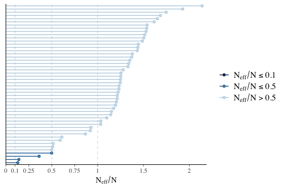

Of those first parameters, `mcmc_neff()` rank ordered them from lowest $\\frac{n\_\\test{eff}}{N}$ to highest. You can see by the legend that the **bayesplot** team has provided us with a heuristic categorization of those with values above 0.5, those equal to that or fewer, and those equal to 0.1 or fewer. The idea is we typically prefer higher ratios to lower ones.

If all you wanted was to plot the effective sample sizes of our primary summary parameters, you can wrangle our `nr` object and make the plot yourself.

``` r
nr <-
  nr %>% 
  data.frame() %>% 
  rownames_to_column() %>% 
  set_names("parameter", "ratio") %>% 
  mutate(n_eff = ratio * 4000)

nr %>% 
  slice(1:10) %>% 
  
  ggplot(aes(x = reorder(parameter, n_eff))) +
  geom_linerange(aes(ymin = 0, ymax = n_eff)) +
  geom_point(aes(y = n_eff)) +
  labs(y = "effective sample size",
       x = NULL) +
  coord_flip(ylim = 0:4000) +
  theme(panel.grid  = element_blank(),
        axis.text.y = element_text(hjust = 0))
```

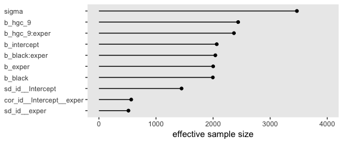

You may have noticed that in the first `mcmc_neff()` plot, many of the parameters seemed to have $\\frac{n\_\\test{eff}}{N}$ ratios above 1. What’s that about? As is turns out, the sampling in **Stan** is so good that sometimes the HMC chains for a parameter can be negatively autocorrelated. When this is the case, your effective sample size can be *larger* than your actual sample size. Madness, I know. This was the case for many of our residuals. Here's a look at the first 10.

``` r
nr %>% 
  slice(11:20)
```

    ##              parameter     ratio    n_eff
    ## 1   r_id[31,Intercept] 1.2487790 4995.116
    ## 2   r_id[36,Intercept] 1.2517787 5007.115
    ## 3   r_id[53,Intercept] 1.5285390 6114.156
    ## 4  r_id[122,Intercept] 0.9283177 3713.271
    ## 5  r_id[134,Intercept] 1.4384564 5753.826
    ## 6  r_id[145,Intercept] 1.3389469 5355.788
    ## 7  r_id[155,Intercept] 1.2047417 4818.967
    ## 8  r_id[173,Intercept] 1.5347543 6139.017
    ## 9  r_id[206,Intercept] 1.3791770 5516.708
    ## 10 r_id[207,Intercept] 1.3303028 5321.211

Look at those sweet `ratio` and `n_eff` values! Let's take the first 6 and check their autocorrelation plots.

``` r
mcmc_acf(post, pars = vars(`r_id[31,Intercept]`:`r_id[145,Intercept]`), lags = 5)  +
  theme_grey() +
  theme(panel.grid = element_blank(),
        strip.text = element_text(size = 8))
```

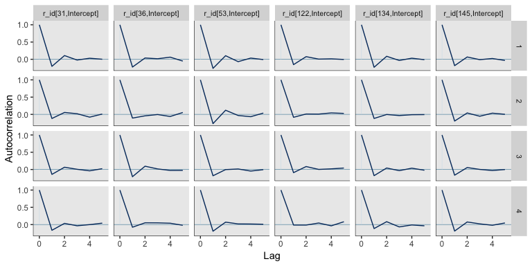

See those dips below zero for the first lag in each? That's what a negative autocorrelation looks like. Beautiful. For more on negative autocorrelations within chains and how it influences the number of effective samples, check out [this thread on the Stan forums](https://discourse.mc-stan.org/t/n-eff-bda3-vs-stan/2608) where many members of the **Stan** team chimed in.

##### $\\hat R$.

Return again to the default `print()` output for a `brms::brm()` fit.

``` r
print(fit4)
```

    ##  Family: gaussian 
    ##   Links: mu = identity; sigma = identity 
    ## Formula: lnw ~ 0 + intercept + hgc_9 + black + exper + exper:hgc_9 + exper:black + (1 + exper | id) 
    ##    Data: wages_pp (Number of observations: 6402) 
    ## Samples: 4 chains, each with iter = 2000; warmup = 1000; thin = 1;
    ##          total post-warmup samples = 4000
    ## 
    ## Group-Level Effects: 
    ## ~id (Number of levels: 888) 
    ##                      Estimate Est.Error l-95% CI u-95% CI Eff.Sample Rhat
    ## sd(Intercept)            0.23      0.01     0.21     0.25       1448 1.00
    ## sd(exper)                0.04      0.00     0.04     0.05        517 1.00
    ## cor(Intercept,exper)    -0.30      0.07    -0.42    -0.15        566 1.00
    ## 
    ## Population-Level Effects: 
    ##             Estimate Est.Error l-95% CI u-95% CI Eff.Sample Rhat
    ## intercept       1.72      0.01     1.69     1.74       2064 1.00
    ## hgc_9           0.03      0.01     0.02     0.05       2439 1.00
    ## black           0.01      0.02    -0.03     0.06       1996 1.00
    ## exper           0.05      0.00     0.04     0.05       2002 1.00
    ## hgc_9:exper     0.00      0.00    -0.00     0.00       2365 1.00
    ## black:exper    -0.02      0.01    -0.03    -0.01       2040 1.00
    ## 
    ## Family Specific Parameters: 
    ##       Estimate Est.Error l-95% CI u-95% CI Eff.Sample Rhat
    ## sigma     0.31      0.00     0.30     0.32       3469 1.00
    ## 
    ## Samples were drawn using sampling(NUTS). For each parameter, Eff.Sample 
    ## is a crude measure of effective sample size, and Rhat is the potential 
    ## scale reduction factor on split chains (at convergence, Rhat = 1).

The last column for each parameter is `Rhat`. "`Rhat` is a complicated estimate of the convergence of the Markov chains to the target distribution. It should approach 1.00 from above, when all is well" (McElreath, 2016, p. 250). We can extract $\\hat R$ directly with the `rhat()` function.

``` r
rhat(fit4) %>% 
  str()
```

    ##  Named num [1:1787] 1 1 1 1 1 ...
    ##  - attr(*, "names")= chr [1:1787] "b_intercept" "b_hgc_9" "b_black" "b_exper" ...

For our `fit4`, the `brms::rhat()` function returned a named numeric vector, with one row for each of the 1787 parameters in the model. You can subset the `rhat()` output to focus on a few parameters.

``` r
rhat(fit4)[1:10]
```

    ##              b_intercept                  b_hgc_9                  b_black                  b_exper 
    ##                0.9997652                0.9996523                0.9996431                1.0014347 
    ##            b_hgc_9:exper            b_black:exper         sd_id__Intercept             sd_id__exper 
    ##                1.0001820                1.0014329                1.0031733                1.0017585 
    ## cor_id__Intercept__exper                    sigma 
    ##                1.0037826                1.0009213

Or you might get a more global perspective with a plot.

``` r
rhat(fit4) %>% 
  data.frame() %>% 
  set_names("rhat") %>% 
  
  ggplot(aes(x = rhat)) +
  geom_vline(xintercept = 1, color = "white") +
  geom_histogram(binwidth = .0001) +
  theme(panel.grid = element_blank())
```

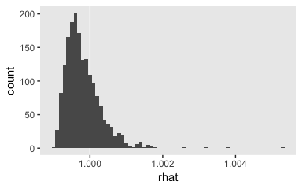

The **bayesplot** package offers a convenience function for plotting `rhat()` output. Here we'll focus on the first 20 parameters.

``` r
mcmc_rhat(rhat(fit4)[1:20]) +
  yaxis_text(hjust = 0)
```

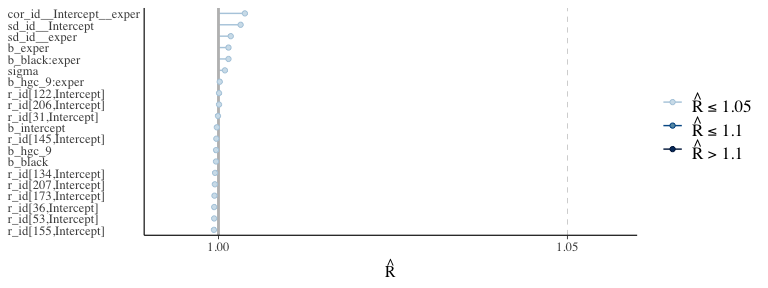

By default, `mcmc_rhat()` does not return text on the y-axis. But you can retrieve that text with the `yaxis_text()` function. For more on the $\\hat R$, you might check out the *Rhat: potential scale reduction statistic* subsection of Gabry and Modrák's vignette, [*Visual MCMC diagnostics using the bayesplot package*](https://cran.r-project.org/web/packages/bayesplot/vignettes/visual-mcmc-diagnostics.html#rhat-potential-scale-reduction-statistic).

We should also point out that the Stan team has found some deficiencies with the $\\hat{R}$. They've made recommendations that will be implemented in the Stan ecosystem sometime soon. In the meantime, you can read all about it in their [preprint](https://arxiv.org/abs/1903.08008) and in Dan Simpson's guest blog, [*Maybe it's time to let the old ways die; or We broke R-hat so now we have to fix it*](https://statmodeling.stat.columbia.edu/2019/03/19/maybe-its-time-to-let-the-old-ways-die-or-we-broke-r-hat-so-now-we-have-to-fix-it/). If you learn best by sassy twitter banter, [click through this interchange](https://twitter.com/betanalpha/status/1108185746870030336) among some of our Stan team all-stars.

### 5.2.3. Distinguishing among different types of missingness.

> Missingness, in and of itself, is not necessarily problematic. It all depends upon what statisticians call the type of missingness. In seminal work on this topic, Little ([1995](https://www.jstor.org/stable/pdf/2291350.pdf?casa_token=Ts4iGu8znj0AAAAA:oLHBuuTQhgh48v_7RwAMyuw6Qvc_H5JmPIP3R87k-fDyyZbHUHvFK5BvRBu8WRoBMojooLd8nUTtN5zclMJu4W8IdQQoKv6qNbvMwYqoqmb0ynj9yqTG)), refining earlier work with Rubin ([Little & Rubin, 1987](https://trove.nla.gov.au/work/19249375?q&sort=holdings+desc&_=1560698333380&versionId=207797429)), distinguished among three types of missingness: (1) *missing completely at random* (MCAR); (2) covariate-dependent dropout (CDD); and (3) *missing at random* (MAR) (see also [Schafer, 1997](https://www.crcpress.com/Analysis-of-Incomplete-Multivariate-Data/Schafer/p/book/9780412040610)).
>
> When we say that data are MCAR, we argue that the observed values are a random sample of all the values that could have been observed (according ot plan), had there been no missing data.
>
> ...Covariate dependent dropout (CDD) is a less restrictive assumption that permits associations between the probability of missingness and observed predictor values ("covariates"). Data can be CDD even if the probability of missingness is systematically related to either *TIME* or observed substantive predictors.
>
> ...When data are MAR, the probability of missingness can depend upon *any* observed data, for either the predictors or any outcome values. It cannot, however, depend upon an *un*observed value of either any predictor or the outcome. (pp. 157--158, *emphasis* in the original)

For some more current introductions to missing data methods, I recommend Enders' (2010) [*Applied Missing Data Analysis*](http://www.appliedmissingdata.com), for which you can find a free sample chapter [here](http://www.appliedmissingdata.com/sample-chapter.pdf), and Little and Rubin's (2019) [*Statistical Analysis with Missing Data, 3rd Edition*](https://www.wiley.com/en-us/Statistical+Analysis+with+Missing+Data%2C+3rd+Edition-p-9780470526798). You might also check out van Burren's great online text [*Flexible Imputation of Missing Data. Second Edition*](https://stefvanbuuren.name/fimd/). And very happily, **brms** has several ways to handle missing data.

5.3 Time-varying predictors
---------------------------

> A time-varying predictor is a variable whose *values* may differ over time. Unlike their time-invariant cousins, which record an individual's static status, time-varying predictors record an individual's potentially differing status on each associated measurement occasion. Some time-varying predictors have values that change naturally; others have values that change by design. (pp. 159--160, *emphasis* in the original)

### 5.3.1. Including the main effect of a time-varying predictor.

You can find [Ginexi and colleagues' (2000)](https://www.researchgate.net/profile/Elizabeth_Ginexi/publication/12406334_Depression_and_control_beliefs_in_relation_to_reemployment_What_are_the_directions_of_effect/links/553e47930cf20184050e15ed/Depression-and-control-beliefs-in-relation-to-reemployment-What-are-the-directions-of-effect.pdf) unemployment study data in the `reading_pp.csv` file.

``` r
library(tidyverse)
unemployment_pp <- read_csv("data/unemployment_pp.csv")

head(unemployment_pp)
```

    ## # A tibble: 6 x 4
    ##      id months  cesd unemp
    ##   <int>  <dbl> <int> <int>
    ## 1   103  1.15     25     1
    ## 2   103  5.95     16     1
    ## 3   103 12.9      33     1
    ## 4   641  0.789    27     1
    ## 5   641  4.86      7     0
    ## 6   641 11.8      25     0

We have 254 unique participants.

``` r
unemployment_pp %>% 
  distinct(id) %>% 
  count()
```

    ## # A tibble: 1 x 1
    ##       n
    ##   <int>
    ## 1   254

Here's one way to compute the number of participants who were never employed during the study.

``` r
unemployment_pp %>% 
  filter(unemp == 0) %>% 
  distinct(id) %>% 
  count() %>% 
  summarise(never_employed = 254 - n)
```

    ## # A tibble: 1 x 1
    ##   never_employed
    ##            <dbl>
    ## 1            132

In case it wasn't clear, participants had up to 3 interviews.

> By recruiting 254 participants from local unemployment offices, the researchers were able to interview individuals soon after job loss (within the first 2 months). Follow-up interviews were conducted between 3 and 8 months and 10 and 16 months after job loss. (p. 161)

Those times were encoded in the `months` variable. Here's what that looks like.

``` r
unemployment_pp %>% 
  ggplot(aes(x = months))  +
  geom_vline(xintercept = c(3, 8), color = "white") +
  geom_histogram(binwidth = .5) +
  theme(panel.grid = element_blank())
```

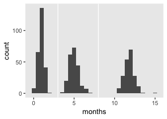

To make some of our data questions easier, we can use those 3- and 8-`month` thresholds to make an `interview` variable to indicate the periods during which the interviews were conducted.

``` r
unemployment_pp <- 
  unemployment_pp %>% 
  mutate(interview = ifelse(months < 3, 1,
                            ifelse(months > 8, 3, 2))) 
  
unemployment_pp %>% 
  ggplot(aes(x = interview))  +
  geom_bar() +
  theme(panel.grid = element_blank())
```

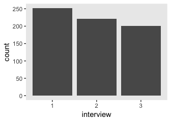

With a little wrangling, we can display all possible employment patterns along with counts on how many followed them.

``` r
unemployment_pp %>% 
  select(-months, -cesd) %>% 
  mutate(interview = str_c("int_", interview)) %>% 
  spread(key = interview, value = unemp) %>% 
  group_by(int_1, int_2, int_3) %>% 
  count() %>% 
  arrange(desc(n)) %>% 
  knitr::kable()
```

|  int\_1|  int\_2|  int\_3|    n|
|-------:|-------:|-------:|----:|
|       1|       1|       1|   78|
|       1|       0|       0|   55|
|       1|       1|       0|   41|
|       1|      NA|      NA|   27|
|       1|       1|      NA|   22|
|       1|       0|       1|   19|
|       1|       0|      NA|    4|
|       1|      NA|       1|    4|
|       1|      NA|       0|    2|
|      NA|       1|       0|    1|
|      NA|       1|       1|    1|

It takes a little work to see how Singer and Willett came to the conclusion "62 were always working after the first interview" (p. 161). Based on an analysis of those who had complete data, that corresponds to the pattern in the top row, \[1, 0, 0\], which we have counted as 55 (i.e., row 2). If you add to that the two rows with missingness on one of the critical values (i.e., \[1, 0, NA\], \[1, NA, 0\], and \[NA, 1, 1\]), that gets you 55 + 4 + 2 + 1 = 62

We can confirm that "41 were still unemployed at the second interview but working by the third" (p. 161). That's our pattern \[1, 1, 0\], shown in row 3. We can also confirm "19 were working by the second interview but unemployed at the third" (p. 161). That's shown in our pattern \[1, 0, 1\], shown in row 6.

Before we configure our unconditional growth model, we might familiarize ourselves with our criterion variable, `cesd`. Singer and Willett informed us:

> Each time participants completed the Center for Epidemiologic Studies’ Depression (CES-D) scale ([Radloff, 1977](https://journals.sagepub.com/doi/pdf/10.1177/014662167700100306?casa_token=igspo7W_9SUAAAAA:hnRVqiDEM-b6nNh_-8VQ6tx1PukP8nsqyo4yd4m_inspjhH-3aeShEGodUxux8GuInG9AYbP1D2GLA)), which asks them to rate, on a four-point scale, the frequency with which they experience each of the 20 depressive symptoms. The CES-D scores can vary from a low or 0 for someone with no symptoms to a high of 80 for someone in serious distress. (p. 161)

In addition to Radloff's original article, you can get a copy of the CES-D [here](http://www.chcr.brown.edu/pcoc/cesdscale.pdf).

To help us pick our priors, [Brown and Gary (1985)](https://scholarworks.wmich.edu/cgi/viewcontent.cgi?article=1721&amp=&context=jssw&amp=&sei-redir=1&referer=https%253A%252F%252Fscholar.google.com%252Fscholar%253Fq%253D%252522CES-D%252522%252Bunemployment%2526hl%253Den%2526as_sdt%253D0%25252C44%2526as_ylo%253D1977%2526as_yhi%253D2000#search=%22CES-D%20unemployment%22) listed the means and standard deviations of the CES-D scores for unemployed African-American adults. They gave the summary statistics broken down by sex:

-   Males: 14.05 (8.86), *n* = 37
-   Females: 15.35 (9.39), *n* = 72

Based the variables in the data set and the descriptions of it in the text, we don't have a good sense of the demographic backgrounds of the participants. But with the information we have in hand, a reasonable empirically-based but nonetheless noncommittal prior for baseline CES-D might be something like `normal(14.5, 20)`. A weakly-regularizing prior on change over 1 month might be `normal(0, 10)`. It'd be fair id you wanted to argue about these priors. Try your own! But if you are willing to go along with me, we might write the statistical formula for the unconditional growth model as:

$$
$$

Here's how we might fit that model.

``` r
fit8 <-
  brm(data = unemployment_pp, 
      family = gaussian,
      cesd ~ 0 + intercept + months + (1 + months | id),
      prior = c(prior(normal(14.5, 20), class = b, coef = "intercept"),
                prior(normal(0, 10),   class = b),
                prior(student_t(3, 0, 10), class = sd),
                prior(student_t(3, 0, 10), class = sigma),
                prior(lkj(4), class = cor)),
      iter = 2000, warmup = 1000, chains = 4, cores = 4,
      seed = 5,
      control = list(adapt_delta = .9))
```

Here are the results.

``` r
print(fit8, digits = 3)
```

    ##  Family: gaussian 
    ##   Links: mu = identity; sigma = identity 
    ## Formula: cesd ~ 0 + intercept + months + (1 + months | id) 
    ##    Data: unemployment_pp (Number of observations: 674) 
    ## Samples: 4 chains, each with iter = 2000; warmup = 1000; thin = 1;
    ##          total post-warmup samples = 4000
    ## 
    ## Group-Level Effects: 
    ## ~id (Number of levels: 254) 
    ##                       Estimate Est.Error l-95% CI u-95% CI Eff.Sample  Rhat
    ## sd(Intercept)            8.667     0.834    7.133   10.418        451 1.006
    ## sd(months)               0.422     0.202    0.036    0.766        175 1.021
    ## cor(Intercept,months)   -0.370     0.230   -0.688    0.231        511 1.009
    ## 
    ## Population-Level Effects: 
    ##           Estimate Est.Error l-95% CI u-95% CI Eff.Sample  Rhat
    ## intercept   17.641     0.753   16.189   19.099       1971 1.000
    ## months      -0.418     0.081   -0.574   -0.254       3826 1.000
    ## 
    ## Family Specific Parameters: 
    ##       Estimate Est.Error l-95% CI u-95% CI Eff.Sample  Rhat
    ## sigma    8.562     0.400    7.784    9.346        404 1.005
    ## 
    ## Samples were drawn using sampling(NUTS). For each parameter, Eff.Sample 
    ## is a crude measure of effective sample size, and Rhat is the potential 
    ## scale reduction factor on split chains (at convergence, Rhat = 1).

Here are the posteriors for the CES-D at the first day of job loss (i.e., *γ*<sub>00</sub>) and the expected rate of change over one month (i.e., *γ*<sub>10</sub>).

``` r
posterior_samples(fit8) %>% 
  transmute(`first day of job loss` = b_intercept,
            `linear decline by month` = b_months) %>% 
  gather() %>% 
  
  ggplot(aes(x = value, y = 0)) +
  geom_halfeyeh(.width = .95) +
  scale_y_continuous(NULL, breaks = NULL) +
  xlab("CES-D composite score") +
  theme(panel.grid = element_blank()) +
  facet_wrap(~key, scales = "free")
```

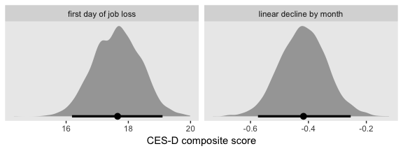

We might use `marginal_effects()` to get a quick view on what that might looks like.

``` r
plot(marginal_effects(fit8),
       plot = FALSE)[[1]] +
  geom_hline(yintercept = 14.5, color = "grey50", linetype = 2) +
  coord_cartesian(ylim = 0:20) +
  theme(panel.grid = element_blank())
```

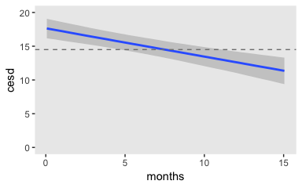

For reference, the dashed grey line is the value we centered our prior for initial status on.

#### Using a composite specification.

We might specify Model B, our first model with a time-varying covariate, like this:

$$
$$

Note a few things about the priors. First, we haven't changed any of the priors from the previous model. All we did was add *γ*<sub>20</sub> ∼ Normal(0, 10) for our new parameter. Given how weakly-informative our other priors have been for these data, this isn't an unreasonable approach. However, the meaning for our intercept, *γ*<sub>01</sub>, has changed. Now it's the initial status for someone who is *employed* at baseline. But remember that for Model A, we set that prior with unemployed people in mind. A careful researcher might want to dive back into the literature to see if some lower value than 14.5 would be more reasonable to set for the mean of that prior. However, since the standard deviations for our intercepts priors and the covariate priors are all rather wide and permissive, this just won’t be much of a problem, for us. Buy anyway, second, note that we've centered our prior for *γ*<sub>20</sub> on zero. This is a weakly-regularizing prior, slightly favoring smaller effects over larger ones. And like before, one could easily argue for different priors.

Here's how to fit the model in **brms**.

``` r
fit9 <-
  brm(data = unemployment_pp, 
      family = gaussian,
      cesd ~ 0 + intercept + months + unemp + (1 + months | id),
      prior = c(prior(normal(14.5, 20), class = b, coef = "intercept"),
                prior(normal(0, 10),   class = b),
                prior(student_t(3, 0, 10), class = sd),
                prior(student_t(3, 0, 10), class = sigma),
                prior(lkj(4), class = cor)),
      iter = 2000, warmup = 1000, chains = 4, cores = 4,
      seed = 5)
```

If you compare our results to those in Table 5.7, you'll see they're quite similar.

``` r
print(fit9)
```

    ##  Family: gaussian 
    ##   Links: mu = identity; sigma = identity 
    ## Formula: cesd ~ 0 + intercept + months + unemp + (1 + months | id) 
    ##    Data: unemployment_pp (Number of observations: 674) 
    ## Samples: 4 chains, each with iter = 2000; warmup = 1000; thin = 1;
    ##          total post-warmup samples = 4000
    ## 
    ## Group-Level Effects: 
    ## ~id (Number of levels: 254) 
    ##                       Estimate Est.Error l-95% CI u-95% CI Eff.Sample Rhat
    ## sd(Intercept)             9.18      0.83     7.48    10.76        453 1.01
    ## sd(months)                0.58      0.17     0.18     0.87        228 1.02
    ## cor(Intercept,months)    -0.48      0.15    -0.70    -0.10        660 1.00
    ## 
    ## Population-Level Effects: 
    ##           Estimate Est.Error l-95% CI u-95% CI Eff.Sample Rhat
    ## intercept    12.79      1.21    10.39    15.14       2312 1.00
    ## months       -0.21      0.09    -0.39    -0.02       3360 1.00
    ## unemp         4.99      0.99     3.12     6.90       2983 1.00
    ## 
    ## Family Specific Parameters: 
    ##       Estimate Est.Error l-95% CI u-95% CI Eff.Sample Rhat
    ## sigma     8.10      0.42     7.34     8.95        365 1.01
    ## 
    ## Samples were drawn using sampling(NUTS). For each parameter, Eff.Sample 
    ## is a crude measure of effective sample size, and Rhat is the potential 
    ## scale reduction factor on split chains (at convergence, Rhat = 1).

Before we make our versions of Figure 5.3, let's first compare *γ*<sub>01</sub> posteriors by model. On page 166 of the text, Singer and Willett reported the monthly rate of decline "had been cut in half (to 0.20 from 0.42 in Model A)".

``` r
fixef(fit8)["months", ]
```

    ##    Estimate   Est.Error        Q2.5       Q97.5 
    ## -0.41768691  0.08065059 -0.57409378 -0.25402238

``` r
fixef(fit9)["months", ]
```

    ##    Estimate   Est.Error        Q2.5       Q97.5 
    ## -0.20574890  0.09264334 -0.38661382 -0.02392106

You might be wondering why the quote from Singer and Willett used positive numbers while our parameter estimates have negative ones. No, there's no mistake, there. Negative parameter estimates for monthly trajectories are then same thing as expressing a rate of *decline* with a positive number. But anyways, you see our estimates are on par with theirs. But with our Bayesian paradigm, it's also easy to get a formal difference distribution.

``` r
bind_cols(
  posterior_samples(fit8) %>% select("b_months"),
  posterior_samples(fit9) %>% select("b_months")
  ) %>% 
  set_names("fit8", "fit9") %>% 
  mutate(dif = fit9 - fit8) %>%
  
  ggplot(aes(x = dif, y = 0)) +
  geom_halfeyeh(.width = .95) +
  scale_y_continuous(NULL, breaks = NULL) +
  xlab(expression(paste("Difference in ", gamma[1][0]))) +
  theme(panel.grid = element_blank())
```

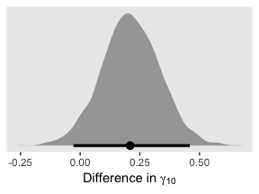

Here's our posterior for *γ*<sub>20</sub>, `b_unemp`.

``` r
posterior_samples(fit9) %>% 
  
  ggplot(aes(x = b_unemp, y = 0)) +
  geom_halfeyeh(.width = .95) +
  scale_y_continuous(NULL, breaks = NULL) +
  theme(panel.grid = element_blank())
```

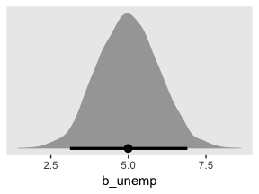

Let's compute our WAIC estimates for `fit8` and `fit9`.

``` r
fit8 <- add_criterion(fit8, criterion = "waic")
fit9 <- add_criterion(fit9, criterion = "waic")
```

Now we'll compare the models by both their WAIC differences and their WAIC weights.

``` r
loo_compare(fit8, fit9, criterion = "waic") %>% 
  print(simplify = F)
```

    ##      elpd_diff se_diff elpd_waic se_elpd_waic p_waic  se_p_waic waic    se_waic
    ## fit9     0.0       0.0 -2490.4      21.4        200.0    10.8    4980.8    42.8
    ## fit8   -23.1       4.6 -2513.5      21.6        180.4    10.1    5027.0    43.2

``` r
model_weights(fit8, fit9, weights = "waic") %>% 
  round(digits = 3)
```

    ## fit8 fit9 
    ##    0    1

By both metrics, `fit9` came out as the clear favorite.

It's finally time to make our version of the upper left panel of Figure 5.3. We’ll do so using `fitted()`.

``` r
nd <-
  tibble(unemp = 1,
         months = seq(from = 0, to = 14, by = .5))

f <-
  fitted(fit9,
         newdata = nd,
         re_formula = NA) %>% 
  data.frame() %>% 
  bind_cols(nd)

f %>% 
  ggplot(aes(x = months)) +
  geom_ribbon(aes(ymin = Q2.5, ymax = Q97.5),
              fill = "grey67", alpha = 1/2) +
  geom_line(aes(y = Estimate)) +
  scale_x_continuous("Months since job loss", breaks = seq(from = 0, to = 14, by = 2)) +
  scale_y_continuous("CES-D", limits = c(5, 20)) +
  labs(subtitle = "Remain unemployed") +
  theme(panel.grid = element_blank())
```

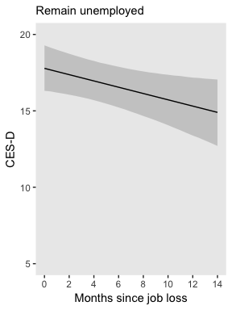

The upper right panel will take more care. We'll still use `fitted()`, but we'll have to be tricky with how we define the two segments. When we defined the sequence of `months` values over which we wanted to plot the model trajectory, we just casually set `length.out = 30` within the `seq()` function. But now we need to make sure two of those sequential points are at 5. One way to do so is to use the `by = .5` argument within `seq()`, instead. Since we'll be defining the end points in our range with integer values, dividing up the sequence by every .5<sup>th</sup> value will ensure we'll both be able to stop at 5 and that we'll have a reasonable amount of values in the sequence to ensure the bowtie-shaped 95% intervals don’t look chunky.

But anyway, that also means we’ll need to do a good job determining how many values we'll need to repeat our desired `unemp` values over. So here's a quick way to do the math. Since we're using every .5 in the sequence, you just subtract the integer at the beginning of the sequence from the integer at the end of the sequence, multiply that value by 2, and then add 1 to the product. Like this:

``` r
2 * (5 - 0) + 1
```

    ## [1] 11

``` r
2 * (14 - 5) + 1
```

    ## [1] 19

Those are the number of times we need to repeat `unemp == 1` and `unemp == 0`, respectively. You'll see. Now wrangle and plot.

``` r
nd <-
  tibble(unemp  = rep(1:0, times = c(11, 19)),
         months = c(seq(from = 0, to = 5, by = .5),
                    seq(from = 5, to = 14, by = .5)))

f <-
  fitted(fit9,
         newdata = nd,
         re_formula = NA) %>% 
  data.frame() %>% 
  bind_cols(nd)

f %>% 
  ggplot(aes(x = months, group = unemp)) +
  geom_ribbon(aes(ymin = Q2.5, ymax = Q97.5),
              fill = "grey67", alpha = 1/2) +
  geom_line(aes(y = Estimate)) +
  geom_segment(x = 5, xend = 5,
               y    = fixef(fit9)[1, 1] + fixef(fit9)[2, 1] * 5,
               yend = fixef(fit9)[1, 1] + fixef(fit9)[2, 1] * 5 + fixef(fit9)[3, 1],
               size = 1/3, linetype = 2) +
  annotate(geom = "text",
           x = 8, y = 14.5,
           label = "gamma[2][0]",
           parse = T) +
  geom_segment(x = 7, xend = 5.5,
               y = 14.5, yend = 14.5,
               arrow = arrow(length = unit(0.05, "inches"))) +
  scale_x_continuous("Months since job loss", breaks = seq(from = 0, to = 14, by = 2)) +
  scale_y_continuous("CES-D", limits = c(5, 20)) +
  labs(subtitle = "Reemployed at 5 months") +
  theme(panel.grid = element_blank())
```

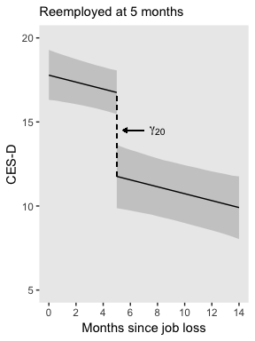

Same deal for the lower left panel of Figure 5.3.

``` r
2 * (10 - 0) + 1
```

    ## [1] 21

``` r
2 * (14 - 10) + 1
```

    ## [1] 9

Now wrangle and plot.

``` r
nd <-
  tibble(unemp  = rep(1:0, times = c(21, 9)),
         months = c(seq(from = 0, to = 10, by = .5),
                    seq(from = 10, to = 14, by = .5)))

f <-
  fitted(fit9,
         newdata = nd,
         re_formula = NA) %>% 
  data.frame() %>% 
  bind_cols(nd)

f %>% 
  ggplot(aes(x = months, group = unemp)) +
  geom_ribbon(aes(ymin = Q2.5, ymax = Q97.5),
              fill = "grey67", alpha = 1/2) +
  geom_line(aes(y = Estimate)) +
  geom_segment(x = 10, xend = 10,
               y    = fixef(fit9)[1, 1] + fixef(fit9)[2, 1] * 10,
               yend = fixef(fit9)[1, 1] + fixef(fit9)[2, 1] * 10 + fixef(fit9)[3, 1],
               size = 1/3, linetype = 2) +
  annotate(geom = "text",
           x = 7, y = 13.5,
           label = "gamma[2][0]",
           parse = T) +
  geom_segment(x = 8, xend = 9.5,
               y = 13.5, yend = 13.5,
               arrow = arrow(length = unit(0.05, "inches"))) +
  scale_x_continuous("Months since job loss", breaks = seq(from = 0, to = 14, by = 2)) +
  scale_y_continuous("CES-D", limits = c(5, 20)) +
  labs(subtitle = "Reemployed at 10 months") +
  theme(panel.grid = element_blank())
```

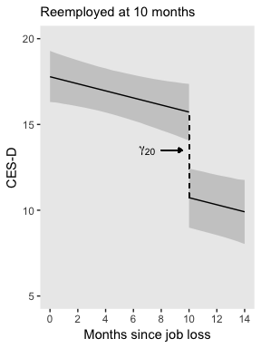

It's just a little bit trickier to get that lower right panel. Now we need to calculate three values.

``` r
2 * (5 - 0) + 1
```

    ## [1] 11

``` r
2 * (10 - 5) + 1
```

    ## [1] 11

``` r
2 * (14 - 10) + 1
```

    ## [1] 9

Get that plot.

``` r
nd <-
  tibble(unemp  = rep(c(1, 0, 1), times = c(11, 11, 9)),
         months = c(seq(from = 0, to = 5, by = .5),
                    seq(from = 5, to = 10, by = .5),
                    seq(from = 10, to = 14, by = .5)),
         group  = rep(letters[1:3], times = c(11, 11, 9)))

f <-
  fitted(fit9,
         newdata = nd,
         re_formula = NA) %>% 
  data.frame() %>% 
  bind_cols(nd)

lines <-
  tibble(group = letters[1:2],
         x     = c(5, 10)) %>% 
  mutate(xend  = x,
         y     = fixef(fit9)[1, 1] + fixef(fit9)[2, 1] * x,
         yend  = fixef(fit9)[1, 1] + fixef(fit9)[2, 1] * x + fixef(fit9)[3, 1])

arrow <-
  tibble(x    = c(6.75, 8.25),
         xend = c(5.5, 9.5),
         y    = 14,
         yend = c(14.5, 13.5))
f %>% 
  ggplot(aes(x = months)) +
  geom_ribbon(aes(ymin = Q2.5, ymax = Q97.5, group = group),
              fill = "grey67", alpha = 1/2) +
  geom_line(aes(y = Estimate, group = group)) +
  geom_segment(data = lines,
               aes(x = x, xend = xend,
                   y = y, yend = yend, 
                   group = group),
               size = 1/3, linetype = 2) +
  annotate(geom = "text",
           x = 7.5, y = 14,
           label = "gamma[2][0]",
           parse = T) +
  geom_segment(data = arrow,
               aes(x = x, xend = xend,
                   y = y, yend = yend),
               arrow = arrow(length = unit(0.05, "inches"))) +
  scale_x_continuous("Months since job loss", breaks = seq(from = 0, to = 14, by = 2)) +
  scale_y_continuous("CES-D", limits = c(5, 20)) +
  labs(subtitle = "Reemployed at 5 months\nunemployed again at 10") +
  theme(panel.grid = element_blank())
```

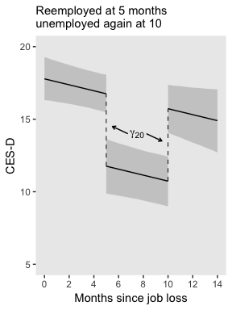

Now we've been on a plotting roll, let's knock out the leftmost panel of Figure 5.4. It's just a small extension of what we've been doing.

``` r
2 * (14 - 0) + 1
```

    ## [1] 29

``` r
2 * (3.5 - 0) + 1
```

    ## [1] 8

``` r
2 * (14 - 3.5) + 1
```

    ## [1] 22

``` r
nd <-
  tibble(unemp  = rep(1:0, times = c(29, 22)),
         months = c(seq(from = 0, to = 14, by = .5),
                    seq(from = 3.5, to = 14, by = .5)))

f <-
  fitted(fit9,
         newdata = nd,
         re_formula = NA) %>% 
  data.frame() %>% 
  bind_cols(nd) %>% 
  mutate(label = str_c("unemp = ", unemp))

f %>% 
  ggplot(aes(x = months, group = unemp)) +
  # new trick
  geom_abline(intercept = fixef(fit9)[1, 1],
              slope = fixef(fit9)[2, 1],
              color = "grey80", linetype = 2) +
  geom_ribbon(aes(ymin = Q2.5, ymax = Q97.5),
              fill = "grey67", alpha = 1/2) +
  geom_line(aes(y = Estimate)) +
  # another new trick
  geom_text(data = f %>% filter(months == 14), 
            aes(label = label, y = Estimate), hjust = -.05) +
  scale_x_continuous("Months since job loss", breaks = seq(from = 0, to = 14, by = 2)) +
  scale_y_continuous("CES-D", limits = c(5, 20)) +
  labs(subtitle = "Main effects of unemp and time") +
  # don't forget this part
  coord_cartesian(clip = "off") +
  theme(panel.grid = element_blank(),
        plot.margin = margin(6, 55, 6, 6))
```

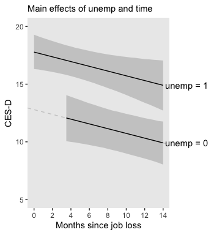

#### Using a level-1/level-2 specification.

If we wanted to reexpress our composite equation for `fit9` using the level-1/level-2 form, the level-1 model would be

cesd<sub>*i**j*</sub> = *π*<sub>0*i*</sub> + *π*<sub>1*i*</sub>months<sub>*i**j*</sub> + *π*<sub>2*i*</sub>unemp<sub>*i**j*</sub> + *ϵ*<sub>*i**j*</sub>.

Here's the corresponding level-2 model:

$$
\\begin{align\*}
\\pi\_{0i} & = \\gamma\_{00} + \\zeta\_{0i} \\\\
\\pi\_{1i} & = \\gamma\_{10} + \\zeta\_{1i} \\\\
\\pi\_{2i} & = \\gamma\_{20}.
\\end{align\*}
$$

If we wanted the effects of the time-varying covariate `unemp` to vary across individuals, then we'd expand the definition of *π*<sub>2*i*</sub> to be

*π*<sub>2*i*</sub> = *γ*<sub>20</sub> + *ζ*<sub>2*i*</sub>.

Although this doesn't change the way we model *ϵ*<sub>*i**j*</sub>, which remains

*ϵ*<sub>*i**j*</sub> ∼ Normal(0, *σ*<sub>*ϵ*</sub>),

it does change the model for the *ζ*s. Within our **Stan/brms** paradigm, that would now be

$$
$$

Reworded slightly from the text (p. 169), by adding one residual parameter, *ζ*<sub>2*i*</sub>, we got an additional corresponding standard deviation parameter, *σ*<sub>2</sub>, and two more correlation parameters, *ρ*<sub>02</sub> and *ρ*<sub>12</sub>. Staying with our weakly-regularizing prior approach, the priors for the updated model might look like

$$
\\begin{align\*}
\\gamma\_{00}     & \\sim \\text{Normal}(14.5, 20) \\\\
\\gamma\_{10}     & \\sim \\text{Normal}(0, 10) \\\\
\\gamma\_{20}     & \\sim \\text{Normal}(0, 10) \\\\
\\sigma\_\\epsilon & \\sim \\text{Student-t} (3, 0, 10) \\\\
\\sigma\_0        & \\sim \\text{Student-t} (3, 0, 10) \\\\
\\sigma\_1        & \\sim \\text{Student-t} (3, 0, 10) \\\\
\\sigma\_2        & \\sim \\text{Student-t} (3, 0, 10) \\\\
\\Omega          & \\sim \\text{LKJ} (4).
\\end{align\*}
$$

Singer and Willett then cautioned readers about hastily adding *ζ* parameters to their models, particularly in cases where you're likely to run into estimation issues, such as boundary constraints. Within our **Stan/brms** paradigm, we still have to be aware of these difficulties. However, with skillfully-chosen priors, I think you'll find we can fit more ambitious models than would typically be possible with frequentist estimators. But do beware that as you stretch your data further and further, your choices in likelihoods and priors more heavily influence the results. For more on the topic, check out [Michael Frank](https://twitter.com/mcxfrank?lang=en)'s blog post, [*Mixed effects models: Is it time to go Bayesian by default?*](http://babieslearninglanguage.blogspot.com/2018/02/mixed-effects-models-is-it-time-to-go.html). And make sure not to miss the action in the comments section.

#### Time-varying predictors and variance components.

When you add a time-varying predictor, it's not uncommon to see a reduction in *σ*<sub>*ϵ*</sub><sup>2</sup>. Here we compare `fit8` and `fit9`.

``` r
v <-
  cbind(VarCorr(fit8, summary = F)[[2]][[1]],
        VarCorr(fit9, summary = F)[[2]][[1]]) %>% 
  data.frame() %>% 
  set_names(str_c("fit", 8:9)) %>% 
  transmute(fit8 = fit8^2,
            fit9 = fit9^2) %>% 
  mutate(`fit8 - fit9` = fit8 - fit9)

v %>% 
  gather() %>% 
  mutate(key = factor(key, levels = c("fit8", "fit9", "fit8 - fit9"))) %>% 
  
  ggplot(aes(x = value, y = 0)) +
  geom_halfeyeh(.width = .95) +
  scale_y_continuous(NULL, breaks = NULL) +
  xlab(expression(sigma[epsilon]^2)) +
  theme(panel.grid = element_blank()) +
  facet_wrap(~key, scales = "free")
```

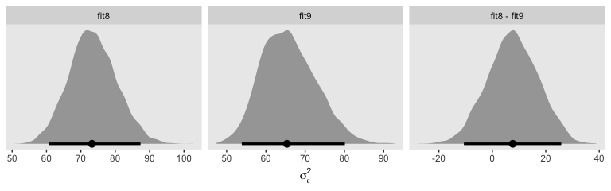

Using the full posterior for both models, here is the percent variance in CES-D explained by `unemp`.

``` r
v %>% 
  transmute(percent = (fit8 - fit9) / fit8) %>% 
  median_qi() %>% 
  mutate_if(is.double, round, digits = 3)
```

    ##   percent .lower .upper .width .point .interval
    ## 1   0.105 -0.163  0.311   0.95 median        qi

When you go beyond point estimates and factor in full posterior uncertainty, it becomes clear how fragile ad hoc statistics like this can be. Interpret them with caution.

### 5.3.2. Allowing the effect of a time-varying predictor to vary over time.

"Might unemployment status also affect the trajectory’s slope" (p. 171)? Here's the statistical model:

$$
$$

Since *γ*<sub>30</sub> is an interaction term, it might make sense to give it an ever tighter prior, something like Normal(0, 5). Here we'll just stay wide and loose.

``` r
fit10 <-
  brm(data = unemployment_pp, 
      family = gaussian,
      cesd ~ 0 + intercept + months + unemp + months:unemp + (1 + months | id),
      prior = c(prior(normal(14.5, 20), class = b, coef = "intercept"),
                prior(normal(0, 10),   class = b),
                prior(student_t(3, 0, 10), class = sd),
                prior(student_t(3, 0, 10), class = sigma),
                prior(lkj(4), class = cor)),
      iter = 2000, warmup = 1000, chains = 4, cores = 4,
      seed = 5)
```

Here are the results.

``` r
print(fit10)
```

    ##  Family: gaussian 
    ##   Links: mu = identity; sigma = identity 
    ## Formula: cesd ~ 0 + intercept + months + unemp + months:unemp + (1 + months | id) 
    ##    Data: unemployment_pp (Number of observations: 674) 
    ## Samples: 4 chains, each with iter = 2000; warmup = 1000; thin = 1;
    ##          total post-warmup samples = 4000
    ## 
    ## Group-Level Effects: 
    ## ~id (Number of levels: 254) 
    ##                       Estimate Est.Error l-95% CI u-95% CI Eff.Sample Rhat
    ## sd(Intercept)             9.15      0.85     7.46    10.75        339 1.01
    ## sd(months)                0.56      0.19     0.10     0.87        165 1.02
    ## cor(Intercept,months)    -0.48      0.16    -0.70    -0.05        424 1.00
    ## 
    ## Population-Level Effects: 
    ##              Estimate Est.Error l-95% CI u-95% CI Eff.Sample Rhat
    ## intercept        9.94      1.91     6.25    13.60       1254 1.00
    ## months           0.13      0.19    -0.24     0.52       1335 1.00
    ## unemp            8.17      1.91     4.47    11.86       1348 1.00
    ## months:unemp    -0.43      0.22    -0.86    -0.01       1434 1.00
    ## 
    ## Family Specific Parameters: 
    ##       Estimate Est.Error l-95% CI u-95% CI Eff.Sample Rhat
    ## sigma     8.11      0.42     7.35     8.96        295 1.00
    ## 
    ## Samples were drawn using sampling(NUTS). For each parameter, Eff.Sample 
    ## is a crude measure of effective sample size, and Rhat is the potential 
    ## scale reduction factor on split chains (at convergence, Rhat = 1).

Here's how we might make our version of the middle panel of Figure 5.4.

``` r
nd <-
  tibble(unemp  = rep(1:0, times = c(29, 22)),
         months = c(seq(from = 0, to = 14, by = .5),
                    seq(from = 3.5, to = 14, by = .5)))

f <-
  fitted(fit10,
         newdata = nd,
         re_formula = NA) %>% 
  data.frame() %>% 
  bind_cols(nd) %>% 
  mutate(label = str_c("unemp = ", unemp))

f %>% 
  ggplot(aes(x = months, group = unemp)) +
  geom_abline(intercept = fixef(fit10)[1, 1],
              slope = fixef(fit10)[2, 1],
              color = "grey80", linetype = 2) +
  geom_ribbon(aes(ymin = Q2.5, ymax = Q97.5),
              fill = "grey67", alpha = 1/2) +
  geom_line(aes(y = Estimate)) +
  geom_text(data = f %>% filter(months == 14), 
            aes(label = label, y = Estimate), hjust = -.05) +
  scale_x_continuous("Months since job loss", breaks = seq(from = 0, to = 14, by = 2)) +
  scale_y_continuous("CES-D", limits = c(5, 20)) +
  labs(subtitle = "Main effects of unemp and time") +
  coord_cartesian(clip = "off") +
  theme(panel.grid = element_blank(),
        plot.margin = margin(6, 55, 6, 6))
```

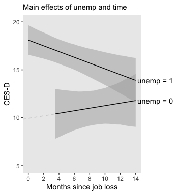

Here's the posterior for *γ*<sub>10</sub>.

``` r
posterior_samples(fit10) %>% 
  ggplot(aes(x = b_months, y = 0)) +
  geom_halfeyeh(.width = .95) +
  scale_y_continuous(NULL, breaks = NULL) +
  xlab(expression(paste(gamma[1][0], ", the main effect for time"))) +
  theme(panel.grid = element_blank())
```

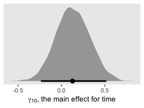

It's quite uncertain and almost symmetrically straddles the parameter space between -0.5 and 0.5.

The next model follows the form

$$
$$

Here's how to fit it with `brms::brm()`.

``` r
fit11 <-
  brm(data = unemployment_pp, 
      family = gaussian,
      cesd ~ 0 + intercept + unemp + months:unemp + (1 + months:unemp | id),
      prior = c(prior(normal(14.5, 20), class = b, coef = "intercept"),
                prior(normal(0, 10),   class = b),
                prior(student_t(3, 0, 10), class = sd),
                prior(student_t(3, 0, 10), class = sigma),
                prior(lkj(4), class = cor)),
      iter = 2000, warmup = 1000, chains = 4, cores = 4,
      seed = 5,
      control = list(adapt_delta = .99))
```

It's easy to miss this if you're not following along quite carefully with the text, but this model, which corresponds to Equation 5.9 in the text, is NOT Model D. Rather, it's an intermediary model between Model C and Model D. All this means we can't compare our results with those in Table 5.7. But here they are, anyway.

``` r
print(fit11)
```

    ##  Family: gaussian 
    ##   Links: mu = identity; sigma = identity 
    ## Formula: cesd ~ 0 + intercept + unemp + months:unemp + (1 + months:unemp | id) 
    ##    Data: unemployment_pp (Number of observations: 674) 
    ## Samples: 4 chains, each with iter = 2000; warmup = 1000; thin = 1;
    ##          total post-warmup samples = 4000
    ## 
    ## Group-Level Effects: 
    ## ~id (Number of levels: 254) 
    ##                             Estimate Est.Error l-95% CI u-95% CI Eff.Sample Rhat
    ## sd(Intercept)                   8.00      0.65     6.77     9.30        763 1.01
    ## sd(months:unemp)                0.41      0.22     0.03     0.81        233 1.01
    ## cor(Intercept,months:unemp)    -0.11      0.25    -0.52     0.48        740 1.01
    ## 
    ## Population-Level Effects: 
    ##              Estimate Est.Error l-95% CI u-95% CI Eff.Sample Rhat
    ## intercept       11.22      0.88     9.48    12.90       1658 1.00
    ## unemp            6.91      0.92     5.11     8.67       2935 1.00
    ## unemp:months    -0.30      0.11    -0.51    -0.08       4002 1.00
    ## 
    ## Family Specific Parameters: 
    ##       Estimate Est.Error l-95% CI u-95% CI Eff.Sample Rhat
    ## sigma     8.51      0.35     7.84     9.25        669 1.00
    ## 
    ## Samples were drawn using sampling(NUTS). For each parameter, Eff.Sample 
    ## is a crude measure of effective sample size, and Rhat is the potential 
    ## scale reduction factor on split chains (at convergence, Rhat = 1).

We've already computed the WAIC for `fit8` and `fit9`. Here we do so for `fit10` and `fit11`.

``` r
fit10 <- add_criterion(fit10, "waic")
fit11 <- add_criterion(fit11, "waic")
```

``` r
loo_compare(fit8, fit9, fit10, fit11, criterion = "waic") %>% 
  print(simplify = F)
```

    ##       elpd_diff se_diff elpd_waic se_elpd_waic p_waic  se_p_waic waic    se_waic
    ## fit10     0.0       0.0 -2488.4      21.3        197.4    10.6    4976.8    42.6
    ## fit9     -2.0       2.0 -2490.4      21.4        200.0    10.8    4980.8    42.8
    ## fit11   -15.9       3.4 -2504.3      21.8        172.0     9.9    5008.7    43.7
    ## fit8    -25.1       4.9 -2513.5      21.6        180.4    10.1    5027.0    43.2

``` r
model_weights(fit8, fit9, fit10, fit11, weights = "waic") %>% 
  round(digits = 3)
```

    ##  fit8  fit9 fit10 fit11 
    ## 0.000 0.119 0.881 0.000

Yep, it appears `fit11` is not an improvement on `fit10` (i.e., our analogue to Model C in the text). Here's our version of Model D:

$$
$$

We'll call it `fit12`. Here's the `brm()` code.

``` r
fit12 <-
  brm(data = unemployment_pp, 
      family = gaussian,
      cesd ~ 0 + intercept + unemp + months:unemp + (1 + unemp + months:unemp | id),
      prior = c(prior(normal(14.5, 20), class = b, coef = "intercept"),
                prior(normal(0, 10),   class = b),
                prior(student_t(3, 0, 10), class = sd),
                prior(student_t(3, 0, 10), class = sigma),
                prior(lkj(4), class = cor)),
      iter = 2000, warmup = 1000, chains = 4, cores = 4,
      seed = 5)
```

``` r
print(fit12)
```

    ##  Family: gaussian 
    ##   Links: mu = identity; sigma = identity 
    ## Formula: cesd ~ 0 + intercept + unemp + months:unemp + (1 + unemp + months:unemp | id) 
    ##    Data: unemployment_pp (Number of observations: 674) 
    ## Samples: 4 chains, each with iter = 2000; warmup = 1000; thin = 1;
    ##          total post-warmup samples = 4000
    ## 
    ## Group-Level Effects: 
    ## ~id (Number of levels: 254) 
    ##                             Estimate Est.Error l-95% CI u-95% CI Eff.Sample Rhat
    ## sd(Intercept)                   6.85      0.88     5.11     8.64       1150 1.00
    ## sd(unemp)                       4.82      1.63     1.49     7.86        217 1.01
    ## sd(unemp:months)                0.63      0.23     0.08     1.01        213 1.01
    ## cor(Intercept,unemp)            0.24      0.22    -0.17     0.67        965 1.00
    ## cor(Intercept,unemp:months)    -0.18      0.22    -0.56     0.27        842 1.00
    ## cor(unemp,unemp:months)        -0.38      0.28    -0.81     0.27        385 1.01
    ## 
    ## Population-Level Effects: 
    ##              Estimate Est.Error l-95% CI u-95% CI Eff.Sample Rhat
    ## intercept       11.19      0.79     9.61    12.71       2728 1.00
    ## unemp            6.93      0.91     5.17     8.69       4144 1.00
    ## unemp:months    -0.29      0.11    -0.50    -0.08       3950 1.00
    ## 
    ## Family Specific Parameters: 
    ##       Estimate Est.Error l-95% CI u-95% CI Eff.Sample Rhat
    ## sigma     8.08      0.42     7.27     8.92        291 1.01
    ## 
    ## Samples were drawn using sampling(NUTS). For each parameter, Eff.Sample 
    ## is a crude measure of effective sample size, and Rhat is the potential 
    ## scale reduction factor on split chains (at convergence, Rhat = 1).

Now we can finally make our version of the right panel of Figure 5.4.

``` r
f <-
  fitted(fit12,
         newdata = nd,
         re_formula = NA) %>% 
  data.frame() %>% 
  bind_cols(nd) %>% 
  mutate(label = str_c("unemp = ", unemp))

f %>% 
  ggplot(aes(x = months, group = unemp)) +
  geom_abline(intercept = fixef(fit12)[1, 1],
              slope = 0,
              color = "grey80", linetype = 2) +
  geom_ribbon(aes(ymin = Q2.5, ymax = Q97.5),
              fill = "grey67", alpha = 1/2) +
  geom_line(aes(y = Estimate)) +
  geom_text(data = f %>% filter(months == 14), 
            aes(label = label, y = Estimate), hjust = -.05) +
  scale_x_continuous("Months since job loss", breaks = seq(from = 0, to = 14, by = 2)) +
  scale_y_continuous("CES-D", limits = c(5, 20)) +
  labs(subtitle = "Constraining the effects time\namong the re-employed") +
  coord_cartesian(clip = "off") +
  theme(panel.grid = element_blank(),
        plot.margin = margin(6, 55, 6, 6))
```

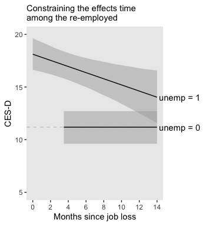

By carefully using `filter()`, we can extract the posterior for summary the expected CES-D value for "the average unemployed person in the population", "immediately upon layoff" (p. 173).

``` r
f %>% 
  filter(unemp == 1 & months == 0)
```

    ##   Estimate Est.Error     Q2.5    Q97.5 unemp months     label
    ## 1 18.11475 0.7716635 16.63259 19.63929     1      0 unemp = 1

To get the decline rate per month, just use `fixef()` and subset.

``` r
fixef(fit12)["unemp:months", ]
```

    ##   Estimate  Est.Error       Q2.5      Q97.5 
    ## -0.2915222  0.1075078 -0.5037593 -0.0843588

How much lower, on average, are "CES-D scores among those who find a job" right after layoff (p. 173)? Again, just use `fixef()`.

``` r
fixef(fit12)["unemp", ]
```

    ##  Estimate Est.Error      Q2.5     Q97.5 
    ## 6.9283409 0.9069979 5.1715017 8.6859171

But if we'd like to get the posterior for the difference at 12 months later, we'll need to go back to `fitted()`.

``` r
nd <-
  tibble(unemp  = 1:0,
         months = 12)

fitted(fit12,
         newdata = nd,
         re_formula = NA,
         summary = F) %>% 
  data.frame() %>% 
  set_names(str_c(c("un", ""), "employed_cesd_at_12")) %>% 
  transmute(difference = unemployed_cesd_at_12 - employed_cesd_at_12) %>% 

  median_qi() %>% 
  mutate_if(is.double, round, digits = 3)
```

    ##   difference .lower .upper .width .point .interval
    ## 1      3.424  0.836  6.032   0.95 median        qi

There's more posterior uncertainty, there, that you might expect from simply using the point estimates. *Always beware the posterior uncertainty*. We may as well finish off with a little WAIC.

``` r
fit12 <- add_criterion(fit12, "waic")

loo_compare(fit8, fit9, fit10, fit11, fit12, criterion = "waic") %>% 
  print(simplify = F)
```

    ##       elpd_diff se_diff elpd_waic se_elpd_waic p_waic  se_p_waic waic    se_waic
    ## fit12     0.0       0.0 -2488.3      21.7        200.1    11.0    4976.6    43.5
    ## fit10    -0.1       3.6 -2488.4      21.3        197.4    10.6    4976.8    42.6
    ## fit9     -2.1       3.6 -2490.4      21.4        200.0    10.8    4980.8    42.8
    ## fit11   -16.1       3.6 -2504.3      21.8        172.0     9.9    5008.7    43.7
    ## fit8    -25.2       6.6 -2513.5      21.6        180.4    10.1    5027.0    43.2

``` r
model_weights(fit8, fit9, fit10, fit11, fit12, weights = "waic") %>% 
  round(digits = 3)
```

    ##  fit8  fit9 fit10 fit11 fit12 
    ## 0.000 0.060 0.443 0.000 0.497

It's a toss-up between `fit12` and `fit10`.

### 5.3.3. Recentering time-varying predictors.

Back to the `wages_pp` data! Here's the generic statistical model we'll be fooling with:

$$
\\begin{align\*}
\\text{lnw}\_{ij} & = \\gamma\_{00} + \\gamma\_{10} \\text{exper}\_{ij} + \\gamma\_{01} (\\text{hgc}\_i - 9) + \\gamma\_{12} \\text{black}\_i \\times \\text{exper}\_{ij} \\\\
& \\;\\;\\; + \\zeta\_{0i} + \\zeta\_{1i} \\text{exper}\_{ij} + \\epsilon\_{ij}
\\end{align\*}
$$

We’ll be fitting the model with three versions of `uerate`. If you execute `head(wages_pp)`, you'll discover they're already in the data. But it might be worth walking out how to compute those variables. First, centering `uerate` at 7 is easy enough. Just subtract.

``` r
wages_pp <-
  wages_pp %>% 
  mutate(uerate_7 = uerate - 7)
```

Continuing on with the same priors from before, here's how to fit the new model, our version of Model A on page 175.

``` r
fit13 <-
  brm(data = wages_pp, 
      family = gaussian,
      lnw ~ 0 + intercept + exper + hgc_9 + black:exper + uerate_7 + (1 + exper | id),
      prior = c(prior(normal(1.335, 1), class = b, coef = "intercept"),
                prior(normal(0, 0.5),   class = b),
                prior(student_t(3, 0, 1), class = sd),
                prior(student_t(3, 0, 1), class = sigma),
                prior(lkj(4), class = cor)),
      iter = 2000, warmup = 1000, chains = 4, cores = 4,
      seed = 5)
```

``` r
print(fit13, digits = 3)
```

    ##  Family: gaussian 
    ##   Links: mu = identity; sigma = identity 
    ## Formula: lnw ~ 0 + intercept + exper + hgc_9 + black:exper + uerate_7 + (1 + exper | id) 
    ##    Data: wages_pp (Number of observations: 6402) 
    ## Samples: 4 chains, each with iter = 2000; warmup = 1000; thin = 1;
    ##          total post-warmup samples = 4000
    ## 
    ## Group-Level Effects: 
    ## ~id (Number of levels: 888) 
    ##                      Estimate Est.Error l-95% CI u-95% CI Eff.Sample  Rhat
    ## sd(Intercept)           0.225     0.011    0.204    0.245       1763 1.001
    ## sd(exper)               0.040     0.003    0.035    0.045        702 1.007
    ## cor(Intercept,exper)   -0.302     0.069   -0.424   -0.159        664 1.007
    ## 
    ## Population-Level Effects: 
    ##             Estimate Est.Error l-95% CI u-95% CI Eff.Sample  Rhat
    ## intercept      1.749     0.011    1.727    1.771       3042 1.000
    ## exper          0.044     0.003    0.039    0.049       2107 1.001
    ## hgc_9          0.040     0.006    0.028    0.053       2736 1.000
    ## uerate_7      -0.012     0.002   -0.015   -0.008       5237 1.000
    ## exper:black   -0.018     0.004   -0.027   -0.009       2453 1.002
    ## 
    ## Family Specific Parameters: 
    ##       Estimate Est.Error l-95% CI u-95% CI Eff.Sample  Rhat
    ## sigma    0.308     0.003    0.302    0.314       3189 1.000
    ## 
    ## Samples were drawn using sampling(NUTS). For each parameter, Eff.Sample 
    ## is a crude measure of effective sample size, and Rhat is the potential 
    ## scale reduction factor on split chains (at convergence, Rhat = 1).

``` r
wages_pp <-
  wages_pp %>% 
  group_by(id) %>% 
  mutate(uerate_id_mu  = mean(uerate)) %>% 
  ungroup() %>% 
  mutate(uerate_id_dev = uerate - uerate_id_mu)
```

In the original data set, these were the `ue.mean` and `ue.person.cen` variables, respectively. Here's how to fit the model.

``` r
fit14 <-
  brm(data = wages_pp, 
      family = gaussian,
      lnw ~ 0 + intercept + exper + hgc_9 + black:exper + uerate_id_mu + uerate_id_dev + 
        (1 + exper | id),
      prior = c(prior(normal(1.335, 1), class = b, coef = "intercept"),
                prior(normal(0, 0.5),   class = b),
                prior(student_t(3, 0, 1), class = sd),
                prior(student_t(3, 0, 1), class = sigma),
                prior(lkj(4), class = cor)),
      iter = 2000, warmup = 1000, chains = 4, cores = 4,
      seed = 5)
```

``` r
print(fit14, digits = 3)
```

    ##  Family: gaussian 
    ##   Links: mu = identity; sigma = identity 
    ## Formula: lnw ~ 0 + intercept + exper + hgc_9 + black:exper + uerate_id_mu + uerate_id_dev + (1 + exper | id) 
    ##    Data: wages_pp (Number of observations: 6402) 
    ## Samples: 4 chains, each with iter = 2000; warmup = 1000; thin = 1;
    ##          total post-warmup samples = 4000
    ## 
    ## Group-Level Effects: 
    ## ~id (Number of levels: 888) 
    ##                      Estimate Est.Error l-95% CI u-95% CI Eff.Sample  Rhat
    ## sd(Intercept)           0.225     0.011    0.204    0.246       1722 1.002
    ## sd(exper)               0.040     0.003    0.035    0.045        606 1.000
    ## cor(Intercept,exper)   -0.313     0.066   -0.433   -0.178        662 1.004
    ## 
    ## Population-Level Effects: 
    ##               Estimate Est.Error l-95% CI u-95% CI Eff.Sample  Rhat
    ## intercept        1.873     0.029    1.816    1.932       2616 1.000
    ## exper            0.045     0.003    0.040    0.050       3126 1.000
    ## hgc_9            0.040     0.006    0.028    0.053       3391 1.000
    ## uerate_id_mu    -0.018     0.003   -0.024   -0.011       2509 1.000
    ## uerate_id_dev   -0.010     0.002   -0.014   -0.006       4931 1.000
    ## exper:black     -0.019     0.004   -0.027   -0.010       2959 1.000
    ## 
    ## Family Specific Parameters: 
    ##       Estimate Est.Error l-95% CI u-95% CI Eff.Sample  Rhat
    ## sigma    0.308     0.003    0.302    0.314       3335 0.999
    ## 
    ## Samples were drawn using sampling(NUTS). For each parameter, Eff.Sample 
    ## is a crude measure of effective sample size, and Rhat is the potential 
    ## scale reduction factor on split chains (at convergence, Rhat = 1).

Within the **tidyverse**, probably the easiest way to center on the first value for each `id` is to first `group_by(id)` and then make use of the `dplyr::first()` function, which you can learn more about [here](https://dplyr.tidyverse.org/reference/nth.html).

``` r
wages_pp <-
  wages_pp %>% 
  group_by(id) %>% 
  mutate(uerate_id_1 = first(uerate)) %>% 
  ungroup() %>% 
  mutate(uerate_id_1_dev = uerate - uerate_id_1)
```

In the original data set, these were the `ue1` and `ue.centert1` variables, respectively. Here's how to fit the updated model.

``` r
fit15 <-
  update(fit14,
         newdata = wages_pp,
         lnw ~ 0 + intercept + exper + hgc_9 + black:exper + uerate_id_1 + uerate_id_1_dev + 
           (1 + exper | id),
         iter = 2000, warmup = 1000, chains = 4, cores = 4,
         seed = 5)
```

``` r
print(fit15, digits = 3)
```

    ##  Family: gaussian 
    ##   Links: mu = identity; sigma = identity 
    ## Formula: lnw ~ intercept + exper + hgc_9 + uerate_id_1 + uerate_id_1_dev + (1 + exper | id) + exper:black - 1 
    ##    Data: wages_pp (Number of observations: 6402) 
    ## Samples: 4 chains, each with iter = 2000; warmup = 1000; thin = 1;
    ##          total post-warmup samples = 4000
    ## 
    ## Group-Level Effects: 
    ## ~id (Number of levels: 888) 
    ##                      Estimate Est.Error l-95% CI u-95% CI Eff.Sample  Rhat
    ## sd(Intercept)           0.224     0.011    0.204    0.245       1320 1.002
    ## sd(exper)               0.040     0.003    0.035    0.046        597 1.003
    ## cor(Intercept,exper)   -0.305     0.069   -0.431   -0.163        621 1.002
    ## 
    ## Population-Level Effects: 
    ##                 Estimate Est.Error l-95% CI u-95% CI Eff.Sample  Rhat
    ## intercept          1.870     0.026    1.818    1.918       2612 1.000
    ## exper              0.045     0.003    0.039    0.050       2608 1.000
    ## hgc_9              0.040     0.006    0.028    0.053       2919 1.001
    ## uerate_id_1       -0.016     0.003   -0.021   -0.011       2598 1.000
    ## uerate_id_1_dev   -0.010     0.002   -0.014   -0.006       5230 0.999
    ## exper:black       -0.018     0.005   -0.027   -0.009       2763 1.000
    ## 
    ## Family Specific Parameters: 
    ##       Estimate Est.Error l-95% CI u-95% CI Eff.Sample  Rhat
    ## sigma    0.308     0.003    0.302    0.314       3259 1.000
    ## 
    ## Samples were drawn using sampling(NUTS). For each parameter, Eff.Sample 
    ## is a crude measure of effective sample size, and Rhat is the potential 
    ## scale reduction factor on split chains (at convergence, Rhat = 1).

Here are the WAIC comparisons.

``` r
fit13 <- add_criterion(fit13, "waic")
fit14 <- add_criterion(fit14, "waic")
fit15 <- add_criterion(fit15, "waic")

loo_compare(fit13, fit14, fit15, criterion = "waic") %>% 
  print(simplify = F)
```

    ##       elpd_diff se_diff elpd_waic se_elpd_waic p_waic  se_p_waic waic    se_waic
    ## fit13     0.0       0.0 -2036.4     104.2        863.2    27.0    4072.8   208.5
    ## fit15    -0.3       1.9 -2036.7     104.5        865.5    27.2    4073.3   209.0
    ## fit14    -1.4       1.9 -2037.8     104.1        863.3    26.8    4075.6   208.2

``` r
model_weights(fit13, fit14, fit15, weights = "waic") %>% 
  round(digits = 3)
```

    ## fit13 fit14 fit15 
    ## 0.496 0.121 0.383

Much like with the AIC and BIC values in the text, the WAIC estimates among our models are too similar to declare one model the clear winner. And that's a good thing. They're all re-expressions of the same model.

### 5.3.4. An important caveat: The problem of reciprocal causation.

In this section, Singer and Willett gave a typology for time-varying covariates.

-   A variable is *defined* if, "in advance to data collection, its values are predetermined for everyone under study" (p. 177). Examples are time and the seasons.
-   A variable is *ancillary* if "its values cannot be influenced by study participants because they are determined by a stochastic process totally external to them" (p. 178). Within the context of a study on people within monogamous relationships, the availability of potential mates within the region would be an example.
-   A variable is *contextual* if "it describes an 'external' stochastic process, but the connection between units is closer--between husbands and wives, parents and children, teachers and students, employers and employees. Because of this proximity, contextual predictors can be influenced by an individual’s contemporaneous outcome values; if so, they are susceptible to issues of reciprocal causation" (p. 179).
-   A variable is *internal* if it describes an "individual's potentially changeable status over time" (p. 179). Examples include mood, psychiatric syndromes, and employment status.

5.4. Recentering the effect of *TIME*
-------------------------------------

Our version of the data from Tomarken, Shelton, Elkins, and Anderson (1997) are saved as `medication_pp.csv`.

``` r
medication_pp <- read_csv("data/medication_pp.csv")

glimpse(medication_pp)
```

    ## Observations: 1,242
    ## Variables: 11
    ## $ id          <int> 1, 1, 1, 1, 1, 1, 1, 1, 1, 1, 1, 1, 1, 1, 1, 1, 1, 1, 1, 1, 10, 10, 10, 10, 1…
    ## $ treat       <int> 1, 1, 1, 1, 1, 1, 1, 1, 1, 1, 1, 1, 1, 1, 1, 1, 1, 1, 1, 1, 1, 1, 1, 1, 1, 1,…
    ## $ wave        <int> 1, 2, 3, 4, 5, 6, 7, 8, 9, 10, 11, 12, 13, 14, 15, 16, 17, 19, 20, 21, 1, 2, …
    ## $ day         <int> 0, 0, 0, 1, 1, 1, 2, 2, 2, 3, 3, 3, 4, 4, 4, 5, 5, 6, 6, 6, 0, 0, 0, 1, 1, 1,…
    ## $ time.of.day <dbl> 0.0000000, 0.3333333, 0.6666667, 0.0000000, 0.3333333, 0.6666667, 0.0000000, …
    ## $ time        <dbl> 0.0000000, 0.3333333, 0.6666667, 1.0000000, 1.3333333, 1.6666667, 2.0000000, …
    ## $ time333     <dbl> -3.3333333, -3.0000000, -2.6666667, -2.3333333, -2.0000000, -1.6666667, -1.33…
    ## $ time667     <dbl> -6.6666667, -6.3333333, -6.0000000, -5.6666667, -5.3333333, -5.0000000, -4.66…
    ## $ initial     <dbl> 1.00, 0.95, 0.90, 0.85, 0.80, 0.75, 0.70, 0.65, 0.60, 0.55, 0.50, 0.45, 0.40,…
    ## $ final       <dbl> 0.00, 0.05, 0.10, 0.15, 0.20, 0.25, 0.30, 0.35, 0.40, 0.45, 0.50, 0.55, 0.60,…
    ## $ pos         <dbl> 106.6667, 100.0000, 100.0000, 100.0000, 100.0000, 100.0000, 100.0000, 100.000…

The `medication_pp` data do not come with a `reading` variable, as in Table 5.9. Here we'll make one and display the time variables highlighted in Table 5.9.

``` r
medication_pp <-
  medication_pp %>% 
  mutate(reading = ifelse(time.of.day == 0, "8 am",
                          ifelse(time.of.day < .6, "3 pm", "10 pm")))

medication_pp %>% 
  select(wave, day, reading, time.of.day:time667) %>% 
  head(n = 10)
```

    ## # A tibble: 10 x 7
    ##     wave   day reading time.of.day  time time333 time667
    ##    <int> <int> <chr>         <dbl> <dbl>   <dbl>   <dbl>
    ##  1     1     0 8 am          0     0      -3.33    -6.67
    ##  2     2     0 3 pm          0.333 0.333  -3       -6.33
    ##  3     3     0 10 pm         0.667 0.667  -2.67    -6   
    ##  4     4     1 8 am          0     1      -2.33    -5.67
    ##  5     5     1 3 pm          0.333 1.33   -2       -5.33
    ##  6     6     1 10 pm         0.667 1.67   -1.67    -5   
    ##  7     7     2 8 am          0     2      -1.33    -4.67
    ##  8     8     2 3 pm          0.333 2.33   -1       -4.33
    ##  9     9     2 10 pm         0.667 2.67   -0.667   -4   
    ## 10    10     3 8 am          0     3      -0.333   -3.67

To help get a sense of the balance in the data, here is a bar plot of the distribution of the numbers of measurement occasions within participants. It's color coded by treatment status.

``` r
medication_pp %>% 
  mutate(treat = str_c("treat = ", treat)) %>% 
  group_by(treat, id) %>% 
  count() %>% 
  
  ggplot(aes(x = n, fill = treat)) +
  geom_bar() +
  scale_x_continuous(breaks = c(2,12, 15:21)) +
  scale_fill_viridis_d(NULL, end = .8) +
  coord_flip() +
  labs(x = "# measurement occasions",
       y = "count of cases") +
  theme(panel.grid = element_blank()) 
```

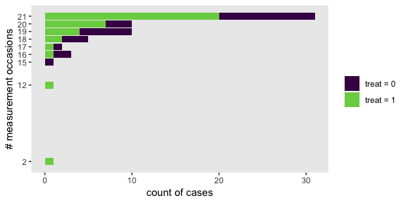

For this section, our basic model will be

$$
\\begin{align\*}
\\text{pos}\_{ij} & = \\pi\_{0i} + \\pi\_{1i} (\\text{time}\_{ij} - c) + \\epsilon\_{ij} \\\\
\\pi\_{0i}        & = \\gamma\_{00} + \\gamma\_{01} \\text{treat}\_i + \\zeta\_{0i} \\\\
\\pi\_{1i}        & = \\gamma\_{10} + \\gamma\_{11} \\text{treat}\_i + \\zeta\_{1i},
\\end{align\*}
$$

where *c* is a generic constant. For our there variants of time, *c* will be

-   0 for `time`,
-   3.3333333 for `time333`, and
-   6.666667 for `time667`.

Our criterion variable is `pos`, positive mood rating. The text told us these were from "a package of mood diaries (which use a five-point scale to assess positive and negative moods)" (p. 182). However, we don't know what numerals were assigned to the points on the scale, we don't know how many items were used, and we don't even know whether the items were taken from an existing questionnaire. And unfortunately, the citation Singer and Willett gave for the study is from a conference presentation, making it a pain to track down background information on the internet. In such a situation, it's difficult to figure out how to set our priors. Though suboptimal, we might first get a sense of the `pos` data with a histogram.

``` r
medication_pp %>% 
  ggplot(aes(x = pos)) +
  geom_histogram() +
  theme(panel.grid = element_blank())
```


Here's the `range()`.

``` r
range(medication_pp$pos)
```

    ## [1] 100.0000 466.6667

Starting with the prior for our intercept, I think there's a lot of room for argument, here. But to keep with our weakly-regularizing approach to priors, it might make sense to use something like `normal(200, 100)`. But then again, we know something about the study design. At the beginning, participants were in treatment for depression, so we'd expect the starting point to be closer to the lower end of the scale. In that case, we might update our approach to something like `normal(150, 50)`. Feel free to play with alternatives. What I hope this illustrates is that our task would be much easier with more domain knowledge.

Anyway, given the scale of the data, weakly-regularizing priors for the predictor variables might take the form of something like `normal(0, 25)`. We'll use `student_t(0, 50)` on the *σ*s and stay steady with `lkj(4)` on *ρ*<sub>01</sub>.

Here we fit the model with all three versions of `time`.

``` r
fit16 <-
  brm(data = medication_pp, 
      family = gaussian,
      pos ~ 0 + intercept + time + treat + time:treat + (1 + time | id),
      prior = c(prior(normal(150, 50), class = b, coef = "intercept"),
                prior(normal(0, 25),   class = b),
                prior(student_t(3, 0, 50), class = sd),
                prior(student_t(3, 0, 50), class = sigma),
                prior(lkj(4), class = cor)),
      iter = 2000, warmup = 1000, chains = 4, cores = 4,
      seed = 5)

fit17 <-
  update(fit16,
         newdata = medication_pp,
         pos ~ 0 + intercept + time333 + treat + time333:treat + (1 + time333 | id),
         iter = 2000, warmup = 1000, chains = 4, cores = 4,
         seed = 5)

fit18 <-
  update(fit16,
         newdata = medication_pp,
         pos ~ 0 + intercept + time667 + treat + time667:treat + (1 + time667 | id),
         iter = 2000, warmup = 1000, chains = 4, cores = 4,
         seed = 5)
```

Given the size of our posterior standard deviations, our *γ* posteriors are quite comparable to the point estimates (and their standard errors) in the text.

``` r
print(fit16)
```

    ##  Family: gaussian 
    ##   Links: mu = identity; sigma = identity 
    ## Formula: pos ~ 0 + intercept + time + treat + time:treat + (1 + time | id) 
    ##    Data: medication_pp (Number of observations: 1242) 
    ## Samples: 4 chains, each with iter = 2000; warmup = 1000; thin = 1;
    ##          total post-warmup samples = 4000
    ## 
    ## Group-Level Effects: 
    ## ~id (Number of levels: 64) 
    ##                     Estimate Est.Error l-95% CI u-95% CI Eff.Sample Rhat
    ## sd(Intercept)          46.98      4.66    38.51    56.75       1385 1.00
    ## sd(time)                8.27      0.96     6.58    10.28       1334 1.00
    ## cor(Intercept,time)    -0.29      0.13    -0.52    -0.03       1144 1.00
    ## 
    ## Population-Level Effects: 
    ##            Estimate Est.Error l-95% CI u-95% CI Eff.Sample Rhat
    ## intercept    166.79      9.29   148.52   184.74        874 1.00
    ## time          -2.39      1.80    -5.95     1.22       1073 1.00
    ## treat         -2.40     11.21   -24.55    19.90       1002 1.00
    ## time:treat     5.41      2.33     0.84     9.82       1148 1.00
    ## 
    ## Family Specific Parameters: 
    ##       Estimate Est.Error l-95% CI u-95% CI Eff.Sample Rhat
    ## sigma    35.12      0.74    33.68    36.63       5536 1.00
    ## 
    ## Samples were drawn using sampling(NUTS). For each parameter, Eff.Sample 
    ## is a crude measure of effective sample size, and Rhat is the potential 
    ## scale reduction factor on split chains (at convergence, Rhat = 1).

Given the scales we're working with, it's difficult to compare our *σ* summaries with the *σ*<sup>2</sup> summaries in Table 5.10 of the text. Here we convert and resummarize.

``` r
v <-
  posterior_samples(fit16) %>%
  transmute(sigma_2_0 = sd_id__Intercept^2,
            sigma_2_1 = sd_id__time^2,
            sigma_2_epsilon = sigma^2)

v %>% 
  gather() %>% 
  group_by(key) %>% 
  median_qi() %>% 
  mutate_if(is.double, round, digits = 2)
```

    ## # A tibble: 3 x 7
    ##   key              value .lower .upper .width .point .interval
    ##   <chr>            <dbl>  <dbl>  <dbl>  <dbl> <chr>  <chr>    
    ## 1 sigma_2_0       2184.  1483.   3220.   0.95 median qi       
    ## 2 sigma_2_1         67.0   43.2   106.   0.95 median qi       
    ## 3 sigma_2_epsilon 1233.  1134.   1342.   0.95 median qi

Turns out the posterior medians are quite similar to the ML estimates in the text. Here's what the entire distributions looks like.

``` r
v %>% 
  set_names("sigma[0]^2", "sigma[1]^2", "sigma[epsilon]^2") %>% 
  gather() %>%
  
  ggplot(aes(x = value, y = 0)) +
  geom_halfeyeh(.width = .95, scale = "width") +
  scale_y_continuous(NULL, breaks = NULL) +
  xlab("posterior") +
  theme(panel.grid = element_blank(),
        strip.text = element_text(size = 11)) +
  facet_wrap(~key, scales = "free", labeller = label_parsed)
```

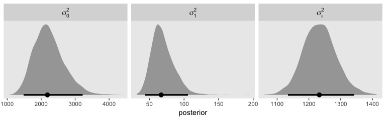

Here's our version of Figure 5.5.

``` r
nd <-
  tibble(treat = 0:1) %>% 
  expand(treat,
         time = seq(from = 0, to = 7, length.out = 30))

text <-
  tibble(treat = 0:1,
         time  = 4,
         y     = c(135, 197),
         label = c("control", "treatment"),
         angle = c(350, 15))

fitted(fit16,
       newdata = nd,
       re_formula = NA) %>% 
  data.frame() %>% 
  bind_cols(nd) %>% 
  
  ggplot(aes(x = time, fill = treat, color = treat, group = treat)) +
  geom_ribbon(aes(ymin = Q2.5, ymax = Q97.5),
              alpha = 1/3, size = 0) +
  geom_line(aes(y = Estimate)) +
  geom_text(data = text,
            aes(y = y, label = label, angle = angle)) +
  scale_fill_viridis_c(option = "A", begin = .3, end = .6) +
  scale_color_viridis_c(option = "A", begin = .3, end = .6) +
  labs(x = "days",
       y = "pos") +
  theme(panel.grid = element_blank(),
        legend.position = "none")
```

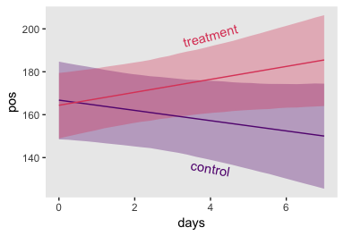

Although we still have clear evidence of an interaction, adding those 95% intervals makes it look less impressive, doesn't it?

Here are the summaries for the models with the alternative versions of (time<sub>*i**j*</sub> − *c*).

``` r
print(fit17)
```

    ##  Family: gaussian 
    ##   Links: mu = identity; sigma = identity 
    ## Formula: pos ~ intercept + time333 + treat + (1 + time333 | id) + time333:treat - 1 
    ##    Data: medication_pp (Number of observations: 1242) 
    ## Samples: 4 chains, each with iter = 2000; warmup = 1000; thin = 1;
    ##          total post-warmup samples = 4000
    ## 
    ## Group-Level Effects: 
    ## ~id (Number of levels: 64) 
    ##                        Estimate Est.Error l-95% CI u-95% CI Eff.Sample Rhat
    ## sd(Intercept)             46.48      4.20    38.78    55.20        565 1.01
    ## sd(time333)                8.33      0.96     6.66    10.35       1222 1.00
    ## cor(Intercept,time333)     0.21      0.13    -0.04     0.45       1076 1.00
    ## 
    ## Population-Level Effects: 
    ##               Estimate Est.Error l-95% CI u-95% CI Eff.Sample Rhat
    ## intercept       160.98      8.51   144.71   178.23        269 1.01
    ## time333          -2.41      1.83    -5.99     1.19        769 1.00
    ## treat            12.86     11.05    -9.62    34.18        350 1.02
    ## time333:treat     5.47      2.38     1.00    10.20        757 1.00
    ## 
    ## Family Specific Parameters: 
    ##       Estimate Est.Error l-95% CI u-95% CI Eff.Sample Rhat
    ## sigma    35.11      0.74    33.69    36.61       3360 1.00
    ## 
    ## Samples were drawn using sampling(NUTS). For each parameter, Eff.Sample 
    ## is a crude measure of effective sample size, and Rhat is the potential 
    ## scale reduction factor on split chains (at convergence, Rhat = 1).

``` r
print(fit18)
```

    ##  Family: gaussian 
    ##   Links: mu = identity; sigma = identity 
    ## Formula: pos ~ intercept + time667 + treat + (1 + time667 | id) + time667:treat - 1 
    ##    Data: medication_pp (Number of observations: 1242) 
    ## Samples: 4 chains, each with iter = 2000; warmup = 1000; thin = 1;
    ##          total post-warmup samples = 4000
    ## 
    ## Group-Level Effects: 
    ## ~id (Number of levels: 64) 
    ##                        Estimate Est.Error l-95% CI u-95% CI Eff.Sample Rhat
    ## sd(Intercept)             57.55      5.39    48.21    69.20       1402 1.00
    ## sd(time667)                8.02      0.90     6.40     9.94       1612 1.00
    ## cor(Intercept,time667)     0.59      0.09     0.39     0.74       2133 1.00
    ## 
    ## Population-Level Effects: 
    ##               Estimate Est.Error l-95% CI u-95% CI Eff.Sample Rhat
    ## intercept       157.13     10.11   137.46   177.44       1030 1.01
    ## time667          -1.84      1.65    -5.03     1.52       1594 1.01
    ## treat            24.42     12.65    -0.91    49.27       1107 1.01
    ## time667:treat     4.60      2.11     0.46     8.61       1656 1.00
    ## 
    ## Family Specific Parameters: 
    ##       Estimate Est.Error l-95% CI u-95% CI Eff.Sample Rhat
    ## sigma    35.13      0.74    33.68    36.59       4952 1.00
    ## 
    ## Samples were drawn using sampling(NUTS). For each parameter, Eff.Sample 
    ## is a crude measure of effective sample size, and Rhat is the potential 
    ## scale reduction factor on split chains (at convergence, Rhat = 1).

It might be easier to compare the *γ*s across models with a well-designed coefficient plot. Here’s an attempt.

``` r
tibble(name    = str_c("fit", 16:18)) %>% 
  mutate(fit   = map(name, get)) %>% 
  mutate(fixef = map(fit, ~fixef(.) %>% data.frame() %>% rownames_to_column("parameter"))) %>% 
  unnest(fixef) %>% 
  mutate(gamma = rep(c("gamma[0][0]", "gamma[1][0]", "gamma[0][1]", "gamma[1][1]"), times = 3)) %>% 
  
  ggplot(aes(x = name, y = Estimate, ymin = Q2.5, ymax = Q97.5)) +
  geom_pointrange() +
  xlab(NULL) +
  coord_flip() +
  theme(panel.grid = element_blank(),
        strip.text = element_text(size = 11),
        axis.ticks.y = element_blank()) +
  facet_wrap(~gamma, scales = "free_x", labeller = label_parsed, ncol = 4)
```

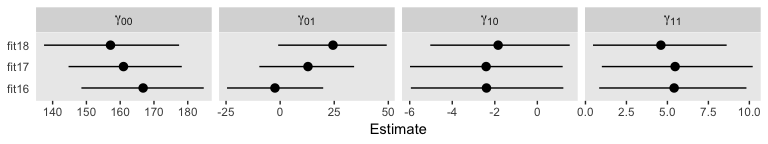

Since we're juggling less information, we might compare the posteriors for *σ*<sub>1</sub><sup>2</sup> across the three models with good old `tidybayes::geom_halfeyeh()`.

``` r
tibble(name        = str_c("fit", 16:18)) %>% 
  mutate(fit       = map(name, get)) %>% 
  mutate(sigma_2_1 = map(fit, ~VarCorr(., summary = F)[[1]][[1]][, 1]^2 %>% 
                           data.frame() %>% 
                           set_names("sigma_2_1"))) %>% 
  unnest(sigma_2_1) %>% 
  
  ggplot(aes(x = sigma_2_1, y = name)) +
  geom_halfeyeh(.width = c(.5, .95)) +
  labs(x = expression(sigma[1]^2),
       y = NULL) +
  theme(panel.grid   = element_blank(),
        axis.ticks.y = element_blank())
```


For kicks and giggles, we marked off both 50% and 95% intervals for each. Here's the same for *ρ*<sub>01</sub>.

``` r
tibble(name        = str_c("fit", 16:18)) %>% 
  mutate(fit       = map(name, get)) %>% 
  mutate(rho = map(fit, ~VarCorr(., summary = F)[[1]][[2]][, 2, "Intercept"] %>% 
                           data.frame() %>% 
                           set_names("rho"))) %>% 
  unnest(rho) %>% 
  
  ggplot(aes(x = rho, y = name)) +
  geom_halfeyeh(.width = c(.5, .95)) +
  coord_cartesian(xlim = -1:1) +
  labs(x = expression(rho[0][1]),
       y = NULL) +
  theme(panel.grid   = element_blank(),
        axis.ticks.y = element_blank())
```


"As [Rogosa and Willett (1985)](https://link.springer.com/content/pdf/10.1007/BF02294247.pdf) demonstrate, you can always alter the correlation between the level-1 growth parameters simply by changing the centering constant" (p. 186).

Here are the WAIC comparisons.

``` r
fit16 <- add_criterion(fit16, "waic")
fit17 <- add_criterion(fit17, "waic")
fit18 <- add_criterion(fit18, "waic")

loo_compare(fit16, fit17, fit18, criterion = "waic") %>% 
  print(simplify = F)
```

    ##       elpd_diff se_diff elpd_waic se_elpd_waic p_waic  se_p_waic waic    se_waic
    ## fit18     0.0       0.0 -6241.7      41.3        109.4     7.4   12483.4    82.6
    ## fit17    -0.3       0.5 -6242.0      41.5        110.5     7.6   12484.0    82.9
    ## fit16    -1.3       0.7 -6243.0      41.5        111.2     7.7   12486.0    83.1

``` r
model_weights(fit16, fit17, fit18, weights = "waic") %>% 
  round(digits = 3)
```

    ## fit16 fit17 fit18 
    ## 0.137 0.369 0.494

As one might hope, not much going on.

As Singer and Willett alluded to in the text (p. 187), the final model in this chapter is an odd one. Do note the `initial` and `final` columns in the data.

``` r
glimpse(medication_pp)
```

    ## Observations: 1,242
    ## Variables: 12
    ## $ id          <int> 1, 1, 1, 1, 1, 1, 1, 1, 1, 1, 1, 1, 1, 1, 1, 1, 1, 1, 1, 1, 10, 10, 10, 10, 1…
    ## $ treat       <int> 1, 1, 1, 1, 1, 1, 1, 1, 1, 1, 1, 1, 1, 1, 1, 1, 1, 1, 1, 1, 1, 1, 1, 1, 1, 1,…
    ## $ wave        <int> 1, 2, 3, 4, 5, 6, 7, 8, 9, 10, 11, 12, 13, 14, 15, 16, 17, 19, 20, 21, 1, 2, …
    ## $ day         <int> 0, 0, 0, 1, 1, 1, 2, 2, 2, 3, 3, 3, 4, 4, 4, 5, 5, 6, 6, 6, 0, 0, 0, 1, 1, 1,…
    ## $ time.of.day <dbl> 0.0000000, 0.3333333, 0.6666667, 0.0000000, 0.3333333, 0.6666667, 0.0000000, …
    ## $ time        <dbl> 0.0000000, 0.3333333, 0.6666667, 1.0000000, 1.3333333, 1.6666667, 2.0000000, …
    ## $ time333     <dbl> -3.3333333, -3.0000000, -2.6666667, -2.3333333, -2.0000000, -1.6666667, -1.33…
    ## $ time667     <dbl> -6.6666667, -6.3333333, -6.0000000, -5.6666667, -5.3333333, -5.0000000, -4.66…
    ## $ initial     <dbl> 1.00, 0.95, 0.90, 0.85, 0.80, 0.75, 0.70, 0.65, 0.60, 0.55, 0.50, 0.45, 0.40,…
    ## $ final       <dbl> 0.00, 0.05, 0.10, 0.15, 0.20, 0.25, 0.30, 0.35, 0.40, 0.45, 0.50, 0.55, 0.60,…
    ## $ pos         <dbl> 106.6667, 100.0000, 100.0000, 100.0000, 100.0000, 100.0000, 100.0000, 100.000…
    ## $ reading     <chr> "8 am", "3 pm", "10 pm", "8 am", "3 pm", "10 pm", "8 am", "3 pm", "10 pm", "8…

With this model

$$
\\begin{align\*}
\\text{pos}\_{ij} & = \\pi\_{0i} \\bigg (\\frac{6.67 - \\text{time}\_{ij}}{6.67} \\bigg ) + \\pi\_{1i} \\bigg (\\frac {\\text{time}\_{ij}}{6.67} \\bigg ) + \\epsilon\_{ij} \\\\
\\pi\_{0i}        & = \\gamma\_{00} + \\gamma\_{01} \\text{treat}\_i + \\zeta\_{0i} \\\\
\\pi\_{1i}        & = \\gamma\_{10} + \\gamma\_{11} \\text{treat}\_i + \\zeta\_{1i}.
\\end{align\*}
$$

Because of the parameterization, we'll use both variables simultaneously to indicate time. In the code, below, you’ll notice we no longer have an intercept parameter. Rather, we just have `initial` and `final`. As such, both of those parameters get the same prior we've been using for the intercept in the previous models.

``` r
fit19 <-
  brm(data = medication_pp, 
      family = gaussian,
      pos ~ 0 + initial + final + initial:treat + final:treat + (0 + initial + final | id),
      prior = c(prior(normal(150, 50), class = b, coef = "initial"),
                prior(normal(150, 50), class = b, coef = "final"),
                prior(normal(0, 25),   class = b),
                prior(student_t(3, 0, 50), class = sd),
                prior(student_t(3, 0, 50), class = sigma),
                prior(lkj(4), class = cor)),
      iter = 2000, warmup = 1000, chains = 4, cores = 4,
      seed = 5)
```

Our results are quite similar to those in the text.

``` r
print(fit19)
```

    ##  Family: gaussian 
    ##   Links: mu = identity; sigma = identity 
    ## Formula: pos ~ 0 + initial + final + initial:treat + final:treat + (0 + initial + final | id) 
    ##    Data: medication_pp (Number of observations: 1242) 
    ## Samples: 4 chains, each with iter = 2000; warmup = 1000; thin = 1;
    ##          total post-warmup samples = 4000
    ## 
    ## Group-Level Effects: 
    ## ~id (Number of levels: 64) 
    ##                    Estimate Est.Error l-95% CI u-95% CI Eff.Sample Rhat
    ## sd(initial)           47.02      4.61    39.05    56.99       1994 1.00
    ## sd(final)             59.14      5.60    49.24    71.50       1952 1.00
    ## cor(initial,final)     0.42      0.11     0.18     0.63       1727 1.00
    ## 
    ## Population-Level Effects: 
    ##               Estimate Est.Error l-95% CI u-95% CI Eff.Sample Rhat
    ## initial         167.53      9.06   149.91   185.95       1915 1.00
    ## final           155.95     10.54   135.76   176.77       2311 1.00
    ## initial:treat    -4.04     11.29   -26.14    18.11       1993 1.00
    ## final:treat      25.32     13.18    -0.81    51.30       2686 1.00
    ## 
    ## Family Specific Parameters: 
    ##       Estimate Est.Error l-95% CI u-95% CI Eff.Sample Rhat
    ## sigma    35.11      0.75    33.65    36.59       5461 1.00
    ## 
    ## Samples were drawn using sampling(NUTS). For each parameter, Eff.Sample 
    ## is a crude measure of effective sample size, and Rhat is the potential 
    ## scale reduction factor on split chains (at convergence, Rhat = 1).

Let's finish up with the WAIC.

``` r
fit19 <- add_criterion(fit19, "waic")

loo_compare(fit16, fit17, fit18, fit19, criterion = "waic") %>% 
  print(simplify = F)
```

    ##       elpd_diff se_diff elpd_waic se_elpd_waic p_waic  se_p_waic waic    se_waic
    ## fit19     0.0       0.0 -6241.5      41.5        110.5     7.6   12483.1    82.9
    ## fit18    -0.2       0.7 -6241.7      41.3        109.4     7.4   12483.4    82.6
    ## fit17    -0.5       0.5 -6242.0      41.5        110.5     7.6   12484.0    82.9
    ## fit16    -1.4       0.6 -6243.0      41.5        111.2     7.7   12486.0    83.1

``` r
model_weights(fit16, fit17, fit18, fit19, weights = "waic") %>% 
  round(digits = 3)
```

    ## fit16 fit17 fit18 fit19 
    ## 0.087 0.233 0.312 0.369

All about the same.

Reference
---------

[Singer, J. D., & Willett, J. B. (2003). *Applied longitudinal data analysis: Modeling change and event occurrence*. New York, NY, US: Oxford University Press.](https://www.oxfordscholarship.com/view/10.1093/acprof:oso/9780195152968.001.0001/acprof-9780195152968)

Session info
------------

``` r
sessionInfo()
```

    ## R version 3.5.1 (2018-07-02)
    ## Platform: x86_64-apple-darwin15.6.0 (64-bit)
    ## Running under: macOS High Sierra 10.13.6
    ## 
    ## Matrix products: default
    ## BLAS: /Library/Frameworks/R.framework/Versions/3.5/Resources/lib/libRblas.0.dylib
    ## LAPACK: /Library/Frameworks/R.framework/Versions/3.5/Resources/lib/libRlapack.dylib
    ## 
    ## locale:
    ## [1] en_US.UTF-8/en_US.UTF-8/en_US.UTF-8/C/en_US.UTF-8/en_US.UTF-8
    ## 
    ## attached base packages:
    ## [1] parallel  stats     graphics  grDevices utils     datasets  methods   base     
    ## 
    ## other attached packages:
    ##  [1] bayesplot_1.7.0      tidybayes_1.0.4      brms_2.8.8           Rcpp_1.0.1          
    ##  [5] rstan_2.18.2         StanHeaders_2.18.0-1 forcats_0.3.0        stringr_1.4.0       
    ##  [9] dplyr_0.8.0.1        purrr_0.2.5          readr_1.1.1          tidyr_0.8.1         
    ## [13] tibble_2.1.1         ggplot2_3.1.1        tidyverse_1.2.1     
    ## 
    ## loaded via a namespace (and not attached):
    ##  [1] nlme_3.1-137              matrixStats_0.54.0        xts_0.10-2               
    ##  [4] lubridate_1.7.4           threejs_0.3.1             httr_1.3.1               
    ##  [7] LaplacesDemon_16.1.1      rprojroot_1.3-2           tools_3.5.1              
    ## [10] backports_1.1.4           DT_0.4                    utf8_1.1.4               
    ## [13] R6_2.3.0                  lazyeval_0.2.2            colorspace_1.3-2         
    ## [16] withr_2.1.2               tidyselect_0.2.5          gridExtra_2.3            
    ## [19] prettyunits_1.0.2         processx_3.2.1            Brobdingnag_1.2-6        
    ## [22] compiler_3.5.1            cli_1.0.1                 rvest_0.3.2              
    ## [25] arrayhelpers_1.0-20160527 shinyjs_1.0               xml2_1.2.0               
    ## [28] colourpicker_1.0          labeling_0.3              scales_1.0.0             
    ## [31] dygraphs_1.1.1.5          mvtnorm_1.0-10            ggridges_0.5.0           
    ## [34] callr_3.1.0               digest_0.6.18             rmarkdown_1.10           
    ## [37] base64enc_0.1-3           pkgconfig_2.0.2           htmltools_0.3.6          
    ## [40] highr_0.7                 htmlwidgets_1.2           rlang_0.3.4              
    ## [43] readxl_1.1.0              rstudioapi_0.7            shiny_1.1.0              
    ## [46] svUnit_0.7-12             generics_0.0.2            zoo_1.8-2                
    ## [49] jsonlite_1.5              gtools_3.8.1              crosstalk_1.0.0          
    ## [52] inline_0.3.15             magrittr_1.5              loo_2.1.0                
    ## [55] Matrix_1.2-14             munsell_0.5.0             fansi_0.4.0              
    ## [58] abind_1.4-5               stringi_1.4.3             yaml_2.1.19              
    ## [61] MASS_7.3-50               ggstance_0.3              pkgbuild_1.0.2           
    ## [64] plyr_1.8.4                grid_3.5.1                promises_1.0.1           
    ## [67] crayon_1.3.4              miniUI_0.1.1.1            lattice_0.20-35          
    ## [70] haven_1.1.2               hms_0.4.2                 knitr_1.20               
    ## [73] ps_1.2.1                  pillar_1.3.1              igraph_1.2.1             
    ## [76] markdown_0.8              shinystan_2.5.0           codetools_0.2-15         
    ## [79] reshape2_1.4.3            stats4_3.5.1              rstantools_1.5.1         
    ## [82] glue_1.3.1.9000           evaluate_0.10.1           modelr_0.1.2             
    ## [85] httpuv_1.4.4.2            cellranger_1.1.0          gtable_0.3.0             
    ## [88] assertthat_0.2.0          mime_0.5                  xtable_1.8-2             
    ## [91] broom_0.5.1               coda_0.19-2               later_0.7.3              
    ## [94] rsconnect_0.8.8           viridisLite_0.3.0         shinythemes_1.1.1        
    ## [97] bridgesampling_0.6-0
