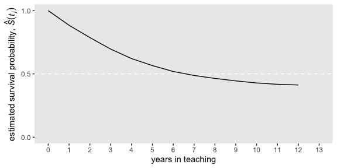
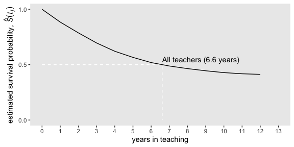
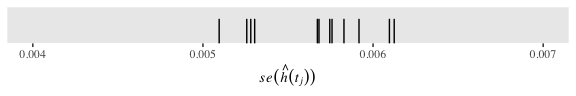
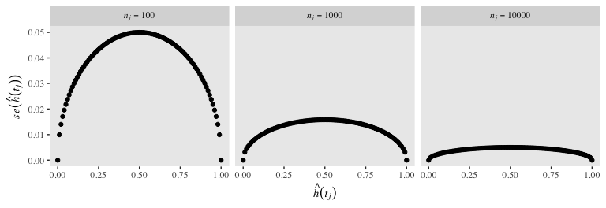
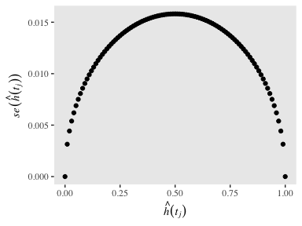
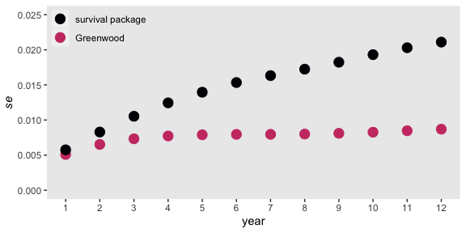
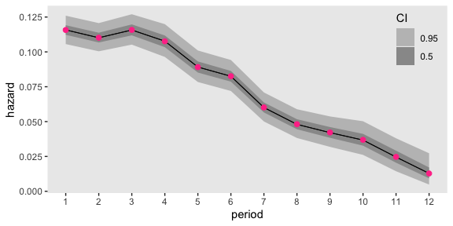
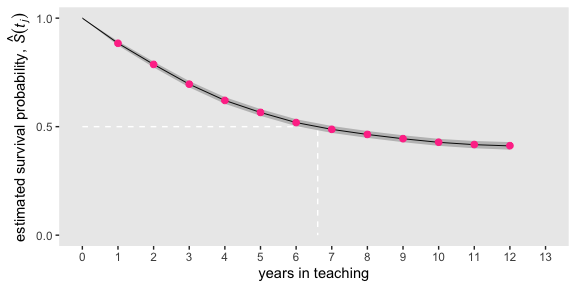
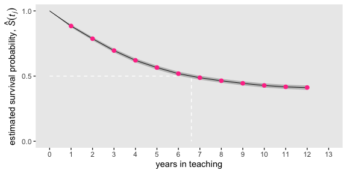

Chapter 10. Describing Discrete-Time Event Occurrence Data
================
A Solomon Kurz
2020-03-14

# Describing Discrete-Time Event Occurrence Data

> In this chapter, \[Singer and Willett presented\] a framework for
> describing discrete-time event occurrence data…. As we will \[see\],
> the conceptual linchpin for all subsequent survival methods is to
> approach the analysis on a period-by-period basis. This allows you to
> examine event occurrence sequentially among those individuals eligible
> to experience the event at each discrete point in time. (p. 325)

## 10.1 The life table

> The fundamental tool for summarizing the sample distribution of event
> occurrence is the *life table*. As befits its name, a life table
> tracks the event histories (the “lives”) of a sample of individuals
> from the beginning of time (when no one has yet experienced the target
> event) through the end of data collection. (p. 326, *emphasis* in the
> original)

To make a life table as presented in Table 10.1, we need to load the
`teachers.csv` data.

``` r
library(tidyverse)

teachers <- read_csv("data/teachers.csv")

glimpse(teachers)
```

    ## Observations: 3,941
    ## Variables: 3
    ## $ id     <dbl> 1, 2, 3, 4, 5, 6, 7, 8, 9, 10, 12, 13, 14, 15, 16, 17, 18, 19, 20, 21, 22, 23, 24,…
    ## $ t      <dbl> 1, 2, 1, 1, 12, 1, 12, 1, 2, 2, 7, 12, 1, 12, 12, 2, 12, 1, 3, 2, 12, 12, 9, 12, 2…
    ## $ censor <dbl> 0, 0, 0, 0, 1, 0, 1, 0, 0, 0, 0, 1, 0, 1, 1, 0, 1, 0, 0, 0, 1, 1, 0, 1, 0, 0, 0, 0…

Perhaps the easiest way to make a life table as presented in Table 10.1
is with help from the [**survival**
package](https://CRAN.R-project.org/package=survival).

``` r
# install.packages("survival", dependencies = T)
library(survival)
```

Here we’ll use the `survfit()` function to compute survival curves.
Within the `survfit()` function, we’ll use the `Surv()` function to make
a survival object, which will become the criterion within the model
formula. It takes two basic arguments, `time` and `event`. With the
`teachers` data, `t` is time in years. In the data, events are encoded
in `censor`. However, it’s important to understand how the `event`
argument expects the data. From the [**survival** reference
manual](https://cran.r-project.org/web/packages/survival/survival.pdf),
we read that `event` is “the status indicator, normally `0=alive`,
`1=dead`. Other choices are `TRUE/FALSE` (`TRUE = death`) or `1/2`
(`2=death`).” Note that whereas within our data `censor` is coded `0 =
event` `1 = censored`, the `event` argument expects the opposite. A
quick way to solve that is to enter `1 - censor`.

``` r
fit1 <- survfit(data = teachers,
                Surv(t, 1 - censor) ~ 1)
```

Use the `str()` function to survey the results.

``` r
fit1 %>% str()
```

    ## List of 16
    ##  $ n        : int 3941
    ##  $ time     : num [1:12] 1 2 3 4 5 6 7 8 9 10 ...
    ##  $ n.risk   : num [1:12] 3941 3485 3101 2742 2447 ...
    ##  $ n.event  : num [1:12] 456 384 359 295 218 184 123 79 53 35 ...
    ##  $ n.censor : num [1:12] 0 0 0 0 0 0 280 307 255 265 ...
    ##  $ surv     : num [1:12] 0.884 0.787 0.696 0.621 0.566 ...
    ##  $ std.err  : num [1:12] 0.00576 0.00829 0.01053 0.01245 0.01396 ...
    ##  $ cumhaz   : num [1:12] 0.116 0.226 0.342 0.449 0.538 ...
    ##  $ std.chaz : num [1:12] 0.00542 0.00781 0.00992 0.01173 0.01319 ...
    ##  $ type     : chr "right"
    ##  $ logse    : logi TRUE
    ##  $ conf.int : num 0.95
    ##  $ conf.type: chr "log"
    ##  $ lower    : num [1:12] 0.874 0.774 0.682 0.606 0.55 ...
    ##  $ upper    : num [1:12] 0.894 0.8 0.71 0.636 0.581 ...
    ##  $ call     : language survfit(formula = Surv(t, 1 - censor) ~ 1, data = teachers)
    ##  - attr(*, "class")= chr "survfit"

We can retrieve the values for the “Year” column from `fit1$time`. The
values in the “Time interval” column are a simple transformation from
there.

``` r
fit1$time
```

    ##  [1]  1  2  3  4  5  6  7  8  9 10 11 12

We can find the values in the “Employed at the beginning of the year”
column in `fit1$n.risk` and those in the “Who left during the year”
column in `fit1$n.event`.

``` r
fit1$n.risk
```

    ##  [1] 3941 3485 3101 2742 2447 2229 2045 1642 1256  948  648  391

``` r
fit1$n.event
```

    ##  [1] 456 384 359 295 218 184 123  79  53  35  16   5

We’ll have to work a little harder to compute the values in the
“Censored at the end of the year column.” Here we’ll walk it through
in a data frame format.

``` r
data.frame(n_risk  = fit1$n.risk,
           n_event = fit1$n.event) %>% 
  mutate(n_risk_1 = lead(n_risk, default = 0)) %>% 
  mutate(n_censored = n_risk - n_event - n_risk_1)
```

    ##    n_risk n_event n_risk_1 n_censored
    ## 1    3941     456     3485          0
    ## 2    3485     384     3101          0
    ## 3    3101     359     2742          0
    ## 4    2742     295     2447          0
    ## 5    2447     218     2229          0
    ## 6    2229     184     2045          0
    ## 7    2045     123     1642        280
    ## 8    1642      79     1256        307
    ## 9    1256      53      948        255
    ## 10    948      35      648        265
    ## 11    648      16      391        241
    ## 12    391       5        0        386

That is, to get the number of those censored at the end of a given year,
you take the number employed at the beginning of that year, subtract the
number of those who left (i.e., the number who experienced the “event”),
and then subtract the number of those employed at the beginning of the
next year. Notice our use of the `dplyr::lead()` function to get the
number employed in the next year (learn more about that function
[here](https://dplyr.tidyverse.org/reference/lead-lag.html)).

To get the values in the “Teachers at the beginning of the year who left
during the year” column, which is in a proportion metric, we use
division.

``` r
fit1$n.event / fit1$n.risk
```

    ##  [1] 0.11570667 0.11018651 0.11576911 0.10758570 0.08908868 0.08254823 0.06014670 0.04811206
    ##  [9] 0.04219745 0.03691983 0.02469136 0.01278772

Finally, to pull the values in the “All teachers still employed at the
end of the year” column, we just execute
    `fit1$surv`.

``` r
fit1$surv
```

    ##  [1] 0.8842933 0.7868561 0.6957625 0.6209084 0.5655925 0.5189038 0.4876935 0.4642295 0.4446402
    ## [10] 0.4282242 0.4176508 0.4123100

Let’s put that all together in a tibble.

``` r
most_rows <-
  tibble(year = fit1$time) %>% 
  mutate(time_int   = str_c("[", year, ", ", year + 1, ")"), 
         n_employed = fit1$n.risk, 
         n_left     = fit1$n.event) %>% 
  mutate(n_censored   = n_employed - n_left - lead(n_employed, default = 0),
         hazard_fun   = n_left / n_employed,
         survivor_fun = fit1$surv)

most_rows
```

    ## # A tibble: 12 x 7
    ##     year time_int n_employed n_left n_censored hazard_fun survivor_fun
    ##    <dbl> <chr>         <dbl>  <dbl>      <dbl>      <dbl>        <dbl>
    ##  1     1 [1, 2)         3941    456          0     0.116         0.884
    ##  2     2 [2, 3)         3485    384          0     0.110         0.787
    ##  3     3 [3, 4)         3101    359          0     0.116         0.696
    ##  4     4 [4, 5)         2742    295          0     0.108         0.621
    ##  5     5 [5, 6)         2447    218          0     0.0891        0.566
    ##  6     6 [6, 7)         2229    184          0     0.0825        0.519
    ##  7     7 [7, 8)         2045    123        280     0.0601        0.488
    ##  8     8 [8, 9)         1642     79        307     0.0481        0.464
    ##  9     9 [9, 10)        1256     53        255     0.0422        0.445
    ## 10    10 [10, 11)        948     35        265     0.0369        0.428
    ## 11    11 [11, 12)        648     16        241     0.0247        0.418
    ## 12    12 [12, 13)        391      5        386     0.0128        0.412

The only thing missing from our version of Table 10.1 is we don’t have a
row for Year 0. Here’s a quick and dirty way to manually insert those
values.

``` r
row_1 <-
  tibble(year         = 0, 
         time_int     = "[0, 1)", 
         n_employed   = fit1$n.risk[1], 
         n_left       = NA, 
         n_censored   = NA, 
         hazard_fun   = NA, 
         survivor_fun = 1)

d <-
  bind_rows(row_1,
            most_rows)

d
```

    ## # A tibble: 13 x 7
    ##     year time_int n_employed n_left n_censored hazard_fun survivor_fun
    ##    <dbl> <chr>         <dbl>  <dbl>      <dbl>      <dbl>        <dbl>
    ##  1     0 [0, 1)         3941     NA         NA    NA             1    
    ##  2     1 [1, 2)         3941    456          0     0.116         0.884
    ##  3     2 [2, 3)         3485    384          0     0.110         0.787
    ##  4     3 [3, 4)         3101    359          0     0.116         0.696
    ##  5     4 [4, 5)         2742    295          0     0.108         0.621
    ##  6     5 [5, 6)         2447    218          0     0.0891        0.566
    ##  7     6 [6, 7)         2229    184          0     0.0825        0.519
    ##  8     7 [7, 8)         2045    123        280     0.0601        0.488
    ##  9     8 [8, 9)         1642     79        307     0.0481        0.464
    ## 10     9 [9, 10)        1256     53        255     0.0422        0.445
    ## 11    10 [10, 11)        948     35        265     0.0369        0.428
    ## 12    11 [11, 12)        648     16        241     0.0247        0.418
    ## 13    12 [12, 13)        391      5        386     0.0128        0.412

We might walk out the notation in our `time_int` column a bit. Those
intervals

> reflect a standard partition of time, in which each interval
> *includes* the initial time and *excludes* the concluding time.
> Adopting common mathematical notation, \[brackets\] denote inclusions
> and (parentheses) denote exclusions. Thus, we bracket each interval’s
> initial time and place a parenthesis around its concluding time.
> (p. 328, *emphasis* in the original)

The values in the `n_employed` column the *risk set*, those who are
“*eligible* to experience the event during that interval” (p. 329,
*emphasis* in the
original).

## 10.2 A framework for characterizing the distribution of discrete-time event occurrence data

> The fundamental quantity used to assess the risk of event occurrence
> in each discrete time period is known as *hazard.* Denoted by
> \(h(t_{ij})\), discrete time hazard is the *conditional probability
> that individual* \(i\) *will experience the event time in period*
> \(j\), *given that he or she did not experience it in any earlier time
> period*. Because hazard represents the risk of the event occurrence in
> each discrete time period among those people eligible to experience
> the event (those in the risk set) hazard tells us precisely what we
> want to know: whether and when events occurs. (p. 330, *emphasis* in
> the original)

If we let \(T_i\) stand for the discrete value in time person \(i\)
experiences the event, we can express the conditional probability the
event might occur in the \(j^\text{th}\) interval as

\[h(t_{ij}) = \text{Pr}[T_i = j | T \geq j].\]

That last part, \(T \geq j\), clarifies the event can only occur once
and, therefore, cannot have occurred in any of the prior levels of
\(j\). More plainly put, imagine the event is death and person \(i\)
died during the period of \(T_j = 20\). In such a case, it’s nonsensical
to speak of that \(i^\text{th}\) person’s hazard for the period of
\(T_j = 25\). They’re already dead.

Also, “the discrete-time hazard probabilities expressed as a function of
time–labeled \(h(t_{ij})\)–is known as the population *discrete-time
hazard function*” (p 330, *emphasis* in the original). That was
expressed in the 6<sup>th</sup> column in Table 10.1, which we called
`hazard_fun` in our `d` tibble.

``` r
d %>% 
  select(year, hazard_fun)
```

    ## # A tibble: 13 x 2
    ##     year hazard_fun
    ##    <dbl>      <dbl>
    ##  1     0    NA     
    ##  2     1     0.116 
    ##  3     2     0.110 
    ##  4     3     0.116 
    ##  5     4     0.108 
    ##  6     5     0.0891
    ##  7     6     0.0825
    ##  8     7     0.0601
    ##  9     8     0.0481
    ## 10     9     0.0422
    ## 11    10     0.0369
    ## 12    11     0.0247
    ## 13    12     0.0128

You might notice \(h(t_{ij})\) is in a proportion metric and it is not
cumulative. If you look above in the code, you’ll see we computed that
by `hazard_fun = n_left / n_employed`. More formally and generally, this
is an operationalization of

\[\hat h(t_{j}) = \frac{n \text{ events}_j}{n \text{ at risk}_j},\]

where \(n \text{ events}_j\) is the number of individuals who
experienced the event in the \(j^{th}\) period and
\(n \text{ at risk}_j\) is the number within the period who have not (a)
already experienced the event and (b) been censored. Also note that by
\(\hat h(t_{j})\), we’re indicating we’re talking about the maximum
likelihood estimate for \(h(t_{j})\). Because no one is at risk during
the initial time point, \(h(t_0)\) is undefined (i.e., `NA`). Here we
mimic the top panel of Figure 10.1 and plot our \(\hat h(t_{j})\) over
time.

``` r
d %>% 
  ggplot(aes(x = year, y = hazard_fun)) +
  geom_line() +
  scale_x_continuous("years in teaching", breaks = 0:13, limits = c(0, 13)) +
  scale_y_continuous(expression("estimated hazard probability, "*hat(italic(h))(italic(t[j]))), 
                     breaks = c(0, .05, .1, .15), limits = c(0, .15)) +
  theme(panel.grid = element_blank())
```

<!-- -->

### 10.2.2 Survivor function.

The survivor function provides another way of describing the
distribution of event occurrence over time. Unlike the hazard function,
which assesses the unique risk associated with each time period, the
survivor function cumulates these period-by-period risks of event
occurrence (or more properly, nonoccurrence) together to assess the
probability that a randomly selected individual will survive will not
experience the event.

We can formally define the survivor function, \(S(t_{ij})\), as

\[S(t_{ij}) = \text{Pr}[T > j],\]

where \(S\) is survival as a function of time, \(t\). But since our data
are finite, we can only have an estimate of the “true” survivor
function, which we call \(\hat S(t_{ij})\). Here it is in a plot, our
version of the bottom panel of Figure 10.1.

``` r
d %>% 
  ggplot(aes(x = year, y = survivor_fun)) +
  geom_hline(yintercept = .5, color = "white", linetype = 2) +
  geom_line() +
  scale_x_continuous("years in teaching", breaks = 0:13, limits = c(0, 13)) +
  scale_y_continuous(expression("estimated survival probability, "*hat(italic(S))(italic(t[j]))),
                     breaks = c(0, .5, 1), limits = c(0, 1)) +
  theme(panel.grid = element_blank())
```

<!-- -->

### 10.2.3 Median lifetime.

> Having characterized the *distribution* of event times using the
> hazard and survivor functions, we often want to identify the
> distribution’s center. Were there no censoring, all event times would
> be known, and we could compute a sample mean. But because of
> censoring, another estimate of central tendency is preferred: the
> *median lifetime*.
> 
> *The estimated median lifetime identifies that value for* \(T\) *for
> which the value of the estimated survivor function is .5*. It is the
> point in time by which we estimate that half of the sample has
> experienced the target event, half has not. (p. 337, *emphasis* in the
> original)

If we use `filter()`, well see our median lifetime rests between years 6
and 7.

``` r
d %>% 
  filter(year %in% c(6, 7)) %>%
  # this just simplifies the output
  select(year, time_int, survivor_fun)
```

    ## # A tibble: 2 x 3
    ##    year time_int survivor_fun
    ##   <dbl> <chr>           <dbl>
    ## 1     6 [6, 7)          0.519
    ## 2     7 [7, 8)          0.488

Using a simple descriptive approach, we’d just say the median lifetime
was between years 6 and 7. We could also follow [Miller
(1981)](https://books.google.com/books/about/Survival_Analysis.html?id=cttQAAAAMAAJ)
and linearly interpolate between the two values of \(S(t_j)\) bracketing
.5. If we let \(m\) be the time interval just before the median
lifetime, \(\hat S(t_m)\) be the value of the survivor function in that
\(m^\text{th}\) interval, and \(\hat S(t_{m + 1})\) be the survival
value in the next interval, the can
write

\[\text{Estimated median lifetime} = m + \Bigg [\frac{\hat S(t_m) - .5}{\hat S(t_m) - \hat S(t_{m + 1})} \Bigg ] ((m + 1) - m).\]

We can compute that by hand like so:

``` r
m        <- 6
m_plus_1 <- 7

stm <-
  d %>% 
  filter(year == m) %>% 
  pull(survivor_fun)

stm_plus_1 <-
  d %>% 
  filter(year == m_plus_1) %>% 
  pull(survivor_fun)

# compute the interpolated median lifetime and save it as `iml`
iml <- m + ((stm - .5) / (stm - stm_plus_1)) * ((m + 1) - m)
iml
```

    ## [1] 6.605691

Now we have the `iml` value, we can add that information to our version
of the lower panel of Figure 10.1.

``` r
line <-
  tibble(year         = c(0, iml, iml),
         survivor_fun = c(.5, .5, 0))

d %>% 
  ggplot(aes(x = year, y = survivor_fun)) +
  geom_path(data = line,
            color = "white", linetype = 2) +
  geom_line() +
  annotate(geom = "text",
           x = iml, y = .55,
           label = "All teachers (6.6 years)",
           hjust = 0) +
  scale_x_continuous("years in teaching", breaks = 0:13, limits = c(0, 13)) +
  scale_y_continuous(expression("estimated survival probability, "*hat(italic(S))(italic(t[j]))),
                     breaks = c(0, .5, 1), limits = c(0, 1)) +
  theme(panel.grid = element_blank())
```

<!-- -->

We can compute the estimates for the 5- and 10-year survival rates as a
direct algebraic transformation of the survival function from those
years.

``` r
d %>% 
  filter(year %in% c(5, 10)) %>% 
  select(year, survivor_fun) %>% 
  mutate(`survival rate (%)` = (100 * survivor_fun) %>% round(digits = 0))
```

    ## # A tibble: 2 x 3
    ##    year survivor_fun `survival rate (%)`
    ##   <dbl>        <dbl>               <dbl>
    ## 1     5        0.566                  57
    ## 2    10        0.428                  43

## 10.3 Developing intuition about hazard functions, survivor functions, and median lifetimes

> Developing intuition about these sample statistics requires exposure
> to estimates computed from a wide range of studies. To jump-start this
> process, we review results from four studies that differ across three
> salient dimensions–the type of event investigated, the metric used to
> record discrete time, and most important, the underlying profile of
> risk–and discuss how we would examine, and describe, the estimated
> hazard functions, survivor functions, and median lifetimes. (p. 339)

Here we load the four relevant data sets.

``` r
cocaine  <- read_csv("data/cocaine_relapse.csv")
sex      <- read_csv("data/firstsex.csv")
suicide  <- read_csv("data/suicide.csv")
congress <- read_csv("data/congress.csv")

# glimpse(cocaine)
# glimpse(sex)
# glimpse(suicide)
# glimpse(congress)
```

We have a lot of leg work in front of use before we can recreate Figure
10.2. First, we’ll feed each of the four data sets into the `survfit()`
function.

``` r
fit2 <- 
  survfit(data = cocaine,
          Surv(week, 1 - censor) ~ 1)

fit3 <- 
  survfit(data = sex,
          Surv(time, 1 - censor) ~ 1)

fit4 <- 
  survfit(data = suicide,
          Surv(time, 1 - censor) ~ 1)

fit5 <- 
  survfit(data = congress,
          Surv(time, 1 - censor) ~ 1)
```

Given the four fits all follow the same basic form and given our end
point is to make the same basic plots for each, we can substantially
streamline our code by making a series of custom functions. For our
first custom function, `make_lt()`, we’ll save the general steps for
making life tables for each data set.

``` r
make_lt <- function(fit) {
  
  # arrange the lt data for all rows but the first
  most_rows <-
    tibble(time = fit$time) %>% 
    mutate(time_int = str_c("[", time, ", ", time + 1, ")"), 
           n_risk   = fit$n.risk, 
           n_event  = fit$n.event) %>% 
    mutate(hazard_fun   = n_event / n_risk,
           survivor_fun = fit$surv)
  
  # define the values for t = 2 and t = 1
  time_1 <- fit$time[1]
  time_0 <- time_1 - 1
  
  # define the values for the row for which t = 1
  row_1 <-
    tibble(time         = time_0, 
           time_int     = str_c("[", time_0, ", ", time_1, ")"),
           n_risk       = fit$n.risk[1],
           n_event      = NA,
           hazard_fun   = NA, 
           survivor_fun = 1)
  
  # make the full life table
  lt <-
    bind_rows(row_1,
              most_rows)
  
  lt
  
}
```

Use `make_lt()` to make the four life tables.

``` r
lt_cocaine  <- make_lt(fit2)
lt_sex      <- make_lt(fit3)
lt_suicide  <- make_lt(fit4)
lt_congress <- make_lt(fit5)
```

You’ll note that the four survival curve plots in Figure 10.2 all show
the medial lifetime using the interpolation method. Here we’ll save the
necessary steps to compute that for each model as the `make_iml()`
function.

``` r
make_iml <- function(lt) {
  
  # lt is a generic name for a life table of the 
  # kind we made with our `make_lt()` function
  
  # determine the mth row
  lt_m <-
    lt %>% 
    filter(survivor_fun > .5) %>% 
    slice(n())
  
  # determine the row for m + 1
  lt_m1 <-
    lt %>% 
    filter(survivor_fun < .5) %>% 
    slice(1)
  
  # pull the value for m
  m  <- pull(lt_m, time)
  
  # pull the two survival function values
  stm  <- pull(lt_m, survivor_fun)
  stm1 <- pull(lt_m1, survivor_fun)
  
  # plug the values into Equation 10.6 (page 338)
  iml <- m + ((stm - .5) / (stm - stm1)) * ((m + 1) - m)
  
  iml
  
}
```

If you want, you can use `make_iml()` directly like this.

``` r
make_iml(lt_cocaine)
```

    ## [1] 7.5

However, our approach will be to wrap it in another function,
`line_tbl()`, with which we will save the coordinates necessary for
marking off the median lifetimes and them save them in a tibble.

``` r
line_tbl <- function(lt) {
  
  iml <- make_iml(lt)
  
  tibble(time         = c(lt[1, 1] %>% pull(), iml, iml),
         survivor_fun = c(.5, .5, 0))
  
}
```

It works like this.

``` r
line_tbl(lt_cocaine)
```

    ## # A tibble: 3 x 2
    ##    time survivor_fun
    ##   <dbl>        <dbl>
    ## 1  0             0.5
    ## 2  7.50          0.5
    ## 3  7.50          0

If you look closely at the hazard function plots in the left column of
Figure 10.2, you’ll note they share many common settings (e.g., the
basic shape, the label of the \(y\)-axis). But there are several
parameters we’ll need to set custom settings for. To my eye, those are:

  - the data;
  - the \(x\)-axis label, break points, and limits; and
  - the \(y\)-axis break points, and limits.

With our custom `h_plot()` function, we’ll leave those parameters free
while keeping all the other **ggplot2** parameters the same.

``` r
h_plot <- function(data = data, 
                   xlab = xlab, xbreaks = xbreaks, xlimits = xlimits,
                   ybreaks = ybreaks, ylimits = ylimits) {
  
  ggplot(data = data,
         mapping = aes(x = time, y = hazard_fun)) +
    geom_line() +
    scale_x_continuous(xlab, breaks = xbreaks, limits = xlimits) +
    scale_y_continuous(expression(widehat(italic(h(t)))), 
                       breaks = ybreaks, limits = ylimits) +
    theme(panel.grid = element_blank())
  
}
```

Now we’ll make a similar custom plotting function, `s_plot()`, for the
hazard function plots on the right column of Figure 10.2.

``` r
s_plot <- function(data = data, 
                   xlab = xlab, xbreaks = xbreaks, xlimits = xlimits) {
  
  # compute the imterpolated median life value
  iml <- make_iml(data)
  
  # make the imp line values
  line <-
    data %>% 
    line_tbl()
  
  ggplot(data = data,
         mapping = aes(x = time, y = survivor_fun)) +
    geom_path(data = line,
              color = "white", linetype = 2) +
    geom_line() +
    annotate(geom = "text",
             x = iml, y = .6,
             label = str_c("widehat(ML)==", iml %>% round(1)),
             size = 3, hjust = 0, parse = T) +
    scale_x_continuous(xlab, breaks = xbreaks, limits = xlimits) +
    scale_y_continuous(expression(widehat(italic(S(t)))),
                       breaks = c(0, .5, 1), limits = c(0, 1)) +
    theme(panel.grid = element_blank())
  
}
```

Now we make the eight subplots in bulk, naming them `p1`, `p2`, and so
on.

``` r
# cocaine
p1 <-
  lt_cocaine %>% 
  h_plot(xlab = "Weeks after release", 
         xbreaks = 0:12, xlimits = c(0, 12),
         ybreaks = c(0, .05, .1, .15), ylimits = c(0, .15))

p2 <-
  lt_cocaine %>% 
  s_plot(xlab = "Weeks after release", 
         xbreaks = 0:12, xlimits = c(0, 12))

# sex
p3 <-
  lt_sex %>% 
  h_plot(xlab = "Grade", 
         xbreaks = 6:12, xlimits = c(6, 12),
         ybreaks = 0:3 / 10, ylimits = c(0, .325))

p4 <-
  lt_sex %>% 
  s_plot(xlab = "Grade", 
         xbreaks = 6:12, xlimits = c(6, 12))

# suicide
p5 <-
  lt_suicide %>% 
  h_plot(xlab = "Age", 
         xbreaks = 1:9 * 2 + 3, xlimits = c(5, 22),
         ybreaks = c(0, .05, .1, .15), ylimits = c(0, .16))

p6 <-
  lt_suicide %>% 
  s_plot(xlab = "Age", 
         xbreaks = 1:9 * 2 + 3, xlimits = c(5, 22))

# congress
p7 <-
  lt_congress %>% 
  h_plot(xlab = "Terms in office", 
         xbreaks = 0:8, xlimits = c(0, 8),
         ybreaks = 0:3 / 10, ylimits = c(0, .3))

p8 <-
  lt_congress %>% 
  s_plot(xlab = "Terms in office", 
         xbreaks = 0:8, xlimits = c(0, 8))
```

Now we’ll use some functions and syntax from the **patchwork** package
to combine the subplots and make Figure 10.2.

``` r
library(patchwork)

p12 <- (p1 + p2) + plot_annotation(title = "A") & theme(plot.margin = margin(0, 5.5, 0, 5.5))
p34 <- (p3 + p4) + plot_annotation(title = "B") & theme(plot.margin = margin(0, 5.5, 0, 5.5))
p56 <- (p5 + p6) + plot_annotation(title = "C") & theme(plot.margin = margin(0, 5.5, 0, 5.5))
p78 <- (p7 + p8) + plot_annotation(title = "D") & theme(plot.margin = margin(0, 5.5, 0, 5.5))

(wrap_elements(p12) /
  wrap_elements(p34) /
  wrap_elements(p56) /
  wrap_elements(p78))
```

<!-- -->

Boom\! Looks like a
dream.

### 10.3.1 Identifying periods of high and low risk using hazard functions.

It can be useful to evaluate hazard functions based on whether they are
*monotonic* (i.e., have a single distinctive peak and single distinctive
trough) and *nonmonotonic* (i.e., have multiple distinctive peaks or
troughs). Globally speaking, the hazard functions for rows `A` and `B`
are monotonic and the remaining two are nonmonotonic.

Singer and Willett remarked “monotonically increasing hazard functions
are common when studying events that are ultimately inevitable (or near
universal)…. \[However,\] nonmonotonic hazard functions, like those in
Panels C and D, generally arise in studies of long duration” (p. 342).

However, when risk is constant over time, hazard functions will not have
peaks or
troughs.

### 10.3.2 Survivor functions as a context for evaluating the magnitude of hazard.

Unlike with hazard functions, all survivor functions decrease or stay
constant over time. They are monotonic (i.e., they never switch
direction, they never increase). From the text (p. 344), we learn three
ways hazard functions relate to survival functions:

  - *When hazard is high, the survivor function drops rapidly*.
  - *When hazard is low, the survivor function drops slowly*.
  - *When hazard is zero, the survivor function remains unchanged*.

### 10.3.3 Strengths and limitations of estimated median lifetimes.

> When examining a median lifetime, we find it helpful to remember three
> important limitations on its interpretation. First, it identifies only
> an “average” event time; it tells us little about the distribution of
> even times and is relatively insensitive to extreme values. Second,
> the median lifetime is not necessarily a moment when the target event
> is *especially* likely to occur…. Third, the median lifetime reveals
> little about the distribution of risk over time; identical median
> lifetimes can result from dramatically different survivor and hazard
> functions. (pp. 345–346, *emphasis* in the original)

Without access to Singer and Willett’s hypothetical data, we’re not in a
good position to recreate their Figure 10.3. Even the [good folks at
IDRE](https://stats.idre.ucla.edu/r/examples/alda/r-applied-longitudinal-data-analysis-ch-10/)
gave up on that one.

## 10.4 Quantifying the effects of sampling variation

We can quantify the uncertainty in the estimates with standard errors.

### 10.4.1 The standard error of the estimated hazard probabilities.

The formula for the frequentist standard errors for the hazard
probabilities follows the
form

\[se \big (\hat h(t_j) \big) = \sqrt{\frac{\hat h(t_j) \big (1 - \hat h(t_j) \big)}{n \text{ at risk}_j}}.\]

We can express that equation **R** code to recreate the first four
columns of Table 10.2. We’ll be pulling much of the information from
`fit1`. But to show our work within a tibble format, we’ll be adding a
column after \(n_j\). Our additional `n_event` column will contain the
information pulled from `fit1$n.event`, which we’ll use to compute the
\(\hat h(t_j)\).

``` r
se_h_hat <-
  tibble(year    = fit1$time,
         n_j     = fit1$n.risk,
         n_event = fit1$n.event) %>% 
  mutate(h_hat = n_event / n_j) %>% 
  mutate(se_h_hat = sqrt((h_hat * (1 - h_hat)) / n_j))

se_h_hat
```

    ## # A tibble: 12 x 5
    ##     year   n_j n_event  h_hat se_h_hat
    ##    <dbl> <dbl>   <dbl>  <dbl>    <dbl>
    ##  1     1  3941     456 0.116   0.00510
    ##  2     2  3485     384 0.110   0.00530
    ##  3     3  3101     359 0.116   0.00575
    ##  4     4  2742     295 0.108   0.00592
    ##  5     5  2447     218 0.0891  0.00576
    ##  6     6  2229     184 0.0825  0.00583
    ##  7     7  2045     123 0.0601  0.00526
    ##  8     8  1642      79 0.0481  0.00528
    ##  9     9  1256      53 0.0422  0.00567
    ## 10    10   948      35 0.0369  0.00612
    ## 11    11   648      16 0.0247  0.00610
    ## 12    12   391       5 0.0128  0.00568

As in the text, our standard errors are pretty small. To get a better
sense, here they are in a rug plot.

``` r
se_h_hat %>% 
  ggplot(aes(x = se_h_hat)) +
  geom_rug(length = unit(0.25, "in")) +
  scale_x_continuous(expression(italic(se)(hat(italic(h))(italic(t[j])))), limits = c(.004, .007)) +
  theme(text = element_text(family = "Times"),
        panel.grid = element_blank())
```

<!-- -->

Standard errors for discrete hazards probabilities share a property with
those for other probabilities: they are less certain (i.e., larger) for
probability values near .5 and increasingly certain (i.e., smaller) for
probability values approaching 0 and 1. To give a sense of that, here
are the corresonding \(se \big (\hat h(t_j) \big)\) for a series of
\(\hat h(t_j)\) values ranging from 0 to 1, with \(n_j\) held constant
at 1,000.

``` r
tibble(n_j   = 1000,
       h_hat = seq(from = 0, to = 1, by = .01)) %>% 
  mutate(se_h_hat = sqrt((h_hat * (1 - h_hat)) / n_j)) %>% 
  
  ggplot(aes(x = h_hat, y = se_h_hat)) +
  geom_point() +
  labs(x = expression(hat(italic(h))(italic(t[j]))),
       y = expression(italic(se)(hat(italic(h))(italic(t[j]))))) +
  theme(text = element_text(family = "Times"),
        panel.grid = element_blank())
```

<!-- -->

Also, as the size of the risk set, \(n_j\), influences the standard
errors in the typical way. All things equal, a larger \(n\) will make
for a smaller \(se\). To give a sense, here’s the same basic plot from
above, but this time with \(n_j = 100, 1,000, \text{ and } 10,000\).

``` r
crossing(n_j   = c(100, 1000, 10000),
         h_hat = seq(from = 0, to = 1, by = .01)) %>% 
  mutate(se_h_hat = sqrt((h_hat * (1 - h_hat)) / n_j),
         n_j      = str_c("italic(n[j])==", n_j)) %>% 
  
  ggplot(aes(x = h_hat, y = se_h_hat)) +
  geom_point() +
  labs(x = expression(hat(italic(h))(italic(t[j]))),
       y = expression(italic(se)(hat(italic(h))(italic(t[j]))))) +
  theme(text = element_text(family = "Times"),
        panel.grid = element_blank()) +
  facet_wrap(~n_j, nrow = 1, labeller = label_parsed)
```

<!-- -->

### 10.4.2 Standard error of the estimated survival probabilities.

Computing the standard errors for estimated survival probabilities is
more difficult because these are the products of (1 - hazard) for the
current and all previous survival probabilities. Computing them is such
a pain, Singer and Willett recommend you rely on Greenwood’s
([1926](https://www.cabdirect.org/cabdirect/abstract/19272700028))
approximation. This follows the
form

\[se \big (\hat S(t_j) \big) = \hat S(t_j)  \sqrt{\frac{\hat h(t_1)}{n_1 \big (1 - \hat h(t_1) \big)} + \frac{\hat h(t_2)}{n_2 \big (1 - \hat h(t_2) \big)} + \cdots + \frac{\hat h(t_j)}{n_j \big (1 - \hat h(t_j) \big)}}.\]

Here we put the formula to work and finish our version of Table 10.2.
For the sake of sanity, we’re simply calling our “Term under the square
root sign” column `term`. Note our use of the `cumsum()` function.

``` r
# suspend scientific notation
options(scipen = 999)

tibble(year    = fit1$time,
       n_j     = fit1$n.risk,
       n_event = fit1$n.event) %>% 
  mutate(h_hat = n_event / n_j) %>% 
  mutate(se_h_hat = sqrt((h_hat * (1 - h_hat)) / n_j),
         s_hat    = fit1$surv,
         term     = cumsum(h_hat / (n_j * (1 - h_hat)))) %>% 
  mutate(se_s_hat = s_hat * sqrt(term),
         std.err  = fit1$std.err)
```

    ## # A tibble: 12 x 9
    ##     year   n_j n_event  h_hat se_h_hat s_hat      term se_s_hat std.err
    ##    <dbl> <dbl>   <dbl>  <dbl>    <dbl> <dbl>     <dbl>    <dbl>   <dbl>
    ##  1     1  3941     456 0.116   0.00510 0.884 0.0000332  0.00510 0.00576
    ##  2     2  3485     384 0.110   0.00530 0.787 0.0000687  0.00652 0.00829
    ##  3     3  3101     359 0.116   0.00575 0.696 0.000111   0.00733 0.0105 
    ##  4     4  2742     295 0.108   0.00592 0.621 0.000155   0.00773 0.0124 
    ##  5     5  2447     218 0.0891  0.00576 0.566 0.000195   0.00790 0.0140 
    ##  6     6  2229     184 0.0825  0.00583 0.519 0.000235   0.00796 0.0153 
    ##  7     7  2045     123 0.0601  0.00526 0.488 0.000267   0.00796 0.0163 
    ##  8     8  1642      79 0.0481  0.00528 0.464 0.000297   0.00800 0.0172 
    ##  9     9  1256      53 0.0422  0.00567 0.445 0.000332   0.00811 0.0182 
    ## 10    10   948      35 0.0369  0.00612 0.428 0.000373   0.00827 0.0193 
    ## 11    11   648      16 0.0247  0.00610 0.418 0.000412   0.00848 0.0203 
    ## 12    12   391       5 0.0128  0.00568 0.412 0.000445   0.00870 0.0211

For comparisson, we also added the \(se \big (\hat S(t_j) \big)\) values
coputed by the **survivor** package in the final column, `std.err`.

``` r
tibble(year    = fit1$time,
       n_j     = fit1$n.risk,
       n_event = fit1$n.event) %>% 
  mutate(h_hat = n_event / n_j) %>% 
  mutate(se_h_hat = sqrt((h_hat * (1 - h_hat)) / n_j),
         s_hat    = fit1$surv,
         term     = cumsum(h_hat / (n_j * (1 - h_hat)))) %>% 
  mutate(Greenwood = s_hat * sqrt(term),
         `survival package`  = fit1$std.err) %>% 
  pivot_longer(Greenwood:`survival package`) %>% 
  mutate(name = factor(name,
                       levels = c("survival package", "Greenwood"))) %>% 
  
  ggplot(aes(x = year, y = value, color = name)) +
  geom_point(size = 4) +
  scale_color_viridis_d(NULL, option = "A", end = .55) +
  scale_x_continuous(breaks = 1:12) +
  scale_y_continuous(expression(italic(se)), limits = c(0, 0.025)) +
  theme(legend.background = element_rect(fill = "transparent"),
        legend.key = element_rect(color = "grey92"),
        legend.position = c(.125, .9),
        panel.grid = element_blank())
```

<!-- -->

It’s out of my expertise to comment on which should we should trust
more. But Singer and Willett did note that “as an approximation,
Greenwood’s formula is accurate only asymptotically” (p. 351).

``` r
# turn scientific notation back on (R default)
options(scipen = 0)
```

## 10.5 A simple and useful strategy for constructing the life table

> How can you construct a life table for *your* data set? For
> preliminary analyses, it is easy to use the prepackaged routines
> available in the major statistical packages. If you choose this
> approach, be sure to check whether your package allows you to: (1)
> select the partition of time; and (2) ignore any actuarial corrections
> invoked due to continuous-time assumptions (that do not hold in
> discrete time). When event times have been measured using a
> discrete-time scale, actuarial corrections (discussed in chapter13)
> are inappropriate. Although most packages clearly document the
> algorithm being used, we suggest that you double-check by comparing
> results with one or two estimates computed by hand. (p. 351,
> *emphasis* in the original)

For more information about the methods we’ve been using via the
**survival** package, browse through the documentation listed on the
CRAN page, <https://CRAN.R-project.org/package=survival>, with a
paticular emphasis on the [reference
manual](https://CRAN.R-project.org/package=survival/survival.pdf) and
[*A package for survival analysis in
R*](https://CRAN.R-project.org/package=survival/vignettes/survival.pdf).

> Despite the simplicity of preprogrammed algorithms, \[Singer and
> Willett\] prefer an alternative approach for life table construction.
> This approach requires construction of a person-period data set, much
> like the period-period data set used for growth modeling. Once you
> create the person-period data set, you can compute descriptive
> statistics sing any standard cross-tabulation routine. (p. 351)

### 10.5.1 The person-period data set.

Here is the person-level data set displayed in Figure 10.4; it’s just a
subset of the `teachers` data.

``` r
teachers %>% 
  filter(id %in% c(20, 126, 129))
```

    ## # A tibble: 3 x 3
    ##      id     t censor
    ##   <dbl> <dbl>  <dbl>
    ## 1    20     3      0
    ## 2   126    12      0
    ## 3   129    12      1

You can transform the person-level survival data set into the
person-period variant shown on the right panel of Figure 10.4 with a
workflow like this.

``` r
teachers_pp <-
  teachers %>% 
  uncount(weights = t) %>% 
  group_by(id) %>% 
  mutate(period = 1:n()) %>% 
  mutate(event = if_else(period == max(period) & censor == 0, 1, 0)) %>% 
  select(-censor) %>% 
  ungroup()

teachers_pp %>% 
  filter(id %in% c(20, 126, 129))
```

    ## # A tibble: 27 x 3
    ##       id period event
    ##    <dbl>  <int> <dbl>
    ##  1    20      1     0
    ##  2    20      2     0
    ##  3    20      3     1
    ##  4   126      1     0
    ##  5   126      2     0
    ##  6   126      3     0
    ##  7   126      4     0
    ##  8   126      5     0
    ##  9   126      6     0
    ## 10   126      7     0
    ## # … with 17 more rows

You don’t necessarily need to use `ungroup()` at the end, but it’s
probably a good idea. Anyway, note how the information previously
contained in the `censor` column has been transformed to the `event`
column, which is coded 0 = no event, 1 = event. With this coding, we
know a participant has been censored when `event == 0` on their
`max(period)` row.

We can count the number of teachers in the sample like this.

``` r
teachers %>% 
  distinct(id) %>% 
  count()
```

    ## # A tibble: 1 x 1
    ##       n
    ##   <int>
    ## 1  3941

To get a sense of the difference in the data structures, here are the
number of rows for the original person-level `teachers` data and for our
person-period transformation.

``` r
# person-level
teachers %>% 
  count()
```

    ## # A tibble: 1 x 1
    ##       n
    ##   <int>
    ## 1  3941

``` r
# person-period
teachers_pp %>% 
  count()
```

    ## # A tibble: 1 x 1
    ##       n
    ##   <int>
    ## 1 24875

Here is the breakdown of the number of rows in the person-period
`teachers` data for which `event == 1` or `event == 0`.

``` r
teachers_pp %>% 
  count(event)
```

    ## # A tibble: 2 x 2
    ##   event     n
    ##   <dbl> <int>
    ## 1     0 22668
    ## 2     1  2207

### 10.5.2 Using the person-period data set to construct the life table.

``` r
teachers_lt <-
  teachers_pp %>% 
  # change the coding for `event` in anticipation of the final format
  mutate(event = str_c("event = ", event)) %>% 
  group_by(period) %>% 
  count(event) %>% 
  ungroup() %>% 
  pivot_wider(names_from = event,
              values_from = n) %>% 
  mutate(total = `event = 0` + `event = 1`) %>% 
  mutate(prop_e_1 = (`event = 1` / total) %>% round(digits = 4))

teachers_lt
```

    ## # A tibble: 12 x 5
    ##    period `event = 0` `event = 1` total prop_e_1
    ##     <int>       <int>       <int> <int>    <dbl>
    ##  1      1        3485         456  3941   0.116 
    ##  2      2        3101         384  3485   0.110 
    ##  3      3        2742         359  3101   0.116 
    ##  4      4        2447         295  2742   0.108 
    ##  5      5        2229         218  2447   0.0891
    ##  6      6        2045         184  2229   0.0825
    ##  7      7        1922         123  2045   0.0601
    ##  8      8        1563          79  1642   0.0481
    ##  9      9        1203          53  1256   0.0422
    ## 10     10         913          35   948   0.0369
    ## 11     11         632          16   648   0.0247
    ## 12     12         386           5   391   0.0128

Here are the totals Singer and Willett displayed in the bottom row.

``` r
teachers_lt  %>% 
  pivot_longer(`event = 0`:total) %>% 
  group_by(name) %>% 
  summarise(total = sum(value)) %>% 
  pivot_wider(names_from = name,
              values_from = total)
```

    ## # A tibble: 1 x 3
    ##   `event = 0` `event = 1` total
    ##         <int>       <int> <int>
    ## 1       22668        2207 24875

``` r
teachers_pp %>% 
  # change the coding for `event` in anticipation of the final format
  mutate(event = str_c("event = ", event)) %>% 
  group_by(period) %>% 
  count(event) %>% 
  ungroup() %>% 
  pivot_wider(names_from = event,
              values_from = n) %>% 
  mutate(total = `event = 0` + `event = 1`) %>% 
  pivot_longer(`event = 0`:total) %>% 
  group_by(name) %>% 
  summarise(total = sum(value)) %>% 
  pivot_wider(names_from = name,
              values_from = total)
```

    ## # A tibble: 1 x 3
    ##   `event = 0` `event = 1` total
    ##         <int>       <int> <int>
    ## 1       22668        2207 24875

### 10.6 Bonus: Fit the discrete survival models with brms

The frequentists aren’t the only ones who can discrete survival models.
Us Bayesians can get in on the fun, too. The first step is to decide on
an appropriate likelihood function. Why? Because Bayes’ formula requires
we define the likelihood and the priors. As all the parameters in the
model are seen through the lens of the likelihood, it’s important we
consider it with care.

Happily, the exercises in the last section did a great job preparing us
for the task. In Table 10.3, Singer and Willett hand computed the
discrete hazards (i.e., the values in the “Proportion *EVENT* = 1”
column) by dividing the valued in the “*EVENT* = 1” column by those in
the “Total” column. Discrete hazards are proportions. Proportions have
two important characteristics; they are continuous and necessarily range
between 0 and 1. You know what else has those characteristics?
Probabilities.

So far in this text, we have primarily focused on models using the
Gaussian likelihood. Though it’s a workhorse, the Gaussian is
inappropriate for modeling proportions/probabilities. Though good old
Gauss is great at modeling unbounded continuous data, it can fail
miserably when working with bounded data and our
proportions/probabilities are most certainly bounded. The binomial
likelihood, however, is well-suited for handling probabilities. Imagine
you have data that can take on values of 0 and 1, such as
failures/successes, no’s/yesses, fails/passes, and no-events/events. If
you sum up all the 1’s and divide them by the total cases, you get a
proportion/probability. The simple binomial model take just that kind of
data—the number of 1’s and the number of total cases. The formula for
the binomial likelihood follows the form

\[\text{Pr} (z | n, p) = \frac{n!}{z!(n - z)!} p^z (1 - p)^{n - z},\]

where \(z\) is the number of cases for which the value is 1, \(n\) is
the total number of cases, and \(p\) is the constant chance of a 1
across cases. As the data provide us with \(z\) and \(n\), we end up
estimating \(p\). And if we’re willing to use what’s called a *link
function*, we can estimate \(p\) with a linear model with any number of
predictors. When fitting binomial regression models, you can take your
choice among several link functions. The most popular is the logit link.
This will be our approach. As you may have guesses, using the logit link
to fit a binomial model is often termed *logistic regression*. Welcome
to the generalized linear model.

Let’s fire up **brms**.

``` r
library(brms)
```

Before we fit the model, it will make our lives easier if we redefine
`period` as a factor and rename our `event = 1` column as `event`. We
defined `period` as a factor because we want to fit a model with
discrete time. Renaming `event = 1` column as `event` just makes it
easier on the `brm()` function to read the variable.

``` r
teachers_lt <-
  teachers_lt %>% 
  mutate(period = factor(period),
         event  = `event = 1`)
```

With this formulation, `event` is our \(z\) term and `total` is our
\(n\) term. We’re estimating \(p\). Behold the mode syntax.

``` r
fit6 <-
  brm(data = teachers_lt,
      family = binomial,
      event | trials(total) ~ 0 + period,
      prior(normal(0, 4), class = b),
      chains = 4, cores = 1, iter = 2000, warmup = 1000,
      seed = 10)
```

Check the summary.

``` r
print(fit6)
```

    ##  Family: binomial 
    ##   Links: mu = logit 
    ## Formula: event | trials(total) ~ 0 + period 
    ##    Data: teachers_lt (Number of observations: 12) 
    ## Samples: 4 chains, each with iter = 2000; warmup = 1000; thin = 1;
    ##          total post-warmup samples = 4000
    ## 
    ## Population-Level Effects: 
    ##          Estimate Est.Error l-95% CI u-95% CI Rhat Bulk_ESS Tail_ESS
    ## period1     -2.03      0.05    -2.14    -1.94 1.00     7769     2484
    ## period2     -2.09      0.05    -2.19    -1.99 1.00     8147     3122
    ## period3     -2.03      0.06    -2.14    -1.93 1.00     8292     2849
    ## period4     -2.12      0.06    -2.24    -1.99 1.00     9438     3212
    ## period5     -2.32      0.07    -2.46    -2.19 1.00     8668     3212
    ## period6     -2.41      0.08    -2.56    -2.26 1.00     8767     3175
    ## period7     -2.75      0.09    -2.94    -2.57 1.00     9866     3061
    ## period8     -2.99      0.12    -3.22    -2.77 1.00     9134     3386
    ## period9     -3.13      0.14    -3.41    -2.87 1.00     8362     2896
    ## period10    -3.27      0.17    -3.62    -2.94 1.00     7516     2935
    ## period11    -3.69      0.26    -4.23    -3.23 1.00     9001     3026
    ## period12    -4.38      0.46    -5.32    -3.57 1.00     8082     3061
    ## 
    ## Samples were drawn using sampling(NUTS). For each parameter, Bulk_ESS
    ## and Tail_ESS are effective sample size measures, and Rhat is the potential
    ## scale reduction factor on split chains (at convergence, Rhat = 1).

Because we used the `0 + Intercept` syntax in the presence of a factor
predictor, `period`, we suppressed the default intercept. Instead, we
have separate “intercepts” for each of the 12 levels `period`. Because
we used the confentinal logit link, the parameters are all on the
log-odds scale. Happily, we can use the `brms::inv_logit_scaled()`
function to convert them back into the probability metric. Here’s a
quick and dirty conversion using the output from `fixef()`.

``` r
fixef(fit6) %>% inv_logit_scaled()
```

    ##            Estimate Est.Error        Q2.5      Q97.5
    ## period1  0.11561891 0.5126714 0.105610556 0.12597134
    ## period2  0.11016946 0.5132586 0.100430224 0.12065408
    ## period3  0.11567932 0.5138540 0.105228377 0.12700081
    ## period4  0.10755749 0.5158756 0.096398418 0.11990185
    ## period5  0.08907450 0.5178275 0.078411090 0.10100924
    ## period6  0.08242424 0.5188901 0.071970149 0.09417963
    ## period7  0.05998913 0.5237304 0.050095381 0.07090157
    ## period8  0.04786049 0.5288118 0.038239451 0.05886290
    ## period9  0.04193980 0.5351587 0.031869493 0.05369034
    ## period10 0.03659420 0.5432972 0.026136206 0.05025589
    ## period11 0.02428571 0.5642985 0.014388671 0.03802543
    ## period12 0.01241830 0.6119549 0.004846185 0.02728008

Compare these `Estimate` values with the values in the “Estimated hazard
probability” column from Table 10.2 in the text (p. 349). They are very
close. We can go further and look at these hazard estimates in a plot.
We’ll use the `tidybayes::stat_lineribbon()` function to plot their
posterior means atop their 50% and 95% intervals.

``` r
library(tidybayes)

posterior_samples(fit6) %>% 
  select(starts_with("b_")) %>% 
  mutate_all(inv_logit_scaled) %>% 
  set_names(1:12) %>% 
  pivot_longer(everything(),
               names_to = "period",
               values_to = "hazard") %>% 
  mutate(period = period %>% as.double()) %>% 
  
  ggplot(aes(x = period, y = hazard)) +
  stat_lineribbon(.width = c(.5, .95), size = 1/3) +
  # add the hazard estimates from `survival::survfit()`
  geom_point(data = tibble(period = fit1$time,
                           hazard = fit1$n.event / fit1$n.risk),
             aes(y = hazard),
             size = 2, color = "violetred1") +
  scale_fill_manual("CI", values = c("grey75", "grey60")) +
  scale_x_continuous(breaks = 1:12) +
  theme(legend.background = element_rect(fill = "transparent"),
        legend.key = element_rect(color = "grey92"),
        legend.position = c(.925, .825),
        panel.grid = element_blank())
```

<!-- -->

For comparison sake, those violet dots in the foreground are the hazard
estimates from the frequentist `survival::survfit()` function. Happily,
our Bayesian results are very similar to the requentist ones. Hopefully
this isn’t a surprise. There was a lot of data and we used fairly weak
priors. For simple models under those conditions, frequentist and
Bayesian results should be pretty close.

Remember that awful \(se \big (\hat h(t_j) \big)\) formula from back in
section 10.4.1? That doesn’t quite apply to the posterior standard
deviations from our Bayesian model. Even so, our posterior \(SD\)s will
be very similar to the ML standard errors. Let’s compare those in a
plot, too.

``` r
posterior_samples(fit6) %>% 
  select(starts_with("b_")) %>% 
  mutate_all(inv_logit_scaled) %>% 
  set_names(1:12) %>% 
  pivot_longer(everything(),
               names_to = "period",
               values_to = "hazard") %>% 
  mutate(period = period %>% as.double()) %>% 
  group_by(period) %>% 
  summarise(sd = sd(hazard)) %>% 
  bind_cols(se_h_hat %>% select(se_h_hat)) %>% 
  pivot_longer(-period) %>% 
  mutate(name = factor(name,
                       levels = c("sd", "se_h_hat"),
                       labels = c("Bayesian", "ML"))) %>% 
  
  ggplot(aes(x = period, y = value, color = name)) +
  geom_point(size = 3, position = position_dodge(width = .25)) +
  scale_color_viridis_d(NULL, option = "A", end = .55) +
  scale_x_continuous(breaks = 1:12) +
  scale_y_continuous(expression(italic(se)), limits = c(0, 0.01)) +
  theme(legend.background = element_rect(fill = "transparent"),
        legend.key = element_rect(color = "grey92"),
        legend.position = c(.09, .9),
        panel.grid = element_blank())
```

<!-- -->

Man those are close.

We can also use our **brms** output to depict the survivor function. On
page 337 in the text (Equation 10.5), Singer and Willett demonstrated
how to define the survivor function in terms of the hazard function. It
follows the
form

\[\hat S (t_j) = [1 - \hat h (t_j)][1 - \hat h (t_{j - 1})][1 - \hat h (t_{j - 2})]...[1 - \hat h (t_1)].\]

In words, “each year’s estimated survival probability is the successive
product of the complement of the estimated hazard function probabilities
across *this* and *all previous* years” (p. 337, *emphasis* in the
original). Here’s how you might do that with the output from
`posterior_samples()`.

``` r
post <-
  posterior_samples(fit6) %>% 
  select(starts_with("b_")) %>% 
  # transform the hazards from the log-odds metric to probabilities
  mutate_all(inv_logit_scaled) %>% 
  set_names(str_c("h", 1:12)) %>% 
  # take the "complement" of each hazard
  mutate_all(~1 - .) %>% 
  # apply Equation 10.5
  transmute(s0  = 1, 
            s1  = h1, 
            s2  = h1 * h2, 
            s3  = h1 * h2 * h3, 
            s4  = h1 * h2 * h3 * h4, 
            s5  = h1 * h2 * h3 * h4 * h5, 
            s6  = h1 * h2 * h3 * h4 * h5 * h6, 
            s7  = h1 * h2 * h3 * h4 * h5 * h6 * h7, 
            s8  = h1 * h2 * h3 * h4 * h5 * h6 * h7 * h8, 
            s9  = h1 * h2 * h3 * h4 * h5 * h6 * h7 * h8 * h9, 
            s10 = h1 * h2 * h3 * h4 * h5 * h6 * h7 * h8 * h9 * h10, 
            s11 = h1 * h2 * h3 * h4 * h5 * h6 * h7 * h8 * h9 * h10 * h11, 
            s12 = h1 * h2 * h3 * h4 * h5 * h6 * h7 * h8 * h9 * h10 * h11 * h12)

glimpse(post)
```

    ## Observations: 4,000
    ## Variables: 13
    ## $ s0  <dbl> 1, 1, 1, 1, 1, 1, 1, 1, 1, 1, 1, 1, 1, 1, 1, 1, 1, 1, 1, 1, 1, 1, 1, 1, 1, 1, 1, 1, 1…
    ## $ s1  <dbl> 0.8890987, 0.8940460, 0.8840177, 0.8767651, 0.8924941, 0.8858555, 0.8841707, 0.883360…
    ## $ s2  <dbl> 0.7858786, 0.7902555, 0.7906673, 0.7818152, 0.7925646, 0.7833872, 0.7914352, 0.779951…
    ## $ s3  <dbl> 0.6954363, 0.7017100, 0.7001461, 0.6860770, 0.7068204, 0.6988798, 0.6951020, 0.695384…
    ## $ s4  <dbl> 0.6096223, 0.6186653, 0.6324948, 0.6137621, 0.6289399, 0.6184396, 0.6220382, 0.618434…
    ## $ s5  <dbl> 0.5592346, 0.5645924, 0.5788899, 0.5607963, 0.5712377, 0.5643836, 0.5654327, 0.564217…
    ## $ s6  <dbl> 0.5140115, 0.5183498, 0.5308120, 0.5157134, 0.5225621, 0.5142288, 0.5194619, 0.518105…
    ## $ s7  <dbl> 0.4797968, 0.4840368, 0.5012901, 0.4845407, 0.4916321, 0.4821382, 0.4879205, 0.487164…
    ## $ s8  <dbl> 0.4577626, 0.4635699, 0.4755695, 0.4617597, 0.4671073, 0.4577106, 0.4633740, 0.464628…
    ## $ s9  <dbl> 0.4389964, 0.4426065, 0.4545299, 0.4409656, 0.4479545, 0.4387860, 0.4447829, 0.443337…
    ## $ s10 <dbl> 0.4218478, 0.4256588, 0.4377028, 0.4266065, 0.4294879, 0.4257020, 0.4265685, 0.428538…
    ## $ s11 <dbl> 0.4075343, 0.4138625, 0.4275422, 0.4180842, 0.4164198, 0.4100400, 0.4197893, 0.413333…
    ## $ s12 <dbl> 0.4023865, 0.4085913, 0.4209184, 0.4113984, 0.4120689, 0.4044664, 0.4142169, 0.408285…

Now we can make our Bayesian version of the lower panel of Figure 10.1.

``` r
# this will help us depict the median lifetime
line <-
  tibble(period   = c(0, iml, iml),
         survival = c(.5, .5, 0))

# wrangle
post %>% 
  pivot_longer(everything(),
               values_to = "survival") %>% 
  mutate(period = str_remove(name, "s") %>% as.double()) %>% 
  
  # plot!
  ggplot(aes(x = period, y = survival)) +
  geom_path(data = line,
            color = "white", linetype = 2) +
  stat_lineribbon(.width = .95, size = 1/3, fill = "grey75") +
  # add the survival estimates from `survival::survfit()`
  geom_point(data = tibble(period   = fit1$time,
                           survival = fit1$surv),
             size = 2, color = "violetred1") +
  scale_x_continuous("years in teaching", breaks = 0:13, limits = c(0, 13)) +
  scale_y_continuous(expression("estimated survival probability, "*hat(italic(S))(italic(t[j]))),
                     breaks = c(0, .5, 1), limits = c(0, 1)) +
  theme(panel.grid = element_blank())
```

<!-- -->

As with before, we superimposed the frequentist estimates as violet dots
atop the Bayesian posterior means and intervals. Because of how narrow
the posteriors were, we only showed the 95% intervals, here. As with the
hazard estimates, our Bayesian survival estimates are very close to the
ones we computed with ML.

## Reference

[Singer, J. D., & Willett, J. B. (2003). *Applied longitudinal data
analysis: Modeling change and event occurrence*. New York, NY, US:
Oxford University
Press.](https://www.oxfordscholarship.com/view/10.1093/acprof:oso/9780195152968.001.0001/acprof-9780195152968)

## Session info

``` r
sessionInfo()
```

    ## R version 3.6.2 (2019-12-12)
    ## Platform: x86_64-apple-darwin15.6.0 (64-bit)
    ## Running under: macOS High Sierra 10.13.6
    ## 
    ## Matrix products: default
    ## BLAS:   /Library/Frameworks/R.framework/Versions/3.6/Resources/lib/libRblas.0.dylib
    ## LAPACK: /Library/Frameworks/R.framework/Versions/3.6/Resources/lib/libRlapack.dylib
    ## 
    ## locale:
    ## [1] en_US.UTF-8/en_US.UTF-8/en_US.UTF-8/C/en_US.UTF-8/en_US.UTF-8
    ## 
    ## attached base packages:
    ## [1] stats     graphics  grDevices utils     datasets  methods   base     
    ## 
    ## other attached packages:
    ##  [1] tidybayes_2.0.1.9000 brms_2.12.0          Rcpp_1.0.3           patchwork_1.0.0     
    ##  [5] survival_3.1-8       forcats_0.4.0        stringr_1.4.0        dplyr_0.8.4         
    ##  [9] purrr_0.3.3          readr_1.3.1          tidyr_1.0.2          tibble_2.1.3        
    ## [13] ggplot2_3.2.1        tidyverse_1.3.0     
    ## 
    ## loaded via a namespace (and not attached):
    ##   [1] colorspace_1.4-1          ggridges_0.5.2            rsconnect_0.8.16         
    ##   [4] markdown_1.1              base64enc_0.1-3           fs_1.3.1                 
    ##   [7] rstudioapi_0.10           farver_2.0.3              rstan_2.19.2             
    ##  [10] svUnit_0.7-12             DT_0.11                   fansi_0.4.1              
    ##  [13] mvtnorm_1.0-12            lubridate_1.7.4           xml2_1.2.2               
    ##  [16] bridgesampling_0.8-1      splines_3.6.2             knitr_1.26               
    ##  [19] shinythemes_1.1.2         bayesplot_1.7.1           jsonlite_1.6.1           
    ##  [22] broom_0.5.3               dbplyr_1.4.2              shiny_1.4.0              
    ##  [25] compiler_3.6.2            httr_1.4.1                backports_1.1.5          
    ##  [28] assertthat_0.2.1          Matrix_1.2-18             fastmap_1.0.1            
    ##  [31] lazyeval_0.2.2            cli_2.0.1                 later_1.0.0              
    ##  [34] htmltools_0.4.0           prettyunits_1.1.1         tools_3.6.2              
    ##  [37] igraph_1.2.4.2            coda_0.19-3               gtable_0.3.0             
    ##  [40] glue_1.3.1                reshape2_1.4.3            cellranger_1.1.0         
    ##  [43] vctrs_0.2.2               nlme_3.1-142              crosstalk_1.0.0          
    ##  [46] xfun_0.12                 ps_1.3.0                  rvest_0.3.5              
    ##  [49] mime_0.8                  miniUI_0.1.1.1            lifecycle_0.1.0          
    ##  [52] gtools_3.8.1              zoo_1.8-7                 scales_1.1.0             
    ##  [55] colourpicker_1.0          hms_0.5.3                 promises_1.1.0           
    ##  [58] Brobdingnag_1.2-6         parallel_3.6.2            inline_0.3.15            
    ##  [61] shinystan_2.5.0           yaml_2.2.1                gridExtra_2.3            
    ##  [64] StanHeaders_2.19.0        loo_2.2.0                 stringi_1.4.6            
    ##  [67] dygraphs_1.1.1.6          pkgbuild_1.0.6            rlang_0.4.5              
    ##  [70] pkgconfig_2.0.3           matrixStats_0.55.0        evaluate_0.14            
    ##  [73] lattice_0.20-38           rstantools_2.0.0          htmlwidgets_1.5.1        
    ##  [76] labeling_0.3              tidyselect_1.0.0          processx_3.4.1           
    ##  [79] plyr_1.8.5                magrittr_1.5              R6_2.4.1                 
    ##  [82] generics_0.0.2            DBI_1.1.0                 pillar_1.4.3             
    ##  [85] haven_2.2.0               withr_2.1.2               xts_0.12-0               
    ##  [88] abind_1.4-5               modelr_0.1.5              crayon_1.3.4             
    ##  [91] arrayhelpers_1.0-20160527 utf8_1.1.4                rmarkdown_2.0            
    ##  [94] grid_3.6.2                readxl_1.3.1              callr_3.4.1              
    ##  [97] threejs_0.3.3             reprex_0.3.0              digest_0.6.23            
    ## [100] xtable_1.8-4              httpuv_1.5.2              stats4_3.6.2             
    ## [103] munsell_0.5.0             viridisLite_0.3.0         shinyjs_1.1
