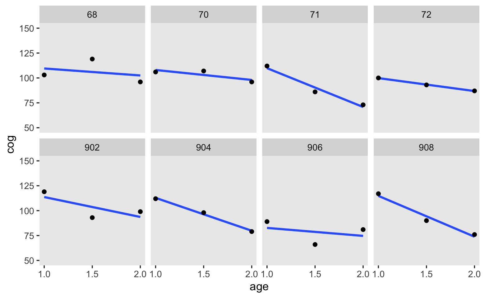
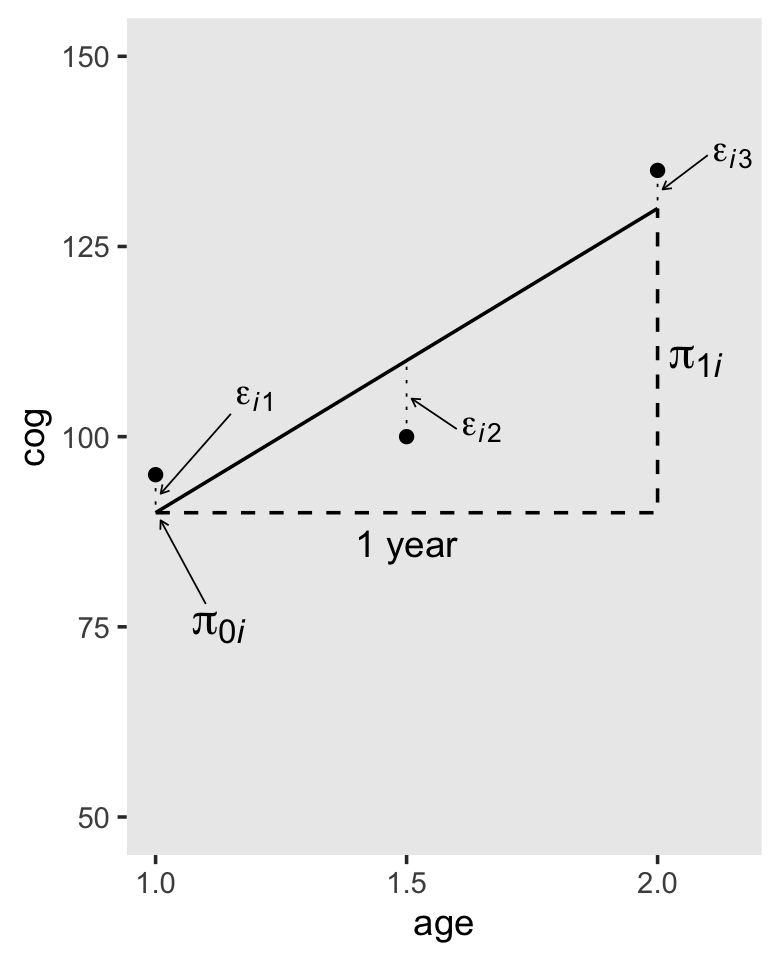
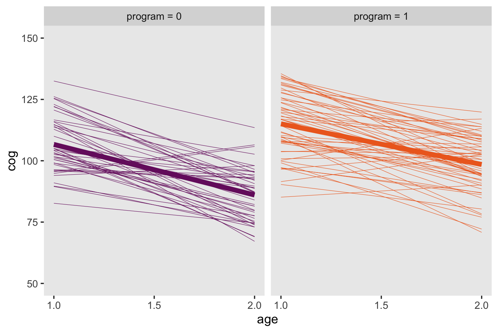
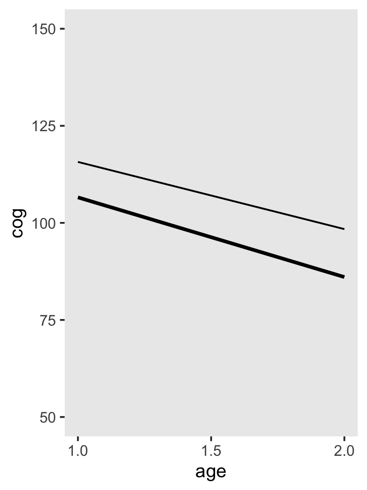
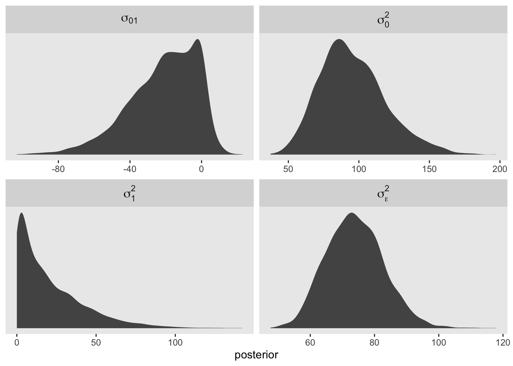

# Introducing the Multilevel Model for Change

> In this chapter [Singer and Willett introduced] the multilevel model for change, demonstrating how it allows us to address within-person and between-person questions about change simultaneously. Although there are several ways of writing the statistical model, here we adopt a simple and common approach that has much substantive appeal. We specify the multilevel model for change by simultaneously postulating a pair of subsidiary models—a level-1 submodel that describes how each person changes over time, and a level-2 model that describes how these changes differ across people [@bryk1987application; @rogosaUnderstandingCorrelatesChange1985]. [@singerAppliedLongitudinalData2003, p. 3]

## What is the purpose of the multilevel model for change?

Unfortunately, we do not have access to the full data set Singer and Willett used in this chapter. For details, go [here](https://stats.idre.ucla.edu/r/examples/alda/r-applied-longitudinal-data-analysis-ch-3/). However, I was able to use the data provided in Table 3.1 and the model results in Table 3.3 to simulate data with similar characteristics as the original. To see how I did it, look at the section at the end of the chapter.

Anyway, here are the data in Table 3.1.


```r
library(tidyverse)

early_int <-
  tibble(id      = rep(c(68, 70:72, 902, 904, 906, 908), each = 3),
         age     = rep(c(1, 1.5, 2), times = 8),
         cog     = c(103, 119, 96, 106, 107, 96, 112, 86, 73, 100, 93, 87, 
                     119, 93, 99, 112, 98, 79, 89, 66, 81, 117, 90, 76),
         program = rep(1:0, each = 12))

print(early_int)
```

```
## # A tibble: 24 x 4
##       id   age   cog program
##    <dbl> <dbl> <dbl>   <int>
##  1    68   1     103       1
##  2    68   1.5   119       1
##  3    68   2      96       1
##  4    70   1     106       1
##  5    70   1.5   107       1
##  6    70   2      96       1
##  7    71   1     112       1
##  8    71   1.5    86       1
##  9    71   2      73       1
## 10    72   1     100       1
## # … with 14 more rows
```

Later on, we also fit models using $age - 1$. Here we'll compute that and save it as `age_c`.


```r
early_int <-
  early_int %>% 
  mutate(age_c = age - 1)

head(early_int)
```

```
## # A tibble: 6 x 5
##      id   age   cog program age_c
##   <dbl> <dbl> <dbl>   <int> <dbl>
## 1    68   1     103       1   0  
## 2    68   1.5   119       1   0.5
## 3    68   2      96       1   1  
## 4    70   1     106       1   0  
## 5    70   1.5   107       1   0.5
## 6    70   2      96       1   1
```

Here we'll load our simulation of the full $n = 103$ data set.


```r
load("data/early_int_sim.rda")
```

## The level-1 submodel for individual change

This part of the model is also called the *individual growth model*. Remember how in last chapter we fit a series of participant-specific models? That's the essence of this part of the model.

Here's our version of Figure 3.1. Note that here we're being lazy and just using OLS estimates.


```r
early_int %>% 
  ggplot(aes(x = age, y = cog)) +
  stat_smooth(method = "lm", se = F) +
  geom_point() +
  scale_x_continuous(breaks = c(1, 1.5, 2)) +
  ylim(50, 150) +
  theme(panel.grid = element_blank()) +
  facet_wrap(~id, ncol = 4)
```



Based on these data, we postulate our level-1 submodel to be

$$
\text{cog}_{ij} = [ \pi_{0i} + \pi_{1i} (\text{age}_{ij} - 1) ] + [\epsilon_{ij}].
$$

### The structural part of the level-1 submodel.

As far as I can tell, the data for Figure 3.2 are something like this.


```r
d <-
  tibble(id  = "i",
         age = c(1, 1.5, 2),
         cog = c(95, 100, 135))

d
```

```
## # A tibble: 3 x 3
##   id      age   cog
##   <chr> <dbl> <dbl>
## 1 i       1      95
## 2 i       1.5   100
## 3 i       2     135
```

To add in the horizontal dashed lines in Figure 3.2, we'll need to fit a model. Let's be lazy and use OLS. Don't worry, we'll use Bayes in a bit.


```r
fit3.1 <-
  lm(data = d,
     cog ~ age)

summary(fit3.1)
```

```
## 
## Call:
## lm(formula = cog ~ age, data = d)
## 
## Residuals:
##   1   2   3 
##   5 -10   5 
## 
## Coefficients:
##             Estimate Std. Error t value Pr(>|t|)
## (Intercept)    50.00      26.93   1.857    0.314
## age            40.00      17.32   2.309    0.260
## 
## Residual standard error: 12.25 on 1 degrees of freedom
## Multiple R-squared:  0.8421,	Adjusted R-squared:  0.6842 
## F-statistic: 5.333 on 1 and 1 DF,  p-value: 0.2601
```

We can use the `fitted()` function to compute the model-implied fitted values for `cog` based on the `age` values in the data. We'll then save those in a sensibly-named vector which we'll attach to the rest of the data.


```r
f <-
  fitted(fit3.1) %>% 
  data.frame() %>% 
  set_names("fitted") %>% 
  bind_cols(d)

print(f)
```

```
##   fitted id age cog
## 1     90  i 1.0  95
## 2    110  i 1.5 100
## 3    130  i 2.0 135
```

To make all the dashed lines and arrows in the figure, we'll want a few specialty tibbles.


```r
path <-
  tibble(age = c(1, 2, 2),
         cog = c(90, 90, 130))

text <-
  tibble(age   = c(1.2, 1.65, 2.15, 1.125, 2.075),
         cog   = c(105, 101, 137, 75, 110),
         label = c("epsilon[italic(i)][1]", "epsilon[italic(i)][2]", 
                   "epsilon[italic(i)][3]", "pi[0][italic(i)]", "pi[1][italic(i)]"))

arrow <-
  tibble(age  = c(1.15, 1.6, 2.1, 1.1),
         xend = c(1.01, 1.51, 2.01, 1.01),
         cog  = c(103, 101, 137, 78),
         yend = c(92.5, 105, 132.5, 89))

# we're finally ready to plot!
f %>% 
  ggplot(aes(x = age, y = cog)) +
  geom_point() +
  # the main fitted trajectory
  geom_line(aes(y = fitted)) +
  # the thick dashed line bending upward at age == 2
  geom_path(data = path,
            linetype = 2, size = 1/2) +
  # the thin dashed vertical lines extending from the data dots to the fitted line
  geom_segment(aes(xend = age, y = cog, yend = fitted),
               linetype = 3, size = 1/4) +
  # the arrows
  geom_segment(data = arrow,
               aes(xend = xend, yend = yend),
               arrow = arrow(length = unit(0.1, "cm")), size = 1/4) +
  # the statistical notation
  geom_text(data = text,
            aes(label = label),
            size = c(4, 4, 4, 5, 5), parse = T) +
  # "1 year"
  annotate(geom = "text",
           x = 1.5, y = 86, label = "1 year") +
  scale_x_continuous(breaks = c(1, 1.5, 2)) +
  ylim(50, 150) +
  theme(panel.grid = element_blank())
```



> In-specifying a level-1 submodel that attempts to describe everyone (all the $i$'s) in the population, we implicitly assume that all the true individual change trajectories have a common algebraic form. But we do not assume that everyone has the same exact trajectory. Because each person has his or her own individual growth parameters (intercepts and slopes), different people can have their own distinct change trajectories. (pp. 53--54)

In this way, the multilevel model's level-1 submodel is much like an interaction/moderation model with interaction terms for each level of $i$. 

### The stochastic part of the level-1 submodel.

The last term in our level-1 equation from above was $[\epsilon_{ij}]$. This is the residual variance left in the criterion after accounting for the predictor(s) in the model. It is a mixture of systemic variation that could be accounted for by adding covariates to the model as well as measurement error. The typical assumption is

$$
\epsilon_{ij} \sim \operatorname{Normal} (0, \sigma_\epsilon^2).
$$

We should point out that another way to express this is

\begin{align*}
\text{cog} & \sim \operatorname{Normal} (\mu_{ij}, \sigma_\epsilon^2) \\
\mu_{ij}   & = \pi_{0i} + \pi_{1i} (\text{age}_{ij} - 1).
\end{align*}

This won't be a huge deal in the context of the models Singer and Willett presented in the initial chapters of the text but expressing the models this way can help one think in terms of likelihood functions. That's a major advantage when you start working with data which are natural to model using other distributions (e.g., count data and the Poisson, binary data and the binomial). For more on this approach, check out either edition of McElreath's [-@mcelreathStatisticalRethinkingBayesian2015; -@mcelreathStatisticalRethinkingBayesian2020] [*Statistical Rethinking*](https://xcelab.net/rm/statistical-rethinking/) and my [-@kurzStatisticalRethinkingBrms2020; -@kurzStatisticalRethinkingSecondEd2021] companion ebook([here](https://bookdown.org/content/3890/) and [here](https://bookdown.org/content/4857/)) translating his work into **brms** and **tidyverse** code. Also, thinking in terms of likelihoods will pay off starting around [Chapter 10][Describing Discrete-Time Event Occurrence Data] when we start fitting discrete-time survival models.

### Relating the level-1 submodel to the OLS exploratory methods of chapter 2.

To get the top panel in Figure 3.3, we'll use `stat_smooth()` to get the OLS trajectories.


```r
early_int_sim %>% 
  ggplot(aes(x = age, y = cog)) +
  stat_smooth(aes(group = id),
              method = "lm", se = F, size = 1/6) +
  stat_smooth(method = "lm", se = F, size = 2) +
  scale_x_continuous(breaks = c(1, 1.5, 2)) +
  ylim(50, 150) +
  theme(panel.grid = element_blank())
```


Note that now we're working with our `early_int_sim` data, the one where we added the data of 95 simulated individuals to the real data of 8 `id` levels from Table 3.1. As such, our results will deviate a bit from those in the text.

But anyways, here we go on to fit 103 individual OLS models, one for each of the `id` levels. Don't worry; we'll depart from this madness shortly.


```r
by_id <-
  early_int_sim %>% 
  mutate(age_c = age - 1) %>% 
  group_by(id) %>% 
  nest() %>% 
  mutate(model = map(data, ~lm(data = ., cog ~ age_c)))

head(by_id)
```

```
## # A tibble: 6 x 3
## # Groups:   id [6]
##      id data             model 
##   <dbl> <list>           <list>
## 1     1 <tibble [3 × 4]> <lm>  
## 2     2 <tibble [3 × 4]> <lm>  
## 3     3 <tibble [3 × 4]> <lm>  
## 4     4 <tibble [3 × 4]> <lm>  
## 5     5 <tibble [3 × 4]> <lm>  
## 6     6 <tibble [3 × 4]> <lm>
```

Now we'll use the great helper functions from the [**broom** package](https://cran.r-project.org/web/packages/broom/index.html) [@R-broom], `tidy()` and `glance()`, to store the coefficient information and model fit information, respectively, in a tidy data format (see [here](http://r4ds.had.co.nz/tidy-data.html) and also [here](https://www.youtube.com/watch?v=rz3_FDVt9eg&t=3458s)).


```r
# install.packages("broom")
library(broom)

by_id <- 
  by_id %>%
  mutate(tidy   = map(model, tidy),
         glance = map(model, glance))
```

Here's what our `by_id` object now looks like:


```r
by_id %>%
  head()
```

```
## # A tibble: 6 x 5
## # Groups:   id [6]
##      id data             model  tidy             glance           
##   <dbl> <list>           <list> <list>           <list>           
## 1     1 <tibble [3 × 4]> <lm>   <tibble [2 × 5]> <tibble [1 × 12]>
## 2     2 <tibble [3 × 4]> <lm>   <tibble [2 × 5]> <tibble [1 × 12]>
## 3     3 <tibble [3 × 4]> <lm>   <tibble [2 × 5]> <tibble [1 × 12]>
## 4     4 <tibble [3 × 4]> <lm>   <tibble [2 × 5]> <tibble [1 × 12]>
## 5     5 <tibble [3 × 4]> <lm>   <tibble [2 × 5]> <tibble [1 × 12]>
## 6     6 <tibble [3 × 4]> <lm>   <tibble [2 × 5]> <tibble [1 × 12]>
```

If you want to extract the intercepts from the `tidy` column, you might execute code like this.


```r
unnest(by_id, tidy) %>%
  filter(term == "(Intercept)")
```

```
## # A tibble: 103 x 9
## # Groups:   id [103]
##       id data             model  term        estimate std.error statistic  p.value glance           
##    <dbl> <list>           <list> <chr>          <dbl>     <dbl>     <dbl>    <dbl> <list>           
##  1     1 <tibble [3 × 4]> <lm>   (Intercept)     117.  2.43e-14   4.81e15 1.32e-16 <tibble [1 × 12]>
##  2     2 <tibble [3 × 4]> <lm>   (Intercept)     110.  5.22e+ 0   2.11e 1 3.01e- 2 <tibble [1 × 12]>
##  3     3 <tibble [3 × 4]> <lm>   (Intercept)     117.  1.08e+ 1   1.08e 1 5.87e- 2 <tibble [1 × 12]>
##  4     4 <tibble [3 × 4]> <lm>   (Intercept)     136.  5.59e+ 0   2.42e 1 2.62e- 2 <tibble [1 × 12]>
##  5     5 <tibble [3 × 4]> <lm>   (Intercept)     108.  3.35e+ 0   3.21e 1 1.99e- 2 <tibble [1 × 12]>
##  6     6 <tibble [3 × 4]> <lm>   (Intercept)     110.  2.61e+ 0   4.21e 1 1.51e- 2 <tibble [1 × 12]>
##  7     7 <tibble [3 × 4]> <lm>   (Intercept)     124.  7.45e- 1   1.66e 2 3.84e- 3 <tibble [1 × 12]>
##  8     8 <tibble [3 × 4]> <lm>   (Intercept)      97   6.71e+ 0   1.45e 1 4.40e- 2 <tibble [1 × 12]>
##  9     9 <tibble [3 × 4]> <lm>   (Intercept)     121.  7.08e+ 0   1.71e 1 3.73e- 2 <tibble [1 × 12]>
## 10    10 <tibble [3 × 4]> <lm>   (Intercept)     109.  3.73e- 1   2.92e 2 2.18e- 3 <tibble [1 × 12]>
## # … with 93 more rows
```

This first line took the model coefficients and their respective statistics (e.g., standard errors) and unnested them (i.e., took them out of the list of data frames and converted the data to a longer structure). The second line filtered out any coefficients that were not the intercept. In this case, there are just two coefficients, the intercept and the slope for `age_c`.

With that, we can make the leftmost stem and leaf plot from Figure 3.3.


```r
unnest(by_id, tidy) %>%
  filter(term == "(Intercept)") %>% 
  pull(estimate) %>% 
  stem()
```

```
## 
##   The decimal point is 1 digit(s) to the right of the |
## 
##    8 | 3
##    8 | 5
##    9 | 000124
##    9 | 5666677779999
##   10 | 000111223334444
##   10 | 555678888889
##   11 | 00000223444
##   11 | 55667777788
##   12 | 001112222344
##   12 | 556666889
##   13 | 011223444
##   13 | 56
##   14 | 
##   14 | 8
```

Here's the stem and leaf plot in the middle.


```r
unnest(by_id, tidy) %>%
  filter(term == "age_c") %>% 
  pull(estimate) %>% 
  stem()
```

```
## 
##   The decimal point is 1 digit(s) to the right of the |
## 
##   -4 | 7
##   -4 | 111
##   -3 | 9886666655
##   -3 | 322111000
##   -2 | 9877776666555
##   -2 | 44443321111110000
##   -1 | 999999888665
##   -1 | 433322211100000
##   -0 | 988877776
##   -0 | 33211
##    0 | 124
##    0 | 57
##    1 | 1113
```

If you want the residual variances (i.e., $\sigma_\epsilon^2$), you'd `unnest()` the `glance` column. They'll be listed in the `sigma` column.


```r
unnest(by_id, glance) %>% 
  pull(sigma) %>% 
  stem(scale = 1)
```

```
## 
##   The decimal point is at the |
## 
##    0 | 0044444488888
##    1 | 22
##    2 | 000000444499999
##    3 | 3377777
##    4 | 11111599999
##    5 | 33377777
##    6 | 111111559
##    7 | 3333888
##    8 | 26
##    9 | 0004488
##   10 | 22
##   11 | 0088
##   12 | 777
##   13 | 115
##   14 | 3
##   15 | 59
##   16 | 3
##   17 | 16
##   18 | 0
##   19 | 
##   20 | 
##   21 | 266
```

## The level-2 submodel for systematic interindividual differences in change

Here are the top panels of Figure 3.4.


```r
early_int_sim <-
  early_int_sim %>% 
  mutate(label = str_c("program = ", program)) 

early_int_sim %>% 
  ggplot(aes(x = age, y = cog, color = label)) +
  stat_smooth(aes(group = id),
              method = "lm", se = F, size = 1/6) +
  stat_smooth(method = "lm", se = F, size = 2) +
  scale_color_viridis_d(option = "B", begin = .33, end = .67) +
  scale_x_continuous(breaks = c(1, 1.5, 2)) +
  ylim(50, 150) +
  theme(legend.position = "none",
        panel.grid = element_blank()) +
  facet_wrap(~label)
```



Given the simplicity of the shapes, the bottom panels of Figure 3.4 will take a bit of preparatory work. First, we'll need to wrangle the data a bit to get the necessary points. If we were working with a Bayesian model fit with **brms**, we'd use the `fitted()` function. But since we're working with models fit with base **R**'s OLS estimator, `lm()`, we'll use `predict()`, which accommodates a `newdata` argument. That'll be crucial because in order to get the shapes correct, we'll need to evaluate the minimum and maximum values across the fitted lines across a densely-packed sequence of `age_c` values.


```r
# how may `age_c` values do we need?
n <- 30

# define the specific `age_c` values
nd <-
  tibble(age_c = seq(from = 0, to = 1, length.out = n))

# wrangle
p <-
  by_id %>%
  mutate(fitted  = map(model, ~predict(., newdata = nd))) %>% 
  unnest(fitted) %>% 
  mutate(age     = seq(from = 1, to = 2, length.out = n),
         program = ifelse(id < 900, 1, 0)) %>% 
  group_by(program, age) %>% 
  summarise(min = min(fitted),
            max = max(fitted)) %>%
  mutate(label = str_c("program = ", program))

# what did we do?
head(p)
```

```
## # A tibble: 6 x 5
## # Groups:   program [1]
##   program   age   min   max label      
##     <dbl> <dbl> <dbl> <dbl> <chr>      
## 1       0  1     82.7  133. program = 0
## 2       0  1.03  82.4  132. program = 0
## 3       0  1.07  82.1  131. program = 0
## 4       0  1.10  81.8  131. program = 0
## 5       0  1.14  81.6  130. program = 0
## 6       0  1.17  81.3  129. program = 0
```

Before we plot, we'll need a couple tibbles for the annotation.


```r
text <-
  tibble(age   = 1.01,
         cog   = c(101.5, 110),
         label = c("program = 0", "program = 1"),
         text  = c("Average population trajectory,", "Average population trajectory,"),
         angle = c(345.7, 349))

math <-
  tibble(age   = 1.01,
         cog   = c(94.5, 103),
         label = c("program = 0", "program = 1"),
         text  = c("gamma[0][0] + gamma[10](italic(age) - 1)", "(gamma[0][0] + gamma[10]) + (gamma[10] + gamma[11]) (italic(age) - 1)"),
         angle = c(345.7, 349))
```

Finally, we're ready for the bottom panels of Figure 3.4.


```r
p %>%
  ggplot(aes(x = age)) +
  geom_ribbon(aes(ymin = min, ymax = max, fill = label),
              alpha = 1/3) +
  stat_smooth(data = early_int_sim,
              aes(y = cog, color = label),
              method = "lm", se = F, size = 1) +
  geom_text(data = text,
            aes(y = cog, label = text, angle = angle),
            hjust = 0) +
  geom_text(data = math,
            aes(y = cog, label = text, angle = angle),
            hjust = 0, parse = T) +
  scale_fill_viridis_d(option = "B", begin = .33, end = .67) +
  scale_color_viridis_d(option = "B", begin = .33, end = .67) +
  scale_x_continuous(breaks = c(1, 1.5, 2)) +
  scale_y_continuous("cog", limits = c(50, 150)) +
  theme(legend.position = "none",
        panel.grid = element_blank()) +
  facet_wrap(~label)
```


Returning to the text (p. 58), Singer and Willett asked: "What kind [of] population model might have given rise to these patterns?" Their answer is the level-2 model should have 4 specific features:

1. "Its outcomes must be the individual growth parameters."
2. "The level-2 submodel must be written in separate parts, one for each level-1 growth parameter."
3. "Each part must specify a relationship between an individual growth parameter and the predictor."
4. "Each model must allow individuals who share common predictor values to vary in their individual change trajectories."

Given the current model, the level-2 submodel of change may be expressed as

\begin{align*}
\pi_{0i} & = \gamma_{00} + \gamma_{01} \text{program} + \zeta_{0i} \\
\pi_{1i} & = \gamma_{10} + \gamma_{11} \text{program} + \zeta_{1i}.
\end{align*}

We'll discuss the details about the $\zeta$ terms in a bit.

### Structural components of the level-2 submodel.

> The structural parts of the level-2 submodel contain four level-2 parameters--$\gamma_{00}$, $\gamma_{01}$, $\gamma_{10}$, and $\gamma_{11}$--known collectively as the *fixed effects*. The fixed effects capture systematic interindividual differences in change trajectory according to values of the level-2 predictors. (p. 60, *emphasis* in the original)

### Stochastic components of the level-2 submodel.

> Each part of the level-2 submodel contains a residual that allows the value of each person’s growth parameters to be scattered around the relevant population averages. These residuals, $\zeta_{0i}$ and $\zeta_{1i}$ in [the] equation [above], represent those portions of the level-2 outcomes--the individual growth parameters--that remain unexplained by the level-2 predictor(s). (p. 61)

We often summarize the $\zeta_{0i}$ and $\zeta_{1i}$ deviations as $\sigma_0^2$ and $\sigma_1^2$, respectively. And importantly, these variance parameters have a covariance $\sigma_{01}$. However, *and this next part is quite important*, **brms** users should know that unlike the convention in many frequentist software packages [e.g., **lme4**, @R-lme4; @batesFittingLinearMixedeffects2015] and in the text, **brms** parameterizes these in the standard-deviation metric. That is, in **brms**, these are expressed as $\sigma_0$ and $\sigma_1$. Similarly, the $\sigma_{01}$ presented in **brms** output is in a correlation metric, rather than a covariance. There are technical reasons for this are outside of the scope of the present situation [see @burknerBrmsPackageBayesian2017]. The consequences is that we'll make frequent use of squares and square roots in this project when comparing our `brms::brm()` results to those in the text.

As on page 63 of the text, the typical way to express the multivariate distribution of the $\zeta$ parameters would be

\begin{align*}
\begin{bmatrix} \zeta_{0i} \\ \zeta_{1i} \end{bmatrix} & 
\sim \operatorname{N} 
\begin{pmatrix} 
\begin{bmatrix} 0 \\ 0 \end{bmatrix},  
\begin{bmatrix} \sigma_0^2 & \sigma_{01}\\ \sigma_{01} & \sigma_1^2 \end{bmatrix} 
\end{pmatrix},
\end{align*}

where the bracketed matrix on the right part of the equation is the variance/covariance matrix. If we summarize the vector of $\zeta$ terms as $u$ and so on, we can re-express the above equation as

$$
u \sim \operatorname N (\mathbf 0, \mathbf \Sigma),
$$

where $\mathbf 0$ is the vector of 0 means and $\mathbf \Sigma$ is the variance/covariance matrix. In Stan, and thus **brms**, we typically decompose $\mathbf \Sigma$ as

\begin{align*}
\mathbf \Sigma & = \mathbf D \mathbf \Omega \mathbf D, \text{where} \\
\mathbf D      & = \begin{bmatrix} \sigma_0 & 0 \\ 0 & \sigma_1 \end{bmatrix} \text{and} \\
\mathbf \Omega & = \begin{bmatrix} 1 & \rho \\ \rho & 1 \end{bmatrix}.
\end{align*}

Thus $\mathbf D$ is the diagonal matrix of standard deviations and $\mathbf \Omega$ is the correlation matrix.

## Fitting the multilevel model for change to data

Singer and Willett discussed how in the 90s, we saw a bloom of software for fitting multilevel models. Very notably, they mentioned BUGS [@gilksMCMCinPractice1995] which stands for 'Bayesian inference using Gibbs sampling' and was a major advance in Bayesian software. As we learn in @kruschkeDoingBayesianData2015:

> In 1997, BUGS had a Windows-only version called WinBUGS, and later it was reimplemented in OpenBUGS which also runs best on Windows operating systems. JAGS [@plummer2003jags; @plummer2012jags] retained many of the design features of BUGS, but with different samplers under the hood and better usability across different computer-operating systems (Windows, MacOS, and other forms of Linux/Unix). (pp. 193--194)

There's also Stan. From their homepage, [https://mc-stan.org](https://mc-stan.org), we read "Stan is a state-of-the-art platform for statistical modeling and high-performance statistical computation." Stan is free and open-source and you can find links to various documentation resources, such as the current *Stan user's guide* [@standevelopmentteamStanUserGuide2021] and *Stan reference manual* [@standevelopmentteamStanReferenceManual2021], at [https://mc-stan.org/users/documentation/](https://mc-stan.org/users/documentation/). Unlike BUGS and JAGS, Stan samples from the posterior via Hamiltonian Monte Carlo, which tends to scale particularly well for complex multilevel models. However, in this project we won't be working with Stan directly. Rather, we'll interface with it indirectly through [**brms**](https://github.com/paul-buerkner/brms). To my knowledge, **brms** is the most flexible and user-friendly interface for Stan within the **R** ecosystem.

Talking about the various software options, Singer and Willett wrote:

> All have their strengths, and we use many of them in our research and in this book. At their core, each program does the same job; it fits the multilevel model for change to data and provides parameter estimates, measures of precision, diagnostics, and so on. There is also some evidence that all the different packages produce the same, or similar, answers to a given problem [@kreftComparingFourDifferent1990]. So, in one sense, it does not matter which program you choose. (p. 64)

But importantly, in the next paragraph the authors clarified their text focused on "one particular method of estimation--*maximum likelihood*" (p. 64, *emphasis* in the original). This is quite important because, whereas we might expect various maximum-likelihood-based packages to yield the same or similar results, this will not necessarily hold when working with Bayesian software which, in addition to point estimates and expressions of uncertainty, yields an entire posterior distribution as a consequence of Bayes' theorem,

$$
p(\theta | d) = \frac{p(d | \theta)\ p(\theta)}{p(d)},
$$

where $p(\theta | d)$ is the posterior distribution, $p(d | \theta)$ is the likelihood (i.e., the star of maximum likelihood), $p(\theta)$ are the priors, and $p(d)$ is the normalizing constant, the probability of the data which transforms the numerator to a probability metric.

Given that multilevel models are a fairly advanced topic, it is not my goal in this project to offer a tutorial on the foundations of applied Bayesian statistics. I'm taking it for granted you are familiar with the basics. But if you're very ambitious and this is new or if you're just rusty, I recommend you back up and lean the ropes with [Richard McElreath](https://twitter.com/rlmcelreath)'s excellent introductory text, [*Statistical Rethinking*](http://xcelab.net/rm/statistical-rethinking/). He has great [freely-available lectures](https://www.youtube.com/channel/UCNJK6_DZvcMqNSzQdEkzvzA/playlists) that augment the text and I also have ebooks ([here](https://bookdown.org/content/3890/) and [here](https://bookdown.org/content/4857/)) translating both editions of his text into **brms** and **tidyverse**-style code.

### The advantages of ~~maximum likelihood~~ Bayesian estimation.

I just don't think I have the strength to evangelize Bayes, at the moment. McElreath covered that a little bit in [*Statistical Rethinking*](http://xcelab.net/rm/statistical-rethinking/), but he mainly took it for granted. Kruschke has been more of a Bayesian evangelist, examples of which are his [2015 text](http://www.indiana.edu/~kruschke/DoingBayesianDataAnalysis/) or his [-@kruschkeBayesianNewStatistics2018] coauthored paper with Torrin Liddell, [*The Bayesian New Statistics: Hypothesis testing, estimation, meta-analysis, and power analysis from a Bayesian perspective*](https://link.springer.com/article/10.3758/s13423-016-1221-4). My assumption is if you’re reading this, you're already interested.

### Using ~~maximum likelihood~~ modern Bayesian methods to fit a multilevel model.

Just as with maximum likelihood, you have to specify a likelihood function with Bayes, too. The likelihood, $p(d | \theta)$, is half of the numerator of Bayes' theorem and its meaning in Bayes is that same as with maximum likelihood estimation. The likelihood "describes the probability of observing the sample data as a function of the model's unknown parameters" (p. 66). But unlike with maximum likelihood, we multiply the likelihood with the prior(s) and normalize the results so they're in a probability metric.

## Examining estimated fixed effects

Singer and Willett discussed hypothesis testing in this section. The Bayesian paradigm can be used for hypothesis testing. For an introduction to this approach, check out Chapters 11 and 12 of Kruschke's (2015) text. This will not be our approach in this project. My perspective on Bayesian modeling is more influenced by McElreath's text and by [Andrew Gelman](http://www.stat.columbia.edu/~gelman/)'s various works. I like fitting models, inspecting their parameters, interpreting them from an effect-size perspective, and considering posterior predictions. You'll see plenty of examples of this approach in the examples to come.

### Interpreting estimated fixed effects.

Singer and Willett presented the maximum likelihood results of our multilevel model in Table 3.3. Before we present ours, we'll need to fit our corresponding Bayesian model. Let's fire up **brms**.


```r
library(brms)
```

Just like we did with the single-level models in the last chapter, we'll fit our Bayesian multilevel models with the `brm()` function.


```r
fit3.2 <-
  brm(data = early_int_sim,
      family = gaussian,
      formula = cog ~ 0 + Intercept + age_c + program + age_c:program + (1 + age_c | id),
      iter = 2000, warmup = 1000, chains = 4, cores = 4,
      control = list(adapt_delta = 0.95),
      seed = 3,
      file = "fits/fit03.02")
```

Compared to last chapter, we've added a few arguments. Notice the second line, `family = gaussian`. Remember all that likelihood talk from the last few sections? Well, with `family = gaussian` we've indicated we want to use the Gaussian likelihood function. As this is the **brms** default, we didn't actually need to type out the argument. But we'll follow this convention for the remainder of the text for two reasons. First, I hope it's pedagogically useful to remind you of what likelihood you're working with. Second, I think it's generally a good idea to explicate your likelihood. In the context of the initial chapters of this text, this might seem unnecessary. We'll constantly be using the Gaussian. But that's largely a pedagogical decision made by the authors. There are lots of every-day applications for multilevel models with other likelihood functions, such as those suited for discrete data. And when the day comes you'll need to fit a multilevel logistic regression model, you'll need to use a different setting in the `family` argument. Plus, we will have some practice using other likelihood functions in the survival chapters later in the text.

Here's the big new thing: our `formula` line specified a multilevel model! Check out the `(1 + age_c | id)` syntax on the right. This syntax is designed to be similar to the that of the widely-used frequentist **lme4** package. In the [**brms** reference manual](https://CRAN.R-project.org/package=brms/brms.pdf) [@brms2021RM], we lean this syntax follows the generic form `(gterms | group)` where "the optional `gterms` part may contain effects that are assumed to vary across grouping variables specified in `group`. We call them 'group-level' or 'varying' effects, or (adopting frequentist vocabulary) 'random' effects, although the latter name is misleading in a Bayesian context" (p. 35). And like with base **R**'s `lm()` function or with **lme4**, the `1` portion is a stand-in for the intercept. Thus, with `1 + age_c`, we indicated we wanted the intercept and `age_c` slope to vary across groups. On the right side of the `|`, we defined our grouping variable as `id`.

Another important part of the `formula` syntax concerns the intercept for the fixed effects. See the `0 + Intercept` part? Here's the deal: If we were using default behavior, we'd have coded either `1 + ...` or just left that part out entirely. Both would have estimated the fixed intercept according to **brms** default behavior. But that's the issue. By default, `brms::brm()` presumes your predictors are mean centered. This is critical because the default priors set by `brms::brm()` are also set based on this assumption. As it turns out, neither our `age_c` nor `program` variables are centered that way. `program` is a dummy variable and `age_c` is centered on 1, not the mean. Now since the `brm()` default priors are rather broad and uninformative, This probably wouldn't have made much of a difference, here. However, we may as well address this issue now and avoid bad practices. So, with our `0 + Intercept` solution, we told `brm()` to suppress the default intercept and replace it with our smartly-named `Intercept` parameter. This is our fixed effect for the population intercept and, importantly, `brms()` will assign default priors to it based on the data themselves without assumptions about centering.

I'd like to acknowledge at this point that if **brms** and/or the multilevel model are new to you, this can be disorienting and confusing. I'm sorry. The world is unfair and Singer and Willett didn't write their text with **brms** in mind. Had they done so, they'd have used mean-centered predictors for the first few models to put off this technical issue until later chapters. Yet here we are. So if you're feeling frustrated, that mainly just means you're paying attention. Good job! Forge on, friends. It'll get better.

The line starting with `iter` largely explicates `brms::brm()` default settings. The only change from the defaults is `cores = 4`, which allow you to sample from all four `chains` simultaneously.

The `control` line opens up a can of worms I just don't want to address at this point in the text. It's a technical setting that helped us do a better job sampling form the posterior. We'll have more opportunities to talk about it later. For now, know that the default setting for `adapt_delta` is `0.8`. The value ranges from 0 to 1.

The last line of interest is `seed = 3`. Markov chain Monte Carlo methods use pseudo-random number generators to sample from the posterior. To make the results of a pseudo-random process reproducible, you set the seed. There's nothing special about setting it to 3. I just did so because that's the chapter we're on. Play around with other values and see what happens.

Okay, that's a lot of boring technical talk. Let's use `print()` to see what we did!


```r
print(fit3.2)
```

```
##  Family: gaussian 
##   Links: mu = identity; sigma = identity 
## Formula: cog ~ 0 + Intercept + age_c + program + age_c:program + (1 + age_c | id) 
##    Data: early_int_sim (Number of observations: 309) 
## Samples: 4 chains, each with iter = 2000; warmup = 1000; thin = 1;
##          total post-warmup samples = 4000
## 
## Group-Level Effects: 
## ~id (Number of levels: 103) 
##                      Estimate Est.Error l-95% CI u-95% CI Rhat Bulk_ESS Tail_ESS
## sd(Intercept)            9.69      1.20     7.47    12.18 1.00      820     1464
## sd(age_c)                3.89      2.38     0.18     8.81 1.01      394     1277
## cor(Intercept,age_c)    -0.47      0.37    -0.95     0.56 1.00     3552     1585
## 
## Population-Level Effects: 
##               Estimate Est.Error l-95% CI u-95% CI Rhat Bulk_ESS Tail_ESS
## Intercept       106.57      1.84   102.95   110.27 1.00     1390     1970
## age_c           -20.54      1.92   -24.26   -16.83 1.00     2829     2833
## program           9.02      2.39     4.35    13.66 1.00     1547     2011
## age_c:program     3.32      2.53    -1.73     8.25 1.00     3041     3130
## 
## Family Specific Parameters: 
##       Estimate Est.Error l-95% CI u-95% CI Rhat Bulk_ESS Tail_ESS
## sigma     8.59      0.53     7.59     9.60 1.00      713     1480
## 
## Samples were drawn using sampling(NUTS). For each parameter, Bulk_ESS
## and Tail_ESS are effective sample size measures, and Rhat is the potential
## scale reduction factor on split chains (at convergence, Rhat = 1).
```

Now we're in multilevel-model land, we have three main sections in the output. Let's start in the middle. The 'Population-Level Effects:' section contains our **brms** analogues to the "Fixed Effects" portion of Singer and Willett's Table 3.3. These are our $\gamma$ parameter summaries. Like we briefly covered in the last chapter, **brms** does not give $z$- or $p$-values. But we do get high-quality percentile-based Bayesian 95% intervals. Perhaps somewhat frustratingly, our 'Estimate' values are a little different from those in the text. In this instance, this is more due to us not having access to the original data than differences between Bayesian and maximum likelihood estimation. They'll be closer in many other examples.

The bottom section, 'Family Specific Parameters:', is our analogue to the first line in Table 3.3's "Variance Components" section. What Singer and Willett referred to as $\epsilon_{ij}$, the **brms** package calls `sigma`. But importantly, do recall that Stan and **brms** parameterize variance components in the standard-deviation metric. You'd have to square our `sigma` to put it in a similar metric to the estimate in the text. This will be the case throughout this project. But why call this section 'Family Specific Parameters'? Well, not all likelihoods have a $\sigma$ parameter. In the Poisson likelihood, for example, the mean and variance scale together as one parameter called $\lambda$. Since **brms** is designed to handle a whole slew of likelihood functions [see the [*Parameterization of response distributions in brms*](https://cran.r-project.org/web/packages/brms/vignettes/brms_families.html) vignette, @Bürkner2021Parameterization] it behooved [Bürkner](https://twitter.com/paulbuerkner) to give this section a generic name.

Now we're ready to draw our attention to the topmost section. The 'Group-Level Effects:' are our **brms** variants of the Level 2 section of Singer and Willett's "Variance Components" section in Table 3.3. Our `sd(Intercept)` corresponds to their $\sigma_0^2$ and our `sd(age_c)` corresponds to their $\sigma_1^2$. But recall, ours are in a standard-deviation metric. The estimates in the book are expressed as variances. Finally, our `cor(Intercept,age_c)` parameter is a correlation among the varying-effects, whereas Singer and Willett's $\sigma_{01}$ is a covariance.

In addition to `print()`, a handy way to pull the fixed effects from a `brm()` model is with the `fixef()` function.


```r
fixef(fit3.2)
```

```
##                 Estimate Est.Error       Q2.5      Q97.5
## Intercept     106.573649  1.841208 102.946063 110.267507
## age_c         -20.542437  1.922107 -24.264276 -16.833742
## program         9.017262  2.389513   4.353620  13.664786
## age_c:program   3.316311  2.526033  -1.727526   8.251347
```

You can subset its components with `[]` syntax. E.g., here we'll pull the posterior mean for the overall intercept and round to two decimal places.


```r
fixef(fit3.2)[1, 1] %>% 
  round(digits = 2)
```

```
## [1] 106.57
```

Thus, we can write our version of the equations atop page 70 as

* $\hat{\pi}_{0i} =$ 106.57 $+$ 9.02$\text{program}_i$ and
* $\hat{\pi}_{1i} =$ -20.54 $+$ 3.32$\text{program}_i$.

Again, our results differ largely because they're based on simulated data rather than the real data in the text. We'll be able to work with the original data in the later chapters. Anyway, here are the results of those two equations.


```r
fixef(fit3.2)[1, 1] + fixef(fit3.2)[3, 1]
```

```
## [1] 115.5909
```

```r
fixef(fit3.2)[2, 1] + fixef(fit3.2)[4, 1]
```

```
## [1] -17.22613
```

Here's how to get our estimates corresponding to the values at the bottom of page 70.


```r
# when `program` is 0
fixef(fit3.2)[1, 1] + fixef(fit3.2)[3, 1] * 0 
```

```
## [1] 106.5736
```

```r
fixef(fit3.2)[2, 1] * 1 + fixef(fit3.2)[4, 1] * 1 * 0
```

```
## [1] -20.54244
```

```r
# when `program` is 1
fixef(fit3.2)[1, 1] + fixef(fit3.2)[3, 1] * 1 
```

```
## [1] 115.5909
```

```r
fixef(fit3.2)[2, 1] * 1 + fixef(fit3.2)[4, 1] * 1 * 1
```

```
## [1] -17.22613
```

To make our version of Figure 3.5, we'll pump the necessary `age_c` and `program` values into the full formula of the fixed effects.


```r
# specify the values for our covariates `age_c` and `program`
crossing(age_c   = 0:1,
         program = 0:1) %>% 
  # push those values through the fixed effects
  mutate(cog = fixef(fit3.2)[1, 1] + fixef(fit3.2)[2, 1] * age_c + fixef(fit3.2)[3, 1] * program + fixef(fit3.2)[4, 1] * age_c * program,
         # wrangle a bit
         age     = age_c + 1,
         size    = ifelse(program == 1, 1/5, 3),
         program = factor(program, levels = c("0", "1"))) %>% 

  # plot!
  ggplot(aes(x = age, y = cog, group = program)) +
  geom_line(aes(size = program)) +
  scale_size_manual(values = c(1, 1/2)) +
  scale_x_continuous(breaks = c(1, 1.5, 2)) +
  ylim(50, 150) +
  theme(legend.position = "none",
        panel.grid = element_blank())
```



### Single parameter tests for the fixed effects.

> As in regular regression, you can conduct a hypothesis test on each fixed effect (each $\gamma$) using a single parameter text. Although you can equate the parameter value to any pre-specified value in your hypothesis text, most commonly you examine the null hypothesis that, controlling for all other predictors in the model, the population value of the parameter is 0, $H_0: \gamma = 0$, against the two-sided alternative that it is not, $H_1: \gamma \neq 0$. (p. 71)

You can do this with **brms** with the `hypothesis()` function. I'm not a fan of this method and am not going to showcase it in this ebook If you insist on the NHST paradigm, you'll have to go that alone.

Within the Bayesian paradigm, we have an entire posterior distribution. So let's just look at that. Recall that in the `print()` and `fixef()` outputs, we get the parameter estimates for our $\gamma$'s summarized in terms of the posterior mean (i.e., 'Estimate'), the posterior standard deviation (i.e., 'Est.error'), and the percentile-based 95% credible intervals (i.e., 'Q2.5' and 'Q97.5'). But we can get much richer output with the `posterior_samples()` function.


```r
post <- posterior_samples(fit3.2)
```

Here's a look at the first 10 columns.


```r
post[, 1:10] %>%
  glimpse()
```

```
## Rows: 4,000
## Columns: 10
## $ b_Intercept              <dbl> 105.6437, 105.5789, 105.2024, 106.6993, 108.1813, 105.0034, 105.9260, 105.9…
## $ b_age_c                  <dbl> -17.54724, -17.40496, -19.47939, -21.38443, -21.73016, -19.81801, -21.54092…
## $ b_program                <dbl> 9.222636, 8.466043, 11.151011, 9.714656, 6.506308, 11.782299, 8.363551, 10.…
## $ `b_age_c:program`        <dbl> 2.2255483, 1.5200380, -0.0687862, 0.3437799, 6.3418608, 1.2706728, 6.246511…
## $ sd_id__Intercept         <dbl> 9.099437, 9.072406, 10.449581, 9.314829, 9.777663, 9.308468, 9.030999, 9.45…
## $ sd_id__age_c             <dbl> 2.8446181, 2.6376202, 3.6748299, 3.7268395, 5.8060875, 3.7675561, 3.2032313…
## $ cor_id__Intercept__age_c <dbl> -0.27008809, -0.28334616, -0.53192111, -0.60354412, -0.48563759, -0.6280335…
## $ sigma                    <dbl> 8.323124, 8.295314, 8.771298, 8.228743, 8.756510, 8.123664, 9.327022, 8.596…
## $ `r_id[1,Intercept]`      <dbl> 9.8911299, 9.1574402, 14.6372897, -0.4949765, 1.9871899, 4.9887586, 10.1733…
## $ `r_id[2,Intercept]`      <dbl> -2.6705987, -1.2783693, -5.7264585, 2.8027791, 0.6660866, -2.5914267, 2.650…
```

Here are the dimensions.


```r
post %>% 
  dim()
```

```
## [1] 4000  215
```

We saved our results as `post`, which is a data frame with 4,000 rows (i.e., 1,000 post-warmup iterations times 4 chains) and 215 columns, each depicting one of the model parameters. With **brms**, the $\gamma$ parameters (i.e., the fixed effects or population parameters) get `b_` prefixes in the `posterior_samples()` output. So we can isolate them like so.


```r
post %>% 
  select(starts_with("b_")) %>% 
  head()
```

```
##   b_Intercept   b_age_c b_program b_age_c:program
## 1    105.6437 -17.54724  9.222636       2.2255483
## 2    105.5789 -17.40496  8.466043       1.5200380
## 3    105.2024 -19.47939 11.151011      -0.0687862
## 4    106.6993 -21.38443  9.714656       0.3437799
## 5    108.1813 -21.73016  6.506308       6.3418608
## 6    105.0034 -19.81801 11.782299       1.2706728
```

Just a little more data wrangling will put `post` in a format suitable for plotting.


```r
post %>% 
  pivot_longer(starts_with("b_")) %>% 
  
  ggplot(aes(x = value)) +
  geom_density(color = "transparent", fill = "grey25") +
  scale_y_continuous(NULL, breaks = NULL) +
  theme(panel.grid = element_blank()) +
  facet_wrap(~name, scales = "free")
```


Sure, you could fixate on zero if you wanted to. But of more interest is the overall shape of each parameter's posterior distribution. Look at each's central tendency and spread. Look at where each is in the parameter space. To my mind, that story is so much richer than fixating on zero.

We'll have more to say along these lines in subsequent chapters.

## Examining estimated variance components

> Estimated variance and covariance components are trickier to interpret as their numeric values have little absolute meaning and there are no graphic aids to fall back on. Interpretation for a single fitted model is especially difficult as you lack benchmarks for evaluating the components' magnitudes. This increases the utility of hypothesis testing, for at least the tests provide some benchmark (against the null value of 0) for comparison. (p. 72)

No, no, no! I do protest. No!

As I hope to demonstrate, our Bayesian **brms** paradigm offers rich and informative alternatives to the glib picture Singer and Willett painted back in 2003. Nowadays, we have full Bayesian estimation with Stan. Rejoice, friends. Rejoice.

### Interpreting the estimated variance components.

To extract just the variance components of a `brm()` model, use the `VarCorr()` function.


```r
VarCorr(fit3.2)
```

```
## $id
## $id$sd
##           Estimate Est.Error      Q2.5     Q97.5
## Intercept 9.690025  1.198405 7.4675208 12.177720
## age_c     3.892097  2.379035 0.1843928  8.812811
## 
## $id$cor
## , , Intercept
## 
##             Estimate Est.Error      Q2.5     Q97.5
## Intercept  1.0000000 0.0000000  1.000000 1.0000000
## age_c     -0.4667499 0.3671818 -0.951562 0.5635426
## 
## , , age_c
## 
##             Estimate Est.Error      Q2.5     Q97.5
## Intercept -0.4667499 0.3671818 -0.951562 0.5635426
## age_c      1.0000000 0.0000000  1.000000 1.0000000
## 
## 
## $id$cov
## , , Intercept
## 
##            Estimate Est.Error      Q2.5      Q97.5
## Intercept  95.33241  23.66775  55.76387 148.296873
## age_c     -21.39191  19.43507 -67.03288   5.580959
## 
## , , age_c
## 
##            Estimate Est.Error         Q2.5     Q97.5
## Intercept -21.39191  19.43507 -67.03287648  5.580959
## age_c      20.80681  21.76961   0.03400072 77.665640
## 
## 
## 
## $residual__
## $residual__$sd
##  Estimate Est.Error     Q2.5    Q97.5
##  8.591199 0.5263221 7.594504 9.598431
```

In case that output is confusing, `VarCorr()` returned a 2-element list of lists. We can use the `[[]]` subsetting syntax to isolate the first list of lists.


```r
VarCorr(fit3.2)[[1]] %>% str()
```

```
## List of 3
##  $ sd : num [1:2, 1:4] 9.69 3.89 1.2 2.38 7.47 ...
##   ..- attr(*, "dimnames")=List of 2
##   .. ..$ : chr [1:2] "Intercept" "age_c"
##   .. ..$ : chr [1:4] "Estimate" "Est.Error" "Q2.5" "Q97.5"
##  $ cor: num [1:2, 1:4, 1:2] 1 -0.467 0 0.367 1 ...
##   ..- attr(*, "dimnames")=List of 3
##   .. ..$ : chr [1:2] "Intercept" "age_c"
##   .. ..$ : chr [1:4] "Estimate" "Est.Error" "Q2.5" "Q97.5"
##   .. ..$ : chr [1:2] "Intercept" "age_c"
##  $ cov: num [1:2, 1:4, 1:2] 95.3 -21.4 23.7 19.4 55.8 ...
##   ..- attr(*, "dimnames")=List of 3
##   .. ..$ : chr [1:2] "Intercept" "age_c"
##   .. ..$ : chr [1:4] "Estimate" "Est.Error" "Q2.5" "Q97.5"
##   .. ..$ : chr [1:2] "Intercept" "age_c"
```

If you just want the $\zeta$'s, subset the first list of the first list.


```r
VarCorr(fit3.2)[[1]][[1]]
```

```
##           Estimate Est.Error      Q2.5     Q97.5
## Intercept 9.690025  1.198405 7.4675208 12.177720
## age_c     3.892097  2.379035 0.1843928  8.812811
```

Here's how to get their correlation matrix.


```r
VarCorr(fit3.2)[[1]][[2]]
```

```
## , , Intercept
## 
##             Estimate Est.Error      Q2.5     Q97.5
## Intercept  1.0000000 0.0000000  1.000000 1.0000000
## age_c     -0.4667499 0.3671818 -0.951562 0.5635426
## 
## , , age_c
## 
##             Estimate Est.Error      Q2.5     Q97.5
## Intercept -0.4667499 0.3671818 -0.951562 0.5635426
## age_c      1.0000000 0.0000000  1.000000 1.0000000
```

And perhaps of great interest, here's how to get their variance/covariance matrix.


```r
VarCorr(fit3.2)[[1]][[3]]
```

```
## , , Intercept
## 
##            Estimate Est.Error      Q2.5      Q97.5
## Intercept  95.33241  23.66775  55.76387 148.296873
## age_c     -21.39191  19.43507 -67.03288   5.580959
## 
## , , age_c
## 
##            Estimate Est.Error         Q2.5     Q97.5
## Intercept -21.39191  19.43507 -67.03287648  5.580959
## age_c      20.80681  21.76961   0.03400072 77.665640
```

You can also use the appropriate algebraic operations to transform some of the columns in the `posterior_samples()` output into the variance metric used in the text. Here we'll do so for the elements in the variance/covariance matrix and $\sigma_\epsilon^2$, too.


```r
posterior_samples(fit3.2) %>% 
  mutate(`sigma[0]^2`       = sd_id__Intercept^2,
         `sigma[1]^2`       = sd_id__age_c^2,
         `sigma[0][1]`      = sd_id__Intercept * cor_id__Intercept__age_c * sd_id__age_c,
         `sigma[epsilon]^2` = sigma^2) %>% 
  pivot_longer(starts_with("sigma["),
               values_to = "posterior") %>% 
  
  ggplot(aes(x = posterior)) +
  geom_density(color = "transparent", fill = "grey33") +
  scale_y_continuous(NULL, breaks = NULL) +
  theme(panel.grid = element_blank(),
        strip.text = element_text(size = 12)) +
  facet_wrap(~name, scales = "free", labeller = label_parsed) 
```



As it turns out, the multilevel variance components are often markedly non-Gaussian. This is important for the next section.

### Single parameter tests for the variance components.

> Statisticians disagree as to the nature, form, and effectiveness of these tests. @millerBeyondANOVA1997, @raudenbushHLM2002, and others have long questioned their utility because of their sensitivity to departures from normality. Longford (1999) describes their sensitivity to sample size and imbalance (unequal numbers of observations per person) and argues that they are so misleading that they should be abandoned completely. (p. 73)

This reminds me of parts from Gelman and Hill's [-@gelmanDataAnalysisUsing2006] [text on multilevel models](http://www.stat.columbia.edu/~gelman/arm/). In Section 12.7 on the topic of model building and statistical significance, they wrote:

> It is *not* appropriate to use statistical significance as a criterion for including particular group indicators in a multilevel model....

[They went on to discuss a particular example from the text, regarding radon levels in housed in various counties.]

> However, we should include all 85 counties in the model, and nothing is lost by doing so. The purpose of the multilevel model is not to use whether radon levels in county 1 are statistically significantly different from those in county 2, or from the Minnesota average. Rather, we seek the best possible estimate in each county, with appropriate accounting for uncertainty. Rather that make some significance threshold, we allow all the intercepts to vary and recognize that we may not have much precision in many of the individual groups....
>
> The same principle holds for the models discussed in the following chapters, which include varying slopes, non-nested levels, discrete data, and other complexities. Once we have included a source of variation, we do not use statistical significance to pick and choose indicators to include or exclude from the model.
>
> In practice, our biggest constraints--the main reasons we do not use extremely elaborate models in which all coefficients can vary with respect to all grouping factors--are fitting and understanding complex models. The `lmer()` function works well when it works, but it can break down for models with many groping factors. (p. 272, *emphasis* in the original)

For context, `lmer()` is the primary function in the frequentist **lme4** package. After pointing out difficulties with `lmer()`, they went on to point out how the Bayesian Bugs software can often overcome limitations in frequentist packages. We now have the benefit of Stan and **brms**. My general recommendation is if your theory suggests there should be group-level variability and you've collected the necessary data to fit that model, fit the full model.

## Bonus: How did you simulate that data?

What makes our task difficult is the multilevel model we'd like to simulate our data for has both varying intercepts and slopes. And worst yet, those varying intercepts and slopes have a correlation structure. Also of note, Singer and Willett presented their summary statistics in the form of a variance/covariance matrix in Table 3.3.

As it turns out, the `mvnorm()` function from the [**MASS** package](https://cran.r-project.org/package=MASS) [@R-MASS; @MASS2002] will allow us to simulate multivariate normal data from a given mean structure and variance/covariance matrix. So our first step in simulating our data is to simulate the $103 – 8 = 95$ $\zeta$ values. We'll name the results `z`.


```r
# how many people are we simulating?
n <- 103 - 8

# what's the variance/covariance matrix?
sigma <- matrix(c(124.64, -36.41,
                  -36.41, 12.29),
                ncol = 2)

# what's our mean structure?
mu <- c(0, 0)

# set the seed and simulate!
set.seed(3)
z <-
  MASS::mvrnorm(n = n, mu = mu, Sigma = sigma) %>% 
  data.frame() %>% 
  set_names("zeta_0", "zeta_1")

head(z)
```

```
##       zeta_0     zeta_1
## 1 10.7586672 -3.0908765
## 2  3.4258938 -0.4186497
## 3 -3.0770183  0.2140130
## 4 12.5303603 -4.9043416
## 5 -2.1114641  0.8936950
## 6 -0.5521597 -0.6310265
```

For our next step, we'll define our $\gamma$ parameters. These are also taken from Table 3.3.


```r
g <-
  tibble(id       = 1:n,
         gamma_00 = 107.84,
         gamma_01 = 6.85,
         gamma_10 = -21.13,
         gamma_11 = 5.27)

head(g)
```

```
## # A tibble: 6 x 5
##      id gamma_00 gamma_01 gamma_10 gamma_11
##   <int>    <dbl>    <dbl>    <dbl>    <dbl>
## 1     1     108.     6.85    -21.1     5.27
## 2     2     108.     6.85    -21.1     5.27
## 3     3     108.     6.85    -21.1     5.27
## 4     4     108.     6.85    -21.1     5.27
## 5     5     108.     6.85    -21.1     5.27
## 6     6     108.     6.85    -21.1     5.27
```

Note how they're the same for each row. That's the essence of the meaning of a fixed effect.

Anyway, this next block is a big one. After we combine `g` and `z`, we add in the appropriate `program` and `age_c` values. You can figure out those from pages 46 and 47. We then insert our final model parameter, $\epsilon$, and combine the $\gamma$'s and $\zeta$'s to make our two $\pi$ parameters (see page 60). Once that's all in place, we're ready to use the model formula to calculate the expected `cog` values from the $\pi$'s, `age_c`, and $\epsilon$.


```r
# set the seed for the second `mutate()` line
set.seed(3)

early_int_sim <-
  bind_cols(g, z) %>% 
  mutate(program = rep(1:0, times = c(54, 41))) %>% 
  expand(nesting(id, gamma_00, gamma_01, gamma_10, gamma_11, zeta_0, zeta_1, program),
         age_c = c(0, 0.5, 1)) %>% 
  mutate(epsilon = rnorm(n(), mean = 0, sd = sqrt(74.24))) %>% 
  mutate(pi_0 = gamma_00 + gamma_01 * program + zeta_0,
         pi_1 = gamma_10 + gamma_11 * program + zeta_1) %>% 
  mutate(cog = pi_0 + pi_1 * age_c + epsilon)

head(early_int_sim)
```

```
## # A tibble: 6 x 13
##      id gamma_00 gamma_01 gamma_10 gamma_11 zeta_0 zeta_1 program age_c epsilon  pi_0  pi_1   cog
##   <int>    <dbl>    <dbl>    <dbl>    <dbl>  <dbl>  <dbl>   <int> <dbl>   <dbl> <dbl> <dbl> <dbl>
## 1     1     108.     6.85    -21.1     5.27  10.8  -3.09        1   0    -8.29   125. -19.0  117.
## 2     1     108.     6.85    -21.1     5.27  10.8  -3.09        1   0.5  -2.52   125. -19.0  113.
## 3     1     108.     6.85    -21.1     5.27  10.8  -3.09        1   1     2.23   125. -19.0  109.
## 4     2     108.     6.85    -21.1     5.27   3.43 -0.419       1   0    -9.93   118. -16.3  108.
## 5     2     108.     6.85    -21.1     5.27   3.43 -0.419       1   0.5   1.69   118. -16.3  112.
## 6     2     108.     6.85    -21.1     5.27   3.43 -0.419       1   1     0.260  118. -16.3  102.
```

But before we do, we'll want to wrangle a little. We need an `age` column. If you look closely at Table 3.3, you'll see all the `cog` values are integers. So we’ll round ours to match. Finally, we'll want to renumber our `id` values to match up better with those in Table 3.3.


```r
early_int_sim <-
  early_int_sim %>% 
  mutate(age = age_c + 1,
         cog = round(cog, digits = 0),
         id  = ifelse(id > 54, id + 900, id))

head(early_int_sim)
```

```
## # A tibble: 6 x 14
##      id gamma_00 gamma_01 gamma_10 gamma_11 zeta_0 zeta_1 program age_c epsilon  pi_0  pi_1   cog   age
##   <dbl>    <dbl>    <dbl>    <dbl>    <dbl>  <dbl>  <dbl>   <int> <dbl>   <dbl> <dbl> <dbl> <dbl> <dbl>
## 1     1     108.     6.85    -21.1     5.27  10.8  -3.09        1   0    -8.29   125. -19.0   117   1  
## 2     1     108.     6.85    -21.1     5.27  10.8  -3.09        1   0.5  -2.52   125. -19.0   113   1.5
## 3     1     108.     6.85    -21.1     5.27  10.8  -3.09        1   1     2.23   125. -19.0   109   2  
## 4     2     108.     6.85    -21.1     5.27   3.43 -0.419       1   0    -9.93   118. -16.3   108   1  
## 5     2     108.     6.85    -21.1     5.27   3.43 -0.419       1   0.5   1.69   118. -16.3   112   1.5
## 6     2     108.     6.85    -21.1     5.27   3.43 -0.419       1   1     0.260  118. -16.3   102   2
```

Finally, now we just need to prune the columns with the model parameters, rearrange the order of the columns we'd like to keep, and join these data with those from Table 3.3.


```r
early_int_sim <-
  early_int_sim %>% 
  select(id, age, cog, program, age_c) %>% 
  full_join(early_int,
            by = c("id", "age", "cog", "program", "age_c")) %>% 
  arrange(id, age)

glimpse(early_int_sim)
```

```
## Rows: 309
## Columns: 5
## $ id      <dbl> 1, 1, 1, 2, 2, 2, 3, 3, 3, 4, 4, 4, 5, 5, 5, 6, 6, 6, 7, 7, 7, 8, 8, 8, 9, 9, 9, 10, 10, 10,…
## $ age     <dbl> 1.0, 1.5, 2.0, 1.0, 1.5, 2.0, 1.0, 1.5, 2.0, 1.0, 1.5, 2.0, 1.0, 1.5, 2.0, 1.0, 1.5, 2.0, 1.…
## $ cog     <dbl> 117, 113, 109, 108, 112, 102, 112, 113, 85, 138, 110, 97, 106, 107, 99, 111, 98, 92, 124, 10…
## $ program <int> 1, 1, 1, 1, 1, 1, 1, 1, 1, 1, 1, 1, 1, 1, 1, 1, 1, 1, 1, 1, 1, 1, 1, 1, 1, 1, 1, 1, 1, 1, 1,…
## $ age_c   <dbl> 0.0, 0.5, 1.0, 0.0, 0.5, 1.0, 0.0, 0.5, 1.0, 0.0, 0.5, 1.0, 0.0, 0.5, 1.0, 0.0, 0.5, 1.0, 0.…
```

Here we save our results in an external file for use later.


```r
save(early_int_sim,
     file = "data/early_int_sim.rda")
```

## Session info {-}


```r
sessionInfo()
```

```
## R version 4.0.4 (2021-02-15)
## Platform: x86_64-apple-darwin17.0 (64-bit)
## Running under: macOS Catalina 10.15.7
## 
## Matrix products: default
## BLAS:   /Library/Frameworks/R.framework/Versions/4.0/Resources/lib/libRblas.dylib
## LAPACK: /Library/Frameworks/R.framework/Versions/4.0/Resources/lib/libRlapack.dylib
## 
## locale:
## [1] en_US.UTF-8/en_US.UTF-8/en_US.UTF-8/C/en_US.UTF-8/en_US.UTF-8
## 
## attached base packages:
## [1] stats     graphics  grDevices utils     datasets  methods   base     
## 
## other attached packages:
##  [1] brms_2.15.0     Rcpp_1.0.6      broom_0.7.5     forcats_0.5.1   stringr_1.4.0   dplyr_1.0.5    
##  [7] purrr_0.3.4     readr_1.4.0     tidyr_1.1.3     tibble_3.1.0    ggplot2_3.3.3   tidyverse_1.3.0
## 
## loaded via a namespace (and not attached):
##   [1] TH.data_1.0-10       minqa_1.2.4          colorspace_2.0-0     ellipsis_0.3.1       ggridges_0.5.2      
##   [6] rsconnect_0.8.16     estimability_1.3     markdown_1.1         base64enc_0.1-3      fs_1.5.0            
##  [11] rstudioapi_0.13      rstan_2.21.2         farver_2.0.3         DT_0.16              fansi_0.4.2         
##  [16] mvtnorm_1.1-1        lubridate_1.7.9.2    xml2_1.3.2           codetools_0.2-18     bridgesampling_1.0-0
##  [21] splines_4.0.4        knitr_1.31           shinythemes_1.1.2    bayesplot_1.8.0      projpred_2.0.2      
##  [26] jsonlite_1.7.2       nloptr_1.2.2.2       dbplyr_2.0.0         shiny_1.5.0          compiler_4.0.4      
##  [31] httr_1.4.2           emmeans_1.5.2-1      backports_1.2.1      assertthat_0.2.1     Matrix_1.3-2        
##  [36] fastmap_1.0.1        cli_2.3.1            later_1.1.0.1        prettyunits_1.1.1    htmltools_0.5.1.1   
##  [41] tools_4.0.4          igraph_1.2.6         coda_0.19-4          gtable_0.3.0         glue_1.4.2          
##  [46] reshape2_1.4.4       V8_3.4.0             cellranger_1.1.0     vctrs_0.3.6          nlme_3.1-152        
##  [51] crosstalk_1.1.0.1    xfun_0.22            ps_1.6.0             lme4_1.1-25          rvest_0.3.6         
##  [56] mime_0.10            miniUI_0.1.1.1       lifecycle_1.0.0      gtools_3.8.2         statmod_1.4.35      
##  [61] MASS_7.3-53          zoo_1.8-8            scales_1.1.1         colourpicker_1.1.0   hms_0.5.3           
##  [66] promises_1.1.1       Brobdingnag_1.2-6    sandwich_3.0-0       parallel_4.0.4       inline_0.3.17       
##  [71] shinystan_2.5.0      curl_4.3             gamm4_0.2-6          gridExtra_2.3        StanHeaders_2.21.0-7
##  [76] loo_2.4.1            stringi_1.5.3        highr_0.8            dygraphs_1.1.1.6     pkgbuild_1.2.0      
##  [81] boot_1.3-26          rlang_0.4.10         pkgconfig_2.0.3      matrixStats_0.57.0   evaluate_0.14       
##  [86] lattice_0.20-41      rstantools_2.1.1     htmlwidgets_1.5.2    labeling_0.4.2       processx_3.4.5      
##  [91] tidyselect_1.1.0     plyr_1.8.6           magrittr_2.0.1       bookdown_0.21        R6_2.5.0            
##  [96] generics_0.1.0       multcomp_1.4-16      DBI_1.1.0            pillar_1.5.1         haven_2.3.1         
## [101] withr_2.4.1          mgcv_1.8-33          xts_0.12.1           survival_3.2-10      abind_1.4-5         
## [106] modelr_0.1.8         crayon_1.4.1         utf8_1.1.4           rmarkdown_2.7        grid_4.0.4          
## [111] readxl_1.3.1         callr_3.5.1          threejs_0.3.3        reprex_0.3.0         digest_0.6.27       
## [116] xtable_1.8-4         httpuv_1.5.4         RcppParallel_5.0.2   stats4_4.0.4         munsell_0.5.0       
## [121] viridisLite_0.3.0    shinyjs_2.0.0
```


