# Doing Data Analysis with the Multilevel Model for Change

"We now delve deeper into the specification, estimation, and interpretation of the multilevel model for change" [@singerAppliedLongitudinalData2003, p. 75].

## Example: Changes in adolescent alcohol use

Load the data.


```r
library(tidyverse)

alcohol1_pp <- read_csv("data/alcohol1_pp.csv")

head(alcohol1_pp)
```

```
## # A tibble: 6 × 9
##      id   age   coa  male age_14 alcuse  peer  cpeer  ccoa
##   <dbl> <dbl> <dbl> <dbl>  <dbl>  <dbl> <dbl>  <dbl> <dbl>
## 1     1    14     1     0      0   1.73 1.26   0.247 0.549
## 2     1    15     1     0      1   2    1.26   0.247 0.549
## 3     1    16     1     0      2   2    1.26   0.247 0.549
## 4     2    14     1     1      0   0    0.894 -0.124 0.549
## 5     2    15     1     1      1   0    0.894 -0.124 0.549
## 6     2    16     1     1      2   1    0.894 -0.124 0.549
```

Do note we already have an $(\text{age} - 14)$ variable in the data, `age_14`.


Here's our version of Figure 4.1, using `stat_smooth()` to get the exploratory OLS trajectories.


```r
alcohol1_pp %>%
  filter(id %in% c(4, 14, 23, 32, 41, 56, 65, 82)) %>%
  
  ggplot(aes(x = age, y = alcuse)) +
  stat_smooth(method = "lm", se = F) +
  geom_point() +
  coord_cartesian(xlim = c(13, 17),
                  ylim = c(-1, 4)) +
  theme(panel.grid = element_blank()) +
  facet_wrap(~ id, ncol = 4)
```

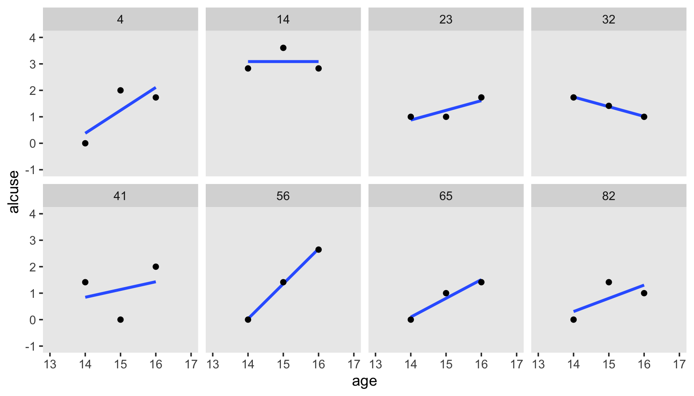

By this figure, Singer and Willett suggested the simple linear level-1 submodel following the form

\begin{align*}
\text{alcuse}_{ij} & = \pi_{0i} + \pi_{1i} (\text{age}_{ij} - 14) + \epsilon_{ij}\\
\epsilon_{ij}      & \sim \operatorname{Normal}(0, \sigma_\epsilon^2),
\end{align*}

where $\pi_{0i}$ is the initial status of participant $i$, $\pi_{1i}$ is participant $i$'s rate of change, and $\epsilon_{ij}$ is the variation in participant $i$'s data not accounted for in the model.

Singer and Willett made their Figure 4.2 "with a random sample of 32 of the adolescents" (p. 78). If we just wanted a random sample of rows, the `sample_n()` function would do the job. But since we're working with long data, we'll need some `group_by()` + `nest()` mojo. I got the trick from [Jenny Bryan](https://jennybryan.org/)'s vignette, [*Sample from groups, n varies by group*](https://jennybc.github.io/purrr-tutorial/ls12_different-sized-samples.html). Setting the seed makes the results from `sample_n()` reproducible. Here are the top panels.


```r
set.seed(4)

alcohol1_pp %>% 
  group_by(id) %>% 
  nest() %>% 
  sample_n(size = 32, replace = T) %>% 
  unnest(data) %>%
  mutate(coa = ifelse(coa == 0, "coa = 0", "coa = 1")) %>%

  ggplot(aes(x = age, y = alcuse, group = id)) +
  stat_smooth(method = "lm", se = F, linewidth = 1/4) +
  coord_cartesian(xlim = c(13, 17),
                  ylim = c(-1, 4)) +
  theme(panel.grid = element_blank()) +
  facet_wrap(~ coa)
```


We have similar data wrangling needs for the bottom panels.


```r
set.seed(4)

alcohol1_pp %>% 
  group_by(id) %>% 
  nest() %>% 
  ungroup() %>% 
  sample_n(size = 32, replace = T) %>% 
  unnest(data) %>%
  mutate(hp = ifelse(peer < mean(peer), "low peer", "high peer")) %>%
  mutate(hp = factor(hp, levels = c("low peer", "high peer"))) %>%

  ggplot(aes(x = age, y = alcuse, group = id)) +
  stat_smooth(method = "lm", se = F, linewidth = 1/4) +
  coord_cartesian(xlim = c(13, 17),
                  ylim = c(-1, 4)) +
  theme(panel.grid = element_blank()) +
  facet_wrap(~ hp)
```

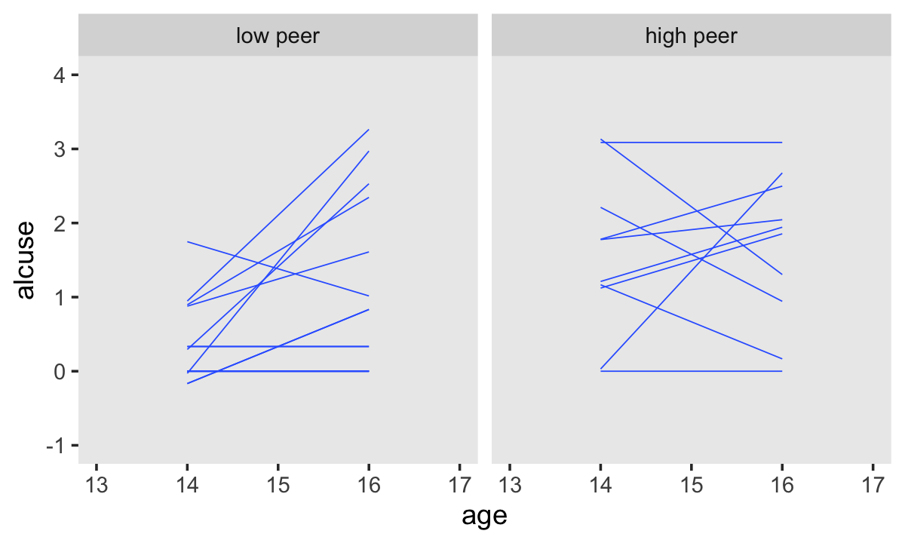

Based on the exploratory analyses, Singer and Willett posited the initial level-2 submodel might take the form

$$
\begin{align*}
\pi_{0i} & = \gamma_{00} + \gamma_{01} \text{coa}_i + \zeta_{0i}\\
\pi_{1i} & = \gamma_{10} + \gamma_{11} \text{coa}_i + \zeta_{1i} \\

\begin{bmatrix} \zeta_{0i} \\ \zeta_{1i} \end{bmatrix} & \sim \operatorname{Normal} \begin{pmatrix} 
\begin{bmatrix} 0 \\ 0 \end{bmatrix}, 
\begin{bmatrix} \sigma_0^2 & \sigma_{01}\\ \sigma_{01} & \sigma_1^2 \end{bmatrix}
\end{pmatrix},
\end{align*}
$$


where $\gamma_{00}$ and $\gamma_{10}$ are the level-2 intercepts, the population averages when $\text{coa} = 0$, $\gamma_{10}$ and $\gamma_{11}$ are the level-2 slopes expressing the difference when $\text{coa} = 1$ and $\zeta_{0i}$ and $\zeta_{1i}$ are the unexplained variation across the $\text{id}$-level intercepts and slopes. Since we'll be fitting the model with `brms::brm()`, the $\Sigma$ matrix will be parameterized in terms of standard deviations and their correlation. So we might reexpress the model as

$$
\begin{align*}
\pi_{0i} & = \gamma_{00} + \gamma_{01} \text{coa}_i + \zeta_{0i}\\
\pi_{1i} & = \gamma_{10} + \gamma_{11} \text{coa}_i + \zeta_{1i} \\

\begin{bmatrix} \zeta_{0i} \\ \zeta_{1i} \end{bmatrix} & \sim \operatorname{Normal} \begin{pmatrix}
\begin{bmatrix} 0 \\ 0 \end{bmatrix}, 
\begin{bmatrix} \sigma_0 & \rho_{01}\\ \rho_{01} & \sigma_1 \end{bmatrix}
\end{pmatrix}.
\end{align*}
$$

## The composite specification of the multilevel model for change

With a little algebra, we can combine the level-1 and level-2 submodels into the composite multilevel model for change, which follows the form

$$
\begin{align*}
\text{alcuse}_{ij} & = \big [ \gamma_{00} + \gamma_{10} \text{age_14}_{ij} + \gamma_{01} \text{coa}_i + \gamma_{11} (\text{coa}_i \times \text{age_14}_{ij}) \big ] \\
& \;\;\;\;\; + [ \zeta_{0i} + \zeta_{1i} \text{age_14}_{ij} + \epsilon_{ij} ] \\
\epsilon_{ij} & \sim \operatorname{Normal} (0, \sigma_\epsilon^2) \\

\begin{bmatrix} \zeta_{0i} \\ \zeta_{1i} \end{bmatrix} & \sim \operatorname{Normal} 
\begin{pmatrix}
\begin{bmatrix} 0 \\ 0 \end{bmatrix}, 
\begin{bmatrix} \sigma_0^2 & \sigma_{01} \\ \sigma_{01} & \sigma_1^2 \end{bmatrix}
\end{pmatrix},
\end{align*}
$$

where the brackets in the first line partition the structural model (i.e., the model for $\mu$) and the stochastic components (i.e., the $\sigma$ terms). We should note that this is the format that most closely mirrors what we use in the `formula` argument in `brms::brm()`. As long as `age` is not centered on the mean, our **brms** syntax would be: `formula = alcuse ~ 0 + Intercept + age_c + coa + age_c:coa + (1 + age_c | id)`.

### The structural component of the composite model.

> Although their interpretation is identical, the $\gamma$s in the composite model describe patterns of change in a different way. Rather than postulating first how *ALCUSE* is related to *TIME* and the individual growth parameters, and second how the individual growth parameters are related to *COA*, the composite specification in equation 4.3 postulates that *ALCUSE* depends *simultaneously* on: (1) the level-1 predictor, *TIME*; (2) the level-2 predictor, *COA*; and (3) the *cross-level* interaction, *COA* by *TIME*. From this perspective, the composite model's structural portion strongly resembles a regular regression model with predictors, *TIME* and *COA*, appearing as main effects (associated with $\gamma_{10}$ and $\gamma_{01}$, respectively) and in a *cross-level* interaction (associated with $\gamma_{11}$). (p. 82, *emphasis* in the original)

### The stochastic component of the composite model.

> A distinctive feature of the composite multilevel model is its composite residual, the three terms in the second set of brackets on the right of equation 4.3 that combine together the level-1 residual and the two level-2 residuals:
>
> $$\text{Composite residual: } [ \zeta_{0i} +  \zeta_{1i} \text{age_14}_{ij} + \epsilon_{ij} ].$$
> The composite residual is not a simple sum. Instead, the second level-2 residual, $\zeta_{1i}$, is multiplied by the level-1 predictor, $[\text{age_14}_{ij}]$, before joining its siblings. Despite its unusual construction, the interpretation of the composite residual is straightforward: it describes the difference between the observed and expected value of $[\text{alcuse}]$ for individual $i$ on occasion $j$.
>
> The mathematical form of the composite residual reveals two important properties about the occasion-specific residuals not readily apparent in the level-1/level-2 specification: they can be both *autocorrelated* and *heteroscedastic* within person. (p. 84, *emphasis* in the original)

## Methods of estimation, revisited

In this section, the authors introduced generalized least squares (GLS) estimation and iterative generalized least squares (IGLS) estimation and then distinguished between full and restricted maximum likelihood estimation. Since our goal is to fit these models as Bayesians, we won't be using or discussing any of these in this project. There are, of course, different ways to approach Bayesian estimation. Though we're using Hamiltonian Monte Carlo, we could use other algorithms, such as the Gibbs sampler. However, all that is outside of the scope of this project.

I suppose the only thing to add is that whereas GLS estimates come from minimizing a weighted function of the residuals and maximum likelihood estimates come from maximizing the log-likelihood function, the results of our Bayesian analyses (i.e., the posterior distribution) come from the consequences of Bayes' theorem,

$$
p(\theta \mid d) = \frac{p(d \mid \theta)\ p(\theta)}{p(d)}.
$$

If you really want to dive into the details of this, I suggest referencing a proper introductory Bayesian textbook, such as McElreath [-@mcelreathStatisticalRethinkingBayesian2015; -@mcelreathStatisticalRethinkingBayesian2020], Kruschke [-@kruschkeDoingBayesianData2015], or @gelman2013bayesian. I haven't had time to check it out, but I've heard Labmert's [-@lambertAStudentsGuidetoBayes2018] text is good, too. And for details specific to Stan, and thus **brms**, you might check out the documentation resources at [https://mc-stan.org/users/documentation/](https://mc-stan.org/users/documentation/).

## First steps: Fitting two unconditional multilevel models for change

Singer and Willett recommended that before you fit your full theoretical multilevel model of change--the one with all the interesting covariates--you should fit two simpler preliminary models. The first is the *unconditional means model*. The second is the *unconditional growth model*.

I agree. In addition to the reasons they cover in the text, this is just good pragmatic data analysis. Start simple and build up to the more complicated models only after you're confident you understand what's going on with the simpler ones. And if you're new to them, you'll discover this is especially so with Bayesian methods.

### The unconditional means model.

The likelihood for the unconditional means model follows the formula

$$
\begin{align*}
\text{alcuse}_{ij} & =  \gamma_{00} +  \zeta_{0i} + \epsilon_{ij} \\
\epsilon_{ij}      & \sim \operatorname{Normal}(0, \sigma_\epsilon^2) \\
\zeta_{0i}         & \sim \operatorname{Normal}(0, \sigma_0^2).
\end{align*}
$$

Let's open **brms**.


```r
library(brms)
```

Up till this point, we haven't focused on priors. It would have been reasonable to wonder if we'd been using them at all. Yes, we have. Even if you don't specify priors in the `brm()` function, it'll compute default weakly-informative priors for you. You might be wondering, *What might these default priors look like?* The `get_prior()` function let us take a look.


```r
get_prior(data = alcohol1_pp, 
          family = gaussian,
          alcuse ~ 1 + (1 | id))
```

```
##                 prior     class      coef group resp dpar nlpar lb ub       source
##  student_t(3, 1, 2.5) Intercept                                            default
##  student_t(3, 0, 2.5)        sd                                  0         default
##  student_t(3, 0, 2.5)        sd              id                  0    (vectorized)
##  student_t(3, 0, 2.5)        sd Intercept    id                  0    (vectorized)
##  student_t(3, 0, 2.5)     sigma                                  0         default
```

For this model, all three priors are based on Student's $t$-distribution. In case you're rusty, the normal distribution is just a special case of Student's $t$-distribution. Whereas the normal is defined by two parameters ($\mu$ and $\sigma$), the $t$ distribution is defined by $\nu$, $\mu$, and $\sigma$. In frequentist circles, $\nu$ is often called the *degrees of freedom*. More generally, it's also referred to as a *normality* parameter. We'll examine the prior more closely in a bit.

For now, let's practice setting our priors by manually specifying them within `brm()`. You do with the `prior` argument. There are actually several ways to do this. To explore all the options, check out the `set_prior` section of the [**brms** reference manual](https://CRAN.R-project.org/package=brms/brms.pdf) [@brms2021RM]. I typically define my individual priors with the `prior()` function. When there are more than one priors to define, I typically bind them together within `c(...)`.

Other than the addition of our fancy `prior` statement, the rest of the settings within `brm()` are much like those in prior chapters. Let's fit the model.


```r
fit4.1 <-
  brm(data = alcohol1_pp, 
      family = gaussian,
      alcuse ~ 1 + (1 | id),
      prior = c(prior(student_t(3, 1, 2.5), class = Intercept),
                prior(student_t(3, 0, 2.5), class = sd),
                prior(student_t(3, 0, 2.5), class = sigma)),
      iter = 2000, warmup = 1000, chains = 4, cores = 4,
      seed = 4,
      file = "fits/fit04.01")
```

Here are the results.


```r
print(fit4.1)
```

```
##  Family: gaussian 
##   Links: mu = identity; sigma = identity 
## Formula: alcuse ~ 1 + (1 | id) 
##    Data: alcohol1_pp (Number of observations: 246) 
##   Draws: 4 chains, each with iter = 2000; warmup = 1000; thin = 1;
##          total post-warmup draws = 4000
## 
## Group-Level Effects: 
## ~id (Number of levels: 82) 
##               Estimate Est.Error l-95% CI u-95% CI Rhat Bulk_ESS Tail_ESS
## sd(Intercept)     0.77      0.08     0.61     0.94 1.00     1513     2071
## 
## Population-Level Effects: 
##           Estimate Est.Error l-95% CI u-95% CI Rhat Bulk_ESS Tail_ESS
## Intercept     0.92      0.10     0.73     1.12 1.00     2194     2304
## 
## Family Specific Parameters: 
##       Estimate Est.Error l-95% CI u-95% CI Rhat Bulk_ESS Tail_ESS
## sigma     0.75      0.04     0.68     0.84 1.00     3220     3037
## 
## Draws were sampled using sampling(NUTS). For each parameter, Bulk_ESS
## and Tail_ESS are effective sample size measures, and Rhat is the potential
## scale reduction factor on split chains (at convergence, Rhat = 1).
```

Compare the results to those listed under "Model A" in Table 4.1. It's important to keep in mind that **brms** returns 'sigma' and 'sd(Intercept)' in the standard deviation metric rather than the variance metric. "*But I want them in the variance metric like in the text!*", you say. Okay fine. The best way to do the transformations is after saving the results from `as_draws_df()`.


```r
draws <- as_draws_df(fit4.1)

# first 12 columns
glimpse(draws[, 1:12])
```

```
## Rows: 4,000
## Columns: 12
## $ b_Intercept         <dbl> 0.9406565, 0.9862519, 0.8047797, 0.9481130, 0.8541637, 0.8386853, 0.92…
## $ sd_id__Intercept    <dbl> 0.7185852, 0.6471299, 0.7926978, 0.7718956, 0.7410648, 0.6956998, 0.78…
## $ sigma               <dbl> 0.7373521, 0.8087970, 0.8117765, 0.8095093, 0.8179681, 0.7830781, 0.77…
## $ `r_id[1,Intercept]` <dbl> 0.9163717, 0.6145222, 0.2345081, 0.7683651, 0.3509155, 0.6096043, 1.01…
## $ `r_id[2,Intercept]` <dbl> -1.009483116, 0.249090063, -0.562924108, 0.203001424, 0.173337825, -0.…
## $ `r_id[3,Intercept]` <dbl> 0.1852035, 1.6224810, -0.4611725, 1.1150763, 0.6648818, 0.7228837, 1.0…
## $ `r_id[4,Intercept]` <dbl> 0.35781229, -0.01697348, 0.83689995, 0.89752770, 0.88948250, 0.6430061…
## $ `r_id[5,Intercept]` <dbl> -0.68773929, -0.65962658, -1.06090865, -0.71889869, -0.55364888, 0.159…
## $ `r_id[6,Intercept]` <dbl> 1.6937918, 1.5190274, 1.1928640, 1.3234571, 1.8810541, 1.9431236, 1.49…
## $ `r_id[7,Intercept]` <dbl> 0.82085231, 0.43493772, 0.73868701, 0.06875076, 0.91568144, 0.16150059…
## $ `r_id[8,Intercept]` <dbl> -0.44182207, -0.82966404, -0.29547227, -0.84191779, -0.45499854, -0.56…
## $ `r_id[9,Intercept]` <dbl> 0.316124825, 0.621843617, -0.346237928, 0.162988921, 0.530201557, 0.30…
```

Since all we're interested in are the variance components, we'll `select()` out the relevant columns from `draws`, compute the squared versions, and save the results in a mini data frame, `v`.


```r
v <-
  draws %>% 
  select(sigma, sd_id__Intercept) %>% 
  mutate(sigma_2_epsilon = sigma^2,
         sigma_2_0       = sd_id__Intercept^2)

head(v)
```

```
## # A tibble: 6 × 4
##   sigma sd_id__Intercept sigma_2_epsilon sigma_2_0
##   <dbl>            <dbl>           <dbl>     <dbl>
## 1 0.737            0.719           0.544     0.516
## 2 0.809            0.647           0.654     0.419
## 3 0.812            0.793           0.659     0.628
## 4 0.810            0.772           0.655     0.596
## 5 0.818            0.741           0.669     0.549
## 6 0.783            0.696           0.613     0.484
```

We can view their distributions like this.


```r
v %>% 
  pivot_longer(everything()) %>% 
  
  ggplot(aes(x = value)) +
  geom_vline(xintercept = c(.25, .5, .75, 1), color = "white") +
  geom_density(size = 0, fill = "black") +
  scale_x_continuous(NULL, limits = c(0, 1.25),
                     breaks = seq(from = 0, to = 1.25, by = .25)) +
  scale_y_continuous(NULL, breaks = NULL) +
  theme(panel.grid = element_blank()) +
  facet_wrap(~ name, scales = "free_y")
```


In case it's hard to follow what just happened, the estimates in the **brms**-default standard-deviation metric are the two panels on the top. Those on the bottom are in the Singer-and-Willett style variance metric. Like we discussed toward the end of last chapter, the variance parameters won't often be Gaussian. In my experience, they're typically skewed to the right. There's nothing wrong with that. This is a recurrent pattern among distributions that are constrained to be zero and above.

If you're interested, you can summarize those posteriors like so.


```r
v %>% 
  pivot_longer(everything()) %>% 
  group_by(name) %>% 
  summarise(mean   = mean(value),
            median = median(value),
            sd     = sd(value),
            ll     = quantile(value, prob = .025),
            ul     = quantile(value, prob = .975)) %>% 
  # this last bit just rounds the output
  mutate_if(is.double, round, digits = 3)
```

```
## # A tibble: 4 × 6
##   name              mean median    sd    ll    ul
##   <chr>            <dbl>  <dbl> <dbl> <dbl> <dbl>
## 1 sd_id__Intercept 0.766  0.761 0.084 0.612 0.945
## 2 sigma            0.755  0.752 0.042 0.678 0.841
## 3 sigma_2_0        0.593  0.58  0.131 0.375 0.893
## 4 sigma_2_epsilon  0.571  0.566 0.064 0.459 0.707
```

For this model, our posterior medians are closer to the estimates in the text (Table 4.1) than the means. However, our posterior standard deviations are pretty close to the standard errors in the text.

One of the advantages of our Bayesian method is that when we compute something like the intraclass correlation coefficient $\rho$, we get an entire distribution for the parameter rather than a measly point estimates. This is always the case with Bayes. The algebraic transformations of the posterior distribution are themselves distributions. Before we compute $\rho$, do pay close attention to the formula,

$$
\rho = \frac{\sigma_0^2}{\sigma_0^2 + \sigma_\epsilon^2}.
$$

Even though our **brms** output yields the variance parameters in the standard-deviation metric, the formula for $\rho$ demands we use variances. That's nothing a little squaring can't fix. Here's what our $\rho$ looks like.


```r
v %>%
  transmute(rho = sd_id__Intercept^2 / (sd_id__Intercept^2 + sigma^2)) %>% 
  
  ggplot(aes(x = rho)) +
  geom_density(size = 0, fill = "black") +
  scale_x_continuous(expression(rho), limits = 0:1) +
  scale_y_continuous(NULL, breaks = NULL) +
  theme(panel.grid = element_blank())
```


Though the posterior for $\rho$ is indeed centered around .5, look at how wide and uncertain that distribution is. The bulk of the posterior mass takes up almost half of the parameter space. If you wanted the summary statistics, you might do what we did for the variance parameters, above.


```r
v %>%
  transmute(rho = sd_id__Intercept^2 / (sd_id__Intercept^2 + sigma^2)) %>% 
  summarise(mean   = mean(rho),
            median = median(rho),
            sd     = sd(rho),
            ll     = quantile(rho, prob = .025),
            ul     = quantile(rho, prob = .975)) %>% 
  mutate_if(is.double, round, digits = 3)
```

```
## # A tibble: 1 × 5
##    mean median    sd    ll    ul
##   <dbl>  <dbl> <dbl> <dbl> <dbl>
## 1 0.505  0.507 0.065 0.371 0.624
```

Concerning $\rho$, Singer and Willett pointed out

> it summarizes the size of the residual autocorrelation in the composite unconditional means mode....
>
> Each person has a different composite residual on each occasion of measurement. But notice the difference in the subscripts of the pieces of the composite residual: while the level-1 residual, $\epsilon_{ij}$ has two subscripts ($i$ and $j$), the level-2 residual, $\zeta_{0i}$, has only one ($i$). Each person can have a different $\epsilon_{ij}$ on each occasion, but has only one $\zeta_{0i}$ across every occasion. The repeated presence of $\zeta_{0i}$ in individual $i$'s composite residual links his or her composite residuals across occasions. The error autocorrelation coefficient quantifies the magnitude of this linkage; in the unconditional means model, the error autocorrelation coefficient *is* the intraclass correlation coefficient. Thus, we estimate that, for each person, the average correlation between any pair of composite residuals--between occasions 1 and 2, or 2 and 3, or 1 and 3--is [.5]. (pp. 96--97, *emphasis* in the original)

Because of the differences in how they're estimated with and presented by `brm()`, we focused right on the variance components. But before we move on to the next section, we should back up a bit. On page 93, Singer and Willett discussed their estimate for $\gamma_{00}$. Here's ours.


```r
fixef(fit4.1)
```

```
##            Estimate  Est.Error     Q2.5    Q97.5
## Intercept 0.9226063 0.09813736 0.728995 1.119117
```

They talked about how squaring that value puts it back to the natural metric the data were originally collected in. [Recall that as discussed earlier in the text the `alcuse` variable was square-root transformed because of excessive skew.] If you want a quick and dirty look, you can square our results, too.


```r
fixef(fit4.1)^2 
```

```
##            Estimate   Est.Error      Q2.5    Q97.5
## Intercept 0.8512023 0.009630941 0.5314337 1.252424
```

However, I do not recommend this method. Though it did okay at transforming the posterior mean (i.e., Estimate), it's not a great way to get the summary statistics correct. To do that, you'll need to work with the posterior samples themselves. Remember how we saved them as `draws`? Let's refresh ourselves and look at the first few columns.


```r
draws %>% 
  select(b_Intercept:sigma) %>% 
  head()
```

```
## # A tibble: 6 × 3
##   b_Intercept sd_id__Intercept sigma
##         <dbl>            <dbl> <dbl>
## 1       0.941            0.719 0.737
## 2       0.986            0.647 0.809
## 3       0.805            0.793 0.812
## 4       0.948            0.772 0.810
## 5       0.854            0.741 0.818
## 6       0.839            0.696 0.783
```

See that `b_Intercept` column there? That contains our posterior draws from $\gamma_{00}$. If you want proper summary statistics from the transformed estimate, get them after transforming that column.


```r
draws %>% 
  transmute(gamma_00_squared = b_Intercept^2) %>% 
  summarise(mean   = mean(gamma_00_squared),
            median = median(gamma_00_squared),
            sd     = sd(gamma_00_squared),
            ll     = quantile(gamma_00_squared, prob = .025),
            ul     = quantile(gamma_00_squared, prob = .975)) %>%
  mutate_if(is.double, round, digits = 3) %>% 
  pivot_longer(everything())
```

```
## # A tibble: 5 × 2
##   name   value
##   <chr>  <dbl>
## 1 mean   0.861
## 2 median 0.849
## 3 sd     0.181
## 4 ll     0.531
## 5 ul     1.25
```

And one last bit before we move on to the next section. Remember how we discovered what the `brm()` default priors were for our model with the handy `get_prior()` function? Let's refresh ourselves on how that worked.


```r
get_prior(data = alcohol1_pp, 
          family = gaussian,
          alcuse ~ 1 + (1 | id))
```

```
##                 prior     class      coef group resp dpar nlpar lb ub       source
##  student_t(3, 1, 2.5) Intercept                                            default
##  student_t(3, 0, 2.5)        sd                                  0         default
##  student_t(3, 0, 2.5)        sd              id                  0    (vectorized)
##  student_t(3, 0, 2.5)        sd Intercept    id                  0    (vectorized)
##  student_t(3, 0, 2.5)     sigma                                  0         default
```

We inserted the data and the model and `get_prior()` returned the default priors. Especially for new Bayesians, or even for experienced Bayesians working with unfamiliar models, it can be handy to plot your priors to get a sense of them.

Base **R** has an array of functions based on the $t$ distribution (e.g., `rt()`, `dt()`). These functions are limited in that while they allow users to select the desired $\nu$ values (i.e., degrees of freedom), they fix $\mu = 0$ and $\sigma = 1$. If you want to stick with the base **R** functions, you can find tricky ways around this. To avoid overwhelming anyone new to Bayes or the multilevel model or **R** or some exasperating combination, let's just make things simpler and use a couple convenience functions from the [**ggdist** package](https://CRAN.R-project.org/package=ggdist) [@R-ggdist].

We'll start with the default intercept prior, $t(\nu = 3, \mu = 1, \sigma = 2.5)$. Here's the density in the range $[-20, 20]$.


```r
library(ggdist)
```

```
## 
## Attaching package: 'ggdist'
```

```
## The following objects are masked from 'package:brms':
## 
##     dstudent_t, pstudent_t, qstudent_t, rstudent_t
```

```r
prior(student_t(3, 1, 2.5)) %>% 
  parse_dist() %>% 
  
  ggplot(aes(xdist = .dist_obj, y = prior)) + 
  stat_halfeye(.width = .95, p_limits = c(.001, .999)) +
  scale_y_discrete(NULL, breaks = NULL, expand = expansion(add = 0.1)) +
  labs(title = expression(paste("prior for ", gamma[0][0])),
       x = "parameter space") +
  theme(panel.grid = element_blank()) +
  coord_cartesian(xlim = c(-20, 20))
```

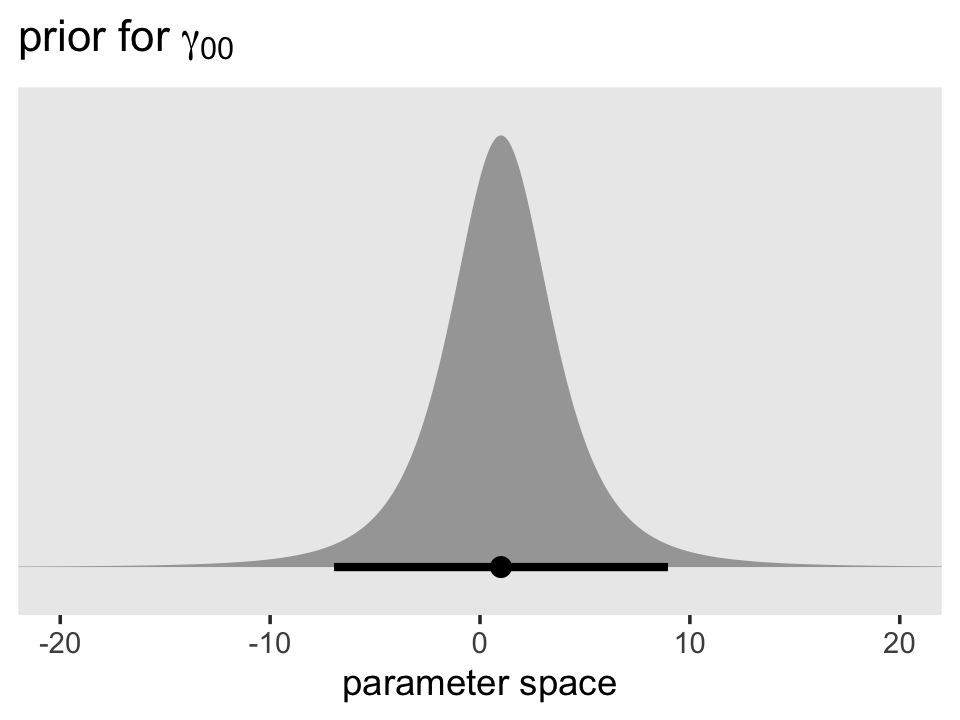

Though it's centered on 1, the inner 95% of the density is well between -10 and 10. Given the model estimate ended up about 0.9, it looks like that was a pretty broad and minimally-informative prior. However, the prior isn't flat and it does help guard against wasting time and HMC iterations sampling from ridiculous regions of the parameter space such as -10,000 or +500,000,000. No adolescent is drinking that much (or that little--how does one drink a negative value?).

Here's the shape of the variance priors.


```r
prior(student_t(3, 0, 2.5), lb = 0) %>% 
  parse_dist() %>% 
  
  ggplot(aes(xdist = .dist_obj, y = prior)) + 
  stat_halfeye(.width = .95, p_limits = c(.001, .999)) +
  scale_y_discrete(NULL, breaks = NULL, expand = expansion(add = 0.1)) +
  labs(title = expression(paste("prior for both ", sigma[0], " and ", sigma[epsilon])),
       x = "parameter space") +
  coord_cartesian(xlim = c(0, 20)) +
  theme(panel.grid = element_blank())
```


Recall that by **brms** default, the variance parameters have a lower-limit of 0. So specifying a Student's $t$ or other Gaussian-like prior on them ends up cutting the distribution off at 0. Given that our estimates were both below 1, it appears that these priors were minimally informative. But again, they did help prevent `brm()` from sampling from negative values or from obscenely-large values.

*These priors look kinda silly*, you might say. *Anyone with a little common sense can do better*. Well, sure. Probably. Maybe. But keep in mind we're still getting the layout of the land. And plus, this was a pretty simple model. Selecting high-quality priors gets tricky as the models get more complicated. In other chapters, we'll explore other ways to specify priors for our multilevel models. But to keep things simple for now, let's keep practicing inspecting and using the defaults with `get_prior()` and so on.

### The unconditional growth model.

Using the composite formula, our next model, the unconditional growth model, follows the form

$$
\begin{align*}
\text{alcuse}_{ij} & = \gamma_{00} + \gamma_{10} \text{age_14}_{ij} + \zeta_{0i} + \zeta_{1i} \text{age_14}_{ij} + \epsilon_{ij} \\
\epsilon_{ij} & \sim \operatorname{Normal} (0, \sigma_\epsilon^2) \\
\begin{bmatrix} \zeta_{0i} \\ \zeta_{1i} \end{bmatrix} & \sim \operatorname{Normal} 
\begin{pmatrix}
\begin{bmatrix} 0 \\ 0 \end{bmatrix}, 
\begin{bmatrix} \sigma_0^2 & \sigma_{01} \\ \sigma_{01} & \sigma_1^2 \end{bmatrix}
\end{pmatrix}.
\end{align*}
$$

With it, we now have a full composite stochastic model. Let's query the `brms::brm()` default priors when we apply this model to our data.


```r
get_prior(data = alcohol1_pp, 
          family = gaussian,
          alcuse ~ 0 + Intercept + age_14 + (1 + age_14 | id))
```

```
##                 prior class      coef group resp dpar nlpar lb ub       source
##                (flat)     b                                            default
##                (flat)     b    age_14                             (vectorized)
##                (flat)     b Intercept                             (vectorized)
##                lkj(1)   cor                                            default
##                lkj(1)   cor              id                       (vectorized)
##  student_t(3, 0, 2.5)    sd                                  0         default
##  student_t(3, 0, 2.5)    sd              id                  0    (vectorized)
##  student_t(3, 0, 2.5)    sd    age_14    id                  0    (vectorized)
##  student_t(3, 0, 2.5)    sd Intercept    id                  0    (vectorized)
##  student_t(3, 0, 2.5) sigma                                  0         default
```

Several things of note: First, notice how we continue to use the `student_t(3, 0, 2.5)` for all three of our standard-deviation-metric variance parameters. Since we're now estimating $\sigma_0$ and $\sigma_1$, which themselves have a correlation, $\rho_{01}$, we have a prior of `class = cor`. I'm going to put off what is meant by the name `lkj`, but for the moment just realize that this prior is essentially noninformative within this context.

There's a major odd development with this output. Notice how the `prior` column is `(flat)` for the rows for our two coefficients of class `b`. And if you're a little confused, recall that because our predictor `age_14` is not mean-centered, we've used the `0 + Intercept` syntax, which switches the model intercept parameter to the class of `b`. From the `set_prior` section of the [reference manual](https://cran.r-project.org/web/packages/brms/brms.pdf) for **brms** version 2.12.0, we read: "The default prior for population-level effects (including monotonic and category specific effects) is an improper flat prior over the reals" (p. 179). At present, these priors are uniform across the entire parameter space. They're not just weak, their entirely noninformative. That is, the likelihood dominates the posterior for those parameters.

Here's how to fit the model with these priors.


```r
fit4.2 <-
  brm(data = alcohol1_pp, 
      family = gaussian,
      alcuse ~ 0 + Intercept + age_14 + (1 + age_14 | id),
      prior = c(prior(student_t(3, 0, 2.5), class = sd),
                prior(student_t(3, 0, 2.5), class = sigma),
                prior(lkj(1), class = cor)),
      iter = 2000, warmup = 1000, chains = 4, cores = 4,
      seed = 4,
      control = list(adapt_delta = .9),
      file = "fits/fit04.02")
```

How did we do?


```r
print(fit4.2, digits = 3)
```

```
##  Family: gaussian 
##   Links: mu = identity; sigma = identity 
## Formula: alcuse ~ 0 + Intercept + age_14 + (1 + age_14 | id) 
##    Data: alcohol1_pp (Number of observations: 246) 
##   Draws: 4 chains, each with iter = 2000; warmup = 1000; thin = 1;
##          total post-warmup draws = 4000
## 
## Group-Level Effects: 
## ~id (Number of levels: 82) 
##                       Estimate Est.Error l-95% CI u-95% CI  Rhat Bulk_ESS Tail_ESS
## sd(Intercept)            0.792     0.103    0.595    0.998 1.001      803     1574
## sd(age_14)               0.368     0.092    0.155    0.529 1.007      360      314
## cor(Intercept,age_14)   -0.120     0.263   -0.504    0.583 1.004      499      379
## 
## Population-Level Effects: 
##           Estimate Est.Error l-95% CI u-95% CI  Rhat Bulk_ESS Tail_ESS
## Intercept    0.650     0.107    0.438    0.865 1.003     2078     2594
## age_14       0.272     0.065    0.147    0.400 1.001     3540     2850
## 
## Family Specific Parameters: 
##       Estimate Est.Error l-95% CI u-95% CI  Rhat Bulk_ESS Tail_ESS
## sigma    0.604     0.051    0.515    0.715 1.003      435      500
## 
## Draws were sampled using sampling(NUTS). For each parameter, Bulk_ESS
## and Tail_ESS are effective sample size measures, and Rhat is the potential
## scale reduction factor on split chains (at convergence, Rhat = 1).
```

If your compare our results with those in the "Model B" column in Table 4.1, you'll see our summary results match well with those in the text. Our $\gamma$'s (i.e., 'Population-Level Effects:') are near identical. The leftmost panel in Figure 4.3 shows the prototypical trajectory, based on the $\gamma$s. A quick way to get that within our **brms** framework is with the `conditional_effects()` function. Here's the default output.


```r
conditional_effects(fit4.2)
```


Staying with `conditional_effects()` allows users some flexibility for customizing the plot(s). For example, the default behavior is to depict the trajectory in terms of its 95% intervals and posterior median. If you'd prefer the 80% intervals and the posterior mean, customize it like so.


```r
conditional_effects(fit4.2,
                    robust = F,
                    prob = .8)
```


We'll explore more options with `brms::conditional_effects()` with Model C. For now, let's turn our focus on the stochastic elements in the model. Here we extract the posterior samples and do the conversions to see how they compare with Singer and Willett's.


```r
draws <- as_draws_df(fit4.2)

v <-
  draws %>% 
  transmute(sigma_2_epsilon = sigma^2,
            sigma_2_0       = sd_id__Intercept^2,
            sigma_2_1       = sd_id__age_14^2,
            sigma_01        = sd_id__Intercept * cor_id__Intercept__age_14 * sd_id__age_14)

head(v)
```

```
## # A tibble: 6 × 4
##   sigma_2_epsilon sigma_2_0 sigma_2_1 sigma_01
##             <dbl>     <dbl>     <dbl>    <dbl>
## 1           0.316     0.568    0.104  -0.0409 
## 2           0.333     0.751    0.0648  0.0311 
## 3           0.429     0.543    0.0544  0.0210 
## 4           0.505     0.408    0.106   0.0311 
## 5           0.450     0.694    0.0122 -0.00762
## 6           0.454     0.501    0.0177  0.0522
```

This time, our `v` object only contains the stochastic components in the variance metric. Let's plot.


```r
v %>% 
  pivot_longer(everything()) %>% 
  
  ggplot(aes(x = value)) +
  geom_density(size = 0, fill = "black") +
  scale_y_continuous(NULL, breaks = NULL) +
  theme(panel.grid = element_blank()) +
  facet_wrap(~ name, scales = "free")
```

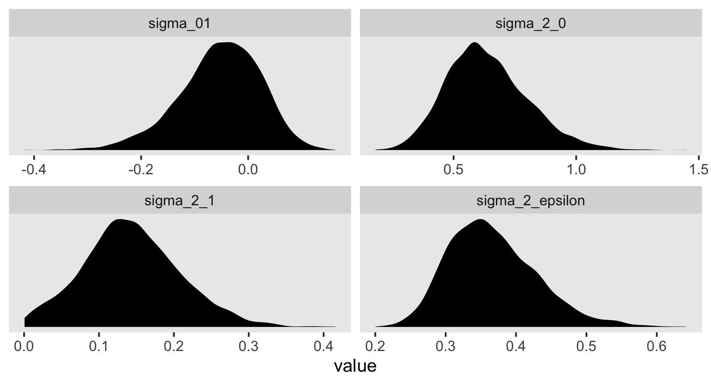

For each, their posterior mass is centered near the point estimates Singer and Willet reported in the text. Here are the summary statistics.


```r
v %>% 
  pivot_longer(everything()) %>% 
  group_by(name) %>% 
  summarise(mean   = mean(value),
            median = median(value),
            sd     = sd(value),
            ll     = quantile(value, prob = .025),
            ul     = quantile(value, prob = .975)) %>% 
  mutate_if(is.double, round, digits = 3)
```

```
## # A tibble: 4 × 6
##   name              mean median    sd     ll    ul
##   <chr>            <dbl>  <dbl> <dbl>  <dbl> <dbl>
## 1 sigma_01        -0.053 -0.047 0.076 -0.222 0.078
## 2 sigma_2_0        0.637  0.62  0.165  0.354 0.997
## 3 sigma_2_1        0.144  0.14  0.065  0.024 0.28 
## 4 sigma_2_epsilon  0.367  0.359 0.063  0.265 0.511
```

Happily, they're quite comparable to those in the text.

We’ve been pulling the posterior samples for all parameters with `as_draws_df()` and subsetting to a few variables of interest, such as the variance parameters. But it our primary interest is just the iterations for the variance parameters, we can extract them in a more focused way with the `VarCorr()` function. Here's how we'd do so for `fit4.2`.


```r
VarCorr(fit4.2, summary = F) %>% 
  str()
```

```
## List of 2
##  $ id        :List of 3
##   ..$ sd : num [1:4000, 1:2] 0.754 0.866 0.737 0.639 0.833 ...
##   .. ..- attr(*, "dimnames")=List of 2
##   .. .. ..$ draw    : chr [1:4000] "1" "2" "3" "4" ...
##   .. .. ..$ variable: chr [1:2] "Intercept" "age_14"
##   .. ..- attr(*, "nchains")= int 4
##   ..$ cor: num [1:4000, 1:2, 1:2] 1 1 1 1 1 1 1 1 1 1 ...
##   .. ..- attr(*, "dimnames")=List of 3
##   .. .. ..$ : NULL
##   .. .. ..$ : chr [1:2] "Intercept" "age_14"
##   .. .. ..$ : chr [1:2] "Intercept" "age_14"
##   ..$ cov: num [1:4000, 1:2, 1:2] 0.568 0.751 0.543 0.408 0.694 ...
##   .. ..- attr(*, "dimnames")=List of 3
##   .. .. ..$ : NULL
##   .. .. ..$ : chr [1:2] "Intercept" "age_14"
##   .. .. ..$ : chr [1:2] "Intercept" "age_14"
##  $ residual__:List of 1
##   ..$ sd: num [1:4000, 1] 0.562 0.577 0.655 0.71 0.671 ...
##   .. ..- attr(*, "dimnames")=List of 2
##   .. .. ..$ draw    : chr [1:4000] "1" "2" "3" "4" ...
##   .. .. ..$ variable: chr ""
##   .. ..- attr(*, "nchains")= int 4
```

That last part, the contents of the second higher-level list indexed by `$ residual`, contains the contents for $\sigma_\epsilon$. On page 100 in the text, Singer and Willett compared $\sigma_\epsilon^2$ from the first model to that from the second. We might do that like so.


```r
cbind(VarCorr(fit4.1, summary = F)[[2]][[1]],
      VarCorr(fit4.2, summary = F)[[2]][[1]]) %>% 
  data.frame() %>% 
  mutate_all(~.^2) %>% 
  set_names(str_c("fit4.", 1:2)) %>% 
  mutate(`fit4.1 - fit4.2` = fit4.1 - fit4.2) %>% 
  pivot_longer(everything()) %>% 
  mutate(name = factor(name, levels = c("fit4.1", "fit4.2", "fit4.1 - fit4.2"))) %>% 
  
  ggplot(aes(x = value)) +
  geom_vline(xintercept = .5, color = "white") +
  geom_density(fill = "grey25", color = "transparent") +
  scale_y_continuous(NULL, breaks = NULL) +
  xlab(expression(sigma[epsilon]^2)) +
  theme(panel.grid = element_blank()) +
  facet_wrap(~ name, scales = "free_y", ncol = 3)
```


To compute a formal summary of the decline in $\sigma_\epsilon^2$ after adding time to the model, we might summarize like before.


```r
cbind(VarCorr(fit4.1, summary = F)[[2]][[1]],
      VarCorr(fit4.2, summary = F)[[2]][[1]]) %>% 
  data.frame() %>% 
  mutate_all(~ .^2) %>% 
  set_names(str_c("fit4.", 1:2)) %>% 
  mutate(proportion_decline = (fit4.1 - fit4.2) / fit4.1) %>% 
  summarise(mean   = mean(proportion_decline),
            median = median(proportion_decline),
            sd     = sd(proportion_decline),
            ll     = quantile(proportion_decline, prob = .025),
            ul     = quantile(proportion_decline, prob = .975)) %>%
  mutate_if(is.double, round, digits = 3)
```

```
##   mean median    sd    ll    ul
## 1 0.35  0.365 0.132 0.051 0.569
```

In case it wasn't clear, when we presented `fit4.1 – fit4.2` in the density plot, that was a simple difference score. However, we computed `proportion_decline` above by dividing that difference score by `fit4.1`; that's what put the difference in a proportion metric. Anyway, Singer and Willett's method led them to summarize the decline as .40. Our method was a more conservative .34-ish. And very happily, our method allows us to describe the proportion decline with summary statistics for the full posterior, such as with the $\textit{SD}$ and the 95% intervals.


```r
draws %>% 
  ggplot(aes(x = cor_id__Intercept__age_14)) +
  geom_vline(xintercept = 0, color = "white") +
  geom_density(fill = "grey25", color = "transparent") +
  scale_x_continuous(expression(rho[0][1]), limits = c(-1, 1)) +
  scale_y_continuous(NULL, breaks = NULL) +
  theme(panel.grid = element_blank())
```


The estimate Singer and Willett hand-computed in the text, -.22, is near the mean of our posterior distribution for $\rho_{01}$. However, our distribution provides a full expression of the uncertainty in the parameter. As are many other values within the parameter space, zero is indeed a credible value for $\rho_{01}$.

On page 101, we get the generic formula for computing the residual variance for a given occasion $j$,

$$
\sigma_{\text{Residual}_j}^2 = \sigma_0^2 + \sigma_1^2 \text{time}_j + 2 \sigma_{01} \text{time}_j + \sigma_\epsilon^2.
$$

If we were just interested in applying it to one of our `age` values, say 14, we might apply the formula to the posterior like this.


```r
draws %>% 
  transmute(sigma_2_residual_j = sd_id__Intercept^2 + 
              sd_id__age_14^2 * 0 + 
              2 * sd_id__Intercept * cor_id__Intercept__age_14 * sd_id__age_14 * 0 + 
              sigma^2) %>% 
  head()
```

```
## # A tibble: 6 × 1
##   sigma_2_residual_j
##                <dbl>
## 1              0.884
## 2              1.08 
## 3              0.972
## 4              0.913
## 5              1.14 
## 6              0.955
```

But given we'd like to do so over several values of `age`, it might be better to wrap the equation in a custom function. Let's call it `make_s2rj()`.


```r
make_s2rj <- function(x) {
  draws %>% 
    transmute(sigma_2_residual_j = sd_id__Intercept^2 + sd_id__age_14^2 * x + 2 * sd_id__Intercept * cor_id__Intercept__age_14 * sd_id__age_14 * x + sigma^2) %>% 
    pull()
}
```

Now we can put our custom `make_s2rj()` function to work within the `purrr::map()` paradigm. We'll plot the results.


```r
tibble(age = 14:16) %>% 
  mutate(age_c = age - 14) %>% 
  mutate(s2rj = map(age_c, make_s2rj)) %>% 
  unnest(s2rj) %>% 
  mutate(label = str_c("age = ", age)) %>% 
  
  ggplot(aes(x = s2rj)) +
  geom_density(fill = "grey25", color = "transparent") +
  # just for reference 
  geom_vline(xintercept = 1, color = "grey92", linetype = 2) +
  scale_y_continuous(NULL, breaks = NULL) +
  labs(title = "Behold the shape of longitudinal heteroscedasticity.",
       x = expression(sigma[italic(Residual[j])]^2)) +
  theme(panel.grid = element_blank()) +
  facet_wrap(~ label, scales = "free_y", ncol = 1)
```


We see a subtle increase over time, particularly from `age = 15` to `age = 16`. Yep, that's heteroscedasticity. It is indeed "beyond the bland homoscedasticity we assume of residuals in cross-sectional data" (p. 101).

We might also be interested in computing the autocorrelation between the composite residuals on occasions $j$ and $j'$, which follows the formula

$$
\rho_{\text{Residual}_j, \text{Residual}_{j'}} = \frac{\sigma_0^2 + \sigma_{01} (\text{time}_j + \text{time}_{j'}) + \sigma_1^2 \text{time}_j \text{time}_{j'}} {\sqrt{\sigma_{\text{Residual}_j}^2 \sigma_{\text{Residual}_{j'}}^2 }}.
$$

We only want to do that by hand once. Let's make a custom function following the formula.


```r
 make_rho_rj_rjp <- function(j, jp) {
  
  # define the elements in the denominator  
  s2rj_j  <- make_s2rj(j)
  s2rj_jp <- make_s2rj(jp)
  
  # compute
  draws %>% 
    transmute(r = (sd_id__Intercept^2 + 
                     sd_id__Intercept * cor_id__Intercept__age_14 * sd_id__age_14 * (j + jp) + 
                     sd_id__age_14^2 * j * jp) /
                sqrt(s2rj_j * s2rj_jp)) %>% 
    pull()
}
```

If you only cared about measures of central tendency, such as the posterior median, you could use the function like this.


```r
make_rho_rj_rjp(0, 1) %>% median()
```

```
## [1] 0.5705756
```

```r
make_rho_rj_rjp(1, 2) %>% median()
```

```
## [1] 0.7269452
```

```r
make_rho_rj_rjp(0, 2) %>% median()
```

```
## [1] 0.5121775
```

Here are the full posteriors.


```r
tibble(occasion = 1:3) %>% 
  mutate(age_c = occasion - 1,
         j     = c(1, 2, 1) - 1,
         jp    = c(2, 3, 3) - 1) %>% 
  mutate(r = map2(j, jp, make_rho_rj_rjp)) %>% 
  unnest(r) %>% 
  mutate(label = str_c("occasions ", j + 1, " and ", jp + 1)) %>% 
  
  ggplot(aes(x = r)) +
  # just for reference
  geom_vline(xintercept = c(.5, .75), color = "white") +
  geom_density(fill = "grey25", color = "transparent") +
  scale_x_continuous(expression(rho[Residual[italic(j)]][Residual[italic(j*minute)]]), limits = 0:1) +
  scale_y_continuous(NULL, breaks = NULL) +
  ggtitle("Behold the shapes of our autocorrelations!") +
  theme(panel.grid = element_blank()) +
  facet_wrap(~ label, scales = "free_y", ncol = 1)
```


### Quantifying the proportion of outcome variation "explained."

Because of the way the multilevel model partitions off variance into different sources (e.g., $\sigma_0^2$, $\sigma_1^2$, and $\sigma_\epsilon^2$ in the unconditional growth model), the conventional $R^2$ is not applicable for evaluating models in the traditional OLS sense of percent of variance explained. Several pseudo $R^2$ statistics are frequently used instead. Be warned, "statisticians have yet to agree on appropriate summaries [@kreftIntroducingMultilevelModeling1998; @snijdersModeledVarianceTwolevel1994]" (p. 102). See also @jaegerR2StatisticFixed2017, @rightsEffectSizeMeasures2018, and @rights2020NewRecommendations. To my eye, none of the solutions presented in this section are magic bullets.

#### An overall summary of total outcome variability explained.

> In multiple regression, one simple way of computing a summary $R^2$ statistic is to square the sample correlation between observed and predicted values of the outcome. The same approach can be used in the multilevel model for change. All you need to do is: (1) compute the predicted outcome value for each person on each occasion of measurement; and (2) square the sample correlation between observed and predicted values. The resultant pseudo-$R^2$ statistic assesses the proportion of total outcome variation "explained" by the *multilevel model's specific contribution of predictors*. (p. 102, *emphasis* added)

Singer and Willett called this $R_{y, \hat y}^2$. They then walked through an example with their Model B (`fit4.2`), the unconditional growth model. Within our **brms** paradigm, we typically use the `fitted()` function to return predicted outcome values for cases within the data. The default option for the `fitted()` function is to return these predictions after accounting for the level-2 clustering. As we will see, Singer and Willett's $R_{y, \hat y}^2$ statistic only accounts for predictors (i.e., `age_14`, in this case), not clustering variables (i.e., `id`, in this case). To follow Singer and Willett's specification, we need to set `re_formula = NA`, which will instruct `fitted()` to return the expected values without reference to the level-2 clustering. Here's a look at the first six rows of that output.


```r
fitted(fit4.2, re_formula = NA) %>% 
  head()
```

```
##       Estimate  Est.Error      Q2.5     Q97.5
## [1,] 0.6497368 0.10745950 0.4380402 0.8652803
## [2,] 0.9218824 0.09834597 0.7247202 1.1173032
## [3,] 1.1940281 0.12716581 0.9444807 1.4488893
## [4,] 0.6497368 0.10745950 0.4380402 0.8652803
## [5,] 0.9218824 0.09834597 0.7247202 1.1173032
## [6,] 1.1940281 0.12716581 0.9444807 1.4488893
```

Within our Bayesian/**brms** paradigm, out expected values come with expressions of uncertainty in terms of the posterior standard deviation and percentile-based 95% intervals. If we followed Singer and Willett's method in the text, we'd only work with the posterior means as presented within the `Estimate` column. But since we're Bayesians, we should attempt to work with the model uncertainty. One approach is to set `summary = F`.


```r
f <-
  fitted(fit4.2,
         summary = F,
         re_formula = NA) %>%
  data.frame() %>% 
  set_names(1:ncol(.)) %>% 
  rownames_to_column("draw")

head(f)
```

```
##   draw         1         2        3         4         5        6         7         8        9
## 1    1 0.5987915 0.9220302 1.245269 0.5987915 0.9220302 1.245269 0.5987915 0.9220302 1.245269
## 2    2 0.8109860 1.0437653 1.276545 0.8109860 1.0437653 1.276545 0.8109860 1.0437653 1.276545
## 3    3 0.7543876 0.9813998 1.208412 0.7543876 0.9813998 1.208412 0.7543876 0.9813998 1.208412
## 4    4 0.6657516 0.9690807 1.272410 0.6657516 0.9690807 1.272410 0.6657516 0.9690807 1.272410
## 5    5 0.8239123 1.0726329 1.321353 0.8239123 1.0726329 1.321353 0.8239123 1.0726329 1.321353
## 6    6 0.6303015 0.9231454 1.215989 0.6303015 0.9231454 1.215989 0.6303015 0.9231454 1.215989
##          10        11       12        13        14       15        16        17       18        19
## 1 0.5987915 0.9220302 1.245269 0.5987915 0.9220302 1.245269 0.5987915 0.9220302 1.245269 0.5987915
## 2 0.8109860 1.0437653 1.276545 0.8109860 1.0437653 1.276545 0.8109860 1.0437653 1.276545 0.8109860
## 3 0.7543876 0.9813998 1.208412 0.7543876 0.9813998 1.208412 0.7543876 0.9813998 1.208412 0.7543876
## 4 0.6657516 0.9690807 1.272410 0.6657516 0.9690807 1.272410 0.6657516 0.9690807 1.272410 0.6657516
## 5 0.8239123 1.0726329 1.321353 0.8239123 1.0726329 1.321353 0.8239123 1.0726329 1.321353 0.8239123
## 6 0.6303015 0.9231454 1.215989 0.6303015 0.9231454 1.215989 0.6303015 0.9231454 1.215989 0.6303015
##          20       21        22        23       24        25        26       27        28        29
## 1 0.9220302 1.245269 0.5987915 0.9220302 1.245269 0.5987915 0.9220302 1.245269 0.5987915 0.9220302
## 2 1.0437653 1.276545 0.8109860 1.0437653 1.276545 0.8109860 1.0437653 1.276545 0.8109860 1.0437653
## 3 0.9813998 1.208412 0.7543876 0.9813998 1.208412 0.7543876 0.9813998 1.208412 0.7543876 0.9813998
## 4 0.9690807 1.272410 0.6657516 0.9690807 1.272410 0.6657516 0.9690807 1.272410 0.6657516 0.9690807
## 5 1.0726329 1.321353 0.8239123 1.0726329 1.321353 0.8239123 1.0726329 1.321353 0.8239123 1.0726329
## 6 0.9231454 1.215989 0.6303015 0.9231454 1.215989 0.6303015 0.9231454 1.215989 0.6303015 0.9231454
##         30        31        32       33        34        35       36        37        38       39
## 1 1.245269 0.5987915 0.9220302 1.245269 0.5987915 0.9220302 1.245269 0.5987915 0.9220302 1.245269
## 2 1.276545 0.8109860 1.0437653 1.276545 0.8109860 1.0437653 1.276545 0.8109860 1.0437653 1.276545
## 3 1.208412 0.7543876 0.9813998 1.208412 0.7543876 0.9813998 1.208412 0.7543876 0.9813998 1.208412
## 4 1.272410 0.6657516 0.9690807 1.272410 0.6657516 0.9690807 1.272410 0.6657516 0.9690807 1.272410
## 5 1.321353 0.8239123 1.0726329 1.321353 0.8239123 1.0726329 1.321353 0.8239123 1.0726329 1.321353
## 6 1.215989 0.6303015 0.9231454 1.215989 0.6303015 0.9231454 1.215989 0.6303015 0.9231454 1.215989
##          40        41       42        43        44       45        46        47       48        49
## 1 0.5987915 0.9220302 1.245269 0.5987915 0.9220302 1.245269 0.5987915 0.9220302 1.245269 0.5987915
## 2 0.8109860 1.0437653 1.276545 0.8109860 1.0437653 1.276545 0.8109860 1.0437653 1.276545 0.8109860
## 3 0.7543876 0.9813998 1.208412 0.7543876 0.9813998 1.208412 0.7543876 0.9813998 1.208412 0.7543876
## 4 0.6657516 0.9690807 1.272410 0.6657516 0.9690807 1.272410 0.6657516 0.9690807 1.272410 0.6657516
## 5 0.8239123 1.0726329 1.321353 0.8239123 1.0726329 1.321353 0.8239123 1.0726329 1.321353 0.8239123
## 6 0.6303015 0.9231454 1.215989 0.6303015 0.9231454 1.215989 0.6303015 0.9231454 1.215989 0.6303015
##          50       51        52        53       54        55        56       57        58        59
## 1 0.9220302 1.245269 0.5987915 0.9220302 1.245269 0.5987915 0.9220302 1.245269 0.5987915 0.9220302
## 2 1.0437653 1.276545 0.8109860 1.0437653 1.276545 0.8109860 1.0437653 1.276545 0.8109860 1.0437653
## 3 0.9813998 1.208412 0.7543876 0.9813998 1.208412 0.7543876 0.9813998 1.208412 0.7543876 0.9813998
## 4 0.9690807 1.272410 0.6657516 0.9690807 1.272410 0.6657516 0.9690807 1.272410 0.6657516 0.9690807
## 5 1.0726329 1.321353 0.8239123 1.0726329 1.321353 0.8239123 1.0726329 1.321353 0.8239123 1.0726329
## 6 0.9231454 1.215989 0.6303015 0.9231454 1.215989 0.6303015 0.9231454 1.215989 0.6303015 0.9231454
##         60        61        62       63        64        65       66        67        68       69
## 1 1.245269 0.5987915 0.9220302 1.245269 0.5987915 0.9220302 1.245269 0.5987915 0.9220302 1.245269
## 2 1.276545 0.8109860 1.0437653 1.276545 0.8109860 1.0437653 1.276545 0.8109860 1.0437653 1.276545
## 3 1.208412 0.7543876 0.9813998 1.208412 0.7543876 0.9813998 1.208412 0.7543876 0.9813998 1.208412
## 4 1.272410 0.6657516 0.9690807 1.272410 0.6657516 0.9690807 1.272410 0.6657516 0.9690807 1.272410
## 5 1.321353 0.8239123 1.0726329 1.321353 0.8239123 1.0726329 1.321353 0.8239123 1.0726329 1.321353
## 6 1.215989 0.6303015 0.9231454 1.215989 0.6303015 0.9231454 1.215989 0.6303015 0.9231454 1.215989
##          70        71       72        73        74       75        76        77       78        79
## 1 0.5987915 0.9220302 1.245269 0.5987915 0.9220302 1.245269 0.5987915 0.9220302 1.245269 0.5987915
## 2 0.8109860 1.0437653 1.276545 0.8109860 1.0437653 1.276545 0.8109860 1.0437653 1.276545 0.8109860
## 3 0.7543876 0.9813998 1.208412 0.7543876 0.9813998 1.208412 0.7543876 0.9813998 1.208412 0.7543876
## 4 0.6657516 0.9690807 1.272410 0.6657516 0.9690807 1.272410 0.6657516 0.9690807 1.272410 0.6657516
## 5 0.8239123 1.0726329 1.321353 0.8239123 1.0726329 1.321353 0.8239123 1.0726329 1.321353 0.8239123
## 6 0.6303015 0.9231454 1.215989 0.6303015 0.9231454 1.215989 0.6303015 0.9231454 1.215989 0.6303015
##          80       81        82        83       84        85        86       87        88        89
## 1 0.9220302 1.245269 0.5987915 0.9220302 1.245269 0.5987915 0.9220302 1.245269 0.5987915 0.9220302
## 2 1.0437653 1.276545 0.8109860 1.0437653 1.276545 0.8109860 1.0437653 1.276545 0.8109860 1.0437653
## 3 0.9813998 1.208412 0.7543876 0.9813998 1.208412 0.7543876 0.9813998 1.208412 0.7543876 0.9813998
## 4 0.9690807 1.272410 0.6657516 0.9690807 1.272410 0.6657516 0.9690807 1.272410 0.6657516 0.9690807
## 5 1.0726329 1.321353 0.8239123 1.0726329 1.321353 0.8239123 1.0726329 1.321353 0.8239123 1.0726329
## 6 0.9231454 1.215989 0.6303015 0.9231454 1.215989 0.6303015 0.9231454 1.215989 0.6303015 0.9231454
##         90        91        92       93        94        95       96        97        98       99
## 1 1.245269 0.5987915 0.9220302 1.245269 0.5987915 0.9220302 1.245269 0.5987915 0.9220302 1.245269
## 2 1.276545 0.8109860 1.0437653 1.276545 0.8109860 1.0437653 1.276545 0.8109860 1.0437653 1.276545
## 3 1.208412 0.7543876 0.9813998 1.208412 0.7543876 0.9813998 1.208412 0.7543876 0.9813998 1.208412
## 4 1.272410 0.6657516 0.9690807 1.272410 0.6657516 0.9690807 1.272410 0.6657516 0.9690807 1.272410
## 5 1.321353 0.8239123 1.0726329 1.321353 0.8239123 1.0726329 1.321353 0.8239123 1.0726329 1.321353
## 6 1.215989 0.6303015 0.9231454 1.215989 0.6303015 0.9231454 1.215989 0.6303015 0.9231454 1.215989
##         100       101      102       103       104      105       106       107      108       109
## 1 0.5987915 0.9220302 1.245269 0.5987915 0.9220302 1.245269 0.5987915 0.9220302 1.245269 0.5987915
## 2 0.8109860 1.0437653 1.276545 0.8109860 1.0437653 1.276545 0.8109860 1.0437653 1.276545 0.8109860
## 3 0.7543876 0.9813998 1.208412 0.7543876 0.9813998 1.208412 0.7543876 0.9813998 1.208412 0.7543876
## 4 0.6657516 0.9690807 1.272410 0.6657516 0.9690807 1.272410 0.6657516 0.9690807 1.272410 0.6657516
## 5 0.8239123 1.0726329 1.321353 0.8239123 1.0726329 1.321353 0.8239123 1.0726329 1.321353 0.8239123
## 6 0.6303015 0.9231454 1.215989 0.6303015 0.9231454 1.215989 0.6303015 0.9231454 1.215989 0.6303015
##         110      111       112       113      114       115       116      117       118       119
## 1 0.9220302 1.245269 0.5987915 0.9220302 1.245269 0.5987915 0.9220302 1.245269 0.5987915 0.9220302
## 2 1.0437653 1.276545 0.8109860 1.0437653 1.276545 0.8109860 1.0437653 1.276545 0.8109860 1.0437653
## 3 0.9813998 1.208412 0.7543876 0.9813998 1.208412 0.7543876 0.9813998 1.208412 0.7543876 0.9813998
## 4 0.9690807 1.272410 0.6657516 0.9690807 1.272410 0.6657516 0.9690807 1.272410 0.6657516 0.9690807
## 5 1.0726329 1.321353 0.8239123 1.0726329 1.321353 0.8239123 1.0726329 1.321353 0.8239123 1.0726329
## 6 0.9231454 1.215989 0.6303015 0.9231454 1.215989 0.6303015 0.9231454 1.215989 0.6303015 0.9231454
##        120       121       122      123       124       125      126       127       128      129
## 1 1.245269 0.5987915 0.9220302 1.245269 0.5987915 0.9220302 1.245269 0.5987915 0.9220302 1.245269
## 2 1.276545 0.8109860 1.0437653 1.276545 0.8109860 1.0437653 1.276545 0.8109860 1.0437653 1.276545
## 3 1.208412 0.7543876 0.9813998 1.208412 0.7543876 0.9813998 1.208412 0.7543876 0.9813998 1.208412
## 4 1.272410 0.6657516 0.9690807 1.272410 0.6657516 0.9690807 1.272410 0.6657516 0.9690807 1.272410
## 5 1.321353 0.8239123 1.0726329 1.321353 0.8239123 1.0726329 1.321353 0.8239123 1.0726329 1.321353
## 6 1.215989 0.6303015 0.9231454 1.215989 0.6303015 0.9231454 1.215989 0.6303015 0.9231454 1.215989
##         130       131      132       133       134      135       136       137      138       139
## 1 0.5987915 0.9220302 1.245269 0.5987915 0.9220302 1.245269 0.5987915 0.9220302 1.245269 0.5987915
## 2 0.8109860 1.0437653 1.276545 0.8109860 1.0437653 1.276545 0.8109860 1.0437653 1.276545 0.8109860
## 3 0.7543876 0.9813998 1.208412 0.7543876 0.9813998 1.208412 0.7543876 0.9813998 1.208412 0.7543876
## 4 0.6657516 0.9690807 1.272410 0.6657516 0.9690807 1.272410 0.6657516 0.9690807 1.272410 0.6657516
## 5 0.8239123 1.0726329 1.321353 0.8239123 1.0726329 1.321353 0.8239123 1.0726329 1.321353 0.8239123
## 6 0.6303015 0.9231454 1.215989 0.6303015 0.9231454 1.215989 0.6303015 0.9231454 1.215989 0.6303015
##         140      141       142       143      144       145       146      147       148       149
## 1 0.9220302 1.245269 0.5987915 0.9220302 1.245269 0.5987915 0.9220302 1.245269 0.5987915 0.9220302
## 2 1.0437653 1.276545 0.8109860 1.0437653 1.276545 0.8109860 1.0437653 1.276545 0.8109860 1.0437653
## 3 0.9813998 1.208412 0.7543876 0.9813998 1.208412 0.7543876 0.9813998 1.208412 0.7543876 0.9813998
## 4 0.9690807 1.272410 0.6657516 0.9690807 1.272410 0.6657516 0.9690807 1.272410 0.6657516 0.9690807
## 5 1.0726329 1.321353 0.8239123 1.0726329 1.321353 0.8239123 1.0726329 1.321353 0.8239123 1.0726329
## 6 0.9231454 1.215989 0.6303015 0.9231454 1.215989 0.6303015 0.9231454 1.215989 0.6303015 0.9231454
##        150       151       152      153       154       155      156       157       158      159
## 1 1.245269 0.5987915 0.9220302 1.245269 0.5987915 0.9220302 1.245269 0.5987915 0.9220302 1.245269
## 2 1.276545 0.8109860 1.0437653 1.276545 0.8109860 1.0437653 1.276545 0.8109860 1.0437653 1.276545
## 3 1.208412 0.7543876 0.9813998 1.208412 0.7543876 0.9813998 1.208412 0.7543876 0.9813998 1.208412
## 4 1.272410 0.6657516 0.9690807 1.272410 0.6657516 0.9690807 1.272410 0.6657516 0.9690807 1.272410
## 5 1.321353 0.8239123 1.0726329 1.321353 0.8239123 1.0726329 1.321353 0.8239123 1.0726329 1.321353
## 6 1.215989 0.6303015 0.9231454 1.215989 0.6303015 0.9231454 1.215989 0.6303015 0.9231454 1.215989
##         160       161      162       163       164      165       166       167      168       169
## 1 0.5987915 0.9220302 1.245269 0.5987915 0.9220302 1.245269 0.5987915 0.9220302 1.245269 0.5987915
## 2 0.8109860 1.0437653 1.276545 0.8109860 1.0437653 1.276545 0.8109860 1.0437653 1.276545 0.8109860
## 3 0.7543876 0.9813998 1.208412 0.7543876 0.9813998 1.208412 0.7543876 0.9813998 1.208412 0.7543876
## 4 0.6657516 0.9690807 1.272410 0.6657516 0.9690807 1.272410 0.6657516 0.9690807 1.272410 0.6657516
## 5 0.8239123 1.0726329 1.321353 0.8239123 1.0726329 1.321353 0.8239123 1.0726329 1.321353 0.8239123
## 6 0.6303015 0.9231454 1.215989 0.6303015 0.9231454 1.215989 0.6303015 0.9231454 1.215989 0.6303015
##         170      171       172       173      174       175       176      177       178       179
## 1 0.9220302 1.245269 0.5987915 0.9220302 1.245269 0.5987915 0.9220302 1.245269 0.5987915 0.9220302
## 2 1.0437653 1.276545 0.8109860 1.0437653 1.276545 0.8109860 1.0437653 1.276545 0.8109860 1.0437653
## 3 0.9813998 1.208412 0.7543876 0.9813998 1.208412 0.7543876 0.9813998 1.208412 0.7543876 0.9813998
## 4 0.9690807 1.272410 0.6657516 0.9690807 1.272410 0.6657516 0.9690807 1.272410 0.6657516 0.9690807
## 5 1.0726329 1.321353 0.8239123 1.0726329 1.321353 0.8239123 1.0726329 1.321353 0.8239123 1.0726329
## 6 0.9231454 1.215989 0.6303015 0.9231454 1.215989 0.6303015 0.9231454 1.215989 0.6303015 0.9231454
##        180       181       182      183       184       185      186       187       188      189
## 1 1.245269 0.5987915 0.9220302 1.245269 0.5987915 0.9220302 1.245269 0.5987915 0.9220302 1.245269
## 2 1.276545 0.8109860 1.0437653 1.276545 0.8109860 1.0437653 1.276545 0.8109860 1.0437653 1.276545
## 3 1.208412 0.7543876 0.9813998 1.208412 0.7543876 0.9813998 1.208412 0.7543876 0.9813998 1.208412
## 4 1.272410 0.6657516 0.9690807 1.272410 0.6657516 0.9690807 1.272410 0.6657516 0.9690807 1.272410
## 5 1.321353 0.8239123 1.0726329 1.321353 0.8239123 1.0726329 1.321353 0.8239123 1.0726329 1.321353
## 6 1.215989 0.6303015 0.9231454 1.215989 0.6303015 0.9231454 1.215989 0.6303015 0.9231454 1.215989
##         190       191      192       193       194      195       196       197      198       199
## 1 0.5987915 0.9220302 1.245269 0.5987915 0.9220302 1.245269 0.5987915 0.9220302 1.245269 0.5987915
## 2 0.8109860 1.0437653 1.276545 0.8109860 1.0437653 1.276545 0.8109860 1.0437653 1.276545 0.8109860
## 3 0.7543876 0.9813998 1.208412 0.7543876 0.9813998 1.208412 0.7543876 0.9813998 1.208412 0.7543876
## 4 0.6657516 0.9690807 1.272410 0.6657516 0.9690807 1.272410 0.6657516 0.9690807 1.272410 0.6657516
## 5 0.8239123 1.0726329 1.321353 0.8239123 1.0726329 1.321353 0.8239123 1.0726329 1.321353 0.8239123
## 6 0.6303015 0.9231454 1.215989 0.6303015 0.9231454 1.215989 0.6303015 0.9231454 1.215989 0.6303015
##         200      201       202       203      204       205       206      207       208       209
## 1 0.9220302 1.245269 0.5987915 0.9220302 1.245269 0.5987915 0.9220302 1.245269 0.5987915 0.9220302
## 2 1.0437653 1.276545 0.8109860 1.0437653 1.276545 0.8109860 1.0437653 1.276545 0.8109860 1.0437653
## 3 0.9813998 1.208412 0.7543876 0.9813998 1.208412 0.7543876 0.9813998 1.208412 0.7543876 0.9813998
## 4 0.9690807 1.272410 0.6657516 0.9690807 1.272410 0.6657516 0.9690807 1.272410 0.6657516 0.9690807
## 5 1.0726329 1.321353 0.8239123 1.0726329 1.321353 0.8239123 1.0726329 1.321353 0.8239123 1.0726329
## 6 0.9231454 1.215989 0.6303015 0.9231454 1.215989 0.6303015 0.9231454 1.215989 0.6303015 0.9231454
##        210       211       212      213       214       215      216       217       218      219
## 1 1.245269 0.5987915 0.9220302 1.245269 0.5987915 0.9220302 1.245269 0.5987915 0.9220302 1.245269
## 2 1.276545 0.8109860 1.0437653 1.276545 0.8109860 1.0437653 1.276545 0.8109860 1.0437653 1.276545
## 3 1.208412 0.7543876 0.9813998 1.208412 0.7543876 0.9813998 1.208412 0.7543876 0.9813998 1.208412
## 4 1.272410 0.6657516 0.9690807 1.272410 0.6657516 0.9690807 1.272410 0.6657516 0.9690807 1.272410
## 5 1.321353 0.8239123 1.0726329 1.321353 0.8239123 1.0726329 1.321353 0.8239123 1.0726329 1.321353
## 6 1.215989 0.6303015 0.9231454 1.215989 0.6303015 0.9231454 1.215989 0.6303015 0.9231454 1.215989
##         220       221      222       223       224      225       226       227      228       229
## 1 0.5987915 0.9220302 1.245269 0.5987915 0.9220302 1.245269 0.5987915 0.9220302 1.245269 0.5987915
## 2 0.8109860 1.0437653 1.276545 0.8109860 1.0437653 1.276545 0.8109860 1.0437653 1.276545 0.8109860
## 3 0.7543876 0.9813998 1.208412 0.7543876 0.9813998 1.208412 0.7543876 0.9813998 1.208412 0.7543876
## 4 0.6657516 0.9690807 1.272410 0.6657516 0.9690807 1.272410 0.6657516 0.9690807 1.272410 0.6657516
## 5 0.8239123 1.0726329 1.321353 0.8239123 1.0726329 1.321353 0.8239123 1.0726329 1.321353 0.8239123
## 6 0.6303015 0.9231454 1.215989 0.6303015 0.9231454 1.215989 0.6303015 0.9231454 1.215989 0.6303015
##         230      231       232       233      234       235       236      237       238       239
## 1 0.9220302 1.245269 0.5987915 0.9220302 1.245269 0.5987915 0.9220302 1.245269 0.5987915 0.9220302
## 2 1.0437653 1.276545 0.8109860 1.0437653 1.276545 0.8109860 1.0437653 1.276545 0.8109860 1.0437653
## 3 0.9813998 1.208412 0.7543876 0.9813998 1.208412 0.7543876 0.9813998 1.208412 0.7543876 0.9813998
## 4 0.9690807 1.272410 0.6657516 0.9690807 1.272410 0.6657516 0.9690807 1.272410 0.6657516 0.9690807
## 5 1.0726329 1.321353 0.8239123 1.0726329 1.321353 0.8239123 1.0726329 1.321353 0.8239123 1.0726329
## 6 0.9231454 1.215989 0.6303015 0.9231454 1.215989 0.6303015 0.9231454 1.215989 0.6303015 0.9231454
##        240       241       242      243       244       245      246
## 1 1.245269 0.5987915 0.9220302 1.245269 0.5987915 0.9220302 1.245269
## 2 1.276545 0.8109860 1.0437653 1.276545 0.8109860 1.0437653 1.276545
## 3 1.208412 0.7543876 0.9813998 1.208412 0.7543876 0.9813998 1.208412
## 4 1.272410 0.6657516 0.9690807 1.272410 0.6657516 0.9690807 1.272410
## 5 1.321353 0.8239123 1.0726329 1.321353 0.8239123 1.0726329 1.321353
## 6 1.215989 0.6303015 0.9231454 1.215989 0.6303015 0.9231454 1.215989
```

With those settings, `fitted()` returned a $4,000 \times 246$ numeric array. The 4,000 rows corresponded to the 4,000 post-warmup HMC draws. Each of the 246 columns corresponded to one of the 246 rows in the original `alcohol1_pp` data. To make the output more useful, we converted it to a data frame, named the columns by the row numbers corresponding to the original `alcohol1_pp` data, and converted the row names to an `draw` column.

In the next code block, we’ll convert `f` to the long format and use `left_join()` to join it with the relevant subset of the `alcohol1_pp` data.


```r
f <-
  f %>% 
  pivot_longer(-draw,
               names_to = "row",
               values_to = "fitted") %>% 
  mutate(row = row %>% as.integer()) %>% 
  left_join(
    alcohol1_pp %>% 
      mutate(row = 1:n()) %>% 
      select(row, alcuse),
    by = "row"
  ) 

f
```

```
## # A tibble: 984,000 × 4
##    draw    row fitted alcuse
##    <chr> <int>  <dbl>  <dbl>
##  1 1         1  0.599   1.73
##  2 1         2  0.922   2   
##  3 1         3  1.25    2   
##  4 1         4  0.599   0   
##  5 1         5  0.922   0   
##  6 1         6  1.25    1   
##  7 1         7  0.599   1   
##  8 1         8  0.922   2   
##  9 1         9  1.25    3.32
## 10 1        10  0.599   0   
## # ℹ 983,990 more rows
```

If we collapse the distinction across the 4,000 HMC draws, here is the squared correlation between `fitted` and `alcuse`.


```r
f %>% 
  summarise(r  = cor(fitted, alcuse),
            r2 = cor(fitted, alcuse)^2)
```

```
## # A tibble: 1 × 2
##       r     r2
##   <dbl>  <dbl>
## 1 0.186 0.0346
```

This is close to the $R_{y, \hat y}^2 = .043$ Singer and Willett reported in the text. It might seem unsatisfying how this seemingly ignores model uncertainty by collapsing across HMC draws. Here's a look at what happens is we compute the $R_{y, \hat y}^2$ separately for each iteration.


```r
f %>% 
  mutate(draw = draw %>% as.double()) %>% 
  group_by(draw) %>% 
  summarise(r  = cor(fitted, alcuse),
            r2 = cor(fitted, alcuse)^2)
```

```
## # A tibble: 4,000 × 3
##     draw     r     r2
##    <dbl> <dbl>  <dbl>
##  1     1 0.208 0.0434
##  2     2 0.208 0.0434
##  3     3 0.208 0.0434
##  4     4 0.208 0.0434
##  5     5 0.208 0.0434
##  6     6 0.208 0.0434
##  7     7 0.208 0.0434
##  8     8 0.208 0.0434
##  9     9 0.208 0.0434
## 10    10 0.208 0.0434
## # ℹ 3,990 more rows
```

Now for every level of `draw`, $R_{y, \hat y}^2 = .0434$, which matches up nicely with the text. But it seems odd that the value should be the same for each of the 4,000 HMC draws. Sadly, my efforts to debug my workflow have been unsuccessful. If you see a flaw in this method, please [share on GitHub](https://github.com/ASKurz/Applied-Longitudinal-Data-Analysis-with-brms-and-the-tidyverse/issues).

Just for kicks, here's a more compact alternative to our `fitted()` + `left_join()` approach that more closely resembles the work flow Singer and Willett showed on pages 102 and 103.


```r
tibble(age_14 = 0:2) %>% 
  mutate(fitted = map(age_14, ~ draws$b_Intercept + draws$b_age_14 * .)) %>% 
  full_join(alcohol1_pp %>% select(id, age_14, alcuse),
            by = "age_14") %>% 
  mutate(row = 1:n()) %>% 
  unnest(fitted) %>% 
  mutate(draw = rep(1:4000, times = alcohol1_pp %>% nrow())) %>% 
  group_by(draw) %>% 
  summarise(r  = cor(fitted, alcuse),
            r2 = cor(fitted, alcuse)^2)
```

```
## # A tibble: 4,000 × 3
##     draw     r     r2
##    <int> <dbl>  <dbl>
##  1     1 0.208 0.0434
##  2     2 0.208 0.0434
##  3     3 0.208 0.0434
##  4     4 0.208 0.0434
##  5     5 0.208 0.0434
##  6     6 0.208 0.0434
##  7     7 0.208 0.0434
##  8     8 0.208 0.0434
##  9     9 0.208 0.0434
## 10    10 0.208 0.0434
## # ℹ 3,990 more rows
```

Either way, our results agree with those in the text: about "4.3% of the total variability in *ALCUSE* is associated with linear time" (p. 103, *emphasis* in the original).

#### Pseudo-$R^2$ statistics computed from the variance components.

> Residual variation--that portion of the outcome variation unexplained by a model's predictors--provides another criterion for comparison. When you fit a series of models, you hope that added predictors further explain unexplained outcome variation, causing residual variation to decline. The magnitude of this decline quantifies the improvement in fit. A large decline suggests that the predictors make a big difference; a small, or zero, decline suggests that they do not. To assess these declines on a common scale, we compute the *proportional reduction in residual variance* as we add predictors.
>
> Each unconditional model yields residual variances that serve as yardsticks for comparison. The unconditional means model provides a baseline estimate of $\sigma_\epsilon^2$; the unconditional growth model provides baseline estimates of $\sigma_0^2$ and $\sigma_1^2$. Each leads to its own pseudo-$R^2$ statistic. (p. 103, *emphasis* in the original)

This provides three more pseudo-$R^2$ statistics: $R_\epsilon^2$, $R_0^2$, and $R_1^2$. The formula for the first is

$$
R_\epsilon^2 = \frac{\sigma_\epsilon^2 (\text{unconditional means model}) - \sigma_\epsilon^2 (\text{unconditional growth model})}{\sigma_\epsilon^2 (\text{unconditional means model})}.
$$

We've actually already computed this one, above, under the name where we referred to it as the decline in $\sigma_\epsilon^2$ after adding time to the model. Here it is again.


```r
cbind(VarCorr(fit4.1, summary = F)[[2]][[1]],
      VarCorr(fit4.2, summary = F)[[2]][[1]]) %>% 
  data.frame() %>% 
  mutate_all(~ .^2) %>% 
  set_names(str_c("fit4.", 1:2)) %>% 
  mutate(r_2_epsilon = (fit4.1 - fit4.2) / fit4.1) %>% 
  summarise(mean   = mean(r_2_epsilon),
            median = median(r_2_epsilon),
            sd     = sd(r_2_epsilon),
            ll     = quantile(r_2_epsilon, prob = .025),
            ul     = quantile(r_2_epsilon, prob = .975)) %>%
  mutate_if(is.double, round, digits = 3)
```

```
##   mean median    sd    ll    ul
## 1 0.35  0.365 0.132 0.051 0.569
```

Here's a look at the full distribution for our $\sigma_\epsilon^2$.


```r
cbind(VarCorr(fit4.1, summary = F)[[2]][[1]],
      VarCorr(fit4.2, summary = F)[[2]][[1]]) %>% 
  data.frame() %>% 
  mutate_all(~ .^2) %>% 
  set_names(str_c("fit4.", 1:2)) %>% 
  mutate(r_2_epsilon = (fit4.1 - fit4.2) / fit4.1) %>%
  
  ggplot(aes(x = r_2_epsilon)) +
  geom_vline(xintercept = 0, color = "white") +
  geom_density(fill = "grey25", color = "transparent") +
  scale_x_continuous(expression(Pseudo~italic(R)[epsilon]^2), limits = c(-1, 1)) +
  scale_y_continuous(NULL, breaks = NULL) +
  theme(panel.grid = element_blank())
```


When we use the full posteriors of our two $\epsilon_\epsilon^2$ parameters, we end up with a slightly smaller statistic than the one in the text. So our conclusion is about 35% of the intraindividual variance is accounted for by time.

If we consider additional models with predictors for the $\zeta$s, we can examine similar pseudo $R^2$ statistics following the generic form

$$
R_\zeta^2 = \frac{\sigma_\zeta^2 (\text{unconditional growth model}) - \sigma_\zeta^2 (\text{subsequent model})}{\sigma_\zeta^2 (\text{unconditional growth model})},
$$

where $\zeta$ could refer to $\zeta_{0i}$, $\zeta_{1i}$, and so on. If you look back up at the shape of the full posterior of $R_\epsilon^2$, you'll notice part of the left tail crosses zero. "Unlike traditional $R^2$ statistics, which will always be positive (or zero), some of these statistics can be negative" (p. 104)! If you compute them, interpret pseudo-$R^2$ statistics with a grain of salt.

## Practical data analytic strategies for model building

> A sound statistical model includes all necessary predictors and no unnecessary ones. But how do you separate the wheat from the chaff? We suggest you rely on a combination of substantive theory, research questions, and statistical evidence. *Never* let a computer select predictors mechanically. (pp. 104--105, *emphasis* in the original)

### A taxonomy of statistical models.

> We suggest that you base decisions to enter, retain, and remove predictors on a combination of logic, theory, and prior research, supplemented by judicious [parameter evaluation] and comparison of model fit. At the outset, you might examine the effect of each predictor individually. You might then focus on predictors of primary interest (while including others whose effects you want to control). As in regular regression, you can add predictors singly or in groups and you can address issues of functional form using interactions and transformations. As you develop the taxonomy, you will progress toward a "final model" whose interpretation addresses your research questions. We place quotes around this term to emphasize that we believe no statistical model is *ever* final; it is simply a placeholder until a better model is found. (p. 105, *emphasis* in the original)

### Interpreting fitted models.

> You need not interpret every model you fit, especially those designed to guide interim decision making. When writing up findings for presentation and publication, we suggest that you identify a manageable subset of models that, taken together, tells a persuasive story parsimoniously. At a minimum, this includes the unconditional means model, the unconditional growth model, and a "final model". You may also want to present intermediate models that either provide important building blocks or tell interesting stories in their own right. (p. 106)

In the dawn of the post-replication crisis era, it's astonishing to reread and transcribe this section and the one above. I like a lot of what the authors had to say. Much of it seems like good pragmatic advice. But if they were to rewrite these sections again, I wonder what changes they'd make. Would they recommend researchers preregister their primary hypothesis, variables of interest, and perhaps their model building strategy [@nosekPreregistrationRevolution2018]? Would they be interested in a multiverse analysis [@steegen2016increasing]? Would they still recommend sharing only a subset of one's analyses in the era of sharing platforms like [GitHub](https://github.com) and the [Open Science Framework](https://osf.io)? Would they weigh in on developments in causal inference [@pearlCausalInferenceStatistics2016]?

#### Model C: The uncontrolled effects of COA.

The default priors for Model C are the same as for the unconditional growth model. All we’ve done is add parameters of `class = b`. As these default to improper flat priors, we have nothing to add to the `prior` argument to include them. Feel free to check with `get_prior()`. For the sake of practice, this model follows the form

$$
\begin{align*}
\text{alcuse}_{ij} & = \gamma_{00} + \gamma_{01} \text{coa}_i + \gamma_{10} \text{age_14}_{ij} + \gamma_{11} \text{coa}_i \times \text{age_14}_{ij} + \zeta_{0i} + \zeta_{1i} \text{age_14}_{ij} + \epsilon_{ij} \\
\epsilon_{ij} & \sim \text{Normal} (0, \sigma_\epsilon^2) \\
\begin{bmatrix} \zeta_{0i} \\ \zeta_{1i} \end{bmatrix} & \sim \text{Normal} 
\begin{pmatrix}
\begin{bmatrix} 0 \\ 0 \end{bmatrix}, 
\begin{bmatrix} \sigma_0^2 & \sigma_{01} \\ \sigma_{01} & \sigma_1^2 \end{bmatrix}
\end{pmatrix}.
\end{align*}
$$

Fit the model.


```r
fit4.3 <-
  brm(data = alcohol1_pp, 
      family = gaussian,
      alcuse ~ 0 + Intercept + age_14 + coa + age_14:coa + (1 + age_14 | id),
      prior = c(prior(student_t(3, 0, 2.5), class = sd),
                prior(student_t(3, 0, 2.5), class = sigma),
                prior(lkj(1), class = cor)),
      iter = 2000, warmup = 1000, chains = 4, cores = 4,
      seed = 4,
      file = "fits/fit04.03")
```

Check the summary.


```r
print(fit4.3, digits = 3)
```

```
##  Family: gaussian 
##   Links: mu = identity; sigma = identity 
## Formula: alcuse ~ 0 + Intercept + age_14 + coa + age_14:coa + (1 + age_14 | id) 
##    Data: alcohol1_pp (Number of observations: 246) 
##   Draws: 4 chains, each with iter = 2000; warmup = 1000; thin = 1;
##          total post-warmup draws = 4000
## 
## Group-Level Effects: 
## ~id (Number of levels: 82) 
##                       Estimate Est.Error l-95% CI u-95% CI  Rhat Bulk_ESS Tail_ESS
## sd(Intercept)            0.695     0.101    0.500    0.899 1.001      809     1602
## sd(age_14)               0.369     0.092    0.166    0.535 1.004      411      526
## cor(Intercept,age_14)   -0.103     0.279   -0.509    0.622 1.002      609      557
## 
## Population-Level Effects: 
##            Estimate Est.Error l-95% CI u-95% CI  Rhat Bulk_ESS Tail_ESS
## Intercept     0.320     0.134    0.052    0.582 1.000     2091     2190
## age_14        0.288     0.086    0.119    0.458 1.000     2671     2703
## coa           0.736     0.198    0.349    1.126 1.001     1980     2402
## age_14:coa   -0.044     0.128   -0.292    0.210 1.002     2698     2701
## 
## Family Specific Parameters: 
##       Estimate Est.Error l-95% CI u-95% CI  Rhat Bulk_ESS Tail_ESS
## sigma    0.607     0.051    0.516    0.716 1.002      456     1041
## 
## Draws were sampled using sampling(NUTS). For each parameter, Bulk_ESS
## and Tail_ESS are effective sample size measures, and Rhat is the potential
## scale reduction factor on split chains (at convergence, Rhat = 1).
```

Our $\gamma$'s are quite similar to those presented in the text. Our $\sigma_\epsilon$ for this model is about the same as with `fit4.2`. Let's practice with `conditional_effects()` to plot the consequences of this model.


```r
conditional_effects(fit4.3)
```

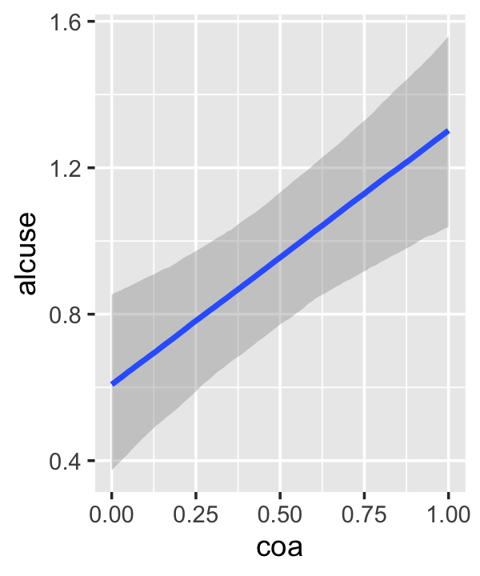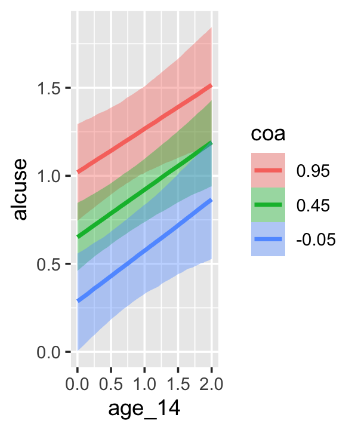

This time we got back three plots. The first two were of the lower-order parameters $\gamma_{10}$ and $\gamma_{01}$. Note how the plot for `coa` treated it as a continuous variable. This is because the variable was saved as an integer in the original data set.


```r
fit4.3$data %>% 
  glimpse()
```

```
## Rows: 246
## Columns: 5
## $ alcuse    <dbl> 1.732051, 2.000000, 2.000000, 0.000000, 0.000000, 1.000000, 1.000000, 2.000000, …
## $ Intercept <dbl> 1, 1, 1, 1, 1, 1, 1, 1, 1, 1, 1, 1, 1, 1, 1, 1, 1, 1, 1, 1, 1, 1, 1, 1, 1, 1, 1,…
## $ age_14    <dbl> 0, 1, 2, 0, 1, 2, 0, 1, 2, 0, 1, 2, 0, 1, 2, 0, 1, 2, 0, 1, 2, 0, 1, 2, 0, 1, 2,…
## $ coa       <dbl> 1, 1, 1, 1, 1, 1, 1, 1, 1, 1, 1, 1, 1, 1, 1, 1, 1, 1, 1, 1, 1, 1, 1, 1, 1, 1, 1,…
## $ id        <dbl> 1, 1, 1, 2, 2, 2, 3, 3, 3, 4, 4, 4, 5, 5, 5, 6, 6, 6, 7, 7, 7, 8, 8, 8, 9, 9, 9,…
```

Coding it as an integer further complicated things for the third plot returned by `conditional_effects()`, the one for the interaction of `age_14` and `coa`, $\gamma_{11}$.

Since `coa` is binary, the natural way to express its interaction with `age_14` would be with `age_14` on the $x$-axis and two separate trajectories, one for each value of `coa`. That's what Singer and Willett very sensibly did with the middle panel of Figure 4.3. However, the `conditional_effects() `function defaults to expressing interactions such that the first variable in the term--in this case,`age_14`--is on the $x$-axis and the second variable in the term--`coa`, treated as an integer--is depicted in three lines corresponding its mean and its mean $\pm$ one standard deviation. This is great for continuous variables, but incoherent for categorical ones. The fix is to adjust the data and refit the model.


```r
fit4.4 <-
  update(fit4.3,
         newdata = alcohol1_pp %>% mutate(coa = factor(coa)),
         iter = 2000, warmup = 1000, chains = 4, cores = 4,
         seed = 4,
         file = "fits/fit04.04")
```

We might compare the updated model with its predecessor. To get a focused look, we can use the `posterior_summary()` function with a little subsetting.


```r
posterior_summary(fit4.3)[1:4, ] %>% round(digits = 3)
```

```
##              Estimate Est.Error   Q2.5 Q97.5
## b_Intercept     0.320     0.134  0.052 0.582
## b_age_14        0.288     0.086  0.119 0.458
## b_coa           0.736     0.198  0.349 1.126
## b_age_14:coa   -0.044     0.128 -0.292 0.210
```

```r
posterior_summary(fit4.4)[1:4, ] %>% round(digits = 3)
```

```
##               Estimate Est.Error   Q2.5 Q97.5
## b_Intercept      0.320     0.134  0.052 0.582
## b_age_14         0.288     0.086  0.119 0.458
## b_coa1           0.736     0.198  0.349 1.126
## b_age_14:coa1   -0.044     0.128 -0.292 0.210
```

The results are about the same. The payoff comes when we try again with `conditional_effects()`.


```r
conditional_effects(fit4.4)
```

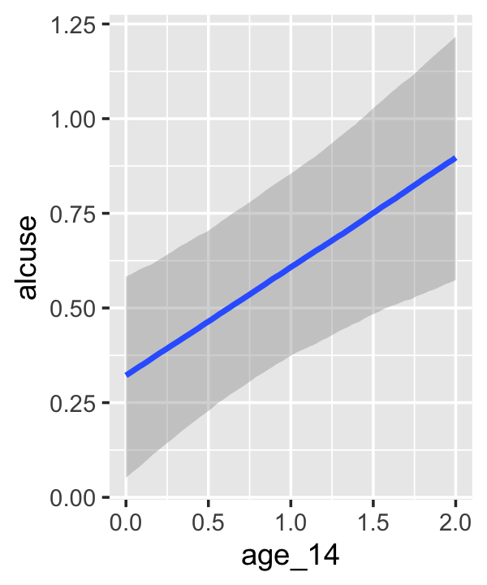

Much better. Now the plot for $\gamma_{01}$ treats `coa` as binary and our plot for the interaction between `age_14` and `coa` is much close to the one in Figure 4.3. Since we're already on a `conditional_effects()` tangent, we may as well go further. When working with models like `fit4.3` where you have multiple fixed effects, sometimes you only want the plots for a subset of those effects. For example, if our main goal is to do a good job tastefully reproducing the middle plot in Figure 4.3, we only need the interaction plot. In such a case, use the `effects` argument.


```r
conditional_effects(fit4.4, effects = "age_14:coa")
```


Earlier we discussed how `conditional_effects()` lets users adjust some of the output. But if you want an extensive overhaul, it's better to save the output of `conditional_effects()` as an object and manipulate that object with the `plot()` function.


```r
ce <- conditional_effects(fit4.4, effects = "age_14:coa")

str(ce)
```

```
## List of 1
##  $ age_14:coa:'data.frame':	200 obs. of  12 variables:
##   ..$ age_14    : num [1:200] 0 0 0.0202 0.0202 0.0404 ...
##   ..$ coa       : Factor w/ 2 levels "0","1": 1 2 1 2 1 2 1 2 1 2 ...
##   ..$ alcuse    : num [1:200] 0.922 0.922 0.922 0.922 0.922 ...
##   ..$ Intercept : num [1:200] 1 1 1 1 1 1 1 1 1 1 ...
##   ..$ id        : logi [1:200] NA NA NA NA NA NA ...
##   ..$ cond__    : Factor w/ 1 level "1": 1 1 1 1 1 1 1 1 1 1 ...
##   ..$ effect1__ : num [1:200] 0 0 0.0202 0.0202 0.0404 ...
##   ..$ effect2__ : Factor w/ 2 levels "0","1": 1 2 1 2 1 2 1 2 1 2 ...
##   ..$ estimate__: num [1:200] 0.322 1.056 0.328 1.061 0.333 ...
##   ..$ se__      : num [1:200] 0.133 0.143 0.133 0.143 0.133 ...
##   ..$ lower__   : num [1:200] 0.0519 0.7644 0.0591 0.7715 0.0667 ...
##   ..$ upper__   : num [1:200] 0.582 1.347 0.587 1.349 0.591 ...
##   ..- attr(*, "effects")= chr [1:2] "age_14" "coa"
##   ..- attr(*, "response")= chr "alcuse"
##   ..- attr(*, "surface")= logi FALSE
##   ..- attr(*, "categorical")= logi FALSE
##   ..- attr(*, "ordinal")= logi FALSE
##   ..- attr(*, "points")='data.frame':	246 obs. of  6 variables:
##   .. ..$ age_14   : num [1:246] 0 1 2 0 1 2 0 1 2 0 ...
##   .. ..$ coa      : Factor w/ 2 levels "0","1": 2 2 2 2 2 2 2 2 2 2 ...
##   .. ..$ resp__   : num [1:246] 1.73 2 2 0 0 ...
##   .. ..$ cond__   : Factor w/ 1 level "1": 1 1 1 1 1 1 1 1 1 1 ...
##   .. ..$ effect1__: num [1:246] 0 1 2 0 1 2 0 1 2 0 ...
##   .. ..$ effect2__: Factor w/ 2 levels "0","1": 2 2 2 2 2 2 2 2 2 2 ...
##  - attr(*, "class")= chr "brms_conditional_effects"
```

Our `ce` is an object of class "'brms_conditional_effects" which contains a list of a single data frame. Had we omitted our `effects` argument, above, we'd have a list of 3 instead. Anyway, these data frames contain the necessary information to produce the plot. The advantage of saving `ce` this way is we can now insert it into the `plot()` function. The simple output is the same as before.


```r
plot(ce)
```


The `plot()` function will allow us to do other things, like add in the original data or omit the white grid lines.


```r
ce %>% 
  plot(points = T,
       point_args = list(size = 1/4, alpha = 1/4, width = .05, height = .05, color = "black"),
       theme = theme(panel.grid = element_blank()))
```


And for even more control, you can tack on typical **ggplot2** functions. But when you want to do so, make sure to set the `plot = FALSE` argument and then subset after the right parenthesis of the `plot()` function.


```r
plot(ce, 
     theme = theme(legend.position = "none",
                   panel.grid = element_blank()),
     plot = FALSE)[[1]] +
  annotate(geom = "text",
           x = 2.1, y = c(.95, 1.55),
           label = str_c("coa = ", 0:1),
           hjust = 0, size = 3.5) +
  scale_fill_brewer(type = "qual") +
  scale_color_brewer(type = "qual") +
  scale_x_continuous("age", limits = c(-1, 3), labels = 13:17) +
  scale_y_continuous(limits = c(0, 2), breaks = 0:2)
```


But anyway, let's get back on track and talk about the variance components. Singer and Willett contrasted $\sigma_\epsilon^2$ from Model B to the new one from Model C. We might use `VarCorr()` to do the same.


```r
VarCorr(fit4.2)[[2]]
```

```
## $sd
##   Estimate  Est.Error      Q2.5     Q97.5
##  0.6035258 0.05121693 0.5146678 0.7146179
```

```r
VarCorr(fit4.3)[[2]]
```

```
## $sd
##   Estimate  Est.Error      Q2.5     Q97.5
##  0.6073666 0.05108632 0.5161462 0.7164554
```

We could have also extracted that information by subsetting `posterior_summary()`.


```r
posterior_summary(fit4.2)["sigma", ]
```

```
##   Estimate  Est.Error       Q2.5      Q97.5 
## 0.60352584 0.05121693 0.51466784 0.71461791
```

```r
posterior_summary(fit4.3)["sigma", ]
```

```
##   Estimate  Est.Error       Q2.5      Q97.5 
## 0.60736661 0.05108632 0.51614618 0.71645542
```

Anyway, to get these in a variance metric, just square their posterior samples and summarize.

Our next task is to formally compare `fit4.2` and `fit4.3` in terms of declines in $\sigma_0^2$ and $\sigma_1^2$.


```r
bind_cols(
  as_draws_df(fit4.2) %>% 
    transmute(fit2_sigma_2_0 = sd_id__Intercept^2,
              fit2_sigma_2_1 = sd_id__age_14^2),
  as_draws_df(fit4.3) %>% 
    transmute(fit3_sigma_2_0 = sd_id__Intercept^2,
              fit3_sigma_2_1 = sd_id__age_14^2)
) %>% 
  mutate(`decline~'in'~sigma[0]^2` = (fit2_sigma_2_0 - fit3_sigma_2_0) / fit2_sigma_2_0,
         `decline~'in'~sigma[1]^2` = (fit2_sigma_2_1 - fit3_sigma_2_1) / fit2_sigma_2_1) %>% 
  pivot_longer(contains("decline")) %>% 
  
  ggplot(aes(x = value)) +
  geom_vline(xintercept = 0, color = "white") +
  geom_density(fill = "grey25", color = "transparent") +
  scale_x_continuous(NULL, limits = c(-5, 2)) +
  scale_y_continuous(NULL, breaks = NULL) +
  theme(panel.grid = element_blank()) +
  facet_wrap(~ name, labeller = label_parsed, ncol = 1)
```

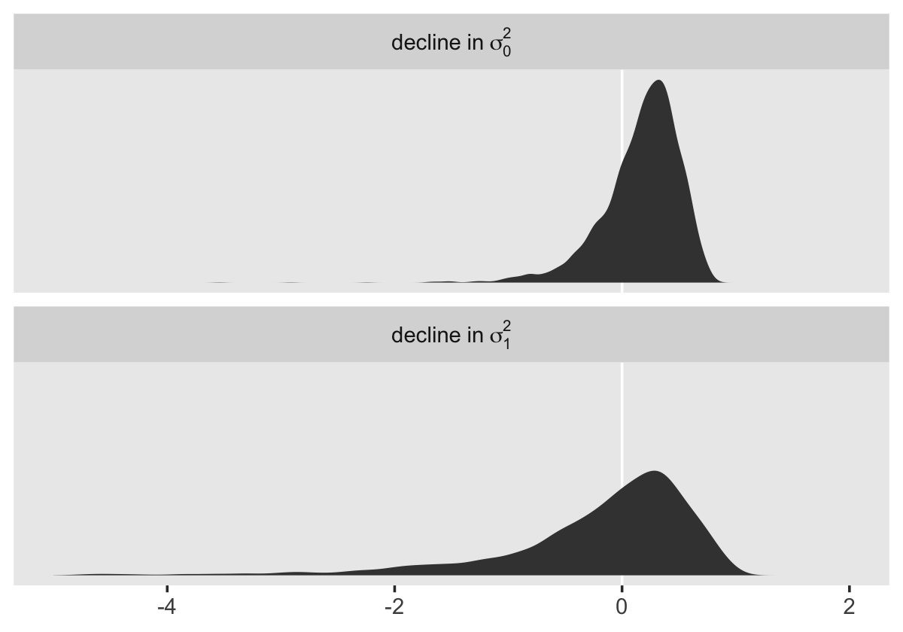

Here are the percents of variance declined from `fit4.2` to `fit4.3`.


```r
bind_cols(
  as_draws_df(fit4.2) %>% 
    transmute(fit2_sigma_2_0 = sd_id__Intercept^2,
              fit2_sigma_2_1 = sd_id__age_14^2),
  as_draws_df(fit4.3) %>% 
    transmute(fit3_sigma_2_0 = sd_id__Intercept^2,
              fit3_sigma_2_1 = sd_id__age_14^2)
) %>% 
  mutate(`decline~'in'~sigma[0]^2` = (fit2_sigma_2_0 - fit3_sigma_2_0) / fit2_sigma_2_0,
         `decline~'in'~sigma[1]^2` = (fit2_sigma_2_1 - fit3_sigma_2_1) / fit2_sigma_2_1) %>% 
  pivot_longer(contains("decline")) %>% 
  group_by(name) %>% 
  summarise(mean   = mean(value),
            median = median(value),
            sd     = sd(value),
            ll     = quantile(value, prob = .025),
            ul     = quantile(value, prob = .975))
```

```
## # A tibble: 2 × 6
##   name                      mean  median    sd     ll    ul
##   <chr>                    <dbl>   <dbl> <dbl>  <dbl> <dbl>
## 1 decline~'in'~sigma[0]^2  0.170 0.229   0.347 -0.672 0.657
## 2 decline~'in'~sigma[1]^2 -0.736 0.00344 7.07  -5.26  0.809
```

In this case, we end up with massive uncertainty when working with the full posteriors. This is particularly the case with the difference in $\sigma_1^2$, which is left skewed for days. Here are the results when we only use point estimates.


```r
bind_cols(
  as_draws_df(fit4.2) %>% 
    transmute(fit2_sigma_2_0 = sd_id__Intercept^2,
              fit2_sigma_2_1 = sd_id__age_14^2),
  as_draws_df(fit4.3) %>% 
    transmute(fit3_sigma_2_0 = sd_id__Intercept^2,
              fit3_sigma_2_1 = sd_id__age_14^2)
) %>% 
  summarise_all(median) %>% 
  transmute(`% decline in sigma_2_0` = 100 * (fit2_sigma_2_0 - fit3_sigma_2_0) / fit2_sigma_2_0,
            `% decline in sigma_2_1` = 100 * (fit2_sigma_2_1 - fit3_sigma_2_1) / fit2_sigma_2_1)
```

```
## # A tibble: 1 × 2
##   `% decline in sigma_2_0` `% decline in sigma_2_1`
##                      <dbl>                    <dbl>
## 1                     22.4                    0.604
```

"These variance components are now called *partial* or *conditional* variances because they quantify the interindividual differences in change that remain unexplained by the model's predictors" (p. 108, emphasis in the original).

#### Model D: The controlled effects of COA.

This model follows the form

$$
\begin{align*}
\text{alcuse}_{ij} & = \gamma_{00} + \gamma_{01} \text{coa}_i + \gamma_{02} \text{peer}_i + \gamma_{10} \text{age_14}_{ij} \\
& \;\;\; + \gamma_{11} \text{coa}_i \times \text{age_14}_{ij} + \gamma_{12} \text{peer}_i \times \text{age_14}_{ij} \\
& \;\;\; + \zeta_{0i} + \zeta_{1i} \text{age_14}_{ij} + \epsilon_{ij} \\
\epsilon_{ij} & \sim \text{Normal} (0, \sigma_\epsilon^2) \\
\begin{bmatrix} \zeta_{0i} \\ \zeta_{1i} \end{bmatrix} & \sim \text{Normal} 
\begin{pmatrix}
\begin{bmatrix} 0 \\ 0 \end{bmatrix}, 
\begin{bmatrix} \sigma_0^2 & \sigma_{01} \\ \sigma_{01} & \sigma_1^2 \end{bmatrix}
\end{pmatrix}.
\end{align*}
$$

Fit that joint.


```r
fit4.5 <-
  brm(data = alcohol1_pp, 
      family = gaussian,
      alcuse ~ 0 + Intercept + age_14 + coa + peer + age_14:coa + age_14:peer + (1 + age_14 | id),
      prior = c(prior(student_t(3, 0, 2.5), class = sd),
                prior(student_t(3, 0, 2.5), class = sigma),
                prior(lkj(1), class = cor)),
      iter = 2000, warmup = 1000, chains = 4, cores = 4,
      seed = 4,
      file = "fits/fit04.05")
```


```r
print(fit4.5, digits = 3)
```

```
##  Family: gaussian 
##   Links: mu = identity; sigma = identity 
## Formula: alcuse ~ 0 + Intercept + age_14 + coa + peer + age_14:coa + age_14:peer + (1 + age_14 | id) 
##    Data: alcohol1_pp (Number of observations: 246) 
##   Draws: 4 chains, each with iter = 2000; warmup = 1000; thin = 1;
##          total post-warmup draws = 4000
## 
## Group-Level Effects: 
## ~id (Number of levels: 82) 
##                       Estimate Est.Error l-95% CI u-95% CI  Rhat Bulk_ESS Tail_ESS
## sd(Intercept)            0.485     0.101    0.279    0.681 1.006      580     1272
## sd(age_14)               0.364     0.080    0.202    0.519 1.018      346      510
## cor(Intercept,age_14)    0.117     0.342   -0.407    0.914 1.016      258      214
## 
## Population-Level Effects: 
##             Estimate Est.Error l-95% CI u-95% CI  Rhat Bulk_ESS Tail_ESS
## Intercept     -0.316     0.148   -0.605   -0.025 1.002     1890     2347
## age_14         0.428     0.115    0.199    0.654 1.000     1925     1877
## coa            0.581     0.165    0.251    0.901 1.000     2389     2662
## peer           0.693     0.115    0.472    0.925 1.004     1747     2176
## age_14:coa    -0.013     0.127   -0.261    0.238 1.001     2622     2667
## age_14:peer   -0.150     0.088   -0.323    0.022 1.001     1803     2350
## 
## Family Specific Parameters: 
##       Estimate Est.Error l-95% CI u-95% CI  Rhat Bulk_ESS Tail_ESS
## sigma    0.606     0.047    0.519    0.704 1.011      480      923
## 
## Draws were sampled using sampling(NUTS). For each parameter, Bulk_ESS
## and Tail_ESS are effective sample size measures, and Rhat is the potential
## scale reduction factor on split chains (at convergence, Rhat = 1).
```

All our $\gamma$ estimates are similar to those presented in Table 4.1. Let's compute the variances and the covariance, $\sigma_{01}^2$. Here are the plots.


```r
 v <-
  as_draws_df(fit4.5) %>% 
  transmute(sigma_2_epsilon = sigma^2,
            sigma_2_0       = sd_id__Intercept^2,
            sigma_2_1       = sd_id__age_14^2,
            sigma_01        = sd_id__Intercept * cor_id__Intercept__age_14 * sd_id__age_14)

v %>% 
  pivot_longer(everything()) %>% 
  ggplot(aes(x = value)) +
  geom_density(size = 0, fill = "black") +
  scale_y_continuous(NULL, breaks = NULL) +
  theme(panel.grid = element_blank()) +
  facet_wrap(~ name, scales = "free")
```


And now we compute the summary statistics.


```r
v %>% 
  pivot_longer(everything()) %>% 
  group_by(name) %>% 
  summarise(mean   = mean(value),
            median = median(value),
            sd     = sd(value),
            ll     = quantile(value, prob = .025),
            ul     = quantile(value, prob = .975)) %>% 
  mutate_if(is.double, round, digits = 3)
```

```
## # A tibble: 4 × 6
##   name             mean median    sd     ll    ul
##   <chr>           <dbl>  <dbl> <dbl>  <dbl> <dbl>
## 1 sigma_01        0.005  0.011 0.054 -0.113 0.091
## 2 sigma_2_0       0.245  0.234 0.098  0.078 0.464
## 3 sigma_2_1       0.139  0.134 0.058  0.041 0.27 
## 4 sigma_2_epsilon 0.369  0.365 0.057  0.27  0.495
```

Like the $\gamma$'s, our variance components are all similar to those in the text.


```r
bind_cols(
  as_draws_df(fit4.2) %>% 
    transmute(fit4.2_sigma_2_epsilon = sigma^2,
              fit4.2_sigma_2_0 = sd_id__Intercept^2,
              fit4.2_sigma_2_1 = sd_id__age_14^2),
  as_draws_df(fit4.5) %>% 
    transmute(fit4.5_sigma_2_epsilon = sigma^2,
              fit4.5_sigma_2_0 = sd_id__Intercept^2,
              fit4.5_sigma_2_1 = sd_id__age_14^2)
) %>% 
  summarise_all(median) %>% 
  mutate(`% decline in sigma_2_epsilon` = 100 * (fit4.2_sigma_2_epsilon - fit4.5_sigma_2_epsilon) / fit4.2_sigma_2_epsilon,
         `% decline in sigma_2_0` = 100 * (fit4.2_sigma_2_0 - fit4.5_sigma_2_0) / fit4.2_sigma_2_0,
         `% decline in sigma_2_1` = 100 * (fit4.2_sigma_2_1 - fit4.5_sigma_2_1) / fit4.2_sigma_2_1) %>% 
  pivot_longer(contains("%")) %>% 
  select(name, value)
```

```
## # A tibble: 3 × 2
##   name                         value
##   <chr>                        <dbl>
## 1 % decline in sigma_2_epsilon -1.71
## 2 % decline in sigma_2_0       62.2 
## 3 % decline in sigma_2_1        4.53
```

The percentages in which our variance componence declined relative to the unconditional growth model are of similar orders of magnitude as those presented in the text.

#### Model E: A tentative "final model" for the controlled effects of `coa`.

This model is just like the last, but with the simple omission of the $\gamma_{12}$ parameter.


```r
fit4.6 <-
  brm(data = alcohol1_pp, 
      family = gaussian,
      alcuse ~ 0 + Intercept + age_14 + coa + peer + age_14:peer + (1 + age_14 | id),
      prior = c(prior(student_t(3, 0, 2.5), class = sd),
                prior(student_t(3, 0, 2.5), class = sigma),
                prior(lkj(1), class = cor)),
      iter = 2000, warmup = 1000, chains = 4, cores = 4,
      seed = 4,
      file = "fits/fit04.06")
```


```r
print(fit4.6, digits = 3)
```

```
##  Family: gaussian 
##   Links: mu = identity; sigma = identity 
## Formula: alcuse ~ 0 + Intercept + age_14 + coa + peer + age_14:peer + (1 + age_14 | id) 
##    Data: alcohol1_pp (Number of observations: 246) 
##   Draws: 4 chains, each with iter = 2000; warmup = 1000; thin = 1;
##          total post-warmup draws = 4000
## 
## Group-Level Effects: 
## ~id (Number of levels: 82) 
##                       Estimate Est.Error l-95% CI u-95% CI  Rhat Bulk_ESS Tail_ESS
## sd(Intercept)            0.485     0.102    0.281    0.675 1.009      547     1348
## sd(age_14)               0.358     0.078    0.198    0.505 1.028      216      673
## cor(Intercept,age_14)    0.136     0.340   -0.393    0.903 1.026      228      366
## 
## Population-Level Effects: 
##             Estimate Est.Error l-95% CI u-95% CI  Rhat Bulk_ESS Tail_ESS
## Intercept     -0.314     0.151   -0.608   -0.021 1.000     1910     2692
## age_14         0.425     0.105    0.223    0.630 1.000     2166     2657
## coa            0.573     0.148    0.284    0.859 1.001     2198     2861
## peer           0.694     0.113    0.475    0.915 1.000     2105     2784
## age_14:peer   -0.152     0.085   -0.314    0.015 1.000     2124     2495
## 
## Family Specific Parameters: 
##       Estimate Est.Error l-95% CI u-95% CI  Rhat Bulk_ESS Tail_ESS
## sigma    0.606     0.047    0.514    0.700 1.017      391     1483
## 
## Draws were sampled using sampling(NUTS). For each parameter, Bulk_ESS
## and Tail_ESS are effective sample size measures, and Rhat is the potential
## scale reduction factor on split chains (at convergence, Rhat = 1).
```

The $\gamma$'s all look well behaved. Here are the variance component summaries.


```r
 v <-
  as_draws_df(fit4.6) %>% 
  transmute(sigma_2_epsilon = sigma^2,
            sigma_2_0       = sd_id__Intercept^2,
            sigma_2_1       = sd_id__age_14^2,
            sigma_01        = sd_id__Intercept * cor_id__Intercept__age_14 * sd_id__age_14)

v %>% 
  pivot_longer(everything()) %>% 
  group_by(name) %>% 
  summarise(mean   = mean(value),
            median = median(value),
            sd     = sd(value),
            ll     = quantile(value, prob = .025),
            ul     = quantile(value, prob = .975)) %>% 
  mutate_if(is.double, round, digits = 3)
```

```
## # A tibble: 4 × 6
##   name             mean median    sd     ll    ul
##   <chr>           <dbl>  <dbl> <dbl>  <dbl> <dbl>
## 1 sigma_01        0.008  0.014 0.053 -0.108 0.094
## 2 sigma_2_0       0.245  0.236 0.099  0.079 0.456
## 3 sigma_2_1       0.134  0.129 0.056  0.039 0.255
## 4 sigma_2_epsilon 0.369  0.365 0.057  0.264 0.489
```

### Displaying prototypical change trajectories.

On page 111, Singer and Willett computed the various levels of the $\pi$ coefficients when `coa == 0` or `coa == 1`. To follow along, we'll want to work directly with the posterior draws from `fit4.3`.


```r
draws <- as_draws_df(fit4.3) 

draws %>% 
  select(starts_with("b_")) %>% 
  head()
```

```
## # A tibble: 6 × 4
##   b_Intercept b_age_14 b_coa `b_age_14:coa`
##         <dbl>    <dbl> <dbl>          <dbl>
## 1       0.270    0.198 0.979        -0.0312
## 2       0.517    0.245 0.694        -0.127 
## 3       0.557    0.233 0.712        -0.0784
## 4       0.218    0.332 0.650        -0.0852
## 5       0.458    0.312 0.595         0.0750
## 6       0.195    0.316 0.790        -0.0752
```

Here we apply the formulas to the posterior draws and then summarize with posterior means.


```r
draws %>%
  select(starts_with("b_")) %>% 
  transmute(pi_0_coa0 = b_Intercept + b_coa          * 0,
            pi_1_coa0 = b_age_14    + `b_age_14:coa` * 0,
            pi_0_coa1 = b_Intercept + b_coa          * 1,
            pi_1_coa1 = b_age_14    + `b_age_14:coa` * 1) %>%
  pivot_longer(everything()) %>% 
  group_by(name) %>%
  summarise(posterior_mean = mean(value) %>% round(digits = 3))
```

```
## # A tibble: 4 × 2
##   name      posterior_mean
##   <chr>              <dbl>
## 1 pi_0_coa0          0.32 
## 2 pi_0_coa1          1.06 
## 3 pi_1_coa0          0.288
## 4 pi_1_coa1          0.244
```

We already plotted these trajectories and their 95% intervals a few sections up. If we want to work with the full composite model to predict $Y_{ij}$ (i.e., `alcuse`) directly, we multiply the `b_coa`, `b_age_14`, and `b_age_14:coa` vectors by the appropriate values of `coa` and `peer`. For example, here's what you'd code if you wanted the initial `alcuse` status for when `coa == 1`.


```r
draws %>%
  select(starts_with("b_")) %>% 
  mutate(y = b_Intercept + b_coa * 1 + b_age_14 * 0 + `b_age_14:coa` * 0 * 1) %>% 
  head()
```

```
## # A tibble: 6 × 5
##   b_Intercept b_age_14 b_coa `b_age_14:coa`     y
##         <dbl>    <dbl> <dbl>          <dbl> <dbl>
## 1       0.270    0.198 0.979        -0.0312 1.25 
## 2       0.517    0.245 0.694        -0.127  1.21 
## 3       0.557    0.233 0.712        -0.0784 1.27 
## 4       0.218    0.332 0.650        -0.0852 0.868
## 5       0.458    0.312 0.595         0.0750 1.05 
## 6       0.195    0.316 0.790        -0.0752 0.985
```

If you were to take the mean of that new `y` column, you'd discover it's the same as the mean of our `pi_0_coa1`, above.


```r
draws %>%
  select(starts_with("b_")) %>% 
  mutate(y = b_Intercept + b_coa * 1 + b_age_14 * 0 + `b_age_14:coa` * 0 * 1) %>% 
  summarise(pi_0_coa1 = mean(y))
```

```
## # A tibble: 1 × 1
##   pi_0_coa1
##       <dbl>
## 1      1.06
```

Singer and Willett suggested four strategies to help researchers pick the prototypical values of the predictors to focus on:

* Substantively interesting values (e.g., typical ages, values corresponding to transition points)
* A range of percentiles (e.g., 25^th^, 50^th^, and 75^th^)
* Just the sample mean
* The sample mean $\pm$ something like 1 standard deviation

They next discuss the right panel of Figure 4.3. We could continue to work directly with the `as_draws_df()` to make our version of that figure. But it you want to accompany the posterior mean trajectories with their 95% intervals, and I hope you do, the `as_draws_df()` method will get tedious. Happily, **brms** offers users and alternative with the `fitted()` function. Since the right panel is somewhat complicated, it'll behoove us to practice with the simpler left panel, first.

In `fit4.2` (i.e., Model C), `age_14` is the only predictor. Here we'll specify the values along the range in the original data, ranging from 0 to 2. However, we end up specifying a bunch of values within that range in addition to the two endpoints. This is because the 95% intervals typically have a bow tie shape. To depict that shape well, we need more than a couple values. We save those values as a tibble called `nd` (i.e., new data). We make use of them within fitted with the `newdata = nd` argument.

Since we're only interested in the general trajectory, the consequence of the $\gamma$'s, we end up coding `re_formula = NA`. In so doing, we ask `fitted()` to ignore the group-level effects. In this example, that means we are ignoring the `id`-level deviations from the overall trajectories. If you're confused by that that means, don't worry. That part of the model should become more clear as we go along in the text.

Since `fitted()` returns an array, we then convert the results into a data frame for use within the **tidyverse** framework. For plotting, it's handy to bind those results together with the `nd`, the predictor values we used to compute the fitted values with. In the final wrangling step, we use our `age_14` values to compute the `age` values.


```r
nd <- 
  tibble(age_14 = seq(from = 0, to = 2, length.out = 30))

f <- 
  fitted(fit4.2, 
         newdata = nd,
         re_formula = NA) %>%
  data.frame() %>%
  bind_cols(nd) %>% 
  mutate(age = age_14 + 14)

head(f)
```

```
##    Estimate  Est.Error      Q2.5     Q97.5     age_14      age
## 1 0.6497368 0.10745950 0.4380402 0.8652803 0.00000000 14.00000
## 2 0.6685054 0.10559034 0.4614879 0.8822467 0.06896552 14.06897
## 3 0.6872741 0.10387940 0.4834844 0.8973132 0.13793103 14.13793
## 4 0.7060428 0.10233461 0.5033354 0.9122759 0.20689655 14.20690
## 5 0.7248114 0.10096359 0.5248719 0.9276806 0.27586207 14.27586
## 6 0.7435801 0.09977351 0.5474076 0.9428426 0.34482759 14.34483
```

Since we only had one predictor, `age_14`, for which we specified 30 specific values, we ended up with 30 rows in our output. By default, `fitted()` summarized the fitted values with posterior means (`Estimate`), standard deviations (`Est.Error`), and percentile-based 95% intervals (`Q2.5` and `Q97.5`). The other columns are the values we bound to them. Here’s how we might use these to make our `fitted()` version of the leftmost panel of Figure 4.3.


```r
f %>%
  ggplot(aes(x = age)) +
  geom_ribbon(aes(ymin = Q2.5, ymax = Q97.5),
              fill = "grey75", alpha = 3/4) +
  geom_line(aes(y = Estimate)) +
  scale_y_continuous("alcuse", breaks = 0:2, limits = c(0, 2)) +
  coord_cartesian(xlim = c(13, 17)) +
  theme(panel.grid = element_blank())
```


With `fit4.6` (i.e., Model E), we now have three predictors. We'd like to see the full range across `age_14` for four combinations of `coa` and `peer` values. To my mind, the easiest way to get those values right is with a little `crossing()` and `expand()`.


```r
nd <-
  crossing(coa  = 0:1,
           peer = c(.655, 1.381)) %>% 
  expand_grid(age_14 = seq(from = 0, to = 2, length.out = 30))

head(nd, n = 10)
```

```
## # A tibble: 10 × 3
##      coa  peer age_14
##    <int> <dbl>  <dbl>
##  1     0 0.655 0     
##  2     0 0.655 0.0690
##  3     0 0.655 0.138 
##  4     0 0.655 0.207 
##  5     0 0.655 0.276 
##  6     0 0.655 0.345 
##  7     0 0.655 0.414 
##  8     0 0.655 0.483 
##  9     0 0.655 0.552 
## 10     0 0.655 0.621
```

Now we use `fitted()` much like before.


```r
f <- 
  fitted(fit4.6, 
         newdata = nd,
         re_formula = NA) %>%
  data.frame() %>%
  bind_cols(nd) %>%
  # a little wrangling will make plotting much easier
  mutate(age  = age_14 + 14,
         coa  = ifelse(coa == 0, "coa = 0", "coa = 1"),
         peer = factor(peer))

glimpse(f)
```

```
## Rows: 120
## Columns: 8
## $ Estimate  <dbl> 0.1401928, 0.1626439, 0.1850951, 0.2075462, 0.2299973, 0.2524485, 0.2748996, 0.2…
## $ Est.Error <dbl> 0.1107089, 0.1091486, 0.1077753, 0.1065962, 0.1056179, 0.1048459, 0.1042849, 0.1…
## $ Q2.5      <dbl> -7.684122e-02, -4.981252e-02, -2.654313e-02, 7.571781e-05, 2.576044e-02, 4.94618…
## $ Q97.5     <dbl> 0.3567606, 0.3752108, 0.3950149, 0.4142247, 0.4357135, 0.4581377, 0.4791907, 0.5…
## $ coa       <chr> "coa = 0", "coa = 0", "coa = 0", "coa = 0", "coa = 0", "coa = 0", "coa = 0", "co…
## $ peer      <fct> 0.655, 0.655, 0.655, 0.655, 0.655, 0.655, 0.655, 0.655, 0.655, 0.655, 0.655, 0.6…
## $ age_14    <dbl> 0.00000000, 0.06896552, 0.13793103, 0.20689655, 0.27586207, 0.34482759, 0.413793…
## $ age       <dbl> 14.00000, 14.06897, 14.13793, 14.20690, 14.27586, 14.34483, 14.41379, 14.48276, …
```

For our version of the right panel of Figure 4.3, most of the action is in `ggplot()`, `geom_ribbon()`, `geom_line()`, and `facet_wrap()`. All the rest is cosmetic.


```r
f %>%
  ggplot(aes(x = age, color = peer, fill = peer)) +
  geom_ribbon(aes(ymin = Q2.5, ymax = Q97.5),
              size = 0, alpha = 1/4) +
  geom_line(aes(y = Estimate, size = peer)) +
  scale_size_manual(values = c(1/2, 1)) +
  scale_fill_manual(values = c("blue3", "red3")) +
  scale_color_manual(values = c("blue3", "red3")) +
  scale_y_continuous("alcuse", breaks = 0:2) +
  labs(subtitle = "High peer values are in red; low ones are in blue.") +
  coord_cartesian(xlim = c(13, 17)) +
  theme(legend.position = "none",
        panel.grid = element_blank()) +
  facet_wrap(~ coa)
```


In my opinion, it works better to split the plot into two when you include the 95% intervals.

### Recentering predictors to improve interpretation.

> The easiest strategy for recentering a time-invariant predictor is to subtract its sample mean from each observed value. When we center a predictor on its sample mean, the level-2 fitted intercepts represent the average fitted values of initial status (or rate of change). We can also recenter a time-invariant predictor by subtracting another meaningful value... Recentering works best when the centering constant is substantively meaningful. (pp. 113--114)

As we'll see later, centering can also make it easier to select meaningful priors on the model intercept. If you look at our `alcohol1_pp` data, you'll see we already have centered versions of our time-invariant predictors. They're the last two columns, `cpeer` and `ccoa`.


```r
alcohol1_pp %>% 
  glimpse()
```

```
## Rows: 246
## Columns: 9
## $ id     <dbl> 1, 1, 1, 2, 2, 2, 3, 3, 3, 4, 4, 4, 5, 5, 5, 6, 6, 6, 7, 7, 7, 8, 8, 8, 9, 9, 9, 10…
## $ age    <dbl> 14, 15, 16, 14, 15, 16, 14, 15, 16, 14, 15, 16, 14, 15, 16, 14, 15, 16, 14, 15, 16,…
## $ coa    <dbl> 1, 1, 1, 1, 1, 1, 1, 1, 1, 1, 1, 1, 1, 1, 1, 1, 1, 1, 1, 1, 1, 1, 1, 1, 1, 1, 1, 1,…
## $ male   <dbl> 0, 0, 0, 1, 1, 1, 1, 1, 1, 1, 1, 1, 0, 0, 0, 1, 1, 1, 0, 0, 0, 1, 1, 1, 1, 1, 1, 0,…
## $ age_14 <dbl> 0, 1, 2, 0, 1, 2, 0, 1, 2, 0, 1, 2, 0, 1, 2, 0, 1, 2, 0, 1, 2, 0, 1, 2, 0, 1, 2, 0,…
## $ alcuse <dbl> 1.732051, 2.000000, 2.000000, 0.000000, 0.000000, 1.000000, 1.000000, 2.000000, 3.3…
## $ peer   <dbl> 1.2649111, 1.2649111, 1.2649111, 0.8944272, 0.8944272, 0.8944272, 0.8944272, 0.8944…
## $ cpeer  <dbl> 0.2469111, 0.2469111, 0.2469111, -0.1235728, -0.1235728, -0.1235728, -0.1235728, -0…
## $ ccoa   <dbl> 0.549, 0.549, 0.549, 0.549, 0.549, 0.549, 0.549, 0.549, 0.549, 0.549, 0.549, 0.549,…
```

If you wanted to center them by hand, you'd just execute something like this.


```r
alcohol1_pp %>% 
  mutate(peer_c = peer - mean(peer))
```

```
## # A tibble: 246 × 10
##       id   age   coa  male age_14 alcuse  peer  cpeer  ccoa peer_c
##    <dbl> <dbl> <dbl> <dbl>  <dbl>  <dbl> <dbl>  <dbl> <dbl>  <dbl>
##  1     1    14     1     0      0   1.73 1.26   0.247 0.549  0.247
##  2     1    15     1     0      1   2    1.26   0.247 0.549  0.247
##  3     1    16     1     0      2   2    1.26   0.247 0.549  0.247
##  4     2    14     1     1      0   0    0.894 -0.124 0.549 -0.123
##  5     2    15     1     1      1   0    0.894 -0.124 0.549 -0.123
##  6     2    16     1     1      2   1    0.894 -0.124 0.549 -0.123
##  7     3    14     1     1      0   1    0.894 -0.124 0.549 -0.123
##  8     3    15     1     1      1   2    0.894 -0.124 0.549 -0.123
##  9     3    16     1     1      2   3.32 0.894 -0.124 0.549 -0.123
## 10     4    14     1     1      0   0    1.79   0.771 0.549  0.771
## # ℹ 236 more rows
```

Did you notice how our `peer_c` values, above, deviated slightly from those in `cpeer`? That's because `peer_c` was based on the exact sample mean. Those in `cpeer` are based on the sample mean as provided in the text, 1.018, which is introduces rounding error. For the sake of simplicity, we'll go with centered variables matching up with the text.

Here we'll hastily fit the models with help from the `update()` function.


```r
fit4.7 <-
  update(fit4.6,
         newdata = alcohol1_pp,
         alcuse ~ 0 + Intercept + age_14 + coa + cpeer + age_14:cpeer + (1 + age_14 | id),
         iter = 2000, warmup = 1000, chains = 4, cores = 4,
         seed = 4,
         file = "fits/fit04.07")

fit4.8 <-
  update(fit4.6,
         newdata = alcohol1_pp,
         alcuse ~ 0 + Intercept + age_14 + ccoa + peer + age_14:peer + (1 + age_14 | id),
         iter = 2000, warmup = 1000, chains = 4, cores = 4,
         seed = 4,
         file = "fits/fit04.08")
```

Here we reproduce the $\gamma$s from `fit4.6` and compare the to the updates from `fit4.7` and `fit4.8`.


```r
fixef(fit4.6) %>% round(digits = 3)
```

```
##             Estimate Est.Error   Q2.5  Q97.5
## Intercept     -0.314     0.151 -0.608 -0.021
## age_14         0.425     0.105  0.223  0.630
## coa            0.573     0.148  0.284  0.859
## peer           0.694     0.113  0.475  0.915
## age_14:peer   -0.152     0.085 -0.314  0.015
```

```r
fixef(fit4.7) %>% round(digits = 3)
```

```
##              Estimate Est.Error   Q2.5 Q97.5
## Intercept       0.392     0.105  0.187 0.598
## age_14          0.272     0.063  0.145 0.391
## coa             0.572     0.150  0.274 0.859
## cpeer           0.698     0.114  0.480 0.920
## age_14:cpeer   -0.152     0.085 -0.318 0.012
```

```r
fixef(fit4.8) %>% round(digits = 3)
```

```
##             Estimate Est.Error   Q2.5 Q97.5
## Intercept     -0.057     0.140 -0.328 0.210
## age_14         0.425     0.107  0.223 0.630
## ccoa           0.573     0.148  0.277 0.866
## peer           0.694     0.113  0.472 0.920
## age_14:peer   -0.152     0.086 -0.321 0.013
```

## Comparing models using deviance statistics

As you will see, we will also make use of deviance within our Bayesian Stan-based paradigm. But we'll do so a little differently than what Singer and Willett presented.

### The deviance statistic.

As it turns out, we Bayesians use the log-likelihood (LL), too. Recall how the numerator in the right-hand side of Bayes' Theorem was $p(\text{data} \mid \theta) p(\theta)$? That first part, $p(\text{data} \mid \theta)$, is the likelihood. In words, the likelihood is the *probability of the data given the parameters*. We generally work with the log of the likelihood rather than the likelihood itself because it's easier to work with statistically.

When you're working with **brms**, you can extract the LL with the `log_lik()` function. Here's an example with `fit4.1`, our unconditional means model.


```r
log_lik(fit4.1) %>% 
  str()
```

```
##  num [1:4000, 1:246] -0.629 -0.72 -1.075 -0.708 -0.926 ...
##  - attr(*, "dimnames")=List of 2
##   ..$ : NULL
##   ..$ : NULL
```

You may have noticed we didn't just get a single value back. Rather, we got an array of 4,000 rows and 246 columns. The reason we got 4,000 rows is because that's how many post-warmup iterations we drew from the posterior. I.e., we set `brm(..., iter = 2000, warmup = 1000, chains = 4)`. With respect to the 246 columns, that's how many rows there are in the `alcohol1_pp` data. So for each case in the data, we get an entire posterior distribution of LL values.

With the multilevel model, we can define deviance for a given model as its LL times -2,

$$
\text{Deviance} = -2 LL_\text{current model}.
$$

Here that is in code for `fit4.1`.


```r
ll <-
  log_lik(fit4.1) %>%
  data.frame() %>% 
  mutate(ll = rowSums(.)) %>% 
  mutate(deviance = -2 * ll) %>% 
  select(ll, deviance, everything())

dim(ll)
```

```
## [1] 4000  248
```

Because we used HMC, deviance is a distribution rather than a single number. Here's what it looks like for `fit4.1`.


```r
ll %>% 
  ggplot(aes(x = deviance)) +
  geom_density(fill = "grey25", size = 0) +
  scale_y_continuous(NULL, breaks = NULL) +
  theme(panel.grid = element_blank())
```

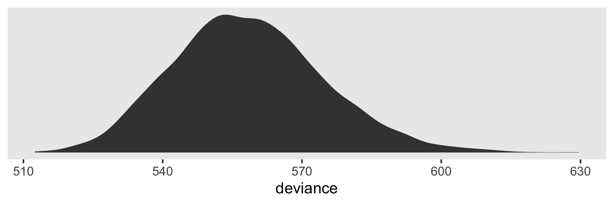

Much like the frequentists, we Bayesian generally prefer models with smaller deviance distributions.

The reasons frequentists multiply the LL by -2 is because after doing so, the difference in deviance values between two models follows a $\chi^2$ distribution and the old $\chi^2$-difference test is widely-used in frequentist statistics. Bayesians often just go ahead and use the -2 multiplication, too. It's largely out of tradition. But as we'll see, some contemporary Bayesians are challenging that tradition.

### When and how can you compare deviance statistics?

As for the frequentists, deviance values/distributions in the Bayesian context are only meaningful in the relative sense. You cannot directly interpret a single models deviance distribution by the magnitude or sign of its central tendency. But you can compare two or more models by the relative locations of their deviance distributions. When doing so, they must have been computed using the same data (i.e., no differences in missingness in the predictors) and the models must be nested.

However, in contemporary Bayesian practice we don't tend to compare models with deviance. For details on why, check out Chapter 6 in McElreath's [*Statistical Rethinking*](https://xcelab.net/rm/statistical-rethinking/). McElreath also covered the topic in several online lectures (e.g., [here](https://www.youtube.com/watch?v=vSjL2Zc-gEQ&list=PLDcUM9US4XdMdZOhJWJJD4mDBMnbTWw_z&index=8) and [here](https://www.youtube.com/watch?v=gjrsYDJbRh0&list=PLDcUM9US4XdNM4Edgs7weiyIguLSToZRI&index=8)).

### Implementing deviance-based hypothesis tests.

In this project, we are not going to practice comparing deviance values using frequentist $\chi^2$ tests. We will, however, cover Bayesian information criteria.

### ~~AIC and BIC~~ WAIC and LOO statistics: Comparing nonnested models using information criteria [and cross validation].

We do not use the AIC or the BIC within the Stan ecosystem. The AIC is frequentist and cannot handle models with priors. The BIC is interesting in it's a double misnomer. It is neither Bayesian nor is it a proper information criterion--though it does scale like one. However, it might be useful for our purposes to walk out the AIC a bit. It'll ground our discussion of the WAIC and LOO. From Spiegelhalter, Best, Carlin and van der Linde [@-spiegelhalterDevianceInformationCriterion2014], we read:

> Suppose that we have a given set of candidate models, and we would like a criterion to assess which is 'better' in a defined sense. Assume that a model for observed data $y$ postulates a density $p(y \mid \theta)$ (which may include covariates etc.), and call $D(\theta) = -2 \log {p(y \mid \theta)}$ the deviance, here considered as a function of $\theta$. Classical model choice uses hypothesis testing for comparing nested models, e.g. the deviance (likelihood ratio) test in generalized linear models. For non nested models, alternatives include the Akaike information criterion
>
> $$AIC = -2 \log {p(y \mid \hat{\theta})} + 2k$$
>
> where $\hat{\theta}$ is the maximum likelihood estimate and $k$ is the number of parameters in the model (dimension of $\Theta$).
>
> AIC is built with the aim of favouring models that are likely to make good predictions. Since we generally do not have independent validation data, we can assess which model best predicts the *observed* data by using the deviance, but if parameters have been estimated we need some penalty for this double use of the data. AIC's penalty of *2k* has been shown to be asymptotically equivalent to leave-one-out cross-validation. However, AIC does not work in models with informative prior information, such as hierarchical models, since the prior effectively acts to 'restrict' the freedom of the model parameters, so the appropriate 'number of parameters' is generally unclear. (pp. 485--486, *emphasis* in the original)

For the past two decades, the Deviance Information Criterion [DIC; @spiegelhalterBayesianMeasuresModel2002] has been a popular information criterion among Bayesians. Let's define $D$ as the posterior distribution of deviance values and $\bar D$ as its mean. If you compute deviance based on the posterior mean, you have $\hat D$. Within a multi-parameter model, this would be the deviance based on the collection of the posterior mean of each parameter. With these, we define the DIC as

$$\text{DIC} = \bar D + (\bar D + \hat D) + \bar D + p_D,$$

where $p_D$ is the number of effective parameters in the model, which is also sometimes referred to as the penalty term. As McElreath pointed out in [*Statistical Rethinking*](https://xcelab.net/rm/statistical-rethinking/), the $p_D$

> is just the expected distance between the deviance in-sample and the deviance out-of-sample. In the case of flat priors, DIC reduces directly to AIC, because the expected distance is just the number of parameters. But more generally, $p_D$ will be some fraction of the number of parameters, because regularizing priors constrain a model’s flexibility. (p. 191)

As you'll see, you can get the $p_D$ for `brms::brm()` models. However, the DIC is limited in that it requires a multivariate Gaussian posterior and I'm not aware of a convenience function within **brms** that will compute the DIC. Which is fine. The DIC has been overshadowed in recent years by newer methods. But for a great talk on the DIC, check out the authoritative David Spiegelhalter's [*Retrospective read paper: Bayesian measure of model complexity and fit*](https://www.youtube.com/watch?v=H-59eqmHuuQ&frags=pl%2Cwn). 

#### The Widely Applicable Information Criterion (WAIC).

The main information criterion within our Stan ecosystem paradigm is the Widely Applicable Information Criterion [WAIC; @watanabeAsymptoticEquivalenceBayes2010]. From McElreath, again, we read:

> It does not require a multivariate Gaussian posterior, and it is often more accurate than DIC. There are types of models for which it is hard to define at all, however. We'll discuss that issue more, after defining WAIC.
>
> The distinguishing feature of WAIC is that it is *pointwise*. This means that uncertainty in prediction is considered case-by-case, or point-by-point, in the data. This is useful, because some observations are much harder to predict than others and may also have different uncertainty... You can think of WAIC as handling uncertainty where it actually matters: for each independent observation.
>
> Define $\Pr (y_i)$ as the average likelihood of observation $i$ in the training sample. This means we compute the likelihood of $y_i$ for each set of parameters samples from the posterior distribution. Then we average the likelihoods for each observation $i$ and finally sum over all observations. This produces the first part of WAIC, the log-pointwise-predictive-density,
>
> $$\text{lppd} = \sum_{i = 1}^N \log \Pr (y_i)$$
>
> You might say this out loud as:
>
>> *The log-pointwise-predictive-density is the total across observations of the logarithm of the average likelihood of each observation.*
>
> The lppd is just a pointwise analog of deviance, averaged over the posterior distribution. If you multiplied it by -2, it'd be similar to the deviance, in fact.
>
> The second piece of WAIC is the effective number of parameters $p_\text{WAIC}$. Define $V(y_i)$ as the variance in log-likelihood for observation $i$ in the training sample. This means we compute the log-likelihood of $y_i$  for each sample from the posterior distribution. Then we take the variance of those values. This is $V(y_i)$. Now $p_\text{WAIC}$ is defined as:
>
> $$p_\text{WAIC} = \sum_{i=1}^N V(y_i)$$
>
> Now WAIC is defined as:
>
> $$\text{WAIC} = -2(\text{lppd} - p_\text{WAIC})$$
>
> And this value is yet another estimate of out-of-sample deviance. (pp. 191--192, emphasis in the original)

In [Chapter 6 of my ebook](https://bookdown.org/content/3890/overfitting-regularization-and-information-criteria.html) translating McElreath's *Statistical Rethinking* into **brms** and **tidyverse** code, I walk out how to hand compute the WAIC for a `brm()` fit. I'm not going to repeat the exercise, here. But do see the project and McElreath's text if you’re interested. Rather, I'd like to get down to business. In **brms**, you can get a model's WAIC with the `waic()` function.


```r
waic(fit4.1)
```

```
## 
## Computed from 4000 by 246 log-likelihood matrix
## 
##           Estimate   SE
## elpd_waic   -312.4 12.1
## p_waic        55.4  4.8
## waic         624.7 24.3
## 
## 42 (17.1%) p_waic estimates greater than 0.4. We recommend trying loo instead.
```

We'll come back to that warning message, later. For now, notice the main output is a $3 \times 2$ data frame with named rows. For the statistic in each row, you get a point estimate and a standard error. The WAIC is on the bottom. The effective number of parameters, the $p_\text{WAIC}$, is in the middle. Notice the `elpd_waic` on the top. That's what you get without the $-2 \times \dots$ in the formula. Remember how that part is just to put things in a metric amenable to $\chi^2$-difference testing? Well, not all Bayesians like that and within the Stan ecosystem you'll also see the WAIC expressed instead as the $\text{elpd}_\text{WAIC}$.

The current recommended workflow within **brms** is to attach the WAIC information to the model fit. You do it with the `add_criterion()` function.


```r
fit4.1 <- add_criterion(fit4.1, criterion = "waic")
```

And now you can access that information directly with good-old `$` indexing.


```r
fit4.1$criteria$waic
```

```
## 
## Computed from 4000 by 246 log-likelihood matrix
## 
##           Estimate   SE
## elpd_waic   -312.4 12.1
## p_waic        55.4  4.8
## waic         624.7 24.3
## 
## 42 (17.1%) p_waic estimates greater than 0.4. We recommend trying loo instead.
```

You might notice how that value is similar to the AIC and BIC values for Model A in Table 4.1. But it's not identical and we shouldn't expect it to be. It was computed by a different formula that accounts for priors. For our purposes, this is much better than the frequentist AIC and BIC. We need statistics that can handle priors.

#### Leave-one-out cross-validation (LOO-CV).

We have another big option for model comparison within the Stan ecosystem. It involves leave-one-out cross-validation (LOO-CV). It's often the case that we aren't just interested in modeling the data we have in hand. The hope is our findings would generalize to other data we could have collected or may collect in the future. We'd like our findings to tell us something more general about the world at large. But unless you're studying something highly uniform like the weights of hydrogen atoms, chances are your data have idiosyncrasies that won't generalize well to other data. Sure, if we had all the information on all the relevant variables, we could explain the discrepancies across samples with hidden moderators and such. But we don't have all the data and we typically don't even know what all the relevant variables are.

Welcome to science.

To address this problem, you might recommend we collect data from two samples for each project. Starting with sample A, we'd fit a series of models and settle on one or a small subset that both speak to our scientific hypothesis and seem to fit the sample A data well. Then we'd switch to sample B and rerun our primary model(s) from A to make sure our findings generalize. In this paradigm, we might call the A data *in sample* and the B data *out of sample*--or out of sample A, anyways.

The problem is we often have time and funding constraints. We only have sample A and we may never collect sample B. So we'll need to make the most out of A. Happily, tricky statisticians have our back. Instead, what we might do is divide our data into $k$ equally-sized subsets. Call those subsets *folds*. If we leave one of the folds out, we can fit the model with the remaining data and then see how well that model speaks to the left-out fold. After doing this for every fold, we can get an average performance across folds.

Note how as $k$ increases, the number of cases with a fold get smaller. In the extreme, $k = N$, the number of cases within the data. At that point, $k$-fold cross-validation turns into leave-one-out cross-validation (LOO-CV).

But there's a practical difficulty with LOO-CV: it's costly. As you may have noticed, it takes some time to fit a Bayesian multilevel model. For large data and/or complicated models, sometimes it takes hours or days. Most of us just don't have enough time or computational resources to fit that many models. Happily, we have an approximation to pure LOO-CV. Vehtari, Gelman, and Gabry [-@vehtariPracticalBayesianModel2017] proposed Pareto smoothed importance-sampling leave-one-out cross-validation (PSIS-LOO) as an efficient way to approximate true LOO-CV. At this point, it's probably best to let the statisticians speak for themselves:

> To maintain comparability with the given dataset and to get easier interpretation of the differences in scale of effective number of parameters, we define a measure of predictive accuracy for the $n$ data points taken one at a time: 
>
> \begin{align*}
> \text{elpd} & = \text{expected log pointwise predictive density for a new dataset} \\
> & = \sum_{i = 1}^n \int p_t (\tilde{y}_i) \log p (\tilde{y}_i \mid y) d \tilde{y}_i,
> \end{align*}
> 
> where $p_t (\tilde{y}_i)$ is the distribution representing the true data-generating process for $\tilde{y}_i$. The $p_t (\tilde{y}_i)$'s are unknown, and we will use cross-validation or WAIC to approximate. In a regression, these distributions are also implicitly conditioned on any predictors in the model...
> 
> The Bayesian LOO estimate of out-of-sample predictive fit is
> 
> $$\text{elpd}_{\text{loo}} = \sum_{i = 1}^n \log p (y_i \mid y - _i),$$
> 
> where
> 
> $$p (y_i \mid y - _i) = \int p (y_i \mid \theta) p (\theta \mid y - _i) d \theta$$
> 
> is the leave-one-out predictive density given the data without the ith data point. (pp. 2--3)

For the rest of the details, check out the original paper. Our goal is to practice using the PSIS-LOO. Since this is the only version of the LOO we'll be using in this project, I'm just going to refer to it as the LOO from here on. To use the LOO to evaluate a `brm()` fit, you just use the `loo()` function. Though you don't have to save the results as an object, we'll be forward thinking and do so here.


```r
l_fit4.1 <- loo(fit4.1)

print(l_fit4.1)
```

```
## 
## Computed from 4000 by 246 log-likelihood matrix
## 
##          Estimate   SE
## elpd_loo   -315.8 12.5
## p_loo        58.8  5.2
## looic       631.5 25.0
## ------
## Monte Carlo SE of elpd_loo is NA.
## 
## Pareto k diagnostic values:
##                          Count Pct.    Min. n_eff
## (-Inf, 0.5]   (good)     218   88.6%   920       
##  (0.5, 0.7]   (ok)        25   10.2%   90        
##    (0.7, 1]   (bad)        3    1.2%   35        
##    (1, Inf)   (very bad)   0    0.0%   <NA>      
## See help('pareto-k-diagnostic') for details.
```

Remember that warning message we got from the `waic()` a while back? We get more information along those lines from the `loo()`. As it turns out, a few of the cases in the data were unduly influential in the model fit. Within the `loo()` paradigm, those are indexed by the `pareto_k` values. As it turns out, the Pareto $k$ [can be used as a diagnostic tool](https://cran.r-project.org/web/packages/loo/vignettes/loo2-example.html#plotting-pareto-k-diagnostics). Each case in the data gets its own $k$ value and we like it when those $k$'s are low. We typically get worried when those $k$'s exceed 0.7 and the `loo()` function spits out a warning message when they do.

If you didn't know, the **brms** functions like the `waic()` and `loo()` actually come from the [**loo** package](https://CRAN.R-project.org/package=loo) [@R-loo; @vehtariPracticalBayesianModel2017; @yaoUsingStackingAverage2018]. Explicitly loading **loo** will buy us some handy convenience functions.


```r
library(loo)
```

We'll be leveraging those $k$ values with the `pareto_k_table()` and `pareto_k_ids()` functions. Both functions take objects created by the `loo()` or `psis()` functions. Let's take a look at the `pareto_k_table()` function first.


```r
pareto_k_table(l_fit4.1) 
```

```
## Pareto k diagnostic values:
##                          Count Pct.    Min. n_eff
## (-Inf, 0.5]   (good)     218   88.6%   920       
##  (0.5, 0.7]   (ok)        25   10.2%   90        
##    (0.7, 1]   (bad)        3    1.2%   35        
##    (1, Inf)   (very bad)   0    0.0%   <NA>
```

This is the same table that popped out earlier after using the `loo()`. Recall that this data set has 246 observations (i.e., execute `count(alcohol1_pp)`). With `pareto_k_table()`, we see how the Pareto $k$ values have been categorized into bins ranging from "good" to "very bad". Clearly, we like nice and low $k$'s. In this example, most of our observations are "good" or "ok." Two are in the "bad" $k$ range. We can take a closer look by placing our `loo()` object into `plot()`.


```r
plot(l_fit4.1)
```


We got back a nice diagnostic plot for those $k$ values, ordered by row number. We can see that our three observations with the "bad" $k$ values were earlier in the data and it appears their $k$ values are just a smidge above the recommended threshold. If we wanted to further verify to ourselves which observations those were, we'd use the `pareto_k_ids()` function.


```r
pareto_k_ids(l_fit4.1, threshold = .7)
```

```
## [1]  27 132 177
```

Note our use of the `threshold` argument. Play around with it to see how it works. In case you're curious, here are those rows.


```r
alcohol1_pp %>% 
  slice(pareto_k_ids(l_fit4.1, threshold = .7))
```

```
## # A tibble: 3 × 9
##      id   age   coa  male age_14 alcuse  peer  cpeer   ccoa
##   <dbl> <dbl> <dbl> <dbl>  <dbl>  <dbl> <dbl>  <dbl>  <dbl>
## 1     9    16     1     1      2   3.46 0     -1.02   0.549
## 2    44    16     0     1      2   3    0     -1.02  -0.451
## 3    59    16     0     1      2   2.65 0.894 -0.124 -0.451
```

If you want an explicit look at those $k$ values, execute `l_fit4.1$diagnostics$pareto_k`. For the sake of space, I'm going to omit the output.


```r
l_fit4.1$diagnostics$pareto_k
```

The `pareto_k` values can be used to examine cases that are overly-influential on the model parameters, something like a Cook's $D_i$. See, for example [this discussion on stackoverflow.com](https://stackoverflow.com/questions/39578834/linear-model-diagnostics-for-bayesian-models-using-rstan/39595436) in which several members of the [Stan team](http://mc-stan.org) weighed in. The issue is also discussed in @vehtariPracticalBayesianModel2017 and in [this presentation by Aki Vehtari](https://www.youtube.com/watch?v=FUROJM3u5HQ&feature=youtu.be&a=).

Anyway, the implication of all this is these values suggest `fit4.1` (i.e., Model A) might not be the best model of the data. Happily, we have other models to compare it to. That leads into the next section:

#### You can compare Bayesian models with the WAIC and LOO.

Remember how we used the `add_criterion()` function, above. That'll work for both WAIC and the LOO. Let's do that for Models A through E.


```r
fit4.1 <- add_criterion(fit4.1, criterion = c("loo", "waic"))
fit4.2 <- add_criterion(fit4.2, criterion = c("loo", "waic"))
fit4.3 <- add_criterion(fit4.3, criterion = c("loo", "waic"))
fit4.5 <- add_criterion(fit4.5, criterion = c("loo", "waic"))
```

And to refresh, we can pull the WAIC and LOO information with `$` indexing. Here's how to get the LOO info for `fit4.2`.


```r
fit4.2$criteria$loo
```

```
## 
## Computed from 4000 by 246 log-likelihood matrix
## 
##          Estimate   SE
## elpd_loo   -289.5 12.8
## p_loo        95.9  7.6
## looic       579.0 25.5
## ------
## Monte Carlo SE of elpd_loo is NA.
## 
## Pareto k diagnostic values:
##                          Count Pct.    Min. n_eff
## (-Inf, 0.5]   (good)     127   51.6%   571       
##  (0.5, 0.7]   (ok)        86   35.0%   47        
##    (0.7, 1]   (bad)       32   13.0%   21        
##    (1, Inf)   (very bad)   1    0.4%   15        
## See help('pareto-k-diagnostic') for details.
```

Sigh. Turns out there are even more overly-influential cases in the unconditional growth model. In the case of a real data analysis, this might suggest we need a more robust model. One possible solution might be switching out our Gaussian likelihood for the robust Student's $t$-distribution. For an introduction, you might check out my blog post on the topic, [*Robust Linear Regression with Student's $t$-Distribution*](https://solomonkurz.netlify.app/blog/2019-02-02-robust-linear-regression-with-student-s-t-distribution/). But that'll take us farther afield than I want to go, right now.

The point to focus on, here, is we can use the `loo_compare()` function to compare fits by their WAIC or LOO. Let's practice with the WAIC.


```r
ws <- loo_compare(fit4.1, fit4.2, fit4.3, fit4.5, criterion = "waic")

print(ws)
```

```
##        elpd_diff se_diff
## fit4.5   0.0       0.0  
## fit4.2  -5.3       4.3  
## fit4.3  -5.7       3.7  
## fit4.1 -41.3       8.2
```

Remember how we said that some contemporary Bayesians aren't fans of putting Bayesian information criteria in a $\chi^2$ metric? Well, it turns out [Aki Vehtari](https://users.aalto.fi/~ave/), of the Stan team and **loo** package fame--and also the primary author in that [PSIS-LOO paper](https://arxiv.org/abs/1507.04544) from before--, is one of those Bayesians. So instead of getting difference scores in the WAIC metric, we get them in the $\text{elpd}_\text{WAIC}$ metric instead. But remember, if you prefer these estimates in the traditional metric, just multiply by -2.


```r
cbind(waic_diff = ws[, 1] * -2,
      se        = ws[, 2] *  2)
```

```
##        waic_diff        se
## fit4.5   0.00000  0.000000
## fit4.2  10.56861  8.559608
## fit4.3  11.36732  7.363773
## fit4.1  82.58885 16.445378
```

The reason we multiplied the `se_diff` column (i.e., the standard errors for the difference estimates) by 2 is because you can't have negative standard errors. That'd be silly.

But anyway, notice that the `brm()` fits have been rank ordered with the smallest differences at the top. Each row in the output is the difference of one of the fits compared to the best-fitting fit. Since `fit4.5` apparently had the lowest WAIC value, it was ranked at the top. And notice how its `waic_diff` is 0. That, of course, is because $x - x = 0$. So all the other difference scores are follow the formula $\text{Difference}_x = \text{WAIC}_\text{fit_x} - \text{WAIC}_\text{fit_4.5}$.

Concerning our `ws` object, we can get more information on our models' WAIC information if we include a `simplify = F` argument within `print()`.


```r
print(ws, simplify = F)
```

```
##        elpd_diff se_diff elpd_waic se_elpd_waic p_waic se_p_waic waic   se_waic
## fit4.5    0.0       0.0  -271.1      11.2         74.2    5.8     542.2   22.4 
## fit4.2   -5.3       4.3  -276.4      11.8         82.8    6.6     552.7   23.6 
## fit4.3   -5.7       3.7  -276.8      11.6         81.2    6.3     553.5   23.1 
## fit4.1  -41.3       8.2  -312.4      12.1         55.4    4.8     624.7   24.3
```

Their WAIC estimates and the associated standard errors are in the final two columns. In the two before that, we get the $p_\text{WAIC}$ estimates and their standard errors. We can get similar information for the LOO.


```r
loo_compare(fit4.1, fit4.2, fit4.3, fit4.5, criterion = "loo") %>% 
  print(simplify = F)
```

```
##        elpd_diff se_diff elpd_loo se_elpd_loo p_loo  se_p_loo looic  se_looic
## fit4.5    0.0       0.0  -282.2     12.1        85.3    6.9    564.4   24.3  
## fit4.2   -7.3       4.6  -289.5     12.8        95.9    7.6    579.0   25.5  
## fit4.3   -7.7       4.0  -289.9     12.7        94.3    7.5    579.7   25.4  
## fit4.1  -33.6       8.4  -315.8     12.5        58.8    5.2    631.5   25.0
```

If you wanted a more focused comparison, say between `fit1` and `fit2`, you'd just simplify your input.


```r
loo_compare(fit4.1, fit4.2, criterion = "loo") %>% 
  print(simplify = F)
```

```
##        elpd_diff se_diff elpd_loo se_elpd_loo p_loo  se_p_loo looic  se_looic
## fit4.2    0.0       0.0  -289.5     12.8        95.9    7.6    579.0   25.5  
## fit4.1  -26.3       7.9  -315.8     12.5        58.8    5.2    631.5   25.0
```

We'll get more practice with these methods as we go along. But for your own edification, you might check out [the vignettes](https://CRAN.R-project.org/package=loo) put out by the **loo** team.

## Using Wald statistics to test composite hypotheses about fixed effects

I'm not going to address issues of composite null-hypothesis tests using the Wald statistic. However, we can address some of these issues from a different more estimation-based perspective. Consider the initial question posed on page 123:

> Suppose, for example, you wanted to test whether the entire true change trajectory for a particular type of adolescent--say, a child of non-alcoholic parents with an average value of *PEER*--differs from a "null" trajectory (one with zero intercept and zero slope). This is tantamount to asking whether the average child of non-alcoholic parents drinks no alcohol at age 14 and remains abstinent over time.

Singer and Willett then expressed their joint null hypothesis as

$$H_0: \gamma_{00} = 0 \; \text{and} \; \gamma_{10} = 0.$$

This is a substantive question we can address more informatively with `fitted()`. First, let's provide the necessary values for our predictor variables, `coa`, `peer`, and `age_14`.


```r
mu_peer <- mean(alcohol1_pp$peer)

nd <-
  tibble(coa    = 0,
         peer   = mu_peer,
         age_14 = seq(from = 0, to = 2, length.out = 30))

head(nd)
```

```
## # A tibble: 6 × 3
##     coa  peer age_14
##   <dbl> <dbl>  <dbl>
## 1     0  1.02 0     
## 2     0  1.02 0.0690
## 3     0  1.02 0.138 
## 4     0  1.02 0.207 
## 5     0  1.02 0.276 
## 6     0  1.02 0.345
```

Now we use `fitted()` to examine the model-implied trajectory for a child of non-alcoholic parents and average `peer` values.


```r
f <-
  fitted(fit4.6, 
         newdata = nd,
         re_formula = NA) %>%
  data.frame() %>%
  bind_cols(nd) %>%
  mutate(age = age_14 + 14) 

f %>%
  ggplot(aes(x = age)) +
  geom_ribbon(aes(ymin = Q2.5, ymax = Q97.5),
              size = 0, alpha = 1/4) +
  geom_line(aes(y = Estimate)) +
  scale_y_continuous("alcuse", breaks = 0:2, limits = c(0, 2)) +
  labs(subtitle = "Zero is credible for neither\nthe intercept nor the slope.") +
  coord_cartesian(xlim = c(13, 17)) +
  theme(legend.position = "none",
        panel.grid = element_blank())
```


Recall that the result of our Bayesian analyses are the probability of the parameters given the data, $p(\theta \mid d)$. Based on our plot, there is much less than a .05 probability either intercept or slope for teens of this demographic are zero. If you really wanted to fixate on zero, you could even use `geom_hline()` to insert a horizontal line at zero in the figure. But all that fixating on zero detracts from what to my mind are the more important parts of the model. The intercept at `age = 14` is about 1/3 and the endpoint when `age = 16` is almost at $1$. Those are our effect sizes. If you wanted to quantify those effect sizes more precisely, just query our `fitted()` object, `f`.


```r
f %>% 
  select(age, Estimate, Q2.5, Q97.5) %>% 
  filter(age %in% c(14, 16)) %>% 
  mutate_all(round, digits = 2)
```

```
##   age Estimate Q2.5 Q97.5
## 1  14     0.39 0.18   0.6
## 2  16     0.93 0.67   1.2
```

Works like a champ. But we haven't fully covered part of Singer and Willett's joint hypothesis test. They proposed a joint Null that included the $\gamma_{10} = 0$. Though it's clear from the plot that the trajectory increases, we can address the issue more directly with a difference score. For our difference, we'll subtract the estimate at `age = 14` from the one at `age = 15`. But to that, we'll have to return to `fitted()`. So far, we've been using the default output which returns summaries of the posterior. To compute a proper difference score, we'll need to work with all the posterior draws in order to approximate the full distribution. We do that by setting `summary = F`. And since we're only interested in the estimates from these two `age` values, we'll streamline our `nd` data.


```r
nd <-
  tibble(coa    = 0,
         peer   = mu_peer,
         age_14 = 0:1)

f <-
  fitted(fit4.6, 
         newdata = nd,
         re_formula = NA,
         summary = F) %>%
  data.frame()

str(f)
```

```
## 'data.frame':	4000 obs. of  2 variables:
##  $ X1: num  0.557 0.428 0.368 0.433 0.319 ...
##  $ X2: num  0.862 0.756 0.602 0.66 0.642 ...
```

Now our `f` object has 4,000 rows and 2 columns. Each of the rows corresponds to one of the 4,000 post-warmup posterior draws. The columns correspond to the two rows in our `nd` data. To get a slope based on this combination of predictor values, we simply subtract the first column from the second.


```r
f <-
  f %>% 
  transmute(difference = X2 - X1)

f %>% 
  ggplot(aes(x = difference)) +
  geom_density(size = 0, fill = "grey25") +
  scale_y_continuous(NULL, breaks = NULL) +
  labs(subtitle = "Based on 4,000 posterior draws, not a single one\nsuggests the slope is even close to zero. Rather, the\nposterior mass is concentrated around 0.25.",
       x = expression(paste(gamma[0][1], " (i.e., the difference between the two time points)"))) +
  coord_cartesian(xlim = 0:1) +
  theme(panel.grid = element_blank())
```

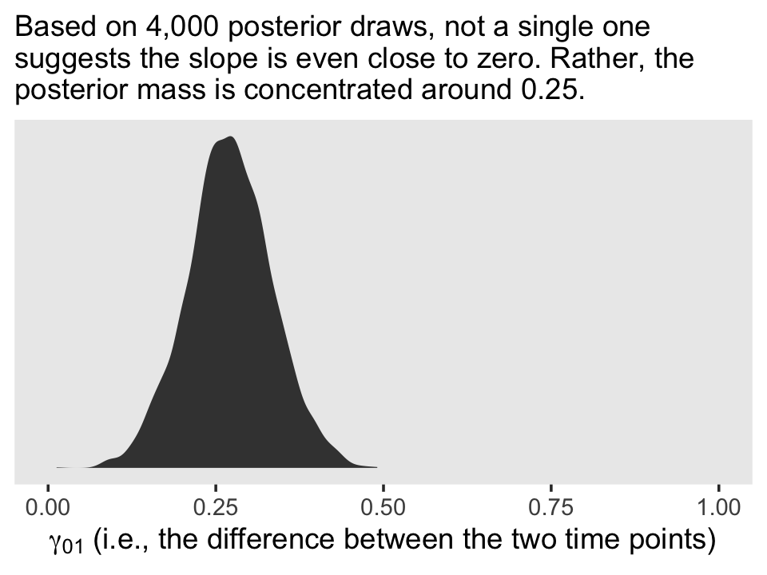

Here are the posterior mean and 95% intervals.


```r
f %>% 
  summarise(mean = mean(difference),
            ll   = quantile(difference, probs = .025),
            ul   = quantile(difference, probs = .975))
```

```
##        mean        ll        ul
## 1 0.2705034 0.1463065 0.3968954
```

On page 125, Singer and Willett further mused:

> When we examined the OLS estimated change trajectories in figure 4.2, we noticed that among children of non-alcoholic parents, those with low values of *CPEER* tended to have a lower initial status and steeper slopes than those with high values of *CPEER*. We might therefore ask whether the former group "catches up" to the latter. This is a question about the "vertical" separation between these two groups['] true change trajectories at some later age, say 16. 

Within their joint hypothesis testing paradigm, they pose this as testing

$$H_0: 0\gamma_{00} + 0\gamma_{01} + 1\gamma_{02} + 0\gamma_{10} + 2\gamma_{12} = 0.$$

From our perspective, this is a differences of differences analysis. That is, first we'll compute the model implied `alcuse` estimates for the four combinations of the two levels of `age` and `peer`, holding `coa` constant at 0. Second, we'll compute the differences between the two `peer` levels at each `age`. Third and finally, we'll compute a difference of those differences.

For our first step, recall it was `fit4.7` that used the `cpeer` variable.


```r
# first step
nd <-
  crossing(age_14 = c(0, 2),
           cpeer  = c(-.363, .363)) %>% 
  mutate(coa = 0)

head(nd)
```

```
## # A tibble: 4 × 3
##   age_14  cpeer   coa
##    <dbl>  <dbl> <dbl>
## 1      0 -0.363     0
## 2      0  0.363     0
## 3      2 -0.363     0
## 4      2  0.363     0
```

```r
f <-
  fitted(fit4.7, 
         newdata = nd,
         re_formula = NA,
         summary = F) %>% 
  data.frame()

head(f)
```

```
##           X1        X2        X3        X4
## 1 0.03788212 0.5636738 0.7855357 0.9867873
## 2 0.14784119 0.5055112 0.7909200 0.9861349
## 3 0.18285206 0.4843414 0.5921288 0.8070981
## 4 0.08708519 0.4795838 0.7427321 0.9024861
## 5 0.18469932 0.7342615 0.8319810 1.0873110
## 6 0.06184649 0.6010113 0.5206236 0.8319538
```

For our initial difference scores, we'll subtract the estimates for the lower level of `cpeer` from the higher ones.


```r
# step 2
f <-
  f %>% 
  transmute(`difference at 14` = X2 - X1,
            `difference at 16` = X4 - X3)

head(f)
```

```
##   difference at 14 difference at 16
## 1        0.5257917        0.2012516
## 2        0.3576700        0.1952149
## 3        0.3014894        0.2149694
## 4        0.3924986        0.1597540
## 5        0.5495622        0.2553300
## 6        0.5391648        0.3113302
```

For our final difference score, we'll subtract the first difference score from the second.


```r
# step 3
f <-
  f %>% 
  mutate(`difference in differences` = `difference at 16` - `difference at 14`)

head(f)
```

```
##   difference at 14 difference at 16 difference in differences
## 1        0.5257917        0.2012516               -0.32454013
## 2        0.3576700        0.1952149               -0.16245519
## 3        0.3014894        0.2149694               -0.08652001
## 4        0.3924986        0.1597540               -0.23274460
## 5        0.5495622        0.2553300               -0.29423221
## 6        0.5391648        0.3113302               -0.22783462
```

Here we'll plot all three.


```r
f %>%
  pivot_longer(everything()) %>% 
  
  ggplot(aes(x = value)) +
  geom_density(size = 0, fill = "grey25") +
  scale_y_continuous(NULL, breaks = NULL) +
  xlab("different differences") +
  theme(panel.grid = element_blank()) +
  facet_wrap(~ name, scales = "free_y")
```

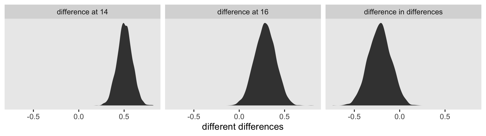

Singer and Willett concluded they could "reject the null hypothesis at any conventional level of significance" (p. 126). If we must appeal to the Null, here are the posterior means and 95% intervals for our differences.


```r
f %>% 
  pivot_longer(everything()) %>% 
  group_by(name) %>% 
  summarise(mean = mean(value),
            ll   = quantile(value, probs = .025),
            ul   = quantile(value, probs = .975)) %>% 
  mutate_if(is.double, round, digits = 3)
```

```
## # A tibble: 3 × 4
##   name                        mean     ll    ul
##   <chr>                      <dbl>  <dbl> <dbl>
## 1 difference at 14           0.507  0.349 0.668
## 2 difference at 16           0.286  0.064 0.506
## 3 difference in differences -0.22  -0.462 0.017
```

Our results contrast a bit from Singer and Willett's. Though the bulk of our posterior mass is concentrated around -0.22, zero is a credible value within the difference of differences density. Our best bet is the differences begin to converge over time. However, that rate of that convergence is subtle and somewhat imprecise relative to the effect size. Interpret with caution.

## Evaluating the tenability of a model's assumptions

"Whenever you fit a statistical model, you invoke assumptions" (p. 127). This is the case for multilevel Bayesian models, too.

### Checking functional form.

We've already checked the functional form at level-1 with our version of Figure 4.1. When we made our version of Figure 4.1, we relied on `ggplot2::stat_smooth()` to compute the `id`-level OLS trajectories. To make our variants of Figure 4.4, we'll have to back up and compute them externally with `lm()`. Here we'll do so in bulk with a nested data frame. The **broom** package will help us extract the results.


```r
library(broom)

o <-
  alcohol1_pp %>% 
  nest(-id, -coa, -peer) %>% 
  mutate(ols = map(data, ~lm(data = ., alcuse ~ 1 + age_14))) %>% 
  mutate(tidy = map(ols, tidy)) %>% 
  unnest(tidy) %>% 
  # this is unnecessary, but will help with plotting
  mutate(term = factor(term, 
                       levels = c("(Intercept)", "age_14"),
                       labels = c("pi[0]", "pi[1]")))

head(o)
```

```
## # A tibble: 6 × 10
##      id   coa  peer data             ols    term  estimate std.error statistic p.value
##   <dbl> <dbl> <dbl> <list>           <list> <fct>    <dbl>     <dbl>     <dbl>   <dbl>
## 1     1     1 1.26  <tibble [3 × 6]> <lm>   pi[0]    1.78     0.0999    17.8    0.0357
## 2     1     1 1.26  <tibble [3 × 6]> <lm>   pi[1]    0.134    0.0774     1.73   0.333 
## 3     2     1 0.894 <tibble [3 × 6]> <lm>   pi[0]   -0.167    0.373     -0.447  0.732 
## 4     2     1 0.894 <tibble [3 × 6]> <lm>   pi[1]    0.5      0.289      1.73   0.333 
## 5     3     1 0.894 <tibble [3 × 6]> <lm>   pi[0]    0.947    0.118      8.03   0.0789
## 6     3     1 0.894 <tibble [3 × 6]> <lm>   pi[1]    1.16     0.0914    12.7    0.0501
```

Now plot.


```r
o %>% 
  select(coa:peer, term:estimate) %>% 
  pivot_longer(coa:peer) %>% 
  
  ggplot(aes(x = value, y = estimate)) +
  geom_hline(yintercept = 0, color = "white") +
  geom_point(alpha = 2/3) +
  theme(panel.grid = element_blank(),
        strip.text = element_text(size = 11)) +
  facet_grid(term ~ name, scales = "free", labeller = label_parsed)
```

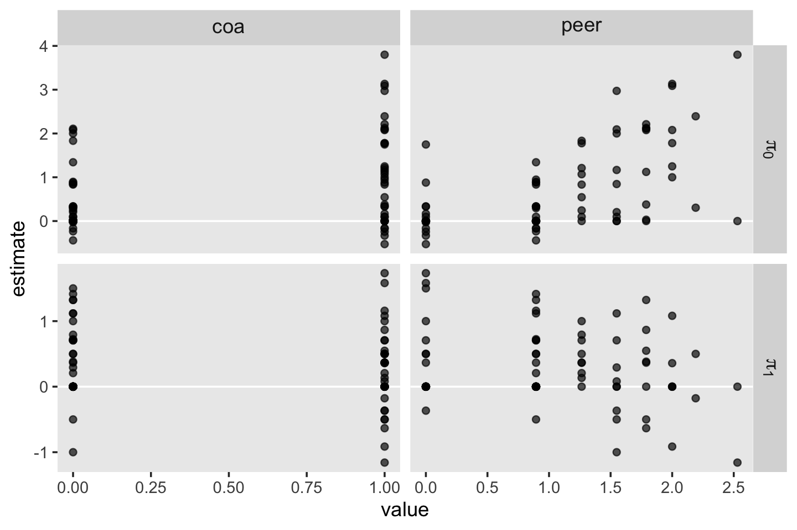

With a little more wrangling, we can extract the Pearson's correlation coefficients for each panel.


```r
o %>% 
  select(coa:peer, term:estimate) %>% 
  pivot_longer(coa:peer) %>% 
  group_by(term, name) %>% 
  nest() %>%
  mutate(r = map_dbl(data, ~cor(.)[2, 1] %>% round(digits = 2)))
```

```
## # A tibble: 4 × 4
## # Groups:   term, name [4]
##   term  name  data                  r
##   <fct> <chr> <list>            <dbl>
## 1 pi[0] coa   <tibble [82 × 2]>  0.39
## 2 pi[0] peer  <tibble [82 × 2]>  0.58
## 3 pi[1] coa   <tibble [82 × 2]> -0.04
## 4 pi[1] peer  <tibble [82 × 2]> -0.19
```

### Checking normality.

The basic multilevel model of change yields three variance parameters, $\epsilon_{ij}$, $\zeta_{0i}$, and $\zeta_{1i}$. Each measurement occasion in the model receives a model-implied estimate for each. Singer and Willett referred to those estimates as $\hat{\epsilon}_{ij}$, $\hat{\zeta}_{0i}$, and $\hat{\zeta}_{1i}$. As with frequentist software, our Bayesian software **brms** will return these estimates.

To extract our Bayesian draws for the $\hat{\epsilon}_{ij}$'s, we use the `residuals()` function.


```r
e <- residuals(fit4.6)

str(e)
```

```
##  num [1:246, 1:4] 0.2865 0.2544 -0.0457 -0.3951 -0.5896 ...
##  - attr(*, "dimnames")=List of 2
##   ..$ : NULL
##   ..$ : chr [1:4] "Estimate" "Est.Error" "Q2.5" "Q97.5"
```

```r
head(e)
```

```
##         Estimate Est.Error       Q2.5      Q97.5
## [1,]  0.28645522 0.3235166 -0.3763283 0.88418276
## [2,]  0.25436837 0.2945643 -0.3189651 0.82411080
## [3,] -0.04566771 0.4349924 -0.9053165 0.80634266
## [4,] -0.39506888 0.3398897 -1.0223290 0.30304545
## [5,] -0.58958153 0.3060274 -1.1864493 0.01680105
## [6,]  0.21590581 0.4420805 -0.6299085 1.10509364
```

For our `fit5`, the `residuals()` function returned a $246 \times 4$ numeric array. Each row corresponded to one of the rows of the original data set. The four vectors are the familiar summaries `Estimate`, `Est.Error`, `Q2.5`, and `Q97.5`. If we'd like to work with these in a **ggplot2**-made plot, we'll have to convert our `e` object to a data frame. 

After we make the conversion, we then make the top left panel of Figure 4.5.


```r
e <- 
  e %>% 
  data.frame()

e %>% 
  ggplot(aes(sample = Estimate)) +
  geom_hline(yintercept = 0, color = "white") +
  geom_qq() +
  ylim(-2, 2) +
  labs(x = "Normal score",
       y = expression(hat(epsilon)[italic(ij)])) +
  theme(panel.grid = element_blank())
```


For the right plot on the top, we need to add an `id` index. That's as easy as appending the one from the original data. If you followed closely with the text, you may have also noticed this panel is of the standardized residuals. That just means we'll have to hand-standardize ours before plotting.


```r
e %>% 
  bind_cols(alcohol1_pp %>% select(id)) %>% 
  mutate(z = (Estimate - mean(Estimate)) / sd(Estimate)) %>% 
  
  ggplot(aes(x = id, y = z)) +
  geom_hline(yintercept = 0, color = "white") +
  geom_point() +
  scale_y_continuous(expression(italic(std)~hat(epsilon)[italic(ij)]), limits = c(-2, 2)) +
  theme(panel.grid = element_blank())
```


We'll need to use the `ranef()` function to return the estimates for the $\zeta$'s.


```r
z <- ranef(fit4.6)

str(z)
```

```
## List of 1
##  $ id: num [1:82, 1:4, 1:2] 0.31 -0.484 0.329 -0.353 -0.563 ...
##   ..- attr(*, "dimnames")=List of 3
##   .. ..$ : chr [1:82] "1" "2" "3" "4" ...
##   .. ..$ : chr [1:4] "Estimate" "Est.Error" "Q2.5" "Q97.5"
##   .. ..$ : chr [1:2] "Intercept" "age_14"
```

```r
z[[1]][1:6, , "Intercept"]
```

```
##     Estimate Est.Error       Q2.5      Q97.5
## 1  0.3096401 0.3255604 -0.2994276 0.99225330
## 2 -0.4838875 0.3379615 -1.1779208 0.13797688
## 3  0.3288607 0.3232582 -0.3171446 0.96187776
## 4 -0.3533780 0.3581920 -1.1149435 0.27253190
## 5 -0.5632002 0.3358156 -1.2455240 0.07918749
## 6  0.8331396 0.3621270  0.1799406 1.59070253
```

```r
z[[1]][1:6, , "age_14"]
```

```
##      Estimate Est.Error        Q2.5     Q97.5
## 1  0.06708165 0.2443591 -0.42337534 0.5545886
## 2 -0.09468276 0.2464821 -0.56047541 0.4213590
## 3  0.45095604 0.2619440 -0.03623371 0.9944058
## 4  0.14971138 0.2626305 -0.33000069 0.7007354
## 5 -0.30796549 0.2554600 -0.82223987 0.1962415
## 6  0.25007189 0.2598447 -0.28315206 0.7505450
```

For our `fit5`, the `ranef()` function returned a list of 1, indexed by `id`. Therein lay a 3-dimensional array. The first two dimensions are the same as what we got from `residuals()`, above. The third dimension had two levels: `Intercept` and `age_14`. In other words, the third dimension is the one that differentiated between $\hat{\zeta}_{0i}$ and $\hat{\zeta}_{1i}$. to make this thing a little more useful, let's convert it to a long-formatted data frame.


```r
z <-
  rbind(z[[1]][ , , "Intercept"],
        z[[1]][ , , "age_14"]) %>% 
  data.frame() %>% 
  mutate(ranef = rep(c("hat(zeta)[0][italic(i)]", "hat(zeta)[1][italic(i)]"), each = n() / 2))

glimpse(z)
```

```
## Rows: 164
## Columns: 5
## $ Estimate  <dbl> 0.30964009, -0.48388750, 0.32886075, -0.35337801, -0.56320019, 0.83313962, 0.213…
## $ Est.Error <dbl> 0.3255604, 0.3379615, 0.3232582, 0.3581920, 0.3358156, 0.3621270, 0.3399342, 0.3…
## $ Q2.5      <dbl> -0.29942760, -1.17792082, -0.31714461, -1.11494345, -1.24552398, 0.17994060, -0.…
## $ Q97.5     <dbl> 0.99225330, 0.13797688, 0.96187776, 0.27253190, 0.07918749, 1.59070253, 0.913804…
## $ ranef     <chr> "hat(zeta)[0][italic(i)]", "hat(zeta)[0][italic(i)]", "hat(zeta)[0][italic(i)]",…
```

Now we're ready to plot the remaining panels on the left of Figure 4.5.


```r
z %>% 
  ggplot(aes(sample = Estimate)) +
  geom_hline(yintercept = 0, color = "white") +
  geom_qq() +
  ylim(-1, 1) +
  labs(x = "Normal score",
       y = NULL) +
  theme(panel.grid = element_blank()) +
  facet_wrap(~ ranef, labeller = label_parsed, ncol = 1)
```


Here are the ones on the right.


```r
z %>% 
  bind_cols(
    bind_rows(
      alcohol1_pp %>% distinct(id),
      alcohol1_pp %>% distinct(id)
      )
    ) %>%
  mutate(ranef = str_c("italic(std)~", ranef)) %>% 
  # note we have to group them before standardizing
  group_by(ranef) %>% 
  mutate(z = (Estimate - mean(Estimate)) / sd(Estimate)) %>% 
  
  ggplot(aes(x = id, y = z)) +
  geom_hline(yintercept = 0, color = "white") +
  geom_point() +
  scale_y_continuous(NULL, limits = c(-3, 3)) +
  theme(panel.grid = element_blank()) +
  facet_wrap(~ ranef, labeller = label_parsed, ncol = 1)
```

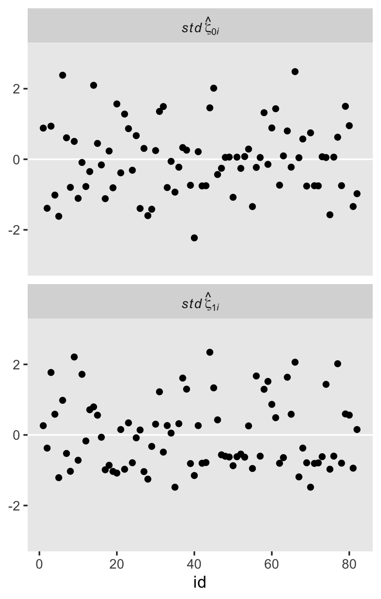

If you were paying close attention, you may have noticed that for all three of our `id`-level deviation estimates, they were summarized not only by a posterior mean but by standard deviations and 95% intervals, too. To give a sense of what that means, here are those last two plots, again, but this time including vertical bars defined by the 95% intervals.


```r
z %>% 
  bind_cols(
    bind_rows(
      alcohol1_pp %>% distinct(id),
      alcohol1_pp %>% distinct(id)
      )
    ) %>%

  ggplot(aes(x = id, y = Estimate, ymin = Q2.5, ymax = Q97.5)) +
  geom_hline(yintercept = 0, color = "white") +
  geom_pointrange(shape = 20, size = 1/3) +
  ylab(NULL) +
  theme(panel.grid = element_blank()) +
  facet_wrap(~ ranef, labeller = label_parsed, ncol = 1)
```

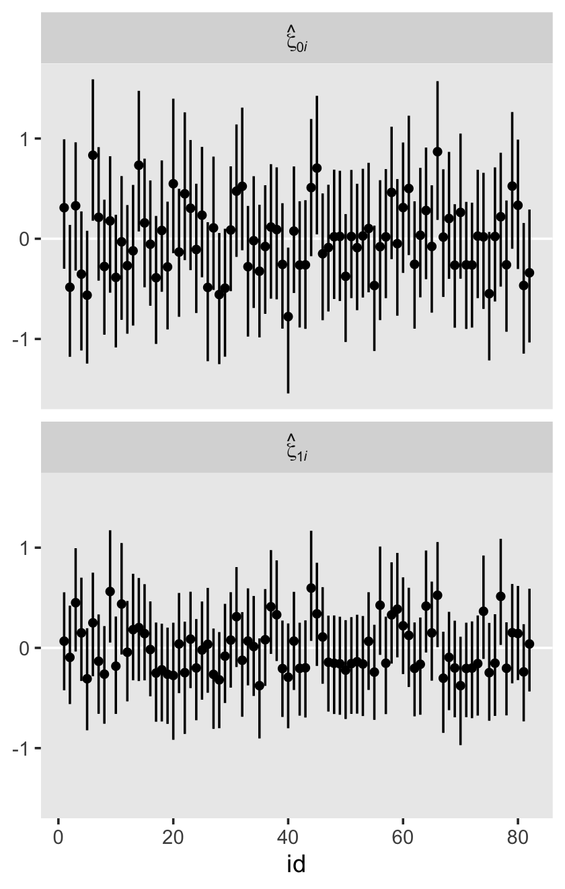

When you go Bayesian, even your residuals get full posterior distributions.

### Checking homoscedasticity.

Here we examine the homoscedasticity assumption by plotting the residual estimates against our predictors. We'll start with the upper left panel of Figure 4.6.


```r
e %>% 
  bind_cols(alcohol1_pp) %>% 
  
  ggplot(aes(x = age, y = Estimate)) +
  geom_hline(yintercept = 0, color = "white") +
  geom_point(alpha = 1/4) +
  ylab(expression(hat(epsilon)[italic(ij)])) +
  coord_cartesian(xlim = c(13, 17),
                  ylim = c(-2, 2)) +
  theme(panel.grid = element_blank())
```


Here's a quick way to get the remaining four panels.


```r
z %>% 
  bind_cols(
    bind_rows(
      alcohol1_pp %>% distinct(id, coa, peer),
      alcohol1_pp %>% distinct(id, coa, peer)
      )
    ) %>%
  select(Estimate, ranef, coa, peer) %>% 
  pivot_longer(-c(Estimate, ranef)) %>% 
  
  ggplot(aes(x = value, y = Estimate)) +
  geom_hline(yintercept = 0, color = "white") +
  geom_point(alpha = 1/3) +
  ylim(-1, 1) +
  labs(x = "covariate value",
       y = NULL) +
  theme(panel.grid = element_blank(),
        strip.text = element_text(size = 10)) +
  facet_grid(ranef ~ name, labeller = label_parsed, scales = "free")
```


## Model-based (Empirical Bayes) estimates of the individual growth parameters

In this section, the authors discussed two methods for constructing `id`-level trajectories: a) use a weighted average of the OLS and multilevel estimates and b) rely solely on the multilevel model by making use of the three sources of residual variation. Our method will be the latter.

Here are the data for `id == 23`.


```r
alcohol1_pp %>% 
  select(id:coa, cpeer, alcuse) %>% 
  filter(id == 23)
```

```
## # A tibble: 3 × 5
##      id   age   coa cpeer alcuse
##   <dbl> <dbl> <dbl> <dbl>  <dbl>
## 1    23    14     1 -1.02   1   
## 2    23    15     1 -1.02   1   
## 3    23    16     1 -1.02   1.73
```


```r
draws_23 <-
  as_draws_df(fit4.7) %>% 
  select(starts_with("b_")) %>% 
  # make our pis
  mutate(`pi[0][",23"]` = b_Intercept + b_coa * 1 + b_cpeer * -1.018,
         `pi[1][",23"]` = b_age_14 + `b_age_14:cpeer` * -1.018)

head(draws_23)
```

```
## # A tibble: 6 × 7
##   b_Intercept b_age_14 b_coa b_cpeer `b_age_14:cpeer` `pi[0][",23"]` `pi[1][",23"]`
##         <dbl>    <dbl> <dbl>   <dbl>            <dbl>          <dbl>          <dbl>
## 1       0.301    0.293 0.527   0.724          -0.224          0.0907          0.520
## 2       0.327    0.281 0.576   0.493          -0.112          0.401           0.395
## 3       0.334    0.183 0.723   0.415          -0.0596         0.634           0.244
## 4       0.283    0.270 0.598   0.541          -0.160          0.331           0.433
## 5       0.459    0.250 0.582   0.757          -0.203          0.271           0.456
## 6       0.331    0.172 0.859   0.743          -0.157          0.434           0.332
```

It doesn't help us much now, but the reason we've formatted the names for our two $\pi$ columns so oddly is because those names will work much nicer in the figure we'll make, below. Just wait and see.

Anyways, more than a couple point estimates, we returned the draws from the full posterior distribution. We might summarize them.


```r
draws_23 %>% 
  pivot_longer(starts_with("pi")) %>%   
  group_by(name) %>% 
  summarise(mean = mean(value),
            ll   = quantile(value, probs = .025),
            ul   = quantile(value, probs = .975)) %>% 
  mutate_if(is.double, round, digits = 3)
```

```
## # A tibble: 2 × 4
##   name              mean     ll    ul
##   <chr>            <dbl>  <dbl> <dbl>
## 1 "pi[0][\",23\"]" 0.253 -0.082 0.578
## 2 "pi[1][\",23\"]" 0.426  0.213 0.626
```

Or we could plot them.


```r
draws_23 %>% 
  pivot_longer(starts_with("pi")) %>% 
  
  ggplot(aes(x = value)) +
  geom_density(size = 0, fill = "grey25") +
  scale_y_continuous(NULL, breaks = NULL) +
  xlab("participant-specific parameter estimates") +
  theme(panel.grid = element_blank()) +
  facet_wrap(~ name, labeller = label_parsed, scales = "free_y")
```

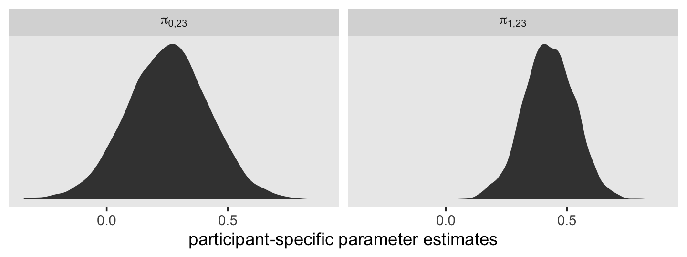

Yet this approach neglects the $\zeta$'s. We've been extracting the $\zeta$'s with `ranef()`. We also get them when we use `as_draws_df()`. Here we'll extract both the $\gamma$'s as well as the $\zeta$'s for `id == 23`.


```r
draws_23 <-
  as_draws_df(fit4.7) %>% 
  select(starts_with("b_"), contains("23"))

glimpse(draws_23)
```

```
## Rows: 4,000
## Columns: 7
## $ b_Intercept          <dbl> 0.3007780, 0.3266762, 0.3335967, 0.2833345, 0.4594804, 0.3314289, 0.4…
## $ b_age_14             <dbl> 0.29269175, 0.28092561, 0.18300835, 0.26963728, 0.25008280, 0.1724299…
## $ b_coa                <dbl> 0.5271688, 0.5760530, 0.7228979, 0.5975501, 0.5824831, 0.8585142, 0.6…
## $ b_cpeer              <dbl> 0.7242310, 0.4926585, 0.4152746, 0.5406317, 0.7569727, 0.7426513, 0.8…
## $ `b_age_14:cpeer`     <dbl> -0.22351248, -0.11188374, -0.05958678, -0.16029242, -0.20263927, -0.1…
## $ `r_id[23,Intercept]` <dbl> 0.29680214, 0.38927887, 0.84109967, 0.80968707, 0.58081307, 0.1180832…
## $ `r_id[23,age_14]`    <dbl> 0.30387794, -0.24906958, -0.32359686, -0.23184724, -0.35871606, 0.109…
```

With the `r_id` prefix, **brms** tells you these are residual estimates for the levels in the `id` grouping variable. Within the brackets, we learn these particular columns are for `id == 23`, the first with respect to the `Intercept` and second with respect to the `age_14` parameter. Let's put them to use.


```r
draws_23 <-
  draws_23 %>% 
  mutate(`pi[0][",23"]` = b_Intercept + b_coa * 1 + b_cpeer * -1.018 + `r_id[23,Intercept]`,
         `pi[1][",23"]` = b_age_14 + `b_age_14:cpeer` * -1.018 + `r_id[23,age_14]`)

glimpse(draws_23)
```

```
## Rows: 4,000
## Columns: 9
## $ b_Intercept          <dbl> 0.3007780, 0.3266762, 0.3335967, 0.2833345, 0.4594804, 0.3314289, 0.4…
## $ b_age_14             <dbl> 0.29269175, 0.28092561, 0.18300835, 0.26963728, 0.25008280, 0.1724299…
## $ b_coa                <dbl> 0.5271688, 0.5760530, 0.7228979, 0.5975501, 0.5824831, 0.8585142, 0.6…
## $ b_cpeer              <dbl> 0.7242310, 0.4926585, 0.4152746, 0.5406317, 0.7569727, 0.7426513, 0.8…
## $ `b_age_14:cpeer`     <dbl> -0.22351248, -0.11188374, -0.05958678, -0.16029242, -0.20263927, -0.1…
## $ `r_id[23,Intercept]` <dbl> 0.29680214, 0.38927887, 0.84109967, 0.80968707, 0.58081307, 0.1180832…
## $ `r_id[23,age_14]`    <dbl> 0.30387794, -0.24906958, -0.32359686, -0.23184724, -0.35871606, 0.109…
## $ `pi[0][",23"]`       <dbl> 0.38748175, 0.79048181, 1.47484473, 1.14020863, 0.85217841, 0.5520073…
## $ `pi[1][",23"]`       <dbl> 0.82410540, 0.14575368, -0.07992917, 0.20096773, 0.09765351, 0.441647…
```

Here are our updated summaries.


```r
draws_23 %>% 
  pivot_longer(starts_with("pi")) %>% 
  group_by(name) %>% 
  summarise(mean = mean(value),
            ll   = quantile(value, probs = .025),
            ul   = quantile(value, probs = .975)) %>% 
  mutate_if(is.double, round, digits = 3)
```

```
## # A tibble: 2 × 4
##   name              mean     ll    ul
##   <chr>            <dbl>  <dbl> <dbl>
## 1 "pi[0][\",23\"]" 0.565 -0.072  1.21
## 2 "pi[1][\",23\"]" 0.51   0.004  1.01
```

And here are the updated density plots.


```r
draws_23 %>% 
  pivot_longer(starts_with("pi")) %>% 
  
  ggplot(aes(x = value)) +
  geom_density(size = 0, fill = "grey25") +
  scale_y_continuous(NULL, breaks = NULL) +
  xlab("participant-specific parameter estimates") +
  theme(panel.grid = element_blank()) +
  facet_wrap(~ name, labeller = label_parsed, scales = "free_y")
```


We've been focusing on the $\pi$ parameters. Notice that when we turn our attention to Figure 4.7, we're now shifting focus slightly to the consequences of those parameters. We're not attending to trajectories. It's important to pick up on this distinction because it has consequences for our programming workflow. If you wanted to keep a parameter-centric workflow, we could continue to expand on our `as_draws_df()` by applying the full composite formula to explicitly add in predictions for various levels of `age_14`. And we could do that separately or in bulk for the eight participants highlighted in the figure.

However pedagogically useful that might be, it'd be very tedious. If we instead take a trajectory-centric perspective, it'll be more natural and efficient to work with a `fitted()`-based workflow. Let's define our `nd` data.


```r
nd <-
  alcohol1_pp %>% 
  select(id:coa, age_14:alcuse, cpeer) %>% 
  filter(id %in% c(4, 14, 23, 32, 41, 56, 65, 82)) %>% 
  # these next two lines will make plotting easier
  mutate(id_label = ifelse(id < 10, str_c("0", id), id)) %>% 
  mutate(id_label = str_c("id = ", id_label))

glimpse(nd)
```

```
## Rows: 24
## Columns: 7
## $ id       <dbl> 4, 4, 4, 14, 14, 14, 23, 23, 23, 32, 32, 32, 41, 41, 41, 56, 56, 56, 65, 65, 65, …
## $ age      <dbl> 14, 15, 16, 14, 15, 16, 14, 15, 16, 14, 15, 16, 14, 15, 16, 14, 15, 16, 14, 15, 1…
## $ coa      <dbl> 1, 1, 1, 1, 1, 1, 1, 1, 1, 1, 1, 1, 0, 0, 0, 0, 0, 0, 0, 0, 0, 0, 0, 0
## $ age_14   <dbl> 0, 1, 2, 0, 1, 2, 0, 1, 2, 0, 1, 2, 0, 1, 2, 0, 1, 2, 0, 1, 2, 0, 1, 2
## $ alcuse   <dbl> 0.000000, 2.000000, 1.732051, 2.828427, 3.605551, 2.828427, 1.000000, 1.000000, 1…
## $ cpeer    <dbl> 0.7708544, 0.7708544, 0.7708544, 0.9820000, 0.9820000, 0.9820000, -1.0180000, -1.…
## $ id_label <chr> "id = 04", "id = 04", "id = 04", "id = 14", "id = 14", "id = 14", "id = 23", "id …
```

We've isolated the relevant predictor variables for our eight focal participants. Next we'll pump them through `fitted()` and wrangle as usual. 


```r
f <-
  fitted(fit4.7,
         newdata = nd) %>% 
  data.frame() %>% 
  bind_cols(nd)

glimpse(f)
```

```
## Rows: 24
## Columns: 11
## $ Estimate  <dbl> 1.1343091, 1.4480770, 1.7618448, 2.3722619, 2.7030545, 3.0338470, 0.5651605, 1.0…
## $ Est.Error <dbl> 0.3610582, 0.3038636, 0.4495878, 0.3732088, 0.3184376, 0.4531277, 0.3321347, 0.2…
## $ Q2.5      <dbl> 0.36536447, 0.87256097, 0.89927906, 1.68844269, 2.07745330, 2.14940681, -0.07202…
## $ Q97.5     <dbl> 1.788938, 2.032998, 2.623005, 3.162017, 3.326801, 3.906143, 1.213904, 1.642876, …
## $ id        <dbl> 4, 4, 4, 14, 14, 14, 23, 23, 23, 32, 32, 32, 41, 41, 41, 56, 56, 56, 65, 65, 65,…
## $ age       <dbl> 14, 15, 16, 14, 15, 16, 14, 15, 16, 14, 15, 16, 14, 15, 16, 14, 15, 16, 14, 15, …
## $ coa       <dbl> 1, 1, 1, 1, 1, 1, 1, 1, 1, 1, 1, 1, 0, 0, 0, 0, 0, 0, 0, 0, 0, 0, 0, 0
## $ age_14    <dbl> 0, 1, 2, 0, 1, 2, 0, 1, 2, 0, 1, 2, 0, 1, 2, 0, 1, 2, 0, 1, 2, 0, 1, 2
## $ alcuse    <dbl> 0.000000, 2.000000, 1.732051, 2.828427, 3.605551, 2.828427, 1.000000, 1.000000, …
## $ cpeer     <dbl> 0.7708544, 0.7708544, 0.7708544, 0.9820000, 0.9820000, 0.9820000, -1.0180000, -1…
## $ id_label  <chr> "id = 04", "id = 04", "id = 04", "id = 14", "id = 14", "id = 14", "id = 23", "id…
```

Notice how this time we omitted the `re_formula = NA` argument. By default, `re_formula = NULL`, the consequence of which is the output is based on all the parameters in the multilevel model, not just the $\gamma$'s. Here are what they look like.


```r
f %>% 
  ggplot(aes(x = age, y = Estimate)) +
  geom_line(size = 1) +
  scale_y_continuous("alcuse", breaks = 0:4, limits = c(-1, 4)) +
  xlim(13, 17) +
  theme(legend.position = "none",
        panel.grid = element_blank()) +
  facet_wrap(~ id_label, ncol = 4)
```


Now we've warmed up, let's add in the data and the other lines so make the full version of Figure 4.7. Before we do so, we'll revisit `fitted()`. Notice the return of the `re_formula = NA` argument. The trajectories in our `f_gamma_only` data frame will only be sensitive to the $\gamma$s.


```r
f_gamma_only <-
  fitted(fit4.7,
         newdata = nd,
         re_formula = NA) %>% 
  data.frame() %>% 
  bind_cols(nd)

glimpse(f_gamma_only)
```

```
## Rows: 24
## Columns: 11
## $ Estimate  <dbl> 1.5013628, 1.6559457, 1.8105286, 1.6487576, 1.7712932, 1.8938287, 0.2526139, 0.6…
## $ Est.Error <dbl> 0.1369209, 0.1325563, 0.1830768, 0.1517240, 0.1460509, 0.2056251, 0.1692312, 0.1…
## $ Q2.5      <dbl> 1.23116197, 1.39538789, 1.46190193, 1.34537844, 1.48406531, 1.50343894, -0.08231…
## $ Q97.5     <dbl> 1.7760108, 1.9122619, 2.1666863, 1.9522861, 2.0567260, 2.2973858, 0.5777892, 1.0…
## $ id        <dbl> 4, 4, 4, 14, 14, 14, 23, 23, 23, 32, 32, 32, 41, 41, 41, 56, 56, 56, 65, 65, 65,…
## $ age       <dbl> 14, 15, 16, 14, 15, 16, 14, 15, 16, 14, 15, 16, 14, 15, 16, 14, 15, 16, 14, 15, …
## $ coa       <dbl> 1, 1, 1, 1, 1, 1, 1, 1, 1, 1, 1, 1, 0, 0, 0, 0, 0, 0, 0, 0, 0, 0, 0, 0
## $ age_14    <dbl> 0, 1, 2, 0, 1, 2, 0, 1, 2, 0, 1, 2, 0, 1, 2, 0, 1, 2, 0, 1, 2, 0, 1, 2
## $ alcuse    <dbl> 0.000000, 2.000000, 1.732051, 2.828427, 3.605551, 2.828427, 1.000000, 1.000000, …
## $ cpeer     <dbl> 0.7708544, 0.7708544, 0.7708544, 0.9820000, 0.9820000, 0.9820000, -1.0180000, -1…
## $ id_label  <chr> "id = 04", "id = 04", "id = 04", "id = 14", "id = 14", "id = 14", "id = 23", "id…
```

Let's plot!


```r
f %>% 
  ggplot(aes(x = age)) +
  # `id`-specific lines
  geom_line(aes(y = Estimate),
            size = 1) +
  # gamma-centric lines
  geom_line(data = f_gamma_only,
            aes(y = Estimate),
            size = 1/2) +
  # OLS lines
  stat_smooth(data = nd,
              aes(y = alcuse),
              method = "lm", se = F,
              color = "black", linetype = 2, size = 1/2) +
  # data points
  geom_point(data = nd,
             aes(y = alcuse)) +
  scale_y_continuous("alcuse", breaks = 0:4, limits = c(-1, 4)) +
  xlim(13, 17) +
  theme(legend.position = "none",
        panel.grid = element_blank()) +
  facet_wrap(~ id_label, ncol = 4)
```


Though our purpose was largely to reproduce Figure 4.7, we might push ourselves a little further. Our Bayesian estimates came with measures of uncertainty, the posterior standard deviations and the 95% intervals. Whenever possible, it's good form to include some expression of our uncertainty in our plots. Here let's focus on the `id`-specific trajectories.


```r
f %>% 
  ggplot(aes(x = age, y = Estimate)) +
  # `id`-specific 95% intervals
  geom_ribbon(aes(ymin = Q2.5, ymax = Q97.5),
              fill = "grey75") +
  # `id`-specific lines
  geom_line(size = 1) +
  # data points
  geom_point(data = nd,
             aes(y = alcuse)) +
  scale_y_continuous("alcuse", breaks = 0:4, limits = c(-1, 4)) +
  xlim(13, 17) +
  theme(legend.position = "none",
        panel.grid = element_blank()) +
  facet_wrap(~ id_label, ncol = 4)
```


This also clarifies an important visualization point. If you only care about plotting straight lines, you only need two points. However, if you want to express shapes with curves, such as the typically-bowtie-shaped 95% intervals, you need estimates over a larger number of predictor values. Back to `fitted()`!


```r
# we need an expanded version of the `nd`
nd_expanded <-
  alcohol1_pp %>% 
  select(id, coa, cpeer) %>% 
  filter(id %in% c(4, 14, 23, 32, 41, 56, 65, 82)) %>% 
  # this part is important!
  expand(nesting(id, coa, cpeer),
         age_14 = seq(from = 0, to = 2, length.out = 30)) %>% 
  mutate(id_label = ifelse(id < 10, str_c("0", id), id)) %>% 
  mutate(id_label = str_c("id = ", id_label),
         age      = age_14 + 14)

# pump our `nd_expanded` into `fitted()`
f <-
  fitted(fit4.7,
         newdata = nd_expanded) %>% 
  data.frame() %>% 
  bind_cols(nd_expanded)

glimpse(f)
```

```
## Rows: 240
## Columns: 10
## $ Estimate  <dbl> 1.134309, 1.155948, 1.177587, 1.199227, 1.220866, 1.242505, 1.264144, 1.285783, …
## $ Est.Error <dbl> 0.3610582, 0.3507056, 0.3410701, 0.3322143, 0.3242021, 0.3170973, 0.3109623, 0.3…
## $ Q2.5      <dbl> 0.3653645, 0.4099417, 0.4516141, 0.4964590, 0.5495808, 0.5857319, 0.6297501, 0.6…
## $ Q97.5     <dbl> 1.788938, 1.786759, 1.791425, 1.797305, 1.809752, 1.817148, 1.830143, 1.847108, …
## $ id        <dbl> 4, 4, 4, 4, 4, 4, 4, 4, 4, 4, 4, 4, 4, 4, 4, 4, 4, 4, 4, 4, 4, 4, 4, 4, 4, 4, 4,…
## $ coa       <dbl> 1, 1, 1, 1, 1, 1, 1, 1, 1, 1, 1, 1, 1, 1, 1, 1, 1, 1, 1, 1, 1, 1, 1, 1, 1, 1, 1,…
## $ cpeer     <dbl> 0.7708544, 0.7708544, 0.7708544, 0.7708544, 0.7708544, 0.7708544, 0.7708544, 0.7…
## $ age_14    <dbl> 0.00000000, 0.06896552, 0.13793103, 0.20689655, 0.27586207, 0.34482759, 0.413793…
## $ id_label  <chr> "id = 04", "id = 04", "id = 04", "id = 04", "id = 04", "id = 04", "id = 04", "id…
## $ age       <dbl> 14.00000, 14.06897, 14.13793, 14.20690, 14.27586, 14.34483, 14.41379, 14.48276, …
```

Notice how we now have many more rows. Let's plot.


```r
f %>% 
  ggplot(aes(x = age, y = Estimate)) +
  # `id`-specific 95% intervals
  geom_ribbon(aes(ymin = Q2.5, ymax = Q97.5),
              fill = "grey75") +
  # `id`-specific lines
  geom_line(size = 1) +
  # data points
  geom_point(data = nd,
             aes(y = alcuse)) +
  scale_y_continuous("alcuse", breaks = 0:4, limits = c(-1, 4)) +
  xlim(13, 17) +
  theme(legend.position = "none",
        panel.grid = element_blank()) +
  facet_wrap(~ id_label, ncol = 4)
```

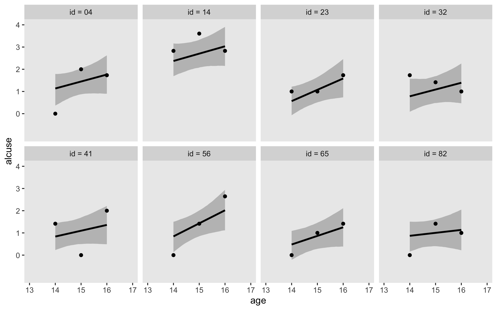

Singer and Willett pointed out that one of the ways in which the multilevel model is more parsimonious than a series of `id`-specific single-level models is that all `id` levels share the same $\sigma_\epsilon$ parameter. For now, we should just point out that it's possible to relax this assumption with modern Bayesian software, such as **brms**. For ideas on how, check out [Donald Williams](https://donaldrwilliams.github.io/)' work [e.g., @williamsSurfaceUnearthingWithinperson2019].

## Session info {-}


```r
sessionInfo()
```

```
## R version 4.3.0 (2023-04-21)
## Platform: x86_64-apple-darwin20 (64-bit)
## Running under: macOS Monterey 12.4
## 
## Matrix products: default
## BLAS:   /Library/Frameworks/R.framework/Versions/4.3-x86_64/Resources/lib/libRblas.0.dylib 
## LAPACK: /Library/Frameworks/R.framework/Versions/4.3-x86_64/Resources/lib/libRlapack.dylib;  LAPACK version 3.11.0
## 
## locale:
## [1] en_US.UTF-8/en_US.UTF-8/en_US.UTF-8/C/en_US.UTF-8/en_US.UTF-8
## 
## time zone: America/Chicago
## tzcode source: internal
## 
## attached base packages:
## [1] stats     graphics  grDevices utils     datasets  methods   base     
## 
## other attached packages:
##  [1] broom_1.0.4     loo_2.6.0       ggdist_3.3.0    brms_2.19.0     Rcpp_1.0.10     lubridate_1.9.2
##  [7] forcats_1.0.0   stringr_1.5.0   dplyr_1.1.2     purrr_1.0.1     readr_2.1.4     tidyr_1.3.0    
## [13] tibble_3.2.1    ggplot2_3.4.2   tidyverse_2.0.0
## 
## loaded via a namespace (and not attached):
##   [1] gridExtra_2.3        inline_0.3.19        sandwich_3.0-2       rlang_1.1.1         
##   [5] magrittr_2.0.3       multcomp_1.4-23      matrixStats_0.63.0   compiler_4.3.0      
##   [9] mgcv_1.8-42          callr_3.7.3          vctrs_0.6.2          reshape2_1.4.4      
##  [13] pkgconfig_2.0.3      crayon_1.5.2         fastmap_1.1.1        backports_1.4.1     
##  [17] ellipsis_0.3.2       labeling_0.4.2       utf8_1.2.3           threejs_0.3.3       
##  [21] promises_1.2.0.1     rmarkdown_2.21       markdown_1.7         tzdb_0.4.0          
##  [25] nloptr_2.0.3         ps_1.7.5             bit_4.0.5            xfun_0.39           
##  [29] cachem_1.0.8         jsonlite_1.8.4       highr_0.10           later_1.3.1         
##  [33] prettyunits_1.1.1    parallel_4.3.0       R6_2.5.1             dygraphs_1.1.1.6    
##  [37] RColorBrewer_1.1-3   StanHeaders_2.26.25  bslib_0.4.2          stringi_1.7.12      
##  [41] boot_1.3-28.1        estimability_1.4.1   jquerylib_0.1.4      bookdown_0.34       
##  [45] rstan_2.21.8         knitr_1.42           zoo_1.8-12           base64enc_0.1-3     
##  [49] bayesplot_1.10.0     httpuv_1.6.11        Matrix_1.5-4         splines_4.3.0       
##  [53] igraph_1.4.2         timechange_0.2.0     tidyselect_1.2.0     rstudioapi_0.14     
##  [57] abind_1.4-5          codetools_0.2-19     miniUI_0.1.1.1       processx_3.8.1      
##  [61] pkgbuild_1.4.0       lattice_0.21-8       plyr_1.8.8           shiny_1.7.4         
##  [65] withr_2.5.0          bridgesampling_1.1-2 posterior_1.4.1      coda_0.19-4         
##  [69] evaluate_0.21        survival_3.5-5       RcppParallel_5.1.7   xts_0.13.1          
##  [73] pillar_1.9.0         tensorA_0.36.2       checkmate_2.2.0      DT_0.27             
##  [77] stats4_4.3.0         shinyjs_2.1.0        distributional_0.3.2 generics_0.1.3      
##  [81] vroom_1.6.3          hms_1.1.3            rstantools_2.3.1     munsell_0.5.0       
##  [85] scales_1.2.1         minqa_1.2.5          gtools_3.9.4         xtable_1.8-4        
##  [89] gamm4_0.2-6          glue_1.6.2           emmeans_1.8.6        projpred_2.5.0      
##  [93] tools_4.3.0          shinystan_2.6.0      lme4_1.1-33          colourpicker_1.2.0  
##  [97] mvtnorm_1.1-3        grid_4.3.0           crosstalk_1.2.0      colorspace_2.1-0    
## [101] nlme_3.1-162         cli_3.6.1            fansi_1.0.4          Brobdingnag_1.2-9   
## [105] gtable_0.3.3         sass_0.4.6           digest_0.6.31        TH.data_1.1-2       
## [109] htmlwidgets_1.6.2    farver_2.1.1         htmltools_0.5.5      lifecycle_1.0.3     
## [113] mime_0.12            MASS_7.3-58.4        bit64_4.0.5          shinythemes_1.2.0
```


