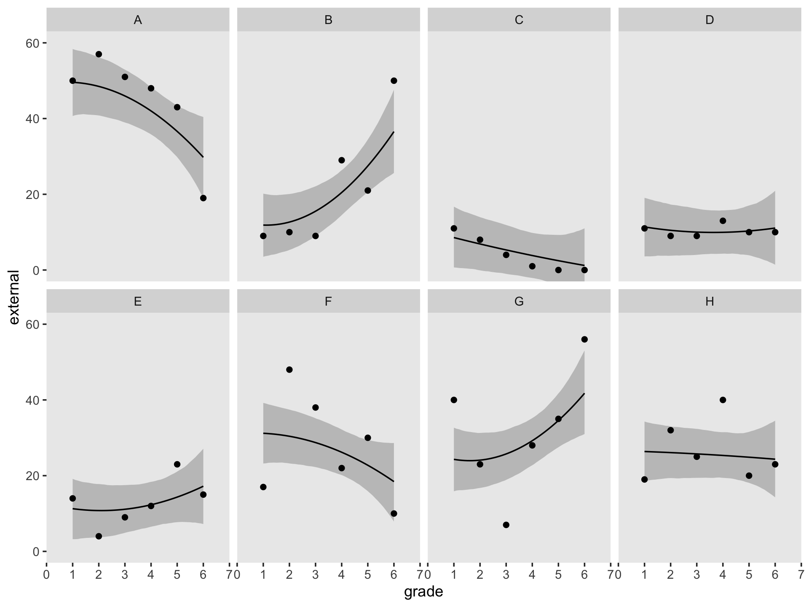
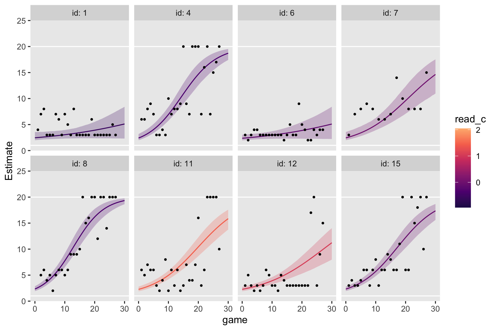
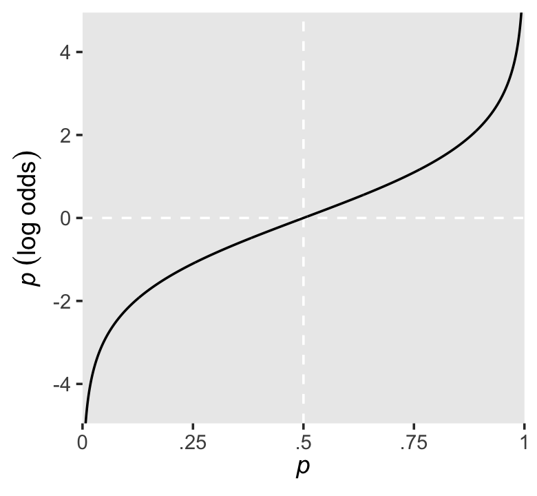

# Modeling Discontinuous and Nonlinear Change

> All the multilevel models for change presented so far assume that individual growth is smooth and linear. Yet individual change can also be discontinuous or nonlinear...
>
> In this chapter, we introduce strategies for fitting models in which individual change is explicitly discontinuous or nonlinear. Rather than view these patterns as inconveniences, we treat them as substantively compelling opportunities. In doing so, we broaden our questions about the nature of change beyond the basic concepts of initial status and rate of change to a consideration of acceleration, deceleration, turning points, shifts, and asymptotes. The strategies that we use fall into two broad classes. *Empirical* strategies that let the "data speak for themselves." Under this approach, you inspect observed growth records systematically and identify a transformation of the outcome, or of *TIME*, that linearizes the individual change trajectory. Unfortunately, this approach can lead to interpretive difficulties, especially if it involves esoteric transformations or higher order polynomials. Under *rational* strategies, on the other hand, you use theory to hypothesize a substantively meaningful functional form for the individual change trajectory. Although rational strategies generally yield clearer interpretations, their dependence on good theory makes them somewhat more difficult to develop and apply. [@singerAppliedLongitudinalData2003, p. 189--190, *emphasis* in the original]

## Discontinuous individual change

> Not all individual change trajectories are continuous functions of time...
>
> If you have reason to believe that individual change trajectories might shift in elevation and/or slope, your level-1 model should reflect this hypothesis. Doing so allows you to test ideas about how the trajectory’s shape might change over time...
>
> To postulate a discontinuous individual change trajectory, you need to know not just *why* the shift might occur but also *when*. This is because your level-1 individual growth model must include one (or more) time-varying predictor(s) that specify whether and if so, when each person experiences the hypothesized shift. (pp. 190--191, *emphasis* in the original)

### Alternative discontinuous level-1 models for change.

> To postulate a discontinuous level-1 individual growth model, you must first decide on its functional form. Although you can begin empirically, we prefer to focus on substance and the longitudinal process that gave rise to the data. What kind of discontinuity might the precipitating event create? What would a plausible level-1 trajectory look like? Before parameterizing models and constructing variables, we suggest that you: (1) take a pen and paper and sketch some options; and (2) articulate--in words, not equations--the rationale for each. We recommend these steps because, as we demonstrate, the easiest models to specify may not display the type of discontinuity you expect to find. (pp. 191--192)

I'll leave the pen and paper scribbling to you. Here we load the `wages_pp.csv` data.


```r
library(tidyverse)

wages_pp <- read_csv("data/wages_pp.csv")

glimpse(wages_pp)
```

```
## Rows: 6,402
## Columns: 15
## $ id            <dbl> 31, 31, 31, 31, 31, 31, 31, 31, 36, 36, 36, 36, 36, 36, 36, 36, 36, 36, 53, 53, 53, 53…
## $ lnw           <dbl> 1.491, 1.433, 1.469, 1.749, 1.931, 1.709, 2.086, 2.129, 1.982, 1.798, 2.256, 2.573, 1.…
## $ exper         <dbl> 0.015, 0.715, 1.734, 2.773, 3.927, 4.946, 5.965, 6.984, 0.315, 0.983, 2.040, 3.021, 4.…
## $ ged           <dbl> 1, 1, 1, 1, 1, 1, 1, 1, 1, 1, 1, 1, 1, 1, 1, 1, 1, 1, 0, 0, 1, 1, 1, 1, 1, 1, 0, 0, 0,…
## $ postexp       <dbl> 0.015, 0.715, 1.734, 2.773, 3.927, 4.946, 5.965, 6.984, 0.315, 0.983, 2.040, 3.021, 4.…
## $ black         <dbl> 0, 0, 0, 0, 0, 0, 0, 0, 0, 0, 0, 0, 0, 0, 0, 0, 0, 0, 0, 0, 0, 0, 0, 0, 0, 0, 0, 0, 0,…
## $ hispanic      <dbl> 1, 1, 1, 1, 1, 1, 1, 1, 0, 0, 0, 0, 0, 0, 0, 0, 0, 0, 1, 1, 1, 1, 1, 1, 1, 1, 0, 0, 0,…
## $ hgc           <dbl> 8, 8, 8, 8, 8, 8, 8, 8, 9, 9, 9, 9, 9, 9, 9, 9, 9, 9, 7, 7, 7, 7, 7, 7, 7, 7, 12, 12, …
## $ hgc.9         <dbl> -1, -1, -1, -1, -1, -1, -1, -1, 0, 0, 0, 0, 0, 0, 0, 0, 0, 0, -2, -2, -2, -2, -2, -2, …
## $ uerate        <dbl> 3.215, 3.215, 3.215, 3.295, 2.895, 2.495, 2.595, 4.795, 4.895, 7.400, 7.400, 5.295, 4.…
## $ ue.7          <dbl> -3.785, -3.785, -3.785, -3.705, -4.105, -4.505, -4.405, -2.205, -2.105, 0.400, 0.400, …
## $ ue.centert1   <dbl> 0.000, 0.000, 0.000, 0.080, -0.320, -0.720, -0.620, 1.580, 0.000, 2.505, 2.505, 0.400,…
## $ ue.mean       <dbl> 3.2150, 3.2150, 3.2150, 3.2150, 3.2150, 3.2150, 3.2150, 3.2150, 5.0965, 5.0965, 5.0965…
## $ ue.person.cen <dbl> 0.0000, 0.0000, 0.0000, 0.0800, -0.3200, -0.7200, -0.6200, 1.5800, -0.2015, 2.3035, 2.…
## $ ue1           <dbl> 3.215, 3.215, 3.215, 3.215, 3.215, 3.215, 3.215, 3.215, 4.895, 4.895, 4.895, 4.895, 4.…
```

Here's a more focused look along the lines of Table 6.1.


```r
wages_pp %>% 
  select(id, lnw, exper, ged, postexp) %>% 
  mutate(`ged by exper` = ged * exper) %>% 
  filter(id %in% c(206, 2365, 4384))
```

```
## # A tibble: 22 × 6
##       id   lnw exper   ged postexp `ged by exper`
##    <dbl> <dbl> <dbl> <dbl>   <dbl>          <dbl>
##  1   206  2.03  1.87     0    0              0   
##  2   206  2.30  2.81     0    0              0   
##  3   206  2.48  4.31     0    0              0   
##  4  2365  1.78  0.66     0    0              0   
##  5  2365  1.76  1.68     0    0              0   
##  6  2365  1.71  2.74     0    0              0   
##  7  2365  1.74  3.68     0    0              0   
##  8  2365  2.19  4.68     1    0              4.68
##  9  2365  2.04  5.72     1    1.04           5.72
## 10  2365  2.32  6.72     1    2.04           6.72
## # ℹ 12 more rows
```

Similar to what we did in Section 5.2.1, here is a visualization of the two primary variables, `exper` and `lnw`, for those three participants.


```r
wages_pp %>% 
  filter(id %in% c(206, 2365, 4384)) %>% 
  mutate(id = factor(id)) %>% 
  
  ggplot(aes(x = exper, y = lnw)) +
  geom_point(aes(color = id),
             size = 4) +
  geom_line(aes(color = id)) +
  geom_text(aes(label = ged),
            size = 3) +
  scale_x_continuous(breaks = 1:13) +
  scale_color_viridis_d(option = "B", begin = .6, end = .9) +
  labs(caption = expression(italic("Note")*'. GED status is coded 0 = "not yet", 1 = "yes."')) +
  theme(panel.grid = element_blank(),
        plot.caption = element_text(hjust = 0))
```


Note how the time-varying predictor `ged` is depicted as either an `0` or a `1` in the center of the dots. Maybe we might describe that change as linear with the simple model $\text{lnw}_{ij} = \pi_{0i} + \pi_{1i} \text{exper}_{ij} + \epsilon_{ij}$. Maybe a different model that included `ged` would be helpful.

In the data, $n = 581$ never got their GED's, while $n = 307$ did.


```r
wages_pp %>% 
  group_by(id) %>% 
  summarise(got_ged = sum(ged) > 0) %>% 
  count(got_ged)
```

```
## # A tibble: 2 × 2
##   got_ged     n
##   <lgl>   <int>
## 1 FALSE     581
## 2 TRUE      307
```

However, those who did get their GED's did so at different times. Here's their distribution.


```r
wages_pp %>% 
  filter(ged == 1) %>% 
  group_by(id) %>% 
  slice(1) %>%
  
  ggplot(aes(x = exper)) +
  geom_histogram(binwidth = 0.5) +
  labs(subtitle = expression(The~italic(timing)~of~the~GED~attainment~varies)) +
  theme(panel.grid = element_blank())
```


Here's another, more focused, look at the GED status for our three focal participants, over `exper`.


```r
wages_pp %>% 
  select(id, lnw, exper, ged, postexp) %>% 
  filter(id %in% c(206, 2365, 4384)) %>% 
  mutate(id = factor(id)) %>%
  
  ggplot(aes(x = exper, y = ged)) +
  geom_point(aes(color = id),
             size = 4) +
  scale_x_continuous(breaks = 1:13) +
  scale_y_continuous(breaks = 0:1, limits = c(-0.2, 1.2)) +
  scale_color_viridis_d(option = "B", begin = .6, end = .9, breaks = NULL) +
  theme(panel.grid = element_blank(),
        plot.caption = element_text(hjust = 0)) +
  facet_wrap(~ id)
```


One might wonder: "How might GED receipt affect individual $i$'s wage trajectory?" (p. 193). Here we reproduce Figure 6.1, which entertains four possibilities.


```r
tibble(exper = c(0, 3, 3, 10),
       ged   = rep(0:1, each = 2)) %>% 
  expand(model = letters[1:4],
         nesting(exper, ged)) %>% 
  mutate(exper2 = if_else(ged == 0, 0, exper - 3)) %>% 
  mutate(lnw = case_when(
    model == "a" ~ 1.60 + 0.04 * exper,
    model == "b" ~ 1.65 + 0.04 * exper + 0.05 * ged,
    model == "c" ~ 1.75 + 0.04 * exper + 0.02 * exper2 * ged,
    model == "d" ~ 1.85 + 0.04 * exper + 0.01 * ged + 0.02 * exper * ged
  ),
  model = fct_rev(model)) %>% 
  
  ggplot(aes(x = exper, y = lnw)) +
  geom_line(aes(color = model),
            linewidth = 1) +
  scale_color_viridis_d(option = "D", begin = 1/4, end = 3/4) +
  ylim(1.5, 2.5) +
  theme(panel.grid.minor = element_blank())
```


#### Including a discontinuity in elevation, not slope.

We can write the level-1 formula for when there is a change in elevation, but not slope, as

$$
\text{lnw}_{ij} = \pi_{0i} + \pi_{1i} \text{exper}_{ij} + \pi_{2i} \text{ged}_{ij} + \epsilon_{ij}.
$$

Because we are equating `ged` values as relating to the intercept, but not the slope, it might be helpful to rewrite that formula as

$$
\text{lnw}_{ij} = (\pi_{0i} + \pi_{2i} \text{ged}_{ij}) + \pi_{1i} \text{exper}_{ij} + \epsilon_{ij},
$$

where the portion inside of the parentheses concerns initial status and discontinuity in elevation, but not slope. Because the `ged` values only come in 0's and 1's, we can express the two versions of this equation as

$$
\begin{align*}
\text{lnw}_{ij} & = [\pi_{0i} + \pi_{2i} (0)] + \pi_{1i} \text{exper}_{ij} + \epsilon_{ij} \;\;\; \text{and} \\
                & = [\pi_{0i} + \pi_{2i} (1)] + \pi_{1i} \text{exper}_{ij} + \epsilon_{ij}.
\end{align*}
$$

In other words, whereas the pre-GED intercept is $\pi_{0i}$, the post-GED intercept is $\pi_{0i} + \pi_{2i}$. To get a better sense of this, we might make a version of the upper left panel of Figure 6.2. Since we'll be making four of these over the next few sections, we might reduce the redundancies in the code by making a custom plotting function. We'll call it `plot_figure_6.2()`.


```r
plot_figure_6.2 <- function(data, 
                            mapping, 
                            sizes = c(1, 1/4), 
                            linetypes = c(1, 2), 
                            ...) {
  
  ggplot(data, mapping) +
    geom_line(aes(size = model, linetype = model)) +
    geom_text(data = text,
              aes(label = label, hjust = hjust),
              size = 3, parse = T) +
    geom_segment(data = arrow,
                 aes(xend = xend, yend = yend),
                 arrow = arrow(length = unit(0.075, "inches"), type = "closed"),
                 size = 1/4) +
    scale_size_manual(values = sizes) +
    scale_linetype_manual(values = linetypes) +
    scale_x_continuous(expand = expansion(mult = c(0, 0.05))) +
    scale_y_continuous(breaks = 0:4 * 0.2 + 1.6, expand = c(0, 0)) +
    coord_cartesian(ylim = c(1.6, 2.4)) +
    theme(legend.position = "none",
          panel.grid = element_blank())
  
}
```

Now we have our custom plotting function, let's take it for a spin.


```r
text <-
  tibble(exper = c(4.5, 4.5, 7.5, 7.5, 1),
         lnw   = c(2.24, 2.2, 1.82, 1.78, 1.62),
         label = c("Common~rate~of~change",
                   "Pre-Post~GED~(pi[1][italic(i)])",
                   "Elevation~differential",
                   "on~GED~receipt~(pi[2][italic(i)])",
                   "italic(LNW)~at~labor~force~entry~(pi[0][italic(i)])"),
         hjust = c(.5, .5, .5, .5, 0))

arrow <-
  tibble(exper = c(2.85, 5.2, 5.5, 1.7),
         xend  = c(2, 6.8, 3.1, 0.05),
         lnw   = c(2.18, 2.18, 1.8, 1.64),
         yend  = c(1.84, 2.08, 1.9, 1.74))

p1 <-
  tibble(exper = c(0, 3, 3, 10),
         ged   = rep(0:1, each = 2)) %>% 
  expand(model = letters[1:2],
         nesting(exper, ged)) %>% 
  mutate(exper2 = if_else(ged == 0, 0, exper - 3)) %>% 
  mutate(lnw = case_when(
    model == "a" ~ 1.75 + 0.04 * exper,
    model == "b" ~ 1.75 + 0.04 * exper + 0.05 * ged),
  model = fct_rev(model)) %>%
  
  plot_figure_6.2(aes(x = exper, y = lnw))
```

```
## Warning: Using `size` aesthetic for lines was deprecated in ggplot2 3.4.0.
## ℹ Please use `linewidth` instead.
## This warning is displayed once every 8 hours.
## Call `lifecycle::last_lifecycle_warnings()` to see where this warning was generated.
```

```r
p1  
```


Worked like a dream!

#### Including a discontinuity in slope, not elevation.

> To specify a level-1 individual growth model that includes a discontinuity in slope, not elevation, you need a different time-varying predictor. Unlike GED, this predictor must clock the passage of time (like *EXPER*). But unlike *EXPER*, it must do so within only one of the two epochs (pre- or post-GED receipt). Adding a second temporal predictor allows each individual change trajectory to have two distinct slopes: one before the hypothesized discontinuity an another after. (p. 195, *emphasis* in the original)

In the `wages_pp` data, `postexp` is this second variable. Here is how it compares to the other relevant variables.


```r
wages_pp %>% 
  select(id, ged, exper, postexp) %>% 
  filter(id >= 53)
```

```
## # A tibble: 6,384 × 4
##       id   ged exper postexp
##    <dbl> <dbl> <dbl>   <dbl>
##  1    53     0 0.781   0    
##  2    53     0 0.943   0    
##  3    53     1 0.957   0    
##  4    53     1 1.04    0.08 
##  5    53     1 1.06    0.1  
##  6    53     1 1.11    0.152
##  7    53     1 1.18    0.227
##  8    53     1 1.78    0.82 
##  9   122     0 2.04    0    
## 10   122     0 2.64    0    
## # ℹ 6,374 more rows
```

Singer and Willett then went on to report "construction of a suitable time-varying predictor to register the desired discontinuity is often the hardest part of the model specification" (p. 195). They weren't kidding.

This concept caused me a good bit of frustration when learning about these models. Let's walk through this slowly. In the last code block, we looked at four relevant variables. You may wonder why we executed `filter(id >= 53)`. This is because the first two participants always had `ged == 1`. They're valid cases and all, but those data won't be immediately helpful for understanding what's going on with `postexp`. Happily, the next case, `id == 53`, is perfect for our goal. First, notice how that person's `postexp` values are always 0 when `ged == 0`. Second, notice how the first time where `ged == 1`, `postexp` is still a 0. Third, notice that after that first initial row, `postexp` increases. If you caught all that, go you!

To make the next point, it'll come in handy to subset the data. Because we're trying to understand the relationship between `exper` and `postesp` conditional on `ged`, cases for which `ged` is always the same will be of little use. Let's drop them.


```r
wages_pp_subset <-
  wages_pp %>% 
  group_by(id) %>% 
  filter(mean(ged) > 0) %>% 
  filter(mean(ged) < 1) %>% 
  ungroup() %>% 
  select(id, ged, exper, postexp)

wages_pp_subset
```

```
## # A tibble: 819 × 4
##       id   ged exper postexp
##    <dbl> <dbl> <dbl>   <dbl>
##  1    53     0 0.781   0    
##  2    53     0 0.943   0    
##  3    53     1 0.957   0    
##  4    53     1 1.04    0.08 
##  5    53     1 1.06    0.1  
##  6    53     1 1.11    0.152
##  7    53     1 1.18    0.227
##  8    53     1 1.78    0.82 
##  9   134     0 0.192   0    
## 10   134     0 0.972   0    
## # ℹ 809 more rows
```

What might not be obvious yet is `exper` and `postexp` scale together. To show how this works, we'll make two new columns. First, we'll mark the minimum `exper` value for each level of `id`. Then we'll make a `exper - postexp` which is exactly what the name implies. Here's what that looks like.


```r
wages_pp_subset %>% 
  filter(ged == 1) %>% 
  group_by(id) %>% 
  mutate(min_exper         = min(exper),
         `exper - postexp` = exper - postexp)
```

```
## # A tibble: 525 × 6
## # Groups:   id [107]
##       id   ged exper postexp min_exper `exper - postexp`
##    <dbl> <dbl> <dbl>   <dbl>     <dbl>             <dbl>
##  1    53     1 0.957   0         0.957             0.957
##  2    53     1 1.04    0.08      0.957             0.957
##  3    53     1 1.06    0.1       0.957             0.957
##  4    53     1 1.11    0.152     0.957             0.958
##  5    53     1 1.18    0.227     0.957             0.958
##  6    53     1 1.78    0.82      0.957             0.957
##  7   134     1 3.92    0         3.92              3.92 
##  8   134     1 4.64    0.72      3.92              3.92 
##  9   134     1 5.64    1.72      3.92              3.92 
## 10   134     1 6.75    2.84      3.92              3.92 
## # ℹ 515 more rows
```

Huh. For each case, the `min_exper` value is (near)identical with `exper - postexp`. The reason they're not always identical is simply rounding error. Had we computed them by hand without rounding, they would always be the same. This relationship is the consequence of our having coded `postexp == 0` the very first time `ged == 1`, but allowed it to linearly increase afterward. Within each level of `id`--and conditional on `ged == 1`--, the way it increases is simply `exper – min(exper)`. Here's that value.


```r
wages_pp_subset %>% 
  filter(ged == 1) %>% 
  group_by(id) %>% 
  mutate(min_exper         = min(exper),
         `exper - postexp` = exper - postexp) %>% 
  mutate(`exper - min_exper` = exper - min_exper)
```

```
## # A tibble: 525 × 7
## # Groups:   id [107]
##       id   ged exper postexp min_exper `exper - postexp` `exper - min_exper`
##    <dbl> <dbl> <dbl>   <dbl>     <dbl>             <dbl>               <dbl>
##  1    53     1 0.957   0         0.957             0.957              0     
##  2    53     1 1.04    0.08      0.957             0.957              0.0800
##  3    53     1 1.06    0.1       0.957             0.957              0.1   
##  4    53     1 1.11    0.152     0.957             0.958              0.153 
##  5    53     1 1.18    0.227     0.957             0.958              0.228 
##  6    53     1 1.78    0.82      0.957             0.957              0.82  
##  7   134     1 3.92    0         3.92              3.92               0     
##  8   134     1 4.64    0.72      3.92              3.92               0.72  
##  9   134     1 5.64    1.72      3.92              3.92               1.72  
## 10   134     1 6.75    2.84      3.92              3.92               2.84  
## # ℹ 515 more rows
```

See? Our new `exper - min_exper` column is the same, within rounding error, as `postexp`.

> A fundamental feature of *POSTEXP*--indeed, any temporal predictor designed to register a shift in slope--is that the difference between each non-zero pair of consecutive values must be numerically identical to the difference between the corresponding pair of values for the basic predictor (here, *EXPER*). (p. 197, *emphasis* in the original)


```r
wages_pp %>% 
  group_by(id) %>% 
  filter(mean(ged) > 0 & mean(ged) < 1) %>% 
  ungroup() %>%
  pivot_longer(c(exper, postexp),
               names_to = "temporal predictor") %>% 
  filter(id < 250) %>% 
  
  ggplot(aes(x = value, y = lnw)) +
  geom_line(aes(linetype = `temporal predictor`, color = `temporal predictor`)) +
  scale_color_viridis_d(option = "A", begin = 1/3, end = 2/3, direction = -1) +
  theme(legend.position = c(5/6, .25),
        panel.grid = element_blank()) +
  facet_wrap(~id, scales = "free_x")
```


See how those two scale together within each level of `id`?

All of this work is a setup for the level-1 equation

$$
\text{lnw}_{ij} = \pi_{0i} + \pi_{1i} \text{exper}_{ij} + \pi_{3i} \text{postexp}_{ij} + \epsilon_{ij},
$$

where $\pi_{0i}$ is the only intercept parameter and $\pi_{1i}$ and $\pi_{3i}$ are two slope parameters. Singer and Willett explained

> each slope assesses the effect of work experience, but it does so from a different origin: (1) $\pi_{1i}$ captures the effects of *total* work experience (measured from labor force entry); and (2) $\pi_{3i}$ captures the *added* effect of post-GED work experience (measured from GED receipt). (p. 197, *emphasis* in the original)

To get a sense of what this looks like, here's our version of the upper right panel of Figure 6.2.


```r
text <-
  tibble(exper = c(5, 5, 0.5, 0.5, 1),
         lnw   = c(2.24, 2.2, 2, 1.96, 1.62),
         label = c("Slope~differential",
                   "Pre-Post~GED~(pi[3][italic(i)])",
                   "Rate~of~change",
                   "Pre~GED~(pi[1][italic(i)])",
                   "italic(LNW)~at~labor~force~entry~(pi[0][italic(i)])"),
         hjust = c(.5, .5, 0, 0, 0))

arrow <-
  tibble(exper = c(5.2, 1.7, 1.7),
         xend  = c(9.1, 1.7, 0.05),
         lnw   = c(2.18, 1.93, 1.64),
         yend  = c(2.15, 1.84, 1.74))

p2 <-
  tibble(exper = c(0, 3, 3, 10),
         ged   = rep(0:1, each = 2)) %>% 
  expand(model = letters[1:2],
         nesting(exper, ged)) %>% 
  mutate(postexp = ifelse(exper == 10, 1, 0)) %>% 
  mutate(lnw = case_when(
    model == "a" ~ 1.75 + 0.04 * exper,
    model == "b" ~ 1.75 + 0.04 * exper + 0.15 * postexp),
  model = fct_rev(model)) %>%
  
  plot_figure_6.2(aes(x = exper, y = lnw)) +
  annotate(geom = "curve",
           x = 8.5, xend = 8.8,
           y = 2.195, yend = 2.109,
           arrow = arrow(length = unit(0.05, "inches"), type = "closed", ends = "both"),
           size = 1/4, linetype = 2, curvature = -0.85)
  
p2  
```


#### Including discontinuities in both elevation and slope.

There are (at least) two ways to do this. They are similar, but not identical. The first is an extension of the model from the last subsection where we retain `postexp` from our second slope parameter. We can express this as the equation

$$
\text{lnw}_{ij} = \pi_{0i} + \pi_{1i} \text{exper}_{ij} + \pi_{2i} \text{ged}_{ij} + \pi_{3i} \text{postexp}_{ij} + \epsilon_{ij}.
$$

For those without a GED, the equation reduces to

$$
\begin{align*}
\text{lnw}_{ij} & = \pi_{0i} + \pi_{1i} \text{exper}_{ij} + \pi_{2i} (0) + \pi_{3i} (0) + \epsilon_{ij} \\
                & = \pi_{0i} + \pi_{1i} \text{exper}_{ij} + \epsilon_{ij}.
\end{align*}
$$

Once people secure their GED, $\pi_{2i}$ is always multiplied by 1 (i.e., $\pi_{2i} (1)$) and the values by which we multiply $\pi_{3i}$ scale linearly with `exper`, but with the offset the way we discussed in the previous subsection. To emphasize that, we might rewrite the equation as

$$
\begin{align*}
\text{lnw}_{ij} & = \pi_{0i} + \pi_{1i} \text{exper}_{ij} + \pi_{2i} (1) + \pi_{3i} \text{postexp} + \epsilon_{ij} \\
                & = (\pi_{0i} + \pi_{2i}) + \pi_{1i} \text{exper}_{ij} + \pi_{3i} \text{postexp} + \epsilon_{ij}.
\end{align*}
$$

To get a sense of what this looks like, here's our version of the lower left panel of Figure 6.2.


```r
text <-
  tibble(exper = c(5, 5, 0.5, 0.5, 1, 7, 7),
         lnw   = c(2.24, 2.2, 2, 1.96, 1.62, 1.78, 1.74),
         label = c("Slope~differential",
                   "Pre-Post~GED~(pi[3][italic(i)])",
                   "Rate~of~change",
                   "Pre~GED~(pi[1][italic(i)])",
                   "italic(LNW)~at~labor~force~entry~(pi[0][italic(i)])",
                   "Constant~elevation~differential",
                   "on~GED~receipt~(pi[2][italic(i)])"),
         hjust = c(.5, .5, 0, 0, 0, .5, .5))

arrow <-
  tibble(exper = c(5.2, 1.7, 1.7, 6),
         xend  = c(9.1, 1.7, 0.05, 3.1),
         lnw   = c(2.18, 1.93, 1.64, 1.8),
         yend  = c(2.15, 1.84, 1.74, 1.885))

p3 <-
  tibble(exper = c(0, 3, 3, 10),
         ged   = rep(0:1, each = 2)) %>%
  expand(model = letters[1:3],
         nesting(exper, ged)) %>% 
  mutate(postexp = ifelse(exper == 10, 1, 0)) %>% 
  mutate(lnw = case_when(
    model == "a" ~ 1.75 + 0.04 * exper,
    model == "b" ~ 1.75 + 0.04 * exper + 0.02 * ged,
    model == "c" ~ 1.75 + 0.04 * exper + 0.02 * ged + 0.1 * postexp),
  model = fct_rev(model)) %>%
  
  plot_figure_6.2(aes(x = exper, y = lnw),
                  sizes = c(1, 1/4, 1/4),
                  linetypes = c(1, 2, 2)) +
  annotate(geom = "curve",
           x = 8.5, xend = 8.8,
           y = 2.185, yend = 2.125,
           arrow = arrow(length = unit(0.05, "inches"), type = "closed", ends = "both"),
           size = 1/4, linetype = 2, curvature = -0.85)
  
p3  
```


The second way to include discontinuities in both elevation and slope replaces the `postexp` variable with an interaction between `exper` and `ged`. Here's the equation:

$$
\text{lnw}_{ij} = \pi_{0i} + \pi_{1i} \text{exper}_{ij} + \pi_{2i} \text{ged}_{ij} + \pi_{3i} (\text{exper}_{ij} \times \text{ged}_{ij}) + \epsilon_{ij}.
$$

For those without a GED, the equation simplifies to

$$
\begin{align*}
\text{lnw}_{ij} & = \pi_{0i} + \pi_{1i} \text{exper}_{ij} + \pi_{2i} (0) + \pi_{3i} (\text{exper}_{ij} \times 0) + \epsilon_{ij} \\
                & = \pi_{0i} + \pi_{1i} \text{exper}_{ij} + \epsilon_{ij}.
\end{align*}
$$

Once a participant secures their GED, the equation changes to

$$
\begin{align*}
\text{lnw}_{ij} & = \pi_{0i} + \pi_{1i} \text{exper}_{ij} + \pi_{2i} (1) + \pi_{3i} (\text{exper}_{ij} \times 1) + \epsilon_{ij} \\
               & = (\pi_{0i} + \pi_{2i}) + (\pi_{1i} + \pi_{3i}) \text{exper}_{ij} + \epsilon_{ij}.
\end{align*}
$$

So again, the two ways we might include discontinuities in both elevation and slope are

$$
\begin{align*}
\text{lnw}_{ij} & = \pi_{0i} + \pi_{1i} \text{exper}_{ij} + \pi_{2i} \text{ged}_{ij} + \pi_{3i} \text{postexp}_{ij} + \epsilon_{ij} & \text{and} \\
\text{lnw}_{ij} & = \pi_{0i} + \pi_{1i} \text{exper}_{ij} + \pi_{2i} \text{ged}_{ij} + \pi_{3i} (\text{exper}_{ij} \times \text{ged}_{ij}) + \epsilon_{ij}.
\end{align*}
$$

The $\pi_{0i}$ and $\pi_{1i}$ terms have the same meaning in both. Even though $\pi_{3i}$ is multiplied by different values in the two equations, it has the same interpretation: "it represents the increment (or decrement) of the slope in the post-GED epoch" (p. 200). However, the big difference is the behavior and interpretation for $\pi_{2i}$. In the equation for the first approach, it "assesses the magnitude of the instantaneous increment (or decrement) associated with GED attainment" (p. 200). But in the equation for the second approach, "$\pi_{2i}$ assesses the magnitude of the increment (or decrement) associated with GED attainment at a particular--and not particularly meaningful--moment: the day of labor force entry" (p. 220, *emphasis* added). That is, whereas $\pi_{2i}$ has a fixed value for the first approach, its magnitude changes with time in the second.

To get a sense of what this looks like, here's our version of the lower right panel of Figure 6.2.


```r
text <-
  tibble(exper = c(5, 5, 0.5, 0.5, 1, 7, 7, 8, 8, 8),
         lnw   = c(2.28, 2.24, 2.1, 2.06, 1.62, 1.76, 1.72, 1.94, 1.9, 1.86),
         label = c("Slope~differential",
                   "Pre-Post~GED~(pi[3][italic(i)])",
                   "Rate~of~change",
                   "Pre~GED~(pi[1][italic(i)])",
                   "italic(LNW)~at~labor~force~entry~(pi[0][italic(i)])",
                   "GED~differential~at",
                   "labor~force~entry~(pi[2][italic(i)])",
                   "Elevation~differential",
                   "on~GED~receipt",
                   "(pi[2][italic(i)]+pi[3][italic(i)]*italic(EXPER))"),
         hjust = c(.5, .5, 0, 0, 0, .5, .5, .5, .5, .5))

arrow <-
  tibble(exper = c(5.2, 1.7, 1.7, 4.9, 6.2),
         xend  = c(8.8, 1.7, 0.05, 0.05, 3.1),
         lnw   = c(2.22, 2.03, 1.64, 1.745, 1.9),
         yend  = c(2.18, 1.825, 1.74, 1.775, 1.9))

p4 <-
  crossing(model = letters[1:4],
           point = 1:4) %>% 
  mutate(exper = ifelse(point == 1, 0,
                        ifelse(point == 4, 10, 3)),
         ged   = c(0, 0, 1, 1,  1, 1, 1, 1,  0, 0, 0, 0,  1, 1, 1, 1)) %>% 
  mutate(lnw = case_when(
    model %in% letters[1:3] ~ 1.75 + 0.04 * exper + 0.04 * ged + 0.01 * exper * ged,
    model == "d"            ~ 1.75 + 0.04 * exper + 0.04 * ged)) %>% 
  
  plot_figure_6.2(aes(x = exper, y = lnw),
                  sizes = c(1, 1/4, 1/4, 1/4),
                  linetypes = c(1, 2, 2, 2))  +
  annotate(geom = "curve",
           x = 8.5, xend = 8.8,
           y = 2.205, yend = 2.145,
           arrow = arrow(length = unit(0.05, "inches"), type = "closed", ends = "both"),
           size = 1/4, linetype = 2, curvature = -0.85)

p4
```


You may have noticed we've been saving the various subplot panels as objects. Here we combine them to make the full version of Figure 6.2.


```r
library(patchwork)

(p1 + p2) / (p3 + p4)
```


Glorious.

### Selecting among the alternative discontinuous models.

Our first model in this section will be a call back from the last chapter, `fit5.16`.


```r
library(brms)

# model a
fit5.16 <-
  brm(data = wages_pp, 
      family = gaussian,
      lnw ~ 0 + Intercept + exper + hgc_9 + black:exper + uerate_7 + (1 + exper | id),
      prior = c(prior(normal(1.335, 1), class = b, coef = Intercept),
                prior(normal(0, 0.5), class = b),
                prior(student_t(3, 0, 1), class = sd),
                prior(student_t(3, 0, 1), class = sigma),
                prior(lkj(4), class = cor)),
      iter = 2500, warmup = 1000, chains = 3, cores = 3,
      seed = 5,
      file = "fits/fit05.16")
```

Review the summary.


```r
print(fit5.16, digits = 3)
```

```
##  Family: gaussian 
##   Links: mu = identity; sigma = identity 
## Formula: lnw ~ 0 + Intercept + exper + hgc_9 + black:exper + uerate_7 + (1 + exper | id) 
##    Data: wages_pp (Number of observations: 6402) 
##   Draws: 3 chains, each with iter = 2500; warmup = 1000; thin = 1;
##          total post-warmup draws = 4500
## 
## Group-Level Effects: 
## ~id (Number of levels: 888) 
##                      Estimate Est.Error l-95% CI u-95% CI  Rhat Bulk_ESS Tail_ESS
## sd(Intercept)           0.224     0.010    0.204    0.245 1.002     1704     2884
## sd(exper)               0.040     0.003    0.035    0.046 1.004      605      917
## cor(Intercept,exper)   -0.306     0.068   -0.432   -0.165 1.004      713     1634
## 
## Population-Level Effects: 
##             Estimate Est.Error l-95% CI u-95% CI  Rhat Bulk_ESS Tail_ESS
## Intercept      1.749     0.011    1.727    1.772 1.000     2856     3207
## exper          0.044     0.003    0.039    0.049 1.000     2694     3522
## hgc_9          0.040     0.006    0.027    0.052 1.002     2100     3469
## uerate_7      -0.012     0.002   -0.016   -0.008 1.001     5116     4125
## exper:black   -0.018     0.005   -0.027   -0.009 1.001     2338     2587
## 
## Family Specific Parameters: 
##       Estimate Est.Error l-95% CI u-95% CI  Rhat Bulk_ESS Tail_ESS
## sigma    0.308     0.003    0.302    0.314 1.001     3798     3478
## 
## Draws were sampled using sampling(NUTS). For each parameter, Bulk_ESS
## and Tail_ESS are effective sample size measures, and Rhat is the potential
## scale reduction factor on split chains (at convergence, Rhat = 1).
```

Before we move forward with the next models, we'll need to wrangle the data a bit. First, we rename `hgc.9` to the more **tidyverse**-centric `hgc_9`. Then we compute `uerate_7`, which is `uerate` centered on `7`.


```r
wages_pp <-
  wages_pp %>% 
  rename(hgc_9 = hgc.9) %>% 
  mutate(uerate_7 = uerate - 7)
```

Our model A (`fit5.16`) and the rest of the models B through J (`fit6.1` through `fit6.9`) can all be thought of as variants of two parent models. The first parent model is model F (`fit6.5`), which follows the form
                
$$
\begin{align*}
\text{lnw}_{ij} & = \gamma_{00} + \gamma_{01} (\text{hgc}_i - 9) \\
                & \;\;\; + \gamma_{10} \text{exper}_{ij} + \gamma_{12} \text{black}_i \times \text{exper}_{ij} \\
                & \;\;\; + \gamma_{20} (\text{uerate}_{ij} - 7) \\
                & \;\;\; + \gamma_{30} \text{ged}_{ij} \\
                & \;\;\; + \gamma_{40} \text{postexp}_{ij}\\
                & \;\;\; + \zeta_{0i} + \zeta_{1i} \text{exper}_{ij} + \zeta_{3i} \text{ged}_{ij} + \zeta_{4i} \text{postexp}_{ij} + \epsilon_{ij}, \;\;\; \text{where} \\
\epsilon_{ij} & \sim \operatorname{Normal}(0, \sigma_\epsilon) \\
\begin{bmatrix} 
\zeta_{0i} \\ \zeta_{1i} \\ \zeta_{3i} \\ \zeta_{4i}
\end{bmatrix} & \sim \operatorname{Normal} 
\begin{pmatrix}
\begin{bmatrix} 0 \\ 0 \\ 0 \\ 0 \end{bmatrix},
\mathbf D \mathbf \Omega \mathbf D'
\end{pmatrix} \\
\mathbf D & = \begin{bmatrix} \sigma_0 & 0 & 0 & 0 \\ 0 & \sigma_1 & 0 & 0 \\ 0 & 0 & \sigma_3 & 0 \\ 0 & 0 & 0 & \sigma_4 \end{bmatrix} \\ 
\mathbf\Omega & = \begin{bmatrix} 1 & \rho_{01} & \rho_{03} & \rho_{04} \\ 
\rho_{10} & 1 & \rho_{13} & \rho_{14} \\ 
\rho_{30} & \rho_{31} & 1 & \rho_{34} \\ 
\rho_{40} & \rho_{41} & \rho_{43} &1 \end{bmatrix} \\
\gamma_{00} & \sim \operatorname{Normal}(1.335, 1) \\
\gamma_{01}, \dots, \gamma_{40} & \sim \operatorname{Normal}(0, 0.5) \\
\sigma_0, \dots, \sigma_4 & \sim \operatorname{Student-t}(3, 0, 1) \\
\sigma_\epsilon & \sim \operatorname{Student-t}(3, 0, 1) \\
\mathbf\Omega   & \sim \operatorname{LKJ}(4),
\end{align*}
$$

which uses the `postexp`-based approach for discontinuity in slopes. Notice how we're using the same basic prior specification as with `fit5.16`. The second parent model is model I (`fit6.8`), which follows the form

$$
\begin{align*}
\text{lnw}_{ij} & = \gamma_{00} + \gamma_{01} (\text{hgc}_i - 9) \\
                & \;\;\; + \gamma_{10} \text{exper}_{ij} + \gamma_{12} \text{black}_i \times \text{exper}_{ij} \\
                & \;\;\; + \gamma_{20} (\text{uerate}_{ij} - 7) \\
                & \;\;\; + \gamma_{30} \text{ged}_{ij} \\
                & \;\;\; + \gamma_{50} \text{ged}_{ij} \times \text{exper}_{ij} \\
                & \;\;\; + \zeta_{0i} + \zeta_{1i} \text{exper}_{ij} + \zeta_{3i} \text{ged}_{ij} + \zeta_{5i} \text{ged}_{ij} \times \text{exper}_{ij} + \epsilon_{ij}, \;\;\; \text{where} \\
\epsilon_{ij} & \sim \operatorname{Normal}(0, \sigma_\epsilon) \\
\begin{bmatrix} 
\zeta_{0i} \\ \zeta_{1i} \\ \zeta_{3i} \\ \zeta_{5i}
\end{bmatrix} & \sim \operatorname{Normal} 
\begin{pmatrix}
\begin{bmatrix} 0 \\ 0 \\ 0 \\ 0 \end{bmatrix},
\mathbf D \mathbf \Omega \mathbf D'
\end{pmatrix} \\
\mathbf D & = \begin{bmatrix} \sigma_0 & 0 & 0 & 0 \\ 0 & \sigma_1 & 0 & 0 \\ 0 & 0 & \sigma_3 & 0 \\ 0 & 0 & 0 & \sigma_5 \end{bmatrix} \\ 
\mathbf\Omega & = \begin{bmatrix} 1 & \rho_{01} & \rho_{03} & \rho_{05} \\ 
\rho_{10} & 1 & \rho_{13} & \rho_{15} \\ 
\rho_{30} & \rho_{31} & 1 & \rho_{35} \\ 
\rho_{50} & \rho_{51} & \rho_{53} &1 \end{bmatrix} \\
\gamma_{00} & \sim \operatorname{Normal}(1.335, 1) \\
\gamma_{01}, \dots, \gamma_{50} & \sim \operatorname{Normal}(0, 0.5) \\
\sigma_0, \dots, \sigma_5 & \sim \operatorname{Student-t}(3, 0, 1) \\
\sigma_\epsilon & \sim \operatorname{Student-t}(3, 0, 1) \\
\mathbf\Omega   & \sim \operatorname{LKJ}(4).
\end{align*}
$$

which uses the `ged:exper`-based approach for discontinuity in slopes. Here we fit the models in bulk.


```r
# model b
fit6.1 <-
  brm(data = wages_pp, 
      family = gaussian,
      lnw ~ 0 + Intercept + exper + hgc_9 + black:exper + uerate_7 + ged + (1 + exper + ged | id),
      prior = c(prior(normal(1.335, 1), class = b, coef = Intercept),
                prior(normal(0, 0.5), class = b),
                prior(student_t(3, 0, 1), class = sd),
                prior(student_t(3, 0, 1), class = sigma),
                prior(lkj(4), class = cor)),
      iter = 2500, warmup = 1000, chains = 3, cores = 3,
      seed = 6,
      file = "fits/fit06.01")

# model c
fit6.2 <-
  brm(data = wages_pp, 
      family = gaussian,
      lnw ~ 0 + Intercept + exper + hgc_9 + black:exper + uerate_7 + ged + (1 + exper | id),
      prior = c(prior(normal(1.335, 1), class = b, coef = Intercept),
                prior(normal(0, 0.5), class = b),
                prior(student_t(3, 0, 1), class = sd),
                prior(student_t(3, 0, 1), class = sigma),
                prior(lkj(4), class = cor)),
      iter = 2500, warmup = 1000, chains = 3, cores = 3,
      seed = 6,
      file = "fits/fit06.02")

# model d
fit6.3 <-
  brm(data = wages_pp, 
      family = gaussian,
      lnw ~ 0 + Intercept + exper + hgc_9 + black:exper + uerate_7 + postexp + (1 + exper + postexp | id),
      prior = c(prior(normal(1.335, 1), class = b, coef = Intercept),
                prior(normal(0, 0.5), class = b),
                prior(student_t(3, 0, 1), class = sd),
                prior(student_t(3, 0, 1), class = sigma),
                prior(lkj(4), class = cor)),
      iter = 2500, warmup = 1000, chains = 3, cores = 3,
      seed = 6,
      control = list(adapt_delta = .99),
      file = "fits/fit06.03")

# model e
fit6.4 <-
  brm(data = wages_pp, 
      family = gaussian,
      lnw ~ 0 + Intercept + exper + hgc_9 + black:exper + uerate_7 + postexp + (1 + exper | id),
      prior = c(prior(normal(1.335, 1), class = b, coef = Intercept),
                prior(normal(0, 0.5), class = b),
                prior(student_t(3, 0, 1), class = sd),
                prior(student_t(3, 0, 1), class = sigma),
                prior(lkj(4), class = cor)),
      iter = 2500, warmup = 1000, chains = 3, cores = 3,
      seed = 6,
      file = "fits/fit06.04")

# model f
fit6.5 <-
  brm(data = wages_pp, 
      family = gaussian,
      lnw ~ 0 + Intercept + exper + hgc_9 + black:exper + uerate_7 + ged + postexp + (1 + exper + ged + postexp | id),
      prior = c(prior(normal(1.335, 1), class = b, coef = Intercept),
                prior(normal(0, 0.5), class = b),
                prior(student_t(3, 0, 1), class = sd),
                prior(student_t(3, 0, 1), class = sigma),
                prior(lkj(4), class = cor)),
      iter = 2500, warmup = 1000, chains = 3, cores = 3,
      seed = 6,
      file = "fits/fit06.05")

# model g
fit6.6 <-
  brm(data = wages_pp, 
      family = gaussian,
      lnw ~ 0 + Intercept + exper + hgc_9 + black:exper + uerate_7 + ged + postexp + (1 + exper + ged | id),
      prior = c(prior(normal(1.335, 1), class = b, coef = Intercept),
                prior(normal(0, 0.5), class = b),
                prior(student_t(3, 0, 1), class = sd),
                prior(student_t(3, 0, 1), class = sigma),
                prior(lkj(4), class = cor)),
      iter = 2500, warmup = 1000, chains = 3, cores = 3,
      seed = 6,
      file = "fits/fit06.06")

# model h
fit6.7 <-
  brm(data = wages_pp, 
      family = gaussian,
      lnw ~ 0 + Intercept + exper + hgc_9 + black:exper + uerate_7 + ged + postexp + (1 + exper + postexp | id),
      prior = c(prior(normal(1.335, 1), class = b, coef = Intercept),
                prior(normal(0, 0.5), class = b),
                prior(student_t(3, 0, 1), class = sd),
                prior(student_t(3, 0, 1), class = sigma),
                prior(lkj(4), class = cor)),
      iter = 2500, warmup = 1000, chains = 3, cores = 3,
      seed = 6,
      control = list(adapt_delta = .99),
      file = "fits/fit06.07")

# model i
fit6.8 <-
  brm(data = wages_pp, 
      family = gaussian,
      lnw ~ 0 + Intercept + exper + hgc_9 + black:exper + uerate_7 + ged + ged:exper + (1 + exper + ged + ged:exper | id),
      prior = c(prior(normal(1.335, 1), class = b, coef = Intercept),
                prior(normal(0, 0.5), class = b),
                prior(student_t(3, 0, 1), class = sd),
                prior(student_t(3, 0, 1), class = sigma),
                prior(lkj(4), class = cor)),
      iter = 2500, warmup = 1000, chains = 3, cores = 3,
      seed = 6,
      control = list(adapt_delta = .99),
      file = "fits/fit06.08")

# model j
fit6.9 <-
  brm(data = wages_pp, 
      family = gaussian,
      lnw ~ 0 + Intercept + exper + hgc_9 + black:exper + uerate_7 + ged + ged:exper + (1 + exper + ged | id),
      prior = c(prior(normal(1.335, 1), class = b, coef = Intercept),
                prior(normal(0, 0.5), class = b),
                prior(student_t(3, 0, 1), class = sd),
                prior(student_t(3, 0, 1), class = sigma),
                prior(lkj(4), class = cor)),
      iter = 2500, warmup = 1000, chains = 3, cores = 3,
      seed = 6,
      file = "fits/fit06.09")
```

To keep from cluttering up this ebook, I'm not going to show the summary `print()` output for `fit6.1` through `fit6.7`. If you go through that output yourself, you'll see that several of them had low effective sample size estimates for one or a few of the $\sigma$ parameters. For our pedagogical purposes, I'm okay with moving forward with these. But do note that when fitting a model for your scientific or other real-world projects, make sure you attend to your effective sample size issues (i.e., extract more posterior draws, as needed, by adjusting the `warmup`, `iter`, and `chains` arguments).

Though we're avoiding `print()` output, we might take a birds-eye perspective and summarize the parameters for our competing models with a faceted coefficient plot. First we extract and save the relevant information as an object, `post`, and then we wrangle and plot.


```r
# compute
post <-
  tibble(model = letters[1:10],
         fit   = c("fit5.16", str_c("fit6.", 1:9))) %>% 
  mutate(p = map(fit, ~ get(.) %>% 
                   posterior_summary() %>% 
                   data.frame() %>% 
                   rownames_to_column("parameter") %>% 
                   filter(!str_detect(parameter, "r_id\\[") & 
                            parameter != "lp__" &
                            parameter != "lprior"))) %>% 
  unnest(p) 

# wrangle
post %>% 
  mutate(greek = case_when(
    parameter == "b_Intercept"   ~ "gamma[0][0]",
    parameter == "b_hgc_9"       ~ "gamma[0][1]",
    parameter == "b_exper"       ~ "gamma[1][0]",
    parameter == "b_exper:black" ~ "gamma[1][2]",
    parameter == "b_uerate_7"    ~ "gamma[2][0]",
    parameter == "b_ged"         ~ "gamma[3][0]",
    parameter == "b_postexp"     ~ "gamma[4][0]",
    parameter == "b_exper:ged"   ~ "gamma[5][0]",
    parameter == "sd_id__Intercept" ~ "sigma[0]",
    parameter == "sd_id__exper"     ~ "sigma[1]",
    parameter == "sd_id__ged"       ~ "sigma[3]",
    parameter == "sd_id__postexp"   ~ "sigma[4]",
    parameter == "sd_id__exper:ged" ~ "sigma[5]",
    parameter == "sigma"            ~ "sigma[epsilon]",
    parameter == "cor_id__Intercept__exper"     ~ "rho[0][1]",
    parameter == "cor_id__Intercept__ged"       ~ "rho[0][3]",
    parameter == "cor_id__exper__ged"           ~ "rho[1][3]",
    parameter == "cor_id__Intercept__postexp"   ~ "rho[0][4]",
    parameter == "cor_id__Intercept__exper:ged" ~ "rho[0][5]",
    parameter == "cor_id__exper__postexp"       ~ "rho[1][4]",
    parameter == "cor_id__exper__exper:ged"     ~ "rho[1][5]",
    parameter == "cor_id__ged__postexp"         ~ "rho[3][4]",
    parameter == "cor_id__ged__exper:ged"       ~ "rho[3][5]"
  )) %>% 
  mutate(model = fct_rev(model)) %>% 
  
  # plot
  ggplot(aes(x = Estimate, xmin = Q2.5, xmax = Q97.5, y = model)) +
  geom_pointrange(size = 1/4, fatten = 1) +
  labs(title = "Marginal posteriors for models a thorugh j",
       x = NULL, y = NULL) +
  theme(axis.text = element_text(size = 6),
        axis.text.y = element_text(hjust = 0),
        panel.grid = element_blank()) +
  facet_wrap(~ greek, labeller = label_parsed, scales = "free_x")
```


For our model comparisons, let's compute the WAIC estimates for each.


```r
fit5.16 <- add_criterion(fit5.16, criterion = "waic")
fit6.1 <- add_criterion(fit6.1, criterion = "waic")
fit6.2 <- add_criterion(fit6.2, criterion = "waic")
fit6.3 <- add_criterion(fit6.3, criterion = "waic")
fit6.4 <- add_criterion(fit6.4, criterion = "waic")
fit6.5 <- add_criterion(fit6.5, criterion = "waic")
fit6.6 <- add_criterion(fit6.6, criterion = "waic")
fit6.7 <- add_criterion(fit6.7, criterion = "waic")
fit6.8 <- add_criterion(fit6.8, criterion = "waic")
fit6.9 <- add_criterion(fit6.9, criterion = "waic")
```

On pages 202 through 204, Singer and Willett performed a number of model comparisons with deviance tests and the frequentist AIC and BIC. Here we do the analogous comparisons with WAIC difference estimates.


```r
# a vs b
loo_compare(fit5.16, fit6.1, criterion = "waic") %>% print(simplify = F)
```

```
##         elpd_diff se_diff elpd_waic se_elpd_waic p_waic  se_p_waic waic    se_waic
## fit6.1      0.0       0.0 -2028.3     103.7        878.4    27.4    4056.6   207.5
## fit5.16    -9.2       6.0 -2037.6     104.2        864.8    27.0    4075.1   208.4
```

```r
# b vs c
loo_compare(fit6.1, fit6.2, criterion = "waic") %>% print(simplify = F)
```

```
##        elpd_diff se_diff elpd_waic se_elpd_waic p_waic  se_p_waic waic    se_waic
## fit6.1     0.0       0.0 -2028.3     103.7        878.4    27.4    4056.6   207.5
## fit6.2    -7.0       4.9 -2035.3     103.9        863.8    27.0    4070.6   207.8
```

```r
# a vs d
loo_compare(fit5.16, fit6.3, criterion = "waic") %>% print(simplify = F)
```

```
##         elpd_diff se_diff elpd_waic se_elpd_waic p_waic  se_p_waic waic    se_waic
## fit6.3      0.0       0.0 -2034.5     104.1        867.0    27.2    4069.0   208.3
## fit5.16    -3.0       2.7 -2037.6     104.2        864.8    27.0    4075.1   208.4
```

```r
# d vs e
loo_compare(fit6.3, fit6.4, criterion = "waic") %>% print(simplify = F)
```

```
##        elpd_diff se_diff elpd_waic se_elpd_waic p_waic  se_p_waic waic    se_waic
## fit6.4     0.0       0.0 -2034.5     103.9        861.7    26.7    4069.0   207.8
## fit6.3     0.0       1.9 -2034.5     104.1        867.0    27.2    4069.0   208.3
```

```r
# f vs b
loo_compare(fit6.5, fit6.1, criterion = "waic") %>% print(simplify = F)
```

```
##        elpd_diff se_diff elpd_waic se_elpd_waic p_waic  se_p_waic waic    se_waic
## fit6.5     0.0       0.0 -2022.8     103.9        887.6    27.9    4045.6   207.9
## fit6.1    -5.5       3.6 -2028.3     103.7        878.4    27.4    4056.6   207.5
```

```r
# f vs d
loo_compare(fit6.5, fit6.3, criterion = "waic") %>% print(simplify = F)
```

```
##        elpd_diff se_diff elpd_waic se_elpd_waic p_waic  se_p_waic waic    se_waic
## fit6.5     0.0       0.0 -2022.8     103.9        887.6    27.9    4045.6   207.9
## fit6.3   -11.7       7.6 -2034.5     104.1        867.0    27.2    4069.0   208.3
```

```r
# f vs g
loo_compare(fit6.5, fit6.6, criterion = "waic") %>% print(simplify = F)
```

```
##        elpd_diff se_diff elpd_waic se_elpd_waic p_waic  se_p_waic waic    se_waic
## fit6.5     0.0       0.0 -2022.8     103.9        887.6    27.9    4045.6   207.9
## fit6.6    -8.9       3.7 -2031.7     104.0        881.2    27.8    4063.5   207.9
```

```r
# f vs h
loo_compare(fit6.5, fit6.7, criterion = "waic") %>% print(simplify = F)
```

```
##        elpd_diff se_diff elpd_waic se_elpd_waic p_waic  se_p_waic waic    se_waic
## fit6.5     0.0       0.0 -2022.8     103.9        887.6    27.9    4045.6   207.9
## fit6.7   -10.3       6.2 -2033.1     103.8        865.6    26.8    4066.3   207.7
```

```r
# i vs b
loo_compare(fit6.8, fit6.1, criterion = "waic") %>% print(simplify = F)
```

```
##        elpd_diff se_diff elpd_waic se_elpd_waic p_waic  se_p_waic waic    se_waic
## fit6.8     0.0       0.0 -2026.9     103.7        886.7    27.8    4053.8   207.5
## fit6.1    -1.4       2.6 -2028.3     103.7        878.4    27.4    4056.6   207.5
```

```r
# j vs i
loo_compare(fit6.9, fit6.8, criterion = "waic") %>% print(simplify = F)
```

```
##        elpd_diff se_diff elpd_waic se_elpd_waic p_waic  se_p_waic waic    se_waic
## fit6.8     0.0       0.0 -2026.9     103.7        886.7    27.8    4053.8   207.5
## fit6.9    -2.8       2.5 -2029.7     103.8        881.5    27.6    4059.4   207.7
```

```r
# i vs f
loo_compare(fit6.8, fit6.5, criterion = "waic") %>% print(simplify = F)
```

```
##        elpd_diff se_diff elpd_waic se_elpd_waic p_waic  se_p_waic waic    se_waic
## fit6.5     0.0       0.0 -2022.8     103.9        887.6    27.9    4045.6   207.9
## fit6.8    -4.1       2.4 -2026.9     103.7        886.7    27.8    4053.8   207.5
```

We might also just look at all of the WAIC estimates, plus and minus their standard errors, in a coefficient plot.


```r
loo_compare(fit5.16, fit6.1, fit6.2, fit6.3, fit6.4, fit6.5, fit6.6, fit6.7, fit6.8, fit6.9, criterion = "waic") %>% 
  data.frame() %>% 
  rownames_to_column("fit") %>% 
  arrange(fit) %>% 
  mutate(model = letters[1:n()]) %>% 
  
  ggplot(aes(x = waic, xmin = waic - se_waic, xmax = waic + se_waic, y = reorder(model, waic))) +
  geom_pointrange(fatten = 1) +
  labs(x = expression(WAIC%+-%s.e.),
       y = "model") +
  theme(axis.text.y = element_text(hjust = 0),
        panel.grid = element_blank())
```


In the text, model I had the lowest (best) deviance and information criteria values, with model F coming in a close second. Our WAIC results are the reverse. However, look at the widths of the standard error intervals, for each, relative to their point estimates. I wouldn't get too upset about differences in our results versus those in the text. Our Bayesian models reveal there's massive uncertainty in each estimate, an insight missing from the frequent analyses reported in the text.


Here's a focused look at the parameter summary for model F.


```r
print(fit6.5, digits = 3)
```

```
##  Family: gaussian 
##   Links: mu = identity; sigma = identity 
## Formula: lnw ~ 0 + Intercept + exper + hgc_9 + black:exper + uerate_7 + ged + postexp + (1 + exper + ged + postexp | id) 
##    Data: wages_pp (Number of observations: 6402) 
##   Draws: 3 chains, each with iter = 2500; warmup = 1000; thin = 1;
##          total post-warmup draws = 4500
## 
## Group-Level Effects: 
## ~id (Number of levels: 888) 
##                        Estimate Est.Error l-95% CI u-95% CI  Rhat Bulk_ESS Tail_ESS
## sd(Intercept)             0.205     0.011    0.183    0.228 1.002     1180     2248
## sd(exper)                 0.037     0.003    0.032    0.043 1.004      575     1674
## sd(ged)                   0.164     0.042    0.083    0.248 1.016      238      373
## sd(postexp)               0.039     0.013    0.009    0.064 1.032      159      206
## cor(Intercept,exper)     -0.226     0.087   -0.385   -0.051 1.005      680     1163
## cor(Intercept,ged)        0.183     0.212   -0.212    0.614 1.008      446      847
## cor(exper,ged)           -0.057     0.249   -0.495    0.465 1.008      403      730
## cor(Intercept,postexp)   -0.406     0.195   -0.750    0.016 1.006      644     1024
## cor(exper,postexp)       -0.079     0.245   -0.523    0.437 1.017      276      604
## cor(ged,postexp)         -0.301     0.232   -0.705    0.191 1.008      448      941
## 
## Population-Level Effects: 
##             Estimate Est.Error l-95% CI u-95% CI  Rhat Bulk_ESS Tail_ESS
## Intercept      1.739     0.012    1.716    1.762 1.000     3337     3456
## exper          0.041     0.003    0.036    0.047 1.000     3185     3550
## hgc_9          0.039     0.006    0.027    0.051 1.001     3557     3700
## uerate_7      -0.012     0.002   -0.015   -0.008 1.001     6343     3864
## ged            0.041     0.022   -0.003    0.085 1.000     3486     3123
## postexp        0.009     0.005   -0.002    0.020 1.000     4099     3249
## exper:black   -0.019     0.005   -0.028   -0.011 1.001     3341     3311
## 
## Family Specific Parameters: 
##       Estimate Est.Error l-95% CI u-95% CI  Rhat Bulk_ESS Tail_ESS
## sigma    0.307     0.003    0.301    0.313 1.003     2671     2878
## 
## Draws were sampled using sampling(NUTS). For each parameter, Bulk_ESS
## and Tail_ESS are effective sample size measures, and Rhat is the potential
## scale reduction factor on split chains (at convergence, Rhat = 1).
```

Before we dive into the $\gamma$-based counterfactual trajectories of Figure 6.3, we might use a plot to get at sense of the $\zeta$'s, as summarized by the $\sigma$ and $\rho$ parameters. Here we extract the $\zeta$'s. Since there's such a large number, we'll focus on their posterior means.


```r
r <-
  tibble(`zeta[0]` = ranef(fit6.5)$id[, 1, "Intercept"],
         `zeta[1]` = ranef(fit6.5)$id[, 1, "exper"],
         `zeta[3]` = ranef(fit6.5)$id[, 1, "ged"],
         `zeta[4]` = ranef(fit6.5)$id[, 1, "postexp"])

glimpse(r)
```

```
## Rows: 888
## Columns: 4
## $ `zeta[0]` <dbl> -0.151683338, 0.101952101, 0.058855105, 0.032556479, 0.162725921, -0.115933285, 0.01842935…
## $ `zeta[1]` <dbl> 0.0077954424, 0.0092990259, -0.0055013067, -0.0018657393, 0.0295247250, -0.0084006310, 0.0…
## $ `zeta[3]` <dbl> -0.1044292573, 0.0873875749, 0.0881116827, 0.0045926705, 0.0276905819, -0.0756621507, -0.0…
## $ `zeta[4]` <dbl> 0.0179942545, 0.0012571856, -0.0121561226, -0.0022347957, -0.0045111664, 0.0005690249, -0.…
```

We'll be plotting with help from the [**GGally** package](https://CRAN.R-project.org/package=GGally) [@R-GGally], which does a nice job displaying a grid of bivariate plots via the `ggpairs()`. We're going to get fancy with our `ggpairs()` plot by using a handful of custom settings. Here we save them as two functions.


```r
my_diag <- function(data, mapping, ...) {
  ggplot(data = data, mapping = mapping) + 
    geom_density(fill = "black", linewidth = 0) +
    scale_x_continuous(NULL, breaks = NULL) +
    scale_y_continuous(NULL, breaks = NULL)
}

my_upper <- function(data, mapping, ...) {
  ggplot(data = data, mapping = mapping) + 
    geom_point(size = 1/10, alpha = 1/2) +
    scale_x_continuous(NULL, breaks = NULL) +
    scale_y_continuous(NULL, breaks = NULL)
}
```

Now visualize the model F $\zeta$'s with `GGally::ggpairs()`.


```r
library(GGally)

r %>% 
  ggpairs(upper = list(continuous = my_upper),
          diag = list(continuous = my_diag),
          lower = NULL,
          labeller = label_parsed)
```


Now we're ready to make our version of Figure 6.3. Since we will be expressing the uncertainty of our counterfactual trajectories with 95% interval bands, we'll be faceting the plot by the two levels of `hgc_9`. Otherwise, the overplotting would become too much.


```r
# define the new data
nd <-
  crossing(black = 0:1,
           hgc_9 = c(0, 3)) %>% 
  expand_grid(exper = seq(from = 0, to = 11, by = 0.02)) %>% 
  mutate(ged      = ifelse(exper < 3, 0, 1),
         postexp  = ifelse(ged == 0, 0, exper - 3),
         uerate_7 = 0)

# compute the fitted draws
fitted(fit6.5, 
       re_formula = NA,
       newdata = nd) %>% 
  # wrangle
  data.frame() %>% 
  bind_cols(nd) %>% 
  mutate(race  = ifelse(black == 0, "White/Latino", "Black"),
         hgc_9 = ifelse(hgc_9 == 0, "9th grade dropouts", "12th grade dropouts")) %>% 
  mutate(race  = fct_rev(race),
         hgc_9 = fct_rev(hgc_9)) %>% 
  
  # plot!
  ggplot(aes(x = exper, y = Estimate, ymin = Q2.5, ymax = Q97.5,
             fill = race, color = race)) +
  geom_ribbon(size = 0, alpha = 1/4) +
  geom_line() +
  scale_fill_viridis_d(NULL, option = "C", begin = .25, end = .75) +
  scale_color_viridis_d(NULL, option = "C", begin = .25, end = .75) +
  scale_x_continuous(breaks = 0:5 * 2, expand = c(0, 0)) +
  scale_y_continuous("lnw", breaks = 1.6 + 0:4 * 0.2, 
                     expand = expansion(mult = c(0, 0.05))) +
  coord_cartesian(ylim = c(1.6, 2.4)) +
  theme(panel.grid = element_blank()) +
  facet_wrap(~ hgc_9)
```


### Further extensions of the discontinuous growth model.

"It is easy to generalize these strategies to models with other discontinuities" (p. 206).

#### Dividing TIME into multiple phases.

"You can divide *TIME* into *multiple* epochs, allowing the trajectories to differ in elevation (and perhaps slope) during each" (p. 206, *emphasis* in the original). With our examples, above, we divided time into two epochs: before and (possibly) after receipt of one's GED. More possible epochs might after completing college or graduate school. All such epochs might influence intercepts and/or slopes (by either of the slope methods, above).

#### Discontinuities at common points in time.

> In some data sets, the timing of the discontinuity will not be person-specific; instead, everyone will experience the hypothesized transition at a common point in time. You can hypothesize a similar discontinuous change trajectory for such data sets by applying the strategies outlined above. (p. 207)

Examples might include months, seasons, and academic quarters or semesters.

## Using transformations to model nonlinear individual change

> When confronted by obviously nonlinear trajectories, we usually begin with the transformation approach for two reasons. First, a straight line--even on a transformed scale--is a simple mathematical form whose two parameters have clear interpretations. Second, because the metrics of many variables are ad hoc to begin with, transformation to another ad hoc scale may sacrifice little. (p. 208)

As an example, consider `fit4.6` from back in Chapter 4.


```r
fit4.6 <-
  brm(data = alcohol1_pp, 
      family = gaussian,
      alcuse ~ 0 + Intercept + age_14 + coa + peer + age_14:peer + (1 + age_14 | id),
      prior = c(prior(student_t(3, 0, 2.5), class = sd),
                prior(student_t(3, 0, 2.5), class = sigma),
                prior(lkj(1), class = cor)),
      iter = 2000, warmup = 1000, chains = 4, cores = 4,
      seed = 4,
      file = "fits/fit04.06")
```

In the `alcohol1_pp` data, the criterion `alcuse` was transformed by taking its square root. Since we fit a linear model on that transformed variable, our model is actually non-linear on the original metric of `alcuse`. To see, we'll square the `fitted()`-based counterfactual trajectories and their intervals to make our version of Figure 6.4.


```r
# define the new data
nd <-
  crossing(coa  = 0:1,
           peer = c(.655, 1.381)) %>% 
  expand_grid(age_14 = seq(from = 0, to = 2, length.out = 30))

# compute the counterfactual trajectories
fitted(fit4.6, 
       newdata = nd,
       re_formula = NA) %>%
  data.frame() %>%
  bind_cols(nd) %>%
  # transform the predictions by squaring them
  mutate(Estimate = Estimate^2,
         Q2.5     = Q2.5^2,
         Q97.5    = Q97.5^2) %>% 
  # a little wrangling will make plotting much easier
  mutate(age  = age_14 + 14,
         coa  = ifelse(coa == 0, "coa = 0", "coa = 1"),
         peer = factor(peer)) %>%
  
  # plot!
  ggplot(aes(x = age, color = peer, fill = peer)) +
  geom_ribbon(aes(ymin = Q2.5, ymax = Q97.5),
              size = 0, alpha = 1/4) +
  geom_line(aes(y = Estimate, size = peer)) +
  scale_size_manual(values = c(1/2, 1)) +
  scale_fill_manual(values = c("blue3", "red3")) +
  scale_color_manual(values = c("blue3", "red3")) +
  scale_y_continuous("alcuse", breaks = 0:3, expand = c(0, 0)) +
  labs(subtitle = "High peer values are in red; low ones are in blue.") +
  coord_cartesian(xlim = c(13, 17),
                  ylim = c(0, 3)) +
  theme(legend.position = "none",
        panel.grid = element_blank()) +
  facet_wrap(~coa)
```


Compare these to the linear trajectories depicted back in Figure 4.3c.

### The ladder of transformations and the rule of the bulge.

I just not a fan of the "ladder of powers" idea and I'm not interested in reproducing Figure 6.5. However, we will make the next one, real quick. Load the `berkeley_pp` data.


```r
berkeley_pp <- 
  read_csv("data/berkeley_pp.csv") %>% 
  mutate(time = age)

glimpse(berkeley_pp)
```

```
## Rows: 18
## Columns: 3
## $ age  <dbl> 5, 7, 9, 10, 11, 12, 13, 14, 15, 18, 21, 24, 27, 36, 42, 48, 54, 60
## $ iq   <dbl> 37, 65, 85, 88, 95, 101, 103, 107, 113, 121, 148, 161, 165, 187, 205, 218, 218, 228
## $ time <dbl> 5, 7, 9, 10, 11, 12, 13, 14, 15, 18, 21, 24, 27, 36, 42, 48, 54, 60
```

Here's how we might make Figure 6.6.


```r
# left
p1 <- 
  berkeley_pp %>% 
  ggplot(aes(x = time, y = iq)) +
  geom_point() +
  scale_y_continuous(expand = c(0, 0), limits = c(0, 250))

# middle
p2 <-
  berkeley_pp %>% 
  ggplot(aes(x = time, y = iq^2.3)) +
  geom_point() +
  scale_y_continuous(expression(iq^(2.3)), breaks = 0:6 * 5e4, 
                     limits = c(0, 3e5), expand = c(0, 0))

# right
p3 <-
  berkeley_pp %>% 
  ggplot(aes(x = time^(1/2.3), y = iq)) +
  geom_point() +
  scale_y_continuous(expand = c(0, 0), limits = c(0, 250)) +
  xlab(expression(time^(1/2.3)))

# combine
(p1 + p2 + p3) &
  scale_x_continuous(expand = expansion(mult = c(0, 0.05)), limits = c(0, NA)) &
  theme(panel.grid = element_blank())
```


## Representing individual change using a polynomial function of TIME

> We can also model curvilinear change by including several level-1 predictors that *collectively* represent a polynomial function of time. Although the resulting *polynomial growth model* can be cumbersome, it can capture an even wider array of complex patterns of change over time. (p. 213, *emphasis* in the original)

To my eye, it will be easiest to make Table by dividing it up into columns, making each column individually, and then combining them on the back end. For our first step, here's our first column, the "Shape" column.


```r
p1 <-
  tibble(x     = 1,
         y     = 9.5,
         label = c("No\nchange", "Linear\nchange", "Quadratic\nchange", "Cubic\nchange"),
         row   = 1:4,
         col   = "Shape") %>% 
  
  ggplot(aes(x = x, y = y, label = label)) +
  geom_text(hjust = 0, vjust = 1, size = 3.25) +
  scale_x_continuous(expand = c(0, 0), limits = 1:2) +
  scale_y_continuous(expand = c(0, 0), limits = c(1, 10)) +
  theme_void() +
  theme(strip.background.y = element_blank(),
        strip.text.x = element_text(hjust = 0, size = 12),
        strip.text.y = element_blank()) +
  facet_grid(row ~ col)
```

For our second step, here's the "Level-1 model" column.


```r
p2 <-
  tibble(x     = c(1, 1, 1, 2, 1, 2, 2),
         y     = c(9.5, 9.5, 9.5, 8.5, 9.5, 8.5, 7.25),
         label = c("italic(Y[i][j])==pi[0][italic(i)]+epsilon[italic(ij)]",
                   "italic(Y[i][j])==pi[0][italic(i)]+pi[1][italic(i)]*italic(TIME[ij])+epsilon[italic(ij)]",
                   "italic(Y[i][j])==pi[0][italic(i)]+pi[1][italic(i)]*italic(TIME[ij])",
                   "+pi[2][italic(i)]*italic(TIME[ij])^2+epsilon[italic(ij)]",
                   "italic(Y[i][j])==pi[0][italic(i)]+pi[1][italic(i)]*italic(TIME[ij])",
                   "+pi[2][italic(i)]*italic(TIME[ij])^2+pi[3][italic(i)]*italic(TIME[ij])^3",
                   "+epsilon[italic(ij)]"),
         row   = c(1:3, 3:4, 4, 4),
         col   = "Level-1 model") %>% 
  
  ggplot(aes(x = x, y = y, label = label)) +
  geom_text(hjust = 0, vjust = 1, size = 3.25, parse = T) +
  scale_x_continuous(expand = c(0, 0), limits = c(1, 10)) +
  scale_y_continuous(expand = c(0, 0), limits = c(1, 10)) +
  theme_void() +
  theme(strip.background.y = element_blank(),
        strip.text.x = element_text(hjust = 0, size = 12),
        strip.text.y = element_blank()) +
  facet_grid(row ~ col)
```

For our third step, here's the "Parameter values" column.


```r
p3 <-
  tibble(x     = 1,
         y     = c(9.5, 9.5, 8.5, 9.5, 8.5, 7.5, 9.5, 8.5, 7.5, 6.5),
         label = c("pi[0][italic(i)]==71",
                   "pi[0][italic(i)]==71",
                   "pi[1][italic(i)]==1.2",
                   "pi[0][italic(i)]==50",
                   "pi[1][italic(i)]==3.8",
                   "pi[2][italic(i)]==-0.03",
                   "pi[0][italic(i)]==30",
                   "pi[1][italic(i)]==10",
                   "pi[2][italic(i)]==-0.2",
                   "pi[3][italic(i)]==0.0012"),
         row   = rep(1:4, times = 1:4),
         col   = "Parameter\nvalues") %>% 
  
  ggplot(aes(x = x, y = y, label = label)) +
  geom_text(hjust = 0, vjust = 1, size = 3.25, parse = T) +
  scale_x_continuous(expand = c(0, 0), limits = c(1, 10)) +
  scale_y_continuous(expand = c(0, 0), limits = c(1, 10)) +
  theme_void() +
  theme(strip.background.y = element_blank(),
        strip.text.x = element_text(hjust = 0, size = 12),
        strip.text.y = element_blank()) +
  facet_grid(row ~ col)
```

We'll do our fourth step in three stages. First, we'll make and save four data sets, one for each of the plot panels. Second, we'll combine those into a single data set, which we'll wrangle a bit. Third, we'll make the plots in the final column.


```r
# make the four small data sets
pi0 <- 71

d1 <- tibble(time = 0:100) %>% 
  mutate(y = pi0)

pi0 <- 71
pi1 <- 1.2

d2 <- tibble(time = 0:100) %>% 
  mutate(y = pi0 + pi1 * time) 

pi0 <- 50
pi1 <- 3.8
pi2 <- -0.03

d3 <- tibble(time = 0:100) %>% 
  mutate(y = pi0 + pi1 * time + pi2 * time^2)

pi0 <- 30
pi1 <- 10
pi2 <- -0.2
pi3 <- 0.0012

d4 <- tibble(time = 0:100) %>% 
  mutate(y = pi0 + pi1 * time + pi2 * time^2 + pi3 * time^3)

# combine the data sets
p4 <-
  bind_rows(d1, d2, d3, d4) %>% 
  # wrangle
  mutate(row = rep(1:4, each = n() / 4),
         col = "Plot of the true change trajectory") %>% 
  
  # plot!
  ggplot(aes(x = time, y = y)) + 
  geom_line() +
  scale_x_continuous(expression(italic(TIME)), expand = c(0, 0),
                     breaks = 0:2 * 50, limits = c(0, 100)) +
  scale_y_continuous(expression(italic(Y)), expand = c(0, 0), 
                     breaks = 0:2 * 100, limits = c(0, 205)) +
  theme(panel.grid = element_blank(),
        strip.background = element_blank(),
        strip.text.x = element_text(hjust = 0, size = 12),
        strip.text.y = element_blank()) +
  facet_grid(row ~ col)
```

Now we're finally ready to combine all the elements to make Table 6.4.


```r
(p1 | p2 | p3 | p4) +
  plot_annotation(title = "A taxonomy of polynomial individual change trajectories") +
  plot_layout(widths = c(1, 3, 2, 4))
```


### The shapes of polynomial individual change trajectories.

"The 'no change' and 'linear change' models are familiar; the remaining models, which contain quadratic and cubic functions of *TIME*, are new" (p. 213, *emphasis* in the original).

#### "No change" trajectory.

> The "no change" trajectory is known as a polynomial function of "zero order" because *TIME* raised to the 0^th^ power is 1 (i.e., $TIME^0 = 1$). This model is tantamount to including a constant predictor, 1, in the level-1 model, as a multiplier of the sole individual growth parameter, the intercept, $\pi_{0i}$...  Even though each trajectory is flat, different individuals can have different intercepts and so a collection of true "no change" trajectories is a set of vertically scattered horizontal lines. (p. 215, *emphasis* in the original)

#### "Linear change" trajectory.

> The "linear change" trajectory is known as a "first order" polynomial in time because *TIME* raised to the 1^st^ power equals *TIME* itself (i.e., $TIME^1 = TIME$). Linear *TIME* is the sole predictor and the two individual growth parameters have the usual interpretations. (p. 215, *emphasis* in the original)

#### "Quadratic change" trajectory.

> Adding $TIME^2$ to a level-1 individual growth model that already includes linear *TIME* yields a second order polynomial for quadratic change. Unlike a level-1 model that includes only $TIME^2$, a second order polynomial change trajectory includes two *TIME* predictors and three growth parameters ($\pi_{0i}$, $\pi_{1i}$ and $\pi_{2i}$). The first two parameters have interpretations that are *similar*, but not identical, to those in the linear change trajectory; the third is new. (p. 215, *emphasis* in the original)

In this model, $\pi_{0i}$ is still the intercept. The $\pi_{1i}$ parameter is now the *instantaneous rate of change* when $TIME = 0$. The new $\pi_{2i}$ parameter, sometimes called the *curvature* parameter, describes the change in the rate of change.

#### Higher order change trajectories.

"Adding higher powers of TIME increases the complexity of the polynomial trajectory" (p. 216).

### Selecting a suitable level-1 polynomial trajectory for change.

It appears that both the `external_pp.csv` and `external_pp.txt` files within the `data` folder ([here](https://github.com/ASKurz/Applied-Longitudinal-Data-Analysis-with-brms-and-the-tidyverse/tree/master/data)) are missing a few occasions. Happily, you can download a more complete version of the data from the good people at [stats.idre.ucla.edu](stats.idre.ucla.edu).


```r
external_pp <- 
  read.table("https://stats.idre.ucla.edu/wp-content/uploads/2020/01/external_pp.txt", 
             header = T, sep = ",")

glimpse(external_pp)
```

```
## Rows: 270
## Columns: 5
## $ id       <int> 1, 1, 1, 1, 1, 1, 2, 2, 2, 2, 2, 2, 3, 3, 3, 3, 3, 3, 4, 4, 4, 4, 4, 4, 5, 5, 5, 5, 5, 5, 6…
## $ external <int> 50, 57, 51, 48, 43, 19, 4, 6, 3, 3, 5, 12, 0, 1, 9, 26, 10, 24, 14, 5, 18, 31, 31, 23, 26, …
## $ female   <int> 0, 0, 0, 0, 0, 0, 0, 0, 0, 0, 0, 0, 0, 0, 0, 0, 0, 0, 1, 1, 1, 1, 1, 1, 0, 0, 0, 0, 0, 0, 0…
## $ time     <int> 0, 1, 2, 3, 4, 5, 0, 1, 2, 3, 4, 5, 0, 1, 2, 3, 4, 5, 0, 1, 2, 3, 4, 5, 0, 1, 2, 3, 4, 5, 0…
## $ grade    <int> 1, 2, 3, 4, 5, 6, 1, 2, 3, 4, 5, 6, 1, 2, 3, 4, 5, 6, 1, 2, 3, 4, 5, 6, 1, 2, 3, 4, 5, 6, 1…
```

There are data from 45 children.


```r
external_pp %>% 
  distinct(id) %>% 
  nrow()
```

```
## [1] 45
```

The 45 kids were composed of 28 boys and 17 girls.


```r
external_pp %>% 
  distinct(id, female) %>% 
  count(female) %>% 
  mutate(percent = 100 * n / sum(n))
```

```
##   female  n  percent
## 1      0 28 62.22222
## 2      1 17 37.77778
```

The data were collected over the children's first through sixth grades.


```r
external_pp %>% 
  distinct(grade)
```

```
##   grade
## 1     1
## 2     2
## 3     3
## 4     4
## 5     5
## 6     6
```

Our criterion, `external`, is the sum of the 34 items in the Externalizing subscale of the Child Behavior Checklist. Each item is rated on a 3-point Likert-type scale, ranging from 0 (*rarely/never*) to 2 (*often*). The possible range for the sum score of the Externalizing subscale is 0 to 68. Here's the overall distribution.


```r
external_pp %>% 
  ggplot(aes(x = external)) +
  geom_histogram(binwidth = 1, boundary = 0) +
  xlim(0, 68) +
  theme(panel.grid = element_blank())
```


The data are strongly bound to the left, which is a good thing in this case. We generally like it when our children exhibit fewer externalizing behaviors.

Figure 6.7 is based on a subset of the cases in the data. It might make our job easier if we just make a subset of the data, called `external_pp_subset`.


```r
subset <- c(1, 6, 11, 25, 34, 36, 40, 26)

external_pp_subset <-
  external_pp %>% 
  filter(id %in% subset) %>% 
  # this is for the facets in the plot
  mutate(case = factor(id,
                       levels = subset,
                       labels = LETTERS[1:8]))

glimpse(external_pp_subset)
```

```
## Rows: 48
## Columns: 6
## $ id       <int> 1, 1, 1, 1, 1, 1, 6, 6, 6, 6, 6, 6, 11, 11, 11, 11, 11, 11, 25, 25, 25, 25, 25, 25, 26, 26,…
## $ external <int> 50, 57, 51, 48, 43, 19, 9, 10, 9, 29, 21, 50, 11, 8, 4, 1, 0, 0, 11, 9, 9, 13, 10, 10, 19, …
## $ female   <int> 0, 0, 0, 0, 0, 0, 0, 0, 0, 0, 0, 0, 0, 0, 0, 0, 0, 0, 0, 0, 0, 0, 0, 0, 0, 0, 0, 0, 0, 0, 0…
## $ time     <int> 0, 1, 2, 3, 4, 5, 0, 1, 2, 3, 4, 5, 0, 1, 2, 3, 4, 5, 0, 1, 2, 3, 4, 5, 0, 1, 2, 3, 4, 5, 0…
## $ grade    <int> 1, 2, 3, 4, 5, 6, 1, 2, 3, 4, 5, 6, 1, 2, 3, 4, 5, 6, 1, 2, 3, 4, 5, 6, 1, 2, 3, 4, 5, 6, 1…
## $ case     <fct> A, A, A, A, A, A, B, B, B, B, B, B, C, C, C, C, C, C, D, D, D, D, D, D, H, H, H, H, H, H, E…
```

Since the order of the polynomials in Figure 6.7 is tailored to each case, we'll have to first build the subplots in pieces, and then combine then at the end. Make the pieces.


```r
# a and e
p1 <-
  external_pp_subset %>% 
  filter(case %in% c("A")) %>% 
  
  ggplot(aes(x = grade, y = external)) +
  geom_point() +
  stat_smooth(method = "lm", formula = y ~ x + I(x^2) + I(x^3) + I(x^4), 
              se = F, size = 1/4, linetype = 2) +       # quartic
  stat_smooth(method = "lm", formula = y ~ x + I(x^2),  # quadratic
              se = F, size = 1/2) +
  scale_x_continuous(NULL, breaks = NULL, 
                     limits = c(0, 7), expand = c(0, 0)) +
  scale_y_continuous(NULL, breaks = NULL) +
  facet_wrap(~ case)

# e
p2 <-
  external_pp_subset %>% 
  filter(case %in% c("E")) %>% 
  
  ggplot(aes(x = grade, y = external)) +
  geom_point() +
  stat_smooth(method = "lm", formula = y ~ x + I(x^2) + I(x^3) + I(x^4), 
              se = F, size = 1/4, linetype = 2) +                # quartic
  stat_smooth(method = "lm", formula = y ~ x + I(x^2) + I(x^3),  # cubic
              se = F, size = 1/2) +
  scale_x_continuous(NULL, breaks = NULL, 
                     limits = c(0, 7), expand = c(0, 0)) +
  scale_y_continuous(NULL, breaks = NULL) +
  facet_wrap(~ case)

# b
p3 <-
  external_pp_subset %>% 
  filter(case %in% c("B")) %>% 
  
  ggplot(aes(x = grade, y = external)) +
  geom_point() +
  stat_smooth(method = "lm", formula = y ~ x + I(x^2) + I(x^3) + I(x^4), 
              se = F, size = 1/4, linetype = 2) +       # quartic
  stat_smooth(method = "lm", formula = y ~ x + I(x^2),  # quadratic
              se = F, size = 1/2) +
  scale_x_continuous(NULL, breaks = NULL, 
                     limits = c(0, 7), expand = c(0, 0)) +
  scale_y_continuous(NULL, breaks = NULL) +
  facet_wrap(~ case)

# f
p4 <-
  external_pp_subset %>% 
  filter(case %in% c("F")) %>% 
  
  ggplot(aes(x = grade, y = external)) +
  geom_point() +
  stat_smooth(method = "lm", formula = y ~ x + I(x^2) + I(x^3) + I(x^4), 
              se = F, size = 1/2) +  # quartic
  scale_x_continuous(breaks = 0:7, limits = c(0, 7), expand = c(0, 0)) +
  scale_y_continuous(NULL, breaks = NULL) +
  facet_wrap(~ case)

# c
p5 <-
  external_pp_subset %>% 
  filter(case %in% c("C")) %>% 
  
  ggplot(aes(x = grade, y = external)) +
  geom_point() +
  stat_smooth(method = "lm", formula = y ~ x + I(x^2) + I(x^3) + I(x^4), 
              se = F, size = 1/4, linetype = 2) +  # quartic
  stat_smooth(method = "lm", formula = y ~ x,      # linear
              se = F, size = 1/2) +
  scale_x_continuous(NULL, breaks = NULL, 
                     limits = c(0, 7), expand = c(0, 0)) +
  scale_y_continuous(NULL, breaks = NULL) +
  facet_wrap(~ case)

# g
p6 <-
  external_pp_subset %>% 
  filter(case %in% c("G")) %>% 
  
  ggplot(aes(x = grade, y = external)) +
  geom_point() +
  stat_smooth(method = "lm", formula = y ~ x + I(x^2) + I(x^3) + I(x^4), 
              se = F, size = 1/4, linetype = 2) +       # quartic
  stat_smooth(method = "lm", formula = y ~ x + I(x^2),  # quadratic
              se = F, size = 1/2) +
  scale_x_continuous(breaks = 0:7, limits = c(0, 7), expand = c(0, 0)) +
  scale_y_continuous(NULL, breaks = NULL) +
  facet_wrap(~ case)

# d
p7 <-
  external_pp_subset %>% 
  filter(case %in% c("D")) %>% 
  
  ggplot(aes(x = grade, y = external)) +
  geom_point() +
  stat_smooth(method = "lm", formula = y ~ x + I(x^2) + I(x^3) + I(x^4), 
              se = F, size = 1/4, linetype = 2) +  # quartic
  stat_smooth(method = "lm", formula = y ~ x,      # linear
              se = F, size = 1/2) +
  scale_x_continuous(NULL, breaks = NULL, 
                     limits = c(0, 7), expand = c(0, 0)) +
  scale_y_continuous(NULL, breaks = NULL) +
  facet_wrap(~ case)

# h
p8 <-
  external_pp_subset %>% 
  filter(case %in% c("H")) %>% 
  
  ggplot(aes(x = grade, y = external)) +
  geom_point() +
  stat_smooth(method = "lm", formula = y ~ x + I(x^2) + I(x^3) + I(x^4), 
              se = F, size = 1/2) +  # quartic
  scale_x_continuous(breaks = 0:7, limits = c(0, 7), expand = c(0, 0)) +
  scale_y_continuous(NULL, breaks = NULL) +
  facet_wrap(~ case)
```

Now combine the subplots to make the full Figure 6.7.


```r
((p1 / p2) | (p3 / p4) | (p5 / p6) | (p7 / p8)) &
  coord_cartesian(ylim = c(0, 60)) &
  theme(panel.grid = element_blank())
```


### Testing higher order terms in a polynomial level-1 model.

Let's talk about priors, first focusing on the overall intercept $\pi_{01}$. At the time of the original article by @keiley2000cross, it was known that boys tended to show more externalizing behaviors than girls, and that boys tend to either increase or remain fairly stable during primary school. Less was known about typical trajectories for girls. However, @sandberg1991child can give us a sense of what values are reasonable to center on. I their paper, they compared externalizing in two groups if children, broken down between boys and girls. From their second and third tables, we get the following descriptive statistics:


```r
sample_statistics <-
  crossing(gender = c("boys", "girls"),
           sample = c("School", "CBCL Nonclinical")) %>% 
  mutate(n    = c(300, 261, 300, 267),
         mean = c(10.8, 14.5, 10.7, 16.6),
         sd   = c(8.4, 10.4, 8.6, 12.1))

sample_statistics %>% 
  flextable::flextable()
```

```{=html}
<div class="tabwid"><style>.cl-c95e553c{}.cl-c9326c4c{font-family:'Helvetica';font-size:11pt;font-weight:normal;font-style:normal;text-decoration:none;color:rgba(0, 0, 0, 1.00);background-color:transparent;}.cl-c958246e{margin:0;text-align:left;border-bottom: 0 solid rgba(0, 0, 0, 1.00);border-top: 0 solid rgba(0, 0, 0, 1.00);border-left: 0 solid rgba(0, 0, 0, 1.00);border-right: 0 solid rgba(0, 0, 0, 1.00);padding-bottom:5pt;padding-top:5pt;padding-left:5pt;padding-right:5pt;line-height: 1;background-color:transparent;}.cl-c9582482{margin:0;text-align:right;border-bottom: 0 solid rgba(0, 0, 0, 1.00);border-top: 0 solid rgba(0, 0, 0, 1.00);border-left: 0 solid rgba(0, 0, 0, 1.00);border-right: 0 solid rgba(0, 0, 0, 1.00);padding-bottom:5pt;padding-top:5pt;padding-left:5pt;padding-right:5pt;line-height: 1;background-color:transparent;}.cl-c95845e8{width:0.75in;background-color:transparent;vertical-align: middle;border-bottom: 1.5pt solid rgba(102, 102, 102, 1.00);border-top: 1.5pt solid rgba(102, 102, 102, 1.00);border-left: 0 solid rgba(0, 0, 0, 1.00);border-right: 0 solid rgba(0, 0, 0, 1.00);margin-bottom:0;margin-top:0;margin-left:0;margin-right:0;}.cl-c95845f2{width:0.75in;background-color:transparent;vertical-align: middle;border-bottom: 1.5pt solid rgba(102, 102, 102, 1.00);border-top: 1.5pt solid rgba(102, 102, 102, 1.00);border-left: 0 solid rgba(0, 0, 0, 1.00);border-right: 0 solid rgba(0, 0, 0, 1.00);margin-bottom:0;margin-top:0;margin-left:0;margin-right:0;}.cl-c95845fc{width:0.75in;background-color:transparent;vertical-align: middle;border-bottom: 0 solid rgba(0, 0, 0, 1.00);border-top: 0 solid rgba(0, 0, 0, 1.00);border-left: 0 solid rgba(0, 0, 0, 1.00);border-right: 0 solid rgba(0, 0, 0, 1.00);margin-bottom:0;margin-top:0;margin-left:0;margin-right:0;}.cl-c9584606{width:0.75in;background-color:transparent;vertical-align: middle;border-bottom: 0 solid rgba(0, 0, 0, 1.00);border-top: 0 solid rgba(0, 0, 0, 1.00);border-left: 0 solid rgba(0, 0, 0, 1.00);border-right: 0 solid rgba(0, 0, 0, 1.00);margin-bottom:0;margin-top:0;margin-left:0;margin-right:0;}.cl-c9584610{width:0.75in;background-color:transparent;vertical-align: middle;border-bottom: 1.5pt solid rgba(102, 102, 102, 1.00);border-top: 0 solid rgba(0, 0, 0, 1.00);border-left: 0 solid rgba(0, 0, 0, 1.00);border-right: 0 solid rgba(0, 0, 0, 1.00);margin-bottom:0;margin-top:0;margin-left:0;margin-right:0;}.cl-c9584611{width:0.75in;background-color:transparent;vertical-align: middle;border-bottom: 1.5pt solid rgba(102, 102, 102, 1.00);border-top: 0 solid rgba(0, 0, 0, 1.00);border-left: 0 solid rgba(0, 0, 0, 1.00);border-right: 0 solid rgba(0, 0, 0, 1.00);margin-bottom:0;margin-top:0;margin-left:0;margin-right:0;}</style><table data-quarto-disable-processing='true' class='cl-c95e553c'><thead><tr style="overflow-wrap:break-word;"><th class="cl-c95845e8"><p class="cl-c958246e"><span class="cl-c9326c4c">gender</span></p></th><th class="cl-c95845e8"><p class="cl-c958246e"><span class="cl-c9326c4c">sample</span></p></th><th class="cl-c95845f2"><p class="cl-c9582482"><span class="cl-c9326c4c">n</span></p></th><th class="cl-c95845f2"><p class="cl-c9582482"><span class="cl-c9326c4c">mean</span></p></th><th class="cl-c95845f2"><p class="cl-c9582482"><span class="cl-c9326c4c">sd</span></p></th></tr></thead><tbody><tr style="overflow-wrap:break-word;"><td class="cl-c95845fc"><p class="cl-c958246e"><span class="cl-c9326c4c">boys</span></p></td><td class="cl-c95845fc"><p class="cl-c958246e"><span class="cl-c9326c4c">CBCL Nonclinical</span></p></td><td class="cl-c9584606"><p class="cl-c9582482"><span class="cl-c9326c4c">300</span></p></td><td class="cl-c9584606"><p class="cl-c9582482"><span class="cl-c9326c4c">10.8</span></p></td><td class="cl-c9584606"><p class="cl-c9582482"><span class="cl-c9326c4c">8.4</span></p></td></tr><tr style="overflow-wrap:break-word;"><td class="cl-c95845fc"><p class="cl-c958246e"><span class="cl-c9326c4c">boys</span></p></td><td class="cl-c95845fc"><p class="cl-c958246e"><span class="cl-c9326c4c">School</span></p></td><td class="cl-c9584606"><p class="cl-c9582482"><span class="cl-c9326c4c">261</span></p></td><td class="cl-c9584606"><p class="cl-c9582482"><span class="cl-c9326c4c">14.5</span></p></td><td class="cl-c9584606"><p class="cl-c9582482"><span class="cl-c9326c4c">10.4</span></p></td></tr><tr style="overflow-wrap:break-word;"><td class="cl-c95845fc"><p class="cl-c958246e"><span class="cl-c9326c4c">girls</span></p></td><td class="cl-c95845fc"><p class="cl-c958246e"><span class="cl-c9326c4c">CBCL Nonclinical</span></p></td><td class="cl-c9584606"><p class="cl-c9582482"><span class="cl-c9326c4c">300</span></p></td><td class="cl-c9584606"><p class="cl-c9582482"><span class="cl-c9326c4c">10.7</span></p></td><td class="cl-c9584606"><p class="cl-c9582482"><span class="cl-c9326c4c">8.6</span></p></td></tr><tr style="overflow-wrap:break-word;"><td class="cl-c9584610"><p class="cl-c958246e"><span class="cl-c9326c4c">girls</span></p></td><td class="cl-c9584610"><p class="cl-c958246e"><span class="cl-c9326c4c">School</span></p></td><td class="cl-c9584611"><p class="cl-c9582482"><span class="cl-c9326c4c">267</span></p></td><td class="cl-c9584611"><p class="cl-c9582482"><span class="cl-c9326c4c">16.6</span></p></td><td class="cl-c9584611"><p class="cl-c9582482"><span class="cl-c9326c4c">12.1</span></p></td></tr></tbody></table></div>
```

Here's the weighted mean of the externalizing scores.


```r
sample_statistics %>% 
  summarise(weighted_average = sum(n * mean) / sum(n))
```

```
## # A tibble: 1 × 1
##   weighted_average
##              <dbl>
## 1             13.0
```

Here's the pooled standard deviation.


```r
sample_statistics %>% 
  summarise(pooled_sd = sqrt(sum((n - 1) * sd^2) / (sum(n) - 4)))
```

```
## # A tibble: 1 × 1
##   pooled_sd
##       <dbl>
## 1      9.91
```

Thus, I propose a good place to start with is with a $\operatorname{Normal}(13, 9.9)$ prior on the overall intercept, $\gamma_{00}$. So far, we've been using the Student-$t$ distribution for the priors on our variance parameters. Another option favored by McElreath in the second edition of his text is the exponential distribution. The exponential distribution has a single parameter, $\lambda$, which is often called the rate. The mean of the exponential distribution is the inverse of the rate, $1 / \lambda$. When you're working with standardized data, a nice weakly-regularizing priors on the variance parameters is $\operatorname{Exponential}(1)$, which has a mean of 1. Since our data are not standardized, we might use the prior $\operatorname{Exponential}(1 / s_p)$, where $s_p$ is the pooled standard deviation. In our case, that would be $\operatorname{Exponential}(1 / 9.9)$. Here's what those priors would look like.


```r
# left
p1 <-
  tibble(x = seq(from = -30, to = 50, length.out = 200)) %>% 
  mutate(d = dnorm(x, mean = 13, sd = 9.9)) %>% 
  ggplot(aes(x = x, y = d)) +
  geom_area(fill = "black") +
  scale_y_continuous(NULL, breaks = NULL) +
  labs(subtitle = expression("prior for "*gamma[0][0]),
       x = (expression(Normal(13*', '*9.9)))) +
  theme(panel.grid = element_blank())

# right
p2 <-
  tibble(x = seq(from = 0, to = 60, length.out = 200)) %>% 
  mutate(d = dexp(x, rate = 1.0 / 9.9)) %>% 
  ggplot(aes(x = x, y = d)) +
  geom_area(fill = "black") +
  scale_y_continuous(NULL, breaks = NULL) +
  labs(subtitle = expression("priors for "*sigma[0]~and~sigma[epsilon]),
       x = (expression(Exponential(1/9.9)))) +
  theme(panel.grid = element_blank())

# combine
p1 | p2
```


Now using those priors, here's how to fit the model.


```r
fit6.10 <-
  brm(data = external_pp, 
      family = gaussian,
      external ~ 1 + (1 | id),
      prior = c(prior(normal(13, 9.9), class = Intercept),
                prior(exponential(1.0 / 9.9), class = sd),
                prior(exponential(1.0 / 9.9), class = sigma)),
      iter = 2500, warmup = 1000, chains = 3, cores = 3,
      seed = 6,
      file = "fits/fit06.10")
```

For the next three models, we'll keep those priors for $\gamma_{00}$ and the $\sigma$ parameters. Yet now we have to consider the new $\gamma_{00}$ parameters which will account for the population-level effects if time, from a linear, quadratic, and cubic perspective. Given that `time` takes on integer values `0` through `5`, the simple linear slope $\gamma_{10}$ is the expected change from one grade to the next. Since we know from the previous literature that boys tend to have either stable or slightly-increasing trajectories for their externalizing behaviors (recall we're uncertain about girls), a mildly conservative prior might be centered on zero with, say, half of the pooled standard deviation on the scale, $\operatorname{Normal}(0, 4.95)$. This is the rough analogue to a $\operatorname{Normal}(0, 0.5)$ prior on standardized data. Without better information, we'll extend that same $\operatorname{Normal}(0, 4.95)$ prior on $\gamma_{20}$ and $\gamma_{30}$. As to the new $\rho$ parameters, we'll use our typical weakly-regularizing $\operatorname{LKJ}(4)$ prior on the level-2 correlation matrices.


```r
# linear
fit6.11 <-
  brm(data = external_pp, 
      family = gaussian,
      external ~ 0 + Intercept + time + (1 + time | id),
      prior = c(prior(normal(0, 4.95), class = b),
                prior(normal(13, 9.9), class = b, coef = Intercept),
                prior(exponential(1.0 / 9.9), class = sd),
                prior(exponential(1.0 / 9.9), class = sigma),
                prior(lkj(4), class = cor)),
      iter = 2500, warmup = 1000, chains = 3, cores = 3,
      seed = 6,
      file = "fits/fit06.11")

# quadratic
fit6.12 <-
  brm(data = external_pp, 
      family = gaussian,
      external ~ 0 + Intercept + time + I(time^2) + (1 + time + I(time^2) | id),
      prior = c(prior(normal(0, 4.95), class = b),
                prior(normal(13, 9.9), class = b, coef = Intercept),
                prior(exponential(1.0 / 9.9), class = sd),
                prior(exponential(1.0 / 9.9), class = sigma),
                prior(lkj(4), class = cor)),
      iter = 2500, warmup = 1000, chains = 3, cores = 3,
      seed = 6,
      control = list(adapt_delta = .995),
      file = "fits/fit06.12")

# cubic
fit6.13 <-
  brm(data = external_pp, 
      family = gaussian,
      external ~ 0 + Intercept + time + I(time^2) + I(time^3) + (1 + time + I(time^2) + I(time^3) | id),
      prior = c(prior(normal(0, 4.95), class = b),
                prior(normal(13, 9.9), class = b, coef = Intercept),
                prior(exponential(1.0 / 9.9), class = sd),
                prior(exponential(1.0 / 9.9), class = sigma),
                prior(lkj(4), class = cor)),
      iter = 2500, warmup = 1000, chains = 3, cores = 3,
      seed = 6,
      control = list(adapt_delta = .85),
      file = "fits/fit06.13")
```

Compute and save the WAIC estimates.


```r
fit6.10 <- add_criterion(fit6.10, criterion = "waic")
fit6.11 <- add_criterion(fit6.11, criterion = "waic")
fit6.12 <- add_criterion(fit6.12, criterion = "waic")
fit6.13 <- add_criterion(fit6.13, criterion = "waic")
```

Here we'll make a simplified version of the WAIC output, saving the results as `waic_summary`.


```r
# order the parameters, which will come in handy in the next block
order <- c("gamma[0][0]", "gamma[1][0]", "gamma[2][0]", "gamma[3][0]", "sigma[epsilon]", "sigma[0]", "sigma[1]", "sigma[2]", "sigma[3]", "rho[0][1]", "rho[0][2]", "rho[0][3]", "rho[1][2]", "rho[1][3]", "rho[2][3]", "WAIC")

waic_summary <-
  loo_compare(fit6.10, fit6.11, fit6.12, fit6.13, criterion = "waic") %>%
  data.frame() %>% 
  rownames_to_column("fit") %>% 
  arrange(fit) %>% 
  transmute(model   = str_c("model ", letters[1:n()]),
            summary = str_c(formatC(waic, digits = 2, format = "f"), " (", formatC(se_waic, digits = 2, format = "f"), ")"),
            parameter = factor("WAIC", levels = order)) 

waic_summary
```

```
##     model         summary parameter
## 1 model a 1959.32 (29.68)      WAIC
## 2 model b 1923.30 (28.15)      WAIC
## 3 model c 1906.43 (26.52)      WAIC
## 4 model d 1902.32 (26.24)      WAIC
```

Here we'll use a little summarizing, wrangling, and creative plotting, we'll make a streamlined version of Table 6.5 with **ggplot2**.


```r
# extract and wrangle the posterior summaries
tibble(model = str_c("model ", letters[1:4]),
         fit   = str_c("fit6.1", 0:3)) %>% 
  mutate(p = map(fit, ~ get(.) %>% 
                   posterior_summary() %>% 
                   data.frame() %>% 
                   rownames_to_column("parameter") %>% 
                   filter(!str_detect(parameter, "r_id\\[") & 
                            parameter != "lp__" & 
                            parameter != "lprior"))) %>% 
  unnest(p) %>% 
  mutate(greek = case_when(
    parameter == "b_Intercept" ~ "gamma[0][0]",
    parameter == "b_time"      ~ "gamma[1][0]",
    parameter == "b_ItimeE2"   ~ "gamma[2][0]",
    parameter == "b_ItimeE3"   ~ "gamma[3][0]",
    parameter == "sd_id__Intercept" ~ "sigma[0]",
    parameter == "sd_id__time"      ~ "sigma[1]",
    parameter == "sd_id__ItimeE2"   ~ "sigma[2]",
    parameter == "sd_id__ItimeE3"   ~ "sigma[3]",
    parameter == "sigma"            ~ "sigma[epsilon]",
    parameter == "cor_id__Intercept__time"    ~ "rho[0][1]",
    parameter == "cor_id__Intercept__ItimeE2" ~ "rho[0][2]",
    parameter == "cor_id__Intercept__ItimeE3" ~ "rho[0][3]",
    parameter == "cor_id__time__ItimeE2"      ~ "rho[1][2]",
    parameter == "cor_id__time__ItimeE3"      ~ "rho[1][3]",
    parameter == "cor_id__ItimeE2__ItimeE3"   ~ "rho[2][3]"
  )) %>% 
  mutate(summary = str_c(formatC(Estimate, digits = 2, format = "f"), " (", formatC(Est.Error, digits = 2, format = "f"), ")"),
         parameter = factor(greek, levels = order)) %>% 
  select(model, summary, parameter) %>% 
  # add in the WAIC summary information
  bind_rows(waic_summary) %>% 
  mutate(parameter = fct_rev(parameter)) %>% 
  
  # plot!
  ggplot(aes(x = model, y = parameter, label = summary)) +
  geom_text(hjust = 1, size = 3) +
  scale_x_discrete(NULL, position = "top") +
  scale_y_discrete(NULL, labels = ggplot2:::parse_safe) +
  coord_cartesian(xlim = c(NA, 3.5)) +
  theme_minimal() +
  theme(axis.text.x = element_text(hjust = 1, color = "black"),
        axis.text.y = element_text(hjust = 0, color = "black"),
        axis.line.x = element_line(linewidth = 1/4),
        panel.grid = element_blank())
```


Here are the formal WAIC difference estimates.


```r
loo_compare(fit6.10, fit6.11, fit6.12, fit6.13, criterion = "waic") %>% 
  print(simplify = F)
```

```
##         elpd_diff se_diff elpd_waic se_elpd_waic p_waic se_p_waic waic   se_waic
## fit6.13    0.0       0.0  -951.2      13.1         68.1    5.8    1902.3   26.2 
## fit6.12   -2.1       1.4  -953.2      13.3         66.6    5.9    1906.4   26.5 
## fit6.11  -10.5       4.9  -961.6      14.1         61.7    6.1    1923.3   28.1 
## fit6.10  -28.5       9.1  -979.7      14.8         38.6    4.1    1959.3   29.7
```

The WAIC difference estimates suggest the cubic and quadratic models are about the same, but both are notably better than the intercepts-only and linear models.

In the text, Singer and Willett preferred the quadratic model (`fit6.12`). Now we've fit our Bayesian version of the model, why not use the posterior distribution to make a high-quality model-based version of Figure 6.7?


```r
# define the new data
nd <-
  external_pp_subset %>% 
  distinct(id, case) %>% 
  expand_grid(time = seq(from = 0, to = 5, length.out = 50)) %>% 
  mutate(grade = time + 1)

# extract the fitted trajectories and wrangle
fitted(fit6.12, newdata = nd) %>% 
  data.frame() %>% 
  bind_cols(nd) %>% 
  
  # plot!
  ggplot(aes(x = grade, y = Estimate)) +
  geom_ribbon(aes(ymin = Q2.5, ymax = Q97.5),
              alpha = 1/4) +
  geom_line(aes(y = Estimate)) +
  geom_point(data = external_pp_subset,
             aes(y = external)) +
  scale_x_continuous(breaks = 0:7, labels = 0:7,
                     expand = c(0, 0), limits = c(0, 7)) +
  ylab("external") +
  coord_cartesian(ylim = c(0, 60)) +
  theme(panel.grid = element_blank()) +
  facet_wrap(~ case, ncol = 4)
```



At the end of this section in the text, Singer and Willett briefly discussed fitting an expansion of the quadratic model which included the variable `female` as time-invariant predictor for the individual differences in initial status ($\pi_{0i}$), the instantaneous rate of change ($\pi_{1i}$), and curvature ($\pi_{2i}$). We might express the model in formal notation as

$$
\begin{align*}
\text{external}_{ij} & = \gamma_{00} + \gamma_{01} \text{female}_i \\
 & \;\;\; + \gamma_{10} \text{time}_{ij} + \gamma_{11} ( \text{female}_i \times \text{time}_{ij} ) \\
 & \;\;\; + \gamma_{20} \text{time}_{ij}^2 + \gamma_{21} ( \text{female}_i \times \text{time}_{ij}^2 ) \\
 & \;\;\; + [\zeta_{0i} + \zeta_{1i} \text{time}_{ij} + \zeta_{2i} \text{time}_{ij}^2 + \epsilon_{ij}] \\
\epsilon_{ij} & \sim \operatorname{Normal}(0, \sigma_\epsilon) \\
\begin{bmatrix} 
\zeta_{0i} \\ \zeta_{1i} \\ \zeta_{2i}
\end{bmatrix} & \sim \operatorname{Normal}(\mathbf 0, \mathbf D \mathbf \Omega \mathbf D') \\
\mathbf D & = \begin{bmatrix} \sigma_0 & 0 & 0 \\ 0 & \sigma_1 & 0 \\ 0 & 0 & \sigma_2 \end{bmatrix} \\ 
\mathbf\Omega & = \begin{bmatrix} 1 & \rho_{01} & \rho_{02} \\ 
 \rho_{10} & 1 & \rho_{12} \\ 
 \rho_{20} & \rho_{21} & 1 \end{bmatrix} \\
\gamma_{00}                     & \sim \operatorname{Normal}(13, 9.9) \\
\gamma_{01}, \dots, \gamma_{21} & \sim \operatorname{Normal}(0, 4.95) \\
\sigma_0, \dots, \sigma_2 & \sim \operatorname{Exponential}(1 / 9.9) \\
\sigma_\epsilon           & \sim \operatorname{Exponential}(1 / 9.9) \\
\mathbf\Omega   & \sim \operatorname{LKJ}(4).
\end{align*}
$$

Now fit the model.


```r
fit6.14 <-
  brm(data = external_pp, 
      family = gaussian,
      external ~ 0 + Intercept + time + I(time^2) + female + time:female + I(time^2):female +
        (1 + time + I(time^2) | id),
      prior = c(prior(normal(0, 4.95), class = b),
                prior(normal(13, 9.9), class = b, coef = Intercept),
                prior(exponential(1.0 / 9.9), class = sd),
                prior(exponential(1.0 / 9.9), class = sigma),
                prior(lkj(4), class = cor)),
      iter = 2500, warmup = 1000, chains = 3, cores = 3,
      seed = 6,
      control = list(adapt_delta = .99),
      file = "fits/fit06.14")
```

Singer and Willett reported the new parameters $\gamma_{01}$, $\gamma_{02}$ and $\gamma_{03}$, were unimpressive. Let's check their posteriors with a coefficient plot.


```r
posterior_summary(fit6.14)[4:6, ] %>% 
  data.frame() %>% 
  mutate(parameter = str_c("gamma[", 0:2, "][1]")) %>% 
  
  ggplot(aes(x = Estimate, xmin = Q2.5, xmax = Q97.5, y = parameter)) +
  geom_vline(xintercept = 0, color = "white") +
  geom_pointrange(fatten = 1, size = 1/4) +
  scale_y_discrete(NULL, labels = ggplot2:::parse_safe) +
  labs(subtitle = "How well did 'female' do?",
       x = "marginal posterior") +
  theme(panel.grid = element_blank())
```


Yeah, they were either small or highly uncertain. Let's go all the way with a WAIC comparison with `fit6.12`.


```r
fit6.14 <- add_criterion(fit6.14, criterion = "waic")

loo_compare(fit6.12, fit6.14, criterion = "waic") %>% print(simplify = F)
```

```
##         elpd_diff se_diff elpd_waic se_elpd_waic p_waic se_p_waic waic   se_waic
## fit6.12    0.0       0.0  -953.2      13.3         66.6    5.9    1906.4   26.5 
## fit6.14   -0.4       1.0  -953.6      13.3         67.8    6.1    1907.2   26.6
```

Yep, there's no compelling reason to prefer `fit6.14` over `fit6.12`. The predictor `female` looks like a dud, which suggests the externalizing behavior trajectories are about the same for the boys and the girls.

## Truly nonlinear trajectories

> All the individual growth models described so far—including the curvilinear ones presented in this chapter--share an important mathematical property: they are *linear in the individual growth parameters*. Why do we use the label "linear" to describe trajectories that are blatantly nonlinear? The explanation for this apparent paradox is that this mathematical property depends not on the *shape* of the underlying growth trajectory but rather *where*--in which portion of the model--the nonlinearity arises. In all previous model, nonlinearity (or discontinuity) stems from the representation of the *predictors*. To allow the hypothesized trajectory to deviate from a straight line, *TIME* is either transformed or expressed using higher order polynomial terms. In the truly nonlinear models we now discuss, nonlinearity arises in a different way--through the *parameters*. (pp. 223--224, *emphasis* in the original)

### What do we mean by truly nonlinear models?

Linear models are *linear* in the sense that the expected value for the criterion ($\operatorname E(y)$) is the sum of the $\gamma$'s multiplies by either a constant (in the case of $\gamma_{00}$) or b the regression weight (the point estimate for frequentists or the measure of central tendency in the posterior, often the mean or median, for Bayesians). In other words, $\operatorname E(y)$ is a *weighted linear composite* of the $\gamma$'s multiplied by a given set of predictor values. Truly nonlinear models do not have this property.

### The logistic individual growth curve.

Load the data from Tivan's (1980) unpublished dissertation.


```r
library(tidyverse)

foxngeese_pp <- read_csv("data/foxngeese_pp.csv")

glimpse(foxngeese_pp)
```

```
## Rows: 445
## Columns: 4
## $ id     <dbl> 1, 1, 1, 1, 1, 1, 1, 1, 1, 1, 1, 1, 1, 1, 1, 1, 1, 1, 1, 1, 1, 1, 1, 1, 1, 1, 1, 2, 2, 2, 2, …
## $ game   <dbl> 1, 2, 3, 4, 5, 6, 7, 8, 9, 10, 11, 12, 13, 14, 15, 16, 17, 18, 19, 20, 21, 22, 23, 24, 25, 26…
## $ nmoves <dbl> 4, 7, 8, 3, 3, 3, 7, 6, 3, 7, 5, 3, 8, 3, 3, 3, 3, 3, 6, 3, 3, 3, 3, 3, 3, 5, 3, 3, 6, 3, 3, …
## $ read   <dbl> 1.4, 1.4, 1.4, 1.4, 1.4, 1.4, 1.4, 1.4, 1.4, 1.4, 1.4, 1.4, 1.4, 1.4, 1.4, 1.4, 1.4, 1.4, 1.4…
```

There are responses from 17 participants in these data.


```r
foxngeese_pp %>% 
  distinct(id)
```

```
## # A tibble: 17 × 1
##       id
##    <dbl>
##  1     1
##  2     2
##  3     3
##  4     4
##  5     5
##  6     6
##  7     7
##  8     8
##  9     9
## 10    10
## 11    11
## 12    12
## 13    13
## 14    14
## 15    15
## 16    16
## 17    17
```

In this experiment, each child played up to 27 games, with some variation among the children.


```r
foxngeese_pp %>% 
  count(id, name = "# games, per kid") %>% 
  count(`# games, per kid`)
```

```
## # A tibble: 3 × 2
##   `# games, per kid`     n
##                <int> <int>
## 1                 14     1
## 2                 26     1
## 3                 27    15
```

Our criterion is `nmoves`, the number of a child made within a game "before making a catastrophic error" (p. 226). Here's the overall distribution of `nmoves`.


```r
foxngeese_pp %>% 
  ggplot(aes(x = nmoves)) +
  geom_bar() +
  theme(panel.grid = element_blank())
```


We can get a sense of the child-level data with our version of Figure 6.8.


```r
subset <- c("1", "4", "6", "7", "8", "11", "12", "15")

foxngeese_pp %>% 
  filter(id %in% subset) %>% 
  mutate(id = if_else(id < 10, str_c("0", id), as.character(id))) %>% 

  ggplot(aes(x = game, y = nmoves)) +
  geom_point(size = 2/3) +
  scale_y_continuous(breaks = 0:5 * 5, limits = c(0, 25)) +
  theme(panel.grid = element_blank()) +
  facet_wrap(~ id, ncol = 4, labeller = label_both)
```


In these data, `nmoves` always lies between 1 and 20. Based on what we know about the structure of these data and the experiment which produced them, Singer and Willett proposed our statistical model should include:

* a *lower asymptote*, which captures how each child had to make at least one move;
* an *upper asymptote*, which captures the maximum number of moves allowed, which seems to be 20; and
* a *smooth curve* showing growth from the lower asymptote to the upper, which involves a period of accelerated learning somewhere in the middle.

They then point out these features are captured in a logistic trajectory. Their proposed logistic model of change follows the form

$$
\begin{align*}
\text{nmoves}_{ij} & = 1 + \frac{19}{1 + \pi_{0i} e^{-(\pi_{1i} \text{game}_{ij})}} + \epsilon_{ij} \\
\epsilon_{ij}      & \sim \operatorname{Normal}(0, \sigma_\epsilon^2).
\end{align*}
$$

This equation is set up so that as the value for $\text{game}_{ij} \rightarrow \infty$, the denominator in the equation shrinks to 1, which leave $1 + 19/1 = 20$, the *upper asymptote*. Yet as $\text{game}_{ij} \rightarrow -\infty$, the denominator inflates to $\infty$, leaving $1 + 0 = 1$, the *lower asymptote*. The $\pi_{0i}$ and $\pi_{1i}$ terms are no longer simply the intercepts and time slopes, as in earlier models. To get a sense, we'll make Figure 6.9. To help, we might make a custom function that follows the equation, above.


```r
sw_logistic <- function(pi0 = 15, pi1 = 0.3, game = 10) {
  
  1 + (19 / (1 + pi0 * exp(-pi1 * game)))
}
```

Now use our `sw_logistic()` function[^1] to make Figure 6.9.


```r
crossing(pi0 = c(1.5, 15, 150),
         pi1 = c(0.1, 0.3, 0.5)) %>% 
  expand(nesting(pi0, pi1),
         game = 0:30) %>% 
  mutate(y     = sw_logistic(pi0, pi1, game),
         pi0_f = factor(str_c("pi[0]==", pi0), 
                        levels = c("pi[0]==150", "pi[0]==15", "pi[0]==1.5"))) %>%
  
  ggplot(aes(x = game, y = y, group = pi1)) +
  geom_line(aes(size = pi1)) + 
  scale_size_continuous(expression(pi[1]), range = c(1/3, 1), breaks = c(0.1, 0.3, 0.5)) +
  scale_y_continuous("nmoves", limits = c(0, 25)) +
  theme(panel.grid = element_blank()) +
  facet_wrap(~pi0_f, labeller = label_parsed) 
```


Though $\pi_{0i}$ has clear implications for the intercept, it's not quite the same thing as the intercept. Similarly, though $\pi_{1i}$ has an influence on how rapidly the trajectories approach the upper asymptote, it's not the same thing as the slope. Once you go nonlinear, it can become tricky to interpret the parameters directly.

Since we'll be fitting this model as Bayesians, let's talk about priors. Based on the plots in Figure 6.9, it seems like we should center the $\gamma_{00}$ prior on a relatively large value. If you compare the three panels of the plot, it seems like there's a diminishing returns effect as the value for $\pi_0$ went from 1.5 to 15 to 150. I propose something like $\operatorname N(15, 3)$.

Now let's talk about the prior for $\gamma_{10}$. In each of the three panels of Figure 6.9, it looks like the values of 0.1 to 0.5 cover a good range of plausible values. If we were conservative about how quickly the children might learn the game, perhaps we'd settle for a prior like $\operatorname N(0.2, 0.1)$.

A nonlinear model like this can be hard to understand even with the benefit of Figure 6.9. To get a clear sense of our priors, we might do a graphical prior predictive check. Here we simulate 100 draws from the prior predictive distribution of

$$
\begin{align*}
y_j & = 1 + \frac{19}{1 + \gamma_{00} e^{-(\gamma_{10} \text{game}_j)}} \\
\gamma_{00} & \sim \operatorname N(15, 3) \\
\gamma_{10} & \sim \operatorname N(0.2, 0.1).
\end{align*}
$$


```r
# how many do you want?
n <- 100

# simulate
set.seed(6)

tibble(n   = 1:n,
       gamma00 = rnorm(n, mean = 15, sd = 3),
       gamma10 = rnorm(n, mean = 0.2, sd = 0.1)) %>% 
  expand(nesting(n, gamma00, gamma10),
         game = 0:30) %>% 
  mutate(y = sw_logistic(gamma00, gamma10, game)) %>%
  
  # plot!
  ggplot(aes(x = game, y = y, group = n)) +
  geom_hline(yintercept = c(1, 20), color = "white") +
  geom_line(size = 1/4, alpha = 1/2) + 
  scale_y_continuous(limits = c(1, 20)) +
  theme(panel.grid = element_blank())
```


To my eye, this looks like a respectable starting point. As for our variance parameters, I'd be comfortable just setting $\sigma_0 \sim \operatorname{Exponential}(1)$ and $\sigma_\epsilon \sim \operatorname{Exponential}(1)$. Since the range for our $\gamma_{10}$ prior is about an order of magnitude smaller, I'd argue $\operatorname{Exponential}(10)$ would be a decent starting point for our $\sigma_1$ prior. As is typical, I recommend the weakly regularizing $\operatorname{LKJ}(4)$ for the level-2 correlation matrix.

Here's how to fit the model with **brms**.


```r
fit6.15 <-
  brm(data = foxngeese_pp, 
      family = gaussian,
      bf(nmoves ~ 1 + (19.0 / (1.0 + g0 * exp(-g1 * game))),
         g0 + g1 ~ 1 + (1 |i| id), 
         nl = TRUE),
      prior = c(prior(normal(15, 3), nlpar = g0),
                prior(normal(0.2, 0.1), nlpar = g1),
                prior(exponential(1), class = sd, nlpar = g0),
                prior(exponential(10), class = sd, nlpar = g1),
                prior(exponential(1), class = sigma),
                prior(lkj(4), class = cor)),
      iter = 2000, warmup = 1000, cores = 3, chains = 3,
      init = 0, 
      control = list(adapt_delta = .995),
      file = "fits/fit06.15")
```

Before we explore the results, you might have noticed a few odd things about our syntax. For example, notice how we wrapped our model formula within a `bf()` statement, that the actual formula is composed of both variable names (e.g., `game`) AND parameter names (e.g., `g0`, which is an abbreviation for $\gamma_{00}$), and that we set `nl = TRUE`. Further, did you notice how we used the `nlpar` argument in several of our `prior()` lines? Taken as a whole, these indicate we used the **brms** non-linear syntax. Since so few of the models in this book require the **brms** non-linear syntax, I'm not going to explain it in detail, here. However, you can learn all about it in Bürkner's [-@Bürkner2021Non_linear] vignette, [*Estimating non-linear models with brms*](https://CRAN.R-project.org/package=brms/vignettes/brms_nonlinear.html). I also use the non-linear syntax quite a bit in my [-@kurzStatisticalRethinkingSecondEd2021] translation of the second edition of McElreath's text.

But as to the task at hand, let's look at the summary for our model.


```r
print(fit6.15, digits = 3)
```

```
##  Family: gaussian 
##   Links: mu = identity; sigma = identity 
## Formula: nmoves ~ 1 + (19/(1 + g0 * exp(-g1 * game))) 
##          g0 ~ 1 + (1 | i | id)
##          g1 ~ 1 + (1 | i | id)
##    Data: foxngeese_pp (Number of observations: 445) 
##   Draws: 3 chains, each with iter = 2000; warmup = 1000; thin = 1;
##          total post-warmup draws = 3000
## 
## Group-Level Effects: 
## ~id (Number of levels: 17) 
##                                Estimate Est.Error l-95% CI u-95% CI  Rhat Bulk_ESS Tail_ESS
## sd(g0_Intercept)                  1.331     1.300    0.034    4.830 1.002     1709     1661
## sd(g1_Intercept)                  0.059     0.013    0.041    0.089 1.007     1012     1824
## cor(g0_Intercept,g1_Intercept)    0.101     0.329   -0.581    0.687 1.014      219      394
## 
## Population-Level Effects: 
##              Estimate Est.Error l-95% CI u-95% CI  Rhat Bulk_ESS Tail_ESS
## g0_Intercept   13.578     1.939   10.085   17.596 1.000     3862     2577
## g1_Intercept    0.124     0.016    0.093    0.156 1.004     1134     1767
## 
## Family Specific Parameters: 
##       Estimate Est.Error l-95% CI u-95% CI  Rhat Bulk_ESS Tail_ESS
## sigma    3.748     0.134    3.496    4.021 1.000     4250     1919
## 
## Draws were sampled using sampling(NUTS). For each parameter, Bulk_ESS
## and Tail_ESS are effective sample size measures, and Rhat is the potential
## scale reduction factor on split chains (at convergence, Rhat = 1).
```

Our posterior summaries are similar to the results Singer and Willett reported in their Table 6.6. To further explore the model, let's use the `fitted()` approach to make our version of Figure 6.10a.


```r
nd <- tibble(game = seq(from = 0, to = 30, by = 0.1))

p1 <-
  fitted(fit6.15,
         newdata = nd,
         re_formula = NA) %>% 
  data.frame() %>% 
  bind_cols(nd) %>% 
  
  ggplot(aes(x = game, y = Estimate, ymin = Q2.5, ymax = Q97.5)) +
  geom_hline(yintercept = c(1, 20), color = "white") +
  geom_ribbon(alpha = 1/4) +
  geom_line() + 
  scale_y_continuous("nmoves", limits = c(0, 25), expand = c(0, 0)) +
  labs(subtitle = "Model A") +
  theme(panel.grid = element_blank())

p1
```


For the next model, Singer and Willett proposed we use a mean-centered version of `read` as predictor of the level-2 intercepts and slopes. Here we make a version of that variable, which we'll call `read_c`.


```r
foxngeese_pp <-
  foxngeese_pp %>% 
  mutate(read_c = read - mean(read))
```

For our new coefficients, I propose we continue to take a weakly-regularizing approach. Since the level-2 variables they're predicting are on different scales, it seems like these priors should be on different scales, too. I suggest we specify $\gamma_{01} \sim \operatorname{Normal}(0, 1)$ and $\gamma_{11} \sim \operatorname{Normal}(0, 0.1)$. If you follow along, we might express our statistical model in formal notation as

$$
\begin{align*}
\text{nmoves}_{ij} & = 1 + \frac{19}{1 + \pi_{0i} e^{-(\pi_{1i} \text{game}_{ij})}} + \epsilon_{ij} \\
\pi_{0i} & = \gamma_{00} + \gamma_{01} \left (\text{read}_i - \overline{\text{read}} \right ) + \zeta_{0i} \\
\pi_{1i} & = \gamma_{10} + \gamma_{11} \left (\text{read}_i - \overline{\text{read}} \right ) + \zeta_{1i} \\
\epsilon_{ij}      & \sim \operatorname{Normal}(0, \sigma_\epsilon) \\
\begin{bmatrix} \zeta_{0i} \\ \zeta_{1i} \end{bmatrix} & 
 \sim \operatorname{Normal}  \begin{pmatrix} \begin{bmatrix} 
   0 \\ 0  \end{bmatrix}, \mathbf D \mathbf \Omega 
   \mathbf D' \end{pmatrix} \\
\mathbf D & = \begin{bmatrix} \sigma_0 & 0 \\ 0 & \sigma_1\end{bmatrix} \\ 
\mathbf\Omega & = \begin{bmatrix} 1 & \rho_{01} \\ 
 \rho_{10} & 1 \end{bmatrix}, \\
\gamma_{00} & \sim \operatorname{Normal}(15, 3) \\ 
\gamma_{10} & \sim \operatorname{Normal}(0.2, 0.1) \\
\gamma_{01} & \sim \operatorname{Normal}(0, 1) \\ 
\gamma_{11} & \sim \operatorname{Normal}(0, 0.1) \\ 
\sigma_0 & \sim \operatorname{Exponential}(1) \\ 
\sigma_1 & \sim \operatorname{Exponential}(10) \\ 
\sigma_\epsilon & \sim \operatorname{Exponential}(1) \\ 
\mathbf \Omega & \sim \operatorname{LKJ}(4).
\end{align*}
$$

Fit the model.


```r
fit6.16 <-
  brm(data = foxngeese_pp, 
      family = gaussian,
      bf(nmoves ~ 1 + (19.0 / (1.0 + g0 * exp(-g1 * game))),
         g0 + g1 ~ 1 + read_c + (1 |i| id), 
         nl = TRUE),
      prior = c(prior(normal(15, 3), nlpar = g0, coef = Intercept),
                prior(normal(0, 1), nlpar = g0, coef = read_c),
                prior(normal(0.2, 0.1), nlpar = g1, coef = Intercept),
                prior(normal(0, 0.1), nlpar = g1, coef = read_c),
                prior(exponential(1), class = sd, nlpar = g0),
                prior(exponential(10), class = sd, nlpar = g1),
                prior(exponential(1), class = sigma),
                prior(lkj(4), class = cor)),
      iter = 2000, warmup = 1000, cores = 3, chains = 3,
      init = 0, 
      control = list(adapt_delta = .999),
      file = "fits/fit06.16")
```

Check the results.


```r
print(fit6.16)
```

```
##  Family: gaussian 
##   Links: mu = identity; sigma = identity 
## Formula: nmoves ~ 1 + (19/(1 + g0 * exp(-g1 * game))) 
##          g0 ~ 1 + read_c + (1 | i | id)
##          g1 ~ 1 + read_c + (1 | i | id)
##    Data: foxngeese_pp (Number of observations: 445) 
##   Draws: 3 chains, each with iter = 2000; warmup = 1000; thin = 1;
##          total post-warmup draws = 3000
## 
## Group-Level Effects: 
## ~id (Number of levels: 17) 
##                                Estimate Est.Error l-95% CI u-95% CI Rhat Bulk_ESS Tail_ESS
## sd(g0_Intercept)                   1.36      1.31     0.03     4.77 1.00     1729     2055
## sd(g1_Intercept)                   0.06      0.01     0.04     0.09 1.00     1282     1849
## cor(g0_Intercept,g1_Intercept)     0.10      0.34    -0.60     0.68 1.01      413      849
## 
## Population-Level Effects: 
##              Estimate Est.Error l-95% CI u-95% CI Rhat Bulk_ESS Tail_ESS
## g0_Intercept    13.60      1.90    10.14    17.59 1.00     4409     2172
## g0_read_c        0.47      0.97    -1.44     2.35 1.00     4733     2143
## g1_Intercept     0.12      0.02     0.09     0.16 1.00     1645     1939
## g1_read_c        0.02      0.02    -0.02     0.06 1.00     1643     1644
## 
## Family Specific Parameters: 
##       Estimate Est.Error l-95% CI u-95% CI Rhat Bulk_ESS Tail_ESS
## sigma     3.75      0.13     3.51     4.00 1.00     4370     2248
## 
## Draws were sampled using sampling(NUTS). For each parameter, Bulk_ESS
## and Tail_ESS are effective sample size measures, and Rhat is the potential
## scale reduction factor on split chains (at convergence, Rhat = 1).
```

Before you get worried about how our posterior mean for $\gamma_{01}$ has the opposite sign as the point estimate Singer and Willett reported in the text, take a look at the whole posterior.


```r
library(tidybayes)

as_draws_df(fit6.16) %>% 
  ggplot(aes(x = b_g0_read_c, y = 0)) +
  stat_halfeye(.width = c(.8, .95)) +
  geom_vline(xintercept = -0.3745, linetype = 2) +
  annotate(geom = "text",
           x = -0.3745, y = 0.03,
           label = "Singer and Willett's\npoint estimate",
           angle = 90, hjust = 0, size = 3) +
  scale_y_continuous(NULL, breaks = NULL) +
  xlab(expression(gamma[0][1])) +
  theme(panel.grid = element_blank())
```


The posterior is wide and the point estimate in the text fits comfortably within our inner 80% interval. Okay, let's explore this model further by making the rest of Figure 6.10.


```r
nd <- 
  crossing(game   = seq(from = 0, to = 30, by = 0.1),
           read_c = c(-1.58, 1.58))

p2 <-
  fitted(fit6.16,
         newdata = nd,
         re_formula = NA) %>% 
  data.frame() %>% 
  bind_cols(nd) %>% 
  mutate(read_c = ifelse(read_c < 0, "low (-1.58)", "high (1.58)")) %>% 
  
  ggplot(aes(x = game, y = Estimate, ymin = Q2.5, ymax = Q97.5, 
             fill = read_c, color = read_c)) +
  geom_hline(yintercept = c(1, 20), color = "white") +
  geom_ribbon(alpha = 1/4, linewidth = 0) +
  geom_line() + 
  scale_fill_viridis_d(option = "A", begin = .25, end = .75) +
  scale_color_viridis_d(option = "A", begin = .25, end = .75) +
  scale_y_continuous(NULL, breaks = NULL, limits = c(0, 25), expand = c(0, 0)) +
  labs(subtitle = "Model B") +
  theme(panel.grid = element_blank())

# combine
p1 + p2
```


Notice how unimpressive the expected trajectories between the two levels of `read_c` are when you include the 95% interval bands. Beware plots of fitted lines that do not include the 95% intervals!

We might compare our two nonlinear models with their WAIC estimates.


```r
fit6.15 <- add_criterion(fit6.15, criterion = "waic")
fit6.16 <- add_criterion(fit6.16, criterion = "waic")

loo_compare(fit6.15, fit6.16, criterion = "waic") %>% print(simplify = F)
```

```
##         elpd_diff se_diff elpd_waic se_elpd_waic p_waic  se_p_waic waic    se_waic
## fit6.16     0.0       0.0 -1236.0      18.3         28.9     3.3    2472.0    36.7
## fit6.15    -0.1       0.6 -1236.1      18.4         28.8     3.3    2472.2    36.7
```

They're nearly the same, suggesting `fit6.16` was overfit. However, now that we have it, we might use our overfit model `fit6.16` to an updated version of Figure 6.8.


```r
# define the new data
nd <-
  foxngeese_pp %>% 
  distinct(id, read_c) %>% 
  filter(id %in% subset) %>% 
  expand_grid(game = seq(from = 0, to = 30, by = 0.1))
  

# extract the fitted trajectories
fitted(fit6.16, newdata = nd) %>% 
  # wrangle
  data.frame() %>% 
  bind_cols(nd) %>% 
  
  # plot!
  ggplot(aes(x = game)) +
  geom_hline(yintercept = c(1, 20), color = "white") +
  geom_ribbon(aes(ymin = Q2.5, ymax = Q97.5, fill = read_c),
              alpha = 1/4, linewidth = 0) +
  geom_line(aes(y = Estimate, color = read_c)) + 
  geom_point(data = foxngeese_pp %>% filter(id %in% subset),
             aes(y = nmoves),
             size = 2/3) +
  scale_fill_viridis_c(option = "A", begin = .15, end = .85, 
                       limits = range(foxngeese_pp$read_c)) +
  scale_color_viridis_c(option = "A", begin = .15, end = .85, 
                        limits = range(foxngeese_pp$read_c)) +
  scale_y_continuous(breaks = 0:5 * 5, limits = c(0, 25), expand = c(0, 0)) +
  theme(panel.grid = element_blank()) +
  facet_wrap(~ id, ncol = 4, labeller = label_both)
```



### A survey of truly nonlinear change trajectories.

> By now you should realize that you can represent individual change using a virtually limitless number of mathematical functions....
>
> How then can you possibly specify a suitable model for your data and purposes? Clearly, you need more than empirical evidence. Among a group of well-fitting growth models, blind numeric comparison of descriptive statistics, goodness-of-fit, and regression diagnostics will rarely pick out the best one. As you might expect, we recommend that you blend theory and empirical evidence, articulating a rationale that you can translate into a statistical model. This recommendation underscores an important point that can often be overlooked in the heat of data analysis: *substance is paramount*. The best way to select an appropriate individual growth model is to work within an explicit theoretical framework. We suggest that you ask not "What is the best model for the job?" but, rather, "What model is most theoretically sound?" (pp. 232--233, *emphasis* in the original)

Based on the work of Mead and Pike [-@head1975review], Singer and Willett suggested we might divide up the range of nonlinear models into four bins:

* polynomial,
* hyperbolic,
* inverse polynomial, and
* exponential.

#### Hyperbolic growth.

> The *rectangular hyperbola* is one of the simplest nonlinear models for individual change. *TIME* enters as a *reciprocal* in the denominator of the model's right side. This model possesses an important property for modeling biological and agricultural growth: over time, its outcome smoothly approaches--but never reaches--an asymptote. (p. 234, *emphasis* in the original)

The example of a hyperbolic growth from Table 6.7 (p. 234) followed the form

$$Y_{ij} = \alpha_i - \frac{1}{\pi_{1i} TIME_{ij}} + \epsilon_{ij},$$

where $\pi_{1i}$ is kinda like a growth slope and there is no $\pi_{0i}$ because $\pi_{0i}$ parameters are for losers. To get a sense of what this model provides, here's our version of the upper-left panel of Figure 6.11.


```r
text <-
  tibble(time  = c(0, 1.2, 4.6, 8),
         y     = c(102.5, 90, 87, 85),
         label = c("alpha==100",
                   "pi[1]==0.01",
                   "pi[1]==0.02",
                   "pi[1]==0.1"))

p1 <-
  crossing(alpha = 100,
           pi1   = c(0.01, 0.02, 0.1)) %>% 
  expand_grid(time = seq(from = 0, to = 10, by = 0.01)) %>% 
  mutate(y = alpha - (1 / (pi1 * time))) %>% 
  
  ggplot(aes(x = time, y = y, group = pi1)) +
  geom_hline(yintercept = 100, color = "white") +
  geom_line() +
  geom_text(data = text,
            aes(label = label),
            size = 3, hjust = 0, parse = T) +
  labs(title = "Hyperbola",
       y = expression(E(italic(Y)))) +
  coord_cartesian(ylim = c(0, 100)) +
  theme(panel.grid = element_blank())

p1
```


Note how, in this plot, $\alpha$ is the upper asymptote.

#### Inverse polynomial growth.

"The family of *inverse polynomials* extends the rectangular hyperbola by adding higher powers of *TIME* to the denominator of the quotient on the model's right side" (p. 236, *emphasis* in the original). The example of a hyperbolic growth from Table 6.7 followed the form

$$Y_{ij} = \alpha_i - \frac{1}{\pi_{1i} TIME_{ij} + \pi_{2i} TIME_{ij}^2} + \epsilon_{ij}.$$

To get a sense of what this model provides, here's our version of the upper-right panel of Figure 6.11.


```r
text <-
  tibble(time  = c(0, 3.5, 7.5, 10, 1.5),
         y     = c(102.5, 94, 91, 77, 8),
         label = c("alpha==100",
                   "pi[2]==0.015",
                   "pi[2]==0",
                   "pi[2]==-0.0015",
                   "pi[1]==0.02~('for all curves')"),
         hjust = c(0, 0, 0, 1, 0))

p2 <-
  crossing(alpha = 100,
           pi1   =  0.02,
           pi2   = c(0.015, 0, -0.0015)) %>% 
  expand_grid(time = seq(from = 0, to = 10, by = 0.01)) %>% 
  mutate(y = alpha - (1 / (pi1 * time + pi2 * time^2))) %>% 
  
  ggplot(aes(x = time, y = y, group = pi2)) +
  geom_hline(yintercept = 100, color = "white") +
  geom_line() +
  geom_text(data = text,
            aes(label = label, hjust = hjust),
            size = 3, parse = T) +
  labs(title = "Inverse polynomial",
       y = expression(E(italic(Y)))) +
  coord_cartesian(ylim = c(0, 100)) +
  theme(panel.grid = element_blank())

p2
```


#### Exponential growth.

> Exponential growth is probably the most widely used class of truly nonlinear models. This theoretically compelling group has been used for centuries to model biological, agricultural, and physical growth. This class includes a wide range of different functional forms, but all contain an *exponent of* $e$, the base of the natural logarithm. (p. 237, *emphasis* in the original)

The example of simple exponential growth from Table 6.7 followed the form

$$Y_{ij} = \pi_{0i} e^{\pi_{1i} TIME_{ij}} + \epsilon_{ij},$$

where now we have the triumphant return of $\pi_{0i}$, which still isn't quite an intercept but is close to one. The of negative exponential growth from Table 6.7 followed the form

$$Y_{ij} = \alpha_i -(\alpha_i - \pi_{0i}) e^{\pi_{1i} TIME_{ij}} + \epsilon_{ij}.$$

Let's make the panels of the lower row of Figure 6.11.


```r
# left
text <-
  tibble(time  = 10,
         y     = c(100.5, 39, 16, 1),
         label = c("pi[1]==0.3",
                   "pi[1]==0.2",
                   "pi[1]==0.1",
                   "pi[0]==5~('for all curves')"),
         vjust = c(0, .5, .5, 0))

p3 <-
  crossing(pi0 = 5,
           pi1 = c(0.1, 0.2, 0.3)) %>% 
  expand_grid(time = seq(from = 0, to = 10, by = 0.01)) %>% 
  mutate(y = pi0 * exp(pi1 * time)) %>% 
  
  ggplot(aes(x = time, y = y, group = pi1)) +
  geom_hline(yintercept = 100, color = "white") +
  geom_line() +
  geom_text(data = text,
            aes(label = label, vjust = vjust),
            size = 3, hjust = 1, parse = T) +
  labs(title = "Exponential (simple)",
       y = expression(E(italic(Y)))) +
  coord_cartesian(ylim = c(0, 100)) +
  theme(panel.grid = element_blank())

# right
text <-
  tibble(time  = c(0, 10, 10, 10, 7),
         y     = c(102.5, 98, 83, 63, 20),
         label = c("alpha==100",
                   "pi[1]==0.3",
                   "pi[1]==0.2",
                   "pi[1]==0.1",
                   "pi[0]==20~('for all curves')"),
         hjust = c(0, 1, 1, 1, 1))

p4 <-
  crossing(alpha = 100,
           pi0   = 20,
           pi1   = c(0.1, 0.2, 0.3)) %>% 
  expand_grid(time = seq(from = 0, to = 10, by = 0.01)) %>% 
  mutate(y = alpha - (alpha - pi0) * exp(-pi1 * time)) %>% 
  
  ggplot(aes(x = time, y = y, group = pi1)) +
  geom_hline(yintercept = 100, color = "white") +
  geom_line() +
  geom_text(data = text,
            aes(label = label, hjust = hjust),
            size = 3, parse = T) +
  labs(title = "Negative exponential",
       y = expression(E(italic(Y)))) +
  coord_cartesian(ylim = c(0, 100)) +
  theme(panel.grid = element_blank())
```

Now combine the ggplots to make the full version of Figure 6.11.


```r
(p1 + p2) / (p3 + p4)
```


As covered, above, the logistic trajectory is great when you have need of both lower and upper asymptotic. I might note that the logistic models we fit were not what you'd expect when thinking of what is typically called *logistic regression*. Conventional logistic regression models don't add a normally-distributed error term. Rather, error is simply a function of the expected value. It's something of a shame Singer and Willett didn't cover logistic multilevel growth models. It's such a shame, in fact, that we'll go rogue and cover them in a [bonus section][Bonus: The logistic growth model] a the end of this chapter.

### From substantive theory to mathematical representations of individual growth.

Here's how to make Figure 6.12.


```r
text <-
  tibble(time  = c(0.2, 9.8, 9.8, 9.8, 1),
         y     = c(102.5, 87, 63, 46, 10),
         label = c("alpha==100",
                   "pi[1]==1",
                   "pi[1]==5",
                   "pi[1]==10",
                   "pi[0]==10~('for all curves')"),
         hjust = c(0, 1, 1, 1, 0))

crossing(alpha = 100,
         pi0   = 10,
         pi1   = c(1, 5, 10)) %>% 
  expand_grid(time = seq(from = 0, to = 10, by = 0.01)) %>% 
  mutate(y = pi0 + ((alpha - pi0) * time) / (pi1 + time)) %>% 
  
  ggplot(aes(x = time, y = y, group = pi1)) +
  geom_hline(yintercept = 100, color = "white") +
  geom_line() +
  geom_text(data = text,
            aes(label = label, hjust = hjust),
            size = 3, parse = T) +
  scale_x_continuous(breaks = 0:5 * 2, expand = c(0, 0), limits = c(0, 10)) +
  scale_y_continuous(expression(E(italic(Y))), 
                     expand = c(0, 0), limits = c(0, 110)) +
  labs(title = "Thurstone's learning equation") +
  theme(panel.grid = element_blank())
```


Just to get in a little more practice with non-linear models and the **brms** non-liner syntax, we might practice applying Thurstone's learning equation to our children's behavioral data from the last section. As before, our preliminary task to to pick our prior. Based on what we already know about the data and also based on the curves we see in the plot, above, I recommend we select something like $\gamma_{00} \sim \operatorname{Normal}(2, 1)$ and $\gamma_{10} \sim \operatorname{Normal}(5, 2)$. To get a sense of what that'd mean, here's a prior predictive check.


```r
# how many do you want?
n <- 100

# simulate
alpha <- 20

set.seed(6)

tibble(n   = 1:n,
       pi0 = rnorm(n, mean = 2, sd = 1),
       pi1 = rnorm(n, mean = 5, sd = 2)) %>% 
  expand_grid(game = 0:30) %>% 
  mutate(y = pi0 + (((alpha - pi0) * game) / (pi1 + game))) %>%
  
  # plot!
  ggplot(aes(x = game, y = y, group = n)) +
  geom_hline(yintercept = c(1, 20), color = "white") +
  geom_line(linewidth = 1/4, alpha = 1/2) + 
  theme(panel.grid = element_blank())
```


I recommend you play around with different priors on your own. Here's how to fit the model to the `foxngeese_pp` data.


```r
fit6.17 <-
  brm(data = foxngeese_pp, 
      family = gaussian,
      bf(nmoves ~ g0 + (((20 - g0) * game) / (g1 + game)),
         g0 + g1 ~ 1 + (1 |i| id), 
         nl = TRUE),
      prior = c(prior(normal(2, 1), nlpar = g0),
                prior(normal(5, 2), nlpar = g1),
                prior(exponential(1), class = sd, nlpar = g0),
                prior(exponential(1), class = sd, nlpar = g1),
                prior(exponential(1), class = sigma),
                prior(lkj(4), class = cor)),
      iter = 2000, warmup = 1000, cores = 3, chains = 3,
      init = 0, 
      control = list(adapt_delta = .99),
      file = "fits/fit06.17")
```

Check the parameter summary.


```r
print(fit6.17)
```

```
##  Family: gaussian 
##   Links: mu = identity; sigma = identity 
## Formula: nmoves ~ g0 + (((20 - g0) * game)/(g1 + game)) 
##          g0 ~ 1 + (1 | i | id)
##          g1 ~ 1 + (1 | i | id)
##    Data: foxngeese_pp (Number of observations: 445) 
##   Draws: 3 chains, each with iter = 2000; warmup = 1000; thin = 1;
##          total post-warmup draws = 3000
## 
## Group-Level Effects: 
## ~id (Number of levels: 17) 
##                                Estimate Est.Error l-95% CI u-95% CI Rhat Bulk_ESS Tail_ESS
## sd(g0_Intercept)                   0.38      0.33     0.01     1.22 1.00     1433     1505
## sd(g1_Intercept)                  17.06      3.09    11.68    23.68 1.00     1583     1689
## cor(g0_Intercept,g1_Intercept)    -0.01      0.33    -0.65     0.61 1.01      230      306
## 
## Population-Level Effects: 
##              Estimate Est.Error l-95% CI u-95% CI Rhat Bulk_ESS Tail_ESS
## g0_Intercept     0.53      0.52    -0.44     1.59 1.00     1453     1985
## g1_Intercept     9.32      2.05     5.41    13.43 1.00     2292     1994
## 
## Family Specific Parameters: 
##       Estimate Est.Error l-95% CI u-95% CI Rhat Bulk_ESS Tail_ESS
## sigma     4.30      0.15     4.01     4.62 1.00     4197     2013
## 
## Draws were sampled using sampling(NUTS). For each parameter, Bulk_ESS
## and Tail_ESS are effective sample size measures, and Rhat is the potential
## scale reduction factor on split chains (at convergence, Rhat = 1).
```

We might use our Thurstone model to an updated version of Figure 6.8.


```r
# define the new data
nd <-
  foxngeese_pp %>% 
  distinct(id) %>% 
  filter(id %in% subset) %>% 
  expand_grid(game = seq(from = 1, to = 30, by = 0.1))

# extract the fitted trajectories
fitted(fit6.17, newdata = nd) %>% 
  # wrangle
  data.frame() %>% 
  bind_cols(nd) %>% 
  
  # plot!
  ggplot(aes(x = game)) +
  geom_hline(yintercept = c(1, 20), color = "white") +
  geom_ribbon(aes(ymin = Q2.5, ymax = Q97.5),
              alpha = 1/4, linewidth = 0) +
  geom_line(aes(y = Estimate)) + 
  geom_point(data = foxngeese_pp %>% filter(id %in% subset),
             aes(y = nmoves),
             size = 2/3) +
  scale_y_continuous(breaks = 0:5 * 5, expand = c(0, 0)) +
  coord_cartesian(ylim = c(0, 25)) +
  theme(panel.grid = element_blank()) +
  facet_wrap(~ id, ncol = 4, labeller = label_both)
```


Doesn't look great. Notice how the parameters in this model did not restrict the fitted trajectories to respect the lower asymptote. And indeed, Thurstone's model has no lower asymptote. Let's see how this model compares with the unconditional logistic model, `fit6.15`, by way of the WAIC.


```r
fit6.17 <- add_criterion(fit6.17, criterion = "waic")

loo_compare(fit6.15, fit6.17, criterion = "waic") %>% print(simplify = F)
```

```
##         elpd_diff se_diff elpd_waic se_elpd_waic p_waic  se_p_waic waic    se_waic
## fit6.15     0.0       0.0 -1236.1      18.4         28.8     3.3    2472.2    36.7
## fit6.17   -55.0      10.5 -1291.1      13.9         17.2     1.2    2582.2    27.9
```

Yep, the logistic model captured the patterns in these data better than Thurstone's learning model.

## Bonus: The logistic growth model

In the social sciences, binary data are a widely-collected data type which are often best analyzed with a nonlinear model. In this section, we'll practice fitting a multilevel growth model on binary data using logistic regression. This will differ from the logistic curve models, above, in that we will not be presuming normally distributed errors, $\epsilon_{ij} \sim \operatorname N(0, \sigma_\epsilon)$. Rather, we'll be using a different likelihood altogether.

### We need data.

In this section, we'll be borrowing a data file from the [supplemental material](https://stat.columbia.edu/~gelman/arm/software/) from @gelmanDataAnalysisUsing2006, *Data analysis using regression and multilevel/hierarchical models*.


```r
dogs <- 
  read_delim("extra_data/dogs.txt", 
             "\t", 
             escape_double = FALSE, 
             trim_ws = TRUE) %>% 
  rename(dog = Dog)

glimpse(dogs)
```

```
## Rows: 30
## Columns: 26
## $ dog  <dbl> 1, 2, 3, 4, 5, 6, 7, 8, 9, 10, 11, 12, 13, 14, 15, 16, 17, 18, 19, 20, 21, 22, 23, 24, 25, 26, …
## $ T.0  <dbl> 0, 0, 0, 0, 0, 0, 0, 0, 0, 0, 0, 0, 0, 0, 0, 0, 0, 0, 0, 0, 0, 0, 0, 0, 0, 0, 0, 0, 0, 0
## $ T.1  <dbl> 0, 0, 0, 0, 0, 0, 0, 0, 0, 0, 1, 0, 0, 0, 0, 0, 0, 0, 0, 1, 0, 1, 0, 0, 0, 0, 0, 0, 0, 0
## $ T.2  <dbl> 1, 0, 0, 0, 0, 0, 0, 0, 0, 0, 0, 0, 1, 0, 0, 0, 0, 0, 0, 1, 0, 0, 0, 0, 0, 0, 1, 0, 0, 0
## $ T.3  <dbl> 0, 0, 0, 0, 0, 1, 0, 1, 0, 1, 0, 0, 0, 0, 0, 0, 1, 0, 0, 0, 0, 1, 0, 0, 0, 0, 0, 0, 0, 0
## $ T.4  <dbl> 1, 1, 0, 0, 0, 0, 1, 1, 1, 1, 0, 0, 1, 0, 1, 0, 0, 1, 0, 0, 0, 0, 1, 0, 0, 0, 1, 1, 0, 0
## $ T.5  <dbl> 0, 0, 0, 0, 0, 1, 0, 0, 0, 1, 0, 0, 1, 1, 0, 1, 1, 1, 0, 1, 0, 0, 1, 0, 1, 0, 0, 1, 0, 1
## $ T.6  <dbl> 1, 1, 0, 0, 0, 1, 1, 1, 1, 1, 1, 0, 1, 0, 0, 1, 0, 1, 0, 1, 1, 0, 0, 1, 1, 0, 1, 0, 0, 0
## $ T.7  <dbl> 1, 1, 1, 1, 0, 0, 0, 0, 1, 1, 0, 1, 0, 0, 1, 1, 1, 1, 1, 1, 1, 1, 1, 0, 0, 0, 1, 0, 0, 1
## $ T.8  <dbl> 1, 1, 1, 1, 1, 1, 1, 0, 0, 0, 0, 1, 1, 0, 1, 1, 1, 1, 0, 1, 1, 0, 0, 1, 1, 0, 1, 1, 1, 0
## $ T.9  <dbl> 1, 1, 1, 1, 1, 1, 1, 1, 1, 1, 0, 0, 1, 0, 0, 1, 1, 1, 0, 0, 1, 1, 1, 1, 1, 0, 1, 1, 1, 1
## $ T.10 <dbl> 1, 1, 1, 1, 1, 1, 1, 1, 1, 1, 1, 0, 0, 0, 1, 0, 0, 0, 0, 1, 0, 1, 1, 1, 0, 1, 1, 1, 1, 1
## $ T.11 <dbl> 1, 1, 1, 1, 1, 1, 1, 1, 1, 1, 1, 1, 1, 0, 0, 0, 1, 1, 0, 0, 0, 1, 0, 1, 0, 1, 1, 0, 0, 0
## $ T.12 <dbl> 1, 1, 1, 1, 1, 1, 1, 1, 1, 1, 1, 1, 1, 1, 1, 1, 0, 0, 0, 1, 1, 1, 1, 0, 1, 1, 1, 1, 1, 1
## $ T.13 <dbl> 1, 1, 1, 1, 1, 1, 1, 1, 1, 1, 1, 1, 1, 1, 1, 1, 1, 1, 0, 0, 0, 0, 0, 1, 1, 1, 1, 0, 0, 0
## $ T.14 <dbl> 1, 1, 1, 1, 1, 1, 1, 1, 1, 1, 1, 1, 1, 1, 1, 1, 1, 1, 1, 1, 1, 1, 1, 0, 0, 1, 1, 1, 0, 0
## $ T.15 <dbl> 1, 1, 1, 1, 1, 1, 1, 1, 1, 1, 1, 1, 1, 1, 1, 1, 1, 1, 1, 1, 1, 1, 1, 1, 1, 1, 1, 0, 0, 0
## $ T.16 <dbl> 1, 1, 1, 1, 1, 1, 1, 1, 1, 1, 1, 1, 1, 1, 1, 1, 1, 1, 1, 1, 1, 1, 1, 1, 0, 0, 0, 1, 1, 1
## $ T.17 <dbl> 1, 1, 1, 1, 1, 1, 1, 1, 1, 1, 1, 1, 1, 1, 1, 1, 1, 1, 1, 1, 1, 1, 1, 1, 1, 1, 0, 0, 1, 1
## $ T.18 <dbl> 1, 1, 1, 1, 1, 1, 1, 1, 1, 1, 1, 1, 1, 1, 1, 1, 1, 1, 1, 1, 1, 1, 1, 1, 1, 1, 1, 1, 0, 1
## $ T.19 <dbl> 1, 1, 1, 1, 1, 1, 1, 1, 1, 1, 1, 1, 1, 1, 1, 1, 1, 1, 1, 1, 1, 1, 1, 1, 1, 1, 1, 1, 1, 1
## $ T.20 <dbl> 1, 1, 1, 1, 1, 1, 1, 1, 1, 1, 1, 1, 1, 1, 1, 1, 1, 1, 1, 1, 1, 1, 1, 1, 1, 1, 1, 1, 1, 1
## $ T.21 <dbl> 1, 1, 1, 1, 1, 1, 1, 1, 1, 1, 1, 1, 1, 1, 1, 1, 1, 1, 1, 1, 1, 1, 1, 1, 1, 1, 1, 1, 1, 0
## $ T.22 <dbl> 1, 1, 1, 1, 1, 1, 1, 1, 1, 1, 1, 1, 1, 1, 1, 1, 1, 1, 1, 1, 1, 1, 1, 1, 1, 1, 1, 1, 1, 1
## $ T.23 <dbl> 1, 1, 1, 1, 1, 1, 1, 1, 1, 1, 1, 1, 1, 1, 1, 1, 1, 1, 1, 1, 1, 1, 1, 1, 1, 1, 1, 1, 1, 1
## $ T.24 <dbl> 1, 1, 1, 1, 1, 1, 1, 1, 1, 1, 1, 1, 1, 1, 1, 1, 1, 1, 1, 1, 1, 1, 1, 1, 1, 1, 1, 1, 1, 0
```

The data are initially in the wide format. Here we make the `dogs` data long.


```r
dogs <-
  dogs %>% 
  pivot_longer(-dog, values_to = "y") %>% 
  mutate(trial = str_remove(name, "T.") %>% as.double())

head(dogs)
```

```
## # A tibble: 6 × 4
##     dog name      y trial
##   <dbl> <chr> <dbl> <dbl>
## 1     1 T.0       0     0
## 2     1 T.1       0     1
## 3     1 T.2       1     2
## 4     1 T.3       0     3
## 5     1 T.4       1     4
## 6     1 T.5       0     5
```

As Gelman and Hill described (p. 515), these data were taken from a behavioral experiment in the 1950's. Thirty dogs learned a new trick. Each of the 30 dogs was given 25 trials to learn the trick. In these data, *time* is captured by the `tial` column, which ranges from `0` (the first trial) to `24` (the final 25^th^ trial). The criterion variable is `y`, which is coded `0` = fail, `1` = success. To give a sense of the data, here's a descriptive plot of a randomly-chosen subset of eight of the dogs.


```r
# define the dog subset
set.seed(6)

subset <- sample(1:30, size = 8)

# subset the data
dogs %>% 
  filter(dog %in% subset) %>% 

  # plot!
  ggplot(aes(x = trial, y = y)) +
  geom_point() +
  scale_y_continuous(breaks = 0:1) +
  theme(panel.grid = element_blank()) +
  facet_wrap(~ dog, ncol = 4, labeller = label_both)
```


At the beginning of the experiment (`trial == 0`), none of the dogs new how to do the trick (i.e., for each one, `y == 0`). However, the dogs tended to learn the trick (i.e., get `y == 1`) by around the fifth or tenth trial. When modeling data of this kind, the conventional $\epsilon_{ij} \sim \operatorname N(0, \sigma_\epsilon)$ assumption has no hope of working. It's just inappropriate. To get a sense of why, we'll need to get technical.

### Have you heard of the generalized linear [mixed] model?

This wasn't really addressed in Singer and Willett, but not all data kinds produce nicely Gaussian residuals. Though multilevel models can help with this, they won't always do the job, particularly with binary data. Happily, the family of approaches described as the *generalized linear mixed model* (GLMM) will allow you to handle all kinds of wacky time-series data types. I'm not really going to offer a thorough introduction to the GLMM, here. For that, see @gelmanDataAnalysisUsing2006 or @mcelreathStatisticalRethinkingBayesian2020. However, we will explore one strategy from the GLMM framework, which replaces the Gaussian likelihood with the Bernoulli.

#### Sometimes data come in 0's and 1's.

Say you have a set of binary data $y_i$. You can summarize those data as $N$ trials, for which $z$ were $1$'s. So if we had five coin flips, for which we assigned *heads* as 1 and *tails* as 0, we might describe those data as $N = 5$ Bernoulli trials with $z = 4$ successes. In 'Bernoulli trials talk', *success* is often a synonym for $y_i = 1$. Further, you can use the Bernoulli likelihood to describe the probability $y_i = 1$, given an underlying probability $p$, as

$$\Pr(y_i = 1 \mid p) = p^z (1 - p)^{N - z}.$$

Let's see how this plays out. First, we'll make a custom `bernoulli_likelihood()` function.


```r
bernoulli_likelihood <- function(p, data) {
  
  n <- length(data)
  z <- sum(data)
  
  p^z * (1 - p)^(n - sum(data))
  
}
```

Now we'll apply this function to a range of possible $p$ values and data of the kind we just discussed, $N = 5$ trials, for which $z = 4$.


```r
data <- c(1, 1, 0, 1, 1)

tibble(p = seq(from = 0, to = 1, length.out = 200)) %>% 
  mutate(d = bernoulli_likelihood(p, data)) %>% 
  
  ggplot(aes(x = p, y = d)) +
  geom_line() +
  geom_vline(xintercept = .8, linetype = 3) +
  scale_x_continuous(expression(italic(p)), breaks = 0:5 / 5) +
  ylab("likelihood") +
  theme(panel.grid = element_blank())
```


Note how the maximum value for this likelihood, given our data, is at $p = .8$. It's also the case that the sample mean of a set of Bernoulli trials is the same as the sample estimate of $p$. Let's confirm.


```r
mean(data)
```

```
## [1] 0.8
```

Although the sample mean gave us a point estimate for $p$, it was our use of the Bernoulli likelihood function that gave us a sense of the relative likelihoods of all possible values of $p$. It also gave us a sense of the certainty for our sample estimate of $p$. As is usually the case, our certainty will increase when $N$ increases. For example, consider the case of $N = 100$ and $z = 80$.


```r
n <- 100
z <- 80

data <- rep(1:0, times = c(z, n - z))

tibble(p = seq(from = 0, to = 1,  length.out = 200)) %>% 
  mutate(d = bernoulli_likelihood(p, data)) %>% 
  
  ggplot(aes(x = p, y = d)) +
  geom_line() +
  geom_vline(xintercept = z / n, linetype = 3) +
  scale_x_continuous(expression(italic(p)), breaks = 0:5 / 5) +
  ylab("likelihood") +
  theme(panel.grid = element_blank())
```


The same ratio of $z/N$ produced the same point estimate of $p$, but the overall shape of the likelihood was more concentrated around that point estimate (the mode) than in our first example.

#### Recall how we can express models in terms of the Gaussian likelihood.

Throughout the text, Singer and Willett express their models in terms true scores and stochastic elements. For a simple single-level model of one predictor $x_i$ for a criterion $y_i$, Singer and Willett might express that model as

$$
\begin{align*}
y_i & = [b_0 + b_1 x_i] + \epsilon_i \\
\epsilon_i & \sim \operatorname{N}(0, \sigma_\epsilon^2),
\end{align*}
$$

where the $y_i = [b_0 + b_1 x_i]$ portion describes the deterministic part of the model (the true score) and the $\epsilon_i$ portion describes the stochastic part of the model (the residual variance). As we briefly covered in [Section 3.2.2][The stochastic part of the level-1 submodel.], it turns out that another way to express this model is

$$
\begin{align*}
y_i & \sim \operatorname{N}(\mu_i, \sigma_\epsilon^2)\\
\mu_i & = b_0 + b_1 x_i,
\end{align*}
$$

where we more explicitly declare that the criterion $y_i$ follows a conditional Normal distribution for which we model the mean with the equation $\mu_i = b_0 + b_1 x_i$ and we express the variation around the conditional mean as $\sigma_\epsilon^2$. The advantage of adopting this style of model notation is it generalizes well to data of other kinds for which we might want to use other likelihoods, such as the Bernoulli.

#### The simple logistic regression model using the Bernoulli likelihood.

Now consider our example of $N = 100$ Bernoulli trials data, $y_i$, for which $z = 80$. We can use the likelihood-based notation to express that as

$$
\begin{align*}
y_i & \sim \operatorname{Bernoulli}(p_i)\\
\operatorname{logit}(p_i) & = b_0,
\end{align*}
$$

where, since we don't have a predictor variable, the intercept $b_0$ is the log-odds probability. *Why 'log-odds'?* you say. Well, the problem of fitting regression models for probabilities ($p_i$) is that probabilities are logically bounded between 0 and 1. Yet there's nothing inherent in the machinery of the conventional linear regression model to prevent predictions outside of those bound. Happily, our friends the statisticians can help us get around that with the aid of link functions. If we model the logit of $p$, $\operatorname{logit}(p_i)$, instead of modeling $p$ directly, we end up with an inherently nonlinear model that will always produce estimates within the bounds of 0 and 1. Another way of expressing this model is by nesting the right-hand part of the equation within the inverse logit function,

$$
\begin{align*}
y_i & \sim \operatorname{Bernoulli}(p_i) \\
p_i & = \operatorname{logit}^{-1}(b_0),
\end{align*}
$$

where $\operatorname{logit}^{-1}$ is called the inverse logit. This use of the logit/inverse-logit function is where *logistic regression* get's its name. Getting to the functions themselves, the logistic function is

$$\operatorname{logit}(x) = \log \left ( \frac{x}{1 - x} \right ).$$

You may recall that the odds of a probability is defined as $\left ( \frac{p}{1 - p}\right )$. Therefore, we can describe $\operatorname{logit}(p)$ as the log odds of the probability, or $p$ in a log-odds metric. Anyway, the inverse of the logistic function is

$$\operatorname{logit}^{-1}(x) = \frac{e^x}{1 + e^x}.$$

To bring this all down to earth, here's what happens when we apply the logistic function to a series of values ranging between 0 and 1.


```r
tibble(p = seq(from = .001, to = .999, by = .001)) %>% 
  mutate(odds = p / (1 - p)) %>% 
  mutate(log_odds = log(odds)) %>% 
  
  ggplot(aes(x = p, y = log_odds)) +
  geom_vline(xintercept = .5, color = "white", linetype = 2) +
  geom_hline(yintercept = 0, color = "white", linetype = 2) +
  geom_line() +
  scale_x_continuous(expression(italic(p)), 
                     breaks = 0:4 / 4, labels = c("0", ".25", ".5", ".75", "1"),
                     expand = c(0, 0), limits = 0:1) +
  scale_y_continuous(expression(italic(p)~(log~odds)), breaks = -2:2 * 2) +
  coord_cartesian(ylim = c(-4.5, 4.5)) +
  theme(panel.grid = element_blank())
```



The consequence of the logistic function is it can take the probability values, which are necessarily bounded within 0 and 1, and transform then to the unbounded log-odds space. Thus, if you fit a linear regression model on $\operatorname{logit}(p)$, you will avoid making predictions that $p$ is less than 0 or greater than 1.

Hopefully this is all just review. Now let's consider the longitudinal multilevel model version of this model type for our `dogs` data.

### Define the simple logistic multilevel growth model.

If we have $j$ Bernoulli trials nested within $i$ participants over time, we can express the generic logistic multilevel growth model as

$$
\begin{align*}
y_{ij} & \sim \operatorname{Bernoulli}(p_{ij}) \\
\operatorname{logit}(p_{ij}) & = \pi_{0i} + \pi_{1i} \text{time}_{ij} \\
\pi_{0i} & = \gamma_{00} + \zeta_{0i} \\
\pi_{1i} & = \gamma_{10} + \zeta_{1i} \\
\begin{bmatrix} \zeta_{0i} \\ \zeta_{1i} \end{bmatrix} & 
 \sim \operatorname{Normal}  \begin{pmatrix} \begin{bmatrix} 
   0 \\ 0  \end{bmatrix}, \mathbf D \mathbf \Omega 
   \mathbf D' \end{pmatrix} \\
   
\mathbf D & = \begin{bmatrix} \sigma_0 & 0 \\ 0 & \sigma_1\end{bmatrix} \\ 
\mathbf\Omega & = \begin{bmatrix} 1 & \rho_{01} \\ 
 \rho_{10} & 1 \end{bmatrix},   
\end{align*}
$$

where we make the usual multivariate-normal assumptions about $\zeta_{0i}$ and $\zeta_{1i}$. Yet because we are modeling the $y_{ij}$ with the Bernoulli likelihood, we end up setting the linear model to $\operatorname{logit}(p_{ij})$. And also, because the Bernoulli distribution doesn't itself have a $\sigma$ parameter, we have no $\sigma_\epsilon$ term. That is, though the $\zeta$ parameters get a multivariate normal distribution, the $y_{ij}$ data is considered Bernoulli. We have multiple distributional assumptions within a single model and this is totally okay.

Now let's see how this will work with our `dogs` data.

### Ease into the model with a prior predictive check.

If we focus just on the top parts of the model, we can express the logistic multilevel growth model for our `dogs` data as

$$
\begin{align*}
y_{ij} & \sim \operatorname{Bernoulli}(p_{ij}) \\
\operatorname{logit}(p_{ij}) & = \gamma_{00} + \gamma_{10} \text{trial}_{ij} + [\zeta_{0i} + \zeta_{1i} \text{trial}_{ij}],  
\end{align*}
$$

where the Bernoulli trials $y$ are nested within $i$ dogs across $j$ trials. As with all Bayesian models, we have to place priors on all model parameters. Before we get all technical with the model, let's review what we know about the data:

* there were 25 trials;
* the `trial` variable is coded such that the first of the trials is `trial == 0` and the 25^th^ is `trial == 24`;
* the dogs didn't know how to do the trick, at first; and
* the dogs all tended to learn the trick after several trials.

Now if we were the actual scientists who collected these data and wanted to model them for a scientific publication, we wouldn't have known that last bullet point before collecting the data. But perhaps we could have hypothesized that the dogs would tend to learn after a handful of trials. Anyway, this information tells us that because of the scaling of the predictor variable `trial`, the $\gamma_{00}$ parameter will be the expected value at the first trial. Since we know the dogs didn't know how to do the trick at this point in the experiment, the probability value should be close to zero. Also, since we know the trials are scaled from `0` to `24`, we also know that the coefficient increases in time, $\gamma_{10}$, should be positive since we expect improvement, but it shouldn't be overly large since we don't expect a lot of learning from one trial to the next. Rather, we expect to see learning unfold across several trials.

The difficulty is how to encode these insights into parameters that will make good predictions in the log-odds probability space. If you look up at our last  plot, you'll see that $p = .5$ is the same as $\operatorname{logit}(p) = 0$. You'll also notice that as $p \rightarrow 0$, $\operatorname{logit}(p) \rightarrow -\infty$. Further, $p = .25 \approx \operatorname{logit}(p) = -1.1$ and $p = .1 \approx \operatorname{logit}(p) = -2.2$. Thus, we might express our expectation that the initial probability of success will be low with a prior centered somewhere around -2. I propose we consider $\gamma_{00} \sim \operatorname N(-2, 1)$.

Now we consider our effect size from trial to trial, $\gamma_{10}$. This should be modest on the log-odds space. Somewhere between 0 and 1 would be weakly regularizing. I propose we consider $\gamma_{10} \sim \operatorname N(0.25, 0.25)$.

To get a sense of what these priors would predict, let's do a prior predictive check. McElreath covered this strategy extensively in his [-@mcelreathStatisticalRethinkingBayesian2020] text. Here we'll simulate 1,000 draws using these two priors, given 25 trials.


```r
# how many simulations?
n <- 1e3

set.seed(6)

tibble(iter = 1:n,
       # notice we set the parameters on the log-odds scale
       b0   = rnorm(n, mean = -2, sd = 1),
       b1   = rnorm(n, mean = 0.25, sd = 0.25)) %>% 
  expand_grid(trial = seq(from = 0, to = 24, length.out = 50)) %>% 
  # here we use the inverse logit function to convert the liner model to the probability metric
  mutate(y = inv_logit_scaled(b0 + b1 * trial)) %>% 
  
  # plot!
  ggplot(aes(x = trial, y = y, group = iter)) +
  geom_hline(yintercept = .5, color = "white") +
  geom_line(size = 1/4, alpha = 1/4) +
  scale_y_continuous(expression(italic(p[i][j])), 
                     breaks = 0:4 / 4, labels = c("0", ".25", ".5", ".75", "1"),
                     expand = c(0, 0), limits = 0:1) +
  labs(subtitle = "prior predictive check") +
  theme(panel.grid = element_blank())
```


To my eye, this is about what we want. Our $\gamma_{00} \sim \operatorname N(-2, 1)$ prior concentrated the probability values close to zero at the start, but it was permissive enough to allow for the possibility that the success probability could be nearly as high as .5, or so. Also, our $\gamma_{10} \sim \operatorname N(0.25, 0.25)$ prior was largely consistent with moderate growth across trials, but it was not so heavy-handed that it prevented the possibility of no growth or even getting worse, over time.`

Especially if you're new to this, see what happens if you fool with the priors, a little.

Next, we'll need to think about the priors for our $\sigma$'s. Since we generally like those to be only weakly regularizing, I suggest we continue on with $\operatorname{Exponential}(1)$, which puts an expected value at 1, easily allows for values as low as zero, and gently discourages very large values. As to the $\mathbf \Omega$ matrix, we'll stick with the good old $\operatorname{LKJ}(4)$.

Thus, we can express the full model as

$$
\begin{align*}
y_{ij} & \sim \operatorname{Bernoulli}(p_{ij}) \\
\operatorname{logit}(p_{ij}) & = \gamma_{00} + \gamma_{10} \text{time}_{ij} + \zeta_{0i} + \zeta_{1i} \text{time}_{ij} \\
\begin{bmatrix} \zeta_{0i} \\ \zeta_{1i} \end{bmatrix} & 
 \sim \operatorname{Normal}(\mathbf 0, \mathbf D \mathbf \Omega \mathbf D') \\
\mathbf D & = \begin{bmatrix} \sigma_0 & 0 \\ 0 & \sigma_1 \end{bmatrix} \\ 
\mathbf\Omega & = \begin{bmatrix} 1 & \rho_{01} \\ 
 \rho_{10} & 1 \end{bmatrix} \\
\gamma_{00} & \sim \operatorname{Normal}(-2, 1) \\ 
\gamma_{10} & \sim \operatorname{Normal}(0.25, 0.25) \\
\sigma_0, \sigma_1 & \sim \operatorname{Exponential}(1) \\ 
\mathbf \Omega & \sim \operatorname{LKJ}(4).
\end{align*}
$$

To fit this model with **brms**, the big new trick is setting `family = bernoulli`. By default, `brm()` will use the logit link.


```r
fit6.18 <- 
  brm(data = dogs,
      family = bernoulli,
      y ~ 0 + Intercept + trial + (1 + trial | dog),
      prior = c(prior(normal(-2, 1), class = b, coef = Intercept),
                prior(normal(0.25, 0.25), class = b),
                prior(exponential(1), class = sd),
                prior(lkj(4), class = cor)),
      iter = 2000, warmup = 1000, cores = 3, chains = 3,
      seed = 6,
      file = "fits/fit06.18")
```

Check the parameter summary.


```r
print(fit6.18)
```

```
##  Family: bernoulli 
##   Links: mu = logit 
## Formula: y ~ 0 + Intercept + trial + (1 + trial | dog) 
##    Data: dogs (Number of observations: 750) 
##   Draws: 3 chains, each with iter = 2000; warmup = 1000; thin = 1;
##          total post-warmup draws = 3000
## 
## Group-Level Effects: 
## ~dog (Number of levels: 30) 
##                      Estimate Est.Error l-95% CI u-95% CI Rhat Bulk_ESS Tail_ESS
## sd(Intercept)            0.34      0.24     0.01     0.90 1.00     1141     1384
## sd(trial)                0.08      0.03     0.04     0.14 1.00      785     1431
## cor(Intercept,trial)    -0.06      0.32    -0.63     0.58 1.00      849     1099
## 
## Population-Level Effects: 
##           Estimate Est.Error l-95% CI u-95% CI Rhat Bulk_ESS Tail_ESS
## Intercept    -2.32      0.24    -2.81    -1.88 1.00     2782     1759
## trial         0.35      0.03     0.29     0.42 1.00     2106     1614
## 
## Draws were sampled using sampling(NUTS). For each parameter, Bulk_ESS
## and Tail_ESS are effective sample size measures, and Rhat is the potential
## scale reduction factor on split chains (at convergence, Rhat = 1).
```

It can take a while to make sense of the output of a logistic regression model, multilevel or otherwise. Perhaps for now, you might compare the sizes of our posterior means with the priors we used. To me, it's helpful to see what this model predicts. For that, we'll want to extract the posterior draws.


```r
draws <- as_draws_df(fit6.18)
```

If we focus on the $\gamma$'s, here's the population trajectory in $p$, across the trials.


```r
draws %>% 
  select(b_Intercept, b_trial) %>% 
  expand_grid(trial = seq(from = 0, to = 25, by = 0.1)) %>% 
  # the magic happens here
  mutate(prob = inv_logit_scaled(b_Intercept + b_trial * trial)) %>% 
  
  ggplot(aes(x = trial, y = prob)) +
  geom_hline(yintercept = 0:1, color = "white") +
  stat_lineribbon(.width = .95, fill = alpha("grey67", .5)) +
  scale_y_continuous("probability of success", breaks = 0:1, limits = 0:1) +
  labs(title = "The population-level learning curve",
       subtitle = expression(We~get~the~overall~success~probability~over~time~with~logit^{-1}*(gamma[0][0]+gamma[1][0]*italic(trial[j]))*'.')) +
  theme(panel.grid = element_blank())
```


In the `mutate()` line, note our use of the `brms::inv_logit_scaled()` function (i.e., the $\operatorname{logit}^{-1}$ function). That line was the equivalent of $p_j = \operatorname{logit}^{-1}(\gamma_{00} + \gamma_{10} \text{time}_j)$. Another thing to keep in mind: The conventional Gaussian regression paradigm, particularly when using the Singer and Willet style $\epsilon_i \sim \operatorname{N}(0, \sigma_\epsilon^2)$ notation, can give you a sense that the regression models are supposed to be in the metric of the criterion. That is, we expect to see $y_{ij}$ on the $y$-axis of our trajectory plots. That isn't the case when we switch to logistic regression. Now, we're predicting $p(y_{ij} = 1)$, not $y_{ij}$ itself. This is why our trajectory can take on all values between 0 and 1, whereas our criterion $y_{ij}$ can only take on 0's and 1's.

Another question we might ask of our model is at what point across the `trial` axis do we cross the threshold of a $p = .5$ success rate? For a simple model, like ours, the formula for that threshold is $-\gamma_{00}/ \gamma_{10}$. Here's how to compute and summarize the threshold with our posterior draws.


```r
threshold <-
  draws %>%
  transmute(threshold = -b_Intercept / b_trial) %>% 
  mean_qi()

threshold
```

```
## # A tibble: 1 × 6
##   threshold .lower .upper .width .point .interval
##       <dbl>  <dbl>  <dbl>  <dbl> <chr>  <chr>    
## 1      6.69   5.73   7.71   0.95 mean   qi
```

The population threshold is about 6.7 trials, give or take one. Here's what that looks like in a plot.


```r
# adjust for plotting
threshold <- 
  threshold %>% 
  expand_grid(prob = 0:1)

# wrangle
draws %>% 
  select(b_Intercept, b_trial) %>% 
  expand_grid(trial = seq(from = 0, to = 25, by = 0.1)) %>% 
  mutate(prob = inv_logit_scaled(b_Intercept + b_trial * trial)) %>% 
  
  # plot
  ggplot(aes(x = trial, y = prob)) +
  geom_hline(yintercept = 0:1, color = "white") +
  geom_hline(yintercept = .5, linetype = 2, color = "white") +
  stat_lineribbon(.width = .95, fill = alpha("grey67", .5)) +
  geom_smooth(data = threshold,
              aes(x = threshold, xmin = .lower, xmax = .upper),
              stat = "identity",
              fill = "black", color = "black", alpha = 1/8) +
  scale_y_continuous("probability of success", breaks = 0:2 / 2, labels = c("0", ".5", "1")) +
  labs(title = "The population-level threshold",
       subtitle = expression(-gamma[0][0]/gamma[1][0]*" marks the typical half-way point for learning."),
       x = "trial") +
  theme(panel.grid = element_blank())
```


The plot is a little cumbersome, but hopefully it clarifies the idea.

Next, we might want to better understand our model at the level of the dogs. As a first step, we might make a plot of the 30 dog-level $\pi$ parameters.


```r
# wrangle
pi <-
  rbind(
    # pi0
    coef(fit6.18, summary = F)$dog[, , "Intercept"],
    # pi1
    coef(fit6.18, summary = F)$dog[, , "trial"]
  ) %>% 
  data.frame() %>% 
  set_names(1:30) %>% 
  mutate(draw = rep(1:3000, times = 2),
         pi   = rep(c("p0", "p1"), each = n() / 2)) %>% 
  pivot_longer(-c(draw, pi)) %>% 
  pivot_wider(names_from = pi, values_from = value) 

# plot
pi %>% 
  ggplot(aes(x = p0, y = p1, group = name)) +
  stat_ellipse(geom = "polygon", level = 0.1, alpha = 1/2) +
  labs(title = "Dog-level intercepts and slopes",
       subtitle = "Each ellipse marks off the 10% posterior interval.",
       x = expression(pi[0][italic(i)]~(log~odds)),
       y = expression(pi[1][italic(i)]~(log~odds))) +
  theme(panel.grid = element_blank())
```


The full bivariate posterior for each dog's $\pi$'s is wider than we've depicted with our little 10% ellipses. But even those ellipses give you a sense of their distributions better than simple posterior mean points. It can be hard to interpret these, directly, since both the axes are on the log-odds scale. But hopefully you can at least get a sense of two things: There's more variability *across* the $\pi_{0i}$ parameters than across the $\pi_{1i}$ parameters (look at the ranges in the axes). Also, there is more variability *within* the $\pi_{0i}$ parameters than within the $\pi_{1i}$ parameters (look at the shapes of the ellipses, themselves). This is the essence of the posterior means and standard deviations of the level-2 $\sigma$ parameters.


```r
posterior_summary(fit6.18)[3:4, 1:2]
```

```
##                     Estimate  Est.Error
## sd_dog__Intercept 0.34270694 0.24333458
## sd_dog__trial     0.08477086 0.02558093
```

All this is still quite abstract. It might be helpful if we plotted a handful of the dog-specific trajectories.


```r
nd <- 
  crossing(dog   = subset,
           trial = seq(from = 0, to = 25, length.out = 100))

fitted(fit6.18, newdata = nd) %>% 
  data.frame() %>% 
  bind_cols(nd) %>% 

  ggplot(aes(x = trial)) +
  geom_hline(yintercept = 0:1, color = "white") +
  geom_ribbon(aes(ymin = Q2.5, ymax = Q97.5),
              alpha = 1/4) +
  geom_line(aes(y = Estimate)) +
  geom_point(data = dogs %>% filter(dog %in% subset),
             aes(y = y)) +
  scale_y_continuous("y", breaks = 0:1) +
  theme(panel.grid = element_blank()) +
  facet_wrap(~ dog, ncol = 4, labeller = label_both)
```


Keep in mind that whereas the $y$-axis is on the scale of the data, the trajectories themselves are actually of $p_{ij}$. To my eye, the dog-level trajectories all look very similar. It might be easier to detect the variation across the dogs by way of their thresholds. To compute the dog-level thresholds, we use the formula $-\pi_{0i} / \pi_{1i}$.


```r
pi %>% 
  mutate(threshold = -p0 / p1) %>% 
  group_by(name) %>% 
  tidybayes::mean_qi(threshold) %>% 
  
  ggplot(aes(x = threshold, xmin = .lower, xmax = .upper, y = reorder(name, threshold))) +
  geom_pointrange(fatten = 1) +
  scale_y_discrete("dogs, ranked by threshold", breaks = NULL) +
  xlim(0, 25) +
  labs(title = expression(50*'%'~threshold),
       subtitle = expression(-pi[0][italic(i)]/pi[1][italic(i)]*" marks the point where the "*italic(i)*"th dog has acquired the skill half way."),
       x = "trial") +
  theme(panel.grid = element_blank())
```


The dog-specific thresholds range from $5 \pm 2$ to $12 \pm 3.5$. Here's what it looks like if we adjust our trajectory plots to include the threshold information.


```r
# compute the dog-level thresholds
threshold <-
  pi %>% 
  mutate(threshold = -p0 / p1) %>% 
  group_by(name) %>% 
  tidybayes::mean_qi(threshold) %>% 
  mutate(dog = name %>% as.double()) %>% 
  select(dog, threshold) %>% 
  filter(dog %in% subset) %>% 
  expand(nesting(dog, threshold),
         point = 1:3) %>% 
  mutate(trial = ifelse(point == 1, -Inf, threshold),
         prob  = ifelse(point == 3, -Inf, .5))

# go through the usual fitted() steps
nd <- 
  crossing(dog   = subset,
           trial = seq(from = 0, to = 25, length.out = 100))

fitted(fit6.18, newdata = nd) %>% 
  data.frame() %>% 
  bind_cols(nd) %>% 

  # plot!
  ggplot(aes(x = trial)) +
  geom_hline(yintercept = 0:1, color = "white") +
  geom_ribbon(aes(ymin = Q2.5, ymax = Q97.5),
              alpha = 1/4) +
  geom_line(aes(y = Estimate)) +
  geom_path(data = threshold,
            aes(y = prob),
            linetype = 2) +
  scale_y_continuous("success probability", breaks = 0:2 / 2, labels = c("0", ".5", "1")) +
  theme(panel.grid = element_blank()) +
  facet_wrap(~ dog, ncol = 4, labeller = label_both)
```


To keep things simple, we only focused on threshold posterior means.

### You may want more.

If you'd like more practice with logistic regression, or with other aspects of the generalized linear model, here are a few resources to consider:

* @gelmanDataAnalysisUsing2006 covered the generalized linear model, including logistic regression, in both single-level and multilevel contexts. You can find their supplemental materials at [https://www.stat.columbia.edu/~gelman/arm/software/](https://www.stat.columbia.edu/~gelman/arm/software/). Heads up: some of their Bayesian model code is getting a dated.
* @gelmanRegressionOtherStories2020 is something of a second edition of the first half of @gelmanDataAnalysisUsing2006. This text covered the generalized linear model, but only from a single-level context. You can find supporting materials at [https://avehtari.github.io/ROS-Examples/](https://avehtari.github.io/ROS-Examples/).
* Both editions of McElreath's text [-@mcelreathStatisticalRethinkingBayesian2015; -@mcelreathStatisticalRethinkingBayesian2020] cover the generalized linear model, including logistic regression, from both single-level and multilevel contexts. You can find all kinds of supporting material at [https://xcelab.net/rm/statistical-rethinking/](https://xcelab.net/rm/statistical-rethinking/).
* I have **tidyverse** + **brms** ebook translations of both of McElreath's texts [@kurzStatisticalRethinkingBrms2020; @kurzStatisticalRethinkingSecondEd2021]. I'm also slowly working through @gelmanRegressionOtherStories2020, which you can find on GitHub at [https://github.com/ASKurz/Working-through-Regression-and-other-stories](https://github.com/ASKurz/Working-through-Regression-and-other-stories).

## Session info {-}


```r
sessionInfo()
```

```
## R version 4.3.0 (2023-04-21)
## Platform: x86_64-apple-darwin20 (64-bit)
## Running under: macOS Monterey 12.4
## 
## Matrix products: default
## BLAS:   /Library/Frameworks/R.framework/Versions/4.3-x86_64/Resources/lib/libRblas.0.dylib 
## LAPACK: /Library/Frameworks/R.framework/Versions/4.3-x86_64/Resources/lib/libRlapack.dylib;  LAPACK version 3.11.0
## 
## locale:
## [1] en_US.UTF-8/en_US.UTF-8/en_US.UTF-8/C/en_US.UTF-8/en_US.UTF-8
## 
## time zone: America/Chicago
## tzcode source: internal
## 
## attached base packages:
## [1] stats     graphics  grDevices utils     datasets  methods   base     
## 
## other attached packages:
##  [1] tidybayes_3.0.4 GGally_2.1.2    brms_2.19.0     Rcpp_1.0.10     patchwork_1.1.2 lubridate_1.9.2
##  [7] forcats_1.0.0   stringr_1.5.0   dplyr_1.1.2     purrr_1.0.1     readr_2.1.4     tidyr_1.3.0    
## [13] tibble_3.2.1    ggplot2_3.4.2   tidyverse_2.0.0
## 
## loaded via a namespace (and not attached):
##   [1] svUnit_1.0.6            shinythemes_1.2.0       splines_4.3.0           later_1.3.1            
##   [5] gamm4_0.2-6             xts_0.13.1              lifecycle_1.0.3         StanHeaders_2.26.25    
##   [9] processx_3.8.1          lattice_0.21-8          vroom_1.6.3             MASS_7.3-58.4          
##  [13] crosstalk_1.2.0         ggdist_3.3.0            backports_1.4.1         magrittr_2.0.3         
##  [17] sass_0.4.6              rmarkdown_2.21          jquerylib_0.1.4         httpuv_1.6.11          
##  [21] zip_2.3.0               askpass_1.1             pkgbuild_1.4.0          minqa_1.2.5            
##  [25] RColorBrewer_1.1-3      multcomp_1.4-23         abind_1.4-5             TH.data_1.1-2          
##  [29] tensorA_0.36.2          sandwich_3.0-2          gdtools_0.3.3           inline_0.3.19          
##  [33] crul_1.4.0              xslt_1.4.4              bridgesampling_1.1-2    codetools_0.2-19       
##  [37] DT_0.27                 xml2_1.3.4              tidyselect_1.2.0        bayesplot_1.10.0       
##  [41] httpcode_0.3.0          farver_2.1.1            lme4_1.1-33             matrixStats_0.63.0     
##  [45] stats4_4.3.0            base64enc_0.1-3         jsonlite_1.8.4          ellipsis_0.3.2         
##  [49] survival_3.5-5          emmeans_1.8.6           systemfonts_1.0.4       projpred_2.5.0         
##  [53] tools_4.3.0             ragg_1.2.5              glue_1.6.2              gridExtra_2.3          
##  [57] xfun_0.39               mgcv_1.8-42             distributional_0.3.2    loo_2.6.0              
##  [61] withr_2.5.0             fastmap_1.1.1           boot_1.3-28.1           fansi_1.0.4            
##  [65] shinyjs_2.1.0           openssl_2.0.6           callr_3.7.3             digest_0.6.31          
##  [69] timechange_0.2.0        R6_2.5.1                mime_0.12               estimability_1.4.1     
##  [73] textshaping_0.3.6       colorspace_2.1-0        gtools_3.9.4            markdown_1.7           
##  [77] threejs_0.3.3           utf8_1.2.3              generics_0.1.3          fontLiberation_0.1.0   
##  [81] data.table_1.14.8       prettyunits_1.1.1       htmlwidgets_1.6.2       pkgconfig_2.0.3        
##  [85] dygraphs_1.1.1.6        gtable_0.3.3            htmltools_0.5.5         fontBitstreamVera_0.1.1
##  [89] bookdown_0.34           scales_1.2.1            posterior_1.4.1         knitr_1.42             
##  [93] rstudioapi_0.14         tzdb_0.4.0              reshape2_1.4.4          uuid_1.1-0             
##  [97] coda_0.19-4             checkmate_2.2.0         nlme_3.1-162            curl_5.0.0             
## [101] nloptr_2.0.3            cachem_1.0.8            zoo_1.8-12              flextable_0.9.1        
## [105] parallel_4.3.0          miniUI_0.1.1.1          pillar_1.9.0            grid_4.3.0             
## [109] reshape_0.8.9           vctrs_0.6.2             shinystan_2.6.0         promises_1.2.0.1       
## [113] arrayhelpers_1.1-0      xtable_1.8-4            evaluate_0.21           mvtnorm_1.1-3          
## [117] cli_3.6.1               compiler_4.3.0          rlang_1.1.1             crayon_1.5.2           
## [121] rstantools_2.3.1        labeling_0.4.2          ps_1.7.5                plyr_1.8.8             
## [125] stringi_1.7.12          rstan_2.21.8            viridisLite_0.4.2       munsell_0.5.0          
## [129] colourpicker_1.2.0      Brobdingnag_1.2-9       V8_4.3.0                fontquiver_0.2.1       
## [133] Matrix_1.5-4            hms_1.1.3               bit64_4.0.5             gfonts_0.2.0           
## [137] shiny_1.7.4             highr_0.10              igraph_1.4.2            RcppParallel_5.1.7     
## [141] bslib_0.4.2             bit_4.0.5               officer_0.6.2           katex_1.4.1            
## [145] equatags_0.2.0
```


## Footnote {-}

[^1]: You might also use our `sw_logistic()` to investigate the claims on what happens when $\text{game}_{ij} \rightarrow \infty$ or $\text{game}_{ij} \rightarrow -\infty$.

