# Examining the Multilevel Model's Error Covariance Structure

> In this chapter..., we focus on the model's *random* effects as embodied in its error covariance structure. Doing so allows us to both describe the particular error covariance structure that the "standard" multilevel model for change invokes and it also allows us to broaden its representation to other—sometimes more tenable assumptions—about its behavior. [@singerAppliedLongitudinalData2003, p. 243, *emphasis* in the original]

## The "standard" specification of the multilevel model for change 

Load the `opposites_pp` data [@willett1988QuestionsAndAnswers].


```r
library(tidyverse)

opposites_pp <- read_csv("~/Dropbox/Recoding Applied Longitudinal Data Analysis/data/opposites_pp.csv")

glimpse(opposites_pp)
```

```
## Rows: 140
## Columns: 6
## $ id   <dbl> 1, 1, 1, 1, 2, 2, 2, 2, 3, 3, 3, 3, 4, 4, 4, 4, 5, 5, 5, 5, 6, 6, 6, 6, 7, 7, 7, 7, 8, 8, 8, 8,…
## $ time <dbl> 0, 1, 2, 3, 0, 1, 2, 3, 0, 1, 2, 3, 0, 1, 2, 3, 0, 1, 2, 3, 0, 1, 2, 3, 0, 1, 2, 3, 0, 1, 2, 3,…
## $ opp  <dbl> 205, 217, 268, 302, 219, 243, 279, 302, 142, 212, 250, 289, 206, 230, 248, 273, 190, 220, 229, …
## $ cog  <dbl> 137, 137, 137, 137, 123, 123, 123, 123, 129, 129, 129, 129, 125, 125, 125, 125, 81, 81, 81, 81,…
## $ ccog <dbl> 23.5429, 23.5429, 23.5429, 23.5429, 9.5429, 9.5429, 9.5429, 9.5429, 15.5429, 15.5429, 15.5429, …
## $ wave <dbl> 1, 2, 3, 4, 1, 2, 3, 4, 1, 2, 3, 4, 1, 2, 3, 4, 1, 2, 3, 4, 1, 2, 3, 4, 1, 2, 3, 4, 1, 2, 3, 4,…
```

@willett1988QuestionsAndAnswers clarified these data were simulated for pedagogical purposes, which will become important later on. For now, here's our version of Table 7.1.


```r
opposites_pp %>% 
  mutate(name = str_c("opp", wave)) %>% 
  select(id, name, opp, cog) %>% 
  
  pivot_wider(names_from = name, values_from = opp) %>% 
  select(id, starts_with("opp"), cog) %>% 
  head(n = 10)
```

```
## # A tibble: 10 × 6
##       id  opp1  opp2  opp3  opp4   cog
##    <dbl> <dbl> <dbl> <dbl> <dbl> <dbl>
##  1     1   205   217   268   302   137
##  2     2   219   243   279   302   123
##  3     3   142   212   250   289   129
##  4     4   206   230   248   273   125
##  5     5   190   220   229   220    81
##  6     6   165   205   207   263   110
##  7     7   170   182   214   268    99
##  8     8    96   131   159   213   113
##  9     9   138   156   197   200   104
## 10    10   216   252   274   298    96
```

The data are composed of 35 people's scores on a cognitive task, across 4 time points.


```r
opposites_pp %>% 
  count(id)
```

```
## # A tibble: 35 × 2
##       id     n
##    <dbl> <int>
##  1     1     4
##  2     2     4
##  3     3     4
##  4     4     4
##  5     5     4
##  6     6     4
##  7     7     4
##  8     8     4
##  9     9     4
## 10    10     4
## # ℹ 25 more rows
```

Our first model will serve as a comparison model for all that follow. We'll often refer to it as the *standard* multilevel model for change. You'll see why in a bit. It follows the form

$$
\begin{align*}
\text{opp}_{ij} & = \pi_{0i} + \pi_{1i} \text{time}_{ij} + \epsilon_{ij}\\
\pi_{0i} & = \gamma_{00} + \gamma_{01} (\text{cog}_i - \overline{\text{cog}}) + \zeta_{0i}\\
\pi_{1i} & = \gamma_{10} + \gamma_{11} (\text{cog}_i - \overline{\text{cog}}) + \zeta_{1i} \\
\epsilon_{ij} & \stackrel{iid}{\sim} \operatorname{Normal}(0, \sigma_\epsilon) \\
\begin{bmatrix} \zeta_{0i} \\ \zeta_{1i} \end{bmatrix} & \stackrel{iid}{\sim} \operatorname{Normal} \left (
\begin{bmatrix} 0 \\ 0 \end{bmatrix}, \mathbf D \mathbf\Omega \mathbf D' \right ) \\
\mathbf D      & = \begin{bmatrix} \sigma_0 & 0 \\ 0 & \sigma_1 \end{bmatrix} \\ 
\mathbf \Omega & = \begin{bmatrix} 1 & \rho_{01} \\ \rho_{01} & 1 \end{bmatrix},
\end{align*}
$$

where the $(\text{cog}_i - \overline{\text{cog}})$ notation is meant to indicate we are mean centering the time-invariant covariate $\text{cog}_i$. In the data, the mean-centered version is saved as `ccog`.


```r
opposites_pp %>% 
  filter(wave == 1) %>% 
  
  ggplot(aes(ccog)) +
  geom_histogram(binwidth = 5) +
  theme(panel.grid = element_blank())
```

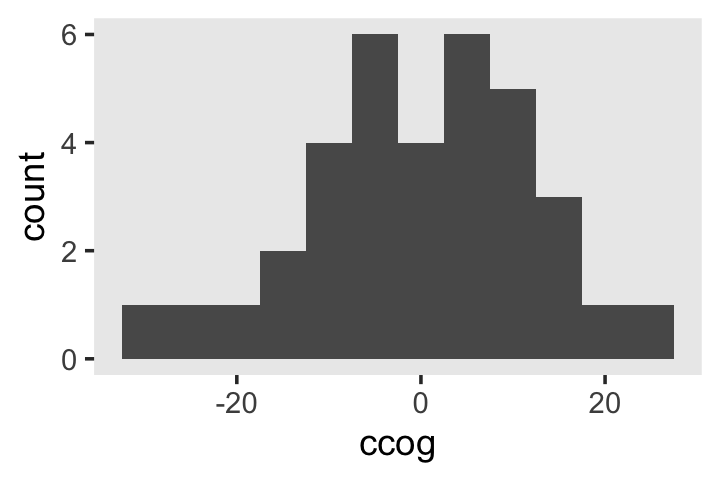

To keep things simple, we'll be using **brms** default priors for all the models in this chapter. Fit the model.


```r
library(brms)

fit7.1 <-
  brm(data = opposites_pp, 
      family = gaussian,
      opp ~ 0 + Intercept + time + ccog + time:ccog + (1 + time | id),
      iter = 2000, warmup = 1000, chains = 4, cores = 4,
      seed = 7,
      file = "fits/fit07.01")
```

Check the summary.


```r
print(fit7.1, digits = 3)
```

```
##  Family: gaussian 
##   Links: mu = identity; sigma = identity 
## Formula: opp ~ 0 + Intercept + time + ccog + time:ccog + (1 + time | id) 
##    Data: opposites_pp (Number of observations: 140) 
##   Draws: 4 chains, each with iter = 2000; warmup = 1000; thin = 1;
##          total post-warmup draws = 4000
## 
## Group-Level Effects: 
## ~id (Number of levels: 35) 
##                     Estimate Est.Error l-95% CI u-95% CI  Rhat Bulk_ESS Tail_ESS
## sd(Intercept)         36.042     5.020   27.666   47.287 1.003     1325     1922
## sd(time)              10.687     1.806    7.547   14.642 1.001     1327     2307
## cor(Intercept,time)   -0.443     0.159   -0.711   -0.098 1.002     1798     2536
## 
## Population-Level Effects: 
##           Estimate Est.Error l-95% CI u-95% CI  Rhat Bulk_ESS Tail_ESS
## Intercept  164.108     6.453  151.639  177.065 1.004     1153     1783
## time        26.988     2.093   22.810   31.235 1.004     1629     2086
## ccog        -0.129     0.521   -1.162    0.881 1.002     1337     2211
## time:ccog    0.434     0.167    0.095    0.761 1.002     1997     2570
## 
## Family Specific Parameters: 
##       Estimate Est.Error l-95% CI u-95% CI  Rhat Bulk_ESS Tail_ESS
## sigma   12.898     1.112   10.968   15.285 1.000     1702     2746
## 
## Draws were sampled using sampling(NUTS). For each parameter, Bulk_ESS
## and Tail_ESS are effective sample size measures, and Rhat is the potential
## scale reduction factor on split chains (at convergence, Rhat = 1).
```

If you're curious, here's the summary of our $\sigma$ parameters transformed to the variance/covariance metric.


```r
library(tidybayes)

levels <- c("sigma[epsilon]^2", "sigma[0]^2", "sigma[1]^2", "sigma[0][1]")

sigma <-
  as_draws_df(fit7.1) %>% 
  transmute(`sigma[0]^2` = sd_id__Intercept^2,
            `sigma[1]^2` = sd_id__time^2,
            `sigma[epsilon]^2` = sigma^2,
            `sigma[0][1]` = sd_id__Intercept * sd_id__time * cor_id__Intercept__time)

sigma %>% 
  pivot_longer(everything()) %>% 
  mutate(name = factor(name, levels = levels)) %>% 
  group_by(name) %>% 
  median_qi(value) %>% 
  mutate_if(is.double, round, digits = 2)
```

```
## # A tibble: 4 × 7
##   name             value .lower .upper .width .point .interval
##   <fct>            <dbl>  <dbl>  <dbl>  <dbl> <chr>  <chr>    
## 1 sigma[epsilon]^2  164.  120.   234.    0.95 median qi       
## 2 sigma[0]^2       1261.  765.  2236.    0.95 median qi       
## 3 sigma[1]^2        112.   57.0  214.    0.95 median qi       
## 4 sigma[0][1]      -166. -399.   -28.1   0.95 median qi
```

## Using the composite model to understand assumptions about the error covariance matrix 

Dropping the terms specifying the distributional assumptions, we can reexpress the model formula, from above, in the composite format as

$$
\begin{align*}
\text{opp}_{ij} & = [\gamma_{00} + \gamma_{10} \text{time}_{ij} + \gamma_{01} (\text{cog}_i - \overline{\text{cog}}) + \gamma_{11} (\text{cog}_i - \overline{\text{cog}}) \times \text{time}_{ij}] \\
& \;\;\; + [\zeta_{0i} + \zeta_{1i} \text{time}_{ij} + \epsilon_{ij}],
\end{align*}
$$

where we've divided up the structural and stochastic components with our use of brackets. We might think of the terms of the stochastic portion as a *composite residual*, $r_{ij} = [\epsilon_{ij} + \zeta_{0i} + \zeta_{1i} \text{time}_{ij}]$. Thus, we can rewrite the composite equation with the composite residual term $r_{ij}$ as

$$
\text{opp}_{ij} = [\gamma_{00} + \gamma_{10} \text{time}_{ij} + \gamma_{01} (\text{cog}_i - \overline{\text{cog}}) + \gamma_{11} (\text{cog}_i - \overline{\text{cog}}) \times \text{time}_{ij}] + r_{ij}.
$$

If we were willing to presume, as in OLS or single-level Bayesian regression, that all residuals are independent and normally distributed, we could express that in statistical notation as

\begin{align*}
\begin{bmatrix} r_{11} \\ r_{12} \\ r_{13} \\ r_{14} \\ r_{21} \\ r_{22} \\ r_{23} \\ r_{24} \\ \vdots \\ r_{n1} \\ r_{n2} \\ r_{n3} \\ r_{n4} \end{bmatrix} & \sim \mathcal{N}

\begin{pmatrix} 

\begin{bmatrix} 0 \\ 0 \\ 0 \\ 0 \\ 0 \\ 0 \\ 0 \\ 0 \\ \vdots \\ 0 \\ 0 \\ 0 \\ 0 \\ \end{bmatrix},

\begin{bmatrix} 
\sigma_r^2 & 0 & 0 & 0 & 0 & 0 & 0 & 0 & \dots & 0 & 0 & 0 & 0 \\
0 & \sigma_r^2 & 0 & 0 & 0 & 0 & 0 & 0 & \dots & 0 & 0 & 0 & 0 \\
0 & 0 & \sigma_r^2 & 0 & 0 & 0 & 0 & 0 & \dots & 0 & 0 & 0 & 0 \\
0 & 0 & 0 & \sigma_r^2 & 0 & 0 & 0 & 0 & \dots & 0 & 0 & 0 & 0 \\

0 & 0 & 0 & 0 & \sigma_r^2 & 0 & 0 & 0 & \dots & 0 & 0 & 0 & 0 \\
0 & 0 & 0 & 0 & 0 & \sigma_r^2 & 0 & 0 & \dots & 0 & 0 & 0 & 0 \\
0 & 0 & 0 & 0 & 0 & 0 & \sigma_r^2 & 0 & \dots & 0 & 0 & 0 & 0 \\
0 & 0 & 0 & 0 & 0 & 0 & 0 & \sigma_r^2 & \dots & 0 & 0 & 0 & 0 \\

\vdots & \vdots & \vdots & \vdots & \vdots & \vdots & \vdots & \vdots & \ddots & \vdots & \vdots & \vdots & \vdots & \\

0 & 0 & 0 & 0 & 0 & 0 & 0 & 0 & \dots & \sigma_r^2 & 0 & 0 & 0 \\
0 & 0 & 0 & 0 & 0 & 0 & 0 & 0 & \dots & 0 & \sigma_r^2 & 0 & 0 \\
0 & 0 & 0 & 0 & 0 & 0 & 0 & 0 & \dots & 0 & 0 & \sigma_r^2 & 0 \\
0 & 0 & 0 & 0 & 0 & 0 & 0 & 0 & \dots & 0 & 0 & 0 & \sigma_r^2
\end{bmatrix}

\end{pmatrix},
\end{align*}

where $r_{ij}$ is the $i$th person's residual on the $j$th time point. The variance/covariance matrix $\mathbf \Sigma$ is diagonal (i.e., all the off-diagonal elements are 0's) and *homoscedastic* (i.e., all the diagonal elements are the same value, $\sigma_r^2$).

These assumptions are absurd for longitudinal data, which is why we don't analyze such data with single-level models. If we were to make the less restrictive assumptions that, within people, the residuals were *correlated over time* and were *heteroscedastic*, we could express that as

\begin{align*}
\begin{bmatrix} r_{11} \\ r_{12} \\ r_{13} \\ r_{14} \\ r_{21} \\ r_{22} \\ r_{23} \\ r_{24} \\ \vdots \\ r_{n1} \\ r_{n2} \\ r_{n3} \\ r_{n4} \end{bmatrix} & \sim \mathcal{N}

\begin{pmatrix} 

\begin{bmatrix} 0 \\ 0 \\ 0 \\ 0 \\ 0 \\ 0 \\ 0 \\ 0 \\ \vdots \\ 0 \\ 0 \\ 0 \\ 0 \\ \end{bmatrix},

\begin{bmatrix} 
\sigma_{r_1}^2 & \sigma_{r_1 r_2} & \sigma_{r_1 r_3} & \sigma_{r_1 r_4} & 0 & 0 & 0 & 0 & \dots & 0 & 0 & 0 & 0 \\
\sigma_{r_2 r_1} & \sigma_{r_2}^2 & \sigma_{r_2 r_3} & \sigma_{r_2 r_4} & 0 & 0 & 0 & 0 & \dots & 0 & 0 & 0 & 0 \\
\sigma_{r_3 r_1} & \sigma_{r_3 r_2} & \sigma_{r_3}^2 & \sigma_{r_3 r_4} & 0 & 0 & 0 & 0 & \dots & 0 & 0 & 0 & 0 \\
\sigma_{r_4 r_1} & \sigma_{r_4 r_2} & \sigma_{r_4 r_3} & \sigma_{r_4}^2 & 0 & 0 & 0 & 0 & \dots & 0 & 0 & 0 & 0 \\

0 & 0 & 0 & 0 & \sigma_{r_1}^2 & \sigma_{r_1 r_2} & \sigma_{r_1 r_3} & \sigma_{r_1 r_4} & \dots & 0 & 0 & 0 & 0 \\
0 & 0 & 0 & 0 & \sigma_{r_2 r_1} & \sigma_{r_2}^2 & \sigma_{r_2 r_3} & \sigma_{r_2 r_4} & \dots & 0 & 0 & 0 & 0 \\
0 & 0 & 0 & 0 & \sigma_{r_3 r_1} & \sigma_{r_3 r_2} & \sigma_{r_3}^2 & \sigma_{r_3 r_4} & \dots & 0 & 0 & 0 & 0 \\
0 & 0 & 0 & 0 & \sigma_{r_4 r_1} & \sigma_{r_4 r_2} & \sigma_{r_4 r_3} & \sigma_{r_4}^2 & \dots & 0 & 0 & 0 & 0 \\

\vdots & \vdots & \vdots & \vdots & \vdots & \vdots & \vdots & \vdots & \ddots & \vdots & \vdots & \vdots & \vdots & \\

0 & 0 & 0 & 0 & 0 & 0 & 0 & 0 & \dots & \sigma_{r_1}^2 & \sigma_{r_1 r_2} & \sigma_{r_1 r_3} & \sigma_{r_1 r_4} \\
0 & 0 & 0 & 0 & 0 & 0 & 0 & 0 & \dots & \sigma_{r_2 r_1} & \sigma_{r_2}^2 & \sigma_{r_2 r_3} & \sigma_{r_2 r_4} \\
0 & 0 & 0 & 0 & 0 & 0 & 0 & 0 & \dots & \sigma_{r_3 r_1} & \sigma_{r_3 r_2} & \sigma_{r_3}^2 & \sigma_{r_3 r_4} \\
0 & 0 & 0 & 0 & 0 & 0 & 0 & 0 & \dots & \sigma_{r_4 r_1} & \sigma_{r_4 r_2} & \sigma_{r_4 r_3} & \sigma_{r_4}^2
\end{bmatrix}

\end{pmatrix}.
\end{align*}

this kind of structure can be called *block diagonal*, which means the off-diagonal elements are zero between persons, but allowed to be non-zero within persons (i.e., within blocks). The zero elements between person blocks explicate how the residuals are independent between persons. Notice that the variances on the diagonal vary across the four time points (i.e., $\sigma_{r_1}^2, \dots, \sigma_{r_4}^2$). Yet also notice that the block for one person is identical to the block for all others. Thus, this model allows for *heterogeneity* across time within persons, but *homogeneity* between persons.

We can express this in the more compact notation,

\begin{align*}
r & \sim \mathcal{N}
\begin{pmatrix} \mathbf 0, 

\begin{bmatrix}

\mathbf{\Sigma}_r & \mathbf 0 & \mathbf 0 & \dots & \mathbf 0 \\ 
\mathbf 0 & \mathbf{\Sigma}_r & \mathbf 0 & \dots & \mathbf 0 \\ 
\mathbf 0 & \mathbf 0 & \mathbf{\Sigma}_r & \dots & \mathbf 0 \\ 
\vdots & \vdots & \vdots & \ddots & \mathbf 0 \\
\mathbf 0 & \mathbf 0 & \mathbf 0 & \mathbf 0 & \mathbf{\Sigma}_r

\end{bmatrix}

\end{pmatrix}, \;\;\; \text{where} \\

\mathbf{\Sigma}_r & = \begin{bmatrix} 
  \sigma_{r_1}^2 & \sigma_{r_1 r_2} & \sigma_{r_1 r_3} & \sigma_{r_1 r_4} \\
  \sigma_{r_2 r_1} & \sigma_{r_2}^2 & \sigma_{r_2 r_3} & \sigma_{r_2 r_4} \\
  \sigma_{r_3 r_1} & \sigma_{r_3 r_2} & \sigma_{r_3}^2 & \sigma_{r_3 r_4} \\
  \sigma_{r_4 r_1} & \sigma_{r_4 r_2} & \sigma_{r_4 r_3} & \sigma_{r_4}^2 \end{bmatrix}.

\end{align*}

The bulk of the rest of the material in this chapter will focus around how different models handle $\mathbf{\Sigma}_r$. The *standard* multilevel growth model has one way. There are many others.

### Variance of the composite residual.

Under the conventional multilevel growth model

$$
\begin{align*}
\sigma_{r_j}^2 & = \operatorname{Var} \left ( \epsilon_{ij} + \zeta_{0i} + \zeta_{1i} \text{time}_j \right ) \\
& = \sigma_\epsilon^2 + \sigma_0^2 + 2 \sigma_{01} \text{time}_j + \sigma_1^2 \text{time}_j^2.
\end{align*}
$$

Here's how to use our posterior samples to compute $\sigma_{r_1}^2, \dots, \sigma_{r_4}^2$.


```r
sigma %>% 
  mutate(iter = 1:n()) %>% 
  expand(nesting(iter, `sigma[epsilon]^2`, `sigma[0]^2`, `sigma[1]^2`, `sigma[0][1]`),
         time = 0:3) %>% 
  mutate(r = `sigma[epsilon]^2` + `sigma[0]^2` + 2 * `sigma[0][1]` * time + `sigma[1]^2` * time^2) %>% 
  mutate(name = str_c("sigma[italic(r)[", time + 1, "]]^2")) %>% 
  
  ggplot(aes(x = r, y = name)) +
  stat_halfeye(.width = .95, size = 1) +
  scale_x_continuous("marginal posterior", expand = expansion(mult = c(0, 0.05)), limits = c(0, NA)) +
  scale_y_discrete(NULL, labels = ggplot2:::parse_safe) +
  coord_cartesian(ylim = c(1.5, 4.2)) +
  theme(panel.grid = element_blank())
```

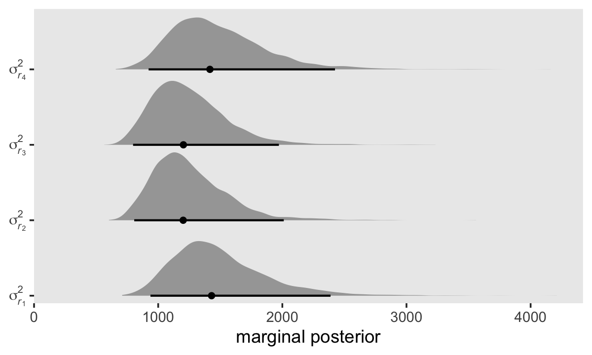

As is often the case with variance parameters, the posteriors show marked right skew. Here are the numeric summaries.


```r
sigma %>% 
  mutate(iter = 1:n()) %>% 
  expand(nesting(iter, `sigma[epsilon]^2`, `sigma[0]^2`, `sigma[1]^2`, `sigma[0][1]`),
         time = 0:3) %>% 
  mutate(r = `sigma[epsilon]^2` + `sigma[0]^2` + 2 * `sigma[0][1]` * time + `sigma[1]^2` * time^2) %>% 
  mutate(name = str_c("sigma[italic(r)[", time + 1, "]]^2")) %>% 
  group_by(name) %>% 
  median_qi(r)
```

```
## # A tibble: 4 × 7
##   name                      r .lower .upper .width .point .interval
##   <chr>                 <dbl>  <dbl>  <dbl>  <dbl> <chr>  <chr>    
## 1 sigma[italic(r)[1]]^2 1430.   938.  2388.   0.95 median qi       
## 2 sigma[italic(r)[2]]^2 1201.   807.  2011.   0.95 median qi       
## 3 sigma[italic(r)[3]]^2 1203.   798.  1972.   0.95 median qi       
## 4 sigma[italic(r)[4]]^2 1416.   923.  2424.   0.95 median qi
```

Though our precise numeric values are different from those in the text, we see the same overall pattern. Using our posterior medians, we can update $\mathbf{\Sigma}_r$ to

$$
\begin{align*}
\hat{\mathbf{\Sigma}}_r & = \begin{bmatrix} 
  1430 & \hat{\sigma}_{r_1 r_2} & \hat{\sigma}_{r_1 r_3} & \hat{\sigma}_{r_1 r_4} \\
  \hat{\sigma}_{r_2 r_1} & 1201 & \hat{\sigma}_{r_2 r_3} & \hat{\sigma}_{r_2 r_4} \\
  \hat{\sigma}_{r_3 r_1} & \hat{\sigma}_{r_3 r_2} & 1203 & \hat{\sigma}_{r_3 r_4} \\
  \hat{\sigma}_{r_4 r_1} & \hat{\sigma}_{r_4 r_2} & \hat{\sigma}_{r_4 r_3} & 1416 \end{bmatrix}.
\end{align*}
$$

> For the opposites-naming data, composite residual variance is greatest at the beginning and end of data collection and smaller in between. And, while not outrageously heteroscedastic, this situation is clearly beyond the bland homoscedasticity that we routinely assume for residuals in cross-sectional data. (p. 252)

If you work through the equation at the beginning of this section--which I am not going to do, here--, you'll see that the standard multilevel growth model is set up such that the residual variance follows a quadratic function with time. To give a sense, here we plot the expected $\sigma_r^2$ values over a wider and more continuous range of time values.


```r
set.seed(7)

sigma %>% 
  mutate(iter = 1:n()) %>% 
  slice_sample(n = 50) %>% 
  expand(nesting(iter, `sigma[epsilon]^2`, `sigma[0]^2`, `sigma[1]^2`, `sigma[0][1]`),
         time = seq(from = -4.2, to = 6.6, length.out = 200)) %>% 
  mutate(r = `sigma[epsilon]^2` + `sigma[0]^2` + 2 * `sigma[0][1]` * time + `sigma[1]^2` * time^2) %>% 
  
  ggplot(aes(x = time, y = r, group = iter)) +
  geom_line(linewidth = 1/6, alpha = 1/2) +
  scale_x_continuous(expand = c(0, 0)) +
  scale_y_continuous(expression(sigma[italic(r)]^2),
                     expand = expansion(mult = c(0, 0.05)), limits = c(0, NA)) +
  labs(subtitle = expression("50 posterior draws showing the quadratic shape of "*sigma[italic(r)[time]]^2)) +
  theme(panel.grid = element_blank())
```


Since we have 4,000 posterior draws for all the parameters, we also have 4,000 posterior draws for the quadratic curve. Here we just show 50. The curve is at its minimum at $\text{time} = -(\sigma_{01} / \sigma_1^2)$. Since we have posterior distributions for $\sigma_{01}$ and $\sigma_1^2$, we'll also have a posterior distribution for the minimum point. Here it is.


```r
sigma %>% 
  mutate(minimum = -`sigma[0][1]` / `sigma[1]^2`) %>% 
  
  ggplot(aes(x = minimum, y = 0)) +
  stat_halfeye(.width = .95) +
  scale_x_continuous("time", expand = c(0, 0), limits = c(-4.2, 6.6)) +
  scale_y_continuous(NULL, breaks = NULL) +
  labs(subtitle = expression(Minimum~value~(-sigma[0][1]/sigma[1]^2))) +
  theme(panel.grid = element_blank())
```


If we plug those minimum time values into the equation for $\sigma_{r_\text{time}}^2$, we'll get the posterior distribution for the minimum variance value.


```r
sigma %>% 
  mutate(minimum = -`sigma[0][1]` / `sigma[1]^2`) %>% 
  mutate(r = `sigma[epsilon]^2` + `sigma[0]^2` + 2 * `sigma[0][1]` * minimum + `sigma[1]^2` * minimum^2) %>% 
  
  ggplot(aes(x = r, y = 0)) +
  stat_halfeye(.width = .95) +
  scale_x_continuous(expression(sigma[italic(r)[time]]^2), limits = c(0, NA)) +
  scale_y_continuous(NULL, breaks = NULL) +
  labs(subtitle = "Minimum variance") +
  theme(panel.grid = element_blank())
```

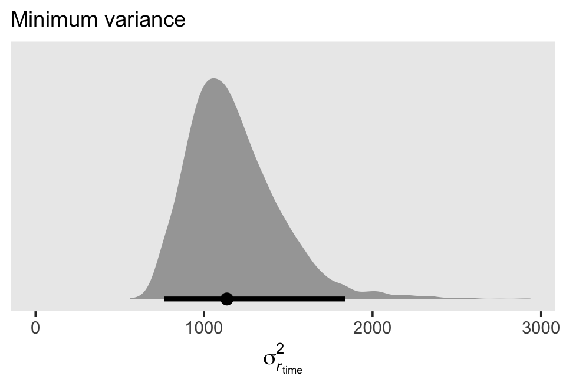

Here's the numeric summary.


```r
sigma %>% 
  mutate(minimum = -`sigma[0][1]` / `sigma[1]^2`) %>% 
  mutate(r = `sigma[epsilon]^2` + `sigma[0]^2` + 2 * `sigma[0][1]` * minimum + `sigma[1]^2` * minimum^2) %>% 
  median_qi(r)
```

```
## # A tibble: 1 × 6
##       r .lower .upper .width .point .interval
##   <dbl>  <dbl>  <dbl>  <dbl> <chr>  <chr>    
## 1 1136.   765.  1838.   0.95 median qi
```

### Covariance of the composite residuals.

In addition to the variances in $\mathbf{\Sigma}_r$, we might focus on the off-diagonal covariances, too. We can define the covariance between two time points $\sigma_{r_j, r_{j'}}$ as

$$
\sigma_{r_j, r_{j'}} = \sigma_0^2 + \sigma_{01} (t_j + t_{j'}) + \sigma_1^2 t_j t_{j'},
$$

where $\sigma_0^2$, $\sigma_{01}$ and $\sigma_1^2$ all have their usual interpretation, and $t_j$ and $t_{j'}$ are the numeric values for whatever variable is used to index time in the model, which is `time` in the case of `fit7.1`. Here we compute and plot the marginal posteriors for all $4 \times 4 = 16$ parameters.
  

```r
# arrange the panels
levels <- 
  c("sigma[italic(r)[1]]^2", "sigma[italic(r)[1]][italic(r)[2]]", "sigma[italic(r)[1]][italic(r)[3]]", "sigma[italic(r)[1]][italic(r)[4]]", 
    "sigma[italic(r)[2]][italic(r)[1]]", "sigma[italic(r)[2]]^2", "sigma[italic(r)[2]][italic(r)[3]]", "sigma[italic(r)[2]][italic(r)[4]]", 
    "sigma[italic(r)[3]][italic(r)[1]]", "sigma[italic(r)[3]][italic(r)[2]]", "sigma[italic(r)[3]]^2", "sigma[italic(r)[3]][italic(r)[4]]", 
    "sigma[italic(r)[4]][italic(r)[1]]", "sigma[italic(r)[4]][italic(r)[2]]", "sigma[italic(r)[4]][italic(r)[3]]", "sigma[italic(r)[4]]^2")

# wrangle
sigma <-
  sigma %>% 
  mutate(`sigma[italic(r)[1]]^2` = `sigma[epsilon]^2` + `sigma[0]^2` + 2 * `sigma[0][1]` * 0 + `sigma[1]^2` * 0^2,
         `sigma[italic(r)[2]]^2` = `sigma[epsilon]^2` + `sigma[0]^2` + 2 * `sigma[0][1]` * 1 + `sigma[1]^2` * 1^2,
         `sigma[italic(r)[3]]^2` = `sigma[epsilon]^2` + `sigma[0]^2` + 2 * `sigma[0][1]` * 2 + `sigma[1]^2` * 2^2,
         `sigma[italic(r)[4]]^2` = `sigma[epsilon]^2` + `sigma[0]^2` + 2 * `sigma[0][1]` * 3 + `sigma[1]^2` * 3^2,
         
         `sigma[italic(r)[2]][italic(r)[1]]` = `sigma[0]^2` + `sigma[0][1]` * (1 + 0) + `sigma[1]^2` * 1 * 0,
         `sigma[italic(r)[3]][italic(r)[1]]` = `sigma[0]^2` + `sigma[0][1]` * (2 + 0) + `sigma[1]^2` * 2 * 0,
         `sigma[italic(r)[4]][italic(r)[1]]` = `sigma[0]^2` + `sigma[0][1]` * (3 + 0) + `sigma[1]^2` * 3 * 0,
         `sigma[italic(r)[3]][italic(r)[2]]` = `sigma[0]^2` + `sigma[0][1]` * (2 + 1) + `sigma[1]^2` * 2 * 1,
         `sigma[italic(r)[4]][italic(r)[2]]` = `sigma[0]^2` + `sigma[0][1]` * (3 + 1) + `sigma[1]^2` * 3 * 1,
         `sigma[italic(r)[4]][italic(r)[3]]` = `sigma[0]^2` + `sigma[0][1]` * (3 + 2) + `sigma[1]^2` * 3 * 2,
         
         `sigma[italic(r)[1]][italic(r)[2]]` = `sigma[0]^2` + `sigma[0][1]` * (0 + 1) + `sigma[1]^2` * 0 * 1,
         `sigma[italic(r)[1]][italic(r)[3]]` = `sigma[0]^2` + `sigma[0][1]` * (0 + 2) + `sigma[1]^2` * 0 * 2,
         `sigma[italic(r)[2]][italic(r)[3]]` = `sigma[0]^2` + `sigma[0][1]` * (1 + 2) + `sigma[1]^2` * 1 * 2,
         `sigma[italic(r)[1]][italic(r)[4]]` = `sigma[0]^2` + `sigma[0][1]` * (0 + 3) + `sigma[1]^2` * 0 * 3,
         `sigma[italic(r)[2]][italic(r)[4]]` = `sigma[0]^2` + `sigma[0][1]` * (1 + 3) + `sigma[1]^2` * 1 * 3,
         `sigma[italic(r)[3]][italic(r)[4]]` = `sigma[0]^2` + `sigma[0][1]` * (2 + 3) + `sigma[1]^2` * 2 * 3)

sigma %>% 
  select(contains("italic")) %>% 
  pivot_longer(everything()) %>%  
  mutate(name = factor(name, levels = levels)) %>% 
  
  # plot!
  ggplot(aes(x = value, y = 0)) +
  stat_halfeye(.width = .95, size = 1) +
  scale_x_continuous("marginal posterior", expand = expansion(mult = c(0, 0.05))) +
  scale_y_discrete(NULL, breaks = NULL) +
  coord_cartesian(xlim = c(0, 4000),
                  ylim = c(0.5, NA)) +
  theme(panel.grid = element_blank()) +
  facet_wrap(~ name, labeller = label_parsed)
```


It might be helpful to reduce the complexity of this plot by focusing on the posterior medians. With a little help from `geom_tile()` and `geom_text()`, we'll make a plot version of the matrix at the top of page 255 in the text.


```r
sigma %>% 
  select(contains("italic")) %>% 
  pivot_longer(everything()) %>%  
  mutate(name = factor(name, levels = levels)) %>% 
  group_by(name) %>% 
  median_qi(value) %>% 
  mutate(label = round(value, digits = 0)) %>% 
  
  ggplot(aes(x = 0, y = 0)) +
  geom_tile(aes(fill = value)) +
  geom_text(aes(label = label)) +
  scale_fill_viridis_c("posterior\nmedian", option = "A", limits = c(0, NA)) +
  scale_x_continuous(NULL, breaks = NULL, expand = c(0, 0)) +
  scale_y_continuous(NULL, breaks = NULL, expand = c(0, 0)) +
  labs(subtitle = expression(hat(Sigma)[italic(r)]*" for the standard multilevel model for change")) +
  theme(legend.text = element_text(hjust = 1)) +
  facet_wrap(~ name, labeller = label_parsed)
```


Although our posterior median values differ a bit from the REML values reported in the text, the overall pattern holds. Hopefully the coloring in the plot helps highlight what Singer and Willett described as a "'band diagonal' structure, in which the overall magnitude of the residual covariances tends to decline in diagonal 'bands' the further you get from the main diagonal" (p. 255).

One of the consequences for this structure is that in cases where both $\sigma_1^2 \rightarrow 0$ and $\sigma_{01} \rightarrow 0$, the residual covariance matrix becomes *compound symmetric*, which is:

$$
\begin{align*}
\mathbf{\Sigma}_r & = \begin{bmatrix} 
  \sigma_\epsilon^2 + \sigma_0^2 & \sigma_0^2 & \sigma_0^2 & \sigma_0^2 \\
  \sigma_0^2 & \sigma_\epsilon^2 + \sigma_0^2 & \sigma_0^2 & \sigma_0^2 \\
  \sigma_0^2 & \sigma_0^2 & \sigma_\epsilon^2 + \sigma_0^2 & \sigma_0^2 \\
  \sigma_0^2 & \sigma_0^2 & \sigma_0^2 & \sigma_\epsilon^2 + \sigma_0^2 \end{bmatrix}.
\end{align*}
$$

> Compound symmetric error covariance structures are particularly common in longitudinal data, especially if the slopes of the change trajectories do not differ much asroc people. Regardless of these special cases, however, the most sensible question to ask of your data is whether the error covariance structure that the "standard" multilevel model for change demands is realistic when applied to data in practice? The answer to this question will determine whether the standard model can be applied ubiquitously, as question we soon address. (pp. 255--256)

### Autocorrelation of the composite residuals.

We can use the following equation to convert our $\mathbf{\Sigma}_r$ into a correlation matrix:

$$\rho_{r_j r_{j^\prime}} = \sigma_{r_j r_{j^\prime}} \Big / \sqrt{\sigma_{r_j}^2 \sigma_{r_{j^\prime}}^2}.$$

Here we use the formula and plot the posteriors.


```r
# arrange the panels
levels <- 
  c("sigma[italic(r)[1]]", "rho[italic(r)[1]][italic(r)[2]]", "rho[italic(r)[1]][italic(r)[3]]", "rho[italic(r)[1]][italic(r)[4]]", 
    "rho[italic(r)[2]][italic(r)[1]]", "sigma[italic(r)[2]]", "rho[italic(r)[2]][italic(r)[3]]", "rho[italic(r)[2]][italic(r)[4]]", 
    "rho[italic(r)[3]][italic(r)[1]]", "rho[italic(r)[3]][italic(r)[2]]", "sigma[italic(r)[3]]", "rho[italic(r)[3]][italic(r)[4]]", 
    "rho[italic(r)[4]][italic(r)[1]]", "rho[italic(r)[4]][italic(r)[2]]", "rho[italic(r)[4]][italic(r)[3]]", "sigma[italic(r)[4]]")

sigma <-
  sigma %>% 
  select(contains("italic")) %>% 
  mutate(`sigma[italic(r)[1]]` = `sigma[italic(r)[1]]^2` / sqrt(`sigma[italic(r)[1]]^2`^2),
         `rho[italic(r)[2]][italic(r)[1]]` = `sigma[italic(r)[2]][italic(r)[1]]` / sqrt(`sigma[italic(r)[2]]^2` * `sigma[italic(r)[1]]^2`),
         `rho[italic(r)[3]][italic(r)[1]]` = `sigma[italic(r)[3]][italic(r)[1]]` / sqrt(`sigma[italic(r)[3]]^2` * `sigma[italic(r)[1]]^2`),
         `rho[italic(r)[4]][italic(r)[1]]` = `sigma[italic(r)[4]][italic(r)[1]]` / sqrt(`sigma[italic(r)[4]]^2` * `sigma[italic(r)[1]]^2`),
         
         `rho[italic(r)[1]][italic(r)[2]]` = `sigma[italic(r)[1]][italic(r)[2]]` / sqrt(`sigma[italic(r)[1]]^2` * `sigma[italic(r)[2]]^2`),
         `sigma[italic(r)[2]]` = `sigma[italic(r)[2]]^2` / sqrt(`sigma[italic(r)[2]]^2`^2),
         `rho[italic(r)[3]][italic(r)[2]]` = `sigma[italic(r)[3]][italic(r)[2]]` / sqrt(`sigma[italic(r)[3]]^2` * `sigma[italic(r)[2]]^2`),
         `rho[italic(r)[4]][italic(r)[2]]` = `sigma[italic(r)[4]][italic(r)[2]]` / sqrt(`sigma[italic(r)[4]]^2` * `sigma[italic(r)[2]]^2`),
         
         `rho[italic(r)[1]][italic(r)[3]]` = `sigma[italic(r)[1]][italic(r)[3]]` / sqrt(`sigma[italic(r)[1]]^2` * `sigma[italic(r)[3]]^2`),
         `rho[italic(r)[2]][italic(r)[3]]` = `sigma[italic(r)[2]][italic(r)[3]]` / sqrt(`sigma[italic(r)[2]]^2` * `sigma[italic(r)[3]]^2`),
         `sigma[italic(r)[3]]` = `sigma[italic(r)[3]]^2` / sqrt(`sigma[italic(r)[3]]^2`^2),
         `rho[italic(r)[4]][italic(r)[3]]` = `sigma[italic(r)[4]][italic(r)[3]]` / sqrt(`sigma[italic(r)[4]]^2` * `sigma[italic(r)[3]]^2`),
         
         `rho[italic(r)[1]][italic(r)[4]]` = `sigma[italic(r)[1]][italic(r)[4]]` / sqrt(`sigma[italic(r)[1]]^2` * `sigma[italic(r)[4]]^2`),
         `rho[italic(r)[2]][italic(r)[4]]` = `sigma[italic(r)[2]][italic(r)[4]]` / sqrt(`sigma[italic(r)[2]]^2` * `sigma[italic(r)[4]]^2`),
         `rho[italic(r)[3]][italic(r)[4]]` = `sigma[italic(r)[3]][italic(r)[4]]` / sqrt(`sigma[italic(r)[3]]^2` * `sigma[italic(r)[4]]^2`),
         `sigma[italic(r)[4]]` = `sigma[italic(r)[4]]^2` / sqrt(`sigma[italic(r)[4]]^2`^2))

sigma %>% 
  select(`sigma[italic(r)[1]]`:`sigma[italic(r)[4]]`) %>% 
  pivot_longer(everything()) %>%  
  mutate(name = factor(name, levels = levels)) %>% 
  
  # plot!
  ggplot(aes(x = value, y = 0)) +
  stat_halfeye(.width = .95, size = 1) +
  scale_x_continuous("marginal posterior", expand = c(0, 0), limits = c(0, 1),
                     breaks = 0:4 / 4, labels = c("0", ".25", ".5", ".75", "1")) +
  scale_y_discrete(NULL, breaks = NULL) +
  coord_cartesian(ylim = c(0.5, NA)) +
  theme(panel.grid = element_blank()) +
  facet_wrap(~ name, labeller = label_parsed)
```


As before, it might be helpful to reduce the complexity of this plot by focusing on the posterior medians. We'll make a plot version of the correlation matrix in the middle of page 256 in the text.


```r
sigma %>% 
  select(`sigma[italic(r)[1]]`:`sigma[italic(r)[4]]`) %>% 
  pivot_longer(everything()) %>%  
  mutate(name = factor(name, levels = levels)) %>% 
  group_by(name) %>% 
  median_qi(value) %>% 
  mutate(label = round(value, digits = 2)) %>% 
  
  ggplot(aes(x = 0, y = 0)) +
  geom_tile(aes(fill = value)) +
  geom_text(aes(label = label)) +
  scale_fill_viridis_c("posterior\nmedian", option = "A", limits = c(0, 1)) +
  scale_x_continuous(NULL, breaks = NULL, expand = c(0, 0)) +
  scale_y_continuous(NULL, breaks = NULL, expand = c(0, 0)) +
  labs(subtitle = expression(hat(Omega)[italic(r)]*" for the standard multilevel model for change")) +
  theme(legend.text = element_text(hjust = 1)) +
  facet_wrap(~ name, labeller = label_parsed)
```

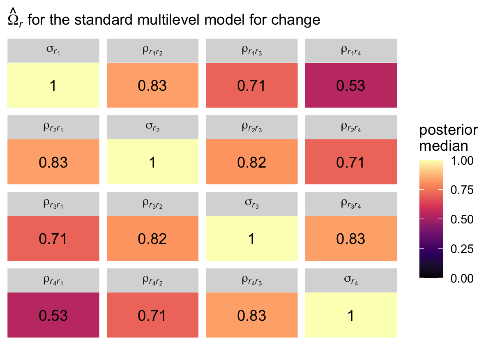

The correlation matrix has an even more pronounced band-diagonal structure. Thus even though the standard multilevel model of change does not contain an explicit autocorrelation parameter $\rho$, the model does account for residual autocorrelation. We might take this even further. Notice the parameters $\rho_{r_2, r_1}$, $\rho_{r_3, r_2}$, and $\rho_{r_4, r_3}$ are all autocorrelations of the first order, and further note how similar their posterior medians all are. Here's a summary of the average of those three parameters, which we'll just call $\rho$.


```r
sigma %>% 
  # take the average of the three parameters
  transmute(rho = (`rho[italic(r)[2]][italic(r)[1]]` + `rho[italic(r)[3]][italic(r)[2]]` + `rho[italic(r)[4]][italic(r)[3]]`) / 3) %>% 
  # summarize
  median_qi()
```

```
## # A tibble: 1 × 6
##     rho .lower .upper .width .point .interval
##   <dbl>  <dbl>  <dbl>  <dbl> <chr>  <chr>    
## 1 0.827  0.736  0.897   0.95 median qi
```

If you look at the "estimate" column in Table 7.3 (pp. 258--259), you'll see the $\hat \rho$ values for the autoregressive and heterogeneous-autoregressive models are very similar to the $\hat \rho$ posterior we just computed for the standard multilevel model of change. The standard multilevel model of change accounts for autocorrelation, but it does so without an explicit $\rho$ parameter.

## Postulating an alternative error covariance structure

Singer and Willett wrote:

> it is easy to specify alternative covariance structures for the composite residual and determine analytically which specification—the "standard" or an alternative—fits best. You already possess the analytic tools and skills needed for this work. (p. 257)

Frequentest **R** users would likely do this with the [**nlme** package](https://CRAN.R-project.org/package=nlme) [@R-nlme]. Recent additions to **brms** makes this largely possible, but not completely so. The six error structures listed in this section were:

* unstructured,
* compound symmetric,
* heterogeneous compound symmetric,
* autoregressive,
* heterogeneous autoregressive, and
* Toeplitz.

The Toeplitz structure is not currently available with **brms**, but we can experiment with the first five. For details, see [issue #403](https://github.com/paul-buerkner/brms/issues/403) in the **brms** GitHub repo.

### Unstructured error covariance matrix.

Models using an unstructured error covariance matrix include $k (k + 1) / 2$ variance/covariance parameters, where $k$ is the number of time waves in the data. In the case of our `opposites_pp` data, we can compute the number of parameters as follows.


```r
k <- 4

k * (k + 1) / 2
```

```
## [1] 10
```

We end up with 4 variances and 6 covariances. Following the notation Singer and Willett used in the upper left corner of Table 7.3 (p. 258), we can express this as

$$
\begin{align*}
\mathbf{\Sigma}_r & = \begin{bmatrix} 
  \sigma_1^2 & \sigma_{12} & \sigma_{13} & \sigma_{14} \\
  \sigma_{21} & \sigma_2^2 & \sigma_{23} & \sigma_{24} \\
  \sigma_{31} & \sigma_{32} & \sigma_3^2 & \sigma_{34} \\
  \sigma_{41} & \sigma_{42} & \sigma_{43} & \sigma_4^2 \end{bmatrix}.
\end{align*}
$$

> The great appeal of an unstructured error covariance structure is that it places no restrictions on the structure of $\mathbf{\Sigma}_r$. For a given set of fixed effects, its deviance statistic will always be the smallest of any error covariance structure. If you have just a few waves of data, this choice can be attractive. But if you have many waves, it can require an exorbitant number of parameters... [However,] the "standard" model requires only 3 variance components ($\sigma_0^2$, $\sigma_1^2$, and $\sigma_\epsilon^2$) and one covariance component, $\sigma_{01}$. (p. 260)

To fit the unstructured model with **brms**, we use the `unstr()` function. Notice how we've dropped the usual `(1 + time | id)` syntax. Instead, we indicate the data are temporally structured by the `time` variable by setting `time = time` within `unstr()`, and we indicate the data are grouped by `id` by setting `gr = id`, also within `unstr()`. Also, notice we've wrapped the entire model formula within the `bf()` function. The second line within the `bf()` function has `sigma` on the left side of the `~` operator, which is something we haven't seen before. With that line, we have allowed the residual variance $\sigma_\epsilon$ to vary across time points. By default, **brms** will use the log link, to insure the model for $\sigma_{\epsilon j}$ will never predict negative variances.


```r
fit7.2 <-
  brm(data = opposites_pp, 
      family = gaussian,
      bf(opp ~ 0 + Intercept + time + ccog + time:ccog + unstr(time = time, gr = id),
         sigma ~ 0 + factor(time)),
      iter = 2000, warmup = 1000, chains = 4, cores = 4,
      seed = 7,
      file = "fits/fit07.02")
```

Check the summary.


```r
print(fit7.2, digits = 3, robust = T)
```

```
##  Family: gaussian 
##   Links: mu = identity; sigma = log 
## Formula: opp ~ 0 + Intercept + time + ccog + time:ccog + unstr(time = time, gr = id) 
##          sigma ~ 0 + factor(time)
##    Data: opposites_pp (Number of observations: 140) 
##   Draws: 4 chains, each with iter = 2000; warmup = 1000; thin = 1;
##          total post-warmup draws = 4000
## 
## Correlation Structures:
##              Estimate Est.Error l-95% CI u-95% CI  Rhat Bulk_ESS Tail_ESS
## cortime(0,1)    0.748     0.072    0.573    0.864 1.001     2397     2618
## cortime(0,2)    0.657     0.091    0.433    0.800 1.001     2268     2688
## cortime(1,2)    0.806     0.058    0.660    0.895 1.002     2384     3055
## cortime(0,3)    0.332     0.142    0.027    0.575 1.000     2444     2994
## cortime(1,3)    0.638     0.094    0.415    0.787 1.000     2570     2949
## cortime(2,3)    0.733     0.076    0.540    0.847 1.001     2693     2998
## 
## Population-Level Effects: 
##                   Estimate Est.Error l-95% CI u-95% CI  Rhat Bulk_ESS Tail_ESS
## Intercept          165.633     5.743  154.338  176.999 1.001     3294     2707
## time                26.571     2.076   22.396   30.535 1.005     2907     2548
## ccog                -0.088     0.477   -1.005    0.829 1.000     3473     2811
## time:ccog            0.457     0.162    0.118    0.798 1.000     3401     2863
## sigma_factortime0    3.571     0.121    3.354    3.824 1.000     2127     2671
## sigma_factortime1    3.454     0.114    3.248    3.685 1.000     1863     2632
## sigma_factortime2    3.497     0.108    3.291    3.723 1.001     1794     2332
## sigma_factortime3    3.518     0.115    3.308    3.763 1.001     2177     2812
## 
## Draws were sampled using sampling(NUTS). For each parameter, Bulk_ESS
## and Tail_ESS are effective sample size measures, and Rhat is the potential
## scale reduction factor on split chains (at convergence, Rhat = 1).
```

There's a lot of exciting things going on in that output. We'll start with the bottom 4 rows in the `Population-Level Effects` section, which contains our the summaries for our $\log (\sigma_{\epsilon j})$ parameters. To get them out of the log metric, we exponentiate. Here's a quick conversion.


```r
fixef(fit7.2)[5:8, -2] %>% exp()
```

```
##                   Estimate     Q2.5    Q97.5
## sigma_factortime0 35.74347 28.62747 45.79190
## sigma_factortime1 31.77577 25.72651 39.85576
## sigma_factortime2 33.04557 26.86645 41.40652
## sigma_factortime3 33.87739 27.32708 43.06749
```

Now let's address the new `Correlation Structures` section of the `print()` output. Just as **brms** decomposes the typical multilevel model level-2 variance/covariance matrix $\mathbf{\Sigma}$ as

$$
\begin{align*}
\mathbf \Sigma & = \mathbf D \mathbf \Omega \mathbf D, \text{where} \\
\mathbf D      & = \begin{bmatrix} \sigma_0 & 0 \\ 0 & \sigma_1 \end{bmatrix} \text{and} \\
\mathbf \Omega & = \begin{bmatrix} 1 & \rho \\ \rho & 1 \end{bmatrix},
\end{align*}
$$

the same kind of thing happens when we fit a model with an unstructured variance/covariance matrix with the `unstr()` function. The `print()` output returned posterior summaries for the elements of the correlation matrix $\mathbf \Omega$ in the `Correlation Structures` section, and it returned posterior summaries for the elements of the diagonal matrix of standard deviations $\mathbf D$ in the last four rows of the `Population-Level Effects` section. But notice that instead of $2 \times 2$ matrices like we got with our conventional growth model `fit7.1`, both $\mathbf D$ and $\mathbf \Omega$ are now $4 \times 4$ matrices right out of the gate. Thus if we use the posterior medians from the `print()` output as our point estimates, we can express the $\hat{\mathbf \Sigma}$ matrix from our unstructured `fit7.2` model as

$$
\begin{align*}
\mathbf \Sigma & = \mathbf D \mathbf \Omega \mathbf D \\
\hat{\mathbf D} & = \begin{bmatrix} 
  35.6 & 0 & 0 & 0 \\ 
  0 & 31.6  & 0 & 0 \\ 
  0 & 0 & 33.0 & 0 \\ 
  0 & 0 & 0 & 33.7
  \end{bmatrix} \\
\hat{\mathbf \Omega} & = \begin{bmatrix} 
  1 & .75 & .66 & .33 \\
  .75 & 1 & .81 & .64 \\
  .66 & .81 & 1 & .73 \\
  .33 & .64 & .73 & 1
  \end{bmatrix}.
\end{align*}
$$


Here's how to compute and summarize the $\mathbf D$ and $\mathbf \Omega$ parameters with the `as_draws_df()` output.


```r
# wrangle
sigma.us <-
  as_draws_df(fit7.2) %>%
  transmute(`sigma[1]` = exp(b_sigma_factortime0),
            `sigma[2]` = exp(b_sigma_factortime1),
            `sigma[3]` = exp(b_sigma_factortime2),
            `sigma[4]` = exp(b_sigma_factortime3),
            
            `rho[12]` = cortime__0__1,
            `rho[13]` = cortime__0__2,
            `rho[14]` = cortime__0__3,
            `rho[23]` = cortime__1__2,
            `rho[24]` = cortime__1__3,
            `rho[34]` = cortime__2__3,
            
            `rho[21]` = cortime__0__1, 
            `rho[31]` = cortime__0__2, 
            `rho[32]` = cortime__1__2, 
            `rho[41]` = cortime__0__3, 
            `rho[42]` = cortime__1__3, 
            `rho[43]` = cortime__2__3)

# summarize
sigma.us %>% 
  pivot_longer(everything()) %>% 
  group_by(name) %>% 
  median_qi(value) %>% 
  mutate_if(is.double, round, digits = 2)
```

```
## # A tibble: 16 × 7
##    name     value .lower .upper .width .point .interval
##    <chr>    <dbl>  <dbl>  <dbl>  <dbl> <chr>  <chr>    
##  1 rho[12]   0.75   0.57   0.86   0.95 median qi       
##  2 rho[13]   0.66   0.43   0.8    0.95 median qi       
##  3 rho[14]   0.33   0.03   0.57   0.95 median qi       
##  4 rho[21]   0.75   0.57   0.86   0.95 median qi       
##  5 rho[23]   0.81   0.66   0.89   0.95 median qi       
##  6 rho[24]   0.64   0.42   0.79   0.95 median qi       
##  7 rho[31]   0.66   0.43   0.8    0.95 median qi       
##  8 rho[32]   0.81   0.66   0.89   0.95 median qi       
##  9 rho[34]   0.73   0.54   0.85   0.95 median qi       
## 10 rho[41]   0.33   0.03   0.57   0.95 median qi       
## 11 rho[42]   0.64   0.42   0.79   0.95 median qi       
## 12 rho[43]   0.73   0.54   0.85   0.95 median qi       
## 13 sigma[1] 35.6   28.6   45.8    0.95 median qi       
## 14 sigma[2] 31.6   25.7   39.9    0.95 median qi       
## 15 sigma[3] 33     26.9   41.4    0.95 median qi       
## 16 sigma[4] 33.7   27.3   43.1    0.95 median qi
```


Since Singer and Willett preferred the variance/covariance parameterization for $\mathbf \Sigma$, we'll practice wrangling the posterior draws to transform our results into that metric, too.


```r
# transform
sigma.us <- sigma.us %>% 
  transmute(`sigma[1]^2` = `sigma[1]`^2,
            `sigma[12]` = `sigma[1]` * `sigma[2]` * `rho[12]`,
            `sigma[13]` = `sigma[1]` * `sigma[3]` * `rho[13]`,
            `sigma[14]` = `sigma[1]` * `sigma[4]` * `rho[14]`,
            
            `sigma[21]` = `sigma[2]` * `sigma[1]` * `rho[21]`,
            `sigma[2]^2` = `sigma[2]`^2,
            `sigma[23]` = `sigma[2]` * `sigma[3]` * `rho[23]`,
            `sigma[24]` = `sigma[2]` * `sigma[4]` * `rho[24]`,
            
            `sigma[31]` = `sigma[3]` * `sigma[1]` * `rho[31]`,
            `sigma[32]` = `sigma[3]` * `sigma[2]` * `rho[32]`,
            `sigma[3]^2` = `sigma[3]`^2,
            `sigma[34]` = `sigma[3]` * `sigma[4]` * `rho[34]`,
            
            `sigma[41]` = `sigma[4]` * `sigma[1]` * `rho[41]`,
            `sigma[42]` = `sigma[4]` * `sigma[2]` * `rho[42]`,
            `sigma[43]` = `sigma[4]` * `sigma[3]` * `rho[43]`,
            `sigma[4]^2` = `sigma[4]`^2)

# summarize
sigma.us %>% 
  pivot_longer(everything()) %>% 
  group_by(name) %>% 
  median_qi(value) %>% 
  mutate_if(is.double, round, digits = 2)
```

```
## # A tibble: 16 × 7
##    name       value .lower .upper .width .point .interval
##    <chr>      <dbl>  <dbl>  <dbl>  <dbl> <chr>  <chr>    
##  1 sigma[12]   834.  493.   1421.   0.95 median qi       
##  2 sigma[13]   757.  418.   1302.   0.95 median qi       
##  3 sigma[14]   391.   29.4   874.   0.95 median qi       
##  4 sigma[1]^2 1264.  820.   2097.   0.95 median qi       
##  5 sigma[21]   834.  493.   1421.   0.95 median qi       
##  6 sigma[23]   834.  515.   1373.   0.95 median qi       
##  7 sigma[24]   674.  362.   1174.   0.95 median qi       
##  8 sigma[2]^2 1000.  662.   1588.   0.95 median qi       
##  9 sigma[31]   757.  418.   1302.   0.95 median qi       
## 10 sigma[32]   834.  515.   1373.   0.95 median qi       
## 11 sigma[34]   807.  471.   1373.   0.95 median qi       
## 12 sigma[3]^2 1089.  722.   1714.   0.95 median qi       
## 13 sigma[41]   391.   29.4   874.   0.95 median qi       
## 14 sigma[42]   674.  362.   1174.   0.95 median qi       
## 15 sigma[43]   807.  471.   1373.   0.95 median qi       
## 16 sigma[4]^2 1136.  747.   1855.   0.95 median qi
```

But again, I suspect it will be easier to appreciate our posterior $\hat{\mathbf \Sigma}$ in a tile plot. Here's a summary using the posterior medians, similar to what Singer and Willett reported in the rightmost column of Table 7.3.


```r
levels <- 
  c("sigma[1]^2", "sigma[12]", "sigma[13]", "sigma[14]", 
    "sigma[21]", "sigma[2]^2", "sigma[23]", "sigma[24]", 
    "sigma[31]", "sigma[32]", "sigma[3]^2", "sigma[34]", 
    "sigma[41]", "sigma[42]", "sigma[43]", "sigma[4]^2")

sigma.us %>% 
  pivot_longer(everything()) %>%  
  mutate(name = factor(name, levels = levels)) %>% 
  group_by(name) %>% 
  median_qi(value) %>% 
  mutate(label = round(value, digits = 0)) %>% 
  
  ggplot(aes(x = 0, y = 0)) +
  geom_tile(aes(fill = value)) +
  geom_text(aes(label = label, color = value < 1),
            show.legend = F) +
  scale_fill_viridis_c("posterior\nmedian", option = "A", limits = c(0, NA)) +
  scale_color_manual(values = c("black", "white")) +
  scale_x_continuous(NULL, breaks = NULL, expand = c(0, 0)) +
  scale_y_continuous(NULL, breaks = NULL, expand = c(0, 0)) +
  labs(subtitle = expression(hat(Sigma)[italic(r)]*" for the unstructured model")) +
  theme(legend.text = element_text(hjust = 1)) +
  facet_wrap(~ name, labeller = label_parsed)
```

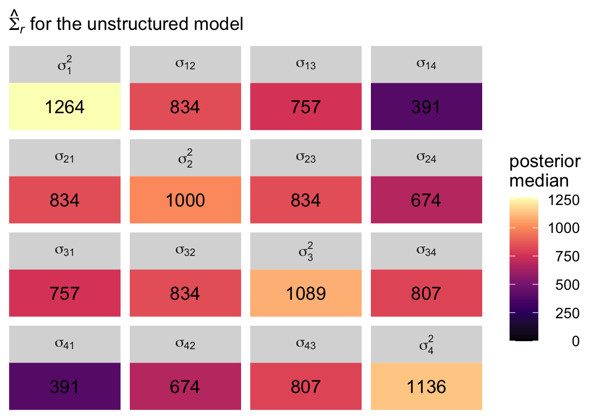

In case you're curious, here's the variance/covariance matrix from the sample data.


```r
fit7.2$data %>% 
  select(id, time, opp) %>% 
  pivot_wider(names_from = time, values_from = opp) %>% 
  select(-id) %>% 
  cov() %>% 
  round(digits = 0)
```

```
##      0    1    2    3
## 0 1309  976  922  563
## 1  976 1125 1021  856
## 2  922 1021 1292 1081
## 3  563  856 1081 1415
```

The **brms** default priors are weakly regularizing, particularly the LKJ prior for the correlation matrix $\mathbf \Omega$, and I believe this is why the values from our model are systemically lower that the sample statistics. If you find this upsetting, collect more data, which hill help the likelihood dominate the prior.


### Compound symmetric error covariance matrix.

"A *compound symmetric* error covariance matrix requires just two parameters, labeled $\sigma^2$ and $\sigma_1^2$ in table 7.3" (p. 260). From the table, we see that matrix follows the form

$$
\begin{align*}
\mathbf{\Sigma}_r & = \begin{bmatrix} 
  \sigma^2 + \sigma_1^2 & \sigma_1^2 & \sigma_1^2 & \sigma_1^2 \\
  \sigma_1^2 & \sigma^2 + \sigma_1^2 & \sigma_1^2 & \sigma_1^2 \\
  \sigma_1^2 & \sigma_1^2 & \sigma^2 + \sigma_1^2 & \sigma_1^2 \\
  \sigma_1^2 & \sigma_1^2 & \sigma_1^2 & \sigma^2 + \sigma_1^2 \end{bmatrix},
\end{align*}
$$

where $\sigma_1^2$ does not have the same meaning we've become accustomed to (i.e., the level-2 variance in linear change over time). The meaning of $\sigma^2$ might also be a little opaque. Happily, there's another way to express this matrix, which is a modification of the heterogeneous compound symmetric matrix we see listed in Table 7.3. That alternative is:

$$
\begin{align*}
\mathbf{\Sigma}_r & = \begin{bmatrix} 
  \sigma_\epsilon^2 & \sigma_\epsilon^2 \rho & \sigma_\epsilon^2 \rho & \sigma_\epsilon^2 \rho \\
  \sigma_\epsilon^2 \rho & \sigma_\epsilon^2 & \sigma_\epsilon^2 \rho & \sigma_\epsilon^2 \rho \\
  \sigma_\epsilon^2 \rho & \sigma_\epsilon^2 \rho & \sigma_\epsilon^2 & \sigma_\epsilon^2 \rho \\
  \sigma_\epsilon^2 \rho & \sigma_\epsilon^2 \rho & \sigma_\epsilon^2 \rho & \sigma_\epsilon^2 \end{bmatrix},
\end{align*}
$$

where the term on the diagonal, $\sigma_\epsilon^2$, is the residual variance, which is constrained to equality across all four time points. In all cells in the off-diagonal, we see $\sigma_\epsilon^2$ multiplied by $\rho$. In this parameterization, $\rho$ is the correlation between time points, and that correlation is constrained to equality across all possible pairs of time points. Although this notation is a little different from the notation used in the text, I believe it will help us interpret our model. As we'll see, **brms** uses this alternative parameterization.

To fit the compound symmetric model with **brms**, we use the `cosy()` function. Notice how like with the unstructured model `fit7.2`, we've dropped the usual `(1 + time | id)` syntax. Instead, we impose compound symmetry *within persons* by setting `gr = id` within `cosy()`.


```r
fit7.3 <-
  brm(data = opposites_pp,
      family = gaussian,
      opp ~ 0 + Intercept + time + ccog + time:ccog + cosy(gr = id),
      iter = 2000, warmup = 1000, chains = 4, cores = 4,
      seed = 7,
      file = "fits/fit07.03")
```

Check the model summary.


```r
print(fit7.3, digits = 3)
```

```
##  Family: gaussian 
##   Links: mu = identity; sigma = identity 
## Formula: opp ~ 0 + Intercept + time + ccog + time:ccog + cosy(gr = id) 
##    Data: opposites_pp (Number of observations: 140) 
##   Draws: 4 chains, each with iter = 2000; warmup = 1000; thin = 1;
##          total post-warmup draws = 4000
## 
## Correlation Structures:
##      Estimate Est.Error l-95% CI u-95% CI  Rhat Bulk_ESS Tail_ESS
## cosy    0.721     0.062    0.589    0.833 1.000     2265     2832
## 
## Population-Level Effects: 
##           Estimate Est.Error l-95% CI u-95% CI  Rhat Bulk_ESS Tail_ESS
## Intercept  164.433     5.687  152.939  175.457 1.002     4023     3118
## time        26.958     1.381   24.257   29.657 1.000     4178     3075
## ccog        -0.107     0.460   -0.997    0.787 1.001     4436     3065
## time:ccog    0.432     0.113    0.215    0.649 1.001     4604     3215
## 
## Family Specific Parameters: 
##       Estimate Est.Error l-95% CI u-95% CI  Rhat Bulk_ESS Tail_ESS
## sigma   35.540     3.650   29.615   43.813 1.001     2442     2406
## 
## Draws were sampled using sampling(NUTS). For each parameter, Bulk_ESS
## and Tail_ESS are effective sample size measures, and Rhat is the potential
## scale reduction factor on split chains (at convergence, Rhat = 1).
```

See that new `cosy` row? That's $\rho$, the residual correlation among the time points. The `sigma` row on the bottom has it's typical interpretation, it's the residual standard deviation, what we typically call $\sigma_\epsilon$. Square it and you'll have what we called $\sigma_\epsilon^2$ in the matrix, above. Okay, since our **brms** model is parameterized differently from what Singer and Willett reported in the text (see Table 7.3, p. 258), we'll wrangle the posterior draws a bit.


```r
sigma.cs <-
  as_draws_df(fit7.3) %>%
  transmute(rho                    = cosy,
            sigma_e                = sigma,
            `sigma^2 + sigma[1]^2` = sigma^2) %>%
  mutate(`sigma[1]^2` = rho * sigma_e^2) %>% 
  mutate(`sigma^2` = `sigma^2 + sigma[1]^2` - `sigma[1]^2`)

# what did we do?
head(sigma.cs)
```

```
## # A tibble: 6 × 5
##     rho sigma_e `sigma^2 + sigma[1]^2` `sigma[1]^2` `sigma^2`
##   <dbl>   <dbl>                  <dbl>        <dbl>     <dbl>
## 1 0.696    31.9                  1018.         709.      309.
## 2 0.707    32.5                  1057.         748.      309.
## 3 0.668    32.8                  1073.         717.      356.
## 4 0.756    37.6                  1411.        1067.      344.
## 5 0.763    36.0                  1294.         987.      307.
## 6 0.746    36.0                  1294.         966.      328.
```

Here's the numeric summary.


```r
sigma.cs %>% 
  pivot_longer(everything()) %>% 
  group_by(name) %>% 
  median_qi(value) %>% 
  mutate_if(is.double, round, digits = 2)
```

```
## # A tibble: 5 × 7
##   name                   value .lower  .upper .width .point .interval
##   <chr>                  <dbl>  <dbl>   <dbl>  <dbl> <chr>  <chr>    
## 1 rho                     0.73   0.59    0.83   0.95 median qi       
## 2 sigma[1]^2            888.   532.   1572.     0.95 median qi       
## 3 sigma^2               337.   263.    451.     0.95 median qi       
## 4 sigma^2 + sigma[1]^2 1232.   877.   1920.     0.95 median qi       
## 5 sigma_e                35.1   29.6    43.8    0.95 median qi
```

To simplify, we might pull the posterior medians for $\sigma^2 + \sigma_1^2$ and $\sigma_1^2$. We'll call them `diagonal` and `off_diagonal`, respectively.


```r
diagonal <- median(sigma.cs$`sigma^2 + sigma[1]^2`)
off_diagonal <- median(sigma.cs$`sigma[1]^2`)
```

Now we have them, we can make our colored version of the $\mathbf{\Sigma}_r$ Singer and Willett reported in the rightmost column of Table 7.3.


```r
crossing(row = 1:4,
         col = factor(1:4)) %>% 
  mutate(value = if_else(row == col, diagonal, off_diagonal)) %>% 
  mutate(label = round(value, digits = 0),
         col = fct_rev(col)) %>% 
  
  ggplot(aes(x = row, y = col)) +
  geom_tile(aes(fill = value)) +
  geom_text(aes(label = label)) +
  scale_fill_viridis_c("posterior\nmedian", option = "A", limits = c(0, NA)) +
  scale_x_continuous(NULL, breaks = NULL, position = "top", expand = c(0, 0)) +
  scale_y_discrete(NULL, breaks = NULL, expand = c(0, 0)) +
  labs(subtitle = expression(hat(Sigma)[italic(r)]*" for the compound symmetric model")) +
  theme(legend.text = element_text(hjust = 1))
```

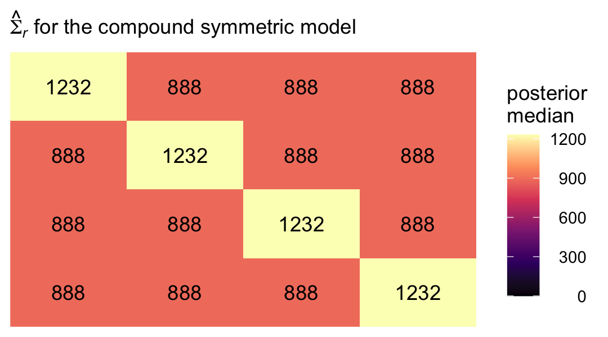

### Heterogeneous compound symmetric error covariance matrix .

Now we extend the compound symmetric matrix by allowing the residual variances to vary across the time waves. Thus, instead of a single $\sigma_\epsilon^2$ parameter, we'll have $\sigma_1^2$ through $\sigma_4^2$. However, we still have a single correlation parameter $\rho$. We can express this as

$$
\begin{align*}
\mathbf{\Sigma}_r & = \begin{bmatrix} 
  \sigma_1^2 & \sigma_1 \sigma_2 \rho & \sigma_1 \sigma_3 \rho & \sigma_1 \sigma_4 \rho \\
  \sigma_2 \sigma_1 \rho & \sigma_1^2 & \sigma_2 \sigma_3 \rho & \sigma_2 \sigma_4 \rho \\
  \sigma_3 \sigma_1 \rho & \sigma_3 \sigma_2 \rho & \sigma_3^2 & \sigma_3 \sigma_4 \rho \\
  \sigma_4 \sigma_1 \rho & \sigma_4 \sigma_2 \rho & \sigma_4 \sigma_3 \rho & \sigma_4^2 \end{bmatrix},
\end{align*}
$$

where, even though the correlation is the same in all cells, the covariances will differ because they are based on different combinations of the $\sigma$ parameters. To fit this model with **brms**, we will continue to use `cosy(gr = id)`. But now we wrap the entire model `formula` within the `bf()` function and allow the residual standard deviations to vary across he waves with the line `sigma ~ 0 + factor(time)`.


```r
fit7.4 <-
  brm(data = opposites_pp,
      family = gaussian,
      bf(opp ~ 0 + Intercept + time + ccog + time:ccog + cosy(gr = id),
         sigma ~ 0 + factor(time)), 
      iter = 2000, warmup = 1000, chains = 4, cores = 4,
      seed = 7,
      file = "fits/fit07.04")
```

Check the summary.


```r
print(fit7.4, digits = 3)
```

```
##  Family: gaussian 
##   Links: mu = identity; sigma = log 
## Formula: opp ~ 0 + Intercept + time + ccog + time:ccog + cosy(gr = id) 
##          sigma ~ 0 + factor(time)
##    Data: opposites_pp (Number of observations: 140) 
##   Draws: 4 chains, each with iter = 2000; warmup = 1000; thin = 1;
##          total post-warmup draws = 4000
## 
## Correlation Structures:
##      Estimate Est.Error l-95% CI u-95% CI  Rhat Bulk_ESS Tail_ESS
## cosy    0.720     0.060    0.594    0.828 1.003     1851     2390
## 
## Population-Level Effects: 
##                   Estimate Est.Error l-95% CI u-95% CI  Rhat Bulk_ESS Tail_ESS
## Intercept          164.125     5.670  153.113  175.163 1.001     3548     3002
## time                26.969     1.458   24.104   29.786 1.000     3560     3165
## ccog                -0.186     0.480   -1.133    0.752 1.000     3543     2918
## time:ccog            0.440     0.122    0.208    0.683 1.001     3485     3164
## sigma_factortime0    3.640     0.122    3.413    3.896 1.002     2136     2899
## sigma_factortime1    3.494     0.117    3.277    3.741 1.003     2184     2614
## sigma_factortime2    3.528     0.116    3.310    3.767 1.004     2147     2631
## sigma_factortime3    3.594     0.121    3.378    3.849 1.003     2165     2560
## 
## Draws were sampled using sampling(NUTS). For each parameter, Bulk_ESS
## and Tail_ESS are effective sample size measures, and Rhat is the potential
## scale reduction factor on split chains (at convergence, Rhat = 1).
```

If you look at the second row in the output, you'll see that the **brms** default was to model $\log(\sigma_j)$. Thus, you'll have to exponentiate those posteriors to get them in their natural metric. Here's a quick conversion.


```r
fixef(fit7.4)[5:8, -2] %>% exp()
```

```
##                   Estimate     Q2.5    Q97.5
## sigma_factortime0 38.10989 30.36652 49.18362
## sigma_factortime1 32.90615 26.48896 42.11996
## sigma_factortime2 34.07236 27.37209 43.26927
## sigma_factortime3 36.38293 29.30780 46.93631
```

To get the marginal posteriors for the full $\mathbf{\Sigma}_r$ matrix, we'll want to work directly with the output from `as_draws_df()`.


```r
sigma.hcs <-
  as_draws_df(fit7.4) %>%
  transmute(`sigma[1]`   = exp(b_sigma_factortime0),
            `sigma[2]`   = exp(b_sigma_factortime1),
            `sigma[3]`   = exp(b_sigma_factortime2),
            `sigma[4]`   = exp(b_sigma_factortime3),
            
            rho          = cosy,
            
            `sigma[1]^2` = exp(b_sigma_factortime0)^2,
            `sigma[2]^2` = exp(b_sigma_factortime1)^2,
            `sigma[3]^2` = exp(b_sigma_factortime2)^2,
            `sigma[4]^2` = exp(b_sigma_factortime3)^2) %>% 
  mutate(`sigma[2]*sigma[1]*rho` = `sigma[2]` * `sigma[1]` * rho,
         `sigma[3]*sigma[1]*rho` = `sigma[3]` * `sigma[1]` * rho,
         `sigma[4]*sigma[1]*rho` = `sigma[4]` * `sigma[1]` * rho,
         
         `sigma[1]*sigma[2]*rho` = `sigma[1]` * `sigma[2]` * rho,
         `sigma[3]*sigma[2]*rho` = `sigma[3]` * `sigma[2]` * rho,
         `sigma[4]*sigma[2]*rho` = `sigma[4]` * `sigma[2]` * rho,
         
         `sigma[1]*sigma[3]*rho` = `sigma[1]` * `sigma[3]` * rho,
         `sigma[2]*sigma[3]*rho` = `sigma[2]` * `sigma[3]` * rho,
         `sigma[4]*sigma[3]*rho` = `sigma[4]` * `sigma[3]` * rho,
         
         `sigma[1]*sigma[4]*rho` = `sigma[1]` * `sigma[4]` * rho,
         `sigma[2]*sigma[4]*rho` = `sigma[2]` * `sigma[4]` * rho,
         `sigma[3]*sigma[4]*rho` = `sigma[3]` * `sigma[4]` * rho)

# what did we do?
glimpse(sigma.hcs)
```

```
## Rows: 4,000
## Columns: 21
## $ `sigma[1]`              <dbl> 41.13724, 33.60224, 42.36335, 45.88432, 32.06087, 34.74853, 38.26811, 29.828…
## $ `sigma[2]`              <dbl> 30.65009, 34.93099, 34.32485, 35.16067, 31.28381, 29.23170, 29.89308, 26.083…
## $ `sigma[3]`              <dbl> 38.48143, 34.95699, 46.66269, 43.97816, 31.19888, 31.98744, 30.18341, 26.872…
## $ `sigma[4]`              <dbl> 36.18515, 33.68567, 44.92193, 42.97743, 34.08200, 31.70020, 29.48331, 33.833…
## $ rho                     <dbl> 0.7486510, 0.7430958, 0.7551732, 0.7636550, 0.6220704, 0.5995972, 0.6115675,…
## $ `sigma[1]^2`            <dbl> 1692.2721, 1129.1104, 1794.6532, 2105.3707, 1027.8993, 1207.4601, 1464.4485,…
## $ `sigma[2]^2`            <dbl> 939.4279, 1220.1739, 1178.1951, 1236.2728, 978.6765, 854.4923, 893.5961, 680…
## $ `sigma[3]^2`            <dbl> 1480.8203, 1221.9914, 2177.4063, 1934.0790, 973.3700, 1023.1961, 911.0379, 7…
## $ `sigma[4]^2`            <dbl> 1309.3648, 1134.7245, 2017.9800, 1847.0591, 1161.5825, 1004.9030, 869.2656, …
## $ `sigma[2]*sigma[1]*rho` <dbl> 943.9440, 872.2157, 1098.1090, 1232.0225, 623.9279, 609.0460, 699.6037, 515.…
## $ `sigma[3]*sigma[1]*rho` <dbl> 1185.1291, 872.8650, 1492.8170, 1540.9857, 622.2341, 666.4621, 706.3983, 530…
## $ `sigma[4]*sigma[1]*rho` <dbl> 1114.4096, 841.1205, 1437.1274, 1505.9200, 679.7354, 660.4776, 690.0136, 668…
## $ `sigma[1]*sigma[2]*rho` <dbl> 943.9440, 872.2157, 1098.1090, 1232.0225, 623.9279, 609.0460, 699.6037, 515.…
## $ `sigma[3]*sigma[2]*rho` <dbl> 883.0033, 907.3812, 1209.5530, 1180.8411, 607.1529, 560.6517, 551.8020, 464.…
## $ `sigma[4]*sigma[2]*rho` <dbl> 830.3123, 874.3814, 1164.4306, 1153.9707, 663.2605, 555.6173, 539.0031, 584.…
## $ `sigma[1]*sigma[3]*rho` <dbl> 1185.1291, 872.8650, 1492.8170, 1540.9857, 622.2341, 666.4621, 706.3983, 530…
## $ `sigma[2]*sigma[3]*rho` <dbl> 883.0033, 907.3812, 1209.5530, 1180.8411, 607.1529, 560.6517, 551.8020, 464.…
## $ `sigma[4]*sigma[3]*rho` <dbl> 1042.4636, 875.0323, 1582.9775, 1443.3602, 661.4600, 607.9966, 544.2380, 601…
## $ `sigma[1]*sigma[4]*rho` <dbl> 1114.4096, 841.1205, 1437.1274, 1505.9200, 679.7354, 660.4776, 690.0136, 668…
## $ `sigma[2]*sigma[4]*rho` <dbl> 830.3123, 874.3814, 1164.4306, 1153.9707, 663.2605, 555.6173, 539.0031, 584.…
## $ `sigma[3]*sigma[4]*rho` <dbl> 1042.4636, 875.0323, 1582.9775, 1443.3602, 661.4600, 607.9966, 544.2380, 601…
```

Here's the numeric summary.


```r
sigma.hcs %>% 
  pivot_longer(everything()) %>% 
  group_by(name) %>% 
  median_qi(value) %>% 
  mutate_if(is.double, round, digits = 2)
```

```
## # A tibble: 21 × 7
##    name                    value .lower  .upper .width .point .interval
##    <chr>                   <dbl>  <dbl>   <dbl>  <dbl> <chr>  <chr>    
##  1 rho                      0.72   0.59    0.83   0.95 median qi       
##  2 sigma[1]                37.9   30.4    49.2    0.95 median qi       
##  3 sigma[1]*sigma[2]*rho  892.   533.   1561.     0.95 median qi       
##  4 sigma[1]*sigma[3]*rho  924.   547.   1607.     0.95 median qi       
##  5 sigma[1]*sigma[4]*rho  992.   585.   1714.     0.95 median qi       
##  6 sigma[1]^2            1439.   922.   2419.     0.95 median qi       
##  7 sigma[2]                32.7   26.5    42.1    0.95 median qi       
##  8 sigma[2]*sigma[1]*rho  892.   533.   1561.     0.95 median qi       
##  9 sigma[2]*sigma[3]*rho  802.   476.   1384.     0.95 median qi       
## 10 sigma[2]*sigma[4]*rho  854.   512.   1486.     0.95 median qi       
## # ℹ 11 more rows
```

That's a lot of information to wade through. Here we simplify the picture by making our plot version of the matrix Singer and Willett reported in the rightmost column of Table 7.3.


```r
# arrange the panels
levels <- 
  c("sigma[1]^2", "sigma[1]*sigma[2]*rho", "sigma[1]*sigma[3]*rho", "sigma[1]*sigma[4]*rho", 
    "sigma[2]*sigma[1]*rho", "sigma[2]^2", "sigma[2]*sigma[3]*rho", "sigma[2]*sigma[4]*rho", 
    "sigma[3]*sigma[1]*rho", "sigma[3]*sigma[2]*rho", "sigma[3]^2", "sigma[3]*sigma[4]*rho", 
    "sigma[4]*sigma[1]*rho", "sigma[4]*sigma[2]*rho", "sigma[4]*sigma[3]*rho", "sigma[4]^2")


sigma.hcs %>% 
  select(`sigma[1]^2`:`sigma[3]*sigma[4]*rho`) %>% 
  pivot_longer(everything()) %>%  
  mutate(name = factor(name, levels = levels)) %>% 
  group_by(name) %>% 
  median_qi(value) %>% 
  mutate(label = round(value, digits = 0)) %>% 
  
  ggplot(aes(x = 0, y = 0)) +
  geom_tile(aes(fill = value)) +
  geom_text(aes(label = label)) +
  scale_fill_viridis_c("posterior\nmedian", option = "A", limits = c(0, NA)) +
  scale_x_continuous(NULL, breaks = NULL, expand = c(0, 0)) +
  scale_y_continuous(NULL, breaks = NULL, expand = c(0, 0)) +
  labs(subtitle = expression(hat(Sigma)[italic(r)]*" for the heterogeneous compound symmetric model")) +
  theme(legend.text = element_text(hjust = 1)) +
  facet_wrap(~ name, labeller = label_parsed)
```

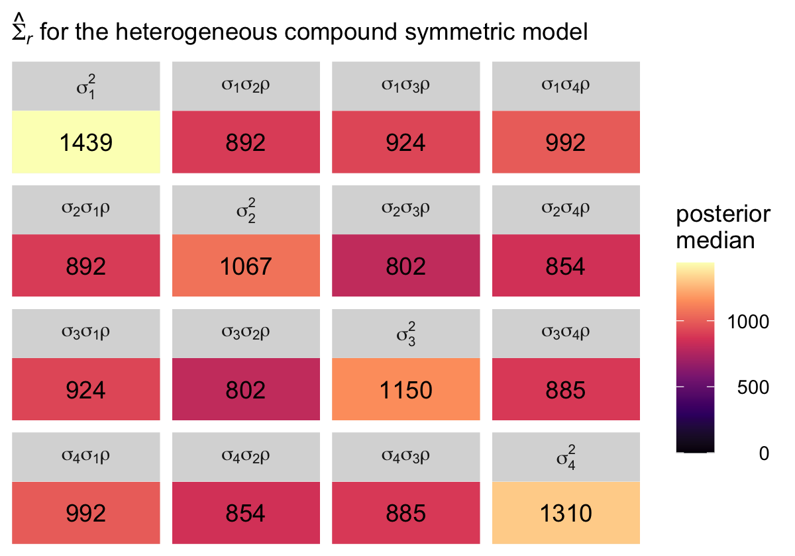

### Autoregressive error covariance matrix.

The first-order autoregressive has a strict "band-diagonal" structure governed by two parameters, which Singer and Willett called $\sigma^2$ and $\rho$. From Table 7.3 (p. 260), we see that matrix follows the form

$$
\begin{align*}
\mathbf{\Sigma}_r & = \begin{bmatrix} 
  \sigma^2 & \sigma^2 \rho & \sigma^2 \rho^2 & \sigma^2 \rho^3 \\
  \sigma^2 \rho & \sigma^2 & \sigma^2 \rho & \sigma^2 \rho^2 \\
  \sigma^2 \rho^2 & \sigma^2 \rho & \sigma^2 & \sigma^2 \rho \\
  \sigma^2 \rho^3 & \sigma^2 \rho^2 & \sigma^2 \rho & \sigma^2 \end{bmatrix},
\end{align*}
$$

where $\rho$ is the correlation of one time point to the one immediately before or after, after conditioning on the liner model. In a similar way, $\rho^2$ is the correlation between time points with one degree of separation (e.g., time 1 with time 3) and $\rho^3$ is the correlation between the first and fourth time point. The other parameter, $\sigma^2$ is the residual variance after conditioning on the linear model.

Once can fit this model with **brms** using a version of the `ar()` syntax. However, the model will follow a slightly different parameterization, following the form:

$$
\begin{align*}
\mathbf{\Sigma}_r & = \begin{bmatrix} 
  \left (\sigma_\epsilon \Big / \sqrt{1 - \rho^2} \right )^2 & \left (\sigma_\epsilon \Big / \sqrt{1 - \rho^2} \right )^2 \rho & \left (\sigma_\epsilon \Big / \sqrt{1 - \rho^2} \right )^2 \rho^2 & \left (\sigma_\epsilon \Big / \sqrt{1 - \rho^2} \right )^2 \rho^3 \\
  \left (\sigma_\epsilon \Big / \sqrt{1 - \rho^2} \right )^2 \rho & \left (\sigma_\epsilon \Big / \sqrt{1 - \rho^2} \right )^2 & \left (\sigma_\epsilon \Big / \sqrt{1 - \rho^2} \right )^2 \rho & \left (\sigma_\epsilon \Big / \sqrt{1 - \rho^2} \right )^2 \rho^2 \\
  \left (\sigma_\epsilon \Big / \sqrt{1 - \rho^2} \right )^2 \rho^2 & \left (\sigma_\epsilon \Big / \sqrt{1 - \rho^2} \right )^2 \rho & \left (\sigma_\epsilon \Big / \sqrt{1 - \rho^2} \right )^2 & \left (\sigma_\epsilon \Big / \sqrt{1 - \rho^2} \right )^2 \rho \\
  \left (\sigma_\epsilon \Big / \sqrt{1 - \rho^2} \right )^2 \rho^3 & \left (\sigma_\epsilon \Big / \sqrt{1 - \rho^2} \right )^2 \rho^2 & \left (\sigma_\epsilon \Big / \sqrt{1 - \rho^2} \right )^2 \rho & \left (\sigma_\epsilon \Big / \sqrt{1 - \rho^2} \right )^2
  \end{bmatrix},\\
\end{align*}
$$

where $\sigma_\epsilon$ is the residual variance after conditioning on both the linear model AND the autoregressive correlation $\rho$. It's not clear to me why **brms** is parameterized this way, but this is what we've got. The main point to get is that what Singer and Willett called $\sigma$ in their autoregressive model, we'll have to call $\sigma_\epsilon \Big / \sqrt{1 - \rho^2}$. Thus, if you substitute our verbose **brms** term $\sigma_\epsilon \Big / \sqrt{1 - \rho^2}$ for Singer and Willett's compact term $\sigma$, you'll see the hellish matrix above is the same as the much simpler one before it.

To fit the first-order autoregressive model with **brms**, we use the `ar()` function. As with the last few models, notice how we continue to omit the `(1 + time | id)` syntax. Instead, we impose the autoregressive structure *within persons* by setting `gr = id` within `ar()`. We also set `cov = TRUE`.


```r
fit7.5 <-
  brm(data = opposites_pp,
      family = gaussian,
      opp ~ 0 + Intercept + time + ccog + time:ccog + ar(gr = id, cov = TRUE),
      iter = 2000, warmup = 1000, chains = 4, cores = 4,
      seed = 7,
      file = "fits/fit07.05")
```


Check the summary.


```r
print(fit7.5, digits = 3)
```

```
##  Family: gaussian 
##   Links: mu = identity; sigma = identity 
## Formula: opp ~ 0 + Intercept + time + ccog + time:ccog + ar(gr = id, cov = TRUE) 
##    Data: opposites_pp (Number of observations: 140) 
##   Draws: 4 chains, each with iter = 2000; warmup = 1000; thin = 1;
##          total post-warmup draws = 4000
## 
## Correlation Structures:
##       Estimate Est.Error l-95% CI u-95% CI  Rhat Bulk_ESS Tail_ESS
## ar[1]    0.816     0.041    0.730    0.889 1.000     3651     2814
## 
## Population-Level Effects: 
##           Estimate Est.Error l-95% CI u-95% CI  Rhat Bulk_ESS Tail_ESS
## Intercept  164.394     6.122  152.165  176.435 1.002     4574     3109
## time        27.217     1.908   23.488   30.865 1.003     4100     2987
## ccog        -0.030     0.497   -0.990    0.942 1.000     4652     3058
## time:ccog    0.420     0.153    0.123    0.718 1.000     4815     2911
## 
## Family Specific Parameters: 
##       Estimate Est.Error l-95% CI u-95% CI  Rhat Bulk_ESS Tail_ESS
## sigma   20.319     1.370   17.874   23.232 1.003     4084     2672
## 
## Draws were sampled using sampling(NUTS). For each parameter, Bulk_ESS
## and Tail_ESS are effective sample size measures, and Rhat is the potential
## scale reduction factor on split chains (at convergence, Rhat = 1).
```

The `ar[1]` row in our summary is $\rho$. As we discussed just before fitting the model, the `sigma` line is the summary for what I'm calling $\sigma_\epsilon$, which is the residual standard deviation after conditioning on both the linear model AND $\rho$. If we rename the $\sigma^2$ parameter in the text as $\sigma_\text{Singer & Willett (2003)}^2$, we can convert our $\sigma_\epsilon$ parameter to that metric using the formula

$$\sigma_\text{Singer & Willett (2003)}^2 = \left (\sigma_\epsilon \Big / \sqrt{1 - \rho^2} \right )^2.$$

With that formula in hand, we're ready to compute the marginal posteriors for the full $\mathbf{\Sigma}_r$ matrix, saving the results as `sigma.ar`.


```r
sigma.ar <-
  as_draws_df(fit7.5) %>% 
  mutate(sigma_e = sigma,
         sigma   = sigma_e / sqrt(1 - `ar[1]`^2)) %>% 
  transmute(rho             = `ar[1]`,
            `sigma^2`       = sigma^2,
            `sigma^2 rho`   = sigma^2 * rho,
            `sigma^2 rho^2` = sigma^2 * rho^2,
            `sigma^2 rho^3` = sigma^2 * rho^3)
```

Here's the numeric summary.


```r
sigma.ar %>% 
  pivot_longer(everything()) %>% 
  group_by(name) %>% 
  median_qi(value) %>% 
  mutate_if(is.double, round, digits = 2)
```

```
## # A tibble: 5 × 7
##   name            value .lower  .upper .width .point .interval
##   <chr>           <dbl>  <dbl>   <dbl>  <dbl> <chr>  <chr>    
## 1 rho              0.82   0.73    0.89   0.95 median qi       
## 2 sigma^2       1247.   890.   1903.     0.95 median qi       
## 3 sigma^2 rho   1019.   668    1687.     0.95 median qi       
## 4 sigma^2 rho^2  831.   499.   1484.     0.95 median qi       
## 5 sigma^2 rho^3  680.   369.   1311      0.95 median qi
```

To simplify, we might pull the posterior medians for $\sigma^2$ through $\sigma^2 \rho^3$.


```r
s2   <- median(sigma.ar$`sigma^2`)
s2p  <- median(sigma.ar$`sigma^2 rho`)
s2p2 <- median(sigma.ar$`sigma^2 rho^2`)
s2p3 <- median(sigma.ar$`sigma^2 rho^3`)
```

Now we have them, we can make our colored version of the $\mathbf{\Sigma}_r$ Singer and Willett reported in the rightmost column of Table 7.3.


```r
crossing(row = 1:4,
         col = factor(1:4)) %>% 
  mutate(value = c(s2, s2p, s2p2, s2p3,
                   s2p, s2, s2p, s2p2,
                   s2p2, s2p, s2, s2p,
                   s2p3, s2p2, s2p, s2)) %>% 
  mutate(label = round(value, digits = 0),
         col   = fct_rev(col)) %>% 
  
  ggplot(aes(x = row, y = col)) +
  geom_tile(aes(fill = value)) +
  geom_text(aes(label = label)) +
  scale_fill_viridis_c("posterior\nmedian", option = "A", limits = c(0, NA)) +
  scale_x_continuous(NULL, breaks = NULL, position = "top", expand = c(0, 0)) +
  scale_y_discrete(NULL, breaks = NULL, expand = c(0, 0)) +
  labs(subtitle = expression(hat(Sigma)[italic(r)]*" for the autoregressive model")) +
  theme(legend.text = element_text(hjust = 1))
```

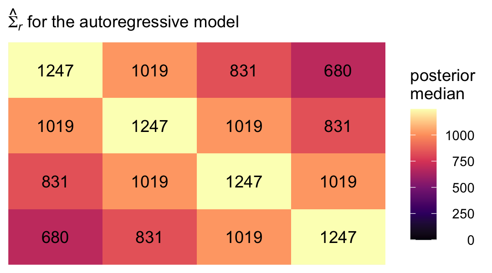

With this presentation, that strict band-diagonal structure really pops.

### Heterogeneous autoregressive error covariance matrix.

For the heterogeneous autoregressive error covariance matrix, we relax the assumption that the variances on the diagonal of the $\mathbf{\Sigma}_r$ matrix are constant across waves. From Table 7.3 (p. 260), we see that matrix follows the form

$$
\begin{align*}
\mathbf{\Sigma}_r & = \begin{bmatrix} 
  \sigma_1^2 & \sigma_1 \sigma_2 \rho & \sigma_1 \sigma_3 \rho^2 & \sigma_1 \sigma_4 \rho^3 \\
  \sigma_2 \sigma_1 \rho & \sigma_2^2 & \sigma_2 \sigma_3 \rho & \sigma_2 \sigma_4 \rho^2 \\
  \sigma_3 \sigma_1 \rho^2 & \sigma_3 \sigma_2 \rho & \sigma_3^2 & \sigma_3 \sigma_4 \rho \\
  \sigma_4 \sigma_1 \rho^3 & \sigma_4 \sigma_2 \rho^2 & \sigma_4 \sigma_3 \rho & \sigma_4^2 \end{bmatrix},
\end{align*}
$$

where, as before, $\rho$ is the correlation of one time point to the one immediately before or after, after conditioning on the liner model. To fit this model with **brms**, we continue to use the `ar(gr = id, cov = TRUE)` syntax. The only adjustment is we now wrap the `formula` within the `bf()` function and add a second line for `sigma`.


```r
fit7.6 <-
  brm(data = opposites_pp,
      family = gaussian,
      bf(opp ~ 0 + Intercept + time + ccog + time:ccog + ar(gr = id, cov = TRUE),
         sigma ~ 0 + factor(time)), 
      iter = 2000, warmup = 1000, chains = 4, cores = 4,
      seed = 7,
      file = "fits/fit07.06")
```

Inspect the parameter summary.


```r
print(fit7.6, digits = 3)
```

```
##  Family: gaussian 
##   Links: mu = identity; sigma = log 
## Formula: opp ~ 0 + Intercept + time + ccog + time:ccog + ar(gr = id, cov = TRUE) 
##          sigma ~ 0 + factor(time)
##    Data: opposites_pp (Number of observations: 140) 
##   Draws: 4 chains, each with iter = 2000; warmup = 1000; thin = 1;
##          total post-warmup draws = 4000
## 
## Correlation Structures:
##       Estimate Est.Error l-95% CI u-95% CI  Rhat Bulk_ESS Tail_ESS
## ar[1]    0.808     0.041    0.721    0.881 1.001     3564     2753
## 
## Population-Level Effects: 
##                   Estimate Est.Error l-95% CI u-95% CI  Rhat Bulk_ESS Tail_ESS
## Intercept          164.572     6.174  152.309  176.850 1.001     4594     3340
## time                27.171     1.998   23.184   31.162 1.001     3796     2622
## ccog                -0.121     0.484   -1.078    0.823 1.002     3890     2999
## time:ccog            0.431     0.157    0.134    0.738 1.000     4145     3186
## sigma_factortime0    3.068     0.106    2.873    3.290 1.001     3789     2765
## sigma_factortime1    2.969     0.087    2.807    3.147 1.000     3088     2704
## sigma_factortime2    3.014     0.086    2.854    3.190 1.001     3286     3145
## sigma_factortime3    3.028     0.102    2.839    3.238 1.002     3863     3005
## 
## Draws were sampled using sampling(NUTS). For each parameter, Bulk_ESS
## and Tail_ESS are effective sample size measures, and Rhat is the potential
## scale reduction factor on split chains (at convergence, Rhat = 1).
```

Here are summaries for the four $\sigma_\epsilon$ posteriors, after exponentiation.


```r
fixef(fit7.6)[5:8, -2] %>% exp()
```

```
##                   Estimate     Q2.5    Q97.5
## sigma_factortime0 21.49858 17.68502 26.83905
## sigma_factortime1 19.46950 16.55493 23.25568
## sigma_factortime2 20.36495 17.35231 24.29690
## sigma_factortime3 20.64833 17.09583 25.47358
```

Extending our workflow from the last section, here how we might compute the marginal posteriors for the full $\mathbf{\Sigma}_r$ matrix, saving the results as `sigma.har`.


```r
sigma.har <-
  as_draws_df(fit7.6) %>% 
  mutate(sigma_1e = exp(b_sigma_factortime0),
         sigma_2e = exp(b_sigma_factortime1),
         sigma_3e = exp(b_sigma_factortime2),
         sigma_4e = exp(b_sigma_factortime3)) %>% 
  mutate(sigma_1 = sigma_1e / sqrt(1 - `ar[1]`^2),
         sigma_2 = sigma_2e / sqrt(1 - `ar[1]`^2),
         sigma_3 = sigma_3e / sqrt(1 - `ar[1]`^2),
         sigma_4 = sigma_4e / sqrt(1 - `ar[1]`^2)) %>% 
  transmute(rho = `ar[1]`,
            
            `sigma_1^2` = sigma_1^2,
            `sigma_2^2` = sigma_2^2,
            `sigma_3^2` = sigma_3^2,
            `sigma_4^2` = sigma_4^2,
            
            `sigma_2 sigma_1 rho`   = sigma_2 * sigma_1 * rho,
            `sigma_3 sigma_1 rho^2` = sigma_3 * sigma_1 * rho^2,
            `sigma_4 sigma_1 rho^3` = sigma_4 * sigma_1 * rho^3,
            `sigma_3 sigma_2 rho`   = sigma_3 * sigma_2 * rho,
            `sigma_4 sigma_2 rho^2` = sigma_4 * sigma_2 * rho^2,
            `sigma_4 sigma_3 rho`   = sigma_4 * sigma_3 * rho)
```

Here's the numeric summary.


```r
sigma.har %>% 
  pivot_longer(everything()) %>% 
  group_by(name) %>% 
  median_qi(value) %>% 
  mutate_if(is.double, round, digits = 2)
```

```
## # A tibble: 11 × 7
##    name                    value .lower  .upper .width .point .interval
##    <chr>                   <dbl>  <dbl>   <dbl>  <dbl> <chr>  <chr>    
##  1 rho                      0.81   0.72    0.88   0.95 median qi       
##  2 sigma_1^2             1348.   885.   2241.     0.95 median qi       
##  3 sigma_2 sigma_1 rho    983.   625.   1678.     0.95 median qi       
##  4 sigma_2^2             1106.   727.   1814.     0.95 median qi       
##  5 sigma_3 sigma_1 rho^2  831.   496.   1498.     0.95 median qi       
##  6 sigma_3 sigma_2 rho    932.   587.   1605.     0.95 median qi       
##  7 sigma_3^2             1211.   793.   1972.     0.95 median qi       
##  8 sigma_4 sigma_1 rho^3  680.   374.   1276.     0.95 median qi       
##  9 sigma_4 sigma_2 rho^2  762.   451.   1352.     0.95 median qi       
## 10 sigma_4 sigma_3 rho    993.   632.   1637.     0.95 median qi       
## 11 sigma_4^2             1248.   809.   2028.     0.95 median qi
```

As in the last section, we might pull the posterior medians for $\sigma1^2$ through $\sigma_4^2$.


```r
s12   <- median(sigma.har$`sigma_1^2`)
s22   <- median(sigma.har$`sigma_2^2`)
s32   <- median(sigma.har$`sigma_3^2`)
s42   <- median(sigma.har$`sigma_4^2`)

s2s1p  <- median(sigma.har$`sigma_2 sigma_1 rho`)

s3s1p2 <- median(sigma.har$`sigma_3 sigma_1 rho^2`)
s3s2p  <- median(sigma.har$`sigma_3 sigma_2 rho`)

s4s1p3 <- median(sigma.har$`sigma_4 sigma_1 rho^3`)
s4s2p2 <- median(sigma.har$`sigma_4 sigma_2 rho^2`)
s4s3p  <- median(sigma.har$`sigma_4 sigma_3 rho`)
```

Now we have them, we can make our colored version of the $\mathbf{\Sigma}_r$ Singer and Willett reported in the rightmost column of Table 7.3.


```r
crossing(row = 1:4,
         col = factor(1:4)) %>% 
  mutate(value = c(s12, s2s1p, s3s1p2, s4s1p3,
                   s2s1p, s22, s3s2p, s4s2p2,
                   s3s1p2, s3s2p, s32, s4s3p,
                   s4s1p3, s4s2p2, s4s3p, s42)) %>% 
  mutate(label = round(value, digits = 0),
         col   = fct_rev(col)) %>% 
  
  ggplot(aes(x = row, y = col)) +
  geom_tile(aes(fill = value)) +
  geom_text(aes(label = label)) +
  scale_fill_viridis_c("posterior\nmedian", option = "A", limits = c(0, NA)) +
  scale_x_continuous(NULL, breaks = NULL, position = "top", expand = c(0, 0)) +
  scale_y_discrete(NULL, breaks = NULL, expand = c(0, 0)) +
  labs(subtitle = expression(hat(Sigma)[italic(r)]*" for the heterogeneous autoregressive model")) +
  theme(legend.text = element_text(hjust = 1))
```

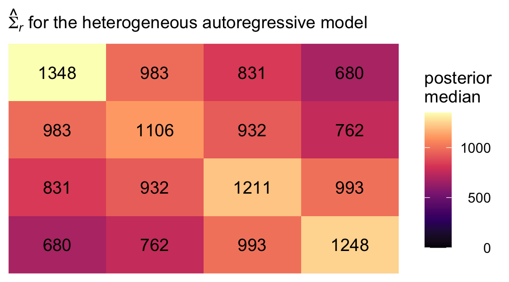

Even though there's still a strict band diagonal correlation structure, the heterogeneous variances allow for differences among the covariances within the bands.

### Toeplitz error covariance matrix.

Handy as it is, **brms** is not yet set up to fit models with the Toeplitz error covariance matrix, at this time. For details, see **brms** GitHub [issue #403](https://github.com/paul-buerkner/brms/issues/403#issuecomment-381404989).


### Does choosing the "correct" error covariance structure really matter?

Now we have all our models, we might compare them with information criteria, as was done in the text. Here we'll use the WAIC. First, compute and save the WAIC estimates.


```r
fit7.1 <- add_criterion(fit7.1, criterion = "waic")
fit7.2 <- add_criterion(fit7.2, criterion = "waic")
fit7.3 <- add_criterion(fit7.3, criterion = "waic")
fit7.4 <- add_criterion(fit7.4, criterion = "waic")
fit7.5 <- add_criterion(fit7.5, criterion = "waic")
fit7.6 <- add_criterion(fit7.6, criterion = "waic")
```

Now compare the models using WAIC differences and WAIC weights.


```r
loo_compare(fit7.1, fit7.2, fit7.3, fit7.4, fit7.5, fit7.6, criterion = "waic") %>% print(simplify = F)
```

```
##        elpd_diff se_diff elpd_waic se_elpd_waic p_waic se_p_waic waic   se_waic
## fit7.1    0.0       0.0  -585.5       6.1         46.5    3.4    1171.1   12.2 
## fit7.5  -22.2       4.3  -607.7       8.5          3.4    0.5    1215.4   17.1 
## fit7.2  -22.9       2.9  -608.4       7.7         14.5    1.7    1216.8   15.3 
## fit7.6  -25.0       4.3  -610.5       8.8          6.7    1.1    1221.0   17.6 
## fit7.3  -40.6       6.0  -626.2       8.1          4.5    0.7    1252.3   16.2 
## fit7.4  -42.4       5.5  -627.9       7.8          6.8    0.8    1255.8   15.6
```

```r
model_weights(fit7.1, fit7.2, fit7.3, fit7.4, fit7.5, fit7.6, weights = "waic") %>% round(digits = 3)
```

```
## fit7.1 fit7.2 fit7.3 fit7.4 fit7.5 fit7.6 
##      1      0      0      0      0      0
```

By both methods of comparison, the *standard* multilevel model for change was the clear winner.

> Perhaps most important, consider how choice of an error covariance structure affects our ability to address our research questions, especially given that it is the *fixed effects*--and not the *variance components*--that usually embody these questions. Some might say that refining the error covariance structure for the multilevel model for change is akin to rearranging the deck chairs on the *Titanic*--it rarely fundamentally changes our parameter estimates. Indeed, regardless of the error structure chosen, estimates of the fixed effects are unbiased and may not be affected much by choices made in the stochastic part of the model (providing that neither the data, nor the error structure, are idiosyncratic). (p. 264, *emphasis* in the original)

For more on the idea that researchers generally just care about fixed effects, see the paper by @mcneishOnTheUnnecessaryUbiquity2017, [*On the unnecessary ubiquity of hierarchical linear modeling*](https://doi.org/10.1037/met0000078). Although I can't disagree with the logic presented by Singer and Willett, or by McNeish and colleagues, I'm uneasy with this perspective for a couple reasons. First, I suspect part of the reason researchers don't theorize about variances and covariances is because those are difficult metrics for many of us to think about. Happily, **brms** makes these more accessible by parameterizing them as standard deviations and correlations. 

Second, in many disciplines, including my own (clinical psychology), multilevel models are still exotic and researchers just aren't used to thinking in their terms. But I see this as more of a reason to spread the multilevel gospel than to down emphasize variance parameters. In my opinion, which is heavily influenced by [McElreath's](https://elevanth.org/blog/2017/08/24/multilevel-regression-as-default/), it would be great if someday soon, researchers used multilevel models (longitudinal or otherwise) as the default rather than the exception. 

Third, I actually care about random effects. If you go back and compare the models from this chapter, it was only the multilevel growth model (`fit7.1`) that assigned person-specific intercepts and slopes. In clinical psychology, this matters! I want a model that allows me to make plots like this:


```r
# 35 person-specific growth trajectories
nd <-
  opposites_pp %>% 
  distinct(id, ccog) %>% 
  expand(nesting(id, ccog),
         time = c(0, 3))

fitted(fit7.1, newdata = nd) %>% 
  data.frame() %>% 
  bind_cols(nd) %>% 
  ggplot(aes(x = time + 1, y = Estimate, group = id)) +
  geom_line(linewidth = 1/4, alpha = 2/3) +
  labs(subtitle = "35 person-specific growth trajectories",
       x = "day",
       y = "opposites naming task") +
  theme(panel.grid = element_blank())
```

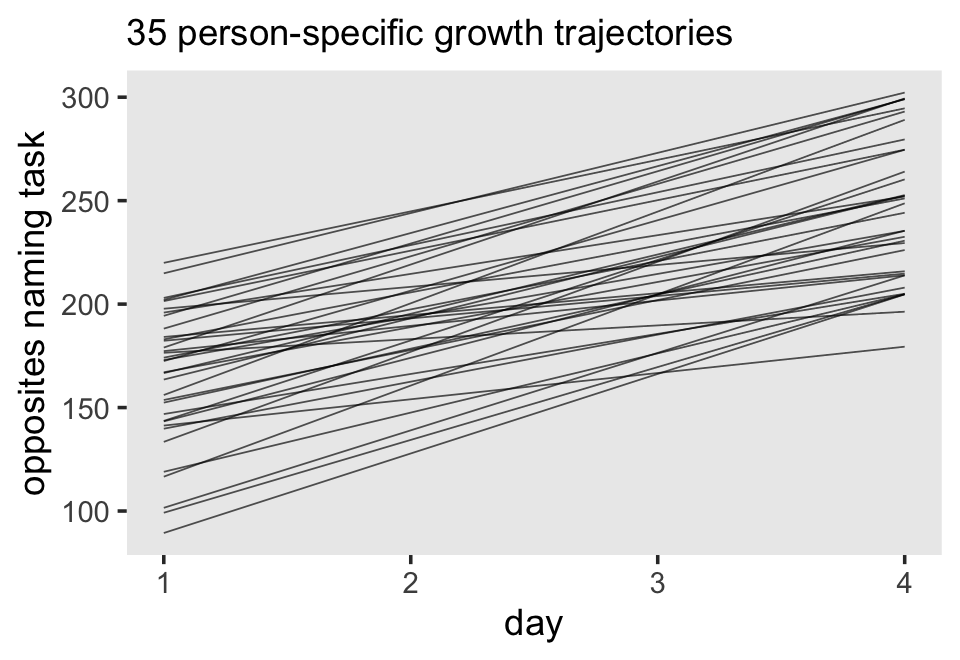

```r
# 35 person-specific intercept and slope parameters
rbind(coef(fit7.1)$id[, , "Intercept"],
      coef(fit7.1)$id[, , "time"]) %>% 
  data.frame() %>% 
  mutate(type = rep(c("intercepts", "slopes"), each = n() / 2)) %>% 
  group_by(type) %>% 
  arrange(Estimate) %>% 
  mutate(id = 1:35) %>% 
  
  ggplot(aes(x = Estimate, xmin = Q2.5, xmax = Q97.5, y = id)) +
  geom_pointrange(fatten = 1) +
  scale_y_continuous(NULL, breaks = NULL) +
  labs(subtitle = "35 person-specific intercept and slope parameters",
       x = "marginal posterior") +
  theme(panel.grid = element_blank()) +
  facet_wrap(~ type, scales = "free_x")
```

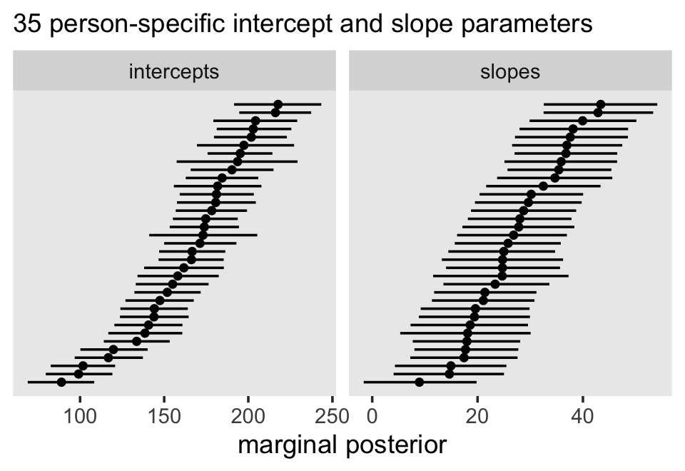

Of all the models we fit, only the standard multilevel model for change allows us to drill down all the way to the individual participants and this was accomplished by how it parameterized $\mathbf{\Sigma}_r$. Even your substantive theory isn't built around the subtleties in the $4 \times 4 = 16$ cells in the $\mathbf{\Sigma}_r$, it still matters that our `fit7.1` parameterized them by way of $\sigma_\epsilon$, $\sigma_0$, $\sigma_1$, and $\rho_{01}$.

But Singer and Willett went on:

> But refining our hypotheses about the error covariance structure *does* affect the *precision* of estimates of the fixed effects and will therefore impact hypothesis testing and confidence interval construction. (p. 264, *emphasis* in the original)

I'm going to showcase this in a coefficient plot, rather than the way the authors did in their Table 7.4. First, we'll want a custom wrangling function. Let's call it `gamma_summary()`.


```r
gamma_summary <- function(brmsfit) {
  
  fixef(brmsfit)[1:4, ] %>% 
    data.frame() %>% 
    mutate(gamma = c("gamma[0][0]", "gamma[1][0]", "gamma[0][1]", "gamma[1][1]"))
  
}

gamma_summary(fit7.1)
```

```
##              Estimate Est.Error         Q2.5       Q97.5       gamma
## Intercept 164.1077730 6.4531957 151.63917320 177.0652489 gamma[0][0]
## time       26.9878037 2.0932513  22.80959495  31.2354433 gamma[1][0]
## ccog       -0.1287983 0.5206337  -1.16248699   0.8813408 gamma[0][1]
## time:ccog   0.4337499 0.1672927   0.09452261   0.7611580 gamma[1][1]
```

Now wrangle and plot.


```r
type <- c("standard growth model", "unstructured", "compound symmetric", "heterogeneous compound symmetric", "autoregressive", "heterogeneous autoregressive")

tibble(fit  = str_c("fit7.", c(1:6)),
       type = factor(type, levels = type)) %>% 
  mutate(type  = fct_rev(type),
         gamma = map(fit, ~get(.) %>% gamma_summary())) %>% 
  unnest(gamma) %>% 
  
  ggplot(aes(x = Estimate, xmin = Q2.5, xmax = Q97.5, y = type)) +
  geom_pointrange(fatten = 1.25) +
  scale_x_continuous("marginal posterior", expand = expansion(mult = 0.25)) +
  labs(subtitle = "Parameter precision can vary across model types.",
       y = NULL) +
  theme(axis.text.y = element_text(hjust = 0),
        axis.ticks.y = element_blank(),
        panel.grid = element_blank()) +
  facet_wrap(~ gamma, scales = "free_x", labeller = label_parsed, nrow = 1)
```

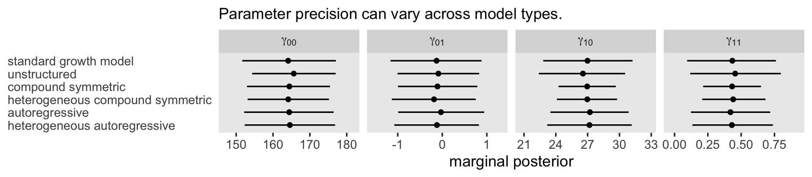

Yep, the way we parameterize $\mathbf{\Sigma}_r$ might have subtle consequences for the widths of our marginal $\gamma$ posteriors. This can matter a lot when you're analyzing data from, say, a clinical trial where lives may depend on the results of your analysis. Rearrange the deck chairs on your *Titanic* with caution, friends. Someone might trip and hurt themselves.

### Bonus: Did we trade multilevel for multivariate?

So far in this chapter, only the first model `fit7.1` used the conventional **brms** multilevel syntax, such as `(1 + time | id)`. The other five models used the `unstr()`, `cosy()`, or `ar()` helper functions, instead. Singer and Willett didn't exactly come out and say it this way, but in a sense, `fit7.1` is the only multilevel model we've fit so far in this chapter. @mallinckrod2008recommendations made the point more clearly: 

> A simple formulation of the general linear mixed model... can be implemented in which the random effects are not explicitly modeled, but rather are included as part of the marginal covariance matrix... leading them to what could alternatively be described as a multivariate normal model. (p. 306)

Thus we might think of all our models after `fit7.1` as special kinds of multivariate panel models. To help make this easier to see, let's first fit a simplified version of the unstructured model, following the form

$$
\begin{align*}
\text{opp}_{ij} & \sim \operatorname{Normal}(\mu_j, \mathbf{\Sigma}_r) \\
\mu_j & = \pi_{0j} \\
\mathbf{\Sigma}_r & = \begin{bmatrix} 
  \sigma_1^2 & \sigma_{12} & \sigma_{13} & \sigma_{14} \\
  \sigma_{21} & \sigma_2^2 & \sigma_{23} & \sigma_{24} \\
  \sigma_{31} & \sigma_{32} & \sigma_3^2 & \sigma_{34} \\
  \sigma_{41} & \sigma_{42} & \sigma_{43} & \sigma_4^2 \end{bmatrix},
\end{align*}
$$

where $\pi_{0j}$ is the intercept, which is estimated separately for each of the 4 $j$ time points, and $\mathbf{\Sigma}_r$ is the unstructured variance/covariance matrix. To fit those separate $\pi_{0j}$ intercepts with `brm()`, we use the syntax of `0 + factor(time)` in the $\mu_j$ portion of the model. Otherwise, the syntax is much the same as with the first unstructured model `fit7.2`.


```r
fit7.7 <-
  brm(data = opposites_pp, 
      family = gaussian,
      bf(opp ~ 0 + factor(time) + unstr(time = time, gr = id),
         sigma ~ 0 + factor(time)),
      iter = 2000, warmup = 1000, chains = 4, cores = 4,
      seed = 7,
      file = "fits/fit07.07")
```

Check the parameter summary.


```r
print(fit7.7, digits = 3)
```

```
##  Family: gaussian 
##   Links: mu = identity; sigma = log 
## Formula: opp ~ 0 + factor(time) + unstr(time = time, gr = id) 
##          sigma ~ 0 + factor(time)
##    Data: opposites_pp (Number of observations: 140) 
##   Draws: 4 chains, each with iter = 2000; warmup = 1000; thin = 1;
##          total post-warmup draws = 4000
## 
## Correlation Structures:
##              Estimate Est.Error l-95% CI u-95% CI  Rhat Bulk_ESS Tail_ESS
## cortime(0,1)    0.739     0.078    0.556    0.858 1.002     1975     2336
## cortime(0,2)    0.624     0.098    0.407    0.787 1.001     2190     2566
## cortime(1,2)    0.780     0.066    0.628    0.884 1.002     2666     3057
## cortime(0,3)    0.288     0.144   -0.014    0.550 1.001     2263     2490
## cortime(1,3)    0.585     0.105    0.352    0.762 1.001     2471     3004
## cortime(2,3)    0.734     0.076    0.565    0.854 1.001     3141     3107
## 
## Population-Level Effects: 
##                   Estimate Est.Error l-95% CI u-95% CI  Rhat Bulk_ESS Tail_ESS
## factortime0        164.394     6.069  153.024  176.217 1.002     2371     2917
## factortime1        192.009     5.515  181.216  202.614 1.002     1972     2296
## factortime2        216.654     5.865  204.734  228.130 1.002     1961     2089
## factortime3        246.064     6.443  233.261  258.609 1.000     2426     2532
## sigma_factortime0    3.570     0.113    3.364    3.801 1.000     2453     2397
## sigma_factortime1    3.464     0.108    3.264    3.694 1.002     2202     2341
## sigma_factortime2    3.527     0.108    3.326    3.750 1.002     2236     2461
## sigma_factortime3    3.611     0.112    3.401    3.835 1.002     2558     2808
## 
## Draws were sampled using sampling(NUTS). For each parameter, Bulk_ESS
## and Tail_ESS are effective sample size measures, and Rhat is the potential
## scale reduction factor on split chains (at convergence, Rhat = 1).
```

Once again, those 4 `sigma_` parameters were fit using the log link. Here they are after exponentiation.


```r
fixef(fit7.7)[5:8, -2] %>% exp()
```

```
##                   Estimate     Q2.5    Q97.5
## sigma_factortime0 35.50063 28.89688 44.72506
## sigma_factortime1 31.93331 26.14629 40.19886
## sigma_factortime2 34.01411 27.83327 42.54170
## sigma_factortime3 36.99593 29.99889 46.29403
```

All we've really done is fit an unconditional multivariate normal model for `opp`, across the four time points. To see, compare the posterior point estimates in the `Population-Level Effects` section (or their exponentiated values, above), to the sample means and SD's for `opp` over `time`.


```r
opposites_pp %>% 
  group_by(time) %>% 
  summarise(m = mean(opp),
            s = sd(opp))
```

```
## # A tibble: 4 × 3
##    time     m     s
##   <dbl> <dbl> <dbl>
## 1     0  164.  36.2
## 2     1  192   33.5
## 3     2  217.  35.9
## 4     3  246.  37.6
```

In a similar way, the correlations in the `Correlation Structures` part of the `print()` output are really just regularized sample correlations. Compare them to the un-regularized Pearson's correlation estimates.


```r
opposites_pp %>% 
  select(id, time, opp) %>% 
  pivot_wider(names_from = time, values_from = opp) %>% 
  select(-id) %>% 
  cor() %>% 
  round(digits = 3)
```

```
##       0     1     2     3
## 0 1.000 0.804 0.709 0.414
## 1 0.804 1.000 0.847 0.678
## 2 0.709 0.847 1.000 0.800
## 3 0.414 0.678 0.800 1.000
```

The reason for the regularization, by the way, is because of the default LKJ(1) prior. That prior is more strongly regularizing as you increase the dimensions of the correlation matrix. In the case of a $4 \times 4$ matrix, the LKJ will definitely push the individual correlations toward zero, particularly in the case of a modestly-sized data set like `opposites_pp`.

But anyway, we can fit basically the same model by explicitly using the **brms** multivariate syntax, as outlined in Bürkner's [-@Bürkner2022Multivariate] vignette, *Estimating multivariate models with brms*. Before we can fit a more conventional multivariate model to the data, we'll need to convert `opposites_pp` to the wide format, which we'll call `opposites_wide`.


```r
opposites_wide <-
  opposites_pp %>% 
  mutate(time = str_c("t", time)) %>% 
  select(-wave) %>% 
  pivot_wider(names_from = time, values_from = opp)

# what?
head(opposites_wide)
```

```
## # A tibble: 6 × 7
##      id   cog   ccog    t0    t1    t2    t3
##   <dbl> <dbl>  <dbl> <dbl> <dbl> <dbl> <dbl>
## 1     1   137  23.5    205   217   268   302
## 2     2   123   9.54   219   243   279   302
## 3     3   129  15.5    142   212   250   289
## 4     4   125  11.5    206   230   248   273
## 5     5    81 -32.5    190   220   229   220
## 6     6   110  -3.46   165   205   207   263
```

Now we're ready to fit a multivariate model to our 4 variables `t0` through `t3`. To do so, we place all 4 variables within the `mvbind()` function, and we nest the entire model formula within the `bf()` function. Also notice we are explicitly asking for residual correlations by setting `set_rescor(TRUE)`.


```r
fit7.8 <-
  brm(data = opposites_wide, 
      family = gaussian,
      bf(mvbind(t0, t1, t2, t3) ~ 1) +
        set_rescor(TRUE),
      iter = 2000, warmup = 1000, chains = 4, cores = 4,
      seed = 7,
      file = "fits/fit07.08")
```

Review the model summary.


```r
print(fit7.8, digits = 3)
```

```
##  Family: MV(gaussian, gaussian, gaussian, gaussian) 
##   Links: mu = identity; sigma = identity
##          mu = identity; sigma = identity
##          mu = identity; sigma = identity
##          mu = identity; sigma = identity 
## Formula: t0 ~ 1 
##          t1 ~ 1 
##          t2 ~ 1 
##          t3 ~ 1 
##    Data: opposites_wide (Number of observations: 35) 
##   Draws: 4 chains, each with iter = 2000; warmup = 1000; thin = 1;
##          total post-warmup draws = 4000
## 
## Population-Level Effects: 
##              Estimate Est.Error l-95% CI u-95% CI  Rhat Bulk_ESS Tail_ESS
## t0_Intercept  164.637     6.108  152.708  176.571 1.000     1966     2289
## t1_Intercept  192.169     5.475  181.626  203.058 1.002     1941     2259
## t2_Intercept  216.885     5.734  205.411  228.061 1.001     1919     2133
## t3_Intercept  246.290     6.256  233.790  258.523 1.003     2237     2729
## 
## Family Specific Parameters: 
##          Estimate Est.Error l-95% CI u-95% CI  Rhat Bulk_ESS Tail_ESS
## sigma_t0   35.874     4.214   28.927   45.298 1.000     2484     2589
## sigma_t1   32.181     3.643   25.959   40.146 1.000     2220     2729
## sigma_t2   34.295     3.830   27.770   43.252 1.001     2147     2341
## sigma_t3   37.500     4.437   29.950   47.075 1.001     2521     2859
## 
## Residual Correlations: 
##               Estimate Est.Error l-95% CI u-95% CI  Rhat Bulk_ESS Tail_ESS
## rescor(t0,t1)    0.738     0.078    0.558    0.862 1.002     2173     3269
## rescor(t0,t2)    0.622     0.099    0.402    0.788 1.001     2014     2169
## rescor(t1,t2)    0.781     0.067    0.633    0.886 1.000     2621     3241
## rescor(t0,t3)    0.285     0.146   -0.020    0.551 1.001     2125     2457
## rescor(t1,t3)    0.584     0.108    0.343    0.763 1.000     2729     2909
## rescor(t2,t3)    0.737     0.077    0.564    0.862 1.000     2697     3068
## 
## Draws were sampled using sampling(NUTS). For each parameter, Bulk_ESS
## and Tail_ESS are effective sample size measures, and Rhat is the potential
## scale reduction factor on split chains (at convergence, Rhat = 1).
```

The results are very similar to those for `fit7.7`, above, with a few small differences. First, we now have a `Residual Correlations` section instead of a `Correlation Structures`. The output of the two is basically the same, though. The various `sigma_` parameters are now in their own `Family Specific Parameters`, instead of in the bottom fo the `Population-Level Effects` section. You'll also note the `sigma_` parameters are all in their natural metric, rather than the log metric. This is because, by default, **brms** used the log link for the syntax we used for `fit7.7`, but used the identity link for the syntax we used for `fit7.8`.

Even if you take these small formatting-type differences into account, a careful eye will notice the parameter summaries are still a little different between these two models. The reason is the defualt priors were a little different. Take a look:


```r
fit7.7$prior
```

```
##                 prior    class        coef group resp  dpar nlpar lb ub       source
##                (flat)        b                                               default
##                (flat)        b factortime0                              (vectorized)
##                (flat)        b factortime1                              (vectorized)
##                (flat)        b factortime2                              (vectorized)
##                (flat)        b factortime3                              (vectorized)
##                (flat)        b                        sigma                  default
##                (flat)        b factortime0            sigma             (vectorized)
##                (flat)        b factortime1            sigma             (vectorized)
##                (flat)        b factortime2            sigma             (vectorized)
##                (flat)        b factortime3            sigma             (vectorized)
##  lkj_corr_cholesky(1) Lcortime                                               default
```

```r
fit7.8$prior
```

```
##                    prior     class coef group resp dpar nlpar lb ub  source
##  student_t(3, 166, 35.6) Intercept              t0                  default
##    student_t(3, 196, 43) Intercept              t1                  default
##  student_t(3, 215, 32.6) Intercept              t2                  default
##  student_t(3, 246, 47.4) Intercept              t3                  default
##     lkj_corr_cholesky(1)   Lrescor                                  default
##    student_t(3, 0, 35.6)     sigma              t0             0    default
##      student_t(3, 0, 43)     sigma              t1             0    default
##    student_t(3, 0, 32.6)     sigma              t2             0    default
##    student_t(3, 0, 47.4)     sigma              t3             0    default
```

I'm not going to break down exactly why **brms** made different default prior choices for these models, but experienced **brms** users should find these results very predictable, particularly due to our use of the `0 + factor(time)` syntax in the `fit7.7` model. Know your software defaults, friends. So let's try fitting these two models one more time, but with a couple adjustments. First, we will explicitly set the priors based on the defaults used by `fit7.8`. We will manually request the identity link for the `sigma_` parameters in `fit7.7`. We will also increase the post-warmup draws for both models, to help account for MCMC sampling error.


Now fit the models.


```r
# unstructures
fit7.7b <-
  brm(data = opposites_pp, 
      family = brmsfamily(family = "gaussian", link = "identity", link_sigma = "identity"),
      bf(opp ~ 0 + factor(time) + unstr(time = time, gr = id),
         sigma ~ 0 + factor(time)),
      prior = c(prior(student_t(3, 166, 35.6), class = b, coef = factortime0),
                prior(student_t(3, 196, 43.0), class = b, coef = factortime1),
                prior(student_t(3, 215, 32.6), class = b, coef = factortime2),
                prior(student_t(3, 246, 47.4), class = b, coef = factortime3),
                
                prior(student_t(3, 0, 35.6), class = b, coef = factortime0, dpar = sigma),
                prior(student_t(3, 0, 43.0), class = b, coef = factortime1, dpar = sigma),
                prior(student_t(3, 0, 32.6), class = b, coef = factortime2, dpar = sigma),
                prior(student_t(3, 0, 47.4), class = b, coef = factortime3, dpar = sigma),
                
                prior(lkj(1), class = cortime)),
      iter = 13500, warmup = 1000, chains = 4, cores = 4,
      seed = 7,
      file = "fits/fit07.07b")

# multivariate
fit7.8b <-
  brm(data = opposites_wide, 
      family = gaussian,
      bf(mvbind(t0, t1, t2, t3) ~ 1) +
        set_rescor(TRUE),
      prior = c(prior(student_t(3, 166, 35.6), class = Intercept, resp = t0),
                prior(student_t(3, 196, 43.0), class = Intercept, resp = t1),
                prior(student_t(3, 215, 32.6), class = Intercept, resp = t2),
                prior(student_t(3, 246, 47.4), class = Intercept, resp = t3),
                
                prior(student_t(3, 0, 35.6), class = sigma, resp = t0),
                prior(student_t(3, 0, 43.0), class = sigma, resp = t1),
                prior(student_t(3, 0, 32.6), class = sigma, resp = t2),
                prior(student_t(3, 0, 47.4), class = sigma, resp = t3),
                
                prior(lkj(1), class = rescor)),
      iter = 13500, warmup = 1000, chains = 4, cores = 4,
      seed = 7,
      file = "fits/fit07.08b")
```


This time, let's just compare the $\mu$ and $\sigma$ posteriors in a coefficient plot.


```r
# combine
bind_rows(
  as_draws_df(fit7.7b) %>%
    select(contains("factortime")) %>% 
    set_names(c(str_c("mu_", 0:3), str_c("sigma_", 0:3))),
  as_draws_df(fit7.8b) %>%
    select(starts_with("b_"), starts_with("sigma_"))  %>% 
    set_names(c(str_c("mu_", 0:3), str_c("sigma_", 0:3)))
) %>% 
  # wrangle
  mutate(fit = rep(c("fit7.7b", "fit7.8b"), each = n() / 2)) %>% 
  pivot_longer(-fit) %>% 
  separate(name, into = c("par", "time"), sep = "_") %>% 
  group_by(fit, par, time) %>% 
  mean_qi(value) %>%
  
  # plot!
  ggplot(aes(x = value, xmin = .lower, xmax = .upper, y = time, group = fit, color = fit)) +
  geom_pointrange(position = position_dodge(width = -0.5)) +
  scale_color_viridis_d(NULL, end = .5) +
  xlab("posterior") +
  facet_wrap(~ par, labeller = label_parsed, scales = "free_x") +
  theme(panel.grid = element_blank())
```

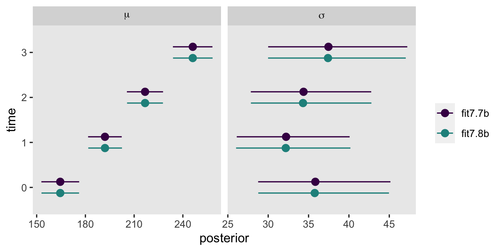

Now the results between the two methods are very similar. If you wanted to, you could make a similar kind of plot for the two versions of the correlation matrix, too. Thus, the various models Singer and Willett introduced in this chapter are special multivariate alternatives to the standard multilevel approach we've preferred up to this point. Cool, huh?

## Session info {-}


```r
sessionInfo()
```

```
## R version 4.3.0 (2023-04-21)
## Platform: x86_64-apple-darwin20 (64-bit)
## Running under: macOS Monterey 12.4
## 
## Matrix products: default
## BLAS:   /Library/Frameworks/R.framework/Versions/4.3-x86_64/Resources/lib/libRblas.0.dylib 
## LAPACK: /Library/Frameworks/R.framework/Versions/4.3-x86_64/Resources/lib/libRlapack.dylib;  LAPACK version 3.11.0
## 
## locale:
## [1] en_US.UTF-8/en_US.UTF-8/en_US.UTF-8/C/en_US.UTF-8/en_US.UTF-8
## 
## time zone: America/Chicago
## tzcode source: internal
## 
## attached base packages:
## [1] stats     graphics  grDevices utils     datasets  methods   base     
## 
## other attached packages:
##  [1] tidybayes_3.0.4 brms_2.19.0     Rcpp_1.0.10     lubridate_1.9.2 forcats_1.0.0   stringr_1.5.0  
##  [7] dplyr_1.1.2     purrr_1.0.1     readr_2.1.4     tidyr_1.3.0     tibble_3.2.1    ggplot2_3.4.2  
## [13] tidyverse_2.0.0
## 
## loaded via a namespace (and not attached):
##   [1] tensorA_0.36.2       rstudioapi_0.14      jsonlite_1.8.4       magrittr_2.0.3       TH.data_1.1-2       
##   [6] estimability_1.4.1   farver_2.1.1         nloptr_2.0.3         rmarkdown_2.21       vctrs_0.6.2         
##  [11] minqa_1.2.5          base64enc_0.1-3      htmltools_0.5.5      distributional_0.3.2 sass_0.4.6          
##  [16] StanHeaders_2.26.25  bslib_0.4.2          htmlwidgets_1.6.2    plyr_1.8.8           sandwich_3.0-2      
##  [21] emmeans_1.8.6        zoo_1.8-12           cachem_1.0.8         igraph_1.4.2         mime_0.12           
##  [26] lifecycle_1.0.3      pkgconfig_2.0.3      colourpicker_1.2.0   Matrix_1.5-4         R6_2.5.1            
##  [31] fastmap_1.1.1        shiny_1.7.4          digest_0.6.31        colorspace_2.1-0     ps_1.7.5            
##  [36] crosstalk_1.2.0      projpred_2.5.0       labeling_0.4.2       fansi_1.0.4          timechange_0.2.0    
##  [41] abind_1.4-5          mgcv_1.8-42          compiler_4.3.0       bit64_4.0.5          withr_2.5.0         
##  [46] backports_1.4.1      inline_0.3.19        shinystan_2.6.0      gamm4_0.2-6          pkgbuild_1.4.0      
##  [51] highr_0.10           MASS_7.3-58.4        gtools_3.9.4         loo_2.6.0            tools_4.3.0         
##  [56] httpuv_1.6.11        threejs_0.3.3        glue_1.6.2           callr_3.7.3          nlme_3.1-162        
##  [61] promises_1.2.0.1     grid_4.3.0           checkmate_2.2.0      reshape2_1.4.4       generics_0.1.3      
##  [66] diffobj_0.3.5        gtable_0.3.3         tzdb_0.4.0           hms_1.1.3            utf8_1.2.3          
##  [71] ggdist_3.3.0         pillar_1.9.0         markdown_1.7         vroom_1.6.3          posterior_1.4.1     
##  [76] later_1.3.1          splines_4.3.0        lattice_0.21-8       survival_3.5-5       bit_4.0.5           
##  [81] tidyselect_1.2.0     miniUI_0.1.1.1       knitr_1.42           arrayhelpers_1.1-0   gridExtra_2.3       
##  [86] bookdown_0.34        stats4_4.3.0         xfun_0.39            bridgesampling_1.1-2 matrixStats_0.63.0  
##  [91] DT_0.27              rstan_2.21.8         stringi_1.7.12       boot_1.3-28.1        evaluate_0.21       
##  [96] codetools_0.2-19     cli_3.6.1            RcppParallel_5.1.7   shinythemes_1.2.0    xtable_1.8-4        
## [101] munsell_0.5.0        processx_3.8.1       jquerylib_0.1.4      coda_0.19-4          svUnit_1.0.6        
## [106] parallel_4.3.0       rstantools_2.3.1     ellipsis_0.3.2       prettyunits_1.1.1    dygraphs_1.1.1.6    
## [111] bayesplot_1.10.0     Brobdingnag_1.2-9    lme4_1.1-33          viridisLite_0.4.2    mvtnorm_1.1-3       
## [116] scales_1.2.1         xts_0.13.1           crayon_1.5.2         rlang_1.1.1          multcomp_1.4-23     
## [121] shinyjs_2.1.0
```


