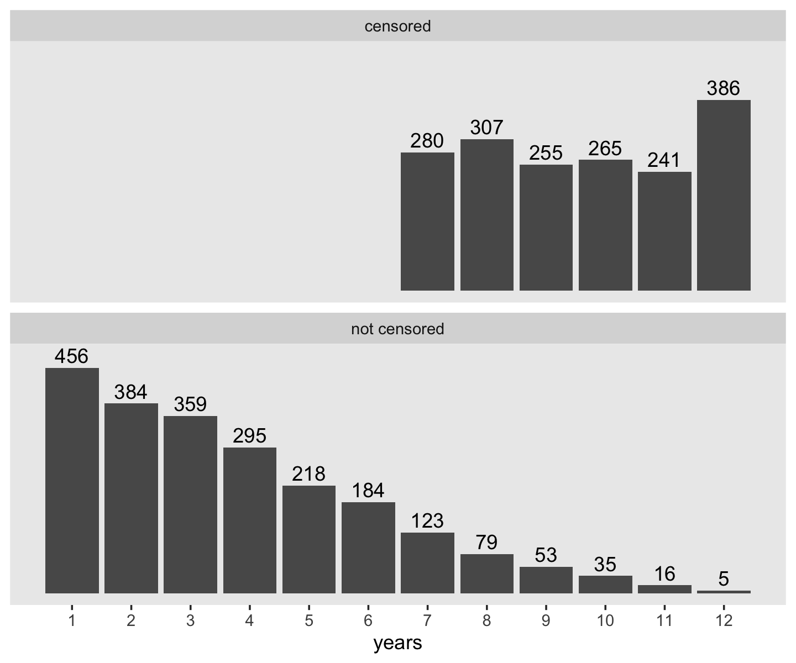
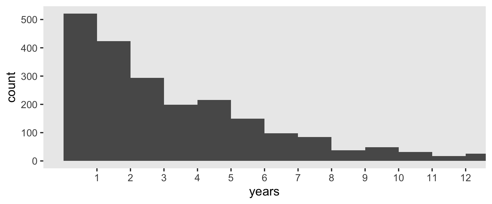

# A Framework for Investigating Event Occurrence

> Researchers who want to study event occurrence must learn how to think about their data in new and unfamiliar ways. Even traditional methods for data description--the use of means and standard deviations--fail to serve researchers well. In this chapter we introduce the essential features of event occurrence data, explaining how and why they create the need for new analytic methods. (pp 305--306)

## Should you conduct a survival analysis? The "whether" and "when" test

> To determine whether a research question calls for survival analysis, we find it helpful to apply a simple mnemonic we refer to as "the whether and when test." If your research questions include either word--*whether* or *when*--you probably need to use survival methods. (p. 306, *emphasis* added)

### Time to relapse among recently treated alcoholics.

Within the addictive-behaviors literature, researchers often study if and when participants relapse (i.e., begin using the substance(s) again). 

### Length of stay in teaching.

Education researchers can use survival analysis to study whether and for how long newly-hired teachers stay in their positions.

### Age at first suicide ideation.

Suicide is a major health risk and clinical researchers sometimes use survival analysis to whether and when participants have first considered killing themselves. 

## Framing a research question about event occurrence

Survival analyses share three common characteristics. 

> Each has a clearly defined:
>
> * *Target event*, whose occurrence is being studies
> * *Beginning of time*, an initial starting point when no one under study has yet experienced the target event
> * *Metrics for clocking time*, a meaningful scale in which event occurrence is recorded (p. 310, *emphasis* in the original)

### Defining event occurrence.

"Event occurrence represents an individual's transition from one 'state' to another 'state'" (p. 310). Though our primary focus will be on binary states (e.g., drinking/abstinent), survival analyses can handle more categories (e.g., whether/when marriages end in divorce or death).

### Identifying the "beginning of time."

> The "beginning of time" is a moment when *everyone* in the population occupies one, and only one, of the possible states... Over time, as individuals move from the original state to the next, they experience the target event. The timing of this transition--the distance from the "beginning of time" until the event occurrence--is referred to as the *event time*.
>
> To identify the "beginning of time" in a given study, imagine placing everyone in the population on a time-line, an axis with the "beginning of time" at one end and the last moment when event occurrence could be observed at the other. The goal is to "start the clock" when on one in the population has yet experienced the event but everyone is at least (theoretically) eligible to do so. In the language of survival analysis, you want to start the clock when everyone in the population is *at risk* of experiencing the event. (pp. 311--312, *emphasis* in the original)

### Specifying a metric for time.

> We distinguish between data recorded in thin precise units and those recorded in thicker intervals by calling the former *continuous time* and the latter *discrete time*.
>
> [Though survival methods can handle both discrete and continuous time,] time should be recorded in the smallest possible units relevant to the process under study. No single metric is universally appropriate, and even different studies of the identical event might use different scales. (p. 313, *emphasis* in the original)

## Censoring: How complete are the data on event occurrence?

> No matter when data collection begins, and no matter how long it lasts, some sample members are likely to have unknown event times. Statisticians call this problem *censoring* and they label the people with the unknown event times *censored observations*. Because censoring is inevitable--and a fundamental conundrum in the study of event occurrence--we now explore it in detail. (p. 316, *emphasis* in the original)

### How and why does censoring arise?

> Censoring occurs whenever a researcher does not know an individual's event time. There are two major reasons for censoring: (1) some individuals will *never* experience the target event; and (2) others will experience the event, but not during the study's data collection. Some of these latter individuals will experience the event shortly after data collection ends while others will do so at a much later time. As a practical matter, though, these distinctions matter little because you cannot distinguish among them. That, unfortunately, is the nature of censoring: it prevents you from knowing the very quantity of interest--*whether* and, if so, *when* the target event occurs for a subset of the sample. (pp. 316--317, *emphasis* in the original)

### Different types of censoring.

"Methodologists make two major types of distinctions: first, between *non-informative* and *informative* censoring mechanisms, and second, between *right*- and *left*-censoring" (p. 318, *emphasis* in the original).

#### Noninformative versus informative censoring.

> A noninformative censoring mechanism operates independent of event occurrence and the risk of event occurrence. If censoring is under an investigator's control, determined in advance by design--as it usually is--then it is noninformative... [Under this mechanism] we can therefore assume that all individuals who remain in the study after the censoring date are representative of everyone who *would have remained in the study* had censoring not occurred.
>
> If censoring occurs because individuals have experienced the event or are likely to do so in the future, the censoring mechanism is informative... Under these circumstances, we can no longer assume that those people who remain in the study after this tie are representative of all individuals who would have remained in the study had censoring not occurred. The noncensored individuals differ systematically from the censored individuals. (pp. 318--319, *emphasis* in the original)

#### Right- versus left-censoring.

> Right-censoring arises when an event time is unknown because event occurrence is not observed. Left-censoring arises when an event time is unknown because *the beginning of time* is not observed.... Because [right-censoring] is the one typically encountered in practice, and because it is the type for which survival methods were developed, references to censoring, unencumbered by a directional modifier, usually refer to right-censoring. 
>
> How to left-censored observations arise? Often they arise because researchers have not paid sufficient attention to identifying the beginning of time during the design phase. If the beginning of time is defined well--as that moment when all individuals in the population are eligible to experience the event but none have yet done so--left-censoring can be eliminated....
>
> Left-censoring presents challenges not easily addressed even with the most sophisticated of survival methods ([Hu & Lawless, 1996](http://people.stat.sfu.ca/~joanh/jhpaper/HuLawless_1996Biomk.pdf)). Little progress has been made in this area since Turnbull ([1974](https://www.tandfonline.com/doi/abs/10.1080/01621459.1974.10480146), [1976](https://apps.dtic.mil/dtic/tr/fulltext/u2/a030940.pdf)) offered some basic descriptive approaches and [Flinn and Heckman (1982)](https://www.jstor.org/stable/270719?seq=1) and [Cox and Oakes (1984)](https://www.crcpress.com/Analysis-of-Survival-Data/Cox-Oakes/p/book/9780412244902) offered some directions for fitting models under a restrictive set of assumptions. The most common advice, followed by Fichman, is to set the left-censored spells aside from analysis.... Redefining the beginning of time to coincide with a precipitating event... is often the best way of resolving the otherwise intractable problems that left-censored data pose. Whenever possible, we suggest that researchers consider such a redefinition or otherwise eliminate left-censored data through design. (pp. 319--320, *emphasis* in the original)

### How does censoring affect statistical analysis?

Here we load the `teachers.csv` data [(Singer, 1992)](https://journals.sagepub.com/doi/10.1177/001440299305900309).


```r
library(tidyverse)

teachers <- read_csv("data/teachers.csv")

glimpse(teachers)
```

```
## Rows: 3,941
## Columns: 3
## $ id     <dbl> 1, 2, 3, 4, 5, 6, 7, 8, 9, 10, 12, 13, 14, 15, 16, 17, 18, 19, 20, 21, 22, 23, 24,…
## $ t      <dbl> 1, 2, 1, 1, 12, 1, 12, 1, 2, 2, 7, 12, 1, 12, 12, 2, 12, 1, 3, 2, 12, 12, 9, 12, 2…
## $ censor <dbl> 0, 0, 0, 0, 1, 0, 1, 0, 0, 0, 0, 1, 0, 1, 1, 0, 1, 0, 0, 0, 1, 1, 0, 1, 0, 0, 0, 0…
```

Make a version of Figure 9.1.


```r
teachers %>% 
  count(censor, t) %>% 
  mutate(censor = if_else(censor == "0", "not censored", "censored")) %>% 
  
  ggplot(aes(x = t)) +
  geom_col(aes(y = n)) +
  geom_text(aes(y = n + 25, label = n)) +
  scale_x_continuous("years", breaks = 1:12) +
  scale_y_continuous(NULL, breaks = NULL) +
  theme(panel.grid = element_blank()) +
  facet_wrap(~censor, nrow = 2)
```



Here's a descriptive breakdown of those censored or not.


```r
teachers %>% 
  group_by(censor) %>% 
  summarise(n    = n(),
            mean = mean(t),
            sd   = sd(t)) %>% 
  mutate(percent = 100 * n / sum(n))
```

```
## # A tibble: 2 x 5
##   censor     n  mean    sd percent
##    <dbl> <int> <dbl> <dbl>   <dbl>
## 1      0  2207  3.73  2.41    56.0
## 2      1  1734  9.60  1.78    44.0
```

Whereas the distribution of the censored occasions is flattish with a bit of a spike at 12, the distribution of the non-censored times has a bit of an exponential look to it. Recall that the exponential distribution is controlled by a single parameter, its rate, and the mean of the exponential distribution is the reciprocal of that rate. If we take the empirical mean and $n$ of the non-censored data and plot those in to the `rexp()` function, we can simulate exponential data and plot.


```r
set.seed(9)

tibble(years = rexp(n = 2207, rate = 1 / 3.7)) %>% 
  
  ggplot(aes(x = years)) +
  geom_histogram(binwidth = 1, boundary = 0) +
  scale_x_continuous(breaks = 1:12) +
  coord_cartesian(xlim = c(0, 12)) +
  theme(panel.grid = element_blank())
```



That simulation looks pretty similar to our non-censored data. If we stopped there, we might naïvely presume $\operatorname{Exponential}(1/3.7)$ is a good model for our data. But this would ignore the censored data. One of the solutions researchers have used is 

> to assign the censored cases the event time they possess at the end of the data collection (e.g., [Frank & Keith, 1984](https://eric.ed.gov/?id=EJ306852)). Applying this to our teacher career data (e.g., assigning a career length of 7 years to the 280 teachers censored in the year 7, etc.) yields an estimated mean career duration of 7.5 years. (pp. 322--323)

Here's what that looks like.


```r
teachers %>% 
  summarise(mean   = mean(t),
            median = median(t),
            sd     = sd(t))
```

```
## # A tibble: 1 x 3
##    mean median    sd
##   <dbl>  <dbl> <dbl>
## 1  6.31      7  3.63
```

I have no idea where the 7.5 value Singer and Willett presented came from. It's larger than both the mean and the median in the data. But anyway, this method is patently wrong, so it doesn't matter:

> Imputing event times for censored cases simply changes all "nonevents" into "events" and further assumes that all these new "events" occur at the earliest time possible--that is, at the moment of censoring. Surely these decisions are most likely wrong. (p. 323) 

Stay tuned for methods that are better than patently wrong.

## Reference {-}

[Singer, J. D., & Willett, J. B. (2003). *Applied longitudinal data analysis: Modeling change and event occurrence*. New York, NY, US: Oxford University Press.](https://www.oxfordscholarship.com/view/10.1093/acprof:oso/9780195152968.001.0001/acprof-9780195152968)

## Session info {-}


```r
sessionInfo()
```

```
## R version 3.6.3 (2020-02-29)
## Platform: x86_64-apple-darwin15.6.0 (64-bit)
## Running under: macOS Catalina 10.15.3
## 
## Matrix products: default
## BLAS:   /Library/Frameworks/R.framework/Versions/3.6/Resources/lib/libRblas.0.dylib
## LAPACK: /Library/Frameworks/R.framework/Versions/3.6/Resources/lib/libRlapack.dylib
## 
## locale:
## [1] en_US.UTF-8/en_US.UTF-8/en_US.UTF-8/C/en_US.UTF-8/en_US.UTF-8
## 
## attached base packages:
## [1] stats     graphics  grDevices utils     datasets  methods   base     
## 
## other attached packages:
## [1] forcats_0.5.0   stringr_1.4.0   dplyr_0.8.5     purrr_0.3.3     readr_1.3.1     tidyr_1.0.2    
## [7] tibble_3.0.0    ggplot2_3.3.0   tidyverse_1.3.0
## 
## loaded via a namespace (and not attached):
##  [1] tidyselect_1.0.0 xfun_0.13        haven_2.2.0      lattice_0.20-38  colorspace_1.4-1
##  [6] vctrs_0.2.4      generics_0.0.2   htmltools_0.4.0  yaml_2.2.1       utf8_1.1.4      
## [11] rlang_0.4.5      pillar_1.4.3     withr_2.1.2      glue_1.4.0       DBI_1.1.0       
## [16] dbplyr_1.4.2     modelr_0.1.6     readxl_1.3.1     lifecycle_0.2.0  munsell_0.5.0   
## [21] gtable_0.3.0     cellranger_1.1.0 rvest_0.3.5      evaluate_0.14    labeling_0.3    
## [26] knitr_1.28       fansi_0.4.1      broom_0.5.5      Rcpp_1.0.4.6     backports_1.1.6 
## [31] scales_1.1.0     jsonlite_1.6.1   farver_2.0.3     fs_1.4.1         hms_0.5.3       
## [36] digest_0.6.25    stringi_1.4.6    bookdown_0.18    grid_3.6.3       cli_2.0.2       
## [41] tools_3.6.3      magrittr_1.5     crayon_1.3.4     pkgconfig_2.0.3  ellipsis_0.3.0  
## [46] xml2_1.3.1       reprex_0.3.0     lubridate_1.7.8  assertthat_0.2.1 rmarkdown_2.1   
## [51] httr_1.4.1       rstudioapi_0.11  R6_2.4.1         nlme_3.1-144     compiler_3.6.3
```


