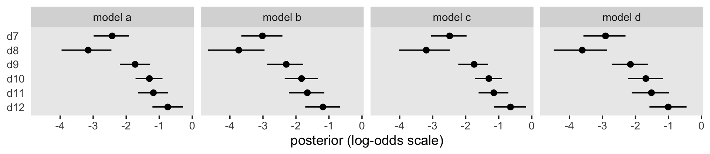
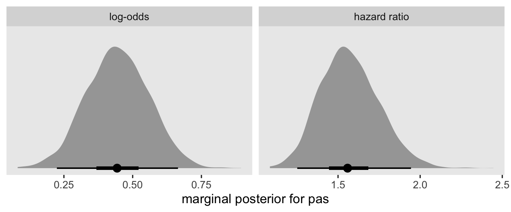
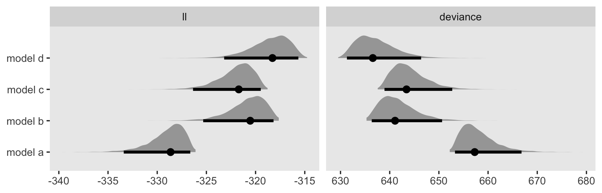
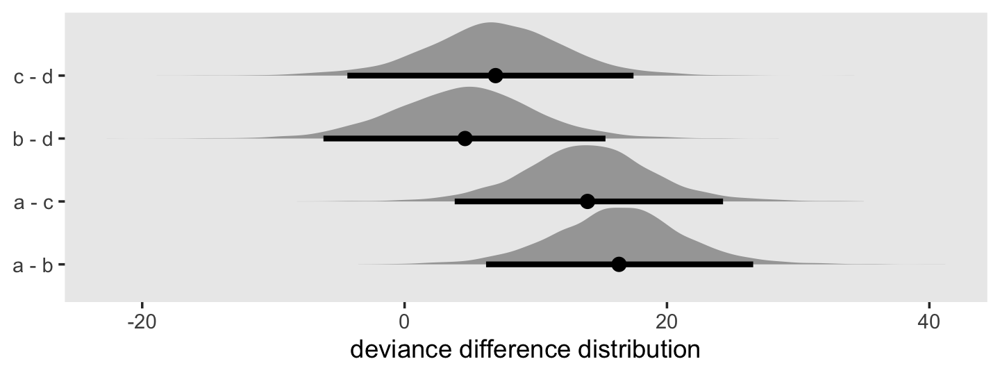

# Fitting Basic Discrete-Time Hazard Models

> In this chapter and the next, we present statistical models of hazard for data collected in discrete time. The relative simplicity of these models makes them an ideal entrée into the world of survival analysis. In subsequent chapters, we extend these basic ideas to situations in which event occurrence is recorded in continuous time. 
>
> Good data analysis involves more than using a computer package to fit a statistical model to data. To conduce a credible discrete-time survival analysis, you must: (1) specify a suitable model for hazard and understand its assumptions; (2) use sample data to estimate the model parameters; (3) interpret results in terms of your research questions; (4) evaluate model fit and [express the uncertainty in the] model parameters; and (5) communicate your findings. [@singerAppliedLongitudinalData2003, pp. 357--358]

## Toward a statistical model for discrete-time hazard

Time to load Capaldi, Crosby, and Stoolmiller's [-@capaldiPredictingTimingFirst1996] `firstsex.csv` data.


```r
library(tidyverse)

sex <- read_csv("data/firstsex.csv")

glimpse(sex)
```

```
## Rows: 180
## Columns: 5
## $ id     <dbl> 1, 2, 3, 5, 6, 7, 9, 10, 11, 12, 13, 14, 15, 16, 17, 18, 19, 20, 21, 22, 23, 24, 25, 26, 28, …
## $ time   <dbl> 9, 12, 12, 12, 11, 9, 12, 11, 12, 11, 12, 11, 9, 12, 10, 12, 7, 12, 10, 12, 11, 12, 11, 12, 1…
## $ censor <dbl> 0, 1, 1, 0, 0, 0, 1, 0, 1, 0, 1, 0, 0, 0, 0, 0, 0, 1, 0, 0, 0, 1, 0, 1, 0, 1, 0, 0, 0, 0, 0, …
## $ pt     <dbl> 0, 1, 0, 1, 0, 1, 0, 0, 1, 1, 0, 1, 1, 1, 1, 1, 0, 0, 1, 1, 1, 0, 0, 0, 1, 1, 1, 0, 1, 1, 0, …
## $ pas    <dbl> 1.9788670, -0.5454916, -1.4049800, 0.9741806, -0.6356313, -0.2428857, -0.8685001, 0.4535947, …
```

Here are the cases broken down by `time` and `censor` status.


```r
sex %>% 
  count(time, censor)
```

```
## # A tibble: 7 x 3
##    time censor     n
##   <dbl>  <dbl> <int>
## 1     7      0    15
## 2     8      0     7
## 3     9      0    24
## 4    10      0    29
## 5    11      0    25
## 6    12      0    26
## 7    12      1    54
```

Since these data show no censoring before the final `time` point, it is straightforward to follow along with the text (p. 358) and compute the percent who had already had sex by the 12^th^ grade.


```r
sex %>% 
  count(censor) %>% 
  mutate(percent = 100 * (n / sum(n)))
```

```
## # A tibble: 2 x 3
##   censor     n percent
##    <dbl> <int>   <dbl>
## 1      0   126      70
## 2      1    54      30
```

Here we break the data down by our central predictor, `pt`, which is coded "0 for boys who lived with both biological parents" and "1 for boys who experienced one or more parenting transitions" before the 7^th^ grade.


```r
sex %>% 
  count(pt) %>% 
  mutate(percent = 100 * (n / sum(n)))
```

```
## # A tibble: 2 x 3
##      pt     n percent
##   <dbl> <int>   <dbl>
## 1     0    72      40
## 2     1   108      60
```

### Plots of within-group hazard functions and survivor functions.

> Plots of sample hazard functions and survivor functions estimates separately for groups distinguished by their predictor values are invaluable exploratory tools. If a predictor is categorical, like *PT*, construction of these displays is straightforward. If a predictor is continuous, you should just temporarily categorize its values for plotting purposes. (pp. 358--359, *emphasis* in the original)

To make our version of the descriptive plots in Figure 11.1, we'll need to first load the **survival** package.


```r
library(survival)
```

`fit11.1` will be of the cases for which `pt ==  0` and `fit11.2` will be of the cases for which `pt ==  1`. With `fit11.3`, we use all cases regardless of `pt` status.


```r
fit11.1 <- 
  survfit(data = sex %>% filter(pt == 0),
          Surv(time, 1 - censor) ~ 1)

fit11.2 <- 
  survfit(data = sex %>% filter(pt == 1),
          Surv(time, 1 - censor) ~ 1)

fit11.3 <- 
  survfit(data = sex,
          Surv(time, 1 - censor) ~ 1)
```

Before we plot the results, it might be handy to arrange the fit results in life tables. We can streamline that code with the custom `make_lt()` function from last chapter.


```r
make_lt <- function(fit) {
  
  # arrange the lt data for all rows but the first
  most_rows <-
    tibble(time = fit$time) %>% 
    mutate(time_int = str_c("[", time, ", ", time + 1, ")"), 
           n_risk   = fit$n.risk, 
           n_event  = fit$n.event) %>% 
    mutate(n_censored   = n_risk - n_event - lead(n_risk, default = 0),
           hazard_fun   = n_event / n_risk,
           survivor_fun = fit$surv)
  
  # define the values for t = 2 and t = 1
  time_1 <- fit$time[1]
  time_0 <- time_1 - 1
  
  # define the values for the row for which t = 1
  row_1 <-
    tibble(time         = time_0, 
           time_int     = str_c("[", time_0, ", ", time_1, ")"),
           n_risk       = fit$n.risk[1],
           n_event      = NA,
           n_censored   = NA,
           hazard_fun   = NA, 
           survivor_fun = 1)
  
  # make the full life table
  lt <-
    bind_rows(row_1,
              most_rows)
  
  lt
  
}
```

We'll use `make_lt()` separately for each fit, stack the results from the first on top of those from the second, and add a `pt` column to index the rows. This will be our version of Table 11.1 (p. 360).


```r
lt <-
  bind_rows(make_lt(fit11.1),
            make_lt(fit11.2),
            make_lt(fit11.3)) %>% 
  mutate(pt = factor(rep(c("pt = 0", "pt = 1", "overall"), each = n() / 3))) %>% 
  select(pt, everything())

lt
```

```
## # A tibble: 21 x 8
##    pt      time time_int n_risk n_event n_censored hazard_fun survivor_fun
##    <fct>  <dbl> <chr>     <dbl>   <dbl>      <dbl>      <dbl>        <dbl>
##  1 pt = 0     6 [6, 7)       72      NA         NA    NA             1    
##  2 pt = 0     7 [7, 8)       72       2          0     0.0278        0.972
##  3 pt = 0     8 [8, 9)       70       2          0     0.0286        0.944
##  4 pt = 0     9 [9, 10)      68       8          0     0.118         0.833
##  5 pt = 0    10 [10, 11)     60       8          0     0.133         0.722
##  6 pt = 0    11 [11, 12)     52      10          0     0.192         0.583
##  7 pt = 0    12 [12, 13)     42       8         34     0.190         0.472
##  8 pt = 1     6 [6, 7)      108      NA         NA    NA             1    
##  9 pt = 1     7 [7, 8)      108      13          0     0.120         0.880
## 10 pt = 1     8 [8, 9)       95       5          0     0.0526        0.833
## # … with 11 more rows
```

Here is the code for the top panel of Figure 11.1.


```r
p1 <-
  lt %>% 
  filter(pt != "overall") %>% 
  
  ggplot(aes(x = time, y = hazard_fun, color = pt, group = pt)) +
  geom_line() +
  scale_color_viridis_d(NULL, option = "A", end = .5) +
  scale_x_continuous("grade", breaks = 6:12, limits = c(6, 12)) +
  scale_y_continuous("estimated hazard probability", 
                     limits = c(0, .5)) +
  theme(panel.grid = element_blank())
```

Now make the plot for the bottom panel.


```r
p2 <-
  lt %>% 
  filter(pt != "overall") %>% 
  
  ggplot(aes(x = time, y = survivor_fun, color = pt, group = pt)) +
  geom_hline(yintercept = .5, color = "white", linetype = 2) +
  geom_line() +
  scale_color_viridis_d(NULL, option = "A", end = .5) +
  scale_x_continuous("grade", breaks = 6:12, limits = c(6, 12)) +
  scale_y_continuous("estimated survival probability",
                     breaks = c(0, .5, 1), limits = c(0, 1)) +
  theme(panel.grid = element_blank())
```

Combine the two **ggplot2** objects with **patchwork** syntax to make our version of Figure 11.1.


```r
library(patchwork)

(p1 / p2) +
  plot_layout(guides = "collect")
```


On page 361, Singer and Willett compared the hazard probabilities at grades 8 and 11 for boys in the two `pt` groups. We can make that comparison with `filter()`.


```r
lt %>% 
  filter(time %in% c(8, 11) &
           pt != "overall") %>% 
  select(pt:time, hazard_fun)
```

```
## # A tibble: 4 x 3
##   pt      time hazard_fun
##   <fct>  <dbl>      <dbl>
## 1 pt = 0     8     0.0286
## 2 pt = 0    11     0.192 
## 3 pt = 1     8     0.0526
## 4 pt = 1    11     0.283
```

Compare the two groups on the hazard probabilities at grade 9.


```r
lt %>% 
  filter(time == 9 &
           pt != "overall") %>% 
  select(pt:time, hazard_fun)
```

```
## # A tibble: 2 x 3
##   pt      time hazard_fun
##   <fct>  <dbl>      <dbl>
## 1 pt = 0     9      0.118
## 2 pt = 1     9      0.178
```

Now compare them on their hazard probabilities in grade 12.


```r
lt %>% 
  filter(time == 12 &
           pt != "overall") %>% 
  select(pt:time, hazard_fun)
```

```
## # A tibble: 2 x 3
##   pt      time hazard_fun
##   <fct>  <dbl>      <dbl>
## 1 pt = 0    12      0.190
## 2 pt = 1    12      0.474
```

At the top of page 362, Singer and Willett compared the percentages of boys who were virgins at grades 9 and 12, by `pt` status. Those percentages are straight algebraic transformations of the corresponding survival function values.


```r
lt %>% 
  filter(time %in% c(9, 12) &
           pt != "overall") %>% 
  select(pt:time, survivor_fun) %>% 
  mutate(percent_virgins = (100 * survivor_fun) %>% round(digits = 1))
```

```
## # A tibble: 4 x 4
##   pt      time survivor_fun percent_virgins
##   <fct>  <dbl>        <dbl>           <dbl>
## 1 pt = 0     9        0.833            83.3
## 2 pt = 0    12        0.472            47.2
## 3 pt = 1     9        0.685            68.5
## 4 pt = 1    12        0.185            18.5
```

Now let's finish off by computing the interpolated median lifetime values for each with our custom `make_iml()` function.


```r
make_iml <- function(lt) {
  
  # lt is a generic name for a life table of the 
  # kind we made with our `make_lt()` function
  
  # determine the mth row
  lt_m <-
    lt %>% 
    filter(survivor_fun > .5) %>% 
    slice(n())
  
  # determine the row for m + 1
  lt_m1 <-
    lt %>% 
    filter(survivor_fun < .5) %>% 
    slice(1)
  
  # pull the value for m
  m  <- pull(lt_m, time)
  
  # pull the two survival function values
  stm  <- pull(lt_m, survivor_fun)
  stm1 <- pull(lt_m1, survivor_fun)
  
  # plug the values into Equation 10.6 (page 338)
  iml <- m + ((stm - .5) / (stm - stm1)) * ((m + 1) - m)
  
  iml
  
}
```

Put `make_iml()` to work.


```r
make_iml(lt %>% filter(pt == "pt = 0"))
```

```
## [1] 11.75
```

```r
make_iml(lt %>% filter(pt == "pt = 1"))
```

```
## [1] 9.952381
```

### What kind of statistical model do these graphs suggest?

> To postulate a statistical model to represent the relationship between the population discrete-time hazard function and predictors, we must deal with two complications apparent in these displays. One is that any hypothesized model must describe the shape of the *entire discrete-time hazard function* over time, not just its value in any one period, in much the same way that a multilevel model for change characterizes the shape of entire individual growth trajectories over time. A second complication is that, as a conditional probability, the value of discrete-time hazard must lie between 0 and 1. Any reasonable statistical model for hazard must recognize this constraint, precluding the occurrence of theoretically impossible values. (p. 362, *emphasis* in the original)

#### The bounded nature of hazard.

A conventional way to handle the bounded nature of probabilities is transform the scale of the data. @cox1972regression recommended either the odds and log-odds (i.e., logit) transformations. Given a probability, $p$, we compute the odds as

$$\text{odds} = \frac{p}{1 - p}.$$

Log-odds is a minor extension; you simply take the log of the odds, which we can formally express as

$$\text{log-odds} = \log \left (\frac{p}{1 - p} \right ).$$

To make the conversions easy, we'll define[^2] a couple convenience functions: `odds()` and `log_odds()`.


```r
odds <- function(p) {
  p / (1 - p)
}

log_odds <- function(p) {
  log(p / (1 - p))
}
```

Here's how they work.


```r
tibble(p = seq(from = 0, to = 1, by = .1)) %>% 
  mutate(odds     = odds(p),
         log_odds = log_odds(p))
```

```
## # A tibble: 11 x 3
##        p    odds log_odds
##    <dbl>   <dbl>    <dbl>
##  1   0     0     -Inf    
##  2   0.1   0.111   -2.20 
##  3   0.2   0.25    -1.39 
##  4   0.3   0.429   -0.847
##  5   0.4   0.667   -0.405
##  6   0.5   1        0    
##  7   0.6   1.5      0.405
##  8   0.7   2.33     0.847
##  9   0.8   4.       1.39 
## 10   0.9   9.       2.20 
## 11   1   Inf      Inf
```

Before we make our version of Figure 11.2, it might be instructive to see how odds and log-odds compare to probabilities in a plot. Here we'll compare them to probabilities ranging from .01 to .99.


```r
tibble(p = seq(from = .01, to = .99, by = .01)) %>% 
  mutate(odds        = odds(p),
         `log(odds)` = log_odds(p)) %>% 
  pivot_longer(-p) %>% 
  mutate(name = factor(name,
                       levels = c("odds", "log(odds)"))) %>% 
  
  ggplot(aes(x = p, y = value)) +
  geom_line() +
  labs(x = "probability",
       y = "transformed scale") +
  theme(panel.grid = element_blank()) +
  facet_wrap(~name, scales = "free")
```


Odds are bounded to values of zero and above and have an inflection at 1. Log-odds are unbounded and have an inflection point at 0. Here we'll save the odds and log-odds for our hazard functions within the `lt` life table.


```r
lt <-
  lt %>% 
  mutate(odds     = odds(hazard_fun),
         log_odds = log_odds(hazard_fun)) 

lt
```

```
## # A tibble: 21 x 10
##    pt      time time_int n_risk n_event n_censored hazard_fun survivor_fun    odds log_odds
##    <fct>  <dbl> <chr>     <dbl>   <dbl>      <dbl>      <dbl>        <dbl>   <dbl>    <dbl>
##  1 pt = 0     6 [6, 7)       72      NA         NA    NA             1     NA         NA   
##  2 pt = 0     7 [7, 8)       72       2          0     0.0278        0.972  0.0286    -3.56
##  3 pt = 0     8 [8, 9)       70       2          0     0.0286        0.944  0.0294    -3.53
##  4 pt = 0     9 [9, 10)      68       8          0     0.118         0.833  0.133     -2.01
##  5 pt = 0    10 [10, 11)     60       8          0     0.133         0.722  0.154     -1.87
##  6 pt = 0    11 [11, 12)     52      10          0     0.192         0.583  0.238     -1.44
##  7 pt = 0    12 [12, 13)     42       8         34     0.190         0.472  0.235     -1.45
##  8 pt = 1     6 [6, 7)      108      NA         NA    NA             1     NA         NA   
##  9 pt = 1     7 [7, 8)      108      13          0     0.120         0.880  0.137     -1.99
## 10 pt = 1     8 [8, 9)       95       5          0     0.0526        0.833  0.0556    -2.89
## # … with 11 more rows
```

We're ready to make and combine the subplots for our version of Figure 11.2.


```r
# hazard
p1 <-
  lt %>% 
  filter(pt != "overall") %>% 
  
  ggplot(aes(x = time, y = hazard_fun, color = pt, group = pt)) +
  geom_line() +
  scale_y_continuous(NULL, breaks = c(0, .5, 1), limits = c(0, 1)) +
  labs(subtitle = "Estimated hazard") +
  theme(legend.background = element_rect(fill = "transparent"),
        legend.key = element_rect(color = "grey92"),
        legend.position = c(.1, .825))

# odds
p2 <-
  lt %>% 
  filter(pt != "overall") %>% 
  
  ggplot(aes(x = time, y = odds, color = pt, group = pt)) +
  geom_line() +
  scale_y_continuous(NULL, breaks = c(0, .5, 1), limits = c(0, 1)) +
  labs(subtitle = "Estimated odds") +
  theme(legend.position = "none")

# log-odds
p3 <-
  lt %>% 
  filter(pt != "overall") %>% 
  
  ggplot(aes(x = time, y = log_odds, color = pt, group = pt)) +
  geom_line() +
  scale_y_continuous(NULL, limits = c(-4, 0)) +
  labs(subtitle = "Estimated logit(hazard)") +
  theme(legend.position = "none")

(p1 / p2 / p3 ) &
  scale_color_viridis_d(NULL, option = "A", end = .5) &
  scale_x_continuous("grade", breaks = 6:12, limits = c(6, 12)) &
  theme(panel.grid = element_blank())
```


#### What statistical model could have generated these sample data?

With the survival models from the prior sections, we were lazy and just used the **survival** package. But recall from the end of the last chapter that we can fit the analogous models **brms** using the binomial likelihood. This subsection is a great place to practice those some more. The fitted lines Singer and Willett displayed in Figure 11.3 can all be reproduced with binomial regression. However, the `sex` data are not in a convenient form to fit those models. Just like we did in last chapter, we'll want to take a two-step process whereby we first convert the data to the long (i.e., person-period) format and then summarize. Happily, we can accomplish that first step by uploading the data in the `firstsex_pp.csv` file, which are already in the long format.


```r
sex_pp <- read_csv("data/firstsex_pp.csv")

glimpse(sex_pp)
```

```
## Rows: 822
## Columns: 11
## $ id     <dbl> 1, 1, 1, 2, 2, 2, 2, 2, 2, 3, 3, 3, 3, 3, 3, 5, 5, 5, 5, 5, 5, 6, 6, 6, 6, 6, 7, 7, 7, 9, 9, …
## $ period <dbl> 7, 8, 9, 7, 8, 9, 10, 11, 12, 7, 8, 9, 10, 11, 12, 7, 8, 9, 10, 11, 12, 7, 8, 9, 10, 11, 7, 8…
## $ event  <dbl> 0, 0, 1, 0, 0, 0, 0, 0, 0, 0, 0, 0, 0, 0, 0, 0, 0, 0, 0, 0, 1, 0, 0, 0, 0, 1, 0, 0, 1, 0, 0, …
## $ d7     <dbl> 1, 0, 0, 1, 0, 0, 0, 0, 0, 1, 0, 0, 0, 0, 0, 1, 0, 0, 0, 0, 0, 1, 0, 0, 0, 0, 1, 0, 0, 1, 0, …
## $ d8     <dbl> 0, 1, 0, 0, 1, 0, 0, 0, 0, 0, 1, 0, 0, 0, 0, 0, 1, 0, 0, 0, 0, 0, 1, 0, 0, 0, 0, 1, 0, 0, 1, …
## $ d9     <dbl> 0, 0, 1, 0, 0, 1, 0, 0, 0, 0, 0, 1, 0, 0, 0, 0, 0, 1, 0, 0, 0, 0, 0, 1, 0, 0, 0, 0, 1, 0, 0, …
## $ d10    <dbl> 0, 0, 0, 0, 0, 0, 1, 0, 0, 0, 0, 0, 1, 0, 0, 0, 0, 0, 1, 0, 0, 0, 0, 0, 1, 0, 0, 0, 0, 0, 0, …
## $ d11    <dbl> 0, 0, 0, 0, 0, 0, 0, 1, 0, 0, 0, 0, 0, 1, 0, 0, 0, 0, 0, 1, 0, 0, 0, 0, 0, 1, 0, 0, 0, 0, 0, …
## $ d12    <dbl> 0, 0, 0, 0, 0, 0, 0, 0, 1, 0, 0, 0, 0, 0, 1, 0, 0, 0, 0, 0, 1, 0, 0, 0, 0, 0, 0, 0, 0, 0, 0, …
## $ pt     <dbl> 0, 0, 0, 1, 1, 1, 1, 1, 1, 0, 0, 0, 0, 0, 0, 1, 1, 1, 1, 1, 1, 0, 0, 0, 0, 0, 1, 1, 1, 0, 0, …
## $ pas    <dbl> 1.9788670, 1.9788670, 1.9788670, -0.5454916, -0.5454916, -0.5454916, -0.5454916, -0.5454916, …
```

Now we'll compute the desired summary values and wrangle a bit.


```r
sex_aggregated <-
  sex_pp %>% 
  mutate(event = if_else(event == 1, "event", "no_event")) %>% 
  group_by(period) %>% 
  count(event, pt) %>% 
  ungroup() %>% 
  pivot_wider(names_from = event,
              values_from = n) %>% 
  mutate(total         = event + no_event,
         period_center = period - mean(period),
         peroid_factor = factor(period),
         pt            = factor(pt))

sex_aggregated
```

```
## # A tibble: 12 x 7
##    period pt    event no_event total period_center peroid_factor
##     <dbl> <fct> <int>    <int> <int>         <dbl> <fct>        
##  1      7 0         2       70    72          -2.5 7            
##  2      7 1        13       95   108          -2.5 7            
##  3      8 0         2       68    70          -1.5 8            
##  4      8 1         5       90    95          -1.5 8            
##  5      9 0         8       60    68          -0.5 9            
##  6      9 1        16       74    90          -0.5 9            
##  7     10 0         8       52    60           0.5 10           
##  8     10 1        21       53    74           0.5 10           
##  9     11 0        10       42    52           1.5 11           
## 10     11 1        15       38    53           1.5 11           
## 11     12 0         8       34    42           2.5 12           
## 12     12 1        18       20    38           2.5 12
```

Note how we saved the grade values in three columns:

* `period` has them as continuous values, which will be hand for plotting;
* `period_center` has them as mean-centered continuous values, which will make fitting the linear model in the middle panel easier; and
* `period_factor` has them saved as a factor, which will help us fit the model in the bottom panel.

Fire up **brms**.


```r
library(brms)
```

Before we fit the models, it might be good to acknowledge we're jumping ahead of the authors, a bit. Singer and Willett didn't discuss fitting discrete time hazard models until section 11.3.2. Sure, their focus was on the frequentist approach using maximum likelihood. But the point still stands. If these model fitting details feel a bit rushed, they are.

Any anxious feelings aside, now fit the three binomial models. We continue to use weakly-regularizing priors for each.


```r
# top panel
fit11.4 <-
  brm(data = sex_aggregated,
      family = binomial,
      event | trials(total) ~ 0 + pt,
      prior(normal(0, 4), class = b),
      chains = 4, cores = 4, iter = 2000, warmup = 1000,
      seed = 11,
      file = "fits/fit11.04")

# middle panel
fit11.5 <-
  brm(data = sex_aggregated,
      family = binomial,
      event | trials(total) ~ 0 + pt + period_center,
      prior(normal(0, 4), class = b),
      chains = 4, cores = 4, iter = 2000, warmup = 1000,
      seed = 11,
      file = "fits/fit11.05")

# bottom panel
fit11.6 <-
  brm(data = sex_aggregated,
      family = binomial,
      event | trials(total) ~ 0 + pt + peroid_factor,
      prior(normal(0, 4), class = b),
      chains = 4, cores = 4, iter = 2000, warmup = 1000,
      seed = 11,
      file = "fits/fit11.06")
```

Check the model summaries.


```r
print(fit11.4)
```

```
##  Family: binomial 
##   Links: mu = logit 
## Formula: event | trials(total) ~ 0 + pt 
##    Data: sex_aggregated (Number of observations: 12) 
## Samples: 4 chains, each with iter = 2000; warmup = 1000; thin = 1;
##          total post-warmup samples = 4000
## 
## Population-Level Effects: 
##     Estimate Est.Error l-95% CI u-95% CI Rhat Bulk_ESS Tail_ESS
## pt0    -2.16      0.17    -2.52    -1.84 1.00     3074     2696
## pt1    -1.44      0.12    -1.68    -1.21 1.00     3474     2783
## 
## Samples were drawn using sampling(NUTS). For each parameter, Bulk_ESS
## and Tail_ESS are effective sample size measures, and Rhat is the potential
## scale reduction factor on split chains (at convergence, Rhat = 1).
```

```r
print(fit11.5)
```

```
##  Family: binomial 
##   Links: mu = logit 
## Formula: event | trials(total) ~ 0 + pt + period_center 
##    Data: sex_aggregated (Number of observations: 12) 
## Samples: 4 chains, each with iter = 2000; warmup = 1000; thin = 1;
##          total post-warmup samples = 4000
## 
## Population-Level Effects: 
##               Estimate Est.Error l-95% CI u-95% CI Rhat Bulk_ESS Tail_ESS
## pt0              -2.23      0.18    -2.58    -1.89 1.00     3518     2773
## pt1              -1.35      0.12    -1.59    -1.11 1.00     3164     2728
## period_center     0.43      0.06     0.31     0.56 1.00     3377     3064
## 
## Samples were drawn using sampling(NUTS). For each parameter, Bulk_ESS
## and Tail_ESS are effective sample size measures, and Rhat is the potential
## scale reduction factor on split chains (at convergence, Rhat = 1).
```

```r
print(fit11.6)
```

```
##  Family: binomial 
##   Links: mu = logit 
## Formula: event | trials(total) ~ 0 + pt + peroid_factor 
##    Data: sex_aggregated (Number of observations: 12) 
## Samples: 4 chains, each with iter = 2000; warmup = 1000; thin = 1;
##          total post-warmup samples = 4000
## 
## Population-Level Effects: 
##                 Estimate Est.Error l-95% CI u-95% CI Rhat Bulk_ESS Tail_ESS
## pt0                -2.99      0.31    -3.63    -2.42 1.00     1061     2020
## pt1                -2.11      0.27    -2.67    -1.63 1.00      978     1730
## peroid_factor8     -0.77      0.47    -1.75     0.11 1.00     1848     2432
## peroid_factor9      0.68      0.34     0.01     1.37 1.00     1266     2093
## peroid_factor10     1.14      0.34     0.47     1.82 1.00     1133     1925
## peroid_factor11     1.31      0.35     0.63     2.03 1.00     1125     2183
## peroid_factor12     1.79      0.36     1.10     2.50 1.00     1144     1978
## 
## Samples were drawn using sampling(NUTS). For each parameter, Bulk_ESS
## and Tail_ESS are effective sample size measures, and Rhat is the potential
## scale reduction factor on split chains (at convergence, Rhat = 1).
```

We can extract the fitted values and their summaries for each row in the data with `fitted()`. To get them in the log-odds metric, we need to set `scale = "linear"`. Here's a quick example with `fit11.4`.


```r
fitted(fit11.4, scale = "linear")
```

```
##       Estimate Est.Error      Q2.5     Q97.5
##  [1,] -2.15844 0.1716868 -2.515513 -1.836107
##  [2,] -1.44155 0.1196687 -1.682844 -1.209628
##  [3,] -2.15844 0.1716868 -2.515513 -1.836107
##  [4,] -1.44155 0.1196687 -1.682844 -1.209628
##  [5,] -2.15844 0.1716868 -2.515513 -1.836107
##  [6,] -1.44155 0.1196687 -1.682844 -1.209628
##  [7,] -2.15844 0.1716868 -2.515513 -1.836107
##  [8,] -1.44155 0.1196687 -1.682844 -1.209628
##  [9,] -2.15844 0.1716868 -2.515513 -1.836107
## [10,] -1.44155 0.1196687 -1.682844 -1.209628
## [11,] -2.15844 0.1716868 -2.515513 -1.836107
## [12,] -1.44155 0.1196687 -1.682844 -1.209628
```

If we convert that output to a data frame, tack on the original data values, and wrangle a bit, we'll be in good shape to make the top panel of Figure 11.3. Below we'll do that for each of the three panels, saving them as `p1`, `p2`, and `p3`.


```r
# logit(hazard) is horizontal with time
p1 <-
  fitted(fit11.4,
         scale = "linear") %>% 
  data.frame() %>% 
  bind_cols(sex_aggregated) %>% 
  mutate(pt = str_c("pt = ", pt)) %>% 
  
  ggplot(aes(x = period, group = pt,
             fill = pt, color = pt)) +
  geom_ribbon(aes(ymin = Q2.5, ymax = Q97.5),
              size = 0, alpha = 1/4) +
  geom_line(aes(y = Estimate),
            alpha = 1/2) +
  geom_point(aes(y = log_odds(event / total))) +
  scale_y_continuous(NULL, limits = c(-4, 0)) +
  labs(subtitle = "logit(hazard) is horizontal with time") +
  theme(legend.background = element_rect(fill = "transparent"),
        legend.key = element_rect(color = "grey92"),
        legend.position = c(.1, .825))

# logit(hazard) is linear with time
p2 <-
  fitted(fit11.5,
         scale = "linear") %>% 
  data.frame() %>% 
  bind_cols(sex_aggregated) %>% 
  
  ggplot(aes(x = period, group = pt,
             fill = pt, color = pt)) +
  geom_ribbon(aes(ymin = Q2.5, ymax = Q97.5),
              size = 0, alpha = 1/4) +
  geom_line(aes(y = Estimate),
            alpha = 1/2) +
  geom_point(aes(y = log_odds(event / total))) +
  labs(subtitle = "logit(hazard) is linear with time",
       y = "logit(hazard)") +
  coord_cartesian(ylim = c(-4, 0)) +
  theme(legend.position = "none")

# logit(hazard) is completely general with time
p3 <-
  fitted(fit11.6,
         scale = "linear") %>% 
  data.frame() %>% 
  bind_cols(sex_aggregated) %>% 
  
  ggplot(aes(x = period, group = pt,
             fill = pt, color = pt)) +
  geom_ribbon(aes(ymin = Q2.5, ymax = Q97.5),
              size = 0, alpha = 1/4) +
  geom_line(aes(y = Estimate),
            alpha = 1/2) +
  geom_point(aes(y = log_odds(event / total))) +
  labs(subtitle = "logit(hazard) is completely general with time",
       y = NULL) +
  coord_cartesian(ylim = c(-4, 0)) +
  theme(legend.position = "none")
```

Now combine the plots with **patchwork** syntax.


```r
(p1 / p2 / p3) &
  scale_fill_viridis_d(NULL, option = "A", end = .6) &
  scale_color_viridis_d(NULL, option = "A", end = .6) &
  scale_x_continuous("Grade", breaks = 6:12, limits = c(6, 12)) &
  theme(panel.grid = element_blank())
```


In addition to the posterior means (i.e., our analogues to the fitted values in the text), we added the 95% Bayesian intervals to give a better sense of the uncertainty in each model. Singer and Willet mused the unconstrained model (`fit6`) was a better fit to the data than the other two. We can quantify that with a LOO comparison.


```r
fit11.4 <- add_criterion(fit11.4, "loo")
fit11.5 <- add_criterion(fit11.5, "loo")
fit11.6 <- add_criterion(fit11.6, "loo")

loo_compare(fit11.4, fit11.5, fit11.6) %>% print(simplify = F)
```

```
##         elpd_diff se_diff elpd_loo se_elpd_loo p_loo se_p_loo looic se_looic
## fit11.6   0.0       0.0   -31.8      1.8         5.3   0.8     63.6   3.6   
## fit11.5  -0.4       3.3   -32.2      3.3         3.5   1.2     64.5   6.5   
## fit11.4 -27.9      10.5   -59.7     10.5         9.7   2.8    119.4  21.0
```

Here are the LOO weights.


```r
model_weights(fit11.4, fit11.5, fit11.6, weights = "loo") %>% round(digits = 3)
```

```
## fit11.4 fit11.5 fit11.6 
##   0.000   0.394   0.606
```

## Formal representation of the population discrete-time hazard model

Earlier equations for the hazard function omitted substantive predictors. Now consider the case where $X_{1ij}, X_{2ij}, \dots , X_{Pij}$ stand for the $P$ predictors which may or may not vary across individuals $i$ and time periods $j$. Thus $x_{pij}$ is the value for the $i^\text{th}$ individual on the $p^\text{th}$ variable during the $j^\text{th}$ period. We can use this to define the conditional hazard function as

$$h(t_{ij}) = \operatorname{Pr} [T_i = j | T \geq j \text{ and } X_{1ij} = x_{1ij}, X_{2ij} = x_{2ij}, \dots , X_{Pij} = x_{pij}].$$

Building further and keeping the baseline shape of the discrete hazard function flexible, we want a method that allows each of the $j$ time periods to have its own value. Imagine a set of $J$ dummy variables, $D_1, D_2, \dots, D_J$, marking off each of the time periods. For example, say $J = 6$, we could depict this in a tibble like so.


```r
tibble(period = 1:6) %>% 
  mutate(d1 = if_else(period == 1, 1, 0),
         d2 = if_else(period == 2, 1, 0),
         d3 = if_else(period == 3, 1, 0),
         d4 = if_else(period == 4, 1, 0),
         d5 = if_else(period == 5, 1, 0),
         d6 = if_else(period == 6, 1, 0))
```

```
## # A tibble: 6 x 7
##   period    d1    d2    d3    d4    d5    d6
##    <int> <dbl> <dbl> <dbl> <dbl> <dbl> <dbl>
## 1      1     1     0     0     0     0     0
## 2      2     0     1     0     0     0     0
## 3      3     0     0     1     0     0     0
## 4      4     0     0     0     1     0     0
## 5      5     0     0     0     0     1     0
## 6      6     0     0     0     0     0     1
```

If we were to use a set of dummies of this kind in a model, we would omit the conventional regression intercept, replacing it with the $J$ dummies. Now presume we're fitting a hazard model using the logit link, $\operatorname{logit} h(t_{ij})$. We can express the discrete conditional hazard model with a general functional form with respect to time as

$$\operatorname{logit} h(t_{ij}) = [\alpha_1 D_{1ij} + \alpha_2 D_{2ij} + \cdots + \alpha_J D_{Jij}] + [\beta_1 X_{1ij} + \beta_2 X_{2ij} + \cdots + \beta_P X_{Pij}],$$

where the $\alpha$ parameters are the $J$ time-period dummies and the $\beta$ parameters are for other time-varying or time-invariant predictors. This is just the type of model we used to fit `fit116`. For that model, the basic equation was

$$\operatorname{logit} h(t_{ij}) = [\alpha_7 D_{7ij} + \alpha_8 D_{8ij} + \cdots + \alpha_{12} D_{12ij}] + [\beta_1 \text{PT}_i ],$$

where the only substantive predictor was the time-invariant `pt`. However, that formula could be a little misleading. Recall the formula:


```r
fit11.6$formula
```

```
## event | trials(total) ~ 0 + pt + peroid_factor
```

We suppressed the default regression intercept with the `~ 0 +` syntax and the only two predictors were `pt` and `peroid_factor`. Both were saved as factor variables. Functionally, that's why `period_factor` worked as $\alpha_7 D_{7ij} + \alpha_8 D_{8ij} + \cdots + \alpha_{12} D_{12ij}$, a series of 5 dummy variables with no reference category. The same basic thing goes for `pt`. Because `pt` was a factor used in a model `formula` with no conventional intercept, it acted as if it was a series of 2 dummy variables with no reference category. Thus, we might rewrite the model equation for `fit6` as


$$\operatorname{logit} h(t_{ij}) = [\alpha_7 D_{7ij} + \alpha_8 D_{8ij} + \cdots + \alpha_{12} D_{12ij}] + [\beta_0 \text{PT}_{0i} + \beta_1 \text{PT}_{1i} ].$$

And since we're practicing fitting these models as Bayesians, the `fit6` equation with a fuller expression of the likelihood and the priors looks like

\begin{align*}
\text{event}_{ij} & = \operatorname{Binomial}(n = \text{trials}_{ij}, p_{ij}) \\ 
\operatorname{logit} (p_{ij}) & =  [\alpha_7 D_{7ij} + \alpha_8 D_{8ij} + \cdots + \alpha_{12} D_{12ij}] + [\beta_0 \text{PT}_{0i} + \beta_1 \text{PT}_{1i} ] \\
\alpha_7, \alpha_8, \dots, \alpha_{12} & \sim \operatorname{Normal}(0, 4) \\
\beta_0 \text{ and } \beta_1 & \sim \operatorname{Normal}(0, 4),
\end{align*}

where we're describing the model in terms of the criterion, `event`, rather than in terms of $h(t_{ij})$. And what is the criterion, `event`? It's a vector of counts. The binomial likelihood allows us to model vectors of counts in terms of the number of trials, as indexed by our `trials` vector, and the (conditional) probability of a "1" in a given trial. In this context, $h(t_{ij}) = p_{ij}$.

### What do the parameters represent?

Given our factor coding of `pt`, our two submodels for the equations in the last section are

\begin{align*}
\text{when PT = 0: } \operatorname{logit} h(t_j) & = [\alpha_7 D_7 + \alpha_8 D_8 + \cdots + \alpha_{12} D_{12}] + \beta_0 \\
\text{when PT = 1: } \operatorname{logit} h(t_j) & = [\alpha_7 D_7 + \alpha_8 D_8 + \cdots + \alpha_{12} D_{12}] + \beta_1,
\end{align*}

where we used Singer and Willett's simplified notation and dropped all the $i$ subscripts and most of the $j$ subscripts.

### An alternative representation of the model.

In the previous sections, we expressed the model in terms of the logit of the criterion or the $p$ parameter of the likelihood. Another strategy is the express the criterion (or $p$) in its natural metric and put the nonlinear portion on the right side of the equation. If we consider the generic discrete conditional hazard function, that would follow the form

$$h(t_{ij})  = \frac{1}{1 + e^{-([\alpha_1 D_{1ij} + \alpha_2 D_{2ij} + \cdots + \alpha_J D_{Jij}] + [\beta_1 X_{1ij} + \beta_2 X_{2ij} + \cdots + \beta_P X_{Pij}])}}.$$

This is just a particular kind of logistic regression model. It also clarifies that "by specifying a linear relationship between predictors and logit hazard we imply a *nonlinear* relationship between predictors and *raw hazard*" (p. 377, *emphasis* in the original). We can explore what that might look like with our version of Figure 11.4. Here we continue to use `fit6`, but this time we'll save the output from `fitted()` before plotting.


```r
f <-
  fitted(fit11.6,
         scale = "linear") %>% 
  data.frame() %>% 
  bind_cols(sex_aggregated)

f
```

```
##      Estimate Est.Error       Q2.5      Q97.5 period pt event no_event total period_center peroid_factor
## 1  -2.9920178 0.3102822 -3.6336914 -2.4178793      7  0     2       70    72          -2.5             7
## 2  -2.1109056 0.2670799 -2.6669649 -1.6278493      7  1    13       95   108          -2.5             7
## 3  -3.7655987 0.4356495 -4.6914948 -2.9543014      8  0     2       68    70          -1.5             8
## 4  -2.8844864 0.3979440 -3.7358376 -2.1729544      8  1     5       90    95          -1.5             8
## 5  -2.3097944 0.2772274 -2.8780545 -1.7914850      9  0     8       60    68          -0.5             9
## 6  -1.4286821 0.2353557 -1.9008108 -0.9761414      9  1    16       74    90          -0.5             9
## 7  -1.8551177 0.2583060 -2.3716802 -1.3582425     10  0     8       52    60           0.5            10
## 8  -0.9740055 0.2262065 -1.4182272 -0.5378100     10  1    21       53    74           0.5            10
## 9  -1.6828911 0.2745695 -2.2354058 -1.1542276     11  0    10       42    52           1.5            11
## 10 -0.8017789 0.2491128 -1.3067432 -0.3180588     11  1    15       38    53           1.5            11
## 11 -1.2021465 0.2759555 -1.7646866 -0.6774495     12  0     8       34    42           2.5            12
## 12 -0.3210342 0.2655874 -0.8234486  0.1770068     12  1    18       20    38           2.5            12
```

Make the subplots.


```r
# logit(hazard)
p1 <-
  f %>% 
  mutate(pt = str_c("pt = ", pt)) %>% 
  
  ggplot(aes(x = period, group = pt,
             fill = pt, color = pt)) +
  geom_ribbon(aes(ymin = Q2.5, ymax = Q97.5),
              size = 0, alpha = 1/6) +
  geom_line(aes(y = Estimate)) +
  labs(subtitle = "logit(hazard)",
       y = NULL) +
  coord_cartesian(ylim = c(-4, 0)) +
  theme(legend.background = element_rect(fill = "transparent"),
        legend.key = element_rect(color = "grey92"),
        legend.position = c(.1, .825))

# odds
p2 <-
  f %>% 
  mutate_at(vars(Estimate, Q2.5, Q97.5), .funs = exp) %>% 
  
  ggplot(aes(x = period, group = pt,
             fill = pt, color = pt)) +
  geom_ribbon(aes(ymin = Q2.5, ymax = Q97.5),
              size = 0, alpha = 1/6) +
  geom_line(aes(y = Estimate)) +
  labs(subtitle = "odds",
       y = NULL) +
  coord_cartesian(ylim = c(0, .8)) +
  theme(legend.position = "none")

# hazard
p3 <-
  f %>% 
  mutate_at(vars(Estimate, Q2.5, Q97.5), .funs = inv_logit_scaled) %>% 
  
  ggplot(aes(x = period, group = pt,
             fill = pt, color = pt)) +
  geom_ribbon(aes(ymin = Q2.5, ymax = Q97.5),
              size = 0, alpha = 1/6) +
  geom_line(aes(y = Estimate)) +
  labs(subtitle = "hazard (i.e., probability)",
       y = NULL) +
  coord_cartesian(ylim = c(0, .5)) +
  theme(legend.position = "none")
```

Combine the subplots with **patchwork**.


```r
(p1 / p2 / p3) &
  scale_fill_viridis_d(NULL, option = "A", end = .6) &
  scale_color_viridis_d(NULL, option = "A", end = .6) &
  scale_x_continuous("Grade", breaks = 6:12, limits = c(6, 12)) &
  theme(panel.grid = element_blank())
```


The `mutate_at()` conversions we made for `p2` and `p3` were based on the guidelines in Table 11.2. Those were:


```r
tibble(`original scale` = c("logit", "odds", "logit"),
       `desired scale`  = c("odds", "probability", "probability"),
       transformation   = c("exp(logit)", "odds / (1 + odds)", "1 / (1 + exp(-1 * logit))")) %>% 
  flextable::flextable() %>% 
  flextable::width(width = c(1.5, 1.5, 2))
```

```{=html}
<template id="45b86a7e-d1c9-41ac-b017-88f267875fa0"><style>
.tabwid table{
  border-collapse:collapse;
  line-height:1;
  margin-left:auto;
  margin-right:auto;
  border-width: 0;
  display: table;
  margin-top: 1.275em;
  margin-bottom: 1.275em;
  border-spacing: 0;
  border-color: transparent;
}
.tabwid_left table{
  margin-left:0;
}
.tabwid_right table{
  margin-right:0;
}
.tabwid td {
    padding: 0;
}
.tabwid a {
  text-decoration: none;
}
.tabwid thead {
    background-color: transparent;
}
.tabwid tfoot {
    background-color: transparent;
}
.tabwid table tr {
background-color: transparent;
}
</style><div class="tabwid"><style>.cl-8de746b2{border-collapse:collapse;}.cl-8de2c542{font-family:'Helvetica';font-size:11pt;font-weight:normal;font-style:normal;text-decoration:none;color:rgba(0, 0, 0, 1.00);background-color:transparent;}.cl-8de2d690{margin:0;text-align:left;border-bottom: 0 solid rgba(0, 0, 0, 1.00);border-top: 0 solid rgba(0, 0, 0, 1.00);border-left: 0 solid rgba(0, 0, 0, 1.00);border-right: 0 solid rgba(0, 0, 0, 1.00);padding-bottom:5pt;padding-top:5pt;padding-left:5pt;padding-right:5pt;line-height: 1;background-color:transparent;}.cl-8de2f97c{width:108pt;background-color:transparent;vertical-align: middle;border-bottom: 0 solid rgba(0, 0, 0, 1.00);border-top: 0 solid rgba(0, 0, 0, 1.00);border-left: 0 solid rgba(0, 0, 0, 1.00);border-right: 0 solid rgba(0, 0, 0, 1.00);margin-bottom:0;margin-top:0;margin-left:0;margin-right:0;}.cl-8de2f990{width:144pt;background-color:transparent;vertical-align: middle;border-bottom: 0 solid rgba(0, 0, 0, 1.00);border-top: 0 solid rgba(0, 0, 0, 1.00);border-left: 0 solid rgba(0, 0, 0, 1.00);border-right: 0 solid rgba(0, 0, 0, 1.00);margin-bottom:0;margin-top:0;margin-left:0;margin-right:0;}.cl-8de2f99a{width:108pt;background-color:transparent;vertical-align: middle;border-bottom: 2pt solid rgba(102, 102, 102, 1.00);border-top: 0 solid rgba(0, 0, 0, 1.00);border-left: 0 solid rgba(0, 0, 0, 1.00);border-right: 0 solid rgba(0, 0, 0, 1.00);margin-bottom:0;margin-top:0;margin-left:0;margin-right:0;}.cl-8de2f9a4{width:144pt;background-color:transparent;vertical-align: middle;border-bottom: 2pt solid rgba(102, 102, 102, 1.00);border-top: 0 solid rgba(0, 0, 0, 1.00);border-left: 0 solid rgba(0, 0, 0, 1.00);border-right: 0 solid rgba(0, 0, 0, 1.00);margin-bottom:0;margin-top:0;margin-left:0;margin-right:0;}.cl-8de2f9ae{width:144pt;background-color:transparent;vertical-align: middle;border-bottom: 2pt solid rgba(102, 102, 102, 1.00);border-top: 2pt solid rgba(102, 102, 102, 1.00);border-left: 0 solid rgba(0, 0, 0, 1.00);border-right: 0 solid rgba(0, 0, 0, 1.00);margin-bottom:0;margin-top:0;margin-left:0;margin-right:0;}.cl-8de2f9af{width:108pt;background-color:transparent;vertical-align: middle;border-bottom: 2pt solid rgba(102, 102, 102, 1.00);border-top: 2pt solid rgba(102, 102, 102, 1.00);border-left: 0 solid rgba(0, 0, 0, 1.00);border-right: 0 solid rgba(0, 0, 0, 1.00);margin-bottom:0;margin-top:0;margin-left:0;margin-right:0;}</style><table class='cl-8de746b2'><thead><tr style="overflow-wrap:break-word;"><td class="cl-8de2f9af"><p class="cl-8de2d690"><span class="cl-8de2c542">original scale</span></p></td><td class="cl-8de2f9af"><p class="cl-8de2d690"><span class="cl-8de2c542">desired scale</span></p></td><td class="cl-8de2f9ae"><p class="cl-8de2d690"><span class="cl-8de2c542">transformation</span></p></td></tr></thead><tbody><tr style="overflow-wrap:break-word;"><td class="cl-8de2f97c"><p class="cl-8de2d690"><span class="cl-8de2c542">logit</span></p></td><td class="cl-8de2f97c"><p class="cl-8de2d690"><span class="cl-8de2c542">odds</span></p></td><td class="cl-8de2f990"><p class="cl-8de2d690"><span class="cl-8de2c542">exp(logit)</span></p></td></tr><tr style="overflow-wrap:break-word;"><td class="cl-8de2f97c"><p class="cl-8de2d690"><span class="cl-8de2c542">odds</span></p></td><td class="cl-8de2f97c"><p class="cl-8de2d690"><span class="cl-8de2c542">probability</span></p></td><td class="cl-8de2f990"><p class="cl-8de2d690"><span class="cl-8de2c542">odds / (1 + odds)</span></p></td></tr><tr style="overflow-wrap:break-word;"><td class="cl-8de2f99a"><p class="cl-8de2d690"><span class="cl-8de2c542">logit</span></p></td><td class="cl-8de2f99a"><p class="cl-8de2d690"><span class="cl-8de2c542">probability</span></p></td><td class="cl-8de2f9a4"><p class="cl-8de2d690"><span class="cl-8de2c542">1 / (1 + exp(-1 * logit))</span></p></td></tr></tbody></table></div></template>
<div class="flextable-shadow-host" id="eda81be1-a2b1-49c9-a3c7-20b72d1148aa"></div>
<script>
var dest = document.getElementById("eda81be1-a2b1-49c9-a3c7-20b72d1148aa");
var template = document.getElementById("45b86a7e-d1c9-41ac-b017-88f267875fa0");
var caption = template.content.querySelector("caption");
if(caption) {
  caption.style.cssText = "display:block;text-align:center;";
  var newcapt = document.createElement("p");
  newcapt.appendChild(caption)
  dest.parentNode.insertBefore(newcapt, dest.previousSibling);
}
var fantome = dest.attachShadow({mode: 'open'});
var templateContent = template.content;
fantome.appendChild(templateContent);
</script>

```

We accomplished the transformation in the bottom row with the `brms::inv_logit_scaled()` function.

## Fitting a discrete-time hazard model to data

As Singer and Willett wrote, "with data collected on a random sample of individuals from a target population, you can easily fit a discrete-time hazard model, estimate its parameters using maximum likelihood methods, and evaluate goodness-of-fit" (pp. 378--379. As we've already demonstrated, you can fit them with Bayesian software, too. Though we'll be focusing on **brms**, you might also want to check out the **rstanarm** package, about which you can learn more from Brilleman, Elci, Novik, and Wolfe's [-@brilleman2020BayesianSurvivalAnalysis] preprint, [*Bayesian survival analysis Using the rstanarm R package*](https://arxiv.org/abs/2002.09633), Brilleman's [-@Brilleman2019EstimatingSurvival] vignette, [*Estimating survival (time-to-event) models with rstanarm*](https://github.com/stan-dev/rstanarm/blob/feature/frailty-models/vignettes/surv.Rmd), and the [Survival models in rstanarm thread](https://discourse.mc-stan.org/t/survival-models-in-rstanarm/3998) in the Stan forums.

### Adding predictors to the person-period data set.

At the beginning of section 11.1.2.2, we already loaded a version of the person-period data including the discrete-time dummies. It has our substantive predictors `pt` and `pas`, too. We saved it as `sex_pp`. Here's a `glimpse()`.


```r
sex_pp %>% 
  glimpse()
```

```
## Rows: 822
## Columns: 11
## $ id     <dbl> 1, 1, 1, 2, 2, 2, 2, 2, 2, 3, 3, 3, 3, 3, 3, 5, 5, 5, 5, 5, 5, 6, 6, 6, 6, 6, 7, 7, 7, 9, 9, …
## $ period <dbl> 7, 8, 9, 7, 8, 9, 10, 11, 12, 7, 8, 9, 10, 11, 12, 7, 8, 9, 10, 11, 12, 7, 8, 9, 10, 11, 7, 8…
## $ event  <dbl> 0, 0, 1, 0, 0, 0, 0, 0, 0, 0, 0, 0, 0, 0, 0, 0, 0, 0, 0, 0, 1, 0, 0, 0, 0, 1, 0, 0, 1, 0, 0, …
## $ d7     <dbl> 1, 0, 0, 1, 0, 0, 0, 0, 0, 1, 0, 0, 0, 0, 0, 1, 0, 0, 0, 0, 0, 1, 0, 0, 0, 0, 1, 0, 0, 1, 0, …
## $ d8     <dbl> 0, 1, 0, 0, 1, 0, 0, 0, 0, 0, 1, 0, 0, 0, 0, 0, 1, 0, 0, 0, 0, 0, 1, 0, 0, 0, 0, 1, 0, 0, 1, …
## $ d9     <dbl> 0, 0, 1, 0, 0, 1, 0, 0, 0, 0, 0, 1, 0, 0, 0, 0, 0, 1, 0, 0, 0, 0, 0, 1, 0, 0, 0, 0, 1, 0, 0, …
## $ d10    <dbl> 0, 0, 0, 0, 0, 0, 1, 0, 0, 0, 0, 0, 1, 0, 0, 0, 0, 0, 1, 0, 0, 0, 0, 0, 1, 0, 0, 0, 0, 0, 0, …
## $ d11    <dbl> 0, 0, 0, 0, 0, 0, 0, 1, 0, 0, 0, 0, 0, 1, 0, 0, 0, 0, 0, 1, 0, 0, 0, 0, 0, 1, 0, 0, 0, 0, 0, …
## $ d12    <dbl> 0, 0, 0, 0, 0, 0, 0, 0, 1, 0, 0, 0, 0, 0, 1, 0, 0, 0, 0, 0, 1, 0, 0, 0, 0, 0, 0, 0, 0, 0, 0, …
## $ pt     <dbl> 0, 0, 0, 1, 1, 1, 1, 1, 1, 0, 0, 0, 0, 0, 0, 1, 1, 1, 1, 1, 1, 0, 0, 0, 0, 0, 1, 1, 1, 0, 0, …
## $ pas    <dbl> 1.9788670, 1.9788670, 1.9788670, -0.5454916, -0.5454916, -0.5454916, -0.5454916, -0.5454916, …
```

### Maximum likelihood estimates [and Bayesian posteriors] for the discrete-time hazard model.

We're not going to walk through all the foundational equations for the likelihood and log-likelihood functions (Equations 11.11 through 11.13). For our purposes, just note that "it turns out that the standard logistic regression routines widely available in all major statistical packages, *when applied appropriately in the person-period data set*, actually provide estimates of the parameters of the discrete-time hazard model" (p. 383, *emphasis* in the original). Happily, this is what we've been doing. Bayesian logistic regression via the binomial likelihood has been our approach. And since we're Bayesians, the same caveat applies to survival models as applied to the other longitudinal models we fit in earlier chapters. We're not just maximizing likelihoods, here. Bayes's formula requires us to multiply the likelihood by the prior.

$$\underbrace{p(\theta | d)}_\text{posterior} \propto \underbrace{p(d | \theta)}_\text{likelihood} \; \underbrace{p(\theta)}_\text{prior}$$

### Fitting the discrete-time hazard model to data.

In one sense, fitting discrete-hazard models with Bayesian logistic regression is old hat, for us. We've been doing that since the end of last chapter. But one thing I haven't clarified is, up to this point, we have been using the aggregated binomial format. To show what I mean, we might look at the data we used for our last model, `fit11.6`.


```r
sex_aggregated
```

```
## # A tibble: 12 x 7
##    period pt    event no_event total period_center peroid_factor
##     <dbl> <fct> <int>    <int> <int>         <dbl> <fct>        
##  1      7 0         2       70    72          -2.5 7            
##  2      7 1        13       95   108          -2.5 7            
##  3      8 0         2       68    70          -1.5 8            
##  4      8 1         5       90    95          -1.5 8            
##  5      9 0         8       60    68          -0.5 9            
##  6      9 1        16       74    90          -0.5 9            
##  7     10 0         8       52    60           0.5 10           
##  8     10 1        21       53    74           0.5 10           
##  9     11 0        10       42    52           1.5 11           
## 10     11 1        15       38    53           1.5 11           
## 11     12 0         8       34    42           2.5 12           
## 12     12 1        18       20    38           2.5 12
```

Now recall the formula for the binomial likelihood from the end of last chapter:

$$\text{Pr} (z | n, p) = \frac{n!}{z!(n - z)!} p^z (1 - p)^{n - z},$$

where $z$ is the number of cases for which the value is 1, $n$ is the total number of cases, and $p$ is the constant chance of a 1 across cases. We refer to binomial data as aggregated with $n > 1$. Our $n$ vector in the `sex_aggregated`, `total`, ranged from 38 to 108. Accordingly, our $z$ vector, `event`, was always some value equal or lower to that in the same row for `total`.

The person-period data, `sex_pp`, contain the same information but in a different format. Instead, each `event` cell only takes on a value of 0 or 1 (i.e., $n = 1$). If you were to sum up all the values in the `total` column of the `sex_aggregated` data, you'd return 822.


```r
sex_aggregated %>% 
  summarise(sum = sum(total))
```

```
## # A tibble: 1 x 1
##     sum
##   <int>
## 1   822
```

This is also the total number of rows in the `sex_pp` data.


```r
sex_pp %>% 
  count()
```

```
## # A tibble: 1 x 1
##       n
##   <int>
## 1   822
```

It's also the case that when $n = 1$, the right side of the equation for the binomial function reduces to

$$p^z (1 - p)^{1 - z}.$$

Whether you are working with aggregated or un-aggregated data, both are suited to fit logistic regression models with the binomial likelihood. Just specify the necessary information in the model syntax. For **brms**, the primary difference is how you use the `trials()` function. When we fit our logistic regression models using the aggregated data, we specified `trials(total)`, which informed the `brm()` function what the $n$ values were. In the case of unaggregated binomial data, we can just state `trials(1)`. Each cell is the outcome $z$ for a single trial.

Before we fit the models, we might talk a bit about priors. When we fit the first model of this kind at the end of Chapter 10, we just used `prior(normal(0, 4), class = b)` without comment. Recall we're modeling probabilities in the log-odds space. In Section 11.1.2.1 we used a plot to compare probability values to their log-odds counterparts. Let's take a more focused look.


```r
tibble(log_odds = -8:8) %>% 
  mutate(p = inv_logit_scaled(log_odds)) %>% 
  
  ggplot(aes(x = log_odds, y = p)) +
  geom_hline(yintercept = 0:5 / 5, color = "white") +
  geom_point() +
  scale_x_continuous(breaks = -8:8) +
  scale_y_continuous(breaks = 0:5 / 5) +
  theme(panel.grid = element_blank())
```


When $\operatorname{log-odds} p = 0$, $p = .5$. Once $\operatorname{log-odds} p$ approaches the $\mp 4$ neighborhood, the corresponding values for $p$ asymptote at the boundaries $[0, 1]$. By using a $\operatorname{Normal} (0, 4)$ prior for $\operatorname{log-odds} p$, we’re putting bulk of the prior mass in the $\operatorname{log-odds} p$ space between, say, -8 and 8. In the absence of other information, this might be a good place to start. A little further down, we'll reexamine this set-up. For now, here's how to use `brm()` to fit Models A through D from page 385.


```r
library(brms)

# model a
fit11.7 <-
  brm(data = sex_pp,
      family = binomial,
      event | trials(1) ~ 0 + d7 + d8 + d9 + d10 + d11 + d12,
      prior(normal(0, 4), class = b),
      chains = 4, cores = 4, iter = 2000, warmup = 1000,
      seed = 11,
      file = "fits/fit11.07")

# model b
fit11.8 <-
  brm(data = sex_pp,
      family = binomial,
      event | trials(1) ~ 0 + d7 + d8 + d9 + d10 + d11 + d12 + pt,
      prior(normal(0, 4), class = b),
      chains = 4, cores = 4, iter = 2000, warmup = 1000,
      seed = 11,
      file = "fits/fit11.08")

# model c
fit11.9 <-
  brm(data = sex_pp,
      family = binomial,
      event | trials(1) ~ 0 + d7 + d8 + d9 + d10 + d11 + d12 + pas,
      prior(normal(0, 4), class = b),
      chains = 4, cores = 4, iter = 2000, warmup = 1000,
      seed = 11,
      file = "fits/fit11.09")

# model d
fit11.10 <-
  brm(data = sex_pp,
      family = binomial,
      event | trials(1) ~ 0 + d7 + d8 + d9 + d10 + d11 + d12 + pt + pas,
      prior(normal(0, 4), class = b),
      chains = 4, cores = 4, iter = 2000, warmup = 1000,
      seed = 11,
      file = "fits/fit11.10")
```

## Interpreting parameter estimates

Here are the model summaries in bulk.


```r
print(fit11.7)
```

```
##  Family: binomial 
##   Links: mu = logit 
## Formula: event | trials(1) ~ 0 + d7 + d8 + d9 + d10 + d11 + d12 
##    Data: sex_pp (Number of observations: 822) 
## Samples: 4 chains, each with iter = 2000; warmup = 1000; thin = 1;
##          total post-warmup samples = 4000
## 
## Population-Level Effects: 
##     Estimate Est.Error l-95% CI u-95% CI Rhat Bulk_ESS Tail_ESS
## d7     -2.41      0.27    -2.96    -1.91 1.00     6196     3121
## d8     -3.15      0.38    -3.94    -2.47 1.00     5160     2585
## d9     -1.73      0.22    -2.19    -1.30 1.00     6043     3034
## d10    -1.30      0.21    -1.73    -0.89 1.00     6040     3190
## d11    -1.18      0.24    -1.65    -0.72 1.00     5761     2885
## d12    -0.74      0.24    -1.22    -0.27 1.00     5946     2912
## 
## Samples were drawn using sampling(NUTS). For each parameter, Bulk_ESS
## and Tail_ESS are effective sample size measures, and Rhat is the potential
## scale reduction factor on split chains (at convergence, Rhat = 1).
```

```r
print(fit11.8)
```

```
##  Family: binomial 
##   Links: mu = logit 
## Formula: event | trials(1) ~ 0 + d7 + d8 + d9 + d10 + d11 + d12 + pt 
##    Data: sex_pp (Number of observations: 822) 
## Samples: 4 chains, each with iter = 2000; warmup = 1000; thin = 1;
##          total post-warmup samples = 4000
## 
## Population-Level Effects: 
##     Estimate Est.Error l-95% CI u-95% CI Rhat Bulk_ESS Tail_ESS
## d7     -3.00      0.32    -3.66    -2.38 1.00     2720     2501
## d8     -3.72      0.43    -4.59    -2.92 1.00     3827     1959
## d9     -2.28      0.28    -2.84    -1.75 1.00     2557     2686
## d10    -1.82      0.26    -2.34    -1.34 1.00     2331     2485
## d11    -1.65      0.27    -2.21    -1.14 1.00     2893     2876
## d12    -1.18      0.28    -1.74    -0.68 1.00     3500     2867
## pt      0.85      0.22     0.42     1.29 1.00     1599     2164
## 
## Samples were drawn using sampling(NUTS). For each parameter, Bulk_ESS
## and Tail_ESS are effective sample size measures, and Rhat is the potential
## scale reduction factor on split chains (at convergence, Rhat = 1).
```

```r
print(fit11.9)
```

```
##  Family: binomial 
##   Links: mu = logit 
## Formula: event | trials(1) ~ 0 + d7 + d8 + d9 + d10 + d11 + d12 + pas 
##    Data: sex_pp (Number of observations: 822) 
## Samples: 4 chains, each with iter = 2000; warmup = 1000; thin = 1;
##          total post-warmup samples = 4000
## 
## Population-Level Effects: 
##     Estimate Est.Error l-95% CI u-95% CI Rhat Bulk_ESS Tail_ESS
## d7     -2.48      0.27    -3.03    -1.98 1.00     5493     3185
## d8     -3.20      0.39    -4.05    -2.49 1.00     6338     2815
## d9     -1.74      0.22    -2.19    -1.33 1.00     6565     2891
## d10    -1.30      0.21    -1.73    -0.89 1.00     6768     2959
## d11    -1.14      0.24    -1.62    -0.70 1.00     6559     3021
## d12    -0.65      0.24    -1.14    -0.18 1.00     6087     2988
## pas     0.45      0.11     0.23     0.67 1.00     6647     3151
## 
## Samples were drawn using sampling(NUTS). For each parameter, Bulk_ESS
## and Tail_ESS are effective sample size measures, and Rhat is the potential
## scale reduction factor on split chains (at convergence, Rhat = 1).
```

```r
print(fit11.10)
```

```
##  Family: binomial 
##   Links: mu = logit 
## Formula: event | trials(1) ~ 0 + d7 + d8 + d9 + d10 + d11 + d12 + pt + pas 
##    Data: sex_pp (Number of observations: 822) 
## Samples: 4 chains, each with iter = 2000; warmup = 1000; thin = 1;
##          total post-warmup samples = 4000
## 
## Population-Level Effects: 
##     Estimate Est.Error l-95% CI u-95% CI Rhat Bulk_ESS Tail_ESS
## d7     -2.92      0.32    -3.59    -2.31 1.00     2396     2678
## d8     -3.62      0.43    -4.51    -2.86 1.00     3224     3153
## d9     -2.16      0.27    -2.70    -1.65 1.00     2312     2623
## d10    -1.71      0.26    -2.24    -1.22 1.00     2337     2809
## d11    -1.53      0.27    -2.06    -1.00 1.00     2878     2990
## d12    -1.02      0.29    -1.60    -0.47 1.00     2984     2764
## pt      0.66      0.23     0.20     1.12 1.00     1422     2176
## pas     0.30      0.13     0.05     0.54 1.00     3497     3134
## 
## Samples were drawn using sampling(NUTS). For each parameter, Bulk_ESS
## and Tail_ESS are effective sample size measures, and Rhat is the potential
## scale reduction factor on split chains (at convergence, Rhat = 1).
```

Although the text distinguishes between $\alpha$ and $\beta$ parameters (i.e., intercept and slope parameters, respectively), our **brms** output makes no such distinction. These are all of `class = b`, population-level $\beta$ parameters.

When viewed in bulk, all those `print()` calls yield a lot of output. We can arrange the parameter summaries similar to those in Table 11.3 with a little tricky wrangling.


```r
tibble(model = str_c("model ", letters[1:4]),
       fit   = str_c("fit11.", 7:10)) %>% 
  mutate(f = map(fit, ~ get(.) %>% 
                   fixef() %>% 
                   data.frame() %>% 
                   rownames_to_column("parameter"))) %>% 
  unnest(f) %>% 
  mutate(e_sd  = str_c(round(Estimate, digits = 2), " (", round(Est.Error, digits = 2), ")")) %>% 
  select(model, parameter, e_sd) %>% 
  pivot_wider(names_from = model, values_from = e_sd) %>% 
  flextable::flextable() %>% 
  flextable::width(width = 1)
```

```{=html}
<template id="3b2c14a4-3a8e-435d-8ba8-c80836933dcf"><style>
.tabwid table{
  border-collapse:collapse;
  line-height:1;
  margin-left:auto;
  margin-right:auto;
  border-width: 0;
  display: table;
  margin-top: 1.275em;
  margin-bottom: 1.275em;
  border-spacing: 0;
  border-color: transparent;
}
.tabwid_left table{
  margin-left:0;
}
.tabwid_right table{
  margin-right:0;
}
.tabwid td {
    padding: 0;
}
.tabwid a {
  text-decoration: none;
}
.tabwid thead {
    background-color: transparent;
}
.tabwid tfoot {
    background-color: transparent;
}
.tabwid table tr {
background-color: transparent;
}
</style><div class="tabwid"><style>.cl-8f2f45ba{border-collapse:collapse;}.cl-8f2b354c{font-family:'Helvetica';font-size:11pt;font-weight:normal;font-style:normal;text-decoration:none;color:rgba(0, 0, 0, 1.00);background-color:transparent;}.cl-8f2b412c{margin:0;text-align:left;border-bottom: 0 solid rgba(0, 0, 0, 1.00);border-top: 0 solid rgba(0, 0, 0, 1.00);border-left: 0 solid rgba(0, 0, 0, 1.00);border-right: 0 solid rgba(0, 0, 0, 1.00);padding-bottom:5pt;padding-top:5pt;padding-left:5pt;padding-right:5pt;line-height: 1;background-color:transparent;}.cl-8f2b6a4e{width:72pt;background-color:transparent;vertical-align: middle;border-bottom: 0 solid rgba(0, 0, 0, 1.00);border-top: 0 solid rgba(0, 0, 0, 1.00);border-left: 0 solid rgba(0, 0, 0, 1.00);border-right: 0 solid rgba(0, 0, 0, 1.00);margin-bottom:0;margin-top:0;margin-left:0;margin-right:0;}.cl-8f2b6a6c{width:72pt;background-color:transparent;vertical-align: middle;border-bottom: 2pt solid rgba(102, 102, 102, 1.00);border-top: 0 solid rgba(0, 0, 0, 1.00);border-left: 0 solid rgba(0, 0, 0, 1.00);border-right: 0 solid rgba(0, 0, 0, 1.00);margin-bottom:0;margin-top:0;margin-left:0;margin-right:0;}.cl-8f2b6a76{width:72pt;background-color:transparent;vertical-align: middle;border-bottom: 2pt solid rgba(102, 102, 102, 1.00);border-top: 2pt solid rgba(102, 102, 102, 1.00);border-left: 0 solid rgba(0, 0, 0, 1.00);border-right: 0 solid rgba(0, 0, 0, 1.00);margin-bottom:0;margin-top:0;margin-left:0;margin-right:0;}</style><table class='cl-8f2f45ba'><thead><tr style="overflow-wrap:break-word;"><td class="cl-8f2b6a76"><p class="cl-8f2b412c"><span class="cl-8f2b354c">parameter</span></p></td><td class="cl-8f2b6a76"><p class="cl-8f2b412c"><span class="cl-8f2b354c">model a</span></p></td><td class="cl-8f2b6a76"><p class="cl-8f2b412c"><span class="cl-8f2b354c">model b</span></p></td><td class="cl-8f2b6a76"><p class="cl-8f2b412c"><span class="cl-8f2b354c">model c</span></p></td><td class="cl-8f2b6a76"><p class="cl-8f2b412c"><span class="cl-8f2b354c">model d</span></p></td></tr></thead><tbody><tr style="overflow-wrap:break-word;"><td class="cl-8f2b6a4e"><p class="cl-8f2b412c"><span class="cl-8f2b354c">d7</span></p></td><td class="cl-8f2b6a4e"><p class="cl-8f2b412c"><span class="cl-8f2b354c">-2.41 (0.27)</span></p></td><td class="cl-8f2b6a4e"><p class="cl-8f2b412c"><span class="cl-8f2b354c">-3 (0.32)</span></p></td><td class="cl-8f2b6a4e"><p class="cl-8f2b412c"><span class="cl-8f2b354c">-2.48 (0.27)</span></p></td><td class="cl-8f2b6a4e"><p class="cl-8f2b412c"><span class="cl-8f2b354c">-2.92 (0.32)</span></p></td></tr><tr style="overflow-wrap:break-word;"><td class="cl-8f2b6a4e"><p class="cl-8f2b412c"><span class="cl-8f2b354c">d8</span></p></td><td class="cl-8f2b6a4e"><p class="cl-8f2b412c"><span class="cl-8f2b354c">-3.15 (0.38)</span></p></td><td class="cl-8f2b6a4e"><p class="cl-8f2b412c"><span class="cl-8f2b354c">-3.72 (0.43)</span></p></td><td class="cl-8f2b6a4e"><p class="cl-8f2b412c"><span class="cl-8f2b354c">-3.2 (0.39)</span></p></td><td class="cl-8f2b6a4e"><p class="cl-8f2b412c"><span class="cl-8f2b354c">-3.62 (0.43)</span></p></td></tr><tr style="overflow-wrap:break-word;"><td class="cl-8f2b6a4e"><p class="cl-8f2b412c"><span class="cl-8f2b354c">d9</span></p></td><td class="cl-8f2b6a4e"><p class="cl-8f2b412c"><span class="cl-8f2b354c">-1.73 (0.22)</span></p></td><td class="cl-8f2b6a4e"><p class="cl-8f2b412c"><span class="cl-8f2b354c">-2.28 (0.28)</span></p></td><td class="cl-8f2b6a4e"><p class="cl-8f2b412c"><span class="cl-8f2b354c">-1.74 (0.22)</span></p></td><td class="cl-8f2b6a4e"><p class="cl-8f2b412c"><span class="cl-8f2b354c">-2.16 (0.27)</span></p></td></tr><tr style="overflow-wrap:break-word;"><td class="cl-8f2b6a4e"><p class="cl-8f2b412c"><span class="cl-8f2b354c">d10</span></p></td><td class="cl-8f2b6a4e"><p class="cl-8f2b412c"><span class="cl-8f2b354c">-1.3 (0.21)</span></p></td><td class="cl-8f2b6a4e"><p class="cl-8f2b412c"><span class="cl-8f2b354c">-1.82 (0.26)</span></p></td><td class="cl-8f2b6a4e"><p class="cl-8f2b412c"><span class="cl-8f2b354c">-1.3 (0.21)</span></p></td><td class="cl-8f2b6a4e"><p class="cl-8f2b412c"><span class="cl-8f2b354c">-1.71 (0.26)</span></p></td></tr><tr style="overflow-wrap:break-word;"><td class="cl-8f2b6a4e"><p class="cl-8f2b412c"><span class="cl-8f2b354c">d11</span></p></td><td class="cl-8f2b6a4e"><p class="cl-8f2b412c"><span class="cl-8f2b354c">-1.18 (0.24)</span></p></td><td class="cl-8f2b6a4e"><p class="cl-8f2b412c"><span class="cl-8f2b354c">-1.65 (0.27)</span></p></td><td class="cl-8f2b6a4e"><p class="cl-8f2b412c"><span class="cl-8f2b354c">-1.14 (0.24)</span></p></td><td class="cl-8f2b6a4e"><p class="cl-8f2b412c"><span class="cl-8f2b354c">-1.53 (0.27)</span></p></td></tr><tr style="overflow-wrap:break-word;"><td class="cl-8f2b6a4e"><p class="cl-8f2b412c"><span class="cl-8f2b354c">d12</span></p></td><td class="cl-8f2b6a4e"><p class="cl-8f2b412c"><span class="cl-8f2b354c">-0.74 (0.24)</span></p></td><td class="cl-8f2b6a4e"><p class="cl-8f2b412c"><span class="cl-8f2b354c">-1.18 (0.28)</span></p></td><td class="cl-8f2b6a4e"><p class="cl-8f2b412c"><span class="cl-8f2b354c">-0.65 (0.24)</span></p></td><td class="cl-8f2b6a4e"><p class="cl-8f2b412c"><span class="cl-8f2b354c">-1.02 (0.29)</span></p></td></tr><tr style="overflow-wrap:break-word;"><td class="cl-8f2b6a4e"><p class="cl-8f2b412c"><span class="cl-8f2b354c">pt</span></p></td><td class="cl-8f2b6a4e"><p class="cl-8f2b412c"><span class="cl-8f2b354c"></span></p></td><td class="cl-8f2b6a4e"><p class="cl-8f2b412c"><span class="cl-8f2b354c">0.85 (0.22)</span></p></td><td class="cl-8f2b6a4e"><p class="cl-8f2b412c"><span class="cl-8f2b354c"></span></p></td><td class="cl-8f2b6a4e"><p class="cl-8f2b412c"><span class="cl-8f2b354c">0.66 (0.23)</span></p></td></tr><tr style="overflow-wrap:break-word;"><td class="cl-8f2b6a6c"><p class="cl-8f2b412c"><span class="cl-8f2b354c">pas</span></p></td><td class="cl-8f2b6a6c"><p class="cl-8f2b412c"><span class="cl-8f2b354c"></span></p></td><td class="cl-8f2b6a6c"><p class="cl-8f2b412c"><span class="cl-8f2b354c"></span></p></td><td class="cl-8f2b6a6c"><p class="cl-8f2b412c"><span class="cl-8f2b354c">0.45 (0.11)</span></p></td><td class="cl-8f2b6a6c"><p class="cl-8f2b412c"><span class="cl-8f2b354c">0.3 (0.13)</span></p></td></tr></tbody></table></div></template>
<div class="flextable-shadow-host" id="1f4f88ee-da85-4473-9f62-dea993aa2e7e"></div>
<script>
var dest = document.getElementById("1f4f88ee-da85-4473-9f62-dea993aa2e7e");
var template = document.getElementById("3b2c14a4-3a8e-435d-8ba8-c80836933dcf");
var caption = template.content.querySelector("caption");
if(caption) {
  caption.style.cssText = "display:block;text-align:center;";
  var newcapt = document.createElement("p");
  newcapt.appendChild(caption)
  dest.parentNode.insertBefore(newcapt, dest.previousSibling);
}
var fantome = dest.attachShadow({mode: 'open'});
var templateContent = template.content;
fantome.appendChild(templateContent);
</script>

```

### The time indicators.

> As a group, the $\hat \alpha$s are [Bayesian] estimates for the baseline logit hazard function. The amount and direction of variation in their values describe the shape of this function and tell us whether risk increases, decreases, or remains steady over time. (p. 387)

A coefficient plot might help us get a sense of that across the four models.


```r
tibble(model = str_c("model ", letters[1:4]),
       fit   = str_c("fit11.", 7:10)) %>% 
  mutate(f = map(fit, ~ get(.) %>% 
                   fixef() %>% 
                   data.frame() %>% 
                   rownames_to_column("parameter"))) %>% 
  unnest(f) %>% 
  filter(str_detect(parameter, "d")) %>% 
  mutate(parameter = factor(str_remove(parameter, "b_"), 
                            levels = str_c("d", 12:7))) %>%
  
  ggplot(aes(x = Estimate, xmin = Q2.5, xmax = Q97.5, y = parameter)) +
  geom_pointrange(fatten = 2.5) +
  labs(x = "posterior (log-odds scale)",
       y = NULL) +
  theme(axis.text.y = element_text(hjust = 0),
        axis.ticks.y = element_blank(),
        panel.grid = element_blank()) +
  facet_wrap(~ model, nrow = 1)
```



"The fairly steady increase over time in the magnitude of the $\hat \alpha$s in each model [in the coefficient plot] shows that, in this sample of boys, the risk of first intercourse increases over time" (p. 387). When comparing the $\hat \alpha$s across models, it's important to recall that the presence/absence of substantive covariates means each model has a different baseline group.

Because they were in the log-odds scale, the model output and our coefficient plot can be difficult to interpret. With the `brms::inv_logit_scaled()`, we can convert the $\hat \alpha$s to the hazard (i.e., probability) metric.


```r
tibble(model = str_c("model ", letters[1:4]),
       fit   = str_c("fit11.", 7:10)) %>% 
  mutate(f = map(fit, ~ get(.) %>% 
                   fixef() %>% 
                   data.frame() %>% 
                   rownames_to_column("parameter"))) %>% 
  unnest(f) %>% 
  filter(str_detect(parameter, "d")) %>% 
  mutate(parameter = factor(str_remove(parameter, "b_"), 
                            levels = str_c("d", 12:7))) %>%
  mutate_at(vars(Estimate:Q97.5), .funs = inv_logit_scaled) %>% 
  
  ggplot(aes(x = Estimate, xmin = Q2.5, xmax = Q97.5, y = parameter)) +
  geom_pointrange(fatten = 2.5) +
  labs(x = "posterior (hazard scale)",
       y = NULL) +
  theme(axis.text.y = element_text(hjust = 0),
        axis.ticks.y = element_blank(),
        panel.grid = element_blank()) +
  facet_wrap(~ model, nrow = 1)
```


Building further, here's our version of Table 11.4.


```r
fixef(fit11.7) %>% 
  data.frame() %>% 
  rownames_to_column("predictor") %>% 
  mutate(`time period` = str_remove(predictor, "d") %>% as.double()) %>% 
  select(`time period`, predictor, Estimate) %>% 
  mutate(`fitted odds`   = exp(Estimate),
         `fitted hazard` = inv_logit_scaled(Estimate)) %>% 
  mutate_if(is.double, round, digits = 4) %>% 
  flextable::flextable() %>% 
  flextable::width(width = 1)
```

```{=html}
<template id="4f16e581-aabc-4c9c-b82a-e5360722ad4c"><style>
.tabwid table{
  border-collapse:collapse;
  line-height:1;
  margin-left:auto;
  margin-right:auto;
  border-width: 0;
  display: table;
  margin-top: 1.275em;
  margin-bottom: 1.275em;
  border-spacing: 0;
  border-color: transparent;
}
.tabwid_left table{
  margin-left:0;
}
.tabwid_right table{
  margin-right:0;
}
.tabwid td {
    padding: 0;
}
.tabwid a {
  text-decoration: none;
}
.tabwid thead {
    background-color: transparent;
}
.tabwid tfoot {
    background-color: transparent;
}
.tabwid table tr {
background-color: transparent;
}
</style><div class="tabwid"><style>.cl-8fb1477c{border-collapse:collapse;}.cl-8facaf14{font-family:'Helvetica';font-size:11pt;font-weight:normal;font-style:normal;text-decoration:none;color:rgba(0, 0, 0, 1.00);background-color:transparent;}.cl-8facbbda{margin:0;text-align:right;border-bottom: 0 solid rgba(0, 0, 0, 1.00);border-top: 0 solid rgba(0, 0, 0, 1.00);border-left: 0 solid rgba(0, 0, 0, 1.00);border-right: 0 solid rgba(0, 0, 0, 1.00);padding-bottom:5pt;padding-top:5pt;padding-left:5pt;padding-right:5pt;line-height: 1;background-color:transparent;}.cl-8facbbf8{margin:0;text-align:left;border-bottom: 0 solid rgba(0, 0, 0, 1.00);border-top: 0 solid rgba(0, 0, 0, 1.00);border-left: 0 solid rgba(0, 0, 0, 1.00);border-right: 0 solid rgba(0, 0, 0, 1.00);padding-bottom:5pt;padding-top:5pt;padding-left:5pt;padding-right:5pt;line-height: 1;background-color:transparent;}.cl-8face8ee{width:72pt;background-color:transparent;vertical-align: middle;border-bottom: 0 solid rgba(0, 0, 0, 1.00);border-top: 0 solid rgba(0, 0, 0, 1.00);border-left: 0 solid rgba(0, 0, 0, 1.00);border-right: 0 solid rgba(0, 0, 0, 1.00);margin-bottom:0;margin-top:0;margin-left:0;margin-right:0;}.cl-8face90c{width:72pt;background-color:transparent;vertical-align: middle;border-bottom: 0 solid rgba(0, 0, 0, 1.00);border-top: 0 solid rgba(0, 0, 0, 1.00);border-left: 0 solid rgba(0, 0, 0, 1.00);border-right: 0 solid rgba(0, 0, 0, 1.00);margin-bottom:0;margin-top:0;margin-left:0;margin-right:0;}.cl-8face916{width:72pt;background-color:transparent;vertical-align: middle;border-bottom: 2pt solid rgba(102, 102, 102, 1.00);border-top: 0 solid rgba(0, 0, 0, 1.00);border-left: 0 solid rgba(0, 0, 0, 1.00);border-right: 0 solid rgba(0, 0, 0, 1.00);margin-bottom:0;margin-top:0;margin-left:0;margin-right:0;}.cl-8face917{width:72pt;background-color:transparent;vertical-align: middle;border-bottom: 2pt solid rgba(102, 102, 102, 1.00);border-top: 0 solid rgba(0, 0, 0, 1.00);border-left: 0 solid rgba(0, 0, 0, 1.00);border-right: 0 solid rgba(0, 0, 0, 1.00);margin-bottom:0;margin-top:0;margin-left:0;margin-right:0;}.cl-8face920{width:72pt;background-color:transparent;vertical-align: middle;border-bottom: 2pt solid rgba(102, 102, 102, 1.00);border-top: 2pt solid rgba(102, 102, 102, 1.00);border-left: 0 solid rgba(0, 0, 0, 1.00);border-right: 0 solid rgba(0, 0, 0, 1.00);margin-bottom:0;margin-top:0;margin-left:0;margin-right:0;}.cl-8face92a{width:72pt;background-color:transparent;vertical-align: middle;border-bottom: 2pt solid rgba(102, 102, 102, 1.00);border-top: 2pt solid rgba(102, 102, 102, 1.00);border-left: 0 solid rgba(0, 0, 0, 1.00);border-right: 0 solid rgba(0, 0, 0, 1.00);margin-bottom:0;margin-top:0;margin-left:0;margin-right:0;}</style><table class='cl-8fb1477c'><thead><tr style="overflow-wrap:break-word;"><td class="cl-8face920"><p class="cl-8facbbda"><span class="cl-8facaf14">time period</span></p></td><td class="cl-8face92a"><p class="cl-8facbbf8"><span class="cl-8facaf14">predictor</span></p></td><td class="cl-8face920"><p class="cl-8facbbda"><span class="cl-8facaf14">Estimate</span></p></td><td class="cl-8face920"><p class="cl-8facbbda"><span class="cl-8facaf14">fitted odds</span></p></td><td class="cl-8face920"><p class="cl-8facbbda"><span class="cl-8facaf14">fitted hazard</span></p></td></tr></thead><tbody><tr style="overflow-wrap:break-word;"><td class="cl-8face8ee"><p class="cl-8facbbda"><span class="cl-8facaf14">7</span></p></td><td class="cl-8face90c"><p class="cl-8facbbf8"><span class="cl-8facaf14">d7</span></p></td><td class="cl-8face8ee"><p class="cl-8facbbda"><span class="cl-8facaf14">-2.4149</span></p></td><td class="cl-8face8ee"><p class="cl-8facbbda"><span class="cl-8facaf14">0.0894</span></p></td><td class="cl-8face8ee"><p class="cl-8facbbda"><span class="cl-8facaf14">0.0820</span></p></td></tr><tr style="overflow-wrap:break-word;"><td class="cl-8face8ee"><p class="cl-8facbbda"><span class="cl-8facaf14">8</span></p></td><td class="cl-8face90c"><p class="cl-8facbbf8"><span class="cl-8facaf14">d8</span></p></td><td class="cl-8face8ee"><p class="cl-8facbbda"><span class="cl-8facaf14">-3.1479</span></p></td><td class="cl-8face8ee"><p class="cl-8facbbda"><span class="cl-8facaf14">0.0429</span></p></td><td class="cl-8face8ee"><p class="cl-8facbbda"><span class="cl-8facaf14">0.0412</span></p></td></tr><tr style="overflow-wrap:break-word;"><td class="cl-8face8ee"><p class="cl-8facbbda"><span class="cl-8facaf14">9</span></p></td><td class="cl-8face90c"><p class="cl-8facbbf8"><span class="cl-8facaf14">d9</span></p></td><td class="cl-8face8ee"><p class="cl-8facbbda"><span class="cl-8facaf14">-1.7317</span></p></td><td class="cl-8face8ee"><p class="cl-8facbbda"><span class="cl-8facaf14">0.1770</span></p></td><td class="cl-8face8ee"><p class="cl-8facbbda"><span class="cl-8facaf14">0.1504</span></p></td></tr><tr style="overflow-wrap:break-word;"><td class="cl-8face8ee"><p class="cl-8facbbda"><span class="cl-8facaf14">10</span></p></td><td class="cl-8face90c"><p class="cl-8facbbf8"><span class="cl-8facaf14">d10</span></p></td><td class="cl-8face8ee"><p class="cl-8facbbda"><span class="cl-8facaf14">-1.2957</span></p></td><td class="cl-8face8ee"><p class="cl-8facbbda"><span class="cl-8facaf14">0.2737</span></p></td><td class="cl-8face8ee"><p class="cl-8facbbda"><span class="cl-8facaf14">0.2149</span></p></td></tr><tr style="overflow-wrap:break-word;"><td class="cl-8face8ee"><p class="cl-8facbbda"><span class="cl-8facaf14">11</span></p></td><td class="cl-8face90c"><p class="cl-8facbbf8"><span class="cl-8facaf14">d11</span></p></td><td class="cl-8face8ee"><p class="cl-8facbbda"><span class="cl-8facaf14">-1.1799</span></p></td><td class="cl-8face8ee"><p class="cl-8facbbda"><span class="cl-8facaf14">0.3073</span></p></td><td class="cl-8face8ee"><p class="cl-8facbbda"><span class="cl-8facaf14">0.2351</span></p></td></tr><tr style="overflow-wrap:break-word;"><td class="cl-8face916"><p class="cl-8facbbda"><span class="cl-8facaf14">12</span></p></td><td class="cl-8face917"><p class="cl-8facbbf8"><span class="cl-8facaf14">d12</span></p></td><td class="cl-8face916"><p class="cl-8facbbda"><span class="cl-8facaf14">-0.7438</span></p></td><td class="cl-8face916"><p class="cl-8facbbda"><span class="cl-8facaf14">0.4753</span></p></td><td class="cl-8face916"><p class="cl-8facbbda"><span class="cl-8facaf14">0.3222</span></p></td></tr></tbody></table></div></template>
<div class="flextable-shadow-host" id="cac9fe6e-a941-4121-8020-7e600855734a"></div>
<script>
var dest = document.getElementById("cac9fe6e-a941-4121-8020-7e600855734a");
var template = document.getElementById("4f16e581-aabc-4c9c-b82a-e5360722ad4c");
var caption = template.content.querySelector("caption");
if(caption) {
  caption.style.cssText = "display:block;text-align:center;";
  var newcapt = document.createElement("p");
  newcapt.appendChild(caption)
  dest.parentNode.insertBefore(newcapt, dest.previousSibling);
}
var fantome = dest.attachShadow({mode: 'open'});
var templateContent = template.content;
fantome.appendChild(templateContent);
</script>

```

### Dichotomous substantive predictors.

Here's the summary for `pt` from `fit11.8` (i.e., Model B).


```r
fixef(fit11.8)["pt", ]
```

```
##  Estimate Est.Error      Q2.5     Q97.5 
## 0.8547086 0.2215266 0.4215171 1.2899765
```

If we take the anti-log (i.e., exponentiate) of that coefficient, we'll return an odds ratio. Here's the conversion with just the posterior mean.


```r
fixef(fit11.8)["pt", 1] %>% exp()
```

```
## [1] 2.350689
```

To get a better sense of the conversion, here it is in a plot.


```r
library(tidybayes)

posterior_samples(fit11.8) %>% 
  transmute(`log-odds`     = b_pt,
            `hazard ratio` = exp(b_pt)) %>% 
  pivot_longer(everything()) %>% 
  mutate(name = factor(name, levels = c("log-odds", "hazard ratio"))) %>% 
  
  ggplot(aes(x = value, y = 0)) +
  stat_halfeye(.width = c(.5, .95), normalize = "panels") +
  scale_y_continuous(NULL, breaks = NULL) +
  xlab("marginal posterior for pt") +
  theme(panel.grid = element_blank()) +
  facet_wrap(~ name, scales = "free")
```


> This tells us that, in every grade, the estimated odds of first intercourse are nearly two and one half times higher for boys who experienced a parenting transition in comparison to boys raised with both biological parents. In substantive terms, an odds ratio of this magnitude represents a substantial, and potentially important, effect. (p. 398)

To reframe the odds ratio in terms of the other group (i.e., `pt == 0`), take the reciprocal.


```r
1 / exp(fixef(fit11.8)[7, 1])
```

```
## [1] 0.4254071
```

"This tells us that the estimated odds of first intercourse for boys who did not experience a parenting transition are approximately 40% of the odds for boys who did. These complimentary ways of reporting effect sizes are equivalent" (p. 389)

### Continuous substantive predictors.

Here's the conditional effect of `pas` from `fit11.9` (i.e., Model C).


```r
fixef(fit11.9)["pas", ]
```

```
##  Estimate Est.Error      Q2.5     Q97.5 
## 0.4451228 0.1149395 0.2252134 0.6729160
```

To understand `pas`, our measure of parental antisocial behavior, it will help to look at its range.


```r
range(sex_pp$pas)
```

```
## [1] -1.716180  2.781413
```

Exponentiating (i.e., taking the anti-log) the posterior of a continuous predictor is a legitimate way to convert it to a hazard ratio.


```r
posterior_samples(fit11.9) %>% 
  transmute(`log-odds`     = b_pas,
            `hazard ratio` = exp(b_pas)) %>% 
  pivot_longer(everything()) %>% 
  mutate(name = factor(name, levels = c("log-odds", "hazard ratio"))) %>% 
  
  ggplot(aes(x = value, y = 0)) +
  stat_halfeye(.width = c(.5, .95), normalize = "panels") +
  scale_y_continuous(NULL, breaks = NULL) +
  xlab("marginal posterior for pas") +
  theme(panel.grid = element_blank()) +
  facet_wrap(~ name, scales = "free")
```



Here's how to compute the hazard ratio for a 2-unit difference in `pas`.


```r
exp(fixef(fit11.9)[7, 1] * 2)
```

```
## [1] 2.435728
```

Here's what that looks like in a plot.


```r
posterior_samples(fit11.9) %>% 
  transmute(`log-odds`                   = b_pas,
            `hazard ratio`               = exp(b_pas),
            `hr for a 2-unit difference` = exp(b_pas * 2)) %>% 
  pivot_longer(everything()) %>% 
  mutate(name = factor(name,
                       levels = c("log-odds", "hazard ratio", "hr for a 2-unit difference"))) %>%
  
  ggplot(aes(x = value, y = 0)) +
  stat_halfeye(.width = c(.5, .95), normalize = "panels") +
  scale_y_continuous(NULL, breaks = NULL) +
  xlab("marginal posterior for pas") +
  theme(panel.grid = element_blank()) +
  facet_wrap(~ name, scales = "free")
```


### Polytomous substantive predictors.

Unfortunately, neither the `sex` nor the `sex_pp` data sets contain the polytomous version of `pt` as Singer described in this section. However, we can simulate a similar set of dummy variables which will allow us to trace the basic steps in Singer and Willett's workflow.

Since we've been working with the `sex_pp` data for the past few models, we'll continue using it here. However, this creates a minor challenge. What we want to do is use the `sample()` function to randomly assign cases with values of 1, 2, or 3 conditional on whether `pt == 0`. The catch is, we need to make sure that random value is constant for each case. Our solution will be to first nest the data such that each case only has one row. Here's what that looks like.


```r
set.seed(11)

sex_pp <-
  sex_pp %>% 
  nest(data = c(period, event, d7, d8, d9, d10, d11, d12, pas)) %>% 
  mutate(random = sample(1:3, size = n(), replace = T)) %>% 
  mutate(pt_cat = ifelse(pt == 0, pt, random)) %>% 
  mutate(pt1 = ifelse(pt_cat == 1, 1, 0),
         pt2 = ifelse(pt_cat == 2, 1, 0),
         pt3 = ifelse(pt_cat == 3, 1, 0)) %>% 
  select(id, pt, random, pt_cat:pt3, data)

sex_pp %>% 
  head()
```

```
## # A tibble: 6 x 8
##      id    pt random pt_cat   pt1   pt2   pt3 data            
##   <dbl> <dbl>  <int>  <dbl> <dbl> <dbl> <dbl> <list>          
## 1     1     0      2      0     0     0     0 <tibble [3 × 9]>
## 2     2     1      2      2     0     1     0 <tibble [6 × 9]>
## 3     3     0      1      0     0     0     0 <tibble [6 × 9]>
## 4     5     1      1      1     1     0     0 <tibble [6 × 9]>
## 5     6     0      1      0     0     0     0 <tibble [5 × 9]>
## 6     7     1      2      2     0     1     0 <tibble [3 × 9]>
```

Here are the number of cases for each of the four levels of our pseudovariable `pt_cat`.


```r
sex_pp %>% 
  count(pt_cat)
```

```
## # A tibble: 4 x 2
##   pt_cat     n
##    <dbl> <int>
## 1      0    72
## 2      1    41
## 3      2    30
## 4      3    37
```

Our breakdown isn't exactly the same as the one in the text (p. 391), but we're in the ballpark. Before we're ready to fit our next model, we'll need to `unnest()` the data, which will transform `sex_pp` back into the familiar long format.


```r
sex_pp <-
  sex_pp %>% 
  unnest(data)
```

Before we fit the model with the `pt*` dummies, let's backup and talk about priors, again. When we fit the last four models, our discussion about priors for $p$ focused on the posterior implications for those parameters in the log-odds space. Things get odd when we consider the implications in the probability space. To demonstrate, let’s simulate from $\operatorname{Normal}(0, 4)$ and see what it looks like when we transform the draws back into the probability metric.


```r
set.seed(11)

tibble(log_odds = rnorm(1e6, mean = 0, sd = 4)) %>% 
  mutate(p = inv_logit_scaled(log_odds)) %>% 
  ggplot(aes(x = p)) +
  geom_histogram(bins = 50) +
  scale_y_continuous(NULL, breaks = NULL) +
  theme(panel.grid = element_blank())
```


Perhaps unexpectedly, our log-odds $\operatorname{Normal}(0, 4)$ prior ended up bunching up the prior mass at the boundaries. Depending on what we want, this may or may not make sense. If we want to regularize the coefficients toward zero in the probability space, something closer to $\operatorname{Normal}(0, 1)$ would be a better idea. Here's a look at what happens when we compare three simulations in that range.


```r
set.seed(11)

tibble(sd = c(2, 1.5, 1)) %>% 
  mutate(log_odds = map(sd, ~rnorm(1e6, mean = 0, sd = .))) %>% 
  unnest(log_odds) %>% 
  mutate(sd = str_c("sd = ", sd),
         p  = inv_logit_scaled(log_odds)) %>% 

  ggplot(aes(x = p)) +
  geom_histogram(bins = 50) +
  scale_y_continuous(NULL, breaks = NULL) +
  theme(panel.grid = element_blank()) +
  facet_wrap(~sd)
```


It looks like the log-odds $\operatorname{Normal}(0, 1)$ gently regularizes $p$ toward .5, but still allows for stronger values. This might be a good prior to use for our substantive covariates, what Singer and Willett referred to as the $\beta$ parameters. But I don't know that this makes sense for our $\alpha$ parameters. If you've been following along with the model output, the life tables, and so on, you'll have noticed those tend to drift toward the lower end of the probability range. Regularizing toward $p = .5$ might not be a good idea. In the absence of good substantive or statistical theory, perhaps it's best to use a flat prior. The log-odds $\operatorname{Normal} (0, 1.5)$ prior is nearly flat on the probability space, but it does still push the mass away from the boundaries.

Maybe we can come up with something better. What if we simulated a large number of draws from the $\operatorname{Uniform}(0, 1)$ distribution, converted those draws to the log-odds metric, and fit a simple Student's $t$ model? If we wanted to stay within the Student-$t$ family of priors, of which the normal is a special case, that would give us a sense of the what prior values would approximate a uniform distribution on the probability scale.


```r
set.seed(11)

dat <- 
  tibble(p = runif(1e5, 0, 1)) %>% 
  mutate(g = log_odds(p)) 

fit11.11 <-
  brm(data = dat,
      family = student,
      g ~ 1,
      chains = 4, cores = 4,
      file = "fits/fit11.11")
```

Check the summary.


```r
print(fit11.11)
```

```
##  Family: student 
##   Links: mu = identity; sigma = identity; nu = identity 
## Formula: g ~ 1 
##    Data: dat (Number of observations: 100000) 
## Samples: 4 chains, each with iter = 2000; warmup = 1000; thin = 1;
##          total post-warmup samples = 4000
## 
## Population-Level Effects: 
##           Estimate Est.Error l-95% CI u-95% CI Rhat Bulk_ESS Tail_ESS
## Intercept     0.00      0.01    -0.01     0.02 1.00     2469     2483
## 
## Family Specific Parameters: 
##       Estimate Est.Error l-95% CI u-95% CI Rhat Bulk_ESS Tail_ESS
## sigma     1.57      0.01     1.55     1.58 1.00     2097     2225
## nu        7.61      0.18     7.27     7.96 1.00     1987     1887
## 
## Samples were drawn using sampling(NUTS). For each parameter, Bulk_ESS
## and Tail_ESS are effective sample size measures, and Rhat is the potential
## scale reduction factor on split chains (at convergence, Rhat = 1).
```

Now we can reverse the process. Here's what it would look like if we simulated from the Student $t$-distribution based on those posterior means and then converted the results into the probability metric.


```r
set.seed(11)

tibble(g = rt(1e6, df = 7.61) * 1.57) %>% 
  mutate(p = inv_logit_scaled(g)) %>% 
  
  ggplot(aes(x = p)) +
  geom_histogram(bins = 50) +
  scale_y_continuous(NULL, breaks = NULL) +
  theme(panel.grid = element_blank())
```


Now here's what it might look like if fit the next model with the $\operatorname{Normal}(0, 1)$ prior for the $\beta$ parameters and $\text{Student-} t (7.61, 0, 1.57)$ prior for the $\alpha$ parameters.


```r
fit11.12 <-
  brm(data = sex_pp,
      family = binomial,
      event | trials(1) ~ 0 + d7 + d8 + d9 + d10 + d11 + d12 + pt1 + pt2 + pt3,
      prior = c(prior(student_t(7.61, 0, 1.57), class = b), 
                prior(normal(0, 1), class = b, coef = pt1), 
                prior(normal(0, 1), class = b, coef = pt2), 
                prior(normal(0, 1), class = b, coef = pt3)),
      chains = 4, cores = 4, iter = 2000, warmup = 1000,
      seed = 11,
      file = "fits/fit11.12")
```

Here is the model summary.


```r
print(fit11.12)
```

```
##  Family: binomial 
##   Links: mu = logit 
## Formula: event | trials(1) ~ 0 + d7 + d8 + d9 + d10 + d11 + d12 + pt1 + pt2 + pt3 
##    Data: sex_pp (Number of observations: 822) 
## Samples: 4 chains, each with iter = 2000; warmup = 1000; thin = 1;
##          total post-warmup samples = 4000
## 
## Population-Level Effects: 
##     Estimate Est.Error l-95% CI u-95% CI Rhat Bulk_ESS Tail_ESS
## d7     -2.83      0.30    -3.42    -2.27 1.00     4074     3298
## d8     -3.50      0.40    -4.37    -2.78 1.00     4648     3056
## d9     -2.12      0.26    -2.64    -1.64 1.00     3830     3221
## d10    -1.66      0.25    -2.16    -1.20 1.00     3920     3045
## d11    -1.50      0.26    -2.02    -0.99 1.00     3613     2957
## d12    -1.03      0.25    -1.55    -0.54 1.00     4795     3221
## pt1     0.47      0.25    -0.02     0.95 1.00     3306     3410
## pt2     0.52      0.27    -0.02     1.04 1.00     3278     3304
## pt3     1.01      0.26     0.51     1.52 1.00     3196     3488
## 
## Samples were drawn using sampling(NUTS). For each parameter, Bulk_ESS
## and Tail_ESS are effective sample size measures, and Rhat is the potential
## scale reduction factor on split chains (at convergence, Rhat = 1).
```

We can use the `tidy()` function and a few lines of wrangling code to make a version of the table in the middle of page 391.


```r
fixef(fit11.12)[7:9, ] %>% 
  data.frame() %>% 
  rownames_to_column("predictor") %>% 
  mutate(`odds ratio` = exp(Estimate)) %>% 
  select(predictor, Estimate, `odds ratio`) %>% 
  mutate_if(is.double, round, digits = 3)
```

```
##   predictor Estimate odds ratio
## 1       pt1    0.469      1.598
## 2       pt2    0.519      1.680
## 3       pt3    1.009      2.743
```

Because our data did not include the original values for `pt1` through `pt3`, the results in our table will not match those in the text. We did get pretty close, though, eh? Hopefully this gives a sense of the workflow.

## Displaying fitted hazard and survivor functions

This will be an extension of what we've already been doing.

### A strategy for a single categorical substantive predictor.

We can make our version of Table 11.5 like so. To reduce clutter, we will use abbreviated column names.


```r
tibble(time  = 7:12,
       alpha = fixef(fit11.8)[1:6, 1],
       beta  = fixef(fit11.8)[7, 1]) %>% 
  mutate(lh0 = alpha,
         lh1 = alpha + beta) %>% 
  mutate(h0 = inv_logit_scaled(lh0),
         h1 = inv_logit_scaled(lh1)) %>% 
  mutate(s0 = cumprod(1 - h0),
         s1 = cumprod(1 - h1)) %>% 
  # this just simplifies the output
  mutate_if(is.double, round, digits = 4)
```

```
## # A tibble: 6 x 9
##    time alpha  beta   lh0    lh1     h0    h1    s0    s1
##   <int> <dbl> <dbl> <dbl>  <dbl>  <dbl> <dbl> <dbl> <dbl>
## 1     7 -3.00 0.855 -3.00 -2.14  0.0475 0.105 0.952 0.895
## 2     8 -3.72 0.855 -3.72 -2.86  0.0237 0.054 0.930 0.847
## 3     9 -2.28 0.855 -2.28 -1.43  0.0925 0.193 0.844 0.683
## 4    10 -1.82 0.855 -1.82 -0.967 0.139  0.275 0.726 0.495
## 5    11 -1.65 0.855 -1.65 -0.796 0.161  0.311 0.610 0.341
## 6    12 -1.18 0.855 -1.18 -0.327 0.235  0.419 0.466 0.198
```

For the `alpha` and `beta` columns, we just subset the values from `fixef()`. The two logit-hazard columns, `lh0` and `lh1`, were simple algebraic transformations of `alpha` and `beta`, respectively. To make the two hazard columns, `h0` and `h1`, we applied the `inv_logit_scaled()` function to `lh0` and `lh1`, respectively. To make the two survival columns, `s0` and `s1`, we applied the `cumprod()` function to one minus the two hazard columns. Note how all this is based off of the posterior means. There's enough going on with Table 11.5 that it makes sense to ignore uncertainty But when we're ready to go beyond table glancing and actually make a plot, we will go beyond posterior means and reintroduce the uncertainty in the model.

Two of these plots are quite similar to two of the subplots from Figure 11.4, back in Section 11.2.1. But recall that though those plots were based on `fit11.6`, which was based on the aggregated data, the plots we are about to make will be based on `fit11.8`, the analogous model based on the disaggregated person-period data. Regardless of whether the logistic regression model is based on aggregated data, the post-processing approach will involve the `fitted()` function. However, the specifics of how we use `fitted()` will differ. For the disaggregated data used to fit `fit11.8`, here is how we might define the `newdata`, pump it through the model via `fitted()`, and wrangle.


```r
nd <-
  crossing(pt     = 0:1,
           period = 7:12) %>% 
  mutate(d7  = if_else(period == 7, 1, 0),
         d8  = if_else(period == 8, 1, 0),
         d9  = if_else(period == 9, 1, 0),
         d10 = if_else(period == 10, 1, 0),
         d11 = if_else(period == 11, 1, 0),
         d12 = if_else(period == 12, 1, 0))

f <-
  fitted(fit11.8,
         newdata = nd,
         scale = "linear") %>% 
  data.frame() %>% 
  bind_cols(nd) %>% 
  mutate(pt = str_c("pt = ", pt))

f
```

```
##      Estimate Est.Error       Q2.5      Q97.5     pt period d7 d8 d9 d10 d11 d12
## 1  -2.9974291 0.3233596 -3.6622898 -2.3752214 pt = 0      7  1  0  0   0   0   0
## 2  -3.7184529 0.4283803 -4.5894811 -2.9238606 pt = 0      8  0  1  0   0   0   0
## 3  -2.2839593 0.2786000 -2.8351703 -1.7542257 pt = 0      9  0  0  1   0   0   0
## 4  -1.8221501 0.2564509 -2.3435524 -1.3356136 pt = 0     10  0  0  0   1   0   0
## 5  -1.6508830 0.2731527 -2.2101496 -1.1401317 pt = 0     11  0  0  0   0   1   0
## 6  -1.1813827 0.2769304 -1.7436300 -0.6809563 pt = 0     12  0  0  0   0   0   1
## 7  -2.1427205 0.2834980 -2.7166113 -1.6062244 pt = 1      7  1  0  0   0   0   0
## 8  -2.8637444 0.4004708 -3.7177311 -2.1416207 pt = 1      8  0  1  0   0   0   0
## 9  -1.4292507 0.2364346 -1.9099885 -0.9807938 pt = 1      9  0  0  1   0   0   0
## 10 -0.9674415 0.2241800 -1.4195794 -0.5323568 pt = 1     10  0  0  0   1   0   0
## 11 -0.7961744 0.2432891 -1.2701196 -0.3325481 pt = 1     11  0  0  0   0   1   0
## 12 -0.3266741 0.2605731 -0.8346034  0.1850265 pt = 1     12  0  0  0   0   0   1
```

Here we make and save the upper two panels of Figure 11.6.


```r
# logit(hazard)
p1 <-
  f %>% 
  
  ggplot(aes(x = period, group = pt,
             fill = pt, color = pt)) +
  geom_ribbon(aes(ymin = Q2.5, ymax = Q97.5),
              size = 0, alpha = 1/6) +
  geom_line(aes(y = Estimate)) +
  labs(subtitle = "fitted logit(hazard)",
       y = NULL) +
  coord_cartesian(ylim = c(-4, 0)) +
  theme(legend.background = element_rect(fill = "transparent"),
        legend.key = element_rect(color = "grey92"),
        legend.position = c(.1, .825))

# hazard
p2 <-
  f %>% 
  mutate_at(vars(Estimate, Q2.5, Q97.5), .funs = inv_logit_scaled) %>% 
  
  ggplot(aes(x = period, group = pt,
             fill = pt, color = pt)) +
  geom_ribbon(aes(ymin = Q2.5, ymax = Q97.5),
              size = 0, alpha = 1/6) +
  geom_line(aes(y = Estimate)) +
  labs(subtitle = "fitted hazard",
       y = NULL) +
  coord_cartesian(ylim = c(0, .5)) +
  theme(legend.position = "none")
```

Before we're ready to make the last panel, we'll redo our `fitted()` work, this time including predicted values for grade 6.


```r
nd <-
  crossing(pt     = 0:1,
           period = 6:12) %>% 
  mutate(d6  = if_else(period == 6, 1, 0),
         d7  = if_else(period == 7, 1, 0),
         d8  = if_else(period == 8, 1, 0),
         d9  = if_else(period == 9, 1, 0),
         d10 = if_else(period == 10, 1, 0),
         d11 = if_else(period == 11, 1, 0),
         d12 = if_else(period == 12, 1, 0))

f <-
  fitted(fit11.8,
         newdata = nd) %>% 
  data.frame() %>% 
  bind_cols(nd) %>% 
  mutate(pt = str_c("pt = ", pt))

f
```

```
##      Estimate  Est.Error       Q2.5      Q97.5     pt period d6 d7 d8 d9 d10 d11 d12
## 1  0.50000000 0.00000000 0.50000000 0.50000000 pt = 0      6  1  0  0  0   0   0   0
## 2  0.04968197 0.01518350 0.02503102 0.08508181 pt = 0      7  0  1  0  0   0   0   0
## 3  0.02571770 0.01058741 0.01005598 0.05098657 pt = 0      8  0  0  1  0   0   0   0
## 4  0.09509409 0.02376885 0.05545296 0.14751500 pt = 0      9  0  0  0  1   0   0   0
## 5  0.14199037 0.03099523 0.08757963 0.20823233 pt = 0     10  0  0  0  0   1   0   0
## 6  0.16435562 0.03692022 0.09884275 0.24229618 pt = 0     11  0  0  0  0   0   1   0
## 7  0.23839101 0.04923441 0.14885244 0.33604789 pt = 0     12  0  0  0  0   0   0   1
## 8  0.69951693 0.04612356 0.60384621 0.78414321 pt = 1      6  1  0  0  0   0   0   0
## 9  0.10795560 0.02682316 0.06200025 0.16711347 pt = 1      7  0  1  0  0   0   0   0
## 10 0.05754650 0.02088081 0.02371305 0.10511684 pt = 1      8  0  0  1  0   0   0   0
## 11 0.19585391 0.03676050 0.12898214 0.27273430 pt = 1      9  0  0  0  1   0   0   0
## 12 0.27761265 0.04436414 0.19472753 0.36996737 pt = 1     10  0  0  0  0   1   0   0
## 13 0.31320004 0.05161244 0.21923678 0.41762077 pt = 1     11  0  0  0  0   0   1   0
## 14 0.42036414 0.06245545 0.30267258 0.54612511 pt = 1     12  0  0  0  0   0   0   1
```

The values for grade 6 (i.e., those for when `d6 == 1`) are nonsensical. The main reason we included `d6` in the fitted results and in the `nd` data is so we’d have the slots in our `f` object. In the code block below, we’ll fill those slots with the appropriate values (`0`) and then convert the hazard summaries to the survival (i.e., cumulative probability) metric.


```r
f <-
  f %>% 
  mutate(Estimate = if_else(period == 6, 0, Estimate),
         Q2.5     = if_else(period == 6, 0, Q2.5),
         Q97.5    = if_else(period == 6, 0, Q97.5)) %>% 
  group_by(pt) %>% 
  mutate(s       = cumprod(1 - Estimate),
         s_lower = cumprod(1 - Q2.5),
         s_upper = cumprod(1 - Q97.5)) %>% 
  select(pt:d12, s:s_upper)

f %>% glimpse()
```

```
## Rows: 14
## Columns: 12
## Groups: pt [2]
## $ pt      <chr> "pt = 0", "pt = 0", "pt = 0", "pt = 0", "pt = 0", "pt = 0", "pt = 0", "pt = 1", "pt = 1", "p…
## $ period  <int> 6, 7, 8, 9, 10, 11, 12, 6, 7, 8, 9, 10, 11, 12
## $ d6      <dbl> 1, 0, 0, 0, 0, 0, 0, 1, 0, 0, 0, 0, 0, 0
## $ d7      <dbl> 0, 1, 0, 0, 0, 0, 0, 0, 1, 0, 0, 0, 0, 0
## $ d8      <dbl> 0, 0, 1, 0, 0, 0, 0, 0, 0, 1, 0, 0, 0, 0
## $ d9      <dbl> 0, 0, 0, 1, 0, 0, 0, 0, 0, 0, 1, 0, 0, 0
## $ d10     <dbl> 0, 0, 0, 0, 1, 0, 0, 0, 0, 0, 0, 1, 0, 0
## $ d11     <dbl> 0, 0, 0, 0, 0, 1, 0, 0, 0, 0, 0, 0, 1, 0
## $ d12     <dbl> 0, 0, 0, 0, 0, 0, 1, 0, 0, 0, 0, 0, 0, 1
## $ s       <dbl> 1.0000000, 0.9503180, 0.9258780, 0.8378325, 0.7188684, 0.6007183, 0.4575125, 1.0000000, 0.89…
## $ s_lower <dbl> 1.0000000, 0.9749690, 0.9651647, 0.9116435, 0.8318021, 0.7495845, 0.6380070, 1.0000000, 0.93…
## $ s_upper <dbl> 1.00000000, 0.91491819, 0.86826965, 0.74018685, 0.58605601, 0.44405688, 0.29483250, 1.000000…
```

Make and save the final panel.


```r
# save the interpolated median lifetime values
imls <- c(make_iml(lt %>% filter(pt == "pt = 0")), make_iml(lt %>% filter(pt == "pt = 1")))

# hazard
p3 <-
  f %>% 
  
  ggplot(aes(x = period, group = pt,
             fill = pt, color = pt)) +
  geom_hline(yintercept = .5, color = "white") +
  geom_segment(x = imls[1], xend = imls[1],
               y = -Inf, yend = .5,
               color = "white", linetype = 2) +
  geom_segment(x = imls[2], xend = imls[2],
               y = -Inf, yend = .5,
               color = "white", linetype = 2) +
  geom_ribbon(aes(ymin = s_lower, ymax = s_upper),
              size = 0, alpha = 1/6) +
  geom_line(aes(y = s)) + 
  scale_y_continuous(NULL, breaks = c(0, .5, 1)) +
  labs(subtitle = "fitted survival probability") +
  coord_cartesian(ylim = c(0, 1)) +
  theme(legend.position = "none")
```

Combine the subplots to finish off our version of Figure 11.6.


```r
(p1 / p2 / p3) &
  scale_fill_viridis_d(NULL, option = "A", end = .6) &
  scale_color_viridis_d(NULL, option = "A", end = .6) &
  scale_x_continuous("Grade", breaks = 6:12, limits = c(6, 12)) &
  theme(panel.grid = element_blank())
```


Here is the breakdown of what percentage of boys will still be virgins at grades 9 and 12, based on `pt` status, as indicated by `fit11.8`.


```r
f %>% 
  filter(period %in% c(9, 12)) %>% 
  mutate_if(is.double, ~ (. * 100) %>% round(digits = 0)) %>% 
  mutate(`percent virgins` = str_c(s, " [", s_lower, ", ", s_upper, "]")) %>% 
  select(period, pt, `percent virgins`) %>% 
  arrange(period)
```

```
## # A tibble: 4 x 3
## # Groups:   pt [2]
##   period pt     `percent virgins`
##    <int> <chr>  <chr>            
## 1      9 pt = 0 84 [91, 74]      
## 2      9 pt = 1 68 [80, 54]      
## 3     12 pt = 0 46 [64, 29]      
## 4     12 pt = 1 19 [35, 9]
```

### Extending this strategy to multiple predictors (some of which are continuous).

> It is easy to display fitted hazard and survivor functions for model involving multiple predictor by extending these ideas in a straightforward manner. Instead of plotting one fitted function for *each* predictor value, select several *prototypical* predictor values (using strategies presented in section 4.5.3 and plot fitted functions for combinations of these values. (p. 394, *emphasis* in the original)

We'll be focusing on `fit11.10`, which includes both `pt` and `sas` as substantive predictors. `pt` only takes two values, 0 and 1. For pas, we'll use the conventional -1, 0, and 1. Here's the `fitted()`-related code.


```r
nd <-
  crossing(pt  = 0:1,
           pas = -1:1) %>% 
  expand(nesting(pt, pas),
         period = 6:12) %>% 
  mutate(d6  = if_else(period == 6, 1, 0),
         d7  = if_else(period == 7, 1, 0),
         d8  = if_else(period == 8, 1, 0),
         d9  = if_else(period == 9, 1, 0),
         d10 = if_else(period == 10, 1, 0),
         d11 = if_else(period == 11, 1, 0),
         d12 = if_else(period == 12, 1, 0))

f <-
  fitted(fit11.10,
         newdata = nd) %>% 
  data.frame() %>% 
  bind_cols(nd)

head(f)
```

```
##     Estimate   Est.Error        Q2.5      Q97.5 pt pas period d6 d7 d8 d9 d10 d11 d12
## 1 0.42695388 0.030490398 0.368752195 0.48744365  0  -1      6  1  0  0  0   0   0   0
## 2 0.04066968 0.012807571 0.019616546 0.06962091  0  -1      7  0  1  0  0   0   0   0
## 3 0.02124467 0.008854664 0.007882786 0.04192590  0  -1      8  0  0  1  0   0   0   0
## 4 0.08107058 0.020476385 0.047207859 0.12644609  0  -1      9  0  0  0  1   0   0   0
## 5 0.12178849 0.028263201 0.071793044 0.18285022  0  -1     10  0  0  0  0   1   0   0
## 6 0.14216235 0.032947368 0.086344674 0.21485409  0  -1     11  0  0  0  0   0   1   0
```

Make the two subplots.


```r
# logit(hazard)
p1 <-
  f %>% 
  mutate(pt  = str_c("pt = ", pt),
         pas = str_c("pas = ", pas)) %>% 
  mutate(pas = factor(pas,
                      levels = str_c("pas = ", 1:-1))) %>% 
  filter(period > 6) %>% 
  
  ggplot(aes(x = period, group = pas,
             fill = pas, color = pas)) +
  geom_ribbon(aes(ymin = Q2.5, ymax = Q97.5),
              size = 0, alpha = 1/6) +
  geom_line(aes(y = Estimate)) +
  labs(subtitle = "fitted logit(hazard)",
       y = NULL) +
  coord_cartesian(ylim = c(0, .5)) +
  facet_wrap(~pt)

# hazard
p2 <-
  f %>% 
  mutate(Estimate = if_else(period == 6, 0, Estimate),
         Q2.5     = if_else(period == 6, 0, Q2.5),
         Q97.5    = if_else(period == 6, 0, Q97.5)) %>% 
  mutate(pt  = str_c("pt = ", pt),
         pas = str_c("pas = ", pas)) %>% 
  mutate(pas = factor(pas,
                      levels = str_c("pas = ", 1:-1))) %>% 
  group_by(pt, pas) %>% 
  mutate(s       = cumprod(1 - Estimate),
         s_lower = cumprod(1 - Q2.5),
         s_upper = cumprod(1 - Q97.5)) %>% 
  
  ggplot(aes(x = period, group = pas,
             fill = pas, color = pas)) +
  geom_hline(yintercept = .5, color = "white") +
  geom_ribbon(aes(ymin = s_lower, ymax = s_upper),
              size = 0, alpha = 1/6) +
  geom_line(aes(y = s)) +
  scale_y_continuous(NULL, breaks = c(0, .5, 1)) +
  labs(subtitle = "fitted survival probability") +
  coord_cartesian(ylim = c(0, 1)) +
  theme(legend.position = "none") +
  facet_wrap(~pt)
```

Combine the subplots to make our version of Figure 11.7.


```r
((p1 / p2) &
  scale_fill_viridis_d(NULL, option = "D", end = .8, direction = -1) &
  scale_color_viridis_d(NULL, option = "D", end = .8, direction = -1) &
  scale_x_continuous("Grade", breaks = 6:12, limits = c(6, 12)) &
  theme(panel.grid = element_blank())) +
   plot_layout(guides = "collect")
```


Here we departed from the text a bit by separating the subplots by `pt` status. They're already cluttered enough as is.

### Two cautions when interpreting fitted hazard and survivor functions.

Beware of inferring statistical interaction of a substantive predictor and time when examining plots if fitted hazard and survivor functions. The root of this difficulty is in our use of a link function.

> Because the model expresses the linear effect of the predictor on logit hazard, you cannot draw a conclusion about the stability of an effect using graphs plotted on a raw hazard scale. In fact, the logic works in the *opposite* direction. If the size of the gap between fitted hazard functions is constant over time, [the] effect of the predictor must *vary* over time! (pp. 396-397, *emphasis* in the original)

Also, please don't confuse plots of fitted values with descriptive sample-based plots. Hopefully our inclusion of 95% intervals helps prevent this.

## Comparing models using ~~deviance statistics and~~ information criteria

> We now introduce two important questions that we usually address before interpreting parameters and displaying results: Which of the alternative models fits better: Might a predictor's observed effect be the result of nothing more than sampling variation? (p. 397)

Much of the material in this section will be a refresher from the material we covered in Section 4.6.

### The deviance statistic.

The log-likelihood, LL, is

> a summary statistic routinely output (in some form) by any program that provides ML estimates. As discussed in section 4.6, its relative magnitude across a series of models fit to the same set of data can be informative (although its absolute magnitude is not). The larger the LL statistic, the better the fit. (pp. 397--398)

Note that *in some form* part. Frequentist software typically returns the LL for a given model as a single value. As we learned way back in Section 4.6, we can use the `log_lik()` function to get the LL information from our **brms** fits. However, form the [**brms** reference manual](https://CRAN.R-project.org/package=brms/brms.pdf) we discover `log_lik()` returns an "S x N matrix containing the pointwise log-likelihood samples, where S is the number of samples and N is the number of observations in the data" (p. 112). Using `fit11.7` as a test case, here's what that looks like.


```r
log_lik(fit11.7) %>% 
  str()
```

```
##  num [1:4000, 1:822] -0.089 -0.0981 -0.0868 -0.093 -0.1118 ...
##  - attr(*, "dimnames")=List of 2
##   ..$ : NULL
##   ..$ : NULL
```

To compute the LL for each HMC iteration, you sum across the rows. Deviance is that sum multiplied by -2. Here's that in a tibble.


```r
ll <-
  fit11.7 %>%
  log_lik() %>%
  as_tibble(.name_repair = ~ str_c("c", 1:822)) %>%
  mutate(ll = rowSums(.)) %>% 
  mutate(deviance = -2 * ll) %>% 
  select(ll, deviance, everything())

ll
```

```
## # A tibble: 4,000 x 824
##       ll deviance      c1      c2    c3      c4      c5     c6     c7     c8     c9     c10     c11    c12
##    <dbl>    <dbl>   <dbl>   <dbl> <dbl>   <dbl>   <dbl>  <dbl>  <dbl>  <dbl>  <dbl>   <dbl>   <dbl>  <dbl>
##  1 -327.     654. -0.0890 -0.0533 -1.79 -0.0890 -0.0533 -0.182 -0.226 -0.299 -0.460 -0.0890 -0.0533 -0.182
##  2 -329.     658. -0.0981 -0.0569 -1.54 -0.0981 -0.0569 -0.241 -0.277 -0.232 -0.408 -0.0981 -0.0569 -0.241
##  3 -328.     655. -0.0868 -0.0339 -2.18 -0.0868 -0.0339 -0.120 -0.231 -0.296 -0.340 -0.0868 -0.0339 -0.120
##  4 -328.     656. -0.0930 -0.0393 -1.63 -0.0930 -0.0393 -0.218 -0.264 -0.231 -0.455 -0.0930 -0.0393 -0.218
##  5 -331.     662. -0.112  -0.0208 -2.08 -0.112  -0.0208 -0.134 -0.217 -0.219 -0.261 -0.112  -0.0208 -0.134
##  6 -330.     659. -0.0685 -0.0613 -1.69 -0.0685 -0.0613 -0.204 -0.276 -0.290 -0.568 -0.0685 -0.0613 -0.204
##  7 -328.     656. -0.0915 -0.0388 -1.85 -0.0915 -0.0388 -0.171 -0.268 -0.321 -0.547 -0.0915 -0.0388 -0.171
##  8 -330.     659. -0.0517 -0.0617 -1.84 -0.0517 -0.0617 -0.173 -0.200 -0.280 -0.297 -0.0517 -0.0617 -0.173
##  9 -330.     660. -0.118  -0.0286 -2.20 -0.118  -0.0286 -0.117 -0.293 -0.253 -0.522 -0.118  -0.0286 -0.117
## 10 -329.     658. -0.0719 -0.0203 -1.68 -0.0719 -0.0203 -0.206 -0.234 -0.273 -0.329 -0.0719 -0.0203 -0.206
## # … with 3,990 more rows, and 810 more variables: c13 <dbl>, c14 <dbl>, c15 <dbl>, c16 <dbl>, c17 <dbl>,
## #   c18 <dbl>, c19 <dbl>, c20 <dbl>, c21 <dbl>, c22 <dbl>, c23 <dbl>, c24 <dbl>, c25 <dbl>, c26 <dbl>,
## #   c27 <dbl>, c28 <dbl>, c29 <dbl>, c30 <dbl>, c31 <dbl>, c32 <dbl>, c33 <dbl>, c34 <dbl>, c35 <dbl>,
## #   c36 <dbl>, c37 <dbl>, c38 <dbl>, c39 <dbl>, c40 <dbl>, c41 <dbl>, c42 <dbl>, c43 <dbl>, c44 <dbl>,
## #   c45 <dbl>, c46 <dbl>, c47 <dbl>, c48 <dbl>, c49 <dbl>, c50 <dbl>, c51 <dbl>, c52 <dbl>, c53 <dbl>,
## #   c54 <dbl>, c55 <dbl>, c56 <dbl>, c57 <dbl>, c58 <dbl>, c59 <dbl>, c60 <dbl>, c61 <dbl>, c62 <dbl>,
## #   c63 <dbl>, c64 <dbl>, c65 <dbl>, c66 <dbl>, c67 <dbl>, c68 <dbl>, c69 <dbl>, c70 <dbl>, c71 <dbl>,
## #   c72 <dbl>, c73 <dbl>, c74 <dbl>, c75 <dbl>, c76 <dbl>, c77 <dbl>, c78 <dbl>, c79 <dbl>, c80 <dbl>,
## #   c81 <dbl>, c82 <dbl>, c83 <dbl>, c84 <dbl>, c85 <dbl>, c86 <dbl>, c87 <dbl>, c88 <dbl>, c89 <dbl>,
## #   c90 <dbl>, c91 <dbl>, c92 <dbl>, c93 <dbl>, c94 <dbl>, c95 <dbl>, c96 <dbl>, c97 <dbl>, c98 <dbl>,
## #   c99 <dbl>, c100 <dbl>, c101 <dbl>, c102 <dbl>, c103 <dbl>, c104 <dbl>, c105 <dbl>, c106 <dbl>,
## #   c107 <dbl>, c108 <dbl>, c109 <dbl>, c110 <dbl>, c111 <dbl>, c112 <dbl>, …
```

Since we have distributions for the LL and deviance, we may as well visualize them in a plot.


```r
ll %>%
  pivot_longer(ll:deviance) %>% 
  mutate(name = factor(name, levels = c("ll", "deviance"))) %>% 
  
  ggplot(aes(x = value, y = 0)) +
  stat_halfeye(point_interval = median_qi, .width = .95, normalize = "panels") +
  scale_y_continuous(NULL, breaks = NULL) +
  xlab(NULL) +
  theme(panel.grid = element_blank()) +
  facet_wrap(~name, scales = "free")
```


Here's how to compute the LL and deviance distributions for each of our four models, `fit11.7` through `fit11.10`, in bulk.


```r
ll <-
  tibble(model = str_c("model ", letters[1:4]),
         name  = str_c("fit11.", 7:10)) %>% 
  mutate(fit = map(name, get)) %>% 
  mutate(ll = map(fit, ~log_lik(.) %>% data.frame() %>% transmute(ll = rowSums(.)))) %>% 
  select(-fit) %>% 
  unnest(ll) %>% 
  mutate(deviance = -2 * ll)

ll %>% 
  glimpse()
```

```
## Rows: 16,000
## Columns: 4
## $ model    <chr> "model a", "model a", "model a", "model a", "model a", "model a", "model a", "model a", "mo…
## $ name     <chr> "fit11.7", "fit11.7", "fit11.7", "fit11.7", "fit11.7", "fit11.7", "fit11.7", "fit11.7", "fi…
## $ ll       <dbl> -326.7888, -328.8941, -327.6315, -327.7939, -331.0940, -329.6980, -328.1225, -329.6924, -33…
## $ deviance <dbl> 653.5775, 657.7882, 655.2630, 655.5879, 662.1879, 659.3960, 656.2451, 659.3849, 660.4307, 6…
```

Now plot the LL and deviance distributions for each.


```r
ll %>%
  pivot_longer(ll:deviance,
               names_to = "statistic") %>% 
  mutate(statistic = factor(statistic, levels = c("ll", "deviance"))) %>% 
  
  ggplot(aes(x = value, y = model)) +
  stat_halfeye(point_interval = median_qi, .width = .95, normalize = "panels") +
  labs(x = NULL,
       y = NULL) +
  theme(panel.grid = element_blank()) +
  facet_wrap(~statistic, scales = "free_x")
```



### Deviance-based hypothesis tests for individual predictors.

Singer and Willett wrote: "Comparing deviance statistics for pairs of nested models that differ only by a single substantive predictor permits evaluation of the 'statistical significance' of that predictor" (p. 399). I'm just not going to appeal to null-hypothesis significance testing in this project and, as an extension, I am not going to appeal to tests using the $\chi^2$ distribution. But sure, you could take our deviance distributions and compare them with difference distributions. Singer and Willett made four deviance comparisons in this section. Here's what that might look like using our deviance distributions.


```r
ll %>% 
  select(model, deviance) %>% 
  mutate(iter = rep(1:4000, times = 4)) %>% 
  pivot_wider(names_from = model,
              values_from = deviance) %>% 
  mutate(`a - b` = `model a` - `model b`,
         `a - c` = `model a` - `model c`,
         `c - d` = `model c` - `model d`,
         `b - d` = `model b` - `model d`) %>% 
  pivot_longer(contains("-")) %>% 
  
  ggplot(aes(x = value, y = name)) +
  stat_halfeye(point_interval = median_qi, .width = .95, normalize = "panels") +
  labs(x = "deviance difference distribution",
       y = NULL) +
  theme(panel.grid = element_blank())
```



But really, like no one does this with Bayesian models. If you think you have a good theoretical reason to use this approach, do not cite this project as a justification. I do not endorse it.

### Deviance-based hypothesis tests for groups of predictors.

We won't be doing this.

### Comparing nonnested models using [WAIC and LOO].

Now we return to our preferred methods for model comparison. Use the `add_criterion()` function to compute the WAIC and LOO and add their output to the model fits.


```r
fit11.7  <- add_criterion(fit11.7, c("loo", "waic"))
fit11.8  <- add_criterion(fit11.8, c("loo", "waic"))
fit11.9  <- add_criterion(fit11.9, c("loo", "waic"))
fit11.10 <- add_criterion(fit11.10, c("loo", "waic"))
```

First compare Models B and C (i.e., `fit11.8` and `fit11.9`, respectively).


```r
loo_compare(fit11.8, fit11.9, criterion = "loo") %>% print(simplify = F)
```

```
##         elpd_diff se_diff elpd_loo se_elpd_loo p_loo  se_p_loo looic  se_looic
## fit11.8    0.0       0.0  -324.5     17.6         7.2    0.6    649.1   35.2  
## fit11.9   -1.2       4.5  -325.7     17.6         7.1    0.6    651.4   35.1
```

```r
loo_compare(fit11.8, fit11.9, criterion = "waic") %>% print(simplify = F)
```

```
##         elpd_diff se_diff elpd_waic se_elpd_waic p_waic se_p_waic waic   se_waic
## fit11.8    0.0       0.0  -324.5      17.6          7.2    0.6     649.1   35.2 
## fit11.9   -1.2       4.5  -325.7      17.6          7.1    0.6     651.4   35.1
```

In a head-to-head comparison, Model B is a little better than Model C. However, the standard error for their difference score is about three times as large as the difference itself. This is not a difference I would write home about. Now compare Models A through D.


```r
loo_compare(fit11.7, fit11.8, fit11.9, fit11.10, criterion = "loo") %>% print(simplify = F)
```

```
##          elpd_diff se_diff elpd_loo se_elpd_loo p_loo  se_p_loo looic  se_looic
## fit11.10    0.0       0.0  -322.8     17.6         8.2    0.6    645.5   35.2  
## fit11.8    -1.8       2.5  -324.5     17.6         7.2    0.6    649.1   35.2  
## fit11.9    -2.9       2.9  -325.7     17.6         7.1    0.6    651.4   35.1  
## fit11.7    -9.4       4.7  -332.1     17.6         6.2    0.5    664.3   35.2
```

```r
loo_compare(fit11.7, fit11.8, fit11.9, fit11.10, criterion = "waic") %>% print(simplify = F)
```

```
##          elpd_diff se_diff elpd_waic se_elpd_waic p_waic se_p_waic waic   se_waic
## fit11.10    0.0       0.0  -322.7      17.6          8.2    0.6     645.5   35.2 
## fit11.8    -1.8       2.5  -324.5      17.6          7.2    0.6     649.1   35.2 
## fit11.9    -3.0       2.9  -325.7      17.6          7.1    0.6     651.4   35.1 
## fit11.7    -9.4       4.7  -332.1      17.6          6.1    0.5     664.3   35.2
```

Model D (i.e., `fit11.10`, the full model) has the best (i.e., lowest) WAIC and LOO estimates. However, the standard errors for its difference scores with the other models is on the large side, particularly for Models B and C. So sure, adding either `pt` or `sas` to the model helps a bit and adding them both helps a little more, but neither predictor is a huge winner when you take that model complexity penalty into account.

As discussed earlier, we can also compare the models using weights. Here we'll use the WAIC, LOO, and stacking weights to compare all four models.


```r
model_weights(fit11.7, fit11.8, fit11.9, fit11.10, weights = "loo") %>% round(digits = 3)
```

```
##  fit11.7  fit11.8  fit11.9 fit11.10 
##    0.000    0.137    0.043    0.820
```

```r
model_weights(fit11.7, fit11.8, fit11.9, fit11.10, weights = "waic") %>% round(digits = 3)
```

```
##  fit11.7  fit11.8  fit11.9 fit11.10 
##    0.000    0.137    0.043    0.820
```

```r
model_weights(fit11.7, fit11.8, fit11.9, fit11.10, weights = "stacking") %>% round(digits = 3)
```

```
##  fit11.7  fit11.8  fit11.9 fit11.10 
##    0.000    0.342    0.266    0.392
```

Model D has the best showing across the three weighting schemes.

## Statistical inference using [uncertainty in the Bayesian posterior]

I generally take a model-based approach to Bayesian statistics and I prefer to scrutinize marginal posteriors, consider effect sizes, and use graphical depictions of my models (e.g., posterior predictive checks) over hypothesis testing. Further extending that approach, here, puts us at further odds with the content in the test. In addition, the authors spent some time discussing the asymptotic properties of ML standard errors. Our Bayesian approach is not based on asymptotic theory and we just don't need to concern ourselves with whether our marginal posteriors are Gaussian. They often are, which is nice. But we summarize our posteriors with percentile-based 95% intervals, we are not presuming they are symmetric or Gaussian.

### The ~~Wald chi-square statistic~~.

This will not be our approach. On page 404, Singer and Willett wrote: "The logistic regression analysis routines in all major statistical packages routinely output asymptotic standard errors." This comment presumes we're focusing on frequentist packages. Our rough analogue to frequentist standard errors is our Bayesian posterior standard deviations. The authors focused on the two substantive predictors from Model D (i.e., `fit11.10`). Here's another look at the **brms** summary.


```r
print(fit11.10)
```

```
##  Family: binomial 
##   Links: mu = logit 
## Formula: event | trials(1) ~ 0 + d7 + d8 + d9 + d10 + d11 + d12 + pt + pas 
##    Data: sex_pp (Number of observations: 822) 
## Samples: 4 chains, each with iter = 2000; warmup = 1000; thin = 1;
##          total post-warmup samples = 4000
## 
## Population-Level Effects: 
##     Estimate Est.Error l-95% CI u-95% CI Rhat Bulk_ESS Tail_ESS
## d7     -2.92      0.32    -3.59    -2.31 1.00     2396     2678
## d8     -3.62      0.43    -4.51    -2.86 1.00     3224     3153
## d9     -2.16      0.27    -2.70    -1.65 1.00     2312     2623
## d10    -1.71      0.26    -2.24    -1.22 1.00     2337     2809
## d11    -1.53      0.27    -2.06    -1.00 1.00     2878     2990
## d12    -1.02      0.29    -1.60    -0.47 1.00     2984     2764
## pt      0.66      0.23     0.20     1.12 1.00     1422     2176
## pas     0.30      0.13     0.05     0.54 1.00     3497     3134
## 
## Samples were drawn using sampling(NUTS). For each parameter, Bulk_ESS
## and Tail_ESS are effective sample size measures, and Rhat is the potential
## scale reduction factor on split chains (at convergence, Rhat = 1).
```

Recall that the second column for our 'Population-Level Effects', 'Est.Error', contains the standard deviation for each dimension of the posteriors listed (i.e., for each parameter ranging from `d7` to `pas`). This is similar, but distinct from, the frequentist standard error. Instead of focusing on $p$-values connected to standard errors, why not look at the marginal posteriors directly?


```r
post <- posterior_samples(fit11.10)

post %>% 
  pivot_longer(b_pt:b_pas) %>% 
  
  ggplot(aes(x = value, y = name, fill = stat(x > 0))) +
  stat_slab() +
  scale_fill_manual(values = c("blue3", "red3")) +
  labs(x = "marginal posterior",
       y = NULL) +
  coord_cartesian(ylim = c(1.5, 2)) +
  theme(panel.grid = element_blank())
```


If we'd like to keep with the NHST perspective, zero is not a particularly credible value for either parameter. But neither are negative values in generals. In terms of uncertainty, look how much wider the posterior for `pt` is when compared with `pas`. And don't forget that these are on the log-odds scale.

Looking at those densities might lead one to ask, *Exactly what proportion of the posterior draws for each is zero or below*? You can compute that like this.


```r
post %>% 
  pivot_longer(b_pt:b_pas) %>% 
  group_by(name) %>% 
  summarise(`percent zero or below` = 100 * mean(value <= 0))
```

```
## # A tibble: 2 x 2
##   name  `percent zero or below`
##   <chr>                   <dbl>
## 1 b_pas                   0.900
## 2 b_pt                    0.25
```

Less that 1% of the draws were zero or below for each.

### [Asymmetric credible intervals] for parameters and odds ratios.

Whether we use percentile-based credible intervals, as we typically do, or use highest posterior density intervals, neither depends on asymptotic theory nor do they depend on the posterior standard deviation. That is, our Bayesian intervals do not presume the marginal posteriors are Gaussian. Let's look back at the summary output for `fit11.10`, this time using the `fixef()` function.


```r
fixef(fit11.10)
```

```
##       Estimate Est.Error        Q2.5      Q97.5
## d7  -2.9150392 0.3230581 -3.59317838 -2.3094812
## d8  -3.6225219 0.4295121 -4.51462806 -2.8615213
## d9  -2.1641651 0.2704779 -2.70203953 -1.6497747
## d10 -1.7070538 0.2639113 -2.24110259 -1.2206013
## d11 -1.5281144 0.2688938 -2.06159850 -0.9991279
## d12 -1.0188618 0.2852950 -1.59691541 -0.4704476
## pt   0.6551958 0.2346985  0.19633561  1.1225057
## pas  0.2954228 0.1250419  0.05023596  0.5375736
```

We find the lower- and upper-limits for our percentile-based Bayesian credible intervals in the last two columns. If you’d like HDIs instead, use the convenience functions from **tidybayes**.


```r
post %>% 
  pivot_longer(b_pt:b_pas) %>% 
  group_by(name) %>% 
  mean_hdi(value)
```

```
## # A tibble: 2 x 7
##   name  value .lower .upper .width .point .interval
##   <chr> <dbl>  <dbl>  <dbl>  <dbl> <chr>  <chr>    
## 1 b_pas 0.295 0.0589  0.542   0.95 mean   hdi      
## 2 b_pt  0.655 0.215   1.13    0.95 mean   hdi
```

We can exponentiate our measures of central tendency (e.g., posterior means) and posterior intervals to transform them out of the log-odds metric an into the odds-ratio metric. Here are the results working directly with `fixef()`.


```r
fixef(fit11.10)[c("pt", "pas"), -2] %>% exp()
```

```
##     Estimate     Q2.5    Q97.5
## pt  1.925519 1.216935 3.072544
## pas 1.343694 1.051519 1.711848
```

Keep in mind that fixating on just the 95% intervals is a little NHST-centric. Since we have entire posterior distributions to summarize, we might consider other intervals. Here we use another graphical approach by using `tidybayes_statintervalh()` to mark off the 10, 30, 50, 70, and 90% intervals for both substantive predictors. Both are in the odds-ratio metric.


```r
post %>% 
  pivot_longer(b_pt:b_pas) %>% 
  mutate(`odds ratio` = exp(value)) %>% 
  
  ggplot(aes(x = `odds ratio`, y = name)) +
  stat_interval(size = 5, .width = seq(from = .1, to = .9, by = .2)) +
  scale_color_grey("CI level:", start = .8, end = .2) +
  scale_x_continuous(breaks = 1:3) +
  ylab(NULL) +
  coord_cartesian(xlim = c(1, 3)) +
  theme(legend.position = "top",
        panel.grid = element_blank())
```


The frequentist 95% confidence intervals are asymmetric when expressed in the odds-ratio metric and so are our various Bayesian intervals. However, the asymmetry in our Bayesian intervals is less noteworthy because there was no explicit assumption of symmetry when they were in the log-odds metric.

## Session info {-}


```r
sessionInfo()
```

```
## R version 4.0.4 (2021-02-15)
## Platform: x86_64-apple-darwin17.0 (64-bit)
## Running under: macOS Catalina 10.15.7
## 
## Matrix products: default
## BLAS:   /Library/Frameworks/R.framework/Versions/4.0/Resources/lib/libRblas.dylib
## LAPACK: /Library/Frameworks/R.framework/Versions/4.0/Resources/lib/libRlapack.dylib
## 
## locale:
## [1] en_US.UTF-8/en_US.UTF-8/en_US.UTF-8/C/en_US.UTF-8/en_US.UTF-8
## 
## attached base packages:
## [1] stats     graphics  grDevices utils     datasets  methods   base     
## 
## other attached packages:
##  [1] tidybayes_2.3.1 brms_2.15.0     Rcpp_1.0.6      patchwork_1.1.1 survival_3.2-10 forcats_0.5.1  
##  [7] stringr_1.4.0   dplyr_1.0.5     purrr_0.3.4     readr_1.4.0     tidyr_1.1.3     tibble_3.1.0   
## [13] ggplot2_3.3.3   tidyverse_1.3.0
## 
## loaded via a namespace (and not attached):
##   [1] uuid_0.1-4           readxl_1.3.1         backports_1.2.1      systemfonts_1.0.1    plyr_1.8.6          
##   [6] igraph_1.2.6         svUnit_1.0.3         splines_4.0.4        crosstalk_1.1.0.1    TH.data_1.0-10      
##  [11] rstantools_2.1.1     inline_0.3.17        digest_0.6.27        htmltools_0.5.1.1    rsconnect_0.8.16    
##  [16] fansi_0.4.2          magrittr_2.0.1       modelr_0.1.8         RcppParallel_5.0.2   matrixStats_0.57.0  
##  [21] officer_0.3.17       xts_0.12.1           sandwich_3.0-0       prettyunits_1.1.1    colorspace_2.0-0    
##  [26] rvest_0.3.6          ggdist_2.4.0.9000    haven_2.3.1          xfun_0.22            callr_3.5.1         
##  [31] crayon_1.4.1         jsonlite_1.7.2       lme4_1.1-25          zoo_1.8-8            glue_1.4.2          
##  [36] gtable_0.3.0         emmeans_1.5.2-1      V8_3.4.0             distributional_0.2.2 pkgbuild_1.2.0      
##  [41] rstan_2.21.2         abind_1.4-5          scales_1.1.1         mvtnorm_1.1-1        DBI_1.1.0           
##  [46] miniUI_0.1.1.1       viridisLite_0.3.0    xtable_1.8-4         HDInterval_0.2.2     stats4_4.0.4        
##  [51] StanHeaders_2.21.0-7 DT_0.16              htmlwidgets_1.5.2    httr_1.4.2           threejs_0.3.3       
##  [56] arrayhelpers_1.1-0   ellipsis_0.3.1       pkgconfig_2.0.3      loo_2.4.1            farver_2.0.3        
##  [61] dbplyr_2.0.0         utf8_1.1.4           tidyselect_1.1.0     labeling_0.4.2       rlang_0.4.10        
##  [66] reshape2_1.4.4       later_1.1.0.1        munsell_0.5.0        cellranger_1.1.0     tools_4.0.4         
##  [71] cli_2.3.1            generics_0.1.0       broom_0.7.5          ggridges_0.5.2       evaluate_0.14       
##  [76] fastmap_1.0.1        processx_3.4.5       knitr_1.31           fs_1.5.0             zip_2.1.1           
##  [81] nlme_3.1-152         mime_0.10            projpred_2.0.2       xml2_1.3.2           compiler_4.0.4      
##  [86] bayesplot_1.8.0      shinythemes_1.1.2    rstudioapi_0.13      gamm4_0.2-6          curl_4.3            
##  [91] reprex_0.3.0         statmod_1.4.35       stringi_1.5.3        highr_0.8            ps_1.6.0            
##  [96] Brobdingnag_1.2-6    gdtools_0.2.2        lattice_0.20-41      Matrix_1.3-2         nloptr_1.2.2.2      
## [101] markdown_1.1         shinyjs_2.0.0        vctrs_0.3.6          pillar_1.5.1         lifecycle_1.0.0     
## [106] bridgesampling_1.0-0 estimability_1.3     data.table_1.14.0    flextable_0.6.4      httpuv_1.5.4        
## [111] R6_2.5.0             bookdown_0.21        promises_1.1.1       gridExtra_2.3        codetools_0.2-18    
## [116] boot_1.3-26          colourpicker_1.1.0   MASS_7.3-53          gtools_3.8.2         assertthat_0.2.1    
## [121] withr_2.4.1          shinystan_2.5.0      multcomp_1.4-16      mgcv_1.8-33          parallel_4.0.4      
## [126] hms_0.5.3            grid_4.0.4           coda_0.19-4          minqa_1.2.4          rmarkdown_2.7       
## [131] shiny_1.5.0          lubridate_1.7.9.2    base64enc_0.1-3      dygraphs_1.1.1.6
```


## Footnote {-}

[^2]: **R** already has a built-in function to convert probabilities to the log-odds scale. Somewhat confusingly, it's called `qlogis()`. You can learn more by executing `?qlogis` or by browsing through [this great blog post](https://ro-che.info/articles/2018-08-11-logit-logistic-r) by Roman Cheplyaka. It’s generally a good idea to stick to the functions in base **R** rather than make your own, like we did earlier in this chapter (see [this twitter thread](https://twitter.com/tjmahr/status/1248228130256453632)). Since the name of `qlogis()` isn’t the easiest to remember, you can always execute something like `log_odds <- qlogis` or `logit <- qlogis` at the beginning of your scripts and then use one of those as a thin wrapper for `qlogis()`.

