# Extending the Discrete-Time Hazard Model

> Like all statistical models, the basic discrete-time hazard model invokes assumptions about the population that may, or may not, hold in practice. Because no model should be adopted without scrutiny, we devote this chapter to examining its assumptions, demonstrating how to evaluate their tenability and relax their constraints when appropriate. In doing so, we illustrate practical principles of data analysis and offer theoretical insights into the model’s behavior and interpretation. (p. 407)

## Alternative specification for the "main effect" of *TIME*

> Use of a completely general specification for *TIME* [as explored in the last chapter] is an analytic decision, not an integral feature of the model. Nothing about the model or its estimation *requires* adoption of this, or any other, particular specification for *TIME* (p. 409, *emphasis* in the original)

In the next page, Singer and Willett listed three circumstances under which we might consider alternatives to the completely general approach to time. They were

* in studies with many discrete time periods,
* when hazard is expected to be near zero in some time periods, and
* when some time periods have small risk sets.

In the subsections to follow, we will explore each in turn.

### An ordered series of polynomial specifications for *TIME*.

Load the Gamse and Conger's (1997) `tenure_pp.csv` data.


```r
library(tidyverse)

tenure_pp <- 
  read_csv("data/tenure_pp.csv") %>% 
  # convert the column names to lower case
  rename_all(tolower)

glimpse(tenure_pp)
```

```
## Rows: 1,474
## Columns: 12
## $ id     <dbl> 111, 111, 111, 111, 111, 211, 211, 211, 211, 211, 211, 311, 311, 311, 311, 311, 311, 311, 31…
## $ period <dbl> 1, 2, 3, 4, 5, 1, 2, 3, 4, 5, 6, 1, 2, 3, 4, 5, 6, 7, 8, 1, 2, 3, 4, 5, 6, 7, 8, 9, 1, 2, 3,…
## $ event  <dbl> 0, 0, 0, 0, 1, 0, 0, 0, 0, 0, 1, 0, 0, 0, 0, 0, 0, 0, 0, 0, 0, 0, 0, 0, 0, 0, 0, 1, 0, 0, 1,…
## $ d1     <dbl> 1, 0, 0, 0, 0, 1, 0, 0, 0, 0, 0, 1, 0, 0, 0, 0, 0, 0, 0, 1, 0, 0, 0, 0, 0, 0, 0, 0, 1, 0, 0,…
## $ d2     <dbl> 0, 1, 0, 0, 0, 0, 1, 0, 0, 0, 0, 0, 1, 0, 0, 0, 0, 0, 0, 0, 1, 0, 0, 0, 0, 0, 0, 0, 0, 1, 0,…
## $ d3     <dbl> 0, 0, 1, 0, 0, 0, 0, 1, 0, 0, 0, 0, 0, 1, 0, 0, 0, 0, 0, 0, 0, 1, 0, 0, 0, 0, 0, 0, 0, 0, 1,…
## $ d4     <dbl> 0, 0, 0, 1, 0, 0, 0, 0, 1, 0, 0, 0, 0, 0, 1, 0, 0, 0, 0, 0, 0, 0, 1, 0, 0, 0, 0, 0, 0, 0, 0,…
## $ d5     <dbl> 0, 0, 0, 0, 1, 0, 0, 0, 0, 1, 0, 0, 0, 0, 0, 1, 0, 0, 0, 0, 0, 0, 0, 1, 0, 0, 0, 0, 0, 0, 0,…
## $ d6     <dbl> 0, 0, 0, 0, 0, 0, 0, 0, 0, 0, 1, 0, 0, 0, 0, 0, 1, 0, 0, 0, 0, 0, 0, 0, 1, 0, 0, 0, 0, 0, 0,…
## $ d7     <dbl> 0, 0, 0, 0, 0, 0, 0, 0, 0, 0, 0, 0, 0, 0, 0, 0, 0, 1, 0, 0, 0, 0, 0, 0, 0, 1, 0, 0, 0, 0, 0,…
## $ d8     <dbl> 0, 0, 0, 0, 0, 0, 0, 0, 0, 0, 0, 0, 0, 0, 0, 0, 0, 0, 1, 0, 0, 0, 0, 0, 0, 0, 1, 0, 0, 0, 0,…
## $ d9     <dbl> 0, 0, 0, 0, 0, 0, 0, 0, 0, 0, 0, 0, 0, 0, 0, 0, 0, 0, 0, 0, 0, 0, 0, 0, 0, 0, 0, 1, 0, 0, 0,…
```

Let's confirm these data are composed of the records of $n = 260$ early-career academics.


```r
tenure_pp %>% 
  distinct(id) %>% 
  count()
```

```
## # A tibble: 1 x 1
##       n
##   <int>
## 1   260
```

Here's a way to count how many cases were censored.


```r
tenure_pp %>% 
  group_by(id) %>% 
  arrange(desc(period)) %>% 
  slice(1) %>%
  ungroup() %>% 
  count(event) %>% 
  mutate(percent = 100 * n / sum(n))
```

```
## # A tibble: 2 x 3
##   event     n percent
##   <dbl> <int>   <dbl>
## 1     0    94    36.2
## 2     1   166    63.8
```

Let's fire up **brms**.


```r
library(brms)
```

As discussed in the prose and displayed in Tables 12.1 and 12.2, we will fit seven models, ranging from a constant (i.e., intercept only) model to a general (i.e., discrete factor) model. In the last chapter, we discussed how one can fit a general model with a series of $J$ dummies or equivalently with the time variable, `period` in these data, set as a factor. Here we'll do both. In preparation, we'll make a `period_f` version of `period`.


```r
tenure_pp <-
  tenure_pp %>% 
  mutate(period_f = factor(period))
```

Now fit the models.


```r
# constant
fit12.1 <-
  brm(data = tenure_pp,
      family = binomial,
      event | trials(1) ~ 1,
      prior(normal(0, 4), class = Intercept),
      chains = 4, cores = 4, iter = 2000, warmup = 1000,
      seed = 12,
      file = "fits/fit12.01")

# linear
fit12.2 <-
  brm(data = tenure_pp,
      family = binomial,
      event | trials(1) ~ 0 + Intercept + period,
      prior(normal(0, 4), class = b),
      chains = 4, cores = 4, iter = 2000, warmup = 1000,
      seed = 12,
      file = "fits/fit12.02")

# quadratic
fit12.3 <-
  brm(data = tenure_pp,
      family = binomial,
      event | trials(1) ~ 0 + Intercept + period + I(period^2),
      prior(normal(0, 4), class = b),
      chains = 4, cores = 4, iter = 2000, warmup = 1000,
      seed = 12,
      file = "fits/fit12.03")

# cubic
fit12.4 <-
  brm(data = tenure_pp,
      family = binomial,
      event | trials(1) ~ 0 + Intercept + period + I(period^2) + I(period^3),
      prior(normal(0, 4), class = b),
      chains = 4, cores = 4, iter = 2000, warmup = 1000,
      seed = 12,
      file = "fits/fit12.04")

# fourth order
fit12.5 <-
  brm(data = tenure_pp,
      family = binomial,
      event | trials(1) ~ 0 + Intercept + period + I(period^2) + I(period^3) + I(period^4),
      prior(normal(0, 4), class = b),
      chains = 4, cores = 4, iter = 2000, warmup = 1000,
      control = list(max_treedepth = 12),
      seed = 12,
      file = "fits/fit12.05")

# fifth order
fit12.6 <-
  brm(data = tenure_pp,
      family = binomial,
      event | trials(1) ~ 0 + Intercept + period + I(period^2) + I(period^3) + I(period^4) + I(period^5),
      prior(normal(0, 4), class = b),
      chains = 4, cores = 4, iter = 3000, warmup = 2000,
      control = list(max_treedepth = 13),
      seed = 12,
      file = "fits/fit12.06")

# general
fit12.7 <-
  brm(data = tenure_pp,
      family = binomial,
      event | trials(1) ~ 0 + d1 + d2 + d3 + d4 + d5 + d6 + d7 + d8 + d9,
      prior(normal(0, 4), class = b),
      chains = 4, cores = 4, iter = 2000, warmup = 1000,
      seed = 12,
      file = "fits/fit12.07")

# general with `factor(period)`
fit12.8 <-
  brm(data = tenure_pp,
      family = binomial,
      event | trials(1) ~ 0 + period_f,
      prior(normal(0, 4), class = b),
      chains = 4, cores = 4, iter = 2000, warmup = 1000,
      seed = 12,
      file = "fits/fit12.08")
```

Before we compare the models with information criteria, it might be handy to look at the hazard functions for each. A relatively quick way is with the `conditional_effects()` function.


```r
p2 <- plot(conditional_effects(fit12.2), plot = F)[[1]] + ggtitle("linear")
p3 <- plot(conditional_effects(fit12.3), plot = F)[[1]] + ggtitle("quadratic")
p4 <- plot(conditional_effects(fit12.4), plot = F)[[1]] + ggtitle("cubic")
p5 <- plot(conditional_effects(fit12.5), plot = F)[[1]] + ggtitle("fourth order")
p6 <- plot(conditional_effects(fit12.6), plot = F)[[1]] + ggtitle("fifth order")
p7 <- plot(conditional_effects(fit12.8), 
           cat_args = list(size = 3/2), 
           plot = F)[[1]] + ggtitle("general")
```

Because it contains no predictors, we cannot use `conditional_effects()` to make a plot for the constant model (i.e., `fit12.1`). We'll have to do that by hand.


```r
p1 <-
  tibble(period = 1:9) %>% 
  ggplot(aes(x = period)) +
  geom_ribbon(aes(ymin = fixef(fit12.1)[, 3] %>% inv_logit_scaled(),
                  ymax = fixef(fit12.1)[, 4] %>% inv_logit_scaled()),
              alpha = 1/5) +
  geom_line(aes(y = fixef(fit12.1)[, 1] %>% inv_logit_scaled()),
            size = 1, color = "blue1") +
  ggtitle("constant") +
  ylab("event | trials(1)")
```

Now combine and format the subplots with **patchwork**.


```r
library(patchwork)

(((p1 + p2 + p3 + p4 + p5 + p6) & scale_x_continuous(breaks = 1:9)) + p7) &
  coord_cartesian(ylim = c(0, .5)) &
  theme(panel.grid = element_blank())
```

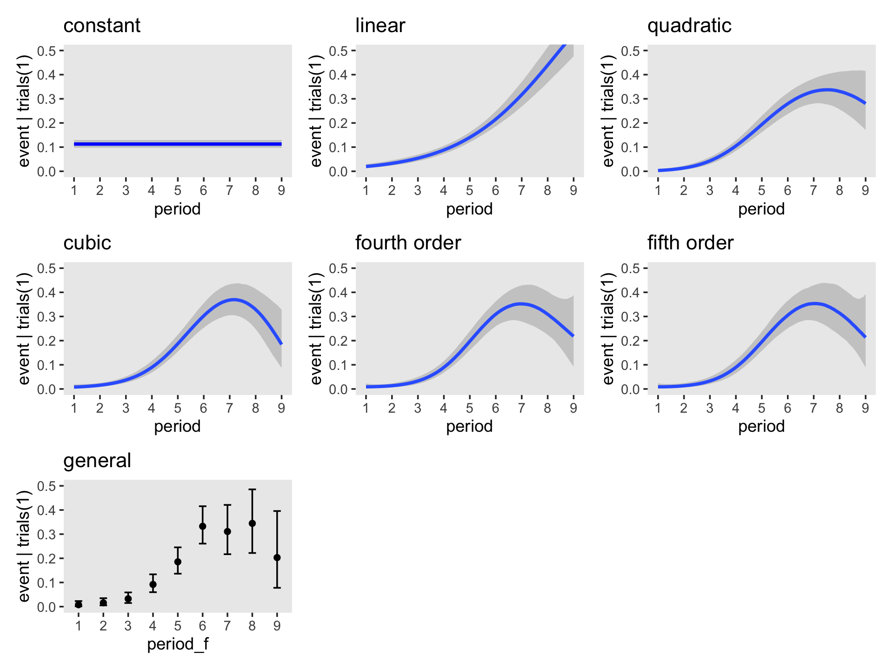

We are going to depart from Singer and Willett and no longer entertain using deviance for Bayesian model comparison. But we will compare then using the WAIC and the LOO.


```r
fit12.1 <- add_criterion(fit12.1, c("loo", "waic"))
fit12.2 <- add_criterion(fit12.2, c("loo", "waic"))
fit12.3 <- add_criterion(fit12.3, c("loo", "waic"))
fit12.4 <- add_criterion(fit12.4, c("loo", "waic"))
fit12.5 <- add_criterion(fit12.5, c("loo", "waic"))
fit12.6 <- add_criterion(fit12.6, c("loo", "waic"))
fit12.7 <- add_criterion(fit12.7, c("loo", "waic"))
fit12.8 <- add_criterion(fit12.8, c("loo", "waic"))
```

Before comparing the models in bulk, as in Table 12.2, let's confirm that whether we use the dummy variable method (`fit12.7`) or the factor variable method (`fit12.8`), the results for the general model are the same.


```r
loo_compare(fit12.7, fit12.8, criterion = "loo") %>% print(simplify = F)
```

```
##         elpd_diff se_diff elpd_loo se_elpd_loo p_loo  se_p_loo looic  se_looic
## fit12.7    0.0       0.0  -425.0     22.4         9.3    1.0    849.9   44.9  
## fit12.8    0.0       0.0  -425.0     22.4         9.3    1.0    849.9   44.9
```

```r
loo_compare(fit12.7, fit12.8, criterion = "waic") %>% print(simplify = F)
```

```
##         elpd_diff se_diff elpd_waic se_elpd_waic p_waic se_p_waic waic   se_waic
## fit12.7    0.0       0.0  -424.9      22.4          9.3    1.0     849.8   44.9 
## fit12.8    0.0       0.0  -424.9      22.4          9.3    1.0     849.8   44.9
```

Yep, both WAIC and LOO confirm both methods are equivalent. One of the main reasons we used the factor method, here, was because it made it easier to plot the results with `conditional_effects()`. But with the following model comparisons, we'll focus on `fit12.1` through `fit12.7`.


```r
loo_compare(fit12.1, fit12.2, fit12.3, fit12.4, fit12.5, fit12.6, fit12.7, criterion = "loo") %>% 
  print(simplify = F)
```

```
##         elpd_diff se_diff elpd_loo se_elpd_loo p_loo  se_p_loo looic  se_looic
## fit12.4    0.0       0.0  -420.5     22.1         3.9    0.5    841.1   44.1  
## fit12.5   -0.6       0.9  -421.2     22.2         4.7    0.6    842.4   44.3  
## fit12.3   -0.8       2.1  -421.3     22.1         3.2    0.4    842.6   44.1  
## fit12.6   -1.3       0.8  -421.8     22.2         5.4    0.7    843.6   44.5  
## fit12.7   -4.4       1.5  -425.0     22.4         9.3    1.0    849.9   44.9  
## fit12.2  -15.2       5.9  -435.7     22.1         1.9    0.1    871.4   44.1  
## fit12.1  -99.2      13.1  -519.8     25.1         1.0    0.1   1039.5   50.2
```

```r
loo_compare(fit12.1, fit12.2, fit12.3, fit12.4, fit12.5, fit12.6, fit12.7, criterion = "waic") %>% 
  print(simplify = F)
```

```
##         elpd_diff se_diff elpd_waic se_elpd_waic p_waic se_p_waic waic   se_waic
## fit12.4    0.0       0.0  -420.5      22.1          3.9    0.5     841.0   44.1 
## fit12.5   -0.6       0.9  -421.2      22.2          4.7    0.6     842.3   44.3 
## fit12.3   -0.8       2.1  -421.3      22.1          3.2    0.4     842.6   44.1 
## fit12.6   -1.3       0.8  -421.8      22.2          5.4    0.7     843.6   44.5 
## fit12.7   -4.4       1.5  -424.9      22.4          9.3    1.0     849.8   44.9 
## fit12.2  -15.2       5.9  -435.7      22.1          1.9    0.1     871.4   44.1 
## fit12.1  -99.2      13.1  -519.8      25.1          1.0    0.1    1039.5   50.2
```

Our results are very similar to those in the AIC column in Table 12.2. Just for kicks and giggles, here are the model weights based on the LOO, WAIC, and stacking method.


```r
model_weights(fit12.1, fit12.2, fit12.3, fit12.4, fit12.5, fit12.6, fit12.7, weights = "loo") %>% 
  round(digits = 3)
```

```
## fit12.1 fit12.2 fit12.3 fit12.4 fit12.5 fit12.6 fit12.7 
##   0.000   0.000   0.206   0.439   0.230   0.120   0.005
```

```r
model_weights(fit12.1, fit12.2, fit12.3, fit12.4, fit12.5, fit12.6, fit12.7, weights = "waic") %>% 
  round(digits = 3)
```

```
## fit12.1 fit12.2 fit12.3 fit12.4 fit12.5 fit12.6 fit12.7 
##   0.000   0.000   0.205   0.438   0.230   0.121   0.006
```

```r
model_weights(fit12.1, fit12.2, fit12.3, fit12.4, fit12.5, fit12.6, fit12.7, weights = "stacking") %>% 
  round(digits = 3)
```

```
## fit12.1 fit12.2 fit12.3 fit12.4 fit12.5 fit12.6 fit12.7 
##   0.017   0.000   0.405   0.578   0.000   0.000   0.000
```

Across the comparison methods, the overall pattern is the cubic model (`fit12.4`) is marginally better than the rest, but that both the quadratic and fourth-order models were quite close. Unlike when you use model deviance, the parsimony corrections used in the information-criteria-based methods all suggest the general model is overfit.

> Before considering whether these differences in [information criteria] are sufficient to warrant use of an alternative specification for *TIME*, let us examine the corresponding fitted logit hazard functions. Doing so not only highlights the behavior of logit hazard, it also offers a graphical means of comparing the fit of competing specifications. (p. 413, *emphasis* in the original)

In preparation for our Figure 12.1, we'll make a custom function called `make_fitted()`, which will streamline some of the data wrangling code.


```r
make_fitted <- function(fit, scale, ...) {
  
  fitted(fit,
         newdata = nd,
         scale = scale,
         ...) %>% 
    data.frame() %>% 
    bind_cols(nd)
  
}
```

In addition to taking different **brms** fit objects as input, `make_fitted()` will allow us to adjust the `scale` of the output. As you'll see, we will need to work with to settings in the coming plots. For our first batch of code, we'll use `scale = "linear"`. Because the `newdata` for our version of the general model (i.e., `fit12.8`) requires the predictor to be called `period_f` and the rest of the models require the predictor to be named `period`, we'll make and save the results for the former first, redefine our `newdata`, apply `make_fitted()` to the rest of the models, and then combine them all. Here it is in one fell swoop.


```r
nd <- tibble(period_f = 1:9)

f <- make_fitted(fit12.8, scale = "linear") %>% rename(period = period_f)

# this will simplify the `mutate()` code below
models <- c("constant", "linear", "quadratic", "cubic", "general")

nd <- tibble(period = 1:9)

f <-
  bind_rows(make_fitted(fit12.1, scale = "linear"),  # constant
            make_fitted(fit12.2, scale = "linear"),  # linear
            make_fitted(fit12.3, scale = "linear"),  # quadratic
            make_fitted(fit12.4, scale = "linear"),  # cubic
            f) %>%                                   # general
  mutate(model = factor(rep(models, each = 9),
                        levels = models))

# what have we done?
glimpse(f)
```

```
## Rows: 45
## Columns: 6
## $ Estimate  <dbl> -2.0628440, -2.0628440, -2.0628440, -2.0628440, -2.0628440, -2.0628440, -2.0628440, -2.06…
## $ Est.Error <dbl> 0.08140815, 0.08140815, 0.08140815, 0.08140815, 0.08140815, 0.08140815, 0.08140815, 0.081…
## $ Q2.5      <dbl> -2.22322400, -2.22322400, -2.22322400, -2.22322400, -2.22322400, -2.22322400, -2.22322400…
## $ Q97.5     <dbl> -1.90425837, -1.90425837, -1.90425837, -1.90425837, -1.90425837, -1.90425837, -1.90425837…
## $ period    <int> 1, 2, 3, 4, 5, 6, 7, 8, 9, 1, 2, 3, 4, 5, 6, 7, 8, 9, 1, 2, 3, 4, 5, 6, 7, 8, 9, 1, 2, 3,…
## $ model     <fct> constant, constant, constant, constant, constant, constant, constant, constant, constant,…
```

Now we're in good shape to make and save our version of the top panel of Figure 12.1.


```r
p1 <-
  f %>% 
  ggplot(aes(x = period, y = Estimate, color = model)) +
  geom_line() +
  scale_color_viridis_d(option = "A", direction = -1) +
  ylab("Fitted logit(hazard)") +
  coord_cartesian(ylim = -c(6, 0)) +
  theme(panel.grid = element_blank())
```

The bottom two panels require we redo our `make_fitted()` code from above, this time setting `scale = "response"`.


```r
nd <- tibble(period_f = 1:9)

f <- make_fitted(fit12.8, scale = "response") %>% rename(period = period_f)

nd <- tibble(period = 1:9)

f <-
  bind_rows(make_fitted(fit12.1, scale = "response"),  # constant
            make_fitted(fit12.2, scale = "response"),  # linear
            make_fitted(fit12.3, scale = "response"),  # quadratic
            make_fitted(fit12.4, scale = "response"),  # cubic
            f) %>%                                     # general
  mutate(model = factor(rep(models, each = 9),
                        levels = models))
```

Now make and save the bottom left panel for Figure 12.1.


```r
p2 <-
  f %>% 
  filter(model %in% c("quadratic", "general")) %>% 
  
  ggplot(aes(x = period, y = Estimate, color = model)) +
  geom_line() +
  scale_color_viridis_d(option = "A", end = .5, direction = -1) +
  ylab("Fitted hazard") +
  coord_cartesian(ylim = c(0, .4)) +
  theme(legend.position = "none",
        panel.grid = element_blank())
```

Our `f` data will also work to make the final bottom right panel for the figure, but we'll need to convert the `Estimate` values from the hazard metric to the survival-probability metric. In addition, we will need to add in values for when `period = 0`. Here we wrangle, plot, and save in one block.


```r
new_rows <-
  tibble(Estimate = 0,
         period   = 0,
         model    = factor(c("quadratic", "general"),
                           levels = models))

p3 <-
  f %>% 
  filter(model %in% c("quadratic", "general")) %>% 
  select(Estimate, period, model) %>% 
  # add the `new_rows` data
  bind_rows(new_rows) %>%
  arrange(model, period) %>%
  group_by(model) %>% 
  # convert hazards to survival probabilities
  mutate(Estimate = cumprod(1 - Estimate)) %>%
  
  # plot!
  ggplot(aes(x = period, y = Estimate, color = model)) +
  geom_hline(yintercept = .5, color = "white") +
  geom_line() +
  scale_color_viridis_d(option = "A", end = .5, direction = -1) +
  scale_y_continuous("Fitted survival probability", breaks = c(0, .5, 1)) +
  coord_cartesian(ylim = c(0, 1)) +
  theme(legend.position = "none",
        panel.grid = element_blank())
```

Now combine the subplots and format a little with **patchwork** to make our version of Figure 12.1.


```r
p1 + p2 + p3 + 
  plot_layout(guides = "collect") &
  scale_x_continuous("Years after hire", breaks = 0:9, limits = c(0, 9))
```

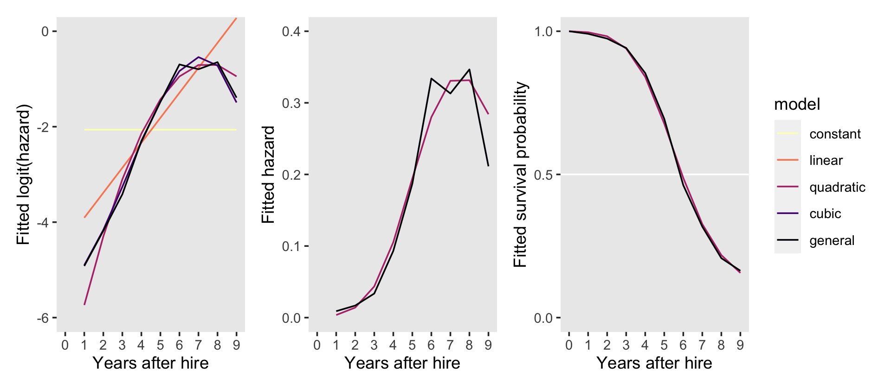

Instead of the two-row layout in the text, it seemed simpler to arrange the panels all in one row. This way we can let the full version of the line-color legend serve for all three panels.

### Criteria for comparing alternative specification.

> The decline in the deviance statistic across models indicates that fit improves with increasing complexity of the temporal specification. To evaluate the magnitude of this decline, we must also account for the increased number of parameters in the model. You should not adopt a more complex specification if it fits no better than a simpler one. But if an alternative specification is (nearly) as good as the most general one, it may be "good enough." At the same time, we would not want an alternative that performs measurably worse than we know we can do. (p. 415)

We won't be comparing deviances with $\chi^2$ tests, here. As to information criteria, we got ahead of the authors a bit and presented those comparisons in the last section. Although our use of the WAIC and the LOO is similar to Singer and Willett’s use of the AIC and BIC in that they yield no formal hypothesis test in the form of a $p$-value, their estimates and difference scores do come with standard errors.

In the middle of page 416, the authors focused on comparing the constant and linear models, the linear and quadratic models, and the quadratic and general models. The LOO and WAIC estimates for each were near identical. For the sake of simplicity, here are those three focused comparisons using the LOO.


```r
# the constant and linear models
l1 <- loo_compare(fit12.1, fit12.2, criterion = "loo")

# the linear and quadratic models
l2 <- loo_compare(fit12.2, fit12.3, criterion = "loo")

# the quadratic and general models
l3 <- loo_compare(fit12.3, fit12.7, criterion = "loo")

l1 %>% print(simplify = F)
```

```
##         elpd_diff se_diff elpd_loo se_elpd_loo p_loo  se_p_loo looic  se_looic
## fit12.2    0.0       0.0  -435.7     22.1         1.9    0.1    871.4   44.1  
## fit12.1  -84.0      11.6  -519.8     25.1         1.0    0.1   1039.5   50.2
```

```r
l2 %>% print(simplify = F)
```

```
##         elpd_diff se_diff elpd_loo se_elpd_loo p_loo  se_p_loo looic  se_looic
## fit12.3    0.0       0.0  -421.3     22.1         3.2    0.4    842.6   44.1  
## fit12.2  -14.4       5.5  -435.7     22.1         1.9    0.1    871.4   44.1
```

```r
l3 %>% print(simplify = F)
```

```
##         elpd_diff se_diff elpd_loo se_elpd_loo p_loo  se_p_loo looic  se_looic
## fit12.3    0.0       0.0  -421.3     22.1         3.2    0.4    842.6   44.1  
## fit12.7   -3.7       2.4  -425.0     22.4         9.3    1.0    849.9   44.9
```

If we presume the LOO differences follow a normal distribution, we can use their point estimates and standard errors to plot those distributions using simulated data from good old `rnorm()`.


```r
library(tidybayes)

n <- 1e6
models <- c("linear - constant", "quadratic - linear", "quadratic - general")
set.seed(12)

# wrangle
tibble(loo_difference = c(rnorm(n, mean = l1[2, 1] * -2, sd = l1[2, 2] * 2),
                          rnorm(n, mean = l2[2, 1] * -2, sd = l2[2, 2] * 2),
                          rnorm(n, mean = l3[2, 1] * -2, sd = l3[2, 2] * 2))) %>% 
  mutate(models = factor(rep(models, each = n),
                         levels = models)) %>% 
  
  # plot!
  ggplot(aes(x = loo_difference, y = 0)) +
  stat_halfeyeh(.width = c(.5, .95), normalize = "panels") +
  scale_y_continuous(NULL, breaks = NULL) +
  labs(title = "LOO-difference simulations based on 1,000,000 draws",
       x = "difference distribution") +
  theme(panel.grid = element_blank()) +
  facet_wrap(~models, scales = "free")
```

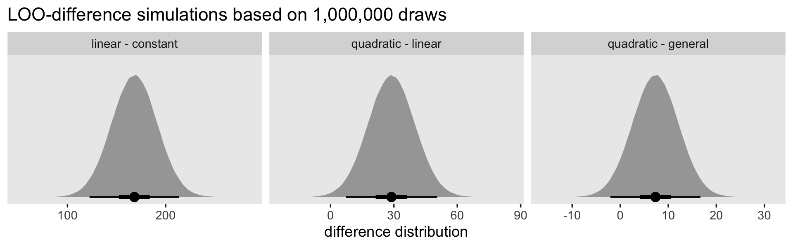

The LOO difference for the linear and constant models is decisive. The difference for the quadratic and linear models is fairly large on the information-criteria scale, but the uncertainty in that distribution is fairly large relative to its location (i.e., its mean), which might temper overly-strong conclusions about how much better the quadratic was compared to the linear. The comparison between the quadratic and the general produced a simulation with a modest location and rather large uncertainty relative to the magnitude of that location. All in all, "all signs point to the superiority of the quadratic specification, which fits nearly as well as the general mode, but with fewer parameters" (p. 416).

In the next page, Singer and Willett briefly focused on comparing the cubic and quadratic models. Here are their LOO and WAIC caparisons.


```r
loo_compare(fit12.3, fit12.4, criterion = "loo") %>% print(simplify = F)
```

```
##         elpd_diff se_diff elpd_loo se_elpd_loo p_loo  se_p_loo looic  se_looic
## fit12.4    0.0       0.0  -420.5     22.1         3.9    0.5    841.1   44.1  
## fit12.3   -0.8       2.1  -421.3     22.1         3.2    0.4    842.6   44.1
```

```r
loo_compare(fit12.3, fit12.4, criterion = "waic") %>% print(simplify = F)
```

```
##         elpd_diff se_diff elpd_waic se_elpd_waic p_waic se_p_waic waic   se_waic
## fit12.4    0.0       0.0  -420.5      22.1          3.9    0.5     841.0   44.1 
## fit12.3   -0.8       2.1  -421.3      22.1          3.2    0.4     842.6   44.1
```

In the text, the results for the AIC and BIC differed. Our LOO and WAIC results both agree with the AIC: the cubic model has a slightly lower LOO and WAIC estimate compared to the quadratic. However, the standard errors for the formal difference score are about twice the size of that difference and the absolute magnitude of the difference is rather small to begin with. Here's what it looks like if we compare them using LOO weights, WAIC weights, and stacking weights.


```r
model_weights(fit12.3, fit12.4, weights = "loo") %>% round(digits = 3)
```

```
## fit12.3 fit12.4 
##   0.319   0.681
```

```r
model_weights(fit12.3, fit12.4, weights = "waic") %>% round(digits = 3)
```

```
## fit12.3 fit12.4 
##   0.318   0.682
```

```r
model_weights(fit12.3, fit12.4, weights = "stacking") %>% round(digits = 3)
```

```
## fit12.3 fit12.4 
##   0.331   0.669
```

Across all three weight comparisons, there was a modest edge for the quadratic model. But back to Singer and Willett:

> Although decision rules cannot substitute for judgment, intuition, and common sense, we nevertheless conclude by offering two guidelines for selecting among alternative specifications:
>
> * *If a smooth specification works nearly as well as the completely general one, appreciably better than all simpler ones, and no worse than all more complex ones, consider adopting it.*
> * *If no smooth specifications meet these criteria, retain the completely general specification.*
>
> If this decision process leads you to a polynomial specification, then you can interpret the model's parameters easily, as we [will discuss in a bit]. (p. 417, *emphasis* in the original)

Before moving on, we might point out that our Bayesian **brms**-based framework offers a different option: model averaging. We plot the hazard and survival curves based on weighted averages of multiple models. The weights can be based on various criteria. One approach would be to use the model weights from the LOO or the WAIC. As an example, here we use the LOO weights for the quadratic and cubic models.


```r
nd <- tibble(period = 1:9)

pp <-
  pp_average(fit12.3, fit12.4,
             weights = "loo",
             newdata = nd,
             method = "pp_expect") %>% 
  data.frame() %>% 
  bind_cols(nd)
```

The `pp_average()` function works much like `fitted()` or `predict()`. If you input models and perhaps `newdata`, it will return estimates that are the weighted averages of the specified models. With the `weights = "loo"` argument, we indicated our desired weights were those from the LOO, just as we computed earlier with the `model_weights()` function. With the `method = "pp_expect"` argument, we indicated we wanted fitted values like we would get from `fitted()`.
Here we plot the results in terms of hazard and survival.


```r
# hazard
p1 <-
  pp %>% 
  ggplot(aes(x = period)) +
  geom_ribbon(aes(ymin = Q2.5, ymax = Q97.5),
              alpha = 1/5) +
  geom_line(aes(y = Estimate)) +
  scale_x_continuous("Years after hire", breaks = 0:9, limits = c(0, 9)) +
  ylab("hazard") +
  theme(panel.grid = element_blank())

# survival
p2 <-
  pp %>% 
  select(-Est.Error) %>% 
  bind_rows(tibble(Estimate = 0, Q2.5 = 0, Q97.5 = 0, period = 0)) %>% 
  arrange(period) %>% 
  mutate_at(vars(Estimate:Q97.5), .funs = ~ cumprod(1 - .)) %>% 
  
  ggplot(aes(x = period)) +
  geom_hline(yintercept = .5, color = "white") +
  geom_ribbon(aes(ymin = Q2.5, ymax = Q97.5),
              alpha = 1/5) +
  geom_line(aes(y = Estimate)) +
  scale_x_continuous("Years after hire", breaks = 0:9) +
  scale_y_continuous("survival", breaks = c(0, .5, 1), limits = c(0, 1)) +
  theme(panel.grid = element_blank())

# combine
(p1 | p2) + 
  plot_annotation(title = "Behold the fitted hazard and survival curves based on a weighted\naverage of the quadratic and linear models!")
```

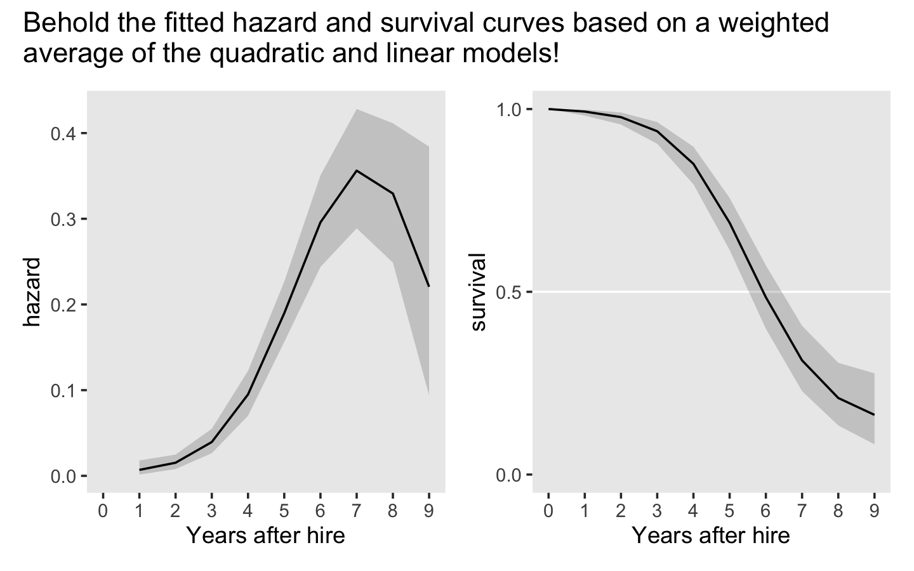

### Interpreting parameters from linear, quadratic, and cubic specifications.

"One advantage of a polynomial specification is that you can often interpret its parameters directly" (p. 417). For the polynomial models in this section, Singer and Willett used the $TIME - c$ specification for `period` where $c$ is a centering constant. They used $c = 5$. Before we can refit our polynomial models with this parameterization, we'll want to make a new `period` variable with this centering. We'll call it `period_5`.


```r
tenure_pp <-
  tenure_pp %>% 
  mutate(period_5 = period - 5)

# how do the two `period` variables compare?
tenure_pp %>% 
  distinct(period, period_5)
```

```
## # A tibble: 9 x 2
##   period period_5
##    <dbl>    <dbl>
## 1      1       -4
## 2      2       -3
## 3      3       -2
## 4      4       -1
## 5      5        0
## 6      6        1
## 7      7        2
## 8      8        3
## 9      9        4
```

Now refit the quadratic model using `period_5`.


```r
fit12.9 <-
  update(fit12.3,
         newdata = tenure_pp,
         event | trials(1) ~ 0 + Intercept + period_5 + I(period_5^2),
         chains = 4, cores = 4, iter = 2000, warmup = 1000,
         seed = 12,
         file = "fits/fit12.09")
```

Check the model summary.


```r
print(fit12.9)
```

```
##  Family: binomial 
##   Links: mu = logit 
## Formula: event | trials(1) ~ Intercept + period_5 + I(period_5^2) - 1 
##    Data: tenure_pp (Number of observations: 1474) 
## Samples: 4 chains, each with iter = 2000; warmup = 1000; thin = 1;
##          total post-warmup samples = 4000
## 
## Population-Level Effects: 
##             Estimate Est.Error l-95% CI u-95% CI Rhat Bulk_ESS Tail_ESS
## Intercept      -1.41      0.11    -1.63    -1.21 1.00     2477     2167
## period_5        0.61      0.06     0.50     0.73 1.00     2656     2283
## Iperiod_5E2    -0.13      0.03    -0.18    -0.08 1.00     2221     2022
## 
## Samples were drawn using sampling(NUTS). For each parameter, Bulk_ESS
## and Tail_ESS are effective sample size measures, and Rhat is the potential
## scale reduction factor on split chains (at convergence, Rhat = 1).
```

Focusing just on the posterior means, this yields the following formula for the quadratic discrete-time hazard model: $\operatorname{logit} \hat h (t_j) =\;$ -1.4140 $\text{one } +$ 0.6147$(\text{time}_j - 5)$ -0.1281$(\text{time}_j - 5)^2$.

Singer and Willett used the term "flipover point" for the point at which the quadratic function reaches its peak or trough. If we let $c$ be the centering constant for time variable, $\alpha_1$ be the linear coefficient for time, and $\alpha_2$ be the quadratic coefficient for time, we define the flipover point as 

$$\text{flipover point} = [c - 1/2 (\alpha_1 / \alpha_2)].$$

Here's what that looks like using the posterior samples.


```r
posterior_samples(fit12.9) %>% 
  transmute(c  = 5,
            a1 = b_period_5,
            a2 = b_Iperiod_5E2) %>% 
  mutate(`flipover point` = c - 0.5 * (a1 / a2)) %>% 
  
  ggplot(aes(x = `flipover point`, y = 0)) +
  stat_halfeyeh(.width = c(.5, .95)) +
  scale_x_continuous(breaks = 7:12) +
  scale_y_continuous(NULL, breaks = NULL) +
  theme(panel.grid = element_blank())
```

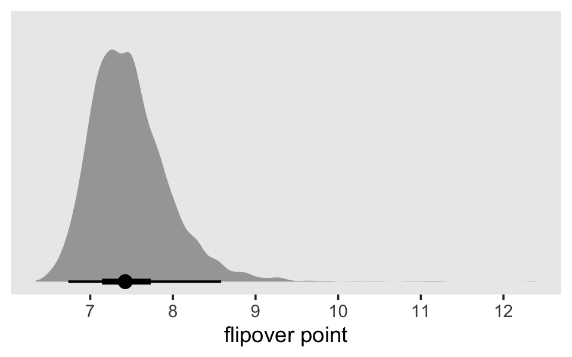

Just as each parameter has a posterior distribution, the flipover point, which is a function of two of the parameters, also has a posterior distribution. To understand what this flipover distribution means, it might be helpful to look at it in another way. For that, we'll employ `fitted()`.


```r
nd <- 
  tibble(period = seq(from = 0, to = 12, by = .1)) %>% 
  mutate(period_5 = period - 5)

f <-
  fitted(fit12.9,
         newdata = nd,
         summary = F,
         scale = "linear") %>% 
  data.frame() %>% 
  pivot_longer(everything()) %>% 
  bind_cols(expand(nd,
                   iter = 1:4000,
                   nesting(period, period_5)))

f %>% 
  glimpse()
```

```
## Rows: 484,000
## Columns: 5
## $ name     <chr> "X1", "X2", "X3", "X4", "X5", "X6", "X7", "X8", "X9", "X10", "X11", "X12", "X13", "X14", "…
## $ value    <dbl> -7.475609, -7.301111, -7.128899, -6.958974, -6.791335, -6.625982, -6.462916, -6.302136, -6…
## $ iter     <int> 1, 1, 1, 1, 1, 1, 1, 1, 1, 1, 1, 1, 1, 1, 1, 1, 1, 1, 1, 1, 1, 1, 1, 1, 1, 1, 1, 1, 1, 1, …
## $ period   <dbl> 0.0, 0.1, 0.2, 0.3, 0.4, 0.5, 0.6, 0.7, 0.8, 0.9, 1.0, 1.1, 1.2, 1.3, 1.4, 1.5, 1.6, 1.7, …
## $ period_5 <dbl> -5.0, -4.9, -4.8, -4.7, -4.6, -4.5, -4.4, -4.3, -4.2, -4.1, -4.0, -3.9, -3.8, -3.7, -3.6, …
```

Now make a logit hazard spaghetti plot.


```r
f %>% 
  # how many lines would you like?
  filter(iter <= 30) %>% 
  
  ggplot(aes(x = period, y = value, group = iter)) +
  geom_line(alpha = 1/2) +
  ylab("logit hazard") +
  coord_cartesian(xlim = c(0, 11),
                  ylim = c(-5, 0)) +
  theme(panel.grid = element_blank())
```

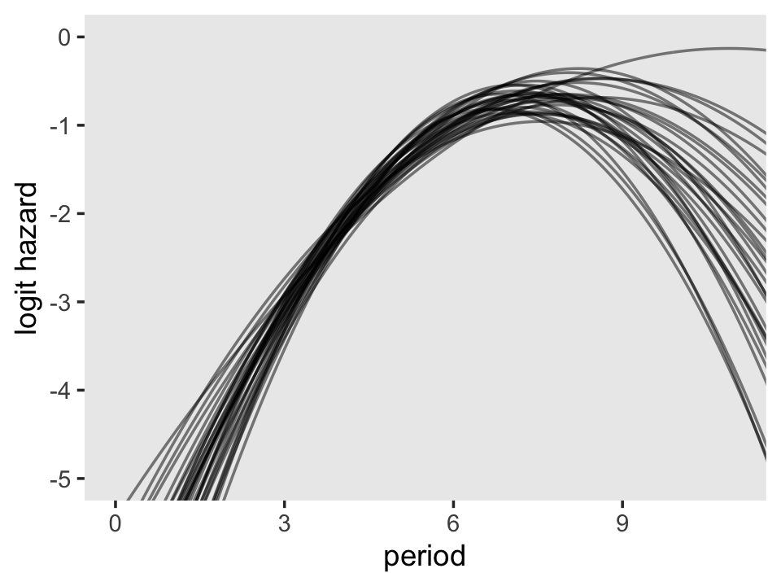

To keep the plot manageable, we filtered to just the first 30 posterior draws. Each was depicted with its own hazard line. Note how each of those hazard lines peaks at a different point along the $x$-axis. Most peak somewhere around 7.4. Some take on notably higher values.

Now fit a cubic model using `period_5`, $(TIME_j - 5)$, as the measure of time.


```r
fit12.10 <-
  update(fit12.4,
         newdata = tenure_pp,
         event | trials(1) ~ 0 + Intercept + period_5 + I(period_5^2) + I(period_5^3),
         chains = 4, cores = 4, iter = 2000, warmup = 1000,
         seed = 12,
         file = "fits/fit12.10")
```

Check the model summary.


```r
print(fit12.10)
```

```
##  Family: binomial 
##   Links: mu = logit 
## Formula: event | trials(1) ~ Intercept + period_5 + I(period_5^2) + I(period_5^3) - 1 
##    Data: tenure_pp (Number of observations: 1474) 
## Samples: 4 chains, each with iter = 2000; warmup = 1000; thin = 1;
##          total post-warmup samples = 4000
## 
## Population-Level Effects: 
##             Estimate Est.Error l-95% CI u-95% CI Rhat Bulk_ESS Tail_ESS
## Intercept      -1.45      0.11    -1.68    -1.23 1.00     2583     2293
## period_5        0.75      0.10     0.56     0.94 1.00     1647     1839
## Iperiod_5E2    -0.11      0.02    -0.17    -0.07 1.00     2362     2373
## Iperiod_5E3    -0.02      0.01    -0.04     0.00 1.00     1894     2195
## 
## Samples were drawn using sampling(NUTS). For each parameter, Bulk_ESS
## and Tail_ESS are effective sample size measures, and Rhat is the potential
## scale reduction factor on split chains (at convergence, Rhat = 1).
```

Focusing again on just the posterior means, this yields the following formula for the cubic discrete-time hazard model: $\operatorname{logit} \hat h (t_j) =\;$ -1.4510 $\text{one } +$ 0.7475$(\text{time}_j - 5)$ -0.1149$(\text{time}_j - 5)^2$ -0.0180$(\text{time}_j - 5)^3$. Now if we let $c$, $\alpha_1$ and $\alpha_2$ retain their meanings from before and further let $\alpha_3$ stand for the cubic term for time, we can define the two flipover points in the cubic logit hazard model as

$$\text{flipover points} = c + \frac{-\alpha_2 \pm \sqrt{\alpha_2^2 - 3 \alpha_1 \alpha_3}}{3 \alpha_3}.$$

Do you see that $\pm$ sign in the numerator? That’s what gives us the two points. Now apply the formula to `fit12.10` and plot.


```r
# extract the posterior draws
post <-
  posterior_samples(fit12.10) %>% 
  transmute(c  = 5,
            a1 = b_period_5,
            a2 = b_Iperiod_5E2,
            a3 = b_Iperiod_5E3)

# flipover point with "+" in the numerator
p1 <-
  post %>% 
  mutate(`flipover point 1` = c + (- a2 + sqrt(a2^2 - 3 * a1 * a3)) / (3 * a3)) %>% 
  filter(!is.na(`flipover point 1`)) %>% 
  filter(`flipover point 1` > -50 & `flipover point 1` < 50) %>% 
  
  ggplot(aes(x = `flipover point 1`, y = 0)) +
  stat_halfeyeh(.width = c(.5, .95),) +
  annotate(geom = "text",
           x = -30, y = .85,
           label = "italic(c)+frac(-alpha[2]+sqrt(alpha[2]^2-3*alpha[1]*alpha[3]), 3*alpha[3])",
           hjust = 0, family = "Times", parse = T) +
  scale_y_continuous(NULL, breaks = NULL) +
  coord_cartesian(xlim = c(-30, 20))

# flipover point with "-" in the numerator
p2 <-
  post %>% 
  mutate(`flipover point 2` = c + (- a2 - sqrt(a2^2 - 3 * a1 * a3)) / (3 * a3)) %>% 
  filter(!is.na(`flipover point 2`)) %>% 
  
  ggplot(aes(x = `flipover point 2`, y = 0)) +
  stat_halfeyeh(.width = c(.5, .95)) +
  annotate(geom = "text",
           x = 8.2, y = .85,
           label = "italic(c)+frac(-alpha[2]-sqrt(alpha[2]^2-3*alpha[1]*alpha[3]), 3*alpha[3])",
           hjust = 0, family = "Times", parse = T) +
  scale_y_continuous(NULL, breaks = NULL)

# combine!
(p1 | p2) & theme(panel.grid = element_blank())
```

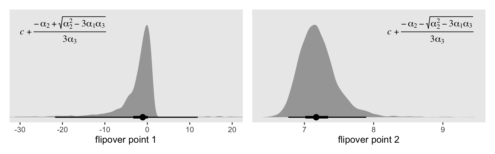

The plot on the right looks similar to the flipover plot from `fit12.9`. But look at the massive uncertainty in the flipover point in the plot on the left. If you play around with the code, you'll see the $x$-axis extends far beyond the boundaries in the plot. Another spaghetti plot might help show what's going on.


```r
# redifine the `newdata`
nd <- 
  tibble(period = seq(from = -8, to = 11, by = .1)) %>% 
  mutate(period_5 = period - 5)

# employ `fitted()` and wrangle
f <-
  fitted(fit12.10,
         newdata = nd,
         summary = F,
         scale = "linear") %>% 
  data.frame() %>% 
  pivot_longer(everything()) %>% 
  bind_cols(expand(nd,
                   iter = 1:4000,
                   nesting(period, period_5)))

# plot!
f %>% 
  filter(iter <= 30) %>% 
  ggplot(aes(x = period, y = value, group = iter)) +
  geom_line(alpha = 1/2) +
  ylab("logit hazard") +
  coord_cartesian(xlim = c(-7, 10),
                  ylim = c(-13, 0)) +
  theme(panel.grid = element_blank())
```

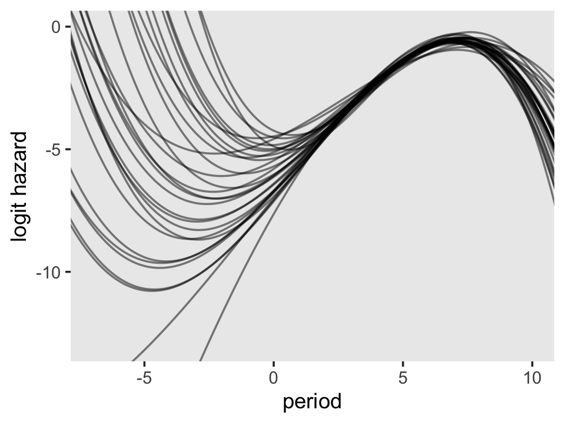

On the region to the right of 0 on the $x$-axis, the plot looks a lot like the one for the quadratic model. But look at how wildly the lines fan out on the left side of 0. Since that's the region where we find the second flipover point, all that uncertainty got baked into its marginal posterior. Just because I think it looks cool, here's a version of that plot with lines corresponding to all 4,000 posterior draws.


```r
f %>% 
  ggplot(aes(x = period, y = value, group = iter)) +
  geom_line(alpha = 1/10, size = 1/10) +
  ylab("logit hazard") +
  coord_cartesian(xlim = c(-7, 10),
                  ylim = c(-13, 0)) +
  theme(panel.grid = element_blank())
```

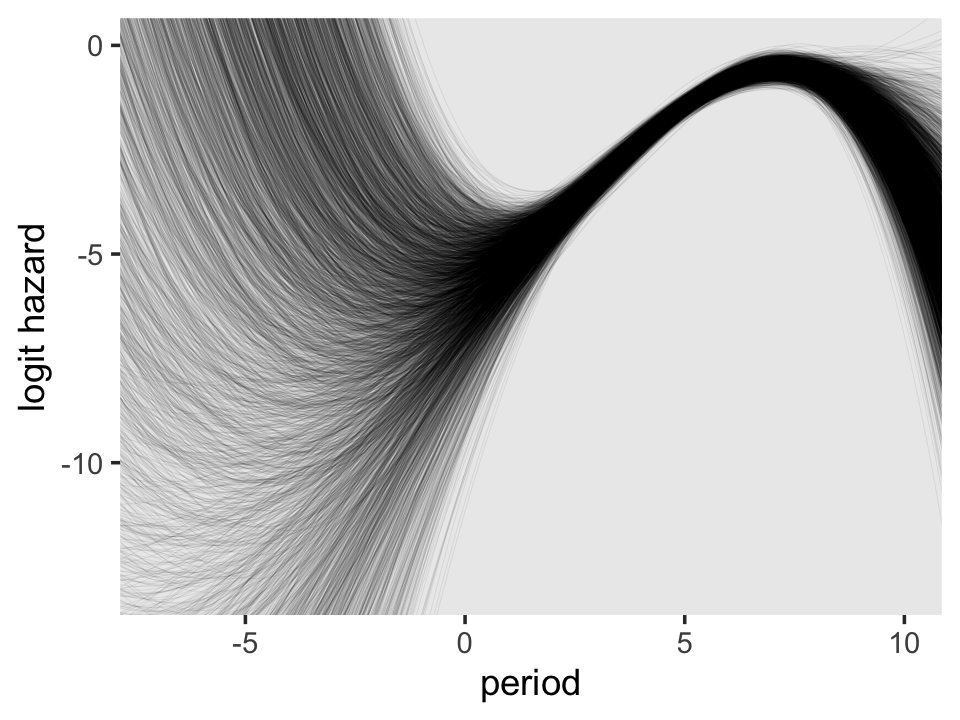

## Using the complementary log-log link to specify a discrete-time hazard model

So far we've been using the

> logit transformation [which] represented a natural choice because it allowed us to: (1) specify the model using familiar terminology; (2) use widely available software for estimation; and (3) exploit interpretative strategies with which many empirical researchers are comfortable.
>
> Just like the choice of a completely general specification for the main effect of *TIME*, use of a logit link is an analytic decision. Nothing about the way in which the model is postulated or fit requires the adoption of this, or any other, particular link function. (p. 419--420, *emphasis* in the original)

The *complimentary log-log* transformation--*clog-log* for short--is a widely-used alternative. It follows the form

$$\operatorname{clog-log} = \log \big (- \log (1 - p) \big),$$

where $p$ is a probability value. In words, "while the logit transformation yields the logarithm of the *odds of event occurrence*, the clog-log transformation yields *the logarithm of the negated logarithm of the probability of event nonoccurrence*" (p. 420, *emphasis* in the original).

### The clog-log transformation: When and why it is useful.

Here's our version of Figure 12.2, where we compare the logit and clog-log transformations.


```r
# simulate the data
tibble(p = seq(from = .00001, to = .99999, length.out = 1e4)) %>% 
  mutate(logit   = log(p / (1 - p)),
         cloglog = log(-log(1 - p))) %>% 
  pivot_longer(-p) %>% 
  mutate(name = factor(name,
                       levels = c("logit", "cloglog"),
                       labels = c("Logit", "Complementary log-log"))) %>% 
  
  # plot
  ggplot(aes(x = p, y = value, color = name)) +
  geom_hline(yintercept = 0, color = "white") +
  geom_line(size = 1) +
  scale_color_viridis_d(NULL, option = "A", end = .6) +
  scale_y_continuous("transformed hazard probability", 
                     breaks = -3:3 * 5, limits = c(-15, 15)) +
  xlab("hazard probability") +
  theme(legend.background = element_rect(fill = "grey92"),
        legend.key = element_rect(fill = "grey92", color = "grey92"),
        legend.position = c(.25, .85),
        panel.grid = element_blank())
```

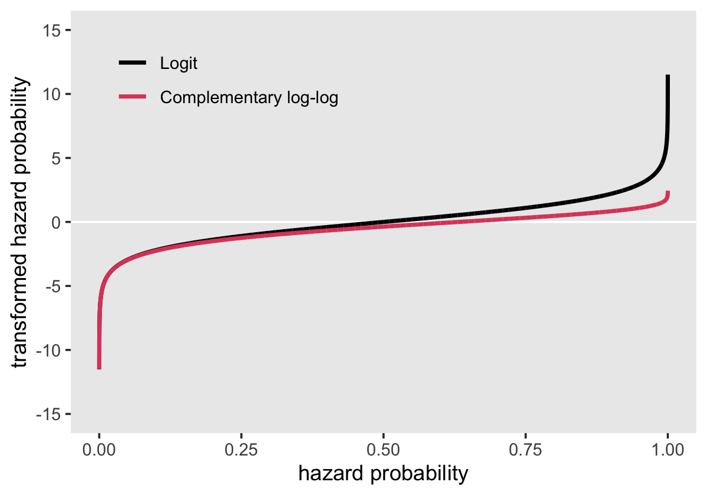

Both transformations extend to the full $-\infty$ to $\infty$ parameter space. But whereas the logit is symmetric around zero and has a memorable point corresponding to $p = .5$ (i.e., 0), the clog-log is asymmetric and has a less-intuitive point corresponding to $p = .5$ (i.e., -0.3665129). Though somewhat odd, the advantage of the clog-log is 

> it provides a discrete-time statistical model for hazard that has a built-in *proportional hazards* assumption, and not a *proportional odds* assumption (as in the case of the logit link). This would be completely unremarkable except for one thing: it provides a conceptual parallelism between the clog-log discrete-time hazard model and the models that we will ultimately describe for continuous-time survival analysis. (p. 421, *emphasis* in the original)

### A discrete-time hazard model using the complementary log-log link.

Singer and Willett (p. 422):

> Any discrete-time hazard model postulated using a logit link can be rewritten using a clog-log link, simply by substituting transformations of the outcome. For example, we can write a general discrete-time hazard model for $J$ time periods and $P$ substantive predictors as:

\begin{align*}
\operatorname{clog-log} h(t_j) & = [\alpha_1 D_1 + \alpha_2 D_2 + \cdots + \alpha_J D_J] \\
& \;\; + [\beta_1 X_1 + \beta_2 X_2 + \cdots + \beta_P X_P].
\end{align*}

Now reload the `firstsex_pp.csv` data to test this baby out.


```r
sex_pp <- read_csv("data/firstsex_pp.csv")

glimpse(sex_pp)
```

```
## Rows: 822
## Columns: 11
## $ id     <dbl> 1, 1, 1, 2, 2, 2, 2, 2, 2, 3, 3, 3, 3, 3, 3, 5, 5, 5, 5, 5, 5, 6, 6, 6, 6, 6, 7, 7, 7, 9, 9,…
## $ period <dbl> 7, 8, 9, 7, 8, 9, 10, 11, 12, 7, 8, 9, 10, 11, 12, 7, 8, 9, 10, 11, 12, 7, 8, 9, 10, 11, 7, …
## $ event  <dbl> 0, 0, 1, 0, 0, 0, 0, 0, 0, 0, 0, 0, 0, 0, 0, 0, 0, 0, 0, 0, 1, 0, 0, 0, 0, 1, 0, 0, 1, 0, 0,…
## $ d7     <dbl> 1, 0, 0, 1, 0, 0, 0, 0, 0, 1, 0, 0, 0, 0, 0, 1, 0, 0, 0, 0, 0, 1, 0, 0, 0, 0, 1, 0, 0, 1, 0,…
## $ d8     <dbl> 0, 1, 0, 0, 1, 0, 0, 0, 0, 0, 1, 0, 0, 0, 0, 0, 1, 0, 0, 0, 0, 0, 1, 0, 0, 0, 0, 1, 0, 0, 1,…
## $ d9     <dbl> 0, 0, 1, 0, 0, 1, 0, 0, 0, 0, 0, 1, 0, 0, 0, 0, 0, 1, 0, 0, 0, 0, 0, 1, 0, 0, 0, 0, 1, 0, 0,…
## $ d10    <dbl> 0, 0, 0, 0, 0, 0, 1, 0, 0, 0, 0, 0, 1, 0, 0, 0, 0, 0, 1, 0, 0, 0, 0, 0, 1, 0, 0, 0, 0, 0, 0,…
## $ d11    <dbl> 0, 0, 0, 0, 0, 0, 0, 1, 0, 0, 0, 0, 0, 1, 0, 0, 0, 0, 0, 1, 0, 0, 0, 0, 0, 1, 0, 0, 0, 0, 0,…
## $ d12    <dbl> 0, 0, 0, 0, 0, 0, 0, 0, 1, 0, 0, 0, 0, 0, 1, 0, 0, 0, 0, 0, 1, 0, 0, 0, 0, 0, 0, 0, 0, 0, 0,…
## $ pt     <dbl> 0, 0, 0, 1, 1, 1, 1, 1, 1, 0, 0, 0, 0, 0, 0, 1, 1, 1, 1, 1, 1, 0, 0, 0, 0, 0, 1, 1, 1, 0, 0,…
## $ pas    <dbl> 1.9788670, 1.9788670, 1.9788670, -0.5454916, -0.5454916, -0.5454916, -0.5454916, -0.5454916,…
```

Our next task is to recreate Figure 12.3, which shows the "sample hazard functions for the grade of first intercourse data displayed on different scales," namely the logit and clog-log (p. 423). The key word here is "sample," meaning we're not fitting full models. For our version of the corresponding figure from the last chapter (i.e., Figure 11.2 from page 363), we computed the sample logit hazard functions with life tables based on the output from the `survival::survfit()` function. I am not aware that you can get hazards in the clog-log scale from the `survfit()` function. The folks at IDRE solved the problem by fitting four maximum likelihood models using the `glm()` function (see [here](https://stats.idre.ucla.edu/r/examples/alda/r-applied-longitudinal-data-analysis-ch-12/)). We'll follow a similar approach, but with weakly-regularizing priors using the `brms::brm()` function.


```r
## logit
# pt == 0
fit12.11 <-
  brm(data = sex_pp %>% filter(pt == 0),
      family = binomial,
      event | trials(1) ~ 0 + d7 + d8 + d9 + d10 + d11 + d12,
      prior(normal(0, 4), class = b),
      chains = 4, cores = 4, iter = 2000, warmup = 1000,
      seed = 12,
      file = "fits/fit12.11")

# pt == 1
fit12.12 <-
  brm(data = sex_pp %>% filter(pt == 1),
      family = binomial,
      event | trials(1) ~ 0 + d7 + d8 + d9 + d10 + d11 + d12,
      prior(normal(0, 4), class = b),
      chains = 4, cores = 4, iter = 2000, warmup = 1000,
      seed = 12,
      file = "fits/fit12.12")

## clog-log
# pt == 0
fit12.13 <-
  brm(data = sex_pp %>% filter(pt == 0),
      family = binomial(link = cloglog),
      event | trials(1) ~ 0 + d7 + d8 + d9 + d10 + d11 + d12,
      prior(normal(0, 4), class = b),
      chains = 4, cores = 4, iter = 2000, warmup = 1000,
      seed = 12,
      file = "fits/fit12.13")

# pt == 1
fit12.14 <-
  brm(data = sex_pp %>% filter(pt == 1),
      family = binomial(link = cloglog),
      event | trials(1) ~ 0 + d7 + d8 + d9 + d10 + d11 + d12,
      prior(normal(0, 4), class = b),
      chains = 4, cores = 4, iter = 2000, warmup = 1000,
      seed = 12,
      file = "fits/fit12.14")
```

The primary line of code that distinguishes `fit12.11` and `fit12.12` from `fit12.13` and `fit12.14` is `family = binomial(link = cloglog)`. With the `family` argument, we switched out the default logit link for the clog-log link.  Before we can make our version of Figure 12.5, we will redefine our `nd` data for `fitted()`, pump our four fit objects into our custom `make_fitted()` function from earlier, and wrangle a little.


```r
nd <-
  tibble(period = 7:12) %>% 
  mutate(d7  = if_else(period == 7, 1, 0),
         d8  = if_else(period == 8, 1, 0),
         d9  = if_else(period == 9, 1, 0),
         d10 = if_else(period == 10, 1, 0),
         d11 = if_else(period == 11, 1, 0),
         d12 = if_else(period == 12, 1, 0))

f <-
  bind_rows(make_fitted(fit12.11, scale = "linear"),
            make_fitted(fit12.12, scale = "linear"),
            make_fitted(fit12.13, scale = "linear"),
            make_fitted(fit12.14, scale = "linear")) %>% 
  mutate(pt   = rep(str_c("pt = ", c(0:1, 0:1)), each = n() / 4),
         link = rep(c("logit", "clog-log"), each = n() / 2))

f %>% glimpse()
```

```
## Rows: 24
## Columns: 13
## $ Estimate  <dbl> -3.6759906, -3.6291011, -2.0585557, -1.9032077, -1.4559047, -1.4836458, -2.0077659, -2.94…
## $ Est.Error <dbl> 0.7452492, 0.7126282, 0.3684063, 0.3817483, 0.3533212, 0.4079584, 0.2966442, 0.4566804, 0…
## $ Q2.5      <dbl> -5.3798295, -5.2487341, -2.8453966, -2.7152387, -2.1943648, -2.3116730, -2.6237891, -3.92…
## $ Q97.5     <dbl> -2.43884354, -2.38763382, -1.39491123, -1.21280831, -0.79546524, -0.72122095, -1.45588706…
## $ period    <int> 7, 8, 9, 10, 11, 12, 7, 8, 9, 10, 11, 12, 7, 8, 9, 10, 11, 12, 7, 8, 9, 10, 11, 12
## $ d7        <dbl> 1, 0, 0, 0, 0, 0, 1, 0, 0, 0, 0, 0, 1, 0, 0, 0, 0, 0, 1, 0, 0, 0, 0, 0
## $ d8        <dbl> 0, 1, 0, 0, 0, 0, 0, 1, 0, 0, 0, 0, 0, 1, 0, 0, 0, 0, 0, 1, 0, 0, 0, 0
## $ d9        <dbl> 0, 0, 1, 0, 0, 0, 0, 0, 1, 0, 0, 0, 0, 0, 1, 0, 0, 0, 0, 0, 1, 0, 0, 0
## $ d10       <dbl> 0, 0, 0, 1, 0, 0, 0, 0, 0, 1, 0, 0, 0, 0, 0, 1, 0, 0, 0, 0, 0, 1, 0, 0
## $ d11       <dbl> 0, 0, 0, 0, 1, 0, 0, 0, 0, 0, 1, 0, 0, 0, 0, 0, 1, 0, 0, 0, 0, 0, 1, 0
## $ d12       <dbl> 0, 0, 0, 0, 0, 1, 0, 0, 0, 0, 0, 1, 0, 0, 0, 0, 0, 1, 0, 0, 0, 0, 0, 1
## $ pt        <chr> "pt = 0", "pt = 0", "pt = 0", "pt = 0", "pt = 0", "pt = 0", "pt = 1", "pt = 1", "pt = 1",…
## $ link      <chr> "logit", "logit", "logit", "logit", "logit", "logit", "logit", "logit", "logit", "logit",…
```

Make our version of Figure 12.3.


```r
f %>% 
  ggplot(aes(x = period, group = interaction(pt, link),
             color = pt)) +
  geom_line(aes(y = Estimate, linetype = link)) +
  scale_color_viridis_d(NULL, option = "A", end = .6) +
  scale_x_continuous("grade", breaks = 6:12, limits = c(6, 12)) +
  ylab("transformed hazard probability") +
  coord_cartesian(ylim = c(-4, 0)) +
  theme(panel.grid = element_blank())
```

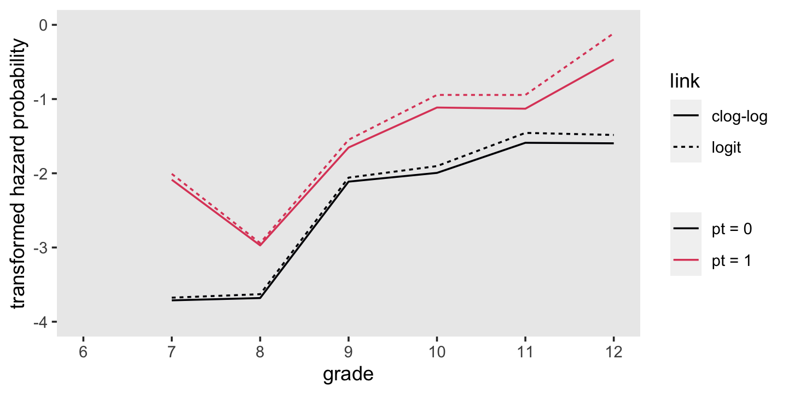

Our next step is to fit proper models to the data. First, we will refit `fit11.8` from last chapter. Then we'll fit the clog-log analogue to the same model. The two models, respectively, follow the form

\begin{align*}
\operatorname{logit} h(t_{ij}) & = [\alpha_7 D_{7ij} + \alpha_8 D_{8ij} + \cdots + \alpha_{12} D_{12ij}] + [\beta_1 \text{PT}_i ] \; \text{and} \\
\operatorname{clog-log} h(t_{ij}) & = [\alpha_7 D_{7ij} + \alpha_8 D_{8ij} + \cdots + \alpha_{12} D_{12ij}] + [\beta_1 \text{PT}_i ].
\end{align*}

Fit the models.


```r
# logit
fit11.8 <-
  brm(data = sex_pp,
      family = binomial,
      event | trials(1) ~ 0 + d7 + d8 + d9 + d10 + d11 + d12 + pt,
      prior(normal(0, 4), class = b),
      chains = 4, cores = 4, iter = 2000, warmup = 1000,
      seed = 11,
      file = "fits/fit11.08")

# clog-log
fit12.15 <-
  brm(data = sex_pp,
      family = binomial(link = cloglog),
      event | trials(1) ~ 0 + d7 + d8 + d9 + d10 + d11 + d12 + pt,
      prior(normal(0, 4), class = b),
      chains = 4, cores = 4, iter = 2000, warmup = 1000,
      seed = 12,
      file = "fits/fit12.15")
```

Both models used the binomial likelihood. They only differed in which link function we used to transform the data. To further explicate,  we can more fully write out our Bayesian clog-log model as

\begin{align*}
\text{event}_{ij} & = \operatorname{Binomial}(n = 1, p_{ij}) \\ 
\operatorname{clog-log} (p_{ij}) & =  [\alpha_7 D_{7ij} + \alpha_8 D_{8ij} + \cdots + \alpha_{12} D_{12ij}] + [\beta_1 \text{PT}_{1i} ] \\
\alpha_7, \alpha_8, ..., \alpha_{12} & \sim \operatorname{Normal}(0, 4) \\
\beta_1 & \sim \operatorname{Normal}(0, 4).
\end{align*}

Here are the posterior means for `fit11.8` and `fit12.15`, as depicted in the firs three columns of Table 12.3.


```r
pars <-
  bind_rows(fixef(fit11.8)  %>% data.frame() %>% rownames_to_column("par"),
            fixef(fit12.15) %>% data.frame() %>% rownames_to_column("par")) %>% 
  mutate(link = rep(c("logit", "clog-log"), each = n() / 2),
         par  = factor(par, levels = c(str_c("d", 7:12), "pt")))

pars %>%
  select(par, link, Estimate) %>% 
  pivot_wider(names_from = link,
              values_from = Estimate) %>% 
  select(par, `clog-log`, logit) %>% 
  mutate_if(is.double, round, digits = 4)
```

```
## # A tibble: 7 x 3
##   par   `clog-log`  logit
##   <fct>      <dbl>  <dbl>
## 1 d7        -2.97  -3.00 
## 2 d8        -3.68  -3.73 
## 3 d9        -2.32  -2.28 
## 4 d10       -1.90  -1.82 
## 5 d11       -1.77  -1.65 
## 6 d12       -1.35  -1.18 
## 7 pt         0.760  0.857
```

They might be easier to compare in a coefficient plot.


```r
pars %>% 
  ggplot(aes(x = link, y = Estimate, ymin = Q2.5, ymax = Q97.5)) +
  geom_pointrange() +
  labs(x = NULL, 
       y = "transformed hazard") +
  coord_flip() +
  theme(axis.text.y = element_text(hjust = 0),
        panel.grid = element_blank()) +
  facet_wrap(~par, ncol = 1)
```

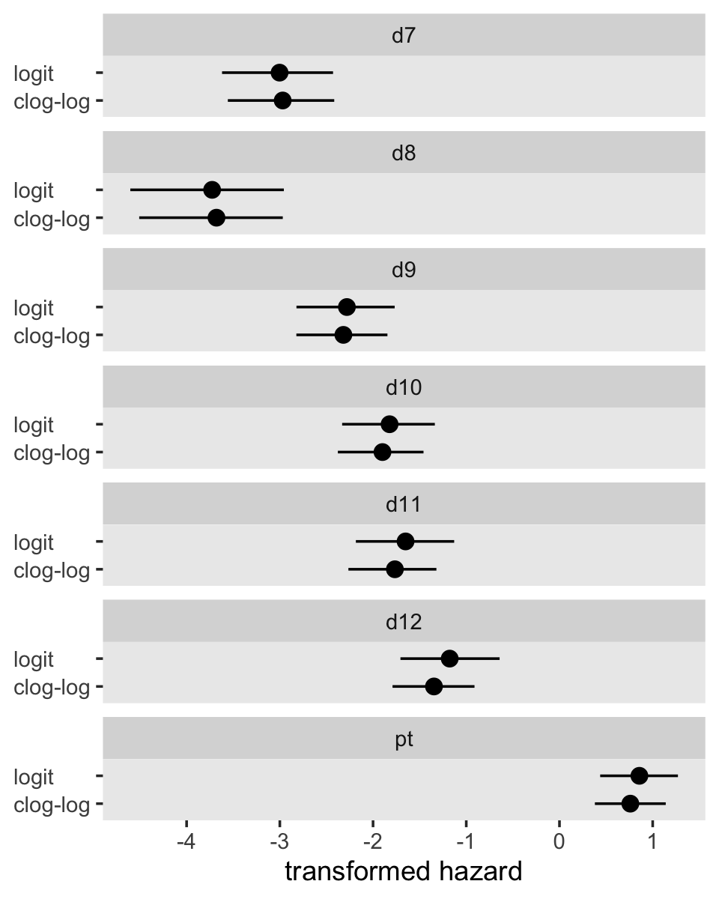

Instead of comparing them with deviances, we will compare the two models using Bayesian information criteria. For simplicity, we'll focus on the LOO.


```r
fit12.15 <- add_criterion(fit12.15, c("loo", "waic"))

loo_compare(fit12.15, fit11.8, criterion = "loo") %>% print(simplify = F)
```

```
##          elpd_diff se_diff elpd_loo se_elpd_loo p_loo  se_p_loo looic  se_looic
## fit12.15    0.0       0.0  -324.3     17.6         7.0    0.5    648.6   35.2  
## fit11.8    -0.1       0.2  -324.4     17.6         7.1    0.6    648.8   35.2
```

```r
model_weights(fit12.15, fit11.8, weights = "loo") %>% round(digits = 3)
```

```
## fit12.15  fit11.8 
##     0.53     0.47
```

From a LOO perspective, they're basically the same. The parameter summaries are also quite similar between the two models. A coefficient plot might make it easy to see. "Numerical similarity is common when fitting identical models with alternate link functions (and net risks of event occurrence are low) and suggests that choice of a link function should depend on other considerations" (p. 423).

We already know from the last chapter that we can convert logits to probabilities with the function

$$p = \frac{1}{1 + e^{- \text{logit}}}.$$

The relevant inverse transformation for the clog-log link is

$$p = 1 - e^{\Big (- e^{( \text{clog-log})} \Big)}.$$

Now use those formulas to convert our `Estimate` values into the hazard metric, as shown in the last two columns of Table 12.3.


```r
pars %>% 
  filter(par != "pt") %>% 
  mutate(Estimate = if_else(str_detect(link, "logit"),
                            1 / (1 + exp(-1 * Estimate)),
                            1 - exp(-exp(Estimate)))) %>%
  select(par, link, Estimate) %>% 
  pivot_wider(names_from = link,
              values_from = Estimate) %>% 
  select(par, `clog-log`, logit) %>% 
  mutate(`clog-log - logit` = `clog-log` - logit) %>% 
  mutate_if(is.double, round, digits = 4)
```

```
## # A tibble: 6 x 4
##   par   `clog-log`  logit `clog-log - logit`
##   <fct>      <dbl>  <dbl>              <dbl>
## 1 d7        0.05   0.0473             0.0027
## 2 d8        0.0249 0.0235             0.0014
## 3 d9        0.0938 0.0927             0.001 
## 4 d10       0.139  0.139             -0.0001
## 5 d11       0.157  0.161             -0.0037
## 6 d12       0.229  0.236             -0.0064
```

For kicks, we threw in a column of their differences. The `clog-log - logit` column highlights how

> in general, fitted hazard functions from models estimated with both link functions will be indistinguishable unless hazard is high, once again suggesting that the quality of the estimates does not provide a rationale for selecting one of these link functions over the other. (p. 424)

Now focus on the `pt` parameter for both models.

> In both cases, we antilog [i.e., exponentiate] parameter estimates, but whereas an antilogged [i.e., exponentiated] coefficient from a model with a logit link is an odds ratio, an antilogged coefficient from a model with a clog-log link is a hazard ratio. (p. 424)

Here's that in a plot.


```r
p1 <-
  posterior_samples(fit11.8) %>% 
  ggplot(aes(x = b_pt %>% exp(), y = 0)) +
  geom_halfeyeh(.width = c(.5, .95)) +
  labs(title = "fit11.8 (logit link)",
       subtitle = "Exponentiating this parameter yields an odds ratio.")

p2 <-
  posterior_samples(fit12.15) %>% 
  ggplot(aes(x = b_pt %>% exp(), y = 0)) +
  geom_halfeyeh(.width = c(.5, .95)) +
  labs(title = "fit12.15 (clog-log link)",
       subtitle = "Exponentiating this parameter yields a hazard ratio.")

(p1 | p2) &
  scale_x_continuous("b_pt (exponentiated)", limits = c(1, 5)) &
  scale_y_continuous(NULL, breaks = NULL) &
  theme(panel.grid = element_blank())
```

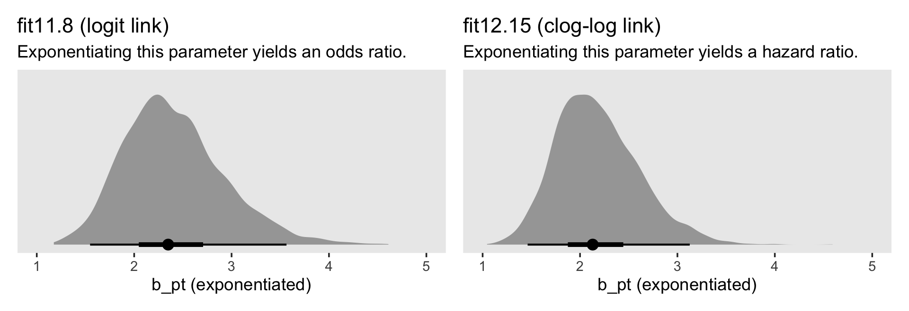

For the clog-log model, then, 

> in every grade from 7^th^ to 12^th^, we estimate the hazard of first intercourse for boys who experienced a parenting transition to be [about] 2.2 times the hazard for their peers raised with both biological parents. This interpretation contrasts with that from the model with a logit link, which suggests that the odds of first intercourse are [about] 2.4 times the *odds* for boys who experienced a parenting transition. (pp. 424--425, *emphasis* in the original)

### Choosing between logit and clog-log links for discrete-time hazard models.

> The primary advantage of the clog-log link is that in invoking a proportional hazards assumption it yields a direct analog to the continuous time hazard model.... If you believe that the underlying metric for time is truly continuous and that the only reason you observe discretized values is due to measurement difficulties, a model specified with a clog-log link has much to recommend it....
>
> [Yet,] if data are collected in truly discrete time, the clog-log specification has no particular advantage. As [Beck (1999)](https://www.oxfordscholarship.com/view/10.1093/0198292376.001.0001/acprof-9780198292371); [Beck, Katz, and Tucker (1998)](http://www-personal.umich.edu/~franzese/BeckKatzTucker.TakingTimeSeriously.AJPS1998.pdf); and [Sueyoshi (1995)](http://halweb.uc3m.es/esp/Personal/personas/mhveiga/eng/docencia_Master_archivos/2285055.pdf) argue, the proportional hazards assumption is no more sacred than the proportional odds assumption, and while consistency across models is noble, so, too, is simplicity (which decreases the chances of mistake). (p. 426)

## Time-varying predictors

"Discrete-time survival analysis adopts naturally to the inclusion of time-varying predictors. Because models are fit using a person-period data set, a time-varying predictor simply takes on its appropriate value for each person in each period" (p. 427).

### Assumptions underlying a model with time-varying predictors.

Load the depression data from [Wheaton, Rozell, and Hall (1997)](https://www.cambridge.org/core/books/stress-and-adversity-over-the-life-course/8CD7EE190B912C5C7DD0B3831C95348F).


```r
depression_pp <- 
  read_csv("data/depression_pp.csv") %>% 
  # convert the column names to lower case
  rename_all(tolower)

glimpse(depression_pp)
```

```
## Rows: 36,997
## Columns: 22
## $ id        <dbl> 1, 1, 1, 1, 1, 1, 1, 1, 1, 1, 1, 1, 1, 1, 1, 1, 1, 1, 1, 1, 1, 1, 1, 1, 1, 1, 1, 1, 1, 1,…
## $ onset     <dbl> NA, NA, NA, NA, NA, NA, NA, NA, NA, NA, NA, NA, NA, NA, NA, NA, NA, NA, NA, NA, NA, NA, N…
## $ age       <dbl> 34, 34, 34, 34, 34, 34, 34, 34, 34, 34, 34, 34, 34, 34, 34, 34, 34, 34, 34, 34, 34, 34, 3…
## $ censor    <dbl> 1, 1, 1, 1, 1, 1, 1, 1, 1, 1, 1, 1, 1, 1, 1, 1, 1, 1, 1, 1, 1, 1, 1, 1, 1, 1, 1, 1, 1, 1,…
## $ censage   <dbl> 34, 34, 34, 34, 34, 34, 34, 34, 34, 34, 34, 34, 34, 34, 34, 34, 34, 34, 34, 34, 34, 34, 3…
## $ aged      <dbl> NA, NA, NA, NA, NA, NA, NA, NA, NA, NA, NA, NA, NA, NA, NA, NA, NA, NA, NA, NA, NA, NA, N…
## $ female    <dbl> 1, 1, 1, 1, 1, 1, 1, 1, 1, 1, 1, 1, 1, 1, 1, 1, 1, 1, 1, 1, 1, 1, 1, 1, 1, 1, 1, 1, 1, 1,…
## $ nsibs     <dbl> 6, 6, 6, 6, 6, 6, 6, 6, 6, 6, 6, 6, 6, 6, 6, 6, 6, 6, 6, 6, 6, 6, 6, 6, 6, 6, 6, 6, 6, 6,…
## $ sibs12    <dbl> 0, 0, 0, 0, 0, 0, 0, 0, 0, 0, 0, 0, 0, 0, 0, 0, 0, 0, 0, 0, 0, 0, 0, 0, 0, 0, 0, 0, 0, 0,…
## $ sibs34    <dbl> 0, 0, 0, 0, 0, 0, 0, 0, 0, 0, 0, 0, 0, 0, 0, 0, 0, 0, 0, 0, 0, 0, 0, 0, 0, 0, 0, 0, 0, 0,…
## $ sibs56    <dbl> 1, 1, 1, 1, 1, 1, 1, 1, 1, 1, 1, 1, 1, 1, 1, 1, 1, 1, 1, 1, 1, 1, 1, 1, 1, 1, 1, 1, 1, 1,…
## $ sibs78    <dbl> 0, 0, 0, 0, 0, 0, 0, 0, 0, 0, 0, 0, 0, 0, 0, 0, 0, 0, 0, 0, 0, 0, 0, 0, 0, 0, 0, 0, 0, 0,…
## $ sibs9plus <dbl> 0, 0, 0, 0, 0, 0, 0, 0, 0, 0, 0, 0, 0, 0, 0, 0, 0, 0, 0, 0, 0, 0, 0, 0, 0, 0, 0, 0, 0, 0,…
## $ bigfamily <dbl> 1, 1, 1, 1, 1, 1, 1, 1, 1, 1, 1, 1, 1, 1, 1, 1, 1, 1, 1, 1, 1, 1, 1, 1, 1, 1, 1, 1, 1, 1,…
## $ period    <dbl> 4, 5, 6, 7, 8, 9, 10, 11, 12, 13, 14, 15, 16, 17, 18, 19, 20, 21, 22, 23, 24, 25, 26, 27,…
## $ event     <dbl> 0, 0, 0, 0, 0, 0, 0, 0, 0, 0, 0, 0, 0, 0, 0, 0, 0, 0, 0, 0, 0, 0, 0, 0, 0, 0, 0, 0, 0, 0,…
## $ pd        <dbl> 0, 0, 0, 0, 0, 0, 0, 0, 0, 0, 0, 0, 0, 0, 0, 0, 0, 0, 0, 0, 0, 0, 0, 0, 0, 0, 0, 0, 0, 0,…
## $ pdnow     <dbl> 0, 0, 0, 0, 0, 0, 0, 0, 0, 0, 0, 0, 0, 0, 0, 0, 0, 0, 0, 0, 0, 0, 0, 0, 0, 0, 0, 0, 0, 0,…
## $ one       <dbl> 1, 1, 1, 1, 1, 1, 1, 1, 1, 1, 1, 1, 1, 1, 1, 1, 1, 1, 1, 1, 1, 1, 1, 1, 1, 1, 1, 1, 1, 1,…
## $ age_18    <dbl> -14, -13, -12, -11, -10, -9, -8, -7, -6, -5, -4, -3, -2, -1, 0, 1, 2, 3, 4, 5, 6, 7, 8, 9…
## $ age_18sq  <dbl> 196, 169, 144, 121, 100, 81, 64, 49, 36, 25, 16, 9, 4, 1, 0, 1, 4, 9, 16, 25, 36, 49, 64,…
## $ age_18cub <dbl> -2744, -2197, -1728, -1331, -1000, -729, -512, -343, -216, -125, -64, -27, -8, -1, 0, 1, …
```

Here is the participant `age` range.


```r
range(depression_pp$age)
```

```
## [1] 17 57
```

We might count how many participants experienced a parantal divorce, `pd`, like this.


```r
depression_pp %>% 
  group_by(id) %>% 
  summarise(pd = if_else(sum(pd) > 0, 1, 0)) %>% 
  ungroup() %>% 
  count(pd) %>% 
  mutate(percent = 100 * n / sum(n))
```

```
## # A tibble: 2 x 3
##      pd     n percent
##   <dbl> <int>   <dbl>
## 1     0  1248    89.6
## 2     1   145    10.4
```

Here we fit the discrete hazard model based on a quadratic treatment of $\text{age} - 18$ with and the time-varying predictor `pd` and without/with the time-invariant predictor `female`.


```r
fit12.16 <-
  brm(data = depression_pp,
      family = binomial,
      event | trials(1) ~ 0 + Intercept + age_18 + I(age_18^2) + I(age_18^3) + pd,
      prior(normal(0, 4), class = b),
      chains = 4, cores = 4, iter = 2000, warmup = 1000,
      seed = 12,
      file = "fits/fit12.16")

fit12.17 <-
  brm(data = depression_pp,
      family = binomial,
      event | trials(1) ~ 0 + Intercept + age_18 + I(age_18^2) + I(age_18^3) + pd + female,
      prior(normal(0, 4), class = b),
      chains = 4, cores = 4, iter = 2000, warmup = 1000,
      seed = 12,
      file = "fits/fit12.17")
```

Check the summaries.


```r
print(fit12.16)
```

```
##  Family: binomial 
##   Links: mu = logit 
## Formula: event | trials(1) ~ 0 + Intercept + age_18 + I(age_18^2) + I(age_18^3) + pd 
##    Data: depression_pp (Number of observations: 36997) 
## Samples: 4 chains, each with iter = 2000; warmup = 1000; thin = 1;
##          total post-warmup samples = 4000
## 
## Population-Level Effects: 
##           Estimate Est.Error l-95% CI u-95% CI Rhat Bulk_ESS Tail_ESS
## Intercept    -4.25      0.08    -4.40    -4.10 1.00     1752     1516
## age_18        0.06      0.01     0.04     0.08 1.00     1467     1608
## Iage_18E2    -0.01      0.00    -0.01    -0.01 1.00     2573     2358
## Iage_18E3     0.00      0.00     0.00     0.00 1.00     2195     2469
## pd            0.42      0.16     0.09     0.73 1.00     1402     1354
## 
## Samples were drawn using sampling(NUTS). For each parameter, Bulk_ESS
## and Tail_ESS are effective sample size measures, and Rhat is the potential
## scale reduction factor on split chains (at convergence, Rhat = 1).
```

```r
print(fit12.17)
```

```
##  Family: binomial 
##   Links: mu = logit 
## Formula: event | trials(1) ~ 0 + Intercept + age_18 + I(age_18^2) + I(age_18^3) + pd + female 
##    Data: depression_pp (Number of observations: 36997) 
## Samples: 4 chains, each with iter = 2000; warmup = 1000; thin = 1;
##          total post-warmup samples = 4000
## 
## Population-Level Effects: 
##           Estimate Est.Error l-95% CI u-95% CI Rhat Bulk_ESS Tail_ESS
## Intercept    -4.58      0.11    -4.79    -4.38 1.00     1762     2512
## age_18        0.06      0.01     0.04     0.08 1.00     2162     2085
## Iage_18E2    -0.01      0.00    -0.01    -0.01 1.00     3435     2851
## Iage_18E3     0.00      0.00     0.00     0.00 1.00     2695     2648
## pd            0.40      0.16     0.07     0.71 1.00     1319     1178
## female        0.54      0.11     0.33     0.76 1.00     1982     2294
## 
## Samples were drawn using sampling(NUTS). For each parameter, Bulk_ESS
## and Tail_ESS are effective sample size measures, and Rhat is the potential
## scale reduction factor on split chains (at convergence, Rhat = 1).
```

Before we make our version of Figure 12.4, we'll need to make an aggregated version of the data, which will allow us to replicate the dots and plus signs. We'll use the same basic wrangling steps from when we made `sex_aggregated` from back in Chapter 11.


```r
depression_aggregated <-
  depression_pp %>% 
  mutate(event = if_else(event == 1, "event", "no_event")) %>% 
  group_by(age_18) %>% 
  count(event, pd) %>% 
  ungroup() %>% 
  complete(age_18, event, pd) %>% 
  pivot_wider(names_from = event,
              values_from = n) %>% 
  mutate(pd    = factor(str_c("pd = ", pd),
                        levels = str_c("pd = ", 1:0)),
         age   = age_18 + 18,
         total = event + no_event) %>% 
  mutate(proportion = event / total) %>% 
  mutate(logit = log(proportion / (1 - proportion)))

depression_aggregated
```

```
## # A tibble: 72 x 8
##    age_18 pd     event no_event   age total proportion logit
##     <dbl> <fct>  <int>    <int> <dbl> <int>      <dbl> <dbl>
##  1    -14 pd = 0     1     1353     4  1354   0.000739 -7.21
##  2    -14 pd = 1    NA       39     4    NA  NA        NA   
##  3    -13 pd = 0    NA     1344     5    NA  NA        NA   
##  4    -13 pd = 1    NA       48     5    NA  NA        NA   
##  5    -12 pd = 0     4     1333     6  1337   0.00299  -5.81
##  6    -12 pd = 1     1       54     6    55   0.0182   -3.99
##  7    -11 pd = 0     5     1322     7  1327   0.00377  -5.58
##  8    -11 pd = 1    NA       60     7    NA  NA        NA   
##  9    -10 pd = 0     2     1313     8  1315   0.00152  -6.49
## 10    -10 pd = 1     1       66     8    67   0.0149   -4.19
## # … with 62 more rows
```

Now make Figure 12.4.


```r
nd <- 
  crossing(age_18 = -14:21,
           pd     = 0:1) %>% 
  mutate(age = age_18 + 18)
  
# hazard (top panel)
p1 <-
  fitted(fit12.16,
         newdata = nd) %>% 
  data.frame() %>% 
  bind_cols(nd) %>% 
  mutate(pd = factor(str_c("pd = ", pd),
                     levels = str_c("pd = ", 1:0))) %>% 
  
  ggplot(aes(x = age, group = pd, color = pd)) +
  geom_line(aes(y = Estimate)) +
  geom_point(data = depression_aggregated,
             aes(y = proportion, shape = pd),
             show.legend = F) +
  scale_x_continuous(NULL, breaks = NULL, limits = c(0, 40)) +
  scale_y_continuous("proportion experiencing event", limits = c(0, 0.06))

# logit(hazard) (top panel)
p2 <-
  fitted(fit12.16,
         newdata = nd,
         scale = "linear") %>% 
  data.frame() %>% 
  bind_cols(nd) %>% 
  mutate(pd = factor(str_c("pd = ", pd),
                     levels = str_c("pd = ", 1:0))) %>% 
  
  ggplot(aes(x = age, group = pd, color = pd)) +
  geom_line(aes(y = Estimate)) +
  geom_point(data = depression_aggregated,
             aes(y = logit, shape = pd),
             show.legend = F) +
  scale_x_continuous(breaks = 0:8 * 5, limits = c(0, 40)) +
  scale_y_continuous("logit(proportion experiencing event)", limits = c(-8, -2))

# combine
(
  (p1 / p2) & 
  scale_shape_manual(values = c(3, 16)) &
  scale_color_viridis_d(NULL, option = "A", end = .6) &
  theme(panel.grid = element_blank())
) +
  plot_layout(guides = "collect")
```

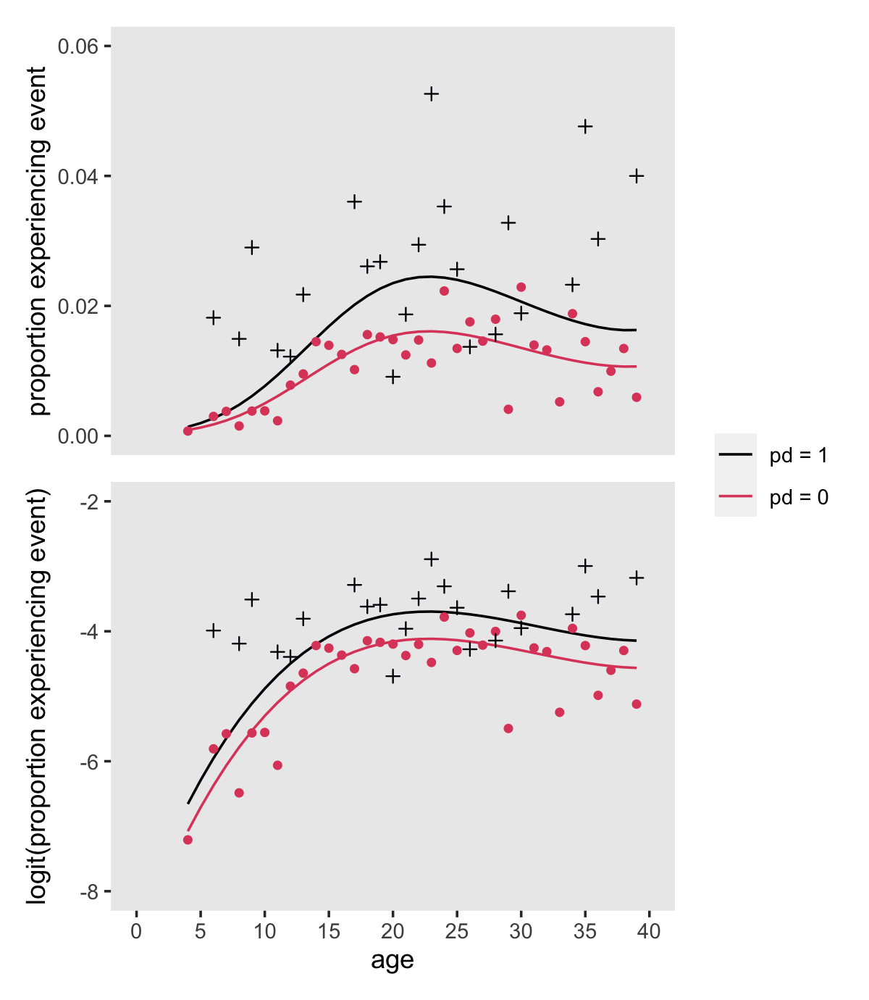

### Interpreting and displaying time-varying predictors' effects.

We jumped the gun a little, but to repeat:

> you can fit a discrete-time hazard model with time-varying predictors using exactly the same strategies presented in chapter 11. In the person-period data set, use a logistic regression routine to regress the event indicator on variables representing the main effect of *TIME* and the desired predictors. (pp. 434--435, *emphasis* in the original)

For example, here is the statistical formula we used when we fit `fit12.17`:

\begin{align*}
\text{event}_{ij}             & = \operatorname{Binomial}(n = 1, p_{ij}) \\ 
\operatorname{logit} (p_{ij}) & = [\alpha_0 + \alpha_1 (\text{age}_{ij} - 18) + \alpha_2 (\text{age}_{ij} - 18)^2 + \alpha_3 (\text{age}_{ij} - 18)^3] \\
                              & \; \; + [\beta_1 \text{pd}_{ij} + \beta_2 \text{female}_{i}] \\
\alpha_0, ..., \alpha_3       & \sim \operatorname{Normal}(0, 4) \\
\beta_1 \text{ and } \beta_2  & \sim \operatorname{Normal}(0, 4),
\end{align*}

where $\operatorname{logit} (p_{ij}) = \operatorname{logit} \hat h(t_{ij})$. If you'd like to compare our results for those displayed by Singer and Willett in Equation 12.8, here are our posterior means.


```r
fixef(fit12.17)[, 1] %>% round(digits = 4)
```

```
## Intercept    age_18 Iage_18E2 Iage_18E3        pd    female 
##   -4.5830    0.0599   -0.0075    0.0002    0.3981    0.5435
```

The values are pretty close. Though we won't compare `fit12.16` and `fit12.17` using deviances, we will use information criteria. Before you execute this code on your end, heads up! In my experience, large data sets like this often result in long computation times for Bayesian information criteria. Between the two, the LOO often takes longer. So here we’ll go with the WAIC. Even so, it took just under four hours to execute both `add_criterion()` lines. **Proceed with causion**.


```r
fit12.16 <- add_criterion(fit12.16, "waic")  # 1.833328 hours
fit12.17 <- add_criterion(fit12.17, "waic")  # 1.901613 hours

loo_compare(fit12.16, fit12.17, criterion = "waic") %>% print(simplify = F)
```

```
##          elpd_diff se_diff elpd_waic se_elpd_waic p_waic  se_p_waic waic    se_waic
## fit12.17     0.0       0.0 -2075.6      86.0          6.0     0.4    4151.3   171.9
## fit12.16   -12.1       5.0 -2087.7      86.4          5.0     0.4    4175.5   172.8
```

```r
model_weights(fit12.16, fit12.17, weights = "waic") %>% round(digits = 3)
```

```
## fit12.16 fit12.17 
##        0        1
```

Based on both the WAIC difference and the WAIC weights, `fit12.17` is the clear favorite. From that model, Here's a plot of the antilogged (i.e., exponentiated) posteriors for `pd` and `female`, which yields their odds ratios.


```r
posterior_samples(fit12.17) %>% 
  pivot_longer(b_pd:b_female) %>% 
  mutate(`odds ratio` = exp(value)) %>% 
  
  ggplot(aes(x = `odds ratio`, y = name)) +
  geom_halfeyeh(.width = c(.5, .95), normalize = "xy") +
  ylab(NULL) +
  coord_cartesian(ylim = c(1.4, 2.4)) +
  theme(panel.grid = element_blank())
```

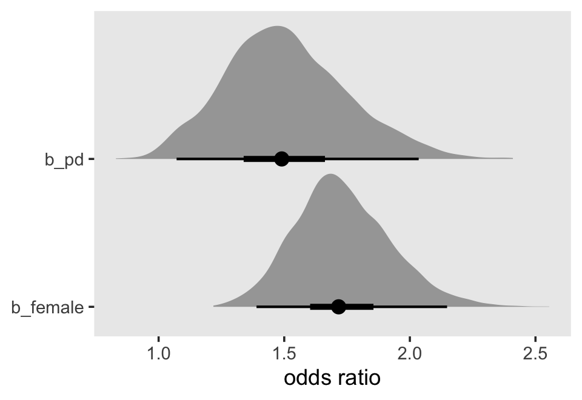

Here is our version of Figure 12.5.


```r
nd <- 
  crossing(female = 0:1,
           pd     = 0:1) %>% 
  expand(nesting(female, pd),
         age_18 = -14:21) %>% 
  mutate(age = age_18 + 18)
  
f <-
  fitted(fit12.17,
         newdata = nd) %>% 
  data.frame() %>% 
  bind_cols(nd) %>% 
  mutate(sex = if_else(female == 0, "male", "female"),
         pd  = factor(str_c("pd = ", pd),
                      levels = str_c("pd = ", 1:0))) 

# hazard (top panel)
p1 <-
  f %>% 
  ggplot(aes(x = age, group = pd, color = pd, fill = pd)) +
  geom_ribbon(aes(ymin = Q2.5, ymax = Q97.5),
              alpha = 1/5, size = 0) +
  geom_line(aes(y = Estimate)) +
  scale_x_continuous(NULL, breaks = NULL, limits = c(0, 40)) +
  scale_y_continuous("fitted hazard", limits = c(0, 0.04))

# survival (bottom panel)
p2 <-
  f %>%
  group_by(sex, pd) %>% 
  mutate_at(vars(Estimate, Q2.5, Q97.5), .funs = ~cumprod(1 - .)) %>% 
  
  ggplot(aes(x = age, group = pd, color = pd, fill = pd)) +
  geom_hline(yintercept = .5, color = "white") +
  geom_ribbon(aes(ymin = Q2.5, ymax = Q97.5),
              alpha = 1/5, size = 0) +
  geom_line(aes(y = Estimate)) +
  scale_x_continuous(breaks = 0:8 * 5, limits = c(0, 40)) +
  scale_y_continuous("fitted survival probability", limits = c(0, 1)) +
  theme(strip.background.x = element_blank(),
        strip.text.x = element_blank())

# combine
(
  (p1 / p2) & 
  scale_fill_viridis_d(NULL, option = "A", end = .6) &
  scale_color_viridis_d(NULL, option = "A", end = .6) &
  theme(panel.grid = element_blank()) &
  facet_wrap(~sex)
) +
  plot_layout(guides = "collect")
```

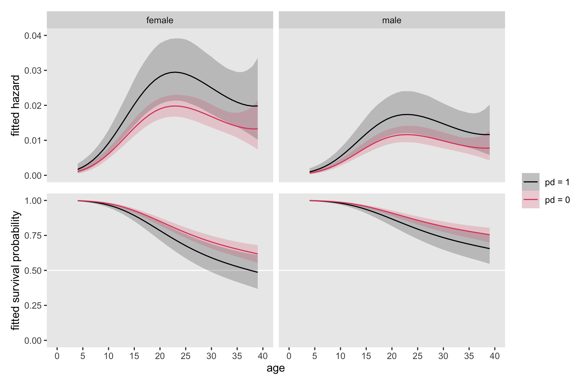

Note how with this many `age` levels, our discrete-time models are beginning to look like continuous-time models.

### Two caveats: The problems of state and rate dependence.

> A time-varying predictor is *state-dependent* if its values at time $t_j$ are affected by an individual's *state* (event occurrence status) at time $t_j$: $EVENT_{ij}$. A time-varying predictor is *rate-dependent* if its values at time $t_j$ are affected by the individuals value of *hazard* (the "rate") at time $t_j$: $h (t_{ij})$. (p. 440, *emphasis* in the original)

## The linear additivity assumption: Uncovering violations and simple solutions

> Because the focus on hazard causes you to analyze group level summaries, model violations can be more difficult to discern [than in other kinds of regression models]. We therefore devote this section to introducing practical strategies for diagnosing and correcting violations of the linear additivity assumption. (p. 443)

### Interactions between substantive predictors.

> We do not advocate fishing expeditions. Open searches for interactions can be counterproductive, leading to the discovery of many "effects" that are little more than sampling variation. But there *are* at least two circumstances when a guided search for interactions is crucial:
>
> * *When theory (or common sense!) suggests that two (or more) predictors will interact in the prediction of the outcome*. If you hypothesize the existence of interactions a priori, your search will be targeted and efficient.
> * *When examining the effects of "question" predictor(s), variables whose effects you intend to emphasize in your report*. You need to be certain that these predictors' effects do not differ according ot levels of other important predictors, lest you misinterpret your major findings.
>
> With this in mind, we now demonstrate how to (1) explore your data for the possibility of statistical interactions; and (2) include the additional appropriate terms when necessary. (p. 444, *emphasis* in the original)

Load the  data from Keiley and Martin (2002)[^2].


```r
firstarrest_pp <- 
  read_csv("data/firstarrest_pp.csv") %>% 
  # convert the column names to lower case
  rename_all(tolower)

glimpse(firstarrest_pp)
```

```
## Rows: 15,834
## Columns: 19
## $ id     <dbl> 1, 1, 1, 1, 1, 1, 1, 1, 2, 2, 2, 2, 2, 2, 2, 2, 2, 2, 2, 3, 3, 3, 3, 3, 3, 3, 3, 3, 3, 4, 4,…
## $ time   <dbl> 15, 15, 15, 15, 15, 15, 15, 15, 29, 29, 29, 29, 29, 29, 29, 29, 29, 29, 29, 17, 17, 17, 17, …
## $ censor <dbl> 0, 0, 0, 0, 0, 0, 0, 0, 1, 1, 1, 1, 1, 1, 1, 1, 1, 1, 1, 0, 0, 0, 0, 0, 0, 0, 0, 0, 0, 1, 1,…
## $ abused <dbl> 0, 0, 0, 0, 0, 0, 0, 0, 1, 1, 1, 1, 1, 1, 1, 1, 1, 1, 1, 0, 0, 0, 0, 0, 0, 0, 0, 0, 0, 1, 1,…
## $ black  <dbl> 0, 0, 0, 0, 0, 0, 0, 0, 0, 0, 0, 0, 0, 0, 0, 0, 0, 0, 0, 0, 0, 0, 0, 0, 0, 0, 0, 0, 0, 0, 0,…
## $ ablack <dbl> 0, 0, 0, 0, 0, 0, 0, 0, 0, 0, 0, 0, 0, 0, 0, 0, 0, 0, 0, 0, 0, 0, 0, 0, 0, 0, 0, 0, 0, 0, 0,…
## $ d8     <dbl> 1, 0, 0, 0, 0, 0, 0, 0, 1, 0, 0, 0, 0, 0, 0, 0, 0, 0, 0, 1, 0, 0, 0, 0, 0, 0, 0, 0, 0, 1, 0,…
## $ d9     <dbl> 0, 1, 0, 0, 0, 0, 0, 0, 0, 1, 0, 0, 0, 0, 0, 0, 0, 0, 0, 0, 1, 0, 0, 0, 0, 0, 0, 0, 0, 0, 1,…
## $ d10    <dbl> 0, 0, 1, 0, 0, 0, 0, 0, 0, 0, 1, 0, 0, 0, 0, 0, 0, 0, 0, 0, 0, 1, 0, 0, 0, 0, 0, 0, 0, 0, 0,…
## $ d11    <dbl> 0, 0, 0, 1, 0, 0, 0, 0, 0, 0, 0, 1, 0, 0, 0, 0, 0, 0, 0, 0, 0, 0, 1, 0, 0, 0, 0, 0, 0, 0, 0,…
## $ d12    <dbl> 0, 0, 0, 0, 1, 0, 0, 0, 0, 0, 0, 0, 1, 0, 0, 0, 0, 0, 0, 0, 0, 0, 0, 1, 0, 0, 0, 0, 0, 0, 0,…
## $ d13    <dbl> 0, 0, 0, 0, 0, 1, 0, 0, 0, 0, 0, 0, 0, 1, 0, 0, 0, 0, 0, 0, 0, 0, 0, 0, 1, 0, 0, 0, 0, 0, 0,…
## $ d14    <dbl> 0, 0, 0, 0, 0, 0, 1, 0, 0, 0, 0, 0, 0, 0, 1, 0, 0, 0, 0, 0, 0, 0, 0, 0, 0, 1, 0, 0, 0, 0, 0,…
## $ d15    <dbl> 0, 0, 0, 0, 0, 0, 0, 1, 0, 0, 0, 0, 0, 0, 0, 1, 0, 0, 0, 0, 0, 0, 0, 0, 0, 0, 1, 0, 0, 0, 0,…
## $ d16    <dbl> 0, 0, 0, 0, 0, 0, 0, 0, 0, 0, 0, 0, 0, 0, 0, 0, 1, 0, 0, 0, 0, 0, 0, 0, 0, 0, 0, 1, 0, 0, 0,…
## $ d17    <dbl> 0, 0, 0, 0, 0, 0, 0, 0, 0, 0, 0, 0, 0, 0, 0, 0, 0, 1, 0, 0, 0, 0, 0, 0, 0, 0, 0, 0, 1, 0, 0,…
## $ d18    <dbl> 0, 0, 0, 0, 0, 0, 0, 0, 0, 0, 0, 0, 0, 0, 0, 0, 0, 0, 1, 0, 0, 0, 0, 0, 0, 0, 0, 0, 0, 0, 0,…
## $ period <dbl> 8, 9, 10, 11, 12, 13, 14, 15, 8, 9, 10, 11, 12, 13, 14, 15, 16, 17, 18, 8, 9, 10, 11, 12, 13…
## $ event  <dbl> 0, 0, 0, 0, 0, 0, 0, 1, 0, 0, 0, 0, 0, 0, 0, 0, 0, 0, 0, 0, 0, 0, 0, 0, 0, 0, 0, 0, 1, 0, 0,…
```

The total $N$ is 1553.


```r
firstarrest_pp %>% 
  distinct(id) %>% 
  count()
```

```
## # A tibble: 1 x 1
##       n
##   <int>
## 1  1553
```

$n = 887$ were abused.


```r
firstarrest_pp %>% 
  filter(abused == 1) %>% 
  distinct(id) %>% 
  count()
```

```
## # A tibble: 1 x 1
##       n
##   <int>
## 1   887
```

$n = 342$ were arrested between the ages of 8 and 18.


```r
firstarrest_pp %>% 
  filter(censor == 0) %>% 
  distinct(id) %>% 
  count()
```

```
## # A tibble: 1 x 1
##       n
##   <int>
## 1   342
```

Since the two focal predictors in this section with be `black` and `abused`, here are the counts broken down by both.


```r
firstarrest_pp %>% 
  group_by(id) %>% 
  slice(1) %>% 
  ungroup() %>% 
  count(black, abused) %>% 
  mutate(percent = 100 * n / sum(n))
```

```
## # A tibble: 4 x 4
##   black abused     n percent
##   <dbl>  <dbl> <int>   <dbl>
## 1     0      0   434    27.9
## 2     0      1   605    39.0
## 3     1      0   232    14.9
## 4     1      1   282    18.2
```

Here's how to hand compute the values for the sample logit(hazard) functions depicted in the top panels of Figure 12.6.


```r
# wrangle
firstarrest_pp %>% 
  mutate(event = if_else(event == 1, "event", "no_event")) %>% 
  group_by(period)  %>% 
  count(event, black, abused) %>% 
  ungroup() %>% 
  pivot_wider(names_from = event,
              values_from = n) %>% 
  drop_na(event) %>% 
  mutate(total  = event + no_event,
         logit  = log(event / total / (1 - event / total)),
         race   = factor(ifelse(black == 1, "Black", "White"),
                         levels = c("White", "Black")),
         abused = ifelse(abused == 1, "abused", "not abused") %>% factor()) %>% 
  
  # plot!
  ggplot(aes(x = period, y = logit)) +
  geom_line(aes(color = abused, group = abused)) +
  scale_color_viridis_d(NULL, option = "A", end = .6, direction = -1) +
  scale_x_continuous("age", breaks = 7:19, limits = c(7, 19)) +
  scale_y_continuous("sample logit(hazard)", limits = c(-7, -2)) +
  theme(panel.grid = element_blank()) +
  facet_wrap(~race)
```

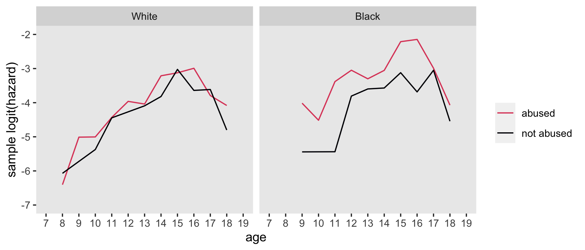


For kicks and giggles, it might informative to fit a series of subset Bayesian models to make similar versions of those sample hazard functions. Before we fit the models, let's make our lives easier and make a factor version of our time variable, `period`.


```r
firstarrest_pp <-
  firstarrest_pp %>% 
  mutate(period_f = factor(period))
```

Fit the four subset models.


```r
# white, not abused
fit12.18 <-
  brm(data = firstarrest_pp %>% filter(black == 0 & abused == 0),
      family = binomial,
      event | trials(1) ~ 0 + period_f,
      prior(normal(0, 4), class = b),
      chains = 4, cores = 4, iter = 2000, warmup = 1000,
      seed = 12,
      file = "fits/fit12.18")

# white, abused
fit12.19 <-
  update(fit12.18,
         newdata = firstarrest_pp %>% filter(black == 0 & abused == 1),
         chains = 4, cores = 4, iter = 2000, warmup = 1000,
         seed = 12,
         file = "fits/fit12.19")

# black, not abused
fit12.20 <-
  update(fit12.18,
         newdata = firstarrest_pp %>% filter(black == 1 & abused == 0),
         chains = 4, cores = 4, iter = 2000, warmup = 1000,
         seed = 12,
         file = "fits/fit12.20")

# black, abused
fit12.21 <-
  update(fit12.18,
         newdata = firstarrest_pp %>% filter(black == 1 & abused == 1),
         chains = 4, cores = 4, iter = 2000, warmup = 1000,
         seed = 12,
         file = "fits/fit12.21")
```

We might use `fitted()` via our custom `make_fitted()` function to perform some of the pre-plotting computation and wrangling.


```r
nd <- tibble(period_f = 8:18)

# this will simplify the `mutate()` code below
models <- c("constant", "linear", "quadratic", "cubic", "general")

f <-
  bind_rows(make_fitted(fit12.18, scale = "linear"),      # white, not abused
            make_fitted(fit12.19, scale = "linear"),      # white, abused
            make_fitted(fit12.20, scale = "linear"),      # black, not abused
            make_fitted(fit12.21, scale = "linear")) %>%  # black, abused
  mutate(race  = factor(rep(c("White", "Black"), each = n() / 2),
                        levels = c("White", "Black")),
         abuse = rep(c("not abused", "abused", "not abused", "abused"), each = n() / 4))

# what have we done?
glimpse(f)
```

```
## Rows: 44
## Columns: 7
## $ Estimate  <dbl> -6.128145, -7.755830, -5.423982, -4.486341, -7.810388, -4.115688, -3.844492, -3.036432, -…
## $ Est.Error <dbl> 0.9680716, 1.7239523, 0.7002682, 0.4659827, 1.8007659, 0.3791418, 0.3375237, 0.2284309, 0…
## $ Q2.5      <dbl> -8.365665, -11.947351, -6.983962, -5.506780, -12.087179, -4.930636, -4.552779, -3.508916,…
## $ Q97.5     <dbl> -4.586103, -5.231566, -4.234613, -3.673362, -5.144784, -3.418779, -3.236886, -2.615172, -…
## $ period_f  <int> 8, 9, 10, 11, 12, 13, 14, 15, 16, 17, 18, 8, 9, 10, 11, 12, 13, 14, 15, 16, 17, 18, 8, 9,…
## $ race      <fct> White, White, White, White, White, White, White, White, White, White, White, White, White…
## $ abuse     <chr> "not abused", "not abused", "not abused", "not abused", "not abused", "not abused", "not …
```

Now plot.


```r
f %>% 
  ggplot(aes(x = period_f, y = Estimate, group = abuse, color = abuse)) +
  geom_line() +
  scale_color_viridis_d(NULL, option = "A", end = .6, direction = -1) +
  scale_x_continuous("age", breaks = 7:19, limits = c(7, 19)) +
  ylab("sample logit(hazard)") +
  theme(panel.grid = element_blank()) +
  facet_wrap(~race)
```

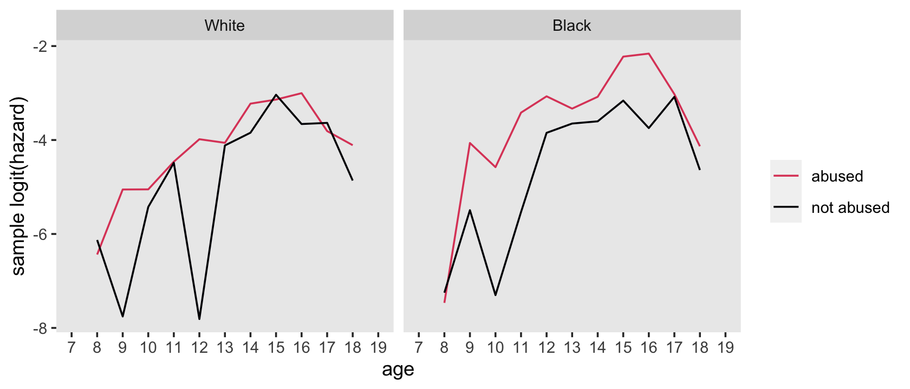

Notice how this looks different from the version of the plot, above, in that there are five points with very low values on the $y$-axis. Did you notice the `drop_na(event)` line in the code when we computed the sample logit(hazard) values by hand? Those points with missing values in the data are what caused those very low log(hazard) estimates in the models. Next we'll fit the primary statistical models with both `black` and `abused`, without and with their interaction term, based on the full data set. You'll see that when we use all cases, those odd low logit(hazard) values go away.


```r
fit12.22 <-
  brm(data = firstarrest_pp,
      family = binomial,
      event | trials(1) ~ 0 + d8 + d9 + d10  + d11  + d12  + d13  + d14  + d15  + d16  + d17  + d18 + abused + black,
      prior(normal(0, 4), class = b),
      chains = 4, cores = 4, iter = 2000, warmup = 1000,
      seed = 12,
      file = "fits/fit12.22")

fit12.23 <-
  update(fit12.22,
         newdata = firstarrest_pp,
         event | trials(1) ~ 0 + d8 + d9 + d10  + d11  + d12  + d13  + d14  + d15  + d16  + d17  + d18 + abused + black + abused:black,
         chains = 4, cores = 4, iter = 2000, warmup = 1000,
         seed = 12,
         file = "fits/fit12.23")
```

Let's compare the models with information criteria. Not unlike with `fit12.16` and `fit12.17`, these are big models for a big data set and it took about an hour on my 2012-era laptop to return the WAIC. The LOO would likely have taken longer. Proceed with caution.


```r
fit12.22 <- add_criterion(fit12.22, "waic")  # 48.72123 mins
fit12.23 <- add_criterion(fit12.23, "waic")  # 13.57897 mins

loo_compare(fit12.22, fit12.23, criterion = "waic") %>% print(simplify = F)
```

```
##          elpd_diff se_diff elpd_waic se_elpd_waic p_waic  se_p_waic waic    se_waic
## fit12.23     0.0       0.0 -1538.9      65.4         14.1     1.1    3077.8   130.7
## fit12.22    -0.8       2.2 -1539.7      65.3         12.9     1.0    3079.4   130.6
```

```r
model_weights(fit12.22, fit12.23, weights = "waic") %>% round(digits = 3)
```

```
## fit12.22 fit12.23 
##    0.314    0.686
```

Our results diverge a bit from those in the text. For the deviance test on page 446, Singer and Willett reported a difference of $4.05 \; (p < .05, df = 1)$ in favor of the full model (i.e., `fit12.23`). Though both our WAIC difference score and the WAIC weights favor `fit12.23`, it's by a hair.

"As in linear (or logistic) regression, we interpret interaction effects by simultaneously considering *all* the constituent parameters, for the cross-product term and its main-effect components" (p. 446, *emphasis* in the original). Rather than the point-estimate table Singer and Willett displayed at the bottom of the page, we'll present the full posterior distributions odds ratios in a faceted plot.


```r
posterior_samples(fit12.23) %>% 
  mutate(iter = 1:n()) %>% 
  expand(nesting(iter, b_abused, b_black, `b_abused:black`),
         abused = 0:1,
         black  = 0:1) %>% 
  mutate(`odds ratio` = exp(b_abused * abused + b_black * black  + `b_abused:black` * abused * black),
         abused       = str_c("abused = ", abused),
         black        = str_c("black = ", black)) %>% 
  
  ggplot(aes(x = `odds ratio`, y = 0)) +
  geom_halfeyeh(.width = .95, normalize = "panels") +
  scale_y_continuous(NULL, breaks = NULL) +
  theme(panel.grid = element_blank()) +
  facet_grid(abused~black)
```

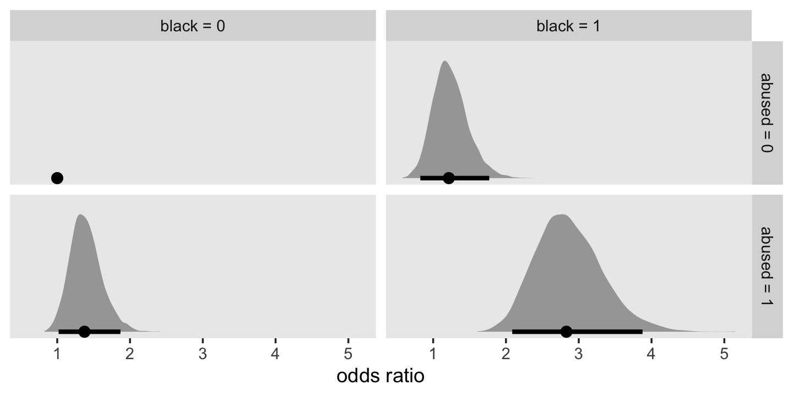

Here's our version of the lower panel of Figure 12.6.


```r
# define the `newdata`
nd <-
  firstarrest_pp %>% 
  distinct(abused, black, d8, d9, d10, d11, d12, d13, d14, d15, d16, d17, d18, period)

# use `fitted()` and wrangle
make_fitted(fit12.23,
            scale = "linear") %>% 
  bind_cols(nd) %>% 
  mutate(abused = ifelse(abused == 1, "abused", "not abused") %>% factor(),
         sex    = factor(ifelse(black == 1, "Black", "White"),
                         levels = c("White", "Black"))) %>% 
  
  # plot!
  ggplot(aes(x = period, y = Estimate, ymin = Q2.5, ymax = Q97.5,
             fill = abused, color = abused)) +
  geom_ribbon(alpha = 1/5, size = 0) +
  geom_line() +
  scale_fill_viridis_d(NULL, option = "A", end = .6, direction = -1) +
  scale_color_viridis_d(NULL, option = "A", end = .6, direction = -1) +
  scale_x_continuous("age", breaks = 7:19, limits = c(7, 19)) +
  ylab("fitted logit(hazard)") +
  coord_cartesian(ylim = c(-8, -2)) +
  theme(panel.grid = element_blank()) +
  facet_wrap(~sex)
```

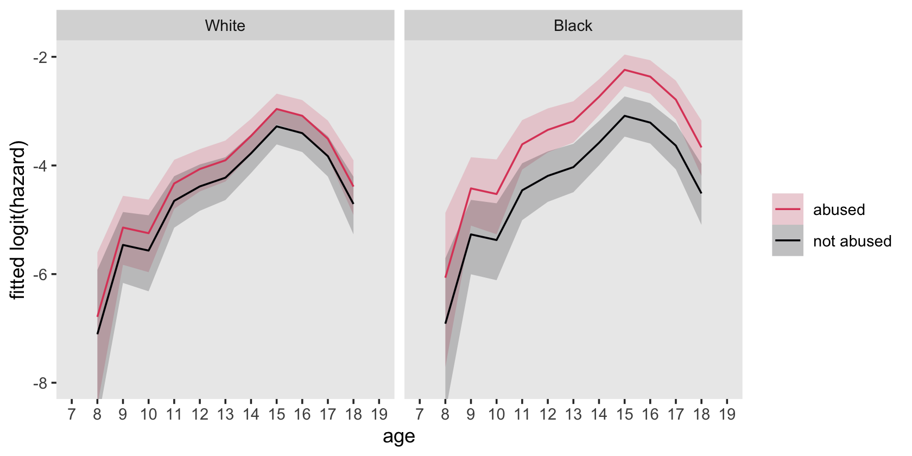

### Nonlinear effects.

> There are two general strategies for exploring the linearity assumption. The simplest approach--although somewhat limited--is to fit additional models, replacing the raw predictor with a re-expressed version. Although the additional models also invoke a linearity constraint, use of re-expressed predictors guarantees that the effects represent nonlinear relationships for the *raw* predictors. The ladder of power (section 6.2.1) provides a dizzying array of options. The second approach is to categorize each continuous variable into a small number of groups, create a series of dummy variables representing group membership, and visually examine the *pattern of parameter estimates for consecutive dummies* to deduce the appropriate functional form. If the pattern is linear, retain the predictor in its raw state; if not, explore an alternative specification. 
>
> As the first approach is straightforward, we illustrate the second, using the depression onset data presented in section 12.3. (pp. 447--448, *emphasis* in the original)

Here's another look at those `depression_pp` data.


```r
depression_pp %>% 
  glimpse()
```

```
## Rows: 36,997
## Columns: 22
## $ id        <dbl> 1, 1, 1, 1, 1, 1, 1, 1, 1, 1, 1, 1, 1, 1, 1, 1, 1, 1, 1, 1, 1, 1, 1, 1, 1, 1, 1, 1, 1, 1,…
## $ onset     <dbl> NA, NA, NA, NA, NA, NA, NA, NA, NA, NA, NA, NA, NA, NA, NA, NA, NA, NA, NA, NA, NA, NA, N…
## $ age       <dbl> 34, 34, 34, 34, 34, 34, 34, 34, 34, 34, 34, 34, 34, 34, 34, 34, 34, 34, 34, 34, 34, 34, 3…
## $ censor    <dbl> 1, 1, 1, 1, 1, 1, 1, 1, 1, 1, 1, 1, 1, 1, 1, 1, 1, 1, 1, 1, 1, 1, 1, 1, 1, 1, 1, 1, 1, 1,…
## $ censage   <dbl> 34, 34, 34, 34, 34, 34, 34, 34, 34, 34, 34, 34, 34, 34, 34, 34, 34, 34, 34, 34, 34, 34, 3…
## $ aged      <dbl> NA, NA, NA, NA, NA, NA, NA, NA, NA, NA, NA, NA, NA, NA, NA, NA, NA, NA, NA, NA, NA, NA, N…
## $ female    <dbl> 1, 1, 1, 1, 1, 1, 1, 1, 1, 1, 1, 1, 1, 1, 1, 1, 1, 1, 1, 1, 1, 1, 1, 1, 1, 1, 1, 1, 1, 1,…
## $ nsibs     <dbl> 6, 6, 6, 6, 6, 6, 6, 6, 6, 6, 6, 6, 6, 6, 6, 6, 6, 6, 6, 6, 6, 6, 6, 6, 6, 6, 6, 6, 6, 6,…
## $ sibs12    <dbl> 0, 0, 0, 0, 0, 0, 0, 0, 0, 0, 0, 0, 0, 0, 0, 0, 0, 0, 0, 0, 0, 0, 0, 0, 0, 0, 0, 0, 0, 0,…
## $ sibs34    <dbl> 0, 0, 0, 0, 0, 0, 0, 0, 0, 0, 0, 0, 0, 0, 0, 0, 0, 0, 0, 0, 0, 0, 0, 0, 0, 0, 0, 0, 0, 0,…
## $ sibs56    <dbl> 1, 1, 1, 1, 1, 1, 1, 1, 1, 1, 1, 1, 1, 1, 1, 1, 1, 1, 1, 1, 1, 1, 1, 1, 1, 1, 1, 1, 1, 1,…
## $ sibs78    <dbl> 0, 0, 0, 0, 0, 0, 0, 0, 0, 0, 0, 0, 0, 0, 0, 0, 0, 0, 0, 0, 0, 0, 0, 0, 0, 0, 0, 0, 0, 0,…
## $ sibs9plus <dbl> 0, 0, 0, 0, 0, 0, 0, 0, 0, 0, 0, 0, 0, 0, 0, 0, 0, 0, 0, 0, 0, 0, 0, 0, 0, 0, 0, 0, 0, 0,…
## $ bigfamily <dbl> 1, 1, 1, 1, 1, 1, 1, 1, 1, 1, 1, 1, 1, 1, 1, 1, 1, 1, 1, 1, 1, 1, 1, 1, 1, 1, 1, 1, 1, 1,…
## $ period    <dbl> 4, 5, 6, 7, 8, 9, 10, 11, 12, 13, 14, 15, 16, 17, 18, 19, 20, 21, 22, 23, 24, 25, 26, 27,…
## $ event     <dbl> 0, 0, 0, 0, 0, 0, 0, 0, 0, 0, 0, 0, 0, 0, 0, 0, 0, 0, 0, 0, 0, 0, 0, 0, 0, 0, 0, 0, 0, 0,…
## $ pd        <dbl> 0, 0, 0, 0, 0, 0, 0, 0, 0, 0, 0, 0, 0, 0, 0, 0, 0, 0, 0, 0, 0, 0, 0, 0, 0, 0, 0, 0, 0, 0,…
## $ pdnow     <dbl> 0, 0, 0, 0, 0, 0, 0, 0, 0, 0, 0, 0, 0, 0, 0, 0, 0, 0, 0, 0, 0, 0, 0, 0, 0, 0, 0, 0, 0, 0,…
## $ one       <dbl> 1, 1, 1, 1, 1, 1, 1, 1, 1, 1, 1, 1, 1, 1, 1, 1, 1, 1, 1, 1, 1, 1, 1, 1, 1, 1, 1, 1, 1, 1,…
## $ age_18    <dbl> -14, -13, -12, -11, -10, -9, -8, -7, -6, -5, -4, -3, -2, -1, 0, 1, 2, 3, 4, 5, 6, 7, 8, 9…
## $ age_18sq  <dbl> 196, 169, 144, 121, 100, 81, 64, 49, 36, 25, 16, 9, 4, 1, 0, 1, 4, 9, 16, 25, 36, 49, 64,…
## $ age_18cub <dbl> -2744, -2197, -1728, -1331, -1000, -729, -512, -343, -216, -125, -64, -27, -8, -1, 0, 1, …
```

Our three models will be cubic with respect to our time variable, `age_18`. The focal predictor whose form (non)linear form we're interested in is `nsibs`. Singer and Willett's first model, Model A (see Table 12.4, p. 449), treated `nsibs` as linear. Fit the model with **brms**.


```r
# model a (linear)  
# 3.409222 hours
fit12.24 <-
  brm(data = depression_pp,
      family = binomial,
      event | trials(1) ~ 0 + Intercept + age_18 + I(age_18^2) + I(age_18^3) + pd + female + nsibs,
      prior(normal(0, 4), class = b),
      chains = 4, cores = 4, iter = 2000, warmup = 1000,
      seed = 12,
      file = "fits/fit12.24")
```

Check the model summary.


```r
print(fit12.24)
```

```
##  Family: binomial 
##   Links: mu = logit 
## Formula: event | trials(1) ~ 0 + Intercept + age_18 + I(age_18^2) + I(age_18^3) + pd + female + nsibs 
##    Data: depression_pp (Number of observations: 36997) 
## Samples: 4 chains, each with iter = 2000; warmup = 1000; thin = 1;
##          total post-warmup samples = 4000
## 
## Population-Level Effects: 
##           Estimate Est.Error l-95% CI u-95% CI Rhat Bulk_ESS Tail_ESS
## Intercept    -4.35      0.12    -4.59    -4.12 1.00     2270     2430
## age_18        0.06      0.01     0.04     0.08 1.00     2415     2116
## Iage_18E2    -0.01      0.00    -0.01    -0.01 1.00     4695     3220
## Iage_18E3     0.00      0.00     0.00     0.00 1.00     3366     3561
## pd            0.36      0.17     0.03     0.67 1.00     2050     1765
## female        0.56      0.11     0.35     0.77 1.00     2711     2497
## nsibs        -0.08      0.02    -0.12    -0.04 1.00     2811     2330
## 
## Samples were drawn using sampling(NUTS). For each parameter, Bulk_ESS
## and Tail_ESS are effective sample size measures, and Rhat is the potential
## scale reduction factor on split chains (at convergence, Rhat = 1).
```

Here we invert the antilog of `nsibs` and summarize the posterior with `median_qi()`.


```r
posterior_samples(fit12.24) %>% 
  median_qi(1 / exp(b_nsibs)) %>% 
  mutate_if(is.double, round, digits = 3)
```

```
##   1/exp(b_nsibs) .lower .upper .width .point .interval
## 1          1.087  1.044  1.133   0.95 median        qi
```

Singer and Willett described `nsibs` as "highly skewed" (p. 448). Let's take a look.


```r
depression_pp %>% 
  group_by(id) %>% 
  slice(1) %>% 
  
  ggplot(aes(x = nsibs)) +
  geom_bar() +
  theme(panel.grid = element_blank())
```

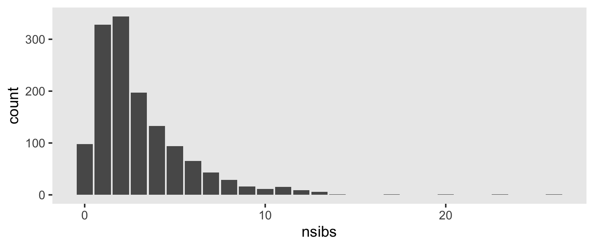

Yep, sure is. Here's a way to save Singer and Willette's discretized version of `nsibs` and then break the cases down in terms of $n$ and percentage, which matches nicely with the numbers at the bottom of page 449.


```r
depression_pp <-
  depression_pp %>% 
  mutate(nsibs_cat = case_when(
    nsibs == 0         ~ "0",
    nsibs %in% c(1, 2) ~ "1 or 2",
    nsibs %in% c(3, 4) ~ "3 or 4",
    nsibs %in% c(5, 6) ~ "5 or 6",
    nsibs %in% c(7, 8) ~ "7 or 8",
    nsibs >= 9         ~ "9 or more"
  )
  )

depression_pp %>% 
  group_by(id) %>% 
  slice(1) %>% 
  ungroup() %>% 
  count(nsibs_cat) %>% 
  mutate(percent = (100 * n / sum(n)) %>% round(digits = 1))
```

```
## # A tibble: 6 x 3
##   nsibs_cat     n percent
##   <chr>     <int>   <dbl>
## 1 0            98     7  
## 2 1 or 2      672    48.2
## 3 3 or 4      330    23.7
## 4 5 or 6      159    11.4
## 5 7 or 8       72     5.2
## 6 9 or more    62     4.5
```

Now fit our version of Model B, in which we replace the original linear predictor `nsibs` with a series of dummies: `sibs12`, `sibs34`,..., `sibs9plus`.


```r
# model b (nonlinear)  
# about 5 hours
fit12.25 <-
  brm(data = depression_pp,
      family = binomial,
      event | trials(1) ~ 0 + Intercept + age_18 + I(age_18^2) + I(age_18^3) + pd + female + sibs12 + sibs34 + sibs56 + sibs78 + sibs9plus,
      prior(normal(0, 4), class = b),
      chains = 4, cores = 4, iter = 2000, warmup = 1000,
      seed = 12,
      file = "fits/fit12.25")
```

Here's the model summary.


```r
print(fit12.25)
```

```
##  Family: binomial 
##   Links: mu = logit 
## Formula: event | trials(1) ~ 0 + Intercept + age_18 + I(age_18^2) + I(age_18^3) + pd + female + sibs12 + sibs34 + sibs56 + sibs78 + sibs9plus 
##    Data: depression_pp (Number of observations: 36997) 
## Samples: 4 chains, each with iter = 2000; warmup = 1000; thin = 1;
##          total post-warmup samples = 4000
## 
## Population-Level Effects: 
##           Estimate Est.Error l-95% CI u-95% CI Rhat Bulk_ESS Tail_ESS
## Intercept    -4.52      0.21    -4.93    -4.13 1.00     1181     1587
## age_18        0.06      0.01     0.04     0.08 1.00     2925     2270
## Iage_18E2    -0.01      0.00    -0.01    -0.01 1.00     5508     2807
## Iage_18E3     0.00      0.00     0.00     0.00 1.00     3698     3619
## pd            0.36      0.16     0.03     0.66 1.00     2996     2466
## female        0.56      0.11     0.35     0.77 1.00     3005     2586
## sibs12        0.04      0.20    -0.35     0.42 1.00     1171     1745
## sibs34        0.03      0.21    -0.39     0.44 1.00     1208     1727
## sibs56       -0.49      0.26    -1.02     0.01 1.00     1334     1720
## sibs78       -0.78      0.34    -1.46    -0.13 1.00     1251     1877
## sibs9plus    -0.68      0.35    -1.39    -0.03 1.00     1642     2049
## 
## Samples were drawn using sampling(NUTS). For each parameter, Bulk_ESS
## and Tail_ESS are effective sample size measures, and Rhat is the potential
## scale reduction factor on split chains (at convergence, Rhat = 1).
```

It might be easier to compare the various `sibs*` coefficients with a coefficient plot.


```r
posterior_samples(fit12.25) %>% 
  pivot_longer(contains("sibs")) %>% 
  mutate(name = str_remove(name, "b_")) %>% 
  
  ggplot(aes(x = value, y = name)) +
  stat_intervalh(size = 5, .width = c(.1, .5, .9)) +
  scale_color_grey("CI level:", start = .8, end = .2) +
  labs(x = "sibs coeficients",
       y = NULL) +
  theme(axis.text.y = element_text(hjust = 0),
        axis.ticks.y = element_blank(),
        panel.grid = element_blank())
```

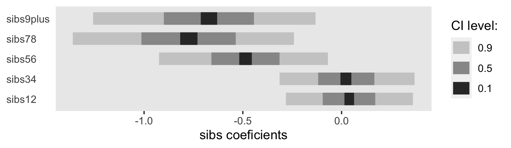

Here is the breakdown by `bigfamily`.


```r
depression_pp %>% 
  group_by(id) %>% 
  slice(1) %>% 
  ungroup() %>% 
  count(bigfamily) %>% 
  mutate(percent = (100 * n / sum(n)) %>% round(digits = 2))
```

```
## # A tibble: 2 x 3
##   bigfamily     n percent
##       <dbl> <int>   <dbl>
## 1         0  1100    79.0
## 2         1   293    21.0
```

Now fit our version of Model C, the dichotomized `bigfamily` model.


```r
# model c (dichotomized)  
# 3.736503 hours
fit12.26 <-
  brm(data = depression_pp,
      family = binomial,
      event | trials(1) ~ 0 + Intercept + age_18 + I(age_18^2) + I(age_18^3) + pd + female + bigfamily,
      prior(normal(0, 4), class = b),
      chains = 4, cores = 4, iter = 2000, warmup = 1000,
      seed = 12,
      file = "fits/fit12.26")
```

Check the model summary.


```r
print(fit12.26)
```

```
##  Family: binomial 
##   Links: mu = logit 
## Formula: event | trials(1) ~ 0 + Intercept + age_18 + I(age_18^2) + I(age_18^3) + pd + female + bigfamily 
##    Data: depression_pp (Number of observations: 36997) 
## Samples: 4 chains, each with iter = 2000; warmup = 1000; thin = 1;
##          total post-warmup samples = 4000
## 
## Population-Level Effects: 
##           Estimate Est.Error l-95% CI u-95% CI Rhat Bulk_ESS Tail_ESS
## Intercept    -4.48      0.11    -4.69    -4.27 1.00     2079     2323
## age_18        0.06      0.01     0.04     0.08 1.00     2889     2518
## Iage_18E2    -0.01      0.00    -0.01    -0.01 1.00     4086     3129
## Iage_18E3     0.00      0.00     0.00     0.00 1.00     3344     3179
## pd            0.35      0.16     0.04     0.66 1.00     2055     2071
## female        0.56      0.11     0.35     0.77 1.00     2147     2338
## bigfamily    -0.62      0.14    -0.91    -0.34 1.00     2823     2254
## 
## Samples were drawn using sampling(NUTS). For each parameter, Bulk_ESS
## and Tail_ESS are effective sample size measures, and Rhat is the potential
## scale reduction factor on split chains (at convergence, Rhat = 1).
```

The summaries look very similar to the values in the rightmost column of Table 12.4 in the text. Here is a look at the antilog of our `bigfamily` coefficient.


```r
# just to make the x-axis pretty
breaks <- c(exp(fixef(fit12.26)["bigfamily", c(1, 3:4)]), 1) %>% as.vector()
labels <- c(exp(fixef(fit12.26)["bigfamily", c(1, 3:4)]), 1) %>% round(digits = 3) %>% as.vector()

# plot!
posterior_samples(fit12.26) %>% 
  ggplot(aes(x = exp(b_bigfamily), y = 0)) +
  geom_vline(xintercept = 1, color = "white") +
  geom_halfeyeh(.width = c(.5, .95)) +
  scale_x_continuous("bigfamily odds ratio", breaks = breaks, labels = labels) +
  scale_y_continuous(NULL, breaks = NULL) +
  theme(panel.grid = element_blank())
```

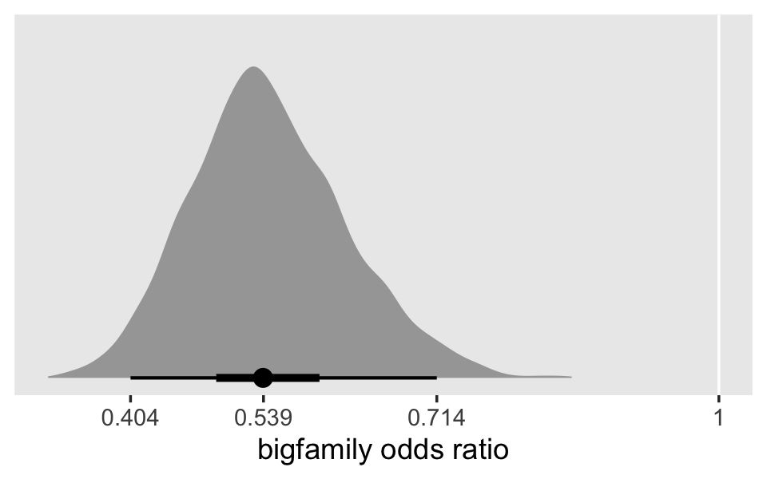

Now compute the WAIC estimates for `fit12.24` through `fit12.26` and compare them by their WAIC differences and WAIC weights.


```r
fit12.24 <- add_criterion(fit12.24, criterion = "waic")  # 1.524841 hours
fit12.25 <- add_criterion(fit12.25, criterion = "waic")  # 1.285394 hours
fit12.26 <- add_criterion(fit12.26, criterion = "waic")  # 1.741655 hours

loo_compare(fit12.24, fit12.25, fit12.26, criterion = "waic") %>% print(simplify = F)
```

```
##          elpd_diff se_diff elpd_waic se_elpd_waic p_waic  se_p_waic waic    se_waic
## fit12.26     0.0       0.0 -2066.3      85.7          6.8     0.5    4132.5   171.3
## fit12.24    -2.9       2.9 -2069.2      85.8          7.1     0.5    4138.4   171.5
## fit12.25    -3.6       1.1 -2069.9      85.8         10.8     0.7    4139.8   171.7
```

```r
model_weights(fit12.24, fit12.25, fit12.26, weights = "waic") %>% round(digits = 3)
```

```
## fit12.24 fit12.25 fit12.26 
##    0.049    0.025    0.926
```

Our WAIC estimates are very similar to the AIC estimates presented in Table 12.4. By both the differences and the weights, `fit12.16` (Model C) is the best among the three. Though its rank is decisive with the weights, it's less impressive if you compare the `se_diff` values with the `elpd_diff` values. Those suggest there's a lot of uncertainty in our WAIC differences.

## The proportionality assumption: Uncovering violations and simple solutions

> All the discrete hazard models postulated so far invoke another common, but restrictive assumption: that each predictor has an identical effect in every time period under study. This constraint, known as the *proportionality assumption*, stipulates that a predictor's effect does not depend on the respondent's duration in the initial state….
>
> Yet is it not possible, even likely, that the effects of some predictors will *vary* over time? (p. 451, *emphasis* in the original)

### Discrete-time hazard models that do not invoke a proportionality assumption.

"There are dozens of ways of violating the proportionality assumption" (p. 452). We see three such examples in panels B through D in Figure 12.7. Here's our version of the plot.


```r
p1 <-
  crossing(z = 0:1,
           x = 1:8) %>% 
  mutate(y = -2.1 + -0.2 * (x - 1) + 1.1 * z,
         z = factor(z)) %>% 
  
  ggplot(aes(x = x, y = y)) +
  geom_line(aes(size = z))

p2 <-
  crossing(z = 0:1,
           x = 1:8) %>% 
  mutate(y = -4.8 + 0.28 * (x - 1) + 0.01 * z + 0.25 * x * z,
         z = factor(z)) %>% 
  
  ggplot(aes(x = x, y = y)) +
  geom_line(aes(size = z))

p3 <-
  crossing(z = 0:1,
           x = 1:8) %>% 
  mutate(y = -4.8 + 0.25 * (x - 1) + 4.3 * z + -0.5 * x * z,
         z = factor(z)) %>%

  ggplot(aes(x = x, y = y)) +
  geom_line(aes(size = z))

p4 <-
  crossing(z1 = 0:1,
           x  = 1:8) %>% 
  mutate(z2 = rep(0:1, times = n() / 2),
         y  = -2.8 + -0.2 * (x - 1) + 1.8 * z1 + -1.4 * z1 * z2,
         z1 = factor(z1)) %>% 
  
  ggplot(aes(x = x, y = y)) +
  geom_line(aes(size = z1))

# combine
(
  (p1 + p2 + p3 + p4) + 
  plot_annotation(tag_levels = "A") 
) &
  scale_size_manual(values = c(1, 1/2)) &
  scale_x_continuous("time period", breaks = 0:8, limits = c(0, 8)) &
  scale_y_continuous("logit hazard", limits = c(-5, -0.5)) &
  theme(legend.position = "none",
        panel.grid = element_blank())
```

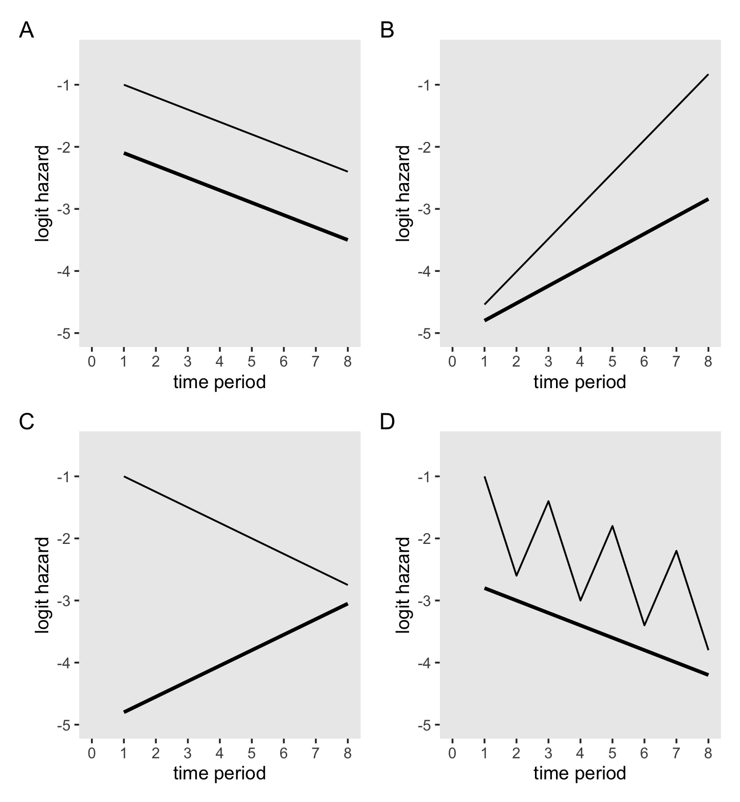

In case is wasn’t clear, I just winged it on the equations for the `y` values in each subplot. If you'd like to annotate the subplots with the arrows and $\beta$ labels as depicted in the original Figure 12.7, consider it a homework exercise.

### Investigating the proportionality assumption in practice.

Load the data from [Graham's (1997) dissertation](https://scholar.google.com/scholar?cluster=10047024316925658696&hl=en&oi=scholarr).


```r
mathdropout_pp <- 
  read_csv("data/mathdropout_pp.csv") %>% 
  # convert the column names to lower case
  rename_all(tolower)

glimpse(mathdropout_pp)
```

```
## Rows: 9,558
## Columns: 19
## $ id     <dbl> 201303, 201303, 201304, 201304, 201304, 201305, 201305, 201311, 201311, 201311, 201311, 2013…
## $ lastpd <dbl> 2, 2, 3, 3, 3, 2, 2, 5, 5, 5, 5, 5, 5, 5, 5, 5, 5, 3, 3, 3, 1, 5, 5, 5, 5, 5, 2, 2, 3, 3, 3,…
## $ female <dbl> 1, 1, 1, 1, 1, 1, 1, 0, 0, 0, 0, 0, 0, 0, 0, 0, 0, 1, 1, 1, 0, 1, 1, 1, 1, 1, 1, 1, 1, 1, 1,…
## $ censor <dbl> 0, 0, 0, 0, 0, 1, 1, 1, 1, 1, 1, 1, 0, 0, 0, 0, 0, 1, 1, 1, 1, 0, 0, 0, 0, 0, 0, 0, 1, 1, 1,…
## $ one    <dbl> 1, 1, 1, 1, 1, 1, 1, 1, 1, 1, 1, 1, 1, 1, 1, 1, 1, 1, 1, 1, 1, 1, 1, 1, 1, 1, 1, 1, 1, 1, 1,…
## $ hs11   <dbl> 1, 0, 1, 0, 0, 1, 0, 1, 0, 0, 0, 0, 1, 0, 0, 0, 0, 1, 0, 0, 1, 1, 0, 0, 0, 0, 1, 0, 1, 0, 0,…
## $ hs12   <dbl> 0, 1, 0, 1, 0, 0, 1, 0, 1, 0, 0, 0, 0, 1, 0, 0, 0, 0, 1, 0, 0, 0, 1, 0, 0, 0, 0, 1, 0, 1, 0,…
## $ coll1  <dbl> 0, 0, 0, 0, 1, 0, 0, 0, 0, 1, 0, 0, 0, 0, 1, 0, 0, 0, 0, 1, 0, 0, 0, 1, 0, 0, 0, 0, 0, 0, 1,…
## $ coll2  <dbl> 0, 0, 0, 0, 0, 0, 0, 0, 0, 0, 1, 0, 0, 0, 0, 1, 0, 0, 0, 0, 0, 0, 0, 0, 1, 0, 0, 0, 0, 0, 0,…
## $ coll3  <dbl> 0, 0, 0, 0, 0, 0, 0, 0, 0, 0, 0, 1, 0, 0, 0, 0, 1, 0, 0, 0, 0, 0, 0, 0, 0, 1, 0, 0, 0, 0, 0,…
## $ fhs11  <dbl> 1, 0, 1, 0, 0, 1, 0, 0, 0, 0, 0, 0, 0, 0, 0, 0, 0, 1, 0, 0, 0, 1, 0, 0, 0, 0, 1, 0, 1, 0, 0,…
## $ fhs12  <dbl> 0, 1, 0, 1, 0, 0, 1, 0, 0, 0, 0, 0, 0, 0, 0, 0, 0, 0, 1, 0, 0, 0, 1, 0, 0, 0, 0, 1, 0, 1, 0,…
## $ fcoll1 <dbl> 0, 0, 0, 0, 1, 0, 0, 0, 0, 0, 0, 0, 0, 0, 0, 0, 0, 0, 0, 1, 0, 0, 0, 1, 0, 0, 0, 0, 0, 0, 1,…
## $ fcoll2 <dbl> 0, 0, 0, 0, 0, 0, 0, 0, 0, 0, 0, 0, 0, 0, 0, 0, 0, 0, 0, 0, 0, 0, 0, 0, 1, 0, 0, 0, 0, 0, 0,…
## $ fcoll3 <dbl> 0, 0, 0, 0, 0, 0, 0, 0, 0, 0, 0, 0, 0, 0, 0, 0, 0, 0, 0, 0, 0, 0, 0, 0, 0, 1, 0, 0, 0, 0, 0,…
## $ period <dbl> 1, 2, 1, 2, 3, 1, 2, 1, 2, 3, 4, 5, 1, 2, 3, 4, 5, 1, 2, 3, 1, 1, 2, 3, 4, 5, 1, 2, 1, 2, 3,…
## $ event  <dbl> 0, 1, 0, 0, 1, 0, 0, 0, 0, 0, 0, 0, 0, 0, 0, 0, 1, 0, 0, 0, 0, 0, 0, 0, 0, 1, 0, 1, 0, 0, 0,…
## $ ltime  <dbl> 0, 1, 0, 1, 2, 0, 1, 0, 1, 2, 3, 4, 0, 1, 2, 3, 4, 0, 1, 2, 0, 0, 1, 2, 3, 4, 0, 1, 0, 1, 2,…
## $ fltime <dbl> 0, 1, 0, 1, 2, 0, 1, 0, 0, 0, 0, 0, 0, 0, 0, 0, 0, 0, 1, 2, 0, 0, 1, 2, 3, 4, 0, 1, 0, 1, 2,…
```

The data are composed of $n = 3790$ high school students.


```r
mathdropout_pp %>% 
  distinct(id) %>% 
  count()
```

```
## # A tibble: 1 x 1
##       n
##   <int>
## 1  3790
```

Here is the division by `female`.


```r
mathdropout_pp %>% 
  distinct(id, female) %>% 
  count(female) %>% 
  mutate(percent = 100 * n / sum(n))
```

```
## # A tibble: 2 x 3
##   female     n percent
##    <dbl> <int>   <dbl>
## 1      0  1875    49.5
## 2      1  1915    50.5
```

Singer and Willett also wrote: "only 93 men and 39 women took a mathematics class in each of the next five terms" (p. 456). I think this is a typo. Here's the break down by `censor` and `female` at the fifth time period (`period == 5`).


```r
mathdropout_pp %>% 
  filter(period == 5) %>% 
  count(censor, female)
```

```
## # A tibble: 4 x 3
##   censor female     n
##    <dbl>  <dbl> <int>
## 1      0      0    39
## 2      0      1    39
## 3      1      0    93
## 4      1      1    51
```

Fitting the three models displayed in Table 12.5 is a mild extension from our previous models. From a `brm()` perspective, there's nothing new, here.


```r
fit12.27 <-
  brm(data = mathdropout_pp,
      family = binomial,
      event | trials(1) ~ 0 + hs11 + hs12 + coll1 + coll2 + coll3 + female,
      prior(normal(0, 4), class = b),
      chains = 4, cores = 4, iter = 2000, warmup = 1000,
      seed = 12,
      file = "fits/fit12.27")

fit12.28 <-
  brm(data = mathdropout_pp,
      family = binomial,
      event | trials(1) ~ 0 + hs11 + hs12 + coll1 + coll2 + coll3 + fhs11 + fhs12 + fcoll1 + fcoll2 + fcoll3,
      prior(normal(0, 4), class = b),
      chains = 4, cores = 4, iter = 2000, warmup = 1000,
      seed = 12,
      file = "fits/fit12.28")

fit12.29 <-
  brm(data = mathdropout_pp,
      family = binomial,
      event | trials(1) ~ 0 + hs11 + hs12 + coll1 + coll2 + coll3 + female + fltime,
      prior(normal(0, 4), class = b),
      chains = 4, cores = 4, iter = 2000, warmup = 1000,
      seed = 12,
      file = "fits/fit12.29")
```

Heads up about the `formula` for `fit12.28` (Model B). Many of the examples in the text and the corresponding data sets we've been working with included pre-computed interaction terms. We have been quietly ignoring those and making our interactions by hand in our `formula` arguments. Here we went ahead with the text and just used `event | trials(1) ~ 0 + hs11 + hs12 + coll1 + coll2 + coll3 + fhs11 + fhs12 + fcoll1 + fcoll2 + fcoll3`. If you wanted a more verbose version of that code, we could have specified either 

* `event | trials(1) ~ 0 + hs11 + hs12 + coll1 + coll2 + coll3 + female:hs11 + female:hs12 + female:coll1 + female:coll2 + female:coll3` or
* `event | trials(1) ~ 0 + hs11 + hs12 + coll1 + coll2 + coll3 + female:(hs11 + hs12 + coll1 + coll2 + coll3)`. 

All three return the same results. Anyway, let's check the model summaries.


```r
print(fit12.27)
```

```
##  Family: binomial 
##   Links: mu = logit 
## Formula: event | trials(1) ~ 0 + hs11 + hs12 + coll1 + coll2 + coll3 + female 
##    Data: mathdropout_pp (Number of observations: 9558) 
## Samples: 4 chains, each with iter = 2000; warmup = 1000; thin = 1;
##          total post-warmup samples = 4000
## 
## Population-Level Effects: 
##        Estimate Est.Error l-95% CI u-95% CI Rhat Bulk_ESS Tail_ESS
## hs11      -2.13      0.06    -2.25    -2.02 1.00     3632     3041
## hs12      -0.94      0.05    -1.03    -0.85 1.00     3847     3351
## coll1     -1.45      0.06    -1.57    -1.32 1.00     4234     2948
## coll2     -0.62      0.08    -0.77    -0.47 1.00     4774     2821
## coll3     -0.77      0.15    -1.06    -0.49 1.00     5414     3086
## female     0.38      0.05     0.28     0.47 1.00     2812     3040
## 
## Samples were drawn using sampling(NUTS). For each parameter, Bulk_ESS
## and Tail_ESS are effective sample size measures, and Rhat is the potential
## scale reduction factor on split chains (at convergence, Rhat = 1).
```

```r
print(fit12.28)
```

```
##  Family: binomial 
##   Links: mu = logit 
## Formula: event | trials(1) ~ 0 + hs11 + hs12 + coll1 + coll2 + coll3 + fhs11 + fhs12 + fcoll1 + fcoll2 + fcoll3 
##    Data: mathdropout_pp (Number of observations: 9558) 
## Samples: 4 chains, each with iter = 2000; warmup = 1000; thin = 1;
##          total post-warmup samples = 4000
## 
## Population-Level Effects: 
##        Estimate Est.Error l-95% CI u-95% CI Rhat Bulk_ESS Tail_ESS
## hs11      -2.01      0.07    -2.15    -1.88 1.00     4113     2849
## hs12      -0.96      0.06    -1.08    -0.85 1.00     4260     3156
## coll1     -1.48      0.09    -1.66    -1.32 1.00     3919     2829
## coll2     -0.71      0.10    -0.91    -0.52 1.00     4192     2962
## coll3     -0.87      0.19    -1.25    -0.52 1.00     4536     3184
## fhs11      0.16      0.10    -0.04     0.34 1.00     4154     2783
## fhs12      0.42      0.08     0.26     0.57 1.00     4443     3030
## fcoll1     0.44      0.12     0.21     0.67 1.00     3738     2962
## fcoll2     0.58      0.14     0.30     0.86 1.00     3917     3029
## fcoll3     0.60      0.29     0.05     1.18 1.00     4688     3271
## 
## Samples were drawn using sampling(NUTS). For each parameter, Bulk_ESS
## and Tail_ESS are effective sample size measures, and Rhat is the potential
## scale reduction factor on split chains (at convergence, Rhat = 1).
```

```r
print(fit12.29)
```

```
##  Family: binomial 
##   Links: mu = logit 
## Formula: event | trials(1) ~ 0 + hs11 + hs12 + coll1 + coll2 + coll3 + female + fltime 
##    Data: mathdropout_pp (Number of observations: 9558) 
## Samples: 4 chains, each with iter = 2000; warmup = 1000; thin = 1;
##          total post-warmup samples = 4000
## 
## Population-Level Effects: 
##        Estimate Est.Error l-95% CI u-95% CI Rhat Bulk_ESS Tail_ESS
## hs11      -2.05      0.07    -2.18    -1.92 1.00     2788     3029
## hs12      -0.93      0.05    -1.02    -0.83 1.00     3355     2872
## coll1     -1.50      0.06    -1.63    -1.37 1.00     3676     3135
## coll2     -0.72      0.09    -0.89    -0.55 1.00     3556     2766
## coll3     -0.91      0.16    -1.22    -0.61 1.00     3500     2957
## female     0.23      0.08     0.08     0.38 1.00     2275     2578
## fltime     0.12      0.05     0.03     0.21 1.00     2328     2703
## 
## Samples were drawn using sampling(NUTS). For each parameter, Bulk_ESS
## and Tail_ESS are effective sample size measures, and Rhat is the potential
## scale reduction factor on split chains (at convergence, Rhat = 1).
```

The results are similar to those in Table 12.5. Based on `fit12.27` (Model A), here is the posterior for the odds ratio for `female`.


```r
posterior_samples(fit12.27) %>% 
  ggplot(aes(x = exp(b_female), y = 0)) +
  geom_halfeyeh(.width = c(.5, .95)) +
  scale_y_continuous(NULL, breaks = NULL) +
  xlab("odds ratio for female") +
  theme(panel.grid = element_blank())
```

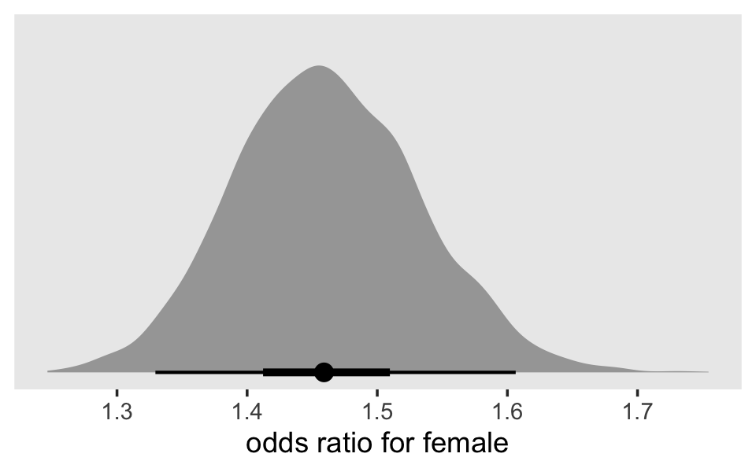

With regard to the interaction terms for `fit12.28` (Model B), Singer and Willett remarked: "Notice how the estimates rise over time" (p. 457). It might be easiest to observe that in a plot. 


```r
posterior_samples(fit12.28) %>% 
  pivot_longer(starts_with("b_f")) %>% 
  mutate(name = factor(str_remove(name, "b_"),
                       levels = c(str_c("fhs", 11:12), str_c("fcoll", 1:3)))) %>%
  
  ggplot(aes(x = value, y = name)) +
  stat_intervalh(size = 5, .width = c(.1, .5, .9)) +
  scale_color_grey("CI level:", start = .8, end = .2) +
  labs(x = "interaction terms",
       y = NULL) +
  theme(axis.text.y = element_text(hjust = 0),
        axis.ticks.y = element_blank(),
        panel.grid = element_blank())
```

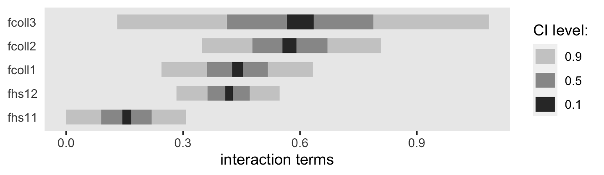

Make and save the subplots for Figure 12.8.


```r
# Within-group sample hazard functions
p1 <-
  mathdropout_pp %>% 
  mutate(event = if_else(event == 1, "event", "no_event")) %>% 
  group_by(period) %>% 
  count(event, female) %>% 
  ungroup() %>% 
  pivot_wider(names_from = event,
              values_from = n) %>% 
  mutate(total = event + no_event,
         logit = log(event / total / (1 - event / total))) %>% 
  mutate(female = factor(female,
                         levels = 1:0,
                         labels = c("F", "M"))) %>% 
  
  # plot
  ggplot(aes(x = period, y = logit)) +
  geom_line(aes(color = female),
            show.legend = F) +
  scale_y_continuous("sample logit(hazard)", breaks = -2:0) +
  labs(subtitle = "Within-group sample hazard functions")

# Model A: Main effect of female
nd <-
  mathdropout_pp %>% 
  distinct(female, period, hs11, hs12, coll1, coll2, coll3)

p2 <-
  make_fitted(fit12.27, scale = "linear") %>% 
  mutate(female = factor(female,
                         levels = 1:0,
                         labels = c("F", "M"))) %>% 
  
  # plot
  ggplot(aes(x = period, y = Estimate, ymin = Q2.5, ymax = Q97.5,
             fill = female, color = female)) +
  geom_ribbon(alpha = 1/5, size = 0) +
  geom_line() +
  scale_fill_viridis_d(NULL, option = "A", end = .6, direction = -1) +
  scale_y_continuous("fitted logit(hazard)", breaks = -2:0) +
  labs(subtitle = "Model A: Main effect of female")

# Model B: Completely general\ninteraction between female and time
nd <-
  mathdropout_pp %>% 
  distinct(female, period, hs11, hs12, coll1, coll2, coll3, fhs11, fhs12, fcoll1, fcoll2, fcoll3)

p3 <-
  make_fitted(fit12.28, scale = "linear") %>% 
  mutate(female = factor(female,
                         levels = 1:0,
                         labels = c("F", "M"))) %>% 
  
  # plot
  ggplot(aes(x = period, y = Estimate, ymin = Q2.5, ymax = Q97.5,
             fill = female, color = female)) +
  geom_ribbon(alpha = 1/5, size = 0) +
  geom_line() +
  scale_fill_viridis_d(NULL, option = "A", end = .6, direction = -1) +
  scale_y_continuous("fitted logit(hazard)", breaks = -2:0) +
  labs(subtitle = "Model B: Completely general\ninteraction between female and time")

# Model C: Interaction\nbetween female and time
nd <-
  mathdropout_pp %>% 
  distinct(female, period, hs11, hs12, coll1, coll2, coll3, fltime)

p4 <-
  make_fitted(fit12.29, scale = "linear") %>% 
  mutate(female = factor(female,
                         levels = 1:0,
                         labels = c("F", "M"))) %>% 
  
  # plot
  ggplot(aes(x = period, y = Estimate, ymin = Q2.5, ymax = Q97.5,
             fill = female, color = female)) +
  geom_ribbon(alpha = 1/5, size = 0) +
  geom_line() +
  scale_fill_viridis_d(NULL, option = "A", end = .6, direction = -1) +
  scale_y_continuous("fitted logit(hazard)", breaks = -2:0) +
  labs(subtitle = "Model C: Interaction\nbetween female and time") 
```

Now combine the subplots, augment them in bulk, and return our version of Figure 12.8.


```r
(p1 + p2 + p3 + p4 + plot_layout(guides = "collect")) &
  scale_color_viridis_d(NULL, option = "A", end = .6, direction = -1) &
  scale_x_continuous("term", breaks = 1:5,
                     labels = c("HS 11", "HS 12", "C 1", "C 2", "C 3")) &
  coord_cartesian(ylim = c(-2.3, 0)) &
  theme(panel.grid = element_blank())
```

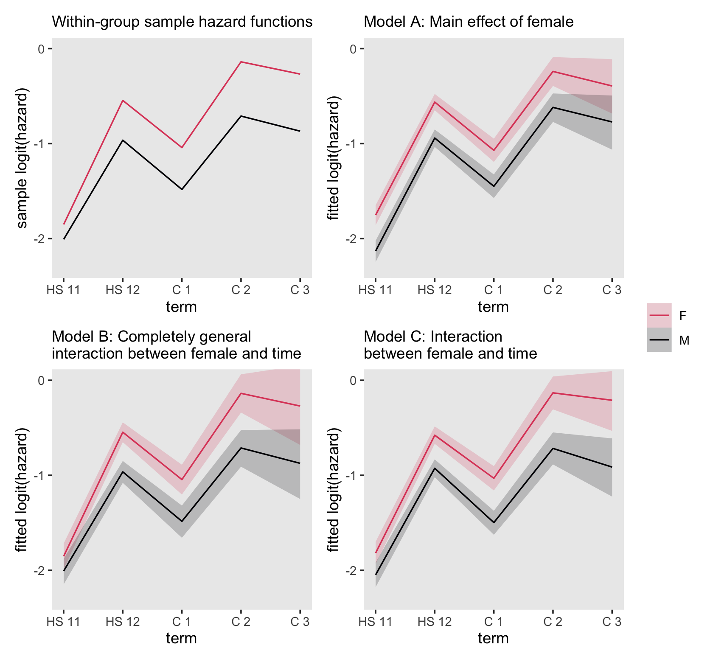

Compute the information criteria for the three models. Since these were much faster to compute than for some of the earlier models in this chapter, we'll go ahead and compute both the LOO and the WAIC.


```r
fit12.27 <- add_criterion(fit12.27, c("loo", "waic"))  # 2.016566 mins
fit12.28 <- add_criterion(fit12.28, c("loo", "waic"))  # 1.755284 mins
fit12.29 <- add_criterion(fit12.29, c("loo", "waic"))  # 2.884658 mins
```

Now compare the models with information criteria differences and weights.


```r
loo_compare(fit12.27, fit12.28, fit12.29, criterion = "loo") %>% print(simplify = F)
```

```
##          elpd_diff se_diff elpd_loo se_elpd_loo p_loo   se_p_loo looic   se_looic
## fit12.29     0.0       0.0 -4905.9     51.3         7.0     0.1   9811.8   102.6 
## fit12.28    -2.2       1.2 -4908.1     51.3        10.0     0.2   9816.2   102.6 
## fit12.27    -2.3       2.5 -4908.2     51.2         6.0     0.1   9816.4   102.5
```

```r
loo_compare(fit12.27, fit12.28, fit12.29, criterion = "waic") %>% print(simplify = F)
```

```
##          elpd_diff se_diff elpd_waic se_elpd_waic p_waic  se_p_waic waic    se_waic
## fit12.29     0.0       0.0 -4905.9      51.3          7.0     0.1    9811.8   102.6
## fit12.28    -2.2       1.2 -4908.1      51.3         10.0     0.2    9816.2   102.6
## fit12.27    -2.3       2.5 -4908.2      51.2          6.0     0.1    9816.3   102.5
```

```r
model_weights(fit12.27, fit12.28, fit12.29, weights = "loo") %>% round(digits = 3)
```

```
## fit12.27 fit12.28 fit12.29 
##    0.086    0.092    0.822
```

```r
model_weights(fit12.27, fit12.28, fit12.29, weights = "waic") %>% round(digits = 3)
```

```
## fit12.27 fit12.28 fit12.29 
##    0.086    0.092    0.821
```

You’ll note both the LOO and WAIC estimates are very close to those displayed in Table 12.5. When we take their standard errors into account, `fit12.29` (Model C) is marginally better than the other two models. `fit12.29` also took most of the LOO and WAIC weights.

> How do we interpret the gender differential implied by Model C? Because we have centered *TIME* at 1, the coefficient for *FEMALE* (0.2275) estimates the differential in time period 1, which here is 11th grade. Antilogging yields 1.26, which leads us to estimate that in 11th grade, the odds of ending one's mathematics course-taking career are 26% higher for females. (p. 460, *emphasis* in the original)

Let's examine those results with our Bayesian fit.


```r
posterior_samples(fit12.29) %>% 
  mutate(`log odds` = b_female,
         `odds ratio` = exp(b_female)) %>% 
  pivot_longer(contains("odds")) %>% 
  
  ggplot(aes(x = value, y = 0)) +
  geom_halfeyeh(.width = c(.5, .95), normalize = "panels") +
  scale_y_continuous(NULL, breaks = NULL) +
  xlab("the effects of female in two metrics") +
  theme(panel.grid = element_blank()) +
  facet_wrap(~name, scales = "free")
```

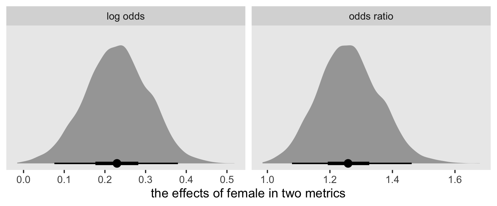

Now examine the odds ratio for three different educational periods.


```r
posterior_samples(fit12.29) %>% 
  mutate(`12th grade`              = exp(b_female + b_fltime),
         `1st semester of college` = exp(b_female + 2 * b_fltime),
         `3rd semester of college` = exp(b_female + 4 * b_fltime)) %>% 
  pivot_longer(contains(" ")) %>% 
  
  ggplot(aes(x = value, y = 0)) +
  geom_halfeyeh(.width = c(.5, .95), normalize = "panels") +
  scale_y_continuous(NULL, breaks = NULL) +
  labs(title = "The interaction effect in different periods",
       x = "odds ratio") +
  theme(panel.grid = element_blank()) +
  facet_wrap(~name, scales = "free")
```

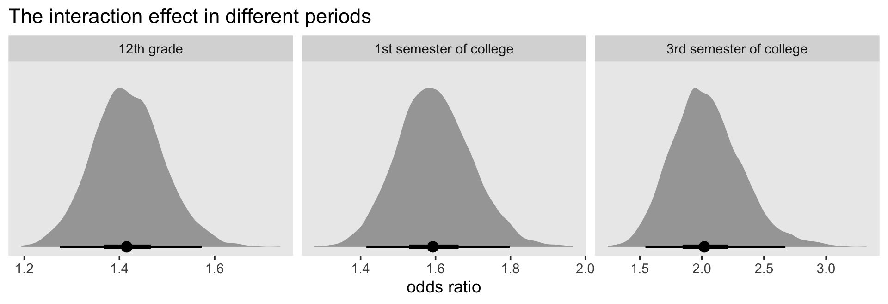

## The no unobserved heterogeneity assumption: No simple solution

> All the hazard models discussed in this book--both the discrete-time models we are discussing now and the continuous-time models we will soon introduce--impose an additional assumption to which we have alluded: the assumption of no unobserved heterogeneity. Every model assumes that the population hazard function for individual $i$ depends only on his or her predictor values. Any pair of individuals who share identical predictor profiles will have identical population functions....
>
> Many data sets will not conform to this assumption. As in the multilevel model for change (and regular regression for that matter), pairs of individuals who share predictor profiles are very likely to have different outcomes....
>
> Unobserved heterogeneity can have serious consequences. In their classic [1985 paper](http://pure.iiasa.ac.at/id/eprint/2602/1/RR-86-03.pdf), Vaupel and Yaskin elegantly demonstrate what they call "heterogeneity's ruses"--that ability of unobserved heterogeneity to create the misimpression that a hazard function follows a particular form, when in fact it may not....
>
> Is it possible to fit a hazard model that accounts for unobserved heterogeneity? As you might expect, doing so requires that we have either additional data (for example, data on repeated events within individuals) or that we invoke other--perhaps less tenable--assumptions about the distribution of event time errors ([Aalen, 1988](https://onlinelibrary.wiley.com/doi/abs/10.1002/sim.4780071105); [Heckman and Singer, 1984](https://www.cambridge.org/core/books/longitudinal-analysis-of-labor-market-data/0D46228F1D5803E54310FA89FD8118C0); [Vaupel, Manton, & Stallard, 1979](http://www.ressources-actuarielles.net/EXT/ISFA/1226.nsf/769998e0a65ea348c1257052003eb94f/2d6493f9f0d93b50c125774b0045c00b/$FILE/Vaupel-Demography-16-1979-3.pdf); [Scheike & Jensen, 1997](https://www.ncbi.nlm.nih.gov/pubmed/9147597); [Mare, 1994](https://www.semanticscholar.org/paper/DISCRETE-TIME-BIVARIATE-HAZARDS-WITH-UNOBSERVED-A-Mare/c13ff07817b0b0a28774806db29c2491e0ec6a3d)). As a result, most empirical researchers--and we--proceed ahead, if not ignoring the problem, at least not addressing it. In the remainder of this book, we assume that all heterogeneity is observed and attributable to the predictors included in our models.

## Residual analysis

> Before concluding that your model is sound, you should ascertain how well it performs for individual cases. As in regular regression, we [can] address this question by examining residuals.
>
> Residuals compare--usually through subtraction--an outcome's "observed" value to its model-based "expected" value. For a discrete-time hazard model, a simple difference will not suffice because each person has not a single outcome but a set of outcomes--one for each time period when he or she was at risk. This suggests the need for a residual defined at the *person-period* level. A further complication is that the observed outcome in every time period has a value of either 0 or 1 while its expected value—the predicted hazard probability—lies between these extremes. (p. 463, *emphasis* in the original)

Starting on page 464, Singer and Willett illustrated a residual analysis using Model D from Table 11.3. In the last chapter, we called that `fit11.10`. Here it is, again.


```r
fit11.10 <-
  brm(data = sex_pp,
      family = binomial,
      event | trials(1) ~ 0 + d7 + d8 + d9 + d10 + d11 + d12 + pt + pas,
      prior(normal(0, 4), class = b),
      chains = 4, cores = 4, iter = 2000, warmup = 1000,
      seed = 11,
      file = "fits/fit11.10")
```

With **brms**, users can extract the residuals of a `brm()` fit with the `residuals()` function.


```r
residuals(fit11.10) %>% 
  str()
```

```
##  num [1:822, 1:4] -0.0968 -0.0526 0.8174 -0.0839 -0.0448 ...
##  - attr(*, "dimnames")=List of 2
##   ..$ : NULL
##   ..$ : chr [1:4] "Estimate" "Est.Error" "Q2.5" "Q97.5"
```

The output is similar to what we get from `fitted()`.  We have a numeric array of 822 rows and 4 columns. There are 822 rows because that is the number of rows in the original data set with which we fit the model, `sex_pp`.


```r
sex_pp %>% 
  glimpse()
```

```
## Rows: 822
## Columns: 11
## $ id     <dbl> 1, 1, 1, 2, 2, 2, 2, 2, 2, 3, 3, 3, 3, 3, 3, 5, 5, 5, 5, 5, 5, 6, 6, 6, 6, 6, 7, 7, 7, 9, 9,…
## $ period <dbl> 7, 8, 9, 7, 8, 9, 10, 11, 12, 7, 8, 9, 10, 11, 12, 7, 8, 9, 10, 11, 12, 7, 8, 9, 10, 11, 7, …
## $ event  <dbl> 0, 0, 1, 0, 0, 0, 0, 0, 0, 0, 0, 0, 0, 0, 0, 0, 0, 0, 0, 0, 1, 0, 0, 0, 0, 1, 0, 0, 1, 0, 0,…
## $ d7     <dbl> 1, 0, 0, 1, 0, 0, 0, 0, 0, 1, 0, 0, 0, 0, 0, 1, 0, 0, 0, 0, 0, 1, 0, 0, 0, 0, 1, 0, 0, 1, 0,…
## $ d8     <dbl> 0, 1, 0, 0, 1, 0, 0, 0, 0, 0, 1, 0, 0, 0, 0, 0, 1, 0, 0, 0, 0, 0, 1, 0, 0, 0, 0, 1, 0, 0, 1,…
## $ d9     <dbl> 0, 0, 1, 0, 0, 1, 0, 0, 0, 0, 0, 1, 0, 0, 0, 0, 0, 1, 0, 0, 0, 0, 0, 1, 0, 0, 0, 0, 1, 0, 0,…
## $ d10    <dbl> 0, 0, 0, 0, 0, 0, 1, 0, 0, 0, 0, 0, 1, 0, 0, 0, 0, 0, 1, 0, 0, 0, 0, 0, 1, 0, 0, 0, 0, 0, 0,…
## $ d11    <dbl> 0, 0, 0, 0, 0, 0, 0, 1, 0, 0, 0, 0, 0, 1, 0, 0, 0, 0, 0, 1, 0, 0, 0, 0, 0, 1, 0, 0, 0, 0, 0,…
## $ d12    <dbl> 0, 0, 0, 0, 0, 0, 0, 0, 1, 0, 0, 0, 0, 0, 1, 0, 0, 0, 0, 0, 1, 0, 0, 0, 0, 0, 0, 0, 0, 0, 0,…
## $ pt     <dbl> 0, 0, 0, 1, 1, 1, 1, 1, 1, 0, 0, 0, 0, 0, 0, 1, 1, 1, 1, 1, 1, 0, 0, 0, 0, 0, 1, 1, 1, 0, 0,…
## $ pas    <dbl> 1.9788670, 1.9788670, 1.9788670, -0.5454916, -0.5454916, -0.5454916, -0.5454916, -0.5454916,…
```

Just as we often express the uncertainty in our Bayesian models with parameter summaries from the posterior, we also express the uncertainty of our residuals. Thus, the four columns returned by the `residuals()` function are the familiar summary columns of ` Estimate`, `Est.Error`, `Q2.5`, and `Q97.5`. On page 465, Singer and Willett showcased the deviance residuals for eight participants. We’re going to diverge from them a little. In the plot, below, we’ll look at the residuals for the first 10 cases in the data, by `period`.


```r
residuals(fit11.10) %>% 
  data.frame() %>% 
  bind_cols(sex_pp) %>%
  mutate(event  = factor(event),
         period = factor(str_c("period ", period),
                         levels = str_c("period ", 7:12))) %>% 
  # reduce the number of cases
  filter(id < 11) %>% 
  
  ggplot(aes(x = id, y = Estimate, ymin = Q2.5, ymax = Q97.5, color = event)) +
  geom_hline(yintercept = 0, color = "white") +
  geom_pointrange(fatten = 2/3) +
  scale_color_viridis_d(option = "A", end = .6) +
  scale_x_continuous(breaks = 1:10, labels = rep(c(1, "", 10), times = c(1, 8, 1))) +
  ylab("residual") +
  theme(legend.position = "top", 
        panel.grid = element_blank()) +
  facet_wrap(~period, nrow = 1)
```

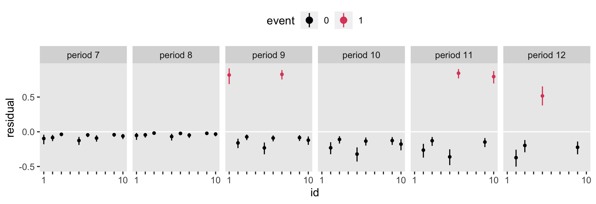

As is often the case in coefficient plots, the dots are the posterior means and the intersecting lines are the percentile-based 95% intervals. In the `sex_pp` data, the `event` variable encodes when participants experience the event within a given time range. Hopefully the color coding highlights how with hazard models, the residuals are always positive when the criterion variable is a 1 and always negative when the criterion is 0. 

Now we have a bit of a handle on the output from `residuals()`, let's plot in bulk.


```r
residuals(fit11.10) %>% 
  data.frame() %>% 
  bind_cols(sex_pp) %>% 
  mutate(event = factor(event)) %>% 
  
  ggplot(aes(x = id, y = Estimate, ymin = Q2.5, ymax = Q97.5, color = event)) +
  geom_hline(yintercept = 0, color = "white") +
  geom_pointrange(fatten = 3/4, alpha = 1/2) +
  scale_color_viridis_d(option = "A", end = .6) +
  ylab("residual") +
  theme(legend.position = "top", 
        panel.grid = element_blank()) 
```

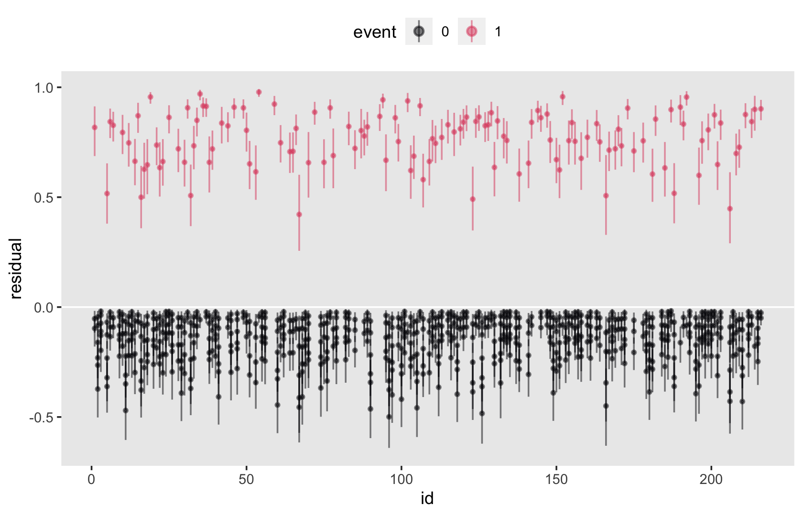

This plot is our analogue to the top portion of Singer and Willette's Figure 12.9. But whereas we plotted our residual summaries, they plotted the expected values of their *deviance residuals*. In contrast with the material on page 464, I am not going to discuss deviance residuals or the sums of the squared deviance residuals. Our **brms** workflow offers an alternative. Before we offer our alternative, we might focus on deviance residuals for just a moment:

> Deviance residuals are so named because, when squared, they represent an individual's contribution to the deviance statistic for that time period. The sum of the squared deviance residuals across all the records in a person-period data set yields the deviance statistic for the specified model....
>
> The absolute value of a deviance residual indicates how well the model fits that person's data for that period. Large absolute values identify person-period records whose outcomes are poorly predicted. (p. 464)

Back in Chapter 11, we computed the LOO for ` fit11.10`. Let's take a look at that.


```r
loo(fit11.10)
```

```
## 
## Computed from 4000 by 822 log-likelihood matrix
## 
##          Estimate   SE
## elpd_loo   -322.6 17.6
## p_loo         8.0  0.6
## looic       645.1 35.1
## ------
## Monte Carlo SE of elpd_loo is 0.0.
## 
## All Pareto k estimates are good (k < 0.5).
## See help('pareto-k-diagnostic') for details.
```

Notice the part of the output that read "All Pareto k estimates are good (k < 0.5)." We can pull those Pareto k estimates like so.


```r
loo(fit11.10)$diagnostics %>% 
  data.frame() %>% 
  glimpse()
```

```
## Rows: 822
## Columns: 2
## $ pareto_k <dbl> -0.032388134, -0.008484953, 0.086619632, -0.065923005, 0.016843525, -0.110736705, 0.005088…
## $ n_eff    <dbl> 2357.788, 2687.321, 1818.382, 4990.905, 5142.514, 5254.677, 4909.712, 4457.979, 4186.437, …
```

We formatted the output for convenience. Notice there are 822 rows—one for each case in the data. Almost like a computational byproduct, **brms** returned `pareto_k` and `n_eff` values when we computed the LOO estimates for the model. Our focus will be on the `pareto_k` column. Here are those `pareto_k` values in a plot.


```r
loo(fit11.10)$diagnostics %>% 
  data.frame() %>% 
  # attach the `id` values
  bind_cols(sex_pp) %>% 
  
  ggplot(aes(x = id, y = pareto_k)) +
  geom_point(alpha = 3/4) + 
  geom_text(data = . %>% filter(pareto_k > .2),
            aes(x = id + 2, label = id),
            size = 3, hjust = 0) +
  theme(panel.grid = element_blank())
```

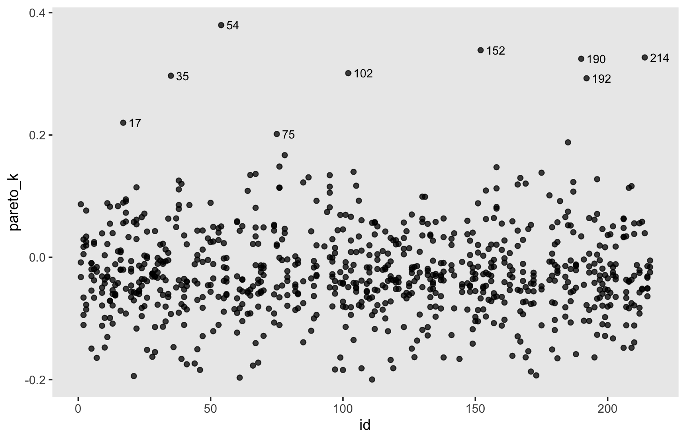

To learn the technical details about `pareto_k`, check out Vehtari, Gelman, and Gabry's [*Practical Bayesian model evaluation using leave-one-out cross-validation and WAIC*](https://arxiv.org/abs/1507.04544) or Vehtari, Simpson, Gelman, Yao, and Gabry's [*Pareto smoothed importance sampling*](https://arxiv.org/abs/1507.02646). In short, we can use `pareto_k` values to flag cases that were overly-influential on the model in a way that's a little like Singer and Willett's deviance residuals. As pointed out in the [reference manual](https://cran.r-project.org/web/packages/loo/loo.pdf) for the **loo** package, which **brms** used to compute all this, the makers of the **loo** package warn against `pareto_k` values when they get much larger than $0.5$. We should be a little worried by values that exceed the $0.7$ threshold and it's very likely a problem when they get larger than $1$. In this case, they're all below $0.4$ and all is good.

To learn more about `pareto_k` values and what the **loo** package can do for you, check out Vehtari and Gabry's vignette, [*Using the loo package*](https://cran.r-project.org/web/packages/loo/vignettes/loo2-example.html).

## Reference {-}

[Singer, J. D., & Willett, J. B. (2003). *Applied longitudinal data analysis: Modeling change and event occurrence*. New York, NY, US: Oxford University Press.](https://www.oxfordscholarship.com/view/10.1093/acprof:oso/9780195152968.001.0001/acprof-9780195152968)

## Session info {-}


```r
sessionInfo()
```

```
## R version 3.6.3 (2020-02-29)
## Platform: x86_64-apple-darwin15.6.0 (64-bit)
## Running under: macOS Catalina 10.15.3
## 
## Matrix products: default
## BLAS:   /Library/Frameworks/R.framework/Versions/3.6/Resources/lib/libRblas.0.dylib
## LAPACK: /Library/Frameworks/R.framework/Versions/3.6/Resources/lib/libRlapack.dylib
## 
## locale:
## [1] en_US.UTF-8/en_US.UTF-8/en_US.UTF-8/C/en_US.UTF-8/en_US.UTF-8
## 
## attached base packages:
## [1] stats     graphics  grDevices utils     datasets  methods   base     
## 
## other attached packages:
##  [1] tidybayes_2.0.3 patchwork_1.0.0 brms_2.12.0     Rcpp_1.0.4.6    forcats_0.5.0   stringr_1.4.0  
##  [7] dplyr_0.8.5     purrr_0.3.3     readr_1.3.1     tidyr_1.0.2     tibble_3.0.0    ggplot2_3.3.0  
## [13] tidyverse_1.3.0
## 
## loaded via a namespace (and not attached):
##   [1] colorspace_1.4-1     ellipsis_0.3.0       ggridges_0.5.2       rsconnect_0.8.16     markdown_1.1        
##   [6] base64enc_0.1-3      fs_1.4.1             rstudioapi_0.11      farver_2.0.3         rstan_2.19.3        
##  [11] svUnit_0.7-12        DT_0.13              fansi_0.4.1          mvtnorm_1.1-0        lubridate_1.7.8     
##  [16] xml2_1.3.1           bridgesampling_1.0-0 knitr_1.28           shinythemes_1.1.2    bayesplot_1.7.1     
##  [21] jsonlite_1.6.1       broom_0.5.5          dbplyr_1.4.2         shiny_1.4.0.2        compiler_3.6.3      
##  [26] httr_1.4.1           backports_1.1.6      assertthat_0.2.1     Matrix_1.2-18        fastmap_1.0.1       
##  [31] cli_2.0.2            later_1.0.0          htmltools_0.4.0      prettyunits_1.1.1    tools_3.6.3         
##  [36] igraph_1.2.5         coda_0.19-3          gtable_0.3.0         glue_1.4.0           reshape2_1.4.4      
##  [41] cellranger_1.1.0     vctrs_0.2.4          nlme_3.1-144         crosstalk_1.1.0.1    xfun_0.13           
##  [46] ps_1.3.2             rvest_0.3.5          mime_0.9             miniUI_0.1.1.1       lifecycle_0.2.0     
##  [51] gtools_3.8.2         zoo_1.8-7            scales_1.1.0         colourpicker_1.0     hms_0.5.3           
##  [56] promises_1.1.0       Brobdingnag_1.2-6    parallel_3.6.3       inline_0.3.15        shinystan_2.5.0     
##  [61] yaml_2.2.1           gridExtra_2.3        loo_2.2.0            StanHeaders_2.21.0-1 stringi_1.4.6       
##  [66] dygraphs_1.1.1.6     pkgbuild_1.0.6       rlang_0.4.5          pkgconfig_2.0.3      matrixStats_0.56.0  
##  [71] evaluate_0.14        lattice_0.20-38      rstantools_2.0.0     htmlwidgets_1.5.1    labeling_0.3        
##  [76] tidyselect_1.0.0     processx_3.4.2       plyr_1.8.6           magrittr_1.5         bookdown_0.18       
##  [81] R6_2.4.1             generics_0.0.2       DBI_1.1.0            pillar_1.4.3         haven_2.2.0         
##  [86] withr_2.1.2          xts_0.12-0           abind_1.4-5          modelr_0.1.6         crayon_1.3.4        
##  [91] arrayhelpers_1.1-0   utf8_1.1.4           rmarkdown_2.1        grid_3.6.3           readxl_1.3.1        
##  [96] callr_3.4.3          threejs_0.3.3        reprex_0.3.0         digest_0.6.25        xtable_1.8-4        
## [101] httpuv_1.5.2         stats4_3.6.3         munsell_0.5.0        viridisLite_0.3.0    shinyjs_1.1
```


## Footnote {-}

[^2]: In their reference section, Singer and Willett indicated this was a manuscript submitted for publication. To my knowledge, it was never published.

