Chapter 7. Examining the Multilevel Model’s Error Covariance Structure
================
A Solomon Kurz
2021-04-12

# Examining the Multilevel Model’s Error Covariance Structure

> In this chapter…, we focus on the model’s *random* effects as embodied
> in its error covariance structure. Doing so allows us to both describe
> the particular error covariance structure that the “standard”
> multilevel model for change invokes and it also allows us to broaden
> its representation to other—sometimes more tenable assumptions—about
> its behavior. ([Singer & Willett, 2003, p.
> 243](#ref-singerAppliedLongitudinalData2003), *emphasis* in the
> original)

## 7.1 The “standard” specification of the multilevel model for change

Load the `opposites_pp` data ([Willett,
1988](#ref-willett1988QuestionsAndAnswers)).

``` r
library(tidyverse)

opposites_pp <- read_csv("~/Dropbox/Recoding Applied Longitudinal Data Analysis/data/opposites_pp.csv")

glimpse(opposites_pp)
```

    ## Rows: 140
    ## Columns: 6
    ## $ id   <dbl> 1, 1, 1, 1, 2, 2, 2, 2, 3, 3, 3, 3, 4, 4, 4, 4, 5, 5, 5, 5, 6, 6, 6, 6, 7, 7, 7, 7, 8, 8, 8, 8,…
    ## $ time <dbl> 0, 1, 2, 3, 0, 1, 2, 3, 0, 1, 2, 3, 0, 1, 2, 3, 0, 1, 2, 3, 0, 1, 2, 3, 0, 1, 2, 3, 0, 1, 2, 3,…
    ## $ opp  <dbl> 205, 217, 268, 302, 219, 243, 279, 302, 142, 212, 250, 289, 206, 230, 248, 273, 190, 220, 229, …
    ## $ cog  <dbl> 137, 137, 137, 137, 123, 123, 123, 123, 129, 129, 129, 129, 125, 125, 125, 125, 81, 81, 81, 81,…
    ## $ ccog <dbl> 23.5429, 23.5429, 23.5429, 23.5429, 9.5429, 9.5429, 9.5429, 9.5429, 15.5429, 15.5429, 15.5429, …
    ## $ wave <dbl> 1, 2, 3, 4, 1, 2, 3, 4, 1, 2, 3, 4, 1, 2, 3, 4, 1, 2, 3, 4, 1, 2, 3, 4, 1, 2, 3, 4, 1, 2, 3, 4,…

Here’s our version of Table 7.1.

``` r
opposites_pp %>% 
  mutate(name = str_c("opp", wave)) %>% 
  select(id, name, opp, cog) %>% 
  
  pivot_wider(names_from = name, values_from = opp) %>% 
  select(id, starts_with("opp"), cog) %>% 
  head(n = 10)
```

    ## # A tibble: 10 x 6
    ##       id  opp1  opp2  opp3  opp4   cog
    ##    <dbl> <dbl> <dbl> <dbl> <dbl> <dbl>
    ##  1     1   205   217   268   302   137
    ##  2     2   219   243   279   302   123
    ##  3     3   142   212   250   289   129
    ##  4     4   206   230   248   273   125
    ##  5     5   190   220   229   220    81
    ##  6     6   165   205   207   263   110
    ##  7     7   170   182   214   268    99
    ##  8     8    96   131   159   213   113
    ##  9     9   138   156   197   200   104
    ## 10    10   216   252   274   298    96

The data are composed of cognitive task scores for 35 people across 4
time points.

``` r
opposites_pp %>% 
  count(id)
```

    ## # A tibble: 35 x 2
    ##       id     n
    ##    <dbl> <int>
    ##  1     1     4
    ##  2     2     4
    ##  3     3     4
    ##  4     4     4
    ##  5     5     4
    ##  6     6     4
    ##  7     7     4
    ##  8     8     4
    ##  9     9     4
    ## 10    10     4
    ## # … with 25 more rows

Our first model will serve as a comparison model for all that follow.
We’ll often refer to it as the *standard* multilevel model for change.
You’ll see why in a bit. It follows the form

$$
\\begin{align\*}
\\text{opp}\_{ij} & = \\pi\_{0i} + \\pi\_{1i} \\text{time}\_{ij} + \\epsilon\_{ij}\\\\
\\pi\_{0i} & = \\gamma\_{00} + \\gamma\_{01} (\\text{cog}\_i - \\overline{\\text{cog}}) + \\zeta\_{0i}\\\\
\\pi\_{1i} & = \\gamma\_{10} + \\gamma\_{11} (\\text{cog}\_i - \\overline{\\text{cog}}) + \\zeta\_{1i} \\\\
\\epsilon\_{ij} & \\stackrel{iid}{\\sim} \\operatorname{Normal}(0, \\sigma\_\\epsilon) \\\\
\\begin{bmatrix} \\zeta\_{0i} \\\\ \\zeta\_{1i} \\end{bmatrix} & \\stackrel{iid}{\\sim} \\operatorname{Normal} \\left (
\\begin{bmatrix} 0 \\\\ 0 \\end{bmatrix}, \\mathbf D \\mathbf\\Omega \\mathbf D' \\right ) \\\\
\\mathbf D      & = \\begin{bmatrix} \\sigma\_0 & 0 \\\\ 0 & \\sigma\_1 \\end{bmatrix} \\\\ 
\\mathbf \\Omega & = \\begin{bmatrix} 1 & \\rho\_{01} \\\\ \\rho\_{01} & 1 \\end{bmatrix},
\\end{align\*}
$$

where the $(\\text{cog}\_i - \\overline{\\text{cog}})$ notation is meant
to indicate we are mean centering the time-invariant covariate
cog<sub>*i*</sub>. In the data, the mean-centered version is saved as
`ccog`.

``` r
opposites_pp %>% 
  filter(wave == 1) %>% 
  
  ggplot(aes(ccog)) +
  geom_histogram(binwidth = 5) +
  theme(panel.grid = element_blank())
```

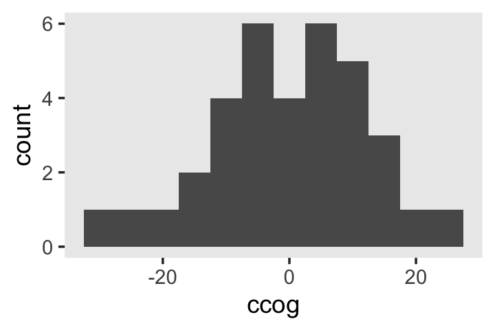

To keep things simple, we’ll be using **brms** default priors for all
the models in this chapter. Fit the model.

``` r
library(brms)

fit7.1 <-
  brm(data = opposites_pp, 
      family = gaussian,
      opp ~ 0 + Intercept + time + ccog + time:ccog + (1 + time | id),
      iter = 2000, warmup = 1000, chains = 4, cores = 4,
      seed = 7,
      file = "/Users/solomonkurz/Dropbox/Recoding Applied Longitudinal Data Analysis/fits/fit07.01")
```

Check the summary.

``` r
print(fit7.1, digits = 3)
```

    ##  Family: gaussian 
    ##   Links: mu = identity; sigma = identity 
    ## Formula: opp ~ 0 + Intercept + time + ccog + time:ccog + (1 + time | id) 
    ##    Data: opposites_pp (Number of observations: 140) 
    ## Samples: 4 chains, each with iter = 2000; warmup = 1000; thin = 1;
    ##          total post-warmup samples = 4000
    ## 
    ## Group-Level Effects: 
    ## ~id (Number of levels: 35) 
    ##                     Estimate Est.Error l-95% CI u-95% CI  Rhat Bulk_ESS Tail_ESS
    ## sd(Intercept)         36.222     4.961   27.763   46.885 1.002     1568     2018
    ## sd(time)              10.664     1.805    7.364   14.609 1.001     1446     2432
    ## cor(Intercept,time)   -0.441     0.161   -0.708   -0.084 1.000     2001     2896
    ## 
    ## Population-Level Effects: 
    ##           Estimate Est.Error l-95% CI u-95% CI  Rhat Bulk_ESS Tail_ESS
    ## Intercept  164.421     6.347  152.691  177.238 1.001     1346     2037
    ## time        26.932     2.055   22.791   30.827 1.000     1982     2556
    ## ccog        -0.118     0.521   -1.160    0.900 1.002     1496     1981
    ## time:ccog    0.434     0.173    0.089    0.778 1.000     1992     2605
    ## 
    ## Family Specific Parameters: 
    ##       Estimate Est.Error l-95% CI u-95% CI  Rhat Bulk_ESS Tail_ESS
    ## sigma   12.946     1.151   10.956   15.450 1.002     1733     2554
    ## 
    ## Samples were drawn using sampling(NUTS). For each parameter, Bulk_ESS
    ## and Tail_ESS are effective sample size measures, and Rhat is the potential
    ## scale reduction factor on split chains (at convergence, Rhat = 1).

If you’re curious, here’s the summary of our *σ* parameters transformed
to the variance/covariance metric.

``` r
library(tidybayes)

levels <- c("sigma[epsilon]^2", "sigma[0]^2", "sigma[1]^2", "sigma[0][1]")

sigma <-
  posterior_samples(fit7.1) %>% 
  transmute(`sigma[0]^2` = sd_id__Intercept^2,
            `sigma[1]^2` = sd_id__time^2,
            `sigma[epsilon]^2` = sigma^2,
            `sigma[0][1]` = sd_id__Intercept * sd_id__time * cor_id__Intercept__time)

sigma %>% 
  pivot_longer(everything()) %>% 
  mutate(name = factor(name, levels = levels)) %>% 
  group_by(name) %>% 
  median_qi(value) %>% 
  mutate_if(is.double, round, digits = 2)
```

    ## # A tibble: 4 x 7
    ##   name             value .lower .upper .width .point .interval
    ##   <fct>            <dbl>  <dbl>  <dbl>  <dbl> <chr>  <chr>    
    ## 1 sigma[epsilon]^2  165.  120.   239.    0.95 median qi       
    ## 2 sigma[0]^2       1281.  771.  2198.    0.95 median qi       
    ## 3 sigma[1]^2        111.   54.2  213.    0.95 median qi       
    ## 4 sigma[0][1]      -166. -386.   -25.4   0.95 median qi

## 7.2 Using the composite model to understand assumptions about the error covariance matrix

Dropping the terms specifying the distributional assumptions, we can
reexpress the model formula, from above, in the composite format as

$$
\\begin{align\*}
\\text{opp}\_{ij} & = \[\\gamma\_{00} + \\gamma\_{10} \\text{time}\_{ij} + \\gamma\_{01} (\\text{cog}\_i - \\overline{\\text{cog}}) + \\gamma\_{11} (\\text{cog}\_i - \\overline{\\text{cog}}) \\times \\text{time}\_{ij}\] \\\\
& \\;\\;\\; + \[\\zeta\_{0i} + \\zeta\_{1i} \\text{time}\_{ij} + \\epsilon\_{ij}\],
\\end{align\*}
$$

where we’ve divided up the structural and stochastic components with our
use of brackets. We might think of the terms of the stochastic portion
as a *composite residual*,
*r*<sub>*i**j*</sub> = \[*ϵ*<sub>*i**j*</sub> + *ζ*<sub>0*i*</sub> + *ζ*<sub>1*i*</sub>time<sub>*i**j*</sub>\].
Thus, we can rewrite the composite equation with the composite residual
term *r*<sub>*i**j*</sub> as

$$
\\text{opp}\_{ij} = \[\\gamma\_{00} + \\gamma\_{10} \\text{time}\_{ij} + \\gamma\_{01} (\\text{cog}\_i - \\overline{\\text{cog}}) + \\gamma\_{11} (\\text{cog}\_i - \\overline{\\text{cog}}) \\times \\text{time}\_{ij}\] + r\_{ij}.
$$

If we were willing to presume, as in OLS or single-level Bayesian
regression, that all residuals are independant and normally distributed,
we would express that in statistical notation as

$$ $$

where *r*<sub>*i**j*</sub> is the *i*th person’s residual on the *j*th
time point. The variance/covariance matrix **Σ** is diagonal (i.e., all
the off-diagonal elements are 0’s) and *homoscedastic* (i.e., all the
diagonal elements are the same value, *σ*<sub>*r*</sub><sup>2</sup>).

These assumptions are absurd for longitudinal data, which is why we
don’t analyze such data with single-level models. If we were to make the
less restrictive assumptions that, within people, the residuals were
*correlated over time* and were *heteroscedastic*, we could express that
as

$$ $$

this kind of structure can be called *block diagonal*, which means the
off-diagonal elements are zero between persons, but allowed to be
non-zero within persons (i.e., within blocks). The zero elements between
person blocks explicate how the residuals are independent between
persons. Notice that the variances on the diagonal vary across the four
time points (i.e.,
*σ*<sub>*r*<sub>1</sub></sub><sup>2</sup>, …, *σ*<sub>*r*<sub>4</sub></sub><sup>2</sup>).
Yet also notice that the block for one person is identical to the block
for all others. Thus, this model allows for *heterogeneity* across time
within persons, but *homogeneity* between persons.

We can express this in the more compact notation,

$$ $$

The bulk of the rest of the material in this chapter will focus around
how different models handle **Σ**<sub>**r**</sub>. The *standard*
multilevel growth model has one way. There are many others.

### 7.2.1 Variance of the composite residual.

Under the conventional multilevel growth model

$$
\\begin{align\*}
\\sigma\_{r\_j}^2 & = \\operatorname{Var} \\left ( \\epsilon\_{ij} + \\zeta\_{0i} + \\zeta\_{1i} \\text{time}\_j \\right ) \\\\
& = \\sigma\_\\epsilon^2 + \\sigma\_0^2 + 2 \\sigma\_{01} \\text{time}\_j + \\sigma\_1^2 \\text{time}\_j^2.
\\end{align\*}
$$

Here’s how to use our posterior samples to compute
*σ*<sub>*r*<sub>1</sub></sub><sup>2</sup>, …, *σ*<sub>*r*<sub>4</sub></sub><sup>2</sup>.

``` r
sigma %>% 
  mutate(iter = 1:n()) %>% 
  expand(nesting(iter, `sigma[epsilon]^2`, `sigma[0]^2`, `sigma[1]^2`, `sigma[0][1]`),
         time = 0:3) %>% 
  mutate(r = `sigma[epsilon]^2` + `sigma[0]^2` + 2 * `sigma[0][1]` * time + `sigma[1]^2` * time^2) %>% 
  mutate(name = str_c("sigma[italic(r)[", time + 1, "]]^2")) %>% 
  
  ggplot(aes(x = r, y = name)) +
  stat_halfeye(.width = .95, size = 1) +
  scale_x_continuous("marginal posterior", expand = expansion(mult = c(0, 0.05)), limits = c(0, NA)) +
  scale_y_discrete(NULL, labels = ggplot2:::parse_safe) +
  coord_cartesian(ylim = c(1.5, 4.2)) +
  theme(panel.grid = element_blank())
```

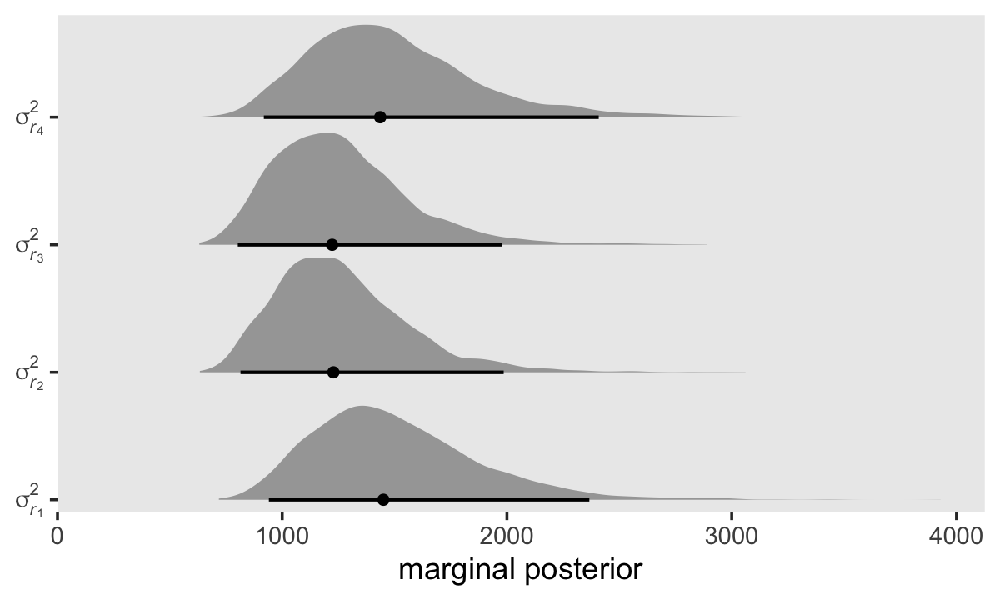

Here are the numeric summaries.

``` r
sigma %>% 
  mutate(iter = 1:n()) %>% 
  expand(nesting(iter, `sigma[epsilon]^2`, `sigma[0]^2`, `sigma[1]^2`, `sigma[0][1]`),
         time = 0:3) %>% 
  mutate(r = `sigma[epsilon]^2` + `sigma[0]^2` + 2 * `sigma[0][1]` * time + `sigma[1]^2` * time^2) %>% 
  mutate(name = str_c("sigma[italic(r)[", time + 1, "]]^2")) %>% 
  group_by(name) %>% 
  median_qi(r)
```

    ## # A tibble: 4 x 7
    ##   name                      r .lower .upper .width .point .interval
    ##   <chr>                 <dbl>  <dbl>  <dbl>  <dbl> <chr>  <chr>    
    ## 1 sigma[italic(r)[1]]^2 1450.   941.  2367.   0.95 median qi       
    ## 2 sigma[italic(r)[2]]^2 1228.   814.  1985.   0.95 median qi       
    ## 3 sigma[italic(r)[3]]^2 1222.   802.  1977.   0.95 median qi       
    ## 4 sigma[italic(r)[4]]^2 1436.   918.  2408.   0.95 median qi

Though our precise numeric values are different from those in the text,
we see the same overall pattern. Using our posterior medians, we can
update **Σ**<sub>**r**</sub> to

$$
\\begin{align\*}
\\mathbf{\\Sigma\_r} & = \\begin{bmatrix} 
  1399 & \\sigma\_{r\_1 r\_2} & \\sigma\_{r\_1 r\_3} & \\sigma\_{r\_1 r\_4} \\\\
  \\sigma\_{r\_2 r\_1} & 1228 & \\sigma\_{r\_2 r\_3} & \\sigma\_{r\_2 r\_4} \\\\
  \\sigma\_{r\_3 r\_1} & \\sigma\_{r\_3 r\_2} & 12701 & \\sigma\_{r\_3 r\_4} \\\\
  \\sigma\_{r\_4 r\_1} & \\sigma\_{r\_4 r\_2} & \\sigma\_{r\_4 r\_3} & 1532 \\end{bmatrix}.
\\end{align\*}
$$

> For the opposites-naming data, composite residual variance is greatest
> at the beginning and end of data collection and smaller in between.
> And, while not outrageously heteroscedastic, this situation is clearly
> beyond the bland homoscedasticity that we routinely assume for
> residuals in cross-sectional data. (p. 252)

If you work through the equation at the beginning of this section–which
I am not going to do, here–, you’ll see that the standard multilevel
growth model is set up such that the residual variance has a quadratic
relationship with time. To give a sense, here we plot the expected
*σ*<sub>*r*</sub><sup>2</sup> values over a wider and more continuous
range of time values.

``` r
set.seed(7)

sigma %>% 
  mutate(iter = 1:n()) %>% 
  slice_sample(n = 50) %>% 
  expand(nesting(iter, `sigma[epsilon]^2`, `sigma[0]^2`, `sigma[1]^2`, `sigma[0][1]`),
         time = seq(from = -4.2, to = 6.6, length.out = 200)) %>% 
  mutate(r = `sigma[epsilon]^2` + `sigma[0]^2` + 2 * `sigma[0][1]` * time + `sigma[1]^2` * time^2) %>% 
  
  ggplot(aes(x = time, y = r, group = iter)) +
  geom_line(size = 1/6, alpha = 1/2) +
  scale_x_continuous(expand = c(0, 0)) +
  scale_y_continuous(expression(sigma[italic(r)]^2),
                     expand = expansion(mult = c(0, 0.05)), limits = c(0, NA)) +
  labs(subtitle = expression("50 posterior draws showing the quadratic shape of "*sigma[italic(r)[time]]^2)) +
  theme(panel.grid = element_blank())
```

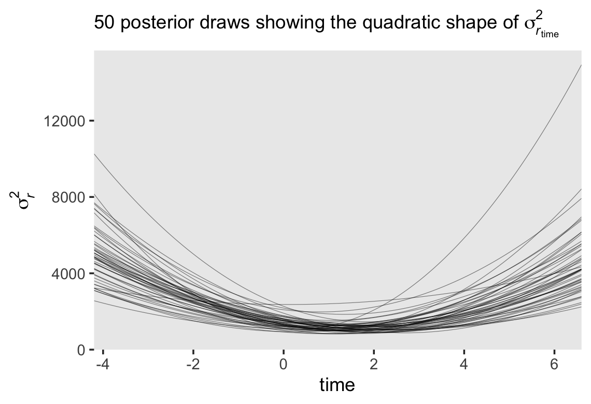

Since we have 4,000 posterior draws for all the parameters, we also have
4,000 posterior draws for the quadratic curve. Here we just show 50. The
curve is at its minimum at
time =  − (*σ*<sub>01</sub>/*σ*<sub>1</sub><sup>2</sup>). Since we have
posterior distributions for *σ*<sub>01</sub> and
*σ*<sub>1</sub><sup>2</sup>, we’ll also have a posterior distribution
for the minimum point. Here it is.

``` r
sigma %>% 
  mutate(minimum = -`sigma[0][1]` / `sigma[1]^2`) %>% 
  
  ggplot(aes(x = minimum, y = 0)) +
  stat_halfeye(.width = .95) +
  scale_x_continuous("time", expand = c(0, 0), limits = c(-4.2, 6.6)) +
  scale_y_continuous(NULL, breaks = NULL) +
  labs(subtitle = expression(Minimum~value~(-sigma[0][1]/sigma[1]^2))) +
  theme(panel.grid = element_blank())
```

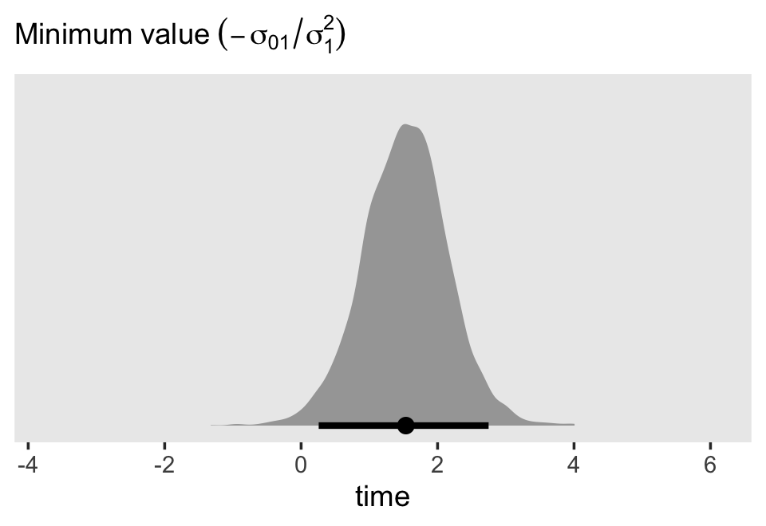

If we plug those minimum time values into the equation for
*σ*<sub>*r*<sub>time</sub></sub><sup>2</sup>, we’ll get the posterior
distribution for the minimum variance value.

``` r
sigma %>% 
  mutate(minimum = -`sigma[0][1]` / `sigma[1]^2`) %>% 
  mutate(r = `sigma[epsilon]^2` + `sigma[0]^2` + 2 * `sigma[0][1]` * minimum + `sigma[1]^2` * minimum^2) %>% 
  
  ggplot(aes(x = r, y = 0)) +
  stat_halfeye(.width = .95) +
  scale_x_continuous(expression(sigma[italic(r)[time]]^2), limits = c(0, NA)) +
  scale_y_continuous(NULL, breaks = NULL) +
  labs(subtitle = "Minimum variance") +
  theme(panel.grid = element_blank())
```

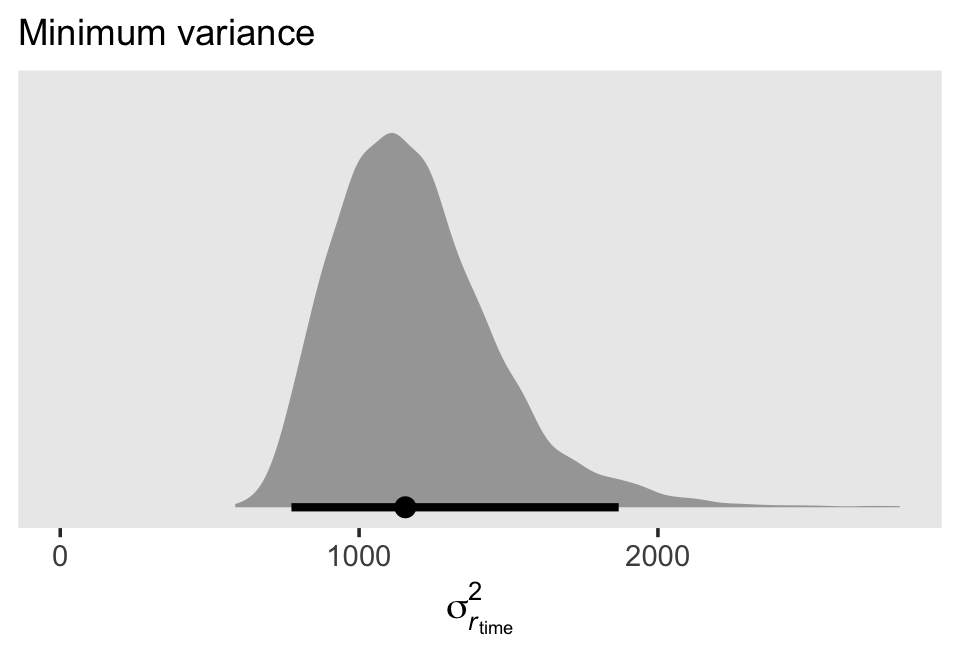

Here’s the numeric summary.

``` r
sigma %>% 
  mutate(minimum = -`sigma[0][1]` / `sigma[1]^2`) %>% 
  mutate(r = `sigma[epsilon]^2` + `sigma[0]^2` + 2 * `sigma[0][1]` * minimum + `sigma[1]^2` * minimum^2) %>% 
  median_qi(r)
```

    ##          r   .lower   .upper .width .point .interval
    ## 1 1154.743 773.6506 1868.636   0.95 median        qi

### 7.2.2 Covariance of the composite residuals.

In addition to the variances in **Σ**<sub>**r**</sub>, we might focus on
the off-diagonal covariances, too. Here we plot the marginal posteriors
for all 4 × 4 = 16 parameters.

``` r
# arrange the panels
levels <- 
  c("sigma[italic(r)[1]]^2", "sigma[italic(r)[1]][italic(r)[2]]", "sigma[italic(r)[1]][italic(r)[3]]", "sigma[italic(r)[1]][italic(r)[4]]", 
    "sigma[italic(r)[2]][italic(r)[1]]", "sigma[italic(r)[2]]^2", "sigma[italic(r)[2]][italic(r)[3]]", "sigma[italic(r)[2]][italic(r)[4]]", 
    "sigma[italic(r)[3]][italic(r)[1]]", "sigma[italic(r)[3]][italic(r)[2]]", "sigma[italic(r)[3]]^2", "sigma[italic(r)[3]][italic(r)[4]]", 
    "sigma[italic(r)[4]][italic(r)[1]]", "sigma[italic(r)[4]][italic(r)[2]]", "sigma[italic(r)[4]][italic(r)[3]]", "sigma[italic(r)[4]]^2")

# wrangle
sigma <-
  sigma %>% 
  mutate(`sigma[italic(r)[1]]^2` = `sigma[epsilon]^2` + `sigma[0]^2` + 2 * `sigma[0][1]` * 0 + `sigma[1]^2` * 0^2,
         `sigma[italic(r)[2]]^2` = `sigma[epsilon]^2` + `sigma[0]^2` + 2 * `sigma[0][1]` * 1 + `sigma[1]^2` * 1^2,
         `sigma[italic(r)[3]]^2` = `sigma[epsilon]^2` + `sigma[0]^2` + 2 * `sigma[0][1]` * 2 + `sigma[1]^2` * 2^2,
         `sigma[italic(r)[4]]^2` = `sigma[epsilon]^2` + `sigma[0]^2` + 2 * `sigma[0][1]` * 3 + `sigma[1]^2` * 3^2,
         
         `sigma[italic(r)[2]][italic(r)[1]]` = `sigma[0]^2` + `sigma[0][1]` * (1 + 0) + `sigma[1]^2` * 1 * 0,
         `sigma[italic(r)[3]][italic(r)[1]]` = `sigma[0]^2` + `sigma[0][1]` * (2 + 0) + `sigma[1]^2` * 2 * 0,
         `sigma[italic(r)[4]][italic(r)[1]]` = `sigma[0]^2` + `sigma[0][1]` * (3 + 0) + `sigma[1]^2` * 3 * 0,
         `sigma[italic(r)[3]][italic(r)[2]]` = `sigma[0]^2` + `sigma[0][1]` * (2 + 1) + `sigma[1]^2` * 2 * 1,
         `sigma[italic(r)[4]][italic(r)[2]]` = `sigma[0]^2` + `sigma[0][1]` * (3 + 1) + `sigma[1]^2` * 3 * 1,
         `sigma[italic(r)[4]][italic(r)[3]]` = `sigma[0]^2` + `sigma[0][1]` * (3 + 2) + `sigma[1]^2` * 3 * 2,
         
         `sigma[italic(r)[1]][italic(r)[2]]` = `sigma[0]^2` + `sigma[0][1]` * (0 + 1) + `sigma[1]^2` * 0 * 1,
         `sigma[italic(r)[1]][italic(r)[3]]` = `sigma[0]^2` + `sigma[0][1]` * (0 + 2) + `sigma[1]^2` * 0 * 2,
         `sigma[italic(r)[2]][italic(r)[3]]` = `sigma[0]^2` + `sigma[0][1]` * (1 + 2) + `sigma[1]^2` * 1 * 2,
         `sigma[italic(r)[1]][italic(r)[4]]` = `sigma[0]^2` + `sigma[0][1]` * (0 + 3) + `sigma[1]^2` * 0 * 3,
         `sigma[italic(r)[2]][italic(r)[4]]` = `sigma[0]^2` + `sigma[0][1]` * (1 + 3) + `sigma[1]^2` * 1 * 3,
         `sigma[italic(r)[3]][italic(r)[4]]` = `sigma[0]^2` + `sigma[0][1]` * (2 + 3) + `sigma[1]^2` * 2 * 3)

sigma %>% 
  select(contains("italic")) %>% 
  pivot_longer(everything()) %>%  
  mutate(name = factor(name, levels = levels)) %>% 
  
  # plot!
  ggplot(aes(x = value, y = 0)) +
  stat_halfeye(.width = .95, size = 1) +
  scale_x_continuous("marginal posterior", expand = expansion(mult = c(0, 0.05))) +
  scale_y_discrete(NULL, breaks = NULL) +
  coord_cartesian(xlim = c(0, 4000),
                  ylim = c(0.5, NA)) +
  theme(panel.grid = element_blank()) +
  facet_wrap(~ name, labeller = label_parsed)
```

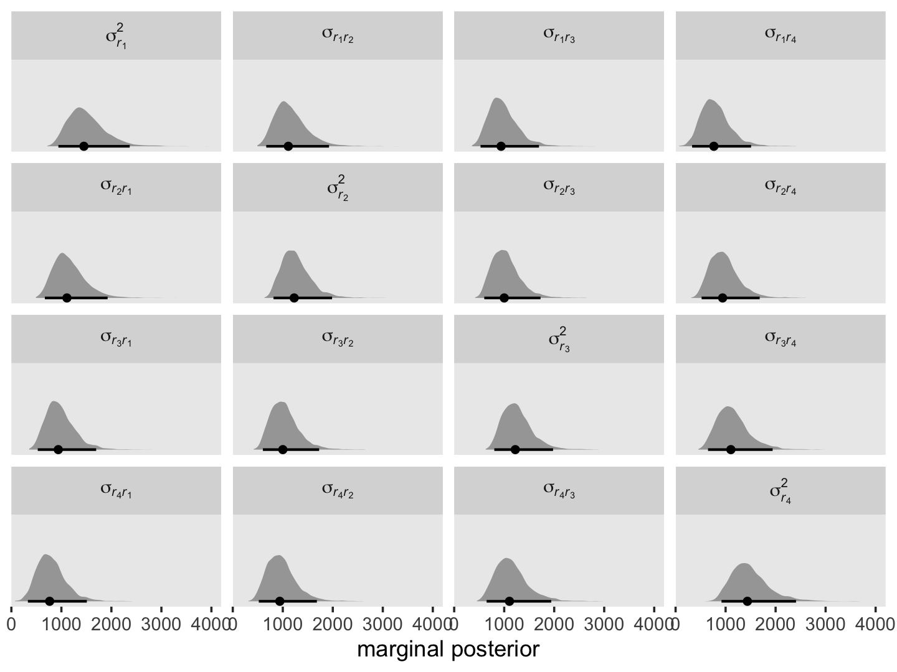

It might be helpful to reduce the complexity of this plot by focusing on
the posterior medians. With a little help from `geom_tile()` and
`geom_text()`, we’ll make a plot version of the matrix at the top of
page 255 in the text.

``` r
sigma %>% 
  select(contains("italic")) %>% 
  pivot_longer(everything()) %>%  
  mutate(name = factor(name, levels = levels)) %>% 
  group_by(name) %>% 
  median_qi(value) %>% 
  mutate(label = round(value, digits = 0)) %>% 
  
  ggplot(aes(x = 0, y = 0)) +
  geom_tile(aes(fill = value)) +
  geom_text(aes(label = label)) +
  scale_fill_viridis_c("posterior\nmedian", option = "A", limits = c(0, NA)) +
  scale_x_continuous(NULL, breaks = NULL, expand = c(0, 0)) +
  scale_y_continuous(NULL, breaks = NULL, expand = c(0, 0)) +
  labs(subtitle = expression(Sigma[r]*" for the standard multilevel model for change")) +
  theme(legend.text = element_text(hjust = 1)) +
  facet_wrap(~ name, labeller = label_parsed)
```

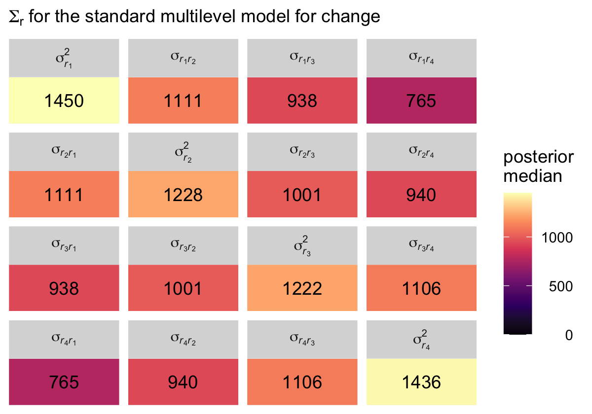

Although our posterior median values differ a bit from the REML values
reported in the text, the overall pattern holds. Hopefully the coloring
in the plot helps highlight what Singer and Willett described as a
“‘band diagonal’ structure, in which the overall magnitude of the
residual covariances tends to decline in diagonal ‘bands’ the further
you get from the main diagonal” (p. 255).

One of the consequences for this structure is that in cases where both
*σ*<sub>1</sub><sup>2</sup> → 0 and *σ*<sub>01</sub> → 0, the residual
covariance matrix becomes *compound symmetric*, which is:

$$
\\begin{align\*}
\\mathbf{\\Sigma\_r} & = \\begin{bmatrix} 
  \\sigma\_\\epsilon^2 + \\sigma\_0^2 & \\sigma\_0^2 & \\sigma\_0^2 & \\sigma\_0^2 \\\\
  \\sigma\_0^2 & \\sigma\_\\epsilon^2 + \\sigma\_0^2 & \\sigma\_0^2 & \\sigma\_0^2 \\\\
  \\sigma\_0^2 & \\sigma\_0^2 & \\sigma\_\\epsilon^2 + \\sigma\_0^2 & \\sigma\_0^2 \\\\
  \\sigma\_0^2 & \\sigma\_0^2 & \\sigma\_0^2 & \\sigma\_\\epsilon^2 + \\sigma\_0^2 \\end{bmatrix}.
\\end{align\*}
$$

### 7.2.3 Autocorrelation of the composite residuals.

We can use the following equation to convert our **Σ**<sub>**r**</sub>
into a correlation matrix:

$$\\rho\_{r\_j r\_{j^\\prime}} = \\sigma\_{r\_j r\_{j^\\prime}} \\Big / \\sqrt{\\sigma\_{r\_j}^2 \\sigma\_{r\_{j^\\prime}}^2}.$$

Here we use the formula and plot the posteriors.

``` r
# arrange the panels
levels <- 
  c("sigma[italic(r)[1]]", "rho[italic(r)[1]][italic(r)[2]]", "rho[italic(r)[1]][italic(r)[3]]", "rho[italic(r)[1]][italic(r)[4]]", 
    "rho[italic(r)[2]][italic(r)[1]]", "sigma[italic(r)[2]]", "rho[italic(r)[2]][italic(r)[3]]", "rho[italic(r)[2]][italic(r)[4]]", 
    "rho[italic(r)[3]][italic(r)[1]]", "rho[italic(r)[3]][italic(r)[2]]", "sigma[italic(r)[3]]", "rho[italic(r)[3]][italic(r)[4]]", 
    "rho[italic(r)[4]][italic(r)[1]]", "rho[italic(r)[4]][italic(r)[2]]", "rho[italic(r)[4]][italic(r)[3]]", "sigma[italic(r)[4]]")

sigma <-
  sigma %>% 
  select(contains("italic")) %>% 
  mutate(`sigma[italic(r)[1]]` = `sigma[italic(r)[1]]^2` / sqrt(`sigma[italic(r)[1]]^2`^2),
         `rho[italic(r)[2]][italic(r)[1]]` = `sigma[italic(r)[2]][italic(r)[1]]` / sqrt(`sigma[italic(r)[2]]^2` * `sigma[italic(r)[1]]^2`),
         `rho[italic(r)[3]][italic(r)[1]]` = `sigma[italic(r)[3]][italic(r)[1]]` / sqrt(`sigma[italic(r)[3]]^2` * `sigma[italic(r)[1]]^2`),
         `rho[italic(r)[4]][italic(r)[1]]` = `sigma[italic(r)[4]][italic(r)[1]]` / sqrt(`sigma[italic(r)[4]]^2` * `sigma[italic(r)[1]]^2`),
         
         `rho[italic(r)[1]][italic(r)[2]]` = `sigma[italic(r)[1]][italic(r)[2]]` / sqrt(`sigma[italic(r)[1]]^2` * `sigma[italic(r)[2]]^2`),
         `sigma[italic(r)[2]]` = `sigma[italic(r)[2]]^2` / sqrt(`sigma[italic(r)[2]]^2`^2),
         `rho[italic(r)[3]][italic(r)[2]]` = `sigma[italic(r)[3]][italic(r)[2]]` / sqrt(`sigma[italic(r)[3]]^2` * `sigma[italic(r)[2]]^2`),
         `rho[italic(r)[4]][italic(r)[2]]` = `sigma[italic(r)[4]][italic(r)[2]]` / sqrt(`sigma[italic(r)[4]]^2` * `sigma[italic(r)[2]]^2`),
         
         `rho[italic(r)[1]][italic(r)[3]]` = `sigma[italic(r)[1]][italic(r)[3]]` / sqrt(`sigma[italic(r)[1]]^2` * `sigma[italic(r)[3]]^2`),
         `rho[italic(r)[2]][italic(r)[3]]` = `sigma[italic(r)[2]][italic(r)[3]]` / sqrt(`sigma[italic(r)[2]]^2` * `sigma[italic(r)[3]]^2`),
         `sigma[italic(r)[3]]` = `sigma[italic(r)[3]]^2` / sqrt(`sigma[italic(r)[3]]^2`^2),
         `rho[italic(r)[4]][italic(r)[3]]` = `sigma[italic(r)[4]][italic(r)[3]]` / sqrt(`sigma[italic(r)[4]]^2` * `sigma[italic(r)[3]]^2`),
         
         `rho[italic(r)[1]][italic(r)[4]]` = `sigma[italic(r)[1]][italic(r)[4]]` / sqrt(`sigma[italic(r)[1]]^2` * `sigma[italic(r)[4]]^2`),
         `rho[italic(r)[2]][italic(r)[4]]` = `sigma[italic(r)[2]][italic(r)[4]]` / sqrt(`sigma[italic(r)[2]]^2` * `sigma[italic(r)[4]]^2`),
         `rho[italic(r)[3]][italic(r)[4]]` = `sigma[italic(r)[3]][italic(r)[4]]` / sqrt(`sigma[italic(r)[3]]^2` * `sigma[italic(r)[4]]^2`),
         `sigma[italic(r)[4]]` = `sigma[italic(r)[4]]^2` / sqrt(`sigma[italic(r)[4]]^2`^2))

sigma %>% 
  select(`sigma[italic(r)[1]]`:`sigma[italic(r)[4]]`) %>% 
  pivot_longer(everything()) %>%  
  mutate(name = factor(name, levels = levels)) %>% 
  
  # plot!
  ggplot(aes(x = value, y = 0)) +
  stat_halfeye(.width = .95, size = 1) +
  scale_x_continuous("marginal posterior", expand = c(0, 0), limits = c(0, 1),
                     breaks = 0:4 / 4, labels = c("0", ".25", ".5", ".75", "1")) +
  scale_y_discrete(NULL, breaks = NULL) +
  coord_cartesian(ylim = c(0.5, NA)) +
  theme(panel.grid = element_blank()) +
  facet_wrap(~ name, labeller = label_parsed)
```

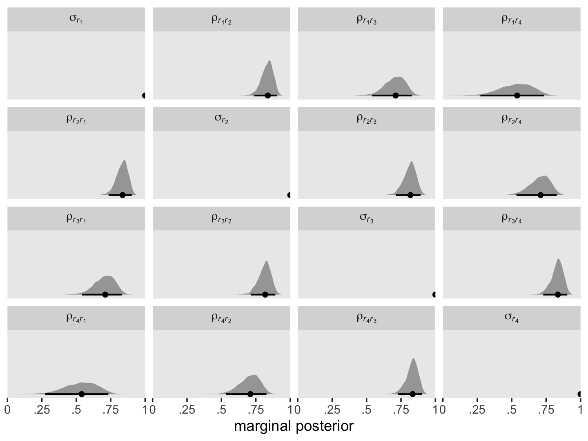

As before, it might be helpful to reduce the complexity of this plot by
focusing on the posterior medians. We’ll make a plot version of the
correlation matrix in the middle of page 256 in the text.

``` r
sigma %>% 
  select(`sigma[italic(r)[1]]`:`sigma[italic(r)[4]]`) %>% 
  pivot_longer(everything()) %>%  
  mutate(name = factor(name, levels = levels)) %>% 
  group_by(name) %>% 
  median_qi(value) %>% 
  mutate(label = round(value, digits = 2)) %>% 
  
  ggplot(aes(x = 0, y = 0)) +
  geom_tile(aes(fill = value)) +
  geom_text(aes(label = label)) +
  scale_fill_viridis_c("posterior\nmedian", option = "A", limits = c(0, 1)) +
  scale_x_continuous(NULL, breaks = NULL, expand = c(0, 0)) +
  scale_y_continuous(NULL, breaks = NULL, expand = c(0, 0)) +
  labs(subtitle = expression(Omega[r]*" for the standard multilevel model for change")) +
  theme(legend.text = element_text(hjust = 1)) +
  facet_wrap(~ name, labeller = label_parsed)
```


The correlation matrix has an even more pronounced band-diagonal
structure.

## 7.3 Postulating an alternative error covariance structure

Singer and Willett wrote:

> it is easy to specify alternative covariance structures for the
> composite residual and determine analytically which specification—the
> “standard” or an alternative—fits best. You already possess the
> analytic tools and skills needed for this work. (p. 257)

This is true using well-developed frequentist software, such as the
[**nlme** package](https://CRAN.R-project.org/package=nlme) ([Pinheiro
et al., 2021](#ref-R-nlme)). Although I’m confident this is possible
using Stan directly, it is not fully possible with **brms**. For
details, see [issue
\#403](https://github.com/paul-buerkner/brms/issues/403) in the **brms**
GitHub repo.

Anyway, the six error structures listed in this section were:

-   unstructured,
-   compound symmetric,
-   heterogeneous compound symmetric,
-   autoregressive,
-   heterogeneous autoregressive, and
-   Toeplitz.

The ones currently available with **brms** are:

-   compound symmetric,
-   heterogeneous compound symmetric,
-   autoregressive, and
-   heterogeneous autoregressive.

### 7.3.1 Unstructured error covariance matrix.

Models using an unstructured error covariance matrix include
*k*(*k* + 1)/2 variance/covariance parameters, where *k* is the number
of time waves in the data. In the case of our `opposites_pp` data, we
can compute the number of parameters as follows.

``` r
k <- 4

k * (k + 1) / 2
```

    ## [1] 10

We end up with four variances and 6 covariances. Following the notation
Singer and Willett used in the upper left corner of Table 7.3 (p. 258),
we can express this as

$$
\\begin{align\*}
\\mathbf{\\Sigma\_r} & = \\begin{bmatrix} 
  \\sigma\_1^2 & \\sigma\_{12} & \\sigma\_{13} & \\sigma\_{14} \\\\
  \\sigma\_{21} & \\sigma\_2^2 & \\sigma\_{23} & \\sigma\_{24} \\\\
  \\sigma\_{31} & \\sigma\_{32} & \\sigma\_3^2 & \\sigma\_{34} \\\\
  \\sigma\_{41} & \\sigma\_{42} & \\sigma\_{43} & \\sigma\_4^2 \\end{bmatrix}.
\\end{align\*}
$$

> The great appeal of an unstructured error covariance structure is that
> it places no restrictions on the structure of **Σ**<sub>**r**</sub>.
> For a given set of fixed effects, its deviance statistic will always
> be the smallest of any error covariance structure. If you have just a
> few waves of data, this choice can be attractive. But if you have many
> waves, it can require an exorbitant number of parameters… \[However,\]
> the “standard” model requires only 3 variance components
> (*σ*<sub>0</sub><sup>2</sup>, *σ*<sub>1</sub><sup>2</sup>, and
> *σ*<sub>*ϵ*</sub><sup>2</sup>) and one covariance component,
> *σ*<sub>01</sub>. (p. 260)

Sadly, we will not be fitting this model, at this time.

### 7.3.2 Compound symmetric error covariance matrix.

“A *compound symmetric* error covariance matrix requires just two
parameters, labeled *σ*<sup>2</sup> and *σ*<sub>1</sub><sup>2</sup> in
table 7.3” (p. 260). From the table, we see that matrix follows the form

$$
\\begin{align\*}
\\mathbf{\\Sigma\_r} & = \\begin{bmatrix} 
  \\sigma^2 + \\sigma\_1^2 & \\sigma\_1^2 & \\sigma\_1^2 & \\sigma\_1^2 \\\\
  \\sigma\_1^2 & \\sigma^2 + \\sigma\_1^2 & \\sigma\_1^2 & \\sigma\_1^2 \\\\
  \\sigma\_1^2 & \\sigma\_1^2 & \\sigma^2 + \\sigma\_1^2 & \\sigma\_1^2 \\\\
  \\sigma\_1^2 & \\sigma\_1^2 & \\sigma\_1^2 & \\sigma^2 + \\sigma\_1^2 \\end{bmatrix},
\\end{align\*}
$$

where *σ*<sub>1</sub><sup>2</sup> does not have the same meaning we’ve
become accustomed to (i.e., the level-2 variance in linear change over
time). The meaning of *σ*<sup>2</sup> might also be a little opaque.
Happily, there’s another way to express this matrix, which is a
modification of the heterogeneous compound symmetric matrix we see
listed in Table 7.3. That alternative is:

$$
\\begin{align\*}
\\mathbf{\\Sigma\_r} & = \\begin{bmatrix} 
  \\sigma\_\\epsilon^2 & \\sigma\_\\epsilon^2 \\rho & \\sigma\_\\epsilon^2 \\rho & \\sigma\_\\epsilon^2 \\rho \\\\
  \\sigma\_\\epsilon^2 \\rho & \\sigma\_\\epsilon^2 & \\sigma\_\\epsilon^2 \\rho & \\sigma\_\\epsilon^2 \\rho \\\\
  \\sigma\_\\epsilon^2 \\rho & \\sigma\_\\epsilon^2 \\rho & \\sigma\_\\epsilon^2 & \\sigma\_\\epsilon^2 \\rho \\\\
  \\sigma\_\\epsilon^2 \\rho & \\sigma\_\\epsilon^2 \\rho & \\sigma\_\\epsilon^2 \\rho & \\sigma\_\\epsilon^2 \\end{bmatrix},
\\end{align\*}
$$

where the term on the diagonal, *σ*<sub>*ϵ*</sub><sup>2</sup>, is the
residual variance, which is constrained to equality across all four time
points. In all cells in the off-diagonal, we see
*σ*<sub>*ϵ*</sub><sup>2</sup> multiplied by *ρ*. In this
parameterization, *ρ* is the correlation between time points and that
correlation is constrained to equality across all possible pairs of time
points. Although this notation is a little different from the notation
used in the text, I believe it will help us interpret our model. As
we’ll see, **brms** uses this alternative parameterization.

To fit the compound symmetric model with **brms**, we use the `cosy()`
function. Notice how we’ve dropped the usual `(1 + time | id)` syntax.
Instead, we impose compound symmetry *within persons* by setting
`gr = id` within `cosy()`. Here I’m going to continue using default
priors.

``` r
fit7.3 <-
  brm(data = opposites_pp,
      family = gaussian,
      opp ~ 0 + Intercept + time + ccog + time:ccog + cosy(gr = id),
      iter = 2000, warmup = 1000, chains = 4, cores = 4,
      seed = 7,
      file = "/Users/solomonkurz/Dropbox/Recoding Applied Longitudinal Data Analysis/fits/fit07.03")
```

Check the model summary.

``` r
print(fit7.3, digits = 3)
```

    ##  Family: gaussian 
    ##   Links: mu = identity; sigma = identity 
    ## Formula: opp ~ 0 + Intercept + time + ccog + time:ccog + cosy(gr = id) 
    ##    Data: opposites_pp (Number of observations: 140) 
    ## Samples: 4 chains, each with iter = 2000; warmup = 1000; thin = 1;
    ##          total post-warmup samples = 4000
    ## 
    ## Correlation Structures:
    ##      Estimate Est.Error l-95% CI u-95% CI  Rhat Bulk_ESS Tail_ESS
    ## cosy    0.723     0.060    0.595    0.827 1.000     2340     2248
    ## 
    ## Population-Level Effects: 
    ##           Estimate Est.Error l-95% CI u-95% CI  Rhat Bulk_ESS Tail_ESS
    ## Intercept  164.334     5.823  152.889  175.562 1.001     3430     2980
    ## time        26.943     1.415   24.201   29.731 1.000     3644     3275
    ## ccog        -0.135     0.468   -1.032    0.801 1.002     3206     2914
    ## time:ccog    0.435     0.112    0.217    0.648 1.001     3079     2960
    ## 
    ## Family Specific Parameters: 
    ##       Estimate Est.Error l-95% CI u-95% CI  Rhat Bulk_ESS Tail_ESS
    ## sigma   35.547     3.394   29.753   43.128 1.000     2434     2397
    ## 
    ## Samples were drawn using sampling(NUTS). For each parameter, Bulk_ESS
    ## and Tail_ESS are effective sample size measures, and Rhat is the potential
    ## scale reduction factor on split chains (at convergence, Rhat = 1).

See that new `cosy` row? That’s *ρ*, the residual correlation among the
time points. The `sigma` row on the bottom has it’s typical
interpretation, it’s the residual standard deviation, what we typically
call *σ*<sub>*ϵ*</sub>. Square it and you’ll have what we called
*σ*<sub>*ϵ*</sub><sup>2</sup> in the matrix, above. Okay, since our
**brms** model is parameterized differently from what Singer and Willett
reported in the text (see Table 7.3, p. 258), we’ll wrangle the
posterior draws a bit.

``` r
sigma.cs <-
  posterior_samples(fit7.3) %>%
  transmute(rho                    = cosy,
            sigma_e                = sigma,
            `sigma^2 + sigma[1]^2` = sigma^2) %>%
  mutate(`sigma[1]^2` = rho * sigma_e^2) %>% 
  mutate(`sigma^2` = `sigma^2 + sigma[1]^2` - `sigma[1]^2`)

# what did we do?
head(sigma.cs)
```

    ##         rho  sigma_e sigma^2 + sigma[1]^2 sigma[1]^2  sigma^2
    ## 1 0.7219192 35.42746            1255.1046   906.0841 349.0205
    ## 2 0.7494375 37.27736            1389.6013  1041.4194 348.1819
    ## 3 0.7250046 32.72702            1071.0575   776.5216 294.5359
    ## 4 0.6998551 32.91629            1083.4820   758.2804 325.2016
    ## 5 0.7394612 34.93961            1220.7763   902.7166 318.0596
    ## 6 0.6151512 31.50938             992.8412   610.7474 382.0938

Here’s the numeric summary.

``` r
sigma.cs %>% 
  pivot_longer(everything()) %>% 
  group_by(name) %>% 
  median_qi(value) %>% 
  mutate_if(is.double, round, digits = 2)
```

    ## # A tibble: 5 x 7
    ##   name                   value .lower  .upper .width .point .interval
    ##   <chr>                  <dbl>  <dbl>   <dbl>  <dbl> <chr>  <chr>    
    ## 1 rho                     0.73   0.59    0.83   0.95 median qi       
    ## 2 sigma_e                35.2   29.8    43.1    0.95 median qi       
    ## 3 sigma[1]^2            898.   551.   1510.     0.95 median qi       
    ## 4 sigma^2               338.   260.    456.     0.95 median qi       
    ## 5 sigma^2 + sigma[1]^2 1241.   885.   1860      0.95 median qi

To simplify, we might pull the posterior medians for
*σ*<sup>2</sup> + *σ*<sub>1</sub><sup>2</sup> and
*σ*<sub>1</sub><sup>2</sup>. We’ll call them `diagonal` and
`off_diagonal`, respectively.

``` r
diagonal <- median(sigma.cs$`sigma^2 + sigma[1]^2`)
off_diagonal <- median(sigma.cs$`sigma[1]^2`)
```

Now we have them, we can make our colored version of the
**Σ**<sub>**r**</sub> Singer and Willett reported in the rightmost
column of Table 7.3.

``` r
crossing(row = 1:4,
         col = factor(1:4)) %>% 
  mutate(value = if_else(row == col, diagonal, off_diagonal)) %>% 
  mutate(label = round(value, digits = 0),
         col = fct_rev(col)) %>% 
  
  ggplot(aes(x = row, y = col)) +
  geom_tile(aes(fill = value)) +
  geom_text(aes(label = label)) +
  scale_fill_viridis_c("posterior\nmedian", option = "A", limits = c(0, NA)) +
  scale_x_continuous(NULL, breaks = NULL, position = "top", expand = c(0, 0)) +
  scale_y_discrete(NULL, breaks = NULL, expand = c(0, 0)) +
  labs(subtitle = expression(Sigma[r]*" for the compound symmetric model")) +
  theme(legend.text = element_text(hjust = 1))
```

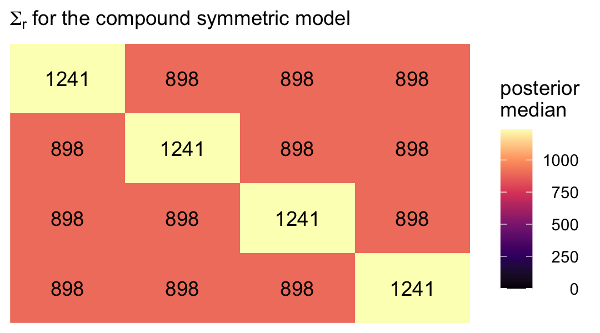

### 7.3.3 Heterogeneous compound symmetric error covariance matrix .

Now we extend the compound symmetric matrix by allowing the residual
variances to vary across the time waves. Thus, instead of a single
*σ*<sub>*ϵ*</sub><sup>2</sup> parameter, we’ll have
*σ*<sub>1</sub><sup>2</sup> through *σ*<sub>4</sub><sup>2</sup>.
However, we still have a single correlation parameter *ρ*. We can
express this as

$$
\\begin{align\*}
\\mathbf{\\Sigma\_r} & = \\begin{bmatrix} 
  \\sigma\_1^2 & \\sigma\_1 \\sigma\_2 \\rho & \\sigma\_1 \\sigma\_3 \\rho & \\sigma\_1 \\sigma\_4 \\rho \\\\
  \\sigma\_2 \\sigma\_1 \\rho & \\sigma\_1^2 & \\sigma\_2 \\sigma\_3 \\rho & \\sigma\_2 \\sigma\_4 \\rho \\\\
  \\sigma\_3 \\sigma\_1 \\rho & \\sigma\_3 \\sigma\_2 \\rho & \\sigma\_3^2 & \\sigma\_3 \\sigma\_4 \\rho \\\\
  \\sigma\_4 \\sigma\_1 \\rho & \\sigma\_4 \\sigma\_2 \\rho & \\sigma\_4 \\sigma\_3 \\rho & \\sigma\_4^2 \\end{bmatrix},
\\end{align\*}
$$

where, even though the correlation is the same in all cells, the
covariances will differ because they are based on different combinations
of the *σ* parameters. To fit this model with **brms**, we will continue
to use `cosy(gr = id)`. But now we wrap the entire model `formula`
within the `bf()` function and allow the residual standard deviations to
vary across he waves with the line `sigma ~ 0 + factor(time)`.

``` r
fit7.4 <-
  brm(data = opposites_pp,
      family = gaussian,
      bf(opp ~ 0 + Intercept + time + ccog + time:ccog + cosy(gr = id),
         sigma ~ 0 + factor(time)), 
      iter = 2000, warmup = 1000, chains = 4, cores = 4,
      seed = 7,
      file = "/Users/solomonkurz/Dropbox/Recoding Applied Longitudinal Data Analysis/fits/fit07.04")
```

Check the summary.

``` r
print(fit7.4, digits = 3)
```

    ##  Family: gaussian 
    ##   Links: mu = identity; sigma = log 
    ## Formula: opp ~ 0 + Intercept + time + ccog + time:ccog + cosy(gr = id) 
    ##          sigma ~ 0 + factor(time)
    ##    Data: opposites_pp (Number of observations: 140) 
    ## Samples: 4 chains, each with iter = 2000; warmup = 1000; thin = 1;
    ##          total post-warmup samples = 4000
    ## 
    ## Correlation Structures:
    ##      Estimate Est.Error l-95% CI u-95% CI  Rhat Bulk_ESS Tail_ESS
    ## cosy    0.720     0.061    0.593    0.831 1.004     1466     2314
    ## 
    ## Population-Level Effects: 
    ##                   Estimate Est.Error l-95% CI u-95% CI  Rhat Bulk_ESS Tail_ESS
    ## Intercept          164.270     5.750  153.366  175.629 1.001     3655     3063
    ## time                26.961     1.455   24.194   29.764 1.000     3999     2977
    ## ccog                -0.185     0.477   -1.104    0.745 1.001     3090     2225
    ## time:ccog            0.440     0.122    0.205    0.684 1.001     3554     3011
    ## sigma_factortime0    3.641     0.123    3.413    3.892 1.001     1657     1995
    ## sigma_factortime1    3.492     0.120    3.269    3.737 1.003     1569     2068
    ## sigma_factortime2    3.526     0.119    3.300    3.770 1.001     1595     2006
    ## sigma_factortime3    3.591     0.123    3.362    3.845 1.001     1738     2148
    ## 
    ## Samples were drawn using sampling(NUTS). For each parameter, Bulk_ESS
    ## and Tail_ESS are effective sample size measures, and Rhat is the potential
    ## scale reduction factor on split chains (at convergence, Rhat = 1).

If you look at the second row in the output, you’ll see that the
**brms** default was to model log (*σ*<sub>*j*</sub>). Thus, you’ll have
to exponentiate those posteriors to get them in their natural metric.
Here’s a quick conversion.

``` r
fixef(fit7.4)[5:8, -2] %>% exp()
```

    ##                   Estimate     Q2.5    Q97.5
    ## sigma_factortime0 38.12015 30.37103 48.98461
    ## sigma_factortime1 32.86281 26.28251 41.98388
    ## sigma_factortime2 34.00372 27.12306 43.37156
    ## sigma_factortime3 36.27896 28.85082 46.76505

To get the marginal posteriors for the full **Σ**<sub>**r**</sub>
matrix, we’ll want to work directly with the output from
`posterior_samples()`.

``` r
sigma.hcs <-
  posterior_samples(fit7.4) %>%
  transmute(`sigma[1]`   = exp(b_sigma_factortime0),
            `sigma[2]`   = exp(b_sigma_factortime1),
            `sigma[3]`   = exp(b_sigma_factortime2),
            `sigma[4]`   = exp(b_sigma_factortime3),
            
            rho          = cosy,
            
            `sigma[1]^2` = exp(b_sigma_factortime0)^2,
            `sigma[2]^2` = exp(b_sigma_factortime1)^2,
            `sigma[3]^2` = exp(b_sigma_factortime2)^2,
            `sigma[4]^2` = exp(b_sigma_factortime3)^2) %>% 
  mutate(`sigma[2]*sigma[1]*rho` = `sigma[2]` * `sigma[1]` * rho,
         `sigma[3]*sigma[1]*rho` = `sigma[3]` * `sigma[1]` * rho,
         `sigma[4]*sigma[1]*rho` = `sigma[4]` * `sigma[1]` * rho,
         
         `sigma[1]*sigma[2]*rho` = `sigma[1]` * `sigma[2]` * rho,
         `sigma[3]*sigma[2]*rho` = `sigma[3]` * `sigma[2]` * rho,
         `sigma[4]*sigma[2]*rho` = `sigma[4]` * `sigma[2]` * rho,
         
         `sigma[1]*sigma[3]*rho` = `sigma[1]` * `sigma[3]` * rho,
         `sigma[2]*sigma[3]*rho` = `sigma[2]` * `sigma[3]` * rho,
         `sigma[4]*sigma[3]*rho` = `sigma[4]` * `sigma[3]` * rho,
         
         `sigma[1]*sigma[4]*rho` = `sigma[1]` * `sigma[4]` * rho,
         `sigma[2]*sigma[4]*rho` = `sigma[2]` * `sigma[4]` * rho,
         `sigma[3]*sigma[4]*rho` = `sigma[3]` * `sigma[4]` * rho)

# what did we do?
glimpse(sigma.hcs)
```

    ## Rows: 4,000
    ## Columns: 21
    ## $ `sigma[1]`              <dbl> 41.85132, 38.65440, 40.77677, 30.09685, 37.94403, 37.23519, 41.94114, 41.729…
    ## $ `sigma[2]`              <dbl> 33.81528, 36.10225, 31.93459, 29.61036, 29.35018, 36.12772, 38.17655, 34.133…
    ## $ `sigma[3]`              <dbl> 35.34227, 35.37198, 32.24759, 32.54710, 29.85463, 39.07556, 33.96816, 40.043…
    ## $ `sigma[4]`              <dbl> 41.64490, 37.74948, 38.39477, 29.71172, 36.03059, 36.93605, 37.92641, 39.046…
    ## $ rho                     <dbl> 0.7446126, 0.7495575, 0.7674150, 0.6246432, 0.7162821, 0.7250642, 0.7615343,…
    ## $ `sigma[1]^2`            <dbl> 1751.5327, 1494.1627, 1662.7449, 905.8203, 1439.7497, 1386.4594, 1759.0595, …
    ## $ `sigma[2]^2`            <dbl> 1143.4730, 1303.3725, 1019.8177, 876.7737, 861.4330, 1305.2119, 1457.4493, 1…
    ## $ `sigma[3]^2`            <dbl> 1249.0761, 1251.1770, 1039.9072, 1059.3135, 891.2992, 1526.8992, 1153.8356, …
    ## $ `sigma[4]^2`            <dbl> 1734.2976, 1425.0231, 1474.1585, 882.7862, 1298.2033, 1364.2715, 1438.4124, …
    ## $ `sigma[2]*sigma[1]*rho` <dbl> 1053.7861, 1046.0156, 999.3196, 556.6687, 797.6977, 975.3726, 1219.3447, 112…
    ## $ `sigma[3]*sigma[1]*rho` <dbl> 1101.3718, 1024.8570, 1009.1144, 611.8786, 811.4081, 1054.9582, 1084.9300, 1…
    ## $ `sigma[4]*sigma[1]*rho` <dbl> 1297.7808, 1093.7419, 1201.4763, 558.5741, 979.2621, 997.1958, 1211.3551, 12…
    ## $ `sigma[1]*sigma[2]*rho` <dbl> 1053.7861, 1046.0156, 999.3196, 556.6687, 797.6977, 975.3726, 1219.3447, 112…
    ## $ `sigma[3]*sigma[2]*rho` <dbl> 889.8930, 957.1910, 790.2943, 601.9882, 627.6342, 1023.5809, 987.5479, 1082.…
    ## $ `sigma[4]*sigma[2]*rho` <dbl> 1048.5887, 1021.5277, 940.9438, 549.5453, 757.4713, 967.5366, 1102.6252, 105…
    ## $ `sigma[1]*sigma[3]*rho` <dbl> 1101.3718, 1024.8570, 1009.1144, 611.8786, 811.4081, 1054.9582, 1084.9300, 1…
    ## $ `sigma[2]*sigma[3]*rho` <dbl> 889.8930, 957.1910, 790.2943, 601.9882, 627.6342, 1023.5809, 987.5479, 1082.…
    ## $ `sigma[4]*sigma[3]*rho` <dbl> 1095.9397, 1000.8645, 950.1664, 604.0488, 770.4904, 1046.4827, 981.0772, 123…
    ## $ `sigma[1]*sigma[4]*rho` <dbl> 1297.7808, 1093.7419, 1201.4763, 558.5741, 979.2621, 997.1958, 1211.3551, 12…
    ## $ `sigma[2]*sigma[4]*rho` <dbl> 1048.5887, 1021.5277, 940.9438, 549.5453, 757.4713, 967.5366, 1102.6252, 105…
    ## $ `sigma[3]*sigma[4]*rho` <dbl> 1095.9397, 1000.8645, 950.1664, 604.0488, 770.4904, 1046.4827, 981.0772, 123…

Here’s the numeric summary.

``` r
sigma.hcs %>% 
  pivot_longer(everything()) %>% 
  group_by(name) %>% 
  median_qi(value) %>% 
  mutate_if(is.double, round, digits = 2)
```

    ## # A tibble: 21 x 7
    ##    name                    value .lower  .upper .width .point .interval
    ##    <chr>                   <dbl>  <dbl>   <dbl>  <dbl> <chr>  <chr>    
    ##  1 rho                      0.72   0.59    0.83   0.95 median qi       
    ##  2 sigma[1]                38.0   30.4    49.0    0.95 median qi       
    ##  3 sigma[1]*sigma[2]*rho  893.   523.   1588.     0.95 median qi       
    ##  4 sigma[1]*sigma[3]*rho  924.   540.   1624.     0.95 median qi       
    ##  5 sigma[1]*sigma[4]*rho  984.   579.   1774.     0.95 median qi       
    ##  6 sigma[1]^2            1442.   922.   2399.     0.95 median qi       
    ##  7 sigma[2]                32.8   26.3    42.0    0.95 median qi       
    ##  8 sigma[2]*sigma[1]*rho  893.   523.   1588.     0.95 median qi       
    ##  9 sigma[2]*sigma[3]*rho  793.   475.   1398.     0.95 median qi       
    ## 10 sigma[2]*sigma[4]*rho  847.   500.   1504.     0.95 median qi       
    ## # … with 11 more rows

That’s a lot of information to wade through. Here we simplify the
picture by making our plot version of the matrix Singer and Willett
reported in the rightmost column of Table 7.3.

``` r
# arrange the panels
levels <- 
  c("sigma[1]^2", "sigma[1]*sigma[2]*rho", "sigma[1]*sigma[3]*rho", "sigma[1]*sigma[4]*rho", 
    "sigma[2]*sigma[1]*rho", "sigma[2]^2", "sigma[2]*sigma[3]*rho", "sigma[2]*sigma[4]*rho", 
    "sigma[3]*sigma[1]*rho", "sigma[3]*sigma[2]*rho", "sigma[3]^2", "sigma[3]*sigma[4]*rho", 
    "sigma[4]*sigma[1]*rho", "sigma[4]*sigma[2]*rho", "sigma[4]*sigma[3]*rho", "sigma[4]^2")


sigma.hcs %>% 
  select(`sigma[1]^2`:`sigma[3]*sigma[4]*rho`) %>% 
  pivot_longer(everything()) %>%  
  mutate(name = factor(name, levels = levels)) %>% 
  group_by(name) %>% 
  median_qi(value) %>% 
  mutate(label = round(value, digits = 0)) %>% 
  
  ggplot(aes(x = 0, y = 0)) +
  geom_tile(aes(fill = value)) +
  geom_text(aes(label = label)) +
  scale_fill_viridis_c("posterior\nmedian", option = "A", limits = c(0, NA)) +
  scale_x_continuous(NULL, breaks = NULL, expand = c(0, 0)) +
  scale_y_continuous(NULL, breaks = NULL, expand = c(0, 0)) +
  labs(subtitle = expression(Sigma[r]*" for the heterogeneous compound symmetric model")) +
  theme(legend.text = element_text(hjust = 1)) +
  facet_wrap(~ name, labeller = label_parsed)
```

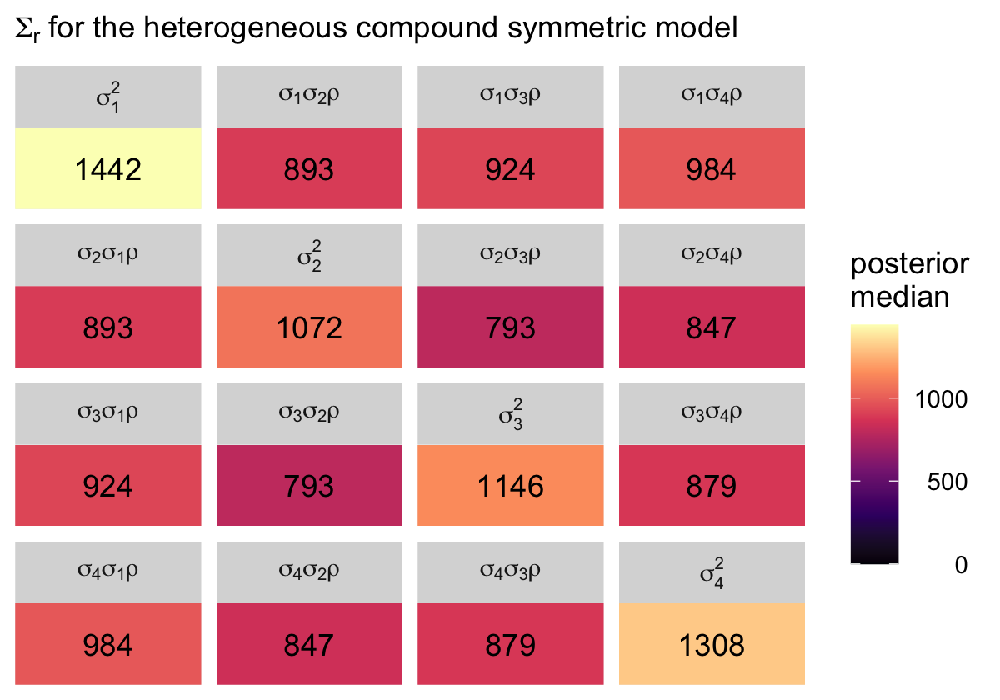

### 7.3.4 Autoregressive error covariance matrix.

The first-order autoregressive has a strict “band-diagonal” structure
governed by two parameters, which Singer and Willett called
*σ*<sup>2</sup> and *ρ*. From Table 7.3 (p. 260), we see that matrix
follows the form

$$
\\begin{align\*}
\\mathbf{\\Sigma\_r} & = \\begin{bmatrix} 
  \\sigma^2 & \\sigma^2 \\rho & \\sigma^2 \\rho^2 & \\sigma^2 \\rho^3 \\\\
  \\sigma^2 \\rho & \\sigma^2 & \\sigma^2 \\rho & \\sigma^2 \\rho^2 \\\\
  \\sigma^2 \\rho^2 & \\sigma^2 \\rho & \\sigma^2 & \\sigma^2 \\rho \\\\
  \\sigma^2 \\rho^3 & \\sigma^2 \\rho^2 & \\sigma^2 \\rho & \\sigma^2 \\end{bmatrix},
\\end{align\*}
$$

where *ρ* is the correlation of one time point to the one immediately
before or after, after conditioning on the liner model. In a similar
way, *ρ*<sup>2</sup> is the correlation between time points with one
degree of separation (e.g., time 1 with time 3) and *ρ*<sup>3</sup> is
the correlation between the first and fourth time point. The other
parameter, *σ*<sup>2</sup> is the residual variance after conditioning
on the linear model.

Once can fit this model with **brms** using a version of the `ar()`
syntax. However, the model will follow a slightly different
parameterization, following the form:

$$
\\begin{align\*}
\\mathbf{\\Sigma\_r} & = \\begin{bmatrix} 
  \\left (\\sigma\_\\epsilon \\Big / \\sqrt{1 - \\rho^2} \\right )^2 & \\left (\\sigma\_\\epsilon \\Big / \\sqrt{1 - \\rho^2} \\right )^2 \\rho & \\left (\\sigma\_\\epsilon \\Big / \\sqrt{1 - \\rho^2} \\right )^2 \\rho^2 & \\left (\\sigma\_\\epsilon \\Big / \\sqrt{1 - \\rho^2} \\right )^2 \\rho^3 \\\\
  \\left (\\sigma\_\\epsilon \\Big / \\sqrt{1 - \\rho^2} \\right )^2 \\rho & \\left (\\sigma\_\\epsilon \\Big / \\sqrt{1 - \\rho^2} \\right )^2 & \\left (\\sigma\_\\epsilon \\Big / \\sqrt{1 - \\rho^2} \\right )^2 \\rho & \\left (\\sigma\_\\epsilon \\Big / \\sqrt{1 - \\rho^2} \\right )^2 \\rho^2 \\\\
  \\left (\\sigma\_\\epsilon \\Big / \\sqrt{1 - \\rho^2} \\right )^2 \\rho^2 & \\left (\\sigma\_\\epsilon \\Big / \\sqrt{1 - \\rho^2} \\right )^2 \\rho & \\left (\\sigma\_\\epsilon \\Big / \\sqrt{1 - \\rho^2} \\right )^2 & \\left (\\sigma\_\\epsilon \\Big / \\sqrt{1 - \\rho^2} \\right )^2 \\rho \\\\
  \\left (\\sigma\_\\epsilon \\Big / \\sqrt{1 - \\rho^2} \\right )^2 \\rho^3 & \\left (\\sigma\_\\epsilon \\Big / \\sqrt{1 - \\rho^2} \\right )^2 \\rho^2 & \\left (\\sigma\_\\epsilon \\Big / \\sqrt{1 - \\rho^2} \\right )^2 \\rho & \\left (\\sigma\_\\epsilon \\Big / \\sqrt{1 - \\rho^2} \\right )^2
  \\end{bmatrix},\\\\
\\end{align\*}
$$

where *σ*<sub>*ϵ*</sub> is the residual variance after conditioning on
both the linear model AND the autoregressive correlation *ρ*. It’s not
clear to me why **brms** is parameterized this way, but this is what
we’ve got. But the main point to get is that what Singer and Willett
called *σ* in their autoregressive model, we’ll have to call
$\\sigma\_\\epsilon \\Big / \\sqrt{1 - \\rho^2}$. Thus, if you
substitute our verbose **brms** term
$\\sigma\_\\epsilon \\Big / \\sqrt{1 - \\rho^2}$ for Singer and
Willett’s compact term *σ*, you’ll see the hellish matrix above is the
same as the much simpler one before it.

To fit the first-order autoregressive model with **brms**, we use the
`ar()` function. As with the compound symmetry models, notice how we
continue to omit the `(1 + time | id)` syntax. Instead, we impose the
autoregressive structure *within persons* by setting `gr = id` within
`ar()`. We also set `cov = TRUE`.

``` r
fit7.5 <-
  brm(data = opposites_pp,
      family = gaussian,
      opp ~ 0 + Intercept + time + ccog + time:ccog + ar(gr = id, cov = TRUE),
      iter = 2000, warmup = 1000, chains = 4, cores = 4,
      seed = 7,
      file = "/Users/solomonkurz/Dropbox/Recoding Applied Longitudinal Data Analysis/fits/fit07.05")
```

Check the summary.

``` r
print(fit7.5, digits = 3)
```

    ##  Family: gaussian 
    ##   Links: mu = identity; sigma = identity 
    ## Formula: opp ~ 0 + Intercept + time + ccog + time:ccog + ar(gr = id, cov = TRUE) 
    ##    Data: opposites_pp (Number of observations: 140) 
    ## Samples: 4 chains, each with iter = 2000; warmup = 1000; thin = 1;
    ##          total post-warmup samples = 4000
    ## 
    ## Correlation Structures:
    ##       Estimate Est.Error l-95% CI u-95% CI  Rhat Bulk_ESS Tail_ESS
    ## ar[1]    0.816     0.042    0.725    0.887 1.001     4025     3123
    ## 
    ## Population-Level Effects: 
    ##           Estimate Est.Error l-95% CI u-95% CI  Rhat Bulk_ESS Tail_ESS
    ## Intercept  164.459     6.105  152.211  176.478 0.999     4206     3240
    ## time        27.191     1.924   23.293   30.864 1.001     3988     3062
    ## ccog        -0.022     0.480   -0.948    0.911 1.001     3923     3487
    ## time:ccog    0.417     0.153    0.107    0.712 1.002     3720     3164
    ## 
    ## Family Specific Parameters: 
    ##       Estimate Est.Error l-95% CI u-95% CI  Rhat Bulk_ESS Tail_ESS
    ## sigma   20.323     1.335   17.898   23.096 1.002     4681     3110
    ## 
    ## Samples were drawn using sampling(NUTS). For each parameter, Bulk_ESS
    ## and Tail_ESS are effective sample size measures, and Rhat is the potential
    ## scale reduction factor on split chains (at convergence, Rhat = 1).

The `ar[1]` row in our summary is *ρ*. As we discussed just before
fitting the model, the `sigma` line is the summary for what I’m calling
*σ*<sub>*ϵ*</sub>, which is the residual standard deviation after
conditioning on both the linear model AND *ρ*. If we rename the
*σ*<sup>2</sup> parameter in the text as
*σ*<sub>Singer & Willett (2003)</sub><sup>2</sup>, we can convert our
*σ*<sub>*ϵ*</sub> parameter to that metric using the formula

$$\\sigma\_\\text{Singer & Willett (2003)}^2 = \\left (\\sigma\_\\epsilon \\Big / \\sqrt{1 - \\rho^2} \\right )^2.$$

With that formula in hand, we’re ready to compute the marginal
posteriors for the full **Σ**<sub>**r**</sub> matrix, saving the results
as `sigma.ar`.

``` r
sigma.ar <-
  posterior_samples(fit7.5) %>% 
  mutate(sigma_e = sigma,
         sigma   = sigma_e / sqrt(1 - `ar[1]`^2)) %>% 
  transmute(rho             = `ar[1]`,
            `sigma^2`       = sigma^2,
            `sigma^2 rho`   = sigma^2 * rho,
            `sigma^2 rho^2` = sigma^2 * rho^2,
            `sigma^2 rho^3` = sigma^2 * rho^3)
```

Here’s the numeric summary.

``` r
sigma.ar %>% 
  pivot_longer(everything()) %>% 
  group_by(name) %>% 
  median_qi(value) %>% 
  mutate_if(is.double, round, digits = 2)
```

    ## # A tibble: 5 x 7
    ##   name            value .lower  .upper .width .point .interval
    ##   <chr>           <dbl>  <dbl>   <dbl>  <dbl> <chr>  <chr>    
    ## 1 rho              0.82   0.72    0.89   0.95 median qi       
    ## 2 sigma^2       1247.   880.   1967.     0.95 median qi       
    ## 3 sigma^2 rho   1019.   660.   1726.     0.95 median qi       
    ## 4 sigma^2 rho^2  833.   488.   1512.     0.95 median qi       
    ## 5 sigma^2 rho^3  680.   358.   1329.     0.95 median qi

To simplify, we might pull the posterior medians for *σ*<sup>2</sup>
through *σ*<sup>2</sup>*ρ*<sup>3</sup>.

``` r
s2   <- median(sigma.ar$`sigma^2`)
s2p  <- median(sigma.ar$`sigma^2 rho`)
s2p2 <- median(sigma.ar$`sigma^2 rho^2`)
s2p3 <- median(sigma.ar$`sigma^2 rho^3`)
```

Now we have them, we can make our colored version of the
**Σ**<sub>**r**</sub> Singer and Willett reported in the rightmost
column of Table 7.3.

``` r
crossing(row = 1:4,
         col = factor(1:4)) %>% 
  mutate(value = c(s2, s2p, s2p2, s2p3,
                   s2p, s2, s2p, s2p2,
                   s2p2, s2p, s2, s2p,
                   s2p3, s2p2, s2p, s2)) %>% 
  mutate(label = round(value, digits = 0),
         col   = fct_rev(col)) %>% 
  
  ggplot(aes(x = row, y = col)) +
  geom_tile(aes(fill = value)) +
  geom_text(aes(label = label)) +
  scale_fill_viridis_c("posterior\nmedian", option = "A", limits = c(0, NA)) +
  scale_x_continuous(NULL, breaks = NULL, position = "top", expand = c(0, 0)) +
  scale_y_discrete(NULL, breaks = NULL, expand = c(0, 0)) +
  labs(subtitle = expression(Sigma[r]*" for the autoregressive model")) +
  theme(legend.text = element_text(hjust = 1))
```

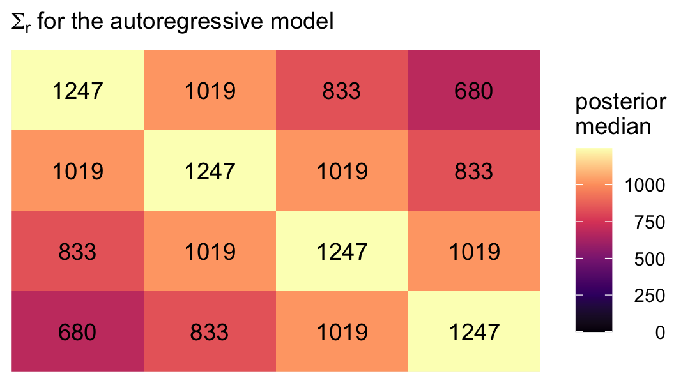

With this presentation, that strict band-diagonal structure really pops.

### 7.3.5 Heterogeneous autoregressive error covariance matrix.

For the heterogeneous autoregressive error covariance matrix, we relax
the assumption that the variances on the diagonal of the
**Σ**<sub>**r**</sub> matrix are constant across waves. From Table 7.3
(p. 260), we see that matrix follows the form

$$
\\begin{align\*}
\\mathbf{\\Sigma\_r} & = \\begin{bmatrix} 
  \\sigma\_1^2 & \\sigma\_1 \\sigma\_2 \\rho & \\sigma\_1 \\sigma\_3 \\rho^2 & \\sigma\_1 \\sigma\_4 \\rho^3 \\\\
  \\sigma\_2 \\sigma\_1 \\rho & \\sigma\_2^2 & \\sigma\_2 \\sigma\_3 \\rho & \\sigma\_2 \\sigma\_4 \\rho^2 \\\\
  \\sigma\_3 \\sigma\_1 \\rho^2 & \\sigma\_3 \\sigma\_2 \\rho & \\sigma\_3^2 & \\sigma\_3 \\sigma\_4 \\rho \\\\
  \\sigma\_4 \\sigma\_1 \\rho^3 & \\sigma\_4 \\sigma\_2 \\rho^2 & \\sigma\_4 \\sigma\_3 \\rho & \\sigma\_4^2 \\end{bmatrix},
\\end{align\*}
$$

where, as before, *ρ* is the correlation of one time point to the one
immediately before or after, after conditioning on the liner model. To
fit this model with **brms**, we continue to use the
`ar(gr = id, cov = TRUE)` syntax. The only adjustment is we now wrap the
`formula` within the `bf()` function and add a second line for `sigma`.

``` r
fit7.6 <-
  brm(data = opposites_pp,
      family = gaussian,
      bf(opp ~ 0 + Intercept + time + ccog + time:ccog + ar(gr = id, cov = TRUE),
         sigma ~ 0 + factor(time)), 
      iter = 2000, warmup = 1000, chains = 4, cores = 4,
      seed = 7,
      file = "/Users/solomonkurz/Dropbox/Recoding Applied Longitudinal Data Analysis/fits/fit07.06")
```

Inspect the parameter summary.

``` r
print(fit7.6, digits = 3)
```

    ##  Family: gaussian 
    ##   Links: mu = identity; sigma = log 
    ## Formula: opp ~ 0 + Intercept + time + ccog + time:ccog + ar(gr = id, cov = TRUE) 
    ##          sigma ~ 0 + factor(time)
    ##    Data: opposites_pp (Number of observations: 140) 
    ## Samples: 4 chains, each with iter = 2000; warmup = 1000; thin = 1;
    ##          total post-warmup samples = 4000
    ## 
    ## Correlation Structures:
    ##       Estimate Est.Error l-95% CI u-95% CI  Rhat Bulk_ESS Tail_ESS
    ## ar[1]    0.809     0.042    0.719    0.883 1.001     4271     3334
    ## 
    ## Population-Level Effects: 
    ##                   Estimate Est.Error l-95% CI u-95% CI  Rhat Bulk_ESS Tail_ESS
    ## Intercept          164.602     6.096  152.561  176.624 1.001     4766     3314
    ## time                27.168     1.919   23.385   30.872 1.000     4908     3165
    ## ccog                -0.114     0.502   -1.123    0.853 1.001     4394     2924
    ## time:ccog            0.428     0.160    0.109    0.738 1.000     4709     3146
    ## sigma_factortime0    3.066     0.104    2.873    3.275 1.001     3807     3074
    ## sigma_factortime1    2.967     0.087    2.811    3.148 1.002     3672     2606
    ## sigma_factortime2    3.010     0.085    2.852    3.184 1.001     3685     3249
    ## sigma_factortime3    3.024     0.102    2.834    3.237 1.001     3980     3363
    ## 
    ## Samples were drawn using sampling(NUTS). For each parameter, Bulk_ESS
    ## and Tail_ESS are effective sample size measures, and Rhat is the potential
    ## scale reduction factor on split chains (at convergence, Rhat = 1).

Here are the four *σ*<sub>*ϵ*</sub> posteriors, after exponentiation.

``` r
fixef(fit7.6)[5:8, -2] %>% exp()
```

    ##                   Estimate     Q2.5    Q97.5
    ## sigma_factortime0 21.45460 17.68570 26.45379
    ## sigma_factortime1 19.44171 16.62112 23.29692
    ## sigma_factortime2 20.29392 17.32410 24.13141
    ## sigma_factortime3 20.58007 17.01600 25.46914

Extending our workflow from the last section, here how we might compute
the marginal posteriors for the full **Σ**<sub>**r**</sub> matrix,
saving the results as `sigma.har`.

``` r
sigma.har <-
  posterior_samples(fit7.6) %>% 
  mutate(sigma_1e = exp(b_sigma_factortime0),
         sigma_2e = exp(b_sigma_factortime1),
         sigma_3e = exp(b_sigma_factortime2),
         sigma_4e = exp(b_sigma_factortime3)) %>% 
  mutate(sigma_1 = sigma_1e / sqrt(1 - `ar[1]`^2),
         sigma_2 = sigma_2e / sqrt(1 - `ar[1]`^2),
         sigma_3 = sigma_3e / sqrt(1 - `ar[1]`^2),
         sigma_4 = sigma_4e / sqrt(1 - `ar[1]`^2)) %>% 
  transmute(rho = `ar[1]`,
            
            `sigma_1^2` = sigma_1^2,
            `sigma_2^2` = sigma_2^2,
            `sigma_3^2` = sigma_3^2,
            `sigma_4^2` = sigma_4^2,
            
            `sigma_2 sigma_1 rho`   = sigma_2 * sigma_1 * rho,
            `sigma_3 sigma_1 rho^2` = sigma_3 * sigma_1 * rho^2,
            `sigma_4 sigma_1 rho^3` = sigma_4 * sigma_1 * rho^3,
            `sigma_3 sigma_2 rho`   = sigma_3 * sigma_2 * rho,
            `sigma_4 sigma_2 rho^2` = sigma_4 * sigma_2 * rho^2,
            `sigma_4 sigma_3 rho`   = sigma_4 * sigma_3 * rho)
```

Here’s the numeric summary.

``` r
sigma.har %>% 
  pivot_longer(everything()) %>% 
  group_by(name) %>% 
  median_qi(value) %>% 
  mutate_if(is.double, round, digits = 2)
```

    ## # A tibble: 11 x 7
    ##    name                    value .lower  .upper .width .point .interval
    ##    <chr>                   <dbl>  <dbl>   <dbl>  <dbl> <chr>  <chr>    
    ##  1 rho                      0.81   0.72    0.88   0.95 median qi       
    ##  2 sigma_1^2             1356.   882.   2263.     0.95 median qi       
    ##  3 sigma_2 sigma_1 rho    993.   622.   1716.     0.95 median qi       
    ##  4 sigma_2^2             1109.   729.   1853.     0.95 median qi       
    ##  5 sigma_3 sigma_1 rho^2  838.   486.   1539.     0.95 median qi       
    ##  6 sigma_3 sigma_2 rho    945.   572.   1609.     0.95 median qi       
    ##  7 sigma_3^2             1213.   777.   2032.     0.95 median qi       
    ##  8 sigma_4 sigma_1 rho^3  688.   359.   1339.     0.95 median qi       
    ##  9 sigma_4 sigma_2 rho^2  773.   436.   1384.     0.95 median qi       
    ## 10 sigma_4 sigma_3 rho    996.   618.   1690.     0.95 median qi       
    ## 11 sigma_4^2             1249.   798.   2040.     0.95 median qi

As in the last section, we might pull the posterior medians for
*σ*1<sup>2</sup> through *σ*<sub>4</sub><sup>2</sup>.

``` r
s12   <- median(sigma.har$`sigma_1^2`)
s22   <- median(sigma.har$`sigma_2^2`)
s32   <- median(sigma.har$`sigma_3^2`)
s42   <- median(sigma.har$`sigma_4^2`)

s2s1p  <- median(sigma.har$`sigma_2 sigma_1 rho`)

s3s1p2 <- median(sigma.har$`sigma_3 sigma_1 rho^2`)
s3s2p  <- median(sigma.har$`sigma_3 sigma_2 rho`)

s4s1p3 <- median(sigma.har$`sigma_4 sigma_1 rho^3`)
s4s2p2 <- median(sigma.har$`sigma_4 sigma_2 rho^2`)
s4s3p  <- median(sigma.har$`sigma_4 sigma_3 rho`)
```

Now we have them, we can make our colored version of the
**Σ**<sub>**r**</sub> Singer and Willett reported in the rightmost
column of Table 7.3.

``` r
crossing(row = 1:4,
         col = factor(1:4)) %>% 
  mutate(value = c(s12, s2s1p, s3s1p2, s4s1p3,
                   s2s1p, s22, s3s2p, s4s2p2,
                   s3s1p2, s3s2p, s32, s4s3p,
                   s4s1p3, s4s2p2, s4s3p, s42)) %>% 
  mutate(label = round(value, digits = 0),
         col   = fct_rev(col)) %>% 
  
  ggplot(aes(x = row, y = col)) +
  geom_tile(aes(fill = value)) +
  geom_text(aes(label = label)) +
  scale_fill_viridis_c("posterior\nmedian", option = "A", limits = c(0, NA)) +
  scale_x_continuous(NULL, breaks = NULL, position = "top", expand = c(0, 0)) +
  scale_y_discrete(NULL, breaks = NULL, expand = c(0, 0)) +
  labs(subtitle = expression(Sigma[r]*" for the heterogeneous autoregressive model")) +
  theme(legend.text = element_text(hjust = 1))
```

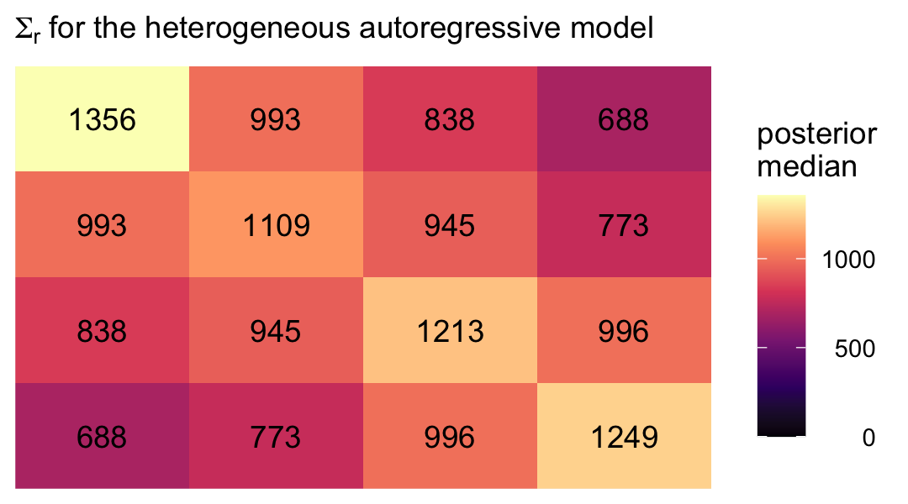

Even though there’s still a strict band diagonal correlation structure,
the heterogeneous variances allow for differences among the covariances
within the bands.

### 7.3.6 Toeplitz error covariance matrix.

Handy as it is, **brms** is not yet set up to fit models with the
Toeplitz error covariance matrix, at this time. For details, see
**brms** GitHub [issue
\#403](https://github.com/paul-buerkner/brms/issues/403#issuecomment-381404989).

### 7.3.7 Does choosing the “correct” error covariance structure really matter?

Now we have all our models, we might compare them with information
criteria, as was done in the text. Here we’ll use the WAIC. Forst,
compute and save the WAIC estimates.

``` r
fit7.1 <- add_criterion(fit7.1, criterion = "waic")
fit7.3 <- add_criterion(fit7.3, criterion = "waic")
fit7.4 <- add_criterion(fit7.4, criterion = "waic")
fit7.5 <- add_criterion(fit7.5, criterion = "waic")
fit7.6 <- add_criterion(fit7.6, criterion = "waic")
```

Now compare the models using WAIC differences and WAIC weights.

``` r
loo_compare(fit7.1, fit7.3, fit7.4, fit7.5, fit7.6, criterion = "waic") %>% print(simplify = F)
```

    ##        elpd_diff se_diff elpd_waic se_elpd_waic p_waic se_p_waic waic   se_waic
    ## fit7.1    0.0       0.0  -586.1       6.1         46.7    3.4    1172.2   12.2 
    ## fit7.5  -21.5       4.2  -607.6       8.5          3.4    0.5    1215.2   17.0 
    ## fit7.6  -24.3       4.3  -610.4       8.8          6.7    1.1    1220.9   17.6 
    ## fit7.3  -40.2       6.0  -626.3       8.1          4.6    0.7    1252.6   16.3 
    ## fit7.4  -41.9       5.4  -628.0       7.8          6.9    0.8    1256.0   15.6

``` r
model_weights(fit7.1, fit7.3, fit7.4, fit7.5, fit7.6, weights = "waic") %>% round(digits = 3)
```

    ## fit7.1 fit7.3 fit7.4 fit7.5 fit7.6 
    ##      1      0      0      0      0

By both criteria, the *standard* multilevel model for change was the
clear winner.

> Perhaps most important, consider how choice of an error covariance
> structure affects our ability to address our research questions,
> especially given that it is the *fixed effects*–and not the *variance
> components*–that usually embody these questions. Some might say that
> refining the error covariance structure for the multilevel model for
> change is akin to rearranging the deck chairs on the *Titanic*–it
> rarely fundamentally changes our parameter estimates. Indeed,
> regardless of the error structure chosen, estimates of the fixed
> effects are unbiased and may not be affected much by choices made in
> the stochastic part of the model (providing that neither the data, nor
> the error structure, are idiosyncratic). (p. 264, *emphasis* in the
> original)

For more on the idea that researchers generally just care about fixed
effects, see the paper by [McNeish et
al.](#ref-mcneishOnTheUnnecessaryUbiquity2017)
([2017](#ref-mcneishOnTheUnnecessaryUbiquity2017)), [*On the unnecessary
ubiquity of hierarchical linear
modeling*](https://doi.org/10.1037/met0000078). Although I can’t
disagree with the logic presented by Singer and Willett, or by McNeish
and colleagues, I have this perspective for a couple reasons. First, I
suspect part of the reason researchers don’t theorize about variances
and covariances is because those are difficult metrics for many of us to
think about. Happily, **brms** makes these more accessible by
parameterizing them as standard deviations and correlations.

Second, in many disciplines, including my own (clinical psychology),
multilevel models are still exotic and researchers just aren’t used to
thinking in their terms. But I see this as more of a reason to spread
the multilevel gospel than to down emphasize variance parameters. In my
opinion, which is heavily influenced by
[McElreath’s](https://elevanth.org/blog/2017/08/24/multilevel-regression-as-default/),
it would be great if someday soon, researchers used multilevel models
(longitudinal or otherwise) as the default rather than the exception.

Third, I actually care about random effects. If you go back and compare
the models from this chapter, it was only the multilevel growth model
(`fit7.1`) that assigned person-specific intercepts and slopes. In
clinical psychology, this matters! I want a model that allows me to make
plots like this:

``` r
# 35 person-specific growth trajectories
nd <-
  opposites_pp %>% 
  distinct(id, ccog) %>% 
  expand(nesting(id, ccog),
         time = c(0, 3))

fitted(fit7.1, newdata = nd) %>% 
  data.frame() %>% 
  bind_cols(nd) %>% 
  ggplot(aes(x = time + 1, y = Estimate, group = id)) +
  geom_line(size = 1/4, alpha = 2/3) +
  labs(subtitle = "35 person-specific growth trajectories",
       x = "day",
       y = "opposites naming task") +
  theme(panel.grid = element_blank())
```

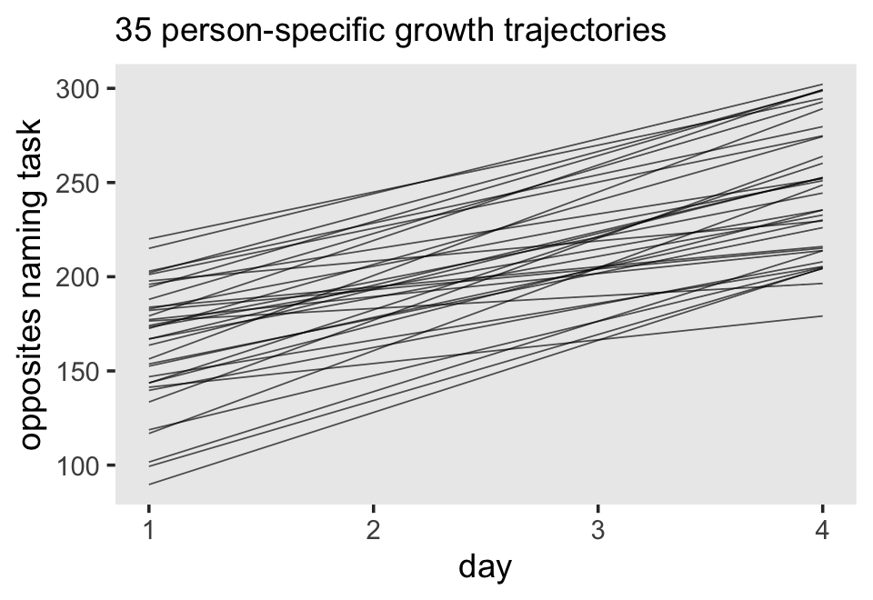

``` r
# 35 person-specific intercept and slope parameters
rbind(coef(fit7.1)$id[, , "Intercept"],
      coef(fit7.1)$id[, , "time"]) %>% 
  data.frame() %>% 
  mutate(type = rep(c("intercepts", "slopes"), each = n() / 2)) %>% 
  group_by(type) %>% 
  arrange(Estimate) %>% 
  mutate(id = 1:35) %>% 
  
  ggplot(aes(x = Estimate, xmin = Q2.5, xmax = Q97.5, y = id)) +
  geom_pointrange(fatten = 1) +
  scale_y_continuous(NULL, breaks = NULL) +
  labs(subtitle = "35 person-specific intercept and slope parameters",
       x = "marginal posterior") +
  theme(panel.grid = element_blank()) +
  facet_wrap(~ type, scales = "free_x")
```

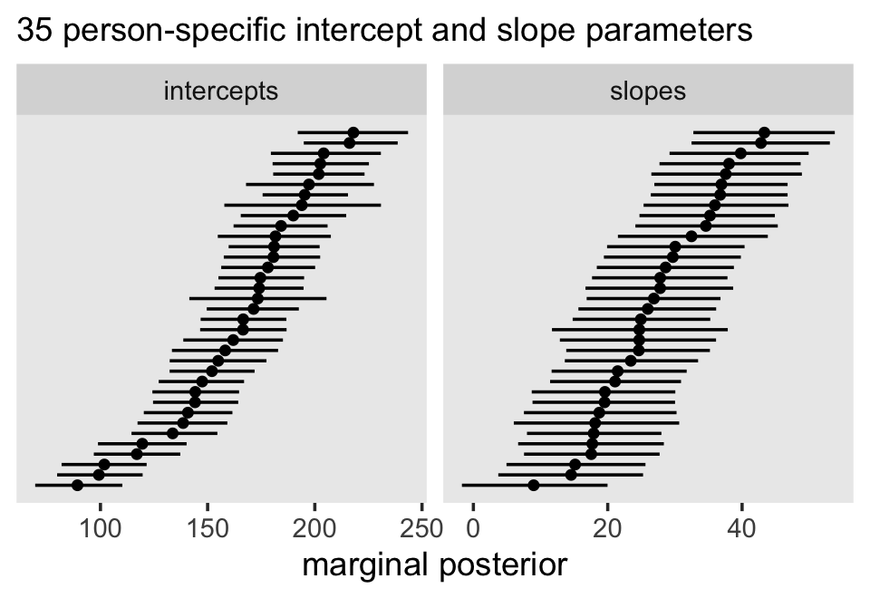

Of all the models we fit, only the standard multilevel model for change
allows us to drill down all the way to the individual participants and
this was accomplished by how it parameterized **Σ**<sub>**r**</sub>.
Even your substantive theory isn’t built around the subtleties in the
4 × 4 = 16 cells in the **Σ**<sub>**r**</sub>, it still matters that our
`fit7.1` parameterized them by way of *σ*<sub>*ϵ*</sub>,
*σ*<sub>0</sub>, *σ*<sub>1</sub>, and *ρ*<sub>01</sub>.

But Singer and Willett went on:

> But refining our hypotheses about the error covariance structure
> *does* affect the *precision* of estimates of the fixed effects and
> will therefore impact hypothesis testing and confidence interval
> construction. (p. 264, *emphasis* in the original)

I’m going to showcase this in a coefficient plot, rather than the way
the authors did in their Table 7.4. First, we’ll want a custom wrangling
function. Let’s call it `gamma_summary()`.

``` r
gamma_summary <- function(brmsfit) {
  
  fixef(brmsfit)[1:4, ] %>% 
    data.frame() %>% 
    mutate(gamma = c("gamma[0][0]", "gamma[1][0]", "gamma[0][1]", "gamma[1][1]"))
  
}

gamma_summary(fit7.1)
```

    ##              Estimate Est.Error         Q2.5       Q97.5       gamma
    ## Intercept 164.4208412 6.3468978 152.69127556 177.2378144 gamma[0][0]
    ## time       26.9324173 2.0554427  22.79077676  30.8272453 gamma[1][0]
    ## ccog       -0.1182836 0.5205726  -1.15959138   0.8999303 gamma[0][1]
    ## time:ccog   0.4335612 0.1727824   0.08893635   0.7780163 gamma[1][1]

Now wrangle and plot.

``` r
type <- c("standard growth model", "compound symmetric", "heterogeneous compound symmetric", "autoregressive", "heterogeneous autoregressive")

tibble(fit  = str_c("fit7.", c(1, 3:6)),
       type = factor(type, levels = type)) %>% 
  mutate(type  = fct_rev(type),
         gamma = map(fit, ~get(.) %>% gamma_summary())) %>% 
  unnest(gamma) %>% 
  
  ggplot(aes(x = Estimate, xmin = Q2.5, xmax = Q97.5, y = type)) +
  geom_pointrange(fatten = 1.25) +
  labs(subtitle = "Parameter precision can vary across model types.",
       x = "marginal posterior",
       y = NULL) +
  theme(axis.text.y = element_text(hjust = 0),
        axis.ticks.y = element_blank(),
        panel.grid = element_blank()) +
  facet_wrap(~ gamma, scales = "free_x", labeller = label_parsed, nrow = 1)
```

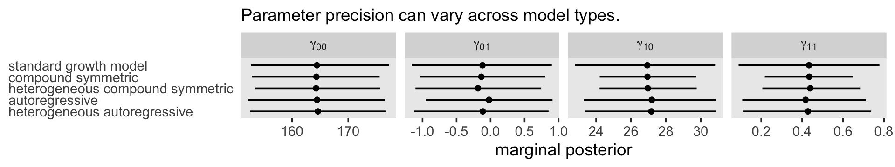

Yep, the way we parameterize **Σ**<sub>**r**</sub> might have subtle
consequences for the widths of our marginal *γ* posteriors.

## Session info

<div id="refs" class="references csl-bib-body hanging-indent"
line-spacing="2">

<div id="ref-mcneishOnTheUnnecessaryUbiquity2017" class="csl-entry">

McNeish, D., Stapleton, L. M., & Silverman, R. D. (2017). On the
unnecessary ubiquity of hierarchical linear modeling. *Psychological
Methods*, *22*(1), 114. <https://doi.org/10.1037/met0000078>

</div>

<div id="ref-R-nlme" class="csl-entry">

Pinheiro, J., Bates, D., & R-core. (2021). *<span
class="nocase">nlme</span>: Linear and nonlinear mixed effects models*
\[Manual\]. <https://CRAN.R-project.org/package=nlme>

</div>

<div id="ref-singerAppliedLongitudinalData2003" class="csl-entry">

Singer, J. D., & Willett, J. B. (2003). *Applied longitudinal data
analysis: Modeling change and event occurrence*. Oxford University
Press, USA.
<https://oxford.universitypressscholarship.com/view/10.1093/acprof:oso/9780195152968.001.0001/acprof-9780195152968>

</div>

<div id="ref-willett1988QuestionsAndAnswers" class="csl-entry">

Willett, J. B. (1988). Chapter 9: Questions and answers in the
measurement of change. *Review of Research in Education*, *15*, 345–422.
<https://doi.org/10.2307/1167368>

</div>

</div>
