Chapter 13. Describing Continuous-Time Event Occurrence Data
================
A Solomon Kurz
2020-05-06

# Describing Continuous-Time Event Occurrence Data

> In this chapter, we present strategies for describing continuous-time
> event data. Although survivor and hazard functions continue to form
> the cornerstone of our work, the challenge in the time scale from
> discrete to continuous demands that we revise our fundamental
> definitions and modify estimation strategies….
> 
> In the \[second half of the chapter\], we offer solutions to the core
> conundrum embedded in contentious-time event data: our inability to
> estimate the hazard function well. This is a concern as it leads some
> researchers to conclude that they should not even *try* to ascertain
> the pattern of risk over time. (pp, 468–469, *emphasis* in the
> original)

## 13.1 A framework for characterizing the distribution of continuous-time event data

> Variables measured with greater precision contain more information
> than those measured with less precision… Finer distinctions, as long
> as they can be made reliably, lead to more subtle interpretations and
> more powerful analyses.
> 
> Unfortunately, a switch from discrete- to continuous-time survival
> analysis is not as trivial as you might hope. In discrete time, the
> definition of the hazard function is intuitive, its values are easily
> estimated, and simple graphic displays can illuminate its behavior. In
> continuous time, although the survivor function is easily defined and
> estimated, the hazard function is not. As explained below, we must
> revise its definition and develop new methods for its estimation and
> exploration. (p. 469)

### 13.1.1 Salient features of continuous-time event occurrence data.

> Because continuous time is infinitely divisible, the distribution of
> event times displays two highly salient properties:
> 
>   - *The probability of observing* any particular event time *is
>     infinitesimally small*. In continuous time, the probability that
>     an event will occur *at any specific instant* approaches 0. The
>     probability may nor reach 0, but as time’s divisions become finer
>     and finer, it becomes smaller and smaller.
>   - *The probability that two or more individuals will share the same
>     event time is also infinitesimally small*. If the probability of
>     event occurrence at each instant is infinitesimally small, the
>     probability of *co*occurrence (a tie) must be smaller still.
>     (p. 470, *emphasis* in the original)

Load the horn honking data from [Diekmann, Jungbauer-Gans, Krassing, and
Lorenz
(1996)](https://www.researchgate.net/profile/Andreas_Diekmann2/publication/14168210_Social_Status_and_Aggression_A_Field_Study_Analyzed_by_Survival_Analysis/links/54c041be0cf28eae4a696897/Social-Status-and-Aggression-A-Field-Study-Analyzed-by-Survival-Analysis.pdf).

``` r
library(tidyverse)

honking <- 
  read_csv("~/Dropbox/Recoding Applied Longitudinal Data Analysis/data/honking.csv") %>%
  # make all names lower case
  rename_all(str_to_lower) %>% 
  mutate(censor_1 = abs(censor - 1))

glimpse(honking)
```

    ## Rows: 57
    ## Columns: 4
    ## $ id       <dbl> 1, 2, 3, 4, 5, 6, 7, 8, 9, 10, 11, 12, 13, 14, 15, 16, 17, 18, 19, 20, 21, 22, 2…
    ## $ seconds  <dbl> 2.88, 4.63, 2.36, 2.68, 2.50, 4.30, 1.86, 4.01, 1.41, 9.59, 4.44, 3.14, 2.83, 12…
    ## $ censor   <dbl> 0, 1, 1, 0, 0, 1, 0, 1, 0, 0, 0, 0, 0, 0, 0, 1, 0, 0, 0, 0, 1, 0, 0, 0, 0, 0, 0,…
    ## $ censor_1 <dbl> 1, 0, 0, 1, 1, 0, 1, 0, 1, 1, 1, 1, 1, 1, 1, 0, 1, 1, 1, 1, 0, 1, 1, 1, 1, 1, 1,…

Here’s a quick way to arrange the `seconds` values and `censor` status
of each case in a similar way to how they appear in Table 13.1.

``` r
honking %>% 
  arrange(seconds) %>% 
  transmute(seconds = ifelse(censor == 0, seconds, str_c(seconds, "*")))
```

    ## # A tibble: 57 x 1
    ##    seconds
    ##    <chr>  
    ##  1 1.41   
    ##  2 1.41*  
    ##  3 1.51   
    ##  4 1.67   
    ##  5 1.68   
    ##  6 1.86   
    ##  7 2.12   
    ##  8 2.19   
    ##  9 2.36*  
    ## 10 2.48   
    ## # … with 47 more rows

For kicks, here’s a tile-plot version of Table 13.1.

``` r
honking %>% 
  arrange(seconds) %>% 
  # `formatC()` allows us to retain the trailing zeros when converting the numbers to text
  mutate(text = formatC(seconds, digits = 2, format = "f")) %>% 
  mutate(time = ifelse(censor == 0, text, str_c(text, "*")),
         row  = c(rep(1:6, times = 9), 1:3),
         col  = rep(1:10, times = c(rep(6, times = 9), 3))) %>% 
  
  ggplot(aes(x = col, y = row)) +
  geom_tile(aes(fill = seconds)) +
  geom_text(aes(label = time, color = seconds < 10)) +
  scale_fill_viridis_c(option = "B", limits = c(0, NA)) +
  scale_color_manual(values = c("black", "white")) +
  scale_y_reverse() +
  labs(subtitle = "Table 13.1: Known and censored (*) event times for 57 motorists blocked by another\nautomobile (reaction times are recorded to the nearest hundredth of a second)") +
  theme_void() +
  theme(legend.position = "none")
```

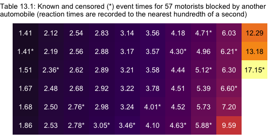<!-- -->

### 13.1.2 The survivor function.

“In continuous time, the survival probability for individual \(i\) at
time \(t_j\) is the probability that his or her event time, \(T_i\) will
exceed \(t_j\)” (p. 472). This follows the equation

\[S(t_{ij}) = \operatorname{Pr} [T_i > t_j].\]

Heads up: When Singer and Willett “do not distinguish individuals on the
basis of predictors, \[they\] remove the subscript \(i\), letting
\(S(t_j)\) represent the survivor function for a randomly selected
member of the population” (p. 472).

### 13.1.3 The hazard function.

> The hazard function assesses the *risk*–at a particular moment–that an
> individual who has not yet done so will experience the target event.
> In discrete time, the moments are time periods, which allows us to
> express hazard as a conditional probability. In continuous time, the
> moments are the infinite numbers of infinitesimally small instants of
> time that exist within any finite time period, a change that requires
> us to alter our definition. (pp. 472–473, *emphasis* in the original)

Singer and Willett the went on to demonstrate the notion of
“infinitesimally small instants of time” by dividing a year into days,
hours, minutes, and seconds. Here’s how we might use **R** to practice
dividing up a year into smaller and smaller units.

``` r
year    <- 1
days    <- 365
hours   <- 24
minutes <- 60
seconds <- 60

year * days
```

    ## [1] 365

``` r
year * days * hours
```

    ## [1] 8760

``` r
year * days * hours * minutes
```

    ## [1] 525600

``` r
year * days * hours * minutes * seconds
```

    ## [1] 31536000

Building, we define the continuous-time hazard function
as

\[h(t_{ij}) = \text{limit as } \Delta t \rightarrow 0 \Bigg \{ \frac{\text{Pr}[T_i \text{ is in the interval } (t_j, t_j + \Delta t) | T_i \geq t_j]}{\Delta t} \Bigg \},\]

where \([t_j, t_j + \Delta t)\) is the \(j\)th time interval and “the
opening phrase ‘\(\text{limit as } \Delta t \rightarrow 0\)’ indicates
that we evaluate the conditional probability in brackets as the interval
width modes closer and closer to 0” (p. 474).

> Because the definitions of hazard differ in continuous and discrete
> time, their interpretations differ as well. Most important,
> *continuous-time hazard is not a probability*. Instead, it is a
> *rate*, assessing the conditional probability of event occurrence *per
> unit of time*. No matter how tempted you might be to use the
> nomenclature of probability to describe rates in continuous time,
> please resist the urge. Rates and probabilities are not the same, and
> so the interpretive language is not interchangeable. (p. 474,
> *emphasis* in the original)

Closing out this section, we read:

> An important difference between continuous-time hazard rates and
> discrete-time hazard probabilities is that rates are not bounded from
> above. Although neither can be negative, rates can easily exceed 1.0….
> The possibility that continuous-time hazard rate can exceed 1 has
> serious consequences because it requires that we revise the
> statistical models that incorporate the effects of predictors. We
> cannot posit a model in terms of *logit* hazard (as in discrete time)
> because that transformation is defined only for values of hazard
> between 0 and 1. As a result, when we specify continuous-time hazard
> models in chapter 14, our specification will focus on the *logarithm*
> of hazard, a transformation that is defines for all values of hazard
> greater than 0. (p. 475, *emphasis* in the
original)

## 13.2 Grouped methods for estimating continuous-time survivor and hazard functions

> In principle, in continuous time, we would like to estimate a value
> for the survivor and hazard functions at every possible instant when
> an event could occur. In practice, we can do so only if we are willing
> to adopt constraining parametric assumptions about the distribution of
> event times. To support this approach, statisticians have identified
> dozens of different distributions–Weibull, Gompertz, gamma, and
> log-logistic, to name a few–that event times might follow, and in some
> fields—industrial product testing, for example–parametric estimation
> is the dominant mode of analysis (see, e.g., Lawless, 1982).
> 
> In many other fields, including most of the social, behavioral, and
> medical sciences, nonparametric methods are more popular. The
> fundamental advantage of nonparametric methods is that we need not
> make constraining assumptions about the distribution of event times.
> This flexibility is important because: (1) few researchers have a
> sound basis for preferring one distribution over another; and (2)
> adopting an *incorrect* assumption can lead to erroneous conclusions.
> With a nonparametric approach, you essentially trade the *possibility*
> of a minor increase in efficiency if a particular assumption holds for
> the guarantee of doing nearly as well for most data sets, regardless
> of its tenability.
> 
> For decades, in a kind of mathematic irony, statisticians obtained
> nonparametric estimates of the continuous-time survivor and hazard
> functions by grouping event times into a small number of intervals,
> constructing a life table, and applying the discrete-time strategies
> of chapter 10 (with some minor revisions noted below). In this section
> we describe two of the most popular of these grouped strategies: the
> *discrete-time* method (section 13.2.1) and the *actuarial* method
> (section 13.2.2). (pp. 475–476, *emphasis* in the original)

As we’ll see, **brms** supports parametric and nonparametric
continuous-time survival models. In the sections and chapters to come,
we will make extensive use of the Cox model, which is nonparametric.
However, if you look through the *Survival models* section of Bürkner’s
[*Parameterization of Response Distributions in
brms*](https://CRAN.R-project.org/package=brms/vignettes/brms_families.html),
you’ll see **brms** supports survival models with the exponential,
inverse-Gaussian, gamma, log-normal, and Weibull likelihoods.

### 13.2.1 Constructing a grouped life table.

``` r
range(honking$seconds)
```

    ## [1]  1.41 17.15

``` r
honking <-
  honking %>% 
  mutate(lb = case_when(
    seconds < 2 ~ 1,
    seconds < 3 ~ 2,
    seconds < 4 ~ 3,
    seconds < 5 ~ 4,
    seconds < 6 ~ 5,
    seconds < 7 ~ 6,
    seconds < 8 ~ 7,
    seconds >= 8 ~ 8
  )) %>% 
  mutate(ub = if_else(lb == 8, 18, lb + 1)) %>% 
  mutate(time_interval = str_c("[", lb, ", ", ub, ")"))

honking %>% head()
```

    ## # A tibble: 6 x 7
    ##      id seconds censor censor_1    lb    ub time_interval
    ##   <dbl>   <dbl>  <dbl>    <dbl> <dbl> <dbl> <chr>        
    ## 1     1    2.88      0        1     2     3 [2, 3)       
    ## 2     2    4.63      1        0     4     5 [4, 5)       
    ## 3     3    2.36      1        0     2     3 [2, 3)       
    ## 4     4    2.68      0        1     2     3 [2, 3)       
    ## 5     5    2.5       0        1     2     3 [2, 3)       
    ## 6     6    4.3       1        0     4     5 [4, 5)

``` r
 honking_aggregated <-
  honking %>% 
  mutate(event = ifelse(censor == 0, "n_events", "n_censored")) %>% 
  group_by(lb) %>% 
  count(event) %>% 
  ungroup() %>% 
  pivot_wider(names_from = event,
              values_from = n) %>% 
  mutate(ub = if_else(lb == 8, 18, lb + 1)) %>% 
  mutate(time_interval = str_c("[", lb, ", ", ub, ")")) %>% 
  mutate(n_censored = ifelse(is.na(n_censored), 0, n_censored)) %>% 
  mutate(total = n_censored + n_events) %>% 
  mutate(n_at_risk = sum(total) - cumsum(lag(total, default = 0))) %>% 
  select(lb, ub, time_interval, n_at_risk, n_events, n_censored) %>% 
  mutate(`p(t)` = n_events / n_at_risk)

honking_aggregated
```

    ## # A tibble: 8 x 7
    ##      lb    ub time_interval n_at_risk n_events n_censored `p(t)`
    ##   <dbl> <dbl> <chr>             <dbl>    <int>      <dbl>  <dbl>
    ## 1     1     2 [1, 2)               57        5          1 0.0877
    ## 2     2     3 [2, 3)               51       14          3 0.275 
    ## 3     3     4 [3, 4)               34        9          2 0.265 
    ## 4     4     5 [4, 5)               23        6          4 0.261 
    ## 5     5     6 [5, 6)               13        2          2 0.154 
    ## 6     6     7 [6, 7)                9        2          2 0.222 
    ## 7     7     8 [7, 8)                5        1          0 0.2   
    ## 8     8    18 [8, 18)               4        3          1 0.75

### 13.2.2 The discrete-time method.

Here we simply apply the discrete-time hazard model to our discretized
continuous-time data. Before we fit the model, we’ll define a new term,
\(\hat p(t_j)\). Recall back to Section 10.2 where we defined the hazard
function \(\hat h(t_{j})\) as

\[\hat h(t_{j}) = \frac{n \text{ events}_j}{n \text{ at risk}_j}.\]

Now we’re working with continuous-time data (even if they’re momentarily
discretized), we focus instead on \(\hat p(t_{j})\). In words,
\(\hat p(t_{j})\) is the conditional probability that a member of the
risk set at the beginning of the interval \(j\) will experience the
target event during that interval. In discrete time we labeled this
quantity “hazard,” but now we use the term “*conditional probability*”
to distinguish it from a continuous time *hazard rate*. Our conditional
probability follows the formula

\[\hat p(t_{j}) = \frac{n \text{ events}_j}{n \text{ at risk}_j},\]

where \(n \text{ events}_j\) is the number of individuals who
experienced the event in the \(j^{th}\) period and
\(n \text{ at risk}_j\) is the number of those at risk at the beginning
of the interval \(j\).

Time to fire up **brms**.

``` r
library(brms)
library(tidybayes)
```

For our first model, we will use the binomial likelihood with the
aggregated version of the `honking` data, `honking_aggregated`. The main
time variable in those data is `time_interval`, the lower and upper
bounds for which are identified in the `lb` and `ub` columns,
respectively. In anticipation of the upcoming plots, we’ll use the `ub`
variable for time. But to make fitting the model easier with the `brm()`
function, we’ll first save a factor version of the variable.

``` r
honking_aggregated <-
  honking_aggregated %>% 
  mutate(ub_f = factor(ub))
```

In the last chapter, we used the `normal(0, 1.5)` prior, which was flat
in the probability metric. Here we’ll be more conservative and use a
weakly-regularizing `normal(0, 1)`. Otherwise, this model is just like
any of the other unconditional discrete-time models we’ve fit with
`brm()`.

``` r
set.seed(13)

tibble(sd = seq(from = 1, to = 2, by = .25)) %>% 
  mutate(log_odds = map(sd, ~rnorm(1e6, mean = 0, sd = .))) %>% 
  unnest(log_odds) %>% 
  mutate(p  = inv_logit_scaled(log_odds),
         sd = factor(sd)) %>% 
  
  ggplot(aes(x = p, y = sd)) +
  stat_histintervalh(normalize = "xy") +
  theme(panel.grid = element_blank())
```

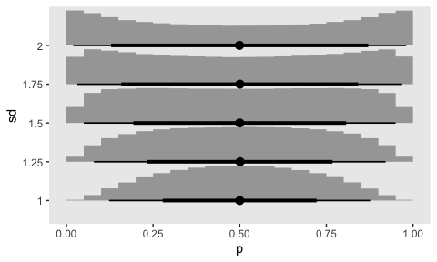<!-- -->

``` r
fit13.1 <-
  brm(data = honking_aggregated,
      family = binomial,
      n_events | trials(n_at_risk) ~ 0 + ub_f,
      prior(normal(0, 1), class = b),
      chains = 4, cores = 1, iter = 2000, warmup = 1000,
      seed = 13,
      file = "~/Dropbox/Recoding Applied Longitudinal Data Analysis/fits/fit13.01")
```

Check the parameter summary.

``` r
print(fit13.1)
```

    ##  Family: binomial 
    ##   Links: mu = logit 
    ## Formula: n_events | trials(n_at_risk) ~ 0 + ub_f 
    ##    Data: honking_aggregated (Number of observations: 8) 
    ## Samples: 4 chains, each with iter = 2000; warmup = 1000; thin = 1;
    ##          total post-warmup samples = 4000
    ## 
    ## Population-Level Effects: 
    ##        Estimate Est.Error l-95% CI u-95% CI Rhat Bulk_ESS Tail_ESS
    ## ub_f2     -2.02      0.39    -2.81    -1.31 1.00     5443     2885
    ## ub_f3     -0.90      0.29    -1.50    -0.34 1.00     6058     3074
    ## ub_f4     -0.91      0.35    -1.63    -0.22 1.00     7093     3016
    ## ub_f5     -0.88      0.41    -1.72    -0.07 1.00     6994     3296
    ## ub_f6     -1.20      0.56    -2.37    -0.16 1.00     5405     2409
    ## ub_f7     -0.83      0.60    -2.01     0.31 1.00     7332     2927
    ## ub_f8     -0.73      0.69    -2.08     0.62 1.00     6317     3413
    ## ub_f18     0.52      0.73    -0.90     1.98 1.00     6710     2959
    ## 
    ## Samples were drawn using sampling(NUTS). For each parameter, Bulk_ESS
    ## and Tail_ESS are effective sample size measures, and Rhat is the potential
    ## scale reduction factor on split chains (at convergence, Rhat = 1).

As will become apparent in a bit, our `normal(0, 1)` prior was not
inconsequential. Our aggregated data were composed of the
event/censoring information of 57 cases, spread across 8 time periods.
This left little information in the likelihood, particularly for the
later time periods. As a consequence, the prior left clear marks in the
posterior.

As with the discrete-time model, we can formally define the survivor
function for the continuous-time model
as

\[\hat S(t_j) =  \big(1 - \hat p(t_1)\big) \big(1 - \hat p(t_2)\big)... \big(1 - \hat p(t_j)\big).\]

It’ll take a little wrangling effort to transform the output from
`posterior_samples(fit13.1)` into a useful form for plotting and
summarizing \(\hat S(t_j)\). We’ll save it as `s`.

``` r
s <-
  posterior_samples(fit13.1) %>% 
  select(starts_with("b_")) %>% 
  mutate_all(inv_logit_scaled) %>% 
  mutate(b_ub_f0 = 0) %>% 
  select(b_ub_f0, everything()) %>% 
  set_names(c(1:8, 18)) %>% 
  mutate(iter = 1:n()) %>% 
  pivot_longer(-iter,
               names_to = "time",
               values_to = "p",
               names_ptypes = list(time = integer())) %>% 
  group_by(iter) %>% 
  mutate(survivor = cumprod(1 - p)) %>% 
  ungroup()
```

Now we can make the first 6 columns of Table 13.2 by combining a subset
of the `honking_aggregated` data with a summary of our `s`.

``` r
bind_cols(
  # select the first 5 columns for Table 13.2
  honking_aggregated %>% 
    select(time_interval:`p(t)`),
  # add the 6th column
  s %>% 
    filter(time > 1) %>% 
    group_by(time) %>% 
    summarise(median = median(survivor),
              sd     = sd(survivor)) %>% 
    mutate_if(is.double, round, digits = 4) %>% 
    transmute(`S(t)` = str_c(median, " (", sd, ")"))
)
```

    ## # A tibble: 8 x 6
    ##   time_interval n_at_risk n_events n_censored `p(t)` `S(t)`         
    ##   <chr>             <dbl>    <int>      <dbl>  <dbl> <chr>          
    ## 1 [1, 2)               57        5          1 0.0877 0.8814 (0.0404)
    ## 2 [2, 3)               51       14          3 0.275  0.6227 (0.0605)
    ## 3 [3, 4)               34        9          2 0.265  0.438 (0.0608) 
    ## 4 [4, 5)               23        6          4 0.261  0.3052 (0.0558)
    ## 5 [5, 6)               13        2          2 0.154  0.2284 (0.0511)
    ## 6 [6, 7)                9        2          2 0.222  0.1549 (0.0455)
    ## 7 [7, 8)                5        1          0 0.2    0.0996 (0.0378)
    ## 8 [8, 18)               4        3          1 0.75   0.0362 (0.0228)

You’ll note that our posterior summary values in `S(t)` differ a little
from those in the text. Remember, the likelihood was weak and we used a
regularizing prior. If we had more cases spread across fewer discretized
time periods, the likelihood would have done a better job updating the
prior.

Now let’s take a look at the posterior of our survivor function,
$S(t\_j) $, in our version of the upper left panel of Figure 13.1.

``` r
s %>% 
  ggplot(aes(x = time, y = survivor)) +
  geom_hline(yintercept = .5, color = "white") +
  stat_lineribbon(alpha = 1/2) +
  # add the ML-based survival estimates
  geom_line(data = honking_aggregated %>% mutate(s = cumprod(1 - `p(t)`)),
            aes(x = ub, y = s),
            color = "red") +
  scale_fill_grey("CI level", start = .7, end = .4) +
  scale_x_continuous("seconds after light turns green", limits = c(0, 20)) +
  ylab(expression(widehat(italic(S(t[j]))))) +
  coord_cartesian(ylim = c(0, 1)) +
  theme(panel.grid = element_blank())
```

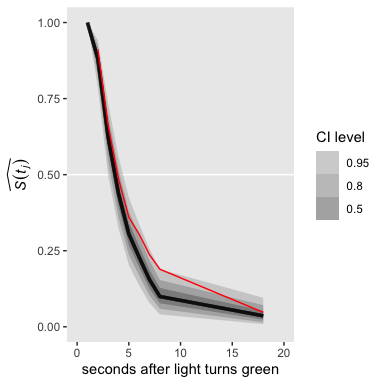<!-- -->

For a little context, we superimposed the sample (ML) estimates of the
survivor function in red. Based on the posterior median, our median
lifetime appears to be between the time intervals of \([2, 3)\) and
\([3, 4)\). Sticking with those medians, here’s the exact number using
Miller’s
([1981](https://books.google.com/books/about/Survival_Analysis.html?id=cttQAAAAMAAJ))
interpolation approach from Section 10.2.3.

``` r
s_medians <-
  s %>% 
  mutate(lb = time - 1,
         ub = time) %>% 
  mutate(time_interval = str_c("[", lb, ", ", ub, ")")) %>% 
  filter(ub %in% c(3, 4)) %>% 
  group_by(time_interval) %>% 
  summarise(median = median(survivor)) %>% 
  pull(median)

3 + (s_medians[1] - .5) / (s_medians[1] - s_medians[2]) * (4 - 3)
```

    ## [1] 3.6644

Here’s how we might convert the output of `posterior_samples(fit13.1)`
into a useful format for our hazard function.

``` r
h <-
  posterior_samples(fit13.1) %>% 
  select(starts_with("b_")) %>% 
  mutate_all(inv_logit_scaled) %>% 
  set_names(c(2:8, 18)) %>% 
  mutate(iter = 1:n()) %>% 
  pivot_longer(-iter,
               names_to = "time",
               values_to = "p",
               names_ptypes = list(time = integer()))

h
```

    ## # A tibble: 32,000 x 3
    ##     iter  time      p
    ##    <int> <int>  <dbl>
    ##  1     1     2 0.164 
    ##  2     1     3 0.262 
    ##  3     1     4 0.367 
    ##  4     1     5 0.255 
    ##  5     1     6 0.199 
    ##  6     1     7 0.442 
    ##  7     1     8 0.287 
    ##  8     1    18 0.654 
    ##  9     2     2 0.0650
    ## 10     2     3 0.309 
    ## # … with 31,990 more rows

For continuous-time data, hazard is a rate, which is

> the limit of the conditional probability of event occurrence in a
> (vanishingly small) interval divided by the interval’s width. A
> logical estimator is thus the ratio of the conditional probability of
> event occurrence in an interval to the interval’s width. (p. 479)

Thus, our new definition of hazard is

\[\hat h(t_j) = \frac{\hat p(t_j)}{\text{width}_j},\]

where \(\text{width}_j\) denotes the width of the \(j\)th interval. The
widths of most of our intervals were 1 (seconds). The final interval,
\([8, 18)\), had a width of ten. Once we add that information to the `h`
data, we can use the formula above to convert \(\hat p(t_j)\) to
\(\hat h(t_j)\).

``` r
h <-
  h %>% 
  mutate(width = if_else(time <= 8, 1, 10)) %>% 
  mutate(hazard = p / width)
```

Now we can make the first 7 columns of Table 13.2 by adding an
cleaned-up version of our `h` object to what we had before.

``` r
bind_cols(
  # select the first 5 columns for Table 13.2
  honking_aggregated %>% 
    select(time_interval:`p(t)`),
  # add the 6th column
  s %>% 
    filter(time > 1) %>% 
    group_by(time) %>% 
    summarise(median = median(survivor),
              sd     = sd(survivor)) %>% 
    mutate_if(is.double, round, digits = 4) %>% 
    transmute(`S(t)` = str_c(median, " (", sd, ")")),
  # add the 7th column
  h %>% 
    group_by(time) %>% 
    summarise(median = median(hazard),
              sd     = sd(hazard)) %>% 
    mutate_if(is.double, round, digits = 4) %>% 
    transmute(`h(t)` = str_c(median, " (", sd, ")"))
)
```

    ## # A tibble: 8 x 7
    ##   time_interval n_at_risk n_events n_censored `p(t)` `S(t)`          `h(t)`         
    ##   <chr>             <dbl>    <int>      <dbl>  <dbl> <chr>           <chr>          
    ## 1 [1, 2)               57        5          1 0.0877 0.8814 (0.0404) 0.1186 (0.0404)
    ## 2 [2, 3)               51       14          3 0.275  0.6227 (0.0605) 0.2896 (0.0595)
    ## 3 [3, 4)               34        9          2 0.265  0.438 (0.0608)  0.2898 (0.0715)
    ## 4 [4, 5)               23        6          4 0.261  0.3052 (0.0558) 0.2928 (0.0843)
    ## 5 [5, 6)               13        2          2 0.154  0.2284 (0.0511) 0.2324 (0.0974)
    ## 6 [6, 7)                9        2          2 0.222  0.1549 (0.0455) 0.3071 (0.1207)
    ## 7 [7, 8)                5        1          0 0.2    0.0996 (0.0378) 0.3273 (0.1424)
    ## 8 [8, 18)               4        3          1 0.75   0.0362 (0.0228) 0.0627 (0.0155)

Perhaps even more so than with our estimates for the survivor function,
our hazard estimates show the influence of our prior on the posterior.
Compared to the estimates reported in the text, ours appear pulled
toward .5. Also note how our posterior standard deviations tend to be a
bit smaller than the standard errors reported in the text. That’s from
our priors, too. To my mind, plotting the marginal posteriors for the
intervals of our hazard function really helps hit this home.

``` r
h %>% 
  mutate(time = factor(time)) %>% 
  
  ggplot(aes(x = hazard, y = time)) +
  geom_vline(xintercept = .5, color = "white") +
  geom_halfeyeh(.width = c(.5, .95), normalize = "xy") +
  xlim(0, 1) +
  theme(panel.grid = element_blank())
```

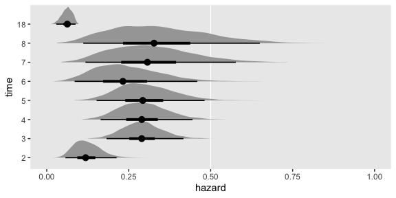<!-- -->

As wide and sloppy as those distributions look, they’re more precise
than the estimates returned by Maximum Likelihood (ML). To finish this
section out with the lower left panel of Figure 13.1, here’s what our
hazard function looks like.

``` r
h %>% 
  ggplot(aes(x = time, y = hazard)) +
  stat_lineribbon(alpha = 1/2) +
  scale_fill_grey("CI level", start = .7, end = .4) +
  scale_x_continuous("seconds after light turns green", limits = c(0, 20)) +
  ylab(expression(widehat(italic(h(t[j]))))) +
  coord_cartesian(ylim = c(0, .35)) +
  theme(panel.grid = element_blank())
```

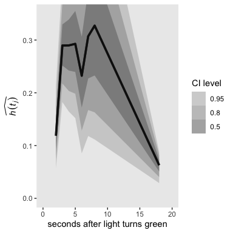<!-- -->

### 13.2.3 The actuarial method.

I’m not going to dive into a full explanation of the actuarial method.
For that, read the book. However, the actuarial method presents a
challenge for our **brms** paradigm. To appreciate the challenge, we’ll
need a couple block quotes:

> For the survivor function, we ask: What does it mean to be “at risk of
> surviving” past the end of an interval? Because a censored individual
> is no longer “at risk of surviving” once censoring occurs, we redefine
> each interval’s risk set to account for the censoring we assume to
> occur equally throughout. This implies that half the censored
> individuals would no longer be at risk half-way through, so we
> redefine the number of individuals “at risk of surviving past interval
> \(j\)” to
> be:
> 
> \[n' \; at \; risk_j = n \; at \; risk_j - \frac{n \; censored_j}{2}.\]
> 
> The actuarial estimate of the survivor function is obtained by
> substituting \(n' \; at \; risk_j\) for \(n \; at \; risk_j\) in the
> discrete-time formulas just presented in section 13.2.2 (equations
> 13.3 and 13.4). (pp. 480–481, *emphasis* in the original)

Further:

> To estimate the hazard function using the actuarial approach, we again
> redefine what it means to be “at risk.” Now, however, we ask about the
> “risk of event occurrence” *during* the interval, not the “risk of
> survival” *past* the interval. This change of definition suggests that
> each interval’s risk set should be diminished not just by censoring
> but also by event occurrence, because either eliminates the
> possibility of subsequent event occurrence. Because categorization
> continues to prevent us from knowing precisely when people leave the
> risk set, we assume that exits are scattered at random throughout the
> interval. This implies that half these individuals are no longer at
> risk of event occurrence halfway through, so we redefine the number of
> individuals “at risk of event occurrence” in interval \(j\) to
> be:
> 
> \[n'' \; at \; risk_j = n \; at \; risk_j - \frac{n \; censored_j}{2} - \frac{n \; events_j}{2}.\]
> 
> The actuarial estimator of the continuous-time hazard function is then
> obtained by substituting \(n'' \; at \; risk_j\) for
> \(n \; at \; risk_j\) in discrete-time formulas of section 13.2.2
> (equations 13.3 and 13.5). (pp. 481–481, *emphasis* in the original)

Here’s how we might implement the equations for \(n' \; at \; risk_j\)
and \(n'' \; at \; risk_j\) in our `honking_aggregated` data.

``` r
honking_aggregated <-
  honking_aggregated %>% 
  mutate(n_p_at_risk_a  = n_at_risk - (n_censored / 2),
         n_pp_at_risk_a = n_at_risk - (n_censored / 2) - (n_events / 2))

honking_aggregated
```

    ## # A tibble: 8 x 10
    ##      lb    ub time_interval n_at_risk n_events n_censored `p(t)` ub_f  n_p_at_risk_a n_pp_at_risk_a
    ##   <dbl> <dbl> <chr>             <dbl>    <int>      <dbl>  <dbl> <fct>         <dbl>          <dbl>
    ## 1     1     2 [1, 2)               57        5          1 0.0877 2              56.5           54  
    ## 2     2     3 [2, 3)               51       14          3 0.275  3              49.5           42.5
    ## 3     3     4 [3, 4)               34        9          2 0.265  4              33             28.5
    ## 4     4     5 [4, 5)               23        6          4 0.261  5              21             18  
    ## 5     5     6 [5, 6)               13        2          2 0.154  6              12             11  
    ## 6     6     7 [6, 7)                9        2          2 0.222  7               8              7  
    ## 7     7     8 [7, 8)                5        1          0 0.2    8               5              4.5
    ## 8     8    18 [8, 18)               4        3          1 0.75   18              3.5            2

The essence of our problem is we’ve been using the binomial likelihood
to fit discrete-time hazard functions with **brms**. In this paradigm,
we feed in data composed of the number of *successes* and the
corresponding number of trials to compute probability \(p\) of a
*success* within a given trial. Although \(p\) is a continuous value
ranging from 0 to 1, the binomial likelihood takes the numbers of
successes and trials to be non-negative integers. If you try to feed our
actuarial \(n'' \; at \; risk_j\) variable, `n_at_risk_pp` into the
`formula` argument for `brms::brm()` (e.g., `n_events |
trials(n_at_risk_pp) ~ 0 + ub_f`), **brms** will return the warning:

> Error: Number of trials must be positive integers.

We can, however, follow along and compute the ML estimates by hand.

``` r
honking_aggregated <-
  honking_aggregated %>% 
  mutate(`S(t)_a` = cumprod(1 - n_events / n_p_at_risk_a),
         `p(t)_a` = n_events / n_pp_at_risk_a,
         width    = if_else(lb == 8, 10, 1)) %>% 
  mutate(`h(t)_a` = `p(t)_a` / width)

honking_aggregated
```

    ## # A tibble: 8 x 14
    ##      lb    ub time_interval n_at_risk n_events n_censored `p(t)` ub_f  n_p_at_risk_a n_pp_at_risk_a
    ##   <dbl> <dbl> <chr>             <dbl>    <int>      <dbl>  <dbl> <fct>         <dbl>          <dbl>
    ## 1     1     2 [1, 2)               57        5          1 0.0877 2              56.5           54  
    ## 2     2     3 [2, 3)               51       14          3 0.275  3              49.5           42.5
    ## 3     3     4 [3, 4)               34        9          2 0.265  4              33             28.5
    ## 4     4     5 [4, 5)               23        6          4 0.261  5              21             18  
    ## 5     5     6 [5, 6)               13        2          2 0.154  6              12             11  
    ## 6     6     7 [6, 7)                9        2          2 0.222  7               8              7  
    ## 7     7     8 [7, 8)                5        1          0 0.2    8               5              4.5
    ## 8     8    18 [8, 18)               4        3          1 0.75   18              3.5            2  
    ## # … with 4 more variables: `S(t)_a` <dbl>, `p(t)_a` <dbl>, width <dbl>, `h(t)_a` <dbl>

Before we make our version of the right-hand side of Figure 13.1, we’ll
need to augment the data a little. Then `geom_step()` will do most of
the magic.

``` r
p1 <-
  # add `S(t)_a` values for `lb = c(0, 18)`
  honking_aggregated %>% 
  select(lb, `S(t)_a`) %>% 
  bind_rows(tibble(lb       = c(0, 18),
                   `S(t)_a` = c(1, honking_aggregated$`S(t)_a`[8]))) %>% 
  # reorder
  arrange(lb) %>% 
  
  # plot!
  ggplot(aes(x = lb, y = `S(t)_a`)) +
  geom_step() +
  scale_x_continuous(NULL, breaks = NULL) +
  scale_y_continuous(expression(widehat(italic(S(t[j])))), limits = c(0, 1))

p2 <-
  # add `h(t)_a` values for `lb = 18`
  honking_aggregated %>% 
  select(lb, `h(t)_a`) %>% 
  bind_rows(tibble(lb       = 18, 
                   `h(t)_a` = honking_aggregated$`h(t)_a`[8])) %>% 
  arrange(lb) %>% 
  
  ggplot(aes(x = lb, y = `h(t)_a`)) +
  geom_step() +
  scale_x_continuous("seconds after light turns green", limits = c(0, 20)) +
  scale_y_continuous(expression(widehat(italic(h(t[j])))), limits = c(0, .35))
```

Combine the subplots and make our version of the right-hand side of
Figure 13.1.

``` r
library(patchwork)

(p1 / p2) &
  theme(panel.grid = element_blank())
```

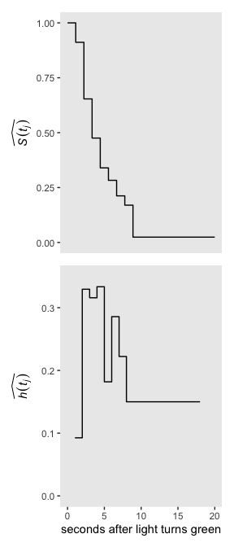<!-- -->

I’m not going to bother with computing the ML standard errors for the
actuarial survivor and hazard estimates. You can reference page 482 in
the text for more on
those.

## 13.3 The Kaplan-Meier method of estimating the continuous-time survivor function

> A fundamental problem with grouped estimation methods is that they
> artificially categorize what is now, by definition, a continuous
> variable…. Shouldn’t it be possible to use the *observed* data–the
> actual event times–to describe the distribution of event occurrences?
> This compelling idea underlies the Kaplan-Meier method, named for the
> statisticians who demonstrated (in
> [1958](http://www.nativefishlab.net/library/internalpdf/21383.pdf))
> that the intuitive approach–also known as the *product-limit
> method*–has maximum likelihood properties as well. Below, we explain
> how this approach works and why it is preferable.
> 
> The Kaplan-Meier method is a simple extension of the discrete-time
> method with a fundamental change: instead of rounding event times to
> construct the intervals, capitalize on the raw event times and
> construct intervals so that each contains just *one observed event
> time* (as shown in table 13.3). Each Kaplan-Meier interval begins at
> one observed event time and ends just before the next. (p. 483,
> *emphasis* in the original)

As discussed in the prose in the middle of page 483, here are the first
three event times.

``` r
honking %>% 
  filter(censor == 0) %>% 
  top_n(-3, seconds)
```

    ## # A tibble: 3 x 7
    ##      id seconds censor censor_1    lb    ub time_interval
    ##   <dbl>   <dbl>  <dbl>    <dbl> <dbl> <dbl> <chr>        
    ## 1     9    1.41      0        1     1     2 [1, 2)       
    ## 2    40    1.51      0        1     1     2 [1, 2)       
    ## 3    50    1.67      0        1     1     2 [1, 2)

> The Kaplan-Meier estimate of the survivor function is obtained by
> applying the discrete-time estimator of section 13.2.2 to the data of
> these intervals. \[Most\] statistical packages include a routine for
> computing and plotting the estimates. Numerically, the process is
> simple: first compute the conditional probability of event occurrence
> (column 7) and then successively multiply the complements of these
> probabilities together to obtain the Kaplan-Meier estimate of the
> survivor function (column 8). Because the Kaplan-Meier estimator of
> the survivor function is identical to the discrete-time estimator of
> chapter 10, its standard errors (column 9) are estimated using the
> same formula (pp. 483–485).

To walk this out, we’ll first use the frequentist **survival** package.

``` r
library(survival)
```

Use the `survival::survfit()` function to fit the unconditional model
with the Kaplan-Meier estimator.

``` r
 fit13.2 <-
  survfit(data = honking,
          Surv(seconds, censor_1) ~ 1)
```

The `summary()` returns a lot of
    output.

``` r
summary(fit13.2)
```

    ## Call: survfit(formula = Surv(seconds, censor_1) ~ 1, data = honking)
    ## 
    ##   time n.risk n.event survival std.err lower 95% CI upper 95% CI
    ##   1.41     57       1   0.9825  0.0174      0.94896        1.000
    ##   1.51     55       1   0.9646  0.0246      0.91758        1.000
    ##   1.67     54       1   0.9467  0.0299      0.88985        1.000
    ##   1.68     53       1   0.9289  0.0343      0.86405        0.999
    ##   1.86     52       1   0.9110  0.0380      0.83950        0.989
    ##   2.12     51       1   0.8931  0.0412      0.81587        0.978
    ##   2.19     50       1   0.8753  0.0441      0.79296        0.966
    ##   2.48     48       1   0.8570  0.0468      0.77004        0.954
    ##   2.50     47       1   0.8388  0.0492      0.74765        0.941
    ##   2.53     46       1   0.8206  0.0514      0.72572        0.928
    ##   2.54     45       1   0.8023  0.0534      0.70418        0.914
    ##   2.56     44       1   0.7841  0.0552      0.68299        0.900
    ##   2.62     43       1   0.7659  0.0569      0.66212        0.886
    ##   2.68     42       1   0.7476  0.0584      0.64154        0.871
    ##   2.83     39       1   0.7285  0.0599      0.61996        0.856
    ##   2.88     38       1   0.7093  0.0614      0.59868        0.840
    ##   2.89     37       1   0.6901  0.0626      0.57769        0.824
    ##   2.92     36       1   0.6710  0.0637      0.55695        0.808
    ##   2.98     35       1   0.6518  0.0647      0.53648        0.792
    ##   3.14     33       1   0.6320  0.0657      0.51549        0.775
    ##   3.17     32       1   0.6123  0.0666      0.49477        0.758
    ##   3.21     31       1   0.5925  0.0673      0.47429        0.740
    ##   3.22     30       1   0.5728  0.0679      0.45405        0.723
    ##   3.24     29       1   0.5530  0.0684      0.43404        0.705
    ##   3.56     27       1   0.5325  0.0688      0.41338        0.686
    ##   3.57     26       1   0.5121  0.0692      0.39297        0.667
    ##   3.58     25       1   0.4916  0.0694      0.37282        0.648
    ##   3.78     24       1   0.4711  0.0694      0.35291        0.629
    ##   4.10     22       1   0.4497  0.0695      0.33217        0.609
    ##   4.18     21       1   0.4283  0.0694      0.31172        0.588
    ##   4.44     19       1   0.4057  0.0693      0.29028        0.567
    ##   4.51     18       1   0.3832  0.0690      0.26919        0.545
    ##   4.52     17       1   0.3606  0.0686      0.24847        0.523
    ##   4.96     14       1   0.3349  0.0683      0.22451        0.500
    ##   5.39     12       1   0.3070  0.0681      0.19875        0.474
    ##   5.73     11       1   0.2791  0.0674      0.17386        0.448
    ##   6.03      9       1   0.2481  0.0666      0.14651        0.420
    ##   6.30      7       1   0.2126  0.0659      0.11585        0.390
    ##   7.20      5       1   0.1701  0.0650      0.08044        0.360
    ##   9.59      4       1   0.1276  0.0611      0.04991        0.326
    ##  12.29      3       1   0.0851  0.0535      0.02478        0.292
    ##  13.18      2       1   0.0425  0.0403      0.00665        0.272

Taking a cue from the good folks at
[IDRE](https://stats.idre.ucla.edu/r/examples/alda/r-applied-longitudinal-data-analysis-ch-13/),
saving the summary results as an object will make it easy to subset and
augment that information into our version of Table 13.1.

``` r
# save the summary as t
t <- summary(fit13.2)

# subset, augment, and save as honking_km
honking_km <-
  tibble(seconds  = t$time,
         n_risk   = t$n.risk,
         n_events = t$n.event) %>% 
  mutate(`p(t)`     = n_events / n_risk,
         n_censored = n_risk - n_events - lead(n_risk, default = 0),
         interval   = 1:n(),
         interval_f = factor(1:n(), levels = 0:n()),
         start      = seconds,
         end        = lead(seconds, default = Inf)) %>% 
  select(interval:interval_f, seconds, start:end, n_risk:n_events, n_censored, `p(t)`)

honking_km
```

    ## # A tibble: 42 x 9
    ##    interval interval_f seconds start   end n_risk n_events n_censored `p(t)`
    ##       <int> <fct>        <dbl> <dbl> <dbl>  <dbl>    <dbl>      <dbl>  <dbl>
    ##  1        1 1             1.41  1.41  1.51     57        1          1 0.0175
    ##  2        2 2             1.51  1.51  1.67     55        1          0 0.0182
    ##  3        3 3             1.67  1.67  1.68     54        1          0 0.0185
    ##  4        4 4             1.68  1.68  1.86     53        1          0 0.0189
    ##  5        5 5             1.86  1.86  2.12     52        1          0 0.0192
    ##  6        6 6             2.12  2.12  2.19     51        1          0 0.0196
    ##  7        7 7             2.19  2.19  2.48     50        1          1 0.02  
    ##  8        8 8             2.48  2.48  2.5      48        1          0 0.0208
    ##  9        9 9             2.5   2.5   2.53     47        1          0 0.0213
    ## 10       10 10            2.53  2.53  2.54     46        1          0 0.0217
    ## # … with 32 more rows

We haven’t bothered adding the top `interval == 0` row, but one could
add that information with a little `bind_rows()` labor. Note how we
slipped in a few extra columns (e.g., `interval_f`) because they’ll come
in handy, later. We compute the Kaplan-Meier estimates for the survivor
function by serially multiplying the compliments for the estimates of
the conditional probability values, \(\hat p(t)\). As in other examples,
that’s just a little `cumprod()` code.

``` r
honking_km <-
  honking_km %>% 
  mutate(`S(t)` = cumprod(1 - `p(t)`))
```

Instead of doing that by hand, we could have just subset the `surv`
vector within
    `t`.

``` r
t$surv
```

    ##  [1] 0.98245614 0.96459330 0.94673046 0.92886762 0.91100478 0.89314195 0.87527911 0.85704413
    ##  [9] 0.83880914 0.82057416 0.80233918 0.78410420 0.76586922 0.74763424 0.72846413 0.70929402
    ## [17] 0.69012391 0.67095380 0.65178369 0.63203267 0.61228165 0.59253063 0.57277961 0.55302859
    ## [25] 0.53254605 0.51206351 0.49158097 0.47109843 0.44968486 0.42827130 0.40573070 0.38319011
    ## [33] 0.36064951 0.33488883 0.30698143 0.27907403 0.24806580 0.21262783 0.17010227 0.12757670
    ## [41] 0.08505113 0.04252557

Here we subset the standard errors for \(\hat S(t)\).

``` r
honking_km <-
  honking_km %>% 
  mutate(`se[S(t)]` = t$std.err)

head(honking_km)
```

    ## # A tibble: 6 x 11
    ##   interval interval_f seconds start   end n_risk n_events n_censored `p(t)` `S(t)` `se[S(t)]`
    ##      <int> <fct>        <dbl> <dbl> <dbl>  <dbl>    <dbl>      <dbl>  <dbl>  <dbl>      <dbl>
    ## 1        1 1             1.41  1.41  1.51     57        1          1 0.0175  0.982     0.0174
    ## 2        2 2             1.51  1.51  1.67     55        1          0 0.0182  0.965     0.0246
    ## 3        3 3             1.67  1.67  1.68     54        1          0 0.0185  0.947     0.0299
    ## 4        4 4             1.68  1.68  1.86     53        1          0 0.0189  0.929     0.0343
    ## 5        5 5             1.86  1.86  2.12     52        1          0 0.0192  0.911     0.0380
    ## 6        6 6             2.12  2.12  2.19     51        1          0 0.0196  0.893     0.0412

We can plot the fitted \(\hat S(t)\) values with \`geom\_step() to make
our version of the top half of Figure 13.2.

``` r
p1 <-
  honking_km %>% 
  select(seconds, `S(t)`) %>% 
  bind_rows(tibble(seconds = 17.15, 
                   `S(t)`  = 0.04252557)) %>% 
  
  ggplot(aes(x = seconds, y = `S(t)`)) +
  geom_step() +
  scale_x_continuous(NULL, breaks = NULL, limits = c(0, 20))
```

Now add the actuarial and discrete-time estimates to make our version of
the lower panel of Figure 13.2.

``` r
arrow <- 
  tibble(x    = c(5, 8.7, 2.7),
         y    = c(.8, .4, .23),
         xend = c(2.6, 7, 3.9),
         yend = c(.875, .25, .33))

text <- 
  tibble(x     = c(5, 8.7, 2.7),
         y     = c(.77, .43, .2),
         label = c("Kaplan Meier", "Discrete-time", "Actuarial"))

p2 <-
  honking_km %>% 
  select(seconds, `S(t)`) %>% 
  bind_rows(tibble(seconds = 17.15, 
                   `S(t)`  = 0.04252557)) %>% 
  
  ggplot(aes(x = seconds, y = `S(t)`)) +
  geom_step() +
  geom_step(data = honking_aggregated,
            aes(x = ub, y = `S(t)_a`), 
            linetype = 3, direction = "vh") +
  geom_line(data = honking_aggregated %>% mutate(s = cumprod(1 - `p(t)`)),
            aes(x = ub, y = s),
            linetype = 2) +
  geom_segment(data = arrow,
               aes(x = x, xend = xend,
                   y = y, yend = yend),
               size = 1/3, arrow = arrow(length = unit(0.15,"cm"), type = "closed")) +
  geom_text(data = text,
            aes(x = x, y = y, label = label)) +
  scale_x_continuous("seconds after light turns green", limits = c(0, 20))
```

Combine and plot.

``` r
(p1 / p2) &
  scale_y_continuous(expression(widehat(italic(S(t[j])))), limits = c(0, 1)) &
  theme(panel.grid = element_blank())
```

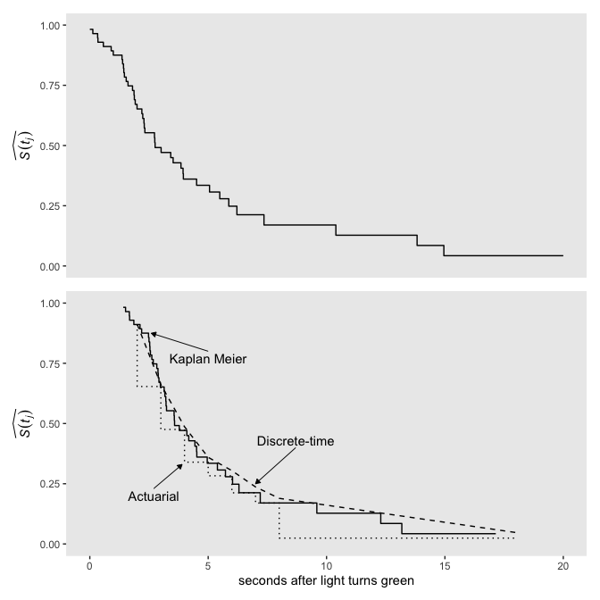<!-- -->

Did you notice how in both subplots we used `bind_rows()` to add in an
`S(t)` value for `seconds = 17.15`? In the text, we read:

> As for actuarial estimates, we plot Kaplan-Meier estimates as a step
> function that associates the estimated probability with the entire
> interval. If the largest event time is censored, as it is here
> (17.15), we extend the step for the last estimate out to that largest
> censored value. (pp. 485–486)

Those `bind_rows()` lines are what extended “the step for the last
estimate.” Since that last estimate for \(\hat S(t_j) = 0.04252557\), we
set `S(t) = 0.04252557` in the plot data.

We can get the median lifetime by executing
    `print(fit13.2)`.

``` r
print(fit13.2)
```

    ## Call: survfit(formula = Surv(seconds, censor_1) ~ 1, data = honking)
    ## 
    ##       n  events  median 0.95LCL 0.95UCL 
    ##   57.00   42.00    3.58    3.17    4.96

Like in the text, it’s 3.58.

Even though there is no Kaplan Meier estimate for hazard, we can compute
a Kaplan-Meier type hazard with the
formula

\[\hat h_\text{KM} (t_j) = \frac{\hat p_\text{KM} (t_j)}{\text{width}_j}.\]

Here we compute both the \(\text{width}_j\) and
\(\hat h_\text{KM} (t_j)\) values by hand.

``` r
honking_km <-
  honking_km %>% 
  mutate(width = end - start) %>% 
  mutate(width = if_else(end == Inf, 17.15 - start, width)) %>%  # this might be wrong
  mutate(`h[km](t)` = `p(t)` / width)

honking_km
```

    ## # A tibble: 42 x 13
    ##    interval interval_f seconds start   end n_risk n_events n_censored `p(t)` `S(t)` `se[S(t)]`
    ##       <int> <fct>        <dbl> <dbl> <dbl>  <dbl>    <dbl>      <dbl>  <dbl>  <dbl>      <dbl>
    ##  1        1 1             1.41  1.41  1.51     57        1          1 0.0175  0.982     0.0174
    ##  2        2 2             1.51  1.51  1.67     55        1          0 0.0182  0.965     0.0246
    ##  3        3 3             1.67  1.67  1.68     54        1          0 0.0185  0.947     0.0299
    ##  4        4 4             1.68  1.68  1.86     53        1          0 0.0189  0.929     0.0343
    ##  5        5 5             1.86  1.86  2.12     52        1          0 0.0192  0.911     0.0380
    ##  6        6 6             2.12  2.12  2.19     51        1          0 0.0196  0.893     0.0412
    ##  7        7 7             2.19  2.19  2.48     50        1          1 0.02    0.875     0.0441
    ##  8        8 8             2.48  2.48  2.5      48        1          0 0.0208  0.857     0.0468
    ##  9        9 9             2.5   2.5   2.53     47        1          0 0.0213  0.839     0.0492
    ## 10       10 10            2.53  2.53  2.54     46        1          0 0.0217  0.821     0.0514
    ## # … with 32 more rows, and 2 more variables: width <dbl>, `h[km](t)` <dbl>

Singer and Willett remarked that “because the interval width varies
widely (and is itself a function of the distribution of event times),
the resulting estimates vary from one interval to the next. Their values
are usually so erratic that pattern identification is nearly impossible”
(p. 487). That sounds fun. Let’s explore them in a plot\!

``` r
honking_km %>% 
  ggplot(aes(x = start, y = `h[km](t)`)) +
  geom_path() +
  geom_point() +
  scale_x_continuous("seconds after light turns green", limits = c(0, 15)) +
  scale_y_continuous(expression(hat(italic(h))[KM](italic(t[j])))) +
  theme(panel.grid = element_blank())
```

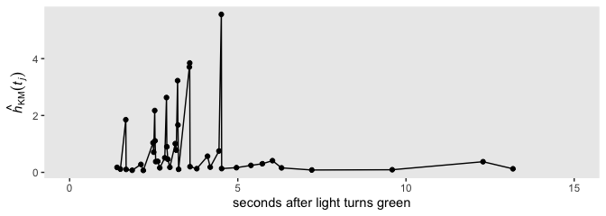<!-- -->

Erratic, indeed.

### 13.3.1 Fitting a Bayesian Kaplan-Meier model

It’s worth repeating one of the quotes from earlier:

> The Kaplan-Meier method is a simple extension of the discrete-time
> method with a fundamental change: instead of rounding event times to
> construct the intervals, capitalize on the raw event times and
> construct intervals so that each contains just *one observed event
> time* (as shown in table 13.3). Each Kaplan-Meier interval begins at
> one observed event time and ends just before the next. (p. 483,
> *emphasis* in the original)

Whether we’re working with one event occurrence at a time or binning
them in intervals, the basic product of the model is a conditional
probability. The binomial likelihood served us well when we binned the
event occurrences into largish time intervals, and it will work just the
same when we work them in serial fashion. The biggest obstacle is
properly setting up the data. After some experimentation, the easiest
way to format the data properly is to just use the summary results from
`survfit(data = honking, Surv(seconds, censor_1) ~ 1)`, which we saved
as `honking_km`. Take another look.

``` r
glimpse(honking_km)
```

    ## Rows: 42
    ## Columns: 13
    ## $ interval   <int> 1, 2, 3, 4, 5, 6, 7, 8, 9, 10, 11, 12, 13, 14, 15, 16, 17, 18, 19, 20, 21, 22,…
    ## $ interval_f <fct> 1, 2, 3, 4, 5, 6, 7, 8, 9, 10, 11, 12, 13, 14, 15, 16, 17, 18, 19, 20, 21, 22,…
    ## $ seconds    <dbl> 1.41, 1.51, 1.67, 1.68, 1.86, 2.12, 2.19, 2.48, 2.50, 2.53, 2.54, 2.56, 2.62, …
    ## $ start      <dbl> 1.41, 1.51, 1.67, 1.68, 1.86, 2.12, 2.19, 2.48, 2.50, 2.53, 2.54, 2.56, 2.62, …
    ## $ end        <dbl> 1.51, 1.67, 1.68, 1.86, 2.12, 2.19, 2.48, 2.50, 2.53, 2.54, 2.56, 2.62, 2.68, …
    ## $ n_risk     <dbl> 57, 55, 54, 53, 52, 51, 50, 48, 47, 46, 45, 44, 43, 42, 39, 38, 37, 36, 35, 33…
    ## $ n_events   <dbl> 1, 1, 1, 1, 1, 1, 1, 1, 1, 1, 1, 1, 1, 1, 1, 1, 1, 1, 1, 1, 1, 1, 1, 1, 1, 1, …
    ## $ n_censored <dbl> 1, 0, 0, 0, 0, 0, 1, 0, 0, 0, 0, 0, 0, 2, 0, 0, 0, 0, 1, 0, 0, 0, 0, 1, 0, 0, …
    ## $ `p(t)`     <dbl> 0.01754386, 0.01818182, 0.01851852, 0.01886792, 0.01923077, 0.01960784, 0.0200…
    ## $ `S(t)`     <dbl> 0.9824561, 0.9645933, 0.9467305, 0.9288676, 0.9110048, 0.8931419, 0.8752791, 0…
    ## $ `se[S(t)]` <dbl> 0.01738929, 0.02459209, 0.02992911, 0.03428307, 0.03799347, 0.04123439, 0.0441…
    ## $ width      <dbl> 0.10, 0.16, 0.01, 0.18, 0.26, 0.07, 0.29, 0.02, 0.03, 0.01, 0.02, 0.06, 0.06, …
    ## $ `h[km](t)` <dbl> 0.17543860, 0.11363636, 1.85185185, 0.10482180, 0.07396450, 0.28011204, 0.0689…

In the `n_events` column we have the number of cases that experienced
the event in a given moment in continuous time. In the `n_risk` column
we have the number of possible cases that could have experienced the
event at that moment. In the `interval_f` column we’ve saved each moment
as a factor, conveniently named \(1, 2,..., 42\). Thus we can fit a
simple Bayesian Kaplan-Meier model with `brms::brm()` by specifying
`formula = n_events | trials(n_risk) ~ 0 + interval_f`.

Consider the implications for our priors. Because we’re treating each
instance in time as a factor, that means the number of cases
experiencing the event in one of those factors will always be 1or some
other small number in the unusual case of a tie. But the number in the
denominator, `n_risk`, will tend to be relatively large, which means the
probabilities will tend to be small. The weakly regularizing prior
approach centered on zero might not make sense in this context.

In earlier models, we used `normal(0, 4)`, `normal(0, 1.5)`, and
`normal(0, 1)`. Here’s what those look like when we convert them to the
probability metric.

``` r
set.seed(13)

tibble(sd = c(4, 1.5, 1)) %>% 
  mutate(prior    = factor(str_c("normal(0, ", sd, ")"),
                           levels = str_c("normal(0, ", c(1, 1.5, 4), ")")),
         log_odds = map(sd, rnorm, n = 1e5, mean = 0)) %>% 
  unnest(log_odds) %>% 
  mutate(p  = inv_logit_scaled(log_odds)) %>% 
  
  ggplot(aes(x = p, y = prior)) +
  stat_histintervalh(.width = c(.5, .95), normalize = "xy") +
  labs(x = expression(italic(p)),
       y = "prior on the log-odds scale") +
  coord_cartesian(ylim = c(1.5, 3.5)) +
  theme(panel.grid = element_blank())
```

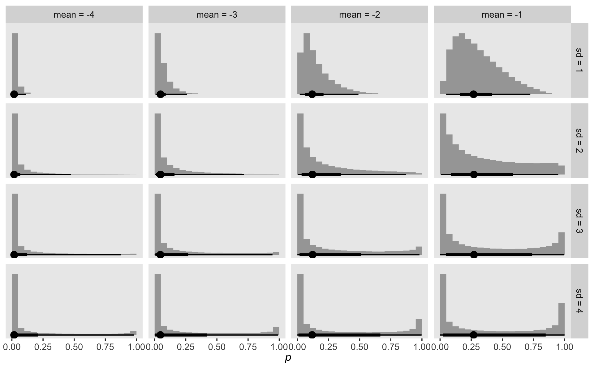<!-- -->

The weakly-regularizing `normal(0, 1)` favors probabilities near .5 and
`normal(0, 1.5)` is flat across the probability space. Neither reflect
our expectation that the probabilities will tend to be small.
Interestingly, `normal(0, 4)` pushes a lot of the prior mass to the
edges. What we want is a prior that pushed the mass to the left. Here
are some optoins:

``` r
crossing(mean = -4:-1,
         sd   = 1:4) %>% 
  mutate(log_odds = map2(mean, sd, rnorm, n = 1e5)) %>% 
  unnest(log_odds) %>% 
  mutate(p    = inv_logit_scaled(log_odds),
         mean = factor(str_c("mean = ", mean),
                       levels = str_c("mean = ", -4:-1)),
         sd   = str_c("sd = ", sd)) %>% 
  
  ggplot(aes(x = p, y = 0)) +
  stat_histintervalh(.width = c(.5, .95), normalize = "panels") +
  scale_y_continuous(NULL, breaks = NULL) +
  xlab(expression(italic(p))) +
  theme(panel.grid = element_blank()) +
  facet_grid(sd~mean)
```

<!-- -->

As you decrease the prior mean, the mass in the probability metric heads
to zero. Increasing or shrinking the prior standard deviation
accelerates or attenuates that leftward concentration. To my way of
thinking, we want a prior that, while concentrating the mass toward
zero, still offers a good spread toward the middle. Let’s try
`normal(-4, 3)`.

``` r
fit13.3 <-
  brm(data = honking_km,
      family = binomial,
      n_events | trials(n_risk) ~ 0 + interval_f,
      prior(normal(-4, 3), class = b),
      chains = 4, cores = 1, iter = 2000, warmup = 1000,
      seed = 13,
      file = "~/Dropbox/Recoding Applied Longitudinal Data Analysis/fits/fit13.03")
```

Check the summary.

``` r
print(fit13.3)
```

    ##  Family: binomial 
    ##   Links: mu = logit 
    ## Formula: n_events | trials(n_risk) ~ 0 + interval_f 
    ##    Data: honking_km (Number of observations: 42) 
    ## Samples: 4 chains, each with iter = 2000; warmup = 1000; thin = 1;
    ##          total post-warmup samples = 4000
    ## 
    ## Population-Level Effects: 
    ##              Estimate Est.Error l-95% CI u-95% CI Rhat Bulk_ESS Tail_ESS
    ## interval_f1     -4.40      1.07    -6.85    -2.73 1.00     4851     2250
    ## interval_f2     -4.41      1.10    -7.01    -2.67 1.00     5073     2356
    ## interval_f3     -4.39      1.08    -6.84    -2.68 1.00     4579     2227
    ## interval_f4     -4.36      1.14    -7.03    -2.62 1.00     5234     2319
    ## interval_f5     -4.34      1.10    -6.89    -2.64 1.00     5263     1951
    ## interval_f6     -4.32      1.06    -6.69    -2.58 1.00     5825     2498
    ## interval_f7     -4.33      1.10    -6.85    -2.57 1.00     4535     2355
    ## interval_f8     -4.27      1.07    -6.71    -2.60 1.00     5061     2615
    ## interval_f9     -4.23      1.07    -6.68    -2.50 1.00     6059     2750
    ## interval_f10    -4.24      1.10    -6.76    -2.51 1.00     5991     2424
    ## interval_f11    -4.20      1.07    -6.65    -2.48 1.00     5522     2809
    ## interval_f12    -4.20      1.12    -6.89    -2.45 1.00     6217     2517
    ## interval_f13    -4.13      1.05    -6.57    -2.44 1.00     5775     2378
    ## interval_f14    -4.21      1.16    -6.86    -2.37 1.00     4467     2049
    ## interval_f15    -4.08      1.12    -6.76    -2.34 1.00     5296     2476
    ## interval_f16    -4.07      1.11    -6.56    -2.33 1.00     4818     2174
    ## interval_f17    -4.04      1.11    -6.60    -2.27 1.00     5283     2442
    ## interval_f18    -4.01      1.07    -6.43    -2.29 1.00     5855     2882
    ## interval_f19    -4.02      1.11    -6.49    -2.23 1.00     4193     1994
    ## interval_f20    -3.93      1.12    -6.58    -2.17 1.00     4731     2114
    ## interval_f21    -3.86      1.09    -6.41    -2.16 1.00     5282     2270
    ## interval_f22    -3.85      1.08    -6.35    -2.15 1.00     5359     2372
    ## interval_f23    -3.83      1.10    -6.34    -2.08 1.00     5769     2478
    ## interval_f24    -3.84      1.17    -6.48    -1.98 1.00     4814     2123
    ## interval_f25    -3.73      1.11    -6.30    -1.98 1.00     5487     2548
    ## interval_f26    -3.74      1.16    -6.39    -1.88 1.00     5960     2687
    ## interval_f27    -3.71      1.16    -6.40    -1.85 1.00     4960     2439
    ## interval_f28    -3.67      1.14    -6.29    -1.87 1.00     5930     2472
    ## interval_f29    -3.58      1.17    -6.29    -1.73 1.00     4903     2065
    ## interval_f30    -3.54      1.16    -6.18    -1.66 1.00     5540     2453
    ## interval_f31    -3.45      1.18    -6.21    -1.56 1.00     5916     2484
    ## interval_f32    -3.39      1.19    -6.23    -1.51 1.00     5074     2436
    ## interval_f33    -3.31      1.18    -5.99    -1.42 1.00     5864     2438
    ## interval_f34    -3.13      1.19    -5.87    -1.24 1.00     5287     2505
    ## interval_f35    -3.02      1.23    -5.78    -1.04 1.00     5889     2654
    ## interval_f36    -2.94      1.20    -5.68    -1.00 1.00     4637     2248
    ## interval_f37    -2.73      1.22    -5.44    -0.73 1.00     5377     2237
    ## interval_f38    -2.49      1.26    -5.38    -0.43 1.00     5537     2254
    ## interval_f39    -2.12      1.29    -5.10     0.04 1.00     5342     2543
    ## interval_f40    -1.93      1.42    -5.03     0.45 1.00     5757     2406
    ## interval_f41    -1.56      1.47    -4.71     0.95 1.00     6246     2396
    ## interval_f42    -1.02      1.57    -4.34     1.87 1.00     7836     2634
    ## 
    ## Samples were drawn using sampling(NUTS). For each parameter, Bulk_ESS
    ## and Tail_ESS are effective sample size measures, and Rhat is the potential
    ## scale reduction factor on split chains (at convergence, Rhat = 1).

Our parameter diagnostics look excellent. It might be helpful to inspect
their posteriors in a plot. Here we show them in both the log-odds and
probability metrics.

``` r
post <-
  posterior_samples(fit13.3) %>% 
  select(-lp__) %>% 
  set_names(1:42) 

post %>% 
  pivot_longer(everything(),
               names_to = "parameter",
               values_to = "log_odds",
               names_ptypes = list(parameter = double())) %>% 
  mutate(probability = inv_logit_scaled(log_odds)) %>% 
  pivot_longer(probability:log_odds) %>% 
  
  ggplot(aes(x = value, y = parameter)) +
  geom_halfeyeh(.width = .95, normalize = "xy", size = 1/2) +
  labs(x = expression(hat(italic(p))[Bayes](italic(t[j]))),
       y = expression(italic(j))) +
  theme(panel.grid = element_blank()) +
  facet_wrap(~name, scales = "free_x")
```

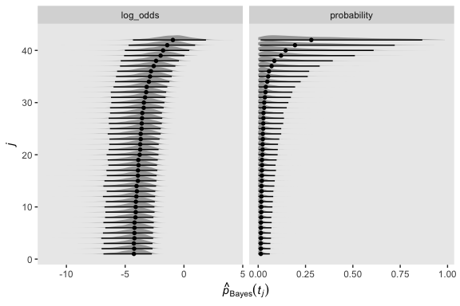<!-- -->

Let’s wrangle our `post` object a little to put it in a more useful
format.

``` r
post <-
  post %>% 
  mutate_all(inv_logit_scaled) %>% 
  mutate(`0` = 0) %>% 
  mutate(iter = 1:n()) %>% 
  pivot_longer(-iter,
               names_to = "interval",
               values_to = "p",
               names_ptypes = list(interval = double())) %>% 
  arrange(interval) %>% 
  group_by(iter) %>% 
  mutate(survivor = cumprod(1 - p)) %>% 
  ungroup() 

glimpse(post)
```

    ## Rows: 172,000
    ## Columns: 4
    ## $ iter     <int> 1, 2, 3, 4, 5, 6, 7, 8, 9, 10, 11, 12, 13, 14, 15, 16, 17, 18, 19, 20, 21, 22, 2…
    ## $ interval <dbl> 0, 0, 0, 0, 0, 0, 0, 0, 0, 0, 0, 0, 0, 0, 0, 0, 0, 0, 0, 0, 0, 0, 0, 0, 0, 0, 0,…
    ## $ p        <dbl> 0, 0, 0, 0, 0, 0, 0, 0, 0, 0, 0, 0, 0, 0, 0, 0, 0, 0, 0, 0, 0, 0, 0, 0, 0, 0, 0,…
    ## $ survivor <dbl> 1, 1, 1, 1, 1, 1, 1, 1, 1, 1, 1, 1, 1, 1, 1, 1, 1, 1, 1, 1, 1, 1, 1, 1, 1, 1, 1,…

We might want to compare our Bayesian \(\hat p(t_j)\) estimates with
their Maximum Likelihood counterparts. Since the Bayesian marginal
posteriors are rather asymmetrical, we’ll summarize
\(\hat p_\text{Bayes} (t_j)\) with means, medians, and modes.

``` r
post %>% 
  group_by(interval) %>% 
  summarise(mean   = mean(survivor),
            median = median(survivor),
            mode   = Mode(survivor)) %>% 
  pivot_longer(-interval,
               names_to = "posterior estimate") %>% 
  
  ggplot(aes(x = interval, y = value)) +
  geom_point(aes(color = `posterior estimate`),
             size = 3, shape = 1) +
  geom_point(data = honking_km,
             aes(y = `S(t)`)) +
  scale_color_viridis_d(option = "D", begin = .1, end = .8) +
  ylab(expression(hat(italic(p))(italic(t[j])))) +
  theme(legend.background = element_blank(),
        legend.key = element_rect(fill = "grey92"),
        legend.position = c(.85, .8),
        panel.grid = element_blank())
```

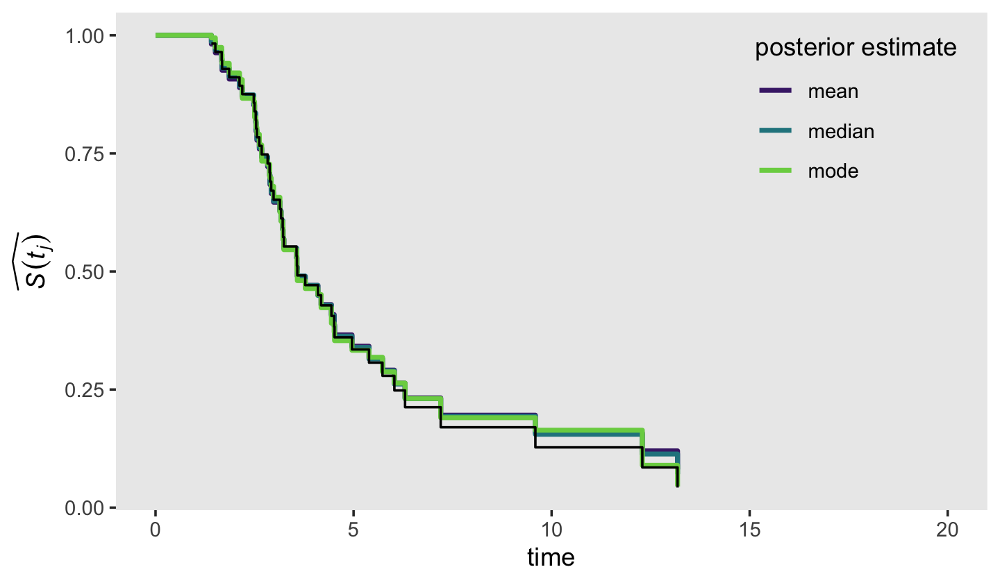<!-- -->

The black dots were the ML estimates and the colored circles were the
Bayesian counterparts. Overall, it looks like they matched up pretty
well\! Building on those sensibilities, here’s an alternative version of
the top panel from Figure 13.2, this time comparing the frequentist
\(\hat S (t_j)\) with our Bayesian counterpart.

``` r
post %>% 
  group_by(interval) %>% 
  summarise(mean   = mean(survivor),
            median = median(survivor),
            mode   = Mode(survivor)) %>% 
  pivot_longer(-interval,
               names_to = "posterior estimate") %>% 
  left_join(distinct(honking_km, interval, seconds),
            by = "interval") %>% 
  mutate(seconds = if_else(is.na(seconds), 0, seconds)) %>% 
  
  ggplot(aes(x = seconds, y = value)) +
  geom_step(aes(color = `posterior estimate`),
            size = 1) +
  geom_step(data = honking_km,
             aes(y = `S(t)`)) +
  scale_color_viridis_d(option = "D", begin = .1, end = .8) +
  scale_x_continuous("time", limits = c(0, 20)) +
  ylab(expression(widehat(italic(S(t[j]))))) +
  theme(legend.background = element_blank(),
        legend.key = element_rect(fill = "grey92"),
        legend.position = c(.85, .8),
        panel.grid = element_blank())
```

<!-- -->

Again, we showed the ML \(\hat S (t_j)\) in black and the Bayesian
counterpart as summarized by three alternative measures of central
tendency in color. Overall, the results were very similar across
methods. What this plot makes clear is that it’s the last few estimates
for that where our Bayesian estimates diverge from ML. If you compare
this plot with the previous one, it appears that the nature of the
divergence is our Bayesian estimates are shrunk a bit toward \(p = .5\),
though the modes shrank less than the medians and means. Also recall how
uncertain our posteriors were for the last few intervals. This is
because the likelihoods for those intervals were incredibly weak. Take a
glance at the last few rows in the data.

``` r
tail(honking_km)
```

    ## # A tibble: 6 x 13
    ##   interval interval_f seconds start    end n_risk n_events n_censored `p(t)` `S(t)` `se[S(t)]` width
    ##      <int> <fct>        <dbl> <dbl>  <dbl>  <dbl>    <dbl>      <dbl>  <dbl>  <dbl>      <dbl> <dbl>
    ## 1       37 37            6.03  6.03   6.3       9        1          1  0.111 0.248      0.0666 0.270
    ## 2       38 38            6.3   6.3    7.2       7        1          1  0.143 0.213      0.0659 0.9  
    ## 3       39 39            7.2   7.2    9.59      5        1          0  0.2   0.170      0.0650 2.39 
    ## 4       40 40            9.59  9.59  12.3       4        1          0  0.25  0.128      0.0611 2.70 
    ## 5       41 41           12.3  12.3   13.2       3        1          0  0.333 0.0851     0.0535 0.89 
    ## 6       42 42           13.2  13.2  Inf         2        1          1  0.5   0.0425     0.0403 3.97 
    ## # … with 1 more variable: `h[km](t)` <dbl>

Based on the `n_risk` column, the number of trials ranged from \(n = 9\)
at `interval == 37` to \(n = 2\) fpr `interval == 42`. With so little
information informing the likelihood, you largely get back the prior.

``` r
post %>% 
  bind_rows(
    post %>% 
      filter(interval == 42) %>% 
      mutate(interval = 43)
    ) %>% 
  left_join(
    bind_rows(
      distinct(honking_km, interval, seconds),
      tibble(interval = 43, seconds = 17.15)),
    by = "interval") %>% 
  mutate(seconds = if_else(is.na(seconds), 0, seconds)) %>% 
  
  ggplot(aes(x = seconds, y = survivor)) + 
  stat_lineribbon(step = "hv", size = 3/4, .width = c(.5, .95)) +
  annotate(geom = "text",
           x = 5.3, y = .54, hjust = 0, size = 3.5,
           label = "This time the black line is the Bayesian posterior median,\nwhich is the `stat_lineribbon()` default.") +
  geom_segment(x = 5.3, xend = 4.2,
               y = .55, yend = .475,
               size = 1/5, arrow = arrow(length = unit(0.15,"cm"), type = "closed")) +
  scale_fill_grey("CI", start = .8, end = .6,
                  labels = c("95%", "50%")) +
  scale_x_continuous("time", limits = c(0, 20)) +
  ylab(expression(widehat(italic(S(t[j]))))) +
  theme(legend.background = element_blank(),
        legend.key = element_rect(fill = "grey92"),
        legend.position = c(.925, .85),
        panel.grid = element_blank())
```

<!-- -->

Just for giggles, here’s how you might depict our
\(\hat S_\text{Bayes} (t_j)\) with more of a 3D approach.

``` r
post %>% 
  bind_rows(
    post %>% 
      filter(interval == 42) %>% 
      mutate(interval = 43)
    ) %>% 
  left_join(
    bind_rows(
      distinct(honking_km, interval, seconds),
      tibble(interval = 43, seconds = 17.15)),
    by = "interval") %>% 
  mutate(seconds = if_else(is.na(seconds), 0, seconds)) %>% 
  
  ggplot(aes(x = seconds, y = survivor)) + 
  stat_lineribbon(.width = seq(from = .01, to = .99, by = .01),
                  step = "hv", size = 0, show.legend = F) +
  scale_fill_grey(start = .89, end = 0) +
  scale_x_continuous("time", limits = c(0, 20)) +
  ylab(expression(widehat(italic(S(t[j]))))) +
  theme(panel.grid = element_blank())
```

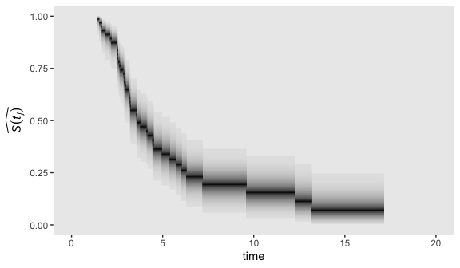<!-- -->

## 13.4 The cumulative hazard function

> Kaplan-Meier type estimates of hazard are simply too erratic to be
> meaningful.
> 
> This is where the *cumulative hazard function* comes in. Denoted
> \(H (t_{ij})\), the cumulative hazard function assesses, at each point
> in time, the *total amount of accumulated risk* that individual \(i\)
> has faced from the beginning of time until the present. (p. 488,
> *emphasis* in the original)

The cumulative hazard function follows the
equation

\[H (t_{ij}) = \underset{\text{between } t_0 \text{ and } t_j}{\text{cumulation}} [h(t_{ij})],\]

“where the phrase ‘cumulation between \(t_0\) and \(t_j\)’ indicates
that cumulative hazard totals the infinite number of specific values of
\(h(t_{ij})\) that exist between \(t_0\) and \(t_j\)” (p. 488).

### 13.4.1 Understanding the meaning of cumulative hazard.

Although the absolute values of the cumulative hazard function aren’t
particularly illuminating, the overall shape is. Figure 13.3 gives
several examples. We don’t have the data or the exact specifications for
the functions expressed in Figure 13.3. But if you’re okay with a little
imprecision, we can make a few good guesses. Before diving in, it’ll
help simplify our subplot code if we make two custom geoms. We’ll call
them `geom_h()` and `geom_H()`.

``` r
geom_h <- function(subtitle, ...) {
  
  list(
    geom_line(...),
    scale_x_continuous(NULL, breaks = NULL),
    scale_y_continuous(expression(italic(h)(italic(t[ij]))),
                       breaks = 0:5 * 0.02),
    labs(subtitle = subtitle),
    coord_cartesian(ylim = c(0, .1))
  )
  
}

geom_H <- function(y_ul, ...) {
  
  list(
    geom_line(...),
    ylab(expression(italic(H)(italic(t[ij])))),
    coord_cartesian(ylim = c(0, y_ul))
  )
  
}
```

Now we have our custom geoms, here’s the code to make Figure 13.3.

``` r
# a: constant hazard
d <-
  tibble(time = seq(from = 0, to = 100, by = 1)) %>% 
  mutate(h = 0.05) %>%  
  mutate(H = cumsum(h))

p1 <- d %>% 
  ggplot(aes(x = time, y = h)) +
  geom_h(subtitle = "A: Constant hazard")

p2 <- d %>% 
  ggplot(aes(x = time, y = H)) +
  geom_H(y_ul = 6)

# b: increasing hazard
d <-
  tibble(time = seq(from = 0, to = 100, by = 1)) %>% 
  mutate(h = 0.001 * time) %>%  
  mutate(H = cumsum(h))

p3 <- d %>% 
  ggplot(aes(x = time, y = h)) + 
  geom_h(subtitle = "B: Increasing hazard")
  
p4 <- d %>% 
  ggplot(aes(x = time, y = H)) +
  geom_H(y_ul = 5)

# decreasing hazard
d <-
  tibble(time = seq(from = .2, to = 100, by = .1)) %>% 
  # note out use of the gamma distribution (see )
  mutate(h = dgamma(time, shape = .02, rate = .001)) %>%  
  mutate(H = cumsum(h))

p5 <- d %>% 
  ggplot(aes(x = time, y = h)) +
  geom_h(subtitle = "C: Decreasing hazard")

p6 <- d %>% 
  ggplot(aes(x = time, y = H)) +
  geom_H(y_ul = 1.2)

# increasing & decreasing hazard
d <-
  tibble(time = seq(from = 1, to = 100, by = 1)) %>% 
  # note our use of the Fréchet distribution
  mutate(h = dfrechet(time, loc = 0, scale = 250, shape = .5) * 25) %>%  
  mutate(H = cumsum(h))

p7 <- d %>% 
  ggplot(aes(x = time, y = h)) +
  geom_h(subtitle = "D: Increasing &\n decreasing hazard")

p8 <- d %>% 
  ggplot(aes(x = time, y = H)) +
  geom_H(y_ul = 5)

# combine with patchwork and plot!
((p1 / p2) | (p3 / p4) | (p5 / p6) | (p7 / p8)) &
  theme(panel.grid = element_blank())
```

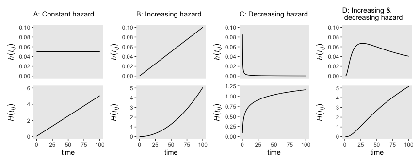<!-- -->

Did you notice our use of the gamma and Fréchet distributions? Both are
supported for continuous-time survival models in **brms** (see Bürkner’s
vignette, [*Parameterization of Response Distributions in
brms*](https://cran.r-project.org/web/packages/brms/vignettes/brms_families.html#survival-models)).

### 13.4.2 Estimating the cumulative hazard function.

The two methods to estimate the cumulative hazard function are the
Nelson-Aalen method and the negative log survivor function method. The
Nelson-Aalen method used Kaplan-Meier-type hazard estimates as
follows:

\[\hat H_\text{NA} (t_j) = \hat h_\text{KM} (t_1) \text{width}_1 + \hat h_\text{KM} (t_2) \text{width}_2 + \dots + \hat h_\text{KM} (t_j) \text{width}_j,\]

where \(\hat h_\text{KM} (t_j) \text{width}_j\) is the total hazard
during the \(j\)th interval. The negative log survivor function method
makes use of the estimates of the Kaplan-Meier survivor function with
the formula

\[\hat H_{- \text{LS}} (t_j) = - \log \hat S_\text{KM} (t_{ij}),\]

where \(\hat S_\text{KM} (t_{ij})\), recall, is the cumulative survivor
function for the Kaplan Meier estimator. Here we put both formulas to
use and make our version of Figure 13.4.

``` r
# for annotation
text <-
  tibble(seconds = c(13.15, 13.4),
         y       = c(3.275, 2.65),
         label   = c("Negative~log~survivor*','*~hat(italic(H))[-LS](italic(t[j]))", "Nelson-Aalen*','*~hat(italic(H))[N][A](italic(t[j]))"))

# top plot
p1 <-
  honking_km %>% 
  mutate(width = if_else(width == Inf, 17.15 - start, width)) %>% 
  mutate(`H[na](t)` = cumsum(`h[km](t)` * width),
         `H[ls](t)` = - log(`S(t)`)) %>% 
  select(seconds, `H[na](t)`, `H[ls](t)`) %>% 
  bind_rows(tibble(seconds    = 17.15, 
                   `H[na](t)` = 2.78499694, 
                   `H[ls](t)` = 3.15764982)) %>% 
  # add a line index
  mutate(line = rep(letters[1:4], times = c(12, 21, 7, 3))) %>% 
  
  
  ggplot(aes(x = seconds)) +
  geom_step(aes(y = `H[ls](t)`),
            color = "grey50") +
  geom_step(aes(y = `H[na](t)`),
            linetype = 2) +
  geom_text(data = text,
            aes(y = y, label = label),
            hjust = 0, size = 3, parse = T) +
  scale_x_continuous("time", limits = c(0, 20)) +
  scale_y_continuous(expression(widehat(italic(H)(italic(t[j])))), 
                     breaks = seq(from = 0, to = 3.5, by = .5), limits = c(0, 3.5)) +
  theme(panel.grid = element_blank())

# bottom plot
p2 <- 
  p1 +
  stat_smooth(data = . %>% filter(line != "d"),
              aes(y = (`H[ls](t)` + `H[na](t)`) / 2, color = line, fill = line),
              method = "lm", show.legend = F) +
  scale_fill_viridis_d(option = "A", begin = .2, end = .8) +
  scale_color_viridis_d(option = "A", begin = .2, end = .8)

# combine
(p1 + scale_x_continuous(NULL, breaks = NULL, limits = c(0, 20))) / p2
```

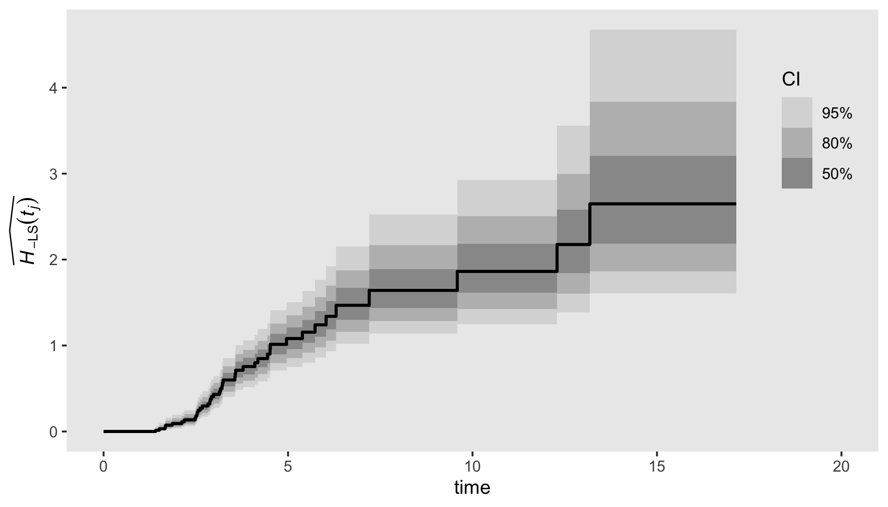<!-- -->

Visualizing the cumulative hazard function from our Bayesian `fit13.3`
is a minor extension to the approach we used for the survivor function,
above. As an example, here’s our plot for
\(\hat H_{- \text{LS}} (t_j)\). The biggest change in the code is the
last line in the second `mutate()` statement, `hazard = -log(survivor)`.

``` r
post %>% 
  bind_rows(
    post %>% 
      filter(interval == 42) %>% 
      mutate(interval = 43)
    ) %>% 
  left_join(
    bind_rows(
      distinct(honking_km, interval, seconds),
      tibble(interval = 43, seconds = 17.15)),
    by = "interval") %>% 
  mutate(seconds = if_else(is.na(seconds), 0, seconds),
         # convert S to H
         hazard = -log(survivor)) %>% 
  
  ggplot(aes(x = seconds, y = hazard)) + 
  stat_lineribbon(step = "hv", size = 3/4, .width = c(.5, .8, .95)) +
  scale_fill_grey("CI", start = .85, end = .6,
                  labels = c("95%", "80%", "50%")) +
  scale_x_continuous("time", limits = c(0, 20)) +
  ylab(expression(widehat(italic(H)[-LS](italic(t[j]))))) +
  theme(legend.background = element_blank(),
        legend.key = element_rect(fill = "grey92"),
        legend.position = c(.925, .73),
        panel.grid = element_blank())
```

<!-- -->

## 13.5 Kernel-smoothed estimates of the hazard function

> The idea behind kernel smoothing is simple. At each of many distinct
> points in time, estimate a function’s average value by aggregating
> together all the point estimates available within the focal time’s
> temporal vicinity. Conceptually, kernel-smoothed estimates are a type
> of moving average. They do not identify precise values of hazard at
> each point in time but rather approximate values based on the
> estimates nearby. Even though each smoothed value only approximates
> the underlying true value, a plot over time can help reveal the
> underlying function’s shape.
> 
> Kernel smoothing requires a set of point estimates to smooth. For the
> hazard function, one way of obtaining these point estimates is by
> computing successive differences in the estimated cumulative hazard
> function from each observed even time until the next. Each difference
> acts as a pseudo-slope, a measure of the local rate of change in
> cumulative hazard during that period. Either Nelson-Aalen estimates or
> negative log survivor function estimates of cumulative hazard can be
> used. (pp. 495–496)

Singer and Willett showed examples of this smoothing in Figure 13.5, in
which they applied a smoothing algorithm to the
\(H_{- \text{LS}} (t_j)\) estimates. The good folks at
[IDRE](https://stats.idre.ucla.edu/r/examples/alda/r-applied-longitudinal-data-analysis-ch-13/)
have already worked out the code to reproduce Singer and Willette’s
smoothing algorithm. The IDRE folks called their custom function
`smooth()`.

``` r
my_smooth <- function(width, time, survive) { 
  
  n   <- length(time)
  lo  <- time[1] + width
  hi  <- time[n] - width
  npt <- 50
  inc <- (hi - lo) / npt
  
  s <- t(lo + t(c(1:npt)) * inc)
  
  slag <- c(1, survive[1:n - 1])
  h    <- 1 - survive / slag
  x1   <- as.vector(rep(1, npt)) %*% (t(time))
  x2   <- s %*% as.vector(rep(1, n))
  x    <- (x1 - x2) / width
  k    <- .75 * (1 - x * x) * (abs(x) <= 1)
  
  lambda <- (k %*% h) / width
  
  smoothed <- data.frame(x = s, y = lambda)
  
  return(smoothed)
}
```

We’ve renamed the function `my_smooth()` to avoid overwriting the
already existing `smooth()` function. The code for `my_smooth()` is a
mild update from the one in the link above in that it returns its
results in a data frame. Let’s give it a quick whirl.

``` r
my_smooth(width = 1, 
          time = honking_km$seconds,
          survive = honking_km$`S(t)`) %>% 
  glimpse()
```

    ## Rows: 50
    ## Columns: 2
    ## $ x <dbl> 2.6054, 2.8008, 2.9962, 3.1916, 3.3870, 3.5824, 3.7778, 3.9732, 4.1686, 4.3640, 4.5594,…
    ## $ y <dbl> 0.32686176, 0.36745825, 0.38958042, 0.38516865, 0.37093732, 0.34810198, 0.33956166, 0.3…

The `time` and `survive` arguments take `seconds` and `S(t)` values,
respectively. The `width` argument determines over how many values we
would like to smooth over on a given point. For example, `width = 1`
would, for a given point on the `time` axis, aggregate over all values
\(\pm1\) that point. Larger `width` values result in more aggressive
smoothing. Also notice `my_smooth()` returned a data frame containing 50
rows for two columns, `x` and `y`. Those columns are the coordinates for
the *TIME* and smoothed hazard, respectively. Here we put `my_smooth()`
to work and make our version of Figure 13.5.

``` r
tibble(width = 1:3) %>% 
  mutate(xy = map(width, ~my_smooth(width = ., 
                                    time = honking_km$seconds, 
                                    survive = honking_km$`S(t)`)),
         width = str_c("width = ", width)) %>% 
  unnest(xy) %>% 
  
  ggplot(aes(x = x, y = y)) +
  geom_line() +
  scale_x_continuous("seconds after light turns green", limits = c(0, 20)) +
  ylab("smoothed hazard") +
  theme(panel.grid = element_blank()) +
  facet_wrap(~width, nrow = 3)
```

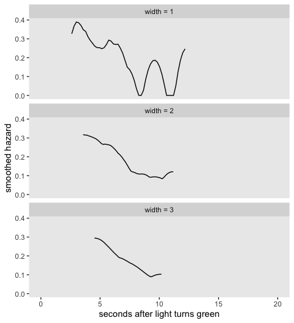<!-- -->

## 13.6 Developing an intuition about continuous-time survivor, cumulative hazard, and kernel-smoothed hazard functions

Buckle up and load the relapse data from Cooney and colleagues
([1991](https://doi.org/10.1037/0022-006X.59.4.598)); the US Supreme
Court tenure data from Zorn and van Winkle
([2000](https://doi.org/10.1023/A:1006667601289)); the first depressive
episode data from Sorenson, Rutter, and Aneshensel
([1991](https://doi.org/10.1037/0022-006X.59.4.541)); and the
health-workers employment data from Singer and colleagues
([1998](https://www.jstor.org/stable/3766886)).

``` r
alcohol_relapse  <- read_csv("~/Dropbox/Recoding Applied Longitudinal Data Analysis/data/alcohol_relapse.csv") %>% rename_all(str_to_lower)
judges           <- read_csv("~/Dropbox/Recoding Applied Longitudinal Data Analysis/data/judges.csv")
first_depression <- read_csv("~/Dropbox/Recoding Applied Longitudinal Data Analysis/data/firstdepression.csv")
health_workers   <- read_csv("~/Dropbox/Recoding Applied Longitudinal Data Analysis/data/healthworkers.csv")

glimpse(alcohol_relapse)
```

    ## Rows: 89
    ## Columns: 3
    ## $ weeks  <dbl> 0.7142857, 0.7142857, 1.1428571, 1.4285714, 1.7142857, 1.7142857, 2.1428571, 2.714…
    ## $ censor <dbl> 0, 0, 0, 0, 0, 0, 0, 0, 0, 0, 0, 0, 0, 0, 0, 0, 0, 0, 0, 0, 0, 0, 0, 0, 0, 0, 0, 0…
    ## $ id     <dbl> 1, 2, 3, 4, 5, 6, 7, 8, 9, 10, 11, 12, 13, 14, 15, 16, 17, 18, 19, 20, 21, 22, 23,…

``` r
glimpse(judges)
```

    ## Rows: 109
    ## Columns: 7
    ## $ id     <dbl> 1, 2, 3, 4, 5, 6, 7, 8, 9, 10, 11, 12, 13, 14, 15, 16, 17, 18, 19, 20, 21, 22, 23,…
    ## $ tenure <dbl> 1, 6, 6, 9, 21, 9, 1, 13, 4, 15, 31, 4, 34, 30, 16, 19, 23, 34, 20, 2, 32, 14, 32,…
    ## $ dead   <dbl> 0, 0, 0, 1, 1, 1, 0, 1, 0, 1, 1, 0, 1, 1, 1, 1, 0, 1, 1, 1, 1, 1, 1, 1, 1, 1, 1, 1…
    ## $ retire <dbl> 1, 1, 1, 0, 0, 0, 1, 0, 1, 0, 0, 1, 0, 0, 0, 0, 1, 0, 0, 0, 0, 0, 0, 0, 0, 0, 0, 0…
    ## $ leave  <dbl> 1, 1, 1, 1, 1, 1, 1, 1, 1, 1, 1, 1, 1, 1, 1, 1, 1, 1, 1, 1, 1, 1, 1, 1, 1, 1, 1, 1…
    ## $ age    <dbl> 50, 57, 44, 47, 57, 38, 59, 47, 51, 55, 36, 44, 45, 32, 49, 42, 58, 32, 55, 49, 44…
    ## $ year   <dbl> 1789, 1789, 1789, 1789, 1789, 1790, 1791, 1793, 1796, 1796, 1798, 1799, 1801, 1804…

``` r
glimpse(first_depression)
```

    ## Rows: 2,974
    ## Columns: 3
    ## $ id     <dbl> 1, 2, 3, 4, 5, 6, 7, 8, 9, 10, 11, 12, 13, 14, 15, 16, 17, 18, 19, 20, 21, 22, 23,…
    ## $ age    <dbl> 4, 6, 8, 8, 9, 9, 10, 10, 11, 12, 12, 13, 13, 13, 13, 13, 13, 13, 14, 14, 14, 14, …
    ## $ censor <dbl> 0, 0, 0, 0, 0, 0, 0, 0, 0, 0, 0, 0, 0, 0, 0, 0, 0, 0, 0, 0, 0, 0, 0, 0, 0, 0, 0, 0…

``` r
glimpse(health_workers)
```

    ## Rows: 2,074
    ## Columns: 3
    ## $ id     <dbl> 1, 2, 3, 4, 5, 6, 7, 8, 9, 10, 11, 12, 13, 14, 15, 16, 17, 18, 19, 20, 21, 22, 23,…
    ## $ weeks  <dbl> 0.14, 0.42, 1.00, 1.28, 1.28, 1.71, 1.85, 1.85, 1.85, 2.00, 2.14, 2.14, 2.14, 2.28…
    ## $ censor <dbl> 0, 1, 0, 1, 1, 1, 1, 1, 1, 1, 1, 1, 1, 1, 1, 1, 1, 1, 1, 1, 1, 0, 0, 1, 1, 1, 1, 1…

For our first go, just fit the models with `furvfit()`.

``` r
 fit13.4 <-
  survfit(data = alcohol_relapse,
          Surv(weeks, abs(censor - 1)) ~ 1)

 fit13.5 <-
  survfit(data = judges,
          Surv(tenure, leave) ~ 1)

 fit13.6 <-
  survfit(data = first_depression,
          Surv(age, abs(censor - 1)) ~ 1)

 fit13.7 <-
  survfit(data = health_workers,
          Surv(weeks, abs(censor - 1)) ~ 1)
```

With the model from Section 13.3, we organized the Kaplan-Meier output
in a tibble following the outline of Table 13.3 (p. 484). That layout
was useful for plotting the frequentist results and for fitting the
Bayesian version of the model with **brms**. Since we’re juggling four
models, let’s make a convenience function to do that with a single line
of code. Call it `km_tibble()`.

``` r
km_tibble <- function(surv_fit) {
  
  t <- summary(surv_fit)
  
  length <- length(t$time)
  
  d <-
    tibble(time     = c(0, t$time),
           n_risk   = c(t$n.risk[1], t$n.risk),
           n_events = c(0, t$n.event)) %>% 
    mutate(p        = n_events / n_risk,
           n_censored = n_risk - n_events - lead(n_risk, default = 0),
           interval   = 0:length,
           interval_f = factor(0:length, levels = 0:c(length + 1))) %>% 
    select(interval:interval_f, time, n_risk:n_events, n_censored, p) %>% 
    mutate(S = cumprod(1 - p)) %>% 
    mutate(H = ifelse(interval == 0, NA, 
                      ifelse(S == 0, NA,
                             -log(S))),
           p = ifelse(interval == 0, NA, p))
  
  d <-
    bind_rows(
      d, 
      d %>% 
        slice(n()) %>%
        mutate(interval   = length + 1,
               interval_f = factor(length + 1,
                                   levels = 0:c(length + 1)),
               time       = surv_fit$time %>% max()))
  
  return(d)
  
}
```

Here’s an example of our custom `km_tibble()` function works based on
our earlier model of the `honking` data, `fit13.2`.

``` r
km_tibble(fit13.2)
```

    ## # A tibble: 44 x 9
    ##    interval interval_f  time n_risk n_events n_censored       p     S       H
    ##       <dbl> <fct>      <dbl>  <dbl>    <dbl>      <dbl>   <dbl> <dbl>   <dbl>
    ##  1        0 0           0        57        0          0 NA      1     NA     
    ##  2        1 1           1.41     57        1          1  0.0175 0.982  0.0177
    ##  3        2 2           1.51     55        1          0  0.0182 0.965  0.0360
    ##  4        3 3           1.67     54        1          0  0.0185 0.947  0.0547
    ##  5        4 4           1.68     53        1          0  0.0189 0.929  0.0738
    ##  6        5 5           1.86     52        1          0  0.0192 0.911  0.0932
    ##  7        6 6           2.12     51        1          0  0.0196 0.893  0.113 
    ##  8        7 7           2.19     50        1          1  0.02   0.875  0.133 
    ##  9        8 8           2.48     48        1          0  0.0208 0.857  0.154 
    ## 10        9 9           2.5      47        1          0  0.0213 0.839  0.176 
    ## # … with 34 more rows

Now apply `km_tibble()` to our four new fits.

``` r
km <-
  tibble(ml_fit = str_c("fit13.", 4:7)) %>% 
  mutate(d = map(ml_fit, ~get(.) %>% km_tibble())) %>% 
  unnest(d)
```

If we want the settings in our \(x\)- and \(y\)-axes to differ across
subplots, good old `facet_wrap()` and `facet_grid()` aren’t going to cut
it for our version of Figure 13.6. To avoid needless repetition in the
settings across subplot code, we’ll make a few custom geoms.

``` r
geom_S <- function(x_ul, y_lab = NULL, ...) {
  
  list(
    geom_hline(yintercept = .5, color = "white"),
    geom_step(...),
    scale_x_continuous(NULL, breaks = NULL, limits = c(0, x_ul)),
    scale_y_continuous(y_lab, breaks = c(0, .5, 1), labels = c("0", ".5", "1"), limits = c(0, 1))
  )
  
}

geom_H <- function(x_ul, y_lab = NULL, ...) {
  
  list(
    geom_step(...),
    scale_x_continuous(NULL, breaks = NULL, limits = c(0, x_ul)),
    scale_y_continuous(y_lab, limits = c(0, NA))
  )
  
}

geom_h <- function(x_lab, x_ul, y_lab = NULL, ...) {
  
  list(
    geom_line(...),
    scale_x_continuous(x_lab, limits = c(0, x_ul)),
    scale_y_continuous(y_lab, limits = c(0, NA))
  )
  
}
```

Use `geom_S()` to make and save the top row, the \(\widehat{S (t_j)}\)
plots.

``` r
p1 <-
  km %>% 
  filter(ml_fit == "fit13.4") %>% 
  ggplot(aes(x = time, y = S)) +
  geom_S(x_ul = 110, y_lab = expression(widehat(italic(S(t[j]))))) +
  labs(subtitle = "Cooney et al (1991)")

p2 <-
  km %>% 
  filter(ml_fit == "fit13.5") %>% 
  ggplot(aes(x = time, y = S)) +
  geom_S(x_ul = 36, y_lab = NULL) +
  labs(subtitle = "Zorn &  Van Winkle (2000)")

p3 <-
  km %>% 
  filter(ml_fit == "fit13.6") %>% 
  ggplot(aes(x = time, y = S)) +
  geom_S(x_ul = 102, y_lab = NULL) +
  labs(subtitle = "Sorenson et al (1991)")

p4 <-
  km %>% 
  filter(ml_fit == "fit13.7") %>% 
  ggplot(aes(x = time, y = S)) +
  geom_S(x_ul = 150, y_lab = NULL) +
  labs(subtitle = "Singer et al (1998)")
```

Use `geom_H()` to make and save the middle row, the
\(\widehat{H (t_j)}\) plots.

``` r
p5 <-
  km %>% 
  filter(ml_fit == "fit13.4") %>% 
  ggplot(aes(x = time, y = H)) +
  geom_H(x_ul = 110, y_lab = expression(widehat(italic(H(t[j])))))

p6 <-
  km %>% 
  filter(ml_fit == "fit13.5") %>% 
  ggplot(aes(x = time, y = H)) +
  geom_H(x_ul = 36, y_lab = NULL)

p7 <-
  km %>% 
  filter(ml_fit == "fit13.6") %>% 
  ggplot(aes(x = time, y = H)) +
  geom_H(x_ul = 102, y_lab = NULL)

p8 <-
  km %>% 
  filter(ml_fit == "fit13.7") %>% 
  ggplot(aes(x = time, y = H)) +
  geom_H(x_ul = 150, y_lab = NULL)
```

Use `geom_h()` to make and save the bottom row, the
\(\widehat{h (t_j)}\) plots.

``` r
p9 <-
  my_smooth(width = 12, time = fit13.4$time, survive = fit13.4$surv) %>% 
  ggplot(aes(x = x, y = y)) +
  geom_h(x_lab = "weeks after discharge", x_ul = 110, y_lab = expression(widehat(italic(h(t[j])))))

p10 <-
  my_smooth(width = 5, time = fit13.5$time, survive = fit13.5$surv) %>% 
  ggplot(aes(x = x, y = y)) +
  geom_h(x_lab = "years on court", x_ul = 36, y_lab = NULL)

p11 <-
  my_smooth(width = 7, time = fit13.6$time, survive = fit13.6$surv) %>% 
  ggplot(aes(x = x, y = y)) +
  geom_h(x_lab = "age (in years)", x_ul = 102, y_lab = NULL)

p12 <-
  my_smooth(width = 12, time = fit13.7$time, survive = fit13.7$surv) %>% 
  ggplot(aes(x = x, y = y)) +
  geom_h(x_lab = "weeks since hired", x_ul = 150, y_lab = NULL)
```

Finally, combine the subplots and behold our version of Figure 13.6\!

``` r
((p1 / p5 / p9) | (p2 / p6 / p10) | (p3 / p7 / p11) | (p4 / p8 / p12)) &
  theme(panel.grid = element_blank())
```

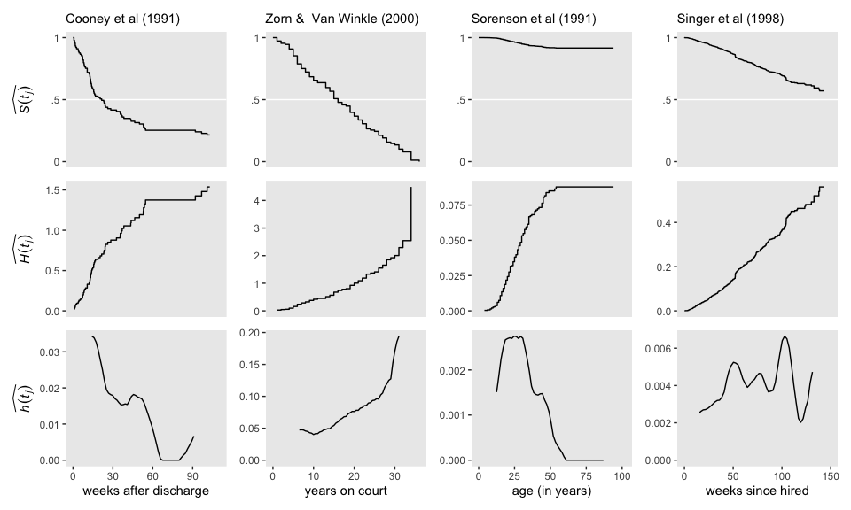<!-- -->

### 13.6.1 Bonus: Bayesians can compare continuous-time survivor, cumulative hazard, and kernel-smoothed hazard functions, too.

Now let’s repeat that process as Bayesians. Here we fit those last four
models with `brm()`. Note the `data` statements. Filtering by `ml_fit`
allowed us to select the correct subset of data saved in `km`. The two
filtering statements by `interval` allowed us to focus on the actual
data instead of including the two rows we added for plotting
conveniences. Otherwise the `brm()` code is just like what we used
before.

``` r
fit13.8 <-
  brm(data = filter(km, ml_fit == "fit13.4" & interval > 0 & interval < 61),
      family = binomial,
      n_events | trials(n_risk) ~ 0 + interval_f,
      prior(normal(-4, 3), class = b),
      chains = 4, cores = 4, iter = 2000, warmup = 1000,
      seed = 13,
      file = "~/Dropbox/Recoding Applied Longitudinal Data Analysis/fits/fit13.08")

fit13.9 <-
  brm(data = filter(km, ml_fit == "fit13.5" & interval > 0 & interval < 34),
      family = binomial,
      n_events | trials(n_risk) ~ 0 + interval_f,
      prior(normal(-4, 3), class = b),
      chains = 4, cores = 4, iter = 2000, warmup = 1000,
      seed = 13,
      file = "~/Dropbox/Recoding Applied Longitudinal Data Analysis/fits/fit13.09")

fit13.10 <-
  brm(data = filter(km, ml_fit == "fit13.6" & interval > 0 & interval < 44),
      family = binomial,
      n_events | trials(n_risk) ~ 0 + interval_f,
      prior(normal(-4, 3), class = b),
      chains = 4, cores = 4, iter = 2000, warmup = 1000,
      seed = 13,
      file = "~/Dropbox/Recoding Applied Longitudinal Data Analysis/fits/fit13.10")

fit13.11 <-
  brm(data = filter(km, ml_fit == "fit13.7" & interval > 0 & interval < 306),
      family = binomial,
      n_events | trials(n_risk) ~ 0 + interval_f,
      prior(normal(-4, 3), class = b),
      chains = 4, cores = 4, iter = 2000, warmup = 1000,
      seed = 13,
      file = "~/Dropbox/Recoding Applied Longitudinal Data Analysis/fits/fit13.11")
```

For the sake of space, I’m not going to show all the summary output. If
you’re following along, I still recommend you give them a look. Spoiler
alert: the parameter diagnostics look great.

``` r
print(fit13.8)
print(fit13.9)
print(fit13.10)
print(fit13.11)
```

Since we’re working with four `brm()` fits, it might make sense to
bundle the steps and keep the results in one place. Here we make
something of a super function. With `wrangle_samples()`, we’ll extract
the posterior draws from each model; add a couple interval columns;
convert the results to the \(\widehat{p (t_j)}\), \(\widehat{S (t_j)}\),
and \(\widehat{H (t_j)}\) metrics; and join the results to the data
stored in `km`. If the steps seem overwhelming, just flip back to the
ends of Sections 13.3 and 13.4. This is a small extension of the data
wrangling steps we took to make the \(\widehat{S (t_j)}\) and
\(\widehat{H (t_j)}\) plots for our **brms** model `fit13.3`.

``` r
wrangle_samples <- function(brms, survfit) {
  
  # extract the samples
  post <-
    get(brms) %>% 
    posterior_samples() %>% 
    select(-lp__)
  
  # how many columns?
  n_col <- ncol(post)  
  
  # transform to the p metric, add a 0 interval, make it long, and add S
  post <- 
    post %>% 
    set_names(1:n_col) %>% 
    mutate_all(inv_logit_scaled) %>% 
    mutate(`0` = 0) %>% 
    mutate(iter = 1:n()) %>% 
    pivot_longer(-iter,
                 names_to = "interval",
                 values_to = "p",
                 names_ptypes = list(interval = double())) %>% 
    arrange(interval) %>% 
    group_by(iter) %>% 
    mutate(S = cumprod(1 - p)) %>% 
    ungroup() %>% 
    mutate(H = -log(S))
  
  # add the final interval, join the data, and return()
  bind_rows(post,
            post %>% filter(interval == n_col) %>% mutate(interval = n_col + 1)) %>% 
    left_join(km %>% filter(ml_fit == survfit) %>% select(interval:n_censored),
              by = "interval") %>% 
    return()
  
}
```

Our `wrangle_samples()` function takes two arguments, `brms` and
`survfit`, which indicate the desired **brms** model and the
corresponding index within `km` that contains the associated survival
data. Let’s put it to work.

``` r
post <-
  tibble(brms    = str_c("fit13.", 8:11),
         survfit = str_c("fit13.", 4:7)) %>% 
  mutate(post = map2(brms, survfit, wrangle_samples)) %>% 
  unnest(post)

post
```

    ## # A tibble: 1,796,000 x 12
    ##    brms    survfit  iter interval     p     S     H interval_f  time n_risk n_events n_censored
    ##    <chr>   <chr>   <int>    <dbl> <dbl> <dbl> <dbl> <fct>      <dbl>  <dbl>    <dbl>      <dbl>
    ##  1 fit13.8 fit13.4     1        0     0     1     0 0              0     89        0          0
    ##  2 fit13.8 fit13.4     2        0     0     1     0 0              0     89        0          0
    ##  3 fit13.8 fit13.4     3        0     0     1     0 0              0     89        0          0
    ##  4 fit13.8 fit13.4     4        0     0     1     0 0              0     89        0          0
    ##  5 fit13.8 fit13.4     5        0     0     1     0 0              0     89        0          0
    ##  6 fit13.8 fit13.4     6        0     0     1     0 0              0     89        0          0
    ##  7 fit13.8 fit13.4     7        0     0     1     0 0              0     89        0          0
    ##  8 fit13.8 fit13.4     8        0     0     1     0 0              0     89        0          0
    ##  9 fit13.8 fit13.4     9        0     0     1     0 0              0     89        0          0
    ## 10 fit13.8 fit13.4    10        0     0     1     0 0              0     89        0          0
    ## # … with 1,795,990 more rows

Like before, we have 12 subplots to make and we can reduce redundancies
in the code by working with custom geoms. To accommodate our Bayesian
fits, we’ll redefine `geom_S()` and `geom_H()` to depict the step
functions with `tidybayes::stat_lineribbon()`. Happily, our `geom_h()`
is good to go as is.

``` r
geom_S <- function(x_ul, y_lab = NULL, ...) {
  
  list(
    geom_hline(yintercept = .5, color = "white"),
    stat_lineribbon(step = "hv", size = 1/2, .width = c(.5, .95),
                    show.legend = F, ...),
    scale_fill_grey(start = .8, end = .6),
    scale_x_continuous(NULL, breaks = NULL, limits = c(0, x_ul)),
    scale_y_continuous(y_lab, breaks = c(0, .5, 1), labels = c("0", ".5", "1"), limits = c(0, 1))
  )
  
}

geom_H <- function(x_ul, y_lab = NULL, ...) {
  
  list(
    stat_lineribbon(step = "hv", size = 1/2, .width = c(.5, .95),
                    show.legend = F, ...),
    scale_fill_grey(start = .8, end = .6),
    scale_x_continuous(NULL, breaks = NULL, limits = c(0, x_ul)),
    scale_y_continuous(y_lab, limits = c(0, NA))
  )
  
}
```

Make and save the subplots.

``` r
# use `geom_S()` to make and save the top row
p1 <-
  post %>% 
  filter(brms == "fit13.8") %>% 
  ggplot(aes(x = time, y = S)) +
  geom_S(x_ul = 110, y_lab = expression(widehat(italic(S(t[j]))))) +
  labs(subtitle = "Cooney et al (1991)")

p2 <-
  post %>% 
  filter(brms == "fit13.9") %>% 
  ggplot(aes(x = time, y = S)) +
  geom_S(x_ul = 36, y_lab = NULL) +
  labs(subtitle = "Zorn &  Van Winkle (2000)")

p3 <-
  post %>% 
  filter(brms == "fit13.10") %>% 
  ggplot(aes(x = time, y = S)) +
  geom_S(x_ul = 102, y_lab = NULL) +
  labs(subtitle = "Sorenson et al (1991)")

p4 <-
  post %>% 
  filter(brms == "fit13.11") %>% 
  ggplot(aes(x = time, y = S)) +
  geom_S(x_ul = 150, y_lab = NULL) +
  labs(subtitle = "Singer et al (1998)")
  
# use `geom_H()` to make and save the middle row
p5 <-
  post %>% 
  filter(brms == "fit13.8") %>% 
  ggplot(aes(x = time, y = H)) +
  geom_H(x_ul = 110, y_lab = expression(widehat(italic(H(t[j])))))

p6 <-
  post %>% 
  filter(brms == "fit13.9") %>% 
  ggplot(aes(x = time, y = H)) +
  geom_H(x_ul = 36, y_lab = NULL)

p7 <-
  post %>% 
  filter(brms == "fit13.10") %>% 
  ggplot(aes(x = time, y = H)) +
  geom_H(x_ul = 102, y_lab = NULL)

p8 <-
  post %>% 
  filter(brms == "fit13.11") %>% 
  ggplot(aes(x = time, y = H)) +
  geom_H(x_ul = 150, y_lab = NULL)
  
# use `geom_h()` to make and save the bottom row
p9 <-
  post %>% 
  filter(brms == "fit13.8") %>% 
  group_by(interval, time) %>% 
  summarize(median = median(S)) %>% 
  nest(data = everything()) %>% 
  mutate(smooth = map(data, ~my_smooth(width = 12, time = .$time, survive = .$median))) %>% 
  unnest(smooth) %>%
  ggplot(aes(x = x, y = y)) +
  geom_h(x_lab = "weeks after discharge", x_ul = 110, y_lab = expression(widehat(italic(h(t[j])))))

p10 <-
  post %>% 
  filter(brms == "fit13.9") %>% 
  group_by(interval, time) %>% 
  summarize(median = median(S)) %>% 
  nest(data = everything()) %>% 
  mutate(smooth = map(data, ~my_smooth(width = 12, time = .$time, survive = .$median))) %>% 
  unnest(smooth) %>%
  ggplot(aes(x = x, y = y)) +
  geom_h(x_lab = "years on court", x_ul = 36, y_lab = NULL)

p11 <-
  post %>% 
  filter(brms == "fit13.10") %>% 
  group_by(interval, time) %>% 
  summarize(median = median(S)) %>% 
  nest(data = everything()) %>% 
  mutate(smooth = map(data, ~my_smooth(width = 12, time = .$time, survive = .$median))) %>% 
  unnest(smooth) %>%
  ggplot(aes(x = x, y = y)) +
  geom_h(x_lab = "age (in years)", x_ul = 102, y_lab = NULL)

p12 <-
  post %>% 
  filter(brms == "fit13.11") %>% 
  group_by(interval, time) %>% 
  summarize(median = median(S)) %>% 
  nest(data = everything()) %>% 
  mutate(smooth = map(data, ~my_smooth(width = 12, time = .$time, survive = .$median))) %>% 
  unnest(smooth) %>%
  ggplot(aes(x = x, y = y)) +
  geom_h(x_lab = "weeks since hired", x_ul = 150, y_lab = NULL)
```

Finally, combine the subplots and behold our Bayesian alternative
version of Figure 13.6\!

``` r
((p1 / p5 / p9) | (p2 / p6 / p10) | (p3 / p7 / p11) | (p4 / p8 / p12)) &
  theme(panel.grid = element_blank())
```

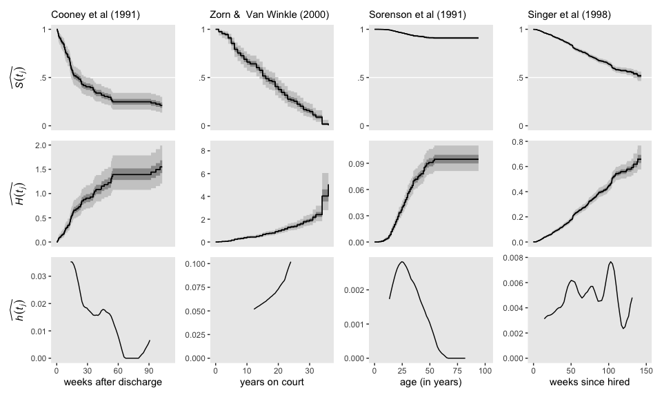<!-- -->

## Reference

[Singer, J. D., & Willett, J. B. (2003). *Applied longitudinal data
analysis: Modeling change and event occurrence*. New York, NY, US:
Oxford University
Press.](https://www.oxfordscholarship.com/view/10.1093/acprof:oso/9780195152968.001.0001/acprof-9780195152968)

## Session info

``` r
sessionInfo()
```

    ## R version 3.6.3 (2020-02-29)
    ## Platform: x86_64-apple-darwin15.6.0 (64-bit)
    ## Running under: macOS Catalina 10.15.3
    ## 
    ## Matrix products: default
    ## BLAS:   /Library/Frameworks/R.framework/Versions/3.6/Resources/lib/libRblas.0.dylib
    ## LAPACK: /Library/Frameworks/R.framework/Versions/3.6/Resources/lib/libRlapack.dylib
    ## 
    ## locale:
    ## [1] en_US.UTF-8/en_US.UTF-8/en_US.UTF-8/C/en_US.UTF-8/en_US.UTF-8
    ## 
    ## attached base packages:
    ## [1] stats     graphics  grDevices utils     datasets  methods   base     
    ## 
    ## other attached packages:
    ##  [1] survival_3.1-12      patchwork_1.0.0      tidybayes_2.0.3.9000 brms_2.12.0         
    ##  [5] Rcpp_1.0.4.6         forcats_0.5.0        stringr_1.4.0        dplyr_0.8.5         
    ##  [9] purrr_0.3.4          readr_1.3.1          tidyr_1.0.2          tibble_3.0.1        
    ## [13] ggplot2_3.3.0        tidyverse_1.3.0     
    ## 
    ## loaded via a namespace (and not attached):
    ##   [1] colorspace_1.4-1     ellipsis_0.3.0       ggridges_0.5.2       rsconnect_0.8.16    
    ##   [5] markdown_1.1         base64enc_0.1-3      fs_1.4.1             rstudioapi_0.11     
    ##   [9] farver_2.0.3         rstan_2.19.3         svUnit_1.0.3         DT_0.13             
    ##  [13] fansi_0.4.1          mvtnorm_1.1-0        lubridate_1.7.8      xml2_1.3.1          
    ##  [17] splines_3.6.3        bridgesampling_1.0-0 knitr_1.28           shinythemes_1.1.2   
    ##  [21] bayesplot_1.7.1      jsonlite_1.6.1       broom_0.5.5          dbplyr_1.4.2        
    ##  [25] shiny_1.4.0.2        compiler_3.6.3       httr_1.4.1           backports_1.1.6     
    ##  [29] assertthat_0.2.1     Matrix_1.2-18        fastmap_1.0.1        cli_2.0.2           
    ##  [33] later_1.0.0          htmltools_0.4.0      prettyunits_1.1.1    tools_3.6.3         
    ##  [37] igraph_1.2.5         coda_0.19-3          gtable_0.3.0         glue_1.4.0          
    ##  [41] reshape2_1.4.4       cellranger_1.1.0     vctrs_0.2.4          nlme_3.1-144        
    ##  [45] crosstalk_1.1.0.1    xfun_0.13            ps_1.3.2             rvest_0.3.5         
    ##  [49] mime_0.9             miniUI_0.1.1.1       lifecycle_0.2.0      gtools_3.8.2        
    ##  [53] zoo_1.8-7            scales_1.1.0         colourpicker_1.0     hms_0.5.3           
    ##  [57] promises_1.1.0       Brobdingnag_1.2-6    parallel_3.6.3       inline_0.3.15       
    ##  [61] shinystan_2.5.0      yaml_2.2.1           gridExtra_2.3        loo_2.2.0           
    ##  [65] StanHeaders_2.21.0-1 stringi_1.4.6        dygraphs_1.1.1.6     pkgbuild_1.0.7      
    ##  [69] rlang_0.4.5          pkgconfig_2.0.3      matrixStats_0.56.0   evaluate_0.14       
    ##  [73] lattice_0.20-38      rstantools_2.0.0     htmlwidgets_1.5.1    labeling_0.3        
    ##  [77] tidyselect_1.0.0     processx_3.4.2       plyr_1.8.6           magrittr_1.5        
    ##  [81] R6_2.4.1             generics_0.0.2       DBI_1.1.0            mgcv_1.8-31         
    ##  [85] pillar_1.4.3         haven_2.2.0          withr_2.2.0          xts_0.12-0          
    ##  [89] abind_1.4-5          modelr_0.1.6         crayon_1.3.4         arrayhelpers_1.1-0  
    ##  [93] utf8_1.1.4           rmarkdown_2.1        grid_3.6.3           readxl_1.3.1        
    ##  [97] callr_3.4.3          threejs_0.3.3        reprex_0.3.0         digest_0.6.25       
    ## [101] xtable_1.8-4         httpuv_1.5.2         stats4_3.6.3         munsell_0.5.0       
    ## [105] viridisLite_0.3.0    shinyjs_1.1
